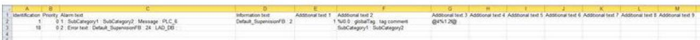
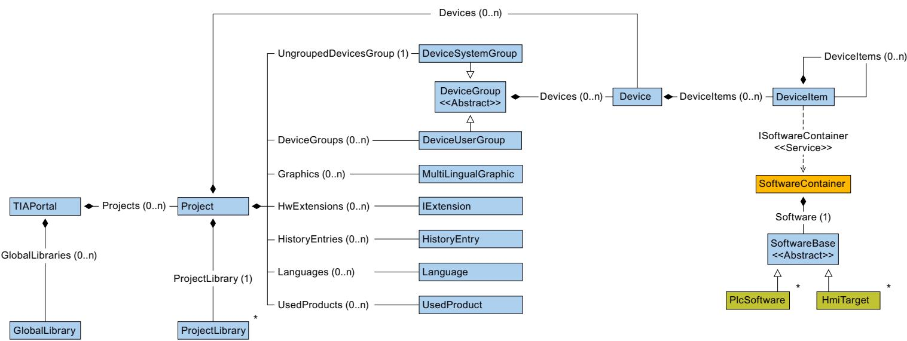
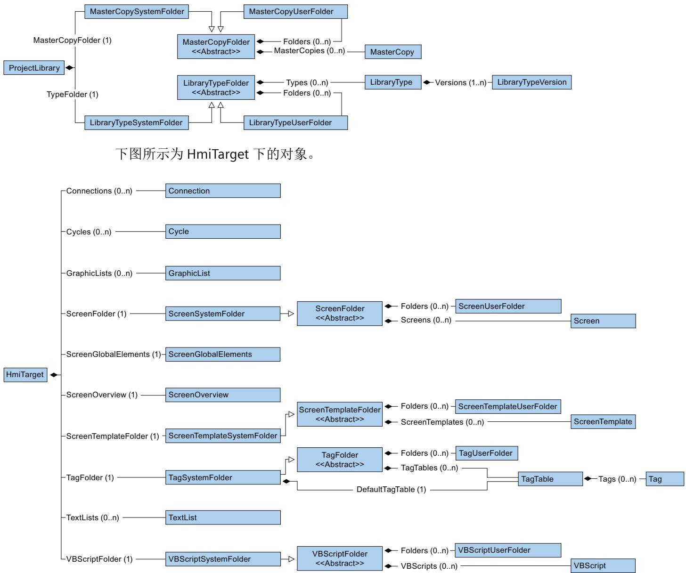
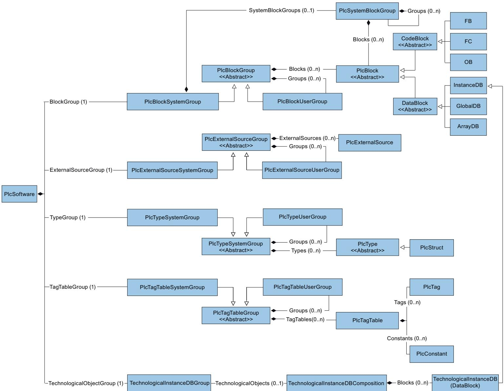
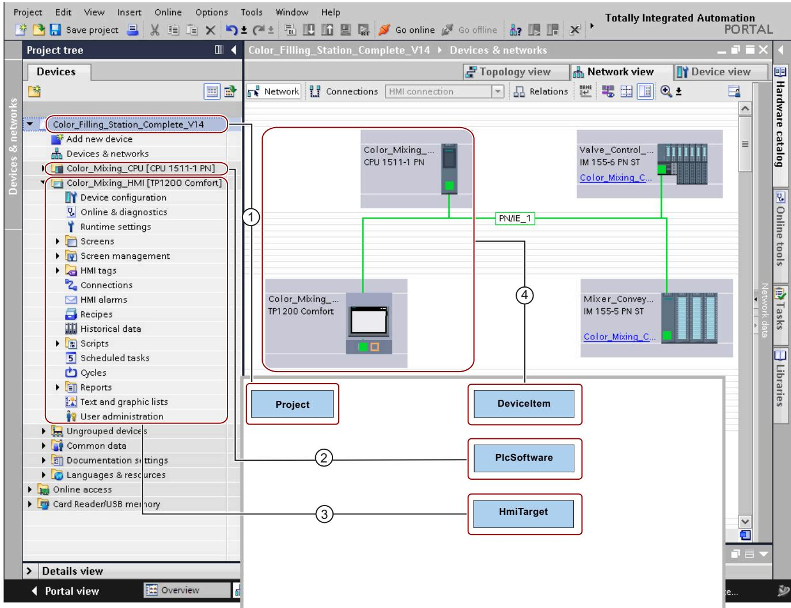

# 7 主要变化


## 7.1 TIA Portal Openness V19 中有关长期稳定性的主要更改

如果考虑了关于跨版本编程的提示且不将 Openness 应用程序重新编译为 V19，则应用程序在任何计算机上都可以无限制运行，即使只安装了 TIA Portal V19 也如此。
如果将 Openness 应用程序重新编译为 V19，则需要使用 V19 的 Siemens.Engineering.dll 重新编译应用程序。在某些情况下，可能需要修改应用程序的代码。
自 TIA Portal V19 起，用户不再可使用 CAx 导出和导入的命令行工具。
自 TIA Portal V19 起，无论其在 TIA Portal 中的值如何，Profinet/以太网接口端口的标签值都将在没有空格的情况下导出。例如：如果标签 = P1 R，AML 文件的标签将为 = P1R
在 TIA Portal V18 更新 2 及后续版本中，IO Link 端口将以“C/Q<n>”的标签值进行交换，其中 n为端口号。例如：C/Q1、C/Q2 等。
对于 TIA Portal V18 更新 2 中 IO Link 组态的 AML 交换（通过 S7-PCT 进行），使用“S7-PCT3.5 SP3 更新 3”或更高版本。
对于 TIA Portal V19，集中式 UMAC 功能将激活，但自 V3.1 起的所有 PLC 固件版本，WebServerUserManagement 将被禁用。
然而，在 TIA Portal V18 及之前版本中，WebServerUserManagement 将是可操作的，而集中式 UMAC 功能将在 PLC 固件版本 V3.0 及之前版本中处于非活动状态。

## 7.1 TIA Portal Openness V19 中有关长期稳定性的主要更改


### 通过 PLC 上的 UMAC 进行在线合法调用的行为更改

如果 Openness 应用程序在 TIA Portal Openness API <= 18 的情况下运行，通过 Openness 的在线合法性仍然可通过下载和上传组态实现。但前提是使用的 PLC 受到传统保护级别合法性的保护。
对于 TIA Portal Openness API >= V19，所有合法性调用（特别是 PLC 上的新 UMAC）将被传递给ConnectionConfiguration类的在线合法性事件的事件处理程序。如果用户代码未处理OnlineAuthenticationConfiguration 类型，则会对特定功能（例如，下载或上传）的回调方法进行第二次调用。但只有旧的保护机制（V18 及之前的版本）可被处理。
对于 TIA Portal V19，设置密码时应用严格密码策略。这也适用于 TIA Portal Openness 调用，尤其是设置专有技术保护的情况。如果密码未遵循此策略，则会出现异常。
自 TIA Portal V18 起，在 WinCC Unified Screen Editor 的范围内，所有 MultilingualText 项都从未格式化更改为格式化。
这意味着从现在开始所有文本都必须设置格式。纯文本将被拒绝，并提示异常，例如：

```javascript

Language language = project.LanguageSettings.Languages.Find(new CultureInfo("en-US"));
MultilingualText multilingualToolTipText1 = ((HmiButton)screenItem1).ToolTipText;
MultilingualTextItem multilingualTextItem1 = multilingualToolTipText1.Items.Find(language);
multilingualTextItem1.Text = "<body><p>Modified button text from Openness</p></body>";

```

### 方案的更改，以支持在块中使用 NamedValueTypes

在 TIA Portal V19 中，引入了对命名值类型的支持（仅适用于 S7-1500 PLC 中的软件单元）。在 Openness 中，自 V19 起，SimaticML 方案中引入了一个新的范围
“NamedValueConstant”，以支持在程序块或 PLC 数据类型中使用命名值类型。
在通过 SimaticML 导入/导出期间，PLC 编程工件（程序块、PLC 数据类型）中使用的命名值类型在新范围“NamedValueConstant”中可见。

```xml

<Access Scope="NamedValueConstant" UID="27">
<Constant Name="_.siemens.simatic.Named_value_type_1#UNDEFs" UID="28"/>
</Access>
<Token Text=";" UID="31"/>
<NewLine Num="2" UID="32"/>

```

## 7.2 TIA Portal Openness V17 中有关长期稳定性的主要更改

如果考虑了关于跨版本编程的提示且不将 Openness 应用程序重新编译为 V17，则应用程序在任何计算机上都可以无限制运行，即使只安装了 TIA Portal V17 也如此。
如果将 Openness 应用程序重新编译为 V17，则需要使用 V17 的 SiemensEngineering.dll 重新编译应用程序。在某些情况下，可能需要修改应用程序的代码。

### GetAttribute 实现的更改

对于 TIA Portal Openness V16 及更低版本， GetAttribute/SetAttribute/GetAttributeInfos 实现的可见性取决于类型是否声明“支持动态属性”。要访问 GetAttribute/SetAttribute/GetAttributeInfos 等方法，类型应支持动态属性。如果类型不支持动态属性，则需要显式地强制转换为 IEngineeringObject 才能获得方法 GetAttribute/SetAttribute/GetAttributeInfos。
以下代码示例显示了 TIA Portal Openness V16 及更低版本的代码执行情况：

```javascript

var projectAttributeInfos = ((IEngineeringObject) project).GetAttributeInfos();

```

对于 TIA Portal Openness V17，IEngineeringObject 的所有方法均对实现
IEngineeringObject 的所有类型隐式实现，因此不需要显式强制转换，所有方法均对用户可见。更改将在所有之前的版本工程组态 dll 中可用，即 V17 中支持 V15、V15.1 和 V16。
对于以下方法，不需要 typecast：
• object GetAttribute(string name) - 获取使用给定名称的属性。
• IList<EngineeringAttributeInfo> GetAttributeInfos() - 返回一系列描述对象不同属性的 EngineeringAttributeInfo 对象。
• IList<object> GetAttributes(IEnumerable<string> names) - 获取给定名称的属性列表。

## 7.2 TIA Portal Openness V17 中有关长期稳定性的主要更改

• void SetAttribute(string name, object value) - 将使用给定名称的属性设置为给定值。
• void SetAttributes(IEnumerable<KeyValuePair<string, object>> attributes) - 将使用给定名称的属性设置为属性中指示的给定值
引入这一更改后，重新编译扩展方法使用的代码后行为会稍有更改。例如，如果已使用扩展方法，且代码已编译到 V17 工程组态 dll，则不会执行来自扩展方法的调用。在这种情况下，需要对代码进行更改，以保持响应行为的兼容性。同样不会出现任何编译器错误。
以下示例代码说明了未执行 GetAttribute 的位置：

```text

static class CustomerExtension
{
public static object GetAttribute(this Project project, string name)
{
    // Customer Logic
    return ((IEngineeringObject)project);
}

```

### 对 AssignInterface API 的更改

在 TIA Portal Openness V17 之前的版本中，AssignInterface API 不能用于 TIA PortalOpenness 应用程序中的事务。TIA Portal Openness V17 对该特性进行了更改，可将AssignInterface API 用于事务中。

### 设置主站系统编号

对于 TIA Portal Openness V17，可以在导入 API 期间设置主站系统编号。

### 移除 ExternalSourceCreate 方法

在 TIA Portal Openness V17 之前的版本中，TIA Portal Openness 应用程序中支持来自外部源的创建操作，但会提示“不受支持异常”(Not Supported Exception)。对于 TIA PortalOpenness V17，将移除来自外部源组合的创建操作。

### 移除 SyncRole 属性

在 TIA Portal Openness V17 之前的版本中，“SyncRole”属性对于 IPC627D 设备是只读属性。对于 TIA Portal Openness V17，将从“SyncRole”属性没有任何作用的设备中删除此属性。

### 安全编译特性变更

在 TIA Portal Openness V17 之前的版本中，不支持通过设定的密码/无用户登录实现故障安全，并会得到编译错误结果。对于 TIA Portal Openness V17，该特性由编译错误变为异常。

### 移除下载组态

对于 TIA Portal Openness V17，如果未安装 STEP7，则 STEP7 特定的下载组态不再 TIA PortalOpenness 中继续提供。

### 导入 OB MC-Transformation 时属性“SecondaryType”的相关限制

对于 TIA Portal Openness V17，导入 OB MC-Transformation 时，属性“SecondaryType”需要采用确切字符串值“Transformation”（也是导出的值）。

### 导出 ProDiag 信息

对于 TIA Portal Openness V17，可通过公共 Openness API 以 CSV 格式导出 ProDiag FB 中的ProDiag 报警消息。
可在 Microsoft Excel 中查看输出结果。


### PlcAlarmTextProvider 中 ExportInstanceTextsToXlsx 和 ExportToXlsx 方法的特性变化

对于 TIA Portal Openness V17 之前的版本，如果文件（以路径参数形式提供）已存在，导出期间将覆盖此文件。TIA Portal Openness V17 中该特性已更改，如果文件（以路径参数形式提供）已存在，将发生 UserException。

### Export API 特性已改为可接受特定路径

对于 TIA Portal Openness V17 之前的版本，Export API 中不允许使用特定路径。指定特定路径时，将发生 EngineeringTargetInvocationDetailException.SpecificPathException 异常。
TIA Portal Openness V17 中该特性已更改，允许使用特定路径。
以下是 TIA Portal Openness API 允许使用特定路径的案例。
<table><tr><td>输入路径</td><td>TIA Poral Openness V17</td></tr><tr><td>D:SampleDirectory\Sample</td><td>未发生异常</td></tr><tr><td>D:\SampleDirectory/Sample</td><td>未发生异常</td></tr><tr><td>D:\SampleDirectory\Sample</td><td>未发生异常</td></tr><tr><td>D:\SampleDirectory\Sample</td><td>未发生异常</td></tr><tr><td>D:\\SampleDirectory\Sample</td><td>未发生异常</td></tr><tr><td>D:\\SampleDirectory\Sample</td><td>未发生异常</td></tr><tr><td>D:\\\\SampleDirectory\\Sample</td><td>未发生异常</td></tr><tr><td>D:\\SampleDirectory\\Sample</td><td>未发生异常</td></tr><tr><td>D:\\SampleDirectory\\Sample</td><td>未发生异常</td></tr><tr><td>D:\\SampleDirectory\\Sample</td><td>未发生异常</td></tr><tr><td>D:\\SampleDirectory\\Sample</td><td>未发生异常</td></tr><tr><td>//SampleDirectory/Sample</td><td>未发生异常</td></tr><tr><td>&quot;SampleDirectory&quot;</td><td>导出 Openness API 发生EngineeringTargetInvocationDetailException.SpecificPathException。</td></tr><tr><td>//SampleDirectory&quot;</td><td>导出 Openness API 发生EngineeringTargetInvocationDetailException.SpecificPathException。</td></tr><tr><td>&quot;D:\SampleDirectory\Sample...\otherSample&quot;</td><td>导出 Openness API 发生EngineeringTargetInvocationDetailException.SpecificPathException。</td></tr><tr><td>&quot;SampleDirectory\Sample&quot;</td><td>导出 Openness API 发生EngineeringTargetInvocationDetailException.SpecificPathException。</td></tr><tr><td>&quot;..Sample&quot;、&quot;SampleName&quot;</td><td>导出 Openness API 发生EngineeringTargetInvocationDetailException.SpecificPathException。</td></tr><tr><td>&quot;D:\SampleDirectory\Sample&quot;</td><td>导出 Openness API 发生EngineeringTargetInvocationDetailException.SpecificPathException。</td></tr></table>
7.2 TIA Portal Openness V17 中有关长期稳定性的主要更改
<table><tr><td>输入路径</td><td>TIA Poral Openness V17</td></tr><tr><td>D:\SampleDirectory\Sample</td><td>导出 Openness API 发生EngineeringTargetInvocationDetailException.SpecificPathException。</td></tr><tr><td>D:\SampleDirectory\Sample</td><td>导出 Openness API 发生EngineeringTargetInvocationDetailException.SpecificPathException。</td></tr></table>

### ScreenNumber 属性的数据类型的更改

对于 TIA Portal Openness V17 Siemens.Engineering.dll，ScreenNumber 属性的数据类型从Byte 更改为 UInt16。

### CAx 导出/导入特性变更

对于 TIA Portal Openness V17，CAx 导出/导入存在以下变更：
• 支持在 GSD/GSDML 设备上使用自定义（用户特定）属性。
• 用户可在多用户项目和受 UMAC 保护的项目中交换 CAx 数据。
• 支持与标准化 TypeIdentifier 交换 CAx 数据。此选项通过 CAx 用户界面进行控制。
• AML 文件中 PN PN 耦合器设备的结构已更改。这是为了避免交换工具（TIAP 和 ECAD 系统）的内部结构存在差异，并将通用结构用于数据交换。
• 支持导出/导入 Plus PC 站。备注：不能与 EPLAN 及其它工具进行数据交换，因为 AR APC中未定义额外定义的属性。
• 导入过程中，如果由于 TIAP 内部操作的原因导致起始地址/网络地址做出调整，则向用户发送地址重新分配通知。例如：任何子网/io 系统连接失败，地址重叠等。此选项通过 CAx用户界面“设置”(Settings) 进行控制。
• 如果用户导入的 AML 文件包含启用了 OMS 和安全功能的 PLC，则发送用户通知警告。
• 引入了用于所有以太网节点的新属性“ProfinetDeviceName”。
• 具有可插拔profinet/profibus接口设备项的设备始终使用“隔离”角色导出。TIA 项目中的可插拔接口设备项应作为具有设备项角色的可插拔设备项导出（具有角色CommunicationInterface 的“新”子设备项）。但始终支持导入旧版 AML 文件。
• 支持条件更宽松（与设备项中的 IoType 顺序无关）的起始地址导入。
• 支持使用“TemplateReference”导入紧凑模块，但有一定的限制。

## 7.3 TIA Portal Openness V16 中的主要更改


### 支持新编程语言 CEM 的块

在 TIA Portal Openness V17 中，推出新编程语言 CEM（因果矩阵）。对于Siemens.Engineering.dll < V17，如果出现访问属性的块实例，编程语言将出现异常。在Engineering.dll V17 中，可返回正确的编程语言。在 Siemens.Engineering.dll 中，编程语言CEM 的块不支持导出方法。

### 支持新库类型“统一面板”和“统一图形”

在 TIA Portal Openness V17 中，推出新库类型“统一面板”和“统一图形”。Openness 中不支持这些类型。如果出现这些类型的实例，则所有版本的 Siemens.Engineering.dll 都会出现异常。

## 7.3 TIA Portal Openness V16 中的主要更改

如果考虑了关于跨版本编程的提示且不将项目升级到 V16，应用程序在任何计算机上都可以没有任何限制的情况下运行，即使只安装了 TIA Portal V16。
如果将项目升级到 V16，则需要使用 V16 的 SiemensEngineering.dll 重新编译应用程序。在某些情况下，可能需要修改应用程序的代码

### 使用导出选项“无”(None) 导出数据块

自 TIA Portal Openness V16 起，只读数据块的成员将只能作为信息项导出。不能继续在导出的 xml 中更改这些属性。

### 按钮面板和按键面板的 I&M 和 Profisafe 地址属性

自 TIA Portal Openness V16 起，按钮面板和按键面板的 I&M 和 Profisafe 地址属性将可在模块级访问。

### 导出存储器布局特性的 DB 特性

自 TIA Portal Openness V16 IDB FB 起，存储器布局特性的 ArrayDB 和 Graph 块特性将通过ReadOnly=“True”导出.

### 单元中的 Access 属性

自 TIA Portal Openness V16 起，支持在单元中的块、UDT 和变量表中对“Access”属性进行不一致导入和导出。

### SimaticML XML 文件架构定义

自 TIA Portal Openness V16 起，SimaticML XML 文件架构定义中布尔型属性节点的SystemDefined属性默认值变为 False。但此更改不会影响任何 XML 导出/导入功能。此更改仅对于尝试使用架构文件生成 XML 的用户很重要。

### 强化块和类型的 XML 导入方法

TIA Portal Openness V16 及以上版本通过附加参数（即 path、importOptions 和swImportOptions）和一个新的枚举值 IgnoreUnitAttribute 来扩展新导入方法。可使用swImportOptions.IgnoreUnitAttributes 将块从单元导入非单元组合。

### AML GUID 存储在 App ID 中

自 TIA Portal Openness V16 起，AML GUID 将存储在 CustomIdentity (App ID) 属性而非注释中，以支持设备和模块的双向交换过程。

### HMI 对象类别的名称

对于 TIA Portal Openness V16 及以上版本，下表显示了 HMI 对象类别所需名称更改的列表：
<table><tr><td>类别名称</td><td>新类别名称</td></tr><tr><td>AnalogAlarmComposition</td><td>HmiAnalogAlarmComposition</td></tr><tr><td>DiscreteAlarmComposition</td><td>HmiDiscreteAlarmComposition</td></tr><tr><td>AlarmClassComposition</td><td>HmiAlarmClassComposition</td></tr><tr><td>DataLogComposition</td><td>HmiDataLogComposition</td></tr><tr><td>AlarmLogComposition</td><td>HmiAlarmLogComposition</td></tr><tr><td>LoggingTagComposition</td><td>HmiLoggingTagComposition</td></tr><tr><td>LogConfiguration</td><td>DataLog</td></tr></table>
7.4 TIA Portal Openness V15.1 中的主要更改

### 添加/删除 DataLog/AlarmLog 的特性名称

自 TIA Portal Openness V16 起，以下新特性“StorageDevice”和“StorageFolder”已添加到DataLog/AlarmLog 中，而“StoragePath”和“RequireExplicitRelease”特性分别从 DataLog/AlarmLog 和 ScreenItems 中删除。
可以找到 StorageDevice 和 StorageFolder 特性的更新代码示例，如下所示：

```java

HmiDataLog dataLog = hmiSoftware.DataLogs.Find("DataLog1");
dataLog.Settings.StorageDevice = DeviceNode.Local;
dataLog.Settings.StorageFolder = @"D:\workdir\DataLogs";

```

### 从 HMI 变量中删除特性名称

自 TIA Portal Openness V16 起，HMI 变量对象中删除了“DisplayName”特性。

## 7.4 TIA Portal Openness V15.1 中的主要更改

更改
如果考虑了关于跨版本编程的提示且不将项目升级到 V15.1，应用程序在任何计算机上都可以在没有任何限制的情况下运行，即使只安装了 TIA Portal V15.1。
如果将项目升级到 V15.1，则需要使用 V15.1 的 SiemensEngineering.dll 重新编译应用程序。在某些情况下，可能需要修改应用程序的代码

### 类型标识符

已重命名“带端口的 PC”和“带端口的以太网设备”的机架和设备的类型标识符。
<table><tr><td>带端口的PC</td><td>V15.1 之前版本的类型标识符</td><td>V15.1 及更高版本的类型标识符</td></tr><tr><td>设备</td><td>System:DesktopPC.Device</td><td>System:Device.DesktopPC</td></tr><tr><td>机架</td><td>System:DesktopPC.Rack</td><td>System:Rack.DesktopPC</td></tr><tr><td>设备项</td><td>System:DesktopPC.Portdenotes the number of ports</td><td>System:DeviceItem.EthernetDevice.Portdenotes the number of ports</td></tr><tr><td>带端口的以太网设备</td><td></td><td></td></tr><tr><td>设备</td><td>System:DummyPC.Device</td><td>System:Device.EthernetDevice</td></tr><tr><td>机架</td><td>System:Rack.DummyPC</td><td>System:Rack.EthernetDevice</td></tr><tr><td>设备项</td><td>System:DummyPC.Portdenotes the number of ports</td><td></td></tr></table>

### 尝试连接至 TIA Portal 时发生故障

强化了尝试连接至 TIA Portal 时发生故障的情况下的消息，消息内容更加具体。

### 跨线程操作

对 Openness 对象的访问本质上并不具有线程安全性。
如果使用多线程来提高 Openness 应用程序的性能，建议使用 MTA 创建 TIA Portal 实例。如果在 STA 线程中创建或附加 TIA Portal，则须从同一 STA 线程访问与该 Portal 实例关联的所有 Openness 对象；否则，将会发生异常。

### 子模块不具有属性 Author 和 TypeName

属性 Author 和 TypeName 已经从无法插入的子模块中移除。

### 打开全局库

自 TIA Portal Openness V15.1 起，可以通过 Openness 独立于库的持久预览模式打开全局库。

### 应用程序退出代码

当出现应用程序退出代码时
• 在 TIA Portal Openness V15 及之前的版本中，会显示不可恢复的异常
• 自 TIA Portal Openness V15.1 起，对于已知错误代码将显示EngineeringRuntimeException 或 EngineeringTargetInvocationException，若错误代码未知，则显示不可恢复的异常。

### 无名参数的架构扩展

即使在非正式调用中使用 ENO，也可以导入 SCL 块。
7.4 TIA Portal Openness V15.1 中的主要更改

### 索引参数的标头

自 TIA Portal Openness V15.1 起，无法通过 Openness 更改索引参数的标头。
一些驱动参数以索引参数为模型，因为这些参数为一个主题提供多个数据。在 Openness 中建立索引驱动参数模型时遵循各参数的驱动特定定义，因为它们已在相应的列表手册中定义。
索引参数采用以下模式：
标题项：各个不带任何索引的驱动参数。标题项包含描述性文本，用于告知所引用索引驱动参数的语义。由于标题项不包含实际值，因此为只读项。
索引项：标题项下方驱动参数的索引项。索引项提供的描述性文本定义特定索引项的语义（只读）。此外，索引项还提供可通过 Openness API 检索的值。如果各索引参数也可写入，则还可通过 Openness API 设置写入值。

### 属性 TransmissionRateAndDuplex

更正了属性 TransmissionRateAndDuplex 的一些错误枚举值，例如，删除了枚举值
“POFPCF100MbpsFullDuplexLD”，新增了“POFPCF100MbpsFullDuplex" ”. 有关详细信息，请参见端口间连接的可组态属性 (页 218)

### 受专有技术保护的块的属性 AutoNumber

自 V15.1 起，如果块受专有技术保护，则无法通过 TIA Portal Openness 更改属性AutoNumber。

### ChannelInfo 界面列出的通道数量

对于 TIA Portal Openness V15 及之前的版本，ChannelInfo 界面列出的某些模块的可用通道数不正确。

### 对 ProDiag 函数块属性的访问

通过 TIA Portal Openness 可授权访问以下 ProDiag 函数块属性：
• 版本
• 初始值采集
• 使用中央时间戳

### 导入/导出故障安全块

无法导入之前版本中的故障安全块。
自 TIA Portal Openness V15.1 起，将禁止导出系统生成的故障安全块。

### R/H 系统

可在设备上下载或访问 R/H 设备。
在线和下载提供程序不可用于单独的 R/H PLC (DeviceItem)。
对于 R/H 系统的 PLC2，SoftwareContainer 将不可用。

## 7.5 TIA Portal Openness V15 中的主要更改

更改
如果考虑了关于跨版本编程的提示且不将项目升级到 V15，应用程序在任何计算机上都可以没有任何限制的情况下运行，即使只安装了 TIA Portal V15。
如果将项目升级到 V15，则需要使用 V15 的 SiemensEngineering.dll 重新编译应用程序。
在某些情况下，需要修改应用程序的代码
• DeviceItemComposition 中组合的行为更改
• ASi 地址的 BitOfset
• Exception 类别
• 系统 UDT 的系统文件夹
• 子模块不具有属性 Author 和 TypeName
• 最后一次修改的时间戳
• GRAPH 块的导出 XML
• 导入变量表
• 修改 PLC 的非故障安全相关属性
• 设置安全密码时修改 F 参数
• 访问 S7 1200 CPU 中的 TO 对象

## 7.5 TIA Portal Openness V15 中的主要更改


### DeviceItemComposition 中组合的行为更改

DeviceItemCompositon 中的以下组合已更改为动态行为。如果通过 TIA Portal 的用户界面添加或删除了元素，则立即更新组合。
• IoSystem - ConnectedIoDevices
• Subnet - IoSystems
• Subnet - Nodes
• NetworkInterface - Nodes
• NetworkInterface - Ports
• NetworkPort - ConnectedPorts
• SubnetOwner - Subnets

### ASi 地址的 BitOfset

如果模块具有两个地址对象的输入地址和输出地址，则将提供正确的属性BitOfset。
如果一个模块具有通道，则不会向该通道提供属性BitOfset。

### Exception 类别

已从 exception 类别中删除 ServiceID 和 MessageID
属性 Author 和 TypeName 已经从无法插入的子模块中移除。

### 系统 UDT 的系统文件夹

为系统 UDT 的系统文件夹提供相应的文件夹和组合。这也会导致比较结果的层级结构发生变化。

### 最后一次修改的时间戳

如果升级期间，对象发生了更改，则最后一次修改的时间戳也将发生更改。

### GRAPH 块的导出 XML

GRAPH 块的导出 XML 包含一个附加的空操作：<Actions />

### 导入变量表

设置变量属性不再依赖于数据类型。

### 修改 PLC 的非故障安全相关属性

即使已设置安全密码，也可通过 TIA Portal Openness 修改 PLC 的所有非故障安全相关属性。

### 设置安全密码时修改 F 参数

F-IO 的 F 参数仅当未设置安全密码时才可以修改。

### 访问 S7 1200 CPU 中的 TO 对象

对 TO 对象 TO\_PositioningAxis 和 TO\_CommandTable 的数组变量的访问已经更改。有关详细信息，请参见关于 S7-1200 Motion Control 的章节。
7.6 V14 SP1 中的主要变更

## 7.6 V14 SP1 中的主要变更


### 7.6.1 V14 SP1 中的主要变更

简介
TIA Portal Openness API 对象模型 V14 SP1 中做出了以下更改，可能会影响现有应用程序：
<table><tr><td>更改</td><td>所需程序代码调整</td></tr><tr><td>提升主站副本的处理能力</td><td>CreateFrom操作会在库中创建一个基于新对象的主站副本,并将它置于调用该操作的组成中。CreateFrom操作仅支持包含单个对象的主副本。返回类型与相应组成类型相对应。以下组成支持CreateFrom:Siemens.Engineering.HW.DeviceCompositionSiemens.Engineering.HW.DeviceItemCompositionSiemens.Engineering.SW.Blocks.PlcBlockCompositionSiemens.Engineering.SW.Tags.PlcTagTableCompositionSiemens.Engineering.SW.Tags.PlcTagCompositionSiemens.Engineering.SW.Types.PlcTypeCompositionSiemens.Engineering.SW.TechnologicalObjects.TechnologicalInstanceDBCompositionSiemens.Engineering.SW.Tags.PlcUserConstantCompositionSiemens.Engineering.Hmi.Tag.TagTableCompositionSiemens.Engineering.Hmi.Tag.TagCompositionSiemens.Engineering.Hmi.Screen.ScreenCompositionSiemens.Engineering.Hmi.Screen.ScreenTemplateCompositionSiemens.Engineering.Hmi.RuntimeScripting.VBScriptCompositionSiemens.Engineering.HW.SubnetCompositionSiemens.Engineering.HW.Device.UserGroupCompositionSiemens.Engineering.SW.Blocks.PlcBlockUserGroupCompositionSiemens.Engineering.SW.ExternalSources.PlcExternalSourceUserGroupCompositionSiemens.Engineering.SW.Tags.PlcTagTableUserGroupCompositionSiemens.Engineering.SW.Types.PlcTypeUserGroupComposition</td></tr><tr><td>提升全局库处理能力</td><td>全局库内的现有操作现在可以修改操作,例如,从全局库中删除主副本。UpdateProject和UpdateLibrary不再使用UpdatePathsMode和DeleteUnusedVersionsMode参数。更新后不会删除未使用的版本</td></tr></table>

## 7.6 V14 SP1 中的主要变更

<table><tr><td>更改</td><td>所需程序代码调整</td></tr><tr><td>更改 System.String 至 System.IO.FileInfo更改 System.String 至 System.IO.DirectoryInfo</td><td>所有必须指定字符串路径的事件均使用 FileInfo 路径或DirectoryInfo 路径。例如:打开项目打开库创建项目创建全局库...</td></tr></table>

### 对象模型中的新项目

<table><tr><td>名称</td><td>类型</td><td>命名空间</td><td>注释</td></tr><tr><td>PlcUserConstant</td><td>类别</td><td>Siemens.Engineering.SW.Tags</td><td>由 PlcConstant 拆分而来。</td></tr><tr><td>PlcUserConstantComposition</td><td>类别</td><td>Siemens.Engineering.SW.Tags</td><td>由 PlcConstantComposition 拆分而来。</td></tr><tr><td>PlcSystemConstant</td><td>类别</td><td>Siemens.Engineering.SW.Tags</td><td>由 PlcConstant 拆分而来。</td></tr><tr><td>PlcSystemConstantComposition</td><td>类别</td><td>Siemens.Engineering.SW.Tags</td><td>由 PlcConstantComposition 拆分而来。</td></tr><tr><td>MultilingualTextItem</td><td>类别</td><td>Siemens.Engineering</td><td>访问多语言文本</td></tr><tr><td>MultilingualTextItemComposition</td><td>类别</td><td>Siemens.Engineering</td><td>访问多语言文本</td></tr><tr><td>TiaPortalTrustAuthority.FeatureTokens</td><td>枚举值</td><td>Siemens.Engineering</td><td>访问 TIA Portal 设置。</td></tr><tr><td>TiaPortalSetting</td><td>类别</td><td>Siemens.Engineering.Settings</td><td>访问 TIA Portal 设置。</td></tr><tr><td>TiaPortalSettingComposition</td><td>类别</td><td>Siemens.Engineering.Settings</td><td>访问 TIA Portal 设置。</td></tr><tr><td>TiaPortalSettingsFolder</td><td>类别</td><td>Siemens.Engineering.Settings</td><td>访问 TIA Portal 设置。</td></tr><tr><td>TiaPortalSettingsFolderComposition</td><td>类别</td><td>Siemens.Engineering.Settings</td><td>访问 TIA Portal 设置。</td></tr><tr><td>LanguageAssociation</td><td>类别</td><td>Siemens.Engineering</td><td>访问以激活语言。</td></tr><tr><td>LanguageComposition.Find</td><td>方法</td><td>Siemens.Engineering</td><td>访问以激活语言。</td></tr></table>

### 对象模型中的已修改项

<table><tr><td>名称</td><td>类型</td><td>命名空间</td><td>注释</td></tr><tr><td>PlcConstant</td><td>类别</td><td>Siemens.Engineering.SW.Tags</td><td>发布的 PlcUserConstant 和 PlcSystemConstant 的基本类别。</td></tr><tr><td>PlcTag</td><td>类别</td><td>Siemens.Engineering.SW.Tags</td><td>由 PlcConstantComposition 拆分而来。</td></tr><tr><td>ITargetComparable</td><td>接口</td><td>Siemens.Engineering.Compare</td><td>字符串属性 DataTypeName 而不是开放连接 DataType。</td></tr><tr><td>MultilingualText</td><td>类别</td><td>Siemens.Engineering</td><td>访问多语言文本</td></tr><tr><td>ProjectComposition.Create</td><td>方法</td><td>Siemens.Engineering</td><td>参数更改为使用 DirectoryInfo 和字符串。</td></tr><tr><td>Project.Subnets</td><td>属性</td><td>Siemens.Engineering</td><td>访问子网</td></tr><tr><td>Project.Languages</td><td>属性</td><td>Siemens.Engineering</td><td>移动称为 Siemens.Engineering.LanguageSetti ngs 的一个属性以提供支持语言</td></tr></table>

### 在对象模式中移除项

<table><tr><td>名称</td><td>类型</td><td>命名空间</td><td>注释</td></tr><tr><td>PlcConstantComposition</td><td>类别</td><td>Siemens.Engineering.SW.Tags</td><td>PlcSystemConstantComposition和PlcUserConstantComposition中的拆分。</td></tr><tr><td>CompareResultElement.PathInformation</td><td>属性</td><td>Siemens.Engineering.SW.Tags</td><td>不再使用</td></tr><tr><td>MultilingualText.GetText(CultureInfo cultureInfo)</td><td>方法</td><td>Siemens.Engineering.Compare</td><td>修改访问文本项MultilingualText的原理。</td></tr><tr><td>TiaPortalTrustAuthority.CustomerIdentification</td><td>枚举值</td><td>Siemens.Engineering</td><td>不再使用</td></tr><tr><td>TiaPortalTrustAuthority.ElevatedAccessExtensions</td><td>枚举值</td><td>Siemens.Engineering</td><td>不再使用</td></tr></table>

### 行为更改

<table><tr><td>名称</td><td>类型</td><td>命名空间</td><td>注释</td></tr><tr><td>PlcTag.Export(FileInfo path, ExportOptions options)</td><td>方法</td><td>Siemens.Engineering.SW.Tags</td><td>现在属性 LogicalAddress 的值总是导出至内部助记码。在导入时仍使用德国助记码。</td></tr><tr><td>PlcTag.LogicalAddress</td><td>属性</td><td>Siemens.Engineering.SW.Tags</td><td>现在属性 LogicalAddress 的值总是返回至内部助记码。写入时使用德国助记码。</td></tr></table>

### 7.6.2 对象模型中的主要更改


#### TIA Portal Openness V14 版本的对象模型

为了便于比较 TIA Portal Openness 的新旧对象模型，下图显示了 TIA Portal V14 的对象模型。
该图中显示的对象模型已过时，有关 TIA Portal Openness V14 SP1 的对象模型信息，请[TIA Portal Openness 对象模型](#511-tia-portal-openness-对象模型)”
  
下图所示为 ProjectLibrary 下的对象。
7.6 V14 SP1 中的主要变更  
  
下图所示为 PlcSoftware 下的对象。
7.6 V14 SP1 中的主要变更  

7.6 V14 SP1 中的主要变更
下图显示了对象模型和 TIA Portal 中的项目之间的关系：

① “Project”对象对应于 TIA Portal 中已打开的项目。
② “PlcSoftware”对象属于 "SoftwareBase" 类型 ④，对应于 PLC。该对象的内容对应于项目导航中的 PLC以及对块或 PLC 变量等对象的访问权限。
③ “HmiTarget”对象属于 "SoftwareBase" 类型④，对应于 HMI 设备。该对象的内容对应于项目导航中的HMI 设备以及对画面或 HMI 变量等对象的访问权限。
④ "DeviceItem" 对象对应于“设备和网络”编辑器中的对象。"DeviceItem" 类型的对象可以是一个机架或插入的模块。

### 7.6.3 导向功能的变化

简介
API 对象模型 V14 SP1 中的更改仅与已使用 V14 中 HW Config 的导向功能的用户相关。
TIA Portal Openness API 类型的修改
<table><tr><td>TIA Portal Openness API 类型</td><td>新 TIA Portal Openness API 类型</td></tr><tr><td>Siemens.Engineering.HW.IAddress</td><td>Siemens.Engineering.HW.Address</td></tr><tr><td>Siemens.Engineering.HW.IAddressController</td><td>Siemens.Engineering.HW.Features.AddressController</td></tr><tr><td>Siemens.Engineering.HW.IChannel</td><td>Siemens.Engineering.HW.Channel</td></tr><tr><td>Siemens.Engineering.HW.IDevice</td><td>Siemens.Engineering.HW.Device</td></tr><tr><td>Siemens.Engineering.HW.IDeviceItem</td><td>Siemens.Engineering.HW.DeviceItem</td></tr><tr><td>Siemens.Engineering.HW.IExtension</td><td>Siemens.Engineering.HW.Extensions</td></tr><tr><td>Siemens.Engineering.HW.IGsd</td><td>Siemens.Engineering.HW.Features.GsdObject</td></tr><tr><td>Siemens.Engineering.HW.IGsdDevice</td><td>Siemens.Engineering.HW.Features.GsdDevice</td></tr><tr><td>Siemens.Engineering.HW.IGsdDeviceItem</td><td>Siemens.Engineering.HW.Features.GsdDeviceItem</td></tr><tr><td>Siemens.Engineering.HW.IHardwareObject</td><td>Siemens.Engineering.HW.HardwareObject</td></tr><tr><td>Siemens.Engineering.HW.IHwIdentifier</td><td>Siemens.Engineering.HW.HwIdentifier</td></tr><tr><td>Siemens.Engineering.HW.IHwIdentifierController</td><td>Siemens.Engineering.HW.Features.HwIdentifierController</td></tr><tr><td>Siemens.Engineering.HW.IloConnector</td><td>Siemens.Engineering.HW.IoConnector</td></tr><tr><td>Siemens.Engineering.HW.IloController</td><td>Siemens.Engineering.HW.IoController</td></tr><tr><td>Siemens.Engineering.HW.IloSystem</td><td>Siemens.Engineering.HW.IoSystem</td></tr><tr><td>Siemens.Engineering.HW.IInterface</td><td>Siemens.Engineering.HW.Features.NetworkInterface</td></tr><tr><td>Siemens.Engineering.HW.Extensions.ModuleInformationProvider</td><td>Siemens.Engineering.HW.Utilities.ModuleInformationProvider</td></tr><tr><td>Siemens.Engineering.HW.INode</td><td>Siemens.Engineering.HW.Node</td></tr><tr><td>Siemens.Engineering.HW.OPCUAExportProvider</td><td>Siemens.Engineering.HWUtilities.OpcUaExportProvider</td></tr><tr><td>Siemens.Engineering.HW.IPort</td><td>Siemens.Engineering.HW.Features.NetworkPort</td></tr></table>
7.6 V14 SP1 中的主要变更
<table><tr><td>TIA Portal Openness API 类型</td><td>新 TIA Portal Openness API 类型</td></tr><tr><td rowspan="3">Siemens.Engineering.HW.IRole</td><td>Siemens.Engineering.HW.Features.HardwareFeature</td></tr><tr><td>Siemens.Engineering.HW.Features.DeviceFeature</td></tr><tr><td>Siemens.Engineering.HW. Utilities.ModuleInformationProvider</td></tr><tr><td>Siemens.Engineering.HW.SoftwareBase</td><td>Siemens.Engineering.HW.Software</td></tr><tr><td>Siemens.Engineering.HW.ISubnet</td><td>Siemens.Engineering.HW.Subnet</td></tr><tr><td>Siemens.Engineering.HW.ISoftwareContainer</td><td>Siemens.Engineering.HW.Features.SoftwareContainer</td></tr><tr><td>Siemens.Engineering.HW.ISubnetOwner</td><td>Siemens.Engineering.HW.Features.SubnetOwner</td></tr></table>

#### Enum 的修改

<table><tr><td>TIA Portal Openness API 类型</td><td>数据类型</td><td>新 TIA Portal Openness API 类型</td><td>数据类型</td></tr><tr><td>Siemens.Engineering.HW.Enums.AddressContext</td><td></td><td>Siemens.Engineering.HW.AddressContext</td><td></td></tr><tr><td>Siemens.Engineering.HW.Enums.AddressIoType</td><td></td><td>Siemens.Engineering.HW.AddressIoType</td><td></td></tr><tr><td>Siemens.Engineering.HW.Enums.AttachmentType</td><td></td><td>Siemens.Engineering.HW.MediumAttachmentType</td><td></td></tr><tr><td>Siemens.Engineering.HW.Enums.BaudRate</td><td></td><td>Siemens.Engineering.HW.BaudRate</td><td></td></tr><tr><td>Siemens.Engineering.HW.Enums.BusLoad</td><td></td><td>Siemens.Engineering.HW.CommunicationLoad</td><td></td></tr><tr><td>Siemens.Engineering.HW.Enums.BusProfile</td><td></td><td>Siemens.Engineering.HW.BusProfile</td><td></td></tr><tr><td>Siemens.Engineering.HW.Enums.CableLength</td><td></td><td>Siemens.Engineering.HW.CableLength</td><td></td></tr><tr><td>Siemens.Engineering.HW.Enums.CableName</td><td>ulong</td><td>Siemens.Engineering.HW.CableName</td><td>long</td></tr><tr><td>Siemens.Engineering.HW.Enums.ChannelIoType</td><td>byte</td><td>Siemens.Engineering.HW.ChannelIoType</td><td>int</td></tr><tr><td>Siemens.Engineering.HW.Enums.ChannelType</td><td>byte</td><td>Siemens.Engineering.HW.ChannelType</td><td>int</td></tr></table>
7.6 V14 SP1 中的主要变更
<table><tr><td>TIA Portal Openness API 类型</td><td>数据类型</td><td>新 TIA Portal Openness API 类型</td><td>数据类型</td></tr><tr><td>Siemens.Engineering.HW.Enums.DeviceItemClassifications</td><td></td><td>Siemens.Engineering.HW.DeviceItemClassifications</td><td></td></tr><tr><td>Siemens.Engineering.HW.Enums.InterfaceOperatingModes</td><td></td><td>Siemens.Engineering.HW.InterfaceOperatingModes</td><td></td></tr><tr><td>Siemens.Engineering.HW.Enums.IpProtocolSelection</td><td></td><td>Siemens.Engineering.HW.IpProtocolSelection</td><td></td></tr><tr><td>Siemens.Engineering.HW.Enums.MediaRedundancyRole</td><td></td><td>Siemens.Engineering.HW.MediaRedundancyRole</td><td></td></tr><tr><td>Siemens.Engineering.HW.Enums.NetType</td><td></td><td>Siemens.Engineering.HW.NetType</td><td></td></tr><tr><td>Siemens.Engineering.HW.Enums.ProfinetUpdateTimeTimeMode</td><td></td><td colspan="2">已删除</td></tr><tr><td>Siemens.Engineering.HW.Enums.RtClass</td><td>byte</td><td>Siemens.Engineering.HW.RtClass</td><td>int</td></tr><tr><td>Siemens.Engineering.HW.Enums.SignalDelaySelection</td><td>byte</td><td>Siemens.Engineering.HW.SignalDelaySelection</td><td>int</td></tr><tr><td>Siemens.Engineering.HW.Enums.SyncRole</td><td>byte</td><td>Siemens.Engineering.HW.SyncRole</td><td>int</td></tr><tr><td>Siemens.Engineering.HW.Enums.TransmissionRateAndDuplex</td><td>uint</td><td>Siemens.Engineering.HW.TransmissionRateAndDuplex</td><td>int</td></tr></table>
Siemens.Engineering.HW.IoConnect 的属性值的修改
<table><tr><td>属性</td><td>数据类型</td><td>新的名称</td><td>数据类型</td></tr><tr><td>ProfinetUpdateTimeMode</td><td>ProfinetUpdateTimeMode</td><td>PnUpdateTimeAutoCalculation</td><td>bool</td></tr><tr><td>ProfinetUpdateTime</td><td></td><td>PnUpdateTime</td><td></td></tr><tr><td>AdaptUpdateTime</td><td></td><td>PnUpdateTimeAdaption</td><td></td></tr><tr><td>WatchdogFactor</td><td></td><td>PNWatchdogFactor</td><td></td></tr><tr><td></td><td></td><td>DeviceNumber</td><td>string</td></tr></table>

#### Siemens.Engineering.HW.IoController 的属性值的修改

<table><tr><td>属性</td><td>数据类型</td><td>新的名称</td><td>数据类型</td></tr><tr><td></td><td></td><td>DeviceNumber</td><td>string</td></tr></table>
7.6 V14 SP1 中的主要变更
Siemens.Engineering.HW.Node 的属性值的修改
<table><tr><td>属性</td><td>数据类型</td><td>新的名称</td><td>数据类型</td></tr><tr><td>HighestAddress</td><td></td><td colspan="2">已删除,仅适于子网</td></tr><tr><td>TransmissionSpeed</td><td></td><td colspan="2">已删除,仅适于子网</td></tr><tr><td>IsoProtocolUsed</td><td></td><td>UseIsoProtocol</td><td></td></tr><tr><td>IpProtocolUsed</td><td></td><td>UseIpProtocol</td><td></td></tr><tr><td>RouterAddressUsed</td><td></td><td>UseRouter</td><td></td></tr><tr><td>PnDeviceNameAutoGene rated</td><td></td><td>PnDeviceNameAutoGeneration</td><td></td></tr><tr><td>DeviceNumber</td><td></td><td colspan="2">已删除,移动到 IoConnector/IoController</td></tr></table>
Siemens.Engineering.HW.Subnet 的属性值的修改
<table><tr><td>属性</td><td>数据类型</td><td>新的名称</td><td>数据类型</td></tr><tr><td>HighestAddress</td><td>byte</td><td>HighestAddress</td><td>int</td></tr><tr><td>CableConfiguration</td><td></td><td>PbCableConfiguration</td><td></td></tr><tr><td>RepeaterCount</td><td></td><td>PbRepeaterCount</td><td></td></tr><tr><td>CopperCableLength</td><td></td><td>PbCopperCableLength</td><td></td></tr><tr><td>OpticalComponentCount</td><td></td><td>PbOpticalComponentCount</td><td></td></tr><tr><td>OpticalCableLength</td><td></td><td>PbOpticalCableLength</td><td></td></tr><tr><td>OpticalRingEnabled</td><td></td><td>PbOpticalRing</td><td></td></tr><tr><td>OlmP12</td><td></td><td>PbOlmP12</td><td></td></tr><tr><td>OlmG12</td><td></td><td>PbOlmP12</td><td></td></tr><tr><td>OlmG12Eec</td><td></td><td>PbOlmG12Eec</td><td></td></tr><tr><td>OlmG121300</td><td></td><td>PbOlmG121300</td><td></td></tr><tr><td>AdditionalNetworkDevices</td><td></td><td>PbAdditionalNetworkDevices</td><td></td></tr><tr><td>AdditionalDpMaster</td><td>byte</td><td>PbAdditionalDpMaster</td><td>int</td></tr><tr><td>TotalDpMaster</td><td>byte</td><td>PbTotalDpMaster</td><td>int</td></tr><tr><td>AdditionalPassiveDevice</td><td>byte</td><td>PbAdditionalPassiveDevice</td><td>int</td></tr><tr><td>TotalPassiveDevice</td><td>byte</td><td>PbTotalPassiveDevice</td><td>int</td></tr><tr><td>AdditionalActiveDevice</td><td>byte</td><td>PbAdditionalActiveDevice</td><td>int</td></tr></table>
系统手册, 11/2023
7.6 V14 SP1 中的主要变更
<table><tr><td>属性</td><td>数据类型</td><td>新的名称</td><td>数据类型</td></tr><tr><td>TotalActiveDevice</td><td>byte</td><td>PbTotalActiveDevice</td><td>int</td></tr><tr><td>PbCommunicationLoad</td><td>BusLoad</td><td>PbAdditionalCommunicationLoad</td><td>CommunicationLoad</td></tr><tr><td>OptimizeDde</td><td></td><td>PbDirectDateExchange</td><td></td></tr><tr><td>MinimizeTslot</td><td></td><td>PbMinimizeTslotForSlaveFailure</td><td></td></tr><tr><td>OptimizeCableConfig</td><td></td><td>PbOptimizeCableConfiguration</td><td></td></tr><tr><td>CyclicDistribution</td><td></td><td>PbCyclicDistribution</td><td></td></tr><tr><td>TslotInit</td><td></td><td>PbTslotInit</td><td></td></tr><tr><td>Tslot</td><td></td><td>PbTslot</td><td></td></tr><tr><td>MinTsdr</td><td></td><td>PbMinTsdr</td><td></td></tr><tr><td>MaxTsdr</td><td></td><td>PbMaxTsdr</td><td></td></tr><tr><td>Tid1</td><td></td><td>PbTid1</td><td></td></tr><tr><td>Tid2</td><td></td><td>PbTid2</td><td></td></tr><tr><td>Trdy</td><td></td><td>PbTrdy</td><td></td></tr><tr><td>Tset</td><td></td><td>PbTset</td><td></td></tr><tr><td>Tqui</td><td></td><td>PbTqui</td><td></td></tr><tr><td>Ttr</td><td></td><td>PbTtr</td><td></td></tr><tr><td>TtrMs</td><td></td><td colspan="2">已删除</td></tr><tr><td>TtrTypical</td><td></td><td>PbTtrTypical</td><td></td></tr><tr><td>TtrTypicalMs</td><td></td><td colspan="2">已删除</td></tr><tr><td>Watchdog</td><td></td><td>PbWatchdog</td><td></td></tr><tr><td>WatchdogMs</td><td></td><td colspan="2">已删除</td></tr><tr><td>Gap</td><td>byte</td><td>PbGapFactor</td><td>int</td></tr><tr><td>RetryLimit</td><td>byte</td><td>PbRetryLimit</td><td>int</td></tr><tr><td>IsochronMode</td><td></td><td>IsochronousMode</td><td></td></tr><tr><td>AdditionalDevice</td><td></td><td>PbAdditionalPassivDeviceForIsoch ronousMode</td><td></td></tr><tr><td>TotalDevice</td><td></td><td>PbTotalPassivDeviceForIsochronousMode</td><td></td></tr><tr><td>DpCycleTimeAutoCalc</td><td></td><td>DpCycleMinTimeAutoCalculation</td><td></td></tr><tr><td>TiToAutoCalc</td><td></td><td>IsochronousTiToAutoCalculation</td><td></td></tr><tr><td>Ti</td><td></td><td>IsochronousTi</td><td></td></tr><tr><td>To</td><td></td><td>IsochronousTo</td><td></td></tr></table>
7.6 V14 SP1 中的主要变更
Siemens.Engineering.Project 的属性值的修改
<table><tr><td>属性</td><td>数据类型</td><td>新的名称</td><td>数据类型</td></tr><tr><td>.HwExtensions</td><td></td><td>.HwUtilities</td><td></td></tr></table>

#### Siemens.Engineering.HW.Baudrate 的属性值的修改

<table><tr><td>属性</td><td>数据类型</td><td>新的名称</td><td>数据类型</td></tr><tr><td>BaudRate.BAUD_9600</td><td></td><td>BaudRate.BAUD9600</td><td></td></tr><tr><td>BaudRate.BAUD_19200</td><td></td><td>BaudRate.BAUD19200</td><td></td></tr><tr><td>BaudRate.BAUD_45450</td><td></td><td>BaudRate.BAUD45450</td><td></td></tr><tr><td>BaudRate.BAUD_93750</td><td></td><td>BaudRate.BAUD93750</td><td></td></tr><tr><td>BaudRate.BAUD_187500</td><td></td><td>BaudRate.BAUD187500</td><td></td></tr><tr><td>BaudRate.BAUD_500000</td><td></td><td>BaudRate.BAUD500000</td><td></td></tr><tr><td>BaudRate.BAUD_1500000</td><td></td><td>BaudRate.BAUD1500000</td><td></td></tr><tr><td>BaudRate.BAUD_3000000</td><td></td><td>BaudRate.BAUD3000000</td><td></td></tr><tr><td>BaudRate.BAUD_6000000</td><td></td><td>BaudRate.BAUD6000000</td><td></td></tr><tr><td>BaudRate.BAUD_12000000</td><td></td><td>BaudRate.BAUD12000000</td><td></td></tr></table>

#### Siemens.Engineering.HW.CableLength 的属性值的修改

<table><tr><td>属性</td><td>数据类型</td><td>新的名称</td><td>数据类型</td></tr><tr><td>CableLength.Unknown</td><td></td><td>CableLength.None</td><td></td></tr><tr><td>CableLength.Length_20m</td><td></td><td>CableLength.Length20m</td><td></td></tr><tr><td>CableLength.Length_50m</td><td></td><td>CableLength.Length50m</td><td></td></tr><tr><td>CableLength.Length_100m</td><td></td><td>CableLength.Length100m</td><td></td></tr></table>
7.6 V14 SP1 中的主要变更
<table><tr><td>属性</td><td>数据类型</td><td>新的名称</td><td>数据类型</td></tr><tr><td>CableLength.Length_1000m</td><td></td><td>CableLength.Length1000m</td><td></td></tr><tr><td>CableLength.Length_3000m</td><td></td><td>CableLength.Length3000m</td><td></td></tr></table>

#### Siemens.Engineering.HW.ChannelIoType 的属性值的修改

<table><tr><td>属性</td><td>数据类型</td><td>新的名称</td><td>数据类型</td></tr><tr><td>ChannelIoType.Unknown</td><td></td><td>ChannelIoType.Complex</td><td></td></tr></table>

#### Siemens.Engineering.HW.IpProtocolSelection 的属性值的修改

<table><tr><td>属性</td><td>数据类型</td><td>新的名称</td><td>数据类型</td></tr><tr><td>IpProtocolSelection.AddressTailoring</td><td></td><td>IpProtocolSelection.VialoController</td><td></td></tr></table>

#### Siemens.Engineering.HW.TransmissionRateAndDuplex 的属性值的修改

<table><tr><td>属性</td><td>数据类型</td><td>新的名称</td><td>数据类型</td></tr><tr><td>TransmissionRateAndDuplex.Unknown</td><td></td><td>TransmissionRateAndDuplex.None</td><td></td></tr><tr><td>TransmissionRateAndDuplex.TP10Mbps_HalfDuplex</td><td></td><td>TransmissionRateAndDuplex.TP10MbpsHalfDuplex</td><td></td></tr><tr><td>TransmissionRateAndDuplex.TP10Mbps_Fullduplex</td><td></td><td>TransmissionRateAndDuplex.TP10MbpsFullduplex</td><td></td></tr><tr><td>TransmissionRateAndDuplex.AsyncFiber10Mbps_HalfDuplex</td><td></td><td>TransmissionRateAndDuplex.AsyncFiber10MbpsHalfDuplex</td><td></td></tr><tr><td>TransmissionRateAndDuplex.AsyncFiber10Mbps_Fullduplex</td><td></td><td>TransmissionRateAndDuplex.AsyncFiber10MbpsFullDuplex</td><td></td></tr><tr><td>TransmissionRateAndDuplex.TP100Mbps_HalfDuplex</td><td></td><td>TransmissionRateAndDuplex.TP100MbpsHalfDuplex</td><td></td></tr><tr><td>TransmissionRateAndDuplex.TP100Mbps_Fullduplex</td><td></td><td>TransmissionRateAndDuplex.TP100MbpsFullduplex</td><td></td></tr><tr><td>TransmissionRateAndDuplex.FO100Mbps_FullDuplex</td><td></td><td>TransmissionRateAndDuplex.FO100MbpsFullDuplex</td><td></td></tr><tr><td>TransmissionRateAndDuplex.X1000Mbps_FullDuplex</td><td></td><td>TransmissionRateAndDuplex.X1000MbpsFullDuplex</td><td></td></tr><tr><td>TransmissionRateAndDuplex.FO1000Mbps_FullDuplex_LD</td><td></td><td>TransmissionRateAndDuplex.FO1000MbpsFullDuplexLD</td><td></td></tr><tr><td>TransmissionRateAndDuplex.FO1000Mbps_FullDuplex</td><td></td><td>TransmissionRateAndDuplex.FO1000MbpsFullDuplex</td><td></td></tr><tr><td>TransmissionRateAndDuplex.TP1000Mbps_FullDuplex</td><td></td><td>TransmissionRateAndDuplex.TP1000MbpsFullDuplex</td><td></td></tr><tr><td>TransmissionRateAndDuplex.FO10000Mbps_FullDuplex</td><td></td><td>TransmissionRateAndDuplex.FO10000Mbp sFullDuplex</td><td></td></tr><tr><td>TransmissionRateAndDuplex.FO100Mbps_FullDuplex_LD</td><td></td><td>TransmissionRateAndDuplex.FO100MbpsFullDuplexLD</td><td></td></tr><tr><td>TransmissionRateAndDuplex.POFPCF100Mbp s_FullDuplex_LD</td><td></td><td>TransmissionRateAndDuplex.POFPCF100Mbp sFullDuplexLD</td><td></td></tr></table>

### 7.6.4 导出和导入变更


#### 7.6.4.1 导出和导入变更

简介
为处理数组元素的注释，在 V14 SP1 中扩展了通过 TIA Portal Openness API 导出和导入功能。因而需采用新的架构。从现在起，块接口导入和导出将处理两个架构版本。
• 对于导入：基于命名空间决定所采用的架构版本： <Sections xmlns=http://www.siemens.com/automation/Openness/SW/Interface/v2>
• 对于导出：基于项目版本决定所采用的架构版本。项目 V14 SP1 可采用版本 2，项目 V14可采用版本 v1
7.6 V14 SP1 中的主要变更

#### 7.6.4.2 API 的更改

生成源文件
ProgramBlocks 中已删除以下类函数：
• GenerateSourceFromBlocks
• GenerateSourceFromTypes
已添加以下类函数：
• GenerateSource 到 PlcExternalSourceSystemGroup
7.6 V14 SP1 中的主要变更

```cs

using System;
using Siemens.Engineering;
using Siemens.Engineering.HW;
using Siemens.Engineering.HW.Features;
using Siemens.Engineering.SW;
using Siemens.Engineering.SW.Blocks;
using Siemens.Engineering.SW.ExternalSources;
using Siemens.Engineering.SW.Tags;
using Siemens.Engineering.SW.Types;
using Siemens.Engineering.Hmi;
using HmiTarget = Siemens.Engineering.Hmi.HmiTarget;
using Siemens.Engineering.Hmi.Tag;
using Siemens.Engineering.Hmi.Screen;
using Siemens.Engineering.Hmi.Cycle;
using Siemens.Engineering.Hmi.Communication;
using Siemens.Engineering.Hmi.Globalization;
using Siemens.Engineering.Hmi.TextGraphicList;
using Siemens.Engineering.Hmi.RuntimeScripting;
using System.Collections.Generic;
using Siemens.Engineering Bonpiler;
using Siemens.Engineering.Library;
using System.IO;
using System.Security;
namespace ChangesInTheAPI
{
internal class Program
{
private static void Main(string[] args)
{
    // generate source for V14
    var blocks = new List<PlcBlock>() { block1 };
    var types = new List<PlcBlock>() { udt1 };
    var fileInfoBlock = new FileInfo(@"D:\Export\Block.scl");
    var fileInfoType = new FileInfo(@"D:\Export\Type.udt");
    PlcBlockSystemGroup blocksGroup = ...;
    blocksGroup.GenerateSourceFromBlocks (blocks, fileInfo);
    PlcTypeSystemGroup plcDataTypesGroup = ...;
    plcDataTypesGroup.GenerateSourceFromTypes (types, fileInfo);
    // generate source as of V14 SP1
    var blocks = new List<PlcBlock>() { block1 };
    var types = new List<PlcBlock>() { udt1 };
    var fileInfoBlock = new FileInfo(@"D:\Export\Blocks.scl");
    var fileInfoType = new FileInfo(@"D:\Export\Type.udt");
    PlcExternalSourceSystemGroup externalSourceGroup = plc.ExternalSourceGroup;
    externalSourceGroup.GenerateSource (blocks, fileInfoBlock);
    externalSourceGroup.GenerateSource (types, fileInfoType);
}

```

7.6 V14 SP1 中的主要变更

#### 7.6.4.3 架构扩展


##### 注释及起始值的架构扩展

注释及起始值存储于名为“Subelement”的新元素中，该元素可通过“Path"”属性引用数组元素。
Subelement 包含所引用数组元素的起始值和注释。新架构中移除了 StartValue 的“Path”属性。
“Subelement”的架构定义：

```xml

<xs:element name="Subelement" type="Subelement_T"/>
    <xs:complexType name="Subelement_T">
    <xs:sequence>
    <xs:choice minOccurs="0" maxOccurs="unbounded">
    <xs:element ref="StartValue"/>
    <xs:element ref="Comment"/>
    </xs:choice>
    </xs:sequence>
    <xs:attribute name="Path" type="IndexPath_TP"/>
</xs:complexType>

```

##### 扩展成员类型：

```xml

<xs:complexType name="Member_T">
    <xs:sequence>
    <xs:element ref="AttributeList" minOccurs="0" maxOccurs="1"/>
    <xs:choice minOccurs="0" maxOccurs="unbounded">
    <xs:element ref="Member"/>
    <xs:element ref="Sections"/>
    <xs:element ref="StartValue"/>
    <xs:element ref="Comment"/>
    <xs:element ref="Subelement"/>
    </xs:choice>
    </xs:sequence>
</xs:complexType>

```

将注释及起始值存储在简单数组中：

```xml

<Member Name="Static_1" Datatype="Array[0..1] of Bool">
    <Comment>
    <MultiLanguageText Lang="de-DE">comment for array</MultiLanguageText>
    </Comment>
    <Subelement Path="0">
    <StartValue>true</StartValue>
    <Comment>
    <MultiLanguageText Lang="de-DE">comment for array element 0</MultiLanguageText>
    </Comment>
    </Subelement>
    <Subelement Path="1">
    <StartValue>true</StartValue>
    <Comment>
    <MultiLanguageText Lang="de-DE">comment for array element 1</MultiLanguageText>
    </Comment>
    </Subelement>
</Member>

```

将注释及起始值存储在 UDT 数组中：
7.6 V14 SP1 中的主要变更

```xml

<Member Name="Static_1" Datatype="Array[0..1] of &quot;User_data_type_1&quot;"> <Comment>
    <MultiLanguageText Lang="de-DE">comment for array</MultiLanguageText>
</Comment>
<Subelement Path="0">
    <Comment>
    <MultiLanguageText Lang="de-DE">cmt array 0</MultiLanguageText>
</Comment>
</Subelement>
<Sections>
    <Section Name="None">
    <Member Name="Element_1" Datatype="Bool">
    <Subelement Path="0">
    <StartValue>true</StartValue>
    <Comment>
    <MultiLanguageText Lang="de-DE">comment for element 0</MultiLanguageText>
    </Comment>
    </Subelement>
    <Subelement Path="1">
    <StartValue>true</StartValue>
    <Comment>
    <MultiLanguageText Lang="de-DE">comment for element 1</MultiLanguageText>
    </Comment>
    </Subelement>
</Member>
<Member Name="Element_2" Datatype="Struct">
    <Member Name="Element_1" Datatype="Int">
    <Subelement Path="0">
    <StartValue>11</StartValue>
    <Comment>
    <MultiLanguageText Lang="de-DE">comment for element 0</MultiLanguageText>
    </Comment>
    </Subelement>
    </Member>
</Member>
</Section>
</Sections>
</Member>

```

将注释及起始值存储在结构数组中：

```xml

<Member Name="Static_1" Datatype="Array[0..1] of Struct">
    <Member Name="Static_1" Datatype="Int">
    <Subelement Path="0">
    <StartValue>11</StartValue>
    <Comment>
    <MultiLanguageText Lang="de-DE">comment for int elem</MultiLanguageText>
    </Comment>
    </Subelement>
    </Member>
    <Member Name="Static_2" Datatype="Bool">
    <Subelement Path="1">
    <StartValue>true</StartValue>
    <Comment>
    <MultiLanguageText Lang="de-DE">comment for bool elem</MultiLanguageText>
    </Comment>
    </Subelement>
    </Member>
</Member>

```

#### 7.6.4.4 架构更改


##### SW.PlcBlocks.Access.xsd 中的 Access 节点

Access 节点的 Type 属性已移至以下范围的 Access 子节点
• AbsoluteOfset（必选）
• Address（可选）

```xml

<StlStatement UID="22">
    <StlToken Text="L" />
    <Access Scope="Address">
    <Address Area="Local" Type="Word" BitOffset="80" />
    </Access>
</StlStatement>

```

Constant 的 Type 属性已为新的 ConstantType 子节点所取代。

```xml

<Access Scope="LocalConstant">
    <IntegerAttribute Name="NumBLs" Informative="true">5</IntegerAttribute>
    <Constant Name="LocalConstant_A">
    <ConstantType Informative="true">Int</ConstantType>
    <ConstantValue Informative="true">10</ConstantValue>
    <StringAttribute Name="Format" Informative="true">Dec_signed</StringAttribute>
    </Constant>
</Access>

```

Access 中的 Scope 属性值已重命名为 TypedConstant，前提是 ConstantValue 包含类型限定值（例如：int#10）。
Constant 不具有 Type 属性，前提是 ConstantValue 包含类型限定值（例如：int#10）。
Scope 为 LocalVariable，则本地变量不包含 Address 节点。
如果 Access 嵌套于另一个任意级别的 Access 中，则只有外部 Access 必须具有 UId。

##### SW.PlcBlocks.Access.xsd 中的 Address 节点

Address 节点的 BitOfset 属性变为可选项。
导出绝对访问的声明已更改，如下表所示：
<table><tr><td>V14 SP1 及以上版本的区域</td><td>类型</td><td>块编号</td><td>位偏移</td><td>示例</td></tr><tr><td>DB</td><td>Block_DB</td><td>必须</td><td>禁止</td><td>OPN %DB12</td></tr><tr><td>DB</td><td>无序</td><td>存在</td><td>必须</td><td>%DB100.DBX10.3</td></tr><tr><td>DB</td><td>无序</td><td>不存在</td><td>必须</td><td>%DB100.DBX10.3</td></tr></table>
<table><tr><td>V14 SP1 及以上版本的区域</td><td>类型</td><td>块编号</td><td>位偏移</td><td>示例</td></tr><tr><td>L</td><td>无序</td><td>禁止</td><td>必须</td><td>%LW10.0</td></tr><tr><td>IQ M</td><td>无序</td><td>禁止</td><td>必须</td><td>%I0.0 %Q0.0 %M0.0</td></tr><tr><td>T C</td><td>无序</td><td>禁止</td><td>必须</td><td>%T0 %C1</td></tr><tr><td>Block_FC Block_FB</td><td>Block_FC Block_FB</td><td>必须</td><td>禁止</td><td>调用 %FB4,%DB5 Input_1 := %FC10 调用 %FB4,%DB5 Input_2 := %FB11</td></tr><tr><td>PeripheryInput</td><td>无序</td><td>禁止</td><td>必须</td><td></td></tr><tr><td>Periphery Output</td><td>无序</td><td>禁止</td><td>必须</td><td></td></tr></table>

##### SW.PlcBlocks.Access.xsd 中的 Area 节点

Area 节点已获得简化后的枚举列表：
• LocalC 和 LocalN 均为 Local
• DBc、DBv、DBr 已删除。
SW.PlcBlocks.Access.xsd 中的 CallInfo 节点
CallInfo 节点的 Name 属性变为可选项。
CallInfo 节点的 BlockType 属性变为必须项。
+2.2.5 用户块调用

##### SW.PlcBlocks.Access.xsd 中的 Constant 节点

Constant 节点通过 minOccurs=0 引用 CostantType 节点
Constant 节点不再引用 IntegerAttribute 节点

##### SW.PlcBlocks.Access.xsd 中的 ConstantValue 节点

ConstantValue 节点获得资料属性

##### SW.PlcBlocks.Access.xsd 中的 Instruction 节点

Instruction 节点通过 minOccurs=0 引用 Acces 节点
Instruction 节点已删除 Section、Type 和 TemplateReference 属性。

##### SW.PlcBlocks.Access.xsd 中的 Parameter 节点

Parameter 节点的 SectionName 属性变为可选项。

##### SW.PlcBlocks.Access.xsd 中 Scope 的值。

Scope 的枚举列表已扩展以下内容：
• TypedConstant
• AddressConstant
• LiteralConstant
• AlarmConstant
• Address
• Statusword
• Expression
• Call
• CallWithType

##### SW.PlcBlocks.Access.xsd 中的 Statusword 节点

Statusword 的枚举列表已扩展以下内容：
• STW

##### SW.PlcBlocks.Access.xsd 中的 ConstantType 节点

新节点 ConstantType 已与可选属性 Informative 一起引入。

##### SW.PlcBlocks.LADFBD.xsd 中的 CallRef 节点

CallRef 节点重命名为 Call 且删除 BooleanAttribute 子节点。

##### SW.PlcBlocks.LADFBD.xsd 中的 InstructionRef 节点InstructionRef 节点已为 Part 节点所取代


##### SW.PlcBlocks.LADFBD.xsd 中的 Part 节点

新节点 ConstantType 已引入并取代 InstructionRef 节点。
• 属性：名称和版本
• 子节点：Instruction 子节点是现有 Equation 的新选择
• 不具有 BooleanAttribute 子节点和 Gate 属性

##### SW.PlcBlocks.LADFBD.xsd 中的 Wire 节点

Wire 节点的 Name 属性已移除。

##### SW.PlcBlocks.LADFBD.xsd 中的 TemplateReference 节点

TemplateReference 节点已删除。
SW.PlcBlocks.STL.xsd 中的 StatementList 节点
StatementList (STL\_TE) 的枚举列表：
• L\_STW 已移除。
• T\_STW 已移除。

#### 7.6.4.5 行为更改

在 V14 中，已针对大多数组合中止了绝对访问的导入。自 V14 SP1 起，绝对访问的导入将适用于以下区域：
• 输入
• 输出
• 内存
• 计时器（若 PLC 支持）
• 计数器（若 PLC 支持）
如果同时使用符号访问和绝对访问且未遭到架构或节点类型验证的拒绝，则导入只会在成功解析两种访问信息后才可成功执行。若符号访问所指向的信息与绝对访问的信息不同，则将拒绝导入。

```xml

<Access Scope="Address">
    <Address Area="Memory" Type="Word" BitOffset="0" />
</Access>
<CallInfo Name="Block_1" BlockType="FC">
    <Parameter Name="Input_1" Section="Input" Type="Int" />
    <Parameter Name="Input_1" Section="Input" Type="Int" />
<!-- Import will be aborted because parameter name 'Input_1' is used more than once -->
    <Parameter Name="Output_1" Section="NotExisting" Type="Int" />
<!-- Import will be aborted because the section 'NotExisting' can not be used. -->
    <Parameter Name="ENO" Section="Output" Type="Int" />
<!-- Import will be aborted because the parameter name 'ENO' is restricted and can not be used. -->
</CallInfo>

```

##### 间接 DB 访问

自 V14 SP1 起，仅在提供“偏移”、“类型”和“符号”后才可导入间接 DB 访问。

```xml

<Access Scope="LocalVariable" UID="21">
    <Symbol>
    <Component Name="Output_3" />
    <AbsoluteOffset BitOffset="16" Type="Word" />
    </Symbol>
</Access>

```

##### 本地访问的符号和绝对信息

导入“符号访问”时，所提供的所有可能的“绝对访问信息”在未标记为“信息”的情况下均有效。自 V14 SP1 起，若绝对信息不匹配，则将中止导入。

##### 块接口限制

在 V14SP1 中存在多个限制。块接口编辑器的用户十分了解这些限制。块接口编辑器通过添加或增加“\_1”来重命名某个参数时，OPNS 导入将中止。
7.6 V14 SP1 中的主要变更
例如，以下为有效限制：
• 复制参数名称
• 段名称错误。包括 FB 块的“返回-段”
• 限制词

##### 导入时排序段

如果导入时所调用的块不存在，则调用侧的接口定义将用于显示所调用的用户块。在 V14 SP1中，各个段将进行排序，以便在所调用块的块接口中进行显示，前提是所调用块已存在且具有相同参数。
所导入参数的段顺序为：
• 输入
• 输出
以下 STL xml 示例

```xml

<StlStatement UID="21">
<StlToken Text="CALL" />
<Access Scope="Call">
<CallInfo Name="Block_2" BlockType="FC">
<Parameter Name="Output_1" Section="Output" Type="Int">
<Access Scope="GlobalVariable">
<Symbol>
<Component Name="Tag_3" />
</Symbol>
</Access>
</Parameter>
<Parameter Name="Input_1" Section="Input" Type="Int">
<Access Scope="GlobalVariable">
<Symbol>
<Component Name="Tag_1" />
</Symbol>
</Access>
</Parameter>
<Parameter Name="Output_2" Section="Output" Type="Int">
<Access Scope="GlobalVariable">
<Symbol>
<Component Name="Tag_4" />
</Symbol>
</Access>
</Parameter>
<Parameter Name="Input_2" Section="Input" Type="Int">
<Access Scope="GlobalVariable">
<Symbol>
<Component Name="Tag_2" />
</Symbol>
</Access>
</Parameter>
</CallInfo>
</Access>
</StlStatement>

```

将得到结果

```hcl

CALL "Block_2"
Input_1 := "Tag_1"
Input_2 := "Tag_2"
Output_1 := "Tag_3"
Output_2 := "Tag_4"

```

##### 唯一的用户块调用名称

在 TIA Portal 中，名称必须是唯一的。例如，变量名称不得与块名称相同。对于 TIA PortalOpenness API XML 导入，这意味着若 XML 包含一个用户块调用且导入时不存在所调用的块，则这一所调用块的名称必须不同于项目中的所有现有名称。若这一所调用块的名称不唯一，则导入将中止。
在以下示例中，导入将中止，因为所调用块的名称“Tag\_1”已用于一个变量表。
7.6 V14 SP1 中的主要变更

```csharp

<SW.Tags.PlcTag ID="1" CompositionName="Tags">
    <AttributeList>
    <DataTypeName>Int</DataTypeName>
    <LogicalAddress>%MW2</LogicalAddress>
    <Name>Tag_1</Name>
    </AttributeList>
</SW.Tags.PlcTag>
...
...
<StlStatement UID="21">
    <StlToken Text="CALL" />
    <Access Scope="Call">
    <CallInfo Name="Tag_1" BlockType="FC">
    <Parameter Name="Input_1" Section="Input" Type="Int">
    <Access Scope="GlobalVariable">
    <Symbol>
    <Component Name="Tag_1" />
    </Symbol>
    </Access>
</Parameter>

```

在以下示例中，导入将中止，因为两个参数具有相同的名称“Input1”。

```xml

<StlStatement UID="22">
    <StlToken Text="CALL" />
    <Access Scope="Call">
    <CallInfo Name="Block_1" BlockType="FB">
    <Instance Scope="GlobalVariable">
    <Component Name="Block_1_DB" />
    </Instance>
    <Parameter Name="Input1" Section="Input" Type="Int">
    <Access Scope="GlobalVariable">
    <Symbol>
    <Component Name="Tag_9" />
    </Symbol>
    </Access>
    </Parameter>
    <Parameter Name="Input1" Section="Input" Type="Time">
    <Access Scope="TypedConstant">
    <Constant>
    <ConstantValue>T#1s</ConstantValue>
    </Constant>
    </Access>
    </Parameter>
    </CallInfo>
    </Access>
</StlStatement>

```

##### 库块调用

已导入的 XML 可能包含用户块调用。可通过名称识别这些用户块。
用户块还可调用库元素。这些库元素可作为“库块调用”生成。由于库块所用命名空间与用户块相同，因此，通过名称完成的用户块调用导入可调用库块的执行。
在 V14 SP1 之前，导入试图映射用户块调用和指令块调用之间的参数。导入有时会中止，有时会删除所有未匹配的参数。
自 V14 SP1 起，用户块调用仍将能够找到库块，但调用将不会生效。

##### 块类型不匹配

自 V14 SP1 起，如果 XML 包含“Block\_1”的用户块调用且参数多于项目中相应的 FC，则导入将定义一个与 XML 用户块调用匹配的新调用块接口。下一个程序块编译将尝试更新调用。
7.6 V14 SP1 中的主要变更

##### 新的常量范围

在 V14SP1 中，已为常量创建多个新范围。仅在 xml 中的值与常量范围匹配时，导入才会成功。若为某个常量提供的信息与该现有常量未完全匹配，则导入将中止。

```xml

<Access Scope="LiteralConstant">
    <Constant>
    <ConstantType>Int</ConstantType>
    <ConstantValue>16#0000_0001</ConstantValue>
    </Constant>
</Access>
<Access Scope="TypedConstant">
    <Constant>
    <ConstantValue>Int#10</ConstantValue>
    </Constant>
</Access>
<Access Scope="LiteralConstant">
    <Constant>
    <ConstantType>Int</ConstantType>
    <ConstantValue>10</ConstantValue>
    </Constant>
</Access>
<Access Scope="GlobalConstant">
    <Constant Name="Constant_1" />
</Access>
<Access Scope="LocalConstant">
    <Constant Name="Constant_1" />
</Access>
<Access Scope="AddressConstant">
    <Constant Name="Tag_1" />
</Access>
<Access Scope="AlarmConstant">
    <Constant>
    <ConstantType>C_Alarm</ConstantType>
    <ConstantValue>16#0000_0001</ConstantValue>
    </Constant>
</Access>

```

##### 指令版本标注

自 V14 SP1 起，仅可导入 PLC 上可用于导入的指令版本。若 xml 中无标注的指令版本，则将采用 PLC 中所选的版本。在 LAD 和 FBD 中，一些表示为指令的元素不会采用版本化。仅在不存在版本时才可导入这些元素。

```xml

<Part Name="MIN" Version="1.0" UID="27" DisabledENO="false">
    <TemplateValue Name="card" Type="Cardinality">2</TemplateValue>
    <TemplateValue Name="value_type" Type="Type">Int</TemplateValue>
</Part>
<Part Name="MIN" UID="28" DisabledENO="false">
    <TemplateValue Name="card" Type="Cardinality">2</TemplateValue>
    <TemplateValue Name="value_type" Type="Type">Int</TemplateValue>
</Part>

```

##### 禁用 ENO

1200 和 1500 PLC 使用“禁用 ENO”功能来禁用耗时的 ENO 连接状态计算。
自 V14 SP1 起，DisabledENO 标志仅可在支持该功能的 PLC 上导入。

```xml

<Part Name="Add" UID="24" DisabledENO="false">
    <TemplateValue Name="Card" Type="Cardinality">2</TemplateValue>
    <TemplateValue Name="SrcType" Type="Type">Int</TemplateValue>
</Part>

```

##### 绝对 L-Stack 访问的类型验证

自 V14 SP1 起，若类型无法使用或映射，则将中止导入。

##### 索引标识验证

在定义“内存符号访问”的情况下无法使用索引访问。例如，本地访问、全局访问、间接访问。
若将文字常量作为索引使用，有符号和无符号整数类型将变为 Dint。自 V14 SP1 起，若提供所涉范围之外的类型，则导入将中止。
所有索引访问均已选中，不论访问类型是否可用作“索引访问”。自 V14 SP1 起，若定义的索引访问无法使用，则将中止导入。

##### 元素排序

自 V14 SP1 起，LAD 和 FBD 中的元素将在导出期间自动按“代码生成顺序”排序。在某些十分罕见的情况下，已导出的 XML 无法再进行导入。在这些情况下，XML 必须进行调整或相应网络必须删除并重新编程。但连接和引用的顺序仍不可靠。
在 V14 SP1 中，编译将检查是否已扩展有效的报警常量。由于 V14 中导入的 xml 具有无效报警常量，因此 V14 SP1 中可能会出现项目无法编译的情况。在这种情况下，在 LAD/FDB 编辑器中打开相关网络并删除报警实际操作数。该编辑器将自动重新创建一个有效的报警常量。

```xml

<FlgNet>
    <Parts>
    <Access Scope="AlarmConstant" UID="21">
    <Constant>
    <ConstantType>C_Alarm</ConstantType>
    <ConstantValue>16#0000_0002</ConstantValue>
    </Constant>
    </Access>
    <Call UID="22">
    <CallInfo Name="Block_1" BlockType="FB">
    <Instance UID="23" Scope="GlobalVariable">
    <Component Name="Block_1_DB" />
    </Instance>
    <Parameter Name="Input_1" Section="Input" Type="C_Alarm" />
    </CallInfo>
    </Call>
    </Parts>
    <Wires>
    <Wire UID="24">
    <Powerrail />
    <NameCon UID="22" Name="en" />
    </Wire>
    <Wire UID="25">
    <IdentCon UID="21" />
    <NameCon UID="22" Name="Input_1" />
    </Wire>
    </Wires>
</FlgNet>

```

##### 用户块实例限制和指令

在 V14 中，可导入带有实例的用户 FC 块调用，有时甚至可以编译这些调用。
自 V14 SP1 起，仅在支持实例的情况下才可导入实例：FC 用户块调用时，带有实例的现有项目和指令可能无法再编译。在这种情况下，必须删除调用并重新编程。试图进行调用更新或自动修复的任何操作均会失败。

##### EnEno 可见

在 V14 中，“InstructionRef”的 EN 和 ENO 连接已可用或与 ENENO 标志无关。
自 V14SP1 起，使用了基于元素进行导入期间的 OPNS 及 EN 和 ENO 连接。因此，可自动侦测到不同的 EN 和 ENO 连接使用情况。最为可能的情况是，只有 IEC 计时器和 IEC 计数器框可显示某些问题。

##### UId 分配

在 V14 SP1 中，部件、访问和连接的 UId 分配发生了更改。一个编译单元内的语句、CallInfo和操作数的 UId 必须唯一。就 TIA Portal 而言，XML 中的 UId 就像密钥一样，除了识别元素外，无任何其它意义。

##### 检查字符串

导入以下内容期间，会针对 Name 执行更为严格的引号、代理字符和控制字符检查
• IntegerAttribute
• StringAttribute
• DateAttribute
• AutomaticTyped
• Component
• Invisible
• Label
• NameCon
• Negated
• TemplateValue
• CallInfo
• Instruction
• Parameter
• Part
• Step
导入以下内容期间，会执行更为严格的代理字符和控制字符检查
• 块和网络的名称
• LineComment 文本
• 字符串常量（String、WString、Char、Wchar 类型）
导入以下内容期间，会执行更为严格的代理字符和控制字符（包括制表符和换行）检查
• 块和网络的注释
• 字符串属性
• 定义多语言文本的节点，例如，Alarmtext、Comments
• Token 文本

##### 不区分大小写的模板运算和参数

自 V14 SP1 起，不区分大小写的指令和调用模板运算或指令参数将会导入并进行自动更正。
将导入以下代码且错误值“Eq”将更正为“EQ”，错误参数“iN1”将更正为“IN1”；

```xml

<StlStatement UID="22">
    <StlToken Text="CALL" />
    <Access Scope="Call">
    <Instruction Name="CompType">
    <TemplateValue Name="src_type" Type="Type">Variant</TemplateValue>
    <TemplateValue Name="relation" Type="Operation">Eq</TemplateValue>
    <Parameter Name="iN1">
    <Access Scope="GlobalVariable">
    <Symbol>
    <Component Name="Tag_12" />
    </Symbol>
    </Access>
    </Parameter>
    ...
    </Instruction>
    </Access>
</StlStatement>

```

##### 调用中使用的多实例

自 V14 SP1 起，若在不存在的调用中使用多实例，则导入将中止。
以下代码显示了在接口段正确定义多实例的 xml 示例：

```xml

<SW.Blocks.FB ID="0">
    <AttributeList>
    <Interface>
    <Sections xmlns="http://www.siemens.com/automation/Openness/SW/Interface/v2">
    <Section Name="Input" />
    <Section Name="Output" />
    <Section Name="InOut" />
    <Section Name="Static">
    <!-- The next line must be present if multiinstance is used in code-->
    <Member Name="Static_1" Datatype=" &quot;Block_2&quot;" />
    </Section>
    ....
    <StlStatement UID="22">
    <StlToken Text="CALL" />
    <Access Scope="Call">
    <CallInfo BlockType="FB">
    <!-- Multiinstage usage-->
    <Instance Scope="LocalVariable">
    <Component Name="Static_1" />
    </Instance>
    <Parameter Name="Input_1" Section="Input" Type="Int">
    <Access Scope="GlobalVariable">
    <Symbol>
    <Component Name="Tag_9" />
    </Symbol>
    </Access>
    </Parameter>
    </CallInfo>
    </Access>
</StlStatement>

```

##### STL 中的模板基数

在 STL 中，各个指令的模板基数具有一个固定的默认值，该值为唯一有效值。自 V14 SP1 起，若为基数使用其它值，则导入将中止。

##### 导入间接访问

自 V14 SP1 起，间接访问仅在可编译的情况下才能导入。

```xml

<StlStatement UID="22">
    <StlToken Text="L" />
    <Access Scope="Address">
    <Indirect Width="Word" Area="Memory">
    <Access Scope="LocalVariable">
    <Symbol>
    <Component Name="Temp_1" />
    </Symbol>
    </Access>
    </Indirect>
    </Access>
</StlStatement>

```

7.6 V14 SP1 中的主要变更

##### 导入状态字

自 V14 SP1 起，状态字仅在得到语句支持的情况下才能导入。
• L - 支持的状态字：STW
• T - 支持的状态字：STW
• A - 支持的状态字：BR、OV、OS、EQ、NE、GT、Lt、GE、LE、U0、NU
• AN - 支持的状态字：BR、OV、OS、EQ、NE、GT、Lt、GE、LE、U0、NU
• O - 支持的状态字：BR、OV、OS、EQ、NE、GT、Lt、GE、LE、U0、NU
• ON - 支持的状态字：BR、OV、OS、EQ、NE、GT、Lt、GE、LE、U0、NU
• X - 支持的状态字：BR、OV、OS、EQ、NE、GT、Lt、GE、LE、U0、NU
• XN - 支持的状态字：BR、OV、OS、EQ、NE、GT、Lt、GE、LE、U0、NU
大多数状态字仅在 300 和 400 PLC 上有用。

##### 空语句

如果某个语句不具有节点 <StlStatement/>，则导入将中止。如果出现空语句，请添加<StlToken Text="Empty\_Line" /> 节点。
如果某个空语句含有注释，则导入将中止。对于仅含有注释的语句，请使用 <StlTokenText="COMMENT" />。

```xml

<!-- Declaration of an empty statement -->
<StlStatement UID="23">
    <StlToken Text="EMPTY_LINE" />
</StlStatement>
<!-- Declaration of a statement with only comments -->
<StlStatement UID="22">
    <LineComment>
    <Text>Comment number 1</Text>
    </LineComment>
    <StlToken Text="COMMENT" />
</StlStatement>

```

#### 7.6.4.6 块属性更改


##### 常规属性的更改

典型 OB 的 AutoNumber 已获得新的默认值（假）
HeaderVersion 已获得新类型 System.Version（而非字符串）
IsKnowHowProtected 也适用于用户自定义数据类型
ILibraryTypeInstance.ConnectedVersion、ILibraryTypeInstance、Dependencies、
ILibraryTypeInstance.Dependents 已从常规属性表中删除，因为它们无法在 XML 中导出，也无法通过 API 访问。
MemoryLayout 获得新的默认值：classic PLC 中的 Standard 和 plus PLC 中的 Optimized：
Number 适用于用户自定义数据类型，可在 XML 中表示，还可通过 API 访问

##### 特定属性的更改

如果 IDBofUDT 属于系统库元素，则其 IsOnlyStoredInLoadMemory 和 IsWriteProtectedInAS均为只读。
OfSystemLibElement 和 OfSystemLibVersion 会从常规属性重置为特定属性。
OfSystemLibVersion 已获得新类型 System.Version（而非字符串）
仅当符合以下条件时，函数和函数块中的 ParameterPassing 才保持为读写模式：
• ProgrammingLanguage 为 STL
• MemoryLayout 为标准模式且
• 接口为空
GraphVersion 已获得新类型 System.Version（而非字符串）
自 Graph 版本 V4 起，针对写入 Graph 的 FB 引入名为 ExtensionBlockName 的新属性
自 Graph 版本 V4 起，针对写入 Graph 的 FB 引入名为 InitialValuesAcquisition 的新属性
针对代码块引入名为 IsWriteProtected 的新属性
DownloadWithoutReinit 变为只读且也适用于 IDBofFBs
IDBofFBs 的 Supervisions 变为只读。

##### 枚举的更改

ProgrammingLanguage 的枚举值更改如下：
• 引入新的枚举值 F\_CALL
• 针对“运动”(Motion) 工艺对象引入新的枚举值 Motion\_DB
• GRAPH\_SEQUENCE、GRAPH\_ACTIONS、GRAPH\_ADDINFOS 已从枚举中删除，并用GRAPH 替代。
BlockType 的枚举值更改如下：
• 值 OB、FC、DB、SFC 已删除，因为此枚举仅用于 InstanceOfType 属性

## 7.7 V14 中的主要变更


### 7.7.1 对象模型的主要变化


#### TIA Portal Openness V13 SP1 及更低版本的对象模型

为了便于比较 TIA Portal Openness 的新旧对象模型，下图显示了 TIA Portal V13 SP1 的对象模型。
该图中显示的对象模型已过时，有关 TIA Portal Openness V14 SP1 的对象模型信息，请[TIA Portal Openness 对象模型](#511-tia-portal-openness-对象模型)”

#### Openness object model V13 SP1

TIAPortal
Project
Deviceltem
ControllerDatatypeFolder
DeviceUserFolder
NonProgrammableTarget
ExternalSourceSystemFolder
ControllerDatatypeUserFolder
Device
ControllerTarget
ExternalSource
ControllerDatatype
ProgramblockSystemFolder
MultiLingualGraphic
ControllerTagSystemFolder
SystemblockSystemFolder
ControllerTagUserFolder
ProjectLibrary
ProgramblockUserFolder
SystemblockComponentFolder
ControllerTagTable
MasterCopySystemFolder
CodeBlock
CodeBlock
ControllerTag
MasterCopyUserFolder
DataBlock
DataBlock
ControllerConstant
MasterCopy
HmiTarget
LibraryTypeSystemFolder
Connection
TagSystemFolder
ScreenSystemFolder
LibraryTypeUserFolder
Cycle
TagUserFolder
ScreenUserFolder
ILibraryType
GraphicList
TagTable
Screen
ILibraryTypeVersion
TextList
Tag
ScreenTemplateSystemFolder
VBScriptSystemFolder
ScreenTemplateUserFolder
GlobalLibrary
VBScriptUserFolder
ScreenTemplate
VBScript
ScreenGlobalElements
ScreenOverview
7.7 V14 中的主要变更

### 7.7.2 将应用程序更新到 TIA Portal Openness V14 前

将应用程序更新到 TIA Portal Openness V14 前，更改以下设置：
1. 通过添加以下 TIA Portal Openness API，修改对 V14 API 的引用：
– Siemens.Engineering
– Siemens.Engfineering.Hmi
2. 将 Visual Studio 的 .Net framework 更改为版本 4.6.1
3. 通过修改新的 TIA Portal 安装路径，更新程序集解析方法。
如果从注册表进行评估，则可按照下面的示例修改新的关键字："HKEY\_LOCAL\_MACHINE\SOFTWARE\Siemens\Automation\_InstalledSW\TIAP14\TIA\_Opns\..."
– 如果使用应用程序组态文件，则将路径修改为新的安装路径。

### 7.7.3 主要字符串变更

简介
TIA Portal Openness V14 中做出了以下更改，可能会影响现有应用程序：
<table><tr><td>更改</td><td>所需程序代码调整</td></tr><tr><td>编译方法已更改。</td><td>可按照下面的示例更改编译方式:• TIA Portal Openness V13 SP1(废弃):controllerTarget Compile (CompilerOptions.Software,BuildOptions.Rebuild);• TIA Portal Openness V14:plcSoftware TokService(ICompilable&gt;().Compile();</td></tr><tr><td>添加了新的名称空间。</td><td>1. 添加以下名称空间语句:Siemens.Engineering.SW.Blocks;Siemens.Engineering.SW.ExternalSources;Siemens.Engineering.SW.Tags;Siemens.Engineering.SW.Types;2. 删除 using ControllerTarget = Siemens.Engineering.HW.ControllerTarget 名称空间语句。3. 编译此应用程序。</td></tr><tr><td>ControllerTarget 已替换为 PlcSoftware,在某些情况下,功能已发生更改。</td><td>1. 检查文档中属于应用程序功能的代码示例。2. 按照下面的示例更新 TIA Portal Openness 应用程序的程序代码。- TIA Portal Openness V13 SP1(废弃):ControllerTargetcontrollerTarget = deviceItem as ControllerTarget-TIA Portal Openness V14:PlcSoftware plcSoftware = deviceItem TokService(SoftwareContainer&gt;().Software as PlcSoftware3. 编译此应用程序。</td></tr></table>
7.7 V14 中的主要变更
<table><tr><td>更改</td><td>所需程序代码调整</td></tr><tr><td>已替换对象。聚合已被替换为组合。</td><td>1. 搜索并替换以下对象:DeviceUserFolderAggregation = DeviceUserGroupCompositionDeviceFolders = DeviceGroupsDeviceUserFolder = DeviceUserGroupProgramblockSystemFolder = PlcBlockSystemGroupProgramblockUserFolder = PlcBlockUserGroupIBlock = PlcBlockControllerDatatypeSystemFolder = PlcTypeSystemGroupControllerDatatypeUserFolder = PlcTypeUserGroupControllerDatatype = PlcTypeControllerTagSystemFolder = PlcTagTableSystemGroupControllerTagUserFolder = PlcTagTableUserGroupControllerTagTable = PlcTagTableControllerTag = PlcTagControllerConstant = PlcConstantExternalSourceSystemFolder = PlcExternalSourceSystemGroupExternalSource = PlcExternalSourceIOnline = OnlineProviderILibraryType = LibraryType2. 编译此应用程序。按照以下示例,将代码的各个Aggregation都替换为Composition:ProjectAggregation = ProjectCompositionIDeviceAggregation = IDeviceCompositionTagTableAggregation = TagTableCompositionCycleAggregation = CycleCompositionGraphicListAggregation = GraphicListCompositionTextListAggregation = TextListCompositionConnectionAggregation = ConnectionCompositionMultiLingualGraphicAggregation = MultiLingualGraphicCompositionUpdateCheckResultMessageAggregation = UpdateCheckResultMessageComposition编译此应用程序。</td></tr><tr><td>在每种关系中,文件夹均已被替换为组(HMI设备除外)。</td><td>将程序代码中的各个Folder都替换为Group(与HMI设备相关的代码部分除外)。编译此应用程序。</td></tr><tr><td>GetAttributeNames方法已被替换为GetAttributeInfos 方法。</td><td>使用IList&lt;EngineeringAttributeInfo&gt; IEngineeringObject.GetAttributeInfos (AttributeAccessMode attributeAccessMode);确定属性。编译此应用程序。更多详细信息,请[确定对象结构和属性](#537-确定对象结构和属性)。</td></tr><tr><td>用于关闭对象的Close方法已发生更改。</td><td>将project.Close(CloseMode.PromptIfModified);替换为project.Close();。编译此应用程序。更多详细信息,请[关闭项目](#6-保存并关闭项目)。</td></tr></table>
7.7 V14 中的主要变更
<table><tr><td>更改</td><td>所需程序代码调整</td></tr><tr><td>同时访问已被替换为独占访问和事务。</td><td>1. 按照以下示例,将同时访问替换为独占访问和事务。- TIA Portal Openness V13 SP1(废弃):tiaProject.StartTransaction(&quot;Reseting project to default&quot;);...tiaProject.CommitTransaction();- TIA Portal Openness V14://Use exclusive access to avoid user changesExclusiveAccess exclusiveAccess = tiaPortal.ExclusiveAccess();...exclusiveAccess.Dispose();//Use transaction to be able to rollbank changes:Transaction transaction = exclusiveAccess.Transaction(tiaProject, &quot;Compiling device&quot;);transaction.CommitOnDispose();2. 编译此应用程序。更多详细信息,请[独占访问](#5214-独占访问)和事务处理(页126)。</td></tr><tr><td>已更改对CPU的在线访问</td><td>1. 可按照以下示例更改对CPU的在线访问:- TIA Portal Openness V13 SP1(废弃):(IOnline)controllerTarget).GoOffline();- TIA Portal Openness V14:(DeviceItem)plcSoftware.Parent.Parent).GetService&lt;OnlineProvider&gt;().GoOffline();2. 编译此应用程序。</td></tr><tr><td>硬件配置已更改</td><td>1. 更改硬件配置:Device.Elements = Device.Items2. 删除以下硬件属性:- Device.InternalDeviceItem- Device.SubType3. 编译此应用程序。</td></tr></table>
[处理异常](#处理异常)
连接到 TIA Portal (页 90)

### 7.7.4 使用 TIA Portal Openness V13 SP1 和早期版本导入生成的文件

应用程序
尝试使用 TIA Portal Openness V13 SP1 或早期版本导入生成的文件时，将因不兼容而发生异常。这是由于更改 HMI 变量和 HMI 画面项导致的。下面的表格给出了主要的属性更改，更多详细信息，请参见 TIA Portal 在线帮助中“使用对象和对象组创建画面 > 使用对象 > 组态范围”一章：
更改 HMI 变量
下表列出了 HMI 变量属性的主要更改：
<table><tr><td>已删除属性</td><td>已添加属性</td></tr><tr><td>RangeMaximumType</td><td>LimitUpper2Type.</td></tr><tr><td>RangeMaximum</td><td>LimitUpper2.</td></tr><tr><td>RangeMinimumType</td><td>LimitLower2Type.</td></tr><tr><td>RangeMinimum</td><td>LimitLower2.</td></tr><tr><td></td><td>LimitUpper1Type</td></tr><tr><td></td><td>LimitUpper1</td></tr><tr><td></td><td>LimitLower1Type</td></tr><tr><td></td><td>LimitLower1</td></tr></table>
7.7 V14 中的主要变更
更改 HMI 画面项
下表列出了滚动条属性的主要更改：
<table><tr><td>已删除属性</td><td>已添加属性</td></tr><tr><td></td><td>RangeLower1ColorRangeLower1EnabledRangeLower2ColorRangeLower2EnabledRangeNormalColorRangeNormalEnabledRangeUpper1ColorRangeUpper1EnabledRangeUpper2ColorRangeUpper2EnabledScalePositionShowLimitLinesShowLimitMarkersShowLimitRanges</td></tr></table>
下表列出了量表属性的主要更改：
<table><tr><td>已删除属性</td><td>已添加属性</td></tr><tr><td>DangerRangeColor</td><td>RangeLower1Color</td></tr><tr><td>DangerRangeStart</td><td>RangeLower1Enabled</td></tr><tr><td>DangerRangeVisible</td><td>RangeLower2Color</td></tr><tr><td>WarningRangeColor</td><td>RangeLower2Enabled</td></tr><tr><td>WarningRangeStart</td><td>RangeNormalColor</td></tr><tr><td>WarningRangeVisible</td><td>RangeNormalEnabled</td></tr><tr><td></td><td>RangeUpper1Color</td></tr><tr><td></td><td>RangeUpper1Enabled</td></tr><tr><td></td><td>RangeUpper1Start</td></tr><tr><td></td><td>RangeUpper2Color</td></tr><tr><td></td><td>RangeUpper2Enabled</td></tr><tr><td></td><td>RangeUpper2Start</td></tr></table>
7.7 V14 中的主要变更
下表列出了棒图属性的主要更改：
<table><tr><td>已删除属性</td><td>已添加属性</td></tr><tr><td>AlarmLowerLimitColor</td><td>RangeLower1Color</td></tr><tr><td>AlarmUpperLimitColor</td><td>RangeLower1Enabled</td></tr><tr><td></td><td>RangeLower2Color</td></tr><tr><td></td><td>RangeLower2Enabled</td></tr><tr><td></td><td>RangeNormalColor</td></tr><tr><td></td><td>RangeNormalEnabled</td></tr><tr><td></td><td>RangeUpper1Color</td></tr><tr><td></td><td>RangeUpper1Enabled</td></tr><tr><td></td><td>RangeUpper2Color</td></tr><tr><td></td><td>RangeUpper2Enabled</td></tr></table>
7.7 V14 中的主要变更

#### 索引


#### II

“UDT”数据类型的 HMI 变量, 1420“UDT”数据类型的 HMI 变量的特殊考虑事项, 1420“变量”编辑器启动, 666“设备和网络”编辑器打开, 300

#### A

AML 导出文件的基本结构, 1637

#### C

CFC 图表 导出, 1474, 1475, 1478, 1480, 1481, 1483 导入, 1477

#### P

PLC 比较, 478 断开在线连接, 526 建立在线连接, 526 确定状态, 494 与实际状态对比, 478

#### S

Siemens.Engineering, 81 Siemens.Engineering.Hmi, 81 Siemens.Engineering.Hmi.Communication, 81 Siemens.Engineering.Hmi.Cycle, 81 Siemens.Engineering.Hmi.Globalization, 81 Siemens.Engineering.Hmi.RuntimeScripting, 81 Siemens.Engineering.Hmi.Screen, 81 Siemens.Engineering.Hmi.Tag, 81 Siemens.Engineering.Hmi.TextGraphicList, 81 Siemens.Engineering.HW, 81 Siemens.Engineering.SW, 81

#### T

TIA Portal Openness, 55 编程概述, 78 处理例外时的基本概念, 1370 导出/导入, 57 典型任务, 56 对象平等性验证的基本概念, 124 访问, 56 访问 TIA Portal 的标准步骤, 51 访问权限, 45 公共 API, 78 功能范围, 54 关联的基本概念, 122 函数, 78 汇聚的基本概念, 123 简介, 54 向用户组添加用户, 45 要求, 43 用户必备知识, 43 组态, 51 TIA portal 常规设置, 147

#### X

XML 文件编辑, 1395导出, 1396

#### 安

安装TIA Openness V13 附加软件包, 44访问 TIA Portal 的标准步骤, 51访问权限验证检查, 45向用户组添加用户, 45安装附加件包, 44
保保存项目, 171
编编程概述, 78
编辑情况Openness 应用程序和 TIA Portal 在同一台计算机上运行, 53编译工艺对象, 611工艺对象组, 611软件, 167硬件, 167

#### 参

参数 Easy Motion Control, 665 S7-1500 Motion Control, 631, 633, 637, 638, 639, 640 计数, 664

#### 查

查询PLC 变量表中的信息, 671PLC 变量的系统文件夹, 666查找, 559程序块文件夹, 559工艺对象, 607块版本, 565块编号, 565块标题, 565块的时间戳, 565块的一致性属性, 565块类型, 565块名称, 565块系列, 565块信息, 565块作者, 565用户数据类型信息, 565查找测量输入, 629工艺对象, 615工艺对象的参数, 617输出凸轮, 629凸轮轨, 629
程 程序块 删除, 569

#### 创

创建测量输入, 629工艺对象, 608, 609块组, 570输出凸轮, 629凸轮轨, 629用户定义的 HMI 变量文件夹, 741用户定义的画面文件夹, 735用户定义的脚本文件夹, 744用户自定义的 PLC 变量表文件夹, 669

#### 打

打开“设备和网络”编辑器, 300打开项目, 140

#### 导

导出CFC 图表, 1474, 1475, 1478, 1480, 1481, 1483工艺对象, 1608块, 1545来自 PLC 变量表的单个变量或常量, 1632用户数据类型, 1545导出/导入应用, 57导出数据的结构, 1407, 1637, 1640导出文件XML 文件的结构, 1407, 1640基本结构, 1407, 1637, 1640内容, 1396导出文件的基本结构, 1407, 1640导入CFC 图表, 1477PLC 变量表, 1631单个变量导入 PLC 变量表, 1634工艺对象, 1610块, 1544用户数据类型, 1587导入/导出AML GUID 固定, 1744AML 的对象, 1637CFC 图表, 1473, 1475, 1477, 1478, 1480, 1481,1483
HMI, 1411, 1412, 1413, 1416, 1417, 1418, 1419, 1421, 1422, 1424, 1426, 1428, 1431, 1432, 1433, 1434, 1438, 1441, 1443, 1446, 1447, 1448, 1451, 1454, 1458, 1460, 1461, 1463, 1465, 1467, 1630 PLC, 1499, 1542, 1545 编辑 XML 文件, 1395 从变量表中导出变量, 1417 从画面文件夹导出画面, 1441 导出 HMI 变量表, 1413 导出 HMI 设备的画面, 1438 导出 PLC 变量表, 1630 导出 VB 脚本, 1421, 1422 导出变量, 1837 导出带有面板实例的画面, 1465 导出弹出画面, 1458 导出多语言注释, 1800, 1811, 1819, 1822 导出范围, 1395 导出格式, 1393 导出滑入画面, 1461 导出画面模版, 1451 导出具有专有技术保护的块, 1499 导出连接, 1432 导出没有专有技术保护的块, 1545 导出设置, 1395 导出所选变量, 1417 导出所有画面模板, 1448 导出图形列表, 1431 导出文本列表, 1426 导出系统块, 1542 导出项目的所有图形, 1400 导出永久性区域, 1446 导出周期, 1411 导出组态数据, 1395 导入 VB 脚本, 1424 导入包含面板实例的画面, 1467 导入变量, 1837 导入弹出画面, 1460 导入的操作步骤, 1398 导入多语言注释, 1800, 1811, 1819, 1822 导入滑入画面, 1463 导入画面模板, 1454 导入连接, 1433 导入图形列表, 1432 导入文本列表, 1428 导入永久性区域, 1447 导入周期, 1412 导入组态数据, 1397 工艺对象, 1608, 1610 基本知识, 1391 将 HMI 变量导入到变量表, 1418 将变量表导入到变量文件夹, 1416
将导出限制为修改后的值, 1396将图形导入到项目, 1401仅导出修改后的值, 1396可导出的对象, 1391可导出的画面对象, 1434可导入的对象, 1391数据结构, 1407, 1640通过程序代码设置导入行为, 1397图形, 1399往返行程设备和模块, 1744限制条件, 1393向 HMI 设备导入画面, 1443项目数据, 1400, 1401也可导出默认值, 1396应用领域, 1394用于文本列表导出/导入的高级 XML 格式, 1428有关集成 HMI 变量的特殊考虑事项, 1419

#### 读

读取 工艺对象的参数, 618 上次对变量表进行更改的时间, 673

#### 对

对象 可导出的对象, 1391 可导入的对象, 1391 对象模型, 59 对象模型的硬件对象的层级, 71
访访问项目库中的模板副本, 260

#### 副

副本模板副本, 267项目文件夹中模板副本的内容, 264
工 工艺对象, 603, 1603 编译, 611 查询, 607 查找, 615 创建, 608, 609
导出, 1608 导入, 1610 枚举, 613 删除, 609, 610 数据类型, 605 工艺对象的参数 查找, 617 读取, 618 枚举, 616 写入, 619 工艺对象组 编译, 611
公公共 API 应用示例, 85

#### 函

函数, 78HMI, 735, 736, 737, 738, 739, 740, 741, 742, 743,744PLC, 559, 560, 562, 563, 565, 613, 669, 673, 675,677, 1631, 1632, 1634PLC 常量, 677TIA Portal V13 的项目限制, 140TIA portal 常规设置, 147保存项目, 171查询 PLC 变量的系统文件夹, 666查询 PLC 和 HMI 目标, 301查询“程序块”(Program blocks) 文件夹, 559查询块版本, 565查询块编号, 565查询块标题, 565查询块的时间戳, 565查询块的一致性属性, 565查询块类型, 565查询块名称, 565查询块系列, 565查询块作者, 565常规, 90, 104, 108创建用户定义的 HMI 变量文件夹, 741创建用户定义的画面文件夹, 735创建用户定义的脚本子文件夹, 744创建用户自定义的 PLC 变量表文件夹, 669从 PLC 变量表导出变量或常量, 1632从 PLC 变量表中查询信息, 671从 PLC 变量表中删除变量, 675从变量表中删除变量, 742从文件夹中删除 VB 脚本, 744打开项目, 140
导入 PLC 变量表, 1631读取上次对 PLC 变量表进行更改的时间, 673公共 API 应用示例, 85关闭项目, 173将单个变量导入 PLC 变量表, 1634枚举 HMI 变量表的变量, 742枚举 PLC 变量, 674枚举多语言文本, 155, 161枚举块, 563枚举设备, 384, 388枚举设备项, 409枚举文件夹中的 PLC 变量表, 670枚举系统子文件夹, 560枚举用户定义的 PLC 变量文件夹, 667枚举用户定义的块文件夹, 562, 613确定系统文件夹, 559删除 PLC 变量表, 673删除变量表, 743删除画面, 735删除画面模板, 736删除连接, 740删除所有画面, 737删除图形列表, 740删除文本列表, 739删除项目图形, 167删除用户自定义的 PLC 变量表文件夹, 669删除周期, 738项目, 140, 147, 155, 161, 167, 171, 173, 301, 384,388, 409, 666, 667, 670, 671, 674
集集成 HMI 变量, 1419
建建立与 TIA Portal 的连接, 90
可可导出的画面对象, 1434
库库访问文件夹, 244函数, 222确定实例对应的类型版本, 268

#### 块 块

块 查询信息, 565 创建组, 570 导出, 1545 导入, 1544 删除, 569 删除组, 571 生成源文件, 581 块编辑器 启动, 591
类 类型 删除, 289
例例外通过公共 API 访问 TIA Portal 时, 1370

#### 连

连接PTO 输出, 620报文 750, 647编码器, 649测量输入, 654基于硬件地址连接 PROFIdrive, 621基于硬件地址连接 PROFIdrive 的编码器, 622基于硬件地址连接模拟量驱动装置, 623基于硬件地址连接模拟量驱动装置的编码器, 625驱动装置, 641输出凸轮, 652通过数据块连接 PROFIdrive, 626通过数据块连接编码器, 628通过数据块连接模拟量驱动装置, 627同步轴与主值, 656凸轮轨, 652连接到 TIA Portal关闭, 108设置, 90
枚 枚举 PLC 变量, 674
Openness：用于工程组态工作流自动化的 API系统手册, 11/2023
PLC 变量表, 670变量表的所有变量, 742多语言文本, 155, 161工艺对象, 613工艺对象的参数, 616块, 563设备, 384, 388设备项, 409系统子文件夹, 560用户定义的 PLC 变量文件夹, 667用户定义的块文件夹, 562, 613枚举多语言文本, 155, 161枚举设备, 384, 388枚举设备项, 409

#### 模

模板副本复制, 267复制内容到项目文件夹中, 264删除, 289
启启动“变量”编辑器, 666块编辑器, 591
确确认由程序控制的系统事件, 104
软软件编译, 167
删除PLC 变量表中的单个变量, 675PLC 常量, 677变量表, 743
变量表中的单个变量, 742程序块, 569从文件夹中删除 PLC 变量表, 673工艺对象, 609, 610画面, 735画面模板, 736块, 569块组, 571连接, 740所有画面, 737图形列表, 740文本列表, 739文件夹中的 VB 脚本, 744项目图形, 167用户数据类型, 588用户自定义的 PLC 变量表文件夹, 669周期, 738

#### 生

生成块的源文件, 581用户数据类型的源文件, 581
实实例确定类型版本, 268
示 示例程序, 78
数 数据类型 工艺对象, 605
文文件夹删除, 289
项 项目 保存, 171 查询 HMI 目标, 301 查询 PLC 目标, 301
查询设备类型, 301 打开, 140 关闭, 173 项目库 访问, 224, 229 访问主副本, 260

#### 写

写入 工艺对象的参数, 619

#### 硬


#### 用

用户数据类型查询信息, 565导出, 1545导入, 1587删除, 588生成源文件, 581

#### 终

状 状态 (PLC) 确定, 494
组组态Openness 应用程序和 TIA Portal 在不同的计算机上运行, 52