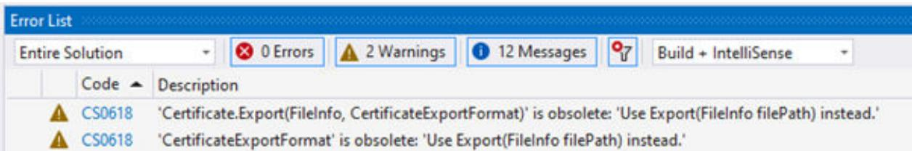

# 2 TIA Portal Openness 自述文件


## 2.1 TIA Portal Openness 中已弃用的功能

简介
通常，TIA Portal Openness 遵循长期稳定的 API 策略。在某些鼓励情况下，必须重新设计 API:
术语：
<table><tr><td>产品发布</td><td>TIA Portal Openness 版本</td><td></td></tr><tr><td rowspan="4">TIA Portal V18</td><td>API V15.1</td><td>旧 API</td></tr><tr><td>API V16</td><td>旧 API</td></tr><tr><td>API V17</td><td>旧 API</td></tr><tr><td>APIV18</td><td>新 API</td></tr><tr><td rowspan="4">TIA Portal V19</td><td>API V16</td><td>旧 API</td></tr><tr><td>API V17</td><td>旧 API</td></tr><tr><td>API V18</td><td>旧 API</td></tr><tr><td>APIV19</td><td>新 API</td></tr></table>

### 静态对象模型部分

已针对 API 版本宣布弃用的功能，并将在产品的下一个 API 版本中移除。下一个产品版本中的旧 API 不受影响。
对于静态对象模型部分，已弃用的功能会被标记为过时。在代码中使用这些功能会生成编译器警告，但它们在该版本中仍然有效。
编译器警告示例：
  
Openness: 用于工程组态工作流自动化的 API  
系统手册, 11/2023

### 代码中高亮显示的过时功能示例:

```cs
private static void ExportCertificate(Siemens.Engineering.Security.Certificate certificate)
{
FileInfo fileInfo = new FileInfo($"C:\\Temp\\{certificate.SubjectCommonName}.cer");
certificate.Export(fileInfo, Siemens.Engineering.Security.CertificateExportFormat.Cer);
}
```
考虑按如下方式调整已弃用的代码。

### 在 API V18 中已弃用

- 类：Siemens.Engineering.AddIn.VersionControl.InitialPreExportInfo已弃用并由 Siemens.Engineering.AddIn.VersionControl.PreExportInfo 替代
- 类：Siemens.Engineering.AddIn.VersionControl.InitialPostExportInfo已弃用并由 Siemens.Engineering.AddIn.VersionControl.PostExportInfo 替代
- 类：Siemens.Engineering.AddIn.VersionControl.SyncPreExportInfo已弃用并由 Siemens.Engineering.AddIn.VersionControl.PreExportInfo 替代
- 类：Siemens.Engineering.AddIn.VersionControl.SyncPostExportInfo已弃用并由 Siemens.Engineering.AddIn.VersionControl.PostExportInfo 替代
- 类：Siemens.Engineering.AddIn.VersionControl.VcInitialExportAddInContext 已弃用并由 Siemens.Engineering.AddIn.VersionControl.ExportContext 替代
- 类：Siemens.Engineering.AddIn.VersionControl.VciSyncExportAddInContext 已弃用并由 Siemens.Engineering.AddIn.VersionControl.ExportContext 替代
- 类：Siemens.Engineering.AddIn.VersionControl.VciRepositoryAddIn
已弃用并由 Siemens.Engineering.AddIn.VersionControl.VciWorkspaceRepositoryAddIn
替代
- 类：Siemens.Engineering.AddIn.VersionControl.VciRepositoryAddInProvider 已弃用并由 Siemens.Engineering.AddIn.VersionControl.VciWorkspaceRepositoryAddInProvider 替代
- 类：Siemens.Engineering.AddIn.VersionControl.VciInitialExportSupport已弃用并由 Siemens.Engineering.AddIn.VersionControl.ExportWorkflowSupport 替代
- 类：Siemens.Engineering.AddIn.VersionControl.VciSyncExportSupport
已弃用并由 Siemens.Engineering.AddIn.VersionControl.ExportWorkflowSupport 替代 - 类：Siemens.Engineering.AddIn.VersionControl.VciWorkflowAddInSupport已弃用并由
Siemens.Engineering.AddIn.VersionControl.VciWorkspaceRepositoryWorkflowAddIn 替代
- 类：Siemens.Engineering.HmiUnified.RuntimeSettings.HmiRuntimeSetting
<table><tr><td>已弃用属性</td><td>重新定位</td></tr><tr><td>OperateAsOpcServer { get; set;}</td><td>移至类Siemens.Engineering.HmiUnified.RuntimeSettings.HmiOp cUaServerRuntimeSettings</td></tr></table>
- 类：Siemens.Engineering.HmiUnified.UI.Parts.HmiTrendPartBase
<table><tr><td>已弃用属性</td><td>重新定位</td></tr><tr><td>TrendMode { get; set;}</td><td>从基础类移至派生类Siemens.Engineering.HmiUnified.UI.Parts.HmiTrendPart and Siemens.Engineering.HmiUnified.UI.Parts.HmiFunctionTrendPart</td></tr></table>
- 类：Siemens.Engineering.SiVArc.ScreenRule
<table><tr><td>已弃用属性</td><td>已弃用</td></tr><tr><td>ScreenLibraryItem { get; set;}</td><td>已弃用且未替代。</td></tr></table>

### 在 API V19 中已弃用

- 类：Siemens.Engineering.HW.MulticastableTransferArea
<table><tr><td>已弃用属性</td><td>替换为</td></tr><tr><td>Siemens.Engineering.HW.AddressAddress { get; }</td><td>Siemens.Engineering.HW.AddressCompositionAddresses { get; }</td></tr></table>
- 类：Siemens.Engineering.Security.Certificate
<table><tr><td>已弃用方法</td><td>替换为</td></tr><tr><td>System粗糙化Export(System.IO.FileInfo filePath,Siemens.Engineering.Security.CertificateExportFormat exportFormat)</td><td>System粗糙化Export(System.IO.FileInfo filePath)</td></tr></table>
- 枚举：Siemens.Engineering.Security.CertificateExportFormat已弃用且未替代
- 枚举：Siemens.Engineering.HW.WebserverUserPermissions2已弃用且未替代
- 枚举：Siemens.Engineering.HW.MaximumBufferedReceivedFrames已弃用且未替代
- 枚举：Siemens.Engineering.HW.PortType
已弃用并由 Siemens.Engineering.HW.PortConfiguration 替代
- 异常类：Siemens.Engineering.SimaticMLVersionNotSupportedException已弃用且未替代

### 动态 API 部分

已针对 TIA Portal 版本宣布弃用的功能，并将在下一个 TIA Portal 版本中移除。旧 API 和下一个产品版本中的新 API 都会受到影响。
对于动态 API 部分，由于技术原因无法生成编译器警告。请参见该区域中已弃用功能的系统手册。
动态 API 部分示例:
```text
private static ulong GetPortValue(Siemens.Engineering.HW.DeviceItem item)
{
    const string attributeName = "PortType";
    ulong attributeValue = (ulong)item.GetAttribute(attributeName);
    return attributeValue;
}
```
考虑按如下方式调整已弃用的代码

### 在 TIA Portal V18 中已弃用（所有 API 版本）


### 6ES7148-6JG00-0BB0/V5.1 中的硬件参数

<table><tr><td>已弃用属性名称</td><td>替换为</td></tr><tr><td>PortType</td><td>PortConfiguration</td></tr></table>

## 2.2 自述文件


### TIA Portal Openness 应用程序中的安全措施

建议：
- 使用 admin 权限将 TIA Portal Openness 应用程序安装到程序文件夹中。
- 避免从用户区域动态加载程序部件（如，程序集或 DLL 文件）。
- 使用用户权限运行 TIA Portal Openness 应用程序。

### 硬件参数

Siemens\Automation\Portal V\*\PublicAPI\V\*\HW Parameter
Description\Openness\_hardware\_parameter\_description.pdf 下的 TIA Portal 安装文件夹中提供了硬件参数的说明
属性可以具有依赖性并相互影响。因此，如果设备项或通道的属性已改变，则必须验证设备项或通道的所有属性。

### 说明

V\* 指根据安装的 TIA Portal 版本调整的路径。

### 复制 TIA Portal Openness 应用程序

在复制可执行的 TIA Portal Openness 应用程序时，某些条件下可能会发生这种情况：TIA Portal Openness 应用程序将会读取最初创建 TIA Portal Openness 应用程序时使用的目录路径。

### 解决方法:

如果已将 TIA Portal Openness 应用程序复制到新目录中，请打开然后再关闭属性对话框，以更新 Windows 缓存。

### 支持 TIA Portal 项目中的特定功能


### 故障安全

使用 TIA Portal Openness 时，存在与故障安全相关的限制。更多信息，请参见文档《SIMATIC Safety - 组态和编程》(SIMATIC Safety - Configuring and Programming)

### Test Suite

TIA Portal Test Suite 的 Openness 支持在 Test Suite V19 的相应在线帮助中有文档说明

### TIA Portal Openness 性能的改善

要实现最佳的 TIA Portal Openness 性能，可关闭 TIA Portal 的全局搜索功能。请使用 GUI 或 TIA Portal Openness API 调用来关闭全局搜索。完成 TIA Portal Openness 应用程序后，全局搜索功能会重新开启。这改善了性能，但如果开启全局搜索功能，所有 TIA Portal Openness 功能也会正常运行。

### 按线程保存程序代码

请注意，用户代码按线程保存，因此事件将在不同的线程中显示。

### 启用样式时的画面项导出行为

在启用样式时导出画面项将不会导出样式项的属性，而是导出激活样式前的画面项属性。如果选择了一种样式并为画面项选中了 UseDesignColorSchema，则画面项会获取用户界面中样式的属性值，但在选择样式前设置的画面项属性值仍会存储在此画面项的数据库中。TIA Portal Openness 会导出存储在数据库中的实际值。
禁用和启用样式并再次导出画面项后，将为画面项导出与样式项相同的属性值。如果未选中UseDesignColorSchema，则所选样式项的属性值将保存到相应画面项的数据库中。
这个问题可以通过以下步骤来解决：
1. 将画面项与样式项关联:
- 数据库包含激活样式前的属性值。
- 用户界面直接从样式项获取属性。
2. 导出与样式项关联的画面项:
- XML 文件包含激活样式前数据库中的属性值。
3. 禁用 UseDesignColorSchema:
- 样式项的属性值将写入数据库中画面项的属性中。
4. 启用 UseDesignColorSchema:
- 数据库中画面项的属性值不会更改，仍为步骤3中的值。
- 用户界面直接从样式项获取属性。
5. 导出与样式项关联的画面项:
- XML 文件包含步骤 3 中设置的数据库中的属性值，这些值与样式项中的值相同。

### 通过 AML 导入 ASi 从站

如果下列 ASi 从站之一通过 aml 文件导入，则不论在何种情况下，设备项的固件版本均会设置为 V13.0:
• ASIsafe FS400 RCV-B: 3SF7 844-\*B\*\*\*\*-\*\*\*\*1
• ASIsafe FS400 RCV-M: 3SF7 844- $^{*}$ M $^{***}$ - $^{***}$ 1
• ASIsafe FS400 TRX-M: 3SF7 844- $^{*}$ M $^{***}$ - $^{**}$ TO
• ASIsafe FS400 RCV-C: 3SF7 844-\*T\*\*\*-\*\*\*1

### 功能键的导出和导入

导入期间功能键将同步。如果在全局画面创建功能键，并且该画面中该键为空，相应的功能键将在所有画面中使用全局定义。
如果要在导入后禁用功能键的全局使用，则可在画面中定义空键并按以下顺序导入画面类型：全局画面、模板、各个画面。
导出画面时，如果要确保功能键的全局定义未经模板或全局画面使用，则需在画面中创建一个空的功能键。在画面中选择所需的功能键，然后正确使用“使用全局分配”，并再次将其禁用。

### 在线访问设备

不支持在线设备的写入属性。支持读取属性。
设备在线时不支持断开子网连接。

### 通过 TIA Portal Openness 导入块时，实例特定的属性

在某些情况下，导入规则可能意味着丢失实例特定的属性，例如起始值。

### OB 块优先级属性的写访问

OB 块的写访问的优先级属性名称已更改为 PriorityQueue。

## 2.3 TIA Portal Openness V19 中有关长期稳定性的主要更改


### 有关特定功能的信息

有关以下 Openness 功能的更多信息，请参见西门子工业在线支持中的常见问题解答条目：
- 归档/检索项目
- 导出/导入监控表

### 参见

Test Suite V18 (https://support.industry.siemens.com/cs/ww/en/view/109813414)

### 更改

如果考虑了关于跨版本编程的提示且不将 Openness 应用程序重新编译为 V19，则应用程序在任何计算机上都可以无限制运行，即使只安装了 TIA Portal V19 也如此。
如果将 Openness 应用程序重新编译为 V19，则需要使用 V19 的 Siemens.Engineering.dll 重新编译应用程序。在某些情况下，可能需要修改应用程序的代码。

### CAx/AML 数据交换


### 命令行工具行为的更改

自 TIA Portal V19 起，用户不再可使用 CAx 导出和导入的命令行工具。

### Profinet/以太网端口处理行为的更改

自 TIA Portal V19 起，无论其在 TIA Portal 中的值如何，Profinet/以太网接口端口的标签值都将在没有空格的情况下导出。例如：如果标签 = P1 R，AML 文件的标签将为 = P1R

### IO Link 端口处理行为的更改

在 TIA Portal V18 更新 2 及后续版本中，IO Link 端口将以“C/Q<n>”的标签值进行交换，其中 n 为端口号。例如：C/Q1、C/Q2 等。
对于 TIA Portal V18 更新 2 中 IO Link 组态的 AML 交换（通过 S7-PCT 进行），使用“S7-PCT 3.5 SP3 更新 3”或更高版本。

### WebServerUserManagement


### 删除/禁用现有 Openness 服务的行为更改

对于 TIA Portal V19，集中式 UMAC 功能将激活，但自 V3.1 起的所有 PLC 固件版本，WebServerUserManagement 将被禁用。
然而，在 TIA Portal V18 及之前版本中，WebServerUserManagement 将是可操作的，而集中式 UMAC 功能将在 PLC 固件版本 V3.0 及之前版本中处于非活动状态。

### PLC 上的 UMAC


### 通过PLC上的UMAC进行在线合法调用的行为更改

如果 Openness 应用程序在 TIA Portal Openness API <= 18 的情况下运行，通过 Openness 的在线合法性仍然可通过下载和上传组态实现。但前提是使用的 PLC 受到传统保护级别合法性的保护。
对于 TIA Portal Openness API >= V19，所有合法性调用（特别是 PLC 上的新 UMAC）将被传递给 ConnectionConfiguration 类的在线合法性事件的事件处理程序。如果用户代码未处理 OnlineAuthenticationConfiguration 类型，则会对特定功能（例如，下载或上传）的回调方法进行第二次调用。但只有旧的保护机制（V18 及之前的版本）可被处理。

### 执行严格的密码策略


### 块专有技术保护的严格密码策略的行为更改

对于 TIA Portal V19，设置密码时应用严格密码策略。这也适用于 TIA Portal Openness 调用，尤其是设置专有技术保护的情况。如果密码未遵循此策略，则会出现异常。

### WinCC Unified Screen Editor


### WinCC Unified Screen Editor 上下文中 MultilingualText 项的行为更改

自 TIA Portal V18 起，在 WinCC Unified Screen Editor 的范围内，所有 MultilingualText 项都从未格式化更改为格式化。
这意味着从现在开始所有文本都必须设置格式。纯文本将被拒绝，并提示异常，例如：
```javascript
Language language = project.LanguageSettings.Languages.Find(new CultureInfo("en-US"));
MultilingualText multilingualToolTipText1 = ((HmiButton)screenItem1).ToolTipText;
MultilingualTextItem multilingualTextItem1 = multilingualToolTipText1.Items.Find(language);
multilingualTextItem1.Text = "<body><p>Modified button text from Openness</p></body>";
```
2.4 关于编写长期稳定代码的提示

### 块/UDT 的支持


### 方案的更改，以支持在块中使用 NamedValueType

在 TIA Portal V19 中，引入了对命名值类型的支持（仅适用于 S7-1500 PLC 中的软件单元）。在 Openness 中，自 V19 起，SimaticML 方案中引入了一个新的范围“NamedValueConstant”，以支持在程序块或 PLC 数据类型中使用命名值类型。在通过 SimaticML 导入/导出期间，PLC 编程工件（程序块、PLC 数据类型）中使用的命名值类型在新范围“NamedValueConstant”中可见。
```xml
<Access Scope="NamedValueConstant" UID="27">
<Constant Name="_.siemens.simatic.Named_value_type_1#UNDEFs" UID="28"/>
</Access>
<Token Text=";" UID="31"/>
<NewLine Num="2" UID="32"/>
```

## 2.4 关于编写长期稳定代码的提示


### 版本更改

如果考虑了关于编写长期稳定代码的一些提示，则可在不修改应用程序代码的前提下将您的应用程序用于其他版本的 TIA Portal。
说明
文档中的 V\* 和 \*.ap\* 分别指根据安装的 TIA Portal 版本调整的路径和扩展名。

### 注册路径和 appconfig 文件

更改注册路径和应用程序组态文件时需做适当修改，例如：
"C:\Program Files\Siemens\Automation\Portal V14\PublicAPI\V14"
SP1\Siemens.Engineering.dll"
必须更改为
"C:\Program Files\Siemens\Automation\Portal V\*\PublicAPI\V\*\Siemens.Engineering.dll"
要编写长期稳定的代码，注册路径应是可组态的，且必须更新应用程序组态文件。

### 安装路径

更改 TIA Portal 的安装路径时需做适当修改，例如：
"C:\Program Files\Siemens\Automation\Portal V14\PublicAPI\V14"
SP1\Siemens.Engineering.dll"
必须更改为
"C:\Program Files\Siemens\Automation\Portal V\*\PublicAPI\V\*\Siemens.Engineering.dll"
要编写长期稳定的代码，安装路径应是可组态的。

### TIA Portal 项目文件和库的扩展名

更改 TIA Portal 项目文件和库的扩展名时需做适当修改，例如：
\*.ap14
必须更改为
\*.ap\*
要编写长期稳定的代码，TIA Portal 项目文件和库的扩展名应是可组态的。

### 打开项目

要编写长期稳定的代码，应使用 Projects.OpenWithUpgrade 方法而不是 Projects.Open 方法。

### 结果的层级

结果类（例如，编译结果）的层级和/或顺序可能因版本而异。
要编写长期稳定的代码，应避免建立关于特定结果深度和顺序的假设。
对于显式类名称 CompilerResult、CompareResult、DownloadResult 和 UploadResult，类布局实际上是长期稳定的。还有一个新的结果类：TransferResult。内容、层次结构和顺序遵循当前执行或安装的 TIA Portal 的 TIA Portal 用户界面上显示的内容。
2.4 关于编写长期稳定代码的提示

### TIA Portal Openness 中的新功能


### 兼容性和长期稳定性

- Siemens.Engineering.dll 汇编程序
由于 V16、V17 和 V18 的 Siemens.Engineering.dll 汇编程序包含在供货范围内，因此基于 V16、V17 和 V18 的应用程序无需修改即可在 V19 中运行。要利用 V19 的功能，必须集成 V19 的 dll 并重新编译应用程序。
Siemens.Engineering.dll 汇编程序位于安装目录中的“PublicAPI\[version]”下。例如，可以在“C:\Program Files\Siemens\Automation\Portal
V\*\PublicAPI\V19\Siemens.Engineering.dll"中找到 V19 dll 文件。
V15.1 Siemens.Engineering.dll 不再作为 TIA Portal Openness V19 的一部分提供。
- 导出 Simatic ML 文件
V16、V17 和 V18 的 Siemens.Engineering.dll 汇编程序将创建 TIA Portal 版本 V19 的 Simatic ML 文件。
- 导入 Simatic ML 文件
每个 Siemens.Engineering.dll 汇编程序都可以导入对应版本和任何早期版本所支持版本的 Simatic ML 文件。例如，可通过 Siemens.Engineering.dll 汇编程序 V19 导入 V18 的 Simatic ML 文件。
V\* 指已安装的 TIA Portal Openness API 版本。
有关对象模型更改的更多信息，[TIA Portal Openness 对象模型](#TIA-Portal-Openness-对象模型)”。

### 新增功能

