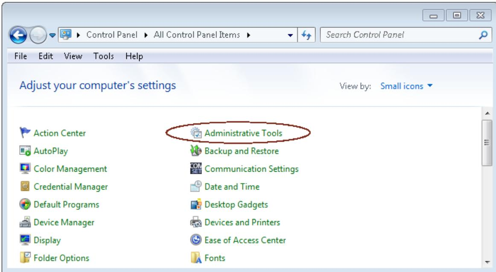
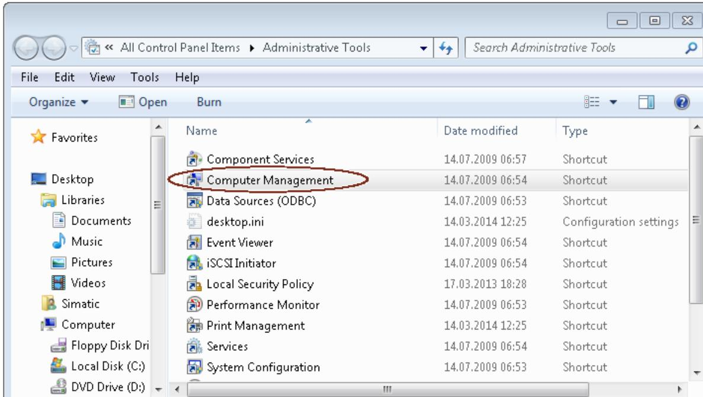
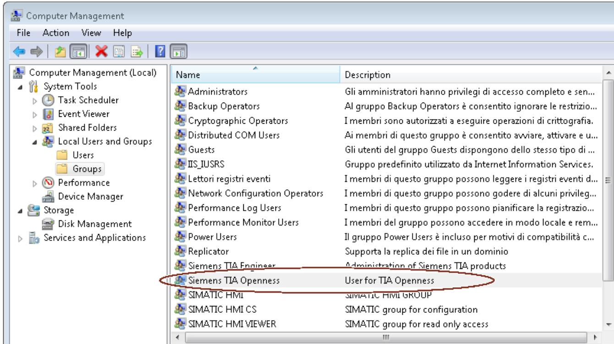
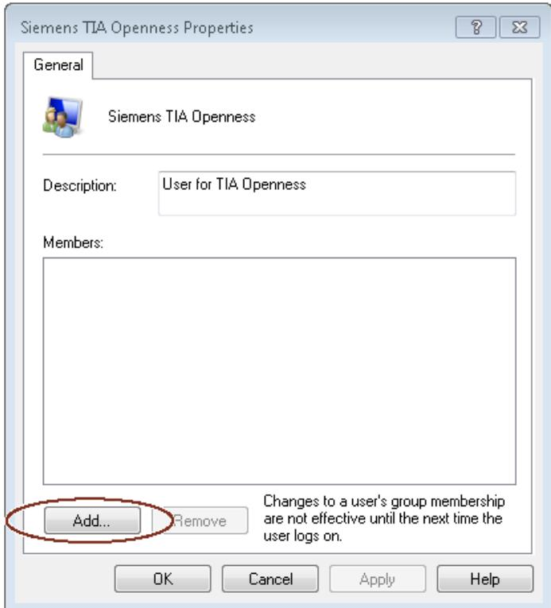
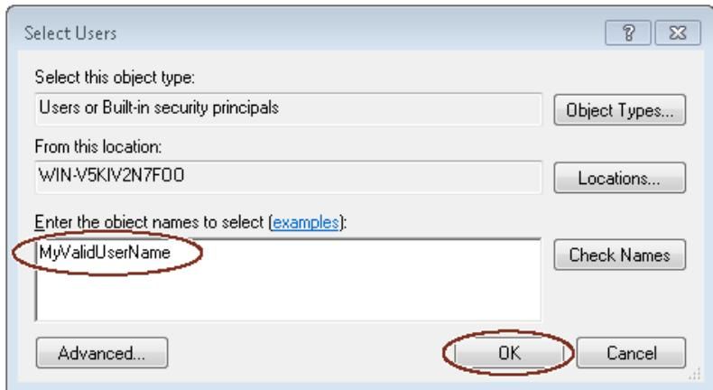
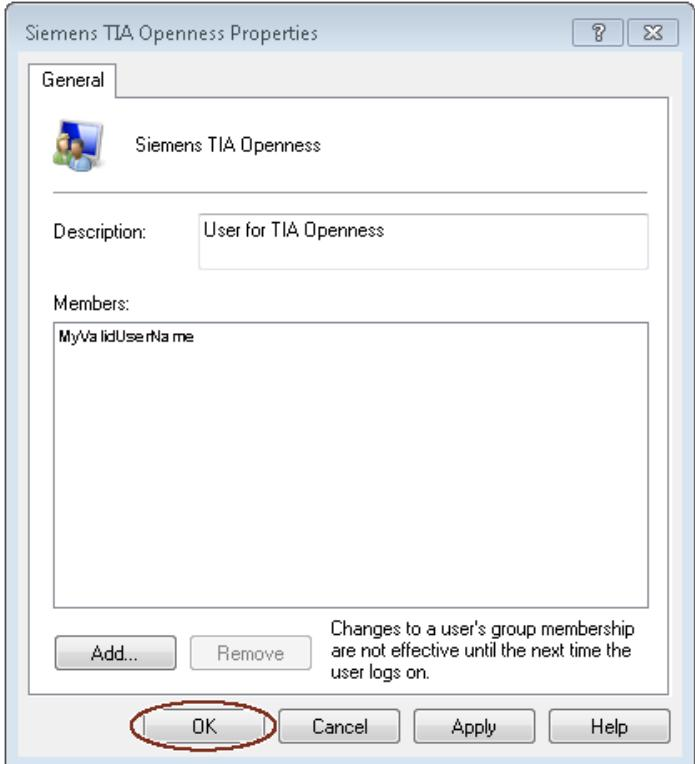
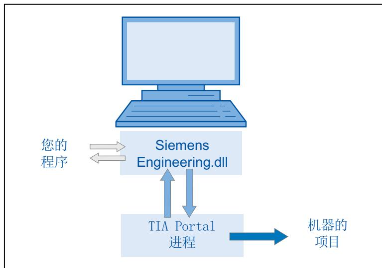
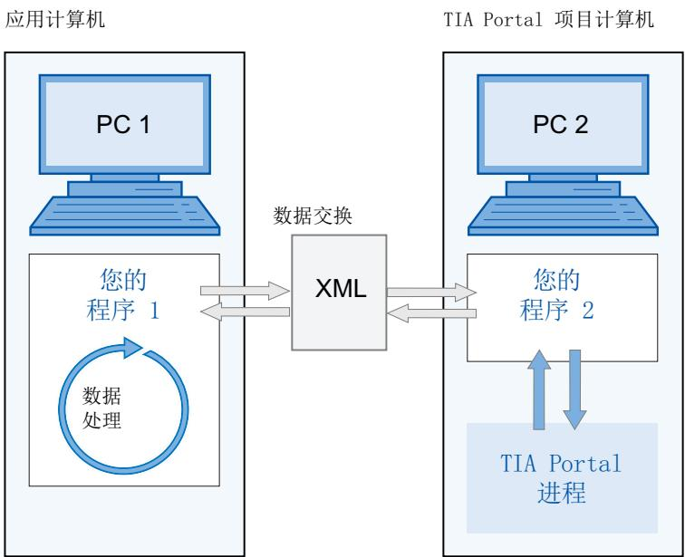
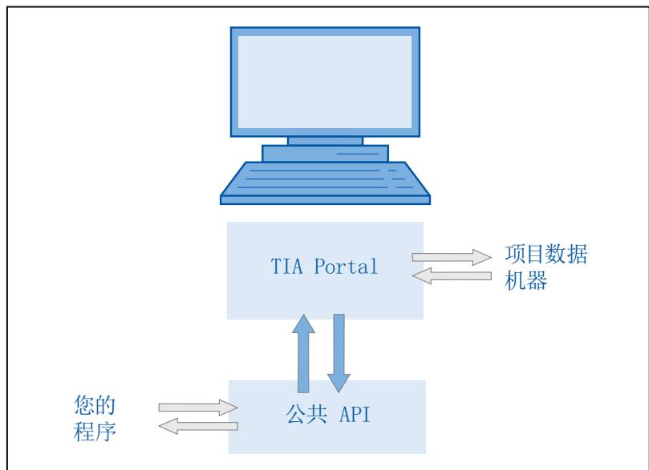
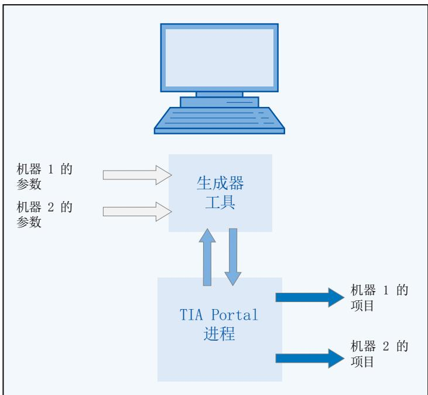

# 4 基本知识

## 4.1 安装

### 4.1.1 TIA Portal Openness 的要求

TIA Openness 应用程序的使用要求
- 在 PC 上安装基于 TIA Portal 的产品，例如“STEP 7 Professional”或“WinCC Professional”。
- 在 PC 上安装“TIA Portal Openness”。
请[TIA Portal Openness 的安装](#TIA-Portal-Openness-的安装)”
支持的 Windows 操作系统
下表给出了相互兼容的 Windows 操作系统、TIA portal 和用户应用程序组合：
<table><tr><td>Windows 操作系统</td><td>TIA Portal</td><td>用户应用程序</td></tr><tr><td>64 位</td><td>64 位</td><td>32 位和 64 位,“任意 CPU”</td></tr></table>

#### TIA Portal Openness 应用程序的编程要求

- Microsoft Visual Studio 2017 或以上版本，包含 .Net Framework SDK 4.8 和 Windows Classic Desktop package

#### 用户必备知识

- 作为系统工程师所必备的知识
- 包含 .Net Framework SDK 4.8 的 Microsoft Visual Studio 2017 或更高版本的高级知识
- C# / VB.net 和 .Net Framework 的高级知识
- TIA Portal 的用户知识

#### TIA Portal Openness 远程通道

TIA Portal Openness 远程通道注册为类型 IpcChannel，其中“ensureSecurity”参数设置为“false”。
说明
应该避免使用"false"之外的"ensureSecurity"参数值注册IpcChannel，并且优先级大于等于“1”。
IpcChannel 使用以下属性定义:
<table><tr><td>属性</td><td>设置</td></tr><tr><td>&quot;name&quot; 和 &quot;portName&quot;</td><td>在 AppDomain 中注册时设置为“${Process.Name}_{Process.Id}&quot;或“${Process.Name}_{Process.Id}_{AppDomain.Id}&quot;,而非应用程序的默认值。</td></tr><tr><td>&quot;priority&quot;</td><td>设置为默认值“1”。</td></tr><tr><td>&quot;typeFilterLevel&quot;</td><td>设置为“Full”。</td></tr><tr><td>&quot;authorizedGroup&quot;</td><td>设置为内置用户帐户(即,所有人)的 NTAccount 值字符串。</td></tr></table>
向“Siemens TIA Openness”用户组添加用户 (页 45)

### 4.1.2 TIA Portal Openness 的安装

简介
在 TIA Portal 安装期间，选中 TIA Portal Openness 复选框（在“选项”(Options)下）后可通过 TIA Portal 安装程序安装“TIA Portal Openness”。
要求
- PG/PC 的硬件和软件满足系统要求。
- 具有管理员权限。
- 关闭正在运行的程序。
- 禁用自动运行功能。
- 已安装 WinCC 和/或 STEP 7。
- “TIA Portal Openness”的版本号与 WinCC 和 STEP 7 的版本号相匹配。
如果已安装早期版本的TIA Portal Openness，则当前版本将与其并排安装。

#### 步骤

要安装 TIA Portal Openness，请确保在安装 TIA Portal 期间选中 TIA Portal Openness 复选框。请按照以下步骤对 TIA Openness 的安装操作进行检查。
1. 在 “组态”(Configuration) 菜单下，选择 “选项”(Options) 文件夹。
2. 选中 TIA Portal Openness 复选框。
3. 单击“Next”并选择所需选项。
按照 TIA Portal 的安装步骤完成 TIA Portal Openness 的安装。

#### 结果

在 PC 上安装“TIA Portal Openness”。此外，还生成了本地用户组“Siemens TIA Openness”。
安装“TIA Portal Openness”附加软件包之后，您仍然无权访问 TIA Portal。您必须是“Siemens TIA Openness”用户组的成员（请[向“Siemens TIA Openness”用户组添加用户](#向Siemens-TIA-Openness用户组添加用户)）。

### 4.1.3 向“Siemens TIA Openness”用户组添加用户

#### 简介

在 PC 上安装 TIA Portal Openness 时，会自动创建“Siemens TIA Openness”用户组。
无论何时通过 TIA Portal Openness 应用程序访问 TIA Portal，TIA Portal 都会验证您是否通过其它用户组直接或间接地成为“Siemens TIA Openness”用户组的成员。如果您是“Siemens TIA Openness”用户组的成员，则 TIA Portal Openness 应用程序将启动并与 TIA Portal 建立连接。
通过操作系统中的应用程序向“Siemens TIA Openness”用户组添加用户。TIA Portal 不支持该操作。
根据您的域或计算机的配置，可能需要使用管理员权限进行登录来扩展用户组。
例如，在 Windows 7 操作系统（语言设置为英语）中，可按以下步骤向用户组添加用户：
1. 选择 "Start" > "Control Panel"。
2. 在控制面板中双击 "Administrative Tools"。

3. 单击 "Computer Management" 打开同名的配置对话框。  
  
4. 选择 "Local Users and Groups > Groups" 以显示创建的所有用户组。
5. 在右侧窗格的用户组列表中选择 "Siemens TIA Openness" 条目。

6. 选择“Action > Add to Group...”菜单命令。
<table><tr><td>Name</td><td>Description</td></tr><tr><td>Administrators</td><td>Gli amministratori hanno privilegi di accesso completo e sen...</td></tr><tr><td>Backup Operators</td><td>Al gruppo Backup Operators è consentito ignorare le restrizio...</td></tr><tr><td>Cryptographic Operators</td><td>I membri sono autorizzati a eseguire operazioni di crittografia.</td></tr><tr><td>Distributed COM Users</td><td>Ai membri di questo gruppo è consentito avviare, attivare e u...</td></tr><tr><td>Guests</td><td>Gli utenti del gruppo Guests dispongono dello stesso tipo di ...</td></tr><tr><td>IIS_IUSRS</td><td>Gruppo predefinito utilizzato da Internet Information Services.</td></tr><tr><td>Lettori registri eventi</td><td>I membri di questo gruppo possono leggere i registri eventi d...</td></tr><tr><td>Network Configuration Operators</td><td>I membri di questo gruppo possono godere di alcuni privileg...</td></tr><tr><td>Performance Log Users</td><td>I membri di questo gruppo possono pianificare la registrazione...</td></tr><tr><td>Performance Monitor Users</td><td>I membri del gruppo possono accedere in modo locale e rem...</td></tr><tr><td>Power Users</td><td>Il gruppo Power Users è incluso per motivi di compatibilità c...</td></tr><tr><td>Replicator</td><td>Supporta la replica dei file in un dominio</td></tr><tr><td>Siemens TIA Engineer</td><td>Administration of Siemens TIA products</td></tr><tr><td>Siemens TIA Openness</td><td>User for TIA Openness</td></tr><tr><td>SIMATIC HMI</td><td>SIMATIC HMI GROUP</td></tr><tr><td>SIMATIC HMI CS</td><td>SIMATIC group for configuration</td></tr><tr><td>SIMATIC HMI VIEWER</td><td>SIMATIC group for read only access</td></tr><tr><td>SQLServer2005SQLBrowserUser$WI...</td><td>Members in the group have the required access and privilege...</td></tr></table>
Change Group membership.
将打开用户组属性对话框:  

#### 7. 单击“Add””。

打开的选择对话框将显示可以选择的用户:

#### 8. 在输入字段中键入有效的用户名。

单击 "Check Names" 以验证已输入用户名是否具有对此域或计算机有效的用户账户。 "From this location" 字段显示已输入用户名的域或计算机名。有关详细信息，请联系您的系统管理员。

#### 9. 单击 "OK" 确认选择。

现在，新用户将显示在用户组的属性对话框中。

可通过单击 "Add" 按钮注册其它用户。
10. 单击 "OK" 结束此操作。
11. 重新登录 PC 以使更改生效。

### 4.1.4 使用 Windows 服务

Windows 服务是长时间运行的可执行文件，无需用户界面即可运行，并使用安装实用程序进行安装。可以开发使用 TIA Portal Openness 的此类 Windows 服务应用程序。
为此，需要在 Microsoft Visual Studio 中创建“Windows 服务 (.NET Framework)”类型的项目。

#### 要求

- Windows 服务应用程序的进程可执行文件需要事先在 TIA Portal Openness 防火墙中列入白名单。此过程可以通过在安装 Windows 服务时创建 Windows 注册表项来完成，例如作为使用 Windows Installer 项目创建的安装程序的一部分。
有关白名单的更多信息，请[TIA Portal Openness 防火墙](#TIA-Portal-Openness-防火墙)”一章中的 “在不使用 TIA Portal 的情况下添加白名单条目” 部分
- 无法访问正在运行的 TIA Portal 进程或使用图形界面启动 TIA Portal。只能创建不带用户界面的新 TIA Portal 实例。
- 强烈建议使用专用 Windows 用户帐户的凭据运行 Windows 服务。可以但不建议使用本地服务帐户或网络服务帐户。由于安全限制，不支持本地系统帐户，并且始终会抛出 Engineering SecurityException。
- 使用的 Windows 帐户（服务或用户）需要是本地 Windows 用户组“Siemens TIA Openness”的一部分。
TIA Portal Openness 防火墙 (页 97)

### 4.1.5 访问 TIA Portal

#### 概述

组态PC  

1. 设置开发环境以访问和启动 TIA Portal。
2. 实例化程序中门户应用程序的对象以启动 Portal。
3. 找到所需项目并将其打开。
4. 访问项目数据。
5. 关闭项目并退出 TIA Portal。
连接到 TIA Portal (页 90)
终止与 TIA Portal 的连接 (页 108)

### 4.1.6 组态

使用 TIA Portal Openness 分为以下两种情况:

#### 应用程序和 TIA Portal 位于不同计算机上

- 通过 XML 文件进行数据交换。可通过程序导出或导入 XML 文件。
- 对于从 TIA Portal 项目导出至 PC2 的数据，可在 PC1 上进行修改并重新导入。
必须为 PC2 开发可执行程序 “程序 2”，例如“program2.exe”。TIA Portal 与此程序一起在后台运行。
只能通过 TIA Portal Openness API 对 XML 文件进行导入和导出操作。
- 可以归档交换的文件以便进行验证。
- 可以在不同的时间和位置对交换的数据进行处理。

#### 应用程序和 TIA Portal 位于同一台计算机上

组态 PC  

- 无论是否使用用户界面，程序都可以启动 TIA Portal。程序可打开、保存和/或关闭项目。程序还可连接到正在运行的 TIA Portal。
- 随后可使用 TIA Portal 功能请求、生成和修改项目数据，或启动导入或导出过程。
- 数据在 TIA Portal 处理过程的控制下进行创建，并存储在项目数据中。

## 4.2 Openness 任务

### 模块化机械工程中的典型应用

组态计算机  

- 可对类似的机器应用高效的自动化系统。
- TIA Portal 提供包含所有机器型号的组件的项目。
- “生成器”工具控制着针对特定机器型号进行的项目创建。
- “生成器”工具通过读取请求的机器型号的参数来获取默认值。
- “生成器”工具可将相关元素从整个TIA Portal项目中过滤出来，并在必要时对其进行修改，以及生成请求的机器项目。

### 4.2.1 简介

简介
TIA Portal Openness 介绍了使用 TIA Portal 进行工程组态的开放接口。有关“TIA Portal Openness - Efficient generation of program code using code generators”的更多信息，请参见 SIEMENS YouTube 频道 (www.youtube.com/watch?v=Ki12pLbEcxs)。
TIA Portal Openness 可以通过您创建的程序从外部控制 TIA Portal，从而实现工程组态的自动化。
可借助 TIA Portal Openness 执行以下操作:
- 创建项目数据
- 修改项目和项目数据
- 删除项目数据
- 读取项目数据
- 将项目和项目数据提供给其它应用程序。
对于使用第三方软件通过这些接口传输的信息和数据的兼容性，西门子不会承担责任和提供保证。
我们明确指出：接口的不当使用可能导致数据丢失或停产时间。
本文档中包含的代码片段是使用 C# 语法编写的。
由于所使用的代码片段不足，因此也省去了错误处理的说明。

#### 应用

TIA Portal Openness 接口用于执行以下操作:
- 提供项目数据。
- 访问 TIA Portal 过程。
- 使用项目数据。
使用自动化工程现场中的默认值
- 通过导入外部生成的数据
- 通过远程控制 TIA Portal 生成项目
为外部应用程序提供 TIA Portal 项目数据
- 通过导出项目数据

#### 通过高效的工程组态确保竞争优势

- 无需在 TIA Portal 中组态现有的工程数据。
- 以自动化的工程组态流程替代手动工程组态。
- 与竞争对手相比，较低的工程组态成本巩固了投标地位。

#### 同时使用项目数据

- 测试例程和批量数据处理可以与组态同时执行。
[组态](#组态)

### 4.2.2 应用程序

TIA Portal Openness 为您提供了多种访问 TIA Portal 的方式，并且针对定义的任务提供了多个函数供您选择。
可通过 TIA Portal Openness API 接口访问 TIA Portal 的以下区域：
- 门户数据
- 项目数据
- PLC 数据
- HMI 数据
- 驱动数据

#### 访问 TIA Portal

TIA Portal Openness 提供了多种访问 TIA Portal 的方式。无论是否使用用户界面，用户均可在过程中创建外部 TIA Portal 实例。同时，还可以访问当前 TIA Portal 过程。

#### 访问项目和项目数据

访问项目和项目数据时，主要使用 TIA Portal Openness 来执行以下任务：
- 关闭、打开和保存项目
- 枚举和查询对象
- 创建对象
- 删除对象

### 4.2.3 导出/导入

TIA Portal Openness 支持通过 XML 文件导入和导出项目数据。导入/导出功能支持现有工程数据的外部组态。使用该功能可使工程过程高效无误。
可使用导入/导出功能进行以下操作：
- 数据交换
- 复制项目的一部分
- 对组态数据进行外部处理，例如，使用查找和替换功能对数据进行批量操作
- 基于现有组态对新项目的组态数据进行外部处理
- 导入外部创建的组态数据，例如文本列表和变量
- 为外部应用程序提供项目数据
4.2 Openness 任务
