# 5 TIA Portal Openness API


## 5.1 TIA Portal Openness 对象


### 5.1.1 TIA Portal Openness 对象模型

概述
下图介绍了最高级别的 TIA Portal Openness 对象模型:  
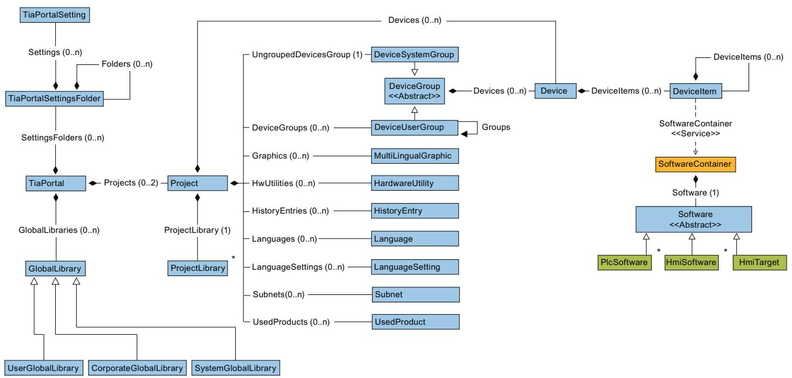
下图所示为位于 GlobalLibrary 下的对象。
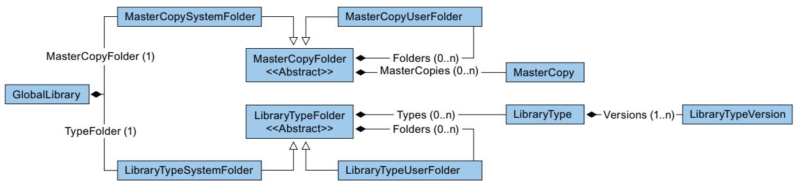  
下图所示为位于 ProjectLibrary 下的对象。
5.1 TIA Portal Openness 对象  
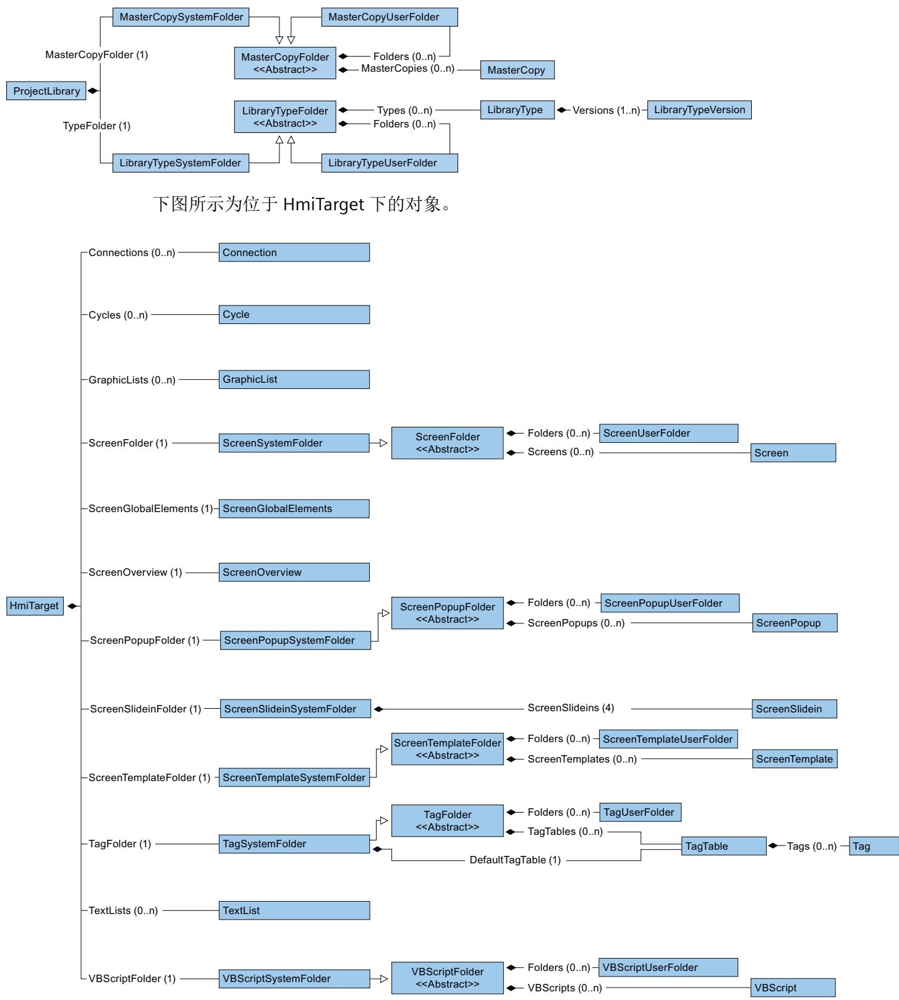  
下图所示为位于 HmiSoftware 下的对象。
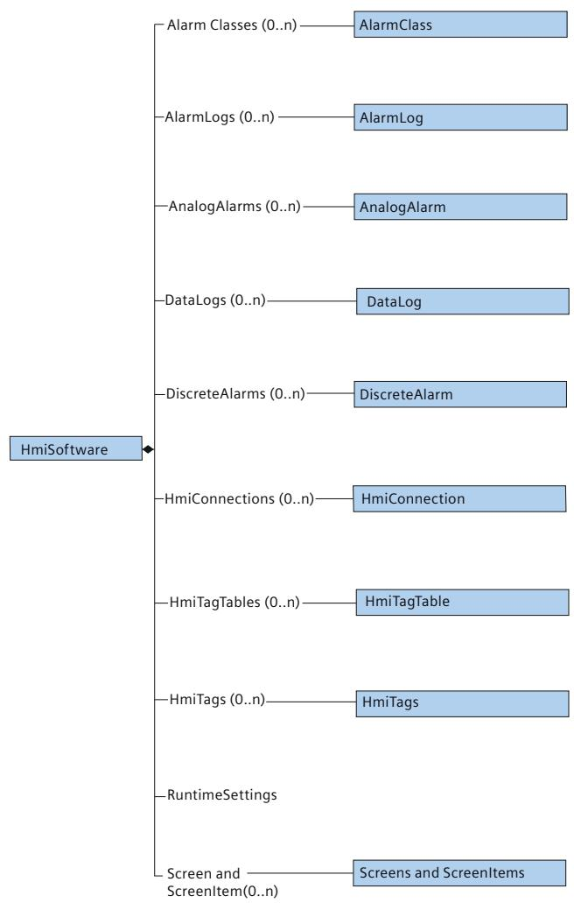  
下图所示为位于 PlcSoftware 下的对象。
5.1 TIA Portal Openness 对象

\*强制表必须位于 PlcWatch 和 ForceTableSystemGroup 中

#### 访问列表中的对象

可使用以下方法访问列表中的对象:
- 通过索引进行寻址。列表中从0开始计数。
- 使用 Find 类函数。
该类函数通过对象的名称进行寻址。可以将该类函数用于构成或列表。Find类函数未进行递归循环。
示例：
ScreenComposition screens = folder.Screens;
Screen screen = screens.Find("myScreen");
- 使用符号名称。

#### TIA Portal 和 TIA Portal Openness 对象模型之间的关系

下图显示了对象模型和 TIA Portal 中的项目之间的关系:
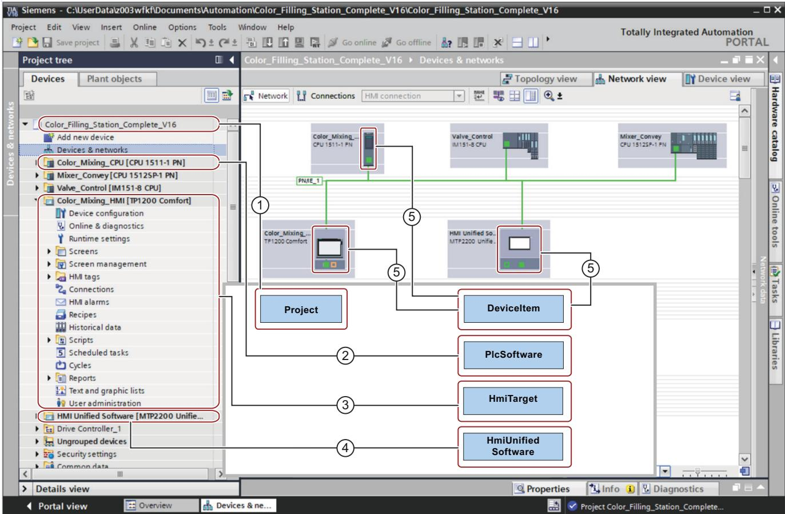
5.1 TIA Portal Openness 对象
[TIA Portal Openness 对象模型的块和类型](#TIA-Portal-Openness-对象模型的块和类型)
对象模型的硬件对象的层级(页 71)

### 5.1.2 TIA Portal Openness 对象模型的块和类型

简介
下图所示为 PLC 的域模型，其中简要介绍了 TIA Portal Openness 中的当前模型。
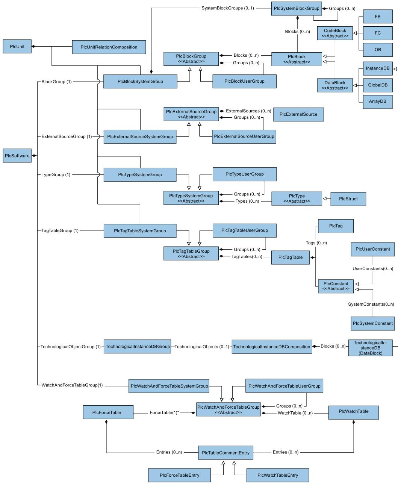
\* 强制表必须位于 PlcWatch 和 ForceTableSystemGroup 中

#### TIA Portal Openness API 中块和类型的表示

块和结构的简化模型部分基于 TIA Portal Openness API 的属性。这些类提供了导出功能，也为块提供了编译功能。

#### 类图

在 TIA Portal Openness 对象模型中，所有类均被定义为抽象概念，未直接实例化。
数据  
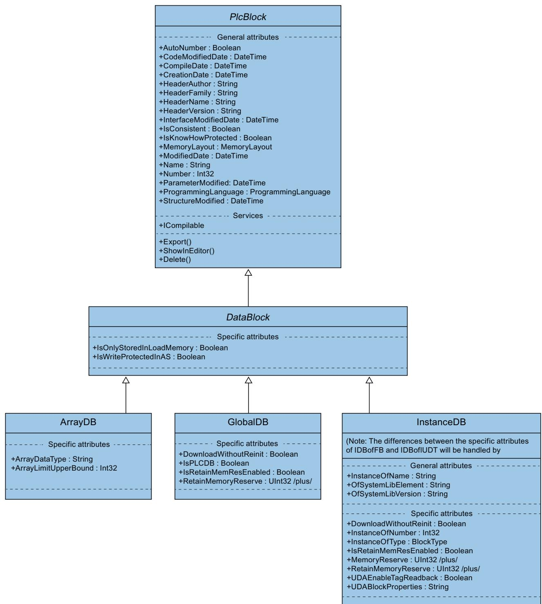
5.1 TIA Portal Openness 对象
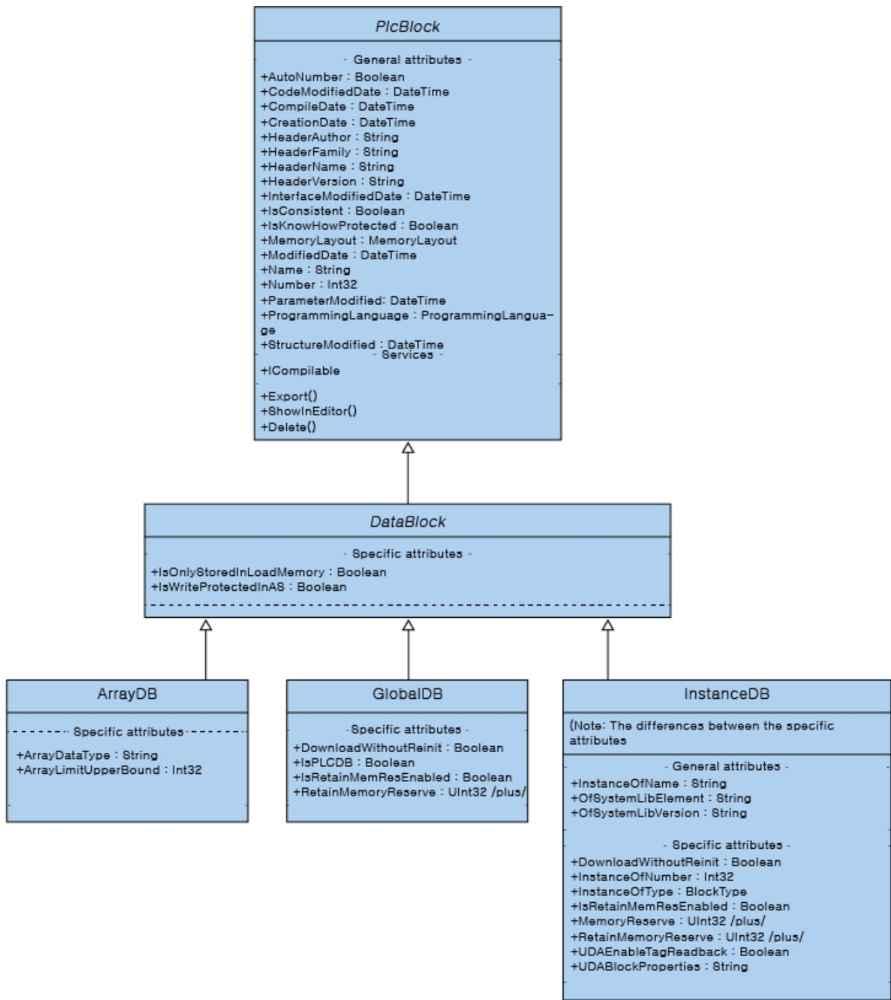  
图5-1 框图的表示
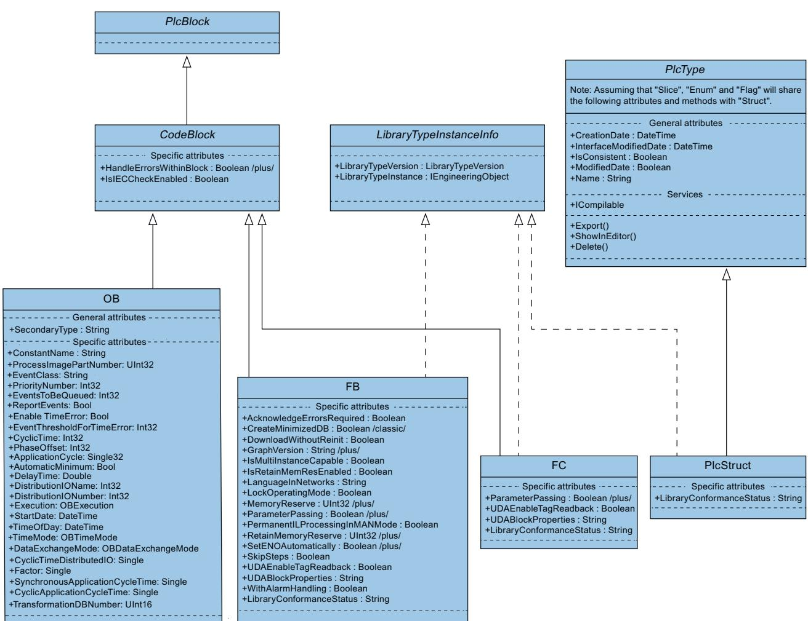  
TIA Portal Openness API 中块和类型的组的表示
两个高级组“PlcBlocks”（在 TIA Portal 的 GUI 中为 “程序块”）和“PlcTypes”（在 TIA Portal 的 GUI 中为“Plc 数据类型”）包含块和类型定义。这些组为各个块提供了导入和编译功能。由于大多数的组功能方法都只能通过集合来实现，因此在 “主机” 类别下存在集合及其方法的 “嵌入” 或 “紧凑” 表示形式。
块和类型  
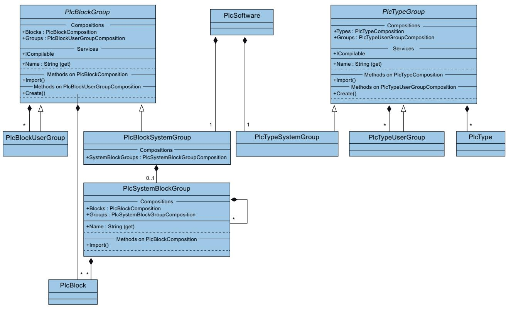

#### 外部源

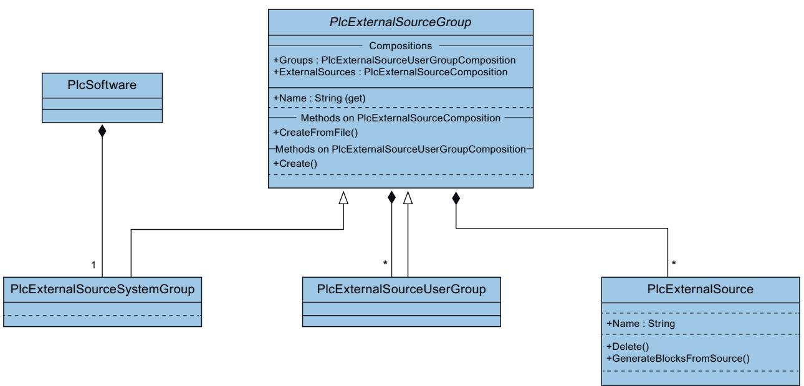  
Openness: 用于工程组态工作流自动化的 API 系统手册, 11/2023
[TIA Portal Openness 对象模型](#TIA-Portal-Openness-对象模型)
对象模型的硬件对象的层级 (页 71)

### 5.1.3 对象模型的硬件对象的层级


#### TIA Portal 中可见元素与对象模型中建模元素之间的关系

<table><tr><td>硬件对象</td><td>说明</td></tr><tr><td>设备(Device)</td><td>用于集中或分布式组态的容器对象。</td></tr><tr><td>设备项(DeviceItem)</td><td>每个设备项对象都有一个容器对象。逻辑关系为“项”。</td></tr></table>
为理解 TIA Portal 视图中显示的内容和 TIA Portal Openness 中建模的内容之间的硬件对象层级关系，有必要考虑硬件对象层级的某些方面。
示例：HardwareObject 具有 items 链接。Device 会扩展 HardwareObject 并具有 UnpluggedItems 链接。Device 为站的容器对象。
DeviceItem 会扩展 HardwareObject 并具有 Container 链接。每个插入的 DeviceItem 对象均已获取属于 HardwareObject 的容器对象。反向关系为 Items。
对于不具备容器的未插入 DeviceItem 对象，可通过设备的链接 UnpluggedItems 找到。容器关系相当于设备项对象的模块的关系。
示例：设备包含一个或多个机架。一个机架包含多个模块。模块包含子模块。
这与 TIA Portal 的网络视图和设备视图中的表示相似。设备项的“PositionNumber”属性在容器的项区域内唯一。
设备项对象间的父子关系是对象模型中的一种纯粹的逻辑关系。如果没有父对象，子对象将无法存在。
- 如果将子模块做为模块的一部分（子项）进行建模，则无法在没有模块的情况下删除子模块。
- 可添加和删除的模块或子模块是设备对象的子模块

#### PLC 设备的层级关系

下图显示了设备之间，以及 PLC 设备与 HMI 设备项之间的层级关系。
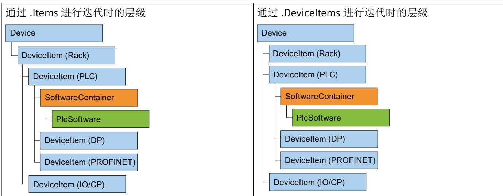
HMI 设备的层级关系  
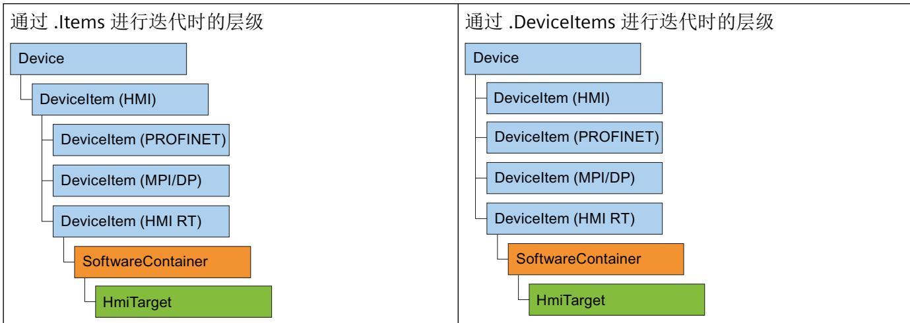
TIA Portal Openness 对象模型 (页 59)
TIA Portal Openness 对象模型的块和类型 (页 65)

### 5.1.4 对象列表

简介
下表列出了 Runtime Advanced 及之前版本的可用对象，并指明了这些对象是否受 TIA Portal Openness 支持。
在 WinCC 中，TIA Portal Openness 不支持 Runtime Professional 和设备代理文件。
对象
可根据您所使用的 HMI 的设备控制以下项目数据：
表格 5-1 画面
<table><tr><td>对象</td><td>精简系列面板</td><td>精智面板</td><td>移动面板</td><td>RT Advanced</td></tr><tr><td>画面</td><td>可用</td><td>可用</td><td>可用</td><td>可用</td></tr><tr><td>全局画面</td><td>可用</td><td>可用</td><td>可用</td><td>可用</td></tr><tr><td>模板</td><td>可用</td><td>可用</td><td>可用</td><td>可用</td></tr><tr><td>永久性区域</td><td>不可用</td><td>可用</td><td>可用</td><td>可用</td></tr><tr><td>弹出画面</td><td>不可用</td><td>可用</td><td>可用</td><td>可用</td></tr><tr><td>滑入画面</td><td>不可用</td><td>可用</td><td>可用</td><td>可用</td></tr></table>
表格 5-2 画面对象
<table><tr><td>对象</td><td>精简系列面板</td><td>精智面板</td><td>移动面板</td><td>RT Advanced</td></tr><tr><td>直线</td><td>可用</td><td>可用</td><td>可用</td><td>可用</td></tr><tr><td>折线</td><td>不可用</td><td>可用</td><td>可用</td><td>可用</td></tr><tr><td>多边形</td><td>不可用</td><td>可用</td><td>可用</td><td>可用</td></tr><tr><td>椭圆</td><td>可用</td><td>可用</td><td>可用</td><td>可用</td></tr><tr><td>部分椭圆</td><td>不可用</td><td>不可用</td><td>不可用</td><td>不可用</td></tr><tr><td>扇形</td><td>不可用</td><td>不可用</td><td>不可用</td><td>不可用</td></tr><tr><td>椭圆弧</td><td>不可用</td><td>不可用</td><td>不可用</td><td>不可用</td></tr><tr><td>摄像机视图</td><td>不可用</td><td>不可用</td><td>不可用</td><td>不可用</td></tr><tr><td>圆弧</td><td>不可用</td><td>不可用</td><td>不可用</td><td>不可用</td></tr><tr><td>圆</td><td>可用</td><td>可用</td><td>可用</td><td>可用</td></tr></table>

#### TIA Portal Openness API

5.1 TIA Portal Openness 对象
<table><tr><td>对象</td><td>精简系列面板</td><td>精智面板</td><td>移动面板</td><td>RT Advanced</td></tr><tr><td>PDF 视图</td><td>不可用</td><td>不可用</td><td>不可用</td><td>不可用</td></tr><tr><td>矩形</td><td>可用</td><td>可用</td><td>可用</td><td>可用</td></tr><tr><td>连接器</td><td>不可用</td><td>不可用</td><td>不可用</td><td>不可用</td></tr><tr><td>文本域</td><td>可用</td><td>可用</td><td>可用</td><td>可用</td></tr><tr><td>图形视图</td><td>可用</td><td>可用</td><td>可用</td><td>可用</td></tr><tr><td>管道</td><td>不可用</td><td>不可用</td><td>不可用</td><td>不可用</td></tr><tr><td>双 T 形管</td><td>不可用</td><td>不可用</td><td>不可用</td><td>不可用</td></tr><tr><td>T 形管</td><td>不可用</td><td>不可用</td><td>不可用</td><td>不可用</td></tr><tr><td>管道弯头</td><td>不可用</td><td>不可用</td><td>不可用</td><td>不可用</td></tr><tr><td>I/O 域</td><td>可用</td><td>可用</td><td>可用</td><td>可用</td></tr><tr><td>日期/时间域</td><td>可用</td><td>可用</td><td>可用</td><td>可用</td></tr><tr><td>图形 I/O 域</td><td>可用</td><td>可用</td><td>可用</td><td>可用</td></tr><tr><td>可编辑的文本域</td><td>不可用</td><td>不可用</td><td>不可用</td><td>不可用</td></tr><tr><td>列表框</td><td>不可用</td><td>不可用</td><td>不可用</td><td>不可用</td></tr><tr><td>组合框</td><td>不可用</td><td>不可用</td><td>不可用</td><td>不可用</td></tr><tr><td>按钮</td><td>可用</td><td>可用</td><td>可用</td><td>可用</td></tr><tr><td>圆形按钮</td><td>不可用</td><td>不可用</td><td>不可用</td><td>不可用</td></tr><tr><td>指示灯按钮</td><td>不可用</td><td>不可用</td><td>可用</td><td>不可用</td></tr><tr><td>开关</td><td>可用</td><td>可用</td><td>可用</td><td>可用</td></tr><tr><td>符号 I/O 域</td><td>可用</td><td>可用</td><td>可用</td><td>可用</td></tr><tr><td>钥匙开关</td><td>不可用</td><td>不可用</td><td>可用</td><td>不可用</td></tr><tr><td>棒图</td><td>可用</td><td>可用</td><td>可用</td><td>可用</td></tr><tr><td>符号库</td><td>不可用</td><td>可用</td><td>可用</td><td>可用</td></tr><tr><td>滑块</td><td>不可用</td><td>可用</td><td>可用</td><td>可用</td></tr><tr><td>滚动条</td><td>不可用</td><td>不可用</td><td>不可用</td><td>不可用</td></tr><tr><td>复选框</td><td>不可用</td><td>不可用</td><td>不可用</td><td>不可用</td></tr><tr><td>选项按钮</td><td>不可用</td><td>不可用</td><td>不可用</td><td>不可用</td></tr><tr><td>量表</td><td>不可用</td><td>可用</td><td>可用</td><td>可用</td></tr><tr><td>时钟</td><td>不可用</td><td>可用</td><td>可用</td><td>可用</td></tr><tr><td>存储空间视图</td><td>不可用</td><td>不可用</td><td>不可用</td><td>不可用</td></tr></table>
5.1 TIA Portal Openness 对象
<table><tr><td>对象</td><td>精简系列面板</td><td>精智面板</td><td>移动面板</td><td>RT Advanced</td></tr><tr><td>功能键</td><td>可用</td><td>可用</td><td>可用</td><td>可用</td></tr><tr><td>面板实例</td><td>不可用</td><td>是</td><td>是</td><td>是</td></tr><tr><td>画面窗口</td><td>不可用</td><td>不可用</td><td>不可用</td><td>不可用</td></tr><tr><td>用户视图</td><td>可用</td><td>可用</td><td>可用</td><td>可用</td></tr><tr><td>HTML 浏览器</td><td>不可用</td><td>不可用</td><td>不可用</td><td>不可用</td></tr><tr><td>打印作业/脚本诊断</td><td>不可用</td><td>不可用</td><td>不可用</td><td>不可用</td></tr><tr><td>配方视图</td><td>不可用</td><td>不可用</td><td>不可用</td><td>不可用</td></tr><tr><td>报警视图</td><td>不可用</td><td>不可用</td><td>不可用</td><td>不可用</td></tr><tr><td>报警指示器</td><td>不可用</td><td>不可用</td><td>不可用</td><td>不可用</td></tr><tr><td>报警窗口</td><td>不可用</td><td>不可用</td><td>不可用</td><td>不可用</td></tr><tr><td>条件分析视图</td><td>不可用</td><td> $可用^{1)}$ </td><td>可用</td><td>可用</td></tr><tr><td>ProDiag 概览</td><td>不可用</td><td> $可用^{1)}$ </td><td>可用</td><td>可用</td></tr><tr><td>GRAPH 概览</td><td>不可用</td><td> $可用^{1)}$ </td><td>可用</td><td>可用</td></tr><tr><td>PLC 代码视图</td><td>不可用</td><td> $可用^{1)}$ </td><td>可用</td><td>可用</td></tr><tr><td>f(x) 趋势视图</td><td>不可用</td><td>不可用</td><td>不可用</td><td>不可用</td></tr><tr><td>f(t) 趋势视图</td><td>不可用</td><td>不可用</td><td>不可用</td><td>不可用</td></tr><tr><td>表格视图</td><td>不可用</td><td>不可用</td><td>不可用</td><td>不可用</td></tr><tr><td>数值表</td><td>不可用</td><td>不可用</td><td>不可用</td><td>不可用</td></tr><tr><td>媒体播放器</td><td>不可用</td><td>不可用</td><td>不可用</td><td>不可用</td></tr><tr><td>通道诊断</td><td>不可用</td><td>不可用</td><td>不可用</td><td>不可用</td></tr><tr><td>WLAN 接收</td><td>不可用</td><td>不可用</td><td>不可用</td><td>不可用</td></tr><tr><td>区域名称</td><td>不可用</td><td>不可用</td><td>不可用</td><td>不可用</td></tr><tr><td>区域信号</td><td>不可用</td><td>不可用</td><td>不可用</td><td>不可用</td></tr><tr><td>有效范围名称</td><td>不可用</td><td>不可用</td><td>不可用</td><td>不可用</td></tr><tr><td>有效范围名称 (RFID)</td><td>不可用</td><td>不可用</td><td>不可用</td><td>不可用</td></tr><tr><td>有效范围信号</td><td>不可用</td><td>不可用</td><td>不可用</td><td>不可用</td></tr><tr><td>充电状况</td><td>不可用</td><td>不可用</td><td>不可用</td><td>不可用</td></tr><tr><td>手轮</td><td>不可用</td><td>不可用</td><td>可用</td><td>不可用</td></tr><tr><td>帮助指示器</td><td>不可用</td><td>不可用</td><td>不可用</td><td>不可用</td></tr><tr><td>Sm@rtClient 视图</td><td>不可用</td><td>不可用</td><td>不可用</td><td>不可用</td></tr></table>
<table><tr><td>对象</td><td>精简系列面板</td><td>精智面板</td><td>移动面板</td><td>RT Advanced</td></tr><tr><td>状态/强制</td><td>不可用</td><td>不可用</td><td>不可用</td><td>不可用</td></tr><tr><td>系统诊断视图</td><td>不可用</td><td>不可用</td><td>不可用</td><td>不可用</td></tr><tr><td>系统诊断窗口</td><td>不可用</td><td>不可用</td><td>不可用</td><td>不可用</td></tr></table>
1) 仅设备版本高于 12.0.0.0 的移动面板支持此画面对象
表格 5-3 动态
<table><tr><td>对象</td><td>精简系列面板</td><td>精智面板</td><td>移动面板</td><td>RT Advanced</td></tr><tr><td>显示</td><td>可用</td><td>可用</td><td>可用</td><td>可用</td></tr><tr><td>可操作性</td><td>不可用</td><td>可用</td><td>可用</td><td>可用</td></tr><tr><td>可见性</td><td>可用</td><td>可用</td><td>可用</td><td>可用</td></tr><tr><td>移动</td><td>可用</td><td>可用</td><td>可用</td><td>可用</td></tr></table>
表格5-4 其它对象
<table><tr><td>对象</td><td>精简系列面板</td><td>精智面板</td><td>移动面板</td><td>RT Advanced</td></tr><tr><td>组</td><td>可用</td><td>可用</td><td>可用</td><td>可用</td></tr><tr><td>软键</td><td>可用</td><td>可用</td><td>可用</td><td>可用</td></tr><tr><td>周期</td><td>可用</td><td>可用</td><td>可用</td><td>可用</td></tr><tr><td>VB 脚本</td><td>不可用</td><td>可用</td><td>可用</td><td>可用</td></tr><tr><td>函数列表</td><td>可用</td><td>可用</td><td>可用</td><td>可用</td></tr><tr><td>项目图形</td><td>可用</td><td>可用</td><td>可用</td><td>可用</td></tr></table>
表格 5-5 变量
<table><tr><td>对象</td><td>精简系列面板</td><td>精智面板</td><td>移动面板</td><td>RT Advanced</td></tr><tr><td>指针变量</td><td>可用</td><td>可用</td><td>可用</td><td>可用</td></tr><tr><td>数组</td><td>可用</td><td>可用</td><td>可用</td><td>可用</td></tr><tr><td>用户数据类型</td><td>可用</td><td>可用</td><td>可用</td><td>可用</td></tr><tr><td>Internal</td><td>不可用</td><td>可用</td><td>可用</td><td>可用</td></tr><tr><td>基本数据类型的使用点</td><td>可用</td><td>可用</td><td>可用</td><td>可用</td></tr></table>
5.1 TIA Portal Openness 对象
<table><tr><td>对象</td><td>精简系列面板</td><td>精智面板</td><td>移动面板</td><td>RT Advanced</td></tr><tr><td>用户数据类型的使用点</td><td>可用</td><td>可用</td><td>可用</td><td>可用</td></tr><tr><td>数组的使用点</td><td>可用</td><td>可用</td><td>可用</td><td>可用</td></tr></table>
TIA Portal Openness 还支持通信驱动程序所支持的全部值范围。

#### 连接

TIA Portal Openness 支持同样受相应 HMI 设备支持的非集成连接。有关更多信息，请参见 TIA Portal 在线帮助的 “过程可视化 > 控制器通信 > 设备相关”(Process visualization > Controller communication > Device-dependent)。
表格 5-6 列表
<table><tr><td>对象</td><td>精简系列面板</td><td>精智面板</td><td>移动面板</td><td>RT Advanced</td></tr><tr><td>文本列表</td><td>可用</td><td>可用</td><td>可用</td><td>可用</td></tr><tr><td>图形列表</td><td>可用</td><td>可用</td><td>可用</td><td>可用</td></tr></table>
表格 5-7 文本
<table><tr><td>对象</td><td>精简系列面板</td><td>精智面板</td><td>移动面板</td><td>RT Advanced</td></tr><tr><td>多语言文本</td><td>可用</td><td>可用</td><td>可用</td><td>可用</td></tr><tr><td>格式化文本及其实例</td><td>不可用</td><td>可用</td><td>可用</td><td>可用</td></tr></table>
5.2 常规函数

## 5.2 常规函数


### 5.2.1 简介

TIA Portal Openness 针对定义的任务提供了多个函数供选择，这些函数可从 TIA Portal 外部通过 TIA Portal Openness API 进行调用。
说明
如果已安装早期版本的 TIA Portal Openness，则当前版本将与其并排安装。
以下部分概述了典型的编程步骤。以下部分介绍了各代码段的交互方式，以及如何将各个函数集成到完整的程序中。并且还概述了必须针对各个任务进行调整的代码部分。

#### 示例程序

以 “在控制台应用程序中创建 API 访问” 函数为例对各个编程步骤进行说明。将提供的函数集成到此程序代码中并针对此任务调整相应的代码部分。
函数
以下部分列出了适用于所定义任务的函数，这些函数可在 TIA Portal 外部通过 TIA Portal Openness 进行调用。
[应用程序](#应用程序)
对象列表 (页 73)

### 5.2.2 已安装 TIA Portal Openness 版本的相关信息

要求
- TIA Portal Openness 和 TIA Portal 已安装
自 TIA Portal Openness V14 起，每个已安装的版本均配有包含版本相关信息的注册表项。因而可以为已安装的各个 TIA Portal Openness 版本自动生成 app.config 文件。
注册表项可位于以下路径下:
```text
HKEY_LOCAL_MACHINE\Software\Siemens\Automation\Openness\xx.x\PublicAPI
```
该路径中的版本号始终表示当前已安装的 TIA Portal 版本号。如果存在多个并排安装的情况，则注册表中包含多组 TIA Portal Openness 的条目。
每个 TIA Portal Openness 版本均有一个注册表项。版本名称与所述程序集中的名称相同，例如，TIA Portal Openness 的注册表项如下：
```text
[HKEY_LOCAL_MACHINE\SOFTWARE\Siemens\Automation\Openness\xx.x\PublicAPI\xx.x.x."PublicKeyToken"="d29ec89bac048f84"
"Siemens.Engineering"="C:\Program Files\Siemens\Automation\PortalVxx\PublicAPI\Vxx\Siemens.Engineering.dll"
"Siemens.Engineering.Hmi"="C:\Program Files\Siemens\Automation\PortalVxx\PublicAPI\Vxx\Siemens.Engineering.Hmi.dll"
"EngineeringVersion"="xx"
"AssemblyVersion"="xx.x.x.x"
```
如果要生成 app.config 文件 (页 90)，可从注册表项中获取 Siemens.Engineering.dll、Siemens.Engineering.Hmi.dll 和公钥标记的路径。
```text
project = tiaPortal.Projects.OpenWithUpgrade(projectInfo);
Project ProjectComposition.OpenWithUpgrade(FileInfo path)
Open Action with project update is necessary
```

### 5.2.3 TIA Portal Openness 智能感知支持

TIA Portal Openness 的智能感知支持可通过工具提示信息帮助用户获取可用的属性或方法。其中可能包含所需参数的数目、名称和类型等相关信息。在下面的示例中，第一行以粗体显示的参数表示在您输入函数时所需的下一个参数。
可以通过单击“编辑智能感知/参数信息”(Edit IntelliSense/Parameter Info)、输入CTRL+SHIFT+SPACE或单击编辑器工具栏上的“参数信息”(Parameter Info)按钮手动调用“参数信息”(Parameter Info)。

### 5.2.4 标准库

在相关代码示例的开头插入以下名称空间语句，以确保代码示例正常运行：
using System;
using System.Collections.Generic;
using System.IO;
using Siemens.Engineering;
using Siemens.Engineering.Cax;
using Siemens.Engineering Bonpiler;
using Siemens.Engineering.Compare;
using Siemens.Engineering.Download;
using Siemens.Engineering.Hmi;
using Siemens.Engineering.Hmi.Cycle;
using Siemens.Engineering.Hmi.Communication;
using Siemens.Engineering.Hmi.Globalization;
using Siemens.Engineering.Hmi.RuntimeScripting;
using Siemens.Engineering.Hmi.Screen;
using Siemens.Engineering.Hmi.Tag;
using Siemens.Engineering.Hmi.TextGraphicList;
using Siemens.Engineering.HW;
using Siemens.Engineering.HW.Extensions;
using Siemens.Engineering.HW.Features;
using Siemens.Engineering.HW. Utilities;
using Siemens.Engineering.Library;
using Siemens.Engineering.Library.MasterCopies;
using Siemens.Engineering.Library.Types;
using Siemens.Engineering.SW;
using Siemens.Engineering.SW.Blocks;
using Siemens.Engineering.SW.ExternalSources;
using Siemens.Engineering.SW.Tags;
using Siemens.Engineering.SW.TechnologicalObjects;
using Siemens.Engineering.SW.TechnologicalObjects.Motion;
using Siemens.Engineering.SW.Types;
using Siemens.Engineering.Upload;
5.2 常规函数

### 5.2.5 使用代码示例


#### 代码片段的结构

本文档中的每个代码片段均实现为不带返回值的函数（对象引用作为传递参数）。为了增加程序的可读性，此处省略了对象的处理过程。可使用 Find 类函数按照 TIA Portal 对象的名称进行寻址。
```java
//Deletes a single screen from a user folder or a system folder
private static void DeleteScreenFromFolder(HmiTarget hmiTarget)
{
    //The screen "MyScreen" will be deleted if it is existing in the folder
    "myScreenFolder".
    //If "myScreen" is stored in a subfolder of "myScreenFolder" it will not be deleted.
    string screenName = "MyScreen";
    ScreenUserFolder folder = hmiTarget.ScreenFolder.Folders.Find("myScreenFolder");
    ScreenComposition screens = folder.Screens;
    Screen screen = screens.Find(screenName);
    if (screen != null)
    {
    screen.Delete();
    }
}
要执行此代码片段，需要以下各项：
• WinCC 项目以及所含组中至少存在一个画面的 HMI 设备。
• 实例化 HMI 设备的函数。
```
```text
说明
指定目录路径时，请使用绝对目录路径，例如“C:/path/file.txt”。
仅通过 XML 文件进行导入和导出操作时支持相对目录路径，例如“file.txt”或“C:/path01/.../path02/file.txt”。
```
代码片段的执行示例
使用以下示例执行“Hello TIA”示例程序的“DeleteScreenFromFolder”代码片段部分：
```cs
//In the sample program "Hello TIA" replace the function call
//"IterateThroughDevices(project)" by the following functions calls:
    HmiTarget hmiTarget = GetTheFirstHmiTarget(project);
    DeleteScreenFromFolder(hmiTarget);
//Put the following function definitions before or after the
//function definition of "private static void IterateThroughDevices(Project project)":
private static HmiTarget GetTheFirstHmiTarget(Project project)
{
    if (project == null)
    {
    Console.WriteLine("Project cannot be null");
    throw new博弈NullException("project");
    }
    foreach (Device device in project.Devices)
    //This example looks for devices located directly in the project.
    //Devices which are stored in a subfolder of the project will not be affected by this example.
    {
    foreach (DeviceItem deviceItem in device.DeviceItems)
    {
    DeviceItem deviceItemToGetService = deviceItem as DeviceItem;
    SoftwareContainer container =
    deviceItemToGetService TokerService<SoftwareContainer>();
    if (container != null)
    {
    HmiTarget hmi = container.Software as HmiTarget;
    if (hmi != null)
    {
    return hmi;
    }
    }
    }
    return null;
}
//Deletes a single screen from a user folder or a system folder
private static void DeleteScreenFromFolder(HmiTarget hmiTarget)
{
    string sceneName = "MyScreen";
    ScreenUserFolder folder = hmiTarget.ScreenFolder.Folders.Find("myScreenFolder");
    ScreenComposition screens = folder.Screens;
    Screen screen = screens.Find(screenName);
    if (screen != null)
    {
    screen.Delete();
    }
}
```

### 5.2.6 示例程序

应用示例：在应用程序中创建 API 访问
下面给出了应用示例的完整程序代码。接下来将基于此示例介绍典型的编程步骤。
此应用示例需要使用应用程序组态文件 (页 90)。
```cs
using System;
using Siemens.Engineering;
using Siemens.Engineering.HW;
using Siemens.Engineering.HW.Features;
using Siemens.Engineering.SW;
using Siemens.Engineering.SW.Blocks;
using Siemens.Engineering.SW.ExternalSources;
using Siemens.Engineering.SW.Tags;
using Siemens.Engineering.SW.Types;
using Siemens.Engineering.Hmi;
using HmiTarget = Siemens.Engineering.Hmi.HmiTarget;
using Siemens.Engineering.Hmi.Tag;
using Siemens.Engineering.Hmi.Screen;
using Siemens.Engineering.Hmi.Cycle;
using Siemens.Engineering.Hmi.Communication;
using Siemens.Engineering.Hmi.Globalization;
using Siemens.Engineering.Hmi.TextGraphicList;
using Siemens.Engineering.Hmi.RuntimeScripting;
using System.Collections.Generic;
using Siemens.Engineering Bonpiler;
using Siemens.Engineering.Library;
using System.IO;
namespace HelloTIA
{
    internal class Program
    {
    private static void Main(string[] args)
    {
    RunTiaPortal();
    }
    private static void RunTiaPortal()
    {
    Console.WriteLine("Starting TIA Portal");
    using (TiaPortal tiaPortal = new TiaPortal(TiaPortalMode.WithUserInterface))
    {
    Console.WriteLine("TIA Portal has started");
    ProjectComposition projects = tiaPortal.Projects;
    Console.WriteLine("Opening Project...");
    // please adapt the path and the extension apx to the installed version of TIA Portal
    FileInfo projectPath = new FileInfo("C:\\Demo\\AnyCompanyProject.apx"); // edit the path according to your project
    Project project = null;
    try
    {
    project = projects.OpenWithUpgrade(projectPath);
    }
    catch (Exception)
```
```cs
{
    Console.WriteLine(String.Format("Could not open project {0}", projectPath.FullName));
    Console.WriteLine("Demo complete hit enter to exit");
    Console.ReadLine();
    return;
}
Console.WriteLine(String.Format("Project {0} is open", project.Path.FullName));
IterateThroughDevices(project);
project.Close();
Console.WriteLine("Demo complete hit enter to exit");
Console.ReadLine();
}
private static void IterateThroughDevices(Project project)
{
    if (project == null)
    {
    Console.WriteLine("Project cannot be null");
    return;
}
Console.WriteLine(String.Format("Iterate through {0} device(s)", project.Devices.Count));
foreach (Device device in project.Devices)
{
    Console.WriteLine(String.Format("Device: " {0} ".", device.Name));
}
Console.WriteLine();
}
}
```

#### 程序步骤


#### 1. 使 TIA Portal 在开发环境中为已知

在开发环境中，创建对 "C:\Program Files\Siemens\Automation\PortalV..\PublicAPI\V.." 目录中所有“dll 文件”的引用。
下面以“Siemens.Engineering.dll”文件为例介绍此过程。
```text
"Siemens.Engineering.dll" 文件位于目录 "C:\Program Files\Siemens\Automation\PortalV..\PublicAPI\V.." 中。在开发环境中，创建对 ""Siemens.Engineering.dll""文件的引用。
```
```text
说明
确保为引用属性中的“CopyLocal”参数分配值“False”。
```

#### 2. 发布 TIA Portal 的名称空间

添加以下代码:
```cs
using Siemens.Engineering;
```

#### 3. 发布并启动 TIA Portal

```cs
using (TiaPortal tiaPortal = new TiaPortal())
{
    // Add your code here
}
```
```text
ProjectComposition projects = tiaPortal.Projects;
Console.WriteLine("Opening Project...");
//please adapt the path and the extension apx to the installed version of TIA Portal
FileInfo projectPath = new FileInfo("C:\Demo\AnyCompanyProject.apx");
Project project = null;
try
{
    project = projects.Open(projectPath);
}
catch (Exception)
{
    Console.WriteLine(String.Format("Could not open project {0}", projectPath.FullName));
    Console.WriteLine("Demo complete hit enter to exit");
    Console.ReadLine();
    return;
}
Console.WriteLine(String.Format("Project {0} is open", project.Path.FullName));
```
```text
概述
TIA Portal Openness 需要执行以下编程步骤以通过 TIA Portal Openness API 进行访问:
1. 使 TIA Portal 在开发环境中为已知
2. 设置 TIA Portal 的程序访问
3. 激活 TIA Portal 的程序访问
4. 发布并启动 TIA Portal
5. 打开项目
6. 执行命令
7. 保存并关闭项目
8. 终止与 TIA Portal 的连接
```

#### 5.枚举项目的设备

插入如下代码以枚举项目的所有设备：
```cs
static private void IterateThroughDevices(Project project)
{
    if (project == null)
    {
    Console.WriteLine("Project cannot be null");
    return;
    }
    Console.WriteLine();
    Console.WriteLine(String.Format("Iterate through {0} device(s)", project.Devices.Count));
    foreach (Device device in project.Devices)
    {
    Console.WriteLine(String.Format("Device: " {0}\".", device.Name));
    }
    Console.WriteLine();
}
```

#### 6. 保存并关闭项目

插入如下代码以保存并关闭项目：
```javascript
project.Save();
project.Close();
```

### 5.2.7 编程步骤


#### 允许的字符串

TIA Portal 中的字符串仅支持特定字符。通过 TIA Portal Openness 应用程序传送至 TIA Portal 的所有字符串均需遵守这些规则。如果参数中存在无效字符，则会发生异常。
示例程序 (页 85)
使用代码示例 (页 82)

### 5.2.8 连接到 TIA Portal

使用 TIA Portal Openness 启动 TIA Portal 或连接到已在运行的 TIA Portal。使用 TIA Portal Openness 应用程序启动 TIA Portal 时，可指定在有或没有图形化用户界面的情况下启动 TIA Portal。在没有用户界面的情况下运行 TIA Portal 时，TIA Portal 仅作为一个进程由操作系统启动。如有必要，可使用 TIA Portal Openness 应用程序创建多个 TIA Portal 实例。
说明
如果使用 TIA Portal Openness 操作 TIA Portal 界面，则无法使用 HMI 编辑器。可以手动或使用 TIA Portal Openness API 打开 “设备和网络” 编辑器或编程编辑器。
使用 TIA Portal Openness 应用程序启动 TIA Portal 时可选择以下方式:
- 使用应用程序组态文件（在大多数情况下都建议使用该文件）。
- 使用“AssemblyResolve”类函数（使用副本部署时建议采用）。
- 将 Siemens.Engineering.dll 复制到 TIA Portal Openness 应用目录中。
建议通过 app.config 文件加载 Siemens.Engineering.dll。如果使用该类函数，则会涉及强名称，对 engineering.dll 的恶意修改会导致加载错误。如果使用 AssemblyResolve 类函数，则不会检测到上述情况。

#### 使用应用程序组态文件启动 TIA Portal

请参考应用程序组态文件中所需的全部程序库。将应用程序组态文件与 TIA Portal Openness 应用程序一起分发。
将应用程序组态文件"app.config"与TIA Portal Openness 应用程序存储在同一个目录下，同样，将其合并到应用程序中。检查各个代码中的文件路径是否与 TIA Portal 安装路径相匹配。
可以在应用程序组态文件中使用以下代码片段:
```xml
<?xml version="1.0"?>
<configuration>
    <runtime>
    <assemblyBinding xmlns="urn:schemas-microsoft-com:asm.v1">
    <dependentAssembly>
    <assemblyIdentity name="Siemens.Engineering" culture="neutral"
    publicKeyToken="d29ec89bac048f84"/>
    <!-- Edit the following path according to your installed version of TIA Portal -->
    <codeBase version="xx.x.x.x" href="FILE://C:\Program Files\Siemens\Automation\Portal Vxx\PublicAPI\Vxx\Siemens.Engineering.dll"/>
    </dependentAssembly>
    <dependentAssembly>
    <assemblyIdentity name="Siemens.Engineering.Hmi" culture="neutral"
    publicKeyToken="d29ec89bac048f84"/>
    <!-- Edit the following path according to your installed version of TIA Portal -->
    <codeBase version="xx.x.x.x" href="FILE://C:\Program Files\Siemens\Automation\Portal Vxx\PublicAPI\Vxx\Siemens.Engineering.Hmi.dll"/>
    </dependentAssembly>
    </assemblyBinding>
    </runtime>
</configuration>
```

#### 使用以下程序代码以通过应用程序组态文件打开新的 TIA Portal 实例：

```cs
//Connect a TIA Portal Openness application via API using
using System;
using System.IO;
using Siemens.Engineering;
namespace UserProgram
{
    internal class MyProgram
    {
    public static void Main(string[] args)
    {
    // To start TIA Portal with user interface:
    // using (TiaPortal tiaPortal = new TiaPortal(TiaPortalMode.WithUserInterface))
    //
    // To start TIA Portal without user interface:
    // using (TiaPortal tiaPortal = new
    TiaPortal(TiaPortalMode.WithoutUserInterface))
    using (TiaPortal tiaPortal = new TiaPortal(TiaPortalMode.WithUserInterface))
    {
    //begin of code for further implementation
    //...
    //end of code
    }
    }
    }
}
```

#### 使用“AssemblyResolve”类函数启动 TIA Portal

设计 TIA Portal Openness 应用程序的程序代码，以实现在出现事件 "AssemblyResolve" 时尽早注册。将对 TIA Portal 的访问封装到附加对象或类函数中。
使用一个封装的解析程序类函数对封装的工程组态系统会进行解析时，必须小心谨慎。如果在程序集解析程序运行前使用了工程程序集的任何类型，程序会崩溃。这是因为，实时编译器（JIT 编译器）只有在需要执行类函数时才会对其进行编译。例如，如果在 Main 中使用了工程程序集类型，JIT 编译器会在程序运行时试图编译 Main，但不会编译成功，因为它不清楚如何找到工程程序集。Main 中程序集解析程序的注册不会对此有所改变。该类函数需要先进行编译，然后再运行，并且需要在注册程序集解析程序之前运行。要解决这一问题，可将使用封装工程组态系统中类型的业务逻辑放置到一个单独的类函数中，且该类函数仅使用 JIT 编译器支持的类型。在本示例中，类函数将返回空值且不带参数，并包含所有使用的业务逻辑。JIT 编译器编译 Main 时，会成功完成编译，因为它了解 Main 中的所有类型。运行时，如果我们调用 RunTiaPortal，程序集解析程序将完成注册，因此在 JIT 编译器试图查找业务逻辑类型时，它清楚如何找到工程程序集。
5.2 常规函数
使用以下程序代码打开新的 TIA Portal 实例。
```cs
using System;
using System.IO;
using System.Reflection;
using Siemens.Engineering;
namespace UserProgram
{
    static class MyProgram
    {
    public static void Main(string[] args)
    {
    AppDomain.CurrentDomain.AssemblyResolve += MyResolver;
    RunTiaPortal();
    }
    private static void RunTiaPortal()
    {
    // To start TIA Portal with user interface:
    // using (TiaPortal tiaPortal = new TiaPortal(TiaPortalMode.WithUserInterface))
    //
    // To start TIA Portal without user interface:
    // using (TiaPortal tiaPortal = new
    TiaPortal(TiaPortalMode.WithoutUserInterface))
    using (TiaPortal tiaPortal = new TiaPortal(TiaPortalMode.WithUserInterface))
    {
    //begin of code for further implementation
    //...
    //end of code
    }
    }
    private static Assembly MyResolver(object sender, ResolveEventArgs args)
    {
    int index = args.Name.IndexOf('',');
    if (index == -1)
    {
    return null;
    }
    string name = args.Name.Substring(0, index) + ".dll";
    // Edit the following path according to your installed version of TIA Portal
    string path = Path.Combine(@"C:\Program Files\Siemens\Automation\PortalVxx\PublicAPI\Vxx", name);
    string fullPath = Path.GetFullPath(path);
    if (File.Exists(fullPath))
    {
    return Assembly.LoadFrom(fullPath);
    }
    return null;
    }
    }
}
```

#### 访问 TIA Portal 的运行实例

为使用 TIA Portal Openness 应用程序连接到 TIA Portal 的运行实例，需要首先枚举 TIA Portal 的实例。可以连接到 Windows 会话中的多个实例。运行实例可以为具有或不具有已启动用户界面的 TIA Portal:
```go
foreach (TiaPortalProcess tiaPortalProcess in TiaPortal.GetProcesses())
{
    //...
}
```
不需要 TIA Portal 实例来枚举所有正在运行的 TIA Portal 过程，因为 GetProcesses 是 TiaPortal 类的静态方法。
如果已知 TIA Portal 的实例的进程 ID，则可使用此进程 ID 访问该对象。TIA Portal 需要一定时间完成启动，才能将 TIA Portal Openness 应用程序连接到 TIA Portal。
```text
Process process = ...;
Thread.Sleep(TimeNeededToStartUp); // The process may not be ready to service requests immediately.
TiaPortalProcess tiaPortalProcess = TiaPortal.GetProcess(process.Id);
```
用户所连接的过程 id 必须处于运行状态，并且应已送达至可响应过程信息请求的位置。
连接到 TIA Portal 的运行实例时，将出现 TIA Portal Openness 防火墙的连接提示。连接提示提供下列选项：
- 允许连接一次
- 不允许连接
- 始终允许来自此应用程序的连接
更多信息，请[TIA Portal Openness 防火墙](#TIA-Portal-Openness-防火墙)”。
如果注册表提示被拒绝三次，则系统会发生 EngineeringSecurityException 类型的异常。
连接到进程后，可使用以下属性获取有关 TIA Portal 实例的信息：
<table><tr><td>属性</td><td>信息</td></tr><tr><td>InstalledSoftware as IList</td><td>返回已安装产品的相关信息。</td></tr><tr><td>Mode as TiaPortalMode</td><td>返回 TIA Portal 的启动模式 (WithoutUserInterface/WithUserInterface)。</td></tr><tr><td>AttachedSessions as IList</td><td>返回连接到 TIA Portal 的应用程序的列表。</td></tr><tr><td>ProjectPath as FileInfo</td><td>返回在 TIA Portal 中打开的项目的文件名(包括文件夹),例如,&quot;D:\WinCCProjects\ColorMixing\ColorMixing.ap*&quot;如果未打开任何项目,则返回空字符串。</td></tr><tr><td>ID as int</td><td>返回 TIA Portal 实例的过程 ID。</td></tr><tr><td>Path as FileInfo</td><td>返回 TIA Portal 可执行项目的路径。</td></tr></table>
TIA Portal Openness 不支持兼容模式。必须安装在项目中使用的每个 TIA Portal 选件包或 HSP，Openness 应用程序才能够打开或关联到项目。
要通过基于 TIA Portal 实例调用 GetCurrentProcess()，以从 TIA Portal 应用程序获取当前 TIA Portal 过程：

### 5.2.9 TIA Portal Openness 防火墙


#### TIA Portal Openness 防火墙提示

尝试通过 TIA Portal Openness 连接到运行的 TIA Portal 时，TIA Portal 会提示您接受或拒绝连接，如下面的截图中所示。
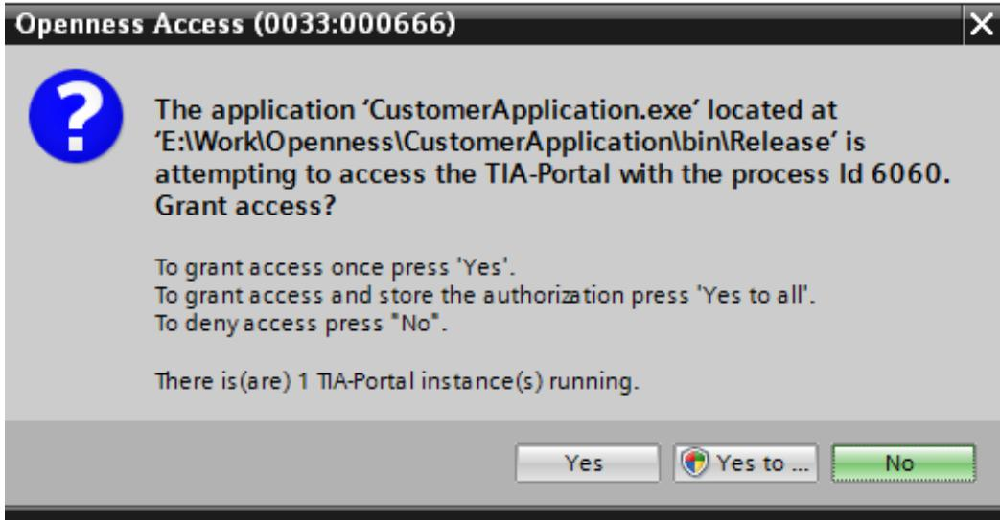

#### 允许连接一次 TIA Portal

如果您想要使 TIA Portal Openness 应用程序仅连接一次 TIA Portal，请在出现提示后单击“是”(Yes)。TIA Portal Openness 应用程序下次尝试连接 TIA Portal 时，会再次显示相应的提示。

#### 通过连接 TIA Portal 添加白名单条目

要为 TIA Portal Openness 应用程序创建白名单条目，请按照以下步骤进行操作：
1. 出现提示后，单击“全部接受”(Yes to all)，以显示“用户帐户控制”(User Account Control)对话框。
2. 在 “用户帐户控制”(User Account Control) 对话框中单击 “是”(Yes)，将应用程序添加到 Windows 注册表白名单中，并会与 TIA Portal 相连。
5.2 常规函数

#### 不使用 TIA Portal 添加白名单条目

如果要在不使用 TIA Portal 的情况下将条目添加到白名单中，可创建一个 reg 文件，如下所示：
Windows Registry Editor Version 5.00
[HKEY\_LOCAL\_MACHINE\SOFTWARE\Siemens\Automation\Openness\xx.x\Whitelist\CustomerApplication.exe]
[HKEY\_LOCAL\_MACHINE\SOFTWARE\Siemens\Automation\Openness\xx.x\Whitelist\CustomerApplication.exe\Entry]
"Path"="E:\\Work\\Openness\\CustomerApplication\\bin\\Release\\CustomerApplication.exe"
"DateModified"="2014/06/10 15:09:44.406"
"FileHash"="0rXRKUCNzMWHOMFrT52OwXzqJef10ran4UykTeBraaY="
5.2 常规函数
以下示例显示了如何计算文件哈希以及上次修改的日期：
```cs
using System;
using Siemens.Engineering;
using Siemens.Engineering.HW;
using Siemens.Engineering.HW.Features;
using Siemens.Engineering.SW;
using Siemens.Engineering.SW.Blocks;
using Siemens.Engineering.SW.ExternalSources;
using Siemens.Engineering.SW.Tags;
using Siemens.Engineering.SW.Types;
using Siemens.Engineering.Hmi;
using HmiTarget = Siemens.Engineering.Hmi.HmiTarget;
using Siemens.Engineering.Hmi.Tag;
using Siemens.Engineering.Hmi.Screen;
using Siemens.Engineering.Hmi.Cycle;
using Siemens.Engineering.Hmi.Communication;
using Siemens.Engineering.Hmi.Globalization;
using Siemens.Engineering.Hmi.TextGraphicList;
using Siemens.Engineering.Hmi.RuntimeScripting;
using System.Collections.Generic;
using Siemens.Engineering Bonpiler;
using Siemens.Engineering.Library;
using System.IO;
using System.Security.Cryptography;
namespace TIAPortalOpennessFirewall
{
    internal class Program
    {
    private static void Main(string[] args)
    {
    RunTiaPortal();
    string applicationPath = @"E:\\Work\\Openness\\CustomerApplication\\bin\\Release\\CustomerApplication.exe";
    string lastWriteTimeUtcFormatted = String.Empty;
    DateTime lastWriteTimeUtc;
    HashAlgorithm hashAlgorithm = SHA256.Create();
    FileStream stream = File.OpenRead(applicationPath);
    byte[] hash = hashAlgorithm.ComputeHash(stream);
    // this is how the hash should appear in the .reg file
    string convertedHash = Convert.ToBase64String(hash);
    lastWriteTimeUtc = fileInfo.LastWriteTimeUtc; // fileInfo not defined
    // this is how the last write time should be formatted
    lastWriteTimeUtcFormatted = lastWriteTimeUtc.ToString(@"yyyy/MM/dd HH:mm:ss.fff");
    }
}
```
```cs
private static void RunTiaPortal()
{
    Console.WriteLine("Starting TIA Portal");
    using (TiaPortal tiaPortal = new TiaPortal(TiaPortalMode.WithUserInterface))
    {
    Console.WriteLine("TIA Portal has started");
    ProjectComposition projects = tiaPortal.Projects;
    Console.WriteLine("Opening Project...");
    // please adapt the path and the extension apx to the installed version of TIA Portal
    FileInfo projectPath = new FileInfo(@"C:\Demo\AnyCompanyProject.apx");
    //edit the path according to your project
    Project project = null;
    try
    {
    project = projects.OpenWithUpgrade(projectPath);
    }
    catch (Exception)
    {
    Console.WriteLine(String.Format("Could not open project {0}", projectPath.FullName));
    Console.WriteLine("Demo complete hit enter to exit");
    Console.ReadLine();
    return;
    }
    Console.WriteLine(String.Format("Project {0} is open", project.Path.FullName));
    IterateThroughDevices(project);
    project.Close();
    Console.WriteLine("Demo complete hit enter to exit");
    Console.ReadLine();
    }
    private static void IterateThroughDevices(Project project)
    {
    if (project == null)
    {
    Console.WriteLine("Project cannot be null");
    return;
    }
    Console.WriteLine(String.Format("Iterate through {0} device(s)", project.Devices.Count));
    foreach (Device device in project.Devices)
    {
    Console.WriteLine(String.Format("Device: " {0}\".", device.Name));
    }
    Console.WriteLine();
    }
}
```

### 5.2.10 事件处理程序


#### TIA Portal Openness 应用程序中的事件处理程序

TIA Portal 实例提供了以下事件，可在 TIA Portal Openness 应用程序中通过事件处理程序对这些事件做出响应。可以访问通知的属性并相应地定义这些响应。
<table><tr><td>事件</td><td>响应</td></tr><tr><td>Disposed</td><td>可通过此事件,使用 TIA Portal Openness 应用程序对 TIA Portal 的关闭做出响应。</td></tr><tr><td>Notification</td><td>可通过此事件,使用 TIA Portal Openness 应用程序对 TIA Portal 的通知做出响应。对通知进行确认即可,如“确认”(OK)。</td></tr><tr><td>Confirmation</td><td>可通过此事件,使用 TIA Portal Openness 应用程序对 TIA Portal 的确认做出响应。确认时通常需要做出决定,如“是否要保存项目?”(Do you want to save the project?)。</td></tr></table>

#### 程序代码

在 TIA Portal Openness 应用程序中，修改以下程序代码以注册事件处理程序：
```cs
//Register event handler for Disposed-Event
.... 
    tiaPortal.Disposed +=TiaPortal_Disposed;
....
private static void TiaPortal_Disposed(object sender, EventArgs e)
{
.... 
}
//Register event handler for Notification-Event
.... 
    tiaPortal.Notification += TiaPortal_Notification;
.....
private static void TiaPortal_Notification(object sender, NotificationEventArgs e)
{
.... 
}
//Register event handler for Confirmation-Event
.... 
    tiaPortal.Confirmation += TiaPortal_Confirmation;
.....
private static void TiaPortal_Confirmation(object sender, ConfirmationEventArgs e)
{
.... 
}
```

#### TIA Portal 通知的属性

TIA Portal 通知具有以下属性:
<table><tr><td>属性</td><td>说明</td></tr><tr><td>Caption</td><td>返回确认的姓名。</td></tr><tr><td>DetailText</td><td>返回确认的详细文本。</td></tr><tr><td>Icon</td><td>返回确认的图标。</td></tr></table>
<table><tr><td>属性</td><td>说明</td></tr><tr><td>IsHandled</td><td>返回确认或指定其是否仍处于未决状态。</td></tr><tr><td>Text</td><td>返回确认的文本。</td></tr></table>

#### 确认属性

确认具有以下属性:
<table><tr><td>属性</td><td>说明</td></tr><tr><td>Caption</td><td>返回确认的姓名。</td></tr><tr><td>Choices</td><td>返回用于接受确认的选项。</td></tr><tr><td>DetailText</td><td>返回确认的详细文本。</td></tr><tr><td>Icon</td><td>返回确认的图标。</td></tr><tr><td>IsHandled</td><td>返回确认或指定其是否仍处于未决状态。</td></tr><tr><td>Result</td><td>返回确认的结果或指定结果。</td></tr><tr><td>Text</td><td>返回确认的文本。</td></tr></table>
由程序控制系统事件对话框的确认 (页 104)

### 5.2.11 由程序控制系统事件对话框的确认

要求
- TIA Portal Openness 应用程序已连接到 TIA Portal。[连接到 TIA Portal](#连接到-TIA-Portal)”
- 项目已经打开。
[打开项目](#打开项目)”
- 事件处理程序已注册。
请[连接到 TIA Portal](#连接到-TIA-Portal)
运行带用户界面的 TIA Portal 时，对某些程序操作会显示系统事件对话框。可基于这些系统事件决定继续执行的方式。
通过 TIA Portal Openness 应用程序访问 TIA Portal 时，这些系统事件必须通过相应的".NET" 事件加以确认。
Choices 列表中包含所允许的确认方式:
- Abort
- Cancel
- Ignore
• No
- NoToAll
- None
• OK
- Retry
- Yes
-YesToAll
ConfirmationEventArgs.Result 的值必须为上述条目之一。否则，会发生异常。
5.2 常规函数
修改以下程序代码以通知项目工程师所执行的 TIA Portal Openness 应用程序操作：
```cs
using System;
using Siemens.Engineering;
using Siemens.Engineering.HW;
using Siemens.Engineering.HW.Features;
using Siemens.Engineering.SW;
using Siemens.Engineering.SW.Blocks;
using Siemens.Engineering.SW.ExternalSources;
using Siemens.Engineering.SW.Tags;
using Siemens.Engineering.SW.Types;
using Siemens.Engineering.Hmi;
using HmiTarget = Siemens.Engineering.Hmi.HmiTarget;
using Siemens.Engineering.Hmi.Tag;
using Siemens.Engineering.Hmi.Screen;
using Siemens.Engineering.Hmi.Cycle;
using Siemens.Engineering.Hmi.Communication;
using Siemens.Engineering.Hmi.Globalization;
using Siemens.Engineering.Hmi.TextGraphicList;
using Siemens.Engineering.Hmi.RuntimeScripting;
using System.Collections.Generic;
using Siemens.Engineering Bonpiler;
using Siemens.Engineering.Library;
using System.IO;
Namespace
ConfirmDialogsWithSystemMessagesProgrammatically
{
class internal program()
{
private static void Main(string[] args)
{
// To respond to a confirmation event
using (TiaPortal tiaPortal = new TiaPortal());
{
tiaPortal.Confirmation += TiaPortalConfirmation(object sender, ConfirmationEventArgs e);
tiaPortal.Notification += Notification;
try
{
//perform actions that will result in a notification event
}
finally
{
tiaPortal.Notification -= Notification;
}
}
private void TiaPortalConfirmation(object sender, ConfirmationEventArgs e)
{
...
}
//Handles notifications
using (TiaPortal tiaPortal = new TiaPortal())
```
Openness: 用于工程组态工作流自动化的 API 系统手册, 11/2023
```text
{
tiaPortal.Notification += Notification;
try
{
//perform actions that will result in a notification event
}
finally
{
tiaPortal.Notification -= Notification;
}
}
```

### 5.2.12 终止与 TIA Portal 的连接

简介
如果启动了不带用户界面的 TIA Portal 实例且如果您的应用程序是唯一与 TIA Portal 相连的 TIA Portal Openness 客户端，可使用 TIA Portal Openness 应用程序关闭该 TIA Portal 实例。否则，需要断开 TIA Portal Openness 应用程序与 TIA Portal 实例的连接。
请使用 IDisposable.Dispose() 方法断开或关闭激活的 TIA Portal 实例。
可通过如下方式使用 IDisposable.Dispose() 方法:
- 通过正在使用的语句。
- 采用 try-finally 块环绕对象描述并调用该 finally 块中的 IDisposable.Dispose() 方法。关闭激活的 TIA Portal 实例后，将不能再访问 TIA Portal。
如果组态工程师在 TIA Portal Openness 应用程序访问 TIA Portal 实例过程中关闭该实例，则在下次进行 API 访问时会在 TIA Portal Openness 应用程序中发生“NonRecoverableException”类的异常。可订阅处理事件以便在关闭 TIA Portal 时收到相关调用。
修改以下程序代码以断开或关闭至 TIA Portal 的连接:
```dart
// Add code to dispose the application if the application is still instantiated
if (tiaPortal != null)
{
    tiaPortal.Dispose();
}
```
[事件处理程序](#事件处理程序)

### 5.2.13 TIA Portal 的诊断接口

应用
可以采用静态方法从 TIA Portal 的运行实例中检索某些诊断信息。诊断接口位于 TiaPortalProcess 对象上，可针对当前正在运行的 TIA Portal 实例进行检索。
诊断接口未受阻，因而无论 TIA Portal 是否处于忙碌状态，均可检索 TiaPortalProcess 对象以及访问其成员。诊断接口包含以下成员：

#### 类 TiaPortalProcess

<table><tr><td>成员</td><td>类型</td><td>函数</td></tr><tr><td>AcquisitionTime</td><td>DateTime</td><td>采集 TiaPortalProcess 对象的时间。由于 TiaPortalProcess 对象表示给定时间点处 TIA Portal 状态的完全静态快照,因而其包含的信息可能会过期。</td></tr><tr><td>Attach</td><td>TiaPortal</td><td>连接到给定的 TiaPortalProcess,它将返回一个 TiaPortal 实例。</td></tr></table>
<table><tr><td>成员</td><td>类型</td><td>函数</td></tr><tr><td>AttachedSessions</td><td>IList</td><td>当前连接到同一TIA Portal的所有其它会话的集合。该集合可为空。每个会话均由一个TiaPortalSession对象进行表示。</td></tr><tr><td>Attaching</td><td>EventHandler</td><td>该事件可使应用程序允许尝试连接TIA Portal。如果有其它应用程序尝试连接TIA Portal,该事件的订户会收到通知,并有10秒钟的时间批准连接。如果有任一订户忽略了该事件或未能及时做出响应,则会被视为拒绝其它应用程序进行连接。崩溃的应用程序未能对该事件做出响应,且无法拒绝应用程序进行连接。</td></tr><tr><td>Dispose</td><td>void</td><td>关闭相关联的TIA Portal实例。</td></tr><tr><td>Id</td><td>int</td><td>TIA Portal的过程ID。</td></tr><tr><td>InstalledSoftware</td><td>IList</td><td>当前作为部分TIA Portal进行安装的所有产品的集合。每个产品均由一个TiaPortalProduct对象进行表示,如下所述。</td></tr><tr><td>Mode</td><td>TiaPortalMode</td><td>TIA Portal的启动模式。当前值为WithUserInterface和WithoutUserInterface。</td></tr><tr><td>Path</td><td>FileInfo</td><td>TIA Portal可执行项目的路径。</td></tr><tr><td>ProjectPath</td><td>FileInfo</td><td>当前在TIA Portal中处于打开状态的项目的路径。如果项目均未打开,该属性将为空。</td></tr></table>
类 TiaPortalSession
<table><tr><td>成员</td><td>类型</td><td>函数</td></tr><tr><td>AccessLevel</td><td>TiaPortalAccessLevel</td><td>会话的访问等级。该等级以标志枚举的形式表示,其中允许存在多个访问等级。下面详细介绍了TiaPortalAccessLevel。</td></tr><tr><td>AttachTime</td><td>DateTime</td><td>建立与TIA Portal的连接的时间。</td></tr><tr><td>Id</td><td>int</td><td>当前会话的ID。</td></tr><tr><td>IsActive</td><td>bool</td><td>如果TIA Portal当前正在处理来自运行中的会话的调用,则返回“true”。</td></tr><tr><td>Dispose</td><td>void</td><td>断开与TIA Portal的过程连接。该方法不会像System.Diagnostics.Process.Kill那样终止过程。连接已被终止的应用程序仍会获取处置事件,但不会再指示终止连接的原因。</td></tr><tr><td>ProcessId</td><td>int</td><td>连接过程的过程ID。</td></tr><tr><td>ProcessPath</td><td>FileInfo</td><td>连接过程的可执行项目路径。</td></tr><tr><td>TrustAuthority</td><td>TiaPortalTrustAuthority</td><td>指示当前会话是否已由签名的过程启动,并指示其是否为TIA Portal Openness证书。TrustAuthority为标志枚举,下文对其进行了介绍。</td></tr><tr><td>UtilizationTime</td><td>TimeSpan</td><td>过程使用TIA Portal所消耗的时间。与AttachTime属性相结合,用于确定使用百分比或类似的数据。</td></tr><tr><td>Version</td><td>string</td><td>与会话相连的Siemens.Engineering.dll的版本。</td></tr></table>
枚举 TiaPortalAccessLevel
<table><tr><td>枚举值</td><td>函数</td></tr><tr><td>None</td><td>此为无效值。将该值包含在内的原因是,TiaPortalAccessLevel为标志枚举,需要使用相应的“零值”来表示未设置任何标志,但在实际使用中绝不会显示该值,因为在无访问权限的情况下无法启动会话。</td></tr><tr><td>Published</td><td>会话有权访问发布的功能。</td></tr><tr><td>Modify</td><td>会话具备修改权限。</td></tr></table>
枚举 TiaPortalTrustAuthority
<table><tr><td>枚举值</td><td>函数</td></tr><tr><td>None</td><td>未使用证书对所连接过程的主模块进行签名。</td></tr><tr><td>Signed</td><td>已使用证书(非TIA Portal Openness证书)对主模块进行签名。</td></tr><tr><td>Certified</td><td>已使用TIA Portal Openness证书对主模块进行签名。</td></tr><tr><td>CertifiedWithExpiration</td><td>已使用TIA Portal Openness证书对主模块进行签名,该证书将在到期后变为无效状态。</td></tr></table>
类 TiaPortalProduct
<table><tr><td>成员</td><td>类型</td><td>函数</td></tr><tr><td>Name</td><td>string</td><td>产品名称(例如,STEP 7 Professional)。</td></tr><tr><td>Options</td><td>IList</td><td>属于相连 TIA Portal 的所有可选数据包集合,以TiaPortalProduct 对象的形式进行表示。如果某个选件包自身具备选件包,则会保留这种嵌套关系。</td></tr><tr><td>Version</td><td>string</td><td>产品版本字符串。</td></tr></table>
以下代码片段即为有关如何使用诊断接口查询信息然后在应用程序中使用该信息的示例。
```cs
public void TiaPortalDiagnostics()
{
    IList<TiaPortalProcess> tiaPortalProcesses = TiaPortal.GetProcesses();
    foreach (TiaPortalProcess tiaPortalProcess in tiaPortalProcesses)
    {
    Console.WriteLine("Process ID: {0}", tiaPortalProcess.Id);
    Console.WriteLine("Path: {0}", tiaPortalProcess.Path);
    Console.WriteLine("Project: {0}", tiaPortalProcess.ProjectPath);
    Console.WriteLine("Timestamp: {0}", tiaPortalProcess.AcquisitionTime);
    Console.WriteLine("UI Mode: {0}", tiaPortalProcess.Mode);
    //See method body below.
    Console.WriteLine("Installed Software:");
    EnumerateInstalledProducts(tiaPortalProcess.InstalledSoftware);
    Console.WriteLine("Attached Openness Applications:");
    foreach (TiaPortalSession session in tiaPortalProcess.AttachedSessions)
    {
    Console.WriteLine("Process: {0}", session.ProcessPath);
    Console.WriteLine("Process ID: {0}", session.ProcessId);
    DateTime attachTime = session.AttachTime;
    TimeSpan timeSpentAttached = DateTime.Now - attachTime;
    TimeSpan utilizationTime = session.UtilizationTime;
    long percentageTimeUsed = (utilizationTime.Ticks / timeSpentAttached.Ticks) * 100;
    Console.WriteLine("AttachTime: {0}", attachTime);
    Console.WriteLine("Utilization Time: {0}", utilizationTime);
    Console.WriteLine("Time spent attached: {0}", timeSpentAttached);
    Console.WriteLine("Percentage of attached time spent using TIA Portal: {0}", percentagetimeUsed);
    Console.WriteLine("AccessLevel: {0}", session.AccessLevel);
    Console.WriteLine("TrustAuthority: {0}", session.TrustAuthority);
    if ((session.TrustAuthority & TiaPortalTrustAuthority.Certified) != TiaPortalTrustAuthority.Certified)
    {
    Console.WriteLine("TrustAuthority doesn't match required level, attempting to terminate connection to TIA Portal.");
    session.Dispose();
    }
    }
}
public void EnumerateInstalledProducts(IEnumerable<TiaPortalProduct> products)
{
    foreach (TiaPortalProduct product in products)
    {
    Console.WriteLine("Name: {0}", product.Name);
    Console.WriteLine("Version: {0}", product.Version);
    //recursively enumerate all option packages
    Console.WriteLine("Option Packages \n:");
    EnumerateInstalledProducts(product.Options);
    }
```

#### 安全相关的信息

由于无需连接 TIA Portal 即可使用诊断接口，因此可以写入 Windows 服务，该服务使用连接事件检查试图连接 TIA Portal 的应用程序（例如，仅限以允许连接的公司名开头的应用程序）。还可以始终授权访问，但应向日志中写入连接过程的相关信息。以下程序代码即为用于检查传入连接的事件处理程序示例：
```cs
public void OnAttaching(object sender, AttachingEventArgs e)
{
    string name = Path.GetFileNameWithoutExtension(e.ProcessPath);
    TiaPortalAccessLevel requestedAccessLevel = e.AccessLevel & TiaPortalAccessLevel.Published;
    TiaPortalTrustAuthority certificateStatus = e.TrustAuthority &TiaPortalTrustAuthority.Certified;
    if (requestedAccessLevel == TiaPortalAccessLevel.Published && certificateStatus == TiaPortalTrustAuthority.Certified && name.StartsWith("SampleCustomerName"))
    {
    e.GrantAccess();
    }
}
```

### 5.2.14 独占访问

- TIA Portal Openness 应用程序已连接到 TIA Portal。请[连接到 TIA Portal](#连接到-TIA-Portal)
- 项目已经打开。
请[打开项目](#打开项目)
"TIA Portal"类会提供方法"ExclusiveAccess(String text)"来建立附加 TIA Portal 过程的独占访问。即使不强制使用独占访问，也强烈建议使用。
在“using”语句中使用“ExclusiveAccess”可确保正确对其进行处理，即使发生异常或应用程序关闭，亦能如此。
如果在开放式独占访问范围内试图创建另一个独占访问，则会产生可恢复的异常。
修改以下示例即可对实例进行“ExclusiveAccess”:
```text
...
[assembly: AssemblyTitle("MyApplication")]
// This will be used for the exclusive access dialog when present....
TiaPortal tiaPortal = ...;
using (ExclusiveAccess exclusiveAccess = tiaPortal.ExclusiveAccess("My Activity"))
{
    ...
}
```
针对给定 TIA Portal 过程获得“ExclusiveAccess”实例后，会显示一个对话框。该对话框会显示实例化期间提供的消息。此外，还会显示客户端应用程序的以下信息：
- 清单数据的程序集标题（如果可用）；否则会显示过程名称
- 过程 ID
- SID（客户端应用程序 TiaPortal 实例的 Openness 会话 ID）
对于某个已知的 TIA Portal Openness 客户端应用程序，可能存在多个活动的会话，这是因为可能存在多个与同一个 TIA Portal 过程相关联的 TiaPortal 实例。
客户端应用程序还会通过使用新值设置“文本”(Text)属性的方式更新独占访问对话框的所显示内容。修改以下程序代码以调用该行为：
```text
exclusiveAccess = ...;
...
exclusiveAccess.Text = "My Activity Phase 1";
...
exclusiveAccess.Text = "My Activity Phase 2";
...
exclusiveAccess.Text = String.Empty; // or null;
...
```
可以请求通过选择“取消”(Cancel)按钮来取消独占访问。修改以下程序代码以调用该行为：
```text
exclusiveAccess = ...;
...
if (exclusiveAccess.IsCancellationRequested)
{
    // stop your activity
    ...
}
else
{
    // continue your activity
    ...
}
...
```

### 5.2.15 动态特性


#### Openness 中的动态特性

Openness 用户可在运行期间确定对象及其属性，还能够调用动作并在层级结构中双向导航至相关对象。为支持动态特性，提供了以下通过 Openness 对象实现的接口：

#### IEngineeringInstance

允许在对象模型中向上导航的接口。
特性:
- IEngineeringObject Parent - 实例的父对象。

#### IEngineeringCompositionOrObject

此接口通过工程组态对象及构成实现。

#### IEngineeringObject

此接口通过 Openness 用户可用的大多数对象实现。IEngineeringObject 接口由 IEngineeringCompositionObject 和 IEngineeringInstance 派生而来：

#### 方法：

- IList<EngineeringCreationInfo> GetCreationInfos(string compositionName) - 获取对象可用的构成信息列表。
- IEngineeringObject Create(string compositionName, Type type, IEnumerable<KeyValuePair<string, object>> parameters) - 创建指示类型的 IEngineeringObject，并将其初始化为参数中指示的 compositionName 的值
- object GetAttribute(string name) - 获取使用给定名称的属性。
- IList<EngineeringAttributeInfo> GetAttributeInfos() - 返回一系列描述该对象不同属性的 EngineeringAttributeInfo 对象。
- IList<object> GetAttributes(lEnumerable<string>names) - 获取给定名称的属性列表
- IEngineeringCompositionObject GetComposition(string name) - 获取使用给定名称的 IEngineeringCompositionObject。
- IList<EngineeringInvocationInfo> GetInvocationInfos() - 返回一系列描述该对象不同动作的 EngineeringInvocationInfo 对象。
- object Invoke(string name, IEnumerable<KeyValuePair<Type, object>> parameters) - 使用指定参数调用由当前实例表示的方法。
- void SetAttribute(string name, object value) - 将使用给定名称的属性设置为给定值
- void SetAttributes(lEnumerable<KeyValuePair<string, object>> attributes) - 将使用给定名称的属性设置为属性中指示的给定值。
- EngineeringObjectHandle GetHandle() - 获取对象的唯一句柄。
- void SetAttributes(IEnumerable<KeyValuePair<string, object>> attributes,
AttributeDelegate errorHandler) - 将使用给定名称的属性设置为属性密钥值对中指示的给定值。如果发生任何错误（例如，属性名称/值无效），将触发回调调用，以便用户可以决定是忽略并继续为下一个属性设置值还是中止为剩余属性设置值。
在 TIA Portal Openness V18 中，新方法 void
SetAttributes(IEnumerable<KeyValuePair<string, object>> attributes, AttributeDelegate errorHandler) 被添加到 IEngineeringObject。
目前，SetAttributes(lEnumerable<KeyValuePair<string, object>> attributes,
AttributeDelegate errorHandler) 受以下工程组态对象支持:
• Siemens.Engineering.HW.Features.NetworkInterface
• Siemens.Engineering.HW.Features.NetworkPort
• Siemens.Engineering.HW.Features.PlcAccessLevelProvider
• Siemens.Engineering.HW.Address
• Siemens.Engineering.HW.Channel
• Siemens.Engineering.HW.Device
• Siemens.Engineering.HW.DeviceImpl
• Siemens.Engineering.HW.DeviceItem
• Siemens.Engineering.HW.DeviceItemImpl
• Siemens.Engineering.HW.HardwareObject
• Siemens.Engineering.HW.IoConnector
• Siemens.Engineering.HW.IoController
• Siemens.Engineering.HW.IoSystem
• Siemens.Engineering.HW.MrpDomain
• Siemens.Engineering.HW.Node
• Siemens.Engineering.HW.Subnet
• Siemens.Engineering.HW.SyncDomain
• Siemens.Engineering.HW.TransferArea
如果使用任何其它工程组态对象，则该方法的行为类似于没有回调的方法 void SetAttributes(IEnumerable<KeyValuePair<string, object>> attributes)。

#### 程序代码：SetAttributes(lEnumerable<KeyValuePair<string, object>>) 方法

```text
...
...
List<KeyValuePair<string, object>> attributeKeyValuePair = new List<KeyValuePair<string, object>>( )
{
new KeyValuePair<string, object>("Name", "DeviceItemName")
};
deviceItem.SetAttributes(attributeKeyValuePair, (AttributeConfiguration
attributeConfiguration) =>
{
//This callback delegate will be invoked when there is an error while executing the
SetAttributes API,
//reason could be either due to the attribute having invalid attribute name, invalid value,
//invalid type of the value or when tried to set the value to a readonly attribute
switch (attributeConfiguration)
{
case AttributeReadOnly attributeReadOnly:
attributeReadOnly.CurrentSelection = AttributeChoiceSelection.Ignore;
break;
case AttributeNameUnsupported attributeNameUnsupported:
//Attribute name is not supported
attributeNameUnsupported.CurrentSelection = AttributeChoiceSelection.Ignore;
// Or AttributeChoiceSelection.Abort
break;
case AttributeTypeUnsupported attributeTypeUnsupported:
//The the type of supplied value is not supported
attributeTypeUnsupported.CurrentSelection = AttributeChoiceSelection.Ignore; // Or
AttributeChoiceSelection.Abort
break;
case AttributeValueUnsupported attributeValueUnsupported:
//The value is not supported
attributeValueUnsupported.CurrentSelection = AttributeChoiceSelection.Ignore; // Or
AttributeChoiceSelection.Abort
break;
}
}
);
```

#### IEngineeringRoot

此接口通过 TiaPortal 对象实现，并指示用户位于层级结构中的顶部对象。IEngineeringRoot 由 IEngineeringObject、IEngineeringCompositionObject 和 IEngineeringInstance 派生而来。
- IEngineeringObject GetObject(EngineeringObjectHandle objectHandle) - 从句柄中获取对象

#### IEngineeringComposition

此接口通过 Openness 用户可用的大多数对象实现。IEngineeringObject 接口由 IEngineeringCompositionObject 和 IEngineeringInstance 派生而来。除了 “使用组合 (页 123)” 中介绍的特性和方法外，还支持以下方法。
方法：
- IEngineeringObject Create(Type type, IEnumerable<KeyValuePair<string, object>> parameters) - 创建指示类型的 IEngineeringObject，并将其初始化为参数中指示的值。
- IList<EngineeringCreationInfo> GetCreationInfos() - 获取一系列描述该对象不同CreateInfo 的 EngineeringCreateInfo 对象。
- IList<EngineeringInvocationInfo> GetInvocationInfos() - 返回一系列描述该对象不同动作的 EngineeringInvocationInfo 对象。
- object Invoke(string name, IEnumerable<KeyValuePair<Type, object>> parameters) - 使用指定参数调用由当前实例表示的方法。

#### IEngineeringObjectAssociation

此接口通过一系列关联的工程组态对象实现。此接口由 IEngineeringAssociation 和 IEngineeringInstance 派生而来。请[使用关联](#使用关联)”

#### IEngineeringServiceProvider

此接口通过可提供服务的工程组态对象实现。
方法：
- T GetService<T>() where T : class, IEngineeringService - 获取类型为 T 的实例。
- IList<EngineeringServiceInfo> GetServiceInfos() - 返回一系列描述该对象不同服务的 EngineeringServiceInfo 对象。

#### IEngineeringService

表示由 IEngineeringServiceProvider 提供的工程组态服务的接口。

#### EngineeringObjectHandle

提供唯一对象句柄的结构。
[使用组合](#使用组合)
使用关联 (页 122)

### 5.2.16 使用关联


#### 访问关联

关联是指类型级别两个或更多对象之间的关系。
TIA Portal Openness 支持通过索引和“foreach”循环访问关联。不支持通过 string name 进行直接访问。
属性
以下属性可用：
- int Count
- bool IsReadOnly
- IEngineeringObject Parent
- retType this [ int index ] { get; }
方法
TIA Portal Openness 支持以下方法:
- int IndexOf (type): 返回关联中已传送实例的索引。
- bool Contains (type): 确定已传送实例是否包含在关联中。
- IEnumerator GetEnumerator <retType>()：在"foreach"循环中使用以访问对象。
- void Add (type) $^{1}$ ：将已传送的实例添加至关联。
- void Remove (type) $^{1}$ ：将已传送的实例从关联中移除。
1: 并非所有关联均支持。

### 5.2.17 使用组合


#### 访问组合

组合是关联的特殊情况。组合表达的是两个从属对象之间的语义关系。

#### 属性

以下属性可用：
- int Count
- bool IsReadOnly
- IEngineeringObject Parent
- retType this [int index] {get;}：对组合对象的索引访问。
此类型访问仅应采取针对性方式，因为每个索引访问操作都超出了过程限制。

#### 方法

TIA Portal Openness 支持以下方法:
- retType Create (id, ...)：创建新的实例并将此实例添加到组合中。该方法的签名取决于创建实例的方式。并非所有组合都支持此方法。
- type Find (id, ...)：使用已传送的 ID 扫描实例的组合。
该搜索不是递归的。该方法的签名取决于搜索实例的方式。并非所有组合都支持此方法。
- IEnumerator GetEnumerator<retType>(): 在"foreach"循环中使用以访问对象。
- Delete (type) $^{1}$ : 删除由当前对象参考指定的实例。
- int IndexOf (type): 返回组合中已传送实例的索引。
- bool Contains (type): 确定已传送实例是否包含在组合中。
- void Import(string path, ImportOptions importOptions) $^{1}$ ：用于每一个包含可导入类型的组合。
每个导入签名都包含一个 “ImportOptions (页 1397)” 类型的组态参数（“None”、“Overwrite”），用户可以通过该参数控制导入行为。
1: 并非所有组合均支持。

### 5.2.18 验证对象的相等性

应用
作为 TIA Portal Openness API 的用户，可以检查对象是否与程序代码相同：
- 检查两个对象参考是否与运算符“==”相同。
- 使用 System.Object.Equals() 方法可检查这两个对象是否真的与 TIA Portal 相同。
修改以下程序代码以检查对象参考类型:
```text
...
//Composition
DeviceComposition sameCompA = project.Devices;
DeviceComposition sameCompB = project.Devices;
if (sameCompA.Equals(sameCompB))
{
    Console.WriteLine("sameCompA is equal to sameCompB");
}
if (!(sameCompA == sameCompB))
{
    Console.WriteLine("sameCompA is not reference equal to sameCompB");
}
DeviceComposition sameCompAsA = sameCompA;
if (sameCompAsA.Equals(sameCompA))
{
    Console.WriteLine("sameCompAsA is equal to sameCompA");
}
if (sameCompAsA == sameCompA)
{
    Console.WriteLine("sameCompAsA is reference equal to sameCompA");
}
MultiLingualGraphicComposition notSameComp = project.Graphics;
if (!sameCompA.Equals(notSameComp))
{
    Console.WriteLine("sameCompA is not equal to notSameComp");
}
```

### 5.2.19 属性的读取操作


#### 属性的组操作和标准读取操作

TIA Portal Openness 支持通过以下类函数访问属性，这些类函数在对象级别均可用：
- 读访问的组操作
- 标准读取操作

#### 组操作的程序代码

```cs
//Exercise GetAttributes and GetAttributeNames
//get all available attributes for a device,
//then get the names for those attributes, then display the results.
private static void DynamicTest(Project project)
{
    Device device = project.Devices[0];
    IList<string> attributeNames = new List<string>();
    IList<EngineeringAttributeInfo> attributes = ((IEngineeringObject)device).GetAttributeInfos();
    foreach (EngineeringAttributeInfo engineeringAttributeInfo in attributes)
    {
    string name = engineeringAttributeInfo.Name;
    attributeNames.Add(name);
    }
    IList<object> values = ((IEngineeringObject)device).GetAttributes(attributeNames);
    for (int i = 0; i < attributes.Count; i++)
    {
    Console.WriteLine("attribute name: " + attributeNames[i] + " value: " + values[i]);
    }
}
```

#### 读访问的组操作

```text
该类函数适用于任何对象：
public abstract IList<object> GetAttributes(IEnumerable<string>names);
```

#### 标准读取操作

可执行以下操作：
- 检索可用属性的名称：
在 IEngineeringObject 中，调用类函数 GetAttributeInfos() (页 134)。
```text
- 读取属性的通用类函数
public abstract object GetAttribute(string name);
```
动态属性不显示在 IntelliSense 中，因为其可用性取决于对象实例的状态。

### 5.2.20 事务处理

- TIA Portal Openness 应用程序已连接到 TIA Portal。[连接到 TIA Portal](#连接到-TIA-Portal)”
- 项目已经打开。
[打开项目](#打开项目)”

#### 操作

对于相关 TIA Portal 过程中打开的保留设置（项目和库等），可通过 TIA Portal Openness 客户端应用程序进行修改。可以通过单次操作或通过系列操作实现此修改。根据具体活动合理地将这些操作组成单一撤消单元，以用于更多的逻辑工作流。此外，将操作组成单一撤消单元还展现出了性能优势。为此，“ExclusiveAccess”类提供了方法
"Transaction(lTransactionSupport persistence, string undoDescription)"。调用该方法时会对“事务”类型的新可处置对象进行实例化。用户必须提供事务内容的相关说明（文本属性不能为 null 或空）。如果尚未处理该实例，在相关的 TIA Portal 过程中所有客户端应用程序操作均会组成单一撤消单元。
5.2 常规函数
修改以下程序代码获取“Transaction”实例：
```text
ExclusiveAccess exclusiveAccess = ...;
Project project = ...;
using (Transaction transaction = exclusiveAccess.Transaction(project, "My Operation"))
{
    ...
}
```
使用“using”语句实例化“Transaction”，以确保正确对其进行处理，即使发生异常进而回滚事务，亦能如此。

#### 一致提交或回滚

使用客户端应用程序中的“Transaction”有助于确保以可预测的方式提交或回滚系列修改。客户端应用程序必须决定是否提交对默认设置的修改。为此，应用程序必须要求在通过调用“Transaction.CommitOnDispose()”方法处理事务时，提交活动事务范围内的修改。如果从未在代码流中调用该方法，则在处理活动事务范围内的修改时，会自动回滚此类修改。
```text
打开的事务中发生 Siemens.Engineering.TargetInvocationException 之后，如果对 Transaction.CommitOnDispose() 进行任何调用，会抛出可恢复的异常。
```
如果在发出请求后出现异常，活动事务范围内的所有修改仍会在处理期间进行回滚。
可通过两个特性确定给定事务的提交状态:
<table><tr><td>特性</td><td>数据类型</td><td>描述</td></tr><tr><td>Transaction.CanCommit</td><td>布尔值</td><td>指示之前对 Transaction.CommitOnDispose() 的调用是否会被采纳,或者后续对 Transaction.CommitOnDispose() 的调用是否会抛出可恢复的异常</td></tr><tr><td>Transacation.CommitRequested</td><td>布尔值</td><td>指示用户是否在给定事务中调用了 Transaction.CommitOnDispose()</td></tr></table>
修改以下程序代码以在包含两个“Create”修改的连接 TIA Portal 中创建一个撤消单元：
```text
ExclusiveAccess exclusiveAccess = ...;
Project project = ...;
// Create a single undo unit with name "My Operation" in attached TIA Portal
using (Transaction transaction = exclusiveAccess.Transaction(project, "My Operation")
{
project.DeviceGroups.Create("My Group 1");
project.DeviceGroups.Create("My Group 2");
transaction.CommitOnDispose();
}
```
修改以下程序代码以创建无撤销单元：
```text
ExclusiveAccess exclusiveAccess = ...;
Project project = ...;
using (Transaction transaction = exclusiveAccess.Transaction(project, "My Operation"))
{
    project.DeviceGroups.Create("My Folder 1");
    project.DeviceGroups.Create("My Folder 2");
}
```
修改以下程序代码，以在连接的 TIA Portal 中创建无撤销单元。这是由于第二次尝试创建文件夹 “我的文件夹 1”(My Folder 1) 时引发的异常而导致，尽管在引发异常之前已经发出了提交处置的请求：
```text
ExclusiveAccess exclusiveAccess = ...;
Project project = ...;
using (Transaction transaction = exclusiveAccess.Transaction(project, "My Operation"))
{
    project.DeviceGroups.Create("My Folder 1");
    project.DeviceGroups.Create("My Folder 2");
    transaction.CommitOnDispose();
    project.DeviceGroups.Create("My Folder 1");
}
```
修改以下程序代码，以在连接的 TIA Portal 中创建无撤销单元。这是由于第二次尝试创建文件夹 “我的文件夹 1”(My Folder 1) 时引发的异常而导致，尽管 try/catch 块围绕导致引发异常的调用：
```text
ExclusiveAccess exclusiveAccess = ...;
Project project = ...;
using (Transaction transaction = exclusiveAccess.Transaction(project, "My Operation"))
{
    project.DeviceGroups.Create("My Folder 1");
    project.DeviceGroups.Create("My Folder 2");
    transaction.CommitOnDispose();
    try
    {
    project.DeviceGroups.Create("My Folder 1");
    }
    catch (Siemens.Engineering.TargetInvocationException ex)
    {
    ...
    }
}
```
修改以下程序代码，以在连接的 TIA Portal 中创建撤销单元。这是因为在代码流中提前引发 Siemens.Engineering.TargetInvocationException 后调用 Transaction.CommitOnDispose() 而导致，尽管 try/catch 块围绕导致引发异常的调用：
```text
ExclusiveAccess exclusiveAccess = ...;
Project project = ...;
using (Transaction transaction = exclusiveAccess.Transaction(project, "My Operation"))
{
try
{
project.DeviceGroups.Create("My Folder 1");
project.DeviceGroups.Create("My Folder 1");
}
catch (Siemens.Engineering.TargetInvocationException ex)
{
...
}
transaction.CommitOnDispose();
}
```
修改以下程序代码以回滚事务。这是由于如果任何先前语句的执行在给定事务范围内引发异常，则永远不会执行 Transaction.CommitOnDispose()。
```lua
ExclusiveAccess exclusiveAccess = ...;
Project project = ...;
try
{
using (Transaction transaction = exclusiveAccess.Transaction(project, "My Operation"))
{
project.DeviceGroups.Create("My Folder 1");
project.DeviceGroups.Create("My Folder 1");
transaction.CommitOnDispose();
}
catch (Exception ex)
{
...
}
```

#### 限制

事务内不允许以下操作。调用这些操作会导致可恢复异常：

#### 撤消行为

TIA Portal Openness 客户端应用程序执行的操作可能导致在连接的 TIA Portal 过程中出现撤消单元。将在位置条目下组合其中的各个撤消条目。该位置条目会组合客户端应用程序中的以下信息：
- 清单数据的程序集标题（如果可用）；不可用的话则为过程名称
- 过程 ID
- SID（客户端应用程序 TiaPortal 实例的 Openness 会话 ID）
- 表明客户端过程仍在运行的指示（可选）
这些条目将属于以下两种类型之一：
1. 对于因使用 “事务” 而被集合到一个撤消事务中的操作，实例化 “事务” 时客户端应用程序提供了相应的说明。
- 正在运行的客户端应用程序的撤消条目：
```text
MySuperApplication, PID: 4704, SID: 4, running
My Operation
```
- 已停止运行的客户端应用程序的撤消条目：
```text
MySuperApplication, PID: 4704, SID: 4
My Operation
```
2. 对于单独执行的操作，其各个撤消条目介绍了相应的命令元数据中所定义的操作。
- 正在运行的客户端应用程序的撤消条目：
```text
MySuperApplication, PID: 11224, SID: 3, running
Create Folder "My Folder 2"
Create Folder "My Folder 1"
```
- 已停止运行的客户端应用程序的撤消条目：
```text
MySuperApplication, PID: 11224, SID: 3
Create Folder "My Folder 2"
Create Folder "My Folder 1"
```

### 5.2.21 创建DirectoryInfo/FileInfo对象

应用
DirectoryInfo 和 FileInfo 类别的实例必须包含绝对路径。否则，使用 DirectoryInfo 或 FileInfo 对象的方法将导致异常。
5.2 常规函数
修改以下程序代码以创建 DirectoryInfo 或 FileInfo 对象。
5.2 常规函数
```cs
using System;
using Siemens.Engineering;
using Siemens.Engineering.HW;
using Siemens.Engineering.HW.Features;
using Siemens.Engineering.SW;
using Siemens.Engineering.SW.Blocks;
using Siemens.Engineering.SW.ExternalSources;
using Siemens.Engineering.SW.Tags;
using Siemens.Engineering.SW.Types;
using Siemens.Engineering.Hmi;
using HmiTarget = Siemens.Engineering.Hmi.HmiTarget;
using Siemens.Engineering.Hmi.Tag;
using Siemens.Engineering.Hmi.Screen;
using Siemens.Engineering.Hmi.Cycle;
using Siemens.Engineering.Hmi.Communication;
using Siemens.Engineering.Hmi.Globalization;
using Siemens.Engineering.Hmi.TextGraphicList;
using Siemens.Engineering.Hmi.RuntimeScripting;
using System.Collections.Generic;
using Siemens.Engineering Bonpiler;
using Siemens.Engineering.Library;
using System.IO;
namespace CreateObjectDirectoryInfoFileInfo
{
    internal class Program
    {
    private static void Main(string[] args)
    {
    RunTiaPortal();
    //...
    //Create a DirectoryInfo object
    string directoryPath = @"D:\Test\Project 1";
    DirectoryInfo directoryInfo = new DirectoryInfo(directoryPath);
    //Create a FileInfo object
    //please adapt the path and the extension apx to the installed version of TIA Portal
    string fileName = @"D:\Test\Project 1PROJECT 1.apx";
    FileInfo fileInfo = new FileInfo(fileName);
    //...
    }
    private static void RunTiaPortal()
    {
    Console.WriteLine("Starting TIA Portal");
    using (TiaPortal tiaPortal = new TiaPortal(TiaPortalMode.WithUserInterface))
    {
    Console.WriteLine("TIA Portal has started");
    ProjectComposition projects = tiaPortal.Projects;
```
Openness: 用于工程组态工作流自动化的 API 系统手册, 11/2023
```cs
Console.WriteLine("Opening Project...");
// please adapt the path and the extension apx to the installed version of TIA Portal
FileInfo projectPath = new FileInfo(@"C:\Demo\AnyCompanyProject.apx");
//edit the path according to your project
Project project = null;
try
{
project = projects.OpenWithUpgrade(projectPath);
}
catch (Exception)
{
Console.WriteLine(String.Format("Could not open project {0}", projectPath.FullName));
Console.WriteLine("Demo complete hit enter to exit");
Console.ReadLine();
return;
}
Console.WriteLine(String.Format("Project {0} is open", project.Path.FullName));
IterateThroughDevices(project);
project.Close();
Console.WriteLine("Demo complete hit enter to exit");
Console.ReadLine();
}
private static void IterateThroughDevices(Project project)
{
if (project == null)
{
Console.WriteLine("Project cannot be null");
return;
}
Console.WriteLine(String.Format("Iterate through {0} device(s)", project.Devices.Count));
foreach (Device device in project.Devices)
{
Console.WriteLine(String.Format("Device: „{0}\".", device.Name));
}
Console.WriteLine();
}
}
```

### 5.2.22 属性、导航器、操作和服务的自述支持

在 TIA Portal Openness 中，TIA Portal Openness API 的各个 IEngineeringServiceProvider 均介绍了其潜在调用功能。
IEngineeringObject 的自述支持
<table><tr><td>方法名称</td><td>返回值</td></tr><tr><td>GetCompositionInfos</td><td>返回 EngineeringCompositionInfo 对象的集合,其中介绍了这类对象的各种组合。下面对 EngineeringCompositionInfo 进行了介绍。</td></tr><tr><td>GetAttributeInfos</td><td>返回 EngineeringAttributeInfo 对象的集合,其中介绍了这类对象的各种属性。下面对 EngineeringAttributeInfo 进行了介绍。</td></tr><tr><td>GetInvocationInfos</td><td>返回 EngineeringInvocationInfo 对象的集合,其中介绍了这类对象的各种操作。下面对 EngineeringInvocationInfo 进行了介绍。</td></tr></table>
IEngineeringServiceProvider 的自述支持
<table><tr><td>方法名称</td><td>返回值</td></tr><tr><td>GetServiceInfos</td><td>返回 EngineeringServiceInfo 对象的集合,其中介绍了这类对象的各种服务。下面对 EngineeringServiceInfo 进行了介绍。</td></tr></table>

#### IEngineeringComposition 的自述支持

<table><tr><td>方法名称</td><td>返回值</td></tr><tr><td>GetCreationInfos</td><td>返回 EngineeringCreationInfo 对象的集合,其中介绍了这类对象的各种操作。下面对 EngineeringcreationInfo 进行了介绍。</td></tr></table>
类 EngineeringCompositionInfo
<table><tr><td>属性名称</td><td>返回值</td></tr><tr><td>Name</td><td>组合名称</td></tr></table>
类 EngineeringAttributeInfo
<table><tr><td>属性名称</td><td>返回值</td></tr><tr><td>AccessMode</td><td>属性所支持的访问等级。该属性为可组合属性,下文对其进行了详细介绍。</td></tr><tr><td>Name</td><td>属性名称。</td></tr><tr><td>CreateRelevance</td><td>与创建属性相关的级别。</td></tr><tr><td>SupportedTypes</td><td>可能支持的属性类型。</td></tr></table>
类 EngineeringInvocationInfo
<table><tr><td>属性名称</td><td>返回值</td></tr><tr><td>Name</td><td>操作名称。</td></tr><tr><td>ParameterInfos</td><td>EngineeringInvocationParameterInfo 对象的集合,其中介绍了操作可能需要的所有参数。下面对EngineeringInvocationParameterInfo 进行了介绍。</td></tr></table>
类 EngineeringServiceInfo
<table><tr><td>属性名称</td><td>返回值</td></tr><tr><td>Type</td><td>用作 System.Type 对象的服务类型。</td></tr></table>
Enum AccessMode
<table><tr><td>枚举值</td><td>返回值</td></tr><tr><td>None</td><td>此为无效选项。</td></tr><tr><td>Read</td><td>可读取属性。</td></tr><tr><td>Write</td><td>可写入属性。</td></tr></table>
类 EngineeringInvocationParameterInfo
<table><tr><td>属性名称</td><td>返回值</td></tr><tr><td>Name</td><td>参数的名称。</td></tr><tr><td>Type</td><td>用作 System.Type 对象的参数类型</td></tr></table>
类 EngineeringCreationInfo
<table><tr><td>属性名称</td><td>返回值</td></tr><tr><td>Type</td><td>Type 属性返回一个 System.Type 对象</td></tr><tr><td>ParameterInfos</td><td>ParameterInfos 属性返回EngineeringCreationParameterInfo 对象的集合</td></tr></table>
类 EngineeringCreationParameterInfo
<table><tr><td>属性名称</td><td>返回值</td></tr><tr><td>Name</td><td>相关参数的名称</td></tr></table>
AccessMode 为标志枚举，其值可组合成以下程序代码的形式：
EngineeringAttributeAccessMode value = EngineeringAttributeAccessMode.Read | EngineeringAttributeAccessMode.Write;
修改以下程序代码以查找 IEngineeringObject 的全部属性和更改这些属性的访问模式。
```text
...
IEngineeringObject engineeringObject = ...;
IList<EngineeringAttributeInfo> attributeInfos = engineeringObject.GetAttributeInfos();
foreach (EngineeringAttributeInfo attributeInfo in attributeInfos)
{
    switch (attributeInfo.AccessMode)
    {
    case EngineeringAttributeAccessMode.Read:
    ...
    break;
    case EngineeringAttributeAccessMode.Write:
    ...
    break;
    case EngineeringAttributeAccessMode.Read|EngineeringAttributeAccessMode.Write:
    ...
    break;
    }
}
```

#### 修改以下关于如何将 Create 和 GetCreationInfos 搭配使用的程序代码。

```text
...
Project project = tiaPortal.Projects.Open(projectPath);
IEngineeringComposition deviceGroupComposition = project.DeviceGroups;
EngineeringCreationInfo deviceGroupCreationInfo = deviceGroupComposition.GetCreationInfos()
[0];
EngineeringCreationParameterInfo deviceGroupCreationParameterInfo =
deviceGroupCreationInfo.ParameterInfos[0];
string deviceGroupCreationParameterName = deviceGroupCreationParameterInfo.Name;
string groupName = "Example";
IDictionary<string, object> createParameters = new Dictionary<string, object>
{
{deviceGroupCreationParameterName, groupName }
};
IEngineeringObject group = deviceGroupComposition.Create(deviceGroupCreationInfo.Type, createParameters);
...
```

### 5.2.23 设置块、DB 和 UDT 的属性

可以通过 Openness API 写入和读取块（以任何编程语言编写）、DB 和 UDT 的（常规）属性。
TechnologicalObjects 为内部 DB，因此此特性也对 TO 有效。
将在 GUI 中应用的块、DB (TO) 或 UDT 上使用 Openness API 的 SetAttribute 对 Name 应用相同的检查规则。
如果违反规则，则会出现相应的用户异常，不应更改属性值。
API 的这一扩展功能不会影响 XML 导出/导入。

#### 常规属性


#### 图例

- X: 属性相关，写入到 xml，可使用 API 访问
- -：属性不可访问，属性不存在
<table><tr><td rowspan="2">属性</td><td rowspan="2">数据类型</td><td colspan="3">通过API提供的可用性</td></tr><tr><td>CodeBlock</td><td>DB</td><td>UDT</td></tr><tr><td>AutoNumber</td><td>Boolean</td><td>X (xml); RW (API)</td><td>X (xml); RW (API)</td><td>-</td></tr><tr><td>CodeModifiedDate</td><td>DateTime</td><td>X (xml); R (API)</td><td>X (xml); R (API)</td><td>-</td></tr><tr><td>CompileDate</td><td>DateTime</td><td>X (xml); R (API)</td><td>X (xml); R (API)</td><td>-</td></tr><tr><td>CreationDate</td><td>DateTime</td><td>X (xml); R (API)</td><td>X (xml); R (API)</td><td>X (xml); R (API)</td></tr><tr><td>HeaderAuthor</td><td>字符串</td><td>X (xml); R (API)</td><td>X (xml); R (API)</td><td>-</td></tr><tr><td>HeaderFamily</td><td>字符串</td><td>X (xml); R (API)</td><td>X (xml); R (API)</td><td>-</td></tr><tr><td>HeaderName</td><td>字符串</td><td>X (xml); R (API)</td><td>X (xml); R (API)</td><td>-</td></tr><tr><td>HeaderVersion</td><td>System.Version</td><td>X (xml); R (API)</td><td>X (xml); R (API)</td><td>-</td></tr><tr><td>InstanceOfName</td><td>字符串</td><td>-</td><td>X (xml); R (API)</td><td>-</td></tr><tr><td>Interface</td><td>字符串</td><td>X (xml); - (API)</td><td>X (xml); - (API)</td><td>X (xml); - (API)</td></tr><tr><td>InterfaceModifiedDate</td><td>DateTime</td><td>X (xml); R (API)</td><td>X (xml); R (API)</td><td>X (xml); R (API)</td></tr><tr><td>IsConsistent</td><td>Boolean</td><td>X (xml); R (API)</td><td>X (xml); R (API)</td><td>X (xml); R (API)</td></tr><tr><td>IsKnowHowProtected</td><td>Boolean</td><td>X (xml); R (API)</td><td>X (xml); R (API)</td><td>X (xml); R (API)</td></tr><tr><td>MemoryLayout(目前用于优化)</td><td>MemoryLayout</td><td>X (xml); R (API)</td><td>X (xml); R (API)</td><td>-</td></tr><tr><td>ModifiedDate</td><td>DateTime</td><td>X (xml); R (API)</td><td>X (xml); R (API)</td><td>X (xml); R (API)</td></tr><tr><td>Name</td><td>字符串</td><td>X (xml); RW (API)</td><td>X (xml); RW (API)</td><td>X (xml); RW (API)</td></tr><tr><td>Number</td><td>Int32</td><td>X (xml); RW (API)</td><td>X (xml); RW (API)</td><td>-</td></tr><tr><td>ParameterModified</td><td>DateTime</td><td>X (xml); R (API)</td><td>X (xml); R (API)</td><td>-</td></tr><tr><td>ProgrammingLanguage</td><td>ProgrammingLanguage</td><td>X (xml); R (API)</td><td>X (xml); R (API)</td><td>-</td></tr><tr><td>SecondaryType</td><td>字符串</td><td>X (xml); R (API)</td><td>-</td><td>-</td></tr><tr><td>StructureModified</td><td>DateTime</td><td>X (xml); R (API)</td><td>X (xml); R (API)</td><td>-</td></tr></table>

### 5.2.24 关于 TIA Portal Openness 性能的说明


#### 根对象

可以在导入文件中指定多个根对象。
示例：可以在一个 XML 文件中创建多个文本列表，而非只能创建一个文本列表。

#### TIA Portal Openness 函数

首次调用 TIA Portal Openness 函数所需的时间比后续调用 TIA Portal Openness 函数所需的时间长。
示例：如果相继执行多次组态数据导出操作，则首次导出所需的时间要比后续导出所需的时间长。

## 5.3 项目和项目数据的功能


### 5.3.1 打开项目

- TIA Portal Openness 应用程序已连接到 TIA Portal。请[连接到 TIA Portal](#连接到-TIA-Portal)
- 要打开的项目不可在任何其它 TIA Portal 实例中打开。

#### 撤消项目升级

如果在将项目连接到 TIA Portal Openness 之后撤消将项目升级到 V14SP1 的过程，则会发生冲突。
使用Projects.Open方法打开项目。在Projects.Open方法中，输入到所需项目的路径。
Projects.Open 方法只能访问由当前版本 TIA Portal 创建的项目或已升级到当前版本的项目。如果使用 Projects.Open 方法访问先前版本的项目，将返回异常。使用 OpenWithUpgrade 方法打开通过早期版本的 TIA Portal 创建的项目。
```text
说明  
不能访问只读项目  
TIA Portal Openness 只能访问具有读写权限的项目。
```
修改以下程序代码以打开项目：
```text
Project project = tiaPortal.Projects.Open(new FileInfo(@"D:\Project_1\Project_1.apXX"));
if (project != null)
{
try
{
...
}
finally
{
project.Close();
}
}
```

#### 打开受 UMAC 保护的项目

还可打开受 UMAC 保护的项目。如果 Open 函数过载，则需要一个 UmacDelegate 类型的附加参数。此附加参数允许调用者指定要在 UMAC 身份验证期间使用的处理程序。新的 UmacDelegate 通过含有一个 UmacCredentials 类型参数的方法来实现。UmacCredentials 具有两个属性（字符串类型的 'Name'，和 UmacUserType 类型的 'Type'）以及一个含有单个 SecureString 类型参数的 SetPassword 方法。UmacUserType.Project 用于指示项目的 UMAC 范围，而 UmacUserType.Global 用于指示应用程序的 UMAC 范围（即，由 UMAC 服务器控制）。
```text
...
Siemens.Engineering.Project project = tiaPortal.Projects.Open(new FileInfo(@"D:\Project_3\Project_2.apXX"), MyUmacDelegate);
if (project != null)
{
try
{
...
}
finally
{
project.Close();
}
...
private static void MyUmacDelegate(UmacCredentials umacCredentials)
{
SecureString password = ...; // Get password from a secure location
umacCredentials.Type = UmacUserType.Project;
umacCredentials.Name = "SomeUser";
umacCredentials.SetPassword(password);
}
...
}
```

#### 使用新验证打开受 UMAC 保护的项目

对于 TIA Portal Openness V17 之前的版本，可通过 Open Project API 中的 Umac 委托传递用户名和密码，以打开受保护的项目。
对于 TIA Portal Openness V17，UMAC 引入了新的验证机制，用户通过它打开受保护的项目。以下新验证机制为桌面单点登录 (SSO) 和匿名用户。
TIA Potal Openness V17 支持以下验证机制。Opennes 的实现与 TIA Portal 中的设置无关。
- 桌面单点登录 (SSO)
- 匿名用户
- 交互式登录
- 凭证（自TIA Portal V15.1起存在）
为了兼顾其它验证方式，Openness 在 TIA Portal 对象中引入了新的事件名称 “验证”。更改作为 V17 工程组态的组成部分引入。用户在 Openness 脚本中注册 “验证” 事件后，将在调用打开的项目时执行该事件。只能在 “打开的受保护项目” 中执行 “验证” 事件。
```text
var tiaPortal = new TiaPortal();
tiaPortal.Authentication += OnAuthentication;
private static void OnAuthentication(object sender, AuthenticationEventArgs e)
{
e.AuthenticationTypeProvider = AuthenticationTypeProvider Credentials;
}
```
使用 AuthenticationEventArgs 事件参数时可以使用其它的验证方法。使用 AuthenticationTypeProvider 时，提供验证模式。通过上述示例，已设置凭证模式。
以下是 AuthenticationTypeProvider 的值。
- AuthenticationTypeProvider.DesktopSso：通过单点登录用户打开项目，不要求输入密码
- AuthenticationTypeProvider.Anonymous：通过匿名用户打开项目，不要求输入密码
- AuthenticationTypeProvider.Interactive：通过交互式登录打开项目，在用户界面中输入用户名和密码
- AuthenticationTypeProvider Credentials: 使用提供的用户名和密码打开项目。
该事件适用于在多用户环境中打开项目。以上验证方法适用于在本地会话或服务器视图中打开受保护项目的情况。
如果出现异常，例如单点登录会话或用户名/密码无效的场景，将由EngineeringTargetInvocationException进行处理。

#### 打开多个项目

可在 TIA Portal 的实例中同时打开一个一级项目和多个二级项目。可决定将项目作为一级项目打开还是作为次级项目打开。若将项目作为一级项目打开，在 Openness 应用程序连接 TIA Portal 后，该项目将在项目导航中显示；若将项目作为次级项目打开，则此项目不会反映在用户界面上。次级项目始终以只读形式打开。将项目作为次级项目打开时，具有受 UMAC 保护项目的读写权限的用户将具有只读权限。要打开次级项目，不必先打开一级项目。
任何已打开的项目均可使用 TiaPortal 实例中的 ProjectComposition 枚举。构成中的项目顺序由项目打开的顺序决定。如果某个项目已关闭，则将重新计算所有项目的索引。
```text
TiaPortal tiaPortal = ...;
Project project1 = tiaPortal.Projects.Open(new
FileInfo(@"D:\Project_1\Project_1.apXX"), null, ProjectOpenMode.Primary);
Project project3 = tiaPortal.Projects.Open(new
FileInfo(@"D:\Project_3\Project_3.apXX"), null, ProjectOpenMode.Secondary);
bool isPrimary = project3.IsPrimary
```

#### 打开使用早期版本创建的项目

使用 OpenWithUpgrade 方法打开通过早期版本的 TIA Portal 创建的项目。此方法将创建一个新的已升级项目并将其打开。
如果访问使用比先前版本更早的版本创建的项目，则会返回异常。
如果访问使用当前版本创建的项目，则会打开此项目。
修改以下程序代码以通过 OpenWithUpgrade 方法打开项目：
```cs
Project project = tiaPortal.Projects.OpenWithUpgrade(new FileInfo(@"D:\Some\Path\HerePROJECT.apXX"));
if (project != null)
{
    try
    {
    ...
    }
    finally
    {
    project.Close();
    }
}
```

#### 受 UMAC 保护的项目的程序代码

用户也可以打开由旧版本 TIA Portal 创建的受 UMAC 保护的项目。如果 OpenWithUpgrade 函数过载，则需要一个 UmacDelegate 类型的附加参数。次级项目还支持 OpenWithUpgrade。
```text
...
Siemens.Engineering.Project project = tiaPortal.Projects.OpenWithUpgrade(new FileInfo(@"D:\Project_1\Project.apXX"), MyUmacDelegate);
```

### 5.3.2 创建一个项目

- TIA Portal Openness 应用程序已连接到 TIA Portal。[连接到 TIA Portal](#连接到-TIA-Portal)”
可采用以下几种方式通过 TIA Portal Openness API 创建项目
- 在 ProjectComposition 中，调用“创建”(Create)类函数。
- 在 IEngineeringComposition 中，调用“创建”(Create)类函数。

#### ProjectComposition.Create

修改以下程序代码:
```text
TiaPortal tiaPortal = ...;
ProjectComposition projectComposition = tiaPortal.Projects;
DirectoryInfo targetDirectory = new DirectoryInfo(@"D:\TiaProjects");
// Create a project with name MyProject
Project project = projectComposition.Create(targetDirectory, "MyProject");
```
在本示例中，
- 将创建一个“D:\TiaProjects\MyProject”文件夹。
- 将创建一个“D:\TiaProjects\MyProject\MyProject.aPXX”项目文件。
```text
说明  
有关参数 targetDirectory  
参数 targetDirectory 也可用于指示一个 UNC (Universal Naming Convention) 路径，因此可在网络共享驱动中创建项目。
```

#### IEngineeringComposition.Create

修改以下程序代码:
```text
TiaPortal tiaPortal = ...;
ProjectComposition projectComposition = tiaPortal.Projects;
// allows the user to give optional create parameters like author, comment in addition to mandatory create parameters (targetdirectory, projectname)
IEnumerable<KeyValuePair<string, object>> createParameters = new [] {
    new KeyValuePair<string, object>("TargetDirectory", new DirectoryInfo(@"D:\TiaProjects")) , // Mandatory
    new KeyValuePair<string, object>("Name", "MyProject"), // Mandatory
    new KeyValuePair<string, object>("Author", "Bob"), // Optional
    new KeyValuePair<string, object>("Comment", "This project was created with Openness") // Optional };
// Create a project with both mandatory and optional parameters ((IEngineeringComposition)projectComposition).Create(typeof (Project), createParameters);
```
根据本示例:
- 将创建一个“D:\TiaProjects\MyProject”文件夹。
- 将创建一个“D:\TiaProjects\MyProject\MyProject.aPXX”项目文件。其中，项目属性 Author 为“Bob”，Comment 为“This project was created with openness”。

#### 使用可选项目属性创建项目的参数

<table><tr><td>参数</td><td>数据类型</td><td>强制项</td><td>描述</td></tr><tr><td>Author</td><td>String</td><td>×</td><td>项目的作者。</td></tr><tr><td>Comment</td><td>String</td><td>×</td><td>项目的注释信息。</td></tr><tr><td>Name</td><td>String</td><td>是</td><td>项目的名称</td></tr><tr><td>TargetDirectory</td><td>DirectoryInfo</td><td>是</td><td>包含所创建项目文件夹的目录。</td></tr></table>

### 5.3.3 TIA Portal 的常规访问设置

- TIA Portal Openness 应用程序已连接到 TIA Portal。请[连接到 TIA Portal](#连接到-TIA-Portal)
- 已打开一个项目。
请[打开项目](#打开项目)
可通过 TIA Portal Openness 访问 TIA Portal 的常规设置:
- 当前用户界面语言
- “在项目中搜索”(Search in project) 选项创建在项目内搜索所需的搜索索引。
下表显示了 TIA Portal 设置的 “常规”(General) 部分中可访问设置的详细信息。TiaPortalSettingsFolder 实例的名称将为 “常规”。
<table><tr><td>设置名称</td><td>数据类型</td><td>可写入</td><td>说明</td></tr><tr><td>&quot;SearchInProject&quot;</td><td>System.Boolean</td><td>r/w</td><td>启用或禁用创建在项目内搜索所需的搜索索引。</td></tr><tr><td>&quot;UserInterfaceLanguage&quot;</td><td>System.CultureInfo</td><td>r/w</td><td>指示 TIA Portal 的活动用户界面语言或活动用户界面语言的规范。</td></tr></table>
通过 TiaPortalSettingsFolder 类别提供对这些设置的访问。可通过 TiaPortal 类别上的 Settings 属性访问 TiaPortalSettingsFolder 类别。
下图显示了 TIA Portal Openness 中的特殊设置:
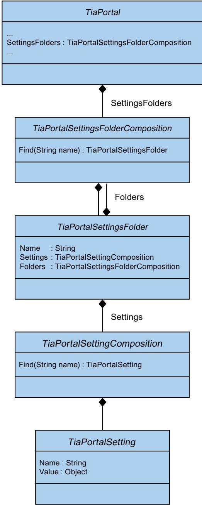

#### 程序代码：在项目中搜索

修改以下程序代码以激活/禁用“在项目中搜索”(Search in project)选项：
```cs
private static void SetSearchInProject(Project project)
{
    TiaPortalSettingsFolder generalSettingsFolder = tiaPortal.SettingsFolders.Find("General");
    TiaPortalSetting searchSetting = generalSettingsFolder.Settings.Find("SearchInProject");
    if (((bool)searchSetting.Value))
    {
    searchSetting.Value = false;
    }
}
```

#### 程序代码：用户界面语言

修改以下程序代码以访问当前用户界面语言。
```cs
private static void SetUILanguage(Project project)
{
    TiaPortalSettingsFolder generalSettingsFolder = tiaPortal.SettingsFolders.Find("General");
    TiaPortalSetting UILanguageSetting = generalSettingsFolder.Settings.Find("UserInterfaceLanguage");
    if (((CultureInfo)UILanguageSetting.Value) != CultureInfo.GetCultureInfo("de-DE"))
    {
    UILanguageSetting .Value = CultureInfo.GetCultureInfo("de-DE");
    }
}
```
打开项目 (页 140)

### 5.3.4 归档与检索项目

- TIA Portal Openness 应用程序已连接到 TIA Portal 请[连接到 TIA Portal](#连接到-TIA-Portal)”
- 已打开一个项目
请[打开项目](#打开项目)”
- 已保存一个项目。
请[保存项目](#保存项目)”
可在进行进一步更改之前使用 TIA Portal Openness 归档已打开且已保存的项目状态，之后可检索归档的项目。

#### 归档项目

可使用 Siemens.Engineering.Project 对象支持的 TIA Openness API 归档 TIA Portal 项目。
public void Archive(System.IO.DirectoryInfo targetDirectory, string targetName, Siemens.Engineering.ProjectArchivationMode archivationMode)
"targetName"是创建的文件名称，可以是已归档的，也可以是未归档的。该文件可能包含文件扩展名，但也可能不包含。对于 ProjectArchivationMode 值为 Compressed 和 DiscardRestorableDataAndCompressed, 的情况，归档文件的名称与用户提供的名称一致。如果未提供任何扩展名，或提供除“zap15\_1”或“zap14”等以外的扩展名，则无法从 Openness API 外的 TIA Portal 中检索此归档项目。如果未选择 Compressed 或 DiscardRestorableDataAndCompressed，则结果将为当前版本项目的默认文件结构。
调用归档 API 之前必须已保存项目。如果项目中包含任何未保存的更改，归档将出现 EngineeringTargetInvocationException。

#### Project ArchivationMode

ProjectArchivationMode 枚举共有四个值。
<table><tr><td>ProjectArchivationMode</td><td>说明</td></tr><tr><td>None</td><td>·不对原始文件采取特殊操作。该模式类似于“另存为”操作。·该模式中不会创建压缩zip文件。·该情况与SaveAs的区别在于,归档不会更改新归档文件夹的永久位置,而SaveAs则会进行更改。</td></tr><tr><td>DiscardRestorableData</td><td>·文件存储会将项目存储在内部数据文件中,对项目进行数据修改后,该文件会增大。在DiscardRestorableData模式下,将重新组织该数据文件(仅存储最新版本的对象,历史版本将从文件中移除),而中间数据、IM目录和tmp目录的文件不会复制到归档位置。·该模式中不会创建压缩zip文件。</td></tr><tr><td>Compressed</td><td>·通过归档创建的tmp项目文件夹结构被压缩成兼容归档的zip文件。创建zip文件后,将移除tmp文件夹结构。</td></tr><tr><td>DiscardRestorableDataAndCompressed</td><td>·对于通过归档创建的tmp项目文件夹结构,可存储数据将丢弃,随后压缩成兼容归档的zip文件。创建zip文件后,将移除tmp文件夹结构。</td></tr></table>

#### 程序代码：归档项目

修改以下程序代码以访问无扩展名的归档项目：
```java
public void ArchivingProjectWithoutExtension()
{
    var tiaPortal = new TiaPortal(TiaPortalMode.WithoutUserInterface);
    var projectFilePath = @"E:\Sample1\Sample1.ap15_1";
    var project = tiaPortal.Projects.Open(new FileInfo(projectFilePath));
    var archiveDirectory = @"E:\Archive";
    project.Archive(new DirectoryInfo(archiveDirectory), "ArchiveProjectNameWithoutExtension", ProjectArchivationMode.Compressed);
}
```

#### 修改以下程序代码以访问扩展名为“.archive”的归档项目：

```cs
public void ArchivingProjectWithExtension()
{
    var tiaPortal = new TiaPortal(TiaPortalMode.WithoutUserInterface);
    var projectFilePath = @"E:\Sample1\Sample1.ap15_1";
    var project = tiaPortal.Projects.Open(new FileInfo(projectFilePath));
    var archiveDirectory = @"E:\Archive";
    project.Archive(new DirectoryInfo (archiveDirectory), "ArchiveProjectName.archive", ProjectArchivationMode.Compressed);
}
```
可自由使用任意扩展名。无论有无扩展名，归档行为均相同。

#### 检索项目

可使用 Openness API 检索归档的 TIA Portal 项目。只可以检索压缩的归档。对于枚举值为 "ProjectArchivationMode.None" 或 "ProjectArchivationMode.DiscardRestorableData" 的归档项目，无法通过此 API 检索。可在 "Siemens.Engineering.ProjectComposition" 对象上找到此 API。
public Siemens.Engineering.Project Retrieve(System.IO.FileInfo sourcePath, System.IO.DirectoryInfo targetDirectory)
要检索受 UMAC 保护的项目，提供具有 UmacDelegate 的过载 API 获取凭证，使用下面的 API 定义
public Siemens.Engineering.Project Retrieve(System.IO.FileInfo sourcePath, System.IO.DirectoryInfo targetDirectory, Siemens.Engineering.UmacDelegate umacDelegate)
检索还支持可指定为“Primary”或“Secondary”的 ProjectOpenMode，使用以下 API 定义
public Siemens.Engineering.Project Retrieve(System.IO.FileInfo sourcePath, System.IO.DirectoryInfo targetDirectory, Siemens.Engineering.UmacDelegate umacDelegate, Siemens.Engineering.ProjectOpenMode projectOpenMode)
```text
说明
如果项目不受保护，则 umacDelegate 可作为 null 进行传送
如果归档项目采用之前的 TIA Portal 版本，则必须调用 RetrieveWithUpgrade API，使用以下 API 定义
public Siemens.Engineering.Project RetrieveWithUpgrade(System.IO.FileInfo sourcePath, System.IO.DirectoryInfo targetDirectory);
如果归档项目采用之前的 TIA Portal 版本，且受 UMAC 保护，则另一个具有 UmacDelegate 的过载 API 可用，使用以下 API 定义。
public Siemens.Engineering.Project RetrieveWithUpgrade(System.IO.FileInfo sourcePath, System.IO.DirectoryInfo targetDirectory, Siemens.Engineering.UmacDelegate umacDelegate)
如果归档项目采用之前的 TIA Portal 版本，且还需指定项目打开模式，则使用以下 API 定义。
public Siemens.Engineering.Project RetrieveWithUpgrade(System.IO.FileInfo sourcePath, System.IO.DirectoryInfo targetDirectory, Siemens.Engineering.UmacDelegate umacDelegate, Siemens.Engineering.ProjectOpenMode projectOpenMode)
```
如果项目不受保护，则 umacDelegate 可作为 null 进行传送。如果项目受保护，则需要管理员用户的用户凭证才能执行 RetrieveWithUpgrade 操作

#### 程序代码：检索项目

修改以下程序代码以访问检索项目：
```cs
public void RetrieveProject()
{
    var archivePath = @"E:\Archive\Sample1.zap15_1";
    var retrievedProjectsDirectory = @"E:\RetrievedProjects";
    var tiaPortal = new TiaPortal(TiaPortalMode.WithoutUserInterface);
    tiaPortal.Projects.Retrieve(new FileInfo(archivePath), new DirectoryInfo(retrievedProjectsDirectory));
}
```
连接到 TIA Portal (页 90)
打开项目 (页 140)
保存项目 (页 171)

### 5.3.5 访问只读 TIA Portal 项目

- TIA Portal Openness 应用程序已连接到 TIA Portal。请[连接到 TIA Portal](#连接到-TIA-Portal)”
- 已打开一个项目
请[打开项目](#打开项目)”
处理只读 TIA Portal 项目时，使用 TIA Portal Openness 可执行选择操作。可以访问只读项目，但无法使用具有读写访问权限的用户所拥有的全套功能。例如，具有只读凭证的用户可以使用 Openness 打开受 UMAC 保护的项目，如打开项目 (页 140) 中所述。该功能不包括参考项目。
访问只读项目时所提供的 Openness 功能列表可分类出两组功能 - 固有和启用的非修改性操作：

#### 固有功能

- GetAttribute(s) 或为任意可访问对象的任意属性使用获取程序
- 在任意可访问对象上 GetComposition
- 在任意可访问对象上 GetService
- 在任意可访问对象上执行 Find 操作
- 在任意可访问对象上导航
- 确定可访问对象的存在并访问这些对象的构成和关联。
- 在任意可访问对象上采用 System.Object 方法

#### 启用的非修改性操作

- Project.Close (...)
- PlcBlock.ShowInEditor ()
- CaxProvider.Export (Device,...)
- CaxProvider.Export (Project,...)
打开项目 (页 140)

### 5.3.6 访问语言

- TIA Portal Openness 应用程序已连接到 TIA Portal。请[连接到 TIA Portal](#连接到-TIA-Portal)
- 项目已经打开。
请[打开项目](#打开项目)”
在 TIA Portal 中，可在 “项目语言”(Project languages) 编辑器中设置和管理项目语言。
TIA Portal Openness 支持对项目语言进行以下访问：
- 通过支持的语言进行迭代。
- 由 System.Globalization.CultureInfo 通过支持的语言集合进行搜索。
- 访问各个语言。每个语言对象将包含一个 System.Globalization.CultureInfo.类型的只读属性 Culture。
- 访问活动语言的集合。
- 由 System.Globalization.CultureInfo 通过活动的语言集合进行搜索。
- 向活动的语言集合添加语言。
- 从活动的语言集合删除语言。
- 设置编辑语言。
- 设置参考语言。
功能由 LanguageSettings 对象提供。下图显示了 TIA Portal Openness 提供的模型：
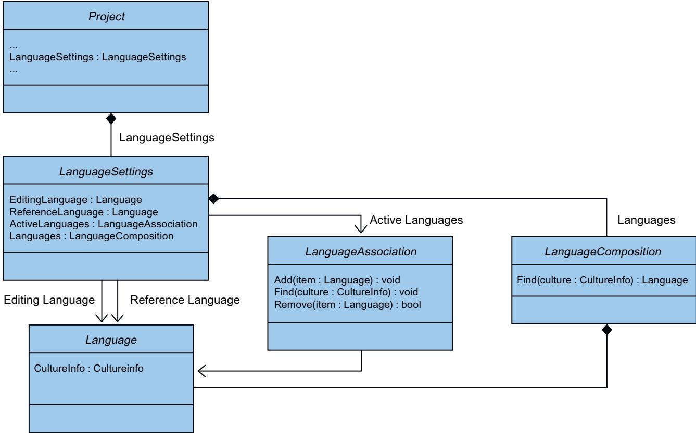

#### 程序代码：设置语言

修改以下程序代码以设置语言：如果通过 TIA Portal Openness 设置非活动语言，则会将该语言将添加到活动语言集合。
```text
public void SettingLanguages()
{
    Project project = ...;
    LanguageSettings languageSettings = project.LanguageSettings;
    LanguageComposition supportedLanguages = languageSettings.Languages;
    LanguageAssociation activeLanguages = languageSettings.ActiveLanguages;
    Language supportedGermanLanguage = supportedLanguages.Find(CultureInfo.GetCultureInfo("de-DE"));
    activeLanguages.Add(supportedGermanLanguage);
    languageSettings.EditingLanguage = supportedGermanLanguage;
    languageSettings.ReferenceLanguage = supportedGermanLanguage;
}
```

#### 程序代码：禁用活动语言

修改以下程序代码以禁用活动语言。如果禁用用作参考或编辑语言的语言，所选语言将与用户界面中的行为一致。
```cs
public void DeactivatingLanguages()
{
    Project project = ...;
    LanguageSettings languageSettings = project.LanguageSettings;
    LanguageAssociation activeLanguages = languageSettings.ActiveLanguages;
    Language activeGermanLanguage = activeLanguages.Find(CultureInfo.GetCultureInfo("de-DE"));
    activeLanguages.Remove(activeGermanLanguage);
}
```
对象模型的硬件对象的层级 (页 71)

### 5.3.7 确定对象结构和属性

- TIA Portal Openness 应用程序已连接到 TIA Portal。请[连接到 TIA Portal](#连接到-TIA-Portal)”
- 已通过 TIA Portal Openness 应用程序打开一个项目。
请[打开项目](#打开项目)”
可使用 IEngineeringObject 接口通过对象层级确定浏览结构。结果将以列表形式返回：
- 子对象
- 子组合
- 全部属性

#### 签名

使用 GetAttributeInfos 方式确定属性。
```text
IList<EngineeringAttributeInfo>
IEngineeringObject.GetAttributeInfos();
```

#### 程序代码：确定对象或组合

使用以下程序代码可显示所有组合名称:
```text
public static void DisplayCompositionInfos(IEngineeringObject obj)
{
IList<EngineeringCompositionInfo> compositionInfos = obj.GetCompositionInfos();
foreach (EngineeringCompositionInfo compositionInfo in compositionInfos)
{
Console.WriteLine(compositionInfo.Name);
}
```
若知道返回值则修改以下程序代码:
```objectivec
public static DeviceItemComposition GetDeviceItemComposition(Device device)
{
    IEngineeringComposition Or Object composition = ((IEngineeringObject) device).GetComposition("DeviceItems");
    DeviceItemComposition deviceItemComposition = (DeviceItemComposition) composition;
    return deviceItemComposition;
}
```

#### 程序代码：确定属性

修改以下程序代码以返回具有列表中特定访问权限的对象属性:
```cs
public static void DisplayAttributeInfos(IEngineeringObject obj)
{
    IList<EngineeringAttributeInfo> attributeInfos = obj.GetAttributeInfos();
    foreach (EngineeringAttributeInfo attributeInfo in attributeInfos)
    {
    Console.WriteLine("Attribute: {0} - AccessMode {1}", attributeInfo.Name, attributeInfo.AccessMode);
    switch (attributeInfo.AccessMode)
    {
    case EngineeringAttributeAccessMode.Read: Console.WriteLine("Attribute: {0} - Read Access", attributeInfo.Name);
    break;
    case EngineeringAttributeAccessMode.Write: Console.WriteLine("Attribute: {0} - Write Access", attributeInfo.Name);
    break;
    case EngineeringAttributeAccessMode.Read | EngineeringAttributeAccessMode.Write: Console.WriteLine("Attribute: {0} - Read and Write Access", attributeInfo.Name);
    break;
    }
    }
    }
    public static string GetNameAttribute(IEngineeringObject obj)
{
    Object nameAttribute = obj.GetAttribute("Name");
    return (string) nameAttribute;
}
```

### 5.3.8 访问软件目标

要求
- TIA Portal Openness 应用程序已连接到 TIA Portal。请[连接到 TIA Portal](#连接到-TIA-Portal)”
- 项目已经打开。
请[打开项目](#打开项目)”
修改以下程序代码以使软件目标可用:
```cs
public void AccessSoftwareTarget()
{
    SoftwareContainer softwareContainer = ((IEngineeringServiceProvider) deviceItem).GetService<SoftwareContainer>();
    if (softwareContainer != null)
    {
    Software software = softwareContainer.Software;
    }
}
```
修改以下程序代码以访问软件属性:
```text
SoftwareContainer softwareContainer =
((IEngineeringServiceProvider)deviceItem).GetService<SoftwareContainer>();
if (softwareContainer != null)
{
    PlcSoftware software = softwareContainer.Software as PlcSoftware;
    string name = software.Name;
}
```

### 5.3.9 访问和枚举多语言文本

- TIA Portal Openness 应用程序已连接到 TIA Portal。[连接到 TIA Portal](#连接到-TIA-Portal)”
- 项目已经打开。
[打开项目](#打开项目)”
TIA Portal 中的多语言文本示例包括：Project.Comment、PlcTag.Comment 等。在 TIA Portal Openness 中，多语言文本由 MultilingualText 对象表示。MultilingualText 对象由 MultilingualTextItemComposition 组成。
MultilingualTextItemComposition 支持以下 Find 方法:
```text
- Find(<language: Siemens.Engineering.Language>):MultilingualTextItem
```
每个 MultilingualTextItem 具有以下属性:
<table><tr><td>属性名称</td><td>数据类型</td><td>可写</td><td>描述</td></tr><tr><td>Language</td><td>Siemens.Engineering.Language</td><td>r/o</td><td>此项目的语言。</td></tr><tr><td>Text</td><td>System.String</td><td>读/写</td><td>为此语言提供的文本。</td></tr></table>

#### 程序代码：设置多语言文本

```matlab
Language englishLanguage = project.LanguageSettings.Languages.Find(new CultureInfo("en-US"));
MultilingualText comment = project.Comment;
MultilingualTextItemComposition mltItemComposition = comment.Items;
MultilingualTextItem englishComment = mltItemComposition.Find(englishLanguage);
englishComment.Text = "English comment";
...
```

#### 程序代码：为设备设置多语言文本

修改以下程序代码，为设备和设备项设置多语言文本：
```cs
...
var mltObject = device.GetAttribute("CommentML");
MultilingualText multilingualText = mltObject as MultilingualText;
if (multilingualText != null)
{
    Language englishLanguage = project.LanguageSettings.Languages.Find(new CultureInfo("en-US"));
    MultilingualTextItem multilingualTextItem =
    multilingualText.Items.Find(englishLanguage);
    if (multilingualTextItem != null)
    {
    multilingualTextItem.Text = comment;
    }
}
```

### 5.3.10 更新项目特性

- TIA Portal Openness 应用程序已连接到 TIA Portal。[连接到 TIA Portal](#连接到-TIA-Portal)”
- 已打开一个项目
请[打开项目](#打开项目)”
可使用 TIA Portal Openness 更新项目的 “仿真支持” 特性，以创建 plc 程序。仿真支持特性的设置可用于虚拟 SINUMERIK 控制器和使用 PLCSIM Advanced 仿真的 SIMATIC PLC。
Openness 支持使用以下特性访问 TIA Portal 项目的 “仿真支持” 特性。可在 "Siemens.Engineering.Project" 对象上找到 API。
<table><tr><td>属性名称</td><td>数据类型</td><td>访问</td><td>描述</td></tr><tr><td>IsSimulationDuringBlockCompilationEnabled</td><td>System.Boolean</td><td>读/写</td><td>用于指示是否为项目启用了块编译期间的仿真支持</td></tr><tr><td>IsVirtualPlcDuringBlockCompilationEnabled</td><td>System.Boolean</td><td>读/写</td><td>用于指示是否为项目启用了块编译期间的虚拟 plc 支持</td></tr></table>
修改和使用以下程序代码以访问属性值：
```text
Project project = ...;
// Read the attribute value
var attributeValue = project.IsSimulationDuringBlockCompilationEnabled;
var attributeValue = project.IsVirtualPlcDuringBlockCompilationEnabled;
//Write the attribute value to false
project.IsSimulationDuringBlockCompilationEnabled = false;
//Write the attribute value to True
project.IsVirtualPlcDuringBlockCompilationEnabled = true;
```
打开项目 (页 140)

### 5.3.11 读取项目相关的属性

要求
- TIA Portal Openness 应用程序已连接到 TIA Portal。[连接到 TIA Portal](#连接到-TIA-Portal)”
- 项目已经打开。
[打开项目](#打开项目)”
应用
使用该功能，可从 TIA Portal Openness API 中获取项目相关的属性。提供的信息包含项目属性、项目历史以及项目所使用的产品。
项目属性
项目属性提供了以下信息:
<table><tr><td>属性名称</td><td>数据类型</td><td>可写入</td><td>描述</td></tr><tr><td>Author</td><td>System.String</td><td>r/o</td><td>项目的作者</td></tr><tr><td>Comment</td><td>Siemens.Engineering.MultilingualText</td><td>r/o</td><td>项目的注释信息</td></tr><tr><td>Copyright</td><td>System.String</td><td>r/o</td><td>项目的版权声明</td></tr><tr><td>CreationTime</td><td>System.DateTime</td><td>r/o</td><td>项目的创建时间</td></tr><tr><td>Family</td><td>System.String</td><td>r/o</td><td>项目的所属系列</td></tr><tr><td>IsModified</td><td>System.Boolean</td><td>r/o</td><td>如果项目已修改,则返回“true”。</td></tr><tr><td>LanguageSettings</td><td>Siemens.Engineering.LanguageSettings</td><td>r/o</td><td>项目的处理语言</td></tr><tr><td>LastModified</td><td>System.DateTime</td><td>r/o</td><td>项目上一次的修改时间</td></tr><tr><td>LastModifiedBy</td><td>System.String</td><td>r/o</td><td>上一次的修改人员</td></tr><tr><td>Name</td><td>System.String</td><td>r/o</td><td>项目的名称</td></tr><tr><td>Path</td><td>System.IO.FileInfo</td><td>r/o</td><td>项目的绝对路径</td></tr><tr><td>Size</td><td>System.Int64</td><td>r/o</td><td>项目的大小(KB)</td></tr><tr><td>Version</td><td>System.String</td><td>r/o</td><td>项目的版本</td></tr></table>
修改以下程序代码以访问项目相关的属性:
```text
Project project = ...;
string author = project.Author;
string name = project.Name;
string path = project.Path;
DateTime creationTime = project.CreationTime;
DateTime modificationTime = project.LastModified;
string lastModifiedBy = project.LastModifiedBy;
string version = project.Version;
MultilingualText comment = project.Comment;
string copyright = project.Copyright;
string family = project.Family;
Int64 size = project.Size;
LanguageSettings languageSettings = project.LanguageSettings;
修改以下程序代码以枚举项目语言:
Project project = ...;
LanguageComposition languages = project.LanguageSettings.Languages;
foreach (Language language in languages)
{
    CultureInfo lang = language.Culture;
}
修改以下程序代码以获取注释文本:
Project project = ...;
Language english =
project.LanguageSettings.ActiveLanguages.Find(CultureInfo.GetCultureInfo("en-US"));
MultilingualText projectComment = project.Comment;
MultilingualTextItem textItem = project.Comment.Items.Find(english);
string text = textItem.Text;
```

#### 项目历史

项目历史即为 HistoryEntry 对象的组合，其中包含以下信息：
<table><tr><td>属性名称</td><td>数据类型</td><td>可写入</td><td>描述</td></tr><tr><td>文本</td><td>System.String</td><td>r/o</td><td>事件描述</td></tr><tr><td>DateTime</td><td>System.DateTime</td><td>r/o</td><td>发生事件的时间</td></tr></table>
修改以下程序代码以通过 HistoryEntries 进行枚举和访问相应的属性:
```text
Project project = ...;
HistoryEntryComposition historyEntryComposition = project.HistoryEntries;
foreach (HistoryEntry historyEntry in historyEntryComposition)
{
    string entryText = historyEntry.Text;
    DateTime entryTime = historyEntry.DateTime;
}
```
HistoryEntry 的文本属性包含以 UI 语言进行表示的字符串。如果在没有 UI 的情况下将 TIA Portal Openness 应用程序连接到 TIA Portal，则字符串始终以英语进行表示。

#### 使用的产品

对象 UsedProduct 包括以下信息:
<table><tr><td>属性名称</td><td>数据类型</td><td>可写入</td><td>描述</td></tr><tr><td>名称</td><td>System.String</td><td>r/o</td><td>所用的产品名称</td></tr><tr><td>版本</td><td>System.String</td><td>r/o</td><td>产品版本</td></tr></table>
修改以下程序代码以通过 UsedProduct 进行枚举和访问相应的属性。
```text
Project project = ...;
UsedProductComposition usedProductComposition = project.UsedProducts;
foreach (UsedProduct usedProduct in usedProductComposition)
{
    string productName = usedProduct.Name;
    string productVersion = usedProduct.Version;
}
```

### 5.3.12 删除项目图形

- TIA Portal Openness 应用程序已连接到 TIA Portal。请[连接到 TIA Portal](#连接到-TIA-Portal)”
- 项目已经打开。
请[打开项目](#打开项目)”
修改以下程序代码以删除项目图形:
```cs
//Deletes a single project graphic entry
public static void DeletesSingleProjectGraphicEntry(Project project)
{
MultiLingualGraphicComposition graphicsAggregation = project.Graphics;
MultiLingualGraphic graphic = graphicsAggregation.Find("Graphic XYZ");
graphic.Delete();
}
```

### 5.3.13 编译项目

- TIA Portal Openness 应用程序已连接到 TIA Portal。请[连接到 TIA Portal](#连接到-TIA-Portal)
- 项目已经打开。
请[打开项目](#打开项目)”
- 所有设备都处于“离线”状态。
API 接口支持设备和程序块的编译。编译结果作为对象返回。将根据对象类型提供 HW、SW 或 HW/SW 编译。支持以下对象类型：
- Device - HW & SW
- Device，配有故障安全 CPU-SW（配有已关闭的 F 激活属性）
- DeviceItem - HW
- CodeBlock - SW
- DataBlock - SW
- HmiTarget - SW
- PlcSoftware - SW
- PlcType - SW
- PlcBlockSystemGroup - SW
- PlcBlockUserGroup - SW
- PlcTypeSystemGroup - SW
- PlcTypeUserGroup - SW

#### 时间戳格式

所有时间戳均采用 UTC 格式。如果要查看当地时间，可以使用 DateTime.ToLocalTime()。
如果已为安全程序分配密码(页1377)，则系统会要求用户登录安全程序(页1379)以编译软件更改。否则过程将取消，并触发一个异常。
使用 ICompilable 类函数进行编译。
ICompilable compileService =
```typescript
iEngineeringServiceProvider Sierra GetService<ICompilable>();
```
```javascript
CompilerResult result = compileService.Compile();
```
开始编译前，所有设备必须为“离线”状态。
```cs
程序代码
修改以下程序代码以编译 HmiTarget 类型对象的软件变更:
public static void CompileHmiTarget(HmiTarget hmiTarget)
{
    ICompilable compileService = hmiTarget.GetService<ICompilable>();
    CompilerResult result = compileService Bonpile();
}
修改以下程序代码以编译 PlcSoftware 类型对象的软件变更:
public static void CompilePlcSoftware(PlcSoftware plcSoftware)
{
    ICompilable compileService = plcSoftware TokService<ICompilable>();
    CompilerResult result = compileService Bonpile();
}
修改以下程序代码以编译 CodeBlock 类型对象的软件变更:
public static void CompileCodeBlock(PlcSoftware plcSoftware)
{
    CodeBlock block = plcSoftware.BlockGroup.Blocks.Find("MyCodeBlock") as CodeBlock;
    if (block != null)
    {
    ICompilable compileService = block TokService<ICompilable>();
    CompilerResult result = compileService Bonpile();
    }
}
```
修改以下程序代码以评估编译结果:
```cs
private void WriteCompilerResults(CompilerResult result)
{
    Console.WriteLine("State:" + result.State);
    Console.WriteLine("Warning Count:" + result.WarningCount);
    Console.WriteLine("Error Count:" + result.ErrorCount);
    RecursivelyWriteMessages(result.Messages);
}
private void RecursivelyWriteMessages(CompilerResultMessageComposition messages, string
indent = "")
{
    indent += "\t";
    foreach (CompilerResultMessage message in messages)
{
    Console.WriteLine(indent + "Path: " + message.Path);
    Console.WriteLine(indent + "DateTime: " + message.DateTime);
    Console.WriteLine(indent + "State: " + message.State);
    Console.WriteLine(indent + "Description: " + message.Description);
    Console.WriteLine(indent + "Warning Count: " + message.WarningCount);
    Console.WriteLine(indent + "Error Count: " + message.ErrorCount);
    RecursivelyWriteMessages(message Prescriptions, indent);
}
```

### 5.3.14 在 UMAC 中修改项目

简介
可使用 TIA Portal Openness 修改用户管理中的项目和访问权限。通过此功能权限，如果项目受到保护，可将 “通过 Openness API 修改项目” 分配给角色，进而将其分配给用户。
如果在受保护项目中具有/不具有此功能权限，TIA Portal Openness 中会有某些行为改变，使用特殊用户凭证打开受保护项目时会受到影响。对 Openness API 的更改仅适用于受保护项目以及以 ProjectOpenMode 作为主要模式打开的项目。以 ProjectOpenMode 作为次要模式的情况不受影响。

#### 功能权限特性的更改

Openness 功能权限的下述特性适用于在 TIA Portal V17 环境中运行的所有版本的 Siemens.Engineering.dll（V15、V15.1、V16 和 V17）。
- 如果同时具有 “通过 Openness API 修改项目” 功能权限和项目读写权限，则说明已分配 Openness API 的完全访问权限，也就是说，可以使用 Openness API 执行任何操作。
- 如果没有 “通过 Openness API 修改项目” 功能权限和项目写权限/项目读权限，则仅可在 Openness API 中执行只读操作。举例来说，只读操作包括导出、导航到设备等。在此场景下，如果要执行导入等数据操作（在 TIA portal 中更改项目数据），则根据分配给您的功能权限接收到异常。
- 如果有用户界面相关的 Openness API 示例 (ShowInEditor)，用户界面相关的功能权限不取决于“通过 Openness API 修改项目”，而取决于应通过相应 GUI 功能权限处理的 GUI 功能权限。以下 API 是第 1 点和第 2 点发生的异常。Openness API 将跳过“通过 Openness API 修改项目”功能权限并允许使用 API，而不考虑是否设置了“通过 Openness API 修改项目”功能权限。
- project.ShowHwEditor(View.Network)
- project.ShowHwEditor(View.Topology)
– device.ShowInEditor(View.Device)
- plcBlock.ShowInEditor()
- plcType.ShowInEditor()
- plcTagTable.ShowInEditor()
- plcForceTable.ShowInEditor()
- plcWatchTable.ShowInEditor()

### 5.3.15 保存项目

- TIA Portal Openness 应用程序已连接到 TIA Portal。请[连接到 TIA Portal](#连接到-TIA-Portal)”
- 项目已经打开。
请[打开项目](#打开项目)”
应用
要保存项目
- 使用 Save() 方法保存项目
- 使用 SaveAs() 方法将项目以不同名称保存或保存在不同的目录中
修改以下程序代码，打开并保存项目：
```text
public static void SaveProject(TiaPortal tiaPortal)
{
    Project project = ...;
    // Use the code in the try block to open and save a project
    try
    {
    // please adapt the path and the extension apx to the installed version of TIA Portal
    project = tiaPortal.Projects.Open(new FileInfo(@"Some\Path\MyProject.apx"));
    // begin of code for further implementation
    // ...
    // end of code'
    project.Save();
    }
    // Use the code in the final block to close a project
    finally
    {
    if (project != null)
    project.Close();
    }
}
修改以下程序代码，将项目以不同名称保存或保存在不同的位置：
```
```text
...
TiaPortal portal = new TiaPortal(TiaPortalMode.WithUserInterface);
FileInfo fileInfoExistingProject = new FileInfo(@"D:\SampleProjects\SampleProject.apXX");
DirectoryInfo dirInfoSaveAsProject = new
DirectoryInfo(@"D:\SampleProjects\SampleProjectSaveAs");
Project sampleProject = portal.Projects.Open(fileInfoExistingProject);
sampleProject.SaveAs(dirInfoSaveAsProject);
...
```

### 5.3.16 关闭项目

要求
- TIA Portal Openness 应用程序已连接到 TIA Portal。请[连接到 TIA Portal](#连接到-TIA-Portal)”
- 已通过 TIA Portal Openness 应用程序打开一个项目。
请[打开项目](#打开项目)”
程序代码
修改以下程序代码以关闭项目：
```text
public static void CloseProject(Project project)
{
    project.Close();
}
```

### 5.3.17 导出/导入系统诊断设置

要求
- TIA Portal Openness 应用程序已连接到 TIA Portal [连接到 TIA Portal](#连接到-TIA-Portal)”
- 项目已打开
[打开项目](#打开项目)”
简介
可使用 TIA Portal Openness 应用程序为 TIA Portal 项目导出和导入系统诊断设置。导出和导入采用 .dat 文件的格式。
以下服务和类别用于导出和导入系统诊断设置。
<table><tr><td>名称</td><td>描述</td></tr><tr><td>SystemdiagnosticsSettingsDataProvider</td><td>服务类别,用于提供导出和导入方法</td></tr><tr><td>SystemdiagnosticsSettingsExportImportResults</td><td>返回导出或导入操作的结果</td></tr></table>
SystemdiagnosticsSettingsExportImportResultState ENUM 具有以下值:
<table><tr><td>ENUM</td><td>描述</td><td>值</td></tr><tr><td rowspan="3">SystemdiagnosticsSettingsExportImportResults</td><td rowspan="3">返回文件是否保存/设置更改是否成功的结果。</td><td>错误</td></tr><tr><td>成功</td></tr><tr><td>警告</td></tr></table>

#### 程序代码：导出系统诊断设置

修改以下程序代码，以导出系统诊断的设置：
```cs
public static void ExportSystemDiagnosticSettings(project tiaProject)
{
Siemens.Engineering.HW.Systemdiagnostics.Settings.SystemdiagnosticsSettingsDataProvider settingsProvider =
tiaProject.GetService<Siemens.Engineering.HW.Systemdiagnostics.Settings.SystemdiagnosticsSettingsDataProvider>();
Siemens.Engineering.HW.Systemdiagnostics.Settings.SystemdiagnosticsSettingsExportImportResult exportResult = settingsProvider.Export(new FileInfo(@"D:\Temp\SysDiagSettings.dat"));
Siemens.Engineering.HW.Systemdiagnostics.Settings.SystemdiagnosticsSettingsExportImportResultState resultState = exportResult.State;
}
```

#### 程序代码：导入系统诊断设置

修改以下程序代码，以导入系统诊断的设置：

## 5.4 用于访问 Teamcenter Gateway 的函数


### 5.4.1 连接到 Teamcenter Gateway

要求
- TIA Portal 应用程序已连接到 TIA Portal Openness 请[连接到 TIA Portal](#连接到-TIA-Portal)”
- 已打开一个项目
请[打开项目](#打开项目)”
应用
可使用 TIA Portal Openness 通过 TcGateway 与 Teamcenter 建立连接。
参数
<table><tr><td>参数名称</td><td>数据类型</td><td>必选项</td><td>描述</td></tr><tr><td>userName</td><td>System.String</td><td>√</td><td>指定 Teamcenter 中的用户名</td></tr><tr><td>userPassword</td><td>System.SecureString</td><td>√</td><td>指定 Teamcenter 中的用户密码</td></tr><tr><td>serverURL</td><td>System.String</td><td>√</td><td>指定 Teamcenter 服务器的完全限定 URL。</td></tr><tr><td>teamcenterInstance</td><td>System.String</td><td>√</td><td>指定 Teamcenter 服务器的实例</td></tr><tr><td>userRole</td><td>System.String</td><td>-</td><td>指定在 Teamcenter 中定义的用户角色。</td></tr><tr><td>userGroup</td><td>System.String</td><td>-</td><td>指定用户在 Teamcenter 中所属的组。</td></tr></table>
如果未传递任何强制参数，则会引发 TcGatewayException 类型的 Siemens.Engineering 异常。
成功连接会返回一个加密的 TcGatewayConnectionInfo 对象。如果连接不成功，则会引发 TcGatewayException 类型的工程组态异常且其中会包含失败原因。
<table><tr><td>数据类型</td><td>描述</td></tr><tr><td>TcGatewayConnectionInfo</td><td>TcGatewayConnection 信息对象必须在所有 TcGateway Openness API 中强制传递。它将在其它 TcGateway Openness API 中使用,以验证调用来源以及活动的 Teamcenter 会话。TcGatewayConnectionInfo 提供以下连接详细信息:• SessionToken(活动连接会话令牌)• Group(Teamcenter 用户组)• Role(Teamcenter 用户角色)</td></tr></table>
```cs
//Connecting Teamcenter using TcGateway
public void function1()
{
    using Siemens.Engineering.TeamcenterGateway;
    {
    TiaPortal TIAInstance = ...;
    TeamcenterConnectionProvider tcGatewayProvider =
    TIAInstance.GetService<TeamcenterConnectionProvider>();
    String userName = ...; //User name
    SecureString password = ...; //Secure string. Client takes care of encrypting password and openness framework decrypts and passes the decrypted value to the action
    String userRole = ...; //Role
    String userGroup = ...; //Group
    String serverURL = ...; //Teamcenter server URL
    String teamcenterInstance=...; //Instance
    TcGatewayConnectionInfo connectionInfo = tcGatewayProvider.Connect(userName, password, userGroup, userRole, serverURL,teamcenterInstance);
    string group = connectionInfo.Group;
    string role = connectionInfo.Role;
    }
}
```

### 5.4.2 断开与 Teamcenter Gateway 的连接

- TIA Portal 应用程序已连接到 TIA Portal Openness 请[连接到 TIA Portal](#连接到-TIA-Portal)”
- 已打开一个项目
请[打开项目](#打开项目)”
可使用 TIA Portal Openness 通过 TcGateway 断开 Teamcenter 服务器与 TIA Portal 之间的连接。

#### 参数

<table><tr><td>参数</td><td>数据类型</td><td>必选项</td><td>描述</td></tr><tr><td>tcGatewayConnectionInfo</td><td>TcGatewayConnectionInfo</td><td>√</td><td>在 Connect / ConnectSSO API 调用期间,返回 TcGatewayConnectionInfo 对象。</td></tr></table>
```cs
public void function2()
{
    //Program code: Disconnect Teamcenter using TcGateway
    using Siemens.Engineering.TeamcenterGateway;
    {
    TiaPortal TIAInstance = ...;
    TcGatewayConnectionProvider tcGatewayProvider =
    TIAInstance.GetService<TeamcenterConnectionProvider>();
    String userName = ...;//User name
    SecureString password = ...;//Secure string. Client takes care of encrypting password and openness framework decrypts and passes the decrypted value to the action
    String userRole = ...;//Role
    String userGroup = ...;//Group
    String serverURL = ...;//Teamcenter server URL
    String teamcenterInstance = ...;//Instance
    TcGatewayConnectionInfo tcgConnectionInfo = tcGatewayProvider.Connect(userName, password, serverURL, teamcenterInstance, userRole, userGroup);
    tcGatewayProvider.Disconnect(tcgConnectionInfo);
    }
}
```
连接到 Teamcenter Gateway (页 175)

### 5.4.3 连接到 ConnectSSO

要求
- TIA Portal 应用程序已连接到 TIA Portal Openness 请[连接到 TIA Portal](#连接到-TIA-Portal)”
- 已打开一个项目
请[打开项目](#打开项目)”
如果活动 SSO 会话可用，则可使用 TIA Portal Openness 通过以下所需参数调用 ConnectSSO()。
<table><tr><td>参数</td><td>数据类型</td><td>必选项</td><td>描述</td></tr><tr><td>hostURL</td><td>System.String</td><td>√</td><td>指定具有端口号的完全限定 Teamcenter 服务器主机。</td></tr><tr><td>instance</td><td>System.String</td><td>√</td><td>指定 Teamcenter 服务器实例</td></tr><tr><td>loginURL</td><td>System.String</td><td>√</td><td>指定组态为 Teamcenter 安全服务一部分的登录服务的 URL。</td></tr><tr><td>applicationID</td><td>System.String</td><td>√</td><td>指定通过识别服务在 Teamcenter 应用程序注册表中组态的应用程序 ID</td></tr></table>
成功连接会返回一个加密的 TcGatewayConnectionInfo 对象。如果连接不成功，则会引发相应异常。
如果没有可用的活动 SSO 会话，系统将提示您在浏览器中输入 Teamcenter 凭据以创建 SSO 会话。此 API 支持通过 PKI 进行基于安全卡的登录。
```cs
//Program code: ConnectSSO using TcGatewayConnectionInfo
public void function3()
{
    using Siemens.Engineering.TeamcenterGateway;
    {
    TiaPortal TIAInstance = ...;
    TeamcenterConnectionProvider tcGatewayProvider =
    TIAInstance.GetService<TeamcenterConnectionProvider>();
    String hostUrl = ...;//Fully qualified Teamcenter server host with port number
    String teamcenterInstance=...;//Instance
    String loginURL = ...;//Teamcenter SSO login Service url
    String applicationId = ...;//Teamcenter SSO application
    TcGatewayConnectionInfo connectionInfo =
    tcGatewayProvider.ConnectSSO(hostUrl,teamcenterInstance,loginURL,applicationId);
    string group = connectionInfo.Group;
    string role = connectionInfo.Role;
    }
}
```

### 5.4.4 在 Teamcenter 中保存项目/全局库

- TIA Portal 应用程序已连接到 TIA Portal Openness 请[连接到 TIA Portal](#连接到-TIA-Portal)”
- 已打开一个项目
请[打开项目](#打开项目)”
可使用 TIA Portal Openness 通过 TcGatewayWorkflowProvider 服务保存项目/全局库。该服务将在项目/全局库组合中提供。
参数
<table><tr><td>参数名称</td><td>数据类型</td><td>必须项</td><td>描述</td></tr><tr><td>tcGatewayConnectionInfo</td><td>TcGatewayConnectionInfo</td><td>√</td><td>在连接到Teamcenter 期间返回tcGatewayConnectionInfo。传递的tcGatewayConnectionInfo与活动连接的tcGatewayConnectionInfo匹配。</td></tr><tr><td>localCacheOption</td><td>LocalCacheOption(Enum)</td><td>√</td><td>TcGatewayLocalCacheOption,可覆盖Teamcenter 缓存中的 TIA 项目/全局库。</td></tr></table>
<table><tr><td>数据类型</td><td>描述</td></tr><tr><td>Siemens.Engineering.TeamcenterGateway.ItemInfo</td><td>项目/全局库成功保存到 Teamcenter 后,API 将返回以下 ItemInfo 对象。•ItemId [System.String]•RevisionId [System.String]•ItemName [System.String]•ItemType [Siemens.Engineering.TeamcenterGateway.Item Type(Enum)]</td></tr></table>
```cs
//Program code: Saving Project/gobal library in Teamcenter using Save()
public void function4()
{
    using Siemens.Engineering.TeamcenterGateway;
    {
    TiaPortal tiaPortal = ...;
    var tcGatewayConnectionProvider= tiaPortal TokelService<TeamcenterConnectionProvider>();
    var tcGatewayLockProvider = tiaPortal TokelService<TcGatewayLockProvider>();
    try
    {
    String userName = "name"; //User name
    SecureString password = ...; //Secure string. Client takes care of encrypting password and openness framework decrypts passes the decrypted value to the action
    String userRole = ...; //Role
    String userGroup = ...; //Group
    String serverURL = ...; //Teamcenter server URL
    String teamcenterInstance = ...; //Instance
    TcGatewayConnectionInfo connectionInfo = tcGatewayConnectionProvider.Connect(userName, password, userGroup, userRole, serverURL,teamcenterInstance);
    tcGatewayLockProvider.CheckoutDataset(connectionInfo , "000495", "A", DatasetType.T4TiaProjectDataset,"Project30");
    ProjectComposition projectComposition = tiaPortal.Projects;
    String projectPath = ...; // Project path for the checkout dataset in above step or download project using TcGateway Load API Project
    Project tcgProject = projectComposition.Open(new FileInfo(projectPath));
    tcgProject.DeviceGroups.Create("Group_1");
    tcgProject.Save(); //This is used to save project locally in TC cache. (optional)
    TcGatewayWorkflowProvider tcgWorkflowProvider =
    tcgProject TokelService<TcGatewayWorkflowProvider>();
    ItemInfo response = tcgWorkflowProvider.Save(connectionInfo , LocalCacheOption.Overwrite);
    //OR
    ItemInfo response = tcgWorkflowProvider.Save(connectionInfo , LocalCacheOption.DoNotOverwrite);
    tcGatewayLockProvider.CheckinDataset(connectionInfo , "000495", "A", DatasetType.T4TiaProjectDataset,"Project30");
    }
    catch(TcGatewayException)
    {
    // other operations
    }
}
```

### 5.4.5 使用代理对象保存项目/全局库

要求
- TIA Portal 应用程序已连接到 TIA Portal Openness 请[连接到 TIA Portal](#连接到-TIA-Portal)”
- 已打开一个项目
请[打开项目](#打开项目)”
应用
可使用 TIA Portal Openness 执行项目/全局库的归档，并将归档对象与代理对象（例如 Plc、程序块、UDT、其它支持的类型）一起保存到 Teamcenter 数据集。
项目/全局库成功保存到 Teamcenter 后，API 将返回 ItemInfo 对象，其中包含 ItemId、RevisionId、ItemName 和 ItemType 详细信息。
<table><tr><td>参数名称</td><td>数据类型</td><td>必须项</td><td>描述</td></tr><tr><td>tcGatewayConnectionInfo</td><td>TcGatewayConnectionInfo</td><td>√</td><td>在连接到Teamcenter 期间返回tcGatewayConnectionInfo。已传递的tcGatewayConnectionInfo 必须与活动连接的tcGatewayConnectionInfo 匹配</td></tr><tr><td>localCacheOption</td><td>LocalCacheOption(Enum)</td><td>√</td><td>TcGatewayLocalCacheOption,可覆盖 TC 缓存中的 TIA 项目/全局库。</td></tr></table>

#### 程序代码：使用 SaveWithProxyObject() 在 Teamcenter 中保存项目/全局库

```cs
//Program code: Saving project/ global library in Teamcenter using SaveWithProxyObject()
public void function5()
{
    using Siemens.Engineering.TeamcenterGateway;
    {
    TiaPortal tiaPortal = ...;
    var tcGatewayConnectionProvider = tiaPortal TokelService<TeamcenterConnectionProvider>();
    var tcGatewayLockProvider = tiaPortal TokelService<TcGatewayLockProvider>();
    try
    {
    String userName = string.Empty; //User name
    SecureString password = new SecureString(); //Secure string. Client takes care of encrypting password and openness framework decrypts and passes the decrypted value to the action
    String userRole = ...; //Role
    String userGroup = ...; //Group
    String serverURL = string.Empty; //Teamcenter server URL
    String teamcenterInstance = string.Empty; //Instance
    TcGatewayConnectionInfo connectionInfo = tcGatewayConnectionProvider.Connect(userName, password, userGroup, userRole, serverURL, teamcenterInstance);
    tcGatewayLockProvider.CheckoutDataset(connectionInfo, "000495", "A",
    DatasetType.T4TiaProjectDataset, "Project30");
    ProjectComposition projectComposition = tiaPortal.Projects;
    String projectPath = string.Empty; // Project path for the checkout dataset in above step or download project using TcGateway Load API
    Project tcgProject = projectComposition.Open(new FileInfo(projectPath));
    TcGatewayWorkflowProvider tcgWorkflowProvider =
    tcgProject TokelService<TcGatewayWorkflowProvider>();
    ItemInfo response = tcgWorkflowProvider.SaveWithProxyObject(connectionInfo, LocalCacheOption.Overwrite);
    //OR
    ItemInfo response = tcgWorkflowProvider.SaveWithProxyObject(connectionInfo, LocalCacheOption.DoNotOverwrite);
    tcGatewayLockProvider.CheckinDataset(connectionInfo, "000495", "A",
    DatasetType.T4TiaProjectDataset, "Project30");
    }
    catch (TcGatewayException)
    {
    // other operations
    }
}
```
[连接到 TIA Portal](#连接到-TIA-Portal)

### 5.4.6 使用新条目保存项目/全局库

要求
- 连接到 TIA Portal
请[连接到 TIA Portal](#连接到-TIA-Portal)”
- 已打开一个项目
请[打开项目](#打开项目)”
参数
<table><tr><td>参数名称</td><td>数据类型</td><td>必须项</td><td>描述</td></tr><tr><td>tcGatewayConnectionInfo</td><td>Siemens.Engineering.TeamcenterGateway.TcGatewayConnectionInfo</td><td>√</td><td>连接到 Teamcenter Gateway 后,返回 tcGatewayConnectionInfo。已传递的 tcGatewayConnectionInfo 必须与活动连接的 tcGatewayConnectionInfo 匹配。</td></tr><tr><td>itemId</td><td>System.String</td><td>√</td><td>指定项目需要保存到的条目 ID。</td></tr><tr><td>revisionId</td><td>System.String</td><td>√</td><td>指定项目需要保存到的修订版 ID。</td></tr><tr><td>localCacheOption</td><td>Siemens.Engineering.TeamcenterGateway.LocalCacheOption(Enum)</td><td>√</td><td>如果项目的本地缓存或数据集版本与服务器项目版本不匹配,指定覆盖本地缓存项目内容</td></tr></table>
```cs
//Program code: Saving project/global library in Teamcenter using SaveToItem( )
public void function6( )
{
using Siemens.Engineering.TeamcenterGateway;
{
TiaPortal tiaPortal = ...;
var tcGatewayConnectionProvider = tiaPortal TokService<TeamcenterConnectionProvider>();
var tcGatewayLockProvider = tiaPortal TokService<TcGatewayLockProvider>();
try
{
String userName = string.Empty; //User name
SecureString password = new SecureString(); //Secure string. Client takes care of encrypting password and openness framework decrypts and passes the decrypted value to the action
String userRole = ...; //Role
String userGroup = ...; //Group
String serverURL = string.Empty; //Teamcenter server URL
String teamcenterInstance = string.Empty; //Instance
TcGatewayConnectionInfo connectionInfo = tcGatewayConnectionProvider.Connect(userName, password, userGroup, userRole, serverURL, teamcenterInstance);
tcGatewayLockProvider.CheckoutDataset(connectionInfo, "000495", "A",
DatasetType.T4TiaProjectDataset, "Project30");
ProjectComposition projectComposition = tiaPortal.Projects;
String projectPath = string.Empty; // Project path for the checkout dataset in above step or download project using TcGateway Download API
Project tcgProject = projectComposition.Open(new FileInfo(projectPath));
TcGatewayWorkflowProvider tcgWorkflowProvider =
tcgProject TokService<TcGatewayWorkflowProvider>();
ItemInfo response = tcgWorkflowProvider.SaveToItem(connectionInfo, "000495", "A",
LocalCacheOption.Overwrite);
tcGatewayLockProvider.CheckinDataset(connectionInfo, "000495", "A",
DatasetType.T4TiaProjectDataset, "Project30");
}
catch (TcGatewayException)
{
// other operations
}
}
```

### 5.4.7 在 Teamcenter 中访问自定义属性

- TIA Portal Openness 已连接到 TIA Portal 请[连接到 TIA Portal](#连接到-TIA-Portal)”
- 已打开一个项目
请[打开项目](#打开项目)”
应用
可使用TIA Portal Openness在Teamcenter Gateway中获取和设置自定义属性值。
参数
Teamcenter 项目类型是指 T4TiaLibrary、T4TiaProject 和 Teamcenter 数据模型中存在的子类型，其自定义属性在 Teamcenter 中映射。
<table><tr><td>参数名称</td><td>数据类型</td><td>必须项</td><td>描述</td></tr><tr><td>tcGatewayConnectionInfo</td><td>Siemens.Engineering.TeamcenterGateway.TcGatewayConnectionInfo</td><td>√</td><td>在连接到 Teamcenter 期间返回 tcGatewayConnectionInfo。传递的 tcGatewayConnectionInfo 必须与活动连接的 tcGatewayConnectionInfo 匹配。</td></tr><tr><td>itemType</td><td>System.String</td><td>√</td><td>指定 Teamcenter itemType</td></tr></table>
成功执行后，API 返回自定义属性集合（如果 Teamcenter 中有给定 itemtype 可用）。
<table><tr><td>数据类型</td><td>描述</td></tr><tr><td>IList&lt;Siemens.Engineering.TeamcenterGateway.TeamcenterProperty&gt;</td><td>指定条目或修订版的 Teamcenter 自定义属性列表。名称 [System.String]MappingLevel [System.int]ListOfValueInfo [Siemens.Engineering.TeamcenterGateway.TcPropertyListOfValueInfo]- LowerLimit [System.String]- UpperLimit [System.String]- 值[System.Collections.Generic.IEnumerable]DataType [Siemens.Engineering.TeamcenterGateway.MappedCustomAttributeType(Enum)]</td></tr></table>
调用 SetValue API，用于设置使用 GetTeamcenterCustomAttributes API 获取的自定义属性的值以及传递错误回调委托。
<table><tr><td>参数名称</td><td>数据类型</td><td>必须项</td><td>描述</td></tr><tr><td>value</td><td>System.String</td><td>√</td><td>为自定义属性指定值。</td></tr><tr><td>errorCallback</td><td>Siemens.Engineering.Tea mcenterGateway.ErrorCall back</td><td>√</td><td>委托处理在 API 调用/操作期间引发的错误。</td></tr></table>
程序代码
5.4 用于访问 Teamcenter Gateway 的函数
```cs
public void function7()
{
    using Siemens.Engineering.TeamcenterGateway;
    {
    using (TiaPortal tiaPortal = new TiaPortal(TiaPortalMode.WithUserInterface))
    {
    var tcGatewayConnectionProvider = tiaPortal TokService<TeamcenterConnectionProvider>();
    var tcGatewayLockProvider = tiaPortal TokService<TcGatewayLockProvider>();
    try
    {
    String userName = string.Empty; // User name
    SecureString password = new SecureString(); // Secure string. Client takes care of encrypting password and openness framework decrypts and passes the decrypted value to the action
    String userRole = ...; // Role
    String userGroup = ...; // Group
    String serverURL = string.Empty; // Teamcenter server URL
    String teamcenterInstance = string.Empty; // Instance
    ItemDetailsDelegate itemDetailsDelegate = ItemDetailsForCreation;
    TcGatewayConnectionInfo connectionInfo = tcGatewayConnectionProvider.Connect(userName, password, userGroup, userRole, serverURL, teamcenterInstance);
    var project = tiaPortal.Projects.Open(new FileInfo("D:\\UserData\\Documents\\Automation\\Project30\\Project30.ap18"));
    var tcGatewayWorkflowProvider = project.GetService<TcGatewayWorkflowProvider>();
    // OR
    var library = tiaPortal.GlobalLibraries.Open(new FileInfo(@"~\Documents\Automation\Library7\Library7.al18"), OpenMode.ReadWrite);
    var tcGatewayWorkflowProvider = library TokService<TcGatewayWorkflowProvider>();
    // Get custom attributes.
    var attributes = tcGatewayWorkflowProvider.GetTeamcenterCustomAttributes(connectionInfo, "T4TiaProject");
    ErrorCallback errorCallback = PropertyValueSettingErrorCallback;
    foreach (var arr in attributes)
    {
    if (arr.ListOfValueInfo != null)
    {
    foreach (var l in arr.ListOfValueInfo.Values)
    {
    Console.WriteLine(1);
    }
    }
    switch (arr (^Type)
    {
    case MappedCustomAttributeType.String:
    arr.SetValue("23232323232", errorCallback);
    break;
    case MappedCustomAttributeType.Char:
    arr.SetValue("d", errorCallback);
    break;
    case MappedCustomAttributeType.Integer:
    arr.SetValue("232", errorCallback);
```
```cs
break;
case MappedCustomAttributeType.arr.SetValue(23.4f.ToString(), errorCallback);
break;
}
}
catch (TcGatewayException)
{
    // other operations
}
}
```

### 5.4.8 将项目作为新条目保存到 Teamcenter

- TIA Portal Openness 已连接到 TIA Portal 请参见“Hotspot-Text 连接到 TIA Portal (页 90)”
- 已打开一个项目
请[打开项目](#打开项目)”
可以使用 TIA Portal Openness 在 Teamcenter 中将 TIA Portal 项目另存为新条目。成功创建条目/修订版后，API 返回包含 ItemId、RevisionId、ItemType、ItemName 的 itemInfo 对象。
参数
<table><tr><td>参数名称</td><td>数据类型</td><td>必须项</td><td>描述</td></tr><tr><td>tcGatewayConnectionInfo</td><td>Siemens.Engineering.TeamcenterGateway.TcGatewayConnectionInfo</td><td>√</td><td>在连接到 Teamcenter 期间返回 tcGatewayConnectionInfo。 tcGatewayConnectionInfo 必须与活动连接的 tcGatewayConnectionInfo 匹配。</td></tr><tr><td>itemDetailsDelegate</td><td>delegate</td><td>√</td><td>此委托由 API 的调用程序定义,其中包含有关要在 Teamcenter 中创建的条目的信息:• ItemId [System.String]• RevisionId [System.String]• ItemName [System.String] (Required)• Comments [System.String]• TeamcenterFolder [System.String]• TeamcenterProject [System.String[]]• TeamcenterItemType [System.String] (Required)</td></tr><tr><td>customAttributes</td><td>lEnumerable</td><td>-</td><td>指定与项目/全局库一起保存的条目/修订版自定义属性。</td></tr></table>
```cs
private static void ItemDetailsForCreation(ItemDetails itemDetails)
{
    itemDetails.ItemId = "...";
    itemDetails.ItemName = "Proj_Object";
    itemDetails.RevisionId = "...";
    itemDetails.TeamcenterItemType = "T4TiaProject";
    itemDetails.Comment = "Project Comments.";
    itemDetails.TeamcenterFolder = "Home\\TIA_Project\\ConveyourBelt";
    itemDetails.TeamcenterProject = new string[] { "Project_TIA_1", "Project_TIA_2" };
}
private static void PropertyValueSettingErrorCallback(string errorMessage)
{
    Console.WriteLine(errorMessage);
}
```
```cs
//Program code: Saving project to Teamcenter as new item
private void functionSavingProjectToTeamcenterAsNewItem()
{
    using Siemens.Engineering.TeamcenterGateway;
    {
    TiaPortal tiaPortal = ...;
    var tcGatewayConnectionProvider = tiaPortal TokService<TeamcenterConnectionProvider>();
    var tcGatewayLockProvider = tiaPortal TokService<TcGatewayLockProvider>();
    try
    {
    String userName = string.Empty; //User name
    SecureString password = new SecureString(); //Secure string. Client takes care of encrypting password and openness framework decrypts and passes the decrypted value to the action
    String userRole = ...; //Role
    String userGroup = string.Empty; //Group
    String serverURL = string.Empty; //Teamcenter server URL
    String teamcenterInstance = string.Empty; //Instance
    ItemDetailsDelegate itemDetailsDelegate = ItemDetailsForCreation;
    TcGatewayConnectionInfo connectionInfo = tcGatewayConnectionProvider.Connect(userName, password, userGroup, userRole, serverURL, teamcenterInstance);
    var project = tiaPortal.Projects.Open(new FileInfo("D:\\UserData\\Documents\\Automation\\Project30\\Project30.ap18"));
    var tcGatewayWorkflowProvider = project.GetService<TcGatewayWorkflowProvider>();
    //OR
    var library = tiaPortal.GlobalLibraries.Open(new FileInfo(@"~\Documents\Automation\Library7\Library7.al18"), OpenMode.ReadWrite);
    var tcGatewayWorkflowProvider = library TokService<TcGatewayWorkflowProvider>();
    //Save item in Teamcenter with custom attributes.
    var attributes = tcGatewayWorkflowProvider.GetTeamcenterCustomAttributes(connectionInfo, "T4TiaProject");
    ErrorCallback errorCallback = PropertyValueSettingErrorCallback;
    foreach (var arr in attributes)
    {
    if (arr.ListOfValueInfo != null)
    {
    //Err:
    //Invalid arr.ListOfValueInfo element
    foreach (var l in arr.ListOfValueInfo?.Values)
    {
    Console.WriteLine(1);
    }
    }
    switch (arr DataType)
    {
    case MappedCustomAttributeType.String:
    arr.SetValue("23232323232", errorCallback);
    break;
    case MappedCustomAttributeType.Char:
    arr.SetValue("d", errorCallback);
    break;
    }
}
```
```cs
case MappedCustomAttributeType.Integer:
arr.SetValue("232", errorCallback);
break;
case MappedCustomAttributeType.Float:
arr.SetValue(23.4f.ToString(), errorCallback);
break;
}
var createdItem = tcGatewayWorkflowProvider.SaveAsNewItem(connectionInfo, itemDetailsDelegate, attributes);
//OR
var createdItem = tcGatewayWorkflowProvider.SaveAsNewItem(connectionInfo, itemDetailsDelegate, null); // < --optional
var itemId = createdItem.ItemId;
var revisionId = createdItem.RevisionId;
var identName = createdItem.ItemName;
var type = createdItem.ItemType;
// Checkout created dataset to edit in TIA portal
tcGatewayLockProvider.CheckoutDataset(connectionInfo, itemId, revisionId, DatasetType.T4TiaProjectDataset, identName);
// Check in dataset after changes to project are completed
tcGatewayLockProvider.CheckinDataset(connectionInfo, itemId, revisionId, DatasetType.T4TiaProjectDataset, identName);
}
catch (TcGatewayException)
{
    // other operations
}
}
```

### 5.4.9 使用代理对象将项目另存为新条目

要求
- TIA Portal Openness 已连接到 TIA Portal 请[连接到 TIA Portal](#连接到-TIA-Portal)”
- 已打开一个项目
请[打开项目](#打开项目)”
简介
可使用 TIA Portal Openness 将 TIA Portal 项目和全局库与代理对象一起保存到 Team Center。成功创建新条目后，API 返回 ItemId、RevisionId、ItemType、ItemName 等 itemInfo 对象详细信息。
参数
<table><tr><td>参数名称</td><td>数据类型</td><td>必须项</td><td>描述</td></tr><tr><td>tcGatewayConnectionInfo</td><td>Siemens.Engineering.TeamcenterGateway.TcGatewayConnectionInfo</td><td>√</td><td>在连接到 Teamcenter 期间返回 tcGatewayConnectionInfo。传递的 tcGatewayConnectionInfo 应与活动连接的 tcGatewayConnectionInfo 匹配。</td></tr><tr><td>itemDetailsDelegate</td><td>delegate</td><td>√</td><td>此委托由 API 的调用程序定义,其中包含有关要在 Teamcenter 中创建的条目的信息:• ItemId [System.String]• RevisionId [System.String]• ItemName [System.String] (Required)• Comments [System.String]• TeamcenterFolder [System.String]• TeamcenterProject [System.String[]]• TeamcenterItemType [System.String] (Required)</td></tr><tr><td>customAttributes</td><td>lEnumerable</td><td>-</td><td>指定与项目/全局库一起保存的条目/修订版自定义属性。</td></tr></table>
```cs
private static void ItemDetailsForCreation(ItemDetails itemDetails)
{
    itemDetails.ItemId = "...";
    itemDetails.ItemName = "Proj_Object";
    itemDetails.RevisionId = "...";
    itemDetails.TeamcenterItemType = "T4TiaProject";
    itemDetails.Comment = "Project Comments.";
    itemDetails.TeamcenterFolder = "Home\\TIA_Project\\ConveyourBelt";
    itemDetails.TeamcenterProject = new string[] { "Project_TIA_1", "Project_TIA_2" };
}
private static void PropertyValueSettingErrorCallback(string errorMessage)
{
    Console.WriteLine(errorMessage);
}
```
5.4 用于访问 Teamcenter Gateway 的函数
```cs
//Program code: Saving project/library in Teamcenter as new item with proxy object
private void function SavingProjectAsNewItemWithProxyObject()
{
    using Siemens.Engineering.TeamcenterGateway;
    {
    TiaPortal tiaPortal = ...;
    var tcGatewayConnectionProvider = tiaPortal.GetService<TeamcenterConnectionProvider>();
    var tcGatewayLockProvider = tiaPortal TokService<TcGatewayLockProvider>();
    try
    {
    String userName = string.Empty; //User name
    SecureString password = new SecureString(); //Secure string. Client takes care of encrypting password and openness framework decrypts and passes the decrypted value to the action
    String userRole = string.Empty; ; //Role
    String userGroup = string.Empty; //Group
    String serverURL = string.Empty; //Teamcenter server URL
    String teamcenterInstance = string.Empty; //Instance
    ItemDetailsDelegate itemDetailsDelegate = ItemDetailsForCreation;
    TcGatewayConnectionInfo connectionInfo = tcGatewayConnectionProvider.Connect(userName, password, userGroup, userRole, serverURL, teamcenterInstance);
    var project = tiaPortal.Projects.Open(new FileInfo("D:\\UserData\\Documents\\Automation\\Project30\\Project30.ap18"));
    var tcGatewayWorkflowProvider = project.GetService<TcGatewayWorkflowProvider>();
    //OR
    var library = tiaPortal.GlobalLibraries.Open(new FileInfo(@"~\Documents\Automation\Library7\Library7.al18"), OpenMode.ReadWrite);
    var tcGatewayWorkflowProvider = library TokService<TcGatewayWorkflowProvider>();
    //Save item in Teamcenter with custom attributes.
    var attributes = tcGatewayWorkflowProvider.GetTeamcenterCustomAttributes(connectionInfo, "T4TiaProject");
    ErrorCallback errorCallback = PropertyValueSettingErrorCallback;
    foreach (var arr in attributes)
    {
    if (arr.ListOfValueInfo != null)
    {
    foreach (var l in arr.ListOfValueInfo?.Values)
    {
    Console.WriteLine(l);
    }
    }
    switch (arr DataType)
    {
    case MappedCustomAttributeType.String:
    arr.SetValue("23232323232", errorCallback);
    break;
    case MappedCustomAttributeType.Char:
    arr.SetValue("d", errorCallback);
    break;
    case MappedCustomAttributeType.Integer:
    arr.SetValue("232", errorCallback);
    }
}
``````cs
break;
case MappedCustomAttributeType.Float:
arr.SetValue(23.4f.ToString(), errorCallback);
break;
}
var createdItem = tcGatewayWorkflowProvider.SaveAsNewItemWithProxyObject(connectionInfo, itemDetailsDelegate, attributes);
//OR
var createdItem = tcGatewayWorkflowProvider.SaveAsNewItem(connectionInfo, itemDetailsDelegate, null); //< --optional
var itemId = createdItem.ItemId;
var revisionId = createdItem.RevisionId;
var identName = createdItem.ItemName;
var type = createdItem.ItemType;
//Checkout created dataset to edit in TIA portal
tcGatewayLockProvider.CheckoutDataset(connectionInfo, itemId, revisionId, DatasetType.T4TiaProjectDataset, identName);
// Check in dataset after changes to project are complete
tcGatewayLockProvider.CheckinDataset(connectionInfo, itemId, revisionId, DatasetType.T4TiaProjectDataset, identName);
}
catch (TcGatewayException)
{
    // other operations
}
}
```

### 5.4.10 将项目作为新修订版保存到 Teamcenter

• TIA Portal Openness 已连接到 TIA Portal 请[连接到 TIA Portal](#连接到-TIA-Portal)”
• 已打开一个项目请[打开项目](#打开项目)”
可使用 TIA Portal Openness 将 TIA Portal 项目和全局库在 Teamcenter 中另存为新修订版。成功创建新修订版后，API 会返回 ItemInfo 对象，例如 ItemId、RevisionId、ItemName 和ItemType 详细信息。

## 5.4 用于访问 Teamcenter Gateway 的函数

<table><tr><td>参数名称</td><td>数据类型</td><td>必须项</td><td>描述</td></tr><tr><td>tcGatewayConnectionInfo</td><td>Siemens.Engineering.TeamcenterGateway.TcGatewayConnectionInfo</td><td>√</td><td>在连接到 Teamcenter 期间返回tcGatewayConnectionInfo。已传递的tcGatewayConnectionInfo必须与活动连接的tcGatewayConnectionInfo匹配</td></tr><tr><td>revisionDetailsDelegate</td><td>RevisionDetailsDelegate</td><td>-</td><td>此委托由 API 的调用程序定义,其中包含有关要在 Teamcenter 中创建的修订版的信息</td></tr><tr><td>customAttributes</td><td>lEnumerable&lt;Siemens.Engineering.TeamcenterGateway.TeamcenterProperty&gt;</td><td>-</td><td>指定与项目/全局库一起保存的条目/修订版自定义属性。</td></tr></table>
//Program code: Saving project/library in Teamcenter as new revision
revisionDetails.RevisionId = "B";
revisionDetails.Comment = "Revised project";
5.4 用于访问 Teamcenter Gateway 的函数
```cs
private void SavingProjectToTeamcenterAsNewRevision()
{
    using Siemens.Engineering.TeamcenterGateway;
    {
    TiaPortal tiaPortal = ...;
    var tcGatewayConnectionProvider = tiaPortal TokService<TeamcenterConnectionProvider>();
    var tcGatewayLockProvider = tiaPortal TokService<TcGatewayLockProvider>();
    try
    {
    String userName = string.Empty; // User name
    SecureString password = new SecureString(); // Secure string. Client takes care of encrypting password and openness framework decrypts and passes the decrypted value to the action;
    String userRole = ...; // Role
    String userGroup = ...; // Group
    String serverURL = string.Empty; // Teamcenter server URL
    String teamcenterInstance = string.Empty; // InstanceRevisionDetailsDelegate
    revisionDetailsDelegate = RevisionDetailsForCreation;
    TcGatewayConnectionInfo connectionInfo = tcGatewayConnectionProvider.Connect(userName, password, userGroup, userRole, serverURL, teamcenterInstance);
    var project = tiaPortal.Projects.Open(new FileInfo("D:\\UserData\\Documents\\Automation\\Project30\\Project30.ap18"));
    var tcGatewayWorkflowProvider = project TokService<TcGatewayWorkflowProvider>();
    ItemDetailsDelegate itemDetailsDelegate = ItemDetailsForCreation;
    void ItemDetailsForCreation(ItemDetails itemDetails)
    {
    itemDetails.ItemId = "...";
    itemDetails.ItemName = "Project30";
    itemDetails.RevisionId = "...";
    itemDetails.TeamcenterItemType = "T4TiaProject";
    itemDetails.Comment = "Project Comments.";
    }
    var saveAsNewItemResult = tcGatewayWorkflowProvider.SaveAsNewItem(connectionInfo, itemDetailsDelegate, null);
    // Checkout created dataset to edit in TIA portal
    tcGatewayLockProvider.CheckoutDataset(connectionInfo, "000495", "A"), DatasetType.T4TiaProjectDataset, "Project30");
    var saveAs/NewRevisionResult = tcGatewayWorkflowProvider.SaveAsNewRevision(connectionInfo, revisionDetailsDelegate, null);
    // Check in dataset after changes to project are complete
    tcGatewayLockProvider.CheckinDataset(connectionInfo, "000495", "A", DatasetType.T4TiaProjectDataset, "Project30");
    // Checkout revised project/library
    tcGatewayLockProvider.CheckoutDataset(connectionInfo, "000495", "B", DatasetType.T4TiaProjectDataset, "Project30");
    // Check in revised dataset after changes to project are complete
    tcGatewayLockProvider.CheckinDataset(connectionInfo, "000495", "B", DatasetType.T4TiaProjectDataset, "Project30");
    }
    catch (TcGatewayException)
    {
```
5.4 用于访问 Teamcenter Gateway 的函数
// other operations } } }

### 5.4.11 从 Teamcenter 中下载项目/全局库

要求
• TIA Portal Openness 已连接到 TIA Portal 请[连接到 TIA Portal](#连接到-TIA-Portal)”
• 已打开一个项目
请[打开项目](#打开项目)”
应用
可使用 TIA Portal Openness 从 Teamcenter 下载并打开项目和库。API 返回启动文件路径以在 TIA Portal 中打开项目或库。
参数
<table><tr><td>参数名称</td><td>数据类型</td><td>必须项</td><td>描述</td></tr><tr><td>tcGatewayConnectionInfo</td><td>Siemens.Engineering.TeamcenterGateway.TcGatewayConnectionInfo</td><td>√</td><td>在连接到 Teamcenter 期间返回 tcGatewayConnectionInfo。已传递的 tcGatewayConnectionInfo 必须与活动连接的 tcGatewayConnectionInfo 匹配。</td></tr><tr><td>itemID</td><td>System.String</td><td>√</td><td>指定 TIA 项目/库的条目 ID。</td></tr><tr><td>revisionID</td><td>System.String</td><td>√</td><td>指定 TIA 项目/库的修订版 ID。</td></tr></table>
<table><tr><td>参数名称</td><td>数据类型</td><td>必须项</td><td>描述</td></tr><tr><td>itemType</td><td>Siemens.Engineering.TeamcenterGateway.ItemType(Enum)</td><td>√</td><td>Teamcenter 中项目/库的条目类型。</td></tr><tr><td>localCacheOption</td><td>Siemens.Engineering.TeamcenterGateway.LocalCacheOption(Enum)</td><td>√</td><td>如果正在下载的项目/全局库的版本已经可用,则覆盖 TcCache 的内容。如果为 True,则表示覆盖内容。如果为 False,则在 TcCache 和 Teamcenter 之间的版本不匹配或内容已被修改时,会引发异常。</td></tr></table>
如果未传递任何强制参数，则会引发 TcGatewayException 类型的 Siemens.Engineering 异常。
```cs
//Program code: Download project/library in Teamcenter
private void DownloadProjectLibrary()
{
    using Siemens.Engineering.TeamcenterGateway;
    {
    TiaPortal tiaPortal = ...;
    var tcGatewayConnectionProvider= tiaPortal TokService<TeamcenterConnectionProvider>();
    var tcGatewayLockProvider = tiaPortal TokService<TcGatewayLockProvider>();
    String userName = ...;//User name
    SecureString password = ...;//Secure string. Client takes care of encrypting password and openness framework decrypts and passes the decrypted value to the action;
    String userRole = ...;//Role
    String userGroup = ...;//Group
    String serverURL = ...;//Teamcenter server URL
    String teamcenterInstance = ...;//Instance
    try
    {
    TcGatewayConnectionInfo connectionInfo = tcGatewayConnectionProvider.Connect(userName, password, userGroup, userRole, serverURL, teamcenterInstance);
    tcGatewayLockProvider.CheckoutDataset(connectionInfo , "000495", "A", DatasetType.T4TiaProjectDataset,"Project30");
    TcGatewaySearchAndDownloadProvider downloadFromTcProvider =
    tiaPortal TokService<TcGatewaySearchAndDownloadProvider>();
    FileInfo TIAObjectStarterFilePath =
    downloadFromTcProvider.Download(connectionInfo,"000495", "A", ItemType.Project, LocalCacheOption.Overwrite);
    }
    catch(TcGatewayException)
    {
    // other operations
    }
    var project = tiaPortal.Projects.Open(TIAObjectStarterFilePath);
    //OR
    var library=tiaPortal.GlobalLibraries.Open(TIAObjectStarterFilePath, OpenMode.ReadWrite);
    //User can work on the Project.
    project.DeviceGroups.Create("Group_3");
    project.Save();
    }
}
```

### 5.4.12 从 Teamcenter 搜索项目/全局库

要求
• TIA Portal Openness 已连接到 TIA Portal 请[连接到 TIA Portal](#连接到-TIA-Portal)”
• 已打开一个项目
请[打开项目](#打开项目)”
应用
可使用 TIA Portal Openness 在 Teamcenter 中搜索项目和全局库。搜索 API 从 Teamcenter 返回 TIA Portal 对象列表，搜索结果包含详细信息，例如 ItemID、相关 RevisionId 列表。
参数
<table><tr><td>参数</td><td>数据类型</td><td>必须项</td><td>描述</td></tr><tr><td>tcGatewayConnectionInfo</td><td>Siemens.Engineering.TeamcenterGateway.TcGatewayConnectionInfo</td><td>√</td><td>连接成功后返回TeamcenterconnectionInfo。</td></tr><tr><td>type</td><td>Siemens.Engineering.TeamcenterGateway.ItemType(Enum)</td><td>√</td><td>指定 Teamcenter 中项目/库的条目类型。</td></tr><tr><td>TIAObjectName</td><td>System.String</td><td>-</td><td>指定 TIA 项目/库的名称。提供完整名称或使用通配符。[用户应至少在其中一个字段中提供值;条目ID、条目名称、TIAObjectName]</td></tr><tr><td>itemID</td><td>System.String</td><td>-</td><td>指定 TIA 项目/库的条目ID。提供完整条目 Id 或使用通配符。[用户应至少在其中一个字段中提供值;条目 ID、条目名称、TIAObjectName]</td></tr></table>
5.4 用于访问 Teamcenter Gateway 的函数
<table><tr><td>参数</td><td>数据类型</td><td>必须项</td><td>描述</td></tr><tr><td>itemName</td><td>System.String</td><td>-</td><td>指定 TIA 项目/库的条目名称。提供完整条目名称或使用通配符。[用户应至少在其中一个字段中提供值;条目 ID、条目名称、TIAObjectName]</td></tr><tr><td>revisionID</td><td>System.String</td><td>-</td><td>指定 TIA 项目/库的修订版 ID。用户应输入完整的修订版 ID 或使用通配符。</td></tr></table>
如果所需的强制参数未传递到 Teamcenter 中的搜索项目/库，则会引发 TcGatewayException类型的 Siemens.Engineering 异常。
```cs
//Program code: Search project/library in Teamcenter
private void function9()
{
using Siemens.Engineering.TeamcenterGateway;
using (TiaPortal tiaPortal = new TiaPortal(TiaPortalMode.WithUserInterface))
{
var tcGatewayConnectionProvider = tiaPortal.GetService<TeamcenterConnectionProvider>();
String userName = ...;//User name
SecureString password = ...;//Secure string. Client takes care of encrypting password and openness framework decrypts and passes the decrypted value to the action
String userRole = ...;//Role
String userGroup = ...;//Group
String serverURL = ...;//Teamcenter server URL
String teamcenterInstance =...;//Instance
try
{
TcGatewayConnectionInfo connectionInfo = tcGatewayConnectionProvider.Connect(userName, password, userGroup, userRole, serverURL, teamcenterInstance);
TcGatewaySearchAndDownloadProvider searchAndLoadProvider =
tiaPortal TokService<TcGatewaySearchAndDownloadProvider>();
var items = searchAndLoadProvider.Search(connectionInfo, ItemType.Project, "P*", "", "", "");
}
catch (TcGatewayException)
{
// other operations
foreach (var item in items)
{
varitemId = item.ItemId;
var revisionIdList = item.RevisionId;
foreach (var revision in revisionIdList)
{
Console.WriteLine(itemId + "-" + revision);
}
}
}
}
}
```

### 5.4.13 在 Teamcenter 中签出项目/全局库数据集

要求
• TIA Portal Openness 已连接到 TIA Portal请[打开项目](#打开项目)”
• 已打开一个项目
请[打开项目](#打开项目)”
可使用 TIA Portal Openness 对 Teamcenter 数据集中的 TIA Portal 项目和全局库执行签出操作。
参数
<table><tr><td>参数</td><td>数据类型</td><td>必须项</td><td>描述</td></tr><tr><td>tcGatewayConnectionInfo</td><td>Siemens.Engineering.TeamcenterGateway.TcGatewayConnectionInfo</td><td>√</td><td>在连接到 Teamcenter 期间返回 tcGatewayConnectionInfo。传递的 tcGatewayConnectionInfo 必须与活动连接的 tcGatewayConnectionInfo 匹配。</td></tr><tr><td>itemID</td><td>System.String</td><td>√</td><td>指定 Teamcenter 中 TIA 项目/库的条目 ID。</td></tr><tr><td>revisionID</td><td>System.String</td><td>√</td><td>指定数据集链接到的 Teamcenter 中 TIA 项目/库的修订版 ID。</td></tr></table>
5.4 用于访问 Teamcenter Gateway 的函数
<table><tr><td>参数</td><td>数据类型</td><td>必须项</td><td>描述</td></tr><tr><td>datasetType</td><td>Siemens.Engineering.TeamcenterGateway.DatasetType</td><td>√</td><td>指定对应于要签出项目/库的 Teamcenter 数据集类型。例如:T4TiaProjectDataset / T4TiaLibraryDataset。</td></tr><tr><td>datasetName</td><td>System.String</td><td>√</td><td>指定对应于要签出项目/库的 Teamcenter 数据集类型名称。</td></tr></table>
如果未传递对 Teamcenter 中的项目/库执行签出操作所需的强制参数，则会引发TcGatewayException 类型的 Siemens.Engineering 异常。

#### 程序代码：在 Teamcenter 中签出数据集

```cs
//Program code: Checkout project/global library in Teamcenter dataset
private void function10()
{
    using Siemens.Engineering.TeamcenterGateway;
    {
    TiaPortal tiaPortal = ...;
    var tcGatewayConnectionProvider = tiaPortal.GetService<TeamcenterConnectionProvider>();
    var tcGatewayLockProvider = tiaPortal TokService<TcGatewayLockProvider>();
    try
    {
    String userName = ...;//User name
    SecureString password = ...;//Secure string. Client takes care of encrypting password and openness framework decrypts and passes the decrypted value to the action
    String userRole = ...;//Role
    String userGroup = ...;//Group
    String serverURL = ...;//Teamcenter server URL
    TcGatewayConnectionInfo connectionInfo = tcGatewayConnectionProvider.Connect(userName, password, userGroup, userRole, serverURL, teamcenterInstance);
    tcGatewayLockProvider.CheckoutDataset(connectionInfo, "000495", "A",
    DatasetType.T4TiaProjectDataset, "Project30");
    }
    catch (TcGatewayException)
    {
    //User can perform saving of Changes of TIA Project to the checked out dataset or any other operations
    }
}
```

### 5.4.14 在 Teamcenter 中签入项目/全局库数据集

• TIA Portal Openness 已连接到 TIA Portal 请[连接到 TIA Portal](#连接到-TIA-Portal)”
• 已打开一个项目请[打开项目](#打开项目)”
可使用 TIA Portal Openness 对 Teamcenter 数据集中的 TIA Portal 项目和全局库执行签入操作。
参数
<table><tr><td>参数名称</td><td>数据类型</td><td>必须项</td><td>描述</td></tr><tr><td>tcGatewayConnectionInfo</td><td>Siemens.Engineering.TeamcenterGateway.TcGatewayConnectionInfo</td><td>√</td><td>在连接到 Teamcenter 期间返回 tcGatewayConnectionInfo。传递的 tcGatewayConnectionInfo 必须与活动连接的 tcGatewayConnectionInfo 匹配</td></tr><tr><td>itemID</td><td>System.String</td><td>√</td><td>指定 Teamcenter 中 TIA Portal 项目/库的条目 ID。</td></tr><tr><td>revisionID</td><td>System.String</td><td>√</td><td>指定数据集链接到的 Teamcenter 中 TIA Portal 项目/库的修订版 ID。</td></tr><tr><td>datasetType</td><td>Siemens.Engineering.TeamcenterGateway.Dataset Type</td><td>√</td><td>指定对应于要签入项目/库的 Teamcenter 数据集类型。例如:T4TiaProjectDataset / T4TiaLibraryDataset。</td></tr><tr><td>datasetName</td><td>System.String</td><td>√</td><td>指定对应于要签入项目/库的 Teamcenter 数据集类型名称。</td></tr></table>
说明
如果未传递将项目/库签入到 Teamcenter 数据集所需的任何强制参数，则会引发TcGatewayException 类型的 Siemens.Engineering 异常。
```cs
//Program code: Checkin project/global library in Teamcenter dataset
private void function11()
{
    using Siemens.Engineering.TeamcenterGateway;
    {
    using (TiaPortal tiaPortal = new TiaPortal(TiaPortalMode.WithUserInterface))
    {
    var tcGatewayConnectionProvider = tiaPortal.GetService<TeamcenterConnectionProvider>();
    var tcGatewayLockProvider = tiaPortal TokService<TcGatewayLockProvider>();
    try
    {
    String userName = ...;//User name
    SecureString password = ...;//Secure string. Client takes care of encrypting password and openness framework decrypts and passes the decrypted value to the action
    String userRole = ...;//Role
    String userGroup = ...;//Group
    String serverURL = ...;//Teamcenter server URL
    String teamcenterInstance =...;//Instance
    TcGatewayConnectionInfo connectionInfo = tcGatewayConnectionProvider.Connect(userName, password, userGroup, userRole, serverURL, teamcenterInstance);
    tcGatewayLockProvider.CheckoutDataset(connectionInfo, "000495", "A",
    DatasetType.T4TiaProjectDataset, "Project30");//User can perform saving of Changes of TIA Project to the checkedout dataset using TcGateway Save APIs.
    tcGatewayLockProvider.CheckinDataset(connectionInfo, "000495", "A",
    DatasetType.T4TiaProjectDataset, "Project30");//Checkin to release the lock on dataset
    }
    catch (TcGatewayException)
    {
    // other operations
    }
    }
}
```

### 5.4.15 取消在 Teamcenter 中签出数据集

要求
• TIA Portal Openness 已连接到 TIA Portal 请[连接到 TIA Portal](#连接到-TIA-Portal)”
• 已打开一个项目请[打开项目](#打开项目)”
5.4 用于访问 Teamcenter Gateway 的函数
应用
可使用 TIA Portal Openness 对 Teamcenter 中的 TIA Portal 项目和全局库数据集取消签出操作。还可使用 CancelCheckoutDataset() 来释放 Teamcenter 中数据集的锁定。
参数
<table><tr><td>参数名称</td><td>数据类型</td><td>必须项</td><td>描述</td></tr><tr><td>tcGatewayConnectionInfo</td><td>Siemens.Engineering.TeamcenterGateway.TcGatewayConnectionInfo</td><td>√</td><td>在连接到 Teamcenter 期间返回 tcGatewayConnectionInfo。传递的 tcGatewayConnectionInfo 必须与活动连接的 tcGatewayConnectionInfo 匹配。</td></tr><tr><td>itemID</td><td>System.String</td><td>√</td><td>指定 Teamcenter 中 TIA 项目/库的条目 ID。</td></tr><tr><td>revisionID</td><td>System.String</td><td>√</td><td>指定数据集链接到的 Teamcenter 中 TIA 项目/库的修订版 ID。</td></tr><tr><td>datasetType</td><td>Siemens.Engineering.TeamcenterGateway.Dataset Type</td><td>√</td><td>指定对应于要签出项目/库的 Teamcenter 数据集类型。例如: T4TiaProjectDataset / T4TiaLibraryDataset。</td></tr><tr><td>datasetName</td><td>System.String</td><td>√</td><td>指定对应于要签出项目/库的 Teamcenter 数据集类型名称。</td></tr></table>
如果未传递在 Teamcenter 中取消项目/库签出操作所需的任何强制参数，则会引发TcGatewayException 类型的 Siemens.Engineering 异常。
5.4 用于访问 Teamcenter Gateway 的函数
```cs
//Program code: Cancel checkout dataset in Teamcenter
private void function12()
{
    using Siemens.Engineering.TeamcenterGateway;
    {
    TiaPortal tiaPortal = ...;
    var tcGatewayConnectionProvider = tiaPortal.GetService<TeamcenterConnectionProvider>();
    var tcGatewayLockProvider = tiaPortal TokService<TcGatewayLockProvider>();
    try
    {
    String userName = ...;//User name
    SecureString password = ...;//Secure string. Client takes care of encrypting password and openness framework decrypts and passes the decrypted value to the action
    String userRole = ...;//Role
    String userGroup = ...;//Group
    String serverURL = ...;//Teamcenter server URL
    String teamcenterInstance = ...;//Instance
    TcGatewayConnectionInfo connectionInfo = tcGatewayConnectionProvider.Connect(userName, password, userGroup, userRole, serverURL, teamcenterInstance);
    //User can perform saving of Changes of TIA Project to the checked out dataset using TcGateway Save APIs.
    tcGatewayLockProvider.CheckoutDataset(connectionInfo, "000495", "A",
    DatasetType.T4TiaProjectDataset, "Project30");
    //Cancel checkout on dataset to release the lock on dataset and undo the changes done on dataset
    tcGatewayLockProvider.CancelCheckoutDataset(connectionInfo, "000495", "A",
    DatasetType.T4TiaProjectDataset, "Project30");
    }
    catch (TcGatewayException)
    {
    // other operations
    }
    }
}
```
5.5 连接功能

## 5.5 连接功能


### 5.5.1 端口到端口连接的可组态属性

要求
• TIA Portal Openness 应用程序已连接到 TIA Portal。请[打开项目](#打开项目)
• 已打开一个项目。
请[打开项目](#打开项目)
应用
端口互连的属性位于端口设备项。通过 TIA Portal Openness 进行的属性读写访问与在 UI 中的访问相同。

#### 端口接口设置

端口接口设置具有以下属性：
<table><tr><td>属性名称</td><td>数据类型</td><td>可写入</td><td>访问</td><td>说明</td></tr><tr><td>MediumAttachmentType</td><td>MediumAttachmentType</td><td>r/o</td><td>动态属性</td><td>-</td></tr><tr><td>CableName</td><td>CableName</td><td>读取/写入</td><td>动态属性</td><td>-</td></tr><tr><td>AlternativePartnerPorts</td><td>Boolean</td><td>读取/写入</td><td>动态属性</td><td>仅在支持工具转换器功能时可用,例如在CPU1516上。</td></tr><tr><td>SignalDelaySelection</td><td>SignalDelaySelection</td><td>读取/写入</td><td>动态属性</td><td>-</td></tr><tr><td>CableLength</td><td>CableLength</td><td>读取/写入</td><td>动态属性</td><td>-</td></tr><tr><td>SignalDelayTime</td><td>Double</td><td>读取/写入</td><td>动态属性</td><td>-</td></tr></table>
为属性 MediumAttachmentType 提供以下 ENUM 值：
<table><tr><td>值</td><td>说明</td></tr><tr><td>MediumAttachmentType.None</td><td>连接类型无法确定。</td></tr><tr><td>MediumAttachmentType.Copper</td><td>连接类型为铜。</td></tr><tr><td>MediumAttachmentType.FibreOptic</td><td>连接类型为光纤。</td></tr></table>
为属性 CableName 提供以下 ENUM 值：
<table><tr><td>值</td><td>说明</td></tr><tr><td>CableName.None</td><td>未指定电缆名称</td></tr><tr><td>CableName.FO_Standard_Cable_9</td><td>FO 标准电缆 GP (9 μm)</td></tr><tr><td>CableName.Flexible_FO_Cable_9</td><td>柔性 FO 电缆 (9 μm)</td></tr><tr><td>CableName.FO_Standard_Cable_GP_50</td><td>FO 标准电缆 GP (50 μm)</td></tr><tr><td>CableName.FO_Trailing_Cable_GP</td><td>FO 拖曳式电缆/GP</td></tr><tr><td>CableName.FO_Ground_Cable</td><td>FO 接地电缆</td></tr><tr><td>CableName.FO_Standard_Cable_62_5</td><td>FO 标准电缆 (62.5 μm)</td></tr><tr><td>CableName.Flexible_FO_Cable_62_5</td><td>柔性 FO 电缆 (62.5 μm)</td></tr><tr><td>CableName.POF_Standard_Cable_GP</td><td>POF 标准电缆 GP</td></tr><tr><td>CableName.POF_Trailing_Cable</td><td>POF 拖曳式电缆</td></tr><tr><td>CableName.PCF_Standard_Cable_GP</td><td>PCF 标准电缆 GP</td></tr><tr><td>CableName.PCF_Trailing_Cable_GP</td><td>PCF 拖曳式电缆/GP</td></tr><tr><td>CableName.GI_POF_Standard_Cable</td><td>GI-POF 标准电缆</td></tr><tr><td>CableName.GI_POF_Trailing_Cable</td><td>GI-POF 拖曳式电缆</td></tr><tr><td>CableName.GI_PCF_Standard_Cable</td><td>GI-PCF 标准电缆</td></tr><tr><td>CableName.GI_PCF_Trailing_Cable</td><td>GI-PCF 拖曳式电缆</td></tr></table>

## 5.5 连接功能

为属性 SignalDelaySelection 提供以下 ENUM 值：
<table><tr><td>值</td><td>说明</td></tr><tr><td>SignalDelaySelection.None</td><td>-</td></tr><tr><td>SignalDelaySelection.CableLength</td><td>CableLength 用于定义信号延迟。</td></tr><tr><td>SignalDelaySelection.SignalDelayTime</td><td>SignalDelayTime 用于定义信号延迟。</td></tr></table>
为属性 CableLength 提供以下 ENUM 值：
<table><tr><td>值</td><td>说明</td></tr><tr><td>CableLength.None</td><td>未指定电缆长度。</td></tr><tr><td>CableLength.Length20m</td><td>电缆长度为 20m。</td></tr><tr><td>CableLength.Length50m</td><td>电缆长度为 50m。</td></tr><tr><td>CableLength.Length100m</td><td>电缆长度为 100m。</td></tr><tr><td>CableLength.Length1000m</td><td>电缆长度为 1000m。</td></tr><tr><td>CableLength.Length3000m</td><td>电缆长度为 3000m。</td></tr></table>

### 端口选项

端口选项具有以下属性：
<table><tr><td>属性名称</td><td>数据类型</td><td>可写入</td><td>访问</td></tr><tr><td>PortActivation</td><td>bool</td><td>读取/写入</td><td>动态属性</td></tr><tr><td>TransmissionRateAndDuplex</td><td>TransmissionRateAndDuplex</td><td>读取/写入</td><td>动态属性</td></tr><tr><td>PortMonitoring</td><td>bool</td><td>读取/写入</td><td>动态属性</td></tr><tr><td>TransmissionRateAutoNegotiation</td><td>bool</td><td>读取/写入</td><td>动态属性</td></tr><tr><td>EndOfDetectionOfAccessibleDevices</td><td>bool</td><td>读取/写入</td><td>动态属性</td></tr></table>
5.5 连接功能
<table><tr><td>属性名称</td><td>数据类型</td><td>可写入</td><td>访问</td></tr><tr><td>EndOfTopologyDiscovery</td><td>bool</td><td>读取/写入</td><td>动态属性</td></tr><tr><td>EndOfSyncDomain</td><td>bool</td><td>读取/写入</td><td>动态属性</td></tr></table>
为属性 TransmissionRateAndDuplex 提供以下 ENUM 值：
<table><tr><td>值</td><td>说明</td></tr><tr><td>TransmissionRateAndDuplex.None</td><td>-</td></tr><tr><td>TransmissionRateAndDuplex.Automatic</td><td>自动</td></tr><tr><td>TransmissionRateAndDuplex.AUI10 Mbps</td><td>10 Mbps AUI</td></tr><tr><td>TransmissionRateAndDuplex.TP10MbpsHalfDuplex</td><td>TP 10 Mbps 半双工</td></tr><tr><td>TransmissionRateAndDuplex.TP10MbpsFullDuplex</td><td>TP 10 Mbps 全双工</td></tr><tr><td>TransmissionRateAndDuplex.AsyncFiber10MbpsHalfDuplex</td><td>异步光纤 10 Mbps 半双工模式</td></tr><tr><td>TransmissionRateAndDuplex.AsyncFiber10MbpsFullDuplex</td><td>异步光纤 10 Mbps 全双工模式</td></tr><tr><td>TransmissionRateAndDuplex.TP100MbpsHalfDuplex</td><td>TP 100 Mbps 半双工</td></tr><tr><td>TransmissionRateAndDuplex.TP100MbpsFullDuplex</td><td>TP 100 Mbps 全双工</td></tr><tr><td>TransmissionRateAndDuplex.FO100MbpsFullDuplex</td><td>FO 100 Mbps 全双工</td></tr><tr><td>TransmissionRateAndDuplex.X1000MbpsFullDuplex</td><td>X1000 Mbps 全双工</td></tr><tr><td>TransmissionRateAndDuplex.FO1000MbpsFullDuplexLD</td><td>FO 1000 Mbps 全双工 LD</td></tr><tr><td>TransmissionRateAndDuplex.FO1000MbpsFullDuplex</td><td>FO 1000 Mbps 全双工</td></tr><tr><td>TransmissionRateAndDuplex.TP1000MbpsFullDuplex</td><td>TP 1000 Mbps 全双工</td></tr></table>

## 5.6 库操作函数

<table><tr><td>值</td><td>说明</td></tr><tr><td>TransmissionRateAndDuplex.FO100 00MbpsFullDuplex</td><td>FO 10000 Mbps 全双工</td></tr><tr><td>TransmissionRateAndDuplex.FO100 MbpsFullDuplexLD</td><td>FO 100 Mbps 全双工 LD</td></tr><tr><td>TransmissionRateAndDuplex.POFPC F100MbpsFullDuplex</td><td>POF/PCF 100 Mbps 全双工</td></tr></table>
连接到 TIA Portal (页 90)

## 5.6 库操作函数


### 5.6.1 对象和实例操作函数


#### 访问类型和实例

可以使用 TIA Portal Openness API 接口访问项目库或全局库中的类型、类型版本和主副本。可以确定类型版本和实例间的连接。还可以更新项目中的实例以及在全局库和项目库之间同步更改。TIA Portal Openness API 接口还支持类型版本与实例的比较。

#### 对象和实例操作函数

可以使用 TIA Portal Openness API 接口访问类型、类型版本、主副本和实例的以下操作函数：
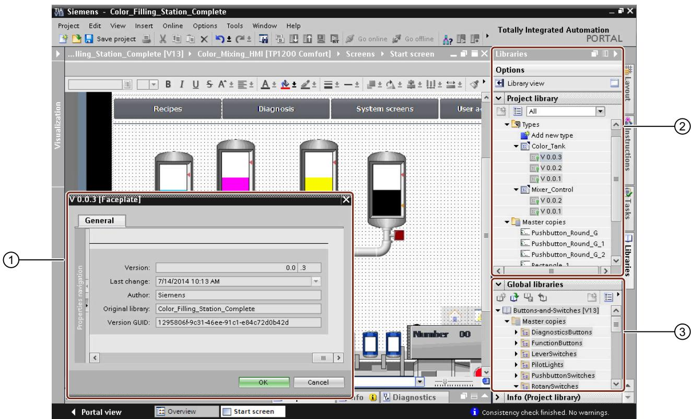
① 显示类型属性、类型版本、主副本和实例
① 项目库中提供以下功能：
• 更新类型实例
• 实例化项目中的类型版本
• 在库组内进行导航
• 删除组、类型、类型版本和主副本
① 全局库中提供以下功能：
• 更新类型实例
• 实例化项目中的类型版本
• 在库组内进行导航

### 5.6.2 访问全局库

• TIA Portal Openness 应用程序已连接到 TIA Portal。请[连接到 TIA Portal](#连接到-TIA-Portal)
全局库有三种类型。
• 系统全局库 (Siemens.Engineering.Library.SystemGlobalLibrary)：这些全局库随 TIAPortal 一起安装并采用 .asx 文件扩展名。所有系统全局库均为只读。
• 企业全局库 (Siemens.Engineering.Library.CorporateGlobalLibrary)：这些全局库已由管理员选择，可在 TIA Portal 启动时进行预加载。所有企业全局库均为只读。
• 用户全局库 (Siemens.Engineering.Library.UserGlobalLibrary)：这些全局库已由 TIAPortal 用户创建。用户全局库能够以只读模式或读写模式打开。
如果用户全局库已采用某种模式打开，则不能使用另一种模式打开同一用户全局库。之前版本的用户全局库只能在只读模式下打开。
使用 TIA Portal Openness 打开的全局库还可添加至 TIA Portal UI 的全局库集合，并显示在TIA Portal UI 中（若 UI 存在）。

#### 程序代码：可用的全局库

修改以下程序代码以获取所有可用全局库的相关信息：
```cs
TiaPortal tia = ...;
var availableLibraries = tia.GlobalLibraries.GetGlobalLibraryInfos();
foreach (GlobalLibraryInfo info in availableLibraries)
{
    Console.WriteLine(" Library Name: {0}", info.Name);
    Console.WriteLine(" Library Path: {0}", info.Path);
    Console.WriteLine(" Library Type: {0}", info.LibraryType);
    Console.WriteLine(" Library IsOpen: {0}", info.IsOpen);
}
```

#### GlobalLibrary 的属性

<table><tr><td>值</td><td>数据类型</td><td>说明</td></tr><tr><td>Author</td><td>String</td><td>全局库的作者。</td></tr><tr><td>Comment</td><td>MultilingualText</td><td>全局库的注释。</td></tr><tr><td>IsReadOnly</td><td>Boolean</td><td>全局库为只读时为真。</td></tr><tr><td>IsModified</td><td>Boolean</td><td>全局库的内容已更改时为真。</td></tr><tr><td>Name</td><td>String</td><td>全局库的名称。</td></tr><tr><td>Path</td><td>FileInfo</td><td>全局库的路径。</td></tr></table>

#### GlobalLibraryInfo 的属性

<table><tr><td>值</td><td>返回类型</td><td>说明</td></tr><tr><td>IsReadOnly</td><td>Boolean</td><td>全局库为只读时为真。</td></tr><tr><td>IsOpen</td><td>Boolean</td><td>全局库已打开时为真。</td></tr><tr><td>LibraryType</td><td>GlobalLibraryType</td><td>全局库的类型:• System:系统全局库• Corporate:企业全局库• User:用户全局库</td></tr><tr><td>Name</td><td>String</td><td>全局库的名称。</td></tr><tr><td>Path</td><td>FileInfo</td><td>全局库的路径。</td></tr></table>
在库中访问文件夹 (页 244)

### 5.6.3 访问库基础类型

要求
• 应用程序已使用 TIA Portal Openness 连接到 TIA Portal[连接到 TIA Portal](#连接到-TIA-Portal)”
• 项目已打开
[打开项目](#打开项目)”
可使用 TIA Portal Openness 访问库类型对象的基础类型类。这些类都有Siemens.Engineering.Library.Types.LibraryType 的直接基础类型
可访问以下基础类型类：
• Siemens.Engineering.Hmi.Faceplate.FaceplateLibraryType
• Siemens.Engineering.Hmi.RuntimeScripting.VBScriptLibraryType
• Siemens.Engineering.Hmi.RuntimeScripting.CScriptLibraryType
• Siemens.Engineering.Hmi.Screen.ScreenLibraryType
• Siemens.Engineering.Hmi.Screen.StyleLibraryType
• Siemens.Engineering.Hmi.Screen.StyleSheetLibraryType
• Siemens.Engineering.Hmi.Tag.HmiUdtLibraryType
• Siemens.Engineering.SW.Blocks.CodeBlockLibraryType
• Siemens.Engineering.SW.Types.PlcTypeLibraryType
```text
TiaPortal tiaPortal = ...;
Project project = tia.Projects.First();
ProjectLibrary library = project.ProjectLibrary;
//Pre-V14SP1
LibraryType libraryType= library.TypeFolder.Types.Find("VBFunction_1");
//V14SP1
VBScriptLibraryType libraryTypeAsVbScript = libraryType as VBScriptLibraryType;
```

### 5.6.4 访问全局库语言

要求
• TIA Portal Openness 应用程序已连接到 TIA Portal。
请[连接到 TIA Portal](#连接到-TIA-Portal)”
• 库已打开
请[打开库](#打开库)”
可使用语言设置导航器访问和管理全局库语言。
TIA Portal Openness 支持对全局库语言进行以下访问：
• 通过支持的语言进行迭代。
• 由 System.Globalization.CultureInfo 通过支持的语言集合进行搜索。
• 访问各个语言。每个语言对象将包含一个System.Globalization.CultureInfo类型的只读属性 Culture。
• 访问活动语言的集合。
• 由 System.Globalization.CultureInfo 通过活动的语言集合进行搜索。
• 向活动的语言集合添加语言。
• 从活动的语言集合删除语言。
• 设置编辑语言。
• 设置参考语言。

#### 全局库语言属性

全局库语言具有以下属性：
<table><tr><td>属性名称</td><td>数据类型</td><td>可写入</td><td>说明</td></tr><tr><td>LanguageSetti ngs</td><td>Siemens.Engineering.La nguageSettings</td><td>r/o</td><td>处理全局库语言</td></tr></table>

#### 程序代码：枚举全局库语言

修改以下程序代码以枚举全局库语言：
```javascript
FileInfo m_GlobalLibrarypath = new FileInfo("bla");
TiaPortal portal = new TiaPortal(TiaPortalMode.WithUserInterface);
var globalLibrary = portal.GlobalLibraries.Open(m_GlobalLibrarypath, OpenMode.ReadOnly);
LanguageSettings languageSettings = globalLibrary.LanguageSettings;
```

#### 程序代码：访问语言设置

修改以下程序代码以访问全局库的语言设置：
```text
FileInfo m_GlobalLibrarypath = new FileInfo("bla");
TiaPortal portal = new TiaPortal(TiaPortalMode.WithUserInterface);
var globalLibrary = portal.GlobalLibraries.Open(m_GlobalLibrarypath, OpenMode.ReadOnly);
LanguageComposition languages = globalLibrary.LanguageSettings.Languages;
foreach (Language language in languages)
{
    // Work with this language
}
```

#### 程序代码：设置全局库语言

修改以下程序代码以设置全局库语言。如果通过 TIA Portal Openness 设置新支持的语言，则会将该语言将添加到活动语言集合。
```javascript
FileInfo m_GlobalLibrarypath = new FileInfo("bla");
TiaPortal portal = new TiaPortal(TiaPortalMode.WithUserInterface);
var globalLibrary = portal.GlobalLibraries.Open(m_GlobalLibrarypath, OpenMode.ReadOnly);
LanguageSettings languageSettings = globalLibrary.LanguageSettings;
LanguageComposition supportedLanguages = languageSettings.Languages;
LanguageAssociation activeLanguages = languageSettings.ActiveLanguages;
Language supportedGermanLanguage = supportedLanguages.Find(CultureInfo.GetCultureInfo("de-DE"));
activeLanguages.Add(supportedGermanLanguage);
languageSettings.EditingLanguage = supportedGermanLanguage;
languageSettings.ReferenceLanguage = supportedGermanLanguage;
```
在全局库语言设置中添加和修改语言不会修改全局库已发布版本的语言。该行为适用于通过 U（语言编辑器）或语言设置导航器更新全局库语言。

### 5.6.5 打开库

• TIA Portal Openness 应用程序已连接到 TIA Portal。请[连接到 TIA Portal](#连接到-TIA-Portal)
• 已通过 TIA Portal Openness 应用程序打开一个项目。此要求仅适用于访问项目库。请[打开项目](#打开项目)
全局库可采用 System.IO.FileInfo 通过本地存储介质或网络存储的库文件路径打开。只有用户全局库才可通过路径打开。从系统全局库或企业全局库获取的路径无法用于打开操作。
自 V14 SP1 起的全局库可使用 GlobalLibraryInfo 打开。OpenMode 可在 GlobalLibraryInfo 中指定。
早期版本的 TIA Portal 的用户全局库可用当前版本的 TIA Portal 升级和打开。V13 或更早版本的全局库无法用升级版本打开。这些库必须首先升级至 V13 SP1。
使用 TIA Portal Openness 打开的库还可添加至 TIA Portal 的全局库集合，并显示在 TIA Portal的用户界面中。

#### 程序代码：使用 System.IO.FileInfo 打开库

修改以下程序代码：
TiaPortal tia = ...
FileInfo fileInfo = ....
UserGlobalLibrary userLib = tia.GlobalLibraries.Open(fileInfo, OpenMode.ReadWrite);

#### 程序代码：使用 GlobalLibraryInfo 打开库

修改以下程序代码：
```text
TiaPortal tia = ...
IList<GlobalLibraryInfo> libraryInfos = tia.GlobalLibraries.GetGlobalLibraryInfos();
GlobalLibraryInfo libInfo = ...; // check for the info you need from the list, e.g.
GlobalLibrary libraryOpenedWithInfo;
if (libInfo.Name == "myLibrary")
libraryOpenedWithInfo = tia.GlobalLibraries.Open(libInfo);
```
程序代码：升级库
修改以下程序代码：
```text
TiaPortal tia = ...
FileInfo fileInfo = .... // library from previous TIA Portal version
```
UserGlobalLibrary userLib = tia.GlobalLibraries.OpenWithUpgrade(fileInfo);

#### OpenMode

<table><tr><td>值</td><td>说明</td></tr><tr><td>ReadOnly</td><td>库的读访问。</td></tr><tr><td>ReadWrite</td><td>库的读写访问。</td></tr></table>

### 5.6.6 比较库

要求
• 应用程序已使用 TIA Portal Openness 连接到 TIA Portal[连接到 TIA Portal](#连接到-TIA-Portal)”
• 项目已打开
[打开项目](#打开项目)”
可以使用 TIA Portal Openness 相互比较各个库。例如，可在将新版本更新到项目之前使用此功能确定版本间的差异。
可使用 Openness 对所选库对象进行具体比较。可比较两个库对象
• 类型对象
• 版本对象
• 模板副本
可通过 Openness API 比较两个类型对象（例如版本对象和主副本），并返回详细的内容比较结果。

#### 方法、参数和枚举

TIA Portal Openness 支持采用以下方法及其签名类型来比较库对象：
<table><tr><td>方法</td><td>返回类型</td></tr><tr><td>DetailedCompareResult CompareTo(LibraryType targetLibraryObject)</td><td>Siemens.Engineering.Library.Types.LibraryType</td></tr><tr><td>DetailedCompareResult CompareTo(LibraryTypeVersion targetLibraryObject)</td><td>Siemens.Engineering.Library.Types.LibraryTypeVersion</td></tr><tr><td>DetailedCompareResult CompareTo(MasterCopy targetLibraryObject)</td><td>Siemens.Engineering.Library.MasterCopies.MasterCopy</td></tr></table>
LibraryCompareResult 支持 TIA Portal Openness 中的以下导航器：
<table><tr><td>名称</td><td>类型</td></tr><tr><td>Parent</td><td>Siemens.Engineering.IEngineeringObject</td></tr><tr><td>RootElement</td><td>Siemens.Engineering.Library.Compare.LibraryCompareResultElement</td></tr></table>
LibraryCompareResultElement 支持 TIA Portal Openness 中的以下导航器和属性：
<table><tr><td>名称</td><td>类型</td></tr><tr><td>Parent</td><td>Siemens.Engineering.Library.Compare.LibraryCompareResultElementComposition</td></tr><tr><td>RootElement</td><td>Siemens.Engineering.Library.Compare.LibraryCompareResultElement</td></tr></table>
<table><tr><td>属性名称</td><td>类型</td></tr><tr><td>ComparisonResult</td><td>Siemens.Engineering.Library.Compare.LibraryCompareResultState</td></tr><tr><td>DetailedInformation</td><td>System.String</td></tr><tr><td>LeftName</td><td>System.String</td></tr><tr><td>RightName</td><td>System.String</td></tr><tr><td>Left</td><td>Siemens.Engineering.IEngineeringObject</td></tr><tr><td>Right</td><td>Siemens.Engineering.IEngineeringObject</td></tr></table>
LibraryCompareResultState ENUM 支持以下 ENUM 项目：
<table><tr><td>Enum 项目</td><td>描述</td></tr><tr><td>ContainerContentsDifferent</td><td>Container contents has one or more differences</td></tr><tr><td>ContainerContentsIdentical</td><td>Container content is identical</td></tr><tr><td>ObjectsDifferent</td><td>Objects are different</td></tr><tr><td>LeftMissing</td><td>Left object is missing</td></tr><tr><td>RightMissing</td><td>Right object is missing</td></tr><tr><td>ObjectsIdentical</td><td>Objects are identical</td></tr></table>
DetailedCompareResult 支持 TIA Portal Openness 中的以下导航器：
<table><tr><td>名称</td><td>类型</td></tr><tr><td>Parent</td><td>Siemens.Engineering.IEngineeringObject</td></tr><tr><td>RootElement</td><td>Siemens.Engineering.Library.Compare.LibraryCompareResultElement</td></tr></table>
DetailedCompareResultElement 支持 TIA Portal Openness 中的以下导航器和属性：
<table><tr><td>名称</td><td>类型</td></tr><tr><td>Parents</td><td>Siemens.Engineering.IEngineeringObject</td></tr></table>
<table><tr><td>属性名称</td><td>类型</td><td>描述</td></tr><tr><td>Description</td><td>System.String</td><td>详细比较特性名称</td></tr><tr><td>LeftValue</td><td>System.Object</td><td>详细比较左侧特性值。LeftValue 特性支持以下类型,即 System.Guid、System.Boolean、System.String、System.DateTime</td></tr><tr><td>RightValue</td><td>System.Object</td><td>详细比较右侧特性值。RightValue 特性支持以下类型,即 System.Guid、System.Boolean、System.String、System.DateTime。</td></tr><tr><td>DetailCompareStatus</td><td>Siemens.Engineering.Library.Compare.DetailCompareStatus</td><td>基于应用的默认条件过滤器返回特性值的比较结果。(默认情况下不会比较版本对象的原始库特性)</td></tr></table>
DetailCompareStatus 支持以下 ENUM 项目：
<table><tr><td>Enum 项目</td><td>值</td></tr><tr><td>ObjectsDifferent</td><td>对象不同</td></tr><tr><td>ObjectsIdentical</td><td>对象相同</td></tr><tr><td>NotCompared</td><td>如果应用过滤器,则不会比较对象</td></tr></table>
GlobalLibrary globalLibrary = ...;
ProjectLibrary projectLibrary = Project.ProjectLibrary;
LibraryCompareResult libraryCompareResults =
globalLibrary.CompareToLibrary(projectLibrary);

#### 修改以下程序代码以比较两个类型对象：

```matlab
...
GlobalLibrary globalLibrary = ...;
ProjectLibrary projectLibrary = Project.ProjectLibrary;
LibraryType leftTypeObject = ProjectLib.TypeFolder.Types.Find(typeName);
LibraryType rightTypeObject = GlobalLib.TypeFolder.Types.Find(typeName);
DetailedCompareResult detailedCompareResult = leftTypeObject.compareTo(rightTypeObject);
...
```

#### 修改以下程序代码以比较两个版本：

```matlab
...
GlobalLibrary globalLibrary = ...;
ProjectLibrary projectLibrary = Project.ProjectLibrary;
LibraryTypeVersion leftVersionObject =
ProjectLib.TypeFolder.Types.Find(typeName).Versions[0];
LibraryTypeVersion rightVersionObject =
GlobalLib.TypeFolder.Types.Find(typeName).Versions[0];
DetailedCompareResult detailedCompareResult =
leftVersionObject.compareTo(rightVersionObject);
```
修改以下程序代码以比较两个模板副本对象：
```matlab
...
GlobalLibrary globalLibrary = ...;
ProjectLibrary projectLibrary = Project.ProjectLibrary;
LibraryTypeVersion leftMasterCopy =
ProjectLib.MasterCopyFolder.MasterCopies.Find(masterCopyName);
LibraryTypeVersion rightMasterCopy =
GlobalLib.MasterCopyFolder.MasterCopies.Find(masterCopyName);
DetailedCompareResult detailedCompareResult = leftMasterCopy比較To(rightMasterCopy);
...
```

### 5.6.7 基于版本对象创建类型

• TIA Portal Openness 应用程序已连接到 TIA Portal [连接到 TIA Portal](#连接到-TIA-Portal)”
• 项目已经打开。
[打开项目](#打开项目)”
简介
可使用 TIA Portal Openness 基于版本对象创建类型。可通过在 LibraryTypeComposition 中执行 CreateType 操作来使用此 API 功能。

#### 方法和参数

CreateFrom() 是重载 API 方法，会接受以下参数并返回 LibraryType 作为数据类型。
<table><tr><td>参数名称</td><td>返回类型</td><td>描述</td></tr><tr><td>sourceVersion</td><td>LibraryTypeVersion</td><td>指定用户创建类型要使用的源</td></tr><tr><td>typeName</td><td>String</td><td>为新创建的类型指定名称,API将检查用户传递的值是否不是null且不为空。如果提供的值满足这些条件,则会将其用作类型的名称。</td></tr><tr><td>typeMtdv</td><td>String</td><td>适用于具有最低目标设备版本(MTDV)的Unified面板类型。如果类型不是Unified Faceplate,API将忽略用户传递的typeMTDV参数。可基于源类型创建新类型的MinimumTargetDeviceVersion:如果用户提供的typeMtdv参数将被分配为新创建类型的MTDV。但仅当typeMtdv中提供的值属于受支持的MTDV值时才会进行此分配。如果用户提供的typeMtdv参数为null或为空,新创建类型的MTDV类型将与源类型相同。</td></tr></table>

#### 程序代码：使用 LibraryTypeComposition 创建类型

修改以下程序代码，以基于源类型创建新类型的最低目标设备版本：
```text
private static void createTypeFromVersionObject(project Project)
{
    //...
    ProjectLibrary projectLibrary = Project.ProjectLibrary;
    LibraryTypeComposition projectLibraryTypes = project.ProjectLibrary.TypeFolder.Types;
    LibraryType sourceLibraryType = projectLibraryTypes[nameofthetype];
    LibraryTypeVersion sourceLibraryTypeVersion = sourceLibraryType.Version[index];
    LibraryType createType = projectLibraryTypes.CreateFrom(sourceLibraryTypeVersion);
    //Or
    LibraryType createType = projectLibraryTypes.CreateFrom(sourceLibraryTypeVersion,typeName);
    //Or
    LibraryType createType = projectLibraryTypes.CreateFrom(sourceLibraryTypeVersion, typeMtdv);
    //Or
    LibraryType createType =
    projectLibraryTypes.CreateFrom(sourceLibraryTypeVersion, typeMtdv, typeName);
    //...
}
```

#### 例外

以下情况下，将向用户抛出 Siemens.Engineering.EngineeringTargetInvocationException：
• 使用 null LibraryTypeVersion 对象执行 CreateFrom 操作
• 使用全局库中的 LibraryTypeVersion 对象执行 CreateFrom 操作
• 使用受写保护的 LibraryTypeVersion 对象执行 CreateFrom 操作
• 使用已在运行或测试的 LibraryTypeVersion 对象执行 CreateFrom 操作
• 使用 MinimumTargetDeviceVersion(MTDV) 不受支持的 LibraryTypeVersion 对象执行CreateFrom 操作
• 对 GlobalLibrary 的 LibraryTypeComposition 执行 CreateFrom 操作

### 5.6.8 枚举打开的库

• TIA Portal Openness 应用程序已连接到 TIA Portal。请[连接到 TIA Portal](#连接到-TIA-Portal)
应用
TIA Portal 中所有打开（不论是通过 API 打开还是通过用户界面打开）的全局库均可枚举。如果早期版本的 TIA Portal 的全局库以写访问的方式打开，则无法对其进行枚举。
程序代码
修改以下程序代码以枚举打开的全局库：
```text
TiaPortal tia = ...
foreach (GlobalLibrary globLib in tia.GlobalLibraries)
{
    ///work with the global library
}
```
打开项目 (页 140)

### 5.6.9 保存并关闭库

要求
• TIA Portal Openness 应用程序已连接到 TIA Portal。请[连接到 TIA Portal](#连接到-TIA-Portal)
• 库已打开。 请[打开库](#打开库)
用户全局库可关闭或保存。对全局库的所有更改不会自动保存。若关闭全局库，则所有未保存的更改均将丢弃且不会给予任何提示。
系统全局库和企业全局库无法关闭或保存。
要保存和关闭全局库：
• 请使用 Save ( ) 方法保存用户全局库
• 请使用 SaveAs ( ) 方法将用户全局库保存在不同的目录中
• 请使用 Close ( ) 方法关闭用户全局库
针对 SaveAs ( ) 包含的功能令牌如下：
• PublicAPI：任何已发布功能均需要
• DenyIfTransaction：SaveAs 因无法被撤消而不应出现在事务内。
修改以下程序代码以保存用户全局库：
```text
UserGlobalLibrary userLib = ...
// save changes and close library
userLib.Save();
userLib.Close();
```
修改以下程序代码以将用户全局库保存到不同位置：
```text
TiaPortal portal = new TiaPortal(TiaPortalMode.WithUserInterface);
GlobalLibraryComposition globalLibraryComposition = portal.GlobalLibraries;
//please adapt the path and the extension alx to the installed version of TIA Portal
FileInfo existingLibraryfileInfo = new
FileInfo(@"D:\GlobalLibraries\MyGlobalLibrary\MyGlobalLibrary.alx");
DirectoryInfo targetDirectoryInfo = new
DirectoryInfo(@"D:\GlobalLibraries\GlobalLibrarySaveAs");
UserGlobalLibrary userGlobalLibrary =
globalLibraryComposition.Open(existingLibraryfileInfo, OpenMode.ReadWrite);
userGlobalLibrary.SaveAs(targetDirectoryInfo);
```
执行 SaveAs 操作后，库的保留情况会发生更改。因此，执行 SaveAs 后，新保存的库将显示在库卡中。不过，执行 SaveAs 操作的原始库将不可用。新保存的库将采用执行 SaveAs 操作的原始库所用的模式。这表示，如果以 ReadOnly 模式打开了现有库，则目标路径中新保存的库也会以 ReadOnly 模式打开。ReadWrite 模式同理。
修改以下程序代码以关闭用户全局库：
```javascript
UserGlobalLibrary userLib = ... // close and discard changes userLib.Close();
```

### 5.6.10 归档与检索库

• TIA Portal Openness 应用程序已连接到 TIA Portal。 [连接到 TIA Portal](#连接到-TIA-Portal)”
• 库已打开。
请[打开库](#打开库)
• 库已保存
[保存并关闭库](#保存并关闭库)”
进行任意进一步修改之前，可使用 TIA Portal Openness 来归档打开的全局库，并保存全局库，以防止出现意外结果，以便可使用 TIA Portal Openenss 检索归档的库。还可以在网络上轻松分享归档文件。

#### 归档库

可以通过 TIA Portal Openness API 接口归档用户全局库。可在“Siemens.Engineering.UserGlobalLibrary”对象上找到 API。
API 的定义如下所示：
public void Archive(System.IO.DirectoryInfo targetDirectory, string targetName, Siemens.Engineering.Library.LibraryArchivationMode archivationMode)
“targetName”是为归档或未归档的库所创建的文件名称。该文件可能包含文件扩展名，但也可能不包含。如果未提供任何扩展名，或提供除“zalx”或“zal14”等以外的扩展名，则无法从Openness API 外的 TIA Portal 中检索归档文件。

#### 对于 LibraryArchivationMode 的值为 Compressed 和

DiscardRestorableDataAndCompressed 的情况，归档文件的名称与用户提供的名称一致。对于 LibraryArchivationMode 的值为 None 和 DiscardRestorableData 的情况，TIA Portal 项目管理器组件会基于 TIA Portal 的当前版本自动决定库文件扩展名。
调用归档 API 之前必须已保存库。如果库中包含任何未保存的更改，归档将出现EngineeringTargetInvocationException。

#### 库归档模式

LibraryArchivationMode 枚举共有四个值：
<table><tr><td>LibraryArchivatio nMode</td><td>描述</td></tr><tr><td>None</td><td>·不对原始文件采取特殊操作。该模式类似于“另存为”操作。·该模式中不会创建压缩zip文件。·该情况与SaveAs的区别在于,归档不会更改新归档文件夹的永久位置,而SaveAs则会进行更改。</td></tr><tr><td>DiscardRestorable Data</td><td>·文件存储会将库存储在内部数据文件中,对库进行数据修改后,该文件会增大。在DiscardRestorableData模式下,将重新组织该数据文件(仅存储最新版本的对象,历史版本将从文件中移除),而中间数据、IM目录和tmp目录(参见库目录结构)的文件不会复制到归档位置。·该模式中不会创建压缩zip文件。</td></tr><tr><td>Compressed</td><td>通过归档创建的tmp库文件夹结构被压缩成兼容归档的zip文件。创建zip文件后,将移除tmp文件夹结构。</td></tr><tr><td>DiscardRestorable DataAndCompressed</td><td>通过归档创建的tmp库文件夹结构将丢弃可存储数据,随后压缩成兼容归档的zip文件。创建zip文件后,将移除tmp文件夹结构。</td></tr></table>

#### 程序代码：归档库


#### 修改以下程序代码以归档用户全局库：

```javascript
var tiaPortal = new TiaPortal(TiaPortalMode.WithoutUserInterface);
//Please adapt the path and the extension alx to the installed version of TIA Portal
var libraryFilePath = @"E:\Sample1\Sample1.alx";
var userGlobalLibrary = tiaPortal.GlobalLibraries.Open(new FileInfo(LibraryFilePath), OpenMode.ReadWrite);
var archivePath = @"E:\Archive";
var archiveFileName = "SampleArchive";
userGlobalLibrary.Archive(new DirectoryInfo(archivePath), archiveFileName, LibraryArchivationMode.Compressed);
```

#### 检索库

可以通过 TIA Portal Openness API 接口检索归档的 TIA Portal 库。只可以检索压缩的归档。可在以下部分找到 API：Siemens.Engineering.GlobalLibraryComposition 对象。API 的定义如下所示：
```elixir
public Siemens.Engineering.Library.UserGlobalLibrary Retrieve(System.IO.FileInfo sourcePath, System.IO.DirectoryInfo targetDirectory, Siemens.Engineering.OpenMode openMode)
```
```text
说明
无法使用“LibraryArchivationMode.None”或“LibraryArchivationMode.DiscardRestorableData”枚举值检索归档库。
```
可以为早期 TIA Portal 版本的归档库调用 RetrieveWithUpgrade API 。API 的定义如下所示：
public Siemens.Engineering.Library.UserGlobalLibrary RetrieveWithUpgrade(System.IO.FileInfo sourcePath, System.IO.DirectoryInfo targetDirectory, Siemens.Engineering.OpenMode openMode)

#### 打开模式

5.6 库操作函数
OpenMode 枚举共有两个值：
<table><tr><td>OpenMode</td><td>描述</td></tr><tr><td>ReadMode</td><td>库的读访问。可以从库读取数据。</td></tr><tr><td>ReadWrite</td><td>库的写访问。可以向库写入数据。</td></tr></table>
程序代码：检索库
修改以下程序代码以检索库：
```text
//Please adapt the path and the extension zalx to the installed version of TIA Portal
var archivePath = @"E:\Archive\Sample1.zalx";
var retrievedLibraryDirectory = @"E:\RetrievedLibraries";
var tiaPortal = new TiaPortal(TiaPortalMode.WithoutUserInterface);
tiaPortal.GlobalLibraries.Retrieve(new FileInfo(archivePath), new
DirectoryInfo(retrievedLibraryDirectory), OpenMode.ReadWrite));
```
打开库 (页 229)

### 5.6.11 创建全局库

要求
• TIA Portal Openness 应用程序已连接到 TIA Portal。 [连接到 TIA Portal](#连接到-TIA-Portal)”
简介
在 GlobalLibraryComposition 中调用 Create 类函数，基于 TIA Portal Openness API 创建各种全局库。此时，系统将返回一个 UserGlobalLibrary

#### 用于创建全局库的参数

<table><tr><td>参数</td><td>数据类型</td><td>类型</td><td>描述</td></tr><tr><td>Author</td><td>String</td><td>强制</td><td>全局库的作者。</td></tr><tr><td>Comment</td><td>String</td><td>可选</td><td>全局库的注释。</td></tr><tr><td>Name</td><td>String</td><td>可选</td><td>全局库的名称。</td></tr><tr><td>TargetDirectory</td><td>DirectoryInfo</td><td>强制</td><td>将包含全局库文件夹的目录。</td></tr></table>

#### GlobalLibraryComposition.Create

修改以下程序代码：
TiaPortal tia= ...;
DirectoryInfo targetDirectory = new DirectoryInfo(@"D:\GlobalLibraries"); UserGlobalLibrary globalLibrary =
tia.GlobalLibraries.Create<UserGlobalLibrary>(targetDirectory, "Library1")
根据本示例：
• 将创建文件夹“D:\GlobalLibraries\Library1”
• 将创建全局库文件“D:\GlobalLibraries\Library1\Library1.alXX”
[打开项目](#打开项目)

### 5.6.12 在库中访问文件夹

• TIA Portal Openness 应用程序已连接到 TIA Portal。 [连接到 TIA Portal](#连接到-TIA-Portal)”
• 已通过 TIA Portal Openness 应用程序打开一个项目。[打开项目](#打开项目)”
• 需具有指定库的访问权限。
[访问全局库](#访问全局库)”
可以通过 TIA Portal Openness API 接口在库中访问有关类型和主副本的系统文件夹。您可以访问系统文件夹中的类型、类型版本、主副本以及用户定义文件夹。
您可通过Find方法随时访问用户定义的文件夹，例如
libTypeUserFolder.Folders.Find("SomeUserFolder");。

#### 程序代码：访问系统文件夹

修改以下程序代码以访问库中类型的系统文件夹：
```objectivec
public static void AccessTypeSystemFolder(ILibrary library)
{
    LibraryTypeSystemFolder libTypeSystemFolder = library.TypeFolder;
}
```
修改以下程序代码以访问库中主副本的系统文件夹：
```text
public static void AccessMasterCopySystemFolder(ILibrary library)
{
    MasterCopySystemFolder libMasterCopySystemFolder = library.MasterCopyFolder;
}
```
程序代码：通过 Find() 方法访问用户自定义文件夹：
```text
...
LibraryTypeUserFolderComposition userFolderComposition = ...
LibraryTypeUserFolder userFolder = userFolderComposition.Find("Name of user folder");
...
```

#### 程序代码：枚举用户自定义文件夹

修改以下程序代码以枚举类型系统文件夹中的用户自定义子文件夹：
```cs
public static void EnumerateUserFoldersInTypeSystemFolder(ILibrary library)
{
    // Enumerating user folders in type system folder:
    LibraryTypeSystemFolder libTypeSystemFolder = library.TypeFolder;
    foreach (LibraryTypeUserFolder libTypeUserFolder in libTypeSystemFolder.Folders)
    {
    //...
    }
}
```
修改以下程序代码以枚举主副本系统文件夹中的用户自定义子文件夹：
```cs
public static void EnumerateUserFoldersInMasterCopySystemFolder(ILibrary library)
{
    // Enumerating user folders in master copy system folder:
    MasterCopySystemFolder libMasterCopySystemFolder = library.MasterCopyFolder;
    foreach (MasterCopyUserFolder libMasterCopyUserFolder in libMasterCopySystemFolder.Folders)
    {
    //..
    }
}
```
修改以下程序代码以枚举类型用户自定义文件夹中的用户自定义子文件夹：
```cs
public static void EnumerateAllUserFolders(LibraryTypeUserFolder libUserFolder)
{
    foreach (LibraryTypeUserFolder libSubUserFolder in libUserFolder.Folders)
    {
    EnumerateAllUserFolders(libSubUserFolder);
    }
}
```
修改以下程序代码以枚举主副本用户自定义文件夹中的用户自定义子文件夹：
```cs
public static void EnumerateAllUserFolders(MasterCopyUserFolder libUserFolder)
{
    foreach (MasterCopyUserFolder libSubUserFolder in libUserFolder.Folders)
    {
    EnumerateAllUserFolders(libSubUserFolder);
    }
}
```

#### 程序代码：创建用户自定义文件夹

修改以下程序代码以创建类型用户自定义文件夹：
```javascript
var typeFolderComposition = ProjectLibrary.TypeFolder.Folders;
var newTypeUserFolder = typeFolderComposition.Create("NewTypeUserFolder");
```
修改以下程序代码以创建主副本用户自定义文件夹：
```javascript
var masterCopyFolderComposition = projectProjectLibrary.MasterCopyFolder.Folders;
MasterCopyUserFolder newMasterCopyUserFolder =
masterCopyFolderComposition.Create("NewMasterCopyUserFolder);
```

#### 程序代码：重命名用户自定义文件夹

修改以下程序代码以创建类型用户自定义文件夹：
```javascript
var typeUserFolder = ProjectLibrary.TypeFolder.Folders.Find("SampleTypeUserFolderName");
typeUserFolder.SetAttributes(new[] {new KeyValuePair<string,object>("Name", "NewTypeUserFolderName")});
修改以下程序代码以创建主副本用户自定义文件夹:
var masterCopyUserFolder =
project.ProjectLibrary.MasterCopyFolder.Folders.Find("SampleMasterCopyUserFolderName");
masterCopyUserFolder.Name = "NewMasterCopyUserFolderName";
var masterCopyUserFolder =
ProjectLibrary.MasterCopyFolder.Folders.Find("SampleMasterCopyUserFolderName");
masterCopyUserFolder.SetAttributes(new[] {new KeyValuePair<string,object>("Name", "NewMasterCopyUserFolderName")});
```
访问主副本 (页 259)

### 5.6.13 访问类型

• TIA Portal Openness 应用程序已连接到 TIA Portal。请[连接到 TIA Portal](#连接到-TIA-Portal)
• 已通过 TIA Portal Openness 应用程序打开一个项目。请[打开项目](#打开项目)
• 您具有所需库的访问权限。请[访问全局库](#访问全局库)。
• 您具有类型组的访问权限。请[在库中访问文件夹](#在库中访问文件夹)。
您可以通过 TIA Portal Openness API 接口访问包含在库中的类型。
• 您可以枚举类型。
• 可以重命名类型。
• 您可以访问各个类型的下列属性：
<table><tr><td>属性</td><td>数据类型</td><td>说明</td></tr><tr><td>Author</td><td>String</td><td>返回作者的姓名。</td></tr><tr><td>Comment</td><td>MultilingualText</td><td>返回注释。</td></tr><tr><td>Guid</td><td>Guid</td><td>返回类型的GUID。 $^{1}$ </td></tr><tr><td>Name</td><td>String</td><td>返回类型的名称。 $^{2}$ </td></tr></table>
<sup>1</sup> 您可使用此属性在库中查找一个具体类型。该搜索是递归的。  
您可使用此属性在文件夹中查找一个具体类型。子文件夹不包括在搜索范围内。类型名称不唯一。不同组中可能会有多个具有相同名称的类型。但 Guid 类型是唯一的。

#### 库类型对象的子类别

利用 TIA Portal Openness API，您可以通过子类别访问库类型对象。存在以下子类别：
• Siemens.Engineering.Hmi.Faceplate.FaceplateLibraryType
• Siemens.Engineering.Hmi.Faceplate.FaceplateLibraryTypeVersion
• Siemens.Engineering.Hmi.RuntimeScripting.VBScriptLibraryType
• Siemens.Engineering.Hmi.RuntimeScripting.VBScriptLibraryTypeVersion
• Siemens.Engineering.Hmi.RuntimeScripting.CScriptLibraryType
• Siemens.Engineering.Hmi.RuntimeScripting.CScriptLibraryTypeVersion
• Siemens.Engineering.Hmi.Screen.ScreenLibraryType
• Siemens.Engineering.Hmi.Screen.ScreenLibraryTypeVersion
• Siemens.Engineering.Hmi.Screen.StyleLibraryType
• Siemens.Engineering.Hmi.Screen.StyleLibraryTypeVersion
• Siemens.Engineering.Hmi.Screen.StyleSheetLibraryTypeVersion
• Siemens.Engineering.Hmi.Tag.HmiUdtLibraryType
• Siemens.Engineering.Hmi.Tag.HmiUdtLibraryTypeVersion
5.6 库操作函数
• Siemens.Engineering.SW.Blocks.CodeBlockLibraryType
• Siemens.Engineering.SW.Blocks.CodeBlockLibraryTypeVersion
• Siemens.Engineering.SW.Types.PlcTypeLibraryType
• Siemens.Engineering.SW.Types.PlcTypeLibraryTypeVersion
以下代码为库类型子类别使用方法示例
```text
ProjectLibrary library = project.ProjectLibrary;
VBScriptLibraryType vbScriptType = ...;
VBScriptLibraryType libraryTypeAsVbScript = libraryType as VBScriptLibraryType;
VBScriptLibraryTypeVersion libraryTypeVersionAsVbScript = libraryTypeVersion as VBScriptLibraryTypeVersion
```
修改以下程序代码以枚举库的系统文件夹中的所有类型：
```groovy
public static void EnumerateTypesInTypesSystemFolder(LibraryTypeSystemFolder libraryTypeSystemFolder)
{
    foreach (LibraryType libraryType in libraryTypeSystemFolder.Types)
    {
    //...
    }
}
```
修改以下程序代码以枚举库的用户自定义文件夹中的所有类型：
```text
public static void EnumerateTypesInTypesUserFolder (LibraryTypeUserFolder libraryTypeUserGroup)
{
    foreach (LibraryType libraryType in libraryTypeUserGroup.Types)
    {
    //...
    }
}
```
```cs
修改以下程序代码以访问一个类型的属性:
public static void InspectPropertiesOfType (LibraryType libTypeObject)
{
    string typeAuthor = libTypeObject.Author;
    MultilingualText typeComment = libTypeObject.Comment;
    string typeName = libTypeObject.Name;
    Guid typeGUID = libTypeObject.Guid;
}
修改以下程序代码以通过名称或GUID查找单个类型:
public static void FindTypeObjectInLibrary(ILibrary library)
{
    // Find type object by its GUID in a given library:
    System.Guid targetGuid = ...;
    LibraryType libTypeByGUID = library.FindType(targetGuid);
    // Find type object by its name in a given group:
    LibraryTypeFolder libTypeSystemFolder = library.TypeFolder;
    LibraryType libTypeByName = libTypeSystemFolder.Types.Find("myTypeObject");
}
修改以下程序代码以重命名类型:
// Setting the name attribute
var type = project.ProjectLibrary.TypeFolder.Types.Find("SampleTypeName");
type.Name = "NewTypeName";
//Setting the name attribute dynamically
var type = project.ProjectLibrary.TypeFolder.Types.Find("SampleTypeName");
type.SetAttributes(new[] {new KeyValuePair<string,object>("Name", "NewTypeName")});
```
修改以下程序代码以访问一个类型的属性：

### 5.6.14 访问类型版本

要求
• TIA Portal Openness 应用程序已连接到 TIA Portal。 [连接到 TIA Portal](#连接到-TIA-Portal)”
• 已通过 TIA Portal Openness 应用程序打开一个项目。[打开项目](#打开项目)”
• 需具有指定库的访问权限。
[访问全局库](#访问全局库)”。
• 需具有该类型组的访问权限。
[在库中访问文件夹](#在库中访问文件夹)”。
可使用 TIA Portal Openness 执行以下功能：
• 访问类型版本
• 枚举一个类型的多个类型版本
• 确定类型版本所属的类型
• 枚举一个类型版本的多个实例。
• 为一个类型版本创建新实例。
• 从某个实例导航至其所连接的版本对象。
您可以访问各个类型版本的下列属性：
<table><tr><td>属性</td><td>数据类型</td><td>描述</td></tr><tr><td>Author</td><td>String</td><td>返回作者的姓名。</td></tr><tr><td>Comment</td><td>MultilingualText</td><td>返回注释。</td></tr><tr><td>Guid</td><td>Guid</td><td>返回类型版本的GUID。 $^{1}$ </td></tr><tr><td>ModifiedDate</td><td>DateTime</td><td>返回类型版本设为“Committed”状态的日期和时间。</td></tr><tr><td>State</td><td>LibraryTypeVersionState</td><td>返回版本的状态:InWork:对应于状态“进行中”(In progress)或“正在测试”(In testing),具体取决于关联的类型。Committed:对应于状态“已发布”(Released)。</td></tr><tr><td>TypeObject</td><td>LibraryType</td><td>返回此类型版本所属的类型。</td></tr><tr><td>VersionNumber</td><td>Version</td><td>返回三位版本标识符格式的版本号,例如“1.0.0”。 $^{2}$ </td></tr></table>
<sup>1</sup> 使用此属性在库中查找一个具体类型版本。  
<sup>2</sup> 使用此属性在“LibraryTypeVersion”组合中查找某个具体类型版本。

#### 枚举某一类型的所有类型版本

修改以下程序代码：
```cs
//Enumerate the type versions of a type
public static void EnumerateVersionsInType(LibraryType libraryType)
{
    foreach (LibraryTypeVersion libraryTypeVersion in libraryType.Versions)
    {
    //...
    }
}
```

#### 访问类型版本的属性

修改以下程序代码：
```cs
// Acessing the attributes of a type version
public static void InspectPropertiesOfVersion(LibraryTypeVersion libTypeVersion)
{
    string versionAuthor = libTypeVersion.Author;
    MultilingualText versionComment = libTypeVersion.Comment;
    Guid versionGUID = libTypeVersion.Guid; DateTime versionModifiedDate = libTypeVersion.ModifiedDate;
    LibraryTypeVersionState versionStateLibrary = libTypeVersion.State;
    LibraryType versionParentObject = libTypeVersion.TypeObject;
    Version versionNumber = libTypeVersion.VersionNumber;
}
```

#### 创建类型版本的实例

可以为一个类型版本创建新实例。支持以下对象：
• 块 (FB/FC)
• PLC 用户数据类型
• 画面
• VB 脚本
此时，将在全局库和项目库中创建一个类型版本的实例。当在全局库中创建类型版本实例时，类型版本会首先与项目库同步。
```text
如果无法在目标中创建实例，则会出现可恢复异常。可能的原因如下：
• 库类型版本正在使用中
• 库类型版本的实例已存在于目标设备中
修改以下程序代码：
VBScriptLibraryTypeVersion scriptVersion = ...;
VBScriptComposition vbscripts = ...;
//Using the CreateFrom method to create an instance of the version in the VBScripts composition
VBScript newScript = vbscripts.CreateFrom(scriptVersion);
修改以下程序代码：
ScreenLibraryTypeVersion screenVersion = ...;
ScreenComposition screens = ...;
//Using the CreateFrom method to create an instance of the version in the screens composition
Screen newScreen = screens.CreateFrom(screenVersion);
修改以下程序代码：
CodeBlockLibraryTypeVersion blockVersion = ...;
PlcBlockComposition blocks = ...
//Using the CreateFrom method to create an instance of the version in the blocks composition
PlcBlock newBlock = blocks.CreateFrom(blockVersion);
修改以下程序代码：
PlcTypeLibraryTypeVersion plcTypVersione=...;
PlcTypeComposition types=...
//Using the CreateFrom method to create an instance of the version in the types composition
PlcType newType = types.CreateFrom(plcTypeVersion);
```

#### 确定类型版本的用途

类型版本分为以下用途：
```text
- 类型版本使用库中的其它类型版本。
示例：在程序块中使用一个用户数据类型。程序块必须具有该用户数据类型的访问权限。这意味着程序块取决于用户数据类型。
当通过 GetDependencies() 方式访问 CodeBlockLibraryVersion 的相关性 (Dependents) 属性时，将返回 LibraryTypeVersions 列表。
```
```text
- 此类型正在被库中的另一类型版本使用。
示例：在程序块中使用一个用户数据类型。程序块必须具有该用户数据类型的访问权限。该用户数据类型具有相关联的程序块。程序块取决于用户数据类型。
当通过 GetDependents() 方式访问 PlcTypeLibraryTypeVersion 的相关性 (Dependents) 属性时，将返回 LibraryTypeVersions 列表。
```
这两种属性均会返回一个列表，其中包含LibraryTypeVersion类型的对象。如果未进行任何使用，则将返回一个空列表。
```text
说明如果对“InWork”状态的类型版本使用这些属性，则将出现异常。
```
修改以下程序代码：
```cs
//Determine the uses of a type version in a library
public static void GetDependenciesAndDependentsOfAVersion(LibraryTypeVersion libTypeVersion)
{
    IList<LibraryTypeVersion> versionDependents = libTypeVersion.Dependents();
    IList<LibraryTypeVersion> versionDependencies = libTypeVersion.Dependencies();
}
```
修改以下程序代码以确定类型版本所属的类型：
```text
public static void GetParentTypeOfVersion(LibraryTypeVersion libTypeVersion)
{
    LibraryType parentType = libTypeVersion.TypeObject;
}
```

#### 修改以下程序代码以确定包含类型版本实例的主副本：

```objectivec
public static void GetMasterCopiesContainingInstances(LibraryTypeVersion libTypeVersion)
{
    MasterCopyAssociation masterCopies = libTypeVersion.MasterCopiesContainingInstances;
}
```
修改以下程序代码以通过版本号查找单个类型版本：
```java
public static void FindVersionInLibrary(ILibrary library, Guid versionGUID)
{
    LibraryTypeVersion libTypeVersionByVersionNumber = library.FindVersion(versionGUID);
}
```

### 5.6.15 访问位于库中的块

```text
- TIA Portal Openness 应用程序已连接到 TIA Portal [连接到 TIA Portal](#连接到-TIA-Portal)”
```
• 已打开一个项目请[打开项目](#打开项目)”
可使用 TIA Portal Openness 从库对象中获取版本信息，无需将对象实例化并进行编译。
将在 LibraryTypeVersion 工程组态对象上提供新的导出动作，以导出版本内容。
此动作将在给定的 exportFileInfo 处创建已导出 xml 文件。
```text
void Export(' ' 'FileInfo'' exportFileInfo, ' ' 'ExportOptions'' exportOptions)
```
在以下情况下将发生异常：
• 出现“无法导出，因为版本数据处于正在使用中状态”用户异常，且要导出的版本处于“测试中”状态
• 出现常规用户 DataExchange，如“无法导出，因为文件‘D:\\\*.xml’已存在”的“FileAlreadyExists”异常。

#### 库类型版本工程组态对象

为 Library TypeVersion engineering 对象增添了以下项：
1. LibraryTypeVersion 中提供导出动作
2. 增加了导航器功能，可用于导航到可浏览的版本内容：
– 导航器名称：ContentObject
– ReadPublicationLevel：System
– 关系名称：Engineering.Library.DefaultVersionContentObject
– 基本导航器将提供默认实现，以提供空白的可浏览集合作为版本内容。客户端可覆盖该导航器并提供版本内容。
3. 在 LibraryTypeVersion 对象上新增了“LibraryTypeName”和“LibraryTypeGuid”
<table><tr><td>属性</td><td>ReadPublicationLevel</td></tr><tr><td>LibraryTypeName</td><td>System</td></tr><tr><td>LibraryTypeGuid</td><td>System</td></tr></table>
此为必须具备的信息，因为如果无此信息，则无法了解导出的版本信息（在导出的 xml 文件中）属于哪种类型。

#### 已导出内容

导出的文件中提供下列内容：
• 导出的库版本信息
<table><tr><td>属性</td><td>SimaticMLAAccess</td></tr><tr><td>Author</td><td>ReadWrite</td></tr><tr><td>Guid</td><td>ReadOnly</td></tr><tr><td>Modified Data</td><td>ReadOnly</td></tr><tr><td>VersionNumber</td><td>ReadWrite</td></tr><tr><td>LibraryTypeName</td><td>ReadOnly</td></tr><tr><td>Library TypeGuid</td><td>ReadOnly</td></tr></table>
导出的导航器：
• Comment
说明
仅当用户选择的导出选项为“ExportOptions.WithReadOnly”时，才会导出 SimaticMLAccess只读的属性。
程序代码
修改以下程序代码以导出版本内容信息：
```typescript
Guid g = new Guid("35ad9996-d6d7-40c9-989f-0f0c7e21a7b2");
//Block1
var version = m_Project.ProjectLibrary.FindType(g).Versions[0];
version.Export(new FileInfo(@"D:\ExportCodeBlock.xml"), ExportOptions.WithReadOnly);
```
[打开项目](#打开项目)

### 5.6.16 访问实例

要求
• TIA Portal Openness 应用程序已连接到 TIA Portal。请[连接到 TIA Portal](#连接到-TIA-Portal)
• 已通过 TIA Portal Openness 应用程序打开一个项目。请[打开项目](#打开项目)
• 您具有所需库的访问权限。请[访问全局库](#访问全局库)。
• 您具有类型组的访问权限。请[在库中访问文件夹](#在库中访问文件夹)。
可通过 TIA Portal Openness API 接口访问类型版本的实例。
使用 FindInstances(IInstanceSearchScope searchScope) 方法找到某一类型版本的所有实例。
您可使用searchScope 参数指定要搜索的项目区域。以下类实现IInstanceSearchScope 接口，并可用于进行实例搜索：
```text
- PlcSoftware
```
```text
- HmiTarget
```
此方法会返回一个列表，其中包含LibraryTypeInstanceInfo类型的对象。如果未使用任何实例，则将返回一个空列表。
```text
说明  
HMI用户数据类型和面板的实例通常链接到关联的类型版本。  
所有其它对象的实例（例如程序块或画面）可链接到某个类型版本。
```

#### 枚举一个类型版本的多个实例

修改以下程序代码：
```text
//Enumerate the instances of a type version in the project
LibraryTypeVersion version = ...;
PlcSoftware plcSoftware = ...;
IInstanceSearchScope searchScope = plcSoftware as IInstanceSearchScope;
if (searchScope == null)
{
    // No search possible
}
IList<LibraryTypeInfo> instanceInfos = version.FindInstances(searchScope);
IEnumerable<IEngineeringObject> instances = instanceInfos.Select(instanceInfo => instanceInfo.LibraryTypeInstance);
```

#### 从某个实例导航至其所连接的版本对象

使用 LibraryTypeInstanceInfo 服务的 LibraryTypeVersion 属性从某个实例导航至其所连接的版本对象。
以下对象可提供 LibraryTypeInstanceInfo 服务：
• 块 FB
• 块 FC
• PLC 用户数据类型
```text
- 画面
- VB 脚本
如果某个实例对象未连接至版本对象，则将不会提供“LibraryTypeInstanceInfo”服务。
```
```cs
FC fc = ...;
//Using LibraryTypeInstanceInfo service
LibraryTypeInstanceInfo instanceInfo = fc.GetService<LibraryTypeInstanceInfo>();
if(instanceInfo != null)
{
    LibraryTypeVersion connectedVersion = instanceInfo.LibraryTypeVersion;
    FC parentFc = instanceInfo.LibraryTypeInstance as FC; //parentFc == fc
}
```

### 5.6.17 访问主副本

• TIA Portal Openness 应用程序已连接到 TIA Portal。 [连接到 TIA Portal](#连接到-TIA-Portal)”
• 项目已经打开。[打开项目](#打开项目)”
• 您具有所需库的访问权限。[访问全局库](#访问全局库)”
• 您具有主副本组的访问权限。[在库中访问文件夹](#在库中访问文件夹)”
TIA Portal Openness API 接口支持对全局库和项目库中的主副本进行访问：
• 创建主副本
• 枚举系统文件夹和用户定义文件夹中的主副本
• 重命名主副本
• 查询主副本中的信息
• 查询模板副本中对象的信息
<table><tr><td>属性</td><td>数据类型</td><td>描述</td></tr><tr><td>Author</td><td>String</td><td>返回作者的姓名。</td></tr><tr><td>ContentDescriptions</td><td>MasterCopyContentDescriptionComposition</td><td>返回 MasterCopy 内容的说明。</td></tr><tr><td>CreationDate</td><td>DateTime</td><td>返回创建日期。</td></tr><tr><td>Name</td><td>String</td><td>返回模板副本的名称。</td></tr></table>
修改以下程序代码以枚举某一库系统文件夹中的所有主副本：
```cs
public static void EnumerateMasterCopiesInSystemFolder (MasterCopySystemFolder masterCopySystemFolder)
{
    foreach (MasterCopy masterCopy in masterCopySystemFolder.MasterCopies)
    {
    //...
    }
}
```
修改以下程序代码以通过查找方法访问单个模板副本：
```text
MasterCopySystemFolder systemFolder = projectLibrary.MasterCopyFolder;
MasterCopyComposition mastercopies = systemFolder.MasterCopies;
MasterCopy masterCopy = mastercopies.Find("Copy of ...");
```
修改以下程序代码以枚举模板副本组和子组：
```cs
private static void EnumerateFolder(MasterCopyFolder folder)
{
    EnumerateMasterCopies(folder.MasterCopies);
    foreach (MasterCopyUserFolder subFolder in folder.Folders)
    {
    EnumerateFolder(subFolder); // recursion
    }
}
private static void EnumerateMasterCopies(MasterCopyComposition masterCopies)
{
    foreach (MasterCopy masterCopy in masterCopies)
    {
    ...
    }
}
```
修改以下程序代码以通过查找方法访问 MasterCopyUserFolder：
```javascript
... MasterCopyUserFolderComposition userFolderComposition = ... MasterCopyUserFolder userFolder = userFolderComposition.Find("Name of user folder");
```
修改以下程序代码以重命名模板副本：
```text
//Setting the name attribute
var masterCopy = projectLibrary.MasterCopyFolder.MasterCopies.Find("SampleMasterCopyName");
masterCopy.Name = "NewMasterCopyName";
//Setting the name attribute dynamically
var masterCopy = projectLibrary.MasterCopyFolder.MasterCopies.Find("SampleMasterCopyName");
masterCopy.SetAttributes(new[] {new KeyValuePair<string,object>("Name", "NewMasterCopyName")});
```

#### 查询主副本中的信息

修改以下程序代码以获取某一模板副本的信息：
```cs
public static void GetMasterCopyInformation(MasterCopy masterCopy)
{
    string author = masterCopy.Author;
    DateTime creationDate = masterCopy.CreationDate;
    string name = masterCopy.Name;
}
```

#### 查询模板副本中对象的信息

MasterCopy 对象包含名为 ContentDescriptions 的导航器，它是MasterCopyContentDescriptions 的一个组合。
一个模板副本可能包含多个对象。对于直接包含于模板副本中的各个对象，MasterCopy 包含相应的 ContentDescriptions。如果模板副本包含的某一文件夹中也包含某些项，则MasterCopy 对象仅包含该文件夹的一个 ContentDescription。
```cs
MasterCopy multiObjectMasterCopy = ...;
//Using ContentDescriptions
MasterCopyContentDescriptionComposition masterCopyContentDescriptions =
multiObjectMasterCopy.ContentDescriptions;
MasterCopyContentDescription contentDescription= masterCopyContentDescriptions.First();
string name = contentDescription.ContentName;
Type type = contentDescription.ContentType;
```

### 5.6.18 创建库中项目的主副本

要求
• TIA Portal Openness 应用程序已连接到 TIA Portal。 [连接到 TIA Portal](#连接到-TIA-Portal)”
• 已打开一个项目。[打开项目](#打开项目)”
如果库为读写库，则可在目标位置创建 IMasterCopySource 的主副本。

#### MasterCopy

MasterCopyComposition.Create(Siemens.Engineering.Library.MasterCopies.IMasterCopySource sourceObject);
在以下情况下，会出现工程异常：
• 目标位置为只读型
• 系统拒绝创建源的主副本
以下项被定义为 IMasterCopySources：
• Device - HW
• DeviceItem - HW
• DeviceUserGroup - HW
• CodeBlock - SW
• DataBlock - SW
• PlcBlockUserGroup - SW
• PlcTag - SW
• PlcTagTable - SW
• PlcTagTableUserGroup - SW
• PlcType - SW
• PlcTypeUserGroup - SW
• PlcUnit - SW
• VBScript - HMI
• VBScriptUserFolder - HMI
• Screen - HMI
• ScreenTemplate - HMI
• ScreenTemplateUserFolder - HMI
• ScreenUserFolder - HMI
• Tag - HMI
• TagTable - HMI
• TagUserFolder - HMI
使用以下程序代码：
```cs
// create a master copy from a code block in the project library
public static void Create(Project project, PlcSoftware plcSoftware)
{
    MasterCopySystemFolder masterCopyFolder = project.ProjectLibrary.MasterCopyFolder;
    CodeBlock block = plcSoftware.BlockGroup.Groups[0].Blocks.Find("Block_1") as CodeBlock;
    MasterCopy masterCopy = masterCopyFolder.MasterCopies.Create(block);
}
```

### 5.6.19 从主副本创建对象

• TIA Portal Openness 应用程序已连接到 TIA Portal。
[连接到 TIA Portal](#连接到-TIA-Portal)”
• 项目已经打开。
[打开项目](#打开项目)”
• PLC 未在线。
TIA Portal Openness API 接口支持在项目中使用主副本。可使用 CreateFrom 方法从项目库或全局库中的模板副本在对象的组成中创建对象。
返回类型与相应组成的返回类型相对应。
CreateFrom 方法仅支持包含单个对象的主副本。如果调用操作的组成与源文件模板副本不兼容（例如，源文件模板副本包含 plc 变量表，而组成是 plc 块组成），将发生可恢复的异常。
支持以下组成：
• Siemens.Engineering.HW.DeviceComposition
• Siemens.Engineering.HW.DeviceItemComposition
• Siemens.Engineering.SW.Blocks.PlcBlockComposition
• Siemens.Engineering.SW.Tags.PlcTagTableComposition
• Siemens.Engineering.SW.Tags.PlcTagComposition
• Siemens.Engineering.SW.Types.PlcTypeComposition
• Siemens.Engineering.SW.TechnologicalObjects.TechnologicalInstanceDBComposition
• Siemens.Engineering.SW.Tags.PlcUserConstantComposition
• Siemens.Engineering.Hmi.Tag.TagTableComposition
• Siemens.Engineering.Hmi.Tag.TagComposition
• Siemens.Engineering.Hmi.Screen.ScreenComposition
• Siemens.Engineering.Hmi.Screen.ScreenTemplateComposition
• Siemens.Engineering.Hmi.RuntimeScripting.VBScriptComposition
• Siemens.Engineering.HW.SubnetComposition
• Siemens.Engineering.HW.DeviceUserGroupComposition
• Siemens.Engineering.SW.Blocks.PlcBlockUserGroupComposition
• Siemens.Engineering.SW.ExternalSources.PlcExternalSourceUserGroupComposition
• Siemens.Engineering.SW.Tags.PlcTagTableUserGroupComposition
• Siemens.Engineering.SW.Types.PlcTypeUserGroupComposition

#### 程序代码：从模板副本创建 PLC 块

修改以下程序代码，从库的模板副本创建 PLC 块：
```javascript
var plcSoftware = ...;
MasterCopy copyOfPlcBlock = ...;
PlcBlock plcSoftware.BlockGroup.Blocks.CreateFrom(copyOfPlcBlock);
```

#### 程序代码：从模板副本创建设备

修改以下程序代码，从库的模板副本创建设备：
```matlab
Project project = ...;
MasterCopy copyOfDevice = ...;
Device newDevice = project.Devices.CreateFrom(copyOfDevice);
```

#### 程序代码：从模板副本创建设备项

修改以下程序代码，从库的模板副本创建设备项：
```matlab
Device device = ...;
MasterCopy copyOfDeviceItem = ...;
DeviceItem newDeviceItem = device.DeviceItems.CreateFrom(copyOfDeviceItem);
```

#### 程序代码：从模板副本创建子网

修改以下程序代码，从库的模板副本创建子网：
```matlab
Project project = ...;
MasterCopy copyOfSubnet = ...;
Subnet newSubnet = project.Subnets.CreateFrom(copyOfSubnet);
```

#### 程序代码：从模板副本创建设备文件夹

修改以下程序代码，从库的模板副本创建设备文件夹：
```javascript
Project project = ...;
MasterCopy copyOfDeviceGroup = ...;
DeviceGroup newDeviceGroup= project.DeviceGroups.CreateFrom(copyOfDeviceGroup);
```
[访问主副本](#访问主副本)

### 5.6.20 复制主副本

要求
• TIA Portal Openness 应用程序已连接到 TIA Portal。 [连接到 TIA Portal](#连接到-TIA-Portal)”
• 项目已经打开。[打开项目](#打开项目)”
TIA Portal Openness API 接口支持在库内复制模板副本，也可使用 CreateFrom 操作在多个库之间复制模板副本。
该操作会创建一个基于新对象的源模板副本，并将它置于调用该操作的组合中。该操作试图创建具有与源模板副本相同名称的新模板副本。
如果该名称不可用，系统将为新模板副本提供一个新名称。随后即可返回新模板副本。
如果调用“CreateFrom”操作的组合位于只读全局库中，会出现可恢复的异常情况。
修改以下程序代码：
```matlab
Project project = ...;
ProjectLibrary projectLibrary = project.ProjectLibrary;
MasterCopy copiedMasterCopy =
projectLibrary.MasterCopyFolder.MasterCopies.CreateFrom(sampleMasterCopy);
```
访问主副本 (页 259)

### 5.6.21 确定过期类型实例

要求
• TIA Portal Openness 应用程序已连接到 TIA Portal。请[连接到 TIA Portal](#连接到-TIA-Portal)
• 已打开一个项目。请[打开项目](#打开项目)
• 您具有所需库的访问权限。请[访问全局库](#访问全局库)
• 您具有类型文件夹的访问权限。请[在库中访问文件夹](#在库中访问文件夹)。
TIA Portal Openness API 接口可用于确定已打开项目中的实例下属的类型版本。TIA PortalOpenness API 将为每个实例返回以下两种状态之一：
• 该实例引用了过期的类型版本。
• 该实例引用的是最新的类型版本。
确定版本时，以下规则适用：
• 版本的确定取决于相关库和要通过 TIA Portal Openness API 接口打开的项目。
• 确定版本时，实例不会进行更新。
使用UpdateCheck 方法确定实例对应的类型版本：
UpdateCheck(Project project, UpdateCheckMode updateCheckMode)
<table><tr><td>参数</td><td>功能</td></tr><tr><td>Project</td><td>指定在其中确定实例对应类型版本的具体项目。</td></tr><tr><td>UpdateCheckMode</td><td>指定确定的版本:ReportOutOfDateOnly:仅返回“已过期”(out of date)类型的状态。ReportOutOfDateAndUpToDate:返回“已过期”(out of date)和“最新”(up to date)类型的状态。</td></tr></table>
确定版本时会从上至下扫描项目的所有设备。每个设备都将进行检查，以确定其组态数据是否包含指定库中类型版本的实例。UpdateCheck方法将以层级结构的顺序返回版本检查的结果。
下表显示了一个版本检查的结果，其中使用了参数UpdateCheck.ReportOutOfDateAndUpToDate:
<table><tr><td colspan="4">Update check for: HMI_1</td></tr><tr><td rowspan="5"></td><td colspan="3">Update check for library element Screen_1 0.0.3</td></tr><tr><td></td><td colspan="2">Out-of-date</td></tr><tr><td></td><td colspan="2">\HMI_1\Screens Screen_4 0.0.1\HMI_1\Screens Screen_2 0.0.2</td></tr><tr><td colspan="3">Up-to-date</td></tr><tr><td></td><td colspan="2">\HMI_1\Screens Screen_1 0.0.3\HMI_1\Screens Screen_10 0.0.3</td></tr><tr><td colspan="4">Update check for: HMI_2</td></tr><tr><td rowspan="5"></td><td colspan="3">Update check of library element Screen_4 0.0.3</td></tr><tr><td></td><td colspan="2">Out-of-date</td></tr><tr><td></td><td colspan="2">\Screens folder1 Screen_02 0.0.1\Screens folder1 Screen_07 0.0.2</td></tr><tr><td colspan="3">Up-to-date</td></tr><tr><td></td><td colspan="2">\Screens folder1 Screen_05 0.0.3\Screens folder1 Screen_08 0.0.3</td></tr></table>
项目和全局库在处理更新检查时没有区别。
修改以下程序代码以确定项目中实例全局或项目库的类型版本：
```cs
public static void UpdateCheckOfGlobalLibrary(Project project, ILibrary library)
{
    // check for out of date instances and report only out of date instances in the returned feedback
    UpdateCheckResult result = library.UpdateCheck(project, UpdateCheckMode.ReportOutOfDateOnly);
    // Alternatively, check for out of date instances and report both out of date and up to date instances in the returned feedback
    UpdateCheckResult alternateResult = library.UpdateCheck(project, UpdateCheckMode.ReportOutOfDateAndUpToDate);
    // Show result
    RecursivelyWriteMessages(result.Messages);
    // Alternatively, show result and access single message parts
    RecursivelyWriteMessageParts(result.Messages);
}
```

#### 修改以下程序代码以输出版本检查结果并逐条处理所有消息：

```cs
private static void RecursivelyWriteMessages (UpdateCheckResultMessageComposition messages, string indent = "")  
{  
    indent += "\t";  
    foreach (UpdateCheckResultMessage message in messages)  
    {  
    Console.WriteLine(indent + message.Description);  
    RecursivelyWriteMessages(message.Messages, indent);  
    }  
}
```

#### 修改以下程序代码以逐条访问版本检查结果中的消息部分：

```cs
private static void RecursivelyWriteMessageParts (UpdateCheckResultMessageComposition messages, string indent= "")
{
    indent += "\t";
    foreach (UpdateCheckResultMessage message in messages)
    {
    Console.WriteLine(indent + "Full description: " + message.Description);
    foreach (KeyValuePair<string, string> messagePart in message.MessageParts)
    {
    // first level
    // part 1: device name
    // second level:
    // part 1: Name of the type in the global library
    // part 2: version of the type in the global library
    // third level:
    // part 1: title (either "Out-of-date" or "Up-to-date");
    // fourth level:
    // part 1: Path hierarchy to instance
    // part 2: Instance name in project
    // part 3: Version of the instance in the project
    Console.WriteLine(indent + "*Key: {0} Value:{1}", messagePart.Key, messagePart.Value);
    }
    RecursivelyWriteMessageParts(message_number, indent);
    }
}
```

### 5.6.22 更新项目

要求
• TIA Portal Openness 应用程序已连接到 TIA Portal。请[连接到 TIA Portal](#连接到-TIA-Portal)
• 已通过 TIA Portal Openness 应用程序打开一个项目。请[打开项目](#打开项目)
• 您具有所需库的访问权限。请[访问全局库](#访问全局库)。
• 您具有类型文件夹的访问权限。请[在库中访问文件夹](#在库中访问文件夹)。
TIA Portal Openness API 接口可用于在项目的类型文件夹中更新所选类型的实例。
进行更新时，项目中所用的实例将根据最新发布的类型版本进行更新。如果要更新全局库中的实例，则应预先执行同步操作。
使用 UpdateProject 方法可更新实例。
针对实现 LibraryTypes 接口的类使用以下调用：
void UpdateProject(IUpdateProjectScope updateProjectScope)
针对实现ILibrary 接口的类使用以下调用：
void UpdateProject(IEnumerable<ILibraryTypeOrFolderSelection> selectedTypesOrFolders, IEnumerable <IUpdateProjectScope> updateProjectScope)
每个调用都输入在项目目录的日志文件中。
<table><tr><td>参数</td><td>功能</td></tr><tr><td>IEnumerableselectedTypesOrFolders</td><td>指定要同步的文件夹或类型或者待更新项目中的相应实例。</td></tr><tr><td>IUpdateProjectScopeupdateProjectScopeIEnumerableupdateProjectScope</td><td>在要更新其中实例的用途的项目中,指定项目对象。支持以下对象:PlcSoftwareHmiTarget</td></tr></table>

#### 修改以下程序代码以更新类型文件夹内所选类型的实例：

```dart
private static void UpdateInstances(ILibrary myLibrary, LibraryTypeFolder singleFolderContainingTypes, LibraryType singleType, PlcSoftware plcSoftware, HmiTarget hmiTarget)
{
    //Update Instances of multiple types (subset of types and folders)
    IUpdateProjectScope[] updateProjectScopes = {
    plcSoftware as IUpdateProjectScope, hmiTarget as IUpdateProjectScope
    };
    myLibrary.UpdateProject(new ILibraryTypeOrFolderSelection[] {singleType, singleFolderContainingTypes}, updateProjectScopes);
    //Update Instances of multiple types (all types in library)
    myLibrary.UpdateProject(new[] {myLibrary.TypeFolder}, updateProjectScopes);
}
```

### 5.6.23 更新库

• TIA Portal Openness 应用程序已连接到 TIA Portal。请[连接到 TIA Portal](#连接到-TIA-Portal)
• 已通过 TIA Portal Openness 应用程序打开一个项目。请[打开项目](#打开项目)
• 您具有所需库的访问权限。请[访问全局库](#访问全局库)。
• 您具有类型文件夹的访问权限。请[在库中访问文件夹](#在库中访问文件夹)。
TIA Portal Openness API 接口支持在项目库中进行以下更新：
• 同步两个库中的所选类型。
不可在执行同步时修改文件夹结构。待更新的类型通过 GUID 进行识别，然后进行更新：
• 如果库中的类型包含待更新的库中所缺少的类型版本，则复制该类型版本。
• 如果库中的类型包含具有不同 GUID 的类型版本，将中止更新过程，并会发生 Exception。
使用 UpdateLibrary 方法可同步类型版本。
针对实现LibraryTypes 接口的类使用以下调用：
void UpdateLibrary(ILibrary targetLibrary)
针对实现ILibrary 接口的类使用以下调用：
void UpdateLibrary(IEnumerable<LibraryTypeOrFolderSelection> selectedTypesOrFolders, ILibrary targetLibrary)
<table><tr><td>参数</td><td>功能</td></tr><tr><td>IEnumerableselectedTypesOrFolders</td><td>指定要同步的文件夹或类型或者项目中待更新的相应实例。</td></tr><tr><td>ILibrary targetLibrary</td><td>指定将与库进行内容同步的库。如果源库和目标库完全相同,则将发生异常。</td></tr></table>
修改以下程序代码以同步项目库与全局库的类型：
sourceType.UpdateLibrary(projectLibrary);
修改以下程序代码以同步全局库与项目库之间类型文件夹内的所选类型：
globalLibrary.UpdateLibrary(new[]{globalLibrary.TypeFolder}, projectLibrary);
5.6 库操作函数

### 5.6.24 清理库

• TIA Portal Openness 应用程序已连接到 TIA Portal。 [连接到 TIA Portal](#连接到-TIA-Portal)”
• 项目已打开
[打开项目](#打开项目)”
可使用 TIA Portal Openness 应用程序删除库中指定类型的未使用版本并删除库中指定文件夹中的所有类型。
Cleanup() 可用于项目和全局库（相应的库必须具有读/写权限）。此功能类似于 TIA Portal用户界面中的清理库功能。
Cleanup() 基于指定的 CleanupLibraryMode 标志执行功能。
根据两个 CleanupLibraryMode 的指定特性清理版本：
<table><tr><td>CleanupLibraryMode</td><td>描述</td></tr><tr><td>CleanupLibraryMode.AllowTypeDeletion</td><td>允许删除要清理的类型的所有版本。如果类型的所有版本均已清理,也将清理该类型。</td></tr><tr><td>CleanupLibraryMode PreserveHighestVersion</td><td>保留类型的最高版本</td></tr></table>
修改以下程序代码以对类型和文件夹的子集调用清理操作：
```text
...
ILibrary myLibrary = ...;
CleanupLibraryMode cleanupLibraryMode = ...;
ILibraryType typeA = ...;//from myLibrary
ILibraryType typeB = ...; //from myLibrary
LibraryTypeFolder singleFolderContainingTypes = ...;//from myLibrary
myLibrary.Cleanup(new[] {typeA, singleFolderContainingTypes}, cleanupLibraryMode);
...
```
修改以下程序代码以对库中的所有类型调用清理操作：
```text
...
ILibrary myLibrary = ...;
CleanupLibraryMode cleanupLibraryMode = ...;
myLibrary.Cleanup(new [] {myLibrary.TypeFolder}, cleanupLibraryMode);
...
```

### 5.6.25 统一项目库中的项目

• TIA Portal Openness 应用程序已连接到 TIA Portal。 [连接到 TIA Portal](#连接到-TIA-Portal)”
• 项目已打开
[打开项目](#打开项目)”
可使用 TIA Portal Openness 将类型实例的名称和路径与指定库中的类型统一。
HarmonizeProject() 可用于项目和全局库。此功能类似于 TIA Portal 用户界面中的统一功能。
可指定要统一项目中的哪些设备，还可选择要统一名称、路径还是两者均统一。如果在全局库中调用 HarmonizeProject 功能，将先统一项目库，然后再统一项目。
统一根据选择的 HarmonizeProjectOptions 进行处理：
<table><tr><td>HarmonizeProjectOptions</td><td>描述</td></tr><tr><td>HarmonizePaths</td><td>统一指定类型或指定文件夹下类型的路径。项目中的实例会重命名为库的类型名称。</td></tr><tr><td>HarmonizeProjectOptions.HarmonizeNames</td><td>统一指定类型或指定文件夹下类型的名称。库类型的文件夹结构会应用于项目实例。</td></tr><tr><td>HarmonizeProjectOptions.HarmonizeNames | HarmonizeProjectOptions.HarmonizePaths</td><td>统一所选类型或所选文件夹下类型的名称和路径。</td></tr><tr><td>HarmonizeProjectOptions.None</td><td>将不使用此项,使用时会引发异常</td></tr></table>
修改以下程序代码以对类型和文件夹的子集执行统一名称操作：
```text
...
ILibrary myLibrary = ...;
HarmonizeProjectOptions harmonizeProjectOptions = ...;
ILibraryType typeA = ...; //from myLibrary
ILibraryType typeB = ...; //from myLibrary
LibraryTypeFolder singleFolderContainingTypes = ...; //from myLibrary
IUpdateProjectScope harmonizeProjectScope = ...... //scope of device in project to be harmonized
myLibrary.HarmonizeProject(new[] {typeA, singleFolderContainingTypes}, new[] {harmonizeProjectScope}, HarmonizeProjectOptions.HarmonizeNames);
...
```
修改以下程序代码以对类型和文件夹的子集执行统一路径操作：
```text
...
ILibrary myLibrary = ...;
HarmonizeProjectOptions harmonizeProjectOptions = ...;
ILibraryType typeA = ...; //from myLibrary
ILibraryType typeB = ...; //from myLibrary
LibraryTypeFolder singleFolderContainingTypes = ...; //from myLibrary
IUpdateProjectScope harmonizeProjectScope = ...... //scope of device in project to be harmonized
myLibrary.HarmonizeProject(new[] {typeA, singleFolderContainingTypes}, new[] {harmonizeProjectScope}, HarmonizeProjectOptions.HarmonizePaths);
...
```
修改以下程序代码以对类型和文件夹的子集执行统一名称和路径操作：
```text
...
ILibrary myLibrary = ...;
HarmonizeProjectOptions harmonizeProjectOptions = ...;
ILibraryType typeA = ...; //from myLibrary
ILibraryType typeB = ...; //from myLibrary
LibraryTypeFolder singleFolderContainingTypes = ...; //from myLibrary
IUpdateProjectScope harmonizeProjectScope = ...... //scope of device in project to be harmonized
myLibrary.HarmonizeProject(new[] {typeA, singleFolderContainingTypes}, new[] {harmonizeProjectScope}, HarmonizeProjectOptions.HarmonizeNames | HarmonizeProjectOptions.HarmonizePaths);
...
```
异常处理
下文介绍了异常场景：
sourceTypesAndFolder 集合为 NULL：
```javascript
var projectLibrary = Project.ProjectLibrary;
var type1 = projectLibrary.Types不同类型("Type1"); // if this statement yields NULL
projectLibrary.HarmonizeProject(new[] {type1}, new[] {harmonizeProjectScope},
HarmonizeProjectOptions.HarmonizeNames); // throws EngineeringTargetInvocationException
```
sourceTypesAndFolder 集合为 NULL：
projectLibrary.HarmonizeProject(null, new[] { harmonizeProjectScope }, HarmonizeProjectOptions.HarmonizeNames); // throws EngineeringTargetInvocationException
sourceTypesAndFolder 集合为空
projectLibrary.HarmonizeProject(new[]{}, new[] {harmonizeProjectScope}, HarmonizeProjectOptions.HarmonizeNames); // throws EngineeringTargetInvocationException
harmonizeProjectScope 集合为 NULL
```javascript
var projectLibrary = Project.ProjectLibrary;
var type1 = projectLibrary.Types不同类型("Type1");
projectLibrary.HarmonizeProject(new[] {type1}, new[] { null },
HarmonizeProjectOptions.HarmonizeNames); // throws EngineeringTargetInvocationException
```
HarmonizeProjectOptions 为 None
```javascript
var projectLibrary = Project.ProjectLibrary;
var type1 = projectLibrary.Types不同类型("Type1"); // if this statement yields NULL projectLibrary.HarmonizeProject(new[] {type1}, new[] {harmonizeProjectScope}, HarmonizeProjectOptions.None); // throws EngineeringTargetInvocationException
```
sourceTypesAndFolder 来自其它库
```javascript
var type1 = projectLibrary.Types.FindType("Type1");
var type2 = globalLibrary.Types.FindType("Type2");
projectLibrary.HarmonizeProject(new[] {type1, type2}, new[] {harmonizeProjectScope}, HarmonizeProjectOptions.None); // throws EngineeringTargetInvocationException
```
5.6 库操作函数
其它 EngineeringTargetInvocationException 用例如下：
• 项目处于 ReadOnly 状态
• 库处于 ReadOnly 状态
• harmonizeScope 来自其它项目
• harmonizeScope 集合处于 ReadOnly 状态

### 5.6.26 库更新期间更新结构

• TIA Portal Openness 应用程序已连接到 TIA Portal。
[连接到 TIA Portal](#连接到-TIA-Portal)”
• 已打开一个项目
请[打开项目](#打开项目)”
可使用 TIA Portal Openness 更新或保留项目和全局库结构，即使存在冲突的情况也是如此。
还可使用 TIA Portal Openness 保留或删除目标库中
未使用的版本。
UpdateLibrary() 在项目库和全局库中通过以下签名定义：
public void UpdateLibrary(IEnumerable<ILibraryTypeOrFolderSelection>
sourceTypesAndFolders, ILibrary targetLibrary, ForceUpdateMode forceUpdateMode,
DeleteUnusedVersionsMode updateMode, StructureConflictResolutionMode
structureConflictResolutionMode);
UpdateLibrary() 会用单一类型中具有以下签名的另一定义重载。
public void UpdateLibrary(ILibrary targetLibrary, DeleteUnusedVersionsMode
updateMode, StructureConflictResolutionMode
structureConflictResolutionMode,ForceUpdateMode forceUpdateMode);

#### UpdateLibrary() 接受以下参数定义以执行不同操作：

<table><tr><td>参数</td><td>定义</td></tr><tr><td>DeleteUnusedVersionsMode</td><td>用于控制是否删除/保留目标库中的未使用版本。DeleteUnusedVersionMode 根据作为输入提供的ENUM 值执行操作。DeleteUnusedVersionsMode.AutomaticallyDelete: 如果目标库中有未使用的版本,将删除目标库中的未使用版本。DeleteUnusedVersionsMode.DoNotDelete:如果目标库中有未使用的版本,将不会删除目标库中的未使用版本。</td></tr><tr><td>StructureConflictResolutionMode</td><td>用于控制存在结构冲突时应更新目标库结构、保留现有结构还是取消操作。StructureConflictResolutionMode 根据作为输入提供的ENUM 值执行操作。StructureConflictResolutionMode.UpdateStructure:如果源库与目标库的结构存在差异,将更新目标库中的源库结构。StructureConflictResolutionMode.RetainStructure:如果源库与目标库的结构存在差异,目标库中的源库结构将保持不变。StructureConflictResolutionMode.CancelIfStructureConflicts:如果出现结构冲突,将抛出EngineeringTargetInvocationException 并取消操作</td></tr><tr><td>ForceUpdateMode</td><td>用于控制是否将目标库中的已更新版本设为默认版本/最新版本。ForceUpdateMode 根据作为输入提供的 ENUM 值执行操作。ForceUpdateMode.SetOnlyHigherUpdatedVersionAsDefault:仅当源版本号高于目标版本号时,源库中的默认版本才会更新到目标库,且更新后的版本会标记为目标库中的默认版本ForceUpdateMode.ForceSetAnyUpdatedVersionAsDefault:源库中的默认版本会更新到目标库并作为默认版本或最新版本,无需考虑版本号。ForceUpdateMode.NoDefaultVersionChange:应在强制更新选项不适用的情况下从项目库更新到项目时使用该枚举值</td></tr></table>

#### 程序代码：单一类型更新库

UpdateLibrary API 是 Siemens.Engineering.Library.Types.LibraryType 接口的组成部分，将接受类型的“单选”。
修改程序代码，以对单一类型执行从项目库到全局库的更新 libraryUpdateLibrary（删除未使用的版本、更新现有目标库结构并强制更新目标版本作为默认版本，无需考虑版本号）：
修改以下程序代码，以对单一类型执行从项目库到全局库的 UpdateLibrary（不删除未使用的版本、保留现有目标库结构且不执行强制更新）：
```text
...
ILibrary globalLibrary = ...;
LibraryTypeUserFolder singleFolderContainingTypes =
globalLibrary.TypeFolder.Folders.Find("folder1");
ILibraryType typeA = singleFolderContainingTypes.Types.Find("block1");// block1 has lower version.
DeleteUnusedVersionsMode deleteUnusedVersionsMode = DeleteUnusedVersionsMode.DoNotDelete;
StructureConflictResolutionMode structureConflictResolutionMode =
StructureConflictResolutionMode.RetainStructure;
ForceUpdateMode forceUpdateMode = ForceUpdateMode.SetOnlyHigherUpdatedVersionAsDefault;
ILibrary myProjectLibrary = Project.ProjectLibrary;
typeA.UpdateLibrary(myProjectLibrary, deleteUnusedVersionsMode,
structureConflictResolutionMode, forceUpdateMode);
```
修改以下程序代码，以对单一类型执行从全局库到项目库的 UpdateLibrary（不删除未使用的版本、保留现有目标库结构且不执行强制更新）：
修改以下程序代码，以对单一类型执行从全局库到项目库的 UpdateLibrary（删除未使用的版本、保留现有目标库结构且不执行强制更新）：
```matlab
...
ILibrary globalLibrary = ...;
LibraryTypeUserFolder singleFolderContainingTypes =
globalLibrary.TypeFolder.Folders.Find("folder1");
ILibraryType typeA = singleFolderContainingTypes.Types.Find("block1"); // block1 has lower version.
DeleteUnusedVersionsMode deleteUnusedVersionsMode =
DeleteUnusedVersionsMode.AutomaticallyDelete;
StructureConflictResolutionMode structureConflictResolutionMode =
StructureConflictResolutionMode.UpdateStructure;
ForceUpdateMode forceUpdateMode = ForceUpdateMode.SetOnlyHigherUpdatedVersionAsDefault;
ILibrary myProjectLibrary = Project.ProjectLibrary;
typeA.UpdateLibrary(myProjectLibrary, deleteUnusedVersionsMode,
structureConflictResolutionMode);
...
```

#### 程序代码：多种类型更新库

UpdateLibrary API 是 Siemens.Engineering.Library.ILibrary 接口的组成部分，将接受对类型和类型文件夹的“多选”。
修改以下程序代码，以对单一类型执行从项目库到全局库的 UpdateLibrary：
```text
...ILibrary myProjectLibrary = Project.ProjectLibrary;
LibraryTypeUserFolder singleFolderContainingTypes =
myProjectLibrary.TypeFolder.Folders.Find("folder1");
ILibraryType typeA = singleFolderContainingTypes.Types.Find("block1"); // block1 has lower version.
ForceUpdateMode forceUpdateMode = ForceUpdateMode.SetOnlyHigherUpdatedVersionAsDefault;
DeleteUnusedVersionsMode deleteUnusedVersionsMode = DeleteUnusedVersionsMode.DoNotDelete;
StructureConflictResolutionMode structureConflictResolutionMode =
StructureConflictResolutionMode.UpdateStructure;
ILibrary globalLibrary;
myProjectLibrary.UpdateLibrary(new[] { typeA }, globalLibrary, forceUpdateMode,
deleteUnusedVersionsMode, structureConflictResolutionMode);
```
修改以下程序代码，以对多种类型执行从项目库到全局库的 UpdateLibrary：
```text
...
ILibrary myProjectLibrary = Project.ProjectLibrary;
LibraryTypeUserFolder singleFolderContainingTypes =
myProjectLibrary.TypeFolder.Folders.Find("folder1");
ILibraryType typeA = singleFolderContainingTypes.Types.Find("block1"); // block1 has lower version.
ILibraryType typeB = ...;
ForceUpdateMode forceUpdateMode = ForceUpdateMode.SetOnlyHigherUpdatedVersionAsDefault;
DeleteUnusedVersionsMode deleteUnusedVersionsMode = DeleteUnusedVersionsMode.DoNotDelete;
StructureConflictResolutionMode structureConflictResolutionMode=
StructureConflictResolutionMode.UpdateStructure;
ILibrary globalLibrary;myProjectLibrary.UpdateLibrary(new[] { typeA, typeB },
globalLibrary, forceUpdateMode, deleteUnusedVersionsMode, structureConflictResolutionMode);
...
```
修改以下程序代码，以对包含类型的用户文件夹执行从项目库到全局库的 UpdateLibrary：
```matlab
...
ILibrary myProjectLibrary = Project.ProjectLibrary;
LibraryTypeUserFolder singleFolderContainingTypes =
myProjectLibrary.TypeFolder.Folders.Find("folder1");
ForceUpdateMode forceUpdateMode = ForceUpdateMode.SetOnlyHigherUpdatedVersionAsDefault;
DeleteUnusedVersionsMode deleteUnusedVersionsMode = DeleteUnusedVersionsMode.DoNotDelete;
StructureConflictResolutionMode structureConflictResolutionMode =
StructureConflictResolutionMode.UpdateStructure;
ILibrary globalLibrary;
myProjectLibrary.UpdateLibrary(new[] 
{ (ILibraryTypeOrFolderSelection)singleFolderContainingTypes }, globalLibrary,
forceUpdateMode, deleteUnusedVersionsMode, structureConflictResolutionMode);
...
```
修改以下程序代码，以对“类型”系统文件夹执行从项目库到全局库的 UpdateLibrary：
```text
...
ILibrary myProjectLibrary = Project.ProjectLibrary;
LibraryTypeSystemFolder typeFolder = myProjectLibrary.TypeFolder;
ForceUpdateMode forceUpdateMode = ForceUpdateMode.SetOnlyHigherUpdatedVersionAsDefault;
DeleteUnusedVersionsMode deleteUnusedVersionsMode = DeleteUnusedVersionsMode.DoNotDelete;
StructureConflictResolutionMode structureConflictResolutionMode =
StructureConflictResolutionMode.RetainStructure;
ILibrary globalLibrary;
myProjectLibrary.UpdateLibrary(new[] { (ILibraryTypeOrFolderSelection)typeFolder },
globalLibrary, forceUpdateMode, deleteUnusedVersionsMode, structureConflictResolutionMode);
```

#### 修改以下程序代码，以对单一类型执行从全局库到项目库的 UpdateLibrary：

```text
...
ILibrary globalLibrary = ...;
LibraryTypeUserFolder singleFolderContainingTypes =
globalLibrary.TypeFolder.Folders.Find("folder1");
ILibraryType typeA = singleFolderContainingTypes.Types.Find("block1"); // block1 has lower version.
ForceUpdateMode forceUpdateMode = ForceUpdateMode.SetOnlyHigherUpdatedVersionAsDefault;
DeleteUnusedVersionsMode deleteUnusedVersionsMode = DeleteUnusedVersionsMode.DoNotDelete;
StructureConflictResolutionMode structureConflictResolutionMode =
StructureConflictResolutionMode.UpdateStructure;
ILibrary myProjectLibrary = Project.ProjectLibrary;
globalLibrary.UpdateLibrary(new[] { typeA }, myProjectLibrary, forceUpdateMode,
deleteUnusedVersionsMode, structureConflictResolutionMode);
...
```

#### 修改以下程序代码，以对单一类型执行从全局库到全局库的 UpdateLibrary：

```matlab
...
ILibrary globalLibrarySource = ...;
LibraryTypeUserFolder singleFolderContainingTypes =
globalLibrarySource.TypeFolder.Folders.Find("folder1");
ILibraryType typeA = singleFolderContainingTypes.Types.Find("block1"); // block1 has lower version.
ForceUpdateMode forceUpdateMode = ForceUpdateMode.SetOnlyHigherUpdatedVersionAsDefault;
DeleteUnusedVersionsMode deleteUnusedVersionsMode = DeleteUnusedVersionsMode.DoNotDelete;
StructureConflictResolutionMode structureConflictResolutionMode =
StructureConflictResolutionMode.UpdateStructure;
ILibrary globalLibraryTarget = ...;
globalLibrarySource.UpdateLibrary(new[] { typeA }, globalLibraryTarget, forceUpdateMode, deleteUnusedVersionsMode, structureConflictResolutionMode);
...
```

#### 单一类型的异常处理

下文介绍了一些异常场景：

#### StructureConflictResolutionMode 是 CancelIfStructureConflicts

```text
var myProjectLibrary = Project.ProjectLibrary;
LibraryTypeSystemFolder typeFolder =
myProjectLibrary.TypeFolder.Folders.Find("folder1"); // from myProjectLibrary
var type1 = typeFolder.Types.FindType("Type1"); // if this structure is not available in Global Library
type1.UpdateLibrary(globalLibrary, DeleteUnusedVersionsMode.DoNotDeleteUnusedVersions, StructureConflictResolutionMode.CancelIfStructureConflicts, ForceUpdateMode.SetOnlyHigherUpdatedVersionAsDefault); // throws EngineeringTargetInvocationException
```

#### 目标库为 NULL。

```javascript
var myProjectLibrary = Project.ProjectLibrary;
var type1 = projectLibrary.Types.FindType("Type1");
ILibrary globalLibrary = Null;
type1.UpdateLibrary(globalLibrary, DeleteUnusedVersionsMode.DoNotDeleteUnusedVersions, StructureConflictResolutionMode.RetainStructure, ForceUpdateMode.SetOnlyHigherUpdatedVersionAsDefault); // throws EngineeringTargetInvocationException
```

#### 不良枚举值会抛出 EngineeringTargetInvocationException：

```javascript
var myProjectLibrary = Project.ProjectLibrary;
LibraryTypeSystemFolder typeFolder = myProjectLibrary.TypeFolder.Folders.Find("folder1");// from myProjectLibrary
var type1 = typeFolder.Types.FindType("Type1"); // if this structure is not available in Global Library
type1 .UpdateLibrary(globalLibrary, (DeleteUnusedVersionsMode)42,
StructureConflictResolutionMode.RetainStructure, (ForceUpdateMode)22); // throws EngineeringTargetInvocationException
```

#### 多种类型的异常处理

下文介绍了一些异常场景：

#### sourceTypesAndFolder 集合为 NULL

```javascript
var myProjectLibrary = Project.ProjectLibrary;
var type1 = projectLibrary.Types.FindType("Type1"); // if this statement yields NULL
myProjectLibrary.UpdateLibrary(new[] { type1 }, globalLibrary,
forceUpdateMode.SetOnlyHigherUpdatedVersionAsDefault,
DeleteUnusedVersionsMode.DoNotDeleteUnusedVersions,
StructureConflictResolutionMode.RetainStructure); // throws
EngineeringTargetInvocationException
```
```javascript
var myProjectLibrary = Project.ProjectLibrary;
LibraryTypeSystemFolder typeFolder =
myProjectLibrary.TypeFolder.Folders.Find("folder1"); // from myProjectLibrary
var type1 = typeFolder.Types.FindType("Type1"); // if this structure is not available in Global Library
myProjectLibrary.UpdateLibrary(new[] { type1 }, globalLibrary,
forceUpdateMode.SetOnlyHigherUpdatedVersionAsDefault,
DeleteUnusedVersionsMode.DoNotDeleteUnusedVersions,
StructureConflictResolutionMode.CancelIfStructureConflicts); // throws EngineeringTargetInvocationException
```

#### 不良枚举值发出 EngineeringTargetInvocationException

```javascript
var myProjectLibrary = Project.ProjectLibrary;
LibraryTypeSystemFolder typeFolder =
myProjectLibrary.TypeFolder.Folders.Find("folder1"); // from myProjectLibrary
var type1 = typeFolder.Types.FindType("Type1"); // if this structure is not available in Global Library
myProjectLibrary.UpdateLibrary(new[] { type1 }, globalLibrary, (ForceUpdateMode)22, (DeleteUnusedVersionsMode)42, StructureConflictResolutionMode.RetainStructure); // throws EngineeringTargetInvocationException
```
其它发出 EngineeringTargetInvocationException 的用例如下：
• 任何面向只读全局库执行的更新库操作都会发出异常。
• 如果选定的任何类型或文件夹为空或不属于源库的组成部分，则将发出异常。
打开项目 (页 140)

### 5.6.27 更新库类型

要求
• 应用程序已使用 TIA Portal Openness 连接到 TIA Portal[连接到 TIA Portal](#连接到-TIA-Portal)”
• 项目已打开
[打开项目](#打开项目)”
可使用 TIA Portal Openness 选择不更新到项目库或全局库中项目的类型。借助此功能，可为项目或项目库更新更新需要更新的类型，并忽略不需要的类型。
借助此功能，还可在供应商提供附加功能并且不需要等待所有供应商交付整个库时分发来自不同供应商的链接库，并更新项目或项目库。
仅可为未进行写保护的全局库类型使用 SetForUpdate 属性，此时可对所有库类型执行 Get操作。对于项目库中的类型，SetForUpdate 始终返回 True。
使用以下 API 标记需要更新到项目库或项目的类型。
<table><tr><td>属性名称</td><td>服务提供商</td><td>描述</td></tr><tr><td>SetForUpdate</td><td>LibraryType</td><td>要设置或获取库类型的可分发特性</td></tr></table>
如果尝试执行以下操作，将向用户抛出
Siemens.Engineering.EngineeringNotSupportedException
• 对项目库中类型的 SetForUpdate 属性执行设置操作
• 对受写保护类型的 SetForUpdate 属性执行设置操作
修改以下程序代码，以标记使用 SetForUpdate 属性更新的库类型：
```cs
using Siemens.Engineering;
...
{
    TiaPortal portal = new TiaPortal(TiaPortalMode.WithUserInterface);
    string globalLibrrayPath =
    @"C:\Proj\GlobalLibrary_SetForUpdate\GlobalLibrary_SetForUpdate.al18";
    FileInfo globalLibraryFileInfo = new FileInfo(globalLibrrayPath);
    var gl = portal.GlobalLibraries.Open(globalLibraryFileInfo, OpenMode.ReadWrite);
    var globalLibTypes = gl.TypeFolder.Types;
    //Get 'SetForUpdate' value for a specific library type
    Console.WriteLine(string.Format(":::GloblaLibrary:::SetforUpdateValue:::{0}", globalLibTypes[0].SetForUpdate.ToString()));
    //Set 'SetForUpdate' value for a specific library type
    globalLibTypes[0].SetForUpdate = true;
}
```

### 5.6.28 删除库内容

• TIA Portal Openness 应用程序已连接到 TIA Portal。 [连接到 TIA Portal](#连接到-TIA-Portal)”
• 已通过 TIA Portal Openness 应用程序打开一个项目。[打开项目](#打开项目)”
• 需具有指定库的访问权限。[访问全局库](#访问全局库)”。
• 您具有类型文件夹的访问权限。请[在库中访问文件夹](#在库中访问文件夹)。
可使用 TIA Portal Openness API 接口删除以下项目库内容：
• 类型
• 类型版本
• 用户定义的类型文件夹
• 模板副本
• 用户定义的主副本文件夹

#### 删除类型和用户定义的类型文件夹

如要删除一个类型或用户定义的文件夹类型，必须符合“版本删除规则”。空类型文件夹可随时删除。

#### 版本删除规则

只能删除“已提交”(Committed) 状态的版本。删除版本时，以下规则同样适用：
• 如果“InWork”状态的新版本刚在“已提交”(Committed) 状态的版本基础上创建，则只有在新版本已被放弃或获得“已提交”(Committed) 状态时，才能删除“已提交”(Committed) 状态的版本。
• 如果一个类型只有一个版本，则该类型也会被删除。
• 如果版本 A 取决于另一类型的版本 B，则首先删除版本 A，然后再删除版本 B。
• 如果版本 A 有多个实例，则只有在删除全部实例后，才能删除版本 A。如果某个实例还包含在模板副本中，则模板副本也将被删除。
修改以下程序代码以删除类型或用户自定义类型文件夹：
```cs
public static void DeleteMultipleTypes OrTypeUserFolders (ILibrary library)
{
    LibraryType t1 = library.TypeFolder.Types.Find("type1");
    LibraryType t2 = library.TypeFolder.Types.Find("type2");
    LibraryTypeUserFolder f1 = library.TypeFolder.Folders.Find("folder1");
    t1.Delete();
    t2.Delete();
    f1.Delete();
}
```
修改以下程序代码以删除单个类型或用户自定义类型文件夹：
```cs
public static void DeleteSingleTypeOrTypeUserFolder(ILibrary library)
{
    //Delete a single type
    LibraryType t1 = library.TypeFolder.Types.Find("type1");
    t1.Delete();
    //Delete a single folder
    LibraryTypeFolder parentFolder = library.TypeFolder;
    LibraryTypeUserFolder f1 = parentFolder.Folders.Find("folder1");
    f1.Delete();
}
```
```text
public static void DeleteVersion(ILibrary library)
{
    LibraryType singleType = library.TypeFolder.Types.Find("type1");
    LibraryTypeVersion version1 = singleType.Versions.Find(new System.Version(1, 0, 0));
    version1.Delete();
}
```
修改以下程序代码以删除模板副本或用户自定义模板副本文件夹：
```cs
public static void DeleteMasterCopies(ILibrary library)
{
    // Delete master copy
    MasterCopy masterCopy = library.MasterCopyFolder.MasterCopies.Find("myMasterCopy");
    masterCopy.Delete();
    // Delete master copy user folder
    MasterCopyUserFolder masterUserFolder = library.MasterCopyFolder.Folders.Find("myFolder");
    masterUserFolder.Delete();
}
```
访问主副本 (页 259)

### 5.6.29 设置类型的默认版本

• TIA Portal Openness 应用程序已连接到 TIA Portal。 [连接到 TIA Portal](#连接到-TIA-Portal)”
• 已通过 TIA Portal Openness 应用程序打开一个项目。请[打开项目](#打开项目)”
可使用 TIA Portal Openness 将任何已发布的版本设为该类型项目库和用户全局库的默认版本。
默认版本被视为类型的首选版本。
```text
ILibrary myLibrary = ....;
LibraryType typeA = ...;// from myLibrary
LibraryTypeVersion versionA = ...;//from typeA
versionA.setAsDefault(); // set the version as a default version of the type.
```

#### 异常处理

如果调用 SetAsDefault API 的过程中发生故障，将抛出
“EngineeringTargetInvocationException”异常。
以下情况下会出现异常：
• 在项目库中，在测试中/运行中的版本中调用 SetAsDefault() 时
• 全局库为只读时
打开项目 (页 140)

### 5.6.30 获取类型的默认版本

• TIA Portal Openness 应用程序已连接到 TIA Portal。 [连接到 TIA Portal](#连接到-TIA-Portal)”
• 已通过 TIA Portal Openness 应用程序打开一个项目。请[打开项目](#打开项目)
可使用 TIA Portal Openness 获取某一类型项目库和全局库的默认版本，还可以使用 TIA PortalOpenness 应用程序检查版本是否为默认版本。默认版本被视为类型的首选版本。
```javascript
//...
ILibrary myLibrary = ...;
LibraryType typeA = ...// from myLibrary
var typeADefaultVersion = typeA.Versions.First((version) => version.IsDefault);
//from default version, user can get details related to version like Author, Guid, etc.
var nameofType = typeADefaultVersion.LibraryTypeName;
var guid = typeADefaultVersion.Guid;
var versionNumber = typeADefaultVersion.VersionNumber;
var authoroftheVersion = typeADefaultVersion.Author;
var status = typeADefaultVersion.State;
//...
```
打开项目 (页 140)

### 5.6.31 改进了类型一致性状态

要求
• TIA Portal Openness 应用程序已连接到 TIA Portal。 [连接到 TIA Portal](#连接到-TIA-Portal)”
• 已通过 TIA Portal Openness 应用程序打开一个项目。请[打开项目](#打开项目)
可使用 TIA Portal Openness 检查类型是否一致。类型可具有不同的一致性状态。如果Dependent Type 正在使用 Dependency 的默认版本，则 Type 为 Consistent。如果Dependent Type 未使用 Dependency Type 的默认版本，则 Type 为 Inconsistent。
文件夹级别一致性状态显示结构下的任何类型为 Consistent 或 Inconsistent。
Status API 是 Siemens.Engineering.Library.Types.LibraryType 和 Siemens.Engineering.Library.Types.LibraryTypeFolder 类的组成部分，为 ConsistencyStatustype 类型。
为了使 TIA Portal Openness 用户能够检查类型/文件夹的一致性状态，将为以下各项引入“Status”属性：
• SystemFolder
• UserFolder
• Type
可使用该属性准备不一致类型列表，以对其执行特殊操作：
var listOfInconsistentTypes = Folder.Types.Where(x => x.Status == ConsistencyStatus.DefaultVersionInconsistent);
ConsistencyStatus 枚举支持下述值：
<table><tr><td>值</td><td>描述</td></tr><tr><td>DefaultVersionInConsistent</td><td>Dependent Type 未使用 Dependency Type 的默认版本</td></tr><tr><td>Consistent</td><td>Dependent Type 正在使用 Dependency Type 的默认版本</td></tr></table>
修改以下程序代码以从项目库中读取“Types”系统文件夹支持的状态属性：
```javascript
...
ILibrary myProjectLibrary = Project.ProjectLibrary;
LibraryTypeSystemFolder typeFolder = myProjectLibrary.TypeFolder;
var systemTypeFolderConsistencyStatus = typeFolder.Status;
if (systemTypeFolderConsistencyStatus == ConsistencyStatus.DefaultVersionInConsistent)
{
    // Do something.
}
// List of InConsistentType
var listOfInCosistentTypes = typeFolder.Types.Where(x => x.Status == ConsistencyStatus.InConsistent);
foreach(var type in listOfInCosistentTypes)
{// From type, user can get details like Author, Guid etc
var nameOfType = type.LibraryTypeName;
var guid = type.Guid;
var authorOfTheVersion = type.Author;
var status = type.State;
}
...
```
修改以下程序代码以从项目库中读取“User Folder”的状态属性：
```javascript
...
ILibrary myProjectLibrary = Project.ProjectLibrary;
LibraryTypeUserFolder userFolder = myProjectLibrary.TypeFolder.Folders.Find("folder1");
var userTypeFolderConsistencyStatus = userFolder.Status;
if(userTypeFolderConsistencyStatus == ConsistencyStatus.DefaultVersionInConsistent)
{
    //Do something.
}
```
修改以下程序代码以从项目库中读取“Individual Type”的状态属性：
```text
...
ILibrary myProjectLibrary = Project.ProjectLibrary;
LibraryTypeUserFolder userFolder = myProjectLibrary.TypeFolder.Folders.Find("folder1");
ILibraryType blockType = userFolder.Types.Find("block1");
var blockTypeConsistencyStatus = blockType.Status;
if(blockTypeConsistencyStatus == ConsistencyStatus.DefaultVersionInConsistent)
{
    //Do something.
}
```
```text
说明该属性也可以相似的方法在全局库中使用。
```
如果选定的任何类型或文件夹为空或不属于源库的组成部分，则将抛出ArgumentNullException 异常。
```javascript
var projectLibrary = Project.ProjectLibrary;
var type1 = projectLibrary.Types不同类型("Type1");
var status = typeFolder.Status; // throws博弈NullException
```
[打开项目](#打开项目)

### 5.6.32 管理 PLC 和主副本库中的报警文本列表

要求
• TIA Portal Openness 已连接到 TIA Portal 请[连接到 TIA Portal](#连接到-TIA-Portal)”
• 项目已打开[打开项目](#打开项目)”
可使用 TIA Portal Openness 将 PLC 文本列表作为模板副本复制到库中，或从库的模板副本文件夹中删除 PLC 文本列表。项目库和全局库都可以使用。
还可使用 TIA Portal Openness 来支持以下功能：
• 访问用户文本列表和系统文本列表
• 更新用户文本列表
• 删除用户文本列表
• 设置文本列表名称和列表范围
• 访问有关文本列表的信息，其中包括用户或系统的 ID、名称和类型

#### 特性

PlcAlarmTextlistGroup 的引用（导航器）
<table><tr><td>自定义类型</td><td>导航器</td><td>数据类型</td><td>描述</td></tr><tr><td>PlcUnitBase</td><td rowspan="2">PlcAlarmTextlistGroup</td><td rowspan="2">PlcAlarmTextlistGroup</td><td rowspan="2">它是文本列表的第一级,可创建系统和用户文本列表的 EOM 类。</td></tr><tr><td>PlcSoftware</td></tr></table>
PlcAlarmTextlistGroup 的导航器
<table><tr><td>导航器</td><td>数据类型</td></tr><tr><td>PlcAlarmSystemTextlists</td><td>PlcAlarmSystemTextlistComposition</td></tr><tr><td>PlcAlarmUserTextlists</td><td>PlcAlarmUserTextlistComposition</td></tr></table>

#### PlcAlarmTextlist

PLC 报警文本列表中支持以下特性：
<table><tr><td>特性名称</td><td>数据类型</td><td>描述</td><td>访问</td></tr><tr><td>ID</td><td>Int32</td><td>获取 PLC 报警文本列表的 id</td><td>读</td></tr><tr><td>ListRange</td><td>PlcAlarmTextlistListRange</td><td>获取 PLC 报警文本列表的范围类型。PlcAlarmTextlistListRange 可接受以下枚举值:• 十进制: 范围类型的十进制值• 二进制: 范围类型的二进制值• 位: 范围类型的位值• 无: 无范围类型值</td><td>读</td></tr><tr><td>Name</td><td>String</td><td>获取 PLC 报警文本列表的名称</td><td>读</td></tr></table>

#### PlcAlarmTextlist 的导航器

<table><tr><td>导航器</td><td>数据类型</td></tr><tr><td>Comment</td><td>MultilingualText</td></tr></table>

#### PlcAlarmUserTextlist

<table><tr><td>特性名称</td><td>数据类型</td><td>描述</td><td>访问</td></tr><tr><td>ListRange</td><td>PlcAlarmTextlistList Range</td><td>获取 PLC 报警文本列表的范围类型</td><td>读/写</td></tr><tr><td>Name</td><td>String</td><td>获取 PLC 报警文本列表的名称</td><td>读/写</td></tr></table>
```text
TiaPortal tia = TiaPortal.GetProcesses().Select(x => x.Attach()).First();
Project project = tia.Projects.First();
Device device = project.Devices.First();
DeviceItem deviceItem = (DeviceItem) (from x in device.DeviceItems where x.Name.Equals("PLC_1") select x).First();
SoftwareContainer softwareContainer = ((IEngineeringServiceProvider) deviceItem).GetService<SoftwareContainer>();
PlcSoftware plc = softwareContainer.Software as PlcSoftware;
var group = plc.PlcAlarmTextlistGroup;
var groupParent = group.Parent;
var systemTextlist = group.PlcAlarmSystemTextlists.First();
var listRangeType = systemTextlist.ListRange;
var systemTextlistParent = systemTextlist.Parent;
var userTextlist = group.PlcAlarmUserTextlists.First();
var userTextlistParent = userTextlist.Parent;
var listRange = systemTextlist.ListRange;
var comment = systemTextlist.Comment;
userTextlist.Name = "set text";
userTextlist.ListRange =
Siemens.Engineering.SW.Alarm.TextLists.PlcAlarmTextlistListRange.Bit;
userTextlist.Comment.Items.Find(project.LanguageSettings.ActiveLanguages.Find(new CultureInfo("en-US", false))).Text = "EN comment";
userTextlist.Comment.Items.Find(project.LanguageSettings.ActiveLanguages.Find(new CultureInfo("de-DE", false))).Text = "DE comment";
userTextlist.Delete();
MasterCopy masterCopy =
project.ProjectLibrary.MasterCopyFolder.MasterCopies.First<MasterCopy>(x => x.Name == "textlist_in_library");
PlcAlarmUserTextlists.CreateFrom(masterCopy);
masterCopy.Delete();
project.ProjectLibrary.MasterCopyFolder.MasterCopies.Create(userTextlist);
```
5.7 访问设备<sub>、</sub> 网络和连接的功能

## 5.7 访问设备、网络和连接的功能


### 5.7.1 打开“设备和网络”编辑器

• TIA Portal Openness 应用程序已连接到 TIA Portal。请[连接到 TIA Portal](#连接到-TIA-Portal)
• 已打开一个项目。
请[打开项目](#打开项目)
可采用以下两种方法之一，通过 API 接口打开“设备和网络”编辑器：
• ShowHwEditor(View.Topology 或 View.Network 或 View.Device)：从项目打开“设备和网络”编辑器。
• ShowInEditor(View.Topology 或 View.Network 或 View.Device)：在“设备和网络”编辑器中显示指定的设备。
使用View 参数定义打开编辑器时显示的视图：
• View.Topology
• View.Network
• View.Device
修改以下程序代码以打开“设备和网络”(Devices & networks) 编辑器：
```cs
// Open topology view from project
private static void OpenEditorDevicesAndNetworksFromProject(Project project)
{
    project.ShowHwEditor(Siemens.Engineering.HW.View.Topology);
}
```
修改以下程序代码以打开设备的“设备和网络”(Devices & networks) 编辑器：
```cs
// Open topology view for given device
private static void OpenEditorDevicesAndNetworksFromDevice(Device device)
{
    device.ShowInEditor(Siemens.Engineering.HW.View.Topology);
}
```
[导入组态数据](#导入组态数据)

### 5.7.2 查询 PLC 和 HMI 目标

• TIA Portal Openness 应用程序已连接到 TIA Portal。请[连接到 TIA Portal](#连接到-TIA-Portal)
• 已打开一个项目。请[打开项目](#打开项目)
您可以决定软件基础可在 TIA Portal Openness API 中用作 PLC 目标 (PlcSoftware) 还是 HMI 目标。
程序代码：PLC 目标
修改以下程序代码以确定某一设备项是否可用作 PLC 目标：
```objectivec
// Returns PlcSoftware
private PlcSoftware GetPlcSoftware(Device device)
{
    DeviceItemComposition deviceItemComposition = device.DeviceItems;
    foreach (DeviceItem deviceItem in deviceItemComposition)
    {
    SoftwareContainer softwareContainer = deviceItem.GetService<SoftwareContainer>();
    if (softwareContainer != null)
    {
    Software softwareBase = softwareContainer.Software;
    PlcSoftware plcSoftware = softwareBase as PlcSoftware;
    return plcSoftware;
    }
    }
    return null;
}
```

#### 程序代码：HMI 目标

修改以下程序代码以确定某一设备项是否可用作 HMI 目标：
```text
//Checks whether a device is of type hmitarget
private HmiTarget GetHmiTarget(Device device)
{
    DeviceItemComposition deviceItemComposition = device.DeviceItems;
    foreach (DeviceItem deviceItem in deviceItemComposition)
    {
    SoftwareContainer softwareContainer = deviceItem.GetService<SoftwareContainer>();
    if (softwareContainer != null)
    {
    Software softwareBase = softwareContainer.Software;
    HmiTarget hmiTarget = softwareBase as HmiTarget;
    return hmiTarget;
    }
    }
    return null;
}
```
枚举设备 (页 384)

### 5.7.3 地址对象的访问属性

• TIA Portal Openness 应用程序已连接到 TIA Portal。 [连接到 TIA Portal](#连接到-TIA-Portal)”
• 项目已经打开。
[打开项目](#打开项目)”
• 对于写入访问，PLC 已处于离线状态。
可以使用 TIA Portal Openness API 接口来获取或设置地址对象属性。
还可为 OB 指定当前过程映像。
可访问以下属性：
<table><tr><td>属性名称</td><td>数据类型</td><td>可写入</td><td>访问</td><td>描述</td></tr><tr><td>IsochronousMode</td><td>Bool</td><td>读/写</td><td>动态属性</td><td>激活/禁用等时模式</td></tr><tr><td>ProcessImage</td><td>Int32</td><td>读/写</td><td>动态属性</td><td>设置/获取过程映像分区号。</td></tr><tr><td>InterruptObNumber</td><td>Int64</td><td>读/写</td><td>动态属性</td><td>设置/获取中断组织块编号(仅传统控制器)</td></tr><tr><td>StartAddress</td><td>Int32</td><td>读/写</td><td>模型化属性</td><td>设置/获取新的StartAddress值。</td></tr></table>
• 属性 StartAddress
– 设置 StartAddress 可能隐式改变相同模块上相对 IO 类型的 StartAddress。更改输入地址会更改输出地址。
– 并非所有设备均支持写访问。
– TIA Portal Openness 中不支持压缩地址
– 通过 TIA Portal Openness 更改地址不会重新连接已分配的标签。
• 属性 InterruptObNumber
– 只有使用 S7-300 或 S7-400 控制器时才能在设置中访问。S7-400 控制器支持写访问。
5.7 访问设备<sub>、</sub> 网络和连接的功能
程序代码：获取或设置地址对象的属性
修改以下程序代码以访问地址对象的等时模式：
```text
Address address= ...;
// read attribute
bool attributeValue = (bool)address.GetAttribute("IsochronousMode");
// write attribute
address.SetAttribute("IsochronousMode", true);
```
修改以下程序代码以访问地址对象的 ProcessImage 属性：
```text
Address address= ...;
// read attribute
int attributeValue = (int)address.GetAttribute("ProcessImage");
// write attribute
address.SetAttribute("ProcessImage", 7);
```
修改以下程序代码以访问地址对象的 InterruptObNumber 属性：
```text
Address address= ...;
// read attribute
long attributeValue = (long)address.GetAttribute("InterruptObNumber");
// write attribute
address.SetAttribute("InterruptObNumber", 42L);
//default value = 40
修改以下程序代码以访问地址对象的 StartAddress 属性:
```
```text
Address address= ...;
// read attribute
int attributeValue = (int)data Attribute("StartAddress");
// write attribute
address.StartAddress = IntValueStartAddress;
```

#### 程序代码：为 OB 指定当前过程映像。

修改以下程序代码以便为 OB 指定当前过程映像。
```text
OB obX =...
Address address= ...;
// assign PIP 5 to obX
address.SetAttribute("ProcessImage", 5);
try
{
    address.AssignProcessImageToOrganizationBlock(obX);
} catch(RecoverableException e) {
    Console.WriteLine(e.Message);
}
// remove this PIP-OB assignment
try
{
    address.AssignProcessImageToOrganizationBlock(null);
} catch(RecoverableException e) {
    Console.WriteLine(e.Message);
}
```

### 5.7.4 访问模块的通道

• TIA Portal Openness 应用程序已连接到 TIA Portal。请[连接到 TIA Portal](#连接到-TIA-Portal)
• 已打开一个项目。请[打开项目](#打开项目)
对于模拟量输入模块等信号模块，通常单个模块内具有多个通道。通常，通道可多次提供相似功能，例如，一个四通道的模拟量输入模块可同时测量四个电压值。
要访问某一模块的所有通道，请使用设备项的通道属性。
5.7 访问设备<sub>、</sub> 网络和连接的功能

#### 程序代码：通道的属性

修改以下程序代码以访问通道的属性：
```text
DeviceItem aiModule = ...
ChannelComposition channels = aiModule.Channels;
foreach (Channel channel in channels)
{
    ... // Work with the channel
}
```
程序代码：标识属性
修改以下程序代码以获取每个通道的标识属性：
```text
Channel channel = ...
int channelNumber = channel.Number;
ChannelType type = channel.Type;
ChannelIoType ioType = channel.IoType;
```

#### 程序代码：访问单通道

修改以下程序代码以使用标识属性直接访问通道：
DeviceItem aiModule = ... Channel channel = aiModule.Channels.Find(ChannelType.Analog, ChannelIoType.Input, 0); ... // Work with the channel

#### 通道类型

<table><tr><td>值</td><td>说明</td></tr><tr><td>ChannelType.None</td><td>无效通道类型。</td></tr><tr><td>ChannelType.Analog</td><td>模拟量通道类型。</td></tr><tr><td>ChannelType.Digital</td><td>数字量通道类型。</td></tr><tr><td>ChannelType.Technology</td><td>工艺通道类型。</td></tr></table>

#### 通道 IO 类型

<table><tr><td>值</td><td>说明</td></tr><tr><td>ChannelIOType.None</td><td>无效的通道 IO 类型。</td></tr><tr><td>ChannelIOType.Input</td><td>输入通道。</td></tr><tr><td>ChannelIOType.Output</td><td>输出通道。</td></tr><tr><td>ChannelIOType.Complex</td><td>复杂 IO 类型,例如工艺通道。</td></tr></table>

## 5.8 网络功能


### 5.8.1 创建子网

• TIA Portal Openness 应用程序已连接到 TIA Portal。请[连接到 TIA Portal](#连接到-TIA-Portal)
• 已打开一个项目。请[打开项目](#打开项目)
可以用两种不同方式创建子网：
• 创建连接至接口的子网：子网创建处的接口的类型决定了子网的类型
• 创建未连接至接口的子网。

#### 程序代码：创建连接至节点的子网

修改以下程序代码以创建子网：
5.8 网络功能
使用下列标识符：
• System:Subnet.Ethernet
• System:Subnet.Profibus
• System:Subnet.Mpi
• System:Subnet.Asi

#### 程序代码：创建未连接至接口的子网

修改以下程序代码以创建子网：
```text
Project project = ...;
SubnetComposition subnets = project.Subnets;
```
```javascript
Subnet newSubnet = subnets.Create("System:Subnet.Ethernet", "NewSubnet");
```
可使用下列标识符：
• System:Subnet.Ethernet
• System:Subnet.Profibus
• System:Subnet.Mpi
• System:Subnet.Asi

### 5.8.2 访问子网

• TIA Portal Openness 应用程序已连接到 TIA Portal。请[连接到 TIA Portal](#连接到-TIA-Portal)
• 已打开一个项目。
请[打开项目](#打开项目)
为实现某些网络相关的功能，例如，将接口分配给某一子网，必须访问项目中的子网。通常，子网会直接在项目级别聚合。

#### 程序代码：访问某一项目的所有子网

修改以下程序代码以访问某一项目的所有子网（内部子网除外）：
```text
Project project = ...
foreach (Subnet net in project.Subnets)
{
    ... // Work with the subnet
}
```
程序代码：访问特定子网
修改以下程序代码以通过名称访问特定子网：
```text
Project project = ...
Subnet net = project.Subnets.Find("PROFIBUS_1");
{
    ... // Work with the subnet
}
```

#### 子网的属性

子网具有以下属性：
```text
Subnet net = ...;
string name = net.Name;
NetType type = net.NetType;
```

#### 网络类型

<table><tr><td>值</td><td>说明</td></tr><tr><td>NetType.Unknown</td><td>网络类型未知。</td></tr><tr><td>NetType.Ethernet</td><td>网络类型为以太网。</td></tr><tr><td>NetType.Profibus</td><td>网络类型为 Profibus。</td></tr><tr><td>NetType.Mpi</td><td>网络类型为 MPI。</td></tr><tr><td>NetType.ProfibusIntegrated</td><td>网络类型为集成 Profibus。</td></tr><tr><td>NetType.Asi</td><td>网络类型为 ASi。</td></tr><tr><td>NetType.PcInternal</td><td>网络类型为 PC 内网。</td></tr></table>

## 5.8 网络功能

<table><tr><td>值</td><td>说明</td></tr><tr><td>NetType.Ptp</td><td>网络类型为 PtP。</td></tr><tr><td>NetType.Link</td><td>网络类型为 Link。</td></tr><tr><td>NetType.Wan</td><td>网络类型为广域网</td></tr></table>

### 5.8.3 访问内部子网

要求
• TIA Portal Openness 应用程序已连接到 TIA Portal。请[连接到 TIA Portal](#连接到-TIA-Portal)
• 已打开一个项目。
请[打开项目](#打开项目)
应用
如果一个设备项能够构建一个子网，则该设备项可提供附加功能“子网所有者”。若要访问此附加功能，必须使设备项的特定服务。

#### 程序代码：获取子网所有者角色

修改以下程序代码以获取子网所有者角色：
```text
SubnetOwner subnetOwner =
((IEngineeringServiceProvider)deviceItem).GetService<SubnetOwner>();
if (subnetOwner != null)
{
    // work with the role
}
```

#### 程序代码：子网所有者的属性

修改以下程序代码以访问子网所有者的子网：
```lisp
foreach(Subnet subnet in subnetOwner.Subnets)
{
    Subnet internalSubnet = subnet;
}
```

### 5.8.4 获取子网的类型标识符

要求
• TIA Portal Openness 应用程序已连接到 TIA Portal。 [连接到 TIA Portal](#连接到-TIA-Portal)”
• 已打开一个项目。[打开项目](#打开项目)”
属性 TypeIdentifier 用于识别子网。TypeIdentifier 字符串包含多个部分：<TypeIdentifierType>:<SystemIdentifier>
TypeIdentifierType 可能具有的值为：
• System

#### 系统标识符

<table><tr><td>子网类型</td><td>系统标识符</td></tr><tr><td>PROFIBUS</td><td>Subnet.Profibus</td></tr><tr><td>MPI</td><td>Subnet.Mpi</td></tr><tr><td>Industrial Ethernet</td><td>Subnet.Ethernet</td></tr><tr><td>ASI</td><td>Subnet.Asi</td></tr><tr><td>Ptp</td><td>Subnet.Ptp</td></tr><tr><td>ProfibusIntegrated</td><td>Subnet.ProfibusIntegrated</td></tr></table>
<table><tr><td>子网类型</td><td>系统标识符</td></tr><tr><td>PcInternal</td><td>Subnet.PcInternal</td></tr><tr><td>ProfidriveIntegrated</td><td>Subnet.ProfidriveIntegrated</td></tr></table>
修改以下程序代码以获取用户可管理并可单独创建的 GSD 对象的类型标识符：
```text
Subnet subnet = ...;
string typeIdentifier = subnet.TypeIdentifier;
```

### 5.8.5 访问子网属性

• TIA Portal Openness 应用程序已连接到 TIA Portal。 [连接到 TIA Portal](#连接到-TIA-Portal)”
• 已打开一个项目。
[打开项目](#打开项目)”
子网提供了某些可供读取和/或写入的强制属性。这些属性仅当其在 UI 中可用时才可用。通常仅当属性可以由用户在 UI 中修改时才允许写入。这可能因子网的类型而异。例如，只有当IsochronousMode 为“真”且 DpCycleMinTimeAutoCalculation 为“假”时用户才能设置DpCycleTime。

#### ASI 类型子网的属性

<table><tr><td>属性</td><td>数据类型</td><td>可写</td><td>访问</td><td>描述</td></tr><tr><td>Name</td><td>string</td><td>读/写</td><td>模型化</td><td>子网的名称。</td></tr><tr><td>NetType</td><td>NetType</td><td>读取</td><td>模型化</td><td>子网的类型。</td></tr><tr><td>SubnetId</td><td>string</td><td>读取</td><td>动态</td><td>子网的唯一标识。S7 子网 ID 由两个数字组成,中间以连字符连接。一个数字表示项目,另一数字表示子网。例如,4493-1。</td></tr></table>

#### 以太网类型子网的属性

<table><tr><td>属性</td><td>数据类型</td><td>可写</td><td>访问</td><td>描述</td></tr><tr><td>Name</td><td>string</td><td>读/写</td><td>模型化</td><td>子网的名称。</td></tr><tr><td>NetType</td><td>NetType</td><td>读取</td><td>模型化</td><td>子网的类型。</td></tr><tr><td>SubnetId</td><td>string</td><td>读/写</td><td>动态</td><td>子网的唯一标识。S7 子网 ID 由两个数字组成,中间以连字符连接。一个数字表示项目,另一数字表示子网。例如,4493-1。</td></tr><tr><td>DefaultSubnet</td><td>bool</td><td>读/写</td><td>动态</td><td>如果子网是默认子网,则为“真”。一个项目中最多只有一个默认子网。</td></tr></table>

#### MPI 类型子网的属性

<table><tr><td>属性</td><td>数据类型</td><td>可写</td><td>访问</td><td>描述</td></tr><tr><td>Name</td><td>string</td><td>读/写</td><td>模型化</td><td>子网的名称。</td></tr><tr><td>NetType</td><td>NetType</td><td>读取</td><td>模型化</td><td>子网的类型。</td></tr><tr><td>SubnetId</td><td>string</td><td>读/写</td><td>动态</td><td>子网的唯一标识。S7子网ID由两个数字组成,中间以连字符连接。一个数字表示项目,另一数字表示子网。例如,4493-1。</td></tr><tr><td>HighestAddress</td><td>int</td><td>读/写</td><td>动态</td><td>子网中的最高MPI地址。</td></tr><tr><td>TransmissionSpeed</td><td>BaudRate</td><td>读/写</td><td>动态</td><td>如果子网是默认子网,则为“真”。一个项目中最多只有一个默认子网。</td></tr></table>

#### PC 内部类型子网的属性

<table><tr><td>属性</td><td>数据类型</td><td>可写</td><td>访问</td><td>描述</td></tr><tr><td>Name</td><td>string</td><td>读取</td><td>模型化</td><td>子网的名称。</td></tr><tr><td>NetType</td><td>NetType</td><td>读取</td><td>模型化</td><td>子网的类型。</td></tr><tr><td>SubnetId</td><td>string</td><td>读取</td><td>动态</td><td>子网的唯一标识。S7 子网 ID 由两个数字组成,中间以连字符连接。一个数字表示项目,另一数字表示子网。例如,4493-1。</td></tr></table>

#### PROFIBUS 类型子网的属性

<table><tr><td>属性</td><td>数据类型</td><td>可写</td><td>访问</td><td>描述</td></tr><tr><td>Name</td><td>string</td><td>读/写</td><td>模型化</td><td>子网的名称。</td></tr><tr><td>NetType</td><td>NetType</td><td>读取</td><td>模型化</td><td>子网的类型。</td></tr><tr><td>SubnetId</td><td>string</td><td>读/写</td><td>动态</td><td>子网的唯一标识。S7 子网ID 由两个数字组成,中间以连字符连接。一个数字表示项目,另一数字表示子网。例如,4493-1。</td></tr><tr><td>HighestAddress</td><td>int</td><td>读/写</td><td>动态</td><td>子网中的最高 PROFIBUS 地址。</td></tr><tr><td>TransmissionSpeed</td><td>BaudRate</td><td>读/写</td><td>动态</td><td>如果子网是默认子网,则为“真”。一个项目中最多只有一个默认子网。</td></tr><tr><td>BusProfile</td><td>BusProfile</td><td>读/写</td><td>动态</td><td>PROFIBUS 配置文件。</td></tr><tr><td>PbCableConfiguration</td><td>bool</td><td>读/写</td><td>动态</td><td>如果为“真”,则启用其它 PROFIBUS 网络设置</td></tr><tr><td>PbRepeaterCount</td><td>int</td><td>读/写</td><td>动态</td><td>铜缆的中继器数量</td></tr><tr><td>PbCopperCableLength</td><td>double</td><td>读/写</td><td>动态</td><td>铜缆的长度</td></tr><tr><td>PbOpticalComponentCount</td><td>int</td><td>读/写</td><td>动态</td><td>光纤电缆的 OLM 和 OBT 的数量。</td></tr><tr><td>PbOpticalCableLength</td><td>double</td><td>读/写</td><td>动态</td><td>PROFIBUS 网络的光纤电缆长度,单位为km。</td></tr><tr><td>PbOpticalRing</td><td>bool</td><td>读/写</td><td>动态</td><td>如果根据光纤环网调整总线参数,则为“真”</td></tr><tr><td>PbOlmP12</td><td>bool</td><td>读/写</td><td>动态</td><td>如果启用了 OLM/P12 用于总线参数计算,则为“真”</td></tr><tr><td>PbOlmG12</td><td>bool</td><td>读/写</td><td>动态</td><td>如果启用了 OLM/G12 用于总线参数计算,则为“真”</td></tr><tr><td>PbOlmG12Eec</td><td>bool</td><td>读/写</td><td>动态</td><td>如果启用了 OLM/G12-EEC 用于总线参数计算,则为“真”</td></tr><tr><td>PbOlmG121300</td><td>bool</td><td>读/写</td><td>动态</td><td>如果启用了 OLM/G12-1300 用于总线参数计算,则为“真”</td></tr><tr><td>PbAdditionalNetworkDevices</td><td>bool</td><td>读/写</td><td>动态</td><td>如果在计算总线时间时将项目中不存在的其它总线设备考虑其中,则为“真”。</td></tr><tr><td>PbAdditionalDpMaster</td><td>int</td><td>读/写</td><td>动态</td><td>未组态的 DP 主站的数量。</td></tr><tr><td>PbTotalDpMaster</td><td>int</td><td>读取</td><td>动态</td><td>DP 主站总数</td></tr><tr><td>PbAdditionalPassiveDevice</td><td>int</td><td>读/写</td><td>动态</td><td>未组态的 DP 从站或被动设备的数量。</td></tr><tr><td>PbTotalPassiveDevice</td><td>int</td><td>读取</td><td>动态</td><td>DP 从站或被动设备的总数。</td></tr><tr><td>PbAdditionalActiveDevice</td><td>int</td><td>读/写</td><td>动态</td><td>带 FDL/FMS/S/通信负载的未组态的主动设备的数量。</td></tr><tr><td>PbTotalActiveDevice</td><td>int</td><td>读取</td><td>动态</td><td>带 FDL/FMS/S/通信负载的主动设备总数。</td></tr><tr><td>PbAdditionalCommunicationLoad</td><td>CommunicationLoad</td><td>读/写</td><td>动态</td><td>通信负载的粗略量化</td></tr><tr><td>PbDirectDateExchange</td><td>bool</td><td>读/写</td><td>动态</td><td>优化直接数据交换。</td></tr><tr><td>PbMinimizeTslotForSlaveFailure</td><td>bool</td><td>读/写</td><td>动态</td><td>最小化从站故障的时间分配。</td></tr><tr><td>PbOptimizeCableConfiguration</td><td>bool</td><td>读/写</td><td>动态</td><td>优化电缆组态。</td></tr><tr><td>PbCyclicDistribution</td><td>bool</td><td>读/写</td><td>动态</td><td>如果启用总线参数的总线参数的周期性分配,则为“真”。</td></tr><tr><td>PbTslotInit</td><td>int</td><td>读/写</td><td>动态</td><td>Tslot 的默认值。</td></tr><tr><td>PbTslot</td><td>int</td><td>读取</td><td>动态</td><td>等待接收的时间(插槽时间)</td></tr><tr><td>PbMinTsdr</td><td>int</td><td>读/写</td><td>动态</td><td>协议处理的最短时间</td></tr><tr><td>PbMaxTsdr</td><td>int</td><td>读/写</td><td>动态</td><td>协议处理的最长时间</td></tr><tr><td>PbTid1</td><td>int</td><td>读取</td><td>动态</td><td>空闲时间 1</td></tr><tr><td>PbTid2</td><td>int</td><td>读取</td><td>动态</td><td>空闲时间 2</td></tr><tr><td>PbTrdy</td><td>int</td><td>读取</td><td>动态</td><td>准备时间</td></tr><tr><td>PbTset</td><td>int</td><td>读/写</td><td>动态</td><td>设置时间</td></tr><tr><td>PbTqui</td><td>int</td><td>读/写</td><td>动态</td><td>调节器的稳态时间</td></tr><tr><td>PbTtr</td><td>int64</td><td>读/写</td><td>动态</td><td>t_Bit 中的 Ttr 值</td></tr><tr><td>PbTtrTypical</td><td>int64</td><td>读取</td><td>动态</td><td>总线上的平均响应时间</td></tr><tr><td>PbWatchdog</td><td>int64</td><td>读/写</td><td>动态</td><td>看门狗</td></tr><tr><td>PbGapFactor</td><td>int</td><td>读/写</td><td>动态</td><td>更新因数的间隔</td></tr><tr><td>PbRetryLimit</td><td>int</td><td>读/写</td><td>动态</td><td>最大重试次数</td></tr><tr><td>IsochronousMode</td><td>bool</td><td>读/写</td><td>动态</td><td>如果启用了恒定总线循环时间,则为“真”。</td></tr><tr><td>PbAdditionalPassivDeviceForIsochronousMode</td><td>int</td><td>读/写</td><td>动态</td><td>未在此网络视图中进行组态的附加 OP/PG/TD 等的数量。</td></tr><tr><td>PbTotalPassivDeviceForIsochronousMode</td><td>int</td><td>读取</td><td>动态</td><td>组态和未组态设备(如 OP/PG/TD 等)的总数。</td></tr><tr><td>DpCycleMinTimeAutoCalculation</td><td>bool</td><td>读/写</td><td>动态</td><td>如果启用了自动计算和设置最短 DP 循环时间,则为“真”。</td></tr></table>
<table><tr><td>属性</td><td>数据类型</td><td>可写</td><td>访问</td><td>描述</td></tr><tr><td>DpCycleTime</td><td>double</td><td>读/写</td><td>动态</td><td>DP 循环时间。</td></tr><tr><td>IsochronousTiToAutoCalculation</td><td>bool</td><td>读/写</td><td>动态</td><td>如果启用了自动计算和设置 IsochronousTi 和 IsochronousTo 值,则为“真”。</td></tr><tr><td>IsochronousTi</td><td>double</td><td>读/写</td><td>动态</td><td>时间 Ti(在过程值中读取)</td></tr><tr><td>IsochronousTo</td><td>double</td><td>读/写</td><td>动态</td><td>时间 To(输出过程值)</td></tr></table>

#### PROFIBUS Integrated 类型子网的属性

<table><tr><td>属性</td><td>数据类型</td><td>可写</td><td>访问</td><td>描述</td></tr><tr><td>Name</td><td>string</td><td>读/写</td><td>模型化</td><td>子网的名称。</td></tr><tr><td>NetType</td><td>NetType</td><td>读取</td><td>模型化</td><td>子网的类型。</td></tr><tr><td>SubnetId</td><td>string</td><td>读/写</td><td>动态</td><td>子网的唯一标识。S7 子网 ID 由两个数字组成,中间以连字符连接。一个数字表示项目,另一数字表示子网。例如,4493-1。</td></tr><tr><td>IsochronousMode</td><td>bool</td><td>读取</td><td>动态</td><td>已启用恒定总线循环时间。</td></tr><tr><td>DpCycleMinTimeAutoCalculation</td><td>bool</td><td>读/写</td><td>动态</td><td>如果启用了自动计算和设置最短 DP 循环时间,则为“真”。</td></tr><tr><td>DpCycleTime</td><td>double</td><td>读/写</td><td>动态</td><td>DP 循环时间。</td></tr><tr><td>IsochronousTiToAutoCalculation</td><td>bool</td><td>读/写</td><td>动态</td><td>如果启用了自动计算和设置 IsochronousTi 和 IsochronousTo 值,则为“真”。</td></tr><tr><td>IsochronousTi</td><td>double</td><td>读/写</td><td>动态</td><td>时间 Ti(在过程值中读取)</td></tr><tr><td>IsochronousTo</td><td>double</td><td>读/写</td><td>动态</td><td>时间 To(输出过程值)</td></tr></table>

#### PROFIdrive Integrated 类型子网的属性

<table><tr><td>属性</td><td>数据类型</td><td>可写</td><td>访问</td><td>描述</td></tr><tr><td>Name</td><td>string</td><td>读/写</td><td>动态</td><td>子网的名称</td></tr><tr><td>NetType</td><td>NetType</td><td>读取</td><td>模型化</td><td>子网的类型。</td></tr><tr><td>IsochronousMode</td><td>bool</td><td>读取</td><td>动态</td><td>已启用恒定总线循环时间</td></tr><tr><td>SourceCycleTime*</td><td>Int32</td><td>读/写</td><td>动态</td><td>总线源循环时间</td></tr></table>
5.8 网络功能
<table><tr><td>属性</td><td>数据类型</td><td>可写</td><td>访问</td><td>描述</td></tr><tr><td>DpCycleTime</td><td>double</td><td>读/写</td><td>动态</td><td>DP 循环时间</td></tr><tr><td>IsochronousTiTo AutoCalculation</td><td>bool</td><td>读/写</td><td>动态</td><td>如果启用了自动计算和设置 Ti(在过程值中读取)及 To(输出过程值)值,则为“真”。</td></tr><tr><td>IsochronousTi</td><td>double</td><td>读/写</td><td>动态</td><td>时间 Ti(在过程值中读取)</td></tr><tr><td>IsochronousTo</td><td>double</td><td>读/写</td><td>动态</td><td>时间 To(输出过程值)</td></tr></table>
\*SourceCycleTime 支持以下枚举值：
<table><tr><td>枚举名称</td><td>值</td></tr><tr><td>Manual</td><td>0</td></tr><tr><td>AutomaticMinimum</td><td>1</td></tr><tr><td>LocalSendClock</td><td>2</td></tr><tr><td>ProfinetSendClock</td><td>3</td></tr></table>
修改以下程序代码以获取或设置子网的属性：
```lua
SubnetOwner subnetOwner = ((IEngineeringServiceProvider) deviceItem).GetService<SubnetOwner>();
Subnet subnet = subnetOwner.Subnets[0];
string nameValue = subnet.Name;
NetType nodeType = (NetType) subnet.NetType;
string subnetId = ((IEngineeringObject) subnet).GetAttribute("SubnetId");
subnet.Name = "NewName";
subnet.SetAttribute("Name", "NewName");
bool isDefaultSubnet = ((IEngineeringObject) subnet).GetAttribute("DefaultSubnet");
```

#### 波特率

<table><tr><td>值</td><td>描述</td></tr><tr><td>BaudRate.None</td><td>波特率未知。</td></tr><tr><td>BaudRate.Baud9600</td><td>9.6 kBaud</td></tr><tr><td>BaudRate.Baud19200</td><td>19.2 kBaud</td></tr><tr><td>BaudRate.Baud45450</td><td>45.45 kBaud</td></tr><tr><td>BaudRate.Baud93700</td><td>93.75 kBaud</td></tr></table>
<table><tr><td>值</td><td>描述</td></tr><tr><td>BaudRate.Baud187500</td><td>187.5 kBaud</td></tr><tr><td>BaudRate.Baud500000</td><td>500 kBaud</td></tr><tr><td>BaudRate.Baud1500000</td><td>1.5 MBaud</td></tr><tr><td>BaudRate.Baud3000000</td><td>3 MBaud</td></tr><tr><td>BaudRate.Baud6000000</td><td>6 MBaud</td></tr><tr><td>BaudRate.Baud12000000</td><td>12 MBaud</td></tr></table>

#### 总线配置文件

<table><tr><td>值</td><td>描述</td></tr><tr><td>BusProfile.None</td><td>总线配置文件未知。</td></tr><tr><td>BusProfile.DP</td><td>网络类型为 DP。</td></tr><tr><td>BusProfile.Standard</td><td>网络类型为标准类型。</td></tr><tr><td>BusProfile.Universal</td><td>网络类型为通用类型。</td></tr><tr><td>BusProfile.UserDefined</td><td>网络类型为用户自定义类型。</td></tr></table>

#### 通信负载

<table><tr><td>值</td><td>描述</td></tr><tr><td>CommunicationLoad.None</td><td>无有效通信负载。</td></tr><tr><td>CommunicationLoad.Low</td><td>通常用于 DP,除 DP 之外没有大的数据通信。</td></tr><tr><td>CommunicationLoad.Medium</td><td>通常用于当 DP 具有严格时间要求时具有 DP 和其它通信服务的混合式操作(如 S7 通信),以及用于一般量的非周期性通信。</td></tr><tr><td>CommunicationLoad.High</td><td>用于当 DP 具有宽松的时间要求时具有 DP 和其它通信服务的混合式操作(如 S7 通信),以及用于量比较大的非周期性通信。</td></tr></table>

### 5.8.6 删除全局子网

• TIA Portal Openness 应用程序已连接到 TIA Portal。 [连接到 TIA Portal](#连接到-TIA-Portal)”
• 项目已经打开。
[打开项目](#打开项目)”
修改以下程序代码以删除项目中的全局子网：
```text
Project project = ...;
SubnetComposition subnets = project.Subnets;
subnets.First();
// delete subnet
Subnet subnetToDelete = ...;
subnetToDelete.Delete();
```

### 5.8.7 枚举子网的所有参与者

• TIA Portal Openness 应用程序已连接到 TIA Portal。请[连接到 TIA Portal](#连接到-TIA-Portal)
• 已打开一个项目。
请[打开项目](#打开项目)
枚举子网上的所有参与者。
程序代码
修改以下程序代码以枚举子网的 DP 主站系统：
```text
Subnet subnet = ...;
foreach (Node node in subnet.Nodes)
{
    // work with the node
}
```

### 5.8.8 枚举子网的 IO 系统

• TIA Portal Openness 应用程序已连接到 TIA Portal。请[连接到 TIA Portal](#连接到-TIA-Portal)
• 已打开一个项目。
请[打开项目](#打开项目)
枚举 IoSystem 可提供所有存在于子网上的 io 系统。主站系统和 io 系统均由类别 IoSystem 表示。
程序代码
修改以下程序代码以枚举子网的 DP 主站系统：
```lisp
Subnet subnet = ...;
foreach (IoSystem ioSystem in subnet.IoSystems)
{
    // work with the io system
}
```

### 5.8.9 访问节点

• TIA Portal Openness 应用程序已连接到 TIA Portal。请[连接到 TIA Portal](#连接到-TIA-Portal)
• 已打开一个项目。请[打开项目](#打开项目)
角色接口聚合节点访问与接口地址和子网分配相关的属性。
节点名称可在 TIA Portal 的接口属性中查看。聚合在接口的节点，每个节点均具有一个唯一的标示符 NodeId，只能通过 TIA Portal Openness 查看其值。
修改以下程序代码以访问某一接口的所有节点：
```text
NetworkInterface itf = ...
foreach (Node node in itf.Nodes)
{
    ... // Work with the node
}
多数接口仅提供一个节点，因此通常使用第一个节
NetworkInterface itf = ...
Node node = itf.Nodes.First();
{
    ... // Work with the node
}
节点提供其名称、类型以及 NodeId 作为属性：
Node node = ...
string name = node.Name;
NetType type = node.NodeType;
string id = node.NodeId;
Openness: 用于工程组态工作流自动化的 API
系统手册, 11/2023
```

### 5.8.10 访问节点的属性

• TIA Portal Openness 应用程序已连接到 TIA Portal。 [连接到 TIA Portal](#连接到-TIA-Portal)”
• 已打开一个项目。
[打开项目](#打开项目)”
设备项提供了某些可供读取和/或写入的强制属性。这些属性仅当其在 UI 中可用时才可用。通常仅当属性可以由用户在 UI 中修改时才允许写入。这可能因设备项的类型而异。例如，只有当 RouterUsed 为“真”时用户才能设置 RouterAddress。如果用户修改了 IO 控制器上的SubnetMask，则所有 IO 设备上的子网掩码也将更改为同一值。

#### ASI 类型节点的属性

<table><tr><td>属性</td><td>数据类型</td><td>可写</td><td>访问</td><td>描述</td></tr><tr><td>Name</td><td>string</td><td>读取</td><td>模型化</td><td>节点名称。</td></tr><tr><td>NodeId</td><td>string</td><td>读取</td><td>模型化</td><td>节点 ID。</td></tr><tr><td>NodeType</td><td>NetType</td><td>读取</td><td>模型化</td><td>节点从子网中获取其类型。</td></tr><tr><td>Address</td><td>string</td><td>读/写</td><td>动态</td><td>AS-i 从站的附加属性。</td></tr></table>

#### 以太网类型节点的属性

<table><tr><td>属性</td><td>数据类型</td><td>可写</td><td>访问</td><td>描述</td></tr><tr><td>Name</td><td>string</td><td>读取</td><td>模型化</td><td>节点名称。</td></tr><tr><td>NodeId</td><td>string</td><td>读取</td><td>模型化</td><td>节点 ID。</td></tr><tr><td>NodeType</td><td>NetType</td><td>读写,有时为只读模式</td><td>模型化</td><td>节点从子网中获取其类型。</td></tr><tr><td>UseIsoProtocol</td><td>bool</td><td>读/写</td><td>动态</td><td>如果应使用 ISO 协议,则为 True</td></tr></table>
5.8 网络功能
<table><tr><td>属性</td><td>数据类型</td><td>可写</td><td>访问</td><td>描述</td></tr><tr><td>MacAddress</td><td>string</td><td>读/写</td><td>动态</td><td>例如:01-80-C2-00-00-00</td></tr><tr><td>UseIpProtocol</td><td>bool</td><td>读/写</td><td>动态</td><td>即使在相应的TIA UI控件中看不到该值,也可以读取该值。</td></tr><tr><td>IpProtocolSelection</td><td>enum</td><td>读/写</td><td>动态</td><td>-</td></tr><tr><td>Address</td><td>string</td><td>读/写</td><td>动态</td><td>只支持IPv4,不支持IPv6</td></tr><tr><td>SubnetMask</td><td>string</td><td>读/写</td><td>动态</td><td>-</td></tr><tr><td>UseRouter</td><td>bool</td><td>读/写</td><td>动态</td><td>-</td></tr><tr><td>RouterAddress</td><td>string</td><td>读/写</td><td>动态</td><td>-</td></tr><tr><td>DhcpClientId</td><td>string</td><td>读/写</td><td>动态</td><td>-</td></tr><tr><td>PnDeviceNameSetDirectly</td><td>bool</td><td>读/写</td><td>动态</td><td>在设备中直接设置PROFINET设备名称。不适用于每个设备。</td></tr><tr><td>PnDeviceNameAutoGeneration</td><td>bool</td><td>读/写</td><td>动态</td><td>自动创建PROFINET设备名称。</td></tr><tr><td>PnDeviceName</td><td>string</td><td>读/写</td><td>动态</td><td>子网中唯一的设备名称。</td></tr><tr><td>PnDeviceNameConverted</td><td>string</td><td>读取</td><td>动态</td><td>对设备名称进行转换以供系统内部使用。</td></tr></table>

#### MPI 类型节点的属性

<table><tr><td>属性</td><td>数据类型</td><td>可写</td><td>访问</td><td>描述</td></tr><tr><td>Name</td><td>string</td><td>读取</td><td>模型化</td><td>节点名称。</td></tr><tr><td>NodeId</td><td>string</td><td>读取</td><td>模型化</td><td>节点 ID。</td></tr><tr><td>NodeType</td><td>NetType</td><td>读取</td><td>模型化</td><td>节点从子网中获取其类型。</td></tr><tr><td>Address</td><td>string</td><td>读/写</td><td>动态</td><td>-</td></tr></table>

#### PC 内部类型节点的属性

<table><tr><td>属性</td><td>数据类型</td><td>可写</td><td>访问</td><td>描述</td></tr><tr><td>Name</td><td>string</td><td>读取</td><td>模型化</td><td>节点名称。</td></tr><tr><td>NodeId</td><td>string</td><td>读取</td><td>模型化</td><td>节点 ID。</td></tr><tr><td>NodeType</td><td>NetType</td><td>读取</td><td>模型化</td><td>节点从子网中获取其类型。</td></tr></table>

#### PROFIBUS 类型节点的属性

<table><tr><td>属性</td><td>数据类型</td><td>可写</td><td>访问</td><td>描述</td></tr><tr><td>Name</td><td>string</td><td>读取</td><td>模型化</td><td>节点名称。</td></tr><tr><td>NodeId</td><td>string</td><td>读取</td><td>模型化</td><td>节点 ID。</td></tr><tr><td>NodeType</td><td>NetType</td><td>读取</td><td>模型化</td><td>节点从子网中获取其类型。</td></tr><tr><td>Address</td><td>string</td><td>读/写</td><td>动态</td><td>节点的网络地址。地址类型取决于节点类型(例如,PROFINET节点的IP地址、PROFIBUS节点的PROFIBUS地址)</td></tr></table>

#### PROFIBUS Integrated 类型节点的属性

<table><tr><td>属性</td><td>数据类型</td><td>可写</td><td>访问</td><td>描述</td></tr><tr><td>Name</td><td>string</td><td>读取</td><td>模型化</td><td>节点名称。</td></tr><tr><td>NodeId</td><td>string</td><td>读取</td><td>模型化</td><td>节点 ID。</td></tr><tr><td>NodeType</td><td>NetType</td><td>读取</td><td>模型化</td><td>节点从子网中获取其类型。</td></tr><tr><td>Address</td><td>string</td><td>读取</td><td>动态</td><td>-</td></tr></table>

#### PROFIdrive Integrated 类型节点的属性

<table><tr><td>属性</td><td>数据类型</td><td>可写</td><td>访问</td><td>描述</td></tr><tr><td>Address</td><td>string</td><td>读取</td><td>动态</td><td>节点的网络地址。</td></tr><tr><td>ConnectedSubnet</td><td>Subnet</td><td>读取</td><td>模型化</td><td>连接的子网。</td></tr><tr><td>Name</td><td>string</td><td>读取</td><td>模型化</td><td>节点名称。</td></tr><tr><td>NodeId</td><td>string</td><td>读取</td><td>模型化</td><td>节点 ID。</td></tr><tr><td>NodeType</td><td>NetType</td><td>读取</td><td>模型化</td><td>节点从子网中获取其类型。</td></tr></table>

#### 程序代码：节点的属性

修改以下程序代码以获取或设置节点的属性：
```text
Node node = ...;
string nameValue = node.Name;
NetType nodeType = (NetType)node.NodeType;
node.NodeType = NetType.Mpi;
```

#### 程序代码：动态属性

修改以下程序代码以获取或设置动态节点属性：
```text
Node node = ...;
var attributeNames = new[]
{
    "Address", "SubnetMask", "RouterAddress", "UseRouter", "DhcpClientId",
"IpProtocolSelection"
};
foreach (var attributeName in attributeNames)
{
    object attributeValue = ((IEngineeringObject)node).GetAttribute(attributeName);
}
```

#### 协议选择

<table><tr><td>值</td><td>描述</td></tr><tr><td>IpProtocolSelection.None</td><td>错误值</td></tr><tr><td>IpProtocolSelection.Project</td><td>在项目中进行组态的IP套件。</td></tr><tr><td>IpProtocolSelection.Dhcp</td><td>通过DHCP协议管理的IP套件。需要DHCP客户端ID。</td></tr><tr><td>IpProtocolSelection.UserProgram</td><td>通过FB(功能块)设置的IP套件。</td></tr><tr><td>IpProtocolSelection.OtherPath</td><td>IP套件通过其它方法设置,例如PST工具。</td></tr><tr><td>IpProtocolSelection.VialoController</td><td>运行时,IP套件通过IO控制器进行设置。</td></tr></table>
<table><tr><td>值</td><td>描述</td></tr><tr><td>NetType.Asi</td><td>网络类型为 ASI。</td></tr><tr><td>NetType.Ethernet</td><td>网络类型为以太网。</td></tr><tr><td>NetType.Link</td><td>网络类型为 Link。</td></tr><tr><td>NetType.Mpi</td><td>网络类型为 MPI。</td></tr><tr><td>NetType.PcInternal</td><td>网络类型为 PC 内部。</td></tr><tr><td>NetType.Profibus</td><td>网络类型为 PROFIBUS。</td></tr><tr><td>NetType.ProfibusIntegrated</td><td>网络类型为 PROFIBUS Integrated。</td></tr><tr><td>NetType.ProfidriveIntegrated</td><td>网络类型为 PROFIdrive Integrated。</td></tr><tr><td>NetType.Ptp</td><td>网络类型为 PTP。</td></tr><tr><td>NetType.Wan</td><td>网络类型为广域网 (WAN)。</td></tr><tr><td>NetType.Unknown</td><td>网络类型未知。</td></tr></table>

### 5.8.11 连接节点到子网

要求
• TIA Portal Openness 应用程序已连接到 TIA Portal。
请[连接到 TIA Portal](#连接到-TIA-Portal)
• 已打开一个项目。
请[打开项目](#打开项目)
修改以下程序代码以将节点（设备、接口）分配给网络：
Node node = ...;
Subnet subnet = ...;
node.ConnectToSubnet(subnet);

### 5.8.12 从子网断开节点

要求
• TIA Portal Openness 应用程序已连接到 TIA Portal。请[连接到 TIA Portal](#连接到-TIA-Portal)
• 已打开一个项目。
请[打开项目](#打开项目)
修改以下程序代码以断开节点（设备、接口）与网络的连接：
```text
Node node = ...;
node.DisconnectFromSubnet();
```

### 5.8.13 创建 IO 系统

• TIA Portal Openness 应用程序已连接到 TIA Portal。 [连接到 TIA Portal](#连接到-TIA-Portal)”
• 项目已经打开。
[打开项目](#打开项目)”
通过在 IoController 类型的对象上调用操作 IoController.CreateIoSystem("name") 创建 io 系统。如果 name 为空或 String.Empty，则使用默认名称。通过访问 NetworkInterface 上的属性 IoControllers 对象获取 io 控制器。 IoControllers 导航器将返回一个 IoController 对象。
创建 io 系统的先决条件：
• io 控制器的接口连接到子网。
• io 控制器无 io 系统。

#### 修改以下程序代码以创建 io 系统：

```cs
using System.Linq;
//...
NetworkInterface interface12 = ...;
IoSystem ioSystem = ...;
// Interface is configured as io controller
if((interface12.InterfaceOperatingMode & InterfaceOperatingModes.IoController) != 0)
{
    IoControllerComposition ioControllers = interface12.IoControllers;
    IoController ioController = ioControllers.First();
    if(ioController != null)
    {
    ioSystem = ioController.CreateIoSystem("io system");
    }
}
```

### 5.8.14 访问 IO 系统的属性

要求
• TIA Portal Openness 应用程序已连接到 TIA Portal。 [连接到 TIA Portal](#连接到-TIA-Portal)”
• 项目已经打开。
[打开项目](#打开项目)”
应用
主站系统和 io 系统均由 IoSystem 类别表示。

#### 程序代码：io 系统的属性

修改以下程序代码以获取 IoSystem 的属性：
```objectivec
NetworkInterface itf = ...
foreach (IIoController ioController in itf.IoControllers)
{
    IoSystem ioSystem = ioController.IoSystem;
    int ioSystemNumber = ioSystem.Number;
    string ioSystemName = ioSystem.Name;
}
```

#### IntroductionProgram 代码：io 系统的子网

修改以下程序代码以导航至分配有该 io 系统的子网：
```text
Subnet subnet = ioSystem.Subnet;
```

### 5.8.15 将 IO 连接器连接到 IO 系统

• TIA Portal Openness 应用程序已连接到 TIA Portal。
[连接到 TIA Portal](#连接到-TIA-Portal)”
• 项目已经打开。
[打开项目](#打开项目)”
使用 IoConnector 的 ConnectToIoSystem(IoSystem ioSystem) 操作将 profinet 或 DPIoConnector 连接至现有 io 系统。
使用操作 GetIoController 导航至远程 IoController。有关如何导航至本地 IoConnector 和 io系统的更多信息，请[获取接口的主站系统或 IO 系统](#获取接口的主站系统或-IO-系统)。
先决条件：
• IoConnector 未连接到 io 系统。
• IoConnector 接口与所需 IoController 的接口连接到相同的子网。
修改以下程序代码：
```text
NetworkInterface itf = ...;
IoSystem ioSystem = null;
foreach (IoController ioController in itf.IoControllers)
{
    ioSystem = ioController.IoSystem;
    IoConnector ioConnector = itf.IoConnectors[0];
    ioConnector.ConnectToIoSystem();
    IoController ioController2 = ioConnector.GetIoController();
}
```

### 5.8.16 获取接口的主站系统或 IO 系统

要求
• TIA Portal Openness 应用程序已连接到 TIA Portal。 [连接到 TIA Portal](#连接到-TIA-Portal)”
• 项目已经打开。
[打开项目](#打开项目)”
服务 NetworkInterface 可提供导航 IoControllers，每个 IoController 又可提供导航IoSystem。主站系统和 io 系统均由类别 IoSystem 表示。io 设备和从站被统称为 io 设备。
• 若网络接口具有 io 系统，则　IoControllers 导航将返回 IoController 对象。此时仅会返回一个 io 控制器。
• 如果网络接口可作为 io 设备连接至 io 系统，则 IoConnectors 导航将返回 IoConnector 对 象。此时仅会返回一个 io 连接器。

#### 程序代码：获取 IoController 的 io 系统

修改以下程序代码以获取 IoController 的 io 系统：
```objectivec
NetworkInterface itf = ...
foreach (IoController ioController in itf.IoControllers)
{
    IoSystem ioSystem = ioController.IoSystem;
    // work with the io system
}
```
修改以下程序代码以获取 IoConnector 的 io 系统：
```text
NetInterface itf = ...
foreach (IoConnector ioConnector in itf.IoConnectors)
{
    IoSystem ioSystem = ioConnector-connectedIoSystem;
    // work with the io system
}
```

### 5.8.17 获取 IO 控制器

要求
• TIA Portal Openness 应用程序已连接到 TIA Portal。请[连接到 TIA Portal](#连接到-TIA-Portal)
• 已打开一个项目。
请[打开项目](#打开项目)
当前仅可配置一个 IoController。IoController 不提供任何建模属性或操作。
程序代码
修改以下程序代码以获取 IO 控制器：
```text
NetworkInterface itf = ...
foreach (IoController ioController in itf.IoControllers)
{
    // work with the io controller
}
```

### 5.8.18 获取 IO 连接器

要求
• TIA Portal Openness 应用程序已连接到 TIA Portal。请[连接到 TIA Portal](#连接到-TIA-Portal)
• 已打开一个项目。
请[打开项目](#打开项目)
应用
IoConnector 提供已建模的属性或动作。
IoConnector 提供以下属性和动作：
动作
<table><tr><td>动作</td><td>签名</td><td>说明</td></tr><tr><td>ConnectToloSystem</td><td>void ConnectToloSystem(Siemens.Engineering.HW.IoSystem ioSystem</td><td>将 IoConnector 连接到现有 DP 主站系统</td></tr><tr><td>DisconnectFromIoSystem</td><td>void DisconnectFromIoSystem()</td><td>断开 IoConnector 与现有 IO 系统的连接</td></tr><tr><td>GetIoController</td><td>Siemens.Engineering.HW.Io Controller GetIoController()</td><td>返回该连接器的 IO 控制器</td></tr></table>

#### 链接

<table><tr><td>链接</td><td>类型</td><td>访问权限</td></tr><tr><td>ConnectedToloSystem</td><td>Siemens.Engineering.HW.Io System</td><td>只读</td></tr></table>
修改以下程序代码以获取 IO 连接器：
```text
NetworkInterface itf = ...
foreach (IoConnector ioConnector in itf.IoConnectors)
{
    // work with the IoConnector
}
```

### 5.8.19 端口 IO 控制器与 IO 系统或 DP 主站系统的连接

• TIA Portal Openness 应用程序已连接到 TIA Portal。请[连接到 TIA Portal](#连接到-TIA-Portal)
• 已打开一个项目。请[打开项目](#打开项目)
使用 IoConnector 的 DisconnectFromIoSystem() 操作从现有 io 系统或现有 DP 主站系统中断开 IoConnector。
有关如何导航至本地 IoConnector 和 io 系统的更多信息，请参见获取接口的主站系统或 IO系统 (页 330)。
程序代码
修改以下程序代码：
```matlab
IoSystem ioSystem = ...;
IoConnector ioConnector = ...;
```

### 5.8.20 访问 DP 主站系统的属性

要求
• TIA Portal Openness 应用程序已连接到 TIA Portal。 [连接到 TIA Portal](#连接到-TIA-Portal)”
• 项目已经打开。
[打开项目](#打开项目)”
简介
DP 主站系统提供了某些可供读取和/或写入的属性。这些属性仅当其在 TIA Portal 中可用时才可用。通常仅当属性可以由用户在 TIA Portal 中修改时才允许写入。具体取决于分配给此 DP主站系统的 DP 主站和 DP 从站。

#### dp 主站系统的属性

<table><tr><td>属性</td><td>数据类型</td><td>可写</td><td>访问</td><td>描述</td></tr><tr><td>Name</td><td>string</td><td>读/写</td><td>特性</td><td>-</td></tr><tr><td>Number</td><td>int</td><td>读/写</td><td>特性</td><td>特性 Number 接受无法通过 UI 设置的值。这种情况下,编译将失败。</td></tr></table>
程序代码：获得属性
修改以下程序代码以获取属性：
```text
IoSystem dpMastersystem = ...;
string name = dpMastersystem.Name;
int number = dpMastersystem.Number;
```
程序代码：设置属性
修改以下程序代码以设置属性：
```text
IoSystem dpMastersystem = ...;
dpMastersystem.Name = "myDpMastersystem"
dpMastersystem.Number=42;
```

### 5.8.21 访问 PN Driver 的属性

应用
可使用 TIA Portal Openness 访问 PN Driver V2.2 的 PROFINET 接口中的属性。

#### 访问 PN Driver V2.2 子模块对象的属性

可使用 TIA Portal Openness 访问接口选项的以下属性：
<table><tr><td>Openness 属性</td><td>类型</td><td>只读</td></tr><tr><td>DeviceReplacementWithoutExhangeableMedium</td><td>Boolean</td><td>False</td></tr><tr><td>OverwriteDeviceNames</td><td>Boolean</td><td>False</td></tr><tr><td>IECV22LLDPMode</td><td>Boolean</td><td>False</td></tr></table>
可使用 TIA Portal Openness 访问实时选项的以下属性：
<table><tr><td>Openness 属性</td><td>类型</td><td>只读</td></tr><tr><td>CalculatedBandwidthForCyclicIoData</td><td>Int32</td><td>True</td></tr><tr><td>MaxBandwidthForCyclicIoData</td><td>Int32</td><td>True</td></tr></table>
可使用 TIA Portal Openness 访问同步模式选项的以下属性：
<table><tr><td>Openness 属性</td><td>类型</td><td>只读</td></tr><tr><td>ApplicationCycle</td><td>Int64</td><td>False</td></tr><tr><td>AutomaticMinimum</td><td>Boolean</td><td>False</td></tr><tr><td>DelayTime</td><td>Double</td><td>False</td></tr></table>
只有事先将 AutomaticMinimum 的值设为 False，才能设置 DelayTime 的值。

### 5.8.22 访问 profinet io 系统的属性

要求
• TIA Portal Openness 应用程序已连接到 TIA Portal。请[连接到 TIA Portal](#连接到-TIA-Portal)
• 已打开一个项目。
请[打开项目](#打开项目)
IO 系统提供了某些可供读取和/或写入的属性。这些属性仅当其在 UI 中可用时才可用。通常仅当属性可以由用户在 UI 中修改时才允许写入。具体取决于分配给此 IO 系统的 IO 控制器和IO 设备。

#### PROFINET IO 系统的属性

<table><tr><td>属性</td><td>数据类型</td><td>可写</td><td>访问</td><td>说明</td></tr><tr><td>MultipleUseIoSystem</td><td>bool</td><td>读取/写入</td><td>动态</td><td>-</td></tr><tr><td>Name</td><td>string</td><td>读取/写入</td><td>属性</td><td>-</td></tr><tr><td>Number</td><td>int</td><td>读取/写入</td><td>属性</td><td>属性 Number 接受无法通过 UI 设置的值。这种情况下,编译将失败。</td></tr><tr><td>UseIoSystemNameAsDeviceNameExtension</td><td>bool</td><td>读取/写入</td><td>动态</td><td>如果 MultipleUseIoSystem 设置为“真”,UseIoSystemNameAsDeviceNameExtension 将设置为“假”,并且无法进行写访问。</td></tr><tr><td>MaxNumberIWlanLinksPerSegment</td><td>int</td><td>读取/写入</td><td>动态</td><td>-</td></tr></table>

#### 程序代码：获得属性

修改以下程序代码以获取属性：
IoSystem ioSystem = ...;
string name = ioSystem.Name;
程序代码：设置属性
修改以下程序代码以设置属性：
IoSystem ioSystem = ...;
ioSystem.Name = "IOSystem\_1";
```text
5.8 网络功能
```

#### 程序代码：获取动态访问的属性

修改以下程序代码以获取动态属性的值：
```text
IoSystem ioSystem = ...;
var attributeNames = new[]
{
    "MultipleUseIoSystem", "UseIoSystemNameAsDeviceNameExtension",
    "MaxNumberIWlanLinksPerSegment"
};
foreach (var attributeName in attributeNames)
{
    object attributeValue = ((IEngineeringObject)ioSystem).GetAttribute(attributeName);
}
```
程序代码：设置动态访问的属性
修改以下程序代码以设置动态属性的值：
```text
IoSystem ioSystem = ...;
((IEngineeringObject)ioSystem).SetAttribute("MultipleUseIoSystem", true);
```

### 5.8.23 删除 DP 主站系统

要求
• TIA Portal Openness 应用程序已连接到 TIA Portal。请[连接到 TIA Portal](#连接到-TIA-Portal)
• 已打开一个项目。
请[打开项目](#打开项目)
程序代码：删除 PROFINET io 系统
修改以下程序代码以删除 PROFINET io 系统：
```matlab
IoController ioController = ...;
IoSystem ioSystem = ioController.IoSystem;
```
```javascript
ioSystem.Delete();
```

### 5.8.24 删除 profinet io 系统

要求
• TIA Portal Openness 应用程序已连接到 TIA Portal。请[连接到 TIA Portal](#连接到-TIA-Portal)
• 已打开一个项目。
请[打开项目](#打开项目)
程序代码
修改以下程序代码以删除profinet io 系统：
```matlab
IoController ioController = ...;
IoSystem ioSystem = ioController.IoSystem;
ioSystem.Delete();
```

### 5.8.25 创建 DP 主站系统

• TIA Portal Openness 应用程序已连接到 TIA Portal。
[连接到 TIA Portal](#连接到-TIA-Portal)”
• 项目已经打开。
[打开项目](#打开项目)”
通过在 IoController 类型的对象上调用 CreateIoSystem(string nameOfIoSystem) 操作创建DP 主站系统。通过访问 NetworkInterface 上的属性 IoControllers 对象获取 io 控制器。
创建 DP 主站系统的先决条件：
• io 控制器的接口连接到子网。
• io 控制器无 io 系统。
修改以下程序代码以创建 dp 主站系统：
```text
//...
NetworkInterface interface12 = ...;
IoSystem dpMasterSystem = ...;
// Interface is configured as master or as master and slave
if((interface12.InterfaceOperatingMode & InterfaceOperatingModes.IoController) != 0)
{
    IoControllerComposition ioControllers = interface12.IoControllers;
    IoController ioController = ioControllers.First();
    if(ioController != null)
    {
    dpMasterSystem = ioController.CreateIoSystem("dp master system");
    }
}
```

### 5.8.26 访问端口设备项的端口互连信息

• TIA Portal Openness 应用程序已连接到 TIA Portal。请[连接到 TIA Portal](#连接到-TIA-Portal)
• 已打开一个项目。
请[打开项目](#打开项目)
NetworkPort 提供链接 ConnectedPorts，该链接用于对端口进行枚举，从而访问某个端口的所有互连伙伴端口。
只能对在 TIA UI 中同样可以互连的端口进行互连，例如，不能对同一以太网接口的两个端口进行互连。以下情况会出现可恢复的异常状况：
• 已经存在到同一伙伴端口的互连
• 尝试互连两个不能互连的端口时
• 尝试创建到不支持替代伙伴的端口的第二个互连时
5.8 网络功能

#### 程序代码：获取端口互连

修改以下程序代码以获取端口设备项的端口互连信息：
```text
NetworkPort port = ...;
foreach (NetworkPort partnerPort in port.ConnectedPorts)
{
    // work with the partner port
}
```

#### 程序代码：创建端口互连

修改以下程序代码：
```javascript
NetworkPort port1 = ...;
NetworkPort port2 = ...;
port1.ConnectToPort(port2);
// port supports alternative partners
NetworkPort port1 = ...;
NetworkPort port2 = ...;
NetworkPort port3 = ...;
port1.ConnectToPort(port2);
port1.ConnectToPort(port3);
```

#### 程序代码：删除端口互连

```text
修改以下程序代码:
```
```javascript
NetworkPort port1 = ...;
NetworkPort port2 = ...;
port1.DisconnectFromPort(port2);
```

### 5.8.27 端口互连的属性


#### 端口互连的属性

TIA Portal Openness 支持端口互连的以下属性。如果 UI 中提供属性，也可以通过 TIA PortalOpenness 进行访问。如果用户有权修改 UI 中的属性，那么也可以在 TIA Portal Openness 中进行修改。
<table><tr><td>属性名称</td><td>数据类型</td><td>可写</td><td>访问</td><td>说明</td></tr><tr><td>MediumAttachmentType</td><td>MediumAttachmentType</td><td>只读</td><td>动态属性</td><td>-</td></tr><tr><td>CableName</td><td>CabelName</td><td>读写</td><td>动态属性</td><td>-</td></tr><tr><td>AlternativePartnerPorts</td><td>Boolean</td><td>读写</td><td>动态属性</td><td>仅在支持工具转换器功能时可用。</td></tr><tr><td>SignalDelaySelection</td><td>SignalDelaySelection</td><td>读写</td><td>动态属性</td><td>-</td></tr><tr><td>CableLength</td><td>CableLength</td><td>读写</td><td>动态属性</td><td>-</td></tr><tr><td>SignalDelayTime</td><td>Double</td><td>读写</td><td>动态属性</td><td>-</td></tr></table>

#### 端口互连属性的枚举值

枚举 MediumAttachmentType 具有以下值。
<table><tr><td>值</td><td>说明</td></tr><tr><td>MediumAttachmentType.None</td><td>连接类型无法确定。</td></tr><tr><td>MediumAttachmentType.Copper</td><td>连接类型为铜。</td></tr><tr><td>MediumAttachmentType.FiberOptic</td><td>连接类型为光纤。</td></tr></table>
枚举 CableName 具有以下值。
<table><tr><td>值</td><td>说明</td></tr><tr><td>CableName.None</td><td>未指定电缆名称</td></tr><tr><td>CableName.FO_Standard_Cable_9</td><td>FO 标准电缆 GP (9 μm)</td></tr><tr><td>CableName.Flexible_FO_Cable_9</td><td>柔性 FO 电缆 (9 μm)</td></tr><tr><td>CableName.FO_Standard_Cable_GP_50</td><td>FO 标准电缆 GP (50 μm)</td></tr><tr><td>CableName.FO_Trailing_Cable_GP</td><td>FO 拖曳式电缆/GP</td></tr><tr><td>CableName.FO_Ground_Cable</td><td>FO 接地电缆</td></tr><tr><td>CableName.FO_Standard_Cable_62_5</td><td>FO 标准电缆 (62.5 μm)</td></tr><tr><td>CableName.Flexible_FO_Cable_62_5</td><td>柔性 FO 电缆 (62.5 μm)</td></tr><tr><td>CableName.POF_Standard_Cable_GP</td><td>POF 标准电缆 GP</td></tr><tr><td>CableName.POF_Trailing_Cable</td><td>POF 拖曳式电缆</td></tr><tr><td>CableName.PCF_Standard_Cable_GP</td><td>PCF 拖曳式电缆/GP</td></tr><tr><td>CableName.GI_POF_Standard_Cable</td><td>GI-POF 标准电缆</td></tr><tr><td>CableName.GI_POF_Trailing_Cable</td><td>GI-POF 拖曳式电缆</td></tr><tr><td>CableName.GI_PCF_Standard_Cable</td><td>GI-PCF 标准电缆</td></tr><tr><td>CableName.GI_PCF_Trailing_Cable</td><td>GI-PCF 拖曳式电缆</td></tr><tr><td>CableName.GI_POF_Standard_Cable</td><td>GI-POF 标准电缆</td></tr><tr><td>CableName.GI_POF_Trailing_Cable</td><td>GI-POF 拖曳式电缆</td></tr><tr><td>CableName.GI_PCF_Standard_Cable</td><td>GI-PCF 标准电缆</td></tr><tr><td>CableName.GI_PCF_Trailing_Cable</td><td>GI-PCF 拖曳式电缆</td></tr></table>
枚举 SignalDelaySelection 具有以下值。
<table><tr><td>值</td><td>说明</td></tr><tr><td>SignalDelaySelection.None</td><td>-</td></tr><tr><td>SignalDelaySelection.CableLength</td><td>CableLength 用于定义信号延迟。</td></tr><tr><td>SignalDelaySelection.SignalDelayTime</td><td>SignalDelayTime 用于定义信号延迟。</td></tr></table>
枚举 CableLength 具有以下值。
<table><tr><td>值</td><td>说明</td></tr><tr><td>CableLength.None</td><td>未指定 CableLength。</td></tr><tr><td>CableLength.Length20m</td><td>电缆长度为 20m。</td></tr><tr><td>CableLength.Length50m</td><td>电缆长度为 50m。</td></tr><tr><td>CableLength.Length100m</td><td>电缆长度为 100m。</td></tr><tr><td>CableLength.Length1000m</td><td>电缆长度为 1000m。</td></tr><tr><td>CableLength.Length3000m</td><td>电缆长度为 3000m。</td></tr></table>

#### 端口选项的属性

下面给出了端口选项的属性。
<table><tr><td>属性名称</td><td>数据类型</td><td>可写</td><td>访问</td></tr><tr><td>PortActivation</td><td>bool</td><td>读写</td><td>动态属性</td></tr><tr><td>TransmissionRateAndDuplex</td><td>TransmissionRateAndDuplex</td><td>读写</td><td>动态属性</td></tr><tr><td>PortMonitoring</td><td>bool</td><td>读写</td><td>动态属性</td></tr><tr><td>TransmissionRateAutoNegotiation</td><td>bool</td><td>读写</td><td>动态属性</td></tr><tr><td>EndOfDetectionOfAccessibleDevices</td><td>bool</td><td>读写</td><td>动态属性</td></tr><tr><td>EndOfTopologyDiscovery</td><td>bool</td><td>读写</td><td>动态属性</td></tr><tr><td>EndOfSyncDomain</td><td>bool</td><td>读写</td><td>动态属性</td></tr></table>
枚举 TransmissionRateAndDuplex 具有以下值。
<table><tr><td>值</td><td>说明</td></tr><tr><td>TransmissionRateAndDuplex.None</td><td>-</td></tr><tr><td>TransmissionRateAndDuplex.Automatic</td><td>自动</td></tr><tr><td>TransmissionRateAndDuplex.AUI10Mbps</td><td>10 Mbps AUI</td></tr><tr><td>TransmissionRateAndDuplex.TP10MbpsHalfDuplex</td><td>TP 10 Mbps 半双工</td></tr><tr><td>TransmissionRateAndDuplex.TP10MbpsFullDuplex</td><td>TP 10 Mbps 全双工</td></tr><tr><td>TransmissionRateAndDuplex.AsyncFiber10MbpsHalfDuplex</td><td>异步光纤 10 Mbps 半双工模式</td></tr><tr><td>TransmissionRateAndDuplex.AsyncFiber10MbpsFullDuplex</td><td>异步光纤 10 Mbps 全双工模式</td></tr><tr><td>TransmissionRateAndDuplex.TP100MbpsHalfDuplex</td><td>TP 100 Mbps 半双工</td></tr><tr><td>TransmissionRateAndDuplex.TP100MbpsFullDuplex</td><td>TP 100 Mbps 全双工</td></tr><tr><td>TransmissionRateAndDuplex.FO100MbpsFullDuplex</td><td>FO 100 Mbps 全双工</td></tr><tr><td>TransmissionRateAndDuplex.X1000MbpsFullDuplex</td><td>X1000 Mbps 全双工</td></tr><tr><td>TransmissionRateAndDuplex.FO1000MbpsFullDuplexLD</td><td>FO 1000 Mbps 全双工 LD</td></tr><tr><td>TransmissionRateAndDuplex.FO1000MbpsFullDuplex</td><td>FO 1000 Mbps 全双工</td></tr><tr><td>TransmissionRateAndDuplex.TP1000MbpsFullDuplex</td><td>TP 1000 Mbps 全双工</td></tr><tr><td>TransmissionRateAndDuplex.FO10000Mbp sFullDuplex</td><td>FO 10000 Mbps 全双工</td></tr><tr><td>TransmissionRateAndDuplex.FO100Mbps FullDuplexLD</td><td>FO 100 Mbps 全双工 LD</td></tr><tr><td>TransmissionRateAndDuplex.POFPCF100M bpsFullDuplexLD</td><td>POF/PCF 100 Mbps 全双工</td></tr></table>

### 5.8.28 访问端口的属性

• TIA Portal Openness 应用程序已连接到 TIA Portal。请[连接到 TIA Portal](#连接到-TIA-Portal)
• 已打开一个项目。
请[打开项目](#打开项目)
如果设备项为端口，则除简单的设备项功能外，其还可提供附加功能。
• 可以访问该端口的已链接伙伴端口
• 可以访问该端口的接口
若要访问此附加功能，即 NetworkPort 功能，必须使用设备项的特定服务。
程序代码：访问端口
修改以下程序代码以访问通道的属性：
```text
NetworkPort port = ((IEngineeringServiceProvider)deviceItem).GetService<NetworkPort>();
if (port != null)
{
    ... // Work with the port
}
```

#### 端口的属性

端口具有以下属性：
```javascript
NetworkPort port = ...;
var connectedPorts = port.ConnectedPorts;
var myInterface = port.Interface;
```

### 5.8.29 枚举子网的 DP 主站系统

• TIA Portal Openness 应用程序已连接到 TIA Portal。
请[连接到 TIA Portal](#连接到-TIA-Portal)
• 已打开一个项目。
请[打开项目](#打开项目)
枚举 IoSystem 可提供所有存在于子网上的 DP 主站系统。主站系统和 io 系统均由类别IoSystem 表示。
修改以下程序代码以枚举子网的 DP 主站系统：
```lisp
Subnet subnet = ...;
foreach (IoSystem ioSystem in subnet.IoSystems)
{
    // work with the io system
}
```

### 5.8.30 枚举已分配的 IO 连接器

• TIA Portal Openness 应用程序已连接到 TIA Portal。请[连接到 TIA Portal](#连接到-TIA-Portal)
• 已打开一个项目。请[打开项目](#打开项目)
主站系统和 io 系统均由类别 IoSystem 表示。
它用于：
• 枚举 dp 主站系统的 IO 连接器
• 枚举 profinet io 系统的 IO 连接器
修改以下程序代码以枚举 DP 主站系统已分配的 IO 连接器：
```text
IoSystem ioSystem = ...;
foreach (IoConnector ioConnector in ioSystem-connectedIoDevices)
{
    // work with the io connector
}
```

### 5.8.31 将 DP IO 连接器连接到 DP 主站系统

• TIA Portal Openness 应用程序已连接到 TIA Portal。请[连接到 TIA Portal](#连接到-TIA-Portal)
• 已打开一个项目。
请[打开项目](#打开项目)
使用 IoConnector 的 ConnectToIoSystem(IoSystem ioSystem) 操作将 IoConnector 连接至现有 DP 主站系统。
使用操作 GetIoController 导航至远程 IoController。有关如何导航至本地 IoConnector 和 io系统的更多信息，请[获取接口的主站系统或 IO 系统](#获取接口的主站系统或-IO-系统)。
先决条件：
• IoConnector 未连接到 io 系统。
• IoConnector 接口与所需 IoController 的接口连接到相同的子网。
修改以下程序代码：
```javascript
IoSystem ioSystem = ...;
IoConnector ioConnector = ...;
ioConnector.ConnectToIoSystem(ioSystem);
IoController ioController = ioConnector.GetIoController();
```

### 5.8.32 访问虚拟从站的 AS-i 配置文件和参数属性

要求
• TIA Portal Openness 应用程序已连接到 TIA Portal 请[连接到 TIA Portal](#连接到-TIA-Portal)”
• 已打开一个项目
请[打开项目](#打开项目)”
TIA Portal Openness 支持 CTT5 AS-i 从站（使用 StructuredData 名称）的虚拟从站的以下附加 AS-i 配置文件参数：
<table><tr><td>名称</td><td>描述</td></tr><tr><td>AsiProfileVirtualSlave1</td><td>包含虚拟从站 1 的 AS-i 配置文件参数</td></tr><tr><td>AsiProfileVirtualSlave2</td><td>包含虚拟从站 2 的 AS-i 配置文件参数</td></tr><tr><td>AsiProfileVirtualSlave3</td><td>包含虚拟从站 3 的 AS-i 配置文件参数</td></tr></table>
虚拟从站的 AS-i 从站参数位于：
<table><tr><td>名称</td><td>描述</td></tr><tr><td>AsiParameterVirtualSlave1</td><td>包含虚拟从站 1 的 AS-i 参数</td></tr><tr><td>AsiParameterVirtualSlave2</td><td>包含虚拟从站 2 的 AS-i 参数</td></tr><tr><td>AsiParameterVirtualSlave3</td><td>包含虚拟从站 3 的 AS-i 参数</td></tr></table>

#### 修改以下程序代码以获取和设置 AS-i 从站的附加属性：

```cs
DeviceItem slaveModule = ...;
var structuredDataNamesProfile = new[]{"AsiProfileVirtualSlave1",
"AsiProfileVirtualSlave2",
"AsiProfileVirtualSlave3"};
var structuredDataNamesAsiParameter = new[]{"AsiParameterVirtualSlave1",
"AsiParameterVirtualSlave2",
"AsiParameterVirtualSlave3"};
var attributeNamesProfile = new[]{"AsiProfileID", "AsiProfileIO", "AsiProfileID2",
"AsiProfileID1" };
string attributeNameAsiParameter = "AsiSlaveParameter";
foreach (var structuredDataName in structuredDataNamesProfile)
{
foreach (var attributeName in attributeNamesProfile)
{
StructuredData structuredData =
(StructuredData)slaveModule.getAttribute(structuredDataName);
//get
UInt32 attributeValue = (UInt32)structuredData.GetAttribute(attributeName);
}
//set
slaveModule.SetAttribute(attributeName, (UInt32)5);
}
foreach (var structuredDataName in structuredDataNamesAsiParameter)
{
StructuredData structuredData =
(StructuredData)slaveModuleature Attribute(structuredDataName);
//get
UInt32 attributeValue = (UInt32)structuredDataature Attribute(attributeNameAsiParameter);
//set
slaveModule.SetAttribute(attributeName, (UInt32)5);
```
[连接到 TIA Portal](#连接到-TIA-Portal)
打开项目 (页 140)

### 5.8.33 访问作为 DP 从站的 CM DP 和传送区

• TIA Portal Openness 应用程序已连接到 TIA Portal [连接到 TIA Portal](#连接到-TIA-Portal)”
• 已打开一个项目
请[打开项目](#打开项目)”
如果已插入 CM DP，则可使用 TIA Portal Openness 将 ET200SP PLC 组态为 DP 从站。还可以在 TIA Portal Openness 中创建、组态和删除 DP 接口的传送区。处理过程类似于“PnPn 耦合器的 Openness 传输区 (页 359)”中介绍的对 PN 接口的传输区域的处理过程。
设备项 DP 接口支持以下动态属性。
<table><tr><td>属性名称</td><td>数据类型</td><td>访问</td><td>可写入</td></tr><tr><td>DpUseForTestCommissioningRouting</td><td>Boolean</td><td>仅在组态为DP从站时可用</td><td>读/写</td></tr><tr><td>DpWatchdog</td><td>Boolean</td><td>仅在组态为DP从站且分配给DP主站时可用</td><td>读/写</td></tr></table>

#### 程序代码：创建传送区

修改以下程序代码，以在 DP 接口创建传送区：
```typescript
NetworkInterface cpuItf = CpuInterface.GetService<NetworkInterface>();
// Create TransferAreas
TransferAreaComposition transferAreas = cpuItf.TransferAreas;
// Simple TranferArea
TransferArea transferAreaExample = transferAreas.Create("Example TA MS", TransferAreaType.MS);
```
5.8 网络功能
传送区参数
DP 从站组态的传送区中支持以下参数：
<table><tr><td>参数名称</td><td>数据类型</td><td>访问</td></tr><tr><td>Name</td><td>string</td><td>读/写</td></tr><tr><td>Direction</td><td>enum</td><td>读/写</td></tr><tr><td>Comment</td><td>string</td><td>读/写</td></tr><tr><td>LocalToPartnerLength</td><td>Int32</td><td>读/写</td></tr><tr><td>PartnerToLocalLength</td><td>Int32</td><td>读/写</td></tr><tr><td>LocalAddresses</td><td>AddressComposition object</td><td>读</td></tr><tr><td>PartnerAddresses</td><td>AddressComposition object</td><td>读</td></tr><tr><td>PositionNumber</td><td>Int32</td><td>读</td></tr><tr><td>Type</td><td>enum</td><td>读</td></tr></table>
程序代码：删除传送区
修改以下程序代码以删除 DP 从站组态的传送区：
```cs
TransferArea transferAreaExample = transferAreas.Create("Example TA MS", TransferAreaType.MS);
transferAreaExample.Delete();
```
[打开项目](#打开项目)

### 5.8.34 耦合 1516 等时同步集中和分散 Profinet

要求
• TIA Portal Openness 应用程序已连接到 TIA Portal。 [连接到 TIA Portal](#连接到-TIA-Portal)”
• 已打开一个项目
请[打开项目](#打开项目)”
可使用 TIA Portal Openness 执行以下操作：
• 假定 1516 PLC 包含一个具有等式同步功能的模块，且可以将该 PLC 设为等时同步模式
• 假定在之前的组态中，该模块分配给 OB61，且可以将该模块设为等时同步模式
• 假定在之前的组态中，为 PLC 分配了额外的 ET200SP，且为可设置发送时钟源的同一OB61 分配了组态为等时同步模式的模块（PLC 和分散Profinet已耦合，发送时钟源设为PN X1）。
<table><tr><td>属性名称</td><td>数据类型</td><td>可写入</td><td>可用范围/值</td><td>先决条件</td><td>描述</td><td>访问</td></tr><tr><td>Isochronous Mode</td><td>bool</td><td>读/写</td><td>True/False</td><td>具有等时同步功能的设备</td><td>获取/设置等时同步模式</td><td>动态属性</td></tr><tr><td>SourceCycleTime</td><td>int</td><td>读/写</td><td>设备特定</td><td>已启用等时同步模式</td><td>获取/设置发送时钟源</td><td>动态属性</td></tr><tr><td>SendClock</td><td>float</td><td>读/写</td><td>设备特定</td><td>已启用等时同步模式</td><td>获取/设置发送时钟</td><td>动态属性</td></tr><tr><td>IsochronousTiToCalculationMode</td><td>enum</td><td>读/写</td><td>FromOB、AutomaticMinimum、Manual</td><td>已启用等时同步模式</td><td>获取/设置Ti/To值</td><td>动态属性</td></tr><tr><td>IsochronousTi</td><td>double</td><td>读/写</td><td>设备特定</td><td>已启用等时同步模式</td><td>获取/设置时间Ti</td><td>动态属性</td></tr><tr><td>IsochronousTo</td><td>double</td><td>读/写</td><td>设备特定</td><td>已启用等时同步模式</td><td>获取/设置时间To</td><td>动态属性</td></tr></table>

#### 程序代码：使用 S71500/ET200MP 站的示例

修改以下程序代码，用 PLC 代表 S71500/ET200MP 站：
```text
//plc represents an S71500/ET200MP station
//Getting headmodule of the station
DeviceItem plcHeadModule = plc.DeviceItems[1];
//Getting and I/O module of the station
DeviceItem module = plc.DeviceItems[2];
```

#### 修改以下程序代码，在 PLC 头模块上设置等时同步模式：

```text
//Turn on isochronous mode
plcHeadModule.SetAttribute("IsochronousMode", true);
//Set source of sendclock to "Use send clock of PROFINET interface [X1]"
plcHeadModule.SetAttribute("SourceCycleTime", 1);
//Set source of sendclock to "Local send clock"
plcHeadModule.SetAttribute("SourceCycleTime", 0);
//Set sendclock
plcHeadModule.SetAttribute("SendClock", (float)2.1);
//Set calculation mode to Automatic minimum
plcHeadModule.SetAttribute("IsochronousTiToCalculationMode", IsochronousTiToCalculationMode.AutomaticMinimum);
//Set calculation mode to Manual
plcHeadModule.SetAttribute("IsochronousTiToCalculationMode", IsochronousTiToCalculationMode.Manual);
//Set Time Ti
plcHeadModule.SetAttribute("IsochronousTi", (double)0.55);
//Set Time To
plcHeadModule.SetAttribute("IsochronousTo", (double)0.65);
```
修改以下程序代码，在 I/O 模块上设置等时同步模式：
```javascript
//Isochronous relevant properties can be found on the Address of the submodule
DeviceItem subModule = module.DeviceItems[0];
Address address = subModule.Addresses[0];
//Turn on isochronous mode
address.SetAttribute("IsochronousMode", true);
//Set Process image to 3
address.SetAttribute("ProcessImage", 3);
```
程序代码：SIMATIC Drive Controller
在 PLC 头模块上设置等时同步模式特性的步骤与 S71500/ET200MP 站的情况相同。
修改以下程序代码，设置中央处理器 (X142) 的等时同步模式：
修改以下程序代码，设置集成报文的等时同步模式：

### 5.8.35 Openness 适用于 CP 1604/CP 1616/CP 1626

• TIA Portal Openness 应用程序已连接到 TIA Portal。 [连接到 TIA Portal](#连接到-TIA-Portal)”
• 项目已经打开。
[打开项目](#打开项目)”
• 编译项目前，所有设备必须为“离线”状态。
可以使用 TIA Portal Openness 应用程序为通信处理器 CP 1604/CP 1616 V2.8 及更高版本（也可以为 V2.7 及更高版本，取决于订货号）和 CP 1626 V1.1 及更高版本组态传输区和传输区映像规则。

#### 传输区的组态

创建传送区
要为 CP 1604 创建一个“CD”类型的传输区，请修改以下程序代码：
```text
NetworkInterface cpItf = CP 1604Interface ToketService<NetworkInterface>();
//Create Transfer Areas
TransferAreaComposition transferAreas = cpItf.TransferAreas;
//Simple TranferArea of type Input
TransferArea transferAreaInput = transferAreas.Create("Input CD", TransferAreaType.CD);
```

#### 以下属性用于创建传输区域：

<table><tr><td>属性</td><td colspan="2">描述</td></tr><tr><td>name</td><td colspan="2">指定要创建的传输区的名称。</td></tr><tr><td rowspan="5">type</td><td colspan="2">指定要创建的传输区的类型。支持以下类型:</td></tr><tr><td>TransferAreaType.CD</td><td>数据交换控制器设备</td></tr><tr><td>TransferAreaType.F_PS</td><td>数据交换 PROFIsafe</td></tr><tr><td>TransferAreaType.TM</td><td>传输模块映射</td></tr><tr><td colspan="2">注意:创建后不可再更改类型。</td></tr></table>

#### 设置传输区属性

要设置传输区属性，请修改以下程序代码：
```text
transferAreaTm.LocalToPartnerLength = 8;
transferAreaTm.Direction = TransferAreaDirection.LocalToPartner;
string name = transferAreaTm.Name
```
必须设置或查询某些属性，所有这些属性都可以使用常规调用“GetAttribute()”或“SetAttribute()”来设置或查询，要修改以下程序代码：
```javascript
const string myIndividualComment = "MyIndividualComment";
transferAreaTm.SetAttribute("Comment", myIndividualComment);
Int32 updateTime = transferAreaTm.GetAttribute("TransferUpdateTime");
```

#### 可以为传输区域设置以下属性：

<table><tr><td>属性</td><td colspan="2">描述</td></tr><tr><td>Name (string)</td><td colspan="2">指定传输区的名称。</td></tr><tr><td rowspan="4">Direction</td><td colspan="2">指定传输区中数据的传输方向。可以选择以下方向:</td></tr><tr><td>TransferAreaDirection.LocalToPartner</td><td>传输区中的数据由IO设备传输至高级IO控制器。</td></tr><tr><td>TransferAreaDirection.partnerToLocal</td><td>传输区中的数据由高级IO控制器传输至IO设备。</td></tr><tr><td>TransferAreaDirection.bidirectional</td><td>传输区中的数据可在高级IO控制器和IO设备之间进行双向传输。“LocalToPartnerLength”属性确定由IO设备传输至高级IO控制器的数据长度。“PartnerToLocalLength”属性确定由高级IO控制器传输至IO设备的数据长度。</td></tr><tr><td>Comment (string)</td><td colspan="2">传输区注释的文本框。</td></tr><tr><td>LocalToPartnerLength</td><td colspan="2">指定传输区中由IO设备传输至高级IO控制器的数据的长度。</td></tr><tr><td>PartnerToLocalLength</td><td colspan="2">指定传输区中由高级IO控制器传输至IO设备的数据的长度。</td></tr><tr><td>LocalAdresses</td><td colspan="2">指定本地设备中传输区的输入和输出地址</td></tr><tr><td>PartnerAdresses</td><td colspan="2">指定上位IO控制器中传输区的输入和输出地址。</td></tr><tr><td>TransferUpdateTime(Int32)</td><td colspan="2">指定传输区的更新时间。仅设置或查询“TransferAreaType.TM”类型的传输区</td></tr><tr><td>PositionNumber</td><td colspan="2">确定此传输区的虚拟子模块的编号。</td></tr><tr><td>Type</td><td colspan="2">确定传输区的类型,只读。</td></tr><tr><td>TransferAreaMappingRules</td><td colspan="2">指定路由区域的路由表,只读。</td></tr></table>
删除传输区
要删除传输区，请修改以下程序代码：

#### 通过传输区域进行迭代

要迭代传输区，请修改以下程序代码：
```text
TransferAreaComposition transferAreas = cpItf.TransferAreas;
foreach (TransferArea transferArea in transferAreas)
{
transferArea.Delete();
}
```
可设置 IO 路由的以下属性：
<table><tr><td>属性</td><td>描述</td></tr><tr><td>Offset</td><td>要分配数据的路由区域内的按位偏移。偏移的长度则取决于“Begin”和“End”属性。</td></tr><tr><td>Target</td><td>指定包含要分配至 IO 设备(“TM”类型的传输区)组态的数据的 IO 设备模块或子模块。</td></tr><tr><td>IoType</td><td>“IoType”属性只能在“Input”类型的传输区中更改。此外,必须将混合模块组态为此传输区的“Target”。只有这样才可以选择是否要读取输入(IoType.Input)数据或是否要读取(读回)输出(IoType.Output)数据。</td></tr><tr><td>Begin</td><td>指定将由“Target”属性读取的数据的开始位置。</td></tr><tr><td>End</td><td>指定将由“Target”属性读取的数据的结束位置。</td></tr></table>

#### IO 路由的组态


#### 创建 IO 路由

要创建 IO 路由，请修改以下程序代码：
```text
//Create TransferAreaMappingRule
TransferAreaMappingRuleComposition routingTable = transferArea.TransferAreaMappingRules; //
//Create a new IO route
TransferAreaMappingRule route1 = routingTable.Create();
```

#### 设置 IO 路由的属性

可设置 IO 路由的以下属性：
<table><tr><td>属性</td><td>描述</td></tr><tr><td>Offset</td><td>要分配数据的路由区域内的按位偏移。偏移的长度则取决于“Begin”和“End”属性。</td></tr><tr><td>Target</td><td>指定包含要分配至 IO 设备(“TM”类型的传输区)组态的数据的 IO 设备模块或子模块。</td></tr></table>
5.8 网络功能
<table><tr><td>属性</td><td>描述</td></tr><tr><td>IoType</td><td>“IoType”属性只能在“Input”类型的传输区中更改。此外,必须将混合模块组态为此传输区的“Target”。只有这样才可以选择是否要读取输入(IoType.Input)数据或是否要读取(读回)输出(IoType.Output)数据。</td></tr><tr><td>Begin</td><td>指定将由“Target”属性读取的数据的开始位置。</td></tr><tr><td>End</td><td>指定将由“Target”属性读取的数据的结束位置。</td></tr></table>

#### 删除 IO 路由

要删除 IO 路由，请修改以下程序代码：
```javascript
transferAreaMappingRule.Delete();
```
通过 IO 路由进行迭代
要通过 IO 路由进行迭代，请修改以下程序代码：
```cs
TransferAreaMappingRuleComposition routingTable = transferArea.TransferAreaMappingRules;
foreach (TransferAreaMappingRule route in routingTable)
{
route.Delete();
}
```

### 5.8.36 PnPn 耦合器的 Openness 传输区

• TIA Portal Openness 应用程序已连接到 TIA Portal [连接到 TIA Portal](#连接到-TIA-Portal)”
• 已打开一个项目请[打开项目](#打开项目)”
• 要编译项目，所有设备必须“离线”
可使用 TIA Portal Openness 为 PnPn 耦合器添加模块和子模块、删除和搜索传输区域。

#### 创建传送区

例如，要在下一个空闲位置创建模块，请使用以下程序代码：
```typescript
NetworkInterface coupler_Itf = deviceItem.GetService<NetworkInterface>();
TransferAreaComposition transferAreas = coupler_Itf.TransferAreas;
// Create a transfer area of type input at next free positionnumber
TransferArea transferAreaInput = transferAreas.Create("Input", TransferAreaType.IN);
```
如果没有 Positionnumber，则无法创建子模块。
例如，要在 PositionNumber 上创建模块，并在 positionNumber 的下一个空闲submodulepositionnumber 下创建子模块，请使用以下程序代码：
// Create a transfer area of type input at positionnumber 5 TransferArea transferAreaInput = transferAreas.Create("Input", TransferAreaType.IN, 5);
Openness：用于工程组态工作流自动化的 API
<table><tr><td>属性</td><td colspan="2">描述</td></tr><tr><td rowspan="21">Type</td><td colspan="2">指定要创建的传输区的类型。支持以下类型:</td></tr><tr><td>TransferAreaType.None</td><td>默认值</td></tr><tr><td>TransferAreaType.IN</td><td>传输区输入</td></tr><tr><td>TransferAreaType.OUT</td><td>传输区输出</td></tr><tr><td>TransferAreaType.MSI</td><td>传输区共享输入(MSI)</td></tr><tr><td>TransferAreaType.MSO</td><td>传输区共享输出(MSO)</td></tr><tr><td>TransferAreaType.MSO_LOCAL</td><td>传输区本地共享输出(MSO_LOCAL)</td></tr><tr><td>TransferAreaType.RECORD_WRITE_STO</td><td>记录数据写入的传输区最多可缓冲8个数据记录</td></tr><tr><td>TransferAreaType.RECORD_WRITE_PUB</td><td>记录数据写入的传输区覆盖以前的数据记录</td></tr><tr><td>TransferAreaType.RECORD_READ_STO</td><td>记录数据读取的传输区读取缓冲区中最旧的数据记录</td></tr><tr><td>TransferAreaType.RECORD_READ_PUB</td><td>记录数据读取的传输区读取最后写入的数据记录</td></tr><tr><td>TransferAreaType.MSI_MSO</td><td>传输区共享输入(MSI)/传输区共享输出(MSO)</td></tr><tr><td>TransferAreaType.IN_OUT</td><td>传输区输入/传输区输出</td></tr><tr><td>TransferAreaType.LOCAL_RECORD_STO</td><td>用于本地数据记录耦合的传输区,最多可缓冲8个数据记录</td></tr><tr><td>TransferAreaType.LOCAL_RECORD_PUB</td><td>用于本地数据记录耦合的传输区,覆盖以前的数据记录</td></tr><tr><td>TransferAreaType.SUB_MSI</td><td>共享输入(MSI)的传输区副本</td></tr><tr><td>TransferAreaType.SUB_MSO</td><td>共享输出(MSO)的传输区副本</td></tr><tr><td>TransferAreaType.SUB_LOCAL_RECORD_STO_READ</td><td>记录数据读取的传输区,用于读取缓冲区中最旧的数据记录</td></tr><tr><td>TransferAreaType.SUB_LOCAL_RECORD_PUB_READ</td><td>记录数据读取的传输区,用于读取最近写入的数据记录</td></tr><tr><td>TransferAreaType.PROFISAFE_IN12_OUT6</td><td>包含12字节输入和6字节输出的传输区</td></tr><tr><td>TransferAreaType.PROFISAFE_IN6_OUT12</td><td>包含6字节输入和12字节输出的传输区</td></tr></table>
要设置传输区属性，请使用如下程序代码：
```text
// Change input length
CouplerTransf.LocalToPartnerLength = 5;
// Change output length
CouplerTransf.PartnerToLocalLength = 5;
// Change name
CouplerTransf.Name = "Testname";
```
必须设置或查询某些属性，所有这些属性都可以使用常规调用 TransferArea.GetAttribute()或 SetAttribute() 来设置或查询。使用以下程序代码，例如：
```text
// Set Comment of Transferarea
string myIndividualComment = "MyIndividualComment";
CouplerTransf.SetAttribute("Comment", myIndividualComment);
// Get positionNumber of Transferarea
Int32 positionNumber = (Int32)CouplerTransf.GetAttribute("PositionNumber");
```
可以为传输区域设置以下属性：
<table><tr><td>属性</td><td colspan="2">描述</td></tr><tr><td>Name (string)</td><td colspan="2">指定传输区的名称</td></tr><tr><td rowspan="4">Direction</td><td colspan="2">指定传输区中数据的传输方向。可以选择以下方向:</td></tr><tr><td>TransferAreaDirection.LocalTo- Partner</td><td>传输区中的数据由 IO 设备传输至高级 IO 控制器。</td></tr><tr><td>TransferAreaDirection.partnerTo- Local</td><td>传输区中的数据由高级 IO 控制器传输至 IO 设备。</td></tr><tr><td>TransferAreaDirection.bidirectional</td><td>传输区中的数据可在高级 IO 控制器和 IO 设备之间进行双向传输。“LocalToPartnerLength”属性确定由 IO 设备传输至高级 IO 控制器的数据长度。“PartnerToLocal- Length”属性确定由高级 IO 控制器传输至 IO 设备的数据量。</td></tr><tr><td>Comment (string)</td><td colspan="2">传输区注释的文本框</td></tr><tr><td>LocalToPartnerLength</td><td colspan="2">指定传输区的输入数据长度</td></tr><tr><td>PartnerToLocalLength</td><td colspan="2">指定传输区的输出数据长度</td></tr><tr><td>PositionNumber</td><td colspan="2">指定传输区的插槽号如果没有位置编号,则无法创建子模块。</td></tr></table>
```text
如果其中一个属性不可用，则将遇到异常。
```
5.8 网络功能
<table><tr><td>属性</td><td>描述</td></tr><tr><td>ExtendedPositionNumber</td><td>指定传输区的子插槽号只有包含多个子模块(如 MSI)的 TransferAreas 才需要 ExtendedPositionNumber</td></tr><tr><td>Type</td><td>指定传输区的类型</td></tr><tr><td>SharedDeviceAccessConfigured</td><td>控制对 PLC 的访问</td></tr><tr><td>UpdateAlarm</td><td>启用传输区的更新警报</td></tr><tr><td>RecordIndex</td><td>设置写入数据记录时将使用的数据记录编号</td></tr></table>
```text
删除传输区
要删除传输区，请使用以下程序代码：
TransferArea TransferAreaInput = transferAreas.Create("Input", TransferAreaType.IN);
TransferAreaInput.Delete();
搜索传输区
要使用 positionNumber 和 extendedPositionNumber 获取 TransferArea，请使用以下程序代码：
// Find a transfer area with Positionnumber and ExtendedPositionNumber
TransferArea transferAreaFind = transferAreas.Find(4, 3);
说明
只有包含多个子模块（如 MSI）的 TransferAreas 才需要 ExtendedPositionNumber
```
要使用此 positionNumber 获取第一个 TransferArea，请使用以下程序代码：
```javascript
// Find a transfer area with Positionnumber
TransferArea transferAreaFind = transferAreas.Find(5);
```
说明
打开项目 (页 140)

### 5.8.37 ET 200SP PN HF 的 Openness 虚拟模块/子模块

要求
• TIA Portal Openness 应用程序已连接到 TIA Portal [连接到 TIA Portal](#连接到-TIA-Portal)”
• 项目已打开
[打开项目](#打开项目)”
简介
可使用 TIA Portal Openness 添加和删除 ET 200 SP PN HF 的虚拟模块/子模块。
虚拟模块中支持以下特性：
<table><tr><td>特性名称</td><td>数据类型</td><td>EomAtomValue</td><td>EomAtom 描述</td></tr><tr><td>SharedDeviceAccessConfigured</td><td>Boolean</td><td></td><td></td></tr><tr><td>Name</td><td>String</td><td></td><td></td></tr><tr><td>PositionNumber</td><td>Int32</td><td></td><td></td></tr><tr><td>VirtualType</td><td>UInt64</td><td>1</td><td>MsoLocal</td></tr><tr><td>AddSubModules</td><td>Int64</td><td></td><td></td></tr></table>
虚拟子模块中支持以下特性：
<table><tr><td>特性</td><td>数据类型</td><td>EomAtom 值</td><td>EomAtom 描述</td></tr><tr><td>SharedDeviceAccessConfigured</td><td>Boolean</td><td></td><td></td></tr><tr><td>Comment</td><td>String</td><td></td><td></td></tr><tr><td>PositionNumber</td><td>Int32</td><td></td><td></td></tr><tr><td>Name</td><td>String</td><td></td><td></td></tr><tr><td>ActivateDataStatus</td><td>Boolean</td><td></td><td></td></tr><tr><td>InputAddressLength</td><td>Int64</td><td></td><td></td></tr><tr><td>OutputAddressLength</td><td>Int64</td><td></td><td></td></tr><tr><td rowspan="2">VirtualSubType</td><td rowspan="2">UInt64</td><td>1</td><td>MsoLocal</td></tr><tr><td>2</td><td>MsoSub</td></tr></table>
```text
说明无法删除前两个子模块。
```

#### 程序代码：创建和删除虚拟模块

修改以下程序代码以添加新模块：
```text
string Type = "OrderNumber:6ES7 155-6AU30-0CN0/V4.2";
Device ET200SP = newProject.Devices.CreateWithItem(Type, "ET200SP", "ET200SP");
DeviceItem Rack = ET200SP.DeviceItems.First();
string TypeIdentifier = "OrderNumber:ET200SP.Virtual.Module";
string Name = "VirtualIO_1";
int PositionNumber = 100;
DeviceItem VIM = Rack.PlugNew(TypeIdentifier, Name, PositionNumber);
```
修改以下程序代码以删除模块：
```text
DeviceItem Rack = ET200SP.DeviceItems.First();
string TypeIdentifier = "OrderNumber:ET200SP.Virtual.Module";
string Name = "VirtualIO_1";
int PositionNumber = 100;
DeviceItem VIM = Rack.PlugNew(TypeIdentifier, Name, PositionNumber);
VIM.Delete();
```

#### 程序代码：创建和删除虚拟子模块

修改以下程序代码，以在 Openness 中创建虚拟子模块：
```javascript
VIM1.SetAttribute("AddSubModules", (Int64)1);
VIM2.SetAttribute("AddSubModules", (Int64)2);
```
要添加子模块，需要将模块特性“AddSubModules”设为添加的子模块数。如果尝试添加的子模块数大于允许值，则会抛出异常。
修改以下程序代码以删除子模块：
```javascript
SubModule3.Delete();
```

### 5.8.38 访问域设置

• TIA Portal Openness 应用程序已连接到 TIA Portal 请[连接到 TIA Portal](#连接到-TIA-Portal)”
• 已打开一个项目
请[打开项目](#打开项目)”
可使用 TIA Portal Openness 访问完整的域管理。以下两个新服务添加到 Subnet 类中，用于通过 TIA Portal Openness 访问域管理：
• 服务 MrpDomainOwner
• 服务 SyncDomainOwner

#### 程序代码：访问 MrpDomainOwner

服务 MrpDomain 提供的导航程序 MrpDomains 包含 MrpDomainComposition。组成包含MrpDomain 类型的对象。
```matlab
Subnet subnet = ...;
MrpDomainOwner mrpDomainOwner = subnet.GetService<MrpDomainOwner>();
MrpDomainComposition mrpDomainComposition = mrpDomainOwner.MrpDomains;
```
修改以下程序代码以创建名为 newMrpDomain 的新域：
```text
int countOfMrpDomains = mrpDomainComposition.Count;
MrpDomain someMrpDomain = mrpDomainComposition.ElementAt(3);
MrpDomain firstMrpDomain = mrpDomainComposition.First();
MrpDomain byName = mrpDomainComposition.Find("DomainName");
// create a new domain
MrpDomain newMrpDomain = mrpDomainOwner.MrpDomains.Create("newMrpDomain");
```
修改以下程序代码，以读取/写入 MRP 域对象的属性值：
```text
NetworkInterface toBeAdded = ...;
newMrpDomain.SetAttribute("IsDefault", true);
newMrpDomain.SetAttribute("ManagerOutsideOfProjectActive", false);
var participants = firstMrpDomain.DomainParticipants;
int count = participants.Count;
participants.Add(toBeAdded);
foreach (NetworkInterface networkIf in participants)
{
    // do something at the interface
}
newMrpDomain.Delete();
```

#### 程序代码：访问 SyncDomainOwner

服务提供的导航程序 SyncDomains 包含 SyncDomainComposition。该组成包含SyncDomain 类型的对象。
```typescript
Subnet subnet = ...;
SyncDomainOwner syncDomainOwner = subnet.GetService<SyncDomainOwner>();
SyncDomainComposition syncDomainComposition = syncDomainOwner.SyncDomains;
```
修改以下程序代码以创建具有特定名称的新 SyncDomain：
```text
int countOfSyncDomains = syncDomainComposition.Count;
SyncDomain someSyncDomain = syncDomainComposition.ElementAt(3);
SyncDomain firstSyncDomain = syncDomainComposition.First();
SyncDomain byName = syncDomainComposition.Find("DomainName");
// create a new domain
SyncDomain newSyncDomain = syncDomainOwner.SyncDomains.Create("newSyncDomain");
```

#### 修改以下程序代码以读取/写入 Sync 域的属性值：

```text
NetworkInterface toBeAdded = ...;
string convertedName = newSyncDomain.ConvertedName;
newSyncDomain.SetAttribute("IsDefault", true);
newSyncDomain.SetAttribute("HighPerformanceActive", true);
newSyncDomain.SetAttribute("FastForwardingActive", true);
var participants = firstSyncDomain.DomainParticipants;
int count = participants.Count;
participants.Add(toBeAdded);
foreach (NetworkInterface networkIf in participants)
{
    // do something at the interface
}
newSyncDomain.Delete();
```
[连接到 TIA Portal](#连接到-TIA-Portal)打开项目 (页 140)

### 5.8.39 访问冗余模式属性

要求
• TIA Portal Openness 已连接到 TIA Portal 请[连接到 TIA Portal](#连接到-TIA-Portal)”
• 已打开一个项目请[打开项目](#打开项目)”
可使用 TIA Portal Openness 访问支持 S2 的设备，将其作为切换的 S1 设备运行。使用Openness，应该能够在 TIA Portal 用户界面上为 IOD 更改模式设置，该 IOD 能够将 S2 类型的系统冗余切换为“S1”，如下所示：
<table><tr><td colspan="2">Network overview</td><td>Connections</td><td>Relations</td><td>I/O communication</td><td>VPN</td><td>Telecontrol</td><td></td></tr><tr><td colspan="2">Offline configuration</td><td>Online assignment</td><td colspan="5">→ ←</td></tr><tr><td colspan="8"></td></tr><tr><td></td><td colspan="2">Partner 1</td><td>↔</td><td>Partner 2</td><td>Interface partner 2</td><td colspan="2">Mode</td></tr><tr><td>1</td><td colspan="2">PLC_1</td><td></td><td></td><td></td><td colspan="2"></td></tr><tr><td>2</td><td colspan="2">PROFINET interface_1</td><td></td><td></td><td></td><td colspan="2"></td></tr><tr><td>3</td><td colspan="2">X1</td><td>↔</td><td>IO device_5</td><td>PROFINET interface</td><td colspan="2">IO device(S2)</td></tr><tr><td>4</td><td colspan="2">PLC_2</td><td></td><td></td><td></td><td colspan="2">IO device(S2)</td></tr><tr><td>5</td><td colspan="2">PROFINET interface_1</td><td></td><td></td><td></td><td colspan="2">IO device(S1)</td></tr><tr><td>6</td><td colspan="2">X1</td><td>↔</td><td>IO device_5</td><td>PROFINET interface</td><td colspan="2">IO device(S2)</td></tr><tr><td>7</td><td colspan="2"></td><td></td><td></td><td></td><td colspan="2"></td></tr></table>
TIA Portal 的“模式”(Mode) 特性在名为 RedundancyMode 的 TIA Portal Openness 中可用。此属性在 S2 和 R1 IO 设备的 Profinet 接口上提供。
该属性的用法如下表所示。
<table><tr><td>属性</td><td>描述</td></tr><tr><td>NetworkInterface.GetAttribute(&quot;RedundancyMode&quot;)</td><td>通过 Openness 读取属性</td></tr><tr><td>NetworkInterface.SetAttribute(&quot;RedundancyMode&quot;, &quot;RedunancyMode.S2&quot;)</td><td rowspan="2">通过 Openness 设置属性</td></tr><tr><td>NetworkInterface.SetAttribute(&quot;RedundancyMode&quot;, &quot;RedunancyMode.SwitchedS1&quot;)</td></tr></table>

#### 修改以下程序代码以访问冗余模式属性：

```cs
Device S2device = ...;
string s_S2DeviceInterface1Name = "";
NetworkInterface networkInterface1 = S2device.DeviceItems.First(f => f.Name == s_S2DeviceInterface1Name).GetService<NetworkInterface>();
string s_RedundancyMode = "...";
networkInterface1.SetAttribute(s_RedundancyMode, RedundancyMode.SwitchedS1);
//Assert
Assert.AreEqual(RedundancyMode.SwitchedS1,
networkInterface1.GetAttribute(s_RedundancyMode);
//Act
var systemBlockGroups = plc1?.GetService<ICompilable>();
CompilerResult compilerResult = systemBlockGroups?.Compile();
//Assert
Assert.AreEqual(0, compileResult?.ErrorCount);
```
连接到 TIA Portal (页 90)打开项目 (页 140)

### 5.8.40 创建 CCDX 传输区域

• 应用程序已通过 TIA Portal Openness 连接到 TIA Portal[连接到 TIA Portal](#连接到-TIA-Portal)”
• 已打开一个项目请[打开项目](#打开项目)”
可在 TIA Portal Openness 中使用 MulticastableTransferArea 对象的 Create() 创建 CCDX 传送区。可多播是指表示发送方传输区域可向多个接收方伙伴传输区域传递信息的一对多关系。而在相反的方向上，接收方传输区域只能与一个发送方伙伴通信。
重载 Create() 接受 Openness 中的以下参数名：
<table><tr><td>参数</td><td>返回类型</td><td>描述</td></tr><tr><td>Create(NetworkInterface, TransferAreaType)</td><td>MulticastableTransferArea</td><td>创建一个传输区域,并将其添加到指定网络接口上具有指定状态(例如DDX)的现有CCDX连接</td></tr><tr><td>Create(NetworkInterface, TransferAreaType, Name)</td><td>MulticastableTransferArea</td><td>通过指定的名称创建一个传输区域,并将其添加到指定网络接口上具有指定状态(例如DDX)的现有CCDX连接</td></tr><tr><td>Create(NetworkInterface, TransferAreaType, Name, Length)</td><td>MulticastableTransferArea</td><td>通过指定的名称和长度创建一个传输区域,并将其添加到指定网络接口上具有指定状态(例如DDX)的现有CCDX连接。</td></tr><tr><td>Create(MulticastableTransferArea, TransferAreaType)</td><td>MulticastableTransferArea</td><td>新建一个具有指定类型的传输区域,并将分配为现有发送方端传输区域的接收方。</td></tr></table>
```aidl
// Given the NetworkInterfaces
private void CreatingTransferArea()
{
    NetworkInterface senderNetworkInterface = ...;
    NetworkInterface receiverNetworkInterface = ...;
    MulticastableTransferArea transferArea1 =
    senderNetworkInterface.MulticastableTransferAreas.Create(receiverNetworkInterface, TransferAreaType.DDX);
    string name = "Example_CCDX_TA";
    MulticastableTransferArea transferArea2 =
    senderNetworkInterface.MulticastableTransferAreas.Create(receiverNetworkInterface, TransferAreaType.DDX, name);
    int length = 32;
    MulticastableTransferArea transferArea3 =
    senderNetworkInterface.MulticastableTransferAreas.Create(receiverNetworkInterface, TransferAreaType.DDX, name, length);
    // Create receiver only
    MulticastableTransferArea transferArea = ...;
    MulticastableTransferArea transferArea4 =
    senderNetworkInterface.MulticastableTransferAreas.Create(transferArea, TransferAreaType.DDX);
}
```
[打开项目](#打开项目)

### 5.8.41 删除 CCDX 传输区域

要求
• 应用程序已通过 TIA Portal Openness 连接到 TIA Portal[连接到 TIA Portal](#连接到-TIA-Portal)”
• 已打开一个项目
请[打开项目](#打开项目)”
简介
可在 TIA Portal Openness 中使用 MulticastableTransferArea 对象的 Delete() 创建删除传输区域。可多播是指表示发送方传输区域可向多个接收方伙伴传输区域传递信息的一对多关系。而在相反的方向上，接收方传输区域只能与一个发送方伙伴通信。
删除接收方时，Delete() 的行为有所不同。始终只有 1 个发送方（一对多）。
<table><tr><td>发件人</td><td>接收方</td><td>行为</td></tr><tr><td>1</td><td>c = 1</td><td>将同时删除发送方和接收方</td></tr><tr><td>1</td><td>c &gt; 1</td><td>将删除接收方</td></tr></table>
删除发送方时的预期行为如下：
<table><tr><td>发件人</td><td>接收方</td><td>行为</td></tr><tr><td>1</td><td>任意</td><td>将同时删除发送方和所有接收方</td></tr></table>
```cs
private void DeleteTransferArea()
{
    // Given the selected NetworkInterface
    NetworkInterface networkInterface = ...;
    // The name of the TransferArea
    string transferAreaName = "Example_CCDX_TA";
    networkInterface.MulticastableTransferAreas.First Or Default(item => item.Name == transferAreaName).Delete();
}
```
打开项目 (页 140)

### 5.8.42 修改 CCDX 传输区域组态

• TIA Portal 已连接到 TIA Portal Openness 请[连接到 TIA Portal](#连接到-TIA-Portal)”
• 已打开一个项目请[打开项目](#打开项目)”
可使用 TIA Portal Openness 来相关 CCDX 传输区域的组态。在 Openness 中，可通过NetworkInterface （作为 TransferAreaMulticastableComposition 对象）访问传输区域，该对象包含属于同一 PLC 的同一接口的所有传输区域。
可多播是指表示发送方传输区域可向多个接收方伙伴传输区域传递信息的一对多关系。而在相反的方向上，接收方传输区域只能与一个发送方伙伴通信。（例如 CCDX 传输区域）。
特性
<table><tr><td>特性名称</td><td>数据类型</td><td>描述</td><td>访问</td></tr><tr><td>Address</td><td>AddressComposition</td><td>获取地址信息,例如Siemens.Engineering.HW.Address 类型传输区域的起始地址、长度、IoType 等信息</td><td>读/写</td></tr><tr><td>Parent</td><td>IEngineeringObject</td><td>获取传输区域的 EOM 父项</td><td>只读</td></tr><tr><td>Comment</td><td>String</td><td>获取传输区域的注释特性</td><td>读/写</td></tr><tr><td>Direction</td><td>TransferAreaDirection</td><td>获取 TransferAreaDirection 类型传输区域的方向特性。这表明通信的方向取决于传输区域是发送方还是接收方。</td><td>只读</td></tr><tr><td>DataLength</td><td>Int</td><td>获取/设置传输区域的数据长度(即地址长度)</td><td>读/写</td></tr><tr><td>Name</td><td>String</td><td>获取传输区域的名称特性</td><td>读/写</td></tr><tr><td>PartnerTransferAreas</td><td>MulticastableTransferAreaAssociation</td><td>获取 CCDX 等的可多播传输区域的伙伴传输区域例如,发送方传输区域包含其在伙伴设备上的接收方传输区域伙伴。发送方传输区域可以有多个接收方伙伴。发送方或接收方的传输区域都必须至少有一个伙伴,它们不能单独存在。因此,删除发送方传输区域时,其所有接收方伙伴也必须被删除。但是,如果有额外的接收方伙伴,则删除接收方传输区域并不一定要删除其发送方伙伴。</td><td>只读</td></tr><tr><td>Type</td><td>TransferAreaType</td><td>获取 TransferAreaType 类型传输区域的类型特性。可多播传输区域可具有以下枚举值:TransferAreaType.DDX其中,DDX 是指用于直接数据交换通信的传输区域类型“CCDX”。</td><td>只读</td></tr><tr><td>MulticastableTransferAreas</td><td>MulticastableTransferAreaComposition</td><td>获取网络接口的 MulticastableTransferAreas 特性。其包含网络接口的可多播传输区域(例如,CCDX 传输区域)。这些区域既可以是发送方传输区域,也可以是接收方传输区域。</td><td>只读</td></tr><tr><td>属性</td><td>数据类型</td><td>描述</td><td>访问</td></tr><tr><td>TransferUpdateTime</td><td>Int32</td><td>提供方(发送方)项传输的更新时间</td><td>只读</td></tr></table>
```cs
private void ModifyingCCDXTransferArea()
{
    // Given the selected NetworkInterface
    NetworkInterface networkInterface = ...;
    // Navigate to the desired MulticastableTransferArea
    string transferAreaName = "Example_CCDX_TA";
    MulticastableTransferArea transferArea =
    networkInterface.MulticastableTransferAreas.First Or Default(item => item.Name == transferAreaName);
    // Properties
    Propertis properties = transferArea.Properties;
    // Address
    Address address = transferArea.Address;
    // Parent
    IEngineeringObject parent = transferArea.Parent;
    // Comment
    string comment = transferArea.Comment;
    // Direction
    TransferAreaDirection direction = transferArea.Direction;
    // Name
    string name = transferArea.Name;
    // PartnerTransferAreas
    MulticastableTransferAreaAssociation partnerTransferAreas =
    transferArea.PartnerTransferAreas;
    // TransferUpdateTime
    int transferUpdateTime = (int)transferArea.GetAttribute("TransferUpdateTime");
    // Type
    TransferAreaType type = transferArea.Type;
    // DataLength
    transferArea.DataLength = 12;
}
```
5.9 设备功能

## 5.9 设备功能


### 5.9.1 设备的强制属性

要求
• TIA Portal Openness 应用程序已连接到 TIA Portal。 请[连接到 TIA Portal](#连接到-TIA-Portal)”
• 项目已经打开。
请[打开项目](#打开项目)”
应用
每个设备或设备项均具备可进行读取和/或写入的特定强制属性。这些属性始终与 TIA Porta用户界面中的属性相同。
Openness 支持以下属性：
<table><tr><td>属性名称</td><td>数据类型</td><td>可写入</td><td>访问</td><td>注释</td></tr><tr><td>Author</td><td>string</td><td>读/写</td><td>动态</td><td></td></tr><tr><td>Comment</td><td>string</td><td>读/写</td><td>动态</td><td>有时仅限读访问</td></tr><tr><td>CommentML</td><td>MultilingualTextItem</td><td>读/写</td><td>动态</td><td>有时仅限读访问</td></tr><tr><td>IsGsd</td><td>bool</td><td>读</td><td></td><td>TRUE,前提是通过 GSD/GSDML 安装设备说明</td></tr><tr><td>Name</td><td>string</td><td>读/写</td><td></td><td>有时仅限读访问</td></tr><tr><td>TypeIdentifier</td><td>string</td><td>读</td><td></td><td></td></tr><tr><td>TypeName</td><td>string</td><td>读</td><td>动态</td><td></td></tr></table>
程序代码：设备的强制属性
修改以下程序代码以获取设备的强制属性：
Device device = ...;
string nameValue = device.Name;
bool isGsdValue = device.IsGsd;

#### 程序代码：动态访问的强制属性

修改以下程序代码以通过动态访问获取属性项：
```text
Device device = ...;
var attributeNames = new[]
{
"TypeName", "Author", "Comment"};
foreach (var attributeName in attributeNames){object attributeValue = ((IEngineeringObject)device).GetAttribute(attributeName);
}
```

### 5.9.2 获取设备和设备项的类型标识符

• TIA Portal Openness 应用程序已连接到 TIA Portal。 请[连接到 TIA Portal](#连接到-TIA-Portal)”
• 项目已经打开。请[打开项目](#打开项目)”
属性 TypeIdentifier 用于识别可通过 TIA Portal Openness API 创建的硬件对象。TypeIdentifier 字符串包含多个部
```twig
分：<TypeIdentifierType>:<Identifier>
```
TypeIdentifierType 可能具有的值为：
• OrderNumber
• GSD
• System

## 5.9 设备功能


### OrderNumber

OrderNumber 是硬件目录中所有模块的通用 TypeIdentifier。
<table><tr><td>类型标识符的格式</td><td>示例</td><td>详细信息</td></tr><tr><td></td><td>OrderNumber:3RK1200-0CE00-0AA2</td><td>-</td></tr><tr><td></td><td>OrderNumber:6ES7510-1DJ01-0AB0/V2.0</td><td>固件版本可用于系统中不存在或只有一个版本的情况。注意</td></tr><tr><td></td><td>OrderNumber:6AV2124-2DC01-0AX0//Landscape</td><td>附加类型标识符可用于 OrderNumber和 FirmwareVersion 不会导致系统中存在唯一匹配的情况。</td></tr></table>
硬件目录中存在几个订货号包含“通配符”字符的模块，这类字符用于表示实际硬件的特定集群，例如不同长度的 S7-300 机架。对于这种情况，可使用特定OrderNumber和“通配符”OrderNumber 创建硬件对象的实例。不过，不能将通配符通用于任意位置。

### GSD

这是用于通过 GSD 或 GSDML 添加至 TIA Portal 的模块的标识符。
<table><tr><td>类型标识符的格式</td><td>示例</td><td>详细信息</td></tr><tr><td></td><td>GSD:SIEM8139.GSD/DAP</td><td rowspan="2">GsdName 为大写字母形式的 GSD 或 GSDML 名称。GsdType 则可以为:D: 设备R: 机架DAP: 前端模块M: 模块SM: 子模块GsdId 是该类型的标识符。</td></tr><tr><td></td><td>GSD:SIEM8139.GSD/M/4</td></tr></table>

### System

此为无法使用OrderNumber 或GSD 确定的对象的标识符。
<table><tr><td>类型标识符的格式</td><td>示例</td><td>详细信息</td></tr><tr><td></td><td>System:Device.S7300</td><td rowspan="2">SystemTypeIdentifier 是对象的主要标识符。SystemTypeIdentifier 不唯一时,可能需要AdditionalTypeIdentifier。某些对象类型的前缀为:Connection.Subnet.Device.Rack.</td></tr><tr><td></td><td>GSD:SIEM8139.GS D/M/4</td></tr></table>
修改以下程序代码以获取用户可管理并可单独创建的 GSD 对象的类型标识符：
HardwareObject hardwareObject = ...;
string typeIdentifier = hardwareObject.TypeIdentifier;

### 在 TIA Portal 中显示类型标识符

如果要确定一个类型标识符，则可在 TIA Portal 中执行以下查询操作：
1. 在“选项 > 设置 > 硬件配置 > 显示类型标识符”(Options > Settings > Hardware configuration> Display of the type identifier) 中，启用设置“显示设备和模块的类型标识符”(Enable displayof the type identifier for devices and modules)。
2. 打开“设备与网络”(Devices & Networks) 编辑器。
3. 在产品目录中选择一个设备。
“类型标识符”将显示在“信息”(Information) 窗口中。
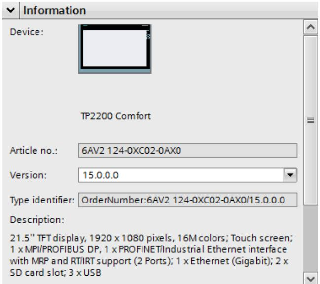

### 5.9.3 设置设备的 App ID 并设置设备项

• TIA Portal Openness 应用程序已连接到 TIA Portal。
[连接到 TIA Portal](#连接到-TIA-Portal)”
• 项目已打开
[打开项目](#打开项目)”
可以使用 TIA Portal Openness 设置设备的应用程序 ID 以及 TIA Portal 项目的设备项，从而将应用程序 ID 保留在 TIA Portal 的当前会话中以供稍后使用。
可设置应用程序 ID，方法是提供 API 的“应用程序键”(Application Key) 和“应用程序值”(Application Value) 对。
下列限制适用于设备的应用程序 ID 和设备项对象：
• 支持此功能的对象类型最多可使用 64 个应用程序 ID
• 应用程序 ID 键或/和值长度最长为 128 个字符。
• 给定对象的应用程序 ID 键必须唯一
• 使用一个“应用程序键”(Application Key) 只能设置一个应用程序 ID。
• 使用同一个“应用程序键”(Application Key) 设置不同的应用程序值时，将保留最后设置的应用程序值
修改以下程序代码来设置设备的应用程序 ID 和设备项对象：
```text
Device device = ...;
// Ask for Service CustomIdentityProvider on the device/device item
var customIdentityProviderService = device.GetService<CustomIdentityProvider>();
// Set the Application ID (Key-Value) pair
customIdentityProviderService.Set("Application_Key", "Application_Value");
```

### 5.9.4 获取设备的 App ID 和设备项

• TIA Portal Openness 应用程序已连接到 TIA Portal。 [连接到 TIA Portal](#连接到-TIA-Portal)”
• 已打开一个项目
请[打开项目](#打开项目)”
如果设备或设备项已设置了应用程序 ID，则可以使用 TIA Portal Openness 获取设备的应用程序 ID 以及 TIA Portal 项目的设备项。
应用程序 ID 将以“应用程序键”(Application Key) 和“应用程序值”(Application Value) 对的形式存储，并作为 TIA Portal 的一部分。可使用 TIA Portal Openness 获取应用程序 ID 值，方法是提供“应用程序键”(Application Key)。
修改以下程序代码以获取对象的应用程序 ID 值，该值事先已使用“应用程序键”(ApplicationKey) 进行设置：
```text
Device device = ...;
// Ask for Service CustomIdentityProvider on the device/device item
var customIdentityProviderService = device.GetService<CustomIdentityProvider>();
customIdentityProviderService.Set("Application_Key", "Application_Value");
// Get the Application ID (Value) for the given Application Key
var applicationValue = customIdentityProviderService.Get("Application_Key");
```
打开项目 (页 140)

### 5.9.5 移除设备的 App ID 和设备项

```text
- TIA Portal Openness 应用程序已连接到 TIA Portal。[连接到 TIA Portal](#连接到-TIA-Portal)”
```
• 项目已打开[打开项目](#打开项目)”
可以使用 TIA Portal Openness 移除设备的应用程序 ID（自定义身份）以及 TIA Portal 项目的设备项，以便通过相关应用程序 ID 更新设备和设备项对象。
如果作为参数进行传递的应用程序 ID 不存在，则 CustomIdentityNotFoundException 会发生异常。
修改以下程序代码来移除设备的应用程序 ID 和设备项：
```cs
Device device = ...;
// Ask for Service CustomIdentityProvider on the device/device item
var customIdentityProviderService = device.GetService<CustomIdentityProvider>();
//Remove the CustomIdentity corresponding to Application ID
try
{
customIdentityProviderService.Remove("Application_Key");
}
catch(CustomIdentityNotFoundException ex)
{
// When CustomIdentity is not found for a the given key "Application_Key".
}
```

### 5.9.6 创建设备

• TIA Portal Openness 应用程序已连接到 TIA Portal。 [连接到 TIA Portal](#连接到-TIA-Portal)”
• 项目已经打开。[打开项目](#打开项目)”
可以通过两种方法创建设备，即在项目中或在设备组中：
```text
- 通过设备项类型标识符（如 TIA 硬件目录
Device CreateWithItem(DeviceItemTypeId, DeviceItemTypeName, DeviceName) 中）创建设备对象：
```
```text
- 仅创建设备
Device Create(DeviceTypeId, DeviceName)
```
<table><tr><td>名称</td><td>类型</td><td>描述</td></tr><tr><td>DeviceItemTypeId</td><td>string</td><td>设备项的类型标识符</td></tr><tr><td>DeviceTypeId</td><td>string</td><td>设备的类型标识符</td></tr></table>
<table><tr><td>名称</td><td>类型</td><td>描述</td></tr><tr><td>DeviceItemName</td><td>string</td><td>已创建设备项的名称</td></tr><tr><td>DeviceName</td><td>string</td><td>已创建设备的名称</td></tr></table>
参见：获取设备和设备项的类型标识符 (页 377)

#### 程序代码：通过类型标识符创建设备

修改以下代码以通过类型标识符创建设备对象：
```javascript
DeviceComposition devices = ...;
Device device = devices.CreateWithItem("OrderNumber:6ES7 510-1DJ01-0AB0/V2.0", "PLC_1", "NewDevice");
Device gsdDevice = devices.CreateWithItem("GSD:SIEM8139.GSD/M/4 ", "GSD Module", "NewGsdDevice");
```
程序代码：仅创建设备
修改以下代码以仅创建设备对象：
```text
DeviceComposition devices = ...;
Device deviceOnly = devices.Create("System:Device.S7300", "S7300Device");
Device gsdDeviceOnly = devices.Create("GSD:SIEM8139.GSD/D", "GSD Device");
```

### 5.9.7 枚举设备

要求
• TIA Portal Openness 应用程序已连接到 TIA Portal。 [连接到 TIA Portal](#连接到-TIA-Portal)”
• 项目已经打开。[打开项目](#打开项目)”
使用 TIA Portal Openness API 定位设备的方式与 TIA Portal 中项目导航的方式非常类似。PNV.
• 使用项目组合“Devices”集合作为直接子项目的设备
• 使用文件夹组合“Devices”集成设备文件夹中的设备。
请遵守对象模型的硬件对象的层级 (页 71)。
使用以下一个选项枚举项目的设备：
• 枚举根级别的所有设备
• 枚举组或子组中的所有设备
• 枚举不包含任何设备组的项目的所有设备
• 枚举未分组设备系统组的所有设备
可以枚举的设备的示例：
• Central station
• PB-Slave / PN-IO device
• HMI Device

#### 程序代码：枚举根级别的设备

修改以下程度代码以枚举根级别的设备：
```cs
private static void EnumerateDevicesInProject(Project project)
{
    DeviceComposition deviceComposition = project.Devices;
    foreach (Device device in deviceComposition)
    {
    // add code here
    }
}
```
修改以下程序代码以访问单个设备。
```text
private static void AccessSingleDeviceByName(Project project)
{
    DeviceComposition deviceComposition = project.Devices;
    // The parameter specifies the name of the device
    Device device = deviceComposition.Find("MyDevice");
}
```
程序代码：枚举组或子组中的设备
要访问组中的设备，首先需要导航至该组，然后再导航至相应的设备。
```cs
//Enumerate devices in groups or sub-groups
private static void EnumerateDevicesInGroups(Project project)
{
    foreach (DeviceUserGroup deviceUserGroup in project.DeviceGroups)
    {
    EnumerateDeviceUserGroup(deviceUserGroup);
    }
}
private static void EnumerateDeviceUserGroup(DeviceUserGroup deviceUserGroup)
{
    EnumerateDeviceObjects(deviceUserGroup.Devices);
    foreach (deviceUserGroup subDeviceUserGroup in deviceUserGroup.Groups)
    {
    // recursion
    EnumerateDeviceUserGroup(subDeviceUserGroup);
    }
}
private static void EnumerateDeviceObjects(DeviceComposition deviceComposition)
{
    foreach (Device device in deviceComposition)
    {
    // add code here
    }
}
```
5.9 设备功能

#### 程序代码：查找特定设备

要按名称查找特定设备，则需修改以下程序代码：
```text
//Find a specific device by name
Project project = ...
Device plc1 = project.Devices.First(d => d.Name == "Mydevice");
... // Work with the device
```
修改以下程序代码以通过“查找”方法查找特定设备：
```text
//Find a specific device via "Find" method
Project project = ...
Device plc1 = project.Devices.Find("MyDevice");
... // Work with the device
```

#### 程序代码：枚举不包含任何设备组的项目的设备

修改以下程序代码：
```lisp
//Enumerate all devices which are located directly under a project that contains no device groups
Project project = ...
foreach (Device device in project.Devices)
{
    ... // Work with the devices
}
```

#### 程序代码：枚举位于某一文件夹中的所有设备

修改以下程序代码：
```text
//Enumerate all devices located in a folder
Project project = ...
DeviceUserGroup sortingGroup = project.DeviceGroups.Find ("Sorting");
Device plc1 = sortingGroup.Devices.First(d => d.Name == "MyStationName");
... // Work with the device
```
5.9 设备功能
程序代码：枚举未分组设备系统组的设备
为构建项目，已将分散设备置于 UngroupedDevices 组中。要访问该组中的设备，首先需要导航至该组，然后再导航至相应的设备。
修改以下程序代码：
```text
//Enumerate devices of the ungrouped device system group
Project project = ...
DeviceSystemGroup group = project.UngroupedDevicesGroup;
Device plc1 = group.Devices.First(d => d.Name == "MyStationName");
... // Work with the device
```

### 5.9.8 访问设备

要求
• TIA Portal Openness 应用程序已连接到 TIA Portal。
[连接到 TIA Portal](#连接到-TIA-Portal)”
• 项目已经打开。
[打开项目](#打开项目)”
简介
每个基于 GSD 或 GSDML 的 IO 设备都具有属性。其中某些属性可用于识别特定类型的设备。
<table><tr><td>名称</td><td>数据类型</td><td>可写入</td><td>访问</td><td>描述</td></tr><tr><td>Author</td><td>string</td><td>读/写</td><td>动态</td><td>-</td></tr><tr><td>Comment</td><td>string</td><td>读/写</td><td>动态</td><td>-</td></tr><tr><td>GsdName</td><td>string</td><td>读</td><td>动态</td><td>GSD/GSDML 文件的名称。</td></tr><tr><td>GsdType</td><td>string</td><td>读</td><td>动态</td><td>硬件对象的类型。对于设备,该值始终为“D”。</td></tr><tr><td>GsdId</td><td>string</td><td>读</td><td>动态</td><td>硬件对象的特定标识符。对于设备,始终为空</td></tr><tr><td>IsGsd</td><td>bool</td><td>读</td><td>模型化</td><td>对于 GSD 设备或 GSDML 设备为 TRUE</td></tr><tr><td>Name</td><td>string</td><td>读/写</td><td>模型化</td><td>-</td></tr><tr><td>Typeldentifier</td><td>string</td><td>读</td><td>模型化</td><td>-</td></tr></table>
5.9 设备功能

#### 程序代码：获取标识属性

修改以下程序代码以获取以下属性：
```javascript
Device device = ...;
var attributeNames = new[] {
    "GsdName", "GsdType", "GsdId"
    ;
foreach (var attributeName in attributeNames) {
    object attributeValue = device.GetAttribute(attributeName);
}
```

#### 程序代码：属性

修改以下程序代码以获取以下属性：
```text
Device device = ...;
string nameValue = device.Name;
bool isGsdValue = device.IsGsd;
```

#### 程序代码：动态访问的属性

```javascript
Device device = ...;
var attributeNames = new[] {
    "GsdName", "GsdType", "GsdId"
    ;
foreach (var attributeName in attributeNames) {
    object attributeValue = device.GetAttribute(attributeName);
}
```

#### 程序代码：GSD 设备特性

如果设备是为 GSD 设备，则该设备可提供附加功能。要获取 GsdDevice 功能，请使用GetService 方法。
```text
GsdDevice gsdDevice = ((IEngineeringServiceProvider)deviceItem).GetService<GsdDevice>();
if (gsdDevice != null) {
    ... // work with the GSD device
};
```

#### 程序代码：GSD 设备的属性

程序代码：GSD 设备的属性
```matlab
Device device = ...;
GsdDevice gsdDevice = ...;
string gsdId = gsdDevice.GsdId;
string gsdName = gsdDevice.GsdName;
string gsdType = gsdDevice.GsdType;
bool isProfibus = gsdDevice.IsProfibus;
bool isProfinet = gsdDevice.IsProfinet;
```

### 5.9.9 访问 TIA Portal 硬件目录

• TIA Portal Openness 应用程序已连接到 TIA Portal。 [连接到 TIA Portal](#连接到-TIA-Portal)”
• 项目已打开
[打开项目](#打开项目)”
运行 Openness 应用程序之前，可在目录中手动检查所需硬件。当需要添加到 Openness 应用程序中的设备在硬件目录中不可用时，还可以使用 TIA Portal Opennss 进行正确响应，例如向用户发出一条消息，通知其需要先安装 GSD(ML) 或 HSP。
引入了新类型 Siemens.Engineering.HW.HardwareCatalog.CatalogEntry，其中包含以下属性成员：
<table><tr><td>属性名称</td><td>数据类型</td><td>描述</td><td>访问</td></tr><tr><td>ArticleNumber</td><td>System.String</td><td>指定硬件对象的订货号,例如:6ES7516-3AN00-0AB0</td><td>读</td></tr><tr><td>CatalogPath</td><td>System.String</td><td>指定项目的目录路径,例如:Root\PLC\SIMATIC S7-1500\CPU\CPU 1516-3 PN/DP\6ES7 516-3AN00-0AB0</td><td>读</td></tr><tr><td>Description</td><td>System.String</td><td>指定硬件目录条目的描述,例如:带显示屏的CPU;1 MB代码工作内存,5 MB数据工作内存10 ns位指令时间;4级保护概念,集成工艺功能:运动控制、闭环控制、计数与测量集成跟踪第1个接口:PROFINET IO控制器,支持RT/IRT,2个端口,MRP,传输协议TCP/IP,S7通信,Web服务器,恒定总线循环时间,路由第2个接口:PROFINET基本服务,传输协议TCP/IP,Web服务器,路由第3个接口:PROFIBUS DP主站,恒定总线循环时间,路由;固件版本V1.0</td><td>读</td></tr></table>
<table><tr><td>属性名称</td><td>数据类型</td><td>描述</td><td>访问</td></tr><tr><td>TypeIdentifier</td><td>System.String</td><td>指定项目的类型标识符,例如:订货号:6ES7516-3AN00-0AB0/V1.0</td><td>读</td></tr><tr><td>TypeIdentifierNormalized</td><td>System.String</td><td>指定项目的标准化类型标识符。例如:订货号:6ES7516-3AN00-0AB0/V1.0</td><td>读</td></tr><tr><td>TypeName</td><td>System.String</td><td>指定设备的类型名称,例如:CPU 1516-3 PN/DP</td><td>读</td></tr><tr><td>Version</td><td>System.String</td><td>指定硬件目录条目的版本,例如:V1.0</td><td>读</td></tr></table>
具有一个用空字符串过滤的参数的函数会返回完整、可用的硬件目录：
```javascript
TiaPortal portal = TiaPortal.GetProcesses().First().Attach();
var itemList = portal.HardwareCatalog.Find(string.Empty);
```
具有一个参数的函数会查找硬件目录条目，并可通过过滤字符串进行过滤：
```javascript
TiaPortal portal = TiaPortal.GetProcesses().First().Attach();
var itemList = portal.HardwareCatalog.Find("1516");
var first = itemList.First();
Console.WriteLine(first.TypeIdentifier);
//proj.Devices.Create("OrderNumber:6ES7 516-2GN00-0AB0/V2.9", "PLC_1");
Console.ReadKey();
```
具有两个参数的函数会过滤针对给定TypeIdentifier 过滤的兼容/可插拔设备的搜索结果：
```javascript
TiaPortal portal = TiaPortal.GetProcesses().First().Attach();
var itemList = portal.HardwareCatalog.Find("1BL00", "OrderNumber:6ES7 516-2GN00-0AB0/V2.9");
//The itemList contains all the devices which are compatible/pluggable with the given TypeIdentifier
//and filtered by the filter string. In this case one of the itemList elements is 6ES7 521-1BL00-0AB0/V1.0.
Console.ReadKey();
```

### 5.9.10 删除设备

要求
• TIA Portal Openness 应用程序已连接到 TIA Portal。
请[连接到 TIA Portal](#连接到-TIA-Portal)”
• 项目已经打开。
请[打开项目](#打开项目)”

#### 修改以下程序代码以删除设备：

```cs
using System;
using Siemens.Engineering;
using Siemens.Engineering.HW;
using Siemens.Engineering.HW.Features;
using Siemens.Engineering.SW;
using Siemens.Engineering.SW.Blocks;
using Siemens.Engineering.SW.ExternalSources;
using Siemens.Engineering.SW.Tags;
using Siemens.Engineering.SW.Types;
using Siemens.Engineering.Hmi;
using HmiTarget = Siemens.Engineering.Hmi.HmiTarget;
using Siemens.Engineering.Hmi.Tag;
using Siemens.Engineering.Hmi.Screen;
using Siemens.Engineering.Hmi.Cycle;
using Siemens.Engineering.Hmi.Communication;
using Siemens.Engineering.Hmi.Globalization;
using Siemens.Engineering.Hmi.TextGraphicList;
using Siemens.Engineering.Hmi.RuntimeScripting;
using System.Collections.Generic;
using Siemens.Engineering Bonpiler;
using Siemens.Engineering.Library;
using System.IO;
using System.Security;
namespace DeletingDevice
{
internal class Program
{
private static void Main(string[] args)
{
Project project = ...;
// Needs to be: UngroupedDevicesGroup
Device deviceToDelete = project.UngroupedDevices.Devices.Find("......");
// delete device
deviceToDelete.Delete();
}
}
```

### 5.9.11 批量更改硬件参数

• TIA Portal 已连接到 TIA Portal Openness 请[连接到 TIA Portal](#连接到-TIA-Portal)”
• 项目已打开
[打开项目](#打开项目)”
可使用 TIA Portal Openness 通过单个 SetAttributes 调用来组态硬件对象的多个属性。该 API 还消除了在调用函数时对属性及其相应值的顺序和依赖关系的顾虑。
SetAttributes(IEnumerable<KeyValuePair<string, object>> attributes, AttributeDelegate errorHandler);
这是 SetAttributes(IEnumerable<KeyValuePair<string, object>> attributes) API 的重载。自 TIA Portal V19 起，批量更改硬件参数的排序方式与所有重载“SetAttributes”方法相同。

## 5.10 设备项功能

```cs
using Siemens.Engineering;
...
{
TiaPortal portal = new TiaPortal(TiaPortalMode.WithUserInterface);
var project = tiaPortal.Projects.Open(new FileInfo(project));
IList<KeyValuePair<string, object>> attributesToSet = new List<KeyValuePair<string, object>>
{
new KeyValuePair<string, object>("IsochronousTi", (double)0.1), new KeyValuePair<string, object>("IsochronousTo", (double)0.3),
new KeyValuePair<string, object>("IsochronousTiToCalculationMode", Siemens.Engineering.HW.IsochronousTiToCalculationMode.Manual),
new KeyValuePair<string, object>("IsochronousMode", true),
};
project.DeviceItems[0].SetAttributes.attributes(attributesToSet, MyErrorHandler));
private void MyErrorHandler(AttributeConfiguration attributeConfiguration)
{
//this means, if one of the attribute set fails, the mechanism won't stop
//just skip the problematic part and the other attributes will be set.
attributeConfiguration.CurrentSelection = AttributeChoiceSelection.Ignore;
}
```

## 5.10 设备项功能


### 5.10.1 设备项的强制属性

要求
• TIA Portal Openness 应用程序已连接到 TIA Portal。请[连接到 TIA Portal](#连接到-TIA-Portal)
• 已打开一个项目。请[打开项目](#打开项目)
每个设备或设备项均具备可进行读取和/或写入的特定强制属性。这些属性始终与 TIA Porta用户界面中的属性相同。
TIA Portal Openness 支持以下属性：
<table><tr><td>属性名称</td><td>数据类型</td><td>可写</td><td>访问</td><td>注释</td></tr><tr><td>Author</td><td>string</td><td>读/写</td><td>动态</td><td>-</td></tr><tr><td>Classification</td><td>DeviceItemClassification</td><td>读</td><td>模型化</td><td>关于设备项所属的分类、标志枚举,请参见设备项分类。</td></tr><tr><td>Comment</td><td>string</td><td>读/写</td><td>动态</td><td>有时仅限读访问</td></tr><tr><td>CommentML</td><td>MultilingualTextltem</td><td>读/写</td><td>动态</td><td>有时仅限读访问</td></tr><tr><td>FirmwareVersion</td><td>string</td><td>读</td><td>动态</td><td>-</td></tr><tr><td>InterfaceOperatingMode</td><td>InterfaceOperatingModes</td><td>读/写</td><td>动态</td><td>适用于提供 NetworkInterface 功能的设备项</td></tr><tr><td>InterfaceType</td><td>NetType</td><td>读/写</td><td>动态</td><td>适用于提供 NetworkInterface 功能的设备项</td></tr><tr><td>IsBuiltIn</td><td>bool</td><td>读</td><td>模型化</td><td>对于可由用户创建的对象而言为 FALSE</td></tr><tr><td>IsGsd</td><td>bool</td><td>读</td><td>模型化</td><td>TRUE,前提是通过 GSD/GSDML 安装设备说明</td></tr><tr><td>IsPlugged</td><td>bool</td><td>读</td><td>模型化</td><td>对于已插入的设备而言为 TRUE</td></tr><tr><td>Label</td><td>string</td><td>读</td><td>动态</td><td>适用于提供 NetworkPort或 NetworkInterface 功能的设备项。如果接口或端口不具备标签,Label 将为 String.Empty。</td></tr><tr><td>LocationIdentifier</td><td>string</td><td>读/写</td><td>动态</td><td>-</td></tr><tr><td>Name</td><td>string</td><td>读/写</td><td>模型化</td><td>有时仅限读访问</td></tr><tr><td>OrderNumber</td><td>string</td><td>读</td><td>动态</td><td>-</td></tr><tr><td>PlantDesignation</td><td>string</td><td>读/写</td><td>动态</td><td>-</td></tr><tr><td>PositionNumber</td><td>int</td><td>读</td><td>模型化</td><td>-</td></tr><tr><td>Typeldentifier</td><td>string</td><td>读</td><td>模型化</td><td>-</td></tr></table>
<table><tr><td>属性名称</td><td>数据类型</td><td>可写</td><td>访问</td><td>注释</td></tr><tr><td>TypeName</td><td>string</td><td>读</td><td>动态</td><td>和语言无关的类型名称。可用于用户无法管理的设备项(例如,自动创建的项或固定子模块)。</td></tr><tr><td>InstallationDate</td><td>DateTime</td><td>读/写</td><td>动态</td><td>-</td></tr><tr><td>AdditionalInformation</td><td>string</td><td>读/写</td><td>动态</td><td>-</td></tr></table>

#### 设备项分类

<table><tr><td>值</td><td>说明</td></tr><tr><td>Siemens.Engineering.HW.DeviceItemClassifications.None</td><td>无分类。</td></tr><tr><td>Siemens.Engineering.HW.DeviceItemClassifications.CPU</td><td>设备项为CPU</td></tr><tr><td>Siemens.Engineering.HW.DeviceItemClassifications.HM</td><td>设备项为头模块。</td></tr></table>

#### 程序代码：设备项的强制属性

修改以下程序代码以获取设备项的强制属性：
```matlab
DeviceItem deviceItem = ...;
string nameValue = deviceItem.Name;
string typeIdentifierValue = deviceItem.TypeIdentifier;
int positionNumberValue = deviceItem.PositionNumber;
bool isBuiltInValue = deviceItem.IsBuiltIn;
bool isPluggedValue = deviceItem.IsPlugged;
```
修改以下程序代码以通过动态访问获取属性项：
```javascript
Device device = ...;
var attributeNames = new[] {
    "TypeName", "Author", "Comment", "OrderNumber", "FirmwareVersion", "PlantDesignation", "LocationIdentifier"
};
foreach (var attributeName in attributeNames) {
    object attributeValue = ((IEngineeringObject)deviceItem).GetAttribute(attributeName);
}
DeviceItem deviceItem = ...;
((IEngineeringObject)deviceItem).SetAttribute("Comment", "This is a comment.");
```

### 5.10.2 创建和插入设备项

• TIA Portal Openness 应用程序已连接到 TIA Portal。请[连接到 TIA Portal](#连接到-TIA-Portal)
• 已打开一个项目。
请[打开项目](#打开项目)
```text
HardwareObject 的 PlugNew(string typeIdentifier, string name, int positionNumber) 操作用于
```
• 创建新的设备项并将其插入现有硬件对象中
• 创建新的子设备项（例如，子模块）并将其插入某一设备项中
如果操作成功，将返回已创建的设备项对象，否则将出现可恢复的异常状况。
通过使用操作 CanPlugNew(string typeIdentifier, string name, intpositionNumber)，您可以确定是否可以执行创建和插入操作。如果不能执行，则操作会返回 false。
如果方法返回“真”，该操作仍然可能会因以下意外原因而失败。
• 位置编号已由另一个设备项使用
• 当前设备项无法插入相应位置（尽管该位置空闲）
• 容器不提供位置编号
• 设备项的名称已由同一容器中的现有设备项所使用
• 设备项无法插入到容器
• 设备在线
下表列出了所需的方法参数：
<table><tr><td>名称</td><td>类型</td><td>说明</td></tr><tr><td>typeIdentifier</td><td>string</td><td>已创建设备项的类型标识符</td></tr><tr><td>name</td><td>string</td><td>已创建设备项的名称</td></tr><tr><td>positionNumber</td><td>int</td><td>已创建设备项的位置编号</td></tr></table>
修改以下程序代码以将设备项插入到现有硬件对象中：
```c
HardwareObject hwObject = ...;
string typeIdentifier = ...;
string name = ...;
int positionNumber = ...;
if (hwObject.CanPlugNew(typeIdentifier, name, positionNumber))
{
    DeviceItem newPluggedDeviceItem = hwObject.PlugNew(typeIdentifier, name, positionNumber);
}
```

#### 访问模块信息

TIA Portal Openness 用户可使用 ModuleInformationProvider 对象访问可插拔模块的相关信息。用户可访问
• 指定模块必须插入的容器类型（例如，设备和机架）（使用 FindContainerTypes 方法）。
• 某些部分指定的模块的可用版本（使用 FindModuleTypes 方法）。## 程序代码：访问 ModuleInformationProvider 对象
```javascript
Project project = ...;
HardwareUtilityComposition extensions = project.HwUtilities;
var result = extensions.Find("ModuleInformationProvider") as ModuleInformationProvider;
```

#### 程序代码：使用 FindContinerTypes 方法访问容器类型

FindContinerTypes 方法返回给定模块的容器类型。使用 typeIdentifier 参数指定模块。结果列表包含所请求类型的所有容器类型的TypeIdentifier。通常包括“设备”和“机架”，各容器会从设备开始按照它们在项目中的层次结构顺序列出。
<table><tr><td>参数的名称</td><td>类型</td><td>说明</td></tr><tr><td>typeIdentifier</td><td>string</td><td>设备项的类型标识符。</td></tr></table>
<table><tr><td>注意</td></tr><tr><td>此函数仅适用于网络视图中可见的模块。此函数仅适用于模块,而不适用于子模块。</td></tr></table>
```text
string typeIdentifier = ...;
string[] containerTypes = moduleInformationProvider.FindContainerTypes(typeIdentifier);
```

#### 程序代码：使用 FindModuleTypes 方法访问版本

FindModuleTypes 方法使用设备项的局部类型标识符，返回硬件对象的所有可能版本。此函数返回一个字符串列表。每个字符串将是可能与局部TypeIdentifier 匹配的完整TypeIdentifier。
有效的局部类型标识符必须只包含完整的部分，各完整部分在类型标识符中用“/”分隔。不支持通配符或不完整部分。此外，必须遵守以下关于指定部分最小数量的限制：
• OrderNumber：至少一个部分。示例 OrderNumber:6ES7 317-2EK14-0AB0
• GSD：至少两个部分。示例 GSD:SI05816A.GSD/M
• 系统：至少一个部分。示例 System:Rack.ET200SP
<table><tr><td>参数的名称</td><td>类型</td><td>说明</td></tr><tr><td>partialTypeIdentifier</td><td>string</td><td>设备项的局部类型标识符</td></tr></table>
```text
string partialTypeIdentifier = ...;
string[] moduleTypes = moduleInformationProvider.FindModuleTypes(partialTypeIdentifier);
```
程序代码：使用 GetPlugLocations 方法访问插入位置。
GetPlugLocations 方法返回有关插槽的信息，例如插入位置、位置编号（插槽名称）以及可用于硬件对象的插槽。
PlugLocation 类别具有以下属性：
<table><tr><td>属性名称</td><td>类型</td><td>说明</td></tr><tr><td>PositionNumber</td><td>int</td><td>自由插槽的位置编号</td></tr><tr><td>Label</td><td>string</td><td>自由插槽的标签</td></tr></table>
• 如果某个位置编号没有对应的“label”，则使用位置编号的字符串表示。
• 仅为自由插槽提供 PlugLocation 对象。
```text
HardwareObject hardwareObject = ...;
IList<PlugLocation> result = hardwareObject.GetPlugLocations();
foreach (PlugLocation item in result)
{
    Console.WriteLine("{0} - {1}", item.PositionNumber, item.Label);
}
```

### 5.10.3 将设备项移到另一插槽中

• TIA Portal Openness 应用程序已连接到 TIA Portal。
[连接到 TIA Portal](#连接到-TIA-Portal)”
• 项目已经打开。
[打开项目](#打开项目)”
HardwareObject 的 PlugMove(DeviceItem deviceItem, int positionNumber) 操作可用于移动现有设备项并将其插入现有硬件对象中。PlugMove 方法在 UI 中模块无法插入的位置插入设备项。PlugMove 操作完成时会出现编译错误。
CanPlugMove(DeviceItem deviceItem, int positionNumber) 操作可用于确定是否可以进行移动。如果不能进行移动，则 CanPlugMove 将返回“假”。如果方法返回“真”，该操作仍然可能会因以下意外原因而失败。
• 位置编号已由另一个设备项使用
• 当前设备项无法插入相应位置（尽管该位置空闲）
• 容器不提供位置编号
• 设备项的名称已由同一容器中的现有设备项所使用
• 设备项无法插入到容器
• 用户无法插入设备项
• 用户无法移除设备项
• 设备在线
程序代码
修改以下程序代码：
```text
HardwareObject hwObject = ...;
DeviceItem deviceItemToMove = ...;
int positionNumber = ...;
if (hwObject.CanPlugMove(deviceItemToMove, positionNumber)
{
    DeviceItem movedDeviceItem = hwObject.PlugMove(deviceItemToMove, positionNumber);
}
```

### 5.10.4 复制设备项

• TIA Portal Openness 应用程序已连接到 TIA Portal。请[连接到 TIA Portal](#连接到-TIA-Portal)
• 已打开一个项目。
请[打开项目](#打开项目)
使用 HardwareObject 的 PlugCopy(DeviceItem deviceItem, int positionNumber) 操作将项目中的设备复制并插入现有的硬件。如果无法在 UI 中插入模块，则只有在极少数情况下PlugCopy 方法才能起作用。此时，复制后会发生编译错误。当 PlugCopy 成功时，将返回设备项对象的副本，否则，会出现可恢复的异常情况。
操作失败的可能原因：
• 位置编号已由另一个设备项使用
• 当前设备项无法插入相应位置（尽管该位置空闲）
• 容器不提供位置编号
• 设备项的名称已由同一容器中的现有设备项所使用
• 设备项无法插入到容器
• 设备项无法插入到 UI
使用 CanPlugCopy(DeviceItem deviceItem, int positionNumber) 操作确定是否可以进行复制。当无法执行复制操作时，CanPlugCopy 将返回“假”。但是，如果方法返回“真”，该操作仍然可能会因意外原因而失败。
<table><tr><td>参数的名称</td><td>类型</td><td>说明</td></tr><tr><td>deviceItem</td><td>DeviceItem</td><td>要复制的设备项</td></tr><tr><td>positionNumber</td><td>int</td><td>设备项副本的位置编号</td></tr></table>
修改以下程序代码：
```text
HardwareObject hwObject = ...;
DeviceItem deviceItemToCopy = ...;
int positionNumber = ...;
if (hwObject.CanPlugCopy(deviceItemToCopy, positionNumber))
{
    DeviceItem copiedDeviceItem = hwObject.PlugCopy(deviceItemToCopy, positionNumber);
}
```

### 5.10.5 进行用户自定义徽标设置

• TIA Portal Openness 应用程序已连接到 TIA Portal [连接到 TIA Portal](#连接到-TIA-Portal)”
• 已打开一个项目
请[打开项目](#打开项目)”
可使用 TIA Portal Openness 在 S71500 PLC 的 CPU 显示器中设置用户自定义徽标设置功能。并非所有 S71500 PLC 都支持该功能。
功能 FrontPanel Display 在 CPU 显示设备项中可用，可提供以下方法：
<table><tr><td>方法名称</td><td>数据类型</td><td>描述</td></tr><tr><td>SetUserDefinedLogo()</td><td>FileInfo</td><td>在CPU显示器中设置要上传的图像的路径。只有在the UserDefinedLogoActivated特性已启用时,才可使用SetUserDefinedLogo()。否则,如果UserDefinedLogoActivated特性被禁用,则会出现EngineeringTargetInvocation异常。</td></tr></table>
如果 CPU 包含显示器，并且特性也在 TIA Portal 中可用，则以下特性只能在 Openness 中可用。
<table><tr><td>特性名称</td><td>数据类型</td><td>描述</td></tr><tr><td>UserDefinedLogoActivated</td><td>boolean</td><td>显示用户自定义徽标。要在CPU显示器中上传图像,应启用UserDefinedLogoActivated特性。如果UserDefinedLogoActivated特性被禁用,则无法上传图像。否则,在禁用UserDefinedLogoActivated特性后,必须复位其它设置。</td></tr><tr><td>AdaptLogoActivated</td><td>boolean</td><td>显示调整徽标。只有在UserDefinedLogoActivated已启用时,AdaptLogoActivated特性才可用。</td></tr></table>
```cs
using Siemens.Engineering.HW.Features.FrontPanelDisplay;
private void UserDefinedLogoSettings()
{
FrontPanelDisplay frontPanelDisplay = plcDisplay.GetService<FrontPanelDisplay>();
//Enabling the user defined logo in the display
frontPanelDisplay.UserDefinedLogoActivated = true;
//Enabling the adapt logo in the display
frontPanelDisplay.AdaptLogoActivated = true;
//Uploading an image file in the display
frontPanelDisplay.SetUserDefinedLogo(new FileInfo(@"C:\Pictures\CompanyLogo.jpg"));
}
```

### 5.10.6 删除设备项

• TIA Portal Openness 应用程序已连接到 TIA Portal。 [连接到 TIA Portal](#连接到-TIA-Portal)”
• 项目已经打开。[打开项目](#打开项目)”
修改以下程序代码以删除设备项：
```text
Project project = ...;
var device = project.UngroupedDevicesGroup.Devices.Find("......");
var deviceItem = deviceItem.DeviceItems.First();
// delete device item
deviceItem.Delete();
```

### 5.10.7 枚举设备项

• TIA Portal Openness 应用程序已连接到 TIA Portal。请[连接到 TIA Portal](#连接到-TIA-Portal)
• 已打开一个项目。
请[打开项目](#打开项目)
为获取设备项，请使用 HardwareObject。硬件对象的项目为插入硬件对象时 TIA Portal 用户所看到的内容：
• 位于设备中的机架
• 位于机架中的模块
• 位于模块中的子模块
• 位于子模块中的子模块
有关此主题的更多详细信息，可参考对象模型的硬件对象的层级 (页 71)部分。

#### 程序代码：枚举设备的设备项

修改以下程序代码以枚举硬件对象的设备项：
```text
private static void EnumerateDeviceItems(HardwareObject hardwareObject)
{
    foreach (DeviceItem deviceItem in hardwareObject.Items)
    {
    // add code here
    }
}
```

#### 程序代码：通过组合层级进行枚举

若要通过组合层级来枚举某一设备的设备项，则修改以下程序代码：
```cs
//Enumerates devices using an composition
private static void EnumerateDeviceItems(Device device)
{
    DeviceItemComposition deviceItemComposition = device.DeviceItems;
    foreach (DeviceItem deviceItem in deviceItemComposition)
    {
    // add code here
    }
}
```

#### 程序代码：使用关联枚举设备项

修改以下程序代码以使用关联枚举设备项：
```cs
//Enumerates devices using an association
private static void EnumerateDeviceItemsWithAssociation(Device device)
{
    DeviceItemAssociation deviceItemAssociation = device.Items;
    foreach (DeviceItem deviceItem in deviceItemAssociation)
    {
    // add code here
    }
}
```

### 5.10.8 访问设备项

要求
• TIA Portal Openness 应用程序已连接到 TIA Portal。 [连接到 TIA Portal](#连接到-TIA-Portal)”
• 项目已经打开。[打开项目](#打开项目)”
```text
public static DeviceItem AccessDeviceItemFromDevice(Device device)
{
    DeviceItem deviceItem = device.DeviceItems[0];
    return deviceItem;
}
```
简介
要访问“DeviceItem”类型的对象，请使用以下属性：
• 名称 (string)：设备项的名称
• 容器 (HardwareObject)：用于插入设备项的容器
<table><tr><td>名称</td><td>数据类型</td><td>可写入</td><td>访问</td><td>描述</td></tr><tr><td>Author</td><td>string</td><td>读/写</td><td>动态</td><td>-</td></tr><tr><td>Comment</td><td>string</td><td>读/写</td><td>动态</td><td>-</td></tr><tr><td>FirmwareVersion</td><td>string</td><td>读</td><td>动态</td><td>仅用于头模块</td></tr><tr><td>GsdName</td><td>string</td><td>读</td><td>动态</td><td>GSD文件的名称。</td></tr><tr><td>GsdType</td><td>string</td><td>读</td><td>动态</td><td>硬件对象的类型。对于设备,该值始终为“D”。</td></tr><tr><td>GsdId</td><td>string</td><td>读</td><td>动态</td><td>硬件对象的特定标识符。对于设备,始终为空</td></tr><tr><td>IsBuiltIn</td><td>bool</td><td>读</td><td>-</td><td>-</td></tr><tr><td>IsGsd</td><td>bool</td><td>读</td><td>模型化</td><td>对于GSD设备或GSDML设备为TRUE</td></tr><tr><td>IsPlugged</td><td>bool</td><td>读</td><td>模型化</td><td>-</td></tr><tr><td>IsProfibus</td><td>bool</td><td>读</td><td>模型化</td><td>-</td></tr><tr><td>IsProfinet</td><td>bool</td><td>读</td><td>模型化</td><td>-</td></tr><tr><td>Name</td><td>string</td><td>读/写</td><td>模型化</td><td>-</td></tr><tr><td>OrderNumber</td><td>string</td><td>读</td><td>动态</td><td>仅用于头模块</td></tr><tr><td>PositionNumber</td><td>bool</td><td>读</td><td>模型化</td><td>-</td></tr><tr><td>Typeldentifier</td><td>string</td><td>读</td><td>模型化</td><td>-</td></tr></table>
程序代码：访问设备项
修改以下程序代码以访问设备项：

#### 程序代码：访问设备项的设备项

修改以下程序代码以访问设备项的设备项：
```java
public static DeviceItem AccessDeviceItemFromDeviceItem(DeviceItem deviceItem)
{
    DeviceItem subDeviceItem = deviceItem.DeviceItems[0];
    return subDeviceItem;
}
```

#### 程序代码：导航至设备项的容器

修改以下程序代码以通过 DeviceItem 的 "Container" 属性导航回设备项的容器：
```matlab
DeviceItem deviceItem = ...;
HardwareObject container = deviceItem.Container;
```
修改以下程序代码以获取以下属性：
```javascript
Device device = ...;
var attributeNames = new[] {
    "GsdName", "GsdType", "GsdId" };
foreach (var attributeName in attributeNames) {
    object attributeValue = ((IEngineeringObject)deviceItem).GetAttribute(attributeName);
}
```
修改以下程序代码以获取以下属性：
```matlab
DeviceItem deviceItem = ...;
GsdDeviceItem gsdDeviceItem =
((IEngineeringServiceProvider)deviceItem).GetService<GsdDeviceItem>();
string gsdName = gsdDeviceItem.GsdName;
string gsdType = gsdDeviceItem.GsdType;
string gsdId = gsdDeviceItem.GsdId;
bool isProfinet = gsdDeviceItem.IsProfinet;
bool isProfibus = gsdDeviceItem.IsProfibus;;
```
修改以下程序代码以获取以下属性：
```cs
DeviceItem deviceItem = ...;
GsdDeviceItem gsdDeviceItem =
((IEngineeringServiceProvider)deviceItem).GetService<GsdDeviceItem>();
var attributeNames = new[] {
    "TypeName", "Author", "Comment", ...
    ;
foreach (var attributeName in attributeNames) {
    object attributeValue =
((IEngineeringObject)gsdDeviceItem).GetAttribute(attributeName);
}
```

#### 程序代码：设置属性

修改以下程序代码以设置属性：
```javascript
DeviceItem deviceItem = ...;
((IEngineeringObject)deviceItem).SetAttribute("Comment", "This is a comment.");
```

#### 程序代码：获取头模块的 prm 数据

```text
DeviceItem deviceItem = ...;
GsdDeviceItem gsdDeviceItem =
((IEngineeringServiceProvider)deviceItem).GetService<GsdDeviceItem>();
int dsNumber = 0;    // For Profibus GSDs, dataset number zero must be used!
int byteOffset = 0;
int lengthInBytes = 5;
// read complete data set:
byte[] prmDataComplete = gsdDeviceItem.GetPrmData(dsNumber, byteOffset, lengthInBytes);
// read partial data set (only second byte):
byteOffset = 1;
lengthInBytes = 1;
byte[] prmDataPartial = gsdDeviceItem.GetPrmData(dsNumber, byteOffset, lengthInBytes);
```

#### 程序代码：设置头模块的 prm 数据

修改以下程序代码以获取 prm 数据：
```text
DeviceItem deviceItem = ...;
GsdDeviceItem gsdDeviceItem =
((IEngineeringServiceProvider)deviceItem).GetService<GsdDeviceItem>();
// The parameters byteOffset and the length of the byte array prmData define the range within the
// dataset which is written to.
// For Profibus GSDs, dataset number zero must be used!
// Change the highlighted bytes 2-4 from 0x0 to 0x1
// to write only the first two bytes: byte[] prmData = {0x05, 0x21};
int dsNumber = 0;
int byteOffset = 0;
byte[] prmData = {0x05, 0x21, 0x01, 0x01, 0x01};
gsdDeviceItem.SetPrmData(dsNumber, byteOffset, prmData);
```
对象模型的硬件对象的层级 (页 71)

### 5.10.9 访问接口设备项

• TIA Portal Openness 应用程序已连接到 TIA Portal。 [连接到 TIA Portal](#连接到-TIA-Portal)”
• 项目已经打开。
[打开项目](#打开项目)”
如果设备项为接口，则除简单的设备项功能外，其还可提供附加功能。使用该接口，用户可以访问接口的节点和操作模式。凭借此功能，设备项可通过访问 NetworkInterface 功能（设备项的特定服务）来作为 IoDevice（从设备）或 IoController（主设备）使用。
使用枚举 InterfaceOperatingModes 访问接口的属性。
<table><tr><td>值</td><td>描述</td></tr><tr><td>InterfaceOperatingModes.None</td><td>默认值</td></tr><tr><td>InterfaceOperatingModes.IoDevice</td><td>接口操作模式“IoDevice”(从站)。</td></tr><tr><td>InterfaceOperatingModes.IoController</td><td>接口操作模式“IoController”(主站)。</td></tr><tr><td>InterfaceOperatingModes.IoDeviceorInterfaceOperatingModes.IoController</td><td>接口设置为以上两种工作模式。</td></tr></table>

#### 程序代码：访问网络接口功能

修改以下程序代码以获取网络接口功能
```cs
Device deviceItem = ...;
NetworkInterface itf =
((IEngineeringServiceProvider)deviceItem).GetService<NetworkInterface>();
if (itf != null)
{
    // Working with the interface
}
//Accessing nodes and operating mode
NodeComposition nodes = itf.Nodes;
InterfaceOperatingModes mode = itf.InterfaceOperatingMode;
//Accessing the type of interface
NetType itfType = itf.InterfaceType;
//Modifying the operating mode and interface type
itf.InterfaceOperatingMode = InterfaceOperatingModes.IoDevice;
itf.InterfaceType = NetType.Profibus;
//Accessing the ports linked to an interface.
NetworkPortAssociation nodes2 = itf.Ports;
```

### 5.10.10 访问更改设备

• TIA Portal Openness 应用程序已连接到 TIA Portal [连接到 TIA Portal](#连接到-TIA-Portal)”
• 已打开一个项目
请[打开项目](#打开项目)”
可使用 ChangeType() API 更改设备或设备项的类型。与 TIA Portal 用户界面相比，TIA PortalOpenness 中的功能存在一些限制：
• 未提供可能的更改伙伴列表。
• 没有反馈消息可用于通知已更改设备或设备项的类型更改。
TIA Portal 用户界面中支持的模块也可用于 TIA Portal Openness。TIA Portal Openness 特性不支持以下功能：
• GSDML 交换
• 模块描述更新
出于以下原因，ChangeType() API 未能更改设备或设备项的类型：
• 给定 TypeIdentifier 未知。
• 要更改的对象是只读的。
• 不支持类型更改，例如切换到完全不同的模块类型或系列时。
```cs
using Siemens.Engineering.HW.DeviceItem;
private void ChangeTypeDeviceItem()
{
    DeviceItem rack = ...;
    DeviceItem deviceItem = rack.PlugNew("OrderNumber:6ES7 516-3AN01-0AB0/V2.8", "PLC_1", 1);
    try
    {
    deviceItem.ChangeType("OrderNumber:6ES7 516-3AN01-0AB0/V2.9");
    }
    catch (EngineeringTargetInvocationException e)
    {
    Console.WriteLine("ChangeType failed: {0}", e.Message);
    }
}
```

### 5.10.11 I/O 设备接口的访问属性

要求
• TIA Portal Openness 应用程序已连接到 TIA Portal。请[连接到 TIA Portal](#连接到-TIA-Portal)
• 已打开一个项目。
请[打开项目](#打开项目)
• 对于写入访问，PLC 已处于离线状态。
可以使用 TIA Portal Openness API 接口来获取或设置 I/O 设备接口上 IRT 及等时模式的属性。

#### 访问 I/O 控制器的接口

可访问 I/O 控制器的接口的以下属性。控制器必须是同步主站：
<table><tr><td>属性名称</td><td>数据类型</td><td>可写入</td><td>访问</td><td>说明</td></tr><tr><td>PnSendClock</td><td>Int64</td><td>读取/写入</td><td>动态属性</td><td>发送时钟(以纳秒为单位)</td></tr></table>

#### 访问 I/O 系统的接口

可访问 I/O 系统的接口的以下属性。Ti/To 值可供 I/O 系统的所有模块和子模块使用。
<table><tr><td>属性名称</td><td>数据类型</td><td>可写入</td><td>访问</td></tr><tr><td>IsochronousTiToAutoCalculation</td><td>BOOL</td><td>读取/写入</td><td>动态属性</td></tr><tr><td>IsochronousTi</td><td>DOUBLE</td><td>读取/写入</td><td>动态属性</td></tr><tr><td>IsochronousTo</td><td>DOUBLE</td><td>读取/写入</td><td>动态属性</td></tr></table>

#### 访问 I/O 设备的接口

可访问 I/O 设备的接口的以下属性。Ti/To 值可供 I/O 系统的所有模块和子模块使用。
<table><tr><td>属性名称</td><td>数据类型</td><td>可写入</td><td>访问</td></tr><tr><td>IsochronousMode</td><td>BOOL</td><td>读取/写入</td><td>动态属性</td></tr><tr><td>IsochronousTiToCalculationMode</td><td>IsochronousTiToCalculationMode</td><td>读取/写入</td><td>动态属性</td></tr><tr><td>IsochronousTi</td><td>DOUBLE</td><td>读取/写入</td><td>动态属性</td></tr><tr><td>IsochronousTo</td><td>DOUBLE</td><td>读取/写入</td><td>动态属性</td></tr></table>
为属性 IsochronousTiToCalculationMode 提供以下 ENUM 值：
<table><tr><td>值</td><td>说明</td></tr><tr><td>IsochronousTiToCalculationMode.None</td><td>-</td></tr><tr><td>IsochronousTiToCalculationMode.FromOB</td><td>使用 OB(在 IoSystem 中组态的)的 Ti/To 值。</td></tr></table>
<table><tr><td>值</td><td>说明</td></tr><tr><td>IsochronousTiToCalculationMode.FromSubnet</td><td>PROFINET 接口不使用此值。</td></tr><tr><td>IsochronousTiToCalculationMode.AutomaticMinimum</td><td>为 IO 设备自动计算 Ti/To 值。</td></tr><tr><td>IsochronousTiToCalculationMode.Manual</td><td>用户可以手动输入此 IO 设备的 Ti/To 值。</td></tr></table>

#### 程序代码：获取或设置 I/O 设备接口的属性

修改以下程序代码以访问发送时钟值：
```cs
DeviceItem pnInterface = ...;
// read attribute
long attributeValue = (long)pnInterface.GetAttribute("PnSendClock");
// write attribute
long sendClock = 2000000;
pnInterface.SetAttribute("PnSendClock", sendClock);
```
修改以下程序代码以访问 OB 的 Ti/To 值：
```text
IoSystem ioSystem = ...;
bool titoAutoCalculation = (bool)ioSystem.GetAttribute("IsochronousTiToAutoCalculation");
ioSystem.SetAttribute("IsochronousTiToAutoCalculation", true);
```
修改以下程序代码以访问 I/O 设备接口的等时设置：
```text
DeviceItem pnInterface = ...;
bool isochronousMode = (bool)pnInterface.GetAttribute("IsochronousMode");
pnInterface.SetAttribute("IsochronousMode", true);
```
5.10 设备项功能

### 5.10.12 获取设备项的子网

• TIA Portal Openness 应用程序已连接到 TIA Portal [连接到 TIA Portal](#连接到-TIA-Portal)”
• 项目已打开
[打开项目](#打开项目)”
可使用 NetworkInterface 服务访问导航器节点。每个节点都会通过调用 ConnectedSubnet特性，依次提供对子网链接的访问权限。
要获取设备或设备项的子网，请修改以下程序代码：
```cs
using Siemens.Engineering.HW.Node;
private void GetSubnetDeviceItem()
{
    DeviceItem itfDeviceItem = ...;
    NetworkInterface itf = itfDeviceItem.GetService<NetworkInterface>();
    foreach (Node node in itf.Nodes)
    {
    Subnet subnet = node.ConnectedSubnet;
    // work with the subnet
    }
}
```
在上述代码中，如果节点未连接，则子网为空。

### 5.10.13 访问 IoController 的属性

要求
• TIA Portal Openness 应用程序已连接到 TIA Portal。请[连接到 TIA Portal](#连接到-TIA-Portal)
• 已打开一个项目。请[打开项目](#打开项目)
• 对于写入访问，PLC 已处于离线状态。
可以使用 TIA Portal Openness API 接口获取或设置 IoController 的属性。以下属性仅在PROFINET IoController（位于 Profinet 接口下方）可用。如果用户可以修改 UI 中的属性，那么也可以通过 TIA Portal Openness 进行设置。
<table><tr><td>属性名称</td><td>数据类型</td><td>类型</td><td>访问</td><td>说明</td></tr><tr><td>SyncRole</td><td>SyncRole</td><td>读写</td><td>动态属性</td><td>-</td></tr><tr><td>PnDeviceNumber</td><td>int</td><td>只读</td><td>动态属性</td><td>在 TIA Portal UI中,此属性位于以太网节点中(PROFINET 部分)</td></tr></table>
Synchronication role 属性在 TIA Portal UI 的 PROFINET 接口中可用。EnumSyncRole 具有以下值。
<table><tr><td>枚举值</td><td>数值</td></tr><tr><td>SyncRole.NotSynchronized</td><td>0</td></tr><tr><td>SyncRole.SyncMaster</td><td>1</td></tr><tr><td>SyncRole.SyncSlave</td><td>2</td></tr><tr><td>SyncRole.RedundantSyncMaster</td><td>4</td></tr></table>
程序代码：设置 IoController 的属性
```text
IoController ioController= ...;
SyncRole syncRole = (SyncRole)((IEngineeringObject)ioController).GetAttribute("SyncRole");
((IEngineeringObject)ioController).SetAttribute("SyncRole", SyncRole.SyncMaster);
```

### 5.10.14 访问 IoConnector 的属性

• TIA Portal Openness 应用程序已连接到 TIA Portal。请[连接到 TIA Portal](#连接到-TIA-Portal)
• 已打开一个项目。
请[打开项目](#打开项目)
• 对于写入访问，PLC 已处于离线状态。
可以使用 TIA Portal Openness API 接口获取或设置 IoConnector 的属性。以下属性仅在PROFINET IoController（位于 Profinet 接口下方）可用。如果用户可以修改 UI 中的属性，那么也可以通过 TIA Portal Oopenness 进行设置。
属性分为四种类型：更新时间属性、看门狗时间属性、同步属性和设备编号属性。

#### 更新时间属性

下面给出了更新时间属性。
<table><tr><td>属性名称</td><td>数据类型</td><td>类型</td><td>访问</td><td>说明</td></tr><tr><td>PnUpdateTimeAuto Calculation</td><td>Boolean</td><td>读写</td><td>动态属性</td><td>如果此属性为“真”,则会自动计算更新时间。</td></tr><tr><td>PnUpdateTime</td><td>Int64</td><td>读写</td><td>动态属性</td><td>更新时间以纳秒为测量单位。</td></tr><tr><td>PnUpdateTimeAdap tion</td><td>Boolean</td><td>读写</td><td>动态属性</td><td>-</td></tr></table>

#### 看门狗时间属性

下面给出了看门狗时间属性。
<table><tr><td>属性名称</td><td>数据类型</td><td>类型</td><td>访问</td><td>说明</td></tr><tr><td>PnWatchdogFactor</td><td>Int32</td><td>读写</td><td>动态属性</td><td>-</td></tr><tr><td>PnWatchdogTime</td><td>Int64</td><td>只读</td><td>动态属性</td><td>看门狗时间以纳秒为测量单位。</td></tr></table>

#### 同步属性

下面给出了同步属性。
<table><tr><td>属性名称</td><td>数据类型</td><td>类型</td><td>访问</td><td>说明</td></tr><tr><td>RtClass</td><td>RtClass</td><td>读写</td><td>动态属性</td><td>-</td></tr><tr><td>SyncRole</td><td>SyncRole</td><td>只读</td><td>动态属性</td><td>-</td></tr></table>
枚举 RtClass 具有以下值。
<table><tr><td>枚举值</td><td>数值</td></tr><tr><td>RtClass.None</td><td>0</td></tr><tr><td>RtClass.RT</td><td>1</td></tr><tr><td>RtClass.IRT</td><td>2</td></tr></table>
枚举 SyncRole 具有以下值。
<table><tr><td>枚举值</td><td>数值</td></tr><tr><td>SyncRole.NotSynchronized</td><td>0</td></tr><tr><td>SyncRole.SyncMaster</td><td>1</td></tr><tr><td>SyncRole.SyncSlave</td><td>2</td></tr><tr><td>SyncRole.RedundantSyncMaster</td><td>4</td></tr></table>

#### 设备编号属性

下面给出了设备编号属性。
<table><tr><td>属性名称</td><td>数据类型</td><td>类型</td><td>访问</td><td>说明</td></tr><tr><td>PnDeviceNumber</td><td>int</td><td>读写</td><td>动态属性</td><td>显示设备编号。</td></tr></table>

#### 程序代码：获取并设置 IoConnector 的属性

```javascript
IoConnector connector = ...
var attributeNames = new[] {
    "PnUpdateTimeAutoCalculation", "PnUpdateTime", "PnUpdateTimeAdaption", "PnWatchdogFactor", "PnWatchdogTime", "RtClass", "SyncRole"
};
foreach (var attributeName in attributeNames)
{
    object attributeValue = ((IEngineeringObject)connector).GetAttribute(attributeName);
}
connector.SetAttribute("PnUpdateTimeAutoCalculation", true);
```
[打开项目](#打开项目)

### 5.10.15 访问地址控制器

• TIA Portal Openness 应用程序已连接到 TIA Portal。请[连接到 TIA Portal](#连接到-TIA-Portal)
• 已打开一个项目。
请[打开项目](#打开项目)
如果设备项为地址控制器，则可提供附加功能：要访问地址控制器的注册地址，请使用角色AddressController。

#### 程序代码：获取地址控制器

修改以下程序代码以获取地址控制器角色：
```text
AddressController addressController = ((IEngineeringServiceProvider)deviceItem).GetService<AddressController>();
    if (addressController != null)
    {
    ... // work with the address controller
    }
```

#### 地址控制器的属性

地址控制器具有如下属性：
• RegisteredAddresses
修改以下程序代码以获取地址控制器的属性：
```text
AddressController addressController = ...;
foreach (Address registeredAddress in addressController.RegisteredAddresses)
{
    ...
}
```

### 5.10.16 访问地址

• TIA Portal Openness 应用程序已连接到 TIA Portal。请[连接到 TIA Portal](#连接到-TIA-Portal)
• 已打开一个项目。
请[打开项目](#打开项目)
通过设备项的组合链接Addresses 获取地址对象。属性 Addresses 将返回可枚举的 AddressComposition 类型集合。
程序代码：获取设备项的地址
要获取设备项的地址，请修改以下程序代码：
```text
AddressComposition addresses = deviceItem.Addresses;
foreach (Address address in addresses)
{
    // work with the address
}
```

#### 程序代码：获取 IO 控制器地址

要获取 io 控制器的地址，请修改以下程序代码：
```text
AddressComposition addresses = ioController.Addresses;
foreach(Address address in addresses)
{
    // work with the address
}
```
地址支持以下属性：
<table><tr><td>属性名称</td><td>数据类型</td><td>可写入</td><td>访问</td><td>注释</td></tr><tr><td>AddressControllers</td><td>AddressControllerAssociation</td><td>读</td><td>-</td><td>-</td></tr><tr><td>Context</td><td>enum: AddressContext</td><td>读</td><td>动态</td><td>仅适用于特殊设备项的诊断地址</td></tr><tr><td>IoType</td><td>enum: AddressIoType</td><td>读</td><td>-</td><td>-</td></tr><tr><td>StartAdress</td><td>Int32</td><td>读/写</td><td>模型化</td><td>-</td></tr><tr><td>Length</td><td>Int32</td><td>读</td><td>-</td><td>-</td></tr></table>
<table><tr><td>值</td><td>说明</td></tr><tr><td>AddressIoType.Diagnosis</td><td>地址 io 的类型为诊断。</td></tr><tr><td>AddressIoType.Input</td><td>地址 io 的类型为输入。</td></tr><tr><td>AddressIoType.Output</td><td>地址 io 的类型为输出。</td></tr><tr><td>AddressIoType.Substitute</td><td>地址 io 的类型为替代。</td></tr><tr><td>AddressIoType.None</td><td>地址 io 的类型为指定的 mot。</td></tr></table>
<table><tr><td>值</td><td>说明</td></tr><tr><td>AddressContext.None</td><td>地址上下文不适用</td></tr><tr><td>AddressContext.Device</td><td>设备地址内容</td></tr><tr><td>AddressContext.Head</td><td>一个前段地址内容</td></tr></table>
程序代码：读取属性
修改以下程序代码以获取以下属性：
```text
AddressControllerAssociation addressControllers = address.AddressControllers;
Int32 startAddress = address.StartAddress;
AddressIoType addressType = address.IoType;
Int32 adressLength = address.Length;
```
程序代码：写入属性
修改以下程序代码以写入特性：
```matlab
Address addressControllers = ...;
address.StartAddress = intValueStartAddress;
```
程序代码：动态访问的属性
修改以下程序代码以获取以下属性：
```text
Address address= ...;
object attributeValue = ((IEngineeringObject)address).GetAttribute("Context");
```

### 5.10.17 访问硬件标识符

• TIA Portal Openness 应用程序已连接到 TIA Portal。
[连接到 TIA Portal](#连接到-TIA-Portal)”
• 项目已经打开。
[打开项目](#打开项目)”
从下列对象中获取硬件标识符对象：
• Device
• DeviceItem
• IoSystem
硬件标识可由类别 HwIdentifier 表示，并通过以下属性访问：HwIdentifiers.

#### 程序代码：获取硬件标识符

若要使HwIdentifier 可用，可修改以下程序代码：
```text
var hwObject = ...;
foreach(HwIdentifier hardwareIdentifier in hwObject.HwIdentifiers)
{
    // Work with the HwIdentifier
}
```

#### 硬件标识符的属性

```matlab
HwIdentifierControllerAssociation controllers = hwIdentifier.HwIdentifierControllers;
Int64 Identifier = hwIdentifier.Identifier;
```

### 5.10.18 访问硬件标识符控制器

• TIA Portal Openness 应用程序已连接到 TIA Portal。请[连接到 TIA Portal](#连接到-TIA-Portal)
• 已打开一个项目。
请[打开项目](#打开项目)
如果设备项为硬件标识符控制器，则可以访问已注册的硬件标识符。要访问这些HwIdentifierController，清使用设备项的特定服务。

#### 程序代码：获取硬件标识符控制器

要获取 HwIdentifierController，请修改以下程序代码：
```objectivec
HwIdentifierController hwIdentifierController = ((IEngineeringServiceProvider)deviceItem).GetService<HwIdentifierController>();
    if (hwIdentifierController != null)
    {
    ... // work with the hardware identifier controller
    }
```

#### 程序代码：硬件标识符控制器的属性

地址控制器具有如下属性：
• RegisteredHwIdentifiers:在其中注册硬件标识符的硬件标识符控制器。
修改以下程序代码以获取地址控制器的属性：
```matlab
HwIdentifierController hwIdentifierController = ...;
HwIdentifierAssociation controllers = hwIdentifierController.RegisteredHwIdentifiers;
```

### 5.10.19 访问设备项的通道

• TIA Portal Openness 应用程序已连接到 TIA Portal。 [连接到 TIA Portal](#连接到-TIA-Portal)”
• 项目已经打开。
[打开项目](#打开项目)”
通道可由 Channel 类别表示。通道可通过 DeviceItem 类别的属性 Channels 从设备项获取。属性 Channels 将返回可枚举的 ChannelComposition 实施。如果设备项无通道，属性Channels 将返回一个空集合。

#### 强制属性

通道支持以下强制属性：
<table><tr><td>属性名称</td><td>数据类型</td><td>可写入</td><td>访问</td><td>注释</td></tr><tr><td>IoType</td><td>ChannelIoType</td><td>读</td><td>模型化</td><td>-</td></tr><tr><td>Type</td><td>ChannelType</td><td>读</td><td>模型化</td><td>-</td></tr><tr><td>Number</td><td>Int32</td><td>读</td><td>模型化</td><td>-</td></tr><tr><td>ChannelAddress</td><td>Int32</td><td>读</td><td>动态</td><td>通道的地址,单位为位</td></tr><tr><td>ChannelWidth</td><td>UInt32</td><td>读</td><td>动态</td><td>通道的宽度,单位为位</td></tr></table>

#### 程序代码：获取设备项的通道

修改以下程序代码以获取设备项的通道：
```text
ChannelComposition channels = deviceItem.Channels
foreach(Channel channel in channels)
{
    // work with the channel
}
```

#### 程序代码：通道的强制属性

修改以下程序代码以获取设备项的通道：
```text
Channel channel = ...;
int channelNumber = channel.Number;
ChannelType type = channel.Type;
ChannelIoType ioType = channel.IoType;
```

#### 程序代码：通过动态访问获取属性值

修改以下程序代码以获取动态属性的值：
```text
Channel channel = ...;
Int32 channelAddress = (Int32)((IEngineeringObject)channel).GetAttribute("ChannelAddress");
UInt32 channelWidth = (UInt32)((IEngineeringObject)channel).GetAttribute("ChannelWidth");
```

#### 程序代码：设置动态属性的值

修改以下程序代码以设置可写入动态属性的值：
```text
Channel channel = ...;
((IEngineeringObject)channel).SetAttribute("AnAttribute", 1234);
```

### 5.10.20 访问标准化的类型标识符

• TIA Portal Openness 已连接到 TIA Portal 请[连接到 TIA Portal](#连接到-TIA-Portal)”
• 项目已打开
[打开项目](#打开项目)”
可在 TIA Portal Openness 中使用 GetTypeIdentifierNormalized() 来获取模块 TypeIdentifier的标准化格式。模块使用 TypeIdentifier 指定。
GetTypeIdentifierNormalized() 支持以下特性：
<table><tr><td>特性名称</td><td>数据类型</td><td>描述</td></tr><tr><td>typeIdentifier</td><td>String</td><td>指定设备项的类型标识符</td></tr></table>
```cs
using Siemens.Engineering.HW. Utilities;
private void ProvideTypeIdentifier(ModuleInformationProvider moduleInformationProvider)
{
    string typeIdentifier = ...;
    string normalizedTypeIdentifier =
    moduleInformationProvider.GetTypeIdentifierNormalized(typeIdentifier);
}
```

### 5.10.21 创建和导出 psc 文件

• TIA Portal Openness 应用程序已连接到 TIA Portal。请[连接到 TIA Portal](#连接到-TIA-Portal)
• 打开项目
请[打开项目](#打开项目)
可使用 TIA Portal Openness API 创建 .psc 文件以及将设备下载到其中。若要创建 .psc 文件并将设备组态下载到其中，可使用 Export 方法（基于服务 CardReaderPscProvider）。此服务位于命名空间 Siemens.Engineering.HW.Utilities 下。
修改以下程序代码，以创建和导出 .psc 文件。
```javascript
// preconditions
Device ipcDevice = myProject.Devices.Find("IPC427D");
FileInfo exportFile = new FileInfo(@"C:\Users\Ertan\Documents\Automation\PC system configuration74.psc");
// get the card reader provider from hardware utilities
HardwareUtilityComposition utilities = myProject.HwUtilities;
HardwareUtility utility = utilities.Find("CardReaderPscProvider");
CardReaderPscProvider crp = (CardReaderPscProvider)utility;
// do the export
crp.Export(ipcDevice, exportFile);
```
不支持使用单独的命令创建和打开 .psc 文件。如果将现有 .psc 文件作为参数提供，则不会覆盖该文件，将出现异常。如果不是现有文件，则将创建此 .psc 文件，最终将进行下载。
必须确保项目可成功编译。否则，将出现异常。
出于安全原因，对于V18 及更低版本，已激活故障安全功能的设备不支持导出操作（导出期间将出现异常）。
5.10 设备项功能

### 5.10.22 扩展机架的连接处理

• TIA Portal Openness 应用程序已连接到 TIA Portal 请[连接到 TIA Portal](#连接到-TIA-Portal)”
• 已打开一个项目
请[打开项目](#打开项目)”
可使用 TIA Portal Openness 获取、添加和移除扩展机架连接，以便可在 CAx 导出/导入期间利用 TIA Portal Openness 实现扩展机架连接支持。
```typescript
ImConnection imConnection = portDeviceItem.GetService<ImConnection>();
imConnection.Connect(partnerport);
imConnection.Disconnect();
imConnection.GetPartnerPort();
var imConnectionOwner = imConnection.OwnedBy;
```
连接到 TIA Portal (页 90)
打开项目 (页 140)
5.11 PLC 设备的数据访问函数

## 5.11 PLC 设备的数据访问函数


### 5.11.1 用于将数据下载到 PLC 设备中的函数


#### 5.11.1.1 访问 Plus PLC 的系统诊断特性

要求
• TIA Portal Openness 应用程序已连接到 TIA Portal。
[连接到 TIA Portal](#连接到-TIA-Portal)”
• 已通过 TIA Portal Openness 应用程序打开一个项目。
[打开项目](#打开项目)”
简介
可使用 TIA Portal Openness 组态 Plus PLC 1500 的系统诊断特性。
TIA Portal Openness 支持以下 PLC1500 系统诊断特性：
<table><tr><td>特性名称</td><td>数据类型</td><td>描述</td></tr><tr><td>UseFixedSystemDiagnostic sAlarmIds</td><td>boolean</td><td>该属性控件指定系统诊断报警是否应始终具有相同的报警ID(与其ALID相对应),或者这些报警在创建时获得的ID是否无关紧要。该属性可用于S7-1500类型的每个PLC,与固件版本无关。新TIA项目的默认值为TRUE,但升级项目的值为FALSE。当该值为TRUE,系统诊断的客户端报警ID在保留区中应有固定定义(最多512个)。在已下载到PLC的TIA项目中从FALSE切换到TRUE可能导致:必须重新编译PLC必须停止在线PLC才能加载PLC已更改的硬件配置必须重新加载未启用自动更新的HMI在R/H系统中,会在两个PLC之间同步属性的设置</td></tr><tr><td>SuppressDeactivatingSystem DiagnosticsAlarms</td><td>boolean</td><td>该属性控件指定是否应抑制有关设备停用的系统诊断报警。该属性可用于固件版本不低于V3.0的S7-1500类型的每个PLC,因此对于更低固件版本不可见/不可用。默认值为FALSE。当该值为TRUE时,会抑制设备停用报警。诊断缓冲区条目始终不会抑制,因此可使用DOE检查所有设备的状态。在R/H系统中,会在两个PLC之间同步属性的设置</td></tr></table>

#### 5.11.1.2 下载 PC 系统

• TIA Portal Openness 应用程序已连接到 TIA Portal。 [连接到 TIA Portal](#连接到-TIA-Portal)”
• 已通过 TIA Portal Openness 应用程序打开一个项目。[打开项目](#打开项目)”
可使用 TIA Portal Openness 单独下载 PC-Station Plus 和 SW-CPU。要下载 PC-Station Plus 组态，必须检索设备机架的 stationmanager 设备项，并以服务形式获取 download provider 。SW-CPU 本身必须已作为设备项检索才能实现相同操作。
下载 SW-CPU 与下载常规 PLC 类似。有关下载 SW-CPU 的信息，[下载到 PLC 设备](#下载到-PLC-设备)”。
与 HW-CPU 中相同，SW-CPU 目前不支持下载 F-Activated PLC。

##### 程序代码：下载软件和硬件组件

能够通过 DownloadProvider 服务将软件和硬件组件下载到设备，此服务可从给定的DeviceItem 获取。如果 DeviceItem 表示可下载的目标，则调用 GetService call 时将返回DownloadProvider 的实例。否则将返回空值。
```cs
DeviceItem stationManager = dev.DeviceItems.First(p => p.PositionNumber == 0).DeviceItems.First(a => a.PositionNumber == 125);
DownloadProvider downloadProviderStationManager =
stationManager.GetService<DownloadProvider>();
if (downloadProviderStationManager == null)
{
    //no download is possible for PC-Station
}
DeviceItem swCpu = dev.DeviceItems.First(p => p.Name == "Software PLC_1");
DownloadProvider downloadProviderSwCpu = swCpu TokService<DownloadProvider>();
}
```
修改以下程序代码组态网络参数：
```text
ConnectionConfiguration connConfig = downloadProviderStationManager.Configuration;
ConfigurationMode configurationMode = connConfig.Modes.Find("PN/IE");
ConfigurationPcInterface pcInterface = configurationMode.PcInterfaces.Find("ASIX AX88179 USB 3.0 to Gigabit Ethernet Adapter", 1);
ConfigurationTargetInterface targetInterface = pcInterface.TargetInterfaces.Find("2 X2");
IConfiguration targetConfiguration = pcInterface.TargetInterfaces[0];
bool isConfigured = connConfig.ApplyConfiguration(targetInterface);
if (isConfigured)
```
必须注意的是，如果目标系统在下载 PC-Station Plus 组态之后重启，Openness 中的默认特性是等待。这意味着 Openness 代码流会停止，直至第一阶段下载成功（且目标系统重启）、超时或失败。
如果不希望等待重启，可使用名为 WaitOnReboot 的后期下载选项
```text
//Post Download Configuration Delegate
DownloadConfigurationDelegate postDownloadForPcStation = downloadConfiguration =>
{
WaitOnReboot waitOnReboot = downloadConfiguration as WaitOnReboot;
if (waitOnReboot != null)
{
    //In case user does not want to wait...
    waitOnReboot.CurrentSelection = WaitOnRebootSelections.NoAction;
    //In case user wants to wait... This is the default option anyway...
    //waitOnReboot.CurrentSelection = WaitOnRebootSelections.Wait;
    return;
}
};
```

## 5.11 PLC 设备的数据访问函数


### 必须单独地继续下载 SW-CPU，但务必要确保之前已执行 PC-Station 下载。

```text
DownloadResult downloadResult = null;
try
{
    //WE FIRST DOWNLOAD PC-STATION
downloadResult = downloadProviderStationManager.Download(targetConfiguration, preDownloadForPcStation, postDownloadForPcStation, DownloadOptions.Hardware);
if (DownloadResultState.Error != downloadResult.State)
{
    Console.WriteLine("The download is successful for pc-station");
}
catch (EngineeringTargetInvocationException e)
{
    Console.WriteLine("Exception Thrown, Message: " + e.Message.ToString());
}
downloadResult = null;
try
{
    downloadResult = downloadProviderSwCpu.Download(targetConfiguration, preDownloadForSwCpu, postDownloadForWinac, DownloadOptions.Hardware | DownloadOptions.Software);
if (DownloadResultState.Error != downloadResult.State)
{
    Console.WriteLine("The download is successful for SW-CPU");
}
catch (EngineeringTargetInvocationException e)
{
    Console.WriteLine("Exception Thrown, Message: " + e.Message.ToString());
}
下载 SW-CPU 与下载常规 PLC 类似。有关下载 SW-CPU 的信息，[下载到 PLC 设备](#下载到-PLC-设备)”。
```
与 HW-CPU 中相同，SW-CPU 目前不支持下载 F-Activated PLC。
下载方法还会触发编译。还可以使用以下代码片段单独编译设备项：
```text
ICompilable compileServiceSwCpu = swCpu.GetService<ICompilable>();
ICompilable compileServiceStationManager = stationManager TokService<ICompilable>();
CompilerResult compileResultStationManager = compileServiceStationManager Compile();
CompilerResult compileResultSwCpu = compileServiceStationManager Compile();
bool compileCheck = !compileResultStationManager.State.Equals(CompilerResultState.Error);
if (compileCheck != true)
{
...
}
```

#### 5.11.1.3 下载到 PLC 设备

• TIA Portal Openness 应用程序已连接到 TIA Portal。 [连接到 TIA Portal](#连接到-TIA-Portal)”
```text
- 已通过 TIA Portal Openness 应用程序打开一个项目。
[打开项目](#打开项目)”
```
可使用 TIA Portal Openness 的 DownloadProvider（从 DeviceItem 访问）将软件和硬件组件下载到 PLC 设备中。如果 DeviceItem 表示可下载的目标，则调用 GetService 时将返回DownloadProvider 的实例，否则服务将返回 null。
程序代码：从设备项中检索 DownloadProvider 服务
```text
DeviceItem deviceItem = ...;
DownloadProvider downloadProvider = deviceItem.GetService<DownloadProvider>();
if (downloadProvider != null)
{
...
}
要执行下载到 PLC 设备的操作，用户需要调用 DownloadProvider 的 Download 方法。
```
参数包括一个 IConfiguration 对象、两个委托和 DownloadOptions（硬件、软件或者硬件和软件）。
```matlab
...
IConfiguration targetConfiguration = ...
DownloadConfigurationDelegate preDownloadDelegate = ...
DownloadConfigurationDelegate postDownloadDelegate = ...
DownloadOptions loadOption = DownloadOptions.Hardware | DownloadOptions.Software;
...
DownloadResult result = downloadProvider.Download(targetConfiguration, preDownloadDelegate, postDownloadDelegate, loadOption);
```
可使用可选参数下载到运行 PLC 的 IP 地址与离线组态的 IP 地址不同的 IP 地址。
```text
...
ConfigurationAddress onlineAddress = ...
DownloadResult result = downloadProvider.Download(targetConfiguration, onlineAddress, preDownloadDelegate, postDownloadDelegate, loadOption);
```

##### 下载方法的参数

要下载到 PLC 设备，用户需调用 DownloadProvider 的 Download 方法。下载方法具有四个参数，分别是 IConfiguration 对象、两个委托和 DownloadOptions（硬件、软件或者硬件和软件）。
<table><tr><td>参数名称</td><td>类型</td><td>描述</td></tr><tr><td>configuration</td><td>Siemens.Engineering.Connection. IConfiguration</td><td>设备的连接组态。</td></tr><tr><td>onlineAddress</td><td>Siemens.Engineering.Connection. ConfigurationAddress</td><td>用于下载到已更改IP地址的可选参数</td></tr><tr><td>preDownloadConfigurationDelegate</td><td>Siemens.Engineering.Download.DownloadConfigurationDelegate</td><td>执行下载操作之前为检查组态而调用的委托。</td></tr><tr><td>postDownloadConfigurationDelegate</td><td>Siemens.Engineering.Download.DownloadConfigurationDelegate</td><td>执行下载操作之后为检查组态而调用的委托。</td></tr><tr><td>downloadOptions</td><td>Siemens.Engineering.Download.DownloadOptions</td><td>下载选项。</td></tr></table>
• 仅当出现上表中列出的组态、且组态得到正确处理时，才支持进行 Openness 下载。如果组态无效，则会出现 EngineeringTargetInvocationException 并中止下载过程。
• 编译是下载操作的一部分，因此建议在下载操作之前进行编译，以获取关于编译结果的完整反馈。

##### IConfiguration

需要向 Download 方法提供 IConfiguration 对象。IConfiguration 将用于与给定 PLC 设备建立连接。IConfiguration 接口通过 ConfigurationAddress 和 ConfigurationTargetInterface 实现。这两个对象可通过 ConnectionConfiguration 实例进行访问。ConnectionConfiguration实例可从 DownloadProvider.Connection:ConnectionConfiguration 获取，也可选择从OnlineProvider.Connection:ConnectionConfiguration 特性获取。
有关 ConnectionConfiguration 对象的组态说明，请[访问在线连接的参数](#访问在线连接的参数) 部分。
```matlab
...
DownloadProvider downloadProvider = null;
ConnectionConfiguration configuration = downloadProvider.Configuration;
ConfigurationMode configurationMode = configuration.Modes.Find("PN/IE");
ConfigurationPcInterface pcInterface = configurationMode.PcInterfaces.Find("Intel(R)
Ethernet Connection I217-LM", 1);
IConfiguration targetConfiguration = pcInterface.TargetInterfaces[0];
```

##### ConfigurationAddress

如果预设的 IP 地址不同于已下载的在线 IP 地址，则需要使用其它参数。这是为了标识正确的在线 PLC。
```text
...
DownloadProvider downloadProvider = ...
ConnectionConfiguration configuration = downloadProvider.Configuration;
ConfigurationMode configurationMode = configuration.Modes.Find("PN/IE");
ConfigurationPcInterface pcInterface = configurationMode.PcInterfaces.Find("Intel(R)
Ethernet Connection I217-LM", 1);
IConfiguration targetConfiguration = pcInterface.TargetInterfaces[0];
// Create the address object to reach the PLC online.
ConfigurationTargetInterface targetConfigurationIF = targetConfiguration as
ConfigurationTargetInterface;
ConfigurationAddressComposition downloadAddresses = targetConfigurationIF.Addresses;
ConfigurationAddress onlineAddress = downloadAddresses.Create("10.119.57.223");
DownloadResult result = downloadProvider.Download(targetConfigurationIF, onlineAddress,
preDownloadDelegate, postDownloadDelegate, loadOption);
...
```

##### DownloadConfigurationDelegate


##### 需要实现两个 void DownloadConfigurationDelegate(DownloadConfiguration

downloadConfiguration)。预下载组态时将调用第一个委托，下载完成后将调用第二个委托。每次组态需要用户操作时，都将调用委托。有关回调处理的更多信息，请[支持回调](#支持回调)”。如果组态处理不当，将抛出 EngineeringTargetInvocationException，下载过程将中止。某些组态只包含一个信息，因此将不会需要用户操作。还可以跳过阻止下载的组态。
除解析委托实现中的下载组态而需进行的修改外，应避免进行任何修改。
下面列出了可能的下载组态类型。
<table><tr><td>组态名称</td><td>描述和特性</td></tr><tr><td>DownloadConfiguration</td><td>适用于所有组态的基础类别。仅当无法映射为特定组态时,才会包含信息。IConfiguration 包含单个特性:DownloadConfiguration.Message : string(只读特性,包含组态消息)</td></tr><tr><td>DownloadSelectionConfiguration</td><td>适用于所有可选组态的基础类别。DownloadSelectionConfiguration 的特性不包含其他特性。必须在从其派生而来的所有子类别中提供选择。</td></tr><tr><td>DownloadCheckConfiguration</td><td>适用于所有可选中和取消选中的组态的基础类别。包含单个特性 DownloadCheckConfiguration.Checked: bool(读/写特性标识组态是否选中)</td></tr><tr><td>DownloadPasswordConfiguration</td><td>适用于所有需要输入密码才能继续下载(PLC 保护密码和块绑定密码)的组态的基础类别。DownloadPasswordConfiguration 的方法:包含单个用于设置密码的方法。DownloadPasswordConfiguration.SetPassword (password: SecureString): void - 设置密码。SecureString</td></tr></table>
5.11 PLC 设备的数据访问函数
下面给出了组态的数据类型。
<table><tr><td>组态</td><td>数据类型</td><td>描述和操作</td></tr><tr><td rowspan="6">DownloadSelectionConfiguration</td><td>StartModules</td><td>Set CurrentSelection:StartModulesSelections.可用枚举值为NoAction (No action)StartModule (Stop module)针对设备执行下载操作时停止这些模块。</td></tr><tr><td>StopModules</td><td>Set CurrentSelection:StopModulesSelections.可用枚举值为:NoAction (No action)StopAll (Stop all)下载操作完成后启动这些模块。</td></tr><tr><td>AllBlocksDownload</td><td>SetCurrentSelection:AllBlocksDownloadSelections.可用枚举值为DownloadAllBlocks (Download all blocks to the device)将软件下载到设备</td></tr><tr><td>OverwriteSystemData</td><td>SetCurrentSelection:OverwriteSystemDataSelections.可用枚举值为NoAction (No action)Overwrite (Download to device)删除或替代目标位置中的现有系统数据。</td></tr><tr><td>ConsistentBlocksDownload</td><td>SetCurrentSelection:ConsistentBlocksDownloadSelections.可用枚举值为ConsistentDownload (Consistent download)将软件下载到设备。</td></tr><tr><td>AlarmTextLibrariesDownload</td><td>SetCurrentSelection:AlarmTextLibrariesDownloadSelections.可用枚举值为ConsistentDownload (Consistent download)NoAction (No action)下载所有的报警文本和文本列表文本。</td></tr></table>
Openness：用于工程组态工作流自动化的 API  
系统手册, 11/2023
5.11 PLC 设备的数据访问函数
<table><tr><td>组态</td><td>数据类型</td><td>描述和操作</td></tr><tr><td rowspan="6"></td><td>ProtectionLevelChanged</td><td>Set CurrentSelection:ProtectionLevelChangedSelections.可用枚举值为NoChange (No change)ContinueDownloading (Continue downloading to the device)将CPU保护降低一级。</td></tr><tr><td>ActiveTestCanBeAborted</td><td>SetCurrentSelection:ActiveTestCanBeAbortedSelections.可用枚举值为NoAction (No action)AcceptAll (Accept all)在对设备执行加载操作期间,取消主动测试和调试功能。</td></tr><tr><td>ResetModule</td><td>Set CurrentSelection:ResetModuleSelections可用枚举值为NoAction (No action) DeleteAll (Delete all)它用于复位模块。</td></tr><tr><td>LoadIdentificationData</td><td>SetCurrentSelection:LoadIdentificationDataSelections.可用枚举值为LoadNothing (Load nothing)LoadData (Load data)将标识数据加载到PROFINET IO设备及其模块。</td></tr><tr><td>DifferentTargetConfiguration</td><td>SetCurrentSelection:DifferentTargetConfigurationSelections.可用枚举值为NoAction (No action) AcceptAll (Accept all)给出已组态模块和目标模块之间的差异(在线)</td></tr><tr><td>InitializeMemory</td><td>SetCurrentSelection:InitializeMemorySelections.可用枚举值为:NoAction (No action) AcceptAll (Accept all)</td></tr></table>
5.11 PLC 设备的数据访问函数
<table><tr><td>组态</td><td>数据类型</td><td>描述和操作</td></tr><tr><td rowspan="4"></td><td></td><td>此数据类型用于初始化存储器。</td></tr><tr><td>ExpandDownload</td><td>Set CurrentSelection:ExpandDownloadSelections.可用枚举值为:NoAction (No action)Download (Download) }下载必须扩展到选项以外。</td></tr><tr><td>ActiveTestCanPreventDownload</td><td>Set/GetCurrentSelection:ActiveTestCanPreventDownloadSelections可用枚举值为:NoAction (No action)AcceptAll (Accept all)活动的测试和调试函数可能阻止下载。</td></tr><tr><td>DataBlockReinitilization</td><td>SetCurrentSelection:DataBlockReinitializationselections.可用枚举值为:StopPlcAndReInitialize(加载期间,包括保留数据在内的所有数据值都将初始化为其定义的起始值。加载前将PLC设置为STOP模式。)NoAction(不执行有关“下载需重新初始化”的操作。)在线块和离线块中的存储器预留区不同,无法实现“下载无需重新初始化”。</td></tr></table>
<table><tr><td>组态</td><td>数据类型</td><td>描述和操作</td></tr><tr><td rowspan="7">DownloadCheckConfiguration</td><td>CheckBeforeDownload</td><td>Set IsChecked:bool 特性。检查下载到设备的前提条件。</td></tr><tr><td>UpgradeTargetDevice</td><td>Set IsChecked:bool 特性。检查已组态设备和目标设备中的项目版本是否不同(在线)。</td></tr><tr><td>OverWriteHMIData</td><td>Set IsChecked:bool 特性。如果存在处于在线状态的对象,则覆盖该对象。</td></tr><tr><td>FitHMIComponents</td><td>Set IsChecked:bool 特性。在目标设备上安装不同版本的组件。</td></tr><tr><td>TurnOffSequence</td><td>Set IsChecked:bool 特性加载之前关闭序列。</td></tr><tr><td>OverwriteTargetLanguages</td><td>Set IsChecked:bool 特性。用于区分项目和 PLC 编程之间的设置</td></tr><tr><td>DowngradeTargetDevice</td><td>Set IsChecked:bool 特性。用于说明在线和离线项目中的不同数据格式。</td></tr><tr><td rowspan="4">DownloadPasswordConfiguration</td><td>ModuleReadAccessPassword</td><td>Set password viaSetPassword(password:SecureString) 方法。输入密码,获得模块的读访问权限。</td></tr><tr><td>ModuleWriteAccessPassword</td><td>Set password viaSetPassword(password:SecureString) 方法。输入密码,获得模块的写访问权限。</td></tr><tr><td>BlockBindingPassword</td><td>Set password viaSetPassword(password:SecureString) 方法。块绑定密码组态方法。</td></tr><tr><td>PlcMasterSecretPassword</td><td>Set password viaSetPassword(password:SecureString) 方法。用于输入 PLC 主密码</td></tr></table>
说明
用于输入密码的组态具有额外的属性
请注意，在使用 TIA Portal 的 GUI 时，下载组态与“加载预览”(Load preview) 和“加载结果”(Load result) 对话框中遇到的组态类似。
API 用户负责保证通过代码处理密码时的安全措施。

##### IsSecureCommunication

如果已与 PLC 建立“安全通信”（TLS 握手）连接，该属性提供“TRUE”。其它所有情况下，该属性均提供“FALSE”。有关 IsSecureCommunication 的更多信息，参见“支持安全 S7 通信TLS (页 540)”
因此，这涉及到以下对象：
• ModuleReadAccessPassword
• ModuleWriteAccessPassword
• BlockBindingPassword
• PlcMasterSecretPassword
```text
bool isSecureCommunication = moduleReadAccessPassword.IsSecureCommunication;
if (isSecureCommunication == true)
{
    // Secure communication with (Tls handshake)
...
}
```

##### 委托中的未处理异常

如果可能阻止下载操作的组态未得到处理，则会导致出现
EngineeringTargetInvocationException 异常并中止下载。如果委托中的异常未得到处理，则会出现 EngineeringDelegateInvocationException。

##### 可使用以下代码示例实现 PreDownloadDelegate：

```cs
private static void PreConfigureDownload(DownloadConfiguration downloadConfiguration)
{
    StopModules stopModules = downloadConfiguration as StopModules;
    if (stopModules != null)
    {
    stopModules.CurrentSelection = StopModulesSelections.StopAll; // This selection will set PLC into "Stop" mode
    return;
    }
    AlarmTextLibrariesDownload alarmTextLibraries = downloadConfiguration as AlarmTextLibrariesDownload;
    if (alarmTextLibraries != null)
    {
    alarmTextLibraries.CurrentSelection =
    AlarmTextLibrariesDownloadSelections.ConsistentDownload;
    return;
    }
    BlockBindingPassword blockBindingPassword = downloadConfiguration as BlockBindingPassword;
    if (blockBindingPassword != null)
    {
    SecureString password = ...;// Get Binding password from a secure location blockBindingPassword.SetPassword(password);
    return;
    }
    CheckBeforeDownload checkBeforeDownload = downloadConfiguration as CheckBeforeDownload;
    if (checkBeforeDownload != null)
    {
    checkBeforeDownload.Checked = true;
    return;
    }
    ConsistentBlocksDownload consistentBlocksDownload = downloadConfiguration as ConsistentBlocksDownload;
    if (consistentBlocksDownload != null)
    {
    consistentBlocksDownload.CurrentSelection =
    ConsistentBlocksDownloadSelections.ConsistentDownload;
    return;
    }
    ModuleWriteAccessPassword moduleWriteAccessPassword = downloadConfiguration as ModuleWriteAccessPassword;
    if (moduleWriteAccessPassword != null)
    {
    SecureString password = ...;// Get PLC protection level password from a secure location moduleWriteAccessPassword.SetPassword(password);
    return;
    }
    throw newNotSupportedException(); // Exception thrown in the delagate will cancel download
}
```
可使用以下代码示例实现 PostDownloadDelegate：
```groovy
private static void PostConfigureDownload(DownloadConfiguration downloadConfiguration)
{
StartModules startModules = downloadConfiguration as StartModules;
if (startModules != null)
{
startModules.CurrentSelection = StartModulesSelections.StartModule; // Sets PLC in "Run"
mode
}
}
```

##### DownloadOptions

用户必须通过标记 enum 的 DownloadOptions 指定下载选项。此参数将确定要执行的下载类型，例如硬件、软件、SoftwareOnlyChanges 或其组合。
```ini
[Flags]
public enum DownloadOptions
{
None = 0, // Download nothing
Hardware = 1, // Download hardware. Complete download when used alone, delta download when used in combination with Software or SoftwaresOnlyChanges.
Software = 2, // Download software all. Do not combine with SoftwaresOnlyChanges
SoftwaresOnlyChanges = 4 // Download software only changes. Do not combine with Software
}
```
<table><tr><td>可能的 DownloadOptions 组合(C# 代码)</td><td>系统响应</td></tr><tr><td>none</td><td>例外</td></tr><tr><td>Hardware</td><td>完整硬件</td></tr><tr><td>Software</td><td>完整软件</td></tr><tr><td>Hardware | Software</td><td>硬件增量、完整软件</td></tr><tr><td>SoftwareOnlyChanges</td><td>软件增量</td></tr><tr><td>Hardware | SoftwareOnlyChanges</td><td>硬件增量、软件增量</td></tr><tr><td>Software | SoftwareOnlyChanges</td><td>例外</td></tr><tr><td>Hardware | Software | SoftwareOnlyChanges</td><td>例外</td></tr><tr><td>(DownloadOptions)11</td><td>例外</td></tr></table>
5.11 PLC 设备的数据访问函数
DownloadResult
Download 操作返回的 DownloadResult 提供已下载对象状态的反馈。

##### 可使用以下代码示例调用 Download：

```cs
[STAThread]
static void Main()
{
...
DownloadProvider downloadProvider = ...;
IConfiguration targetConfiguration = ...;
DownloadConfigurationDelegate preDownloadDelegate = PreConfigureDownload;
DownloadConfigurationDelegate postDownloadDelegate = PostConfigureDownload;
DownloadResult result = downloadProvider.Download(targetConfiguration, preDownloadDelegate, postDownloadDelegate, DownloadOptions.Hardware | DownloadOptions.Software);
if (result.State == DownloadResultState.Error)
{
// Handle error state
}
WriteDownloadResults(result);
...
}
private static void PreConfigureDownload(DownloadConfiguration downloadConfiguration)
{
...
}
private static void PostConfigureDownload(DownloadConfiguration downloadConfiguration)
{
...
}
private void WriteDownloadResults(DownloadResult result)
{
Console.WriteLine("State:" + result.State);
Console.WriteLine("Warning Count:" + result.WarningCount);
Console.WriteLine("Error Count:" + result.ErrorCount);
RecursivelyWriteMessages(result.Messages);
}
private void RecursivelyWriteMessages(DownloadResultMessageComposition messages, string indent = "")
{
indent += "\t";
foreach (DownloadResultMessage message in messages)
{
Console.WriteLine(indent + "DateTime: " + message.DateTime);
Console.WriteLine(indent + "State: " + message.State);
Console.WriteLine(indent + "Message: " + message.Message);
RecursivelyWriteMessages(message总价，indent);
}
```

#### 5.11.1.4 将 PLC 下载至 Windows 文件夹

• TIA Portal Openness 应用程序已连接到 TIA Portal。 [连接到 TIA Portal](#连接到-TIA-Portal)”
• 已通过 TIA Portal Openness 应用程序打开一个项目。[打开项目](#打开项目)”
可使用 TIA Portal Openness 将 PLC 下载到 Windows 文件系统的 Windows 文件夹中。可以自动创建 SIMATIC 存储卡和 PLC 程序，而无需连接到 PLC 或 PLCSIM Advanced。
此功能适用于以下产品/设备：
• S7-1500 CPU（含 Safety）（固件 >= 2.1）
• S7-1500R/H CPU（含 Safety）(HF)
• ET 200SP CPU（含 Safety）
• ET 200pro CPU（含 Safety）
• S7-1500 软件控制器（含 Safety）
• ET 200SP 开放式控制器（含 Safety）
• S7-1200 CPU（含 Safety）（固件 >= V4.2）
DownloadProvider.Download() 和 RHDownloadProvider.Download() 接受以下参数定义。这两种方法均返回 DownloadResult。
<table><tr><td>参数名称</td><td>类型</td><td>描述</td></tr><tr><td>directoryInfo</td><td>System.IO.DirectoryInfo</td><td>指定用于保存组态的 windows 文件夹路径</td></tr><tr><td>preDownloadConfigurationDelegate</td><td>Siemens.Engineering.Download.DownloadConfigurationDelegate</td><td>指定在下载前进行调用以检查组态的委托。</td></tr></table>
有关 DownloadConfigurationDelegate 和 DownloadResult 的更多详细信息，请[下载到 PLC 设备](#下载到-PLC-设备)”
要将 PLC 下载到 Windows 文件夹，支持以下组态：
<table><tr><td>数据类型</td><td>动作</td></tr><tr><td>OverwriteOnMemoryCard</td><td>设置 CurrentSelection: OverwriteOnMemoryCardSelections可用枚举值为:NoAction(无动作)Load(下载到设备)</td></tr><tr><td>TargetForSoftware</td><td>设置 CurrentSelection: TargetForSoftwareSelections可用枚举值为:CPU(CPU)PlcSimulationAdvanced(高级PLC仿真)</td></tr><tr><td>ConsistentBlocksDownload</td><td>设置 CurrentSelection: ConsistentBlocksDownloadSelections可用枚举值为:ConsistentDownload(一致的下载)</td></tr><tr><td>AlarmTextLibrariesDownload</td><td>设置 CurrentSelection: AlarmTextLibrariesDownloadSelections可用枚举值为:ConsistentDownload(一致的下载)NoAction(无动作)</td></tr><tr><td>SafetyProgram</td><td>设置 CurrentSelection: SafetyProgramSelections可用枚举值为:ConsistentDownload(一致的下载)</td></tr></table>
有关支持的其它下载组态类型的更多信息，请[下载到 PLC 设备](#下载到-PLC-设备)”

##### 程序代码：下载至 Windows 文件夹说明

修改以下程序代码以访问标准 Plc 的 DownloadProvider：
```typescript
DeviceItem deviceItem = ...;
DownloadProvider downloadProvider = deviceItem.GetService<DownloadProvider>();
downloadProvider.Download(new DirectoryInfo(@"c:\tmp\card1"),
DownloadConfigurationDelegate);
```
```text
说明
必须指定 Windows 文件系统上的本地 Windows 文件夹和委托方法。
```
修改以下程序代码以访问 R/H 系统的 RHDownloadProvider：
```text
Device device = ...;
RHDownloadProvider rhDownloadProvider = device.GetService<RHDownloadProvider>();
rhDownloadProvider.Download(new DirectoryInfo(@"c:\tmp\card1"),
DownloadConfigurationDelegate);
```
虽然 R/H 系统由两个 PLC 组成，但只需要一个下载动作。保存的组态将用于同时更新主 PLC和备份 PLC。
为成功执行下载，Openness 程序必须管理以下组态
```cs
private static void DownloadConfigurationDelegate (DownloadConfiguration downloadConfiguration)
{
    if (downloadConfiguration is TargetForSoftware configTargetForSoftware)
    {
    configTargetForSoftware.CurrentSelection = TargetForSoftwareSelections.CPU;
    }
    else if (downloadConfiguration is OverwriteOnMemoryCard configOverwriteOnMemoryCard)
    {
    configOverwriteOnMemoryCard.CurrentSelection = OverwriteOnMemoryCardSelections.Load;
    }
    else if (downloadConfiguration is ConsistentBlocksDownload configConsistentBlocksDownload)
    {
    configConsistentBlocksDownload.CurrentSelection =
    ConsistentBlocksDownloadSelections.ConsistentDownload;
    }
    else if (downloadConfiguration is AlarmTextLibrariesDownload
    configAlarmTextLibrariesDownload)
    {
    configAlarmTextLibrariesDownload.CurrentSelection =
    AlarmTextLibrariesDownloadSelections.ConsistentDownload;
    }
    else if (downloadConfiguration is SafetyProgram safetyProgram)
    {
    safetyProgram.CurrentSelection = SafetyProgramSelections.ConsistentDownload;
    }
}
```

##### 程序代码：DownloadResult 示例

```javascript
String directory = ...;
var downloadResult = downloadProvider.Download(new DirectoryInfo(directory), DownloadConfigurationDelegate);
PrintAllMessages(downloadResult.Messages, 0, downloadResult);
```

#### 5.11.1.5 将主密码下载到 PLC

• TIA Portal Openness 应用程序已连接到 TIA Portal。 请[连接到 TIA Portal](#连接到-TIA-Portal)”
• 已通过 TIA Portal Openness 应用程序打开一个项目。请[打开项目](#打开项目)”
可使用 TIA Portal Openness 的 PlcMasterSecretPassword（从下载组态访问）将主密码下载到 PLC。要进行下载，需要为预下载组态提供 void DownloadConfigurationDelegate(DownloadConfiguration downloadConfiguration) 的实现。
每次组态需要用户操作时，都将调用该委托。PlcMasterSecretPassword 组态负责处理用于输入主密码的用户操作。
有关回调处理以及是否支持下载到 PLC 设备的更多信息，请[支持回调](#支持回调)”和“下载到 PLC 设备 (页 439)”。
5.11 PLC 设备的数据访问函数
程序代码：PlcMasterSecretPassword 下载
可使用以下代码示例通过 DownloadProvider 服务将软件和硬件组件下载到设备中。有关IsSecureCommunication 的信息，请[支持安全 S7 通信 TLS](#支持安全-S7-通信-TLS)”
```cs
internal bool DownloadDevice(DeviceItem deviceItem)
{
    try
    {
    //Download software and hardware components to a device via DownloadProvider service that
    //can be acquired from a given DeviceItem. If a DeviceItem represents a download able
    //target an instance of DownloadProvider will be returned on GetService call. Otherwise
    //it will be null.
    DownloadProvider myDownloadProvider = deviceItem.GetService<DownloadProvider>();
    if (myDownloadProvider == null)
    {
    return false;
    }
    //Preparation for IConfigurable object to establish a connection to the device.
    IConfiguration
    //interface is implemented by ConfigurationAddress and ConfigurationTargetInterface. Both
    //objects can be accessed via ConnectionConfiguration instance. ConnectionConfiguration
    //instance can be acquired from DownloadProvider.Configuration
    ConnectionConfiguration connConfiguration = myDownloadProvider.Configuration;
    ConfigurationMode confMode = connConfiguration.Modes.Find("PN/IE");
    ConfigurationPcInterface pcInterface = ("Intel(R) Ethernet Connection I217-LM", 1);
    ConsoleOutput.PrintInterfaces(connConfiguration);
    //In order to execute a download to a device, Download method of DownloadProvider have to
    //be called. The parameters are an IConfiguration object, two delegates and DownloadOptions
    // (Hardware, Software or Hardware and Software).
    IConfiguration targetConfiguration = pcInterface.TargetInterfaces[0];
    DownloadConfigurationDelegate preDownloadConfigurationDelegate = PreConfigureDownload;
    DownloadConfigurationDelegate postDownloadConfigurationDelegate = PostConfigureDownload;
    DownloadOptions downloadOptions = DownloadOptions.Hardware | DownloadOptions.Software;
    // Apply the the configuration and start the download
    myDownloadProvider.Configuration.ApplyConfiguration(pcInterface.TargetInterfaces.First());
    var downLoadResult = myDownloadProvider.Download(targetConfiguration,
    preDownloadConfigurationDelegate,
    postDownloadConfigurationDelegate, downloadOptions);
    return downLoadResult != null && downLoadResult.State != DownloadResultState.Error;
    }
    catch (EngineeringTargetInvocationException ex)
    {
    //Exception catch-ed on purpose. Client can write own code to handle the exception
    //In case of PLC Master Secret exception will be thrown if:
    // 1) If a different Master Secret has already been set in the PLC.
    //Exception Message: An error has occurred during download: 'A different Master Secret
    //has already been set. The PLC has to be reset!
    //Possibly provide custom exception handling here
    Console.WriteLine("An exception during download was thrown:");
    Console.WriteLine(ex.DetailMessageData);
    return false;
    }
}
```

##### 可使用以下代码示例在 PreDownloadDelegate 中进行 PlcMasterSecretPassword 处理：

```text
private static void PreConfigureDownload(DownloadConfiguration downloadConfiguration)
{... .... .... ...
// Set the PLC Master Secret password configured in the offline project's PLC,
// when the password was never set in the real PLC
if (downloadConfiguration is PlcMasterSecretPassword plcMasterSecret)
{
// Get the PLC Master Secret password from a secure location
SecureString plcMasterSecretPsw = ...;
plcMasterSecret.SetPassword(plcMasterSecretPsw);
return;
}
catch (EngineeringTargetInvocationException ex)
{
// Exception catch-ed on purpose. Client can write own code to handle the exception
// Exception will be thrown if:
// 1) plcMasterSecret password is null.
// Exception Message: The argument "password" may not be null
// 2) plcMasterSecret password is an empty string.
// Exception Message: The password provided is invalid
// 3) plcMasterSecret password is wrong.
// Exception Message: The password provided is invalid
// Possibly provide custom exception handling here
Console.WriteLine("PlcMasterSecretPassword has thrown an exception:");
Console.WriteLine(ex.DetailMessageData);
return;
}
...
throw new NotImplementedError();
// Exception thrown in the delagate will cancel download
}
```
如果委托中的异常未得到处理，则会出现 EngineeringDelegateInvocationException。

#### 5.11.1.6 管理 PLC 中的 PLC 主密码

• TIA Portal Openness 应用程序已连接到 TIA Portal。
[连接到 TIA Portal](#连接到-TIA-Portal)”
• 已通过 TIA Portal Openness 应用程序打开一个项目。
[打开项目](#打开项目)”
可使用 TIA Portal Openness 保护敏感 PLC 组态数据。可组态将用于加密证书组态的 PLC 主密钥。
此外，如果不优先考虑保护 PLC 组态数据，也可禁用此项。
还是使用 TIA Portal Openness，通过设备的设备项 CPU 上的硬件功能
PlcMasterSecretConfigurator 组态 PLC 主密钥。此功能提供用于保护、取消保护和更改主密钥的操作。
• void Protect( SecureString password)
• void Unprotect( SecureString password)
• void Unprotect()
• void ChangePassword(SecureString oldPassword, SecureString newPassword)
• attribute MasterSecretConfiguration MasterSecretConfiguration{get;}
• void Reset()
enum MasterSecretConfiguration
None = 0 , // The checkbox option “Protect the PLC Configuration data…” is unchecked. WithPassword = 1, // The PLC Master Secret is configured.
WithoutPassword = 2 // The checkbox option “Protect the PLC Configuration data…” is //checked and the PLC Master Secret is not configured.
5.11 PLC 设备的数据访问函数

##### 组态 PLC 主密钥

出于安全因素，组态 PLC 主密钥会作为 SecureString 实现。仅可设置/更改密码。不支持读取密码。
```cs
PlcMasterSecretConfigurator plcMasterSecretConfigurator =
plcCpu.GetService<PlcMasterSecretConfigurator>();
plcMasterSecretConfigurator.Protect(StringToSecureString("TiaPassword123"));
plcMasterSecretConfigurator.ChangePassword(StringToSecureString("TiaPassword123"), StringToSecureString("TiaPassword1234"));
public SecureString StringToSecureString(string value)
{
    SecureString secureStr = new SecureString();
    if (!string.IsNullOrEmpty(value))
    {
    for (int i = 0; i < value.Length; i++)
    {
    secureStr.AppendChar(value[i]);
    }
    }
    return secureStr;
}
```

##### 禁用 PLC 主密码功能

禁用 PLC 主密码是通过使重载 Unprotect 方法实现的，根据主密码组态，用户可禁用 PLC 主密码功能（使用和不使用主密钥）。不支持读取密码。
```dart
//Unprotect method that will be called when PlcMasterSecret is not configured plcMasterSecretConfigurator.Unprotect();  
//Unprotect method that will be called when PlcMasterSecret is configured plcMasterSecretConfigurator.Unprotect(StringToSecureString("TiaPassword123"));
```

##### 复位 PLC 主密码功能

如果忘记主密钥，复位操作将移除主密码组态，证书将被丢弃。
```text
plcMasterSecretConfigurator.Protect(StringToSecureString("TiaPassword123"));
plcMasterSecretConfigurator.Reset();
```

#### 5.11.1.7 设置/删除 PLC 中的 PLC 主密码

• TIA Portal Openness 应用程序已连接到 TIA Portal。 请[连接到 TIA Portal](#连接到-TIA-Portal)”
• 已通过 TIA Portal Openness 应用程序打开一个项目。请[打开项目](#打开项目)”
可使用 TIA Portal Openness 设置或复位 PLC 的 PlcMasterSecret。要实现 TIA Portal Openness的功能，会使用新方法对 OnlineProvider 进行扩展：
• SetPlcMasterSecret()
• ResetPlcMasterSecret()
SetPlcMasterSecret() 支持以下参数：
<table><tr><td>参数</td><td>类型</td><td>说明</td></tr><tr><td>securePassword</td><td>SecureString</td><td>主密码。</td></tr></table>
不能使用 NULL 密码删除或复位 Plc 主密码。

##### 程序代码：设置和复位 PlcMasterSecret

修改以下程序代码以通过 OnlineProvider 服务设置和复位 PlcMasterSecret：
```text
DeviceItem deviceItem = ...;
SecureString password = ...;
OnlineProvider onlineProvider = deviceItem.GetService<OnlineProvider>();
```
修改以下程序代码以设置 PlcMasterSecret：
```text
DeviceItem deviceItem = ...;
SecureString password = ...;
OnlineProvider onlineProvider = deviceItem.GetService<OnlineProvider>();
onlineProvider.SetPlcMasterSecret(password);
```
修改以下程序代码以复位 PlcMasterSecret：
```text
DeviceItem deviceItem = ...;
OnlineProvider onlineProvider = deviceItem.GetService<OnlineProvider>();
onlineProvider.ResetPlcMasterSecret();
```
复位 Plc 主密码的功能与“在线和诊断”(Online & diagnostics) 对话框中的“删除”(Delete) 功能相同。
连接到 TIA Portal (页 90)
打开项目 (页 140)

#### 5.11.1.8 运行和停止 PLC

• Openness 应用程序连接到 TIA Portal。请[连接到 TIA Portal](#连接到-TIA-Portal)
• 已打开一个项目。请[打开项目](#打开项目)
• PLC 处于离线状态。
当通过 Openness API 与 TIA Portal 交互时，可能需要更改 PLC 的工作模式。TIA PortalOpenness 提供了一种修改 PLC 的工作状态（启动或停止）的方法。
修改以下程序代码以设置 PLC 工作状态为 STOP。
```cs
public void ConfigurePreDownload(DownloadConfiguration downloadConfiguration)
{
    StopModules stopModules = downloadConfiguration as StopModules;
    if (stopModules != null)
    {
    // Puts PLC in "Stop" mode
    stopModules.CurrentSelection = StopModulesSelections.StopAll;
    }
}
```
```cs
public void ConfigurePostDownload(DownloadConfiguration downloadConfiguration)
{
    StartModules startModules = downloadConfiguration as StartModules;
    if (startModules != null)
    {
    // Puts PLC in "Start" mode
    startModules.CurrentSelection = StartModulesSelections.StartModule;
    }
}
```

#### 5.11.1.9 支持回调

• Openness 应用程序连接到 TIA Portal。请[连接到 TIA Portal](#连接到-TIA-Portal)
• 已打开一个项目。请[打开项目](#打开项目)
某些 API 方法需要在执行期间与用户定义的应用程序代码进行交互。Delegates 用于在用户定义的应用程序代码中处理这些回调操作。您需要使用兼容签名来执行方法，并将其作为delegate 参数传递给操作。为了继续执行，TIA Portal 调用已执行的方法。
使用和执行 delegate 的用户应用程序代码的示例：
```text
[STAThread]
static void Main()
{
    ...
    DownloadProvider downloadProvider = ...;
    IConfiguration targetConfiguration = ...;
    DownloadConfigurationDelegate preDownloadDelegate = PreConfigureDownload;
    DownloadConfigurationDelegate postDownloadDelegate = PostConfigureDownload;
    DownloadResult result = downloadProvider.Download(targetConfiguration, preDownloadDelegate, postDownloadDelegate, DownloadOptions.Hardware | DownloadOptions.Software);
    ...
}
//This method will be called back by TIA Portal
private static void ConfigurePreDownload(DownloadConfiguration downloadConfiguration)
{
    // Work with the parameter
}
//This method will be called back by TIA Portal
private static void ConfigurePostDownload(DownloadConfiguration downloadConfiguration)
{
    // Work with the parameter
}
```
STAThread 属性将确保在执行的主线程中调用 delegates。

#### 5.11.1.10 通过密码保护 PLC

• Openness 应用程序连接到 TIA Portal。请[连接到 TIA Portal](#连接到-TIA-Portal)
• 已打开一个项目。
请[打开项目](#打开项目)
• PLC 处于离线状态。
当通过 Openness API 与 TIA Portal 交互时，可能需要更改 PLC 的保护等级。TIA PortalOpenness 提供了一种通过密码保护 PLC 的方法。可以设置密码对 PLC 进行读保护和写保护。

##### 修改以下读保护 PLC 的程序代码

```text
public void ConfigurePreDownload(DownloadConfiguration downloadConfiguration)
{
    ModuleReadAccessPassword moduleReadAccessPassword = downloadConfiguration
asModuleReadAccessPassword;
    if (moduleReadAccessPassword != null)
    {
    SecureString password = ...; // Get password from a secure location
    moduleReadAccessPassword.SetPassword(password); // enter the password to gain full access
    }
}
```

##### 修改以下写保护 PLC 的程序代码

```cs
public void ConfigurePreDownload(DownloadConfiguration downloadConfiguration)
{
    ModuleWriteAccessPassword moduleWriteAccessPassword = downloadConfigurationas
    ModuleWriteAccessPassword;
    if (moduleWriteAccessPassword != null)
    {
    SecureString password = ...; // Get password from a secure location
    moduleWriteAccessPassword.SetPassword(password); // enter the password to gain full access
    }
}
```
API 用户负责保证通过代码处理密码时的安全措施。

#### 5.11.1.11 处理 PLC 块绑定密码

要求
• Openness 应用程序连接到 TIA Portal。请[连接到 TIA Portal](#连接到-TIA-Portal)
• 已打开一个项目。请[打开项目](#打开项目)
• PLC 处于离线状态。
TIA Portal Openness 支持客户应用程序密码的数据绑定。TIA Portal Openness 为客户提供了一种指定块绑定密码的方式。例如，使用 DownloadPasswordConfiguration 类通过调用SetPassword 方法对块绑定密码进行组态。
说明
如果要使用密码保护下载操作，则每次调用下载函数时都必须提供密码。无论设备是否已经组态，都需要密码。在成功接受给定组态的密码之后，所有对 SetPassword 的后续调用都将被忽略。
修改以下程序代码：
```cs
public void ConfigurePreDownload(DownloadConfiguration downloadConfiguration)
{
    DownloadPasswordConfiguration downloadPasswordConfiguration = downloadConfiguration as DownloadPasswordConfiguration;
    if (downloadPasswordConfiguration != null && downloadPasswordConfiguration.Message.Contains("block_1"))
    {
    SecureString password = ...; // Get password from a secured location downloadPasswordConfiguration.SetPassword(password);
    }
}
```

#### 5.11.1.12 上传 PLC 设备

• TIA Portal Openness 应用程序已连接到 TIA Portal。 [连接到 TIA Portal](#连接到-TIA-Portal)”
• 已通过 TIA Portal Openness 应用程序打开一个项目。[打开项目](#打开项目)”
简介
用户可使用 TIA Portal Openness 通过 StationUploadProvider 将站上传至项目中。如果通过project 调用 GetService()，则会返回 StationUploadProvider 实例以执行上传。设备组不支持上传站。

##### 程序代码：从项目中检索 StationUploadProvider 服务

```text
Project myProject = ...;
StationUploadProvider uploadProviderForProject =
myProject TokService<StationUploadProvider>();
if (uploadProviderForProject != null)
{
    ...
}
```

##### 上传方式的参数

若要执行 PLC 设备的上传任务，可调用 StationUploadProvider. 的 StationUpload()。Upload方法包含 ConfigurationAddress 和 UploadConfigurationDelegte 参数。
UploadOptions 是可选的，因为 StationUpload 可上传软件、硬件和文件。
<table><tr><td>参数名称</td><td>类型</td><td>描述</td></tr><tr><td>configurationAddress</td><td>Siemens.Engineering.Connection.ConfigurationAddress</td><td>要执行上传的设备地址</td></tr><tr><td>uploadConfigurationDelegate</td><td>Siemens.Engineering.Upload.UploadConfigurationDelegate</td><td>将在上传前调用该委托,以检查组态</td></tr><tr><td>uploadOptions</td><td>Siemens.Engineering.Upload.UploadOptions</td><td>上传选项</td></tr></table>

##### 参数 1：ConfigurationAddress

用户应为上传提供ConfigurationAddress对象。地址对象用于与要执行上传的给定 PLC 设备建立连接。 ConfigurationAddress 对象必须在 StationUploadProvider 的
ConnectionConfiguration 中创建。
Configuration 包含受支持 Modes 的列表。用户需选择其中一个 Modes 用于上传。所选的ConfigurationMode 包含所有支持所选 Mode 的本地 PcInterfaces 的列表，必须选择其中一个接口。可在所选 ConfigurationPcInterface 的 Address 集中创建所需地址。
修改以下代码，以创建地址对象：
```text
...
StationUploadProvider uploadProvider = null;
...
ConnectionConfiguration configuration = uploadProvider.Configuration;
ConfigurationMode configurationMode = configuration.Modes.Find("PN/IE");
ConfigurationPcInterface pcInterface = configurationMode.PcInterfaces.Find("Intel(R) Ethernet Connection I217-LM", 1);
// "Create an address. This "ConfigurationAddress" is used as parameter for upload."
ConfigurationAddress uploadAddress = pcInterface.Addresses.Create("192.68.0.1");
...
```

##### 项目上传

用户可以通过调用 StationUpload 操作来启动站上传。
必须设置以下参数：
• ConfigurationAddress：要执行上传的设备的地址
• UploadConfigurationDelegate：处理上传限制的回调
```text
...
StationUploadProvider uploadProvider = null;
Device uploadedObject = null;
...
UploadConfigurationDelegate preUploadDelegate = PreConfigureUpload;
UploadResult result = uploadProvider.StationUpload(uploadAddress, preUploadDelegate);
// The uploaded device
uploadedObject = result.UploadedStation;
if (uploadedObject == null)
{
...
}
internal void PreConfigureUpload(UploadConfiguration uploadConfiguration)
{
...
}
```

##### 参数 2：UploadConfigurationDelegate

用户需实现 void UploadConfigurationDelegate (UploadConfiguration
uploadConfiguration)。预上传组态时将调用委托。每次组态需要用户操作时，都将调用委托。有关回调处理的更多信息，请[支持回调](#支持回调)”。某些组态只包含一个信息，因此将不会需要用户操作。
下面列出了可能的上传组态类型。
<table><tr><td>组态名称</td><td>描述和特性</td></tr><tr><td>UploadConfiguration</td><td>适用于所有组态的基础类别。消息属性中包含信息包含单个特性UploadConfiguration.Message:string(只读特性,包含组态消息)</td></tr><tr><td>UploadPasswordConfiguration</td><td>衍生自UploadConfiguration适用于所有需要密码进行上传的组态的基础类别。包含单个用于设置密码的方法。UploadPasswordConfiguration.SetPassword (password: SecureString):void - 设置密码</td></tr><tr><td>UploadSelectionConfiguration</td><td>UploadConfiguration的派生类不包含其他特性</td></tr></table>
下面给出了组态的数据类型：
<table><tr><td>组态</td><td>数据类型</td><td>描述和操作</td></tr><tr><td rowspan="2">UploadPasswordConfiguration</td><td>ModuleReadAccessPassword</td><td>Set password viaSetPassword(password:SecureString) 方法。输入密码,获得模块的读访问权限。</td></tr><tr><td>PasswordReadAccess</td><td>Set password viaSetPassword(password:SecureString) 方法。输入密码以进行典型 PLC 的 SW 上传,获得模块的读访问权限。</td></tr><tr><td>UploadSelectionConfiguration</td><td>UploadMissingProducts</td><td>SetCurrentSelection:UploadMissingProductsSelections 可用枚举值为:TryUpload (Consistent upload)NoAction (No action)设置上传选项。</td></tr></table>
不需要支持故障安全密码。对于通过上传 F-PLC 的读访问，无需密码。
所有组态均有属性：IsSecureCommunication。如果已与 PLC 建立“安全通信”（TLS 握手）连接，该属性提供“TRUE”。其它所有情况下，该属性均提供“FALSE”。有关IsSecureCommunication 的更多信息，[支持安全 S7 通信 TLS](#支持安全-S7-通信-TLS)”
```text
bool isSecureCommunication = moduleReadAccessPassword.IsSecureCommunication;
if (isSecureCommunication == true)
{
    // Secure communication with (Tls handshake)
...
}
如果可能阻止上传操作的组态未得到处理，则会导致出现
EngineeringTargetInvocationException 并中止上传。
如果委托中的异常未得到处理，则会出现 EngineeringDelegateInvocationException。
```

##### PreUploadDelegate 实现示例：

```text
private static void PreConfigureUpload(UploadConfiguration UploadConfiguration)
oduleReadAccessPassword moduleReadAccessPassword = UploadConfiguration as
oduleReadAccessPassword;
f (moduleReadAccessPassword != null)
string passWD = "passWD";
ar password = new SecureString();
oreach (var c in passWD)
assword.AppendChar(c);
oduleReadAccessPassword.SetPassword(password);
return;
oduleWriteAccessPassword moduleWriteAccessPassword = UploadConfiguration as
oduleWriteAccessPassword;
f (moduleWriteAccessPassword != null)
string passWD = "passWD";
ar password = new SecureString();
oreach (var c in passWD)
password.AppendChar(c);
oduleWriteAccessPassword.SetPassword(password);
return;
...
throw new NotImplementedError(); // Exception thrown in the delagate will cancel upload
```
5.11 PLC 设备的数据访问函数

##### 参数 3：UploadOptions

用户无法指定上传选项。上传选项分别为：“硬件”、“软件”、“硬件和软件”以及“硬件、软件和文件”。
StationUpload 会自动使用上传选项“硬件、软件和文件”(Hardware, Software and Files)。

##### 通过路由器上传

TIA Portal Openness 支持通过路由器上传站，因为路由器后的站在项目导航器中不可见。对于通过 NAT 路由器的上传，此地址已组态有映射地址。
还可以使用激活了 IP 路由的路由器进行上传。

##### 通过支持 IP 路由的路由器上传

只有当路由器支持 IP 路由或 DNAT 路由时，才能访问路由器后的网络中的设备。与 NAT 路由器不同的是，如果 PLC 不能直接访问而是通过 CP 或 CM 访问，则也可以上传 PLC。
因此，支持以下场景：
• 结合使用支持 IP 路由的路由器实现 PG/PC 与直接连接到目标子网的 PlusPLC 之间的连接
• 结合使用支持 DNAT 路由的路由器实现 PG/PC 与直接连接到目标子网的 PlusPLC 之间的连接
• 结合使用支持 IP 路由的路由器通过通信模块 (CM) 实现 PG/PC 与 PlusPLC 之间的连接
• 结合使用支持 DNAT 路由的路由器通过通信模块 (CM) 实现 PG/PC 与 PlusPLC 之间的连接
• 结合使用支持 IP 路由的路由器通过通信处理器 (CP) 实现 PG/PC 与 PlusPLC 之间的连接
• 结合使用支持 DNAT 路由的路由器通过通信处理器 (CP) 实现 PG/PC 与 PlusPLC 之间的连接
不支持通过 CM 或 CM 上传 PLC-1200 V1；仅支持 OMS+ 协议。
例如，私有子网中有一台设备。在此子网中，设备的地址为 192.168.214.10。用户的 PG/PC在另一个子网中，地址为 192.168.1.22。在这两个子网之间，有一个支持 IP 路由的路由器。现在可以使用 CP 的地址 10.50.111.236 上传设备。
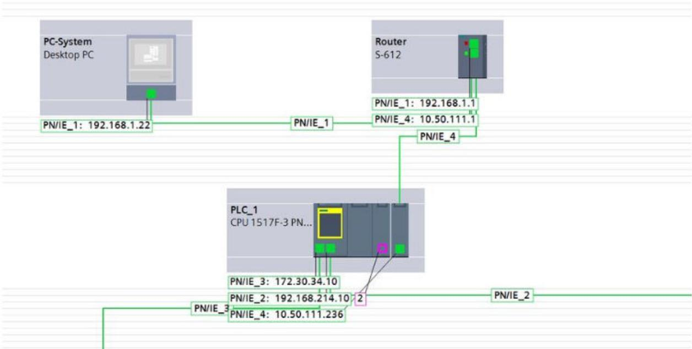

##### 通过 NAT 路由器上传

设备 IP 地址直接映射到公共 IP 地址（目标 NAT）时，只能通过 NAT 路由器访问私有网络中的设备。尤其是，不支持 NAPT（网络地址和端口转换）。
例如：私有子网中有一台设备。在此子网中，设备的地址为 192.168.1.19。用户的 PG/PC 在另一个子网中，地址为 10.119.57.153。在这两个子网之间，有一个 NAT 路由器。NAT 路由器需要组态，其中设备地址 192.168.1.19 映射到与 PG/PC 相同的子网中的有效地址。例如10.119.57.19。
现在可以使用地址 10.119.57.19 上传设备。（参见“组态地址”）。
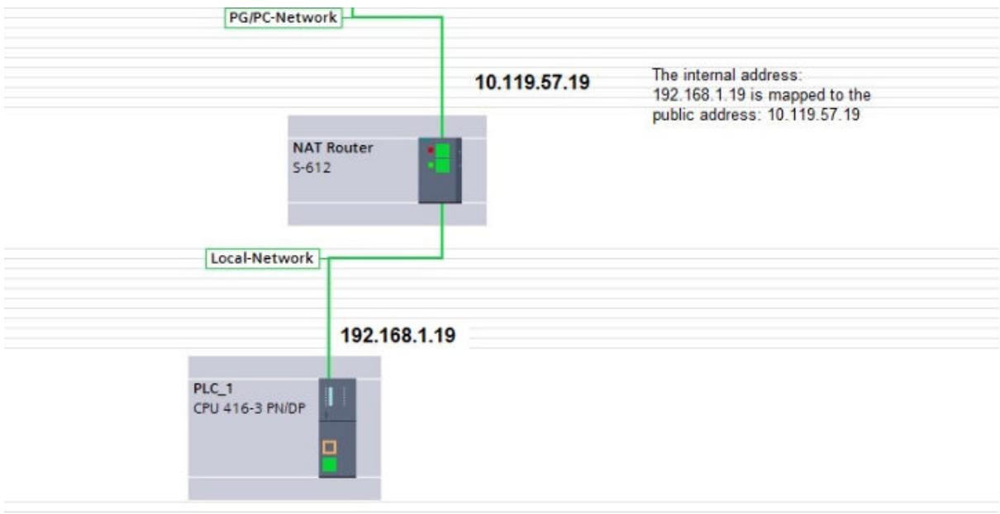
通过 NAT 路由器上传时存在一些限制。
首先，通过 NAT 路由器的通信和 S7 路由不能一起使用。设备必须可通过 NAT 路由器的 IP 地址直接访问。NAT 路由器与设备之间的通信
不涉及 S7 路由器。这就是无法从 PG/PC 系统访问 S71500 内部和 S7300 内部设备的原因。工程组态系统必须能够通过其 IP 地址直接访问 NAT 路由器。工程组态系统与 NAT 路由器之间的通信不涉及 S7 路由器。这就是
上图中的工程组态系统 PG/PC 2 不能用于从测试网络上传设备的原因。

##### UploadResult

上传操作返回的 UploadResult 提供已上传对象状态的反馈。
• UploadResult.Message: UploadResultMessageComposition - UploadResultMessage 的组 成
支持以下属性：
<table><tr><td>属性</td><td>描述</td></tr><tr><td>ErrorCount</td><td>上传时出错的 int 值。结合使用支持 DNAT 路由的路由器通过通信模块 (CM)实现 PG/PC 与 PlusPLC 之间的连接</td></tr><tr><td>State</td><td>UploadResultState 可能的值:成功、信息、警告和错误</td></tr><tr><td>UploadedStati on</td><td>已上传的站的 Device 实例</td></tr><tr><td>WarningCount</td><td>上传时发生的警告的 int 计数值</td></tr></table>
UploadResultMessage 包含：
• UploadResultMessage.Messages : UploadResultMessageComposition - UploadResultMessage 的组成
支持以下属性：
<table><tr><td>属性</td><td>描述</td></tr><tr><td>DateTime</td><td>已创建消息的 System.DateTime。</td></tr><tr><td>ErrorCount</td><td>错误的 int 计数器。</td></tr><tr><td>State</td><td>UploadResultState 可能的值:成功、信息、警告和错误。</td></tr><tr><td>WarningCount</td><td>上传时发生的警告的 int 计数值</td></tr></table>

##### 上传调用示例

```lua
internal bool UploadPLC()
{
...
UploadResult result = uploadProvider.StationUpload(uploadAddress, preUploadDelegate);
...
PrintAllMessages(result.Messages, 0);
...
}
internal void PrintAllMessages(UploadResultMessageComposition messages, int level)
{
if (messages == null)
return;
if (level == 0)
Console.WriteLine("\n");
foreach (UploadResultMessage message in messages)
{
string messageOut = message.Message.PadLeft(message.Message.Length + level, '\t') + "\n";
Console.WriteLine(messageOut);
if ((message总价 ! = null) && (message总价.Count > 0))
PrintAllMessages(message总价, level+1);
}
}
```

#### 5.11.1.13 比较 PLC 软件

• TIA Portal Openness 应用程序已连接到 TIA Portal。请[连接到 TIA Portal](#连接到-TIA-Portal)
• 已通过 TIA Portal Openness 应用程序打开一个项目。请[打开项目](#打开项目)
可使用以下方式确定两个设备的软件之间的差异：
• 比较两个已组态 PLC 的软件
• 比较 PLC 软件和项目库
• 比较 PLC 软件和全局库
• 比较 PLC 软件和 PLC 主副本
• 在“在线”状态下比较已组态 PLC 的软件与所连接 PLC 的软件
使用 CompareTo 或 CompareToOnline 方法进行比较。
public CompareResult CompareTo (ISoftwareCompareTarget compareTarget)
public CompareResult CompareToOnline ()
<table><tr><td>返回值/参数</td><td>功能</td></tr><tr><td>CompareResult compareResult</td><td>返回比较结果:FolderContentsDifferent:所比较的文件夹内容不同。FolderContentsIdentical:所比较的文件夹内容相同。ObjectsDifferent:所比较的对象内容不同。ObjectsIdentical:所比较的对象内容相同。LeftMissing:该对象不包含于启动比较的对象。RightMissing:该对象不包含于正在比较的对象。CompareIrrelevant:这2个对象的比较不相关FolderContainsDifferencesOwnStateDifferent:文件夹内容有一处或多处不同,文件夹自身状态不同FolderContentEqualOwnStateDifferent:文件夹内容相同,文件夹自身状态不同</td></tr><tr><td>ISoftwareCompareTarget compareTarget</td><td>类似对象的列表。</td></tr></table>

##### 修改以下程序代码以输出比较结果：

```cs
private static void WriteResult(CompareResultElement compareResultElement, string indent)
{
    Console.WriteLine("{0} <{1}> <{2}> <{3}> <{4}> ",
    indent,
    compareResultElement.LeftName,
    compareResultElement.ComparisonResult,
    compareResultElement.RightName,
    compareResultElement.DetailedInformation);
    WriteResult(compareResultElement.Elements, indent);
}
private static void WriteResult (IEnumerable<CompareResultElement> compareResultElements, string indent)
{
    indent += " ";
    foreach (CompareResultElement compareResultElement in compareResultElements)
    {
    WriteResult(compareResultElement, indent);
    }
}
```

##### 修改以下程序代码以比较设备的软件：

```cs
private static void CompareTwoOfflinePlcs(PlcSoftware plcSoftware0, PlcSoftware plcSoftware1)
{
    if (plcSoftware0 != null && plcSoftware1 != null)
    {
    CompareResult compareResult = plcSoftware0比較To(plcSoftware1);
    WriteResult(compareResult.RootElement, string.Empty);
    }
}
```

##### 修改以下程序代码以比较 PLC 的软件与项目库：

```cs
private static void ComparePlcToProjectLibrary(Project project, PlcSoftware plcSoftware)
{
    if (project != null && plcSoftware != null)
    {
    CompareResult compareResult = plcSoftware比較To(project.ProjectLibrary);
    WriteResult(compareResult.RootElement, string.Empty);
    }
}
```

##### 修改以下程序代码以比较 PLC 的软件与全局库：

```cs
private static void ComparePlcToGlobalLibrary(PlcSoftware plcSoftware, GlobalLibrary
globalLibrary)
{
    if (plcSoftware != null && globalLibrary != null)
    {
    CompareResult compareResult = plcSoftware比較To(globalLibrary);
    WriteResult(compareResult.RootElement, String.Empty);
    }
}
```
修改以下程序代码以比较 PLC 的软件与主副本：
```text
private static void ComparePlcToMasterCopy(Project project, PlcSoftware plcSoftware)
{
    if (project != null && plcSoftware != null)
    {
    CompareResult compareResult =
    plcSoftware.compareTo(project.ProjectLibrary.MasterCopyFolder.MasterCopies[0]);
    WriteResult(compareResult.RootElement, string.Empty);
    }
}
```
修改以下程序代码以比较 PLC 的软件与所连接 PLC 的软件：
```cs
private static void ComparePlcToOnlinePlc(PlcSoftware plcSoftware)
{
    if (plcSoftware != null)
    {
    CompareResult compareResult = plcSoftware.CompareToOnline();
    WriteResult(compareResult.RootElement, string.Empty);
    }
}
```

#### 5.11.1.14 更新 PLC 程序

要求
• TIA Portal Openness 应用程序已连接到 TIA Portal。 [连接到 TIA Portal](#连接到-TIA-Portal)”
• 已通过 TIA Portal Openness 应用程序打开一个项目。[打开项目](#打开项目)”
简介
可使用 UpdateProgram() 将指令升级到 PLC 的最新版本。可通过 PlcSoftware 实例访问UpdateProgram().
程序代码
```text
private void UpdateProgramPLC()
{
    PlcSoftware plcSoftware = ...;
    plcSoftware.UpdateProgram();
}
```
[打开项目](#打开项目)

#### 5.11.1.15 比较 PLC 硬件

要求
• TIA Portal Openness 应用程序已连接到 TIA Portal。 请[连接到 TIA Portal](#连接到-TIA-Portal)”
• 已通过 TIA Portal Openness 应用程序打开一个项目。请[打开项目](#打开项目)”
可以使用 TIA Portal Openness 来比较两个 PLC 设备的硬件。
签名
使用 CompareTo 方法比较两个硬件对象。
CompareResult CompareTo (IHardwareCompareTarget compareTarget)；
<table><tr><td>返回值/参数</td><td>功能</td></tr><tr><td>CompareResult compare result</td><td>返回比较结果:FolderContainsDifferencesOwnStateDifferent:文件夹内容有一处或多处不同,文件夹自身状态不同FolderContentEqualOwnStateDifferent:文件夹内容相同,文件夹自身状态不同。</td></tr><tr><td>IHardwareCompareTarget compareTarget</td><td>应执行硬件比较的比较目标。不得为空。</td></tr></table>
如果参数 compareTarget 为空并尝试比较硬件，则将出现
Siemens.Enginnering.EngineeringTargetInvocationExceptions。

##### 程序

修改以下程序代码以输出比较结果：
```javascript
...
CompareResult compareResult = plc_1比較To(plc_2);
CompareResultState resultState = compareResult.RootElement.ComparisonResult;
if (resultState == CompareResultState.FolderContainsDifferencesOwnStateDifferent)
{
    // Folder contents have one or more differences, folder's own state is different:
    // May occur if the plc has a different subordinate element, e.g., a local module, and
    // the plc itself is different, e.g., in a parameter
}
else if (resultState == CompareResultState.FolderContentEqualOwnStateDifferent)
{
    // Folder content is the same, folder's own state is different:
    // May occur if a folder-style module, e.g., FM 351, has equal subordinate elements but
    // the module itself is different, e.g., in a parameter
}
else if (resultState == CompareResultState.FolderContentsIdentical)
{
    ...
}
```  
Openness：用于工程组态工作流自动化的 API  
系统手册, 11/2023
[连接到 TIA Portal](#连接到-TIA-Portal)
打开项目 (页 140)

#### 5.11.1.16 设置 PLC 的密码策略

要求
• TIA Portal 已连接到 TIA Portal Openness 请[连接到 TIA Portal](#连接到-TIA-Portal)”
• 已打开一个项目
请[打开项目](#打开项目)”
简介
可使用 TIA Portal Openness 为旧版和 plus PLC 设置安全密码策略。

##### 设置旧版 PLC 的密码策略

可在项目基础对象上使用 LegacyPlcPasswordPolicyService 来设置旧版 PLC 的安全密码策略。LegacyPlcPasswordPolicyService 功能支持以下属性：
<table><tr><td>属性名称</td><td>数据类型</td><td>描述</td></tr><tr><td>PasswordPolicyEnabled</td><td>Boolean</td><td>如果 PasswordPolicyEnabled 为“True”,则将考虑所有其它已组态属性值来验证密码。如果 PasswordPolicyEnabled 为“False”,则新策略不能用于任何旧版 PLC。</td></tr><tr><td>MinimumLength</td><td>Short</td><td>设置密码 minimumLength 的值最小长度的允许范围值为 5 至 8</td></tr><tr><td>MinimumNumericCharacterLength</td><td>Short</td><td>设置密码的 minimumNumericCharacterLength 值最小数字字符长度的允许范围值为 0 至 8</td></tr><tr><td>MinimumSpecialCharacterLength</td><td>Short</td><td>设置密码的 minimumSpecialCharacterLength 值最小数字字符长度的允许范围值为 0 至 8</td></tr><tr><td>IncludesLowerCaseAndUpperCaseCharacters</td><td>Boolean</td><td>设置密码的 includesLowerCaseAndUpperCaseCharacters 值</td></tr></table>
试图将属性值设置在允许范围之外时，将出现自定义异常 PasswordPolicySettingsException。

##### 设置 plus PLC 的密码策略

可以在项目基础对象上使用 PlcPasswordPolicyService 来设置 plus PLC 的安全密码策略。
PlcPasswordPolicyService 功能支持以下属性：
<table><tr><td>属性名称</td><td>数据类型</td><td>描述</td></tr><tr><td>PasswordPolicyEnabled</td><td>Boolean</td><td>如果 PasswordPolicyEnabled 为“True”,则将考虑 UMAC(即,项目用户的密码复杂性)组态的属性值来验证密码如果 PasswordPolicyEnabled 为“False”,则新策略不能用于任何 plus plc。</td></tr></table>
当通过 Openness 脚本设置保护访问级别的密码时，如果输入的密码不符合策略，将抛出一种新类型的异常 EngineeringPasswordPolicyViolationException。
要设置旧版 PLC 的密码策略，请修改以下程序代码：
```cs
public void LegacyPlc_SecuritySettingPasswordPolicy_SetAttributes()
{
    LegacyPlcPasswordPolicyService m_LegacyPlcPasswordPolicyService = m_project.GetService<LegacyPlcPasswordPolicyService>();
    m_LegacyPlcPasswordPolicyService.PasswordPolicyEnabled = true;
    m_LegacyPlcPasswordPolicyService.MinimumLength = 6;
    m_LegacyPlcPasswordPolicyService.MinimumNumericCharacterLength = 2;
    m_LegacyPlcPasswordPolicyService.MinimumSpecialCharacterLength=2;
    m_LegacyPlcPasswordPolicyService.IncludeLowerCaseAndUpperCaseCharacters = true;
}
```
要设置 plus PLC 的密码策略，请修改以下程序代码：
```cs
public void PlusPlc_SecuritySettingPasswordPolicy_SetAttributes()
{
    PlcPasswordPolicyService m_PlcPasswordPolicyService =
    m_project.GetService<PlcPasswordPolicyService>();
    m_PlusPlcPasswordPolicyService.PasswordPolicyEnabled=true;
}
```

#### 5.11.1.17 管理动态证书设置

要求
• TIA Portal 已连接到 TIA Portal Openness 请[连接到 TIA Portal](#连接到-TIA-Portal)”
• 已打开一个项目
请[打开项目](#打开项目)”
可使用 TIA Portal Openness 在 TIA Portal 的中心位置为所有受支持的服务组态动态证书管理，而非单独修改每个应用程序和服务。
可使用 Certificate Management Configuration 服务来管理动态证书，该服务可用于 V3.0 及更高版本的所有 PLC 设备系列的 PLC 实例。
Openness：用于工程组态工作流自动化的 API
CertificateManagementConfiguration 支持以下属性：
<table><tr><td>特性名称</td><td>数据类型</td><td>描述</td><td>访问</td><td>说明</td></tr><tr><td>Usage</td><td>CertificateConfigurationUsage</td><td>获取或设置证书管理组态的用途Usage属性允许选择两个选项:使用TIA Portal组态和下载的证书,或在运行时由证书管理提供的证书。Usage属性有两个枚举值:TIAPortal运行系统</td><td>读/写</td><td>WebServer和OpcUaServer处于取消激活状态时,在值CertificateConfigurationUsage.Runtime的设置操作中会出现EngineeringTargetInvocationException</td></tr><tr><td>CertificateExpirationEventActivated</td><td>Boolean</td><td>启用或禁用证书管理组态的证书过期设置</td><td>读/写</td><td>Usage属性设为使用TIA Portal组态和下载的证书时,会出现EngineeringTargetInvocationException</td></tr><tr><td>RemainingCertificateLifetime</td><td>ushort</td><td>获取或设置用于显示证书管理组态的剩余证书使用寿命事件的值此为一个百分比值,允许计算发出PLC报警以通知用户即将到期的时间。</td><td>读/写</td><td>EnableCertificateExpirationEvent属性值设为False或值未介于10-90之间时,会出现EngineeringTargetInvocationException</td></tr><tr><td>CertificateSupportedServices</td><td>CertificateSupportedServiceComposition</td><td>获取启用动态证书管理的证书管理组态的所有支持的证书服务。当前支持的服务为OPCUA和Webserver。当前支持的服务为OPCUA和Webserver。</td><td>读</td><td></td></tr></table>
系统手册, 11/2023
方法
CertificateSupportedService() 表示证书管理组态支持的服务。其接受以下属性：
<table><tr><td>特性名称</td><td>数据类型</td><td>描述</td><td>访问</td><td>说明</td></tr><tr><td>ServiceType</td><td>CertificateSupportedServiceName</td><td>表示证书管理组态支持的服务名称。CertificateSupportedServiceName接受以下枚举项及其枚举值:Webserver - 100OpcUaServer - 200</td><td>读</td><td></td></tr><tr><td>Id</td><td>ushort</td><td>表示证书管理组态支持的服务 id。</td><td>读</td><td></td></tr><tr><td>ServiceGroupName</td><td>string</td><td>表示证书管理组态的受支持服务的组名</td><td>读/写</td><td>服务值设为大于64字符时,会出现EngineeringTargetInvocationException。</td></tr></table>
```text
//...
// for getting the service
CertificateManagementConfiguration certificateConfigurationService =
plc.GetService<CertificateManagementConfiguration>();
// To setup the usage
certificateConfigurationService.Usage = CertificateConfigurationUsage.TIAPortal;
// for service count
var servicesCount = certificateConfigurationService.CertificateSupportedServices.Count;
// For setting group name
certificateConfigurationService.CertificateSupportedServices[0].ServiceGroupName = "ServiceName_1";
```
下载到 PLC 期间处理动态证书
SelectiveDeleteDownload 可用于在下载到 PLC 期间处理证书。基于此选项，将删除动态证书。
SelectiveDeleteDownload.CurrentSelection 支持以下枚举项及其相关的枚举值：
• SelectiveDeleteDataSelections.AcceptAll - 全部接受
• SelectiveDeleteDataSelections.DeleteSelected - 删除所选项
• SelectiveDeleteDataSelections.DeleteAll - 全部删除

##### 程序代码：下载到 PLC 期间处理动态证书

```cs
private void DownloadConfigurationDelegate(DownloadConfiguration downloadConfiguration)
{
    if (downloadConfiguration is SelectiveDeleteDownload selectiveDeleteDownload)
    {
    selectiveDeleteDownload.CurrentSelection = SelectiveDeleteDataSelections.AcceptAll;
    }
}
```

### 5.11.2 用于访问 PLC 服务的函数


#### 5.11.2.1 访问等级设置

• TIA Portal Openness 应用程序已连接到 TIA Portal请[连接到 TIA Portal](#连接到-TIA-Portal)
• 已打开一个项目
请[打开项目](#打开项目)”
```text
可以使用 TIA Portal Openness API 通过设备 DeviceItem CPU 处的硬件 PlcAccessLevelProvider 来访问 “访问等级” 设置。
```
此功能提供用于设置/重设密码的动作，并提供用于设置/读取访问等级设置的已建模属性。
• 空 SetPassword（PlcProtectionAccessLevel 访问等级类型，SecureString 密码）
• 空 ResetPassword（PlcProtectionAccessLevel 访问等级类型）
• 属性 PlcProtectionAccessLevel
一般来讲，通过 Openness 进行处理与 TIA Portal UI 类似。
• 始终可在 S7-1200/1500 PLC 读取和设置 PlcProtectionAccessLevel。
• 如果访问等级设为除完全访问权限（或完全访问含故障安全）以外的任何等级，则需要设置安全访问权限密码。否则会出现编译错误：“密码不得为空”
• 不允许为不同访问等级设置相同的密码
• 仅可为高于所设访问等级的等级设置/重设密码（如果 PlcProtectionAccessLevel 设为HMIAccess，则仅可为 ReadAccess 和 FullAccess 设置密码）

##### 可能存在的异常：

• EngineeringTargetInvocationException：“其它访问等级已存在相同密码“ - 如果用户尝试为不同访问等级设置相同密码，则会弹出此提示
• EngineeringTargetInvocationException：“无法为访问等级设置密码” - 如果用户尝试为比所选等级更严格的访问等级设置密码，则会弹出此提示
• EngineeringTargetInvocationException：“密码不能为空” - 如果用户尝试设置空密码，则会弹出此提示
• EngineeringTargetInvocationException：“访问等级无效” - 如果用户尝试在非故障安全PLC 上将访问等级设为 FullAccessIncludingFailsafe，则会弹出此提示

##### 访问等级

在 Openness 中，访问等级建模为名为 PlcProtectionAccessLevel 的枚举值。枚举字段的名称基于 S7-1200/1500 PLC 的“Access Level”条目。
<table><tr><td>TIA UI 名称</td><td>枚举条目</td><td>值</td><td>备注</td></tr><tr><td>-</td><td>None</td><td>0</td><td>用于枚举值初始化。该值不得由 Openness 用户设置。</td></tr><tr><td>完全访问权限(无保护)</td><td>FullAccess</td><td>1</td><td></td></tr><tr><td>读取访问</td><td>ReadAccess</td><td>2</td><td></td></tr><tr><td>HMI 访问</td><td>HMIAccess</td><td>3</td><td></td></tr><tr><td>无访问权</td><td>NoAccess</td><td>4</td><td></td></tr><tr><td>完全访问含故障安全(无保护)</td><td>FullAccessIncludingFailsafe</td><td>5</td><td>仅可用于故障安全 PLC</td></tr></table>
可在 PLC 上使用名为 PlcProtectionAccessLevel 的 PlcProtectionAccessLevel 枚举类型的 EOM属性（已建模属性）设置/获取访问等级。
可以为无访问权限的 PlcProtectionAccessLevel 使用以下代码示例：
```text
DeviceItem S71500PLC = ...;
PlcAccessLevelProvider myPlcAccessLevelProvider =
S71500PLC TokService<PlcAccessLevelProvider>();
myPlcAccessLevelProvider.PlcProtectionAccessLevel = PlcProtectionAccessLevel.NoAccess;
```

##### 密码

出于安全因素，密码会作为 SecureString 实现。仅可使用相应的动作为不同访问等级设置/重设密码。不支持读取密码。
```javascript
myPlcAccessLevelProvider.SetPassword(PlcProtectionAccessLevel.ReadAccess, someSecureString);
myPlcAccessLevelProvider.ResetPassword(PlcProtectionAccessLevel.ReadAccess);
```
连接到 TIA Portal (页 90)
打开项目 (页 140)

#### 5.11.2.2 访问软件校验和

•  TIA Portal Openness 应用程序已连接到 TIA Portal。请[连接到 TIA Portal](#连接到-TIA-Portal)
• 已通过 TIA Portal Openness 应用程序打开一个项目请[打开项目](#打开项目)
可使用 Openness API 访问 PLC 站的软件校验和。
要进行访问，请获取 PlcSoftware 的实例并加载 PlcChecksumProvider 的服务实例。
```text
PlcSoftware plc = ...;
//get PlcSoftware instance
PlcChecksumProvider checksumProvider =
plc.GetService<PlcChecksumProvider>();
如果 PLC 不支持校验和计算，则 GetService 调用会返回 null。
在 PlcChecksumProvider 实例可达到软件校验和，具体如下：
string softwareChecksum = checksumProvider.Software;
“软件”(Software) 属性为只读属性，如果程序未编译，会返回空值。
```

#### 5.11.2.3 分配 PC 接口

• TIA Portal Openness 应用程序已连接到 TIA Portal 请[连接到 TIA Portal](#连接到-TIA-Portal)”
• 已打开一个项目请[打开项目](#打开项目)”
要进行接口分配，需要从设备项接口上的 Siemens.HW.Features 获取PcInterfaceAssignment 服务。
如果 PC-Station 版本 <= 2.0，此服务的方法将返回空值，并且将无法为分配给“PC-Station”、“仅 Windows”或“无”的接口进行接口分配。对于分配给 SW-CPU 的接口，可再次进行分配。
说明
CAx 交换支持的 PC 站非常有限。仅支持版本为 V1.0 的 PC 站以及 InterfaceAssignment 的默认值，因为这两个值会影响设备结构（内置对象、插入位置）。但由于参数不属于AutomationML 文件的组成部分，不会在导入期间设置参数值，因此 IPC 的结构不匹配，无法插入其它模块。

##### 程序代码：接口分配

修改并使用以下程序代码以实现接口分配：
```text
DeviceItem swCpu = ...;
DeviceItem myInterface = ...;
PcInterfaceAssignment provider = myInterface.GetService<PcInterfaceAssignment>();
//user has to give device item sw cpu in case he/she wants to assign to it. (in the future, there could be multi sw-cpu cases)
provider.AssignInterface(PcInterfaceAssignmentMode.SoftwarePlc, swCpu);
...
provider.AssignInterface(PcInterfaceAssignmentMode.PcStation);
...
provider.AssignInterface(PcInterfaceAssignmentMode.None);
...
```
修改并使用以下程序代码，以获取关于接口当前分配模式的信息：
```cs
PcInterfaceAssignment provider = myInterface.GetService<PcInterfaceAssignment>();
PcInterfaceAssignmentMode mode = provider.PcInterfaceAssignmentMode;
switch(mode)
{
case PcInterfaceAssignmentMode.None: Console.WriteLine("Assigned to none or windows-only.");
break;
case PcInterfaceAssignmentMode.PcStation: Console.WriteLine("Assigned to pc-station.");
break;
case PcInterfaceAssignmentMode.SoftwarePlc: Console.WriteLine("Assigned to SoftwarePlc: " + provider.SoftwarePlc.Name);
break;
}
```
程序代码：硬件资源和 IPC 扩展组态
还可以使用以下代码通过 PcInterfaceAssignment 服务选择正确的 IPC 扩展和HardwareResource 特性：
```cs
DeviceItem myInterface = ...;
PcInterfaceAssignment provider = myInterface.GetService<PcInterfaceAssignment>();
//this method returns a subset of IpcExpansion values which are available for the IPC that
the interface is plugged in. IEnumerable<string> ipcExpansionChoices =
provider.GetAvailableIPCExpansions();
string myChoice;
foreach(var choice in ipcExpansionChoices)
{
    //user must select the desired value depending on his/her configuration
    if (choice.Contains("3yxx1")
    {
    myChoice = choice;
    break;
    }
}
provider.IpcExpansion = myChoice;
//After assigning IpcExpansion value, user may assign HardwareResource value using the
following enumeration.
provider.HardwareResource = HardwareResource.X101;
//OR
//myInterface.SetAttribute("HardwareResource", HardwareResource.X101);
//myInterface.SetAttribute("IpcExpansion", mychoice);
```
连接到 TIA Portal (页 90)打开项目 (页 140)

#### 5.11.2.4 确定 PLC 的状态

要求
• TIA Portal Openness 应用程序已连接到 TIA Portal。请[连接到 TIA Portal](#连接到-TIA-Portal)
• 已通过 TIA Portal Openness 应用程序打开一个项目。请[打开项目](#打开项目)
您可确定项目中的一个 PLC 或所有 PLC 的状态。
TIA Portal Openness 分为以下状态：
• 离线
• PLC 已连接（“连接”(Connecting)）
• 在线
• PLC 已断开（“断开”(Disconnecting)）
• 不兼容
• 不可访问
• 受保护
修改以下程序代码以确定某个 PLC 的状态：
```text
public static OnlineState GetOnlineState(DeviceItem deviceItem)
{
    OnlineProvider onlineProvider = deviceItem.GetService<OnlineProvider>();
    return onlineProvider.State;
}
```
修改以下程序代码以确定项目中所有 PLC 的状态：
```cs
public static void DetermineOnlineStateOfAllProjectDevices(Project project)
{
    foreach (Device device in project.Devices)
    {
    foreach (DeviceItem deviceItem in device.DeviceItems)
    {
    OnlineProvider onlineProvider = deviceItem.GetService<OnlineProvider>();
    if (onlineProvider != null)
    {
    OnlineState state = onlineProvider.State;
    }
    }
    }
}
```

#### 5.11.2.5 访问在线连接的参数

• TIA Portal Openness 应用程序已连接到 TIA Portal。请[连接到 TIA Portal](#连接到-TIA-Portal)
• 已打开一个项目。
请[打开项目](#打开项目)
可使用 TIA Portal Openness API 接口确定或设置在线连接的参数：
• 枚举 PLC 的可用连接模式
• 枚举 PLC 的可用接口
• 枚举分配的插槽
• 枚举子网和网关的可用地址
• 设置连接参数。
有关 IsSecureCommunication 的信息，请[支持安全 S7 通信 TLS](#支持安全-S7-通信-TLS)”

##### 程序代码：确定连接参数

修改以下程序代码以枚举可用的连接模式、PC 接口和插槽：
```cs
public static void EnumerateConnectionModesOfPLC(DeviceItem deviceItem)
{
    OnlineProvider onlineProvider = deviceItem.GetService<OnlineProvider>();
    if (onlineProvider == null)
    {
    return; // Only cpu device items can provide OnlineProvider service
    }
    // Accessing connection configuration object
    ConnectionConfiguration configuration = onlineProvider.Configuration;
    // Now access connection configuration members
    foreach (ConfigurationMode mode in configuration.Modes)
    {
    Console.WriteLine("Mode name:{0}", mode.Name);
    foreach (ConfigurationPcInterface pcInterface in mode.PcInterfaces)
    {
    Console.WriteLine("PcInterface name:{0}", pcInterface.Name);
    Console.WriteLine("PcInterface number:{0}", pcInterface.Number);
    foreach (ConfigurationTargetInterface targetInterface in pcInterface.TargetInterfaces)
    {
    Console.WriteLine("TargetInterface:{0}", targetInterface.Name);
    }
    }
    }
}
```
您也可以按名称访问连接模式和 PC 接口：
```cs
public static ConfigurationTargetInterface
GetTargetInterfaceForOnlineConnection(OnlineProvider onlineProvider)
{
    ConnectionConfiguration configuration = onlineProvider.Configuration;
    ConfigurationMode mode = configuration.Modes.Find("PN/IE");
    ConfigurationPcInterface pcInterface = mode.PcInterfaces.Find("PLCSIM", 1);
    ConfigurationTargetInterface slot = pcInterface.TargetInterfaces.Find("2 X3");
    return slot;
}
```

##### 修改以下程序代码以枚举 PC 接口上可用的子网和网关地址：

```cs
public static void EnumeratingPCInterfaceSubnetsAndGateways(ConfigurationPcInterface pcInterface)
{
    foreach (ConfigurationSubnet subnet in pcInterface.Subnets)
    {
    Console.WriteLine("Subnet name:{0}", subnet.Name);
    foreach (ConfigurationGateway gateway in subnet.Gateways)
    {
    //Get the name of the gateway:
    Console.WriteLine("Gateway name:{0}", gateway.Name);
    //Get the IP address of each gateway:
    foreach (ConfigurationAddress gatewayAddress in gateway.Addresses)
    {
    Console.WriteLine("Gateway Address:{0} has {1}", gatewayAddress.Name, gatewayAddress.Address);
    }
    }
    }
}
```
也可以按名称或 IP 地址访问子网和网关：
```cs
public static void AccessSubnetAndGatewayOfPCInterface(ConfigurationPcInterface pcInterface)
{
    ConfigurationSubnet subnet = pcInterface.Subnets.Find("PN/IE_1");
    ConfigurationAddress subnetAddress = subnet.Addresses.Find("192.168.0.1");
    ConfigurationGateway gateway = subnet.Gateways.Find("Gateway 1");
    ConfigurationAddress gatewayAddress = gateway.Addresses.Find("192.168.0.2");
}
```

##### 程序代码：设置连接参数

设置连接参数时，将覆盖之前设置的所有连接参数。如果已直接在 TIA Portal 中设置连接参数，则无需调用 ApplyConfiguration。在调用 ApplyConfiguration 时，如果已存在到 PLC 的在线连接，则会发生异常。

##### 修改以下程序代码以设置插槽参数：

```text
public static void SetConnectionWithSlot(OnlineProvider onlineProvider)
{
    ConnectionConfiguration configuration = onlineProvider.Configuration;
    ConfigurationMode mode = configuration.Modes.Find(@"PN/IE");
    ConfigurationPcInterface pcInterface = mode.PcInterfaces.Find("PLCSIM", 1);
    // or network pc interface that is connected to plc
    ConfigurationTargetInterface slot = pcInterface.TargetInterfaces.Find("2 X3");
    configuration.ApplyConfiguration(slot);
    // After applying configuration, you can go online
    onlineProvider.GoOnline();
}
```

##### 修改以下程序代码以设置网关地址参数：

```cs
public static void SetConnectionWithGatewayAddress(OnlineProvider onlineProvider, string subnetName, string gatewayAddressName)
{
    ConnectionConfiguration configuration = onlineProvider.Configuration;
    ConfigurationMode mode = configuration.Modes.Find(@"PN/IE");
    ConfigurationPcInterface pcInterface = mode.PcInterfaces.Find("PLCSIM", 1);
    // or network pc interface that is connected to plc
    ConfigurationSubnet subnet = pcInterface.Subnets.Find(subnetName);
    ConfigurationAddress gatewayAddress = subnet.Addresses.Find(gatewayAddressName);
    configuration.ApplyConfiguration(gatewayAddress);
    // After applying configuration, you can go online
    onlineProvider.GoOnline();
}
```

##### 修改以下程序代码以设置子网地址参数：

```cs
public static void SetConnectionWithSubnetAddress(OnlineProvider onlineProvider, string subnetName)
{
    ConnectionConfiguration configuration = onlineProvider.Configuration;
    ConfigurationMode mode = configuration.Modes.Find(@"PN/IE");
    ConfigurationPcInterface pcInterface = mode.PcInterfaces.Find("PLCSIM", 1);
    // or network pc interface that is connected to plc
    ConfigurationSubnet subnet = pcInterface.Subnets.Find(subnetName);
    ConfigurationAddressComposition addresses = subnet.Addresses;
    configuration.ApplyConfiguration(addresses[0]);
    // After applying configuration, you can go online
    onlineProvider.GoOnline();
}
```
[支持安全 S7 通信 TLS](#支持安全-S7-通信-TLS)

#### 5.11.2.6 访问特征码以进行快速站比较

要求
• Openness 应用程序已连接 TIA Portal。 请[连接到 TIA Portal](#连接到-TIA-Portal)”
• 已打开一个项目。
请[打开项目](#打开项目)”
• PLC 处于离线状态。
应用
可以使用 TIA Portal Openness 获取 FingerprintData，以了解 PLC 设备组态的不同方面，从而实现快速站比较。通过从给定 TIA Portal 获取的 FingerprintDataProvider 服务来实现。调用 GetService 时将返回 FingerprintDataProvider 的实例，否则服务将返回 null 值。

##### 程序代码：从 TIA Portal 检索 FingerprintDataProvider

```text
TiaPortal tia = new TiaPortal(TiaPortalMode.WithUserInterface);
FingerprintDataProvider fingerprintDataProvider =
tia.GetService<FingerprintDataProvider>();
if (fingerprintDataProvider != null)
{
...
}
```

##### FingerprintDataProvider 方法的参数

要获取设备的 fingerprintData，您必须调用 FingerprintDataProvider 的 GetFingerprintData方法。
FingerprintDataProvider 支持以下属性：
<table><tr><td>参数名称</td><td>类型</td><td>描述</td></tr><tr><td>configurationAddress</td><td>Siemens.Engineering.Online.Configuration</td><td>必须提取 fingerprintData 的设备的地址。</td></tr><tr><td>onlineConfigurationDelegate</td><td>Siemens.Engineering.Online</td><td>将在提取 fingerprintData 前调用该委托,以检查组态。</td></tr></table>

##### 组态地址

用户应该为 GetFingerprintData 提供 ConfigurationAddress 对象。对于必须提取fingerprintData 的设备，地址对象将用于为其建立一个连接。ConfigurationAddress 对象必须在 FingerprintDataProvider 的 ConnectionConfiguration 中创建。有关IsSecureCommunication 的信息，请[支持安全 S7 通信 TLS](#支持安全-S7-通信-TLS)”
例如，用户可以使用以下代码创建地址对象：
```text
...
ConnectionConfiguration configuration = fingerprintDataProvider.Configuration;
ConfigurationMode configurationMode = configuration.Modes.Find("PN/IE");
ConfigurationPcInterface pcInterface = configurationMode.PcInterfaces.Find("Intel(R)
Ethernet Connection I217-LM", 1);
// Create an address. This "ConfigurationAddress" is used as parameter for getting the
fingerprintData
ConfigurationAddress fingerprintAddress = pcInterface.Addresss.Create("192.68.0.1");
...
```
组态包含所支持的 Modes 的列表。用户需选择其中一个 Modes 用于获取特征码。所选的ConfigurationMode 包含所有支持所选 Mode 的本地 PCInterfaces 的列表。已选择下列接口中的一个。可在所选 ConfigurationPcInterface 的地址集中创建所需地址。

##### 程序代码：检索 FingerprintData

用户可以通过调用 GetFingerprintData 操作来检索站的 FingerprintData。支持以下参数：
<table><tr><td>参数</td><td>描述</td></tr><tr><td>ConfigurationAddress</td><td>设备的地址</td></tr><tr><td>OnlineConfigurationDelegate</td><td>处理限制的回调</td></tr></table>
```text
...
OnlineConfigurationDelegate preConfigurationDelegate = PreConfigureFingerprint;
FingerprintDataResult result =
fingerprintDataProvider.GetFingerprintData(fingerprintAddress, preConfigurationDelegate);
// The fingerprints
FingerprintDataItemComposition allFingerprints = result.FingerprintDataItems;
foreach (FingerprintDataItem item in allFingerprints)
{
    // do something with the fingerprint ...
}
internal void PreConfigureFingerprint(OnlineConfiguration onlineConfiguration)
{
...
}
```

##### 在线组态委托

下面列出了可能的在线组态类型。
<table><tr><td>组态名称</td><td>描述和属性</td></tr><tr><td>OnlineConfiguration</td><td>其他组态的基础类别OnlineConfiguration.Message:字符串(只读属性,包含组态消息)</td></tr></table>
由于这表示所有其它组态的基础类别，因此，该属性适配器在所有组态中均可用。
下面给出了组态的数据类型：
<table><tr><td>组态</td><td>数据类型</td><td>描述和操作</td></tr><tr><td>OnlineConfiguration</td><td>OnlineReadAccessPassword</td><td>通过SetPassword(password:SecureString)方法 Set password。输入密码,获得模块的读访问权限</td></tr></table>
如果可能阻止访问特征码的组态未得到处理，则会导致出现
EngineeringDelegateInvocationException 并中止上传。如果委托中的异常未得到处理，则 会出现 EngineeringDelegateInvocationException。

##### PreConfigureFingerprint 实现示例

```java
private static void PreConfigureFingerprint(OnlineConfiguration onlineConfiguration)
{
    OnlineReadAccessPassword readAccess = onlineConfiguration as OnlineReadAccessPassword;
    if (readAccess != null)
    {
    string passWD = "passWD";
    var password = new SecureString();
    foreach (var c in passWD) password.AppendChar(c);
    readAccess.SetPassword(password);
    return;
    }
    throw newADCNotSupportedException(); // Exception thrown in the delagate will cancel get fingerprints
}
```

##### FingerprintDataResult

GetFingerprintData 动作返回的 FingerprintDataResult 可提供为设备定义的所有特征码。例如，用户可以使用以下代码检查特征码项：
```cs
{
...
FingerprintDataResult result = dataProvider.GetFingerprintData(fingerprintAddress, preConfigurationDelegate);
FingerprintDataItemComposition allFingerprints = result.FingerprintDataItems;
foreach (FingerprintDataItem item in allFingerprints)
{
string fingerprintDataIdentifier = item.FingerprintDataIdentifier;
string fingerprintDataValue = plcItem.FingerprintDataValue;
// Do something, e.g. store Identifier and Value in a file
}
}
```

##### Openness 特征码内的错误处理

Openness 特征码内的所有错误将映射为可恢复的用户异常EngineeringTargetInvocationException。因此，Openness 操作中的任何错误都不会导致TIA-Portal 崩溃。

##### 前提条件是客户端处理该异常。如以下代码所示

```cs
TiaPortal currentTIA = ...;
FingerprintDataProvider dataProviderFingerprints =
currentTIA.GetService<FingerprintDataProvider>();
OnlineConfigurationDelegate configurationDelegate = OnlineConfigurationFingerprintData;
try
{
    // The used addr refers a PLC300.
    FingerprintDataResult dataResult = dataProviderFingerprints.GetFingerprintData(addrObj, configurationDelegate);
    // Try to get a list of all FingerprintDataItems. But a PLC300 supports no fingerprints.
    FingerprintDataItemComposition dataItems = dataResult.FingerprintDataItems;
    foreach (FingerprintDataItem searchItem in dataItems)
    {
    string valueToCompareIdent = searchItem.FingerprintDataIdentifier;
    string valueToCompareValue = searchItem.FingerprintDataValue;
    DoAnything(valueToCompareIdent, valueToCompareValue);
    }
    }
    catch (EngineeringTargetInvocationException FedExException)
    {
    // In case of the not supported PLC this exception will be caught.
    Console.WriteLine(targetException.Message);
}
```

##### 帮助程序类别

对于此示例而言，需要两种类别。用户可以使用以下程序代码封装特征码数据对。
```cs
/// <summary>
/// Helperclass to handle a "Dictionary" as serializeable class object
/// </summary>
[Serializable]
public class FingerprintDataPairs : Dictionary<string, string>, ISerializable
{
    public FingerprintDataPairs() {}
    public FingerprintDataPairs(SerializationInfo si, StreamingContext context)
    {
   定了ValuePair<string, string>[] dataPair = si.GetValue("KeyValuePairs", typeof(KeyValuePair<string, string>[])) as KeyValuePair<string, string>[];
    if (dataPair != null)
    foreach (KeyValuePair<string, string> pair in dataPair)
    this.Add(pair.Key, pair.Value);
    }
}
```
用户可以使用以下示例处理特征码数据并进行比较：
```cs
/// <summary>
/// Helperclass for handle the fingerprint data and compare two datasets.
/// </summary> public class FingerprintDataCompare
{
internal FingerprintDataPairs m_FingerprintDataPairs;
internal FingerprintDataPairs FingerprintDataPairSet
{
get
{
if (m_FingerprintDataPairs == null) m_FingerprintDataPairs = new FingerprintDataPairs();
return m_FingerprintDataPairs;
}
set
{
m_FingerprintDataPairs = value;
}
}
internal bool CompareDataSets(FingerprintDataPairs dataSet1, FingerprintDataPairs dataSet2)
{
foreach (string key in dataSet1.Keys)
{
if (dataSet2[key] != dataSet1[key])
return false;
}
return true;
}
internal void SaveFingerprintDataItems(FingerprintDataPairs fingerprintDataPairSet, string filename)
{
using (FileStream fs = new FileStream(filename, FileMode.Create))
{
BinaryFormatter formatter = new BinaryFormatter();
try
{
formatter.Serialization(fs, fingerprintDataPairSet);
}
catch (SerializableException e)
{
Console.WriteLine("Failed to write fingerprints. See: " + e.Message);
}
finally
{
fs.Close();
}
}
}
internal FingerprintDataPairs LoadFingerprintDataItems(string filename)
{
FingerprintDataPairs dataPair = null;
using(FileStream fs = new FileStream(filename, FileMode.Open))
```
```text
{
    BinaryFormatter formatter = new BinaryFormatter();
    try
    {
    dataPair = (FingerprintDataPairs)formatter Presetilde(fs);
    }
    catch (System.Runtime.Serialization-speedException e)
    {
    Console.WriteLine("Failed to read fingerprints. See: " + e.Message);
    }
    finally
    {
    fs.Close();
    }
    }
    return dataPair;
}
```

##### 比较特征码

要进行比较，可以使用 FingerprintDataResult
```text
...
// See chapter "FingerprintDataResult"
FingerprintDataResult fingerprintDataResult = dataProvider.GetFingerprintData(address, preConfigurationDelegate);
```
要保存特征码，可以使用帮助程序类别：
```text
string pathDat = "FingerprintDataOverview.dat";
// Create a fingerprint comparator and fill the dataitems with the result of "GetFingerprintData".
FingerprintDataCompare fingerprintDataSet = new FingerprintDataCompare();
foreach (FingerprintDataItem item in fingerprintDataResult.FingerprintDataItems)
fingerprintDataSet.FingerprintDataPairSet.Add(item.FingerprintDataIdentifier, item.FingerprintDataValue);
fingerprintDataSet.SaveFingerprintDataItems(fingerprintDataSet.FingerprintDataPairSet, pathDat);
```
借助已保存的 FingerprintDataItems 和当前 FingerprintDataResult，可实现特征码比较
```text
...
string pathDat = "FingerprintDataOverview.dat";
FingerprintDataCompare fingerprintDataSet = new FingerprintDataCompare();
foreach (FingerprintDataItem item in fingerprintDataResult.FingerprintDataItems)
fingerprintDataSet.FingerprintDataPairSet.Add(item.FingerprintDataIdentifier, item.FingerprintDataValue);
FingerprintDataPairs loadDataSet = new FingerprintDataPairs();
loadDataSet = fingerprintDataSet.LoadFingerprintDataItems(pathDat);
if (!fingerprintDataSet.CompareDataSets(loadDataSet, fingerprintDataSet.FingerprintDataPairSet))
{
    // Here is place to implement user actions.
}
```

#### 5.11.2.7 访问 Step7 上的交叉引用服务

• TIA Portal Openness 应用程序已连接到 TIA Portal。 请[连接到 TIA Portal](#连接到-TIA-Portal)”
• 已打开一个项目。请[打开项目](#打开项目)”
可在 Step7 对象上使用 TIA Portal Openness 通过 GetService 方法访问CrossReferenceService。交叉引用在适用的 Step7 对象上提供 IEngineeringService，即CrossReferenceService。对于试图通过 GetService 方法访问 CrossReferenceService 的不适用 Step7 对象，从 TIA Portal Openness 返回空值。
提供交叉引用 Openness 支持的 Step7 对象如下：
• OB • FB • FC • DB • InstanceDB • GlobalDB
• 数组 DB
• PlcTag
• PlcSystemConstant
• Plc 用户数据类型
```cs
Software softTarget = container.Software; //Accessing lower levels until we reach the PlcBlockComposition
PlcSoftware plcSoft = (PlcSoftware)softTarget;
PlcBlockSystemGroup blockComposition = plcSoft.BlockGroup;
PlcBlockComposition blockFolder = blockComposition.Blocks;
PlcBlock mainBlock = blockComposition.Blocks.Find("Main");
if (mainBlock != null)
{
try
{
CrossReferenceService crossReferenceService =
mainBlock TokService<CrossReferenceService>();
......
}
catch (Exception e)
{
Console.WriteLine(e.Message);
}
}
```
连接到 TIA Portal (页 90)

#### 5.11.2.8 获取 Step7 的交叉引用

• TIA Portal Openness 应用程序已连接到 TIA Portal。 请[连接到 TIA Portal](#连接到-TIA-Portal)”
• 已打开一个项目。
请[打开项目](#打开项目)”
可以使用 TIA Portal Openness 提供有关适用 Step7 对象的交叉引用信息。Openness API 返回 CrossReferenceResult，其提供交叉引用用户界面的文本值和适用 Step7 对象的实际IEngineeringObject。
交叉引用将尝试提供 Step7 对象本身，可以在该对象上执行相应 TIA Portal Openness 对象支持的附加操作。
目前，Step7 对象的成员不支持 IEngineeringObject 类型（即 Step7 对象成员 - DB 成员、FB成员、FC 成员、变量成员、UDT 成员），但 CrossReferenceResult 包括所有已经可用的文本信息。
下表提供了 TIA Portal Openness 中 Step7 和 WinCC Unified 对象支持的属性列表：
<table><tr><td>自定义类型</td><td>属性名称</td><td>数据类型</td><td>读/写访问</td></tr><tr><td rowspan="6">SourceObject</td><td>Name</td><td>字符串</td><td>读取</td></tr><tr><td>Address</td><td>字符串</td><td>读取</td></tr><tr><td>TypeName</td><td>字符串</td><td>读取</td></tr><tr><td>Device</td><td>字符串</td><td>读取</td></tr><tr><td>Path</td><td>字符串</td><td>读取</td></tr><tr><td>UnderlyingObject</td><td>对象</td><td>读取</td></tr></table>
<table><tr><td>自定义类型</td><td>属性名称</td><td>数据类型</td><td>读/写访问</td></tr><tr><td rowspan="6">ReferenceObject</td><td>Name</td><td>字符串</td><td>读取</td></tr><tr><td>Address</td><td>字符串</td><td>读取</td></tr><tr><td>TypeName</td><td>字符串</td><td>读取</td></tr><tr><td>Device</td><td>字符串</td><td>读取</td></tr><tr><td>Path</td><td>字符串</td><td>读取</td></tr><tr><td>UnderlyingObject</td><td>对象</td><td>读取</td></tr><tr><td rowspan="8">位置</td><td>Name</td><td>字符串</td><td>读取</td></tr><tr><td>ReferenceLocation</td><td>字符串</td><td>读取</td></tr><tr><td>ReferenceType</td><td>枚举</td><td>读取</td></tr><tr><td>Access</td><td>枚举</td><td>读取</td></tr><tr><td>ReferencedAs</td><td>对象</td><td>读取</td></tr><tr><td>ReferencedAsName</td><td>字符串</td><td>读取</td></tr><tr><td>Address</td><td>字符串</td><td>读取</td></tr><tr><td>TypeName</td><td>字符串</td><td>读取</td></tr></table>
下表说明了 TIA Portal Openness 中 Step7 和 WinCC Unified 对象支持的导航器列表：
<table><tr><td>自定义类型</td><td>导航器</td><td>数据类型</td></tr><tr><td>CrossReferenceResult</td><td>源</td><td>SourceObjectComposition</td></tr><tr><td>SourceObject</td><td>引用</td><td>ReferenceObjectComposition</td></tr><tr><td>ReferenceObject</td><td>位置</td><td>LocationComposition</td></tr></table>
下表说明了 TIA Portal Openness 中 Step7 和 WinCC Unified 对象支持的方法和枚举列表：
<table><tr><td>包含签名的函数名称</td><td>枚举</td></tr><tr><td>public CrossReferenceResult</td><td>CrossReferenceFilter</td></tr><tr><td rowspan="2">GetCrossReferences(CrossReferenceFilter filter)</td><td>ReferenceType</td></tr><tr><td>Access</td></tr></table>
下表说明了 TIA Portal Openness 中 Step7 和 WinCC Unified 对象支持的过滤器枚举列表：
<table><tr><td>枚举</td><td>值</td></tr><tr><td>AllObjects</td><td>显示所有对象</td></tr><tr><td>ObjectsWithReferences</td><td>显示带有引用的对象</td></tr></table>
<table><tr><td>枚举</td><td>值</td></tr><tr><td>ObjectsWithoutReferences</td><td>显示不带引用的对象</td></tr><tr><td>UnusedObjects</td><td>显示未使用的对象</td></tr></table>
```cs
Public void GetCrossReferences()
{
    CrossReferenceService crossReferenceService = MainBlock.GetService<CrossReferenceService>();
    CrossReferenceResult rootResultObject =
    xRefService.GetCrossReferences(CrossReferenceFilter.AllObjects);
    SourceObjectComposition rootResultSourceObjects = rootResultObject.Sources; //The API returns a single source object but the type is a composition keeping LTS in mind.
    PrintSourceObjects(rootResultSourceObjects);
}
Private void PrintSourceObjects(SourceObjectComposition sourceObjects)
{
    foreach (SourceObject source in sourceObjects)
    {
    // In this approach, cross reference tries to provide the actual client openness object via the "UnderlyingObject" attribute.
    // However, due to the fact that cross reference result can have an object of any type such as OB, FB, DB, Tag etc returned from the CrossReferenceService
    // and a limitation in openness that the type cannot be pre-mapped, the user must cast the object before accessing its attributes.
    // As a result, the openness user must convert sourceObject.UnderlyingObject to required EOM type (such as OB, DB, FB, Tag etc)
    if (source.UnderlyingObject is DataBlock)
    {
    var db = source.UnderlyingObject as DataBlock;//Perform actions on db.
    }
    else if (source.UnderlyingObject is CodeBlock)
    {
    var cb = source.UnderlyingObject as CodeBlock;
    //Perform actions on cb.
    }
    // Every new type for which support is added, the openness user must add the casting logic as shown in the above if-else conditional statement.
    // Currently, the EOM support is NOT available for Member objects such as Datablock member, Tag member etc.
    // In such cases, the "source.UnderlyingObject" will be null.
    Console.WriteLine(source.Name);
    //No other attributes are available from the IEngineeringObject. All the remaining values must be given from cross reference separately via SourceObject EOM.
    Console.WriteLine(source.Address);
    Console.WriteLine(source.TypeName);
    Console.WriteLine(source.Device);
    Console.WriteLine(source.Path);
    //Get the source object references
    ReferenceObjectComposition referenceObjects = source.References;
    PrintReferences(referenceObjects);
    //Get the source object's children
    SourceObjectComposition sourceObjectChildren = source.Children;
    PrintSourceObjects(sourceObjectChildren);
}
```
```cs
private void PrintReferences(ReferenceObjectComposition referenceObjects)
{
    foreach (ReferenceObject referenceObject in referenceObjects)
    {
    // Needs similar casting for each type as seen in source object example snippet
    if (referenceObject.UnderlyingObject is DataBlock)
    {
    var db = referenceObject.UnderlyingObject as DataBlock;
    //Perform actions on db.
    }
    else if(referenceObject.UnderlyingObject is CodeBlock)
    {
    var cb = referenceObject.UnderlyingObject as CodeBlock;
    //Perform actions on cb.
    }
    //No other attributes are available from the IEngineeringObject. All the remaining value must be given from cross reference separately via ReferenceObject EOM.
    Console.WriteLine(referenceObject.Name);
    Console.WriteLine(referenceObject.Address);
    Console.WriteLine(referenceObject.TypeName);
    Console.WriteLine(referenceObject.Device);
    Console.WriteLine(referenceObject.Path);
    LocationComposition locations = referenceObject.Locations;
    //Looping through ReferenceLocations
    foreach (Location location in locations)
    {
    Console.WriteLine(location.Name);
    Console.WriteLine(location.ReferenceLocation);
    Console.WriteLine(location.ReferenceType);
    Console.WriteLine(location.Access);
    if(location.ReferencedAs is Tag)
    var referencedAsObject = location.ReferencedAs as Tag;
    }
    // Needs similar casting for each type as seen in source object example snippet
    Console.WriteLine(location.ReferencedAsName);
    Console.WriteLine(location.Address);
    Console.WriteLine(location.TypeName);
    }
    }
}
```
[连接到 TIA Portal](#连接到-TIA-Portal)打开项目 (页 140)
5.11 PLC 设备的数据访问函数

#### 5.11.2.9 将 R/H 系统 PLC 设置为在线

• TIA Portal Openness 应用程序已连接到 TIA Portal。请[连接到 TIA Portal](#连接到-TIA-Portal)
• 已打开一个项目。
请[打开项目](#打开项目)”
可使用 RHOnlineProvider 服务，将 R/H 系统的主 PLC 或备用 PLC 设置为在线。

##### 程序代码：从设备访问 RHOnlineProvider 服务

修改以下代码以访问 RHOnlineProvider：
```text
Device device = project.Devices.Find("S7-1500R/H-System_1");
RHOnlineProvider rhOnlineProvider = device.GetService<RHOnlineProvider>();
```
可使用 ConnectionConfiguration 对象设置设备连接。可通过 RHOnlineProvider 的Configuration属性进行访问。关于如何设置连接的更多信息，请[访问在线连接的参数](#访问在线连接的参数)
修改以下程序代码，以设置连接模式并按名称访问 PC 接口。有关 IsSecureCommunication的信息，请[支持安全 S7 通信 TLS](#支持安全-S7-通信-TLS)”
```text
ConnectionConfiguration connectionConfiguration = rhOnlineProvider.Configuration;
ConfigurationMode mode = connectionConfiguration.Modes.Find("PN/IE");
ConfigurationPcInterface pcInterface = mode.PcInterfaces.Find("Broadcom NetXtreme Gigabit Ethernet", 1);
ConfigurationTargetInterface targetConfiguration = pcInterface.TargetInterfaces.Find("1 X1");
bool success = connectionConfiguration.ApplyConfiguration(targetConfiguration);
```
R/H 系统包含两个 PLC，并提供单个连接组态。
```text
程序代码：设置在线 R/H 系统
可将主 PLC 或备用 PLC 设置为在线。用户同时尝试为两个目标同步设置在线时，将导致系统面临 EngineeringTargetInvocationException。
修改以下程序代码，将主 PLC 设置为在线：
    OnlineState onlineState = rhOnlineProvider.GoOnlineToPrimary();
修改以下程序代码，将备用 PLC 设置为在线：
    OnlineState onlineState = rhOnlineProvider.GoOnlineToBackup();
说明
将 R/H 系统的 PLC 设置为在线时，允许重新使用先前存储的密码。
```

##### 程序代码：确定 R/H 系统的在线状态

可以使用 RHOnlineProvider 的 PrimaryState 和 BackupState 属性，分别确定主 PLC 和备用PLC 的在线连接状态。两种属性都会返回枚举 OnlineState。有关识别 PLC 在线状态的更多信息，请[确定 PLC 的状态](#确定-PLC-的状态)
修改以下程序代码以确定主 PLC 和备用 PLC 的状态：
```matlab
RHOnlineProvider rhOnlineProvider = ...;
OnlineState primaryState = rhOnlineProvider.PrimaryState;
OnlineState backupState = rhOnlineProvider.BackupState;
```

##### 程序代码：设置离线 R/H 系统

修改以下程序代码，以借助 RHOnlineProvider.GoOfline 方法，将当前在线的 R/H 系统设为离线状态：
```javascript
rhOnlineProvider.GoOffline();
```
访问在线连接的参数 (页 496)
确定 PLC 的状态 (页 494)
连接到 TIA Portal (页 90)
打开项目 (页 140)
支持安全 S7 通信 TLS (页 540)

#### 5.11.2.10 通过 R/H 系统的主 PLC 访问软件容器

• TIA Portal Openness 应用程序已连接到 TIA Portal。请[连接到 TIA Portal](#连接到-TIA-Portal)
• 已打开一个项目。
请[打开项目](#打开项目)
可使用 R/H 系统的主 PLC 设备访问软件容器，例如，R/H 系统将为代表 PLC\_1 的主 PLC 设备项提供软件容器。否则，如果尝试访问代表 PLC\_2 的备用 PLC 设备的软件容器，该系统将不会提供软件容器。
有关软件容器的详细信息及其软件属性，请[访问软件目标](#访问软件目标)

##### 程序代码：访问软件容器

修改以下程序代码，以通过 R/H 系统的主设备访问软件容器：
```cs
foreach (DeviceItem deviceItem in rhDevice.DeviceItems)
{
    if (deviceItem.Name == "PLC_1")
    {
    SoftwareContainer softwareContainer = deviceItem.GetService<SoftwareContainer>();
    ... //Work with softwareContainer
    }
}
```
访问软件目标 (页 160)
连接到 TIA Portal (页 90)
打开项目 (页 140)

#### 5.11.2.11 下载 R/H 系统的 PLC

• TIA Portal Openness 应用程序已连接到 TIA Portal。 请[连接到 TIA Portal](#连接到-TIA-Portal)”
• 已打开一个项目。请[打开项目](#打开项目)”
可使用 TIA Portal Openness 应用程序下载 R/H 系统的主 PLC 和备用 PLC。可下载系统的硬件和软件组件。（请参见将硬件和软件组件下载到 PLC 设备中 (页 439)）

##### 程序代码：检索 RHDownloadProvider

可以通过设备提供的 RHDownloadProvider service 下载到 R/H 系统。
修改以下程序代码以检索 RHDownloadProvider：
```text
...
Device device = project.Devices.Find("S7-1500R/H-System_1");
RHDownloadProvider rhDownloadProvider = device.GetService<RHDownloadProvider>();
```
如果 CPU 是 R/H 系统的一部分，则无法使用 DownloadProvider 服务。

##### 程序代码：检索 IConfiguration

RHDownloadProvider 通过 Configuration 属性以提供 ConnectionConfiguration 对象，用于组态设备连接。有关 IsSecureCommunication 的信息，请[支持安全 S7 通信 TLS](#支持安全-S7-通信-TLS)”修改以下程序代码以通过 RHDownloadProvider 上的 ConnectionConfiguration 检索IConfiguration 对象：
```matlab
...
RHDownloadProvider rhDownloadProvider = device.GetService<RHDownloadProvider>();
ConnectionConfiguration connectionConfiguration = rhDownloadProvider.Configuration;
ConfigurationMode mode = connectionConfiguration.Modes.Find("PN/IE");
ConfigurationPcInterface pcInterface = mode.PcInterfaces.Find("Broadcom NetXtreme Gigabit Ethernet", 1);
IConfiguration targetConfiguration = pcInterface.TargetInterfaces.Find("1 X1");
...
```
R/H 系统包含两个 PLC，只会提供一个连接组态对象，用于下载主 PLC 和备用 PLC。

##### 程序代码：下载主 CPU 和备用 CPU

修改以下程序代码，以借助 RHDownloadProvider.DownloadToPrimary 下载至主 CPU：
DownloadResult DownloadToPrimary(configuration, preDownloadConfigurationDelegate, postDownloadConfigurationDelegate, downloadOptions);
修改以下程序代码，以借助 RHDownloadProvider.DownloadToBackup 下载至备用 CPU：
DownloadResult DownloadToBackup(configuration, preDownloadConfigurationDelegate, postDownloadConfigurationDelegate, downloadOptions);

##### RHDownloadProvider 方法的参数

RHDownloadProvider.DownloadToPrimary 和 RHDownloadProvider.DownloadToBackup 接受相同的参数并会返回 DownloadResult。有关 IConfiguration、
DownloadConfigurationDelegate、DownloadOptions 和 DownloadResult 的更多详细信息，请参见将硬件和软件组件下载到 PLC 设备中 (页 439)
<table><tr><td>参数名称</td><td>类型</td><td>描述</td></tr><tr><td>configuration</td><td>Siemens.Engineering.Connection. IConfiguration</td><td>设备的连接组态。</td></tr><tr><td>onlineAddress</td><td>Siemens.Engineering.Connection. ConfigurationAddress</td><td>用于下载到已更改IP地址的可选参数</td></tr><tr><td>preDownloadConfigurationDelegate</td><td>Siemens.Engineering.Download.DownloadConfigurationDelegate</td><td>将在下载前调用该委托,以检查组态</td></tr><tr><td>postDownloadConfigurationDelegate</td><td>Siemens.Engineering.Download.DownloadConfigurationDelegate</td><td>将在下载后调用该委托,以检查组态</td></tr><tr><td>downloadOptions</td><td>Siemens.Engineering.Download.DownloadOptions</td><td>下载选项</td></tr></table>
可通过DownloadConfigurations请求系统停止下载，具体取决于 R/H 系统的状态。因此，除将硬件和软件组件下载到 PLC 设备中(页439)所述的组态之外，还添加了以下数据类型以支持 RHDownload。
<table><tr><td>组态</td><td>数据类型</td><td>动作</td><td>描述</td></tr><tr><td rowspan="4">DownloadSelectionConfiguration</td><td>StopHSystem</td><td>SetCurrentSelection:StopHSystemSelections。可用枚举值为:NoAction(无动作)StopHSystem(停止R/H系统)</td><td>针对设备执行下载操作时停止这些模块</td></tr><tr><td>StopHSystemOrModule</td><td>SetCurrentSelection:StopHSystemOrModuleSelections。可用枚举值为:NoAction(无动作)StopHSystem(停止R/H系统)StopModule(停止模块)</td><td>针对设备执行下载操作时停止这些模块</td></tr><tr><td>StartBackupModules</td><td>SetCurrentSelection:StartBackupModulesSelections。可用枚举值为:NoAction(无动作)SwitchToPrimaryCpu(切换至主CPU)StartModule(启动模块)</td><td>下载到设备后启动模块</td></tr><tr><td>SwitchBackupToPrimary</td><td>SetCurrentSelection:SwitchBackupToPrimarySelections。可用枚举值为:NoAction(无动作)SwitchToPrimaryCpu(切换至主CPU)</td><td>下载到设备后启动模块。</td></tr></table>
程序代码：处理下载组态回调
修改以下程序代码，以在处理回调组态时进行 DownloadToPrimary 和 DownloadToBackup调用：

##### 下载调用示例

```text
static void Main(string[] args)
{
...
Project project = tiaPortal.Projects[0];
Device device = project.Devices.Find("S7-1500R/H-System_1");
RHDownloadProvider rhDownloadProvider = device.GetService<RHDownloadProvider>();
ConnectionConfiguration connectionConfiguration = rhDownloadProvider.Configuration;
ConfigurationMode mode = connectionConfiguration.Modes.Find("PN/IE");
ConfigurationPcInterface pcInterface = mode.PcInterfaces.Find("Broadcom NetXtreme Gigabit Ethernet", 1);
IConfiguration targetConfiguration = pcInterface.TargetInterfaces.Find("1 X1");
// Download to primary
DownloadResult primaryDownloadResult =
rhDownloadProvider.DownloadToPrimary(targetConfiguration,
PreConfigureDownloadCallback,
PostConfigureDownloadCallback,
DownloadOptions.Hardware | DownloadOptions.Software);
WriteDownloadResults(primaryDownloadResult);
// Download to backup
DownloadResult backupDownloadResult =
rhDownloadProvider.DownloadToBackup(targetConfiguration,
PreConfigureDownloadCallback,
PostConfigureDownloadCallback,
DownloadOptions.Hardware | DownloadOptions.Software);
WriteDownloadResults(backupDownloadResult);
...
}
private static void PreConfigureDownloadCallback(DownloadConfiguration downloadConfiguration)
{
StopHSystem stopHSystem = downloadConfiguration as StopHSystem;
if (stopHSystem != null)
{
stopHSystem.CurrentSelection = StopHSystemSelections.StopHSystem;
}
OverwriteTargetLanguages overwriteTargetLanguages = downloadConfiguration as OverwriteTargetLanguages; if (overwriteTargetLanguages != null)
{
overwriteTargetLanguages.Checked = true;
}
AlarmTextLibrariesDownload alarmTextLibraries = downloadConfiguration as AlarmTextLibrariesDownload;
if (alarmTextLibraries != null)
{
alarmTextLibraries.CurrentSelection =
AlarmTextLibrariesDownloadSelections.ConsistentDownload;
return;
}
CheckBeforeDownload checkBeforeDownload = downloadConfiguration as CheckBeforeDownload;
```
```cs
下载调用示例
if (checkBeforeDownload != null)
{
    checkBeforeDownload.Checked = true;
    return;
}
ConsistentBlocksDownload consistentBlocksDownload = downloadConfiguration as ConsistentBlocksDownload;
if (consistentBlocksDownload != null)
{
    consistentBlocksDownload.CurrentSelection =
    ConsistentBlocksDownloadSelections.ConsistentDownload;
    return;
}
OverwriteSystemData overwriteSysenData = downloadConfiguration as OverwriteSystemData;
if (overwriteSysenData != null)
{
    overwriteSysenData.CurrentSelection = OverwriteSystemDataSelections.Overwrite;
    return;
}
private static void PostConfigureDownloadCallback(DownloadConfiguration downloadConfiguration)
{
    StartModules startModules = downloadConfiguration as StartModules;
    if (startModules != null)
{
    startModules.CurrentSelection = StartModulesSelections.StartModule;
    return;
}
private static void WriteDownloadResults(DownloadResult result)
{
    Console.WriteLine("State:" + result.State);
    Console.WriteLine("Warning Count:" + result.WarningCount);
    Console.WriteLine("Error Count:" + result.ErrorCount);
    RecursivelyWriteMessages(result.Messages);
}
private static void RecursivelyWriteMessages(DownloadResultMessageComposition messages, string indent = "" )
{
    indent += "\t";
    foreach (DownloadResultMessage message in messages)
{
    Console.WriteLine(indent + "DateTime: " + message.DateTime);
    Console.WriteLine(indent + "State: " + message.State);
    Console.WriteLine(indent + "Message: " + message.Message);
    RecursivelyWriteMessages(message总价ues, indent);
}
```
连接到 TIA Portal (页 90)打开项目 (页 140)下载到 PLC 设备 (页 439)支持安全 S7 通信 TLS (页 540)
参见

#### 5.11.2.12 建立或断开到 PLC 的在线连接

要求
• TIA Portal Openness 应用程序已连接到 TIA Portal。请参见连接到 TIA Portal (页 90)
• 已打开一个项目。请[打开项目](#打开项目)
• 所有设备均已枚举。
请[访问设备项](#访问设备项)。
可以建立到 PLC 的在线连接，或断开现有的在线连接。
修改以下程序代码以建立或断开至 PLC 的在线连接：
```cs
public static void SetOnlineConnection(DeviceItem deviceItem)
{
    OnlineProvider onlineProvider = deviceItem.GetService<OnlineProvider>();
    if (onlineProvider == null) { return; }
    // Go online
    if (onlineProvider.Configuration.IsConfigured)
    {
    onlineProvider.GoOnline();
    }
    // Go offline
    onlineProvider.GoOffline();
}
```

##### 还可以建立或断开到项目中所有可用 PLC 的在线连接。

```text
public static void SetOnlineConnectionForAllPLCs(Project project)
{
    foreach (Device device in project.Devices)
    {
    foreach (DeviceItem deviceItem in device.DeviceItems)
    {
    OnlineProvider onlineProvider = deviceItem.GetService<OnlineProvider>();
    if (onlineProvider != null)
    {
    // Establish online connection to PLC:
    onlineProvider.GoOnline();
    // ...
    // Disconnect online connection to PLC:
    onlineProvider.GoOffline();
    }
    }
    }
}
```

#### 5.11.2.13 为 PLC 分配项目语言

• TIA Portal Openness 应用程序已连接到 TIA Portal 请[连接到 TIA Portal](#连接到-TIA-Portal)”
• 已打开一个项目
请[打开项目](#打开项目)”
可使用 TIA Portal Openness 分配 Web 服务器的项目语言以及 S71500 PLC 的显示语言。为此，需要使用 StructuredData 类型的动态属性。
为访问多语言设置，已新增 TableData 类型的动态属性 MultilingualSupport。该属性可划分到各行中。在每一行中，可使用动态属性 ProjectLanguage 设置或读取分配的项目语言。
```javascript
//To Set the Project Language
LanguageSettings languageSettings = project.LanguageSettings;
LanguageAssociation activeLanguages = languageSettings.ActiveLanguages;
DeviceItem Plc = ...;
Tabledata multilingualSupportTable = Plc.GetAttribute("MultilingualSupport");
StructuredDataComposition structuredDataComp = multilingualSupportTable.Rows; // This will return a collection of Structured Data.
StrcuturedData firstRow = structuredDataComp[0]; //First row
Language activeGermanLanguage = activeLanguages.Find(CultureInfo.GetCultureInfo("de-DE"));
firstRow.SetAttribute("ProjectLanguage", activeGermanLanguage.Culture);
//To Get the Languages of device displayed
var assign得太German = firstRow.GetAttribute("DisplayLanguage");
```

#### 5.11.2.14 为 Web 服务器和 PLC 显示分配监视表和强制表

```text
- TIA Portal Openness 应用程序已连接到 TIA Portal 请[连接到 TIA Portal](#连接到-TIA-Portal)”
```
• 已打开一个项目请[打开项目](#打开项目)”
可使用 TIA Portal Openness 为 Web 服务器分配已创建的监视表和强制表。监视表和强制表是可在软件容器中查找、创建和删除的软件。可使用 TIA Portal Openness 导出/导入监视表和强制表。有关导出/导入监视表/强制表的信息，请参见导出/导入监视表和强制表(页1584)
要向 Web 服务器分配监视表和强制表，请在 PLC DeviceItem 使用WatchAndForceTableAccessManager 服务。
该服务包含监视表和强制表的导航程序。
• WatchtableAccessRules {WatchtableAccessRuleComposition}
• ForcetableAccessRules {ForcetableAccessRuleComposition}
导航程序 WatchTableAccessRules 提供的 WatchTableAccessRuleComposition 包含WatchTableAccessRule. 类型的对象。组成默认为空。对于 WatchTableAccessRule 对象，会定义“查找”和“创建”操作。

##### 监视表访问规则和强制表访问规则

• PlcWatchTable watchtable {get;} 返回软件对象监视表。要交换已分配的监视表，用户需要移除当前分配的监视表（使用 WatchTableAccessRule.Delete()），然后添加新的监视表（使用 WatchTableAccessRule.Create()）。
• WatchAndForceTableAccess access {get; set;} 返回/设置 Web 服务器访问等级（读或读/写）
<table><tr><td>TIA UI 名称</td><td>值</td><td>Openness 枚举值说明</td></tr><tr><td>-</td><td>0</td><td>None</td></tr><tr><td>读取</td><td>1</td><td>Read</td></tr><tr><td>读/写</td><td>2</td><td>Write</td></tr></table>
以下情况下将出错：
• 如果 Web 服务器未激活 (WebserverActivate == FALSE), 会发生EngineeringTargetInvocationException ，且错误详细信息会指出只有在已启用 Web 服务器的情况下才能添加 WatchTableAccessRule。
• 如果用户尝试添加具有 WatchAndForceTableAccess.None 的监视表，则会发生ConfigOpenessUserException，且错误详细信息会指出WatchAndForceTableAccess.None 不允许作为访问等级。

##### 程序代码：分配和取消分配监视表

修改以下程序代码，以在 Web 服务器中搜索监视表：
```text
WatchAndForceTableAccessManager mngr =
deviceItem.GetService<WatchAndForceTableAccessManager>();
WatchTableAccessRuleComposition watchTableCmp = mngr.WatchTableAccesseRules;
WatchTableAccessRule accessRule1 = watchTableCmp.Find(watchTable1);
```
```text
说明如果该监视表未关联到Web服务器中的任何WatchTableAccessRule，则会返回Null
```
修改以下程序代码，为 Web 服务器创建具有读取访问权限的新监视表：
```javascript
WatchAndForceTableAccessManager mngr =
deviceItem.GetService<WatchAndForceTableAccessManager>();
WatchTableAccessRuleComposition watchTableCmp = mngr.WatchTableAccesseRules;
watchTableCmp.Create(watchTable1, WatchAndForceTableAccess.Read);
```
修改以下程序代码，以从 Web 服务器中删除现有 WatchTableAccessRule 并取消监视表分配：
```javascript
WatchTableAccessRule whatchtable= watchTableCmp.Find(watchTable1); whatchtable.Delete();
```
以下情况下将出错：
• 如果 Web 服务器未激活 (WebserverActivate == FALSE)，会发生EngineeringTargetInvocationException，且错误详细信息会指出只有在已启用 Web 服务器的情况下才能添加 WatchTableAccessRule。
• 如果监视表的 WatchtableAccessRule 已存在，则会发生 ConfigOpenessUserException，且错误详细信息会指出监视表已存在。
```text
- 如果用户尝试添加具有 WatchAndForceTableAccess.None 的监视表，则会发生 ConfigOpenessUserException，且错误详细信息会指出 WatchAndForceTableAccess.None 不允许作为访问等级。
```

##### 程序代码：为 Web 服务器分配监视表

修改以下程序代码，以在 Web 服务器中搜索强制表：
```text
WatchAndForceTableAccessManager mngr =
deviceItem.GetService<WatchAndForceTableAccessManager>();
ForceTableAccessRuleComposition forceTableCmp = mngr.ForceTableAccessRules;
ForceTableAccess forceTable = forceTableCmp.Find(forceTable1);
```
修改以下程序代码，为 Web 服务器创建具有读取访问权限的 PLC 强制表：
```javascript
ForceTableAccessRuleComposition forceTableCmp = mngr.ForceTableAccessRules; forceTableCmp.Create(forceTable1, WatchAndForceTableAccess.Read);
```

##### PLC 显示上的监视表和强制表

可使用 PLC DeviceItem 显示子模块 (DeviceItem) 上提供的相同 Openness 服务WatchAndForceTableAccessManager 。使用与上文介绍的相同 Web 服务器功能在 PLC 显示上分配监视表和强制表。与 Web 服务器相比，显示无法禁用，因此无法进行与WebserverActive 相似的验证。
导出/导入监控表和强制表 (页 1584)
连接到 TIA Portal (页 90)

#### 5.11.2.15 管理证书

• TIA Portal Openness 应用程序已连接到 TIA Portal 请[连接到 TIA Portal](#连接到-TIA-Portal)”
• 已打开一个项目请[打开项目](#打开项目)”
可使用 TIA Portal Openness 管理以下与证书相关的任务：
• 创建和删除证书
• 导出和导入证书
• 分配和取消分配证书
• 获取证书 ID
```text
5.11 PLC 设备的数据访问函数
```

##### 本地证书管理器

对于设备证书，在 DeviceItem PLC 上提供服务 LocalCertificateManager。LocalCertificateManager 具有名为 LocalCertificateStore 的证书本地存储位置，会在其中存储特定 PLC 的证书。要获取拥有服务实例的设备项，可使用特性 OwnedBy。
```dart
DeviceItem Plc= ...;
// Get local certificate manager
var localCertificateManager = Plc.GetService<LocalCertificateManager>();
// Disable global certificate manager
localCertificateManager.EnableGlobalCertificatesStore = false;
// Get local certificate store
var localCertificateStore = localCertificateManager.LocalCertificateStore;
```

##### 证书处理


##### 修改以下程序代码以创建证书：

```javascript
/ Create templates
var templateTls = localCertificateStore.GetCertificateTemplate(CertificateUsage.Tls);
var templateWebserver =
localCertificateStore.GetCertificateTemplate(CertificateUsage.WebServer);
var templateOpcUaServer =
localCertificateStore.GetCertificateTemplate(CertificateUsage.OpcUaServer); //
...
//Template handling and configuration is handled later
// Create certificates
var certificateTls = localCertificateStore.Certificates.Create(templateTls);
var certificateWeb = localCertificateStore.Certificates.Create(templateWebserver);
var certificateOpcUa = localCertificateStore.Certificates.Create(templateOpcUaServer);
```
修改以下程序代码以删除和导出证书：
```javascript
var exportPath = ...;
// renew a certificatecertificate
Tls.Delete();
certificateTls = localCertificateStore.Certificates.Create(templateTlsNew);
certificateWeb.Export(new FileInfo(exportPath));
```
对于 TIA Portal Openness V19， Export() 现在接受 exportPath 作为参数，并允许以任何所需格式导出证书。
修改以下程序代码，以使用动态属性将证书分配给 Web 服务器和 OPC UA 服务器：
```javascript
DeviceItem opcUaSubmodule = ...;
//Find assigned certificates
var foundWebCertificate = Plc.GetAttribute("WebserverCertificate");
var foundOpcUaCertificate = opcUaSubmodule.GetAttribute("OpcUaServerCertificate");
//Assign certificatesPlc.SetAttribute("WebserverCertificate", certificateWeb);
opcUaSubmodule.SetAttribute("OpcUaServerCertificate", certificateOpcUa);
//Unassign certificatesPlc.SetAttribute("WebserverCertificate", null);
opcUaSubmodule.SetAttribute("OpcUaServerCertificate", null);
```
修改以下程序代码，以将证书导入到 PLC 的本地证书存储位置：
```javascript
var certificateWithoutPwd = ...;
var certificateWithPwd = ...;
var password = new SecureString();
//
...
// Import certificates
// Without password
var importedCertificate1 = certificates.Import(new FileInfo(certificateWithoutPwd));
// With password
var importedCertificate2 = certificates.Import(new FileInfo(certificateWithPwd), password);
修改以下程序代码以获取证书ID:
var certificateId = importedCertificate2.Id;
修改以下程序代码，以指示在证书包含私钥的情况下可对证书对象使用布尔特性HasPrivateKey。
if (importedCertificate2.HasPrivateKey)
{
    // Do something
}
证书模板
模板是创建证书的基础。可使用操作 GetCertificateTemplate(CertificateUsage) 在 LocalCertificateStore 创建新模板。CertificateUsage 为枚举类型，可能的值如下：
• 无（不支持）
• Tls
```
• WebServer
• OpcUaServer
• OpcUaClient
• OpcUaClientServer
```text
// Create template
```
```javascript
var certTemplate = localCertificateStore.GetCertificateTemplate(CertificateUsage.Tls);
```
在证书模板中，可设置证书的全部特性。访问为读写：
• 签名：使用的 SignatureAlgorithm 类型的签名算法，是具有以下可能值的枚举类型
– 无（不支持）
– Sha1RSA
– Sha256RSA
```objectivec
certTemplate.Signature = SignatureAlgorithm.ShalRSA;
```
• SubjectAlternativeNames：是包含 SubjectAlternativeName 类型对象的组成（<SubjectAlternativeName> 类型的 IList）。可通过Create(SubjectAlternativeNameType, string) 操作创建新 SAN。传递的参数为 Type（SubjectAlternativeNameType 类型）和 Value（字符串类型）。
• SubjectAlternativeNameType
– 无（不支持）
– Dns
– 电子邮件
– IP
– Uri
string subjectCommonName = certTemplate.SubjectCommonName; certTemplate.SubjectCommonName = "exampleSubjectCommonName";
CertificateUsage 类型的使用
```javascript
var usage = certTemplate.Usage;
certTemplate.Usage = CertificateUsage.OpcUaClientServer;
```
ValidFrom: DateTime 类型
ValidUntil：DateTime 类型
```javascript
var validFrom = certTemplate.ValidateFrom;
var validUntilDateTime = new DateTime(2080, 10, 10);
certTemplate.ValidateUntil = validUntilDateTime;
```
连接到 TIA Portal (页 90)
打开项目 (页 140)

#### 5.11.2.16 管理 SIWAREX 模块的 Web 服务器用户

• TIA Portal 已连接到 TIA Portal Openness 请[连接到 TIA Portal](#连接到-TIA-Portal)”
• 已打开一个项目请[打开项目](#打开项目)”
可使用 TIA Portal Openness 管理 SIWAREX 模块的 Web 服务器用户的以下功能：
• 激活或禁用 Web 服务器用户
• 更改用户名
• 设置用户的权限
• 设置用户密码
可使用 SimpleWebserverUserManagement 功能获取 Siwarex 模块的 Web 服务器用户列表。具有 Web 服务器用户的 SIWAREX 模块支持此特性。

##### 支持的模块

目前 ET200SP 系列只有两个模块使用此特性：
• 7MH4 138-6CA00-0CU0 V1.0 – TM SIWAREX WP341 HF
• 7MH4 138-6BA00-0CU0 V1.0 – TM SIWAREX WP351 HF
<table><tr><td>特性名称</td><td>数据类型</td><td>描述</td></tr><tr><td>UserName</td><td>String</td><td>设置或者获取用户名</td></tr><tr><td>Active</td><td>Boolean</td><td>添加用户的激活</td></tr><tr><td>Permissions</td><td>SimpleWebserverUserPermissions</td><td>设置或者获取用户权限。SimpleWebserverUserPermissions 支持以下枚举:• SimpleWebserverUserPermissions.ReadWrite• SimpleWebserverUserPermissions.ReadOnly• SimpleWebserverUserPermissions.None(如果用户已禁用)如果设置了错误的权限,将发生EngineeringTargetInvocationException</td></tr><tr><td>SetPassword()</td><td>Secure String</td><td>设置用户密码。只有当用户处于活动状态时,才能设置密码。</td></tr></table>
```cs
using Siemens.Engineering.HW;
using Siemens.Engineering.HW.SimpleWebserverUser;
private void SettingWebserverUser()
{
    // To get the list of webserver users
    SimpleWebserverUserManagement feature = subModule.GetService<SimpleWebserverUserManagement>();
    // To get the specific user from the list of webserver users
    SimpleWebserverUser webserverUser = feature.WebserverUsers[1];
    // To set activation of the user
    webserverUser.active = true;
    // To set the username of the user
    webserverUser.UserName = "userName1";
    // To get the username of the user
    string name = webserverUser.UserName;
    // To set the permissions to Read for the user
    webserverUser.Permissions = SimpleWebserverUserPermissions.ReadOnly;
    SimpleWebserverUserPermissions permission = webserverUser.Permissions;
    // To set the password of the user
    webserverUser.SetPassword(GetSecureString("Admin123"));
}
```

#### 5.11.2.17 管理 Syslog 组态

• TIA Portal Openness 应用程序已连接到 TIA Portal。
[连接到 TIA Portal](#连接到-TIA-Portal)”
• 项目已打开
[打开项目](#打开项目)”
可使用 TIA Portal Openness 中的 SysLogConfigurationManager 服务，以组态启用和禁用Syslog 功能。借助此功能，可选择不同的传输协议并为 syslog 组态不同的服务器。
此功能在 S7-1500 PLC 固件版本 3.1 及更高版本中提供。
SysLogConfigurationManager 服务提供以下属性来修改系统记录组态。
<table><tr><td>特性名称</td><td>数据类型</td><td>描述</td><td>访问</td></tr><tr><td>EnableSystemLogging</td><td>Boolean</td><td>启用或禁用 SysLog 组态的系统记录设置</td><td>读/写</td></tr><tr><td>TransportProtocol</td><td>SysLogTransportProtocolType</td><td>指定系统记录组态中传输协议选项的常量。支持以下枚举项及其相应的值:None - 0TLSServerAndClientAuthentication - 1TLSOnlyServerAuthentication - 2UDP - 3</td><td>读/写</td></tr><tr><td>SysLogServerConfiguration</td><td>SysLogServerConfigurationComposition</td><td>获取或设置系统记录组态的所有服务器详细信息。有关SysLogServerConfiguration 属性的详细信息,请参见以下SysLogServerConfiguration 部分</td><td>读</td></tr><tr><td>SysLogAutoAcceptClient</td><td>Boolean</td><td>启用或禁用 SysLog 组态的运行时自动接受证书设置</td><td>读/写</td></tr><tr><td>SysLogClientCertificateId</td><td>Uint</td><td>表示系统记录组态的客户端证书 Id</td><td>读/写</td></tr><tr><td>SysLogTrustedCertificatesIds</td><td>String</td><td>表示系统记录组态的受信证书 Id</td><td>读/写</td></tr></table>

##### SysLogServerConfiguration 属性

SysLogServerConfiguration 表示系统记录组态的服务器组态。
• SysLogServerConfiguration Find(string sysLogServerAddress)
• SysLogServerConfiguration Create(string sysLogServerAddress, UInt16 sysLogServerPort)
<table><tr><td>特性名称</td><td>数据类型</td><td>描述</td></tr><tr><td>SysLogServerAddress</td><td>String</td><td>表示系统记录组态的服务器地址</td></tr><tr><td>SysLogServerPort</td><td>UInt16</td><td>表示系统记录组态的端口号</td></tr></table>
修改以下程序代码以启用或禁用 SysLog 组态的系统记录设置：
```cs
// To access EnableSysLog Property
var service = plc.GetService<SysLogConfigurationManager>();
service.EnableSystemLogging = true;
```
修改以下程序代码以获取或设置系统记录组态的传输协议：
```text
var service = plc chloride<SysLogConfigurationManager>();
service.EnableSystemLogging = true;
service.TransportProtocol = SysLogTransportProtocolType.TLSServerAndClientAuthentication;
```
修改以下程序代码以获取或设置系统记录组态的所有服务器详细信息：
```javascript
var service = plc.GetService<SysLogConfigurationManager>();
service.EnableSystemLogging = true;
service.SysLogServerConfiguration.Create("www.test.com", 100);
```
修改以下程序代码以启用或禁用在运行时接受证书设置：
```text
var service = plc.GetService<SysLogConfigurationManager>();
service.TransportProtocol = SysLogTransportProtocolType.TLSOnlyServerAuthentication;
plc.SetAttribute("SysLogAutoAcceptClient", true);
```
修改以下程序代码以表示系统记录组态的受信证书 Id：
```java
var service = plc chloride<SysLogConfigurationManager>();
service.EnableSystemLogging = true;
service.TransportProtocol = SysLogTransportProtocolType.TLSServerAndClientAuthentication;
plc.SetAttribute("SysLogTrustedCertificateIds", certificate.Id.ToString());
```
修改以下程序代码以表示系统记录组态的客户端证书 Id：
```java
var service = plc chloride<SysLogConfigurationManager>();
service.EnableSystemLogging = true;
service.TransportProtocol = SysLogTransportProtocolType.TLSServerAndClientAuthentication;
plc.SetAttribute("SysLogClientCertificateId", (uint)1);
```

#### 5.11.2.18 支持安全 S7 通信 TLS

• TIA Portal Openness 应用程序已连接到 TIA Portal。 请[连接到 TIA Portal](#连接到-TIA-Portal)”
• 已打开一个项目
请[打开项目](#打开项目)”
可使用 TIA Portal Openness 设置参数实现在线连接。
这些在线连接是在可通过 OnlineProvider 服务的组态导航器访问的ConnectionConfiguration对象上建立的。该服务存在于代表 PLC 的设备项上。
```text
DeviceItem deviceItem = ...;
OnlineProvider onlineProvider = deviceItem.GetService<OnlineProvider>();
ConnectionConfiguration configuration = onlineProvider.Configuration;
```
根据 PLC 的可用连接，可通过可用连接模式进行枚举，也可指定某一连接模式。随后可为每种模式指定用于该连接类型的 PC 接口。
PcInterfaces 的查找操作有两个参数。第一个是接口板 (ConfigurationPcInterface) 的名称，此外还有接口板的编号。接口板的编号通常为“1”。

##### 可指定接口的插槽。

```cs
foreach (ConfigurationMode mode in configuration.Modes)
{
    Console.WriteLine("Mode name: {0}", mode.Name);
    foreach (ConfigurationPcInterface pcInterface in mode.PcInterfaces)
    {
    Console.WriteLine("PcInterface name: {0}", pcInterface.Name);
    Console.WriteLine("PcInterface number: {0}", pcInterface.Number);
    foreach (ConfigurationTargetInterface targetInterface in pcInterface.TargetInterfaces)
    {
    Console.WriteLine("TargetInterface: {0}", targetInterface.Name);
    }
    }
}
ConfigurationMode myMode = configuration.Modes.Find("PN/IE");
ConfigurationPcInterface myPcInterface = myMode.PcInterfaces.Find("PLCSIM", 1);
ConfigurationTargetInterface mySlot = myPcInterface.TargetInterfaces.Find("2 X3");
```
如果 PLCSIM 未运行，将不包含在 PcInterfaces 集合中。
也可以选择通过子网或网关的地址建立连接。
```cs
foreach (ConfigurationSubnet subnet in pcInterface.Subnets)
{
    Console.WriteLine("Subnet name: {0}", subnet.Name);
    foreach (ConfigurationAddress subnetAddress in subnet.Addresses)
    {
    Console.WriteLine("Subnet address: {0}", subnetAddress.Name);
    }
    foreach (ConfigurationGateway gateway in subnet.Gateways)
    {
    Console.WriteLine("Gateway name: {0}", gateway.Name);
    foreach (ConfigurationAddress gatewayAddress in gateway.Addresses)
    {
    Console.WriteLine("Gateway address: {0}", gatewayAddress.Name);
    }
}
```
随后可通过对 ConnectionConfiguration 对象进行 ApplyConfiguration 调用将这些设置应用到在线连接。系统将返回一个布尔值，指示组态是否设置成功。
```javascript
bool result; result = configuration.ApplyConfiguration(slot);
//or
result = configuration.ApplyConfiguration(subnetAddress);
//or
result = configuration.ApplyConfiguration(gatewayAddress);
```
建立连接后，可将 PLC 设为在线状态。每次ApplyConfiguration调用都是独立的，任何后续调用都将覆盖之前应用的设置。设置仅对当前会话有效，这一点与 UI 中的行为相似。如果已在 UI 中组态设置，则不需要进行ApplyConfiguration调用，在线连接将使用已提供的设置。如果设备已处于在线状态，调用 ApplyConfiguration 将抛出异常。
可使用 ConnectionConfiguration 目标上提供的 IsConfigured 属性确定 PLC 是否已组态。
```text
bool isConfigured = configuration.IsConfigured;
```
始终将组态只有一种可行组态的 PLC，因此，无需调用 ApplyConfiguration，IsConfigured 属性也将返回 True。
组态连接并进入在线状态不会影响离线或在线 PLC 的内容。用户需要将软件和/或硬件下载到在线 PLC，或从在线设备上传软件，以使 PLC 保持一致。

##### 传统通信

从 TIA Portal V17 开始，固件版本为 V2.9 的 S7-1500 PLC 通过 TI 进行通信。
通过 EnableLegacyCommunication，可使用不采用 TI 的通信。
<table><tr><td>EnableLegacyCommunication</td><td>说明</td></tr><tr><td>True</td><td>已启用通过 TI 的通信</td></tr><tr><td>false</td><td>False 已禁用通过 TI 的通信该通信类型与版本低于 V17 的 TIA Portal 中相同。</td></tr></table>
```matlab
DeviceItem deviceItem = ...;
OnlineProvider onlineProvider = deviceItem.GetService<OnlineProvider>();
ConnectionConfiguration configuration = onlineProvider.Configuration;
configuration.EnableLegacyCommunication = true;
```
仅当 PLC 端的 PLC 固件版本不低于 V2.9（硬件配置）时，才支持安全扩展。

##### 通过 TI 通信的连接参数

对于 TIA Portal V17，S7-1500 类型的 PLC 可使用固件版本 (FW) V2.9。这些 PLC 支持通过 TI进行安全通信。
“传输层安全”要求满足一定条件才能进行通信。如果未满足这些条件，需要由用户决定是否信任通信。
为此，事件处理程序可订阅ConnectionConfiguration对象的 Tl 通知。如果需要由用户决定，TIA Portal Openness 将调用该委托，客户端可进行处理。
可通过 OnlineProvider 服务的组态导航器访问“ConnectionConfiguration”对象。

##### 订阅 Tl 通知事件

要订阅 Tl 通知事件，需要在 OnlineLegitimation 上注册事件处理程序：
```text
private OnlineConfigurationDelegate m_OnlineConfigurationDelegate = null;
...
ConnectionConfiguration OnlineConfiguration = ...
m_OnlineConfigurationDelegate = OnlineCallBackMethod;
OnlineConfiguration.OnlineLegitimation += m_OnlineConfigurationDelegate;
```

##### 取消订阅 Tl 通知事件

要取消订阅 Tl 通知事件 (OnlineLegitimation)，需要注册事件处理程序：
```text
ConnectionConfiguration OnlineConfiguration = ...
m_OnlineConfigurationDelegate = OnlineCallBackMethod;
OnlineConfiguration.OnlineLegitimation -= m_OnlineConfigurationDelegate;
```

##### TlsVerificationConfiguration

当固件版本为 V2.9 或更高版本的 Plc1500 进入在线状态时，可能需要由用户决定是否应在给定情况下建立连接。在这种情况下，会在客户端程序中调用已注册的事件处理程序委托。对于给定的情况，必须检查“TlsVerificationConfiguration”的 OnlineConfiguration 参数。
TlsVerificationConfigurationSelection 的可能值有：
<table><tr><td>TlsVerificationConfigurationSelection</td><td>说明</td></tr><tr><td>NonVerified</td><td>连接未验证且不受信任</td></tr><tr><td>Trusted</td><td>连接已验证且受到信任</td></tr><tr><td>NonTrusted</td><td>连接已验证且不受信任</td></tr></table>
```cs
private void OnlineCallBackMethod(OnlineConfiguration onlineConfiguration)
{
TlsVerificationConfiguration verificationConfiguration = onlineConfiguration as TlsVerificationConfiguration;
if (verificationConfiguration != null)
{
verificationConfiguration.CurrentSelection =
TlsVerificationConfigurationSelection.Trusted;
//To establish a connection the value Trusted is necessary.
}
}
```
参数为其它值的情况下均不能进入在线状态，并会抛出用户异常。
TlsVerificationConfiguration 还支持两个属性：
<table><tr><td>方法名称</td><td>说明</td></tr><tr><td>PlcName</td><td>调用委托的 PLC 的名称。</td></tr><tr><td>VerificationInfo</td><td>发送给用户的消息。包含调用委托的原因。</td></tr></table>
[连接到 TIA Portal](#连接到-TIA-Portal)
打开项目 (页 140)

#### 5.11.2.19 更新模块描述

要求
• TIA Portal Openness 已连接到 TIA Portal 请[连接到 TIA Portal](#连接到-TIA-Portal)”
• 已打开一个项目
请[打开项目](#打开项目)”
在 TIA Portal Openness 中，会对设备项使用特定服务 ModuleDescriptionUpdater ，以将当前模块描述更新为模块的最新版本。要获取拥有服务实例的设备项，可使用特性OwnedBy。
可使用 CanUpdate 属性显示该设备项是否有新的 ConfigObject 版本可用。
<table><tr><td>属性</td><td>数据类型</td><td>描述</td></tr><tr><td>CanUpdate</td><td>bool</td><td>TRUE:有新版本可用FALSE:没有新版本</td></tr></table>
可使用操作 UpdateModuleDescription ( ) 更新设备项的 ConfigObject 版本。
<table><tr><td>动作</td><td>返回值</td><td>描述</td></tr><tr><td rowspan="2">UpdateModuleDescription</td><td>True</td><td>设备项为最新版本:• 设备项已成功更新• 设备项已经是最新版本</td></tr><tr><td>False</td><td>设备项不是最新版本:• 设备项无法更新</td></tr></table>
```cs
DeviceItem deviceItem = ...;
var descriptionUpdater = deviceItem.GetService<ModuleDescriptionUpdater>();
if (descriptionUpdater != null)
{
    if (descriptionUpdater.CanUpdate) //e.g is update module version possible
{
    bool result = descriptionUpdater.UpdateModuleDescription();
    .
    }
}
```
连接到 TIA Portal (页 90)打开项目 (页 140)

#### 5.11.2.20 支持 PLC 设备上的 UMAC

• TIA Portal Openness 应用程序已连接到 TIA Portal。 [连接到 TIA Portal](#连接到-TIA-Portal)”
• 项目已打开[打开项目](#打开项目)”
可使用 TIA Portal Openness 在通过用户管理访问控制 (UMAC) 保护的 PLC 设备上执行操作。所有需要合法性并支持 UMAC 的在线 PLC 功能都需要通过事件处理程序 OnlineLegitimation实现合法性。这与用于通过 TLS 进行通信的事件处理程序相同。有关 OnlineLegitimation 事件处理程序的信息，请[支持安全 S7 通信 TLS](#支持安全-S7-通信-TLS)”的“订阅 Tls 通知的事件”部分
要基于在线合法性注册事件处理程序，需要连接组态对象。可通过相应在线服务（例如OnlineProvider、FingerprintDataProvider、DownloadProvider、StationUploadProvider等）的组态导航器访问“连接组态”对象。

##### 程序代码：访问连接组态对象

要访问组态对象，请修改以下程序代码：
```matlab
...
DeviceItem deviceItem = ...;
DownloadProvider downloadProvider = deviceItem.GetService<DownloadProvider>();
ConnectionConfiguration onlineConfiguration = downloadProvider.Configuration;
...
```

##### 程序代码：订阅在线合法性的事件

要订阅在线合法性的事件通知，需要在 OnlineLegitimation 上注册事件处理程序：
```text
ConnectionConfiguration onlineConfiguration = ...;
OnlineConfigurationDelegate onlineConfigurationDelegate = OnlineCallBackMethod;
onlineConfiguration.OnlineLegitimation += onlineConfigurationDelegate;
...
private void OnlineCallBackMethod(OnlineConfiguration onlineConfiguration)
{
```
只有在 Tls 通信上下文中未进行此事件的注册时，才有必要进行注册。

##### 程序代码：取消订阅在线合法性的事件

要取消订阅在线通知事件 (OnlineLegitimation)，需要取消注册事件处理程序：
```matlab
ConnectionConfiguration onlineConfiguration = ...;
OnlineConfigurationDelegate onlineConfigurationDelegate = OnlineCallBackMethod;
onlineConfiguration.OnlineLegitimation -= onlineConfigurationDelegate;
...
private void OnlineCallBackMethod(OnlineConfiguration onlineConfiguration)
{
..
```

##### OnlineAuthenticationConfiguration

OnlineAuthenticationConfiguration 具有以下属性和方法：
<table><tr><td>OnlineAuthenticationConfiguration</td><td>描述</td></tr><tr><td>bool IsSecureCommunication{ get; }</td><td>在与 PLC 进行“安全通信”(TLS 握手)连接的情况下,该属性提供“true”。在所有其它情况下,属性都提供“false”。更多相关信息,请[下载到 PLC 设备](#下载到-PLC-设备)”</td></tr><tr><td>IList&lt;AuthenticationType&gt;GetSupportedAuthenticationTypes()</td><td>从 PLC 中通过 GetSupportedAuthenticationTypes() 获取所有支持的 AuthenticationType。</td></tr><tr><td>OnlineCredentialsOnlineCredentials { get; }</td><td>组态凭据详细信息的属性。</td></tr></table>
在OnlineAuthenticationConfiguration对象中，可使用 IsSecureCommunication 选项验证连接是否使用安全 Tls。这类似于通过 DownloadConfiguration 上传或下载的组态。
```text
OnlineAuthenticationConfiguration onlineAuthenticationConfiguration = onlineConfiguration as OnlineAuthenticationConfiguration;
if (onlineAuthenticationConfiguration != null)
{
    // Secure communication via TLS?
    if (onlineAuthenticationConfiguration.IsSecureCommunication)
    {
    ...
    }
}
```
```text
OnlineAuthenticationConfiguration onlineAuthenticationConfiguration = onlineConfiguration as OnlineAuthenticationConfiguration;
if (onlineAuthenticationConfiguration != null)
{
    IList<AuthenticationType> supportedTypes =
    onlineAuthenticationConfiguration.GetSupportedAuthenticationTypes();
    foreach (AuthenticationType supportedType in supportedTypes)
    {
    ...
    }
}
```

##### GetSupportedAuthenticationTypes() 和 AuthenticationType


##### GetSupportedAuthenticationTypes()

根据下载的 UMAC 组态，可存在不同的身份验证合法性类型。要获取支持的类型，必须调用：

##### AuthenticationType

AuthenticationType 表示可选择的身份验证类型。
要获取身份验证类型，可在 CurrentUserType 属性中获取 UserType 的 UserType 值。
<table><tr><td>AuthenticationType</td><td>属性</td><td>描述</td></tr><tr><td>UserTypeCurrentUserType{ get; }</td><td>提供 UserType,受 PLC 支持</td><td>此值可在 OnlineCredentials 中使用:UserTypePLC 支持的合法性的可能 UserType 条目包括:None - 无需合法性AnonymousUser - 作为匿名用户的合法性GlobalUser - 作为全局用户的合法性ProjectUser - 作为项目用户的合法性SingleSignOnUser - 单点登录用户PasswordOnly - 仅限采用 PLC 保护访问级别密码的传统合法性</td></tr></table>
```text
...
IList<AuthenticationType> supportedTypes =
onlineAuthenticationConfiguration.GetSupportedAuthenticationTypes();
foreach (AuthenticationType supportType in supportTypes)
{
    UserType userType = supportType.CurrentUserType;
    if (userType == UserType.ProjectUser)
    {
    ...
    }
}
...
```

##### OnlineCredentials

OnlineCredentials 具有以下属性和方法：
<table><tr><td>OnlineCredentials</td><td>动作</td><td>描述</td></tr><tr><td>void SetPassword(SecureString password)</td><td>通过 SetPassword 方法设置密码。</td><td>在 OnlineCredentials 中输入密码以获得对模块的访问权限。</td></tr><tr><td>string Name { get; set; }</td><td>通过“名称”(Name)属性获取或设置 UserName。</td><td>在 OnlineCredentials 中输入名称作为 UserName。</td></tr><tr><td>UserType Type { get; set; }</td><td>通过“类型”(Type)属性获取或设置 UserType</td><td>在 OnlineCredentials 中输入 UserType。可能值可通过 GetSupportedAuthenticationTypes() 获取</td></tr></table>
验证支持的用户类型和必要的合法性信息后，必须在 OnlineCredentials 中设置这些信息：
```cs
OnlineAuthenticationConfiguration onlineAuthenticationConfiguration = onlineConfiguration as OnlineAuthenticationConfiguration;
if (onlineAuthenticationConfiguration != null)
{
    // Check supported user types and legitimation information
    ...
    // Set the online credentials for legitimation
    OnlineCredentials onlineCredentials =
    onlineAuthenticationConfiguration.OnlineCredentials;
    SecureString password = ...;
    onlineCredentials.Type = UserType.ProjectUser;
    onlineCredentials.Name = "User1";
    onlineCredentials.SetPassword(password);
}
```
回调中无需显式合法性。合法性将在回调返回后完成。如果访问权限不足，在线操作（例如下载）将因非法连接异常而中止。

#### 5.11.2.21 支持 IP 访问功能

• TIA Portal Openness 应用程序已连接到 TIA Portal 请[连接到 TIA Portal](#连接到-TIA-Portal)”
• 已打开一个项目
请[打开项目](#打开项目)”
可使用 TIA Portal Openness 支持 IP 访问功能。在 TIA Portal Openness 中，会在设备项 CPU上提供新的动态属性 PlcAccessCommunicationModule。该属性为类型对象属性，因此用户可访问要为 IP 访问功能选择的 CP 对象并为该对象分配 PlcAccessCommunicationModule。如果已选择 CP，则可通过获取 PlcAccessCommunicationModule 值的方式检索 CP 对象。
```go
DeviceItem Plc = ...;
object communicationModule = Plc.GetAttribute("PlcAccessCommunicationModule");
// cP contains the object reference of a plugged CP
Plc.SetAttribute("PlcAccessCommunicationModule", cP);
```
连接到 TIA Portal (页 90)
打开项目 (页 140)

#### 5.11.2.22 访问 PLC 访问控制组态提供程序

要求
• TIA Portal Openness 应用程序已连接到 TIA Portal。 [连接到 TIA Portal](#连接到-TIA-Portal)”
• 项目已打开
[打开项目](#打开项目)”
简介
可使用 TIA Portal Openness 中的 PlcAccessControlConfigurationProvider 服务，以在运行时启用和禁用访问控制组态。
方法
PlcAccessControlConfigurationProvider 服务提供了一个名为  
PlcAccessControlConfiguration 的属性，该属性支持以下功能来组态访问控制组态。
<table><tr><td>方法名称</td><td>返回 Datatype</td><td>描述</td></tr><tr><td>GetAttribute(string attributeName)</td><td>integer</td><td>用于获取 PlcAccessControlConfiguration</td></tr><tr><td>SetAttribute(string attributeName, int configuration)</td><td>void</td><td>用于设置 PlcAccessControlConfiguration</td></tr></table>
说明
固件版本为 3.1 及更高版本的所有 S7-1500 PLC 均支持 PlcAccessControlConfiguration。
GetAttribute() 方法支持以下参数以获取 PlcAccess ControlConfiguration：
<table><tr><td>参数名称</td><td>数据类型</td><td>描述</td></tr><tr><td>attributeName</td><td>string</td><td>指定参数的名称,例如这种情况下的“PlcAccessControlConfiguration”。可能的返回枚举项为:DisabledEnabledWithAccessControlEnabledWithAccessControlViaAccessLevel</td></tr></table>
SetAttribute() 方法支持以下参数以设置 PlcAccess ControlConfiguration：
<table><tr><td>参数名称</td><td>数据类型</td><td>描述</td></tr><tr><td>attributeName</td><td>string</td><td>指定参数的名称,例如这种情况下的“PlcAccessControlConfiguration”。</td></tr><tr><td>configuration</td><td>可能的返回枚举项为:DisabledEnabledWithAccessControlEnabledWithAccessControlViaAccessLevel</td><td>有效的 Plc 访问控制组态。对于无效的场景,返回 void,这将按异常处理。</td></tr></table>
枚举
PlcAccessControlConfiguration 提供以下枚举值及其说明：
<table><tr><td>枚举</td><td>值</td><td>描述</td></tr><tr><td>Disabled</td><td>0</td><td>通过自动化系统访问 PLC 时没有任何更改。</td></tr><tr><td>EnabledWithAccessCont rol</td><td>2</td><td>访问 PLC 的不同模式(AccessLevel、WebServer、OPCUA)不会有单独的组态。</td></tr><tr><td>EnabledWithAccessCont rolViaAccessLevel</td><td>3</td><td>访问 PLC 的不同模式(如 WebServer、OPCUA)不会有单独的组态,但可通过访问级别密码访问 PLC。</td></tr></table>

##### 程序代码：GetAttribute()

```javascript
// Example to use 'GetAttribute'
PlcAccessControlConfigurationProvider provider =
plc chloride<PlcAccessControlConfigurationProvider>();
var configuration = provider.GetAttribute("PlcAccessControlConfiguration");
```

##### 程序代码：SetAttribute()

```text
// Example to use 'SetAttribute'
PlcAccessControlConfigurationProvider provider =
plc chloride
<PlcAccessControlConfigurationProvider>();
provider.SetAttribute("PlcAccessControlConfiguration",
PlcAccessControlConfiguration.EnabledWithAccessControlViaAccessLevel);
```

#### 5.11.2.23 设置显示密码

• TIA Portal Openness 应用程序已连接到 TIA Portal 请[连接到 TIA Portal](#连接到-TIA-Portal)”
• 已打开一个项目
请[打开项目](#打开项目)”
可使用 TIA Portal Openness 设置显示保护密码。可使用方法 SetPassword(SecureStringpassword) 设置显示保护密码，其中密码的参数将是 SecureString。Openness 中不需要确认密码，因此不提供确认密码。
满足以下前提条件后，将提供此功能。
• PLC 具有“显示”实例。
• “显示”支持“密码”保护功能。有些情况下（例如软件 PLC），显示可用，但密码保护不可用。
修改以下程序代码以获取拥有服务实例的设备项，可使用特性 OwnedBy。
DisplayProtection displayProtection = plcDisplay.GetService<DisplayProtection>(); var displayDeviceItem = displayProtection.OwnedBy;
修改以下程序代码以设置显示保护密码：
displayProtection.SetPassword(someSecuredString); //Sets the string someSecuredString as the CPU display protection password.
软件控制器有显示子模块，但不支持任何显示保护。因此，在 TIA Portal Openness 中，SetPassword 功能不可用于软件控制器的显示子模块。
连接到 TIA Portal (页 90)
打开项目 (页 140)

#### 5.11.2.24 访问 Web 服务器和 OPC UA 用户管理

• TIA Portal Openness 应用程序已连接到 TIA Portal 请[连接到 TIA Portal](#连接到-TIA-Portal)”
• 已打开一个项目请[打开项目](#打开项目)”
可使用 TIA Portal Openness 访问 Web 服务器以及 PLC 的 OPC UA 子模块。可以为 Web 服务器和 PLC 的 OPC UA 子模块添加最大数量的用户。用户具有用户名和密码。
```text
WebServerUserManagement
{
Navigators WebServerUsers
{
WebServerUserComposition
}
}
该服务提供一个名为 WebServerUsers 的导航程序，通过该导航程序，可获取用于管理 WebServerUser 实例的 WebServerUserComposition。
```

##### Web 服务器上的用户管理

仅当已在模块上激活 Web 服务器时，才能在 Web 服务器上为所有支持的设备执行添加用户、删除用户以及设置密码等操作。
如果未激活 Web 服务器，添加、删除和设置操作时将发生
EngineeringTargetInvocationException，但仍可执行读操作。
WebServerUserManagement 服务仅可用于受支持设备的 PLC 实例。对于其它不受支持的设备，该服务将为 null。
```text
WebServerUserComposition
{
    WebServerUser Find(string username);
    void Create(string username, WebserverUserPermissions permissions, SecureString password);
}
WebServerUser
{
    string UserName{get;}
    WebserverUserPermissions Permissions {get;set;}
    void Delete();
    void SetPassword(SecureString password);
}
```

##### 程序代码：对 WebServerUserComposition 的操作

修改以下程序代码以搜索 Web 服务器用户：
WebServerUserComposition webServerUserComposition = WebServerUserManagement.WebServerUsers; WebServerUser user1 = webServerUserComposition.Find("user1");
修改以下程序代码，以创建具有 Web 服务器用户权限的新 Web 服务器用户：
```javascript
WebServerUserComposition webServerUserComposition = WebServerUserManagement.WebServerUsers;
WebServerUser user1 = webServerUserComposition.Create("user1", WebserverUserPermissions.ReadTagStatus, someSecureString);
```
修改以下程序代码以删除 Web 服务器用户：
```javascript
WebServerUserComposition webServerUserComposition = WebServerUserManagement.WebServerUsers;
WebServerUser user1 = webServerUserComposition.Find("user1");
user1.Delete();
```
修改以下程序代码，以将用户的当前密码替换为新密码：
```javascript
WebServerUserComposition webServerUserComposition = WebServerUserManagement.WebServerUsers;
WebServerUser user1 = webServerUserComposition.Find("user1");
user1.SetPassword(someSecureString);
```

##### OPC UA 上的用户管理

仅当 OPC UA 服务器已激活、且已启用用户名和密码身份验证时，才能在 OPC UA 服务器上执行添加用户、删除用户以及设置密码等操作。
如果不满足这些条件，操作将发生 EngineeringTargetInvocationException，且错误详细信息会指出需要启用身份验证。
OpcUaUserManagement 服务将可用于 PLC 的 OPC UA 子模块上。该服务将可用于为设备项提供 OPC UA 子模块的所有受支持设备。在其它情况下，服务将返回 null。
```text
OpcUaUserManagement
{
Navigators OpcUaUsers
{
OpcUaUserComposition
}
}
```
该服务提供一个名为 OpcUaUsers 的导航程序，可通过该导航程序获取OpcUaUserComposition。组成管理 OpcUaUser 实例：
```text
OpcUaUserComposition
{
    OpcUaUser Find(string username);
    void Create(string username, SecureString password);
}
OpcUaUser
{
    string UserName{get;}
void Delete();
void SetPassword(SecureString password);
}
```

##### 程序代码：对 OpcUaUserComposition 的操作

修改以下程序代码以搜索 OpcUaUser：
OpcUaUserComposition opcUaUserComposition = opcUaUserManagement.OpcUaUsers; OpcUaUser user1 = opcUaUserComposition.Find("user1");
修改以下程序代码以创建新 OpcUaUser：
OpcUaUserComposition opcUaUserComposition = opcUaUserManagement.OpcUaUsers; opcUaUserComposition.Create("user1", someSecureString);
修改以下程序代码以删除 OpcUaUser：
```javascript
OpcUaUserComposition opcUaUserComposition = opcUaUserManagement.OpcUaUsers;
OpcUaUser user = opcUaUserComposition.Find("user1");
user.Delete();
```
修改并使用以下程序代码，将当前密码替换为提供的密码：
OpcUaUserComposition opcUaUserComposition = opcUaUserManagement.OpcUaUsers; OpcUaUser user = opcUaUserComposition.Find("user1"); user.SetPassword(someSecureString);
[连接到 TIA Portal](#连接到-TIA-Portal)
打开项目 (页 140)

### 5.11.3 块


#### 5.11.3.1 查询“程序块”组

要求
• TIA Portal Openness 应用程序已连接到 TIA Portal。请[连接到 TIA Portal](#连接到-TIA-Portal)
• 已打开一个项目。请[打开项目](#打开项目)
• 已在项目中确定 PLC。
程序代码
修改以下程序代码以查询“程序块”(Program blocks) 组：
```text
private static void GetBlockGroupOfPLC(PlcSoftware plcsoftware)
//Retrieves the system group of a block
{
    PlcBlockSystemGroup blockGroup = plcsoftware.BlockGroup;
}
```

#### 5.11.3.2 查询系统块的系统组

要求
• TIA Portal Openness 应用程序已连接到 TIA Portal。请[连接到 TIA Portal](#连接到-TIA-Portal)
• 已打开一个项目。
请[打开项目](#打开项目)

##### 程序代码：

修改以下程序代码以确定系统为系统块创建的组：
```cs
PlcSoftware plcSoftware = ...
foreach (PlcSystemBlockGroup systemGroup in plcSoftware.BlockGroup.SystemBlockGroups)
{
    foreach (PlcSystemBlockGroup group in systemGroup.Groups)
    {
    PlcBlockComposition pbComposition = group.Blocks;
    foreach (PlcBlock block in pbComposition)
    {
    //add your code here
    }
    }
}
```

#### 5.11.3.3 枚举系统子组

要求
• TIA Portal Openness 应用程序已连接到 TIA Portal。请[连接到 TIA Portal](#连接到-TIA-Portal)
• 已打开一个项目。请[打开项目](#打开项目)

##### 程序代码：枚举所有系统子组

修改以下程序代码以枚举所有系统块的系统子组：
```cs
//Retrieves the system generated group for system blocks
private static void GetSystemgroupForSystemblocks(PlcSoftware plcSoftware)
{
    PlcSystemBlockGroupComposition systemBlockGroups =
    plcSoftware.BlockGroup.SystemBlockGroups;
    if (systemBlockGroups.Count != 0)
    {
    PlcSystemBlockGroup sbSystemGroup = systemBlockGroups[0];
    foreach (PlcSystemBlockGroup group in sbSystemGroup.Groups)
    {
    EnumerateSystemBlockGroups(group);
    }
    }
}
private static void EnumerateSystemBlockGroups(PlcSystemBlockGroup systemBlockGroup)
{
    foreach (PlcSystemBlockGroup group in systemBlockGroup.Groups)
    {
    // recursion EnumerateSystemBlockGroups(group);
    }
}
```

##### 程序代码：访问特定子组

修改以下程序代码以访问特定子组：
```text
private static void AccessSbGroup(PlcSystemBlockGroup systemBlockGroup)
{
    PlcSystemBlockGroup group1 = systemBlockGroup.Groups.Find("User group XYZ");
    PlcSystemBlockGroup group2 = group1.Groups.Find("User group ZYX");
}
```
添加外部文件 (页 580)

#### 5.11.3.4 枚举用户自定义的块组

要求
• TIA Portal Openness 应用程序已连接到 TIA Portal。请[连接到 TIA Portal](#连接到-TIA-Portal)
• 已打开一个项目。
请[打开项目](#打开项目)
• 已在项目中确定 PLC。
应用
子组将以递归形式考虑在内，以进行枚举。

##### 程序代码：枚举所有组

修改以下程序代码以枚举用户自定义的块组：
```cs
//Enumerates all block user groups including sub groups
private static void EnumerateAllBlockGroupsAndSubgroups(PlcSoftware plcsoftware)
{
    foreach (PlcBlockUserGroup blockUserGroup in plcsoftware.BlockGroup.Groups)
    {
    EnumerateBlockUserGroups(blockUserGroup);
    }
}
private static void EnumerateBlockUserGroups(PlcBlockUserGroup blockUserGroup)
{
    foreach (PlcBlockUserGroup subBlockUserGroup in blockUserGroup.Groups)
    {
    EnumerateBlockUserGroups(subBlockUserGroup);
    // recursion
    }
}
```
程序代码：访问组
修改以下程序代码以访问所选的用户自定义块组：
```cs
//Gives individual access to a specific block user group
private static void AccessBlockusergroup(PlcSoftware plcsoftware)
{
    PlcBlockUserGroupComposition userGroupComposition = plcsoftware.BlockGroup.Groups;
    PlcBlockUserGroup plcBlockUserGroup = userGroupComposition.Find("MyUserfolder");
}
```

#### 5.11.3.5 枚举所有块

• TIA Portal Openness 应用程序已连接到 TIA Portal。请[连接到 TIA Portal](#连接到-TIA-Portal)
• 已打开一个项目。
请[打开项目](#打开项目)
• 已在项目中确定 PLC。
如果已知程序块名称，则可对其进行针对性访问。
程序代码：枚举所有块
修改以下程序代码以枚举所有块组的块：
```groovy
private static void EnumerateAllBlocks(PlcSoftware plcsoftware)
//Enumerates all blocks
{
    foreach (PlcBlock block in plcsoftware.BlockGroup.Blocks)
    {
    // Do something...
    }
}
```
程序代码：访问特定块
修改以下程序代码以访问特定块：
```cs
private static void AccessASingleBlock(PlcSoftware plcsoftware)
//Gives individual access to a block
{
    // The parameter specifies the name of the block
    PlcBlock block = plcsoftware.BlockGroup.Blocks.Find("MyBlock");
}
```

#### 5.11.3.6 查询块/用户数据类型的信息

• TIA Portal Openness 应用程序已连接到 TIA Portal。请[连接到 TIA Portal](#连接到-TIA-Portal)
• 已打开一个项目。
请[打开项目](#打开项目)
应用
TIA Portal Openness API 支持针对程序和数据块以及用户数据类型查询以下信息：
• UTC 时间格式的时间戳。
通过时间戳检查以下内容：
– 最后一次编译块的时间。
– 最后一次更改块的时间。

##### • “一致性”(Consistency) 属性

在以下情况下，将“一致性”(Consistency) 属性设置为“True”：
– 块已编译成功。
– 块在编译后尚未更改。
– 外部对象未进行任何需要重新编译的更改。
• 使用的编程语言（仅限程序和数据块）
• 块编号
• 块名称
• 块作者
• 块系列
```text
- 块标题
- 块版本
更多详细信息，请[TIA Portal Openness 对象模型的块和类型](#TIA-Portal-Openness-对象模型的块和类型)。
```
修改以下程序代码以查询上述信息：
```cs
private static void GetPlcBlockInformation(PlcSoftware plcSoftware)
{
    PlcBlock plcBlock = plcSoftware.BlockGroup.Blocks.Find("MyBlock");
    // Read information
    DateTime compileDate = plcBlock.CompileDate;
    DateTime modifiedDate = plcBlock.ModifiedDate;
    bool isConsistent = plcBlock.IsConsistent;
    int blockNumber = plcBlock.Number;
    string blockName = plcBlock.Name;
    ProgrammingLanguage programmingLanguage = plcBlock.ProgrammingLanguage;
    string blockAuthor = plcBlock.HeaderAuthor;
    string blockFamily = plcBlock.HeaderFamily;
    string blockTitle = plcBlock.HeaderName;
    System.Version blockVersion = plcBlock.HeaderVersion;
}
```
导入组态数据 (页 1397)

#### 5.11.3.7 设置和删除块的保护

• TIA Portal Openness 应用程序已连接到 TIA Portal。 [连接到 TIA Portal](#连接到-TIA-Portal)”
• 项目已经打开。[打开项目](#打开项目)”
• PLC 未在线。
可使用 TIA Portal Openness 通过 PlcBlockProtectionProvider 类和
PlcBlockProtectionProvider 服务设置或删除块的密码保护。可在满足以下条件的块上访问PlcBlockProtectionProvider 服务：
• 块受到专有知识保护
• 块是一个代码块或全局 DB
• 必须编译块
• 块在当前 PLC 中受支持或可编辑
• 块不是只读内容
• 块不受专有技术保护
• 块未处于在线状态
• 块不是 CPU-DB
• 块未采用典型加密语言，ProDiag 或 ProDiag-OB
• 块不是经过加密的典型导入块
如果块不满足所有条件，则会通过 GetService() 方法返回空引用。

##### 保护块

使用 Protect() 方法设置保护编程块的密码。

##### void Protect(SecureString password)

以下情况中，会出现错误：
• 尝试保护一个已受到保护的块：将出现 EngineeringTargetInvocationException，并显示消息“不能保护已受到保护的对象”(You can't protect an already protected object)。
• 尝试使用空字符串作为密码进行保护：将出现 EngineeringTargetInvocationException，并显示消息“密码未指定”(Password was not specified)。
• 尝试在故障安全程序受密码保护的情况下保护故障安全块：将出现EngineeringTargetInvocationException。
• 尝试在块未调用时保护故障安全块：将出现 EngineeringTargetInvocationException。

##### 取消对块的保护

使用 Unprotect() 方法可删除保护编程块的密码。
```go
void Unprotect(SecureString password)
```
以下情况中，会出现错误：
• 尝试取消保护一个已受到保护的块：将出现 EngineeringTargetInvocationException，并显示消息“不能取消对未受保护的对象的保护”(You can't unprotect an object withoutprotection)。
• 尝试取消保护时使用的密码错误：将出现 EngineeringTargetInvocationException，并显示消息“使用的密码被拒绝”(The used password was refused)。
• 尝试使用空字符串作为密码进行保护：将出现 EngineeringTargetInvocationException，并显示消息“密码未指定”(Password was not specified)。
```text
PlcBlock block = ...;
PlcBlockProtectionProvider protectionProvider =
block.GetService<PlcBlockProtectionProvider>();
if (protectionProvider != null)
{
    // ...
    // perform know-how protection related operations here
}
```

##### 检查无效字符

通过 Protect() 方法保护块时，可使用包括退格、跳格等在内的任意字符。提交的用于保护块的密码是 SecureString。可使用 GetInvalidPasswordCharacters() 检查提供的密码是否包含无效字符。
```cs
SecureString CreatePasswordString(ProtectionProvider protectionProvider, IEnumerable<char> contentCharacters)
{
    IList<char> invalidCharacters = protectionProvider.GetInvalidPasswordCharacters();
    SecureString password = new SecureString();
    foreach(char ch in contentCharacters)
    {
    if (!invalidCharacters.Contains(ch))
    {
    password.AppendChar(ch);
    }
    else
    {
    // at least one of the content characters is not valid
    // signal an error - e.g. throw an exception
    ...
    }
    }
    return password;
}
```
以下情况中，会出现错误：
• 尝试取消保护一个已受到保护的块：将出现 EngineeringTargetInvocationException，并显示消息“不能取消对未受保护的对象的保护”(You can't unprotect an object withoutprotection)。
• 尝试取消保护时使用的密码错误：将出现 EngineeringTargetInvocationException，并显示消息“使用的密码被拒绝”(The used password was refused)。
• 尝试使用空字符串作为密码进行保护：将出现 EngineeringTargetInvocationException，并显示消息“密码未指定”(Password was not specified)。

#### 5.11.3.8 删除块

• TIA Portal Openness 应用程序已连接到 TIA Portal。请[连接到 TIA Portal](#连接到-TIA-Portal)
• 已打开一个项目。请[打开项目](#打开项目)
• PLC 未处于在线状态。
修改以下程序代码以删除块：
```cs
//Runs through block group and deletes blocks
private static void DeleteBlocks(PlcSoftware plcsoftware)
{
    PlcBlockSystemGroup group = plcsoftware.BlockGroup;
    // or BlockUserGroup group = ...;
    for (int i = group.Blocks.Count - 1; i >= 0; i--)
    {
    PlcBlock block = group.Blocks[i];
    if (block != null)
    {
    block.Delete();
    }
    }
}
```
导入组态数据 (页 1397)

#### 5.11.3.9 创建块组

要求
• TIA Portal Openness 应用程序已连接到 TIA Portal。请[连接到 TIA Portal](#连接到-TIA-Portal)
• 已打开一个项目。请[打开项目](#打开项目)
修改以下程序代码以创建块组：
```text
private static void CreateBlockGroup(PlcSoftware plcsoftware)
//Creates a block group
{
    PlcBlockSystemGroup systemGroup = plcsoftware.BlockGroup;
    PlcBlockUserGroupComposition groupComposition = systemGroup.Groups;
    PlcBlockUserGroup myCreatedGroup = groupComposition.Create("MySubGroupName");
}
```
[导入组态数据](#导入组态数据)

#### 5.11.3.10 删除块组

要求
• TIA Portal Openness 应用程序已连接到 TIA Portal。请[连接到 TIA Portal](#连接到-TIA-Portal)
• 已打开一个项目。请[打开项目](#打开项目)
• PLC 未处于在线状态。
修改以下程序代码以删除块组：
```cs
// Deletes user groups from PlcBlockSystemGroup or PlcBlockUserGroup
private static void DeleteBlockFolder(PlcSoftware plcSoftware)
{
    PlcBlockUserGroup group = plcSoftware.BlockGroup.Groups.Find("myGroup");
    //PlcBlockSystemGroup group = plcSoftware.BlockGroup;
    PlcBlockUserGroupComposition subgroups = group.Groups;
    PlcBlockUserGroup subgroup = subgroups.Find("myUserGroup");
    if (subgroup != null)
    {
    subgroup.Delete();
    }
}
```
导入组态数据 (页 1397)

#### 5.11.3.11 访问所有块的属性

• TIA Portal Openness 应用程序已连接到 TIA Portal。 [连接到 TIA Portal](#连接到-TIA-Portal)”
• 项目已经打开。[打开项目](#打开项目)”
可通过 TIA Portal Openness 使用 SetAttribute() 和 SetAttributes() 方法设置适用于所有块的属性。
SetAttributes() 可用于支持可写 openness 属性的所有对象类型。对于一个输入项，则采用SetAttribute 形式。
参数检查：
• 在全局 PE 基础架构处理第一个条目之前，完成初始检查：检查输入项是否有相同且有效的属性名称，以及是否存在数据类型不匹配。同一属性不能由一个 SetAttributes 设置两次
• 运行 SetAttributes 期间进行序列检查。处理顺序与输入列表元素的顺序相同
SetAttributes 仅用于一个事务。如果无法设置输入列表的属性，则属性值保持不变。
SetAttributes 按参数列表中显示的顺序设置属性。参数可彼此相关，也可彼此独立。如果一个参数与列表中的前面参数之一相关，则根据另一个属性的当前值（而不是调用时的原始值）检查和评估此参数。如果无法执行 SetAttributes，则会显示错误详细信息。错误消息包含第一个属性名称及其无法进行管理设置的值以及原因。
以下程序代码示例基于两个属性 AutoNumber 和 Number（使用 SetAttribute() ）给出（请[导出块](#导出块)”了解所有适用于块的属性）。
程序代码：SetAttribute
```javascript
...
PlcBlockGroup blockFolder = YourUtilities.GetFolder();
var block = blockFolder.Blocks.Find("Block_1");
    if ((bool)block.GetAttribute("AutoNumber") == true)
    {
    block.SetAttribute("AutoNumber", false);
    }
    block.SetAttribute("Number", 2);
```

##### 程序代码：SetAttributes

```cs
PlcBlock block = SelectBlock("MC-Servo");
if (block != null)
{
    IList<KeyValuePair<string, object>> list = new List<KeyValuePair<string, object>>( )
    {
    new KeyValuePair<string, object>("DataExchangeMode", OBDataExchangeMode.Synchronous), new KeyValuePair<string, object>("SynchronousApplicationCycleTime", (float)69)
    };
    try
    {
    block.SetAttributes(list);
    }
    catch (EngineeringException e)
    {
    Console.WriteLine("Exception: " + e.Message);
    }
}
```

#### 5.11.3.12 创建 ProDiag-FB

• TIA Portal Openness 应用程序已连接到 TIA Portal。 [连接到 TIA Portal](#连接到-TIA-Portal)”
• 项目已经打开。
[打开项目](#打开项目)”
可使用 PLCBlock 组合的创建操作来创建包含以下参数的 ProDiag FB。
1. 名称
2. 自动编号标记

##### 3. Number

– 如果“自动编号标志”为真，则在空闲时设置给定的块编号，其它情况下将生成新的块
– 如果“自动编号标志”为假，则将为块设置给定的块编号

##### 4. 编程语言

– 使用 ProDiag 编程语言调用创建操作，随后将创建一个不带 IDB 的新 FB。
– 使用 ProDiag 的 IDB 调用创建操作，随后将创建 ProDiag 的 IDB。
– 在任何其他不受支持的情况下，会出现可恢复的异常情况。

##### 程序代码：创建 ProDiag-FB

```java
PlcSoftware plc = ...;
PlcBlockGroup blockFolder = plc.BlockGroup;
PlcBlockComposition blockComposition = blockFolder.Blocks;
if (blockComposition != null)
{
    string fbName = "ProDiag_Block";
    bool isAutoNumber = true;
    int number = 1;
    var progLang = ProgrammingLanguage.ProDiag;
    FB block = blockComposition.CreateFB(fbName, isAutoNumber, number, progLang);
    string iDBName="ProDiag_IDB";
    string instanceOfName = fbName;
    InstanceDB iDbBlock = blockComposition.CreateInstanceDB(iDBName, isAutoNumber, number, instanceOfName);
```
访问 ProDiag-FB 的监控和属性 (页 574)

#### 5.11.3.13 访问 ProDiag-FB 的监控和属性

要求
• TIA Portal Openness 应用程序已连接到 TIA Portal。 [连接到 TIA Portal](#连接到-TIA-Portal)”
• 项目已经打开。
[打开项目](#打开项目)”

##### 访问 User-FB 的监控

可使用 TIA Portal Openness 访问 FB 块的监控。每个 FB 都有包含经典 PLC 和 Plus PLC 的监控列表。AssignedProDiagFB（位于
InstanceDB）可通过属性 AssignedProDiagFB 设置（[导出块](#导出块)”）。
可使用 GetAttribute(), GetAttributes()、 and SetAttribute() 方法访问属性。
不能在 TIA Portal Openness 中使用 SetAttributes() 设置多个属性。如果尝试使用SetAttributes() 设置多个属性，TIA Portal Openness 中将抛出异常。

##### 程序代码：访问 ProDiag-FB 的监控

```matlab
...
PlcBlock iDB = plc.BlockGroup.Blocks.Find("FB_Block_DB");
string fbName = iDB.GetAttribute("InstanceOfName").ToString();
FB fb = (FB)plc.BlockGroup.Blocks.Find(fbName);
if (fb.Supervisions.Count > 0) Console.WriteLine("Contains supervisions");
else
Console.WriteLine("Does not contains supervisions");
...
```
程序代码：获取并设置 IDB 中所分配的 ProDiag-FB
```matlab
...
PlcBlockGroup blockFolder = plc.BlockGroup;
PlcBlock instanceDB = blockFolder.Blocks.Find("IDB");
PlcBlock plcProdiag = blockFolder.Blocks.Find("block_Prodiag");
instanceDB.SetAttribute("AssignedProDiagFB", plcProdiag.Name);
var assignedProDiagFB = instanceDB.GetAttribute("AssignedProDiagFB");
...
```
创建 ProDiag-FB (页 573)

#### 5.11.3.14 为 DB 和变量表分配 ProDiag FB

• TIA Portal Openness 应用程序已连接到 TIA Portal 请[连接到 TIA Portal](#连接到-TIA-Portal)”
• 已打开一个项目
请[打开项目](#打开项目)”
可使用 TIA Portal Openness 通过 GetAttribute/SetAttribute 方法获取和设置为全局 DB 和TagTable 中的成员分配的 proDiagFB 值。
Siemens.Engineering.SW.Blocks.Interface.Member 类型名称提供以下属性：
<table><tr><td>属性名称</td><td>数据类型</td><td>访问权限</td></tr><tr><td>名称</td><td>字符串</td><td>读取</td></tr><tr><td>AssignedProDiagFB</td><td>字符串</td><td>读/写</td></tr></table>

##### 程序代码：从 DB 成员和变量成员获取 proDiagFB 值

修改以下程序代码以获取 UDT 不同实例中的 prodiagFB（不考虑 UDT 是否具有监控条件）：
```cs
//Simple UDT instance
MemberComposition gdbMembers = dataBlock.Interface.Members;
Member member = gdbMembers.Find("SimpleUdtInstanceMember");
object proDiagFB = member.GetAttribute("AssignedProDiagFB");
//Array of UDT Instance
Member member = dataBlock.Interface.Members.Find("ArrayUdtMember.ArrayUdtMember[0]");
object proDiagFB = member.GetAttribute("AssignedProDiagFB");
//UDT instance inside Struct
Member member = dataBlock.Interface.Members.Find("structMember.UdtInstanceMember");
object proDiagFB = member.GetAttribute("AssignedProDiagFB");
//UDT Instance inside Array of Struct
MemberComposition gdbMembers = dataBlock.Interface.Members;
Member member =
gdbMembers.Find("ArrayOfStructMember.ArrayOfStructMember[0].UdtInstanceMember");
object proDiagFB = member.GetAttribute("AssignedProDiagFB");
```
修改以下程序代码以获取 tagTable 中的 prodiagFB：
```text
// UDT Instance in TagTable
PlcTagTable tagTable = plc.TagTableGroup.TagTables.Find("Tag table_1");
PlcTag tag = tagTable.Tags.Find("Tag_1");
object proDiagFB = tag.GetAttribute("AssignedProDiagFB");
```

##### 程序代码：将 proDiagFB 值设为 DB 和变量成员

修改以下程序代码以将分配的 ProdiagFB 属性设置为 DB 中的成员：
```cs
//Simple UDT instance
MemberComposition gdbMembers = dataBlock.Interface.Members;
Member member = dataBlock.Interface.Members.Find("SimpleUdtInstanceMember");
member.SetAttribute("AssignedProDiagFB", "ProDiagFBName");
//Array of UDT Instance
Member member = dataBlock.Interface.Members.Find("ArrayUdtMember.ArrayUdtMember[0]");
member.SetAttribute("AssignedProDiagFB", "ProDiagFBName");
//UDT instance inside Struct
Member member = dataBlock.Interface.Members.Find("structMember.UdtInstanceMember");
member.SetAttribute("AssignedProDiagFB", "ProDiagFBName");
//UDT Instance inside Array of Struct
Member member =
dataBlock.Interface.Members.Find("ArrayOfStructMember.ArrayOfStructMember[0].UdtInstanceMember");
member.SetAttribute("AssignedProDiagFB", "ProDiagFBName");
```
修改以下程序代码以将分配的 ProdiagFB 属性设置为变量成员：
```javascript
// UDT Instance in TagTable
var tagTable = plc.TagTableGroup.TagTables.Find("Tag table_1");
var tag = tagTable.Tags.Find("Tag_1");
tag.SetAttribute ("AssignedProDiagFB ", "ProDiagFBName");
```
ProDiagFB 的 GetAttribute 和 SetAttribute 属于动态属性，仅对全局 DB 和变量表中的 UDT 实例有效。
简单数据类型（例如整型、字符串等）以及派生数据类型（例如结构体、数组）、所有系统定义的类型、用户常量和系统常量类型等对象不支持此属性。
如果尝试为无效对象获取/设置属性，将抛出异常。
[连接到 TIA Portal](#连接到-TIA-Portal)
打开项目 (页 140)

#### 5.11.3.15 读取 ProDiag-FB 块和属性

要求
• TIA Portal Openness 应用程序已连接到 TIA Portal。 请[连接到 TIA Portal](#连接到-TIA-Portal)”
• 已通过 TIA Portal Openness 应用程序打开一个项目请[打开项目](#打开项目)”
可使用 TIA Portal Openness 读取 ProDiag 功能块版本以及其他与 ProDiag 相关的属性值，使用GetAttribute ( ) 和 GetAttributes ( ) 方法读取现有的 ProDiag FB 语言特定属性。
Openness 中的 ProDiag-FB 支持以下属性：
<table><tr><td>属性</td><td>类型</td></tr><tr><td>ProDiagVersion</td><td>版本</td></tr><tr><td>InitialValueAcquisition</td><td>bool</td></tr><tr><td>UseCentralTimeStamp</td><td>bool</td></tr></table>
连接到 TIA Portal (页 90)
打开项目 (页 140)

#### 5.11.3.16 “正在导出 ProDiag”报警消息

• TIA Portal Openness 已连接到 TIA Portal 请[连接到 TIA Portal](#连接到-TIA-Portal)”
• 项目已打开
[打开项目](#打开项目)”
可在 TIA Portal Openness 中使用 CodeBlock 的 ExportProDIAGInfo() 来以 csv 格式导出特定ProDiag 块的报警消息。得到的输出可在 Microsoft Excel 中
打开。
要以 csv 格式导出 ProDiag-块，应确保 ProDiag-FB 的编程语言为“ProDiag”，否则将抛出可恢复异常。

##### 导出文件

ProDiag 导出文件的内容包含由十六进制格式的客户端报警 ID 和监控 ID 组成的标识。第二列包括监控类别的优先级。
所导出文件的内容示例如下所示。
<table><tr><td></td><td>A</td><td>B</td><td>C</td><td>D</td><td>E</td><td>F</td><td>G</td><td>H</td><td>I</td><td>J</td><td>K</td></tr><tr><td>1</td><td>Identification</td><td>Priority</td><td>Alarm text</td><td>Information text</td><td>Additional text 1</td><td>Additional text 2</td><td>Additional text 3</td><td>Additional text 4</td><td>Additional text 5</td><td>Additional text 6</td><td>Additional text 7</td></tr><tr><td>2</td><td>1</td><td>0</td><td>SubCategory1: SubCategory2: Message: PLC_6</td><td>Default_SupervisionFB : 2</td><td></td><td>1 %JO 0 : globalTag : tag comment</td><td>@4%1.2@</td><td></td><td></td><td></td><td></td></tr><tr><td>3</td><td>18</td><td>0</td><td>Error text: Default_SupervisionFB : 24: LAD_DB :</td><td></td><td></td><td>SubCategory1: SubCategory2</td><td></td><td></td><td></td><td></td><td></td></tr><tr><td>4</td><td></td><td></td><td></td><td></td><td></td><td></td><td></td><td></td><td></td><td></td><td></td></tr></table>
```cs
private static void ExportProDiagBlock(PlcBlock plcBlock)
{
    FB functionBlock = plcBlock as FB;
    if (functionBlock != null && functionBlock.ProgrammingLanguage == ProgrammingLanguage.ProDiag && functionBlock.IsConsistent)
    {
    // Define absolute directory path where the CSV files will be stored
    string directoryPath = Path.Combine(@"D:\Temp\ProDiagInfos", functionBlock.Name);
    DirectoryInfo directoryInfo = new DirectoryInfo(directoryPath);
    // Export the alarm messages of a ProDiag block in CSV format
    functionBlock.ExportProDIAGInfo(directoryInfo);
    }
}
```

#### 5.11.3.17 添加外部文件

要求
• TIA Portal Openness 应用程序已连接到 TIA Portal。请[连接到 TIA Portal](#连接到-TIA-Portal)
• 已通过 TIA Portal Openness 应用程序打开一个项目：请[打开项目](#打开项目)
可以向 PLC 添加外部文件。此外部文件存储在文件系统的指定路径下。
支持以下格式：
• STL • SCL • DB • UDT
```text
说明
不支持访问“外部源文件”(External source files) 文件夹中的组。
如果指定的文件扩展名不是 *.AWL、*.SCL、*.DB* 或 *.UDT，则会发生异常。
```
修改以下程序代码以在“外部源文件”(External source files) 文件夹中创建块的外部文件。
```text
private static void CreateBlockFromFile(PlcSoftware plcSoftware)
// Creates a block from a AWL, SCL, DB or UDT file
{
    PlcExternalSource externalSource =
    plcSoftware.ExternalSourceGroup.ExternalSources.CreateFromFile("SomeBlockNameHere", "SomePathHere");
}
```

#### 5.11.3.18 生成块的源文件

• TIA Portal Openness 应用程序已连接到 TIA Portal。 [连接到 TIA Portal](#连接到-TIA-Portal)”
• 项目已经打开。[打开项目](#打开项目)”
• PLC 未在线。
TIA Portal Openness API 接口支持生成 STL 或 SCL 块、数据块和 PLC 类型（用户数据类型）的 UTF-8 格式源文件。要生成块的源文件，调用 PlcExternalSourceSystemGroup 实例上的 GenerateSource 方法。
生成的源文件的大小取决于此函数的生成选项：
```text
- GenerateOptions.None
仅生成提供的块的源文件。
```
• GenerateOptions.WithDependencies生成包括所有从属对象的源文件。
接口 Siemens.Engineering.SW.ExternalSources.IGenerateSource 指示可以生成源。
块仅支持 STL 和 SCL 编程语言。在以下情况下会发生异常：
• 编程语言不是 STL 或 SCL
• 目标位置已存在同名文件
用户数据类型仅支持“\*.udt”文件扩展名。在以下情况下会发生异常：
• 对于 DB，文件扩展名不是“\*.db”
• 对于 STL 块，文件扩展名不是“\*.awl”
• 对于 SCL 块，文件扩展名不是“\*.scl”
修改以下程序代码，根据块和类型生成源文件：
```text
PlcExternal质量安全Group.GenerateSource(IEnumerable<IGenerateSource> plcBlocks, FileInfo sourceFile, GenerateOptions generateOptions);
// ...
// examples
// ...
var blocks = new List<PlcBlock>() {block1};
var fileInfo = new FileInfo(@"C:\temp\SomePathHere.scl");
PlcExternal质量安全Group systemGroup = ...;
systemGroup.GenerateSource(blocks, fileInfo, GenerateOptions.WithDependencies);
// exports all blocks and with all their dependencies(e.g. called blocks, used DBs or UDTs)
// as ASCII text into the provided source file.
// ...
// or
// ...
var types = new List<PlcType>() {udt1};
var fileInfo = new FileInfo(@"C:\temp\SomePathHere.udt");
PlcExternal质量安全Group systemGroup = ...;
systemGroup.GenerateSource(types, fileInfo, GenerateOptions.WithDependencies);
// exports all data types and their used data types into the provided source file.
// ...
```
[导入组态数据](#导入组态数据)

#### 5.11.3.19 从源生成块

• TIA Portal Openness 应用程序已连接到 TIA Portal。 请[连接到 TIA Portal](#连接到-TIA-Portal)”
• 已打开一个项目。请[打开项目](#打开项目)”
• PLC 未处于在线状态。
可以从“外部源文件”(External source files) 组的所有外部文件生成块。仅支持格式为 ASCI的外部文件。
说明
现有块将被覆盖。
如果在调用期间发生错误，则会发生 Exception。在 TIA Portal Openness V18 之前，每个错误消息的前 256 个字符将包含在 Exception 的通知中。对于 TIA Portal Openness V18，将返回消息的前 4096 个字符。
执行 GenerateBlocksFromSource 方法前，会将项目复位到处理状态。
修改以下程序代码以在“外部源文件”(External source files) 组的所有外部文件中生成块。
```text
// Creates a block from an external source file
PlcSoftware plcSoftware = ...;
foreach (PlcExternalSource plcExternalSource in
plcSoftware.ExternalSourceGroup.ExternalSources)
{
    plcExternalSource.GenerateBlocksFromSource();
}
```

#### 5.11.3.20 由已知源格式的源生成

要求
• TIA Portal Openness 应用程序已连接到 TIA Portal。 [连接到 TIA Portal](#连接到-TIA-Portal)”
•  项目已经打开。
[打开项目](#打开项目)”
• PLC 未处于在线状态
TIA Portal Openness API 接口支持生成块和 UDT 对象。有些情况下，生成的块和 UDT 编译失败。
通常是某些部分缺失或无效，从而使块和 UDT 不兼容：
• 引用不存在的类型
• 所用符号缺失
GenerateBlocksFromSource() 未能生成 UDT 和块，结果如下：
• 抛出可恢复的异常
• 将生成的错误消息包含在异常的消息中
• 删除生成的块/UDT
通过 GenerateBlockOptions.KeepOnError 调用再次重载 GenerateBlocksFromSource() 将得出以下结果：
• 不会抛出可恢复异常（不考虑得出的结果）
• 不提供关于任何已生成块的生成结果信息
• 返回已生成块的 IEngineeringObjects 列表（包含或不包含生成错误）
如果通过 GenerateBlockOptions.None 和 调用 GenerateBlocksFromSource()，则生成块和UDT 时不会出错，并提供以下结果：
• 如果生成失败，将抛出可恢复异常
• 将生成的错误消息包含在异常的消息中
• 删除生成的块/UDT
如果生成结果完全正确，则
• 不会出现任何异常
• 不提供关于任何已生成块的生成结果信息
• 返回已生成块 IEngineeringObjects 的 IList
– 此特性与使用 GenerateBlockOptions.KeepOnError. 调用时的特性完全相同
5.11 PLC 设备的数据访问函数
程序代码
```cs
try
{
    IList<IEngineeringObject> generatedObjects =
    externalSource.GenerateBlocksFromSource (GenerateBlockOptions.KeepOnError);
    foreach (IEngineeringObject engineeringObject in generatedObjects)
    {
    CompilerResult compilerResult = null;
    string objectName = null;
    if (engineeringObject is PlcBlock)
    {
    // handle case for PLcBlock
    // e.g. retrieve the compiler result
    PlcBlock block = (PlcBlock)engineeringObject;
    objectName = block.Name;
    compilerResult = block Bonile();
    }
    else if (engineeringObject is PlcType)
    {
    // handle case for PlcType
    // e.g. retrieve the compiler result
    PlcType plcType = (PlcType)engineeringObject;
    objectName = plcType.Name;
    compilerResult = plcType Bonile();
    }
    // handle the compiler result
    if (compilerResult != null)
    {
    if (compilerResult.State == CompilerResultState.Error)
    {
    Console.WriteLine("Object '{0}' could not be compiled successfully!", objectName)
    Console.WriteLine("Number of compiler errors: {0}", compilerResult.ErrorCount);
    foreach (CompilerResultMessage compilerResultMessage in compilerResult.Messages)
    {
    Console.WriteLine(compilerResultMessage.Description);
    }
    }
    else
    {
    Console.WriteLine("Object '{0}' could be compiled successfully.", objectName);
    }
    }
    }
    catch (RecoverableException exception)
    {
    // handle recoverable exception
    Console.WriteLine(exception.Message);
}
```
[连接到 TIA Portal](#连接到-TIA-Portal)
打开项目 (页 140)

#### 5.11.3.21 删除用户数据类型

要求
• TIA Portal Openness 应用程序已连接到 TIA Portal。请[连接到 TIA Portal](#连接到-TIA-Portal)
• 已打开一个项目。请[打开项目](#打开项目)
• PLC 未处于在线状态。
修改以下程序代码以删除用户类型：
```cs
private static void DeleteUserDataType(PlcSoftware plcSoftware)
{
    PlcTypeSystemGroup typeGroup = plcSoftware.TypeGroup;
    PlcTypeComposition dataTypes = typeGroup.Types;
    PlcType dataType = dataTypes.Find("DataTypeName");
    if (dataType != null)
    {
    dataType.Delete();
    }
}
```
[导入组态数据](#导入组态数据)

#### 5.11.3.22 访问 PLC 系统数据类型

• TIA Portal Openness 应用程序已连接到 TIA Portal [连接到 TIA Portal](#连接到-TIA-Portal)”
• 已打开一个项目
请[打开项目](#打开项目)”
可使用特性 Siemens.Engineering.SW.PlcSystemTypeGroup 和
Siemens.Engineering.SW.PlcSystemTypeGroupComposition 访问系统生成的类型列表。
PlcSystemTypeGroupComposition 可用于访问 PLC 系统类型组，而 PlcSystemTypeGroup 则允许访问每个系统的数据类型。
修改以下程序代码以访问系统数据类型：

#### 5.11.3.23 删除外部文件

要求
• TIA Portal Openness 应用程序已连接到 TIA Portal请[连接到 TIA Portal](#连接到-TIA-Portal)
• 已通过 TIA Portal Openness 应用程序打开一个项目：请[打开项目](#打开项目)
• PLC 未处于在线状态。
修改以下程序代码以从“外部源文件”(External source files) 组中删除外部文件。
```text
说明
不支持访问“外部源文件”(External source files)组中的组。
```
```cs
// Deletes an external source file
private static void DeleteExternalSource(PlcSoftware plcSoftware)
{
    PlcExternalSource externalSource =
    plcSoftware.ExternalSourceGroup.ExternalSources.Find("myExternalsource");
    externalSource.Delete();
}
```

#### 5.11.3.24 启动块编辑器

要求
• TIA Portal Openness 应用程序已连接到 TIA Portal。请[连接到 TIA Portal](#连接到-TIA-Portal)
• 已打开一个项目。
请[打开项目](#打开项目)
• 已通过用户界面打开 TIA Portal 的实例。
修改以下程序代码以在 TIA Portal 实例中为PlcBlock类型的对象参考启动关联编辑器：
```cs
//Opens a block in a block editor
private static void StartBlockEditor(PlcSoftware plcSoftware)
{
    PlcBlock plcBlock = plcSoftware.BlockGroup.Blocks.Find("MyBlock");
    plcBlock.ShowInEditor();
}
```
修改以下程序代码以在 TIA Portal 实例中为 PlcType类型的对象参考打开关联编辑器：
```cs
//Opens a udt in udt editor
private static void StartPlcTypEditor(PlcSoftware plcSoftware)
{
    PlcTypeComposition types = plcSoftware.TypeGroup.Types;
    PlcType udt = types.Find("my_udt");
    udt.ShowInEditor();
}
```
导入组态数据 (页 1397)

#### 5.11.3.25 使用特征码更改块

• 应用程序已通过 TIA Portal Openness 连接到 TIA Portal[连接到 TIA Portal](#连接到-TIA-Portal)”
• 已打开一个项目请[打开项目](#打开项目)”
TIA Portal Openness 支持包含程序代码名称的校验信息，该代码会比较纯代码，并会忽略行内注释、多行注释、换行符和跳格。Openness fingerprintId ProgramCode 用于提取校验信息“程序代码”的校验和值
可以使用 TIA Portal Openness 检测块和 UDT 内部的更改。通过比较对象的校验信息可实现功能。校验信息实例包含一个将校验信息类型和校验信息值定义为字符串的 FingerprintId。
提供的全部fingerprints均只考虑用户输入，不考虑编译结果或系统所做的任何其它更改。可使用 FingerprintProvider 服务来检索指纹信息的实例。 FingerprintProvider 服务适用于块和UDT，但不适用于变量表。在校验信息实例上调用 GetFingerprints()，以计算并返回所有可用的校验信息对象。为获得有效的调研信息，在调用校验信息之前，块或 UDT 需要保持一致。否则会抛出 RecoverableException。如果计算后校验信息仍然无效，则会抛出RecoverableException。
枚举 FingerprintId 列出了 Openness 中支持的所有类型特征码：
<table><tr><td>值</td><td>描述</td></tr><tr><td>Code(代码)</td><td>考虑块内代码的所有更改。不考虑编译结果。</td></tr><tr><td>Interface(接口)</td><td>考虑块接口的所有更改。包括数据块的起始值</td></tr><tr><td>Properties(特性)</td><td>考虑块特性的更改,例如名称、数量</td></tr><tr><td>Comments(注释)</td><td>考虑块注释的更改。对于OB,当项目语言设置中的可用语言列表发生变化时,特征码也会发生变化</td></tr><tr><td>LibraryType(库类型)</td><td>当块连接到库类型时此特征码即存在</td></tr><tr><td>Texts(文本)</td><td>对于V15 SP1,此特征码仅适用于图形块</td></tr><tr><td>Alarms(报警)</td><td>块使用报警时此特征码即存在</td></tr><tr><td>Supervision(监控条件)</td><td>块包含监控条件时即存在此特征码</td></tr><tr><td>TechnologyObject(工艺目标)</td><td>仅适用于工艺目标数据块</td></tr><tr><td>Events(事件)</td><td>仅适用于OB</td></tr><tr><td>TextualInterface(文本接口)</td><td>块具有文本接口时即存在此特征码</td></tr><tr><td>ProgramCode(程序代码)</td><td>考虑纯代码更改,并忽略行内注释、多行注释、换行符和跳格</td></tr></table>
修改以下程序代码，以提取校验信息“程序代码”的校验和值：
```cs
var blocks = plcSoftware.BlockGroup.Blocks;
var block1 = blocks.Find("FBDBlock") as CodeBlock;
FingerprintProvider provider = block1.GetService<FingerprintProvider>();
IList<Fingerprint> fingerprints = provider.GetFingerprints();
foreach(var fingerprint in fingerprints)
{
    string fpValue = fingerprint.Value;
    FingerprintId fpId = fingerprint.Id;
    Console.WriteLine("Fingerprint Id:" + fingerprint.Id+" checksum : "+ fingerprint.Value);
}
```
连接到 TIA Portal (页 90)打开项目 (页 140)

#### 5.11.3.26 生成/删除用户自定义页面的块

• TIA Portal Openness 应用程序已连接到 TIA Portal 请[连接到 TIA Portal](#连接到-TIA-Portal)”
• 已打开一个项目请[打开项目](#打开项目)”
可使用 TIA Portal Openness 在 PLC 的 Web 服务器中创建用户自定义 Web 页面。这些用户自定义页面的数据会存储在特定的系统生成的 PLC 数据块中。也可以手动编辑和删除这些块。但如果修改这些数据块中的任何数据或特性，Web 服务器将无法正常运行。
在 TIA Portal Openness 中，在 DeviceItem PLC 中添加了新服务WebserverUserDefinedPages。可使用此服务生成用户自定义页面的 DB：List<PLCBlock>GenerateBlocks(Arguments)。调用此函数时，会生成相应 DB，并会向用户返回已生成 DB的列表。
该函数可能有两种过载情况：
• IList<PlcBlock> WebserverUserDefinedPages.GenerateBlocks(WebDBGenerateOptions GenerateOptions);
• IList<PlcBlock> WebserverUserDefinedPages.GenerateBlocks(System.IO.DirectoryInfo htmlDirectory, System.IO.FileInfo defaultHTMLPage, string applicationName, WebDBGenerateOptionsGenerateOptions);
HTML 目录、HTML 页面和应用程序名称的参数值未存储在项目数据中。因此相应动态属性的值未更改。
<table><tr><td>参数</td><td>数据类型</td><td>类型</td><td>描述</td></tr><tr><td>GenerateOptions</td><td>WebDBGenerateOptions (enumeration)</td><td>Mandatory</td><td>可能值:None - 如果之前已创建用户自定义页面的 DB,则不会执行任何操作,并会发生异常Override - 如果之前已创建用户自定义页面的 DB,则会删除这些 DB 并生成新 DB</td></tr><tr><td>htmlDirectory</td><td>System.IO.DirectoryInfo</td><td>Optional</td><td>指定 HTML 目录,不考虑动态属性WebserverHTMLDirectory 的值</td></tr><tr><td>defaultHTMLPage</td><td>System.IO.FileInfo</td><td>Optional</td><td>指定默认 HTML 页面,不考虑动态属性WebserverHTMLDirectory 的值</td></tr><tr><td>applicationName</td><td>string</td><td>Optional</td><td>指定应用程序名称,不考虑动态属性WebserverHTMLDirectory 的值</td></tr></table>
GenerateBlocks() 将抛出可恢复异常：
• 如果 Web 服务器已禁用 (WebserverActive == False) -“Webserver has to be enabled”
• 如果 WebserverHTMLDirectory 为空或路径无效 -“HTML directory has invalid path”
• 如果 WebserverdefaultHTMLPage 为空或路径无效 -“Default HTML page has invalid path”
• 如果 WebserverHTMLDirectory 过长 -“HTML directory has too large data”
• 应用程序名称无效 -“Application Name is invalid”
• 动态内容无效 -“Dynamic Content is invalid”
• 控制 DB 编号无效 -“Control DB number is invalid”
• DB 起始编号无效 -“DB Start Number is invalid”
• 块已存在：如果用户尝试生成名称已存在的块 -“Delete existing blocks before generatingnew blocks”（仅会在使用 WebDBGenerateOptions.None 时发生）
没有特定函数可删除所有连接到用户自定义页面的块。需要手动删除由生成操作返回的块，或导航到相应 DB（TIA Portal Openness 已提供此功能）。
修改以下程序代码，以生成用户自定义页面的块：
```text
DirectoryInfo htmlDirectory = ...;
FileInfo defaultHTMLPage = ...;
string applicationName = ...;
DeviceItem deviceItem = ...;
var WebserverUserDefinedPagesService = deviceItem.GetService<WebserverUserDefinedPages>();
IList<PlcBlock> block =
WebserverUserDefinedPagesService.GenerateBlocks(WebDBGenerateOptions.None);
IList<PlcBlock> blocks = WebserverUserDefinedPagesService.GenerateBlocks(htmlDirectory, defaultHTMLPage, applicationName, WebDBGenerateOptions.Override);
```
连接到 TIA Portal (页 90)
打开项目 (页 140)

#### 5.11.3.27 OB 块优先级属性的写访问

• TIA Portal Openness 应用程序已连接到 TIA Portal [连接到 TIA Portal](#连接到-TIA-Portal)”
• 已打开一个项目请[打开项目](#打开项目)”
应用
可使用 TIA Portal Openness 对 OB 块特性进行写访问。可使用 TIA Portal Openness 在单元和非单元编程模型中更改块优先级。
可访问块的以下特性：
<table><tr><td>特性名称</td><td>数据类型</td><td>访问</td></tr><tr><td>PriorityNumber</td><td>Integer</td><td>读/写</td></tr></table>
修改以下程序代码以设置 OB 块优先级：
```javascript
PlcSoftware plcSoftware = ...;
PlcBlock obBlock = plcSoftware.BlockGroup.Blocks.Find("CyclicInterrupt");
obBlock.SetAttribute("PriorityNumber", 14);
```
[打开项目](#打开项目)

#### 5.11.3.28 通过特定用户组中的外部源文件生成块/UDT

要求
• TIA Portal Openness 应用程序已连接到 TIA Portal。 [连接到 TIA Portal](#连接到-TIA-Portal)”
• 已通过 TIA Portal Openness 应用程序打开一个项目。请[打开项目](#打开项目)”
可使用 TIA Portal Openness 在 PLC 编程模型和单元编程模型中的用户特定组下生成块/udt。

##### 函数

方法名称和签名
• Public IList<IEngineeringObject> PlcExternalSource.GenerateBlocksFromSource(PlcBlockUserGroup blockuserGroup, GenerateBlockOption generateBlockOption)
• Public IList<IEngineeringObject> PlcExternalSource.GenerateBlocksFromSource(PlcBlockUserGroup blockuserGroup, GenerateBlockOption generateBlockOption)

##### 程序代码： 通过源在特定用户组下生成块

修改以下程序代码以检索用户组信息（将在该用户组下生成块）：
Siemens.Engineering.SW.Blocks.PlcBlockUserGroup folder = plc.BlockGroup.Groups.Find("Group\_1");
修改以下程序代码以在组下生成没有任何选项的块。
plc.ExternalSourceGroup.ExternalSources.Find("Block\_1.scl").GenerateBlocksFromSource(folde r, GenerateBlockOption.None);
修改以下程序代码以生成具有 KeepOnError 选项的块：
plc.ExternalSourceGroup.ExternalSources.Find("Block\_1.scl")
GenerateBlocksFromSource(folder, GenerateBlockOption.KeepOnError);
程序代码：通过源在特定用户组下生成 UDT
Siemens.Engineering.SW.Types.PlcTypeUserGroup folder1 = plc.TypeGroup.Groups.Find("Group\_1");
修改以下程序代码以在组下生成没有任何选项的UDT：
plc.ExternalSourceGroup.ExternalSources.Find("User\_data\_type\_1.udt").GenerateBlocksFromSou rce(folder1, GenerateBlockOption.None);
Openness：用于工程组态工作流自动化的 API

##### 修改以下程序代码以生成具有 KeepOnError 选项的块：

plc.ExternalSourceGroup.ExternalSources.Find("User\_data\_type\_1.udt").GenerateBlocksFromSou rce(folder1,GenerateBlockOption. KeepOnError);
连接到 TIA Portal (页 90)
打开项目 (页 140)

#### 5.11.3.29 为软件单元之外的块生成可加载文件

• TIA Portal Openness 应用程序已连接到 TIA Portal [连接到 TIA Portal](#连接到-TIA-Portal)”
• 已打开一个 TIA Portal 项目请[打开项目](#打开项目)”
• 必须清楚编译 PLC
可使用 TIA Portal Openness 通过以下方法为软件单元之外的块生成可加载文
件：GenerateLoadable(FileInfo path, IEnumerable<PlcBlock> blocks, TargetOption targetOption)
对于固件为 V2.8 或更高版本的 PLC1518 或其子类型，支持为块生成可加载文件。
选择块时，存在以下限制：
• 块不得是系统块
• 块不得是 PRODIAG 块
• 块不得是故障安全块
• 如果块是 OB，则不得是 ProgramCycle 以外的任何其它类型
• 块不得具有动态绑定
• 块不得是工艺对象 (TO)

##### 参数和枚举

GenerateLoadable() 接受以下参数，以生成块的可加载文件：
<table><tr><td>参数名称</td><td>数据类型</td><td>描述</td><td>说明</td></tr><tr><td>路径</td><td>FileInfo</td><td>指定可加载文件的名称和存储位置</td><td>无法替换已存在的可加载文件,也无法创建其所在目录。</td></tr><tr><td>块</td><td>System.Collections.Generic.IEnumerable</td><td>指定软件单元之外的程序块列表,以使用以下内容生成可加载文件:</td><td></td></tr><tr><td>targetOption</td><td>Siemens.Engineering.SW.Loader.TargetOption</td><td>指定是否为真实PLC或仿真PLC创建可加载文件</td><td>如果传送TargetOption.PlcSim,则所有块必须在仿真支持的条件下进行编译</td></tr></table>
TargetOption 参数接受以下枚举值，以生成可加载文件：
<table><tr><td>值</td><td>描述</td></tr><tr><td>TargetOption.None</td><td>不得使用默认值。</td></tr><tr><td>TargetOption.Plc</td><td>为真实 PLC 生成可加载文件。</td></tr><tr><td>TargetOption.PlcSim</td><td>为仿真 PLC 生成可加载文件。</td></tr></table>
要为软件单元之外的块生成可加载文件，请修改以下程序代码：
```cs
private void GenerateLoadableProgramBlock(string loadablePath)
{
    // Getting an access to the PLC device of the project
    PlcSoftware plc = GetPlc();
    // The GetService() will return null if the PLC is not supported.
    var loadableProviderService = plc.GetService<LoadableProvider>();
    // Create a variable file with name "file" to access the loadable path
    var file = new FileInfo(loadablePath);
    // Create a variable with name "blocks" for a list of program blocks
    // from the non-software unit program.
    var blocks = new List<PlcBlock>
    {
    // Accessing a specific block
    // with name "Block_1" under plc
    plc.BlockGroup.Blocks.Find("Block_1") ?? throw new InvalidOperationException()
    };
    // The loadableProviderService generates a loadable file for program block
    // by calling the GenerateLoadable() with respective parameters.
    try
    {
    loadableProviderService.GenerateLoadable(file, blocks, TargetOption.Plc);
    }
    catch (EngineeringTargetInvocationException e)
    {
    // An EngineeringTargetInvocation exception is thrown
    // if the generation of the loadable file fails.
    // The exception message contains hints on
    // what caused the loadable file creation to fail.
    Console.WriteLine("Generating the loadable file failed.");
    Console.WriteLine(e);
    }
}
```
下面列出了以下可能的异常消息：
• 仅可通过整个软件单元创建可加载文件，而不能通过单元内的单个块创建。
• 所选块来自其它 PLC
• 未找到目标目录：“{0}”。
• 无法通过故障安全块创建可加载文件：“{0}”。
• 目标文件已存在：“{0}”。• 可加载文件不可访问。
• 发生内部故障。
• 需编译 PLC。
• 可加载文件内部序列化失败。
• 由于可加载文件已处理，内部序列化失败。
• 指定的路径、文件名或两者超出系统定义的最大长度。
• PLC“{0}”不受支持。
• 服务和目标的父 PLC 不同。
• 某些块无法仿真。如果块为库块，请使用支持仿真的库。否则，在项目特性中选择“支持在块编译期间仿真”(Support simulation during block compilation) 选项，并重新编译块。
• 无法通过系统块创建可加载文件：“{0}”。
• 文件访问被拒。
• 不支持包含 PLC 数据类型的软件单元。
• 无法通过所选对象创建可加载文件。
• 无法通过 OB“{0}”创建可加载文件，因为其中不包含事件类“Program cycle”。
• 无法通过 Prodiag 块创建可加载文件：“{0}”。
• 无法通过所选对象创建可加载文件：“{0}”。
• 无法通过启用了动态绑定的块“{0}”创建可加载文件。
为软件单元生成可加载文件 (页 716)

### 5.11.4 工艺对象


#### 5.11.4.1 工艺对象的功能概述

在 TIA Portal Openness 中，可为已定义的任务选择相应的工艺对象功能。这些任务可在 TIAPortal 之外通过公共 API 进行调用。
接下来的章节中将介绍代码示例，可根据您的 Openness 程序对这些代码进行调整。

##### 功能

工艺对象支持以下功能：
• 查询工艺对象的组成 (页 606)
• 创建工艺对象 (页 607)
• 删除工艺对象 (页 608)
• 创建工艺对象组 (页 609)
• 删除工艺对象组 (页 610)
• 编译工艺对象 (页 610)
• 枚举工艺对象 (页 612)
• 枚举工艺对象组 (页 613)
• 查找工艺对象 (页 615)
• 枚举工艺对象的参数 (页 615)
• 查找工艺对象的参数 (页 616)
• 读取工艺对象的参数 (页 617)
• 写入工艺对象的参数 (页 618)
• 导出工艺对象 (页 1608)
• 导入工艺对象 (页 1610)
• 连接到硬件组件 (页 629)
标准库 (页 81)
应用程序 (页 56)
TIA Portal Openness 对象模型 (页 59)

#### 5.11.4.2 工艺对象和版本概述


##### 工艺对象

下表列出了公共 API 中可用的工艺对象。
<table><tr><td>CPU</td><td>工艺</td><td>工艺对象</td><td>工艺对象的版本</td><td>CPU固件版本</td></tr><tr><td rowspan="5">S7-1200</td><td rowspan="2">Motion Control</td><td>TO_PositioningAxis</td><td rowspan="2">≥V6.0</td><td rowspan="2">≥V4.2</td></tr><tr><td>TO_CommandTable</td></tr><tr><td rowspan="3">PID控制</td><td>PID_Compact</td><td>≥V2.3</td><td rowspan="3">≥V4.2</td></tr><tr><td>PID_3Step</td><td>V2.3</td></tr><tr><td>PID_Temp</td><td>V1.1</td></tr></table>
<table><tr><td>CPU</td><td>工艺</td><td>工艺对象</td><td>工艺对象的版本</td><td>CPU固件版本</td></tr><tr><td rowspan="23">S7-1500</td><td rowspan="14">Motion Control</td><td>TO_SpeedAxis</td><td rowspan="8">≥V3.0</td><td rowspan="8">≥V2.0</td></tr><tr><td>TO_PositioningAxis</td></tr><tr><td>TO_ExternalEncoder</td></tr><tr><td>TO_SynchronousAxis</td></tr><tr><td>TO_OutputCam</td></tr><tr><td>TO_CamTrack</td></tr><tr><td>TO_MeasuringInput</td></tr><tr><td>TO_Cam (S7-1500T)1)</td></tr><tr><td>TO_Kinematics (S7-1500T)</td><td>≥V4.0</td><td>≥V2.6</td></tr><tr><td>TO_LeadingAxisProxy (S7-1500T)</td><td>≥V5.0</td><td>≥V2.8</td></tr><tr><td>TO_Cam_10k (S7-1500T)1)</td><td>≥V6.0</td><td>≥V2.9</td></tr><tr><td>TOInterpreter (S7-1500T)</td><td rowspan="3">≥V8.0</td><td rowspan="3">≥V3.1</td></tr><tr><td>TO_InterpreterMapping (S7-1500T)2)</td></tr><tr><td>TO_InterpreterProgram (S7-1500T)2)</td></tr><tr><td rowspan="2">计数和测量</td><td>High_Speed_Counter</td><td>≥V4.1</td><td rowspan="2">任意</td></tr><tr><td>SSI_Absolute_Encoder</td><td>≥V3.1</td></tr><tr><td rowspan="7">PID控制</td><td>PID_Compact</td><td>≥V2.3</td><td rowspan="3">≥V2.0</td></tr><tr><td>PID_3Step</td><td>V2.3</td></tr><tr><td>PID_Temp</td><td>V1.1</td></tr><tr><td>CONT_C</td><td rowspan="4">V1.1</td><td rowspan="4">任意</td></tr><tr><td>CONT_S</td></tr><tr><td>TCONT_CP</td></tr><tr><td>TCONT_S</td></tr><tr><td rowspan="9">S7-300/400</td><td rowspan="8">PID控制</td><td>CONT_C</td><td rowspan="6">V1.1</td><td rowspan="9">任意</td></tr><tr><td>CONT_S</td></tr><tr><td>TCONT_CP</td></tr><tr><td>TCONT_S</td></tr><tr><td> $TUN\_EC^{2)}$ </td></tr><tr><td> $TUN\_ES^{2)}$ </td></tr><tr><td> $PID\_CP^{2)}$ </td><td rowspan="2">V2.0</td></tr><tr><td> $PID\_ES^{2)}$ </td></tr><tr><td>EMC</td><td>AXIS_REF</td><td>V2.0</td></tr></table>
<sup>1)</sup> 工艺对象不支持以下 Openness 功能：写入参数。  
<sup>2)</sup> 工艺对象不支持以下 Openness 功能：枚举参数、查找参数、读取参数、写入参数。
S7-1500 Motion Control (页 629)

#### 5.11.4.3 数据类型概述

将 TIA Portal 中的工艺对象参数的数据类型映射到公共 API 中的 C# 数据类型。

##### 数据类型

下表列出了具体的数据类型映射：
<table><tr><td>格式</td><td>TIA Portal 中的数据类型</td><td>C# 中的数据类型</td></tr><tr><td>二进制数字</td><td>Bool</td><td>bool</td></tr><tr><td></td><td>BBool</td><td>bool</td></tr><tr><td></td><td>Byte</td><td>byte</td></tr><tr><td></td><td>Word</td><td>ushort</td></tr><tr><td></td><td>DWord</td><td>uint</td></tr><tr><td></td><td>LWord</td><td>ulong</td></tr><tr><td>整型</td><td>SInt</td><td>sbyte</td></tr><tr><td></td><td>Int</td><td>short</td></tr><tr><td></td><td>Dint</td><td>int</td></tr><tr><td></td><td>LInt</td><td>long</td></tr><tr><td></td><td>USInt</td><td>byte</td></tr><tr><td></td><td>UInt</td><td>ushort</td></tr><tr><td></td><td>UDint</td><td>uint</td></tr><tr><td></td><td>ULInt</td><td>ulong</td></tr><tr><td>浮点数</td><td>Real</td><td>float</td></tr><tr><td></td><td>LReal</td><td>double</td></tr><tr><td></td><td>Time</td><td>double</td></tr><tr><td>字符串</td><td>Char</td><td>char</td></tr><tr><td></td><td>WChar</td><td>char</td></tr><tr><td></td><td>String</td><td>string</td></tr><tr><td></td><td>WString</td><td>string</td></tr><tr><td>硬件数据类型</td><td>HW_*</td><td>ushort</td></tr><tr><td></td><td>Block_*</td><td>ushort</td></tr></table>
\* TIA Portal 项目中设备类型扩展的占位符

#### 5.11.4.4 查询工艺对象的组成

要求
• Openness 应用程序将连接至 TIA Portal。 [连接到 TIA Portal](#连接到-TIA-Portal)”
• 已打开一个项目。[打开项目](#打开项目)”
• 在项目中确定 PLC。
[查询 PLC 和 HMI 目标](#查询-PLC-和-HMI-目标)”

##### 修改以下程序代码以获取 PLC 的所有工艺对象：

```text
// Retrieves all technology objects of a PLC
private static void GetTechnologicalObjectsOfPLC(PlcSoftware plcSoftware)
{
    TechnologicalInstanceDBGroup technologicalObjectGroup =
    plcSoftware.TechnologicalObjectGroup;
    TechnologicalInstanceDBComposition technologicalObjects =
    technologicalObjectGroup.TechnologicalObjects;
}
```
标准库 (页 81)

#### 5.11.4.5 创建工艺对象

要求
• 将 Openness 应用连接到 TIA Portal。请[连接到 TIA Portal](#连接到-TIA-Portal)
• 已打开一个项目。请[打开项目](#打开项目)”
• 在项目中确定 PLC。[查询 PLC 和 HMI 目标](#查询-PLC-和-HMI-目标)”
只能创建在“工艺对象和版本概述 (页 603)”部分中列出的工艺对象。如果工艺对象不支持或参数错误，则将发生异常错误。另请[处理异常](#处理异常)。
修改以下程序代码，创建一个工艺对象并将其添加到现有的 PLC 中：
```cs
// Create a technology object and add to technology object composition
private static void CreateTechnologicalObject(PlcSoftware plcSoftware)
{
    TechnologicalInstanceDBComposition technologicalObjects =
    plcSoftware.TechnologicalObjectGroup.TechnologicalObjects;
    string nameOfTO = "PID_Compact_1"; // How the technology object should be named
    string typeofTO = "PID_Compact"; // How the technology object type is called, e.g. in
    // "Add new technology object"-dialog
    Version versionOfTO = new Version("2.3"); // Version of technology object
    TechnologicalInstanceDB technologicalObject = technologicalObjects.Create(nameOfTO, typeofTO, versionOfTO);
}
```
有关工艺对象的可能值和名称组合、类型和版本，请[工艺对象和版本概述](#工艺对象和版本概述)”部分。
```text
标准库 (页 81)
S7-1500 Motion Control (页 629)
```

#### 5.11.4.6 删除工艺对象

要求
• Openness 应用程序将连接至 TIA Portal。 [连接到 TIA Portal](#连接到-TIA-Portal)”
• 已打开一个项目。[打开项目](#打开项目)”
• 在项目中确定 PLC。[查询 PLC 和 HMI 目标](#查询-PLC-和-HMI-目标)”
• 该工艺对象存在。 [查找工艺对象](#查找工艺对象)”
修改以下程序代码以删除工艺对象：
```text
// Delete a technology object from DB composition and from PLC
private static void DeleteTechnologicalObject(TechnologicalInstanceDB technologicalObject)
{
    technologicalObject.Delete();
}
```
标准库 (页 81)

#### 5.11.4.7 创建工艺对象组

• 将 Openness 应用连接到 TIA Portal。请[连接到 TIA Portal](#连接到-TIA-Portal)
• 已打开一个项目。请[打开项目](#打开项目)”
• 在项目中确定 PLC。[查询 PLC 和 HMI 目标](#查询-PLC-和-HMI-目标)”
修改以下程序代码以创建工艺对象组：
```cs
private static void CreateTechnologicalObjectGroup(PlcSoftware plcsoftware)
//Create a user group for technology objects
{
    TechnologicalInstanceDBGroup systemGroup = plcsoftware.TechnologicalObjectGroup;
    TechnologicalInstanceDBUserGroupComposition groups = systemGroup.Groups;
    TechnologicalInstanceDBUserGroup myGroup = groups.Create("MySubGroupName");
}
```

#### 5.11.4.8 删除工艺对象组

要求
• Openness 应用程序将连接至 TIA Portal。 [连接到 TIA Portal](#连接到-TIA-Portal)”
• 已打开一个项目。请[打开项目](#打开项目)”
• 在项目中确定 PLC。[查询 PLC 和 HMI 目标](#查询-PLC-和-HMI-目标)”
修改以下程序代码以删除工艺对象组：
```cs
private static void DeleteTechnologicalObjectGroup(PlcSoftware plcsoftware)
// Delete groups for technology objects
{
    TechnologicalInstanceDBGroup group
    = plcsoftware.TechnologicalObjectGroup.Groups.Find("myGroup");
    TechnologicalInstanceDBUserGroupComposition subgroups = group.Groups;
    TechnologicalInstanceDBUserGroupComposition subgroup = subgroups.Find("myUserGroup");
    if (subgroup != null)
    {
    subgroup.Delete();
    }
}
```

#### 5.11.4.9 编译工艺对象

要求
• Openness 应用程序将连接至 TIA Portal。 [连接到 TIA Portal](#连接到-TIA-Portal)”
• 项目已打开。
[打开项目](#打开项目)”
```text
- 在项目中确定 PLC。
[查询 PLC 和 HMI 目标](#查询-PLC-和-HMI-目标)”
```
• 该工艺对象存在。[创建工艺对象](#创建工艺对象)”

##### 程序代码：编译工艺对象

修改以下程序代码以编译工艺对象：
```text
// Compile a single technology object
private static void CompileSingleTechnologicalObject(TechnologicalInstanceDB technologicalObject)
{
    ICompilable singleCompile = technologicalObject.GetService<ICompilable>();
    CompilerResult compileResult = singleCompile Bonpile();
}
```

##### 程序代码：编译工艺对象组

修改以下程序代码以编译工艺对象组：
```cs
// Compile technology object group
private static void CompileTechnologicalObjectGroup(PlcSoftware plcSoftware)
{
    TechnologicalInstanceDBGroup technologicalObjectGroup =
    plcSoftware.TechnologicalObjectGroup;
    ICompilable groupCompile = technologicalObjectGroup.GetService<ICompilable>();
    CompilerResult compileResult = groupCompile Bonpile();
}
```

##### 编译结果

工艺对象的编译结果将进行递归存储。
有关对编译结果进行递归评估的示例，请[编译项目](#编译项目)”部分。

##### 其它参数

导入的数据编译后将扩展。例如，可使用 Openness 创建不同版本的运动控制工艺对象。对这些工艺对象进行编译后，其它工艺对象的运动控制版本会调整为最后创建的工艺对象的运动控制版本。

##### 标准库 (页 81)


#### 5.11.4.10 枚举工艺对象

要求
可以枚举顶级 TO，比如“TO\_Axis”和“TO\_Cam”。要查找下级 TO（例如“TO\_OutputCam”），请[创建和查找 TO\_OutputCam、TO\_CamTrack 和 TO\_MeasuringInput](#创建和查找-TO_OutputCamTO_CamTrack-和-TO_MeasuringInput)”。
• Openness 应用程序将连接至 TIA Portal。
[连接到 TIA Portal](#连接到-TIA-Portal)”
• 已打开一个项目。
请[打开项目](#打开项目)”
• 在项目中确定 PLC。
[查询 PLC 和 HMI 目标](#查询-PLC-和-HMI-目标)”

##### 修改以下程序代码以枚举工艺对象：

```cs
// Enumerate all technology objects
private static void EnumerateTechnologicalObjects(PlcSoftware plcSoftware)
{
    TechnologicalInstanceDBComposition technologicalObjects =
    plcSoftware.TechnologicalObjectGroup.TechnologicalObjects;
    foreach (TechnologicalInstanceDB technologicalObject in technologicalObjects)
    {
    // Do something ...
    }
}
```
标准库 (页 81)S7-1500 Motion Control (页 629)

#### 5.11.4.11 枚举工艺对象组

• TIA Portal Openness 应用程序已连接到 TIA Portal。请[连接到 TIA Portal](#连接到-TIA-Portal)
• 已打开一个项目。请[打开项目](#打开项目)
• 在项目中确定 PLC。[查询 PLC 和 HMI 目标](#查询-PLC-和-HMI-目标)”
子组将以递归形式考虑在内，以进行枚举。
修改以下程序代码以枚举工艺对象组：
```cs
//Enumerates all groups for technology objects
private static void EnumerateRecursively(PlcSoftware sw)
{
    foreach (TechnologicalInstanceDBUserGroup group in sw.TechnologicalObjectGroup.Groups)
    {
    EnumerateRecursivelySubGroups (group);
    }
}
//Enumerates all included sub groups
private static void EnumerateRecursivelySubGroups(TechnologicalInstanceDBUserGroup group)
{
    foreach (TechnologicalInstanceDBUserGroup subgroup in group.Groups)
    {
    EnumerateRecursivelySubGroups (subGroup);
    // recursion
    }
}
```

##### 程序代码：访问组

修改以下程序代码以访问所选的用户自定义工艺对象组：
```cs
//Gives individual access to a specific group for technology objects
private static void AccessTechnologicalInstanceDBUserGroup(PlcSoftware sw)
{
    TechnologicalInstanceDBUserGroupComposition groups =
    sw.TechnologicalObjectGroup.Groups;
    TechnologicalInstanceDBUserGroup userGroup = groups.Find("MyUserfolder");
}
```

#### 5.11.4.12 查找工艺对象

要求
• Openness 应用程序将连接至 TIA Portal。 [连接到 TIA Portal](#连接到-TIA-Portal)”
• 已打开一个项目。
• 在项目中确定 PLC。[查询 PLC 和 HMI 目标](#查询-PLC-和-HMI-目标)”
程序代码
修改以下程序代码以查找特定的工艺对象：
```cs
// Find a specific technology object by its name
private static void FindTechnologicalObject(PlcSoftware plcSoftware)
{
    TechnologicalInstanceDBComposition technologicalObjects =
    plcSoftware.TechnologicalObjectGroup.TechnologicalObjects;
    string nameOfTO = "PID_Compact_1";
    TechnologicalInstanceDB technologicalObject = technologicalObjects.Find(nameOfTO);
}
```
[标准库](#标准库)

#### 5.11.4.13 枚举工艺对象的参数

要求
• Openness 应用程序将连接至 TIA Portal。 [连接到 TIA Portal](#连接到-TIA-Portal)”
• 已打开一个项目。[打开项目](#打开项目)”
• 在项目中确定 PLC。
[查询 PLC 和 HMI 目标](#查询-PLC-和-HMI-目标)”
• 该工艺对象存在。[创建工艺对象](#创建工艺对象)”或“查找工艺对象的参数 (页 616)”
• 该工艺对象 (页 603)支持此功能。
修改以下程序代码以枚举特定工艺对象的参数：
```cs
// Enumerate parameters of a technology object
private static void EnumerateParameters(PlcSoftware plcSoftware)
{
    string nameOfTO = "PID_Compact_1";
    TechnologicalInstanceDB technologicalObject =
    plcSoftware.TechnologicalObjectGroup.TechnologicalObjects.Find(nameOfTO);
    foreach (TechnologicalParameter parameter in technologicalObject.Parameters)
    {
    // Do something ...
    }
}
```
```text
标准库 (页 81)
查找工艺对象 (页 615)
```

#### 5.11.4.14 查找工艺对象的参数

• Openness 应用程序将连接至 TIA Portal。 [连接到 TIA Portal](#连接到-TIA-Portal)”
• 已打开一个项目。[打开项目](#打开项目)”
• 在项目中确定 PLC。[查询 PLC 和 HMI 目标](#查询-PLC-和-HMI-目标)”
• 该工艺对象存在。[创建工艺对象](#创建工艺对象)”
• 该工艺对象 (页 603)支持此功能。
修改以下程序代码以查找特定工艺对象的参数：
```cs
// Find parameters of a technology object
private static void FindParameterOfTechnologicalObject(PlcSoftware plcSoftware)
{
    string nameOfTO = "PID_Compact_1";
    TechnologicalInstanceDB technologicalObject =
    plcSoftware.TechnologicalObjectGroup.TechnologicalObjects.Find(nameOfTO);
    string nameOfParameter = "Config.InputUpperLimit";
    TechnologicalParameter parameter =
    technologicalObject.Parameters.Find(nameOfParameter);
}
```

##### 不同工艺对象的参数

```text
S7-1200 Motion Control 的参数 (页 620)
S7-1500 Motion Control 的参数 (页 629)
PID 控制的参数 (页 664)
计数的参数 (页 664)
Easy Motion Control 的参数 (页 665)
```
标准库 (页 81)
查找工艺对象 (页 615)

#### 5.11.4.15 读取工艺对象的参数

• Openness 应用程序将连接至 TIA Portal。
[连接到 TIA Portal](#连接到-TIA-Portal)”
• 已打开一个项目。
[打开项目](#打开项目)”
• 在项目中确定 PLC。
[查询 PLC 和 HMI 目标](#查询-PLC-和-HMI-目标)”
```text
- 该工艺对象存在。
[创建工艺对象](#创建工艺对象)”
```
• 该工艺对象 (页 603)支持此功能。
修改以下程序代码以读取特定工艺对象的参数：
```cs
// Read parameters of a technology object
private static void ReadParameterOfTechnologicalObject(PlcSoftware plcSoftware)
{
    string nameOfTO = "PID_Compact_1";
    TechnologicalInstanceDB technologicalObject =
    plcSoftware.TechnologicalObjectGroup.TechnologicalObjects.Find(nameOfTO);
    string nameOfParameter = "Config.InputUpperLimit";
    TechnologicalParameter parameter =
    technologicalObject.Parameters.Find(nameOfParameter);
    // Read from parameter
    string name = parameter.Name;
    object value = parameter.Value;
}
```
```text
标准库 (页 81)
查找工艺对象 (页 615)
```

#### 5.11.4.16 写入工艺对象的参数

要求
• Openness 应用程序将连接至 TIA Portal。 [连接到 TIA Portal](#连接到-TIA-Portal)”
• 已打开一个项目。[打开项目](#打开项目)”
• 在项目中确定 PLC。[查询 PLC 和 HMI 目标](#查询-PLC-和-HMI-目标)”
• 该工艺对象存在。
[创建工艺对象](#创建工艺对象)”
• 该工艺对象 (页 603)支持此功能。

##### 意外错误

执行以下操作时，将发生 EngineeringException：
• 为一个不支持写入访问的参数设置新值。
• 系统不支持参数的新值类型。
修改以下程序代码，写入特定工艺对象的参数：
```cs
// Write parameters of a technology object
private static void WriteParameterOfTechnologicalObject(PlcSoftware plcSoftware)
{
    string nameOfTO = "PID_Compact_1";
    TechnologicalInstanceDB technologicalObject =
    plcSoftware.TechnologicalObjectGroup.TechnologicalObjects.Find(nameOfTO);
    string nameOfParameter = "Config.InputUpperLimit";
    TechnologicalParameter parameter =
    technologicalObject.Parameters.Find(nameOfParameter);
    // Write to parameter if the value is writable
    object value = 3.0;
    parameter.Value = value;
}
```
S7-1200 Motion Control 的参数 (页 620)
S7-1500 Motion Control 的参数 (页 629)
PID 控制的参数 (页 664)
计数的参数 (页 664)
Easy Motion Control 的参数 (页 665)
[标准库](#标准库)
查找工艺对象 (页 615)

#### 5.11.4.17 S7-1200 Motion Control


##### 连接 PTO 输出

要求
• Openness 应用程序连接到 TIA Portal。请[连接到 TIA Portal](#连接到-TIA-Portal)。
• 已打开一个项目。
请[打开项目](#打开项目)。
• 已在项目中确定使用 PTO 输出的 S7-1200 PLC。
• 存在工艺对象。
请[创建工艺对象](#创建工艺对象)。
修改以下程序代码以将 PTO 输出连接至“TO\_PositioningAxis”。
```cs
//An instance of the technology object axis is already available in the program before private static void ConnectingDrive(TechnologicalInstanceDB technologicalObject)
{
    //Set axis to PTO mode
    technologicalObject.Parameters.Find("Actor.Type").Value = 2;
    //Set PTO-Output
    technologicalObject.Parameters.Find("_Actor.Interface.PTO").Value = 0; // select Pulse_1
    // 0 = Pulse_1
    // 1 = Pulse_2
    // 2 = Pulse_3
    // 3 = Pulse_4
}
```

##### 基于硬件地址连接 PROFIdrive

• Openness 应用程序已连接至 TIA Portal。请[连接到 TIA Portal](#连接到-TIA-Portal)。
• 已打开一个项目。请[打开项目](#打开项目)。
• 已在项目中确定 S7-1200 PLC。
• 项目中包含 PROFIdrive，且已连接 S7-1200 PLC。
• 工艺对象已存在。请[创建工艺对象](#创建工艺对象)。
修改以下程序代码，基于硬件地址连接 PROFIdrive 和“TO\_PositioningAxis”。
```cs
//An instance of the technology object axis is already available in the program before private static void ConnectingDrive(TechnologicalInstanceDB technologicalObject)
{
    //Set axis to PROFIdrive mode
    technologicalObject.Parameters.Find("Actor.Type").Value = 1;
    //Set axis to drive mode
    technologicalObject.Parameters.Find("_Actor.Interface.DataConnection").Value = 0;
    //Set connection to address of drive. The output will be set automatically.
    technologicalObject.Parameters.Find("_Actor.Interface.ProfiDriveIn").Value = "%I68.0";
    technologicalObject.Parameters.Find("Sensor[1].Interface.Number").Value = 1;
    // 1 = Encoder1, 2 = Encoder2;
}
```

##### 基于硬件地址连接 PROFIdrive 的编码器

要求
• Openness 应用程序已连接至 TIA Portal。请[连接到 TIA Portal](#连接到-TIA-Portal)。
• 已打开一个项目。请[打开项目](#打开项目)。
• 已在项目中确定 S7-1200 PLC。
• 项目中包含 PROFIdrive，且已连接 S7-1200 PLC。
• 工艺对象已存在。
请[创建工艺对象](#创建工艺对象)。
修改以下程序代码，基于硬件地址连接编码器和“TO\_PositioningAxis”：
```cs
//An instance of the technology object axis is already available in the program before private static void ConnectingEncoder(TechnologicalInstanceDB technologicalObject)
{
    //Set axis to PROFIdrive mode
    technologicalObject.Parameters.Find("Actor.Type").Value = 1;
    //Set the encoder mode
    technologicalObject.Parameters.Find("_Sensor[1].Interface.EncodingConnection").Value = 7;
    //Set axis to use PROFINET encoder
    technologicalObject.Parameters.Find("_Sensor[1].Interface.DataConnection").Value = 0;
    //Set connection to address of drive. The output will be set automatically.
    technologicalObject.Parameters.Find("_Sensor[1].Interface.ProfiDriveIn").Value = "%I68.0";
    technologicalObject.Parameters.Find("Sensor[1].Interface.Number").Value = 1;
    // 1 = Encoder1, 2 = Encoder2;
}
```

##### 基于硬件地址连接模拟量驱动装置

• Openness 应用程序已连接至 TIA Portal。请[连接到 TIA Portal](#连接到-TIA-Portal)。
• 已打开一个项目。请[打开项目](#打开项目)。
• 已在项目中确定 S7-1200 PLC。
• 项目中包含模拟量驱动装置，且已连接 S7-1200 PLC。
• 工艺对象已存在。请[创建工艺对象](#创建工艺对象)。
修改以下程序代码，基于硬件地址连接模拟量驱动装置和“TO\_PositioningAxis”：
```cs
//An instance of the technology object axis is already available in the program before private static void ConnectingEncoder(TechnologicalInstanceDB technologicalObject)
{
    //Set axis to analog drive mode
    technologicalObject.Parameters.Find("Actor.Type").Value = 0;
    //Set axis to drive mode
    technologicalObject.Parameters.Find("_Actor.Interface.DataConnection").Value = 0;
    //Set connection to analog address of drive
    technologicalObject.Parameters.Find("_Actor.Interface.Analog").Value = "%QW64";
}
```

##### 基于硬件地址连接模拟量驱动装置的编码器

要求
• Openness 应用程序已连接至 TIA Portal。请[连接到 TIA Portal](#连接到-TIA-Portal)。
• 已打开一个项目。请[打开项目](#打开项目)。
• 已在项目中确定 S7-1200 PLC。
• 项目中包含模拟量驱动装置，且已连接 S7-1200 PLC。
• 工艺对象已存在。请[创建工艺对象](#创建工艺对象)。

##### 修改以下程序代码，基于硬件地址连接编码器和“TO\_PositioningAxis”：

```cs
//An instance of the technology object axis is already available in the program before
//Connecting by High Speed Counter mode
private static void ConnectingEncoder(TechnologicalInstanceDB technologicalObject)
{
    //Set axis to analog drive mode
    technologicalObject.Parameters.Find("Actor.Type").Value = 0;
    //Set encoder for high-speed counter mode
    technologicalObject.Parameters.Find("_Sensor[1].Interface.EncodingConnection").Value = 4;
    technologicalObject.Parameters.Find("_Sensor[1].Interface.HSC.Name").Value = "HSC_1";
}
//An instance of the technology object axis is already available in the program before
//Connecting by PROFINET/PROFIBUS telegram
private static void ConnectingEncoder(TechnologicalInstanceDB
technologicalObject)
{
    //Set axis to analog drive mode
    technologicalObject.Parameters.Find("Actor.Type").Value = 0;
    //Set encoder for PROFINET/PROFIBUS mode
    technologicalObject.Parameters.Find("_Sensor[1].Interface.EncodingConnection").Value = 7;
    technologicalObject.Parameters.Find("_Sensor[1].Interface.DataConnection").Value = "Encoder";
    technologicalObject.Parameters.Find("_Sensor[1].Interface.ProfiDriveIn").Value = "%I68.0";
    technologicalObject.Parameters.Find("Sensor[1].Interface.Number").Value = 1;
    // 1 = Encoder1, 2 = Encoder2;
}
```
通过数据块连接驱动装置
要求
• Openness 应用程序已连接至 TIA Portal。请[连接到 TIA Portal](#连接到-TIA-Portal)。
• 已打开一个项目。
请[打开项目](#打开项目)。
• 已在项目中确定 S7-1200 PLC。
• 项目中包含有数据块，且设置为“未优化”(Not optimized)
如果该数据块为 PROFIdrive 轴类型，则该数据块中包含一个该类型的变量。如，PD\_TEL3。
对于模拟量驱动装置，该数据块中包含一个 WORD 数据类型的变量。
• 工艺对象已存在。
请[创建工艺对象](#创建工艺对象)。
修改以下程序代码，通过数据块连接 PROFIdrive 和“TO\_PositioningAxis”。
```cs
//An instance of the technology object axis is already available in the program before private static void ConfigureDrivewithDataBlock(TechnologicalInstanceDB technologicalObject)
{
    //Set axis to PROFIdrive mode
    technologicalObject.Parameters.Find("Actor.Type").Value = 1;
    //Set axis to data block mode
    technologicalObject.Parameters.Find("_Actor.Interface.DataConnection").Value = 1;
    //Set the tag in the data block
    technologicalObject.Parameters.Find("_Actor.Interface.DataBlock").Value = "Data_block_1.Member_of_type_PD_TEL3";
}
```
修改以下程序代码，通过数据块连接模拟量驱动装置和“TO\_PositioningAxis”：
```cs
//An instance of the technology object axis is already available in the program before
//Connecting an analog drive with data block.
private static void ConfigureDrivewithDataBlock(TechnologicalInstanceDB
technologicalObject)
{
    //Set axis to analog mode
    technologicalObject.Parameters.Find("Actor.Type").Value = 0;
    //Set the tag in the data block
    technologicalObject.Parameters.Find("_Actor.Interface.Analog").Value = "Data_block_1.Static_1";
}
```

##### 通过数据块连接编码器

• Openness 应用程序已连接至 TIA Portal。请[连接到 TIA Portal](#连接到-TIA-Portal)。
• 已打开一个项目。请[打开项目](#打开项目)。
• 已在项目中确定 S7-1200 PLC。
• 项目中包含有数据块，且设置为“未优化”(Not optimized)对于 PROFIdrive，则该数据块中包含一个该类型的变量。如，PD\_TEL3
• 工艺对象已存在。请[创建工艺对象](#创建工艺对象)。

##### 修改以下程序代码以根据数据块连接编码器：

```cs
//An instance of the technology object axis is already available in the program before private static void ConfigureEncoderwithDataBlock(TechnologicalInstanceDB technologicalObject)
{
    //Set axis to PROFIdrive mode depending by axis type. 1 = PROFIdrive, 0 = Analog Drive.
    technologicalObject.Parameters.Find("Actor.Type").Value = 1;
    //Set the encoder mode
    technologicalObject.Parameters.Find("_Sensor[1].Interface.EncodingConnection").Value = 7;
    //Set axis to data block mode
    technologicalObject.Parameters.Find("_Sensor[1].Interface.DataConnection").Value = 1;
    //Set the tag in the data block. For PD_TEL3 and PD_TEL4 "Encoder1" or "Encoder2".
    technologicalObject.Parameters.Find("_Sensor[1].Interface.DataBlock").Value = "Data_block_1.Member_of_Type_PD_TEL3";
}
```

##### TO\_PositioningAxis 和 TO\_CommandTable 的参数

有关所有可用变量的列表，请访问 Internet (https://support.industry.siemens.com/cs/cn/zhview/109773400) 中的《SIMATIC STEP 7 S7-1200 Motion Control 功能手册》。
在 TIA Portal 中，“Openness 中的名称”(Name in Openness) 列位于工艺对象组态的“参数”(Parameter) 视图中。

#### 5.11.4.18 S7-1500 Motion Control


##### 创建和查找 TO\_OutputCam、TO\_CamTrack 和 TO\_MeasuringInput

要求
• Openness 应用程序连接到 TIA Portal。请[连接到 TIA Portal](#连接到-TIA-Portal)。
• 已打开一个项目。
请[打开项目](#打开项目)。
• 已在项目中确定 S7-1500 PLC。
• 已在项目中确定 TO\_PositioningAxis、TO\_SynchronousAxis 或 TO\_ExternalEncoder 类型的工艺对象。
输出凸轮、凸轮轨迹和测量输入工艺对象与定位轴、同步轴或外部编码器工艺对象相关。要访问输出凸轮、凸轮轨迹或测量输入工艺对象，请使用服务OutputCamMeasuringInputContainer。

##### 程序代码：创建和查找输出凸轮、凸轮轨迹和测量输入工艺对象

修改以下程序代码以创建或查找输出凸轮、凸轮轨迹或测量输入工艺对象：
```cs
/*An instance of the technology object under which the TO_OutputCam, TO_CamTrack or TO_MeasuringInput should be created is already available in the program before*/
private static void CreateFind_OutputcamCamtrackMeasuringinput(TechnologicalInstanceDB technologyObject)
{
    //Retrieve service OutputCamMeasuringInputContainer
    OutputCamMeasuringInputContainer container =
    technologyObject.GetService<OutputCamMeasuringInputContainer>();
    //Get access to TO_OutputCam / TO_CamTrack container
    TechnologicalInstanceDBComposition outputcamCamtrackContainer = container.OutputCams;
    //Find technology object TO_OutputCam or TO_CamTrack
    TechnologicalInstanceDB outputCam = outputcamCamtrackContainer.Find("OutputCamName");
    TechnologicalInstanceDB camTrack = outputcamCamtrackContainer.Find("CamTrackName");
    //Create new technology object TO_OutputCam or TO_CamTrack
    TechnologicalInstanceDB newOutputCam =
    outputcamCamtrackContainer.Create("NewOutputCamName", "TO_OutputCam",
    new Version(3, 0));
    TechnologicalInstanceDB newCamTrack =
    outputcamCamtrackContainer.Create("NewCamTrackName", "TO_CamTrack", new Version(3, 0));
    //Get access to TO_MeasuringInput container
    TechnologicalInstanceDBComposition measuringInputContainer = container.MeasuringInputs;
    //Find technology object TO_MeasuringInput
    TechnologicalInstanceDB measuringInput =
    measuringInputContainer.Find("MeasuringInputName");
    //Create new technology object TO_MeasuringInput
    TechnologicalInstanceDB newMeasuringInput =
    measuringInputContainer.Create("NewMeasuringInput", "TO_MeasuringInput",
    new Version(3, 0));
}
```

##### 通过 Siemens.Engineering.Library.MasterCopies.MasterCopy. 创建 S7-1500 工艺对象OutputCam、CamTrack 和 MeasuringInput 作为主副本

```cs
/*An instance of the technology object under which the TO_OutputCam, TO_CamTrack or TO_MeasuringInput should be created is already available in the program before*/
// sourceMasterCopy contains master copy object output cam
private static void CreateFind_OutputcamCamtrackMeasuringinput(TechnologicalInstanceDB technologyObject, MasterCopy sourceMasterCopy)
{
    // Retrieve service OutputCamMeasuringInputContainer
    OutputCamMeasuringInputContainer container = technologyObject.GetService<OutputCamMeasuringInputContainer>();
    TechnologicalInstanceDB result = container.OutputCams.CreateFrom(sourceMasterCopy);
}
```

##### S7-1500 Motion Control 的参数

S7-1500 Motion Control 工艺对象的大多数参数可直接映射到数据块变量中，但仍有一些附加参数无法直接到数据块中。

##### 直接映射到工艺对象数据块变量中的参数

如文中所述，通常可访问除以下变量外的所有工艺对象数据块变量：
• 只读变量
• VREF 数据类型的变量
• “InternalToTrace”结构的变量
• “ControlPanel”结构的变量
某些映射到只读数据块变量的工艺参数在 PublicAPI 中为可写状态。允许的值与下面的数据块变量值相同。
以下章节列出了所有工艺对象的受影响参数。
修改以下程序代码以访问直接映射的参数：
```cs
//An instance of the technology object is already available in the program before private static void ReadWriteDataBlockTag(TechnologicalInstanceDB technologyObject)
{
    //Read value from data block tag "ReferenceSpeed"
    double value =
    (double)technologyObject.Parameters.Find("Actor.DriveParameter.ReferenceSpeed").Value;
    //Write data block tag "ReferenceSpeed"
    technologyObject.Parameters.Find("Actor.DriveParameter.ReferenceSpeed").Value = 3000.0;
}
```

##### 未直接映射到工艺对象数据块变量中的参数

S7-1500 Motion Control 工艺对象连接到其它设备或工艺对象。有关此连接的信息以及测量单位的信息存储在附加参数中。附加参数不直接映射到工艺对象数据块变量。
以下章节列出了所有工艺对象的受影响参数。

##### 程序代码：附加参数

修改以下程序代码以访问附加参数：
```text
//An instance of the technology object is already available in the program before private static void ReadWriteAdditionalParameter(TechnologicalInstanceDB technologyObject)
{
    //Read additional parameter "_Properties.MotionType"
    uint value = (uint)technologyObject.Parameters.Find("_Properties.MotionType").Value;
    //Write additional parameter "_Properties.MotionType"
    technologyObject.Parameters.Find("_Properties.MotionType").Value = 1;
}
```

##### 更多信息

更多信息，请参见 SIMATIC S7-1500 Motion Control 功能手册：
https://support.industry.siemens.com/cs/ww/en/view/109751049 (https:// support.industry.siemens.com/cs/cn/zh/view/109751049)

##### 轴和编码器

对于轴和外部编码器工艺对象，以下只读数据块变量在 PublicAPI 中为可写状态。
<table><tr><td>Openness 中的名称</td><td>功能视图中的名称</td><td>可能值</td><td>Openness 中的数据类型</td><td>TO_SpeedAxis</td><td>TO_PositioningAxisTO_SynchronousAxis</td><td>TO_External Encoder</td></tr><tr><td>Actor.Type</td><td>驱动装置类型</td><td>0:模拟量输出1:PROFIdrive报文</td><td>int</td><td>X</td><td>X</td><td>-</td></tr><tr><td>Actor.Interface.EnableDriveOutput</td><td>模拟量驱动装置的“使能输出”</td><td>True, False</td><td>bool</td><td>X</td><td>X</td><td>-</td></tr><tr><td>Actor.Interface.DriveReadyInput</td><td>模拟量驱动装置的“输入就绪”</td><td>True, False</td><td>bool</td><td>X</td><td>X</td><td>-</td></tr><tr><td>Actor.Interface.EnableTorqueData</td><td>扭矩数据</td><td>True, False</td><td>bool</td><td>-</td><td>X</td><td>-</td></tr><tr><td>VirtualAxis.Mode</td><td>虚拟轴</td><td>0, 1</td><td>uint</td><td>X</td><td>X</td><td>-</td></tr><tr><td>Sensor[n].Existent1)</td><td>使用编码器</td><td>True, False</td><td>bool</td><td>-</td><td>X</td><td>-</td></tr><tr><td>Sensor[n].Interface.Number1)</td><td>报文中的编码器数</td><td>1 ... 2</td><td>uint</td><td>-</td><td>X</td><td>-</td></tr><tr><td>Sensor[n].Type1)</td><td>编码器类型</td><td>0:增量编码器1:绝对编码器2:循环绝对编码器</td><td>int</td><td>-</td><td>X</td><td>-</td></tr><tr><td>Sensor.Interface.Number</td><td>报文中的编码器数</td><td>1 ... 2</td><td>uint</td><td>-</td><td>-</td><td>X</td></tr></table>
<table><tr><td>Openness 中的名称</td><td>功能视图中的名称</td><td>可能值</td><td>Openness 中的数据类型</td><td>TO_SpeedAxis</td><td>TO_PositioningAxisTO_SynchronousAxis</td><td>TO_External Encoder</td></tr><tr><td>Sensor.Type</td><td>编码器类型</td><td>0:增量编码器1:绝对编码器2:循环绝对编码器</td><td>int</td><td>-</td><td>-</td><td>X</td></tr><tr><td>CrossPlcSynchronousOperation.Interface[n].EnableLeadingValueOutput $^{5)}$ </td><td>提供跨 PLC主值</td><td>True、False</td><td>bool</td><td>-</td><td>X</td><td>X</td></tr></table>
<sup>1)</sup> S7-1500 PLC：n=1；S7-1500T PLC：1≤n≤4  
<sup>5)</sup> V5.0 n=1；≥V6.0 1≤n≤8
对于轴和外部编码器工艺对象，可使用下列附加参数。
<table><tr><td>Openness 中的名称</td><td>功能视图中的名称</td><td>可能值</td><td>Openness 中的数据类型</td><td>TO_SpeedAxis</td><td>TO_PositioningAxisTO_SynchronousAxis</td><td>TO_External Encoder</td></tr><tr><td>_Actor.DataAdaptionOffline</td><td>自动应用...</td><td>True、False</td><td>bool</td><td>X</td><td>X</td><td>-</td></tr><tr><td>_Actor.Interface.Telegram</td><td>驱动装置报文</td><td>报文编号2)</td><td>uint</td><td>X</td><td>X</td><td>-</td></tr><tr><td>_Actor.Interface.EnableDriveOutputAddress</td><td>驱动装置输出地址</td><td>PublicAPI 对象</td><td>SW.Tags.Plctag</td><td>X</td><td>X</td><td>-</td></tr><tr><td>_Actor.Interface.DriveReadyInputAddress_Units.LengthUnit</td><td>驱动装置就绪输入地址位置单位</td><td>PublicAPI 对象请参见变量 Units.Length Unit3)</td><td>SW.Tags.Plctaguint</td><td>X-</td><td>XX</td><td>-X</td></tr><tr><td>_Units.VelocityUnit</td><td>速度单位</td><td>请参见变量 Units.VelocityUnit3)</td><td>uint</td><td>X</td><td>X</td><td>X</td></tr><tr><td>_Units.TorqueUnit</td><td>力矩单位</td><td>请参见变量 Units.TorqueUnit3)</td><td>uint</td><td>X</td><td>X</td><td>-</td></tr><tr><td>_Units.ForceUnit</td><td>力单位</td><td>请参见变量 Units.ForceUnit3)</td><td>uint</td><td>-</td><td>X</td><td>-</td></tr><tr><td>_Sensor[n].DataAdaptionOffline1)</td><td>自动应用...</td><td>True、False</td><td>bool</td><td>-</td><td>X</td><td>-</td></tr><tr><td>_Sensor[n].Interface.Telegram1)</td><td>编码器报文</td><td>报文编号2)</td><td>uint</td><td>-</td><td>X</td><td>-</td></tr><tr><td>_Sensor[n].ActiveHoming.DigitalInputAddress1)</td><td>数字量输入</td><td>PublicAPI对象</td><td>SW.Tags.Plctag</td><td>-</td><td>X</td><td>-</td></tr><tr><td>_Sensor[n].PassiveHoming.DigitalInputAddress1)</td><td>数字量输入</td><td>PublicAPI对象</td><td>SW.Tags.Plctag</td><td>-</td><td>X</td><td>-</td></tr><tr><td>_Sensor.DataAdaptionOffline</td><td>自动应用...</td><td>True、False</td><td>bool</td><td>-</td><td>-</td><td>X</td></tr><tr><td>_Sensor.Interface.Telegram</td><td>编码器报文</td><td>报文编号2)</td><td>uint</td><td>-</td><td>-</td><td>X</td></tr><tr><td>_Sensor.ActiveHoming.DigitalInputAddress</td><td>数字量输入</td><td>PublicAPI对象</td><td>SW.Tags.Plctag</td><td>-</td><td>-</td><td>X</td></tr><tr><td>_Sensor.PassiveHoming.DigitalInputAddress</td><td>数字量输入</td><td>PublicAPI对象</td><td>SW.Tags.Plctag</td><td>-</td><td>-</td><td>X</td></tr></table>
<table><tr><td>Openness 中的名称</td><td>功能视图中的名称</td><td>可能值</td><td>Openness 中的数据类型</td><td>TO_SpeedAxis</td><td>TO_PositioningAxisTO_SynchronousAxis</td><td>TO_External Encoder</td></tr><tr><td>_Properties.MotionType</td><td>对应于“位置的技术单位”的轴类型</td><td>0: Linear1: 旋转型</td><td>int</td><td>-</td><td>X</td><td>X</td></tr><tr><td>_Properties.UseHighResolutionPositionValues4)</td><td>使用精度较高的位置值</td><td>True, False</td><td>bool</td><td>-</td><td>X</td><td>X</td></tr><tr><td>_PositionLimits_HW.MinSwitchAddress</td><td>硬件下限位开关输入</td><td>PublicAPI 对象</td><td>SW.Tags.Plctag</td><td>-</td><td>X</td><td>-</td></tr><tr><td>_PositionLimits_HW.MaxSwitchAddress</td><td>硬件上限位开关输入</td><td>PublicAPI 对象</td><td>SW.Tags.Plctag</td><td>-</td><td>X</td><td>-</td></tr><tr><td>_CrossPlcSynchronousOperation.Interface[n].AddressOut5)</td><td>主值报文的输出地址</td><td>PublicAPI 对象</td><td>SW.Tags.Plctag</td><td>-</td><td>X</td><td>X</td></tr><tr><td>_CrossPlcSynchronousOperation.ActivateLocalLeadingValueDelayTime Calculation4)</td><td>允许系统计算</td><td>True, False</td><td>bool</td><td>-</td><td>X</td><td>X</td></tr></table>
<sup>1)</sup> S7-1500 PLC：n=1；S7-1500T PLC：1≤n≤4  
<sup>2)</sup> S7-1500 Motion Control 功能手册的 PROFIdrive 报文章节给出了可能的值  
3) S7-1500 Motion Control 功能手册的单位变量 (TO) 章节给出了可能的值  
4) ≥V5.0
<sup>5)</sup> V5.0 n=1；≥V6.0 1≤n≤8

##### 引导轴代理

对于引导轴代理工艺对象，没有任何只读数据块变量在 PublicAPI 中为可写状态。
对于引导轴代理工艺对象，可使用下列附加参数。
<table><tr><td>Openness 中的名称</td><td>功能视图中的名称</td><td>可能值</td><td>数据类型</td></tr><tr><td>_Interface.AddressIn1)</td><td>传输区</td><td>PublicAPI 对象</td><td>SW.Tags.PlcTag</td></tr></table>
<sup>1)</sup> S7-1500T PLC

##### 测量输入

对于测量输入工艺对象，以下只读数据块变量在 PublicAPI 中为可写状态。
<table><tr><td>Openness 中的名称</td><td>功能视图中的名称</td><td>可能值</td><td>Openness 中的数据类型</td></tr><tr><td>Parameter.MeasuringInputType</td><td>测量输入类型</td><td>0:使用时间戳的测量(STANDARD)1:使用驱动装置或外部编码器的PROFIdrive 报文进行的测量 (PROFIDRIVE)2:通过侦听测量输入进行的测量 1)</td><td>Int</td></tr></table>
1) ≥V8.0
对于测量输入工艺对象，可使用下列附加参数：
<table><tr><td>Openness 中的名称</td><td>功能视图中的名称</td><td>可能值</td><td>Openness 中的数据类型</td></tr><tr><td>_AssociatedObject</td><td>相关对象</td><td>PublicAPI 对象</td><td>SW.TechnologicalObjects.TecnologicalInstanceDB</td></tr><tr><td>_ListenToMeasuringInput</td><td>侦听测量输入</td><td>TO_MeasuringInput类型的工艺对象</td><td>SW.TechnologicalObjects.TecnologicalInstanceDB</td></tr></table>

##### 输出凸轮和凸轮轨迹

对于输出凸轮工艺对象，以下只读数据块变量在 PublicAPI 中为可写状态。
<table><tr><td>Openness 中的名称</td><td>功能视图中的名称</td><td>可能值</td><td>Openness 中的数据类型</td></tr><tr><td>Interface.LogicOperation</td><td>输出端输出凸轮信号的逻辑运算</td><td>0: 逻辑“或”运算1: 逻辑“与”运算</td><td>int</td></tr></table>
对于凸轮跟踪工艺对象，没有任何只读数据块变量在 PublicAPI 中为可写状态。
对于输出凸轮和凸轮轨迹工艺对象，支持以下附加参数。
<table><tr><td>Openness 中的名称</td><td>功能视图中的名称</td><td>可能值</td><td>Openness 中的数据类型</td></tr><tr><td>_AssociatedObject</td><td>相关对象</td><td>PublicAPI 对象</td><td>SW.TechnologicalObjects.TechnologicalInstanceDB</td></tr></table>

##### Kinematics

对于运动系统工艺对象，以下只读数据块变量在 PublicAPI 中为可写状态。
<table><tr><td>Openness 中的名称</td><td>功能视图中的名称</td><td>可能值</td><td>Openness 中的数据类型</td></tr><tr><td>Kinematics.TypeOfKinematics</td><td>运动系统类型</td><td>请参见变量Kinematics.TypeOfKinematics1)</td><td>int</td></tr><tr><td>MotionQueue.MaxNumberOfCommands</td><td>最大作业数</td><td>1..10</td><td>Int</td></tr></table>
<sup>1)</sup> 版本特定的《S7-1500T 运动系统功能》功能手册的“运动系统变量”章节给出了可能的值。
对于运动系统工艺对象，可使用下列附加参数：
<table><tr><td>Openness 中的名称</td><td>功能视图中的名称</td><td>可能值</td><td>数据类型</td></tr><tr><td>_KinematicsAxis[n]1)</td><td>运动系统轴 A1 ..A6</td><td>可连接到TO_Kinematics 对象的轴</td><td>SW.TechnologicalObjects.TecnologicalInstanceDB</td></tr><tr><td>_Units.LengthUnit</td><td>测量单位 &gt;位置</td><td>请参见变量Units.LengthUnit2)</td><td>uint</td></tr><tr><td>_Units.LengthVelocityUnit</td><td>测量单位 &gt;速度</td><td>请参见变量Units.LengthVelocityUnit2)</td><td>uint</td></tr><tr><td>_Units.AngleUnit</td><td>测量单位 &gt;角度</td><td>请参见变量UnitsAngleUnit2)</td><td>uint</td></tr><tr><td>_Units.AngleVelocityUnit</td><td>测量单位 &gt;角速度</td><td>请参见变量Units.AngleVelocityUnit2)</td><td>uint</td></tr><tr><td>_Properties.UseHighResolutionPositionValues1)</td><td>使用精度较高的位置值</td><td>True, False</td><td>bool</td></tr><tr><td>_X_Minimum3)</td><td>x 最小值</td><td>-1.00E+12 ..+1.00E+12</td><td>double</td></tr></table>
<table><tr><td>Openness 中的名称</td><td>功能视图中的名称</td><td>可能值</td><td>数据类型</td></tr><tr><td>_X_Maximum3)</td><td>x 最大值</td><td>-1.00E+12 .. +1.00E+12</td><td>double</td></tr><tr><td>_Y_Minimum3)</td><td>y 最小值</td><td>-1.00E+12 .. +1.00E+12</td><td>double</td></tr><tr><td>_Y_Maximum3)</td><td>y 最大值</td><td>-1.00E+12 .. +1.00E+12</td><td>double</td></tr><tr><td>_Z_Minimum3)</td><td>z 最小值</td><td>-1.00E+12 .. +1.00E+12</td><td>double</td></tr><tr><td>_Z_Maximum3)</td><td>z 最大值</td><td>-1.00E+12 .. +1.00E+12</td><td>double</td></tr><tr><td>_A3_Maximum3)</td><td>A3 最大值</td><td>-1.00E+12 .. +1.00E+12</td><td>double</td></tr></table>
<sup>1)</sup> <V7.0 n=1≤n≤4；≥V7.0 1≤n≤6；运动系统轴 A5 和 A6 仅可与“S7-1500T Motion Control KinPlus”共同使用。  
<sup>2)</sup> 版本特定的《S7-1500T 运动系统功能》功能手册的“运动系统变量”章节给出了可能的值。

##### 解释器

对于解释器工艺对象，以下只读数据块变量在 PublicAPI 中为可写状态。
<table><tr><td>Openness 中的名称</td><td>功能视图中的名称</td><td>可能值</td><td>Openness 中的数据类型</td></tr><tr><td>Parameter.MaxNumberOfCommands</td><td>最大作业数</td><td>10..100</td><td>Int</td></tr></table>

##### 连接驱动器

要求
• Openness 应用程序连接到 TIA Portal。请参见连接到 TIA Portal (页 90)。
• 已打开一个项目。
请[打开项目](#打开项目)。
• 已在项目中确定 S7-1500 PLC。
请[查询 PLC 和 HMI 目标](#查询-PLC-和-HMI-目标)。
• 已在项目中确定 TO\_SpeedAxis、TO\_PositioningAxis 或 TO\_SynchronousAxis 类型的工艺对象。
• 已在项目中确定驱动器。
要将轴与驱动器相连，需要在单个调用中同时指定多个值。

##### 传感器接口和报文 750

• 如果执行器接口包含传感器接口，则会使用这些方法自动连接传感器接口。
• 如果执行器接口包含扭矩数据，则会使用这些方法自动连接附加报文 750。
• 要访问传感器的接口，可将 SensorInterface[m] 设置为 0≤m≤3。
公共 API 类型 AxisEncoderHardwareConnectionInterface 提供了以下可用来连接和断开执行器或传感器接口的方法：
<table><tr><td>方法</td><td>说明</td></tr><tr><td>void Connect(HW.DeviceItem moduleInOut)</td><td>连接至同一模块的输入和输出地址。要连接使用GSD文件组态的驱动装置,请使用此方法。</td></tr><tr><td>void Connect(HW.DeviceItem moduleIn, HW.DeviceItem moduleOut)</td><td>连接至不同模块的输入和输出地址。要连接使用GSD文件组态的驱动装置,请使用此方法。</td></tr><tr><td>void Connect(HW.DeviceItem moduleIn, HW.DeviceItem moduleOut, ConnectOption connectOption)</td><td>指定附加ConnectOption的情况下,连接至不同模块的输入和输出地址。要连接使用GSD文件组态的驱动装置,请使用此方法。</td></tr><tr><td>void Connect(HW.Channel channel)</td><td>连接至某个通道要连接工艺模块,请使用此方法。</td></tr><tr><td>void Connect(MC.Drives.Telegram telegram)</td><td>连接到StartDrive驱动对象提供的报文要连接使用Startdrive(版本不低于V19)组态的驱动装置,请使用此方法。</td></tr><tr><td>void Connect(MC.Drives.Telegram telegram, ConnectOption connectOption)</td><td>连接到StartDrive驱动对象提供的报文,指定额外的ConnectOption。要连接使用Startdrive(版本不低于V19)组态的驱动装置,请使用此方法。</td></tr></table>
<table><tr><td>方法</td><td>说明</td></tr><tr><td>void Connect(int addressIn, int addressOut, ConnectOption connectOption)</td><td>连接至直接指定的位地址任何情况下均可使用此方法。如果驱动装置是通过版本低于V19的StartDrive组态的,必须使用此方法。从硬件配置中读取报文的字节地址,并使用相应的位地址。位地址=字节地址*8</td></tr><tr><td>void Connect(string pathToDBMember)</td><td>连接至某个数据块变量要通过数据块将轴连接到驱动装置,请使用此方法。连接对应的数据块必须存在。</td></tr><tr><td>void Connect(SW.Tags.PlcTag outputTag)</td><td>连接至某个PLC变量要将带有模拟量设定值接口的驱动装置连接到变量,请使用此方法。可连接“模拟量输出”、“使能输出”、“输入就绪”的变量。</td></tr><tr><td>void Disconnect()</td><td>断开现有连接</td></tr></table>

##### ET200SP PTO 2

如果通过直接指定位地址的方式将 ET200SP PTO 2 模块连接到驱动装置，则必须使用以下偏移量：
<table><tr><td>通道</td><td>报文</td><td>与 InputAddress 的位偏移量</td><td>与 OutputAddress 的位偏移量</td></tr><tr><td rowspan="2">0</td><td>1</td><td>0</td><td>0</td></tr><tr><td>81</td><td>32</td><td>32</td></tr><tr><td rowspan="2">1</td><td>1</td><td>128</td><td>64</td></tr><tr><td>81</td><td>160</td><td>96</td></tr></table>
要确定工艺对象的连接方式，可使用以下只读属性。只有在存在特定类型的连接时，才能设置相应的连接值。
<table><tr><td>属性</td><td>数据类型</td><td>说明</td></tr><tr><td>IsConnected</td><td>bool</td><td>TRUE:接口已连接FALSE:接口未连接</td></tr><tr><td>InputOutputModule</td><td>HW.DeviceItem</td><td>已连接包含输入和输出地址的模块</td></tr></table>
5.11 PLC 设备的数据访问函数
<table><tr><td>属性</td><td>数据类型</td><td>说明</td></tr><tr><td>InputModule</td><td>HW.DeviceItem</td><td>已连接包含输入地址的模块存在与包含输入和输出地址的模块的连接时,也会设置该值。</td></tr><tr><td>OutputModule</td><td>HW.DeviceItem</td><td>已连接包含输出地址的模块存在与包含输入和输出地址的模块的连接时,也会设置该值。</td></tr><tr><td>InputAddress</td><td>int</td><td>所连接对象的逻辑输入地址,例如256。</td></tr><tr><td>OutputAddress</td><td>int</td><td>所连接对象的逻辑输出地址,例如256。</td></tr><tr><td>ConnectOption</td><td>ConnectOption</td><td>进行连接时已设置的 ConnectOption 值:默认值只能选择被识别为有效连接伙伴的模块。AllowAllModules此选项相当于在用户界面中选择“显示所有模块”(Show all modules)。</td></tr><tr><td>Channel</td><td>HW.Channel</td><td>已连接通道</td></tr><tr><td>Telegram</td><td>MC.Drives.Telegram</td><td>驱动装置对象的已连接报文</td></tr><tr><td>PathToDBMember</td><td>string</td><td>已连接工艺对象数据块变量</td></tr><tr><td>OutputTag</td><td>SW.Tags.PlcTag</td><td>已连接 PLC 变量(模拟量连接)</td></tr><tr><td>SensorIndexInActor Telegram</td><td>int</td><td>执行器报文中的已连接传感器接口该属性仅与传感器接口相关。0:编码器未连接1:编码器已连接至报文中的第一个传感器接口2:编码器已连接到报文中的第二个传感器接口对于执行器接口,该值始终为0。</td></tr></table>
5.11 PLC 设备的数据访问函数

##### 用于连接包含同一模块上输入和输出地址的混合模块

修改以下程序代码，以连接 GSDML 驱动装置中包含同一模块输入和输出地址的伺服驱动装置对象：
```cs
public void Connect_ModuleInOut()
{
    var deviceItem = GsdmlDevice.DeviceItems.First(x => x.Name == "SIEMENS telegram 105, PZD-10/10");
    var syncAxis =
    plcSoftware.TechnologicalObjectGroup.TechnologicalObjects.Find("SynchronousAxis_1");
    syncAxis
    .GetService<AxisHardwareConnectionProvider>()
    .ActorInterface
    .Connect(deviceItem);
}
```

##### 用于连接不同模块的输入和输出地址的程序代码

修改以下程序代码，以连接 GSDML 驱动装置中包含不同模块输入和输出地址的伺服驱动装置对象：
```cs
// "Input module", "Output module" and "syncAxis" must be replaced with the names in your project.
public void Connect_ModuleIn_ModuleOut()
{
    var deviceItemOut = Plc.DeviceItems.First(di => di.Name == "Input module").DeviceItems[0];
    var deviceItemIn = Plc.DeviceItems.First(di => di.Name == "Output module").DeviceItems[0];
    var syncAxis =
    plcSoftware.TechnologicalObjectGroup.TechnologicalObjects.Find("SynchronousAxis_1");
    syncAxis
    .GetService<AxisHardwareConnectionProvider>()
    .ActorInterface
    .Connect(deviceItemIn, deviceItemOut, ConnectOption.AllowAllModules);
}
```
如果 TIA Portal 未检测到模块为标准报文形式，则必须使用 connectOption AllowAllModules。

##### 用于连接工艺模块的程序代码

修改以下程序代码以连接工艺模块：
```cs
public void Connect_Channel()
{
    var tmTimer = Plc.DeviceItems.First(di => di.Name == "TM Timer DIDQ 16x24V_1").DeviceItems[0];
    var syncAxis =
    plcSoftware.TechnologicalObjectGroup.TechnologicalObjects.Find("SynchronousAxis_1");
    syncAxis.GetService<OutputCamMeasuringInputContainer>()
    .OutputCams.Find("OutputCam_1")
    .GetService<OutputCamHardwareConnectionProvider>()
    .Connect(tmTimer.Channels[0]);
}
```
用于连接通过 StartDrive（版本不低于 V19）组态的驱动装置的程序代码
必须安装版本不低于 V19 的 Startdrive。
修改以下程序代码，以通过报文连接来自 StartDrive 的伺服驱动对象：
```text
public void Connect_To_Startdrive(PlcSoftware plcsoftware)
{
    var mainTelegram = StartdriveDevice.DeviceItems.First(di => di.PositionNumber == 0)
    .GetService<DriveObjectContainer>( ).DriveObjects[0].Telegrams.Find(TelegramType.MainTelegram);
    var syncAxis =
    plcSoftware.TechnologicalObjectGroup.TechnologicalObjects.Find("SynchronousAxis_1");
    syncAxis TokService<AxisHardwareConnectionProvider>( ).ActorInterface.Connect(mainTelegram);
}
```
用于连接通过版本低于 V19 的 StartDrive 组态的驱动装置的程序代码必须已经安装 Startdrive。
修改以下程序代码，以连接来自 StartDrive 的伺服驱动装置对象：
```text
public void Connect_To_Startdrive()
{
    var mainTelegram = StartdriveDevice.DeviceItems.First(di => di.PositionNumber == 0)
    .GetService<DriveObjectContainer>().DriveObjects[0].Telegrams.Find(TelegramType.MainTelegram);
    var syncAxis =
    plcSoftware.TechnologicalObjectGroup.TechnologicalObjects.Find("SynchronousAxis_1");
    var inputAddress = mainTelegram.Addresses.First(x => x.IoType == AddressIoType.Input).StartAddress;
    var outputAddress = mainTelegram.Addresses.First(x => x.IoType == AddressIoType.Output).StartAddress;
    syncAxis
    .GetService<AxisHardwareConnectionProvider>()
    .ActorInterface
    //Byte adresses must be multiplied by 8 to get Bit addresses
    .Connect(inputAddress * 8, outputAddress * 8, ConnectOption.Default);
}
```

##### 用于连接数据块变量的程序代码

本例中，外部编码器的传感器连接到名为“InstDBTel83”的数据块。InstDBTel83 包含一个类型为“PD\_Tel83”的成员“Telegram”：
修改以下程序代码，以连接到数据块变量。
```cs
public void Connect_PathToDBMember()
{
    var extEnc =
    plcSoftware.TechnologicalObjectGroup.TechnologicalObjects.Find("ExternalEncoder_1");
    extEnc
    GetService<EncoderHardwareConnectionProvider>()
    .SensorInterface
    .Connect("InstDBTel83.Telegram.Sensor_1");
}
```

##### 连接报文 750

• Openness 应用程序连接到 TIA Portal。 请[连接到 TIA Portal](#连接到-TIA-Portal)”
• 已打开一个项目。
• 已在项目中确定 S7-1500 PLC。
• 已在项目中确定 TO\_SpeedAxis、TO\_PositioningAxis 或 TO\_SynchronousAxis V4.0 类型的工艺对象。
• 已在项目中确定支持报文 750 的驱动器。
如果报文 750 是在连接驱动器和轴后添加的，则有必要单独连接报文 750。自动将EnableTorqueData 设置为 TRUE。公共 API 类型 TorqueHardwareConnectionInterface 提供了以下可用来连接和断开报文 750 的方法：
<table><tr><td>方法</td><td>说明</td></tr><tr><td>void Connect(HW.DeviceItem moduleInOut)</td><td>连接至同一模块的输入和输出地址。要连接使用GSD文件组态的驱动装置的报文750,请使用此方法。</td></tr><tr><td>void Connect(HW.DeviceItem moduleIn, HW.DeviceItem moduleOut)</td><td>连接至不同模块的输入和输出地址。</td></tr><tr><td>void Connect(HW.DeviceItem moduleIn, HW.DeviceItem moduleOut, ConnectOption connectOption)</td><td>指定附加ConnectOption的情况下,连接至不同模块的输入和输出地址。</td></tr><tr><td>void Connect(int addressIn, int addressOut, ConnectOption connectOption)</td><td>通过直接指定位地址进行连接。任何情况下均可使用此方法。如果通过StartDrive组态驱动装置,必须使用此方法。从硬件配置中读取报文的字节地址,并使用相应的位地址。位地址=字节地址*8</td></tr></table>
<table><tr><td>方法</td><td>说明</td></tr><tr><td>void Connect(string pathToDBMember)</td><td>连接至某个数据块变量。要通过数据块连接报文750,请使用此方法。连接对应的数据块必须存在。</td></tr><tr><td>void Disconnect()</td><td>断开现有连接。</td></tr></table>
TorqueHardwareConnectionInterface 可通过 AxisHardwareConnectionProvider 类型下的TorqueInterface 特性检索。如果不支持连接至报文 750，此特性值为“空”(null)。
如果驱动器已通过数据块变量连接，则将不能通过模块连接报文 750。可使用以下只读属性确定工艺对象的连接方式。只有在存在特定类型的连接时，才能设置相应的连接值。
<table><tr><td>属性</td><td>数据类型</td><td>说明</td></tr><tr><td>IsConnected</td><td>bool</td><td>TRUE:接口已连接FALSE:接口未连接</td></tr><tr><td>InputOutputModule</td><td>HW.DeviceItem</td><td>已连接包含输入和输出地址的模块</td></tr><tr><td>InputModule</td><td>HW.DeviceItem</td><td>已连接包含输入地址的模块存在与包含输入和输出地址的模块的连接时,也会设置该值。</td></tr><tr><td>OutputModule</td><td>HW.DeviceItem</td><td>已连接包含输出地址的模块存在与包含输入和输出地址的模块的连接时,也会设置该值。</td></tr><tr><td>InputAddress</td><td>int</td><td>所连接对象的逻辑输入地址,例如256</td></tr><tr><td>OutputAddress</td><td>int</td><td>所连接对象的逻辑输出地址;例如256</td></tr><tr><td>ConnectOption</td><td>ConnectOption</td><td>进行连接时已设置的ConnectOption值:默认设置只能选择被识别为有效连接伙伴的模块。AllowAllModules此选项相当于在用户界面中选择“显示所有模块”(Show all modules)。</td></tr><tr><td>PathToDBMember</td><td>string</td><td>已连接工艺对象数据块变量</td></tr></table>

##### 程序代码：连接报文 750

修改以下程序代码以连接包含输入和输出地址的混合模块：
```cs
//An instance of technology object and device item is already available in the program before
private static void ConnectTorqueInterface(TechnologicalInstanceDB technologyObject, DeviceItem devItem)
{
    //Retrieve service AxisHardwareConnectionProvider
    AxisHardwareConnectionProvider connectionProvider =
    technologyObject.GetService<AxisHardwareConnectionProvider>();
    //Connect TorqueInterface with DeviceItem
    connectionProvider.TorqueInterface.Connect(devItem);
}
```

##### 连接编码器

• Openness 应用程序连接到 TIA Portal。请[连接到 TIA Portal](#连接到-TIA-Portal)。
• 已打开一个项目。请[打开项目](#打开项目)。
• 已在项目中确定 S7-1500 PLC。
• 已在项目中确定 TO\_ExternalEncoder 类型的工艺对象。
• 已在项目中确定可提供 PROFIdrive 报文 81 或 83 的对象。
要将外部编码器工艺对象与编码器硬件相连，需要在单个调用中同时指定多个值。公共 API类型 AxisEncoderHardwareConnectionInterface 提供了以下可用来连接和断开传感器接口的方法：
<table><tr><td>方法</td><td>说明</td></tr><tr><td>void Connect(HW.DeviceItem moduleInOut)</td><td>连接至同一模块的输入和输出地址。要连接使用GSD文件组态的编码器,请使用此方法。</td></tr><tr><td>void Connect(HW.DeviceItem moduleIn, HW.DeviceItem moduleOut)</td><td>连接至不同模块的输入和输出地址。要连接使用GSD文件组态的编码器,请使用此方法。</td></tr></table>
<table><tr><td>方法</td><td>说明</td></tr><tr><td>void Connect(HW.DeviceItem moduleIn, HW.DeviceItem moduleOut, ConnectOption connectOption)</td><td>指定附加 ConnectOption 的情况下,连接至不同模块的输入和输出地址要连接使用 GSD 文件组态的编码器,请使用此方法。</td></tr><tr><td>void Connect(HW.Channel channel)</td><td>连接至通道。要连接工艺模块,请使用此方法。</td></tr><tr><td>void Connect(int addressIn, int addressOut, ConnectOption connectOption)</td><td>通过直接指定位地址进行连接。任何情况下均可使用此方法。如果通过 StartDrive 组态编码器,必须使用此方法。从硬件配置中读取报文的字节地址,并使用相应的位地址。位地址 = 字节地址 * 8</td></tr><tr><td>void Connect(string pathToDBMember)</td><td>连接至某个数据块变量。要通过数据块连接外部编码器,请使用此方法。连接对应的数据块必须存在。</td></tr><tr><td>void Connect(SW.Tags.PlcTag outputTag)</td><td>与连接编码器无关</td></tr><tr><td>void Disconnect()</td><td>断开现有连接。</td></tr></table>
可使用以下只读属性确定工艺对象的连接方式。只有在存在特定类型的连接时，才能设置相应的连接值。
<table><tr><td>属性</td><td>数据类型</td><td>说明</td></tr><tr><td>IsConnected</td><td>bool</td><td>TRUE:接口已连接FALSE:接口未连接</td></tr><tr><td>InputOutputModule</td><td>HW.DeviceItem</td><td>已连接包含输入和输出地址的模块</td></tr><tr><td>InputModule</td><td>HW.DeviceItem</td><td>已连接包含输入地址的模块存在与包含输入和输出地址的模块的连接时,也会设置该值。</td></tr><tr><td>OutputModule</td><td>HW.DeviceItem</td><td>已连接包含输出地址的模块存在与包含输入和输出地址的模块的连接时,也会设置该值。</td></tr><tr><td>InputAddress</td><td>int</td><td>所连接对象的逻辑输入地址,例如256。</td></tr><tr><td>OutputAddress</td><td>int</td><td>所连接对象的逻辑输出地址,例如256。</td></tr></table>
5.11 PLC 设备的数据访问函数
<table><tr><td>属性</td><td>数据类型</td><td>说明</td></tr><tr><td>ConnectOption</td><td>ConnectOption</td><td>进行连接时已设置的 ConnectOption 值:Default只能选择被识别为有效连接伙伴的模块。AllowAllModules此选项相当于在用户界面中选择“显示所有模块”(Show all modules)。</td></tr><tr><td>Channel</td><td>HW.Channel</td><td>已连接通道</td></tr><tr><td>PathToDBMember</td><td>string</td><td>已连接数据块变量</td></tr><tr><td>OutputTag</td><td>SW.Tags.PlcTag</td><td>与连接编码器无关</td></tr><tr><td>SensorIndexInActor Telegram</td><td>int</td><td>已连接传感器报文该属性仅与传感器接口相关。0:编码器未连接1:编码器已连接至报文中的第一个传感器接口2:编码器已连接到报文中的第二个传感器接口对于执行器接口,该值始终为 0。</td></tr></table>

##### 程序代码：连接编码器

修改以下程序代码以连接外部编码器工艺对象：
```cs
//An instance of technology object and device item is already available in the program before
private static void UseServiceEncoderHardwareConnectionProvider(TechnologicalInstanceDB technologyObject, DeviceItem devItem)
{
    //Retrieve service EncoderHardwareConnectionProvider
    EncoderHardwareConnectionProvider connectionProvider = technologyObject.GetService<EncoderHardwareConnectionProvider>();
    //Connect SensorInterface with DeviceItem
    connectionProvider.SensorInterface.Connect(devItem);
    //Check ConnectionState of SensorInterface
    bool sensorInterfaceConnectionState = connectionProvider.SensorInterface.IsConnected;
}
```

##### 将输出凸轮和凸轮轨迹连接至硬件

要求
• Openness 应用程序连接到 TIA Portal。请[连接到 TIA Portal](#连接到-TIA-Portal)。
• 已打开一个项目。请[打开项目](#打开项目)。
• 已在项目中确定 S7-1500 PLC。
• 已在项目中确定 TO\_OutputCam 或 TO\_CamTrack 类型的工艺对象。
• 已在项目中确定数字量输出模块，例如 TM Timer DIDQ。
要将输出凸轮或凸轮轨迹工艺对象与一个数字量输出相连，需要在单个调用中同时指定多个值。公共 API 类型 OutputCamHardwareConnectionProvider 提供了以下可用来连接和断开执行器或传感器接口的方法：
<table><tr><td>方法</td><td>说明</td></tr><tr><td>void Connect(HW.Channel channel)</td><td>连接至某个通道</td></tr><tr><td>void Connect(SW.Tags.PlcTag outputTag)</td><td>连接至某个 PLC 变量</td></tr><tr><td>void Connect(int address)</td><td>连接至直接指定的位地址</td></tr><tr><td>void Disconnect()</td><td>断开现有连接</td></tr></table>
可使用以下只读属性确定工艺对象的连接方式：
<table><tr><td>属性</td><td>数据类型</td><td>说明</td></tr><tr><td>IsConnected</td><td>bool</td><td>TRUE: 工艺对象已连接FALSE: 工艺对象未连接</td></tr><tr><td>Channel</td><td>HW.Channel</td><td>已连接通道</td></tr><tr><td>OutputTag</td><td>SW.Tags.PlcTag</td><td>已连接 PLC 变量</td></tr><tr><td>OutputAddress</td><td>int</td><td>所连接对象的逻辑输出地址,例如 256。</td></tr></table>

##### 程序代码：连接输出凸轮或凸轮轨迹工艺对象

修改以下程序代码以连接输出凸轮或凸轮轨迹工艺对象：
```cs
//An instance of technology object and channel item is already available in the program before
private static void UseServiceOutputCamHardwareConnectionProvider(TechnologicalInstanceDB technologyObject, Channel channel)
{
    //Retrieve service OutputCamHardwareConnectionProvider
    OutputCamHardwareConnectionProvider connectionProvider = technologyObject.GetService<OutputCamHardwareConnectionProvider>();
    //Connect technology object with Channel connectionProvider.Connect(channel);
    //Check ConnectionState of technology object bool connectionState = connectionProvider.IsConnected;
}
```

##### 用于连接 PLC 变量的程序代码

修改以下程序代码，以将输出凸轮连接至 PLC 变量。PLC 变量指向输出地址：
```cs
public void Connect_PlcTag(PlcSoftware plcSoftware)
{
    var outputCamTag = plcSoftware.TagTableGroup.TagTables.Find("My Tag Table").Tags.Find("OutputCamTag");
    var syncAxis =
    plcSoftware.TechnologicalObjectGroup.TechnologicalObjects.Find("SynchronousAxis_1");
    syncAxis.GetService<OutputCamMeasuringInputContainer>()
    .OutputCams.Find("OutputCam_1")
    .GetService<OutputCamHardwareConnectionProvider>()
    .Connect(outputCamTag);
}
```

##### 将测量输入与硬件相连

要求
• Openness 应用程序连接到 TIA Portal。请[连接到 TIA Portal](#连接到-TIA-Portal)。
• 已打开一个项目。请[打开项目](#打开项目)。
• 已在项目中确定 S7-1500 PLC。
• 已在项目中确定 TO\_MeasuringInput 类型的工艺对象。
• 已在驱动器或项目中确定数字量输入模块，例如 TM Timer DIDQ。
要将测量输入工艺对象与一个数字量输入相连，需要在单个调用中同时指定多个值。公共 API类型 MeasuringInputHardwareConnectionProvider 提供了以下可用来连接和断开执行器或传感器接口的方法：
<table><tr><td>方法</td><td>说明</td></tr><tr><td>void Connect(HW.Channel channel)</td><td>连接至某个通道</td></tr><tr><td>void Connect(HW.DeviceItem moduleIn, int channelIndex)</td><td>连接至模块(用于指定附加通道索引)</td></tr><tr><td>void Connect(int address)</td><td>连接至直接指定的位地址对于TM通道,可通过公式bit_address = module_start_address * 8 + channel_index计算位地址对于报文39x,相关公式为bit_address = module_start_address * 8 + 24 + number_of_measuringinput_in_telegram</td></tr><tr><td>void Disconnect()</td><td>断开现有连接</td></tr></table>
可使用以下只读属性确定工艺对象的连接方式：
<table><tr><td>属性</td><td>数据类型</td><td>说明</td></tr><tr><td>IsConnected</td><td>bool</td><td>TRUE: 工艺对象已连接FALSE: 工艺对象未连接</td></tr><tr><td>InputModule</td><td>HW.DeviceItem</td><td>已连接包含输入地址的模块</td></tr><tr><td>ChannelIndex</td><td>int</td><td>与 InputModule 相关的所连接通道的索引</td></tr><tr><td>Channel</td><td>HW.Channel</td><td>已连接通道</td></tr><tr><td>InputAddress</td><td>int</td><td>所连接对象的逻辑输入地址,例如 256。</td></tr></table>

##### 程序代码：连接测试输入工艺对象

修改以下程序代码以连接测量输入工艺对象：
```cs
//An instance of technology object and channel item is already available in the program before
private static void
UseServiceMeasuringInputHardwareConnectionProvider(TechnologicalInstanceDB technologyObject, Channel channel)
{
    //Retrieve service MeasuringInputHardwareConnectionProvider
    MeasuringInputHardwareConnectionProvider connectionProvider = technologyObject.GetService<MeasuringInputHardwareConnectionProvider>();
    //Connect technology object with Channel connectionProvider.Connect(channel);
    //Check ConnectionState of technology object bool connectionState = connectionProvider.IsConnected;
}
```

##### 将同步轴与主值相连

• Openness 应用程序连接到 TIA Portal。请[连接到 TIA Portal](#连接到-TIA-Portal)。
• 已打开一个项目。请[打开项目](#打开项目)。
• 已在项目中确定 S7-1500 PLC。
• 已在项目中确定用作主轴的 TO\_PositioningAxis、TO\_SynchronousAxis、TO\_ExternalEncoder 或 TO\_LeadingAxisProxy 类型的工艺对象。
• 已在项目中确定用作从轴的 TO\_SynchronousAxis 类型的工艺对象。
应用
要将同步轴工艺对象与主值相连，需要在单个调用中同时指定多个值。公共 API 类型SynchronousAxisMasterValues 提供了以下可用来连接和断开主值的方法。主值可作为设定值耦合（S7-1500 PLC、S7-1500T PLC）或实际值耦合 (S7-1500T PLC) 进行连接。所有方法和属性均与这两种耦合类型相关。
<table><tr><td>方法</td><td>说明</td></tr><tr><td>intIndexOf (TechnologicalInstanceDB element)</td><td>返回主值的相应索引</td></tr><tr><td>bool Contains (TechnologicalInstanceDB element)</td><td>TRUE: 容器包含主值FALSE: 容器不包含主值</td></tr><tr><td>lEnumerator GetEnumerator()</td><td>用于支持各个迭代</td></tr><tr><td>void Add (TechnologicalInstanceDB element)</td><td>将从轴与主值相连</td></tr><tr><td>bool Remove (TechnologicalInstanceDB element)</td><td>断开从轴与主值的连接TRUE: 成功断开连接FALSE: 未成功断开连接</td></tr></table>
可使用以下只读属性：
<table><tr><td>属性</td><td>数据类型</td><td>说明</td></tr><tr><td>Count</td><td>int</td><td>主值的计数</td></tr><tr><td>IsReadonly</td><td>bool</td><td>TRUE: 容器为只读FALSE: 容器非只读</td></tr><tr><td>Parent</td><td>IEngineeringObject</td><td>返回容器的父级。在这种情况下的父级指的是服务 SynchronousAxisMasterValues。</td></tr><tr><td>this [ id ] { get; }</td><td>TechnologicalInstanceDB</td><td>基于索引访问主值</td></tr></table>
可使用以下属性来连接同步轴和主值：
<table><tr><td>属性</td><td>数据类型</td><td>说明</td></tr><tr><td>SetPointCoupling</td><td>SW.TechnologicalObjects.TechnologicalInstanceDBAssociation</td><td>该属性获取通过设定值耦合连接的主轴的容器。</td></tr><tr><td>ActualValueCoupling</td><td>SW.TechnologicalObjects.TechnologicalInstanceDBAssociation</td><td>该属性获取通过实际值耦合连接的主轴的容器。</td></tr><tr><td>DelayedCoupling</td><td>SW.TechnologicalObjects.TechnologicalInstanceDBAssociation</td><td>该属性包含通过延迟值耦合的所有主值。</td></tr></table>

##### 程序代码：连接同步轴和主值

修改以下程序代码以将同步轴与主值相连：
//An instance of leading axis and following axis is already available in the program before private static void UseServiceSynchronousAxisMasterValues(TechnologicalInstanceDB masterTechnologyObject, TechnologicalInstanceDB synchronousTechnologyObject)
//Retrieve service SynchronousAxisMasterValues
synchronousTechnologyObject.GetService<SynchronousAxisMasterValues>();
//Connect following axis and leading axis with setpoint coupling masterValues.SetPointCoupling.Add(masterTechnologyObject);
//Get container of connected leading axis with setpoint coupling TechnologicalInstanceDBAssociation setPointMasterValues = masterValues.SetPointCoupling;
//Remove connected leading axis with setpoint coupling masterValues.SetPointCoupling.Remove(masterTechnologyObject);
//Connect following axis and leading axis with actual value coupling masterValues.ActualValueCoupling.Add(masterTechnologyObject);
//Get container of connected leading axis with actual value coupling TechnologicalInstanceDBAssociation actualValueMasterValues = masterValues.ActualValueCoupling;
//Remove connected leading axis with actual value coupling masterValues.ActualValueCoupling.Remove(masterTechnologyObject);

##### 连接运动系统的传送带跟踪和主值

• Openness 应用程序已连接至 TIA Portal。请[连接到 TIA Portal](#连接到-TIA-Portal)。
• 已打开一个项目。请[打开项目](#打开项目)。
• 已在项目中确定 S7-1500T PLC。请[查询 PLC 和 HMI 目标](#查询-PLC-和-HMI-目标)。
• 已在项目中确定用作主轴的 TO\_PositioningAxis、TO\_SynchronousAxis 或TO\_ExternalEncoder 类型的工艺对象。
• 已在项目中确定用作从轴的 TO\_Kinematics 类型的工艺对象。
要组态用于传送带跟踪的主值，请为版本不低于 V5.0 的 TO 运动系统使用服务SW.TechnologicalObjects.Motion.ConveyorTrackingLeadingValues。
<table><tr><td>方法</td><td>说明</td></tr><tr><td>intIndexOf (TechnologicalInstanceDB element)</td><td>返回主值的相应索引</td></tr><tr><td>bool Contains (TechnologicalInstanceDB element)</td><td>TRUE: 容器包含主值FALSE: 容器不包含主值</td></tr><tr><td>lEnumerator GetEnumerator()</td><td>用于支持各个迭代</td></tr><tr><td>void Add (TechnologicalInstanceDB element)</td><td>将从轴与主值相连</td></tr><tr><td>bool Remove (TechnologicalInstanceDB element)</td><td>断开从轴与主值的连接TRUE: 成功断开连接FALSE: 未成功断开连接</td></tr></table>
可使用以下只读属性：
<table><tr><td>属性</td><td>数据类型</td><td>说明</td></tr><tr><td>Count</td><td>int</td><td>主值的计数</td></tr><tr><td>IsReadonly</td><td>bool</td><td>TRUE: 容器为只读FALSE: 容器非只读</td></tr><tr><td>Parent</td><td>IEngineeringObject</td><td>返回容器的父级。在这种情况下的父级指的是服务SynchronousAxisMasterValues。</td></tr><tr><td>this [id] { get;}</td><td>TechnologicalInstanceDB</td><td>基于索引访问主值</td></tr></table>
可使用以下属性连接运动系统轴和主值：
<table><tr><td>属性</td><td>数据类型</td><td>说明</td></tr><tr><td>SetPointCoupling</td><td>SW.TechnologicalObjects.TechnologicalInstanceDBAssociation</td><td>该属性获取通过设定值耦合连接的主轴的容器。</td></tr><tr><td>ActualValueCoupling</td><td>SW.TechnologicalObjects.TechnologicalInstanceDBAssociation</td><td>该属性获取通过实际值耦合连接的主轴的容器。</td></tr><tr><td>DelayedCoupling</td><td>SW.TechnologicalObjects.TechnologicalInstanceDBAssociation</td><td>该属性包含通过延迟值耦合的所有主值。</td></tr></table>

##### 连接运动系统的传送带跟踪轴和主值

将同步轴与主值相连 (页 655)主题部分提供了互连示例。

##### 导出和导入凸轮工艺对象 (S7-1500T)

• Openness 应用程序连接到 TIA Portal。请[连接到 TIA Portal](#连接到-TIA-Portal)。
• 已打开一个项目。请[打开项目](#打开项目)。
• 已在项目中确定 S7-1500 PLC。
请[查询 PLC 和 HMI 目标](#查询-PLC-和-HMI-目标)”
• 工艺对象已存在。
若要导出或导入 TO\_Cam 或 TO\_Cam\_10k 类型的凸轮工艺对象的数据，需要指定格式和使用的分隔符。公共 API 类型 CamDataSupport 提供了以下可用来导出凸轮工艺对象数据的方法。有关凸轮导出格式的更多信息，请参见《使用 S7-1500/S7-1500T 同步操作功能》功能手册中的“导入/导出凸轮”一章。
<table><tr><td>方法</td><td>说明</td></tr><tr><td>void SaveCamDataBinary(System.IO.FileInfodestinationFile)</td><td>以二进制格式将凸轮数据保存在目标文件中。</td></tr><tr><td>void SaveCamDataPointList(System.IO.FileInfodestinationFile, CamDataFormatSeparator separator, int samplePoints)</td><td>以“PointList”格式将凸轮数据保存在目标文件中。</td></tr><tr><td>void SaveCamData(System.IO.FileInfodestinationFile, CamDataFormat format,CamDataFormatSeparator separator)</td><td>将凸轮数据保存在目标文件中。可将数据格式指定为“MCD”、“SCOUT”或“Pointlist”等,将分隔符指定为“tab”或“comma”等。如果选择“PointList”,将导出360个插补点。</td></tr><tr><td>void LoadCamData(System.IO.FileInfo sourceFile,CamDataFormatSeparator separator)</td><td>将凸轮数据以“MCD”、“SCOUT”或“Pointlist”格式加载到项目中。</td></tr><tr><td>void LoadCamDataBinary(System.IO.FileInfo sourceFile)</td><td>将二进制文件中的凸轮数据加载到项目中。</td></tr></table>
可以使用以下属性：
<table><tr><td>属性</td><td>数据类型</td><td>说明</td></tr><tr><td>separator</td><td>CamDataFormatSeparator</td><td>允许的值• tab• comma</td></tr><tr><td>samplePoints</td><td>int</td><td>应导出的插补点的数量。</td></tr></table>
5.11 PLC 设备的数据访问函数
<table><tr><td>属性</td><td>数据类型</td><td>说明</td></tr><tr><td>format</td><td>CamDataFormat</td><td>允许的值MCDSCOUTPointlist</td></tr><tr><td>destinationFile</td><td>System.IO.FileInfo</td><td>目标文件的名称。不得为空。必须给予访问权限和足够的存储介质空间。将覆盖现有文件。</td></tr><tr><td>sourceFile</td><td>System.IO.FileInfo</td><td>源文件名称。不得为空。必须给予访问权限。内容必须采用指定格式。</td></tr></table>

##### 程序代码：保存凸轮数据

修改以下程序代码以保存凸轮数据：
```cs
//An instance of technology object is already available in the program before private static void ExportCamData(TechnologicalInstanceDB technologyObject, System.IO.FileInfo destinationFile)
{
    //Retrieve service CamDataSupport
    CamDataSupport camData = technologyObject.GetService<CamDataSupport>();
    //Save cam data in MCD format, using the separator Tab
    camData.SaveCamData(destinationFile, CamDataFormat.MCD, CamDataFormatSeparator.Tab);
}
```

##### 程序代码：加载凸轮数据

修改以下程序代码以加载凸轮数据：
```cs
//An instance of technology object is already available in the program before private static void ImportCamData(TechnologicalInstanceDB technologyObject, System.IO.FileInfo sourceFile)
{
    //Retrieve service CamDataSupport
    CamDataSupport camData = technologyObject.GetService<CamDataSupport>();
    //Load cam data from source file, using the separator Tab
    camData.LoadCamData(sourceFile, CamDataFormatSeparator.Tab);
}
```

##### 加载并保存解释器程序的源代码 (S71500T)

要求
• Openness 应用程序连接到 TIA Portal。请[连接到 TIA Portal](#连接到-TIA-Portal)。
• 已打开一个项目。请[打开项目](#打开项目)。
• 已在项目中确定 S7-1500T PLC。请[查询 PLC 和 HMI 目标](#查询-PLC-和-HMI-目标)。
• 已在项目中确定 TO\_InterpeterProgram 类型的工艺对象。
公共 API 类型 InterpreterProgramSupport 提供了以下方法将文本文件中的 MCL 程序加载到TO\_InterpreterProgram 工艺对象或将其保存到文本文件。
MCL 程序由源文件的路径提供。
<table><tr><td>方法</td><td>说明</td></tr><tr><td>void SaveSource(System.IO.FileInfo fileInfo)</td><td>将 TO_InterpreterProgram 工艺对象中的 MCL 程序保存到指定的 txt 文件中。</td></tr><tr><td>void LoadSource(System.IO.FileInfo fileInfo)</td><td>将包含 MCL 程序的指定 txt 文件加载到 TO_InterpreterProgram 工艺对象中。</td></tr></table>
```go
//An instance of technology object is already available in the program before private static void ImportIprProgramSourceCode(TechnologicalInstanceDB technologyObject, System.IO.FileInfo sourceFile)
```
```typescript
//Retrieve service InterpreterProgramSupport
InterpreterProgramSupport iprProgramSourceCode =
technologyObject.GetService<InterpreterProgramSupport>();
```

##### 用于保存 MCL 程序的程序代码

修改以下程序代码以连接工艺模块：
```cs
//An instance of technology object is already available in the program before private static void ExportIprProgramSourceCode(TechnologicalInstanceDB technologyObject, System.IO.FileInfo destinationFile)
{
    //Retrieve service InterpreterProgramSupport
    InterpreterProgramSupport iprProgramSourceCode = technologyObject.GetService<InterpreterProgramSupport>();
//Save source code in the destination file
    iprProgramSourceCode.SaveSource(destinationFile);
}
```

##### 用于加载 MCL 程序的程序代码

修改以下程序代码以连接工艺模块：
```text
//Load source code from source file
iprProgramSourceCode.LoadSource(sourceFile);
}
```

#### 5.11.4.19 PID 控制


##### PID\_Compact, PID\_3Step, PID\_Temp, CONT\_C, CONT\_S, TCONT\_CP 和 TCONT\_S 的参数

有关所有可用变量的列表，请访问 Internet (https://support.industry.siemens.com/cs/ww/zh/view/108210036) 中的《SIMATIC S7-1200/S7-1500 PID control 功能手册》。
在 TIA Portal 中，“Openness 中的名称”(Name in Openness) 列位于工艺对象组态的“参数”(Parameter) 视图中。

#### 5.11.4.20 计数


##### High\_Speed\_Counter 和 SSI\_Absolute\_Encoder 的参数

有关所有可用的参数列表，敬请访问 internet (https://
support.industry.siemens.com/cs/ww/zh/view/109744932) 网页中的产品信息“TIA PortalOpenness 中工艺对象的参数”。
每个参数都包含以下属性：
• 组态中工的名称 (TIA Portal)
• Openness 中的名称
• Openness 中的数据类型
• 默认访问方式
• 值范围
更多信息，敬请访问 internet (http://support.automation.siemens.com/WW/view/zh/59709820) 中的《SIMATIC S7-1500, ET 200MP, ET 200SP 计数、测量和定位输入 功能手册》。

#### 5.11.4.21 Easy Motion Control


##### AXIS\_REF 的参数

有关所有可用的参数列表，敬请访问 internet (https://
support.industry.siemens.com/cs/ww/zh/view/109744932) 网页中的产品信息“TIA PortalOpenness 中工艺对象的参数”。
每个参数都包含以下属性：
• 组态中工的名称 (TIA Portal)
• Openness 中的名称
• Openness 中的数据类型
• 默认访问方式
• 值范围
在 TIA Portal 中，“Openness 中的名称”(Name in Openness) 列位于工艺对象组态的“参数”(Parameter) 视图中。
有关 Easy Motion Control 的更多信息，请参见 STEP 7 (TIA Portal) 信息系统。

### 5.11.5 变量和变量表


#### 5.11.5.1 设置“PLC 变量”编辑器

要求
• TIA Portal Openness 应用程序已连接到 TIA Portal。
请[连接到 TIA Portal](#连接到-TIA-Portal)
• 已打开一个项目。
请[打开项目](#打开项目)
• 已通过用户界面打开 TIA Portal 的实例。
修改以下程序代码以在 TIA Portal 实例中启动 PlcTagTable 类型对象参考的相应编辑器：
```cs
//Opens tagtable in editor "Tags"
private static void OpenTagtableInEditor(PlcSoftware plcSoftware)
{
    PlcTagTable plcTagTable = plcSoftware.TagTableGroup.TagTables.Find("MyTagTable");
plcTagTable.ShowInEditor();
}
```
导入组态数据 (页 1397)

#### 5.11.5.2 查询 PLC 变量的系统组

• TIA Portal Openness 应用程序已连接到 TIA Portal。请[连接到 TIA Portal](#连接到-TIA-Portal)
• 已打开一个项目。请[打开项目](#打开项目)
• 从 PLC 设备项中检索 PlcSoftware 实例。请[查询 PLC 和 HMI 目标](#查询-PLC-和-HMI-目标)
修改以下程序代码以查询 PLC 变量的系统组：
```text
//Retrieves the plc tag table group from a plc
private PlcTagTableSystemGroup GetControllerTagfolder(PlcSoftware plcSoftware)
{
    PlcTagTableSystemGroup plcTagTableSystemGroup = plcSoftware.TagTableGroup;
    return plcTagTableSystemGroup;
}
```

#### 5.11.5.3 创建 PLC 变量表

要求
• TIA Portal Openness 应用程序已连接到 TIA Portal。
请[连接到 TIA Portal](#连接到-TIA-Portal)
• 已打开一个项目。
请[打开项目](#打开项目)
• 从 PLC 设备项中检索 PlcSoftware 实例。
请[查询 PLC 和 HMI 目标](#查询-PLC-和-HMI-目标)
修改以下程序代码以创建 PLC 变量表。它将使用组合中给定的名称创建新变量表。
PlcTagTable myTable = plc.TagTableGroup.TagTables.Create("myTable");
查询 PLC 和 HMI 目标 (页 301)

#### 5.11.5.4 枚举用户自定义的 PLC 变量组

• TIA Portal Openness 应用程序已连接到 TIA Portal。请[连接到 TIA Portal](#连接到-TIA-Portal)
• 已打开一个项目。
请[打开项目](#打开项目)
• 从 PLC 设备项中检索 PlcSoftware 实例。
请[查询 PLC 和 HMI 目标](#查询-PLC-和-HMI-目标)
子文件夹将被递归考虑以进行枚举。

##### 程序代码：枚举用户自定义的 PLC 变量组

修改以下程序代码以枚举用户自定义的 PLC 变量组：
```cs
//Enumerates all plc tag table user groups including subgroups
private static void EnumeratePlcTagTableUserGroups(PlcSoftware plcSoftware)
{
    foreach (PlcTagTableUserGroup plcTagTableUsergroup in plcSoftware.TagTableGroup.Groups)
    {
    EnumerateTagTableUserGroups(plcTagTableUsergroup);
    }
}
private static void EnumerateTagTableUserGroups(PlcTagTableUserGroup tagTableUsergroup)
{
    foreach (PlcTagTableUserGroup plcTagTableUsergroup in tagTableUsergroup.Groups)
    {
    EnumerateTagTableUserGroups(plcTagTableUsergroup);
    // recursion
    }
}
```

##### 程序代码：访问用户自定义的组

修改以下程序代码以访问用户自定义的 PLC 变量组：
```go
//Gives individual access to a specific plc tag table user folder
private static void AccessPlcTagTableUserGroupWithFind(PlcSoftware plcSoftware, string folderToFind)
```

#### 5.11.5.5 创建用户自定义的 PLC 变量组

要求
• TIA Portal Openness 应用程序已连接到 TIA Portal。请[连接到 TIA Portal](#连接到-TIA-Portal)
• 已打开一个项目。
请[打开项目](#打开项目)
应用
TIA Portal Openness API 接口支持创建用户自定义的 PLC 变量组。
程序代码
修改以下程序代码以创建用户自定义的 PLC 变量组：
```cs
//Creates a plc tag table user group
private static void CreatePlcTagTableUserGroup(PlcSoftware plcSoftware)
{
    PlcTagTableSystemGroup systemGroup = plcSoftware.TagTableGroup;
    PlcTagTableUserGroupComposition groupComposition = systemGroup.Groups;
    PlcTagTableUserGroup myCreatedGroup = groupComposition.Create("MySubGroupName");
    // Optional;
    // create a subgroup
    PlcTagTableUserGroup mySubCreatedGroup =
myCreatedGroup.Groups.Create("MySubSubGroupName");
}
```

#### 5.11.5.6 删除用户自定义的 PLC 变量组

要求
• TIA Portal Openness 应用程序已连接到 TIA Portal。请[连接到 TIA Portal](#连接到-TIA-Portal)
• 已打开一个项目。
请[打开项目](#打开项目)
应用
TIA Portal Openness API 接口支持删除特定的用户自定义 PLC 变量表组。
修改以下程序代码以删除特定的用户自定义 PLC 变量表组：
```java
private static void DeletePlcTagTableUserGroup(PlcSoftware plcSoftware)
{
    PlcTagTableUserGroup group = plcSoftware.TagTableGroup.Groups.Find("MySubGroupName");
    if (group != null)
    {
    group.Delete();
    }
}
```

#### 5.11.5.7 枚举文件夹中的 PLC 变量表

要求
• TIA Portal Openness 应用程序已连接到 TIA Portal。请[连接到 TIA Portal](#连接到-TIA-Portal)
• 已打开一个项目。
请[打开项目](#打开项目)

##### 程序代码：枚举 PLC 变量表

修改以下程序代码以枚举系统组或用户自定义组中的所有 PLC 变量表：
```cs
//Enumerates all plc tag tables in a specific system group or and user group
private static void EnumerateAllPlcTagTablesInFolder(PlcSoftware plcSoftware)
{
    PlcTagTableComposition tagTables = plcSoftware.TagTableGroup.TagTables;
    // alternatively, PlcTagTableComposition tagTables =
    plcSoftware.TagTableGroup.Groups.Find("UserGroup XYZ").TagTables;
    foreach (PlcTagTable tagTable in tagTables)
    {
    // add code here
    }
}
```

##### 程序代码：访问 PLC 变量表

修改以下程序代以码访问 PLC 变量表：
```cs
//Gives individual access to a specific Plc tag table
private static void AccessToPlcTagTableWithFind(PlcSoftware plcSoftware)
{
    PlcTagTableComposition tagTables = plcSoftware.TagTableGroup.TagTables;
    // alternatively, PlcTagTableComposition tagTables =
    plcSoftware.TagTableGroup.Groups.Find("UserGroup XYZ").TagTables;
    PlcTagTable controllerTagTable = tagTables.Find("Tag table XYZ");
    // The parameter specifies the name of the tag table
}
```

#### 5.11.5.8 从 PLC 变量表中查询信息

• TIA Portal Openness 应用程序已连接到 TIA Portal。 [连接到 TIA Portal](#连接到-TIA-Portal)”
• 已打开一个项目。
[打开项目](#打开项目)”
通过 PLC 变量表，可访问常量、系统常量和变量。变量表中的变量组合数等于变量表的变量数。PLCTagTable 包含以下导航、属性和操作。
可在 PLC 变量表中访问以下属性。
<table><tr><td>名称</td><td>类型</td><td>类型</td></tr><tr><td>IsDefault</td><td>bool</td><td>只读</td></tr><tr><td>ModifiedTimeStamp</td><td>DateTime</td><td>只读</td></tr><tr><td>名称</td><td>string</td><td>只读</td></tr></table>
下面给出了 PLC 变量表所包含的操作。
<table><tr><td>名称</td><td>返回类型</td><td>说明</td></tr><tr><td>删除</td><td>void</td><td>删除实例。如果 IsDefault 为“真”,则会出现异常。</td></tr><tr><td>导出</td><td>void</td><td>导出 Plc 变量表的 Simatic ML。</td></tr><tr><td>ShowInEditor</td><td>void</td><td>在 PLC 变量表编辑器中显示变量表。</td></tr></table>
修改以下程序代码以查询 PLC 变量表信息：
```cs
private static void AccessPlcConstantsUsingFind(PlcTagTable tagTable)
{
    PlcUserConstantComposition plcUserConstants = tagTable.UserConstants;
    PlcUserConstant plcUserConstant = plcUserConstants.Find("Constant XYZ");
    //PlcSystemConstantComposition plcSystemConstants = tagTable.SystemConstants;
    //PlcSystemConstant plcSystemConstant = plcSystemConstants.Find("Constant XYZ");
}
private static void EnumeratePlcTags(PlcTagTable tagTable)
{
    PlcTagComposition plcTags = tagTable.Tags;
    foreach (PlcTag plcTag in plcTags)
    {
    string name = plcTag.Name; string typeName = plcTag DataTypeName;
    string logicalAddress = plcTag.LogicalAddress;
    }
}
private static void EnumeratePlcTagsUsingFind(PlcTagTable tagTable)
{
    PlcTagComposition plcTags = tagTable.Tags;
    PlcTag plcTag = plcTags.Find("Constant XYZ");
}
```

#### 5.11.5.9 读取上次对 PLC 变量表进行更改的时间

要求
• TIA Portal Openness 应用程序已连接到 TIA Portal。请[连接到 TIA Portal](#连接到-TIA-Portal)
• 已打开一个项目。
请[打开项目](#打开项目)
应用
时间戳的格式为 UTC。
程序代码
修改以下程序代码以读取特定 PLC 变量表的时间戳：
```java
//Reads Time-Stamp of a plc Tag Table
private static void GetLastModificationDateOfTagtable(PlcSoftware plcSoftware)
{
    PlcTagTable plcTagTable = plcSoftware.TagTableGroup.TagTables.Find("MyTagTable");
    DateTime modifiedTagTableTimeStamp = plcTagTable.ModifiedTimeStamp;
}
```

#### 5.11.5.10 从组中删除 PLC 变量表

要求
• TIA Portal Openness 应用程序已连接到 TIA Portal。请[连接到 TIA Portal](#连接到-TIA-Portal)
• 已打开一个项目。请[打开项目](#打开项目)
程序代码
修改以下程序代码以从组中删除特定的变量表：
```cs
//Deletes a PlcTagTable of a group
private static void DeletePlcTagTableInAGroup(PlcSoftware plcSoftware)
{
    PlcTagTableSystemGroup group = plcSoftware.TagTableGroup;
    PlcTagTable tagtable = group.TagTables.Find("MyTagTable");
    if (tagtable != null)
    {
    tagtable.Delete();
    }
}
```

#### 5.11.5.11 枚举 PLC 变量

要求
• TIA Portal Openness 应用程序已连接到 TIA Portal。
[连接到 TIA Portal](#连接到-TIA-Portal)”
• 已打开一个项目。
[打开项目](#打开项目)”
程序代码：枚举变量表中的 PLC 变量
修改以下程序代码以枚举变量表中的所有 PLC 变量：
```cs
//Enumerates all plc tags in a specific tag table
private static void EnumerateAllPlcTagsInTagTable(PlcSoftware plcSoftware)
{
    PlcTagTable tagTable = plcSoftware.TagTableGroup.TagTables.Find("Tagtable XYZ");
    foreach (PlcTag tag in tagTable.Tags)
    {
    // add code here
    }
}
```

#### 5.11.5.12 访问 PLC 变量

• TIA Portal Openness 应用程序已连接到 TIA Portal。 [连接到 TIA Portal](#连接到-TIA-Portal)”
• 已打开一个项目。
[打开项目](#打开项目)”
使用类型 PlcTagComposition 表示一个 PLC 变量集。

##### 程序代码：访问特定的 PLC 变量

修改以下程序代码以访问所需的 PLC 变量。此时，可访问以下属性：
• 名称（只读）
• 数据类型的名称
• 逻辑地址
• 注释
• ExternalAccessible
• ExternalVisible
• ExternalWritable
• IsSafety（只读）
```cs
//Gives individual access to a specific plc tag
private static void AccessPlcTag(PlcTagTable tagTable)
{
    PlcTag tag = tagTable.Tags.Find("Tag XYZ");
    // The parameter specifies the name of the tag
}
```

##### 程序代码：创建变量

修改以下程序代码：
```text
private static void CreateTagInPLCTagtable(PlcSoftware plcsoftware)
// Create a tag in a tag table with default attributes
{
    string tagName = "MyTag";
    PlcTagTable table = plcsoftware.TagTableGroup.TagTables.Find("myTagTable");
    PlcTagComposition tagComposition = table.Tags;
    PlcTag tag = tagComposition.Create(tagName);
}
```

##### 修改以下程序代码：

```cs
private static void CreateTagInPLCTagtable(PlcSoftware plcsoftware)
// Create a tag of data type bool and logical address not set
{
    string tagName = "MyTag";
    string dataType = "Bool";
    string logicalAddress = "";
    PlcTagTable table = plcsoftware.TagTableGroup.TagTables.Find("myTagTable");
    PlcTagComposition tagComposition = table.Tags;
    PlcTag tag = tagComposition.Create(tagName, dataType, logicalAddress);
}
```

##### 程序代码：删除变量

修改以下程序代码：
```cs
private static void DeleteTagFromPLCTagtable(PlcSoftware plcsoftware)
// Deletes a single tag of a tag table
{
    string tagName = "MyTag";
    PlcTagTable table = plcsoftware.TagTableGroup.TagTables.Find("myTagTable");
    PlcTagComposition tagComposition = table.Tags;
    PlcTag tag = tagComposition.Find(tagName);
    if (tag != null)
    {
    tag.Delete();
    }
}
```

#### 5.11.5.13 访问 PLC 常量

• TIA Portal Openness 应用程序已连接到 TIA Portal。请[连接到 TIA Portal](#连接到-TIA-Portal)
• 已打开一个项目。
请[打开项目](#打开项目)”
使用类型 PlcUserConstantComposition 表示一个 PLC 用户常量集。此时，可访问以下属性：
• 名称（只读）
• 数据类型的名称
• 值
使用类型 PlcSystemConstantComposition 表示一个 PLC 系统常量集。此时，可访问以下属性：
• 名称（只读）
• 数据类型的名称（只读）
• 值（只读）
程序代码：创建用户常量
修改以下程序代码：
```cs
private static void CreateUserConstantInPLCTagtable(PlcSoftware plcsoftware)
// Create a user constant in a tag table
{
    string constName = "MyConstant";
    PlcTagTable table = plcsoftware.TagTableGroup.TagTables.Find("myTagTable");
    PlcUserConstantComposition userConstantComposition = table.UserConstants;
    PlcUserConstant userConstant = userConstantComposition.Create(constantName);
}
```
```text
创建用户自定义的 PLC 变量组 (页 669)
删除用户自定义的 PLC 变量组 (页 669)
从组中删除 PLC 变量表 (页 673)
访问 PLC 变量 (页 675)
设置“PLC 变量”编辑器 (页 665)
读取上次对 PLC 变量表进行更改的时间 (页 673)
```

##### 程序代码：删除用户常量

修改以下程序代码：
```cs
private static void DeleteUserConstantFromPLCTagtable(PlcSoftware plcsoftware)
// Deletes a single user constant of a tag table
{
    PlcTagTable table = plcsoftware.TagTableGroup.TagTables.Find("myTagTable");
    PlcUserConstantComposition userConstantComposition = table.UserConstants;
    PlcUserConstant userConstant = userConstantComposition.Find("MyConstant");
    if (userConstant != null)
    {
    userConstant.Delete();
    }
}
```

##### 程序代码：访问系统常数

修改以下程序代码：
```text
//Gives individual access to a specific system constant
private static void AccessSystemConstant(PlcTagTable tagTable)
{
    PlcTag systemConstant = tagTable.SystemConstants.Find("Constant XYZ");
    // The parameter specifies the name of the tag
}
```

### 5.11.6 软件单元的功能


#### 5.11.6.1 访问软件单元

• 应用程序已使用 TIA Portal Openness 连接到 TIA Portal[连接到 TIA Portal](#连接到-TIA-Portal)”
• 已打开一个项目
请[打开项目](#打开项目)”
可使用 TIA Portal Openness 访问单元。单元是 PLC 编程的重要组成部分。只有一组选定的PLC 支持单元，因此单元不会在对象模型中以静态方式建模，进而不能直接在 PLC 软件容器下浏览。
PlcUnitProvider 使单元可访问，并可使用 PlcSoftware 通过 GetService( ) 访问。
PlcUnitProvider 允许通过 UnitGroup navigator 访问 PlcUnitSystemGroup，其中包含PlcUnitComposition（可具有常规组合特定内容，如 PlcUnits 的迭代、查找、创建、导入等）。
单元的表示 (PlcUnit) 包含单元自身的特定特性作为 Openness 特性。
可以访问以下特性和 Openness 单元特性的方法：
<table><tr><td>属性名称</td><td>类型</td></tr><tr><td>Author</td><td>String</td></tr><tr><td>Name</td><td>String</td></tr></table>
<table><tr><td>方法名称</td><td>返回类型</td></tr><tr><td>Export</td><td>void</td></tr><tr><td>Delete</td><td>void</td></tr><tr><td>GetAttributes</td><td>IList</td></tr><tr><td>SetAttributes</td><td>void</td></tr></table>
在 PlcUnit 中，可以迭代以下对象：
• 注释：MultilingualText
• BlockGroup (PlcBlockSystemGroup)
– unit.BlockGroup
• TagTableGroup (PlcTagTableSystemGroup)
– unit.TagTableGroup
• TypeGroup (PlcTypeSystemGroup)
– unit.TypeGroup
```cs
private static PlcUnit AccessSoftwareUnit(Project project, string plcName = "PLC_1", string plcUnitName = "Unit_1")
{
    PlcUnit plcUint = null;
    Device device = null;
    DeviceItem deviceItem = null;
    if (project == null)
    {
    Console.WriteLine("Project cannot be null");
    return plcUint;
    }
    //Finding the plc
    Console.WriteLine(String.Format("Iterate through {0} device(s)", project.Devices.Count));
    foreach (Device checkDevice in project.Devices)
    {
    if (device == null)
    {
    Console.WriteLine(String.Format("Device: „{0}\".", checkDevice.Name));
    foreach (DeviceItem checkDeviceItem in checkDevice.DeviceItems)
    {
    if (device == null)
    {
    if (checkDeviceItem.Name == plcName)
    {
    device = checkDevice;
    deviceItem = checkDeviceItem;
    }
    }
    }
    }
    }
    }
    if (device == null)
    {
    Console.WriteLine("Device cannot be null");
    return plcUint;
    }
    else
    {
    SoftwareContainer softwareContainer = ((IEngineeringServiceProvider)deviceItem).GetService<SoftwareContainer>();
    PlcSoftware software = softwareContainer.Software as PlcSoftware;
    //Find the SoftwareUnit
    PlcUnitProvider plcUnitProvider = software.GetService<PlcUnitProvider>();
    plcUnit = plcUnitProvider.UnitGroup.Units.Find(plcUnitName);
    if (plcUnit != null)
    {
    //Do something
    UnitAccessType att = readBlockAttribute(plcUnit);
    IList<object>atts = readBlockAttributeList(plcUnit);
    }
```
```scss
}
return plcUnit;
}
```

##### 打开项目 (页 140)


#### 5.11.6.2 使用软件单元

• 应用程序已使用 TIA Portal Openness 连接到 TIA Portal[连接到 TIA Portal](#连接到-TIA-Portal)”
• 已打开一个项目请[打开项目](#打开项目)”
简介
单元是 PLC 编程的重要组成部分，位于 PlcSoftware 中。
unit provider 在 PlcSoftware 中通过 GetService 检索，并可从中检索到 PlcUnitComposition 。
使用 TIA Portal Openness 时，可以对单元执行以下基本操作：
• 创建单元
• 删除单元
• 重命名单元
程序代码：创建单元
修改以下程序代码以创建单元。
```text
private static void CreateUnit(PlcUnitProvider provider, string plcUnitName)
{
    PlcUnitComposition unitComposition = provider.UnitGroup.Units;
    //Creating Unit
    PlcUnit unit1 = unitComposition.Create(plcUnitName);
}
```
如果要使用已存在的名称创建单元，则会出错。将抛出 Recoverable Exception 并显示以下消息：名称为“Unit1”的单元已存在。
```text
PlcUnit unit1 = unitComposition.Create("Unit1");
...
try
{
PlcUnit unit2 = unitComposition.Create("Unit1");
}
catch (EngineeringTargetInvocationException e)
{
Console.WriteLine(e.Message);
}
```

##### 异常处理：创建单元

如果您提供的名称错误（比如以空格开头或包含无效字符）或名称过长，则会出错。将抛出Recoverable Exception 并显示以下错误消息：“‘名称’属性值在位置 0 处包含无效字符。”
```cs
private static void CreateUnit(PlcUnitProvider provider, string plcUnitName)
{
    PlcUnitComposition unitComposition = provider.UnitGroup.Units;
    //Creating Unit
    try
    {
    PlcUnit unit1 = unitComposition.Create(plcUnitName);
    }
    catch (EngineeringTargetInvocationException e)
    {
    Console.WriteLine(e.Message);
    }
}
```
如果要使用已存在的名称创建单元，则会出错。将抛出 Recoverable Exception 并显示以下消息：名称为“Unit1”的单元已存在。
```text
private static void CreateUnit(PlcUnitProvider provider, string plcUnitName)
{
    PlcUnitComposition unitComposition = provider.UnitGroup.Units;
    try
    {
    PlcUnit unit2 = unitComposition.Create("Unit1");
    }
    catch (EngineeringTargetInvocationException e)
    {
    Console.WriteLine(e.Message);
    }
```

##### 程序代码：删除单元

修改以下程序代码以删除单元。
```java
private static void DeleteUnit(PlcUnitProvider unitProvider, string plcUnitName)
{
    unitProvider.UnitGroup.Units.Find(plcUnitName).Delete();
}
```
如果上述示例代码中的 Find( ) 方法未提供对单元的引用，则会出现 NullReferenceException。

##### 程序代码：重命名单元

可通过多种方式设置属性。可通过赋值或调用 SetAttribute 以及 SetAttributes 进行调节。Name 特性可通过 GetAttribute 或 GetAttributes 进行验证。为了能使用 SetAttribute 或GetAttribute，对象应转换为 IEngineeringObject。
修改以下程序代码以重命名单元。
```text
private void RenameUnit(PlcUnitProvider provider)
{
    PlcUnitComposition unitComposition = provider.UnitGroup.Units;
    //Set Value
    PlcUnit unit1 = unitComposition.Create("Unit1");
    unit1.Name = "Unit1_new";
    //Using SetAttributes():
    var attrList = new List<KeyValuePair<string, object>>( )
    {
    new KeyValuePair<string, object>("Name", "Unit2_new")
    };
    unit1.SetAttributes(attrList);
    //Using SetAttribute()
    PlcUnit unit2 = unitComposition.Create("Unit2");
    IEngineeringObject unit = (IEngineeringObject)unit2;
    unit.SetAttribute("Name", "Unit2_new");
}
```
如果您提供的名称错误（比如以空格开头或包含无效字符），则会出错。将抛出 RecoverableException 并显示错误消息：“‘名称’属性值在位置 0 处包含无效字符。”
```text
PlcUnit unit1 = unitComposition.Create("Unit_1");
try
{
unit1.Name = "Unit_1";
}
catch (EngineeringTargetInvocationException e)
{
Console.WriteLine(e.Message);
}
```
如果要使用已存在的名称重命名单元，则会出错。将抛出可恢复异常并显示错误消息：“‘名称’特性的值无效：‘Unit1’。已存在具有相同名称的软件单元。
```text
PlcUnit unit1 = unitComposition.Create("Unit1");
PlcUnit unit2 = unitComposition.Create("Unit_2");
try
{
    PlcUnit unit2 = unitComposition.Create("Unit1");
}
catch (EngineeringTargetInvocationException e)
{
    Console.WriteLine(e.Message);
}
```
打开项目 (页 140)

#### 5.11.6.3 访问软件单元基础对象

• 应用程序已使用 TIA Portal Openness 连接到 TIA Portal[连接到 TIA Portal](#连接到-TIA-Portal)”
• 项目已经打开。[打开项目](#打开项目)”
可使用 TIA Portal Openness 访问：
• 递归访问程序块系统组、包含的组以及块
• 递归访问 PLC 数据类型系统组、包含的组以及数据类型
• 递归访问 PLC 变量系统组、包含的组以及变量表
程序代码：访问程序块和块组
修改以下程序代码以访问当前 PLC 单元下的程序块，方式为检索程序块组合并在其包含的块之间进行迭代：
```text
private void AccessProgramBlock(PlcUnit m_PlcUnit)
{
    PlcBlockComposition blockComposition = m_PlcUnit.BlockGroup.Blocks;
    foreach (PlcBlock block in blockComposition)
    {
    //usage of block
    }
}
修改以下程序代码以访问当前 PLC 单元下的程序块组，方式为检索程序块组组合并在其包含的组之间进行迭代：
```
```cs
private void AccessProgramBlockGroup(PlcUnit m_plcUnit)
{
    PlcBlockUserGroupComposition usergroupComposition = m_PlcUnit.BlockGroup.Groups;
    foreach (PlcBlockUserGroup group in usergroupComposition)
    {
    PlcBlockComposition blockComposition = group.Blocks;
    foreach (PlcBlock block in blockComposition)
    {
    //...
    //usage of the block
    //...
    }
}
```

##### 程序代码：访问 PLC 数据类型和数据类型组

修改以下程序代码以访问当前 PLC 单元下的 PLC 数据类型，方式为检索 PLC 数据类型组合并在其包含的数据类型之间进行迭代：
修改以下程序代码以访问当前 PLC 单元下的 PLC 数据类型组，方式为检索 PLC 数据类型组合并在其包含的组之间进行迭代：
```cs
private void AccessPlcDatatypeGroup(PlcUnit m_PlcUnit)
{
    PlcTypeUserGroupComposition usergroupComposition = m_PlcUnit.TypeGroup.Groups;
    foreach (PlcTypeUserGroup group in usergroupComposition)
    {
    PlcTypeComposition typeComposition = group.Types;
    foreach (PlcType type in typeComposition)
    {
    // ...
    // usage of the type
    // ...
    }
    }
}
```
```text
private void AccessPlcTagTables(PlcUnit m_PlcUnit)
{
    PlcTagTableComposition tagtableComposition = m_PlcUnit.TagTableGroup.TagTables;
    foreach (PlcTagTable type in tagtableComposition)
    {
    //...
    // usage of the tag table
    //...
    }
}
```
程序代码：访问 PLC 变量表和变量表组
修改以下程序代码以访问当前 PLC 单元下的 PLC 变量表，方式为检索 PLC 变量表组合并在其包含的变量表之间进行迭代：
修改以下程序代码以访问当前 PLC 单元下的 PLC 变量表组，方式为检索 PLC 变量表组合并在其包含的组之间进行迭代：
```cs
private void AccessPlcTagTableGroups(PlcUnit m_PlcUnit)
{
    PlcTagTableUserGroupComposition usergroupComposition = m_PlcUnit.TagTableGroup.Groups;
    foreach (PlcTagTableUserGroup group in usergroupComposition)
    {
    PlcTagTableComposition tagtableComposition = group.TagTables;
    foreach (PlcTagTable type in tagtableComposition)
    {
    //...
    // usage of the tag table
    //...
    }
}
```

#### 5.11.6.4 访问单元已存在的关系

要求
• 应用程序已使用 TIA Portal Openness 连接到 TIA Portal。[连接到 TIA Portal](#连接到-TIA-Portal)”
• 项目已经打开。[打开项目](#打开项目)”
可使用 TIA Portal Openness 访问所有单元已存在的关系，以便可读取关系特性。
在 Openness 中，单元关系支持以下属性：
<table><tr><td>属性名称</td><td>类型</td><td>描述</td></tr><tr><td>RelationType</td><td>UnitRelationType</td><td>关系类型</td></tr><tr><td>RelatedObject</td><td>String</td><td>包含可访问元素的名称</td></tr></table>
为属性 RelationType 提供以下 ENUM 值：
• 软件单元
• 非单元 DB
• TO DB

##### 程序代码：访问关系

可通过多种方式获取相关对象的关系、其关系类型以及名称。
修改以下程序代码以获取关系构成：
```text
private void AccessRelationComposition(PlcUnitProvider provider)
{
    // assuming existing units
    m_PlcUnit = provider.UnitGroup.Units[0];
    PlcUnitRelationComposition unitRelations = m_PlcUnit.Relations;
}
```
修改以下程序代码，通过索引程序获取关系：
```cs
private void AccessRelationByIndex(PlcUnitProvider provider)
{
m_PlcUnit = provider.UnitGroup.Units[0]; // assuming existing units
PlcUnitRelation unitRelation = m_PlcUnit.Relations[1];
}
```
修改以下程序代码，通过在关系之间进行迭代获取关系：
```text
private void AccessUnitRelations(PlcUnitProvider provider)
{
    // assuming existing units
    m_PlcUnit = provider.UnitGroup.Units[0];
    PlcUnitRelationComposition unitRelations = m_PlcUnit.Relations;
    foreach (PlcUnitRelation relation in unitRelations)
    {
    // using 'relation'
    }
}
```
修改以下程序代码，通过 RelationType 属性获取单元的关系类型：
```cs
private void AccessUnitRelationType(PlcUnitProvider provider)
{
    // assuming existing units
    m_PlcUnit = provider.UnitGroup.Units[0];
    UnitRelationType unitRelationType = m_PlcUnit.Relations[2].RelationType;
}
```
修改以下程序代码，通过 RelatedObject 属性获取单元相关对象的名称：
```cs
private void AccessUnitRelatedObject(PlcUnitProvider provider)
{
    //assuming existing units
    m_PlcUnit = provider.UnitGroup.Units[0];
    string unitRelatedObjectName = m_PlcUnit.Relations[1].RelatedObject;
}
```
修改以下程序代码，通过查找可访问元素 (RelatedObject) 的名称确定集合中的关系：
```cs
private void SearchUnitRelationFromRelatedObject(PlcUnitProvider provider)
{
    //assuming existing units
    m_PlcUnit = provider.UnitGroup.Units[0];
    PlcUnitRelation relation = m_PlcUnit.Relations.Find(unitRelatedObjectName);
}
```

#### 5.11.6.5 更新软件单元属性

• 应用程序已使用 TIA Portal Openness 连接到 TIA Portal。[连接到 TIA Portal](#连接到-TIA-Portal)”
• 已打开一个项目
请[打开项目](#打开项目)”
可使用 TIA Portal Openness 更新“作者”和“注释”等单元特性。不能直接设置和获取备注的特性，因为它是 MultilingualText。可以更新注释项的文本特性。
Comment.Item 包含 TIA Portal 项目的各个语言分支。可通过赋值进行调节。项目语言在Comment.Item composition 中进行索引，0 标记为第一个默认项目语言。如果要设置多种语言，可以进行迭代，否则，如果语言分支不存在，则会抛出EngineeringTargetInvocationException。

##### 程序代码：更新单元的作者特性

修改以下程序代码以修改单元的作者特性。
```cs
private static void UpdateUnitProperty(PlcUnit unit1, PlcUnit unit2, string newAuthor = "Z012345")
{
    //Set value
    unit1.Author = newAuthor;
    //Using SetAttributes()
    var attrList = new List<KeyValuePair<string, object>>( )
    {
    new KeyValuePair<string, object>("Author", newAuthor)
    };
    unit1.SetAttributes(attrList));
    //Using SetAttribute()
    IEngineeringObject unit = (IEngineeringObject)unit2;
    unit.SetAttribute("Author", newAuthor);
}
```

##### 错误消息

如果尝试使用错误的值（如以空格开头）或使用的值包含非法字符，则会出错。将抛出Recoverable Exception 并显示以下错误消息：“‘作者’属性值在位置 0 处包含无效字符。
```text
private static void UpdateUnitProperty(PlcUnitProvider provider, string plcUnitName)
{
    PlcUnitComposition unitComposition = provider.UnitGroup.Units;
    //Creating Unit
    PlcUnit unit1 = unitComposition.Create(plcUnitName);
    try
    {
    unit1.Author = "Author";
    }
    catch (EngineeringTargetInvocationException e)
    {
    Console.WriteLine(e.Message);
    }
```

##### 程序代码：更新单元的注释特性

不能直接设置或获取单元的“Comment”特性，因为它是 MultilingualText。可以更新注释项的文本特性。 Comment.Item 包含 TIA 项目的各个语言分支。可通过赋值进行调节。项目语言在 Comment.Item composition 中进行索引，0 标记为第一个默认项目语言。如果设置了多种语言，则可以进行迭代，否则如果语言分支不存在，则会发生EngineeringTargetInvocationException。
```text
private static void UpdateUnitProperty(PlcUnit unit1)
{
    //Setting the default first culture comment Item text:
    unit1.Comment.Items[0].Text = "new Comment";
    //Setting other culture comment Item Text:
    unit1.Comment.Items[1].Text = "neuro Kommentar";
}
```
如果尝试使用 SetAttribute, SetAttributes, GetAttribute, GetAttributes.，则将出错。将抛出EngineeringNotSupportedException 并显示以下错误消息：“类型‘Siemens.Engineering.SW.Units.PlcUnit’不支持注释。
```text
private static void UpdateUnitProperty(PlcUnit unit1)
{
try
{
    ((IEngineeringObject)unit1).SetAttribute("Comment", "new comments");
}
catch (EngineeringNotSupportedException e)
{
    Console.WriteLine(e.Message);
}
```
如果尝试参考不存在的语言分支，则将出错。将抛出 EngineeringTargetInvocationException并显示以下错误消息：“参数‘索引’(3) 超出有效值范围。
```cs
private static void UpdateUnitProperty(PlcUnit unit1)
{
    try
    {
    unit1.Comment.Items[3].Text = "new Comment";
    }
    catch (EngineeringTargetInvocationException e)
    {
    Console.WriteLine(e.Message)
    }
}
```

#### 5.11.6.6 发布软件单元对象

• 应用程序已通过 TIA Portal Openness 连接到 TIA Portal.[连接到 TIA Portal](#连接到-TIA-Portal)”
• 已打开一个项目。请[打开项目](#打开项目)”
可使用 TIA Portal Opennes 获取并设置单元基础对象的“Access”属性，以便对单元之间的可访问性进行控制。
Openness 单元中支持以下对象：
• 程序块和数据块（OB 除外）
• PLC 类型
Access 属性有以下可能值（以枚举形式 UnitAccessType 表示）：
• 已发布 (Published)
• 未已发布 (Unpublished)
属性“Access”仅在单元下方的对象上可用，因此，如果要设置或获取的属性不在 PlcUnit 相关对象的下方，则会抛出 EnginneringNotSupportedException。如果值不正确（例如枚举值无效），则会抛出 EngineeringTargetInvocationException。

##### 程序代码：组态 PLC 块的访问属性

```text
private void AccessAttributeOfPLCBlocks(PlcUnit plcUnit, string blockName = "FB_1")
{
    //Getting attribute value with GetAttribute
    ...
    PlcBlock block = plcUnit.BlockGroup.Find(blockName);
    UnitAccessType current AcestValue = (UnitAccessType)block.GetAttribute("Access");
    ...
    //Getting attribute value with GetAttributes
    ...
    PlcBlock block = plcUnit.BlockGroup.Block.Find(blockName);
    List<string> attrList = new List<string>();
    {
    "Access"
    };
    IList<object> getAttributeValues = block.GetAttributes(attrList));
    ...
    //Setting attribute value with SetAttribute
    ...
    PlcBlock block = plcUnit.BlockGroup.Blocks.Find(blockName);
    UnitAccessType new AcestValue = UnitAccessType.Published;
    block.SetAttribute("Access", new AcestValue);
    ...
    //Setting attribute value with SetAttributes
    ...
    PlcBlock block = plcUnit.BlockGroup.Blocks.Find(blockName);
    UnitAccessType new AcestValue = UnitAccessType.Published;
    IList attrList = new List<KeyValuePair<string, object>>( )
    {
    new KeyValuePair<string, object>("Access", new AcestValue),
    };
    block.SetAttributes(attrList);
    ...
}
```

##### 程序代码：组态 PLC 类型的访问属性

```text
private void AccessAttributeOfPLCTypes(PlcUnit plcUnit, string typeName = "UDT_1")
{
    //Getting attribute value with GetAttribute
    PlcType type = PlcUnit.TypeGroup.Types.Find(typeName);
    UnitAccessType currentAccessValue = (UnitAccessType)type.GetAttribute("Access");
    //Getting attribute value with GetAttributes
    PlcType type = m_PlcUnit.TypeGroup.Types.Find(typeName);
    List<string> attrList = new List<string>()
    {
    "Access"
    };
    IList<object> getAttributeValue = type.GetAttributes(attrList));
    //Setting attribute value with SetAttribute
    PlcType type = m_PlcUnit.TypeGroup.Types.Find(typeName);
    UnitAccessType newAccessValue = UnitAccessType.Published;
    type.SetAttribute("Access", newAccessValue);
    //Setting attribute value with SetAttributes
    PlcType type = m_PlcUnit.TypeGroup.Types.Find(typeName);
    UnitAccessType newAccessValue = UnitAccessType.Published;
    IList attrList = new List<KeyValuePair<string, object>>( )
    {
    new KeyValuePair<string, object>("Access", newAccessValue),
    };
    type.SetAttributes(attrList));
}
```
连接到 TIA Portal (页 90)打开项目 (页 140)

#### 5.11.6.7 在单元中添加外部源

要求
• 应用程序已使用 TIA Portal Openness 连接到 TIA Portal[连接到 TIA Portal](#连接到-TIA-Portal)”
• 项目已打开[打开项目](#打开项目)”
可使用 TIA Portal Openness 在软件单元下添加外部源。可以添加 .SCL 等源文件。.DB、UDT等源文件。
使用 Openness API 时，可以在软件单元下对外部源组执行以下任务：
• 在单元下添加 ExternalSourceGroup
• 从软件单元下的外部源生成块/UDT
• 从单元下的块/UDT 导出源

##### 程序代码：添加外部源组

修改以下程序代码以在软件单元下添加外部源：
```text
private void AddExternalSourceGroup(PlcUnitProvider unitProvider, string plcUnitName = "Unit1")
{
    PlcUnit newUnit = unitProvider.UnitGroup.Units.Create(plcUnitName);
    PlcExternalSource unitExternalSource = newUnit.ExternalSourceGroup.ExternalSources.CreateFromFile(externalSourceFilename, GetFilePath(externalSourceFilename));
}
```

##### 程序代码：从源生成块/UDT

修改以下程序代码以从软件单元下的外部源生成具有 void 返回类型的块\UDT：
```cs
private void GenerateBlocksFromSource(PlcExternalSource unitExternalSource)
{
    unitExternalSource.GenerateBlocksFromSource();
}
```

##### 修改以下程序代码以生成块/UDT，并通过软件单元下的外部源生成块集合：

```cs
private static IList<IEngineeringObject> GenerateBlocksFromSource(PlcExternalSource
unitExternalSource)
{
    // Blocks/UDTs gets generated only if there are no compilation errors
    IList<IEngineeringObject> generatedBlocksUnderUnitList =
    unitExternalSource.GenerateBlocksFromSource(GenerateBlockOption.None);
    // Blocks/UDTs will be generated regardless of any compilation errors
    IList<IEngineeringObject> generatedBlocksUnderUnitList =
    unitExternalSource.GenerateBlocksFromSource(GenerateBlockOption.KeepOnError);
}
```

##### 程序代码：从块/UDT 导出源文件

修改以下程序代码以从软件单元下的块生成源：
```cs
private void GenerateSourceFromBlocks(PlcUnit newUnit)
{
    // For blocks
    PlcBlock unitPlcBlock = newUnit.BlockGroup.Blocks.Find(generatedBlockName);
    // Generate source from blocks with dependencies
    newUnit.ExternalSourceGroup.GenerateSource(new[] {unitPlcBlock}, new FileInfo(outputFile GPA), GenerateOptions.WithDependencies);
    // Generate source from blocks without dependencies
    newUnit.ExternalSourceGroup.GenerateSource(new[] {unitPlcBlock}, new FileInfo(outputFile GPA), GenerateOptions.None);
}
```
修改以下程序代码以从软件单元下的 UDT 生成源：
```text
private void GenerateSourceFromUDTs(PlcUnit newUnit)
{
    // For UDTs
    PlcType unitPlcUdt = newUnit.TypeGroup.Types.Find(generatedUdtName);
    //Generate source from UDTs with dependencies
    newUnit.ExternalSourceGroup.GenerateSource(new[] {unitPlcUdt}, new FileInfo(outputFileGeneratedPath), GenerateOptions.WithDependencies);
    //Generate source from UDTs without dependencies
    newUnit.ExternalSourceGroup.GenerateSource(new[] {unitPlcUdt}, new FileInfo(outputFileGeneratedPath), GenerateOptions.None);
}
```

##### 程序代码：枚举外部源文件组

修改以下程序代码以枚举当前单元下的外部源文件组构成：
```cs
private void AccessExternalSourceFileGroup(PlcUnitProvider unitProvider)
PlcUnit newUnit = unitProvider.UnitGroup.Units.Find(textBoxAddNewUnit.Text);
PlcExternalSourceComposition unitExtSrcComposition =
newUnit.ExternalSourceGroup.ExternalSources;
foreach (PlcExternalSource unitExtSrc in unitExtSrcComposition)
{
unitExtSrc.GenerateBlocksFromSource(GenerateBlockOption.None);
}
```

#### 5.11.6.8 单元作为主模板

• 应用程序已使用 TIA Portal Openness 连接到 TIA Portal。[连接到 TIA Portal](#连接到-TIA-Portal)”
• 项目已打开
[打开项目](#打开项目)”
• 单元已创建
请[使用软件单元](#使用软件单元)”
可使用 TIA Portal Openness 将作为模板副本的单元复制到项目库和全局库。
使用 TIA Portal Openness 时，可以对作为模板副本的单元执行以下任务：
• 通过软件单元在项目库中创建作为模板副本的单元
• 通过软件单元在全局库中创建作为模板副本的单元
• 将项目库模板副本中的单元重新创建到软件单元
• 将全局库模板副本中的单元重新创建到软件单元
修改以下程序代码，通过软件单元在项目库中使用 MasterCopyComposition 创建作为模板副本的新单元：
```cs
private void IMasterCopySource CreateUnitAsMastercopyInProjectLibrary(PlcUnitProvider m_UnitProvider, string plcUnitName = "Unit_1")
{
    PlcUnitProvider m_UnitProvider = plc chloride<PlcUnitProvider>();
    PlcUnitComposition m_UnitComposition = m_UnitProvider.UnitGroup.Units;
    PlcUnit m_SoftwareUnit1 = unitComposition.Create("Unit_1");//Assuming existing units
    IMasterCopySource m_UnitAsMasterCopy = (IMasterCopySource)m_SoftwareUnit1;//Assuming that m_SoftwareUnit1 is present in the PLC
    m_ProjectLibrary.MasterCopyFolder.MasterCopies.Create(m_UnitAsMasterCopy);
}
```
修改以下程序代码，通过软件单元在全局库中创建作为模板副本的单元：
```cs
private void IMasterCopySource CreateUnitAsMasterCopyInGlobalLibrary(PlcUnit m_SoftwareUnit1, TiaPortal m_TiaPortal)
{
    // ...
    IMasterCopySource m_UnitAsMasterCopy = (IMasterCopySource)m_SoftwareUnit1; // Assuming that m_SoftwareUnit1 is present in the PLC
    m_TiaPortal.GlobalLibraries.Open(libfile, OpenMode.ReadWrite);
    GlobalLibrary m_GlobalLibrary = m_TiaPortal.GlobalLibraries[0];
    m_GlobalLibrary.MasterCopyFolder.MasterCopies.Create(m_UnitAsMasterCopy)
    // ...
}
```
如果在只读全局库中创建新单元，则将出错。将抛出可恢复异常并显示错误消息“无法写入到只读库”。
```cs
private void IMasterCopySource CreateUnitAsMasterCopyInGlobalLibrary(PlcUnit m_SoftwareUnit1, TiaPortal m_TiaPortal)
{
    IMasterCopySource m_UnitAsMasterCopy = (IMasterCopySource)m_SoftwareUnit1; // Assuming that m_SoftwareUnit1 is present in the PLC
    m_TiaPortal.GlobalLibraries.Open(libfile, OpenMode.ReadOnly);
    GlobalLibrary m_GlobalLibrary = m_TiaPortal.GlobalLibraries[0];
    try
    {
    m_GlobalLibrary.MasterCopyFolder.MasterCopies.Create(m_UnitAsMasterCopy);
    }
    catch (Exception e)
    {
    Console.WriteLine(e.Message);
    }
}
```
修改以下程序代码，将项目库模板副本中的单元重新创建到 PNV 中的软件单元：
```text
private void RecreateUnitFromProjectLibrary(Project project, PlcSoftware software, string plcUnitName = "Unit_2")
{
    //...
    ProjectLibrary m_ProjectLibrary = project.ProjectLibrary;
    PlcUnitProvider m_UnitProvider = software chloride<PlcUnitProvider>();
    PlcUnitComposition m_UnitComposition = m_UnitProvider.UnitGroup.Units;
    // ...
    MasterCopy mc_Unit_2 = m_ProjectLibrary.MasterCopyFolder.MasterCopies.Find(plcUnitName);
    m_UnitComposition.CreateFrom(mc_Unit_2); // Recreate a Unit from Project Library to SoftwareUnits folder
}
```
修改以下程序代码，将全局库模板副本中的单元重新创建到 PNV 中的软件单元。
```cs
private void RecreateUnitFromGlobalLibrary(TiaPorta m_TiaPortal, string plcUnitName = "Unit_2")
{
    // ...
    GlobalLibrary m_GlobalLibrary = m_TiaPortal.GlobalLibraries[0];
    // ...
    mc_Unit_2 = m_GlobalLibrary.MasterCopyFolder.MasterCopies.Find("Unit_2");
    m_UnitComposition.CreateFrom(mc_Unit_2); // Recreate a unit from Global Library to SoftwareUnits folder
}
```

#### 5.11.6.9 更新已有的关系并创建/删除关系

要求
• 应用程序已使用 TIA Portal Openness 连接到 TIA Portal[连接到 TIA Portal](#连接到-TIA-Portal)”
• 项目已打开
[打开项目](#打开项目)”
可使用 TIA Portal Openness 修改 PLC 单元的关系，以便可管理其它 PLC 单元中或 PLC 单元以外存在的对象的可访问性。
可使用 TIA Portal Openness 执行以下类型的修改：
• 创建新关系
• 删除已有关系
• 修改已有关系

##### 程序代码：创建新关系

可通过提供相关对象的相应关系类型以及名称的方式创建新关系。
```cs
private void CreateNewRelation(PlcSoftware plcTarget)
{
private PlcUnitRelation m_SoftwareUnitRelation;
private PlcUnitRelation m_NonUnitDBRelation;
private PlcUnitRelation m_TODBRelation;
//...
PlcUnitProvider plcUnitProvider = plcTarget TokService<PlcUnitProvider>();
m_PlcUnit = plcUnitProvider.UnitGroup.Units[0]; //assuming existing units
}
```
修改以下程序代码，以创建访问其它 PLC 单元中对象的新关系：
```text
private void CreateRelationForAccessObject(PlcUnit m_PlcUnit, string plcUnitName = "Unit_2")
{
    // ...
    // assuming Plc unit "Unit_2" is already existing in the Plc
    m_SoftwareUnitRelation = m_PlcUnit.Relations.Create(plcUnitName, UnitRelationType.SoftwareUnit);
    // ...
}
```
修改以下程序代码，以创建访问 PLC 单元之外的 PLC 数据块的新关系：
```cs
private void CreateRelationForAccessDataBlock(PlcUnit m_PlcUnit, string dataBlockName = "Data_block_1")
{
    // ...
    // assuming Plc data block "Data_block_1" is already existing in the Plc
    m_NonUnitDBRelation = m_PlcUnit.Relations.Create(dataBlockName,
    UnitRelationType.NonUnitDB);
    // ...
}
```
修改以下程序代码，以创建访问 PLC 单元之外的工艺对象的新关系：
```java
private void CreateRelationForAccessTechnologicalObject(PlcUnit m_PlcUnit, string technologicalObjectName = "SpeedAxis_1")
{
    // ...
    // assuming Technological object "SpeedAxis_1" is already existing in the Plc m_TODBRelation = m_PlcUnit.Relations.Create(technologicalObjectName, UnitRelationType.TODB);
    // ...
}
```
修改以下程序代码，以创建访问不存在的相关对象的新关系：
```text
private void CreateRelationForAccesNonExistingRelatedObject(PlcUnit m_PlcUnit)
{
    //...
    //assuming Plc unit "NonExistingUnit" is not existing in the Plc yet
    m_SoftwareUnitRelation = m_PlcUnit.Relations.Create("NonExistingUnit", UnitRelationType.SoftwareUnit);
    //...
}
```
```text
说明在以上程序代码中，已创建关系，且未抛出异常。
```
修改以下程序代码，通过为不符合 TIA 命名规则的相关对象指定名称的方式创建新关系：
```text
private void CreateRelationForRelatedObject(PlcUnit m_PlcUnit)
{
    //...
    m_SoftwareUnitRelation = m_PlcUnit.Relations.Create(" Unit_2", UnitRelationType.SoftwareUnit);
    //...
}
```
在以上程序代码中，由于前面有空格，因此未创建关系，且抛出一个可恢复的异常。
修改以下程序代码，以创建单元与自身的新关系：
```text
private void CreateRelationFromUnit(PlcUnit m_PlcUnit)
{
    //...
    //assuming m_PlcUnit is assigned to Plc unit "Unit_1"
    m_SoftwareUnitRelation = m_PlcUnit.Relations.Create("Unit_1", UnitRelationType.SoftwareUnit);
    //...
}
```
修改以下程序代码，通过为相关对象名称指定空字符串的方式创建新关系：
```text
private void CreateRelationForRelatedObject(PlcUnit m_PlcUnit)
{
    //...
    m_SoftwareUnitRelation = m_PlcUnit.Relations.Create(string.Empty, UnitRelationType.SoftwareUnit);
    //...
}
```
在以上错误场景的所有程序代码中，未创建关系，且抛出一个可恢复的异常。

##### 程序代码：删除已有关系

可通过提供相关对象的相应关系类型以及名称的方式创建新关系。
```java
private void DeleteExistingRelation(PlcUnitProvider plcUnitProvider, string plcUnitName = "Unit_2", string dataBlockName = "DB_Global", string technologicalName = "Axis_TO")
{
private PlcUnitRelation m_SoftwareUnitRelation;
private PlcUnitRelation m_NonUnitDBRelation;
private PlcUnitRelation m_TODBRelation;
// ...
m_PlcUnit = plcUnitProvider.UnitGroup.Units[0]; // assuming existing units
m_PlcUnit2 = plcUnitProvider.UnitGroup.Units[1]; // assuming existing units
m_SoftwareUnitRelation = m_PlcUnit.Relations.Create("Unit_2", UnitRelationType.SoftwareUnit);
m_NonUnitDBRelation = m_PlcUnit.Relations.Create("DB_Global", UnitRelationType.NonUnitDB);
m_TODBRelation = m_PlcUnit.Relations.Create("Axis_TO", UnitRelationType.TODB);
}
可通过多种方式删除关系。
```
修改以下程序代码，以删除通过索引程序访问的关系：
```text
private void DeleteUnitRelationByIndex(PlcUnit m_PlcUnit)
{
    //...
    m_PlcUnit.Relations[0].Delete();
    //...
}
```
修改以下程序代码，以直接删除关系：
```java
private void DeleteUnitRelation(PlcUnitRelation m_SoftwareUnitRelation)
{
    // ...
    m_SoftwareUnitRelation.Delete();
    // ...
}
```

##### 程序代码：修改已有关系

可通过多种方式修改关系：可通过提供相关对象的相应关系类型以及名称的方式创建新关系。
```cs
private void ModifyingUnitRelation(PlcUnitProvider plcUnitProvider, string plcUnitName = "Unit_2")
{
private PlcUnitRelation m_Relation;
m_PlcUnit = plcUnitProvider.UnitGroup.Units[0];
//assuming existing units
m_PlcUnit2 = plcUnitProvider.UnitGroup.Units[1];
//assuming existing units
m_Relation = m_PlcUnit.Relations.Create("Unit_2", UnitRelationType.SoftwareUnit);
// ...
}
```
修改以下程序代码，通过直接为 RelatedObject 属性分配新值的方式更新相关对象的名称：
```text
private void ModifyingUnitRelation(PlcUnitRelation m_Relation)
{
    // ...
    m_Relation.RelatedObject = "Unit_3";
    // ...
}
```
修改以下程序代码，通过 SetAttribute 为 RelatedObject 属性分配新值，以此更新相关对象的名称：
```text
private void ModifyingUnitRelation(PlcUnitRelation m_Relation)
{
    //...
    m_Relation.SetAttribute("RelatedObject", "Unit_4");
    //...
}
```
修改以下程序代码，通过 SetAttributes 为 RelatedObject 属性分配新值，以此更新相关对象的名称：
```java
private void ModifyingUnitRelation(PlcUnitRelation m_Relation)
{
    // ...
    IList attrList = new List<KeyValuePair<string, object>>();
    {
    new KeyValuePair<string, object("RelatedObject", "Unit_4")
    };
    m_Relation.SetAttributes(attrList);
    // ...
}
```

##### 修改已有关系可能发生的错误情况

修改以下程序代码以更新关系，以访问不存在的相关对象：
```text
private void ModifyingUnitRelation(PlcUnitRelation m_Relation)
{
    //...
    //assuming Plc unit "NonExistingUnit" is not existing in the Plc yet
    m_Relation.RelatedObject = "NonExistingUnit";
    //...
}
```
说明在以上程序代码中，已修改关系，且未抛出异常。
```text
修改以下程序代码，通过为不符合 TIA 命名规则的相关对象指定名称的方式更新关系：
private void ModifyingUnitRelation(PlcUnitRelation m_Relation)
{
    //...
    m_Relation.RelatedObject = "Unit_2";
    //...
}
修改以下程序代码以更新关系，以访问自身：
private void ModifyingUnitRelation(PlcUnitRelation m_Relation)
{
    //...
    //assuming m_Relation is defined under Plc unit "Unit_1"
    m_Relation.RelatedObject = "Unit_1";
    //...
}
说明
在以上程序代码中，未修改关系，且抛出一个可恢复的异常。
```
修改以下程序代码，以通过复制关系类型和相关对象相同的另一已有关系的方式更新关系：
```go
private void ModifyingUnitRelation(PlcUnitRelation m_Relation)
{
    //...
    //assuming a relation with the same relation type and related object is already existing
    m_Relation.RelatedObject = "Unit_2";
    //...
}
```
修改以下程序代码，通过为相关对象名称指定空字符串的方式更新关系：
```java
private void ModifyingUnitRelation(PlcUnitRelation m_Relation)
{
    //...
    m_Relation.RelatedObject = string.Empty;
    //...
}
```
```text
说明
在以上错误场景的所有程序代码中，未修改关系，且抛出一个可恢复的异常。
```

#### 5.11.6.10 访问软件单元的命名空间

要求
• 应用程序已使用 TIA Portal Openness 连接到 TIA Portal[连接到 TIA Portal](#连接到-TIA-Portal)”
• 已打开一个项目请[打开项目](#打开项目)”
应用
可使用 TIA Portal Openness 获取和设置软件单元的命名空间属性。
<table><tr><td>特性名称</td><td>数据类型</td><td>访问</td></tr><tr><td>NamespacePreset</td><td>String</td><td>读/写</td></tr></table>
修改以下程序代码以设置和获取单元的命名空间属性：
```cs
private void AccessNamespacesForUnits(PlcUnitProvider unitProvider, string plcUnitName = "Unit_1")
{
    // To set the Namespace attribute
    var unit = unitProvider.UnitGroup.Units.Find(plcUnitName);
    unit.NamespacePreset = "Siemens.Simatic";
    // To get the Namespace attribute
    string unitNamespace = unit.NamespacePreset;
}
```
[打开项目](#打开项目)

#### 5.11.6.11 访问程序块的命名空间

要求
• TIA Portal Openness 应用程序已连接到 TIA Portal。 [连接到 TIA Portal](#连接到-TIA-Portal)”
• 已打开一个项目
请[打开项目](#打开项目)”
应用
可使用 TIA Portal Openness 通过属性集为软件单元下的程序块分配命名空间属性。分配给程序块的命名空间可通过 SimaticML 在单元下导出和导入。
<table><tr><td>特性名称</td><td>数据类型</td><td>访问</td></tr><tr><td>命名空间</td><td>String</td><td>读/写</td></tr></table>
修改以下程序代码以设置和获取命名空间属性：
private void static AccessNamespaceForProgramBlock()
var nameSpace = unitBlock.GetAttribute(name:"Namespace");
unitBlock.SetAttribute(name:"Namespace", value:"Unit.Siemens");

##### SimaticML 中的命名空间属性

</Sections></Interface> <IsIECCheckEnabled>false</IsIECCheckEnabled> <Name>Block\_l</Name> <Namespace>Siemens.Simatic</Namespace> <Number>l</Number> <ProgrammingLanguage>LAD</ProgrammingLanguage> <SetENOAutomatically>false</SetENOAutomatically> <UDABlockProperties/> <UDAEnableTagReadback>false</UDAEnableTagReadback> </AttributeList> <ObjectList> <MultilingualText ID="l" CompositionName="Comment"> <ObjectList> <MultilingualTextitem ID="2" CompositionName=":Items"> <AttributeList> <Culture>en-US</Culture> <Text/> </AttributeList> </MultilingualTextItem> </ObjectList>
连接到 TIA Portal (页 90)打开项目 (页 140)

#### 5.11.6.12 访问 UDT 的命名空间

要求
• 应用程序已通过 TIA Portal Openness 连接到 TIA Portal[连接到 TIA Portal](#连接到-TIA-Portal)”
• 已打开一个项目请[打开项目](#打开项目)”
简介
可使用 TIA Portal Openness 通过软件单元下的 GetAttribute 和 SetAttribute 获取和设置 UDT的命名空间。分配给 UDT 的命名空间可通过 SimaticML 在单元下导出和导入。
<table><tr><td>特性名称</td><td>数据类型</td><td>访问</td></tr><tr><td>Namespace</td><td>String</td><td>读/写</td></tr></table>
修改以下程序代码以设置和获取命名空间属性：
```javascript
private void AccessNamespaceForUDT()
{
    //Namespace can be set and get to the UDTs via the property
    unitUDT.Namespace = "Motor";
    var namespaceValue = unitUDT.Namespace;
    //Namespace can be set and get to the UDTs via the attribute set
    var namespaceValue = unitUDT.GetAttribute("Namespace");
}
```
```xml
<?xml version="1.0" encoding="utf-8"?>
<Document>
<Engineering version="V18" />
<DocumentInfo>
<Created>2022-08-03T05:28:40.722228Z</Created>
<ExportSetting>None</ExportSetting>
<InstalledProducts>
<Product>
<DisplayName>Totally Integrated Automation Portal</DisplayName>
<DisplayVersion>V18</DisplayVersion>
</Product>
metryPackage>
<DisplayName>TIA Portal Version Control Interface</DisplayName>
<DisplayVersion>V18</DisplayVersion>
</OptionPackage>
 Product>
<DisplayName>Feature Cycle 2 TIA Portal</DisplayName>
<DisplayVersion>V18</DisplayVersion></Product>
 Product>
<DisplayName>Feature Cycle 5 TIA Portal</DisplayName>
<DisplayVersion>V18</DisplayVersion>
</Product>
Product>
<DisplayName>STEP 7 Professional</DisplayName>
<DisplayVersion>V18</DisplayVersion>
</Product>
OptionPackage>
<DisplayName>STEP 7 Safety</DisplayName>
<DisplayVersion>V18</DisplayVersion>
</OptionPackage>
</InstalledProducts>
</DocumentInfo>
<SW.Types.PlcStruct ID="0">
<AttributeList>
<Interface><Sections xmlns="http://www.siemens.com/automation/Openness/SW/Interface/v5">
 Seite Name="None">
<Member Name="Element_1" Datatype="Bool" />
</Section>
</Sections></Interface>
<Name>UDT_1</Name>
<Namespace>Siemens</Namespace>
</AttributeList>
<ObjectList>
<MultilingualText ID="1" CompositionName="Comment">
<ObjectList>
<MultilingualTextItem ID="2" CompositionName="Items">
<AttributeList>
<Culture>en-US</Culture>
```
Openness：用于工程组态工作流自动化的 API系统手册, 11/2023
<Text /> </AttributeList> </MultilingualTextItem> </ObjectList> </MultilingualText> <MultilingualText ID="3" CompositionName="Title"> <ObjectList> <MultilingualTextItem ID="4" CompositionName="Items"> <AttributeList> <Culture>en-US</Culture> <Text /> </AttributeList> </MultilingualTextItem> </ObjectList> </MultilingualText> </ObjectList> </SW.Types.PlcStruct> </Document>
连接到 TIA Portal (页 90)打开项目 (页 140)

#### 5.11.6.13 为软件单元生成可加载文件

要求
• TIA Portal Openness 应用程序已连接到 TIA Portal [连接到 TIA Portal](#连接到-TIA-Portal)”
• TIA Portal 项目已打开[打开项目](#打开项目)”
• 必须清楚编译 PLC
可使用 TIA Portal Openness 通过以下方法为软件单元生成可加载文
件：GenerateLoadable(FileInfo path, IEnumerable<PlcUnit> unit, TargetOption targetOption)
对于固件为 V2.8 或更高版本的 PLC1518 或其子类型，支持为软件单元生成可加载文件。
只能为以下软件单元创建可加载文件：
• 不包含任何系统块
• 不包含任何 ProDiag 块
• 不包含任何故障安全块
• 不包含 ProgramCycle 以外的任何其它类型的 OB
• 不包含具有动态绑定的块
• 不包含任何工艺对象
• 不包含任何用户数据类型
GenerateLoadable() 接受以下参数，以生成软件单元的可加载文件：
<table><tr><td>参数名称</td><td>数据类型</td><td>描述</td><td>说明</td></tr><tr><td>路径</td><td>FileInfo</td><td>指定可加载文件的名称和存储位置</td><td>无法替换已存在的可加载文件,也无法创建其所在目录。</td></tr><tr><td>单元</td><td>System.Collections.Generic.IEnum erable</td><td>指定要包含在可加载文件中的软件单元</td><td>PlcProgramLoader V1.0 仅支持单个软件单元的下载。</td></tr><tr><td>targetOption</td><td>Siemens.Engineering.SW.Loader.TargetOption</td><td>指定是否为真实 PLC 或仿真 PLC 创建可加载文件</td><td>如果传送 TargetOption.PlcSim,则所有块必须在仿真支持的条件下进行编译</td></tr></table>
TargetOption 参数接受以下枚举值，以生成可加载文件：
<table><tr><td>值</td><td>描述</td></tr><tr><td>TargetOption.None</td><td>不得使用默认值。</td></tr><tr><td>TargetOption.Plc</td><td>为真实 PLC 生成可加载文件。</td></tr><tr><td>TargetOption.PlcSim</td><td>为仿真 PLC 生成可加载文件。</td></tr></table>
要为软件单元生成可加载文件，请修改以下程序代码：
```cs
private void GenerateLoadableFileSoftwareUnit(string loadablePath)
{
    PlcSoftware plc = GetPlc();
    var loadableProviderService = plc.GetService<LoadableProvider>();
    // Create a variable with name "file" to access the loadable path
    var file = new FileInfo(loadablePath);
    // Create a variable with name "unitProvider" to access the unit by calling
    // the GetService() with the PlcUnitProvider type.
    var unitProvider = plc-JulService<PlcUnitProvider>();
    // Create a variable with name "units" for a list of software units.
    var units = new List<PlcUnit>
    {
    // Accessing a specific unit with name "Unit_1"
    unitProvider.UnitGroup.Units.Find("Unit_1") ?? throw new InvalidOperationException()
    };
    // The loadableProviderService generates a loadable file for units by calling
    // the GenerateLoadable() with respective parameters.
    try
    {
    loadableProviderService.GenerateLoadable(file, units, TargetOption.PlcSim);
    }
    // An EngineeringTargetInvocation exception is thrown
    // if generation of the loadable file fails.
    // The exception message contains hints on
    // what caused the loadable file creation to fail.
    catch (EngineeringTargetInvocationException e)
    {
    Console.WriteLine("Generating the loadable file failed.");
    Console.WriteLine(e);
    }
}
```
下面列出了以下可能的异常消息：
• 仅可通过整个软件单元创建可加载文件，而不能通过单元内的单个块创建。
• 所选块来自其它 PLC
• 未找到目标目录：“{0}”。
• 无法通过故障安全块创建可加载文件：“{0}”。
• 目标文件已存在：“{0}”。
• 可加载文件不可访问。
• 发生内部错误。
• 需编译 PLC。
• 可加载文件内部序列化失败。
• 由于可加载文件已处理，内部序列化失败。
• 指定的路径、文件名或两者超出系统定义的最大长度。
• PLC“{0}”不受支持。
• 服务和目标的父 PLC 不同。
• 某些块无法仿真。如果块为库块，请使用支持仿真的库。否则，在项目特性中选择“支持在块编译期间仿真”(Support simulation during block compilation) 选项，并重新编译块。
• 无法通过系统块创建可加载文件：“{0}”。
• 文件访问被拒。
• 不支持包含 PLC 数据类型的软件单元。
• 无法通过所选对象创建可加载文件。
• 无法通过 OB“{0}”创建可加载文件，因为其中不包含事件类“Program cycle”。
• 无法通过 Prodiag 块创建可加载文件：“{0}”。
• 无法通过所选对象创建可加载文件：“{0}”。
• 无法通过启用了动态绑定的块“{0}”创建可加载文件。
为软件单元之外的块生成可加载文件 (页 598)
5.11 PLC 设备的数据访问函数

### 5.11.7 故障安全单元的功能


#### 5.11.7.1 生成故障安全单元

要求
• TIA Portal Openness 应用程序已连接到 TIA Portal。 [连接到 TIA Portal](#连接到-TIA-Portal)”
• 已打开一个项目
请[打开项目](#打开项目)”
可使用 TIA Portal Openness 将故障安全程序添加到软件单元中。安全软件单元是系统生成的、唯一软件单元，它只能由故障安全 PLC 托管。有关软件单元的信息，[使用软件单元](#使用软件单元)”
仅当通过 ManagementOfFail-safeInSoftwareUnitsEnvironment API 启用 SafetyInUnit 选项时，才能在软件单元下生成故障安全程序。可创建支持软件单元的新故障安全 PLC。然后自动创建一个 SafetyUnit，作为软件单元环境中 F 程序的唯一主机
TIA Portal Openness 提供以下方法，可用于生成带有故障安全程序的故障安全 PLC：
<table><tr><td>方法</td><td>描述</td></tr><tr><td>bool GenerationOfDefaultFailsafe Program()</td><td>检索用于生成默认故障安全程序的设置。</td></tr><tr><td>void GenerationOfDefaultFailsafe Program(bool)</td><td>在创建新的故障安全 PLC 时启用/禁用默认故障安全程序的生成。</td></tr></table>

##### TIA Portal Openness 提供以下方法，可用于在 SafetyUnit 下生成故障安全程序：

<table><tr><td>方法</td><td>描述</td></tr><tr><td>boolManagementOfFailsafeInSoftwareUnitsEnvironment()</td><td>检索相应设置的状态。</td></tr><tr><td>voidManagementOfFailsafeInSoftwareUnitsEnvironment (bool)</td><td>启用/禁用安全单元内故障安全程序的托管。</td></tr></table>
```cs
using System;
using Siemens.Engineering;
using Siemens.Engineering.HW;
using Siemens.Engineering.HW.Features;
using Siemens.Engineering.SW;
using Siemens.Engineering.SW.Blocks;
using Siemens.Engineering.SW.ExternalSources;
using Siemens.Engineering.SW.Tags;
using Siemens.Engineering.SW.Types;
using Siemens.Engineering.Hmi;
using HmiTarget = Siemens.Engineering.Hmi.HmiTarget;
using Siemens.Engineering.Hmi.Tag;
using Siemens.Engineering.Hmi.Screen;
using Siemens.Engineering.Hmi.Cycle;
using Siemens.Engineering.Hmi.Communication;
using Siemens.Engineering.Hmi.Globalization;
using Siemens.Engineering.Hmi.TextGraphicList;
using Siemens.Engineering.Hmi.RuntimeScripting;
using System.Collections.Generic;
using Siemens.Engineering Bonpiler;
using Siemens.Engineering.Library;
using System.IO;
using System.Security;
using Siemens.Engineering.SW.Units;
namespace GenerateFailSafeUnit
{
    internal class Program
    {
    private static void Main(string[] args)
    {
    // Generate default fail-safe program under PLC:
    GlobalSettings globalSettingsService = myTiaPortal TokelService<GlobalSettings>();
    // Get the value
    bool isDefaultFailsafeProgram = globalSettingsService.GenerationOfDefaultFailsafeProgram();
    // Set the value
    globalSettingsService.GenerationOfDefaultFailsafeProgram(true);
    // Generate fail-safe program under SafetyUnit environment
    GlobalSettings globalSettingsService = myTiaPortal TokelService<GlobalSettings>();
    // Get the value
    bool isSafetyUnitSupported =
    globalSettingsService.ManagementOfFailsafeInSoftwareUnitsEnvironment();
    // Set the value
    globalSettingsService.ManagementOfFailsafeInSoftwareUnitsEnvironment(true);
    }
    }
}
```

#### 5.11.7.2 访问 SafetyUnit

要求
• TIA Portal Openness 应用程序已连接到 TIA Portal。
[连接到 TIA Portal](#连接到-TIA-Portal)”
• 已打开一个项目
请[打开项目](#打开项目)”
可使用 TIA Portal Openness 通过类型“PlcSafetyUnitComposition”UnitGroup 访问安全单元。创建 PLC 后，便不能创建或删除安全单元。
安全单元是系统生成的唯一单元。
TIA Openness 支持以下特性来访问在 TIA Portal 的 SoftwareUnits 文件夹下创建的安全单元：
<table><tr><td>特性名称</td><td>数据类型</td><td>访问</td></tr><tr><td>SafetyUnits</td><td>PlcSafetyUnitComposition</td><td>读/写</td></tr></table>
修改以下程序代码以访问故障安全单元：
```cs
using System;
using Siemens.Engineering;
using Siemens.Engineering.HW;
using Siemens.Engineering.HW.Features;
using Siemens.Engineering.SW;
using Siemens.Engineering.SW.Blocks;
using Siemens.Engineering.SW.ExternalSources;
using Siemens.Engineering.SW.Tags;
using Siemens.Engineering.SW.Types;
using Siemens.Engineering.Hmi;
using HmiTarget = Siemens.Engineering.Hmi.HmiTarget;
using Siemens.Engineering.Hmi.Tag;
using Siemens.Engineering.Hmi.Screen;
using Siemens.Engineering.Hmi.Cycle;
using Siemens.Engineering.Hmi.Communication;
using Siemens.Engineering.Hmi.Globalization;
using Siemens.Engineering.Hmi.TextGraphicList;
using Siemens.Engineering.Hmi.RuntimeScripting;
using System.Collections.Generic;
using Siemens.Engineering Bonpiler;
using Siemens.Engineering.Library;
using System.IO;
using System.Security;
using Siemens.Engineering.SW.Units;
namespace AccessingSafetyUnit
{
    internal class Program
    {
    private static void Main(string[] args)
    {
    var plcUnitProvider = plcSoftware TokService<PlcUnitProvider>();
    PlcSafetyUnit safetyUnit = plcUnitProvider.UnitGroup.SafetyUnits.Find("SafetyUnit");
    PlcSafetyUnitComposition plcSafetyUnit = plcUnitProvider.UnitGroup.SafetyUnits; // Create method is not accessible like
    // in standard unit and compile error is thrown
    }
    }
}
```
打开项目 (页 140)

#### 5.11.7.3 创建/删除 SafetyUnit 关系

• TIA Portal Openness 应用程序已连接到 TIA Portal。
[连接到 TIA Portal](#连接到-TIA-Portal)”
• 已打开一个项目
请[打开项目](#打开项目)”
可使用 TIA Portal Openness 创建和删除安全单元关系。TO 和 GlobalDB 可以像标准单元关系一样创建和删除。
修改以下程序代码以创建和删除关系：
```cs
using System;
using Siemens.Engineering;
using Siemens.Engineering.HW;
using Siemens.Engineering.HW.Features;
using Siemens.Engineering.SW;
using Siemens.Engineering.SW.Blocks;
using Siemens.Engineering.SW.ExternalSources;
using Siemens.Engineering.SW.Tags;
using Siemens.Engineering.SW.Types;
using Siemens.Engineering.Hmi;
using HmiTarget = Siemens.Engineering.Hmi.HmiTarget;
using Siemens.Engineering.Hmi.Tag;
using Siemens.Engineering.Hmi.Screen;
using Siemens.Engineering.Hmi.Cycle;
using Siemens.Engineering.Hmi.Communication;
using Siemens.Engineering.Hmi.Globalization;
using Siemens.Engineering.Hmi.TextGraphicList;
using Siemens.Engineering.Hmi.RuntimeScripting;
using System.Collections.Generic;
using Siemens.Engineering Bonpiler;
using Siemens.Engineering.Library;
using System.IO;
using System.Security;
using Siemens.Engineering.SW.Units;
namespace CreateDeleteRelationshipsForTheSafetyUnit
{
    internal class Program
    {
    private static void Main(string[] args)
    {
    // Create relation
    PlcSoftware plcSoftware = ...;
    var plcUnitProvider = plcSoftware TokService<PlcUnitProvider>();
    var safetyUnit = plcUnitProvider.UnitGroup.SafetyUnits.Find("SafetyUnit");
    var unitRelation = safetyUnit.Relations.Create("Unit_1", UnitRelationType.SoftwareUnit);
    // Delete relation
    unitRelation.Delete();
    }
    }
}
```
[打开项目](#打开项目)

#### 5.11.7.4 创建/访问 SafetyUnit 元素/对象

• TIA Portal Openness 应用程序已连接到 TIA Portal。 [连接到 TIA Portal](#连接到-TIA-Portal)”
• 已打开一个项目
请[打开项目](#打开项目)”
可使用 TIA Portal Openness 创建、删除、访问、更新和发布底层对象，例如块、变量、安全单元的 UDT。可以在标准单元中处理安全单元下的对象，但故障安全系统生成的块除外。还可以使用 TIA Portal Openness 导出和导入安全单元下的块。
修改以下程序代码以创建和访问安全单元变量：
```javascript
PlcUnitProvider plcUnitProvider = sw.GetService<PlcUnitProvider>();
PlcSafetyUnit safetyUnit = plcUnitProvider.UnitGroup.SafetyUnits.Find("SafetyUnit");
// Create tagtable
var tagTable = safetyUnit.TagTableGroup.TagTables.Create("Tag_Table_1");
// Create tag
var newTag = tagTable.Tags.Create("tag_1");
// Delete tag
newTag.Delete();
// Search tag
var expectedTag = tagTable.Tags.Find("tag_1");
```
修改以下程序代码以导出和导入安全单元块：
```text
PlcSafetyUnit safetyUnit = plcUnitProvider.UnitGroup.SafetyUnits.Find("SafetyUnit");
var unitBlock = safetyUnit.BlockGroup.Blocks.Find("Block_2");
// Export the block
unitBlock.Export(new FileInfo(@"D:\Export\SafetyBlock_unit.xml"), ExportOptions.None);
// Import of block
safetyUnit.BlockGroup.Blocks.Import(new
FileInfo(@"C:\Users\z003hzed\Desktop\Block1.xml"), ImportOptions.Override);
```
程序代码
修改以下程序代码：
```cs
using System;
using Siemens.Engineering;
using Siemens.Engineering.HW;
using Siemens.Engineering.HW.Features;
using Siemens.Engineering.SW;
using Siemens.Engineering.SW.Blocks;
using Siemens.Engineering.SW.ExternalSources;
using Siemens.Engineering.SW.Tags;
using Siemens.Engineering.SW.Types;
using Siemens.Engineering.Hmi;
using HmiTarget = Siemens.Engineering.Hmi.HmiTarget;
using Siemens.Engineering.Hmi.Tag;
using Siemens.Engineering.Hmi.Screen;
using Siemens.Engineering.Hmi.Cycle;
using Siemens.Engineering.Hmi.Communication;
using Siemens.Engineering.Hmi.Globalization;
using Siemens.Engineering.Hmi.TextGraphicList;
using Siemens.Engineering.Hmi.RuntimeScripting;
using System.Collections.Generic;
using Siemens.Engineering Bonpiler;
using Siemens.Engineering.Library;
using System.IO;
using System.Security;
using Siemens.Engineering.SW.Units;
namespace CreatingAndAccessingSafetyUnitElement
{
    internal class Program
    {
    private static void Main(string[] args)
    {
    // To create and access safety unit tags
    PlcUnitProvider plcUnitProvider = sw.GetService<PlcUnitProvider>();
    PlcSafetyUnit safetyUnit = plcUnitProvider.UnitGroup.SafetyUnits.Find("SafetyUnit");
    // Create tagtable
    var tagTable = safetyUnit.TagTableGroup.TagTables.Create("Tag_Table_1");
    // Create tag
    var newTag = tagTable.Tags.Create("tag_1");
    // Delete tag
    newTag.Delete();
    // Search tag
    var expectedTag = tagTable.Tags.Find("tag_1");
    // To export and import safety unit blocks
    PlcSafetyUnit safetyUnit = plcUnitProvider.UnitGroup.SafetyUnits.Find("SafetyUnit");
    var unitBlock = safetyUnit.BlockGroup.Blocks.Find("Block_2");
    // Export the block
    unitBlock.Export(new FileInfo(@"D:\Export\SafetyBlock_unit.xml"), ExportOptions.None);
    // Import of block
    safetyUnit.BlockGroup.Blocks.Import(new
    FileInfo(@"C:\Users\z003hzed\Desktop\Block1.xml"), ImportOptions.Override);
}
```
Openness：用于工程组态工作流自动化的 API系统手册, 11/2023
参见

#### 5.11.7.5 导出/导入 SafetyUnit 下的监控

要求
• TIA Portal Openness 应用程序已连接到 TIA Portal。 参见“连接到 TIA Portal (页 90)”
• 已打开一个项目
请[打开项目](#打开项目)”
简介
可使用 TIA Portal Openness 通过从安全单元 prodiag 块访问监控提供程序来导出和导入安全单元下的监控。
以下限制适用于 SafetyUnit：
• 不允许通过 TIA Portal Openness 创建、删除和复制独立的 SafetyUnit
• 不允许通过 TIA Portal Openness 下载和上传 SafetyUnit
• 在 TIA Portal Openness 中不允许将托管的 SafetyUnit 复制到项目/全局库的模板副本中
5.11 PLC 设备的数据访问函数
修改以下程序代码以在 safetyunit 下导出和导入监控：
```cs
using System;
using Siemens.Engineering;
using Siemens.Engineering.HW;
using Siemens.Engineering.HW.Features;
using Siemens.Engineering.SW;
using Siemens.Engineering.SW.Blocks;
using Siemens.Engineering.SW.ExternalSources;
using Siemens.Engineering.SW.Tags;
using Siemens.Engineering.SW.Types;
using Siemens.Engineering.Hmi;
using HmiTarget = Siemens.Engineering.Hmi.HmiTarget;
using Siemens.Engineering.Hmi.Tag;
using Siemens.Engineering.Hmi.Screen;
using Siemens.Engineering.Hmi.Cycle;
using Siemens.Engineering.Hmi.Communication;
using Siemens.Engineering.Hmi.Globalization;
using Siemens.Engineering.Hmi.TextGraphicList;
using Siemens.Engineering.Hmi.RuntimeScripting;
using System.Collections.Generic;
using Siemens.Engineering Bonpiler;
using Siemens.Engineering.Library;
using System.IO;
using System.Security;
using Siemens.Engineering.SW.Units;
namespace ExportingImportingSupervisionsUnderSafetyUnit
{
    internal class Program
    {
    private static void Main(string[] args)
    {
    string filePath = @"E:\Temp...\fileName.xlsx";
    PlcSafetyUnit safetyUnit = ...;
    // Export from prodiag supervision provider
    var proDiagBlock = safetyUnit.BlockGroup.Blocks.CreateFB("Block_1", true, 1, ProgrammingLanguage.ProDiag);
    var proDiagSupervisionProvider = proDiagBlock TokService<SupervisionProvider>();
    var superVisionResult = proDiagSupervisionProvider.ExportSupervisionsToXlsx(new FileInfo(filePath));
    // Import from prodiag supervision provider
    ImportOptions importOptions = ImportOptions.None;
    var superVisionResult = proDiagSupervisionProvider.ImportSupervisionsFromXlsx(new FileInfo(filePath), importOptions);
    // Export from global supervision provider.
    var globalSupervisionProvider = safetyUnit TokService<SupervisionProvider>();
    var superVisionResult = globalSupervisionProvider.ExportSupervisionsToXlsx(new FileInfo(filePath));
    // Import from global supervision provider
    var superVisionResult = globalSupervisionProvider.ImportSupervisionsFromXlsx(new FileInfo(filePath), importOptions);
    // Import supervision settings
```
```javascript
var superVisionResult = globalSupervisionProvider.ImportSupervisionSettingsFromXlsx(new FileInfo(filePath), importOptions);
}
```

#### 5.11.7.6 在 SafetyUnit 下发布块

• TIA Portal Openness 应用程序已连接到 TIA Portal。 [连接到 TIA Portal](#连接到-TIA-Portal)”
• 已打开一个项目请[打开项目](#打开项目)”
可使用 TIA Portal Openness 发布在安全单元的程序块文件夹下创建的所有块（FC、FB、DB和 IDB）。SafetyUnit 中的所有系统生成块都被排除在可发布内容之外，并且在访问时会引发运行系统异常。
修改以下程序代码，设置 safetyunit 下的已发布属性：
```cs
using System;
using Siemens.Engineering;
using Siemens.Engineering.HW;
using Siemens.Engineering.HW.Features;
using Siemens.Engineering.SW;
using Siemens.Engineering.SW.Blocks;
using Siemens.Engineering.SW.ExternalSources;
using Siemens.Engineering.SW.Tags;
using Siemens.Engineering.SW.Types;
using Siemens.Engineering.Hmi;
using HmiTarget = Siemens.Engineering.Hmi.HmiTarget;
using Siemens.Engineering.Hmi.Tag;
using Siemens.Engineering.Hmi.Screen;
using Siemens.Engineering.Hmi.Cycle;
using Siemens.Engineering.Hmi.Communication;
using Siemens.Engineering.Hmi.Globalization;
using Siemens.Engineering.Hmi.TextGraphicList;
using Siemens.Engineering.Hmi.RuntimeScripting;
using System.Collections.Generic;
using Siemens.Engineering Bonpiler;
using Siemens.Engineering.Library;
using System.IO;
using System.Security;
using Siemens.Engineering.SW.Units;
namespace PublishingBlocksUnderSafetyUnit
{
    internal class Program
    {
    private static void Main(string[] args)
    {
    PlcSafetyUnit safetyUnit = plcUnitProvider.UnitGroup.SafetyUnits.Find("SafetyUnit");
    var safetyBlock = safetyUnit.BlockGroup.Blocks.Find("Block_2");
    //To set the access
    safetyBlock.SetAttribute("Access", UnitAccessType.Published);
    //To get the access
    var access = safetyBlock.GetAttribute("Access");
    }
    }
}
```
[打开项目](#打开项目)

## 5.12 HMI 设备的数据访问函数


### 5.12.1 画面


#### 5.12.1.1 创建用户定义的画面文件夹

要求
• TIA Portal Openness 应用程序已连接到 TIA Portal。请[连接到 TIA Portal](#连接到-TIA-Portal)
• 已打开一个项目。
请[打开项目](#打开项目)
程序代码
修改以下程序代码以创建用户自定义画面文件夹：
```text
//Creates a screen folder
private static void CreateScreenFolder(HmiTarget hmitarget)
{
    ScreenUserFolder myCreatedFolder =
    hmitarget.ScreenFolder.Folders.Create("myScreenFolder");
}
```

#### 5.12.1.2 从文件夹中删除画面

要求
• TIA Portal Openness 应用程序已连接到 TIA Portal。请[连接到 TIA Portal](#连接到-TIA-Portal)
• 已打开一个项目。
请[打开项目](#打开项目)
```text
说明无法删除永久性区域。永久性区域是指始终存在的系统画面。
```
应用
修改以下程序代码以从指定文件夹中删除画面：
```cs
public static void DeleteScreenFromFolder(HmiTarget hmiTarget)
{
    ScreenUserFolder screenUserFolder =
hmiTarget.ScreenFolder.Folders.Find("myScreenFolder");
    ScreenComposition screens = screenUserFolder.Screens;
    Screen screen = screens.Find("myScreenName");
    if (screen != null)
    {
    screen.Delete();
    }
}
```

#### 5.12.1.3 从文件夹中删除画面模板

要求
• TIA Portal Openness 应用程序已连接到 TIA Portal。请[连接到 TIA Portal](#连接到-TIA-Portal)
• 已打开一个项目。请[打开项目](#打开项目)
• 此项目包含 HMI 设备。
```text
说明无法删除永久性区域。永久性区域是指始终存在的系统画面。
```
修改以下程序代码以从指定文件夹中删除画面模板：
```cs
private static void DeleteScreenTemplateFromFolder(HmiTarget hmiTarget)
{
    string templateName = "MyScreenTemplate";
    ScreenTemplateUserFolder folder =
hmiTarget.ScreenTemplateFolder.Folders.Find("myScreenTemplateFolder");
    ScreenTemplateComposition templates = folder.ScreenTemplates;
    ScreenTemplate template = templates.Find(templateName);
    if (template != null)
    {
    template.Delete();
    }
}
```

#### 5.12.1.4 从文件夹中删除所有画面

• TIA Portal Openness 应用程序已连接到 TIA Portal。请[连接到 TIA Portal](#连接到-TIA-Portal)
• 已打开一个项目。请[打开项目](#打开项目)
修改以下程序代码以从指定文件夹中删除所有画面：
```cs
private static void DeleteAllScreensFromFolder(HmiTarget hmitarget)
//Deletes all screens from a user folder or a system folder
{
    ScreenUserFolder folder = hmitarget.ScreenFolder.Folders.Find("myScreenFolder");
    //or ScreenSystemFolder folder = hmitarget.ScreenFolder;
    ScreenComposition screens = folder.Screens;
    List<Screen> list = new List<Screen>();
    foreach (Screen screen in screens)
    {
    list.Add(screen);
    }
    foreach (Screen screen in list)
    {
    screen.Delete();
    }
}
```

### 5.12.2 周期


#### 5.12.2.1 删除周期

• TIA Portal Openness 应用程序已连接到 TIA Portal。请[连接到 TIA Portal](#连接到-TIA-Portal)
• 已打开一个项目。请[打开项目](#打开项目)
• 此项目包含 HMI 设备。
无法删除标准周期。
可确定周期实际上是否已根据相应周期的对象模型中的组合 (composition count) 进行删除。无法再访问这些周期。
修改以下程序代码以从 HMI 设备中删除周期：
```cs
public static void DeleteCycle(HmiTarget hmiTarget)
{
    CycleComposition cycles = hmiTarget.Cycles;
    Cycle cycle = cycles.Find("myCycle");
    cycle.Delete();
}
```

### 5.12.3 文本列表


#### 5.12.3.1 删除文本列表

要求
• TIA Portal Openness 应用程序已连接到 TIA Portal。请[连接到 TIA Portal](#连接到-TIA-Portal)
• 已打开一个项目。请[打开项目](#打开项目)
• 此项目包含 HMI 设备。
修改以下程序代码以从 HMI 设备中删除所选文本列表和所有相关列表条目：
```text
public static void DeleteTextList(HmiTarget hmiTarget)
{
    TextListComposition textLists = hmiTarget.TextLists;
    TextList textList = textLists.Find("myTextList");
    textList.Delete();
}
```
5.12 HMI 设备的数据访问函数

### 5.12.4 图形列表


#### 5.12.4.1 删除图形列表

要求
• TIA Portal Openness 应用程序已连接到 TIA Portal。请[连接到 TIA Portal](#连接到-TIA-Portal)
• 已打开一个项目。
请[打开项目](#打开项目)
• 此项目包含 HMI 设备。
程序代码
修改以下程序代码以从 HMI 设备中删除所选图形列表和所有相关列表条目：
```cs
private static void DeleteGraphicList(HmiTarget hmiTarget)
{
    GraphicListComposition graphicLists = hmiTarget.GraphicsLists;
    GraphicList graphicList = graphicLists.Find("myGraphicList");
    graphicList.Delete();
}
```

### 5.12.5 连接


#### 5.12.5.1 删除连接

要求
• TIA Portal Openness 应用程序已连接到 TIA Portal。请[连接到 TIA Portal](#连接到-TIA-Portal)
• 已打开一个项目。
请[打开项目](#打开项目)
• 此项目包含 HMI 设备。
修改以下程序代码以从 HMI 设备中删除所选通信连接：
```java
private static void DeleteConnection(HmiTarget hmiTarget)
{
    ConnectionComposition connections = hmiTarget.Connections;
    Connection connection = connections.Find("HMI_connection_1");
    connection.Delete();
}
```

### 5.12.6 变量表


#### 5.12.6.1 创建用户定义的 HMI 变量文件夹

要求
• TIA Portal Openness 应用程序已连接到 TIA Portal。请[连接到 TIA Portal](#连接到-TIA-Portal)
• 已打开一个项目。
请[打开项目](#打开项目)
修改以下程序代码以创建用户自定义的 HMI 变量文件夹：
```text
private static void CreateUserfolderForHMITags(HmiTarget hmitarget)
// Creates an HMI tag user folder
{
    TagSystemFolder folder = hmitarget.TagFolder;
    TagUserFolder myCreatedFolder = folder.Folders.Create("MySubFolder");
}
```

#### 5.12.6.2 枚举 HMI 变量表的变量

要求
• TIA Portal Openness 应用程序已连接到 TIA Portal。请[连接到 TIA Portal](#连接到-TIA-Portal)
• 已打开一个项目。
请[打开项目](#打开项目)
修改以下程序代码以枚举 HMI 变量表中的所有变量：
```cs
private static void EnumerateTagsInTagtable(HmiTarget hmitarget)
// //Enumerates all tags of a tag table
{
    TagTable table = hmitarget.TagFolder.TagTables.Find("MyTagtable");
    // Alternatively, you can access the default tag table:
    // TagTable defaulttable = hmitarget.TagFolder.DefaultTagTable;
    TagComposition tagComposition = table.Tags;
    foreach (Tag tag in tagComposition)
    {
    // Add your code here
    }
}
```

#### 5.12.6.3 从 HMI 变量表中删除单个变量

要求
• TIA Portal Openness 应用程序已连接到 TIA Portal。 [连接到 TIA Portal](#连接到-TIA-Portal)”
• 项目已经打开。
[打开项目](#打开项目)”
修改以下程序代码以从 HMI 变量表中删除特定变量：
```java
private static void DeleteATag(HmiTarget hmiTarget)
{
    string tagName = "MyTag";
    TagTable defaultTagTable = hmiTarget.TagFolder.DefaultTagTable;
    TagComposition tags = defaultTagTable.Tags;
    Tag tag = tags.Find(tagName);
    tag.Delete();
}
```

#### 5.12.6.4 从文件夹中删除变量表

要求
• TIA Portal Openness 应用程序已连接到 TIA Portal。请[连接到 TIA Portal](#连接到-TIA-Portal)
• 已打开一个项目。请[打开项目](#打开项目)
• 此项目包含 HMI 设备。
无法删除默认变量表
修改以下程序代码：
```cs
// Delete a tag table from a specific folder
private static void DeleteTagTable(HmiTarget hmiTarget)
{
    string tableName = "myTagTable";
    TagSystemFolder tagSystemFolder = hmiTarget.TagFolder;
    TagTableComposition tagTables = tagSystemFolder.TagTables;
    TagTable tagTable = tagTables.Find(tableName);
    tagTable.Delete();
}
```

### 5.12.7 VB 脚本


#### 5.12.7.1 创建用户定义的脚本文件夹

要求
• TIA Portal Openness 应用程序已连接到 TIA Portal。请[连接到 TIA Portal](#连接到-TIA-Portal)
• 已打开一个项目。请[打开项目](#打开项目)
程序代码
修改以下程序代码以在系统文件夹或其它用户自定义的文件夹下创建用户自定义的脚本子文件夹：
```cs
private static void CreateFolderInScriptfolder(HmiTarget hmitarget)
//Creates a script user subfolderVBScriptSystemFolder
{
    VBScriptSystemFolder vbScriptFolder = hmitarget.VBScriptFolder;
    VBScriptUserFolderComposition vbScriptFolders = vbScriptFolder.Folders;
    VBScriptUserFolder vbScriptSubFolder = vbScriptFolder.Folders.Create("mySubfolder");
}
```

#### 5.12.7.2 从文件夹中删除 VB 脚本

要求
• TIA Portal Openness 应用程序已连接到 TIA Portal。请[连接到 TIA Portal](#连接到-TIA-Portal)
• 已打开一个项目。
请[打开项目](#打开项目)
• 此项目包含 HMI 设备。
修改以下程序代码以从指定文件夹中删除 VB 脚本：
```cs
//Deletes a vbscript from a script folderVBScriptSystemFolder
private static void DeleteVBScriptFromScriptFolder(HmiTarget hmitarget)
{
    VBScriptUserFolder vbscriptfolder =
    hmitarget.VBScriptFolder.Folders.Find("MyScriptFolder");
    var vbScripts = vbscriptfolder.VBScripts;
    if (null != vbScripts)
    {
    var vbScript = vbScripts.Find("MyScript");
    vbScript.Delete();
    }
}
```

#### 5.12.7.3 删除 HMI 设备的用户自定义文件夹

• TIA Portal Openness 应用程序已连接到 TIA Portal。请[连接到 TIA Portal](#连接到-TIA-Portal)
• 项目已经打开。
请[打开项目](#打开项目)
修改以下程序代码以删除 HMI 设备的用户自定义文件夹：
```javascript
HmiTarget hmiTarget = ...;
ScreenUserFolder screenUserGroup = hmiTarget.ScreenFolder.Folders.Find("MyUserFolder");
screenUserGroup.Delete();
```
5.13 HMI Unified 设备的数据访问函数 (RT Unified)
5.13 HMI Unified 设备的数据访问函数 (RT Unified)
5.13.1 HMISoftware (RT Unified)
5.13.1.1 HMISoftware 对象 (RT Unified)

## 5.13 HMI Unified 设备的数据访问函数 (RT Unified)


### 5.13.1.2 HMISoftware 说明 (RT Unified)

要求
• TIA Portal Openness 应用程序已连接到 TIA Portal连接到 TIA Portal (页 90)
• 已打开一个项目打开项目 (页 140)
可使用 HMI 软件对象来访问其它元素，如变量、连接、报警和画面。
5.13 HMI Unified 设备的数据访问函数 (RT Unified)
要访问 HMI 软件对象，请修改以下程序代码：
```cs
using System;
using System.IO;
using Siemens.Engineering;
using Siemens.Engineering.HmiUnified;
using Siemens.Engineering.HW;
using Siemens.Engineering.HW.Features;
private HmiSoftware GetHmiSoftware()
{
    HmiSoftware hmiSoftware = null;
    Project project = null;
    IList<TiaPortalProcess> tiaProcessList = TiaPortal.GetProcesses();
    // If no TIA Application instance is running, then following using statement will start it or
    // If TIA application is already running then will attach to it.
    TiaPortal tiaApp = tiaProcessList.Count > 0? tiaProcessList[0].Attach(): new
    TiaPortal(TiaPortalMode.WithUserInterface);
    // tiaApp.Projects[X] defines the project which has to be opened
    // With order number 0 the first project will be opened if several projects are present in
    // given TIA instance.
    if (tiaApp.Projects.Count > 0)
    project = tiaApp.Projects[0];
    else 
    {
    // If there is no device project in given TIA instance, then open the existing project.
    FileInfo file = new FileInfo(@"D:\Automation\Project1\Project1.apx");
    if (!file.Exists)
    throw new FileNotFoundException("Project1.apx not found");
    project = tiaApp.Projects?.Open(file);
    }
    // After getting project, get the object representing UA software HMI device.
    var devices = project.Devices;
    if (devices != null)
    {
    // If the device is in the first position of the openness project tree
    var device = devices[0];
    // If the device is not in the first position of the openness project tree, you have to adapt
    // the order number devices[X];
    var deviceItems = device.DeviceItems;
    if (deviceItems != null)
    {
    foreach (DeviceItem deviceItem in deviceItems)
    {
    SoftwareContainer softwareContainer = deviceItem.GetService<SoftwareContainer>();
    hmiSoftware = softwareContainer?.Software as HmiSoftware;
    }
    }
    }
    return hmiSoftware;
}
```
```text
说明
在上述程序代码中，扩展名 .apx 指已安装的 TIA Portal 版本。
```

#### 5.13.1.3 AlarmClasses (RT Unified)

AlarmClasses 说明 (RT Unified)
要求
```text
- 可访问 HMI 软件对象
请参见 “HMISoftware 说明 (页 748)”
```
程序代码
要对报警类执行任务，可使用枚举报警类别或使用 Find()。
```cs
private void BrowseAlarmClasses()
{
    //User can navigate all alarm classes of device
    HmiSoftware hmiSoftware = GetHmiSoftware();
    HmiAlarmClassComposition alarmClasses = hmiSoftware.AlarmClasses;
    foreach (HmiAlarmClass alarmClass in alarmClasses)
    {
    //Working with alarm classes
    }
}
```
要通过名称访问单个报警类别，请修改以下程序代码：
```cs
private void SearchAlarmClasses()
{
HmiSoftware hmiSoftware = GetHmiSoftware():
// Search for a specific alarm class from list of alarm classes
string alarmClassName = "AlarmClass_1";
HmiAlarmClassComposition alarmClasses = hmiSoftware.AlarmClasses;
HmiAlarmClass alarmClassObj = alarmsClasses.Find(alarmClassName);
}
```
使用报警类别
使用 TIA Portal Openness 时，可以对变量执行以下任务：
• 创建报警类别：AlarmClasses.Create() (页 752)
• 删除报警类别 AlarmClasses.Delete() (页 753)
• 报警类别属性：访问报警类别属性 (页 753)
• 报警类别交叉引用服务：访问报警类别上的交叉引用服务 (页 755)
[连接到 TIA Portal](#连接到-TIA-Portal)
打开项目 (页 140)
AlarmClasses.Create() (RT Unified)
要求
• 可访问 HMI 软件对象
请参见“HMISoftware 说明 (页 748)”
程序代码
要通过 HmiAlarmClassComposition 类的 Create() 创建报警类别，请修改以下程序代码：
```text
private void AlarmClassCreate()
{
    // Create Alarm Class with name "AlarmClass1"
    HmiSoftware hmiSoftware = GetHmiSoftware();
    HmiAlarmClassComposition alarmClasses = hmiSoftware.AlarmClasses;
    HmiAlarmClass alarmClass = alarmClasses.Create("AlarmClass1");
}
```
[连接到 TIA Portal](#连接到-TIA-Portal)
打开项目 (页 140)
AlarmClasses.Delete() (RT Unified)
要求
• 可访问 HMI 软件对象请参见“HMISoftware 说明 (页 748)”
程序代码
要通过 HmiAlarmClass 类的 Delete() 删除报警类别，请修改以下程序代码：
```text
public void DeleteAlarmClass()
    //User wants to delete an alarm class with the alarm name AlarmClass1
    {
    HmiSoftware hmiSoftware = GetHmiSoftware();
    HmiAlarmClassComposition alarmClasses = hmiSoftware.AlarmClasses;
    HmiAlarmClass alarmClass = alarmClasses.Find("AlarmClass1");
    alarmClass.Delete();
    }
```
[连接到 TIA Portal](#连接到-TIA-Portal)
打开项目 (页 140)
访问报警类别属性 (RT Unified)
属性
报警类别中支持以下属性：
<table><tr><td>属性名称</td><td>数据类型</td><td>描述</td><td>访问</td></tr><tr><td>Name</td><td>String</td><td>指定报警类别的名称</td><td>取决于提供的报警类别的类型(基于系统的报警或基于用户的报警)</td></tr><tr><td>Priority</td><td>Byte</td><td>指定报警类别的优先级</td><td>读/写</td></tr><tr><td>IsSystem</td><td>Boolean</td><td>指定报警类别是否由系统提供</td><td>读</td></tr></table>
5.13 HMI Unified 设备的数据访问函数 (RT Unified)
<table><tr><td>属性名称</td><td>数据类型</td><td>描述</td><td>访问</td></tr><tr><td>StateMachine</td><td>HmiAlarmStateMachine</td><td>指定报警类别的状态机</td><td>取决于提供的报警类别的类型(基于系统的报警或基于用户的报警)</td></tr><tr><td>RaisedState</td><td>HmiRaisedState</td><td>指定激活报警的状态</td><td>读</td></tr><tr><td>RaisedState.BackColor</td><td>Color</td><td>指定激活状态的背景色</td><td>读/写</td></tr><tr><td>RaisedState.TextColor</td><td>Color</td><td>指定激活状态的文本颜色</td><td>读/写</td></tr><tr><td>RaisedState.Flashing</td><td>Boolean</td><td>指定激活状态的闪烁情况</td><td>读/写</td></tr><tr><td>ClearedState</td><td>HmiClearedState</td><td>指定已清除报警的状态</td><td>读</td></tr><tr><td>ClearedState.BackColor</td><td>Color</td><td>指定已清除状态的背景色</td><td>读/写</td></tr><tr><td>ClearedState.TextColor</td><td>Color</td><td>指定已清除状态的文本颜色</td><td>读/写</td></tr><tr><td>ClearedState.Flashing</td><td>Boolean</td><td>指定已清除状态的闪烁情况</td><td>读/写</td></tr><tr><td>AcknowledgedState</td><td>HmiAcknowledgedState</td><td>指定已确认报警的状态</td><td>读</td></tr><tr><td>AcknowledgedState.BackColor</td><td>Color</td><td>指定已确认状态的背景色</td><td>读/写</td></tr><tr><td>AcknowledgedState.TextColor</td><td>Color</td><td>指定已确认状态的文本颜色</td><td>读/写</td></tr><tr><td>AcknowledgedState.Flashing</td><td>Boolean</td><td>指定已确认状态的闪烁情况</td><td>读/写</td></tr><tr><td>AcknowledgedClearedState</td><td>HmisAcknowledgedClearedState</td><td>指定已确认和已清除报警的状态</td><td>-</td></tr><tr><td>AcknowledgedClearedState.BackColor</td><td>Color</td><td>指定已确认和已清除报警的背景色</td><td>读/写</td></tr><tr><td>AcknowledgedClearedState.TextColor</td><td>Color</td><td>指定已确认和已清除报警的文本颜色</td><td>读/写</td></tr><tr><td>AcknowledgedClearedState.Flashing</td><td>Boolean</td><td>指定已确认和已清除报警的闪烁情况</td><td>读/写</td></tr><tr><td>Id</td><td>UInt32</td><td>指定用于识别报警类别的 id此 id 是每个报警类别的唯一值。</td><td>读</td></tr><tr><td>Log</td><td>System.String</td><td>指定报警类别的日志</td><td>读/写</td></tr><tr><td>CommonAlarmClass</td><td>System.String</td><td>指定通用报警类别</td><td>读</td></tr></table>
• 可访问 HMI 软件对象请参见“HMISoftware 说明 (页 748)”
要访问报警类别的属性，请修改以下程序代码：
```cs
private void AlarmClassesPropertiesAccess()
{
HmiSoftware hmiSoftware = GetHmiSoftware();
HmiAlarmClassComposition alarmClasses = hmiSoftware.AlarmClasses;
HmiAlarmClass alarmClass = hmiSoftware.AlarmClasses.Find("MostCritical");
int priority = alarmClass.Priority;
alarmClass.Priority = 10;
alarmClass.Acknowledgement = StateMachine.AlarmWithDualModeAcknowledgement;
alarmClass.IncomingOutgoingAcknowledgeStatus.BackColor = Color.Red;
alarmClass.IncomingOutgoingAcknowledgeStatus.TextColor = Color.Black;
alarmClass.IncomingOutgoingAcknowledgeStatus.Flashing = true;
}
```
连接到 TIA Portal (页 90)
打开项目 (页 140)
访问报警类别上的交叉引用服务 (RT Unified)
要求
• 可访问 HMI 软件对象请参见“HMISoftware 说明 (页 748)”
要通过 HmiAlarmClass 类的 GetService() 访问交叉引用服务，请修改以下程序代码：
```cs
private void getCrossReferenceServiceforTag()
{
SoftwareContainer softwareContainer = deviceItem.GetService<SoftwareContainer>();
HmiSoftware hmiSoftware = softwareContainer.Software as HmiSoftware;
// Accessing lower
// levels until we reach the HmiAlarmClassComposition
HmiAlarmClassComposition alarmClasses = hmiSoftware.AlarmClasses;
HmiAlarmClass alarmClass = alarmClasses.Find("AlarmClass1");
if (alarmClass != null)
{
try
{
CrossReferenceService crossReferenceService =
alarmClass.GetService<CrossReferenceService>();
......
}
catch (Exception e)
{
Console.WriteLine(e.Message);
}
}
}
```
参见
```text
HMISoftware对象(页746)  
打开项目(页140)  
连接到TIA Portal(页90)
```

#### 5.13.1.4 AlarmLogs (RT Unified)

AlarmLogs 说明 (RT Unified)
要求
• 可访问 HMI 软件对象请参见“HMISoftware 说明 (页 748)”
要对报警日志执行任务，可使用枚举报警日志或使用 Find()。
```java
private void AlarmLogBrowse()
{
HmiSoftware hmiSoftware = GetHmiSoftware();
// User can navigate all the alarm logs of given alarm log table
HmiAlarmLogComposition alarmLogs = hmiSoftware.AlarmLogs;
foreach (HmiAlarmLog alarmLog in alarmLogs)
{
//working with alarm log.
}
}
要通过名称访问单个报警日志，请修改以下程序代码：
```
```cs
private void SearchAlarmlog()
{
HmiSoftware hmiSoftware = GetHmiSoftware();
// Search for a specific alarm log from list of alarmlogs
String alarmLogName = "AlarmLog_1";
HmiAlarmLogComposition alarmLogs = hmiSoftware.AlarmLogs;
HmiAlarmLog alarmLogObj = alarmLogs.Find(alarmLogName);
}
```

##### 使用报警日志

使用 TIA Portal Openness 时，可以对数据日志执行以下任务：
• 创建报警日志：AlarmLogs.Create() (页 758)
• 删除报警日志：AlarmLogs.Delete() (页 758)
• 报警日志属性：访问报警日志属性 (页 759)
连接到 TIA Portal (页 90)
打开项目 (页 140)
5.13 HMI Unified 设备的数据访问函数 (RT Unified)
AlarmLogs.Create() (RT Unified)
要求
• 可访问 HMI 软件对象请参见“HMISoftware 说明 (页 748)”
程序代码
要通过 HmiAlarmLogComposition 类的 Create() 创建报警日志，请修改以下程序代码：
```text
private void AlarmLogCreate()
{
    // Create Alarmlog
    HmiSoftware hmiSoftware = GetHmiSoftware();
    HmiAlarmLogComposition alarmLogs = hmiSoftware.AlarmLogs;
    HmiAlarmLog alarmLog = alarmLogs.Create("Alarmlog1");
}
```
连接到 TIA Portal (页 90)
打开项目 (页 140)
AlarmLogs.Delete() (RT Unified)
要求
• 可访问 HMI 软件对象请参见“HMISoftware 说明 (页 748)”
要通过 HmiAlarmLog 类的 Delete() 删除报警日志，请修改以下程序代码：
```text
private void AlarmLogDelete()
{
    //User wants to delete alarm log with name "Alarmlog1"
    HmiSoftware hmiSoftware = GetHmiSoftware();
    HmiAlarmLogComposition alarmLogs = hmiSoftware.AlarmLogs;
    HmiAlarmLog alarmLog = alarmLogs.Find("Alarmlog1");
    alarmLog.Delete();
}
```
[连接到 TIA Portal](#连接到-TIA-Portal)
打开项目 (页 140)
访问报警日志属性 (RT Unified)
属性
报警日志中支持以下属性：
<table><tr><td colspan="2">属性名称</td><td>数据类型</td><td>描述</td><td>访问</td></tr><tr><td colspan="2">Name</td><td>String</td><td>指定报警日志的名称</td><td>读/写</td></tr><tr><td rowspan="4">Settings</td><td></td><td>LogSettings</td><td>指定复杂属性的成员,如 StorageFolder、LogMaxSize 和 LogTimePeriod,这些属性定义了与报警日志相关的设置</td><td>读</td></tr><tr><td>StoragePath</td><td>String</td><td>指定存储的路径</td><td>读/写</td></tr><tr><td>LogMaxSize</td><td>Unsigned int</td><td>指定存储介质上日志的最大大小(以兆字节为单位)</td><td>读/写</td></tr><tr><td>LogTimePeriod</td><td>LogDuration</td><td>指定报警日志所覆盖的最大时间段</td><td>读/写</td></tr></table>
5.13 HMI Unified 设备的数据访问函数 (RT Unified)
<table><tr><td colspan="2">属性名称</td><td>数据类型</td><td>描述</td><td>访问</td></tr><tr><td rowspan="4">Segment</td><td></td><td>LogSegment</td><td>指定复杂属性的成员,如 SegementMaxSize、StartTime 和 SegmentTimePeriod,这些属性定义了与分段相关的设置</td><td>读</td></tr><tr><td>SegmentMaxSize</td><td>Unsigned int</td><td>指定报警日志分段的最大大小(以兆字节为单位)</td><td>读/写</td></tr><tr><td>SegmentStartTime</td><td>DateTime</td><td>指定分段开始的确切时间点</td><td>读/写</td></tr><tr><td>SegmentTimePeriod</td><td>SegmentDuration</td><td>指定报警日志分段涵盖的最大时间段</td><td>读/写</td></tr><tr><td rowspan="3">Backup</td><td></td><td>LogBackup</td><td>指定复杂属性的成员,如 PrimaryPath 和 BackupMode,这些属性定义了与日志备份相关的设置</td><td>读</td></tr><tr><td>BackupMode</td><td>HmiBackupMode</td><td>指定备份的模式</td><td>读/写</td></tr><tr><td>PrimaryPath</td><td>String</td><td>指定备份的路径</td><td>读/写</td></tr></table>
日志持续时间中支持以下属性：
<table><tr><td>属性名称</td><td>数据类型</td><td>描述</td><td>访问</td></tr><tr><td>Days</td><td>Unsigned int</td><td>指定设置和获取的天数</td><td>读/写</td></tr><tr><td>Hours</td><td>Unsigned int</td><td>指定设置和获取的小时数</td><td>读/写</td></tr><tr><td>Segment</td><td>LogSegment</td><td>指定复杂属性的成员,如 SegementMaxSize、StartTime 和 SegmentTimePeriod,这些属性定义了与分段相关的设置</td><td>读</td></tr><tr><td>Backup</td><td>LogBackup</td><td>指定复杂属性的成员,如 PrimaryPath 和 BackupMode,这些属性定义了与日志备份相关的设置</td><td>读</td></tr></table>
• 可访问 HMI 软件对象
请参见“HMISoftware 说明 (页 748)”
要访问报警日志的属性，请修改以下程序代码：
```cs
private void AlarmLogPropertiesAccess()
{
    //Set and Get alarm log properties.
    HmiSoftware hmiSoftware = GetHmiSoftware();
    HmiAlarmLogComposition alarmLogs = hmiSoftware.AlarmLogs;
    HmiAlarmLog alarmLog = alarmLogs.Find("Alarmlog_1");
    string name = alarmLog.Name;
    alarmLog.Settings.StorageFolder = @"C:\Logs\Log";
    alarmLog.Settings.LogMaxSize = Int32.MaxValue;
    alarmLog.Settings.LogMaxSize = 2000;
    LogDuration duration = alarmLog.Settings.LogTimePeriod;
    double durationInDouble = duration.GetDoubleLogDuration();
    string durationInString = duration.GetStringLogDuration();
    duration.Days = 7;
    duration.Hours = 23;
    duration.Minutes = 50;
    duration.Seconds = 0;
    duration.Ticks = 1;
    //Log duration can be set by using function also.
    duration.SetLogDuration(10, 12, 4, 5, 0);
    alarmLog.Backup.BackupMode = BackupMode.NoBackup;
    alarmLog.Backup.BackupMode = BackupMode.PrimaryPath;
    alarmLog.Backup.PrimaryPath = @"C:\Logs\Backup";
    alarmLog.Segment.SegmentMaxSize = 500;
    alarmLog.Segment.SegmentStartTime = DateTime.Now;
    alarmLog.Segment.SegmentStartTime = DateTime.Now.Date;
}
```
[连接到 TIA Portal](#连接到-TIA-Portal)打开项目 (页 140)
```text
5.13 HMI Unified 设备的数据访问函数 (RT Unified)
```

#### 5.13.1.5 AnalogAlarms (RT Unified)


##### AnalogAlarms 说明 (RT Unified)

要求
```text
- 可访问 HMI 软件对象
请参见 “HMISoftware 说明 (页 748)”
```
程序代码
要对模拟量报警执行任务，可使用枚举模拟量报警或使用 Find()。
```text
private void AnalogAlarmBrowse()
{
HmiSoftware hmiSoftware = GetHmiSoftware();
// User can navigate all analog alarms of device
HmiAnalogAlarmComposition analogAlarms = hmiSoftware.AnalogAlarms;
foreach (HmiAnalogAlarm analogAlarm in analogAlarms)
{
// Working with analog alarms.
}
}
要通过名称访问单个模拟量报警，请修改以下程序代码：
```
```cs
private void SearchAnalogAlarm()
{
HmiSoftware hmiSoftware = GetHmiSoftware();
// Search for a specific analog alarm from list of analog alarms
String analogAlarmName = "AnalogAlarm_1";
HmiAnalogAlarmComposition analogAlarms = hmiSoftware.AnalogAlarms;
HmiAnalogAlarm analogAlarmObj = analogAlarms.Find(analogAlarmName);
}
```

##### 使用模拟量报警

使用 TIA Portal Openness 时，可以对模拟量报警执行以下任务：
• 创建变量：AnalogAlarms.Create() (页 763)
• 删除变量：AnalogAlarms.Delete() (页 763)
• 模拟量报警属性：访问模拟量报警属性 (页 764)
• 模拟量报警交叉引用服务：访问模拟量报警上的交叉引用服务 (页 766)
连接到 TIA Portal (页 90)
打开项目 (页 140)
AnalogAlarms.Create() (RT Unified)
要求
• 可访问 HMI 软件对象请参见“HMISoftware 说明 (页 748)”
程序代码
要通过 HmiAnalogAlarmComposition 类的 Create() 创建模拟量报警，请修改以下程序代码：
```java
private void AnalogAlarmCreate()
{
    // Create an Analog Alarm with name "Alarm1"
    HmiSoftware hmiSoftware = GetHmiSoftware();
    HmiAnalogAlarmComposition analogAlarms = hmiSoftware.AnalogAlarms;
    HmiAnalogAlarm analogAlarm = analogAlarms.Create("Alarm1");
}
```
连接到 TIA Portal (页 90)
打开项目 (页 140)
AnalogAlarms.Delete() (RT Unified)
要求
• 可访问 HMI 软件对象请参见“HMISoftware 说明 (页 748)”
程序代码
要通过 HmiAnalogAlarm 类的 Delete() 删除模拟量报警，请修改以下程序代码：
```java
private void AnalogAlarmDelete()
{
    // Delete an Analog Alarm
    HmiSoftware hmiSoftware = GetHmiSoftware();
    HmiAnalogAlarmComposition analogAlarms = hmiSoftware.AnalogAlarms;
    HmiAnalogAlarm analogAlarm = analogAlarms.Find("Alarm_1");
    if (analogAlarm != null)
    {
    analogAlarm.Delete();
    }
}
```
[连接到 TIA Portal](#连接到-TIA-Portal)
打开项目 (页 140)
访问模拟量报警属性 (RT Unified)
属性
模拟量报警中支持以下属性：
<table><tr><td>属性名称</td><td>数据类型</td><td>描述</td><td>访问</td></tr><tr><td>EventText</td><td>MultilingualText</td><td>指定模拟量报警的报警文本</td><td>读/写</td></tr><tr><td>Id</td><td>UInt32</td><td>指定报警的id。此id是每个模拟量报警的唯一值。</td><td>读/写</td></tr><tr><td>AlarmClass</td><td>String</td><td>指定模拟量报警的类别。</td><td>读/写</td></tr><tr><td>Name</td><td>String</td><td>指定模拟量报警的名称。</td><td>读/写</td></tr><tr><td>Priority</td><td>Byte</td><td>指定模拟量报警的优先级。</td><td>读/写</td></tr><tr><td>Origin</td><td>String</td><td>指定模拟量报警的来源</td><td>读/写</td></tr><tr><td>Area</td><td>String</td><td>指定模拟量报警的区域</td><td>读/写</td></tr><tr><td>RaisedStateTag</td><td>String</td><td>指定触发模拟量报警的变量</td><td>读/写</td></tr></table>
5.13 HMI Unified 设备的数据访问函数 (RT Unified)
<table><tr><td>属性名称</td><td>数据类型</td><td>描述</td><td>访问</td></tr><tr><td>Condition Value</td><td>Object supported type: Double, Int16, UInt16, Int32, UInt32, Int64, UInt64, Byte</td><td>指定可被指定为常数值的模拟量报警限值</td><td>读/写</td></tr><tr><td>Condition</td><td>HmiAlarmCondition</td><td>指定模拟量报警的限值模式</td><td>读/写</td></tr><tr><td>InfoText</td><td>MultilingualText</td><td>指定模拟量报警的信息文本</td><td>读/写</td></tr><tr><td>AlarmParameterTags</td><td>Object SupportedType: IList</td><td>最多10个元素的数组指定报警文本中的报警参数。数组的每个元素都包含一个字符串形式的变量名。</td><td>读/写</td></tr><tr><td>EventText1</td><td>MultilingualText</td><td>指定模拟量报警的附加文本1</td><td>读/写</td></tr><tr><td>EventText2</td><td>MultilingualText</td><td>指定模拟量报警的附加文本2</td><td>读/写</td></tr><tr><td>EventText3</td><td>MultilingualText</td><td>指定模拟量报警的附加文本3</td><td>读/写</td></tr><tr><td>EventText4</td><td>MultilingualText</td><td>指定模拟量报警的附加文本4</td><td>读/写</td></tr><tr><td>EventText5</td><td>MultilingualText</td><td>指定模拟量报警的附加文本5</td><td>读/写</td></tr><tr><td>EventText6</td><td>MultilingualText</td><td>指定模拟量报警的附加文本6</td><td>读/写</td></tr><tr><td>EventText7</td><td>MultilingualText</td><td>指定模拟量报警的附加文本7</td><td>读/写</td></tr><tr><td>EventText8</td><td>MultilingualText</td><td>指定模拟量报警的附加文本8</td><td>读/写</td></tr><tr><td>EventText9</td><td>MultilingualText</td><td>指定模拟量报警的附加文本9</td><td>读/写</td></tr><tr><td>TriggerAddress</td><td>String</td><td>指定触发变量的地址。</td><td>读</td></tr></table>
要求
• 可访问 HMI 软件对象请参见“HMISoftware 说明 (页 748)”
要访问模拟量报警的属性，请修改以下程序代码：
```cs
private void AnalogAlarmPropertiesAccess()
{
HmiSoftware hmiSoftware = GetHmiSoftware();
HmiAnalogAlarmComposition analogAlarms = hmiSoftware.AnalogAlarms;
HmiAnalogAlarm analogAlarm = analogAlarms.Find("Alarm_1");
uint id = analogAlarm.Id;
analogAlarm.Id = 10;
int priority = analogAlarm.Priority;
analogAlarm.Priority = 7;
string area = analogAlarm.Area;
analogAlarm.Area = "Area_1";
string name = analogAlarm.Name;
analogAlarm.Name = "NewAlarm";
}
```
连接到 TIA Portal (页 90)打开项目 (页 140)
访问模拟量报警上的交叉引用服务 (RT Unified)
要求
```text
- 可访问 HMI 软件对象
请参见 “HMISoftware 说明 (页 748)”
```
要通过 HmiAnalogAlarm 类的 GetService() 访问交叉引用服务，请修改以下程序代码：
```cs
private void getCrossReferenceServiceforAnalogAlarm()
{
SoftwareContainer softwareContainer = deviceItem.GetService<SoftwareContainer>();
HmiSoftware hmiSoftware = softwareContainer.Software as HmiSoftware;
// Accessing lower levels
// until we reach the HmiAnalogAlarmComposition.
HmiAnalogAlarmComposition analogAlarms = hmiSoftware.AnalogAlarms;
HmiAnalogAlarm analogAlarm = analogAlarms.Find("Alarm1")
if (analogAlarm != null)
{
try
{
CrossReferenceService crossReferenceService =
analogAlarm TokService<CrossReferenceService>();
......
}
catch (Exception e)
{
Console.WriteLine(e.Message);
}
}
```
```text
连接到 TIA Portal (页 90)
打开项目 (页 140)
```

#### 5.13.1.6 AuditTrails (RT Unified)

审计跟踪说明 (RT Unified)
要求
```text
- 可访问 HMI 软件对象
请参见 “HMISoftware 说明 (页 748)”
```
要对审计跟踪执行任务，可使用枚举报警跟踪或使用 Find()。
```text
private void AuditTrailBrowse()
{
HmiSoftware hmiSoftware = GetHmiSoftware();
// User can navigate all the audit trails
HmiAuditTrailComposition auditLogs = hmiSoftware.AuditTrails
foreach (HmiAuditTrail auditLog in auditLogs)
{
//working with audit trails.
}
要通过名称访问单个审计跟踪，请修改以下程序代码：
```
```cs
private void SearchAuditTrails()
{
HmiSoftware hmiSoftware = GetHmiSoftware();
// Search for specific audit trail name
string auditTrailName = "AuditTrail_1";
HmiAuditTrailComposition auditLogs = hmiSoftware.AuditTrails;
HmiAuditTrail auditLogObject = auditLogs [01];
AuditTrail auditTrailObj = auditLogObject.Find(auditTrailName);
}
```

##### 使用审计跟踪

使用 TIA Portal Openness 时，可以对审计跟踪执行以下任务：
• 审计跟踪属性：访问审计跟踪属性 (页 769)
[连接到 TIA Portal](#连接到-TIA-Portal)
打开项目 (页 140)

##### 访问审计跟踪属性 (RT Unified)


##### 审计跟踪中支持以下属性：

<table><tr><td colspan="2">属性名称</td><td>数据类型</td><td>描述</td><td>访问</td></tr><tr><td colspan="2">Name</td><td>String</td><td>指定审计跟踪的名称</td><td>读/写</td></tr><tr><td rowspan="5">Settings</td><td></td><td>LogSettings</td><td>指定复杂属性的成员,如 StorageFolder、LogMaxSize 和 LogTimePeriod,这些属性定义了与审计跟踪相关的设置</td><td>读</td></tr><tr><td>StorageFolder</td><td>String</td><td>指定存储的文件夹路径</td><td>读/写</td></tr><tr><td>LogMaxSize</td><td>Unsigned int</td><td>指定存储介质上日志的最大大小(以兆字节为单位)</td><td>读/写</td></tr><tr><td>LogTimePeriod</td><td>LogDuration</td><td>指定日志所覆盖的最大时间段</td><td>读/写</td></tr><tr><td>StorageDevice</td><td>DeviceNode</td><td>指定存储设备</td><td>读/写</td></tr><tr><td rowspan="4">Segment</td><td></td><td>LogSegment</td><td>指定复杂属性的成员,如 SegementMaxSize、StartTime 和 SegmentTimePeriod,这些属性定义了与分段相关的设置</td><td>读</td></tr><tr><td>SegmentMaxSize</td><td>Unsigned int</td><td>指定审计跟踪分段的最大大小(以兆字节为单位)</td><td>读/写</td></tr><tr><td>SegmentStartTime</td><td>DateTime</td><td>指定分段开始的确切时间点</td><td>读/写</td></tr><tr><td>SegmentTimePeriod</td><td>SegmentDuration</td><td>指定审计跟踪分段涵盖的最大时间段</td><td>读/写</td></tr><tr><td rowspan="3">Backup</td><td></td><td>LogBackup</td><td>指定复杂属性的成员,如 PrimaryPath 和 BackupMode,这些属性定义了与审计跟踪备份相关的设置</td><td>读</td></tr><tr><td>BackupMode</td><td>HmiBackupMode</td><td>指定备份的模式</td><td>读/写</td></tr><tr><td>PrimaryPath</td><td>String</td><td>指定备份的主路径</td><td>读/写</td></tr></table>
要求

##### • 可访问 HMI 软件对象请参见“HMISoftware 说明 (页 748)”

要访问审计跟踪的属性，请修改以下程序代码：
```text
private void AuditTrailPropertiesAccess()
{
HmiSoftware hmiSoftware = GetHmiSoftware();
HmiAuditTrailComposition auditLogs = hmiSoftware.AuditTrails;
HmiAuditTrail auditLogObject = auditLogs [01];
string auditTrailName = auditLogObject.Name;
Console.WriteLine("Name {0}" auditTrailName);
auditLogObject.Name = "Audit Log_100";
auditLogObject.Settings.StorageFolder = @"C:\\Tests123";
auditLogObject.Settings.LogMaxSize = Int32.MaxValue;
auditLogObject.Settings.LogMaxSize = 2000;
LogDuration duration = auditLogObject.Settings.LogTimePeriod;
double durationInDouble = duration.GetDoubleLogDuration();
string durationInString = duration .GetStringLogDuration();
duration.Days = 200;
duration.Hours = 10;
duration.Minutes = 22;
duration.Seconds = 39;
duration.Ticks = 0;
//Log duration can be set by function also
duration.SetLogDuration(10,12,4,5,0);
auditLogObject.Backup.BackupMode = HmiBackupMode.NoBackup;
auditLogObject.Backup.BackupMode = HmiBackupMode.PrimaryPath;
auditLogObject.Backup.PrimaryPath = @"C:\\Logs\Backup";
auditLogObject.Segment.SegmentMaxSize = 500;
auditLogObject.Segment.SegmentStartTime = DateTime.Now;
auditLogObject.Segment.SegmentStartTime = DateTime.Now.Date;
}
```
[连接到 TIA Portal](#连接到-TIA-Portal)
打开项目 (页 140)

#### 5.13.1.7 Connections (RT Unified)

连接说明 (RT Unified)
要求
```text
- 可访问 HMI 软件对象
请参见 “HMISoftware 说明 (页 748)”
```
要对连接执行任务，可使用枚举连接或使用 Find( )
```text
private void ConnectionBrowse()
{
HmiSoftware hmiSoftware = GetHmiSoftware();
// User can navigate all connections of device
HmiConnectionComposition connections = hmiSoftware.Connections;
foreach (HmiConnection connection in connections)
{
//working with connection
}
}
要通过名称访问单个连接，请修改以下程序代码：
```
```cs
private void ConnectionSearch()
{
HmiSoftware hmiSoftware = GetHmiSoftware();
// Search for specific connection name from a list of connections
string connectionName = "Connection_1";
HmiConnectionComposition connections = hmiSoftware.Connections;
HmiConnection connectionObj = connections.Find(connectionName);
}
```

##### 使用连接

使用 TIA Portal Openness 时，可以对连接执行以下任务：
• 创建连接：Connections.Create() (页 772)
• 删除连接：Connections.Delete() (页 772)
TIA Portal Openness API
```text
5.13 HMI Unified 设备的数据访问函数 (RT Unified)
```
• 连接属性：访问连接属性 (页 773)
• 连接交叉引用服务：访问连接上的交叉引用服务 (页 774)
[连接到 TIA Portal](#连接到-TIA-Portal)
打开项目 (页 140)
Connections.Create() (RT Unified)
要求
• 可访问 HMI 软件对象请参见“HMISoftware 说明 (页 748)”
程序代码
要通过 HmiConnectionComposition 类的 Create() 创建连接，请修改以下程序：
```text
private void ConnectionCreate()
{
    // Create a connection with name "Connection_1"
    HmiSoftware hmiSoftware = GetHmiSoftware();
    HmiConnectionComposition connections = hmiSoftware.Connections;
    HmiConnection connection = connections.Create("Connection_1");
}
```
[连接到 TIA Portal](#连接到-TIA-Portal)
打开项目 (页 140)
Connections.Delete() (RT Unified)
要求
• 可访问 HMI 软件对象请参见“HMISoftware 说明 (页 748)”
要通过 HmiConnection 类的 Delete() 删除连接，请修改以下程序代码：
```text
private void ConnectionDelete()
{
    // Delete a connection with name "Connection_1"
    HmiSoftware hmiSoftware = GetHmiSoftware();
    HmiConnectionComposition connections = hmiSoftware.Connections;
    HmiConnection connection = connections.Find("Connection_1");
    connection.Delete();
}
```
[连接到 TIA Portal](#连接到-TIA-Portal)
打开项目 (页 140)
访问连接属性 (RT Unified)
属性
连接中支持以下属性：
<table><tr><td>属性名称</td><td>数据类型</td><td>描述</td><td>访问</td></tr><tr><td>Name</td><td>String</td><td>指定连接的名称</td><td>读/写</td></tr><tr><td>DisabledAtStartup</td><td>Boolean</td><td>指定启动运行系统时是否禁用连接</td><td>读/写</td></tr><tr><td>CommunicationDriver</td><td>String</td><td>指定通信驱动器</td><td>读/写</td></tr><tr><td>Node</td><td>String</td><td>指定伙伴(例如 PLC)的接入点。</td><td>读</td></tr><tr><td>Partner</td><td>String</td><td>指定已连接 PLC 的名称。</td><td>读</td></tr><tr><td>Station</td><td>String</td><td>指定 PLC 所在站的名称。</td><td>读</td></tr><tr><td>Comment</td><td>String</td><td>指定其它注释(如果有)</td><td>读/写</td></tr><tr><td>InitialAddress</td><td>String</td><td>指定连接参数,例如接口类型(DP、TCP/IP)、IP地址、机架等。</td><td>读/写</td></tr></table>
5.13 HMI Unified 设备的数据访问函数 (RT Unified)
• 可访问 HMI 软件对象请参见“HMISoftware 说明 (页 748)”
要访问连接的属性，请修改以下程序代码：
```cs
private void ConnectionPropertiesAccess()
{
    // Accessing properties of Connection object.
    HmiSoftware hmiSoftware = GetHmiSoftware();
    HmiConnectionComposition connections = hmiSoftware.Connections;
    HmiConnection connection = connections.Find("Connection_12");
    string name = connection.Name;
    connection.Name = "Connection_15";
    bool online = connection CooperativeStartup;
    connection CooperativeStartup = true;
    string node = connection.Node;
    string station = connectionStation;
    string partner = connectionPartner;
    string communicationDriver = connection.CommunicationDriver;
    connection.CommunicationDriver = "SIMATIC S7 300/400";
    // Accessing "InitialAddress" property of connection object
    // with valid strings
    connection.InitialAddress = "CommunicationInterface = Industrial Ethernet;
    HostAddress = 127.157.8.1; HostAccessPoint = S7ONLINE; PlcRack = 5; PlcIsCyclicOperation = true";
    // Accessing "InitialAddress" property of connection object with invalid value or invalid
    // format will return recoverable exception.
}
```
连接到 TIA Portal (页 90)
打开项目 (页 140)
访问连接上的交叉引用服务 (RT Unified)
要求
• 可访问 HMI 软件对象请参见“HMISoftware 说明 (页 748)”
```text
要求
- 可访问 HMI 软件对象
请参见 “HMISoftware 说明 (页 748)”
```
要通过 HmiConnection 类的 GetService() 访问交叉引用服务，请修改以下程序代码：
```cs
private void getCrossReferenceServiceforConnection()
{
SoftwareContainer softwareContainer = deviceItem.GetService<SoftwareContainer>();
HmiSoftware hmiSoftware = softwareContainer.Software as HmiSoftware; //Accessing lower levels
// until we reach the HmiConnectionComposition.
HmiConnectionComposition connections = hmiSoftware.Connections;
HmiConnection hmiConnection = connections.Find("Connection1");
if (hmiConnection != null)
{
try
{
CrossReferenceService crossReferenceService =
hmiConnection TokService<CrossReferenceService>();
......
}
catch (Exception e)
{
Console.WriteLine(e.Message);
}
}
```
```text
连接到 TIA Portal (页 90)
打开项目 (页 140)
```

#### 5.13.1.8 DataLogs (RT Unified)


##### Datalogs 说明 (RT Unified)

要对数据日志执行任务，可使用枚举数据日志或使用 Find()。
```text
private void DatalogBrowse()
{
HmiSoftware hmiSoftware = GetHmiSoftware();
// User can navigate all data logs of device
HmiDataLogComposition dataLogs = hmiSoftware.DataLogs;
foreach (HmiDataLog dataLog in dataLogs)
{
// Working with data logs
}
}
要通过名称访问单个数据日志，请修改以下程序代码：
```
```cs
private void SearchDatalog()
{
HmiSoftware hmiSoftware = GetHmiSoftware();
// Search for a specific data log from list of data logs
String datalogName = "DataLog_1";
HmiDataLogComposition dataLogs = hmiSoftware.DataLogs;
HmiDataLog dataLogObj = dataLogs.Find(dataLogName);
}
```

##### 使用数据日志

使用 TIA Portal Openness 时，可以对数据日志执行以下任务：
• 创建数据日志：Datalogs.Create() (页 777)
• 删除数据日志：Datalogs.Delete() (页 777)
• 数据日志属性：访问数据日志属性 (页 778)
连接到 TIA Portal (页 90)
打开项目 (页 140)
Datalogs.Create() (RT Unified)
• 可访问 HMI 软件对象请参见“HMISoftware 说明 (页 748)”
要通过 HmiDatalogComposition 类的 Create() 创建数据日志，请修改以下程序代码：
```java
private void DatalogCreate()
{
    // Create Datalog
    HmiSoftware hmiSoftware = GetHmiSoftware();
    HmiDataLogComposition dataLogs = hmiSoftware.DataLogs;
    HmiDataLog dataLog = dataLogs.Create("Datalog_1");
}
```
连接到 TIA Portal (页 90)
打开项目 (页 140)

##### Datalogs.Delete() (RT Unified)

• TIA Portal Openness 应用程序已连接到 TIA Portal。 请[连接到 TIA Portal](#连接到-TIA-Portal)”
• 已打开一个项目。请[打开项目](#打开项目)”
• 可访问 HMI 软件对象请参见“HMISoftware 说明 (页 748)”
要通过 HmiDataLog 类的 Delete() 删除数据日志，请修改以下程序代码：
```text
private void DatalogDelete()
{
    //user wants to delete datalog with name "Datalog1"
    HmiSoftware hmiSoftware = GetHmiSoftware();
    HmiDataLogComposition dataLogs = hmiSoftware.DataLogs;
    HmiDataLog dataLog = dataLogs.Find("Datalog1");
    dataLog.Delete();
}
```

##### 访问数据日志属性 (RT Unified)

数据日志中支持以下属性：
<table><tr><td colspan="2">属性名称</td><td>数据类型</td><td>描述</td><td>访问</td></tr><tr><td colspan="2">Name</td><td>String</td><td>指定数据日志的名称</td><td>读/写</td></tr><tr><td rowspan="5">Settings</td><td></td><td>LogSettings</td><td>指定复杂属性的成员,如 StorageFolder、LogMaxSize 和 LogTimePeriod,这些属性定义了与日志相关的设置</td><td>读</td></tr><tr><td>StorageFolder</td><td>String</td><td>指定存储的文件夹路径</td><td>读/写</td></tr><tr><td>LogMaxSize</td><td>Unsigned int</td><td>指定存储介质上日志的最大大小(以兆字节为单位)</td><td>读/写</td></tr><tr><td>LogTimePeriod</td><td>LogDuration</td><td>指定日志所覆盖的最大时间段</td><td>读/写</td></tr><tr><td>StorageDevice</td><td>DeviceNode</td><td>指定要检查的存储设备</td><td>读/写</td></tr></table>
<table><tr><td colspan="2">属性名称</td><td>数据类型</td><td>描述</td><td>访问</td></tr><tr><td rowspan="4">Segment</td><td></td><td>LogSegment</td><td>指定复杂属性的成员,如SegementMaxSize、StartTime和SegmentTimePeriod,这些属性定义了与分段相关的设置</td><td>读</td></tr><tr><td>SegmentMaxSize</td><td>Unsigned int</td><td>指定日志分段的最大大小(以兆字节为单位)</td><td>读/写</td></tr><tr><td>SegmentStartTime</td><td>DateTime</td><td>指定日志分段开始的确切时间点(待检查)</td><td>读/写</td></tr><tr><td>SegmentTimePeriod</td><td>SegmentDuration</td><td>指定日志分段涵盖的最大时间段</td><td>读/写</td></tr><tr><td rowspan="3">Backup</td><td></td><td>LogBackup</td><td>指定复杂属性的成员,如PrimaryPath和BackupMode,这些属性定义了与日志备份相关的设置</td><td>读</td></tr><tr><td>BackupMode</td><td>HmiBackup Mode</td><td>指定备份的模式</td><td>读/写</td></tr><tr><td>PrimaryPath</td><td>String</td><td>指定备份的主路径</td><td>读/写</td></tr></table>
要求
• 可访问 HMI 软件对象请参见“HMISoftware 说明 (页 748)”
要访问数据日志的属性，请修改以下程序代码：
```cs
private void DatalogPropertiesAccess()
{
    //Set/Get Data Log properties.
    HmiSoftware hmiSoftware = GetHmiSoftware();
    HmiDataLogComposition dataLogs = hmiSoftware.DataLogs;
    HmiDataLog dataLog = dataLogs.Find("Datalog_1");
    string name = dataLog.Name;
    dataLog.Settings.StorageFolder = @"C:\Logs\Log";
    dataLog.Settings.LogMaxSize = Int32.MaxValue;
    dataLog.Settings.LogMaxSize = 2000;
    LogDuration duration = dataLog.Settings.LogTimePeriod;
    double durationInDouble = duration.GetDoubleLogDuration();
    string durationInString = duration.GetStringLogDuration();
    duration.Days = 7;
    duration.Hours = 23;
    duration.Minutes = 50;
    duration.Seconds = 0;
    duration.Ticks = 1;
    //Method to set log duration.
    duration.SetLogDuration(10, 12, 4, 5, 0);
    dataLog.Backup.BackupMode = BackupMode.NoBackup;
    dataLog.Backup.BackupMode = BackupMode.PrimaryPath;
    dataLog.Backup.PrimaryPath = @"C:\Logs\Backup";
    dataLog.Segment.SegmentMaxSize = 500;
    dataLog.Segment.SegmentStartTime = DateTime.Now;
    dataLog.Segment.SegmentStartTime = DateTime.Now.Date;
}
```
[连接到 TIA Portal](#连接到-TIA-Portal)打开项目 (页 140)

#### 5.13.1.9 DiscreteAlarms (RT Unified)

DiscreteAlarms 说明 (RT Unified)
• 可访问 HMI 软件对象请参见“HMISoftware 说明 (页 748)”
要对离散量报警执行任务，可使用枚举离散量报警或使用 Find()。
```text
private void DiscreteAlarmBrowse()
{
HmiSoftware hmiSoftware = GetHmiSoftware();
// User can navigate all discrete alarms of device
HmiDiscreteAlarmComposition discreteAlarms = hmiSoftware.DiscreteAlarms;
foreach (HmiDiscreteAlarm discreteAlarm in discreteAlarms)
{
//working with discrete alarms.
}
}
```
要通过名称访问单个离散量报警，请修改以下程序代码：
```text
private void SearchDiscreteAlarm()
{
HmiSoftware hmiSoftware = GetHmiSoftware();
// Search for a specific discrete alarm from list of discrete alarms
String discreteAlarmName = "DiscreteAlarm_1";
HmiDiscreteAlarmComposition discreteAlarms = hmiSoftware.DiscreteAlarms;
HmiDiscreteAlarm discreteAlarmObj = discreteAlarms.Find(discreteAlarmName);
}
```

##### 使用数字量报警

使用 TIA Portal Openness 时，可以对变量执行以下任务：
• 创建离散量报警：DiscreteAlarms.Create() (页 782)
• 删除离散量报警：DiscreteAlarms.Delete() (页 783)
5.13 HMI Unified 设备的数据访问函数 (RT Unified)
• 离散量报警属性：访问离散量报警属性 (页 783)
• 离散量报警交叉引用服务：访问离散量报警上的交叉引用服务 (页 786)
[连接到 TIA Portal](#连接到-TIA-Portal)
打开项目 (页 140)
DiscreteAlarms.Create() (RT Unified)
要求
• 可访问 HMI 软件对象请参见“HMISoftware 说明 (页 748)”
程序代码
要通过 HmiDiscreteAlarmComposition 类的 Create() 创建离散量报警，请修改以下程序代码：
```text
private void CreateDiscreteAlarm()
{
    //Create a discrete alarm with name "Alarm1"
    HmiSoftware hmiSoftware = GetHmiSoftware();
    HmiDiscreteAlarmComposition discreteAlarms = hmiSoftware.DiscreteAlarms;
    HmiDiscreteAlarm discreteAlarm = discreteAlarms.Create("Alarm1");
}
```
[连接到 TIA Portal](#连接到-TIA-Portal)
打开项目 (页 140)
DiscreteAlarms.Delete() (RT Unified)
要求
```text
- 可访问 HMI 软件对象
请参见 “HMISoftware 说明 (页 748)”
```
要通过 HmiDiscreteAlarm class 的 Delete() 删除离散量报警，请修改以下程序代码：
```text
public void DeleteDiscreteAlarm()
    //User wants to delete a discrete alarm with the alarm name Alarm_1
    {
    HmiSoftware hmiSoftware = GetHmiSoftware();
    HDiscreteAlarmComposition discreteAlarms = hmiSoftware.DiscreteAlarms;
    HmiDiscreteAlarm discreteAlarm = discreteAlarms.Find("Alarm1");
    discreteAlarm.Delete();
    }
```
[打开项目](#打开项目)
连接到 TIA Portal (页 90)
访问离散量报警属性 (RT Unified)
属性
离散量报警中支持以下属性：
<table><tr><td>属性名称</td><td>数据类型</td><td>描述</td><td>访问</td></tr><tr><td>EventText</td><td>MultilingualText</td><td>指定 HmiDiscreteAlarm 的事件文本</td><td>读/写</td></tr><tr><td>Id</td><td>UInt32</td><td>指定报警的 id此 id 是每个离散量报警的唯一值。</td><td>读/写</td></tr><tr><td>AlarmClass</td><td>String</td><td>指定离散量报警的类别</td><td>读/写</td></tr></table>
5.13 HMI Unified 设备的数据访问函数 (RT Unified)
<table><tr><td>属性名称</td><td>数据类型</td><td>描述</td><td>访问</td></tr><tr><td>Name</td><td>String</td><td>指定离散量报警的名称</td><td>读/写</td></tr><tr><td>Priority</td><td>Byte</td><td>指定离散量报警的优先级</td><td>读/写</td></tr><tr><td>Origin</td><td>String</td><td>指定离散量报警的来源</td><td>读/写</td></tr><tr><td>Area</td><td>String</td><td>指定离散量报警的区域</td><td>读/写</td></tr><tr><td>RaisedStateTag</td><td>String</td><td>指定触发离散量报警的变量</td><td>读/写</td></tr><tr><td>RaisedStateTagBitNumber</td><td>UInt32</td><td>指定触发变量上的触发位</td><td>读/写</td></tr><tr><td>TriggerMode</td><td>HmiDiscreteAlarmTiggerMode</td><td>指定离散量报警的触发模式</td><td>读/写</td></tr><tr><td>InfoText</td><td>MultilingualText</td><td>指定离散量报警的信息文本</td><td>读/写</td></tr><tr><td>AlarmParameterTags</td><td>Object</td><td>数组由10个参数变量组成,其中每个变量用于指定报警参数。每个报警参数均采用字符串形式的变量名。可在报警文本中使用这些参数。</td><td>读/写</td></tr><tr><td>EventText1</td><td>MultilingualText</td><td>指定HmiDiscreteAlarm的事件文本</td><td>读/写</td></tr><tr><td>EventText2</td><td>MultilingualText</td><td>指定HmiDiscreteAlarm的事件文本</td><td>读/写</td></tr><tr><td>EventText3</td><td>MultilingualText</td><td>指定HmiDiscreteAlarm的事件文本</td><td>读/写</td></tr><tr><td>EventText4</td><td>MultilingualText</td><td>指定HmiDiscreteAlarm的事件文本</td><td>读/写</td></tr><tr><td>EventText5</td><td>MultilingualText</td><td>指定HmiDiscreteAlarm的事件文本</td><td>读/写</td></tr><tr><td>EventText6</td><td>MultilingualText</td><td>指定HmiDiscreteAlarm的事件文本</td><td>读/写</td></tr><tr><td>EventText7</td><td>MultilingualText</td><td>指定HmiDiscreteAlarm的事件文本</td><td>读/写</td></tr><tr><td>EventText8</td><td>MultilingualText</td><td>指定HmiDiscreteAlarm的事件文本</td><td>读/写</td></tr><tr><td>EventText9</td><td>MultilingualText</td><td>指定HmiDiscreteAlarm的事件文本</td><td>读/写</td></tr></table>
<table><tr><td>属性名称</td><td>数据类型</td><td>描述</td><td>访问</td></tr><tr><td>AcknowledgmentStateTag</td><td>String</td><td>指定离散量报警的确认变量状态</td><td>读/写</td></tr><tr><td>AcknowledgmentStateTagBitNumber</td><td>UInt32</td><td>指定离散量报警的确认变量位号</td><td>读/写</td></tr><tr><td>AcknowledgmentControl Tag</td><td>String</td><td>指定离散量报警确认的控制变量</td><td>读/写</td></tr><tr><td>AcknowledgmentControl TagBitNumber</td><td>UInt32</td><td>指定离散量报警确认的控制变量位号</td><td>读/写</td></tr><tr><td>TriggerBitAddress</td><td>String</td><td>指定触发位的地址。</td><td>读</td></tr></table>
• 可访问 HMI 软件对象
请参见“HMISoftware 说明 (页 748)”
要访问离散量报警的属性，请修改以下程序代码：
```cs
private void DiscreteAlarmPropertiesAccess()
{
HmiSoftware hmiSoftware = GetHmiSoftware();
HmiDiscreteAlarmComposition discreteAlarms = hmiSoftware.DiscreteAlarms;
HmiDiscreteAlarm discreteAlarm = discreteAlarms.Find(Alarm_1);
uint id = discreteAlarm.Id;
discreteAlarm.Id = 10;
int priority = discreteAlarm.Priority;
discreteAlarm.Priority = 7;
discreteAlarm.area = "Area1";
string area = discreteAlarm.Area;
discreteAlarm.Name = "NewAlarm";
string name = discreteAlarm.Name;
}
```
连接到 TIA Portal (页 90)
打开项目 (页 140)
5.13 HMI Unified 设备的数据访问函数 (RT Unified)
访问离散量报警上的交叉引用服务 (RT Unified)
要求
• 可访问 HMI 软件对象请参见“HMISoftware 说明 (页 748)”
要通过 HmiDiscreteAlarm 类的 GetService() 访问交叉引用服务，请修改以下程序代码：
```cs
private void getCrossReferenceServiceforDiscreteAlarm()
{
SoftwareContainer softwareContainer = deviceItem.GetService<SoftwareContainer>();
HmiSoftware hmiSoftware = softwareContainer.Software as HmiSoftware; //Accessing lower levels until we reach the HmiTagComposition.
HmiDiscreteAlarmCompositionAlarmComposition discreteAlarms = hmiSoftware.DiscreteAlarms;
HmiDiscreteAlarm discreteAlarm = discreteAlarms.Find("Alarm1");
if (discreteAlarm != null)
{
try
{
CrossReferenceService crossReferenceService =
discreteAlarm TokerService<CrossReferenceService>();
......
}
catch (Exception e)
{
Console.WriteLine(e.Message);
}
}
```
[连接到 TIA Portal](#连接到-TIA-Portal)打开项目 (页 140)

#### 5.13.1.10 LoggingTags (RT Unified)

LoggingTags 说明 (RT Unified)
要求
• 可访问 HMI 软件对象请参见“HMISoftware 说明 (页 748)”
程序代码
要对记录变量执行任务，可使用枚举记录变量或使用 Find()。
```cs
private void LoggingTagBrowse()
{
HmiSoftware hmiSoftware = GetHmiSoftware();
// User can navigate all logging tags of device
String hmiTagName = "HMI_Tag_1";
HmiTagComposition hmiTags = hmiSoftware.Tags;
HmiTag hmiTag = hmiTags.Find(hmiTagName);
HmiLoggingTagComposition loggingTags = hmiTag LoggingTags;
foreach (HmiLoggingTag loggingTag in loggingTags)
{
// Working with logging tags
}
```
要通过名称访问单个记录变量，请修改以下程序代码：
```text
private void SearchLoggingTag()
{
HmiSoftware hmiSoftware = GetHmiSoftware();
// Search for specific logging tag
String hmiTagName = "HMI_Tag_1";
String loggingTagName = "Logging_Tag1";
HmiTagComposition hmiTags = hmiSoftware.Tags;
HmiTag hmiTag = hmiTags.Find(hmiTagName);
HmiLoggingTagComposition loggingTags = hmiTag LoggingTags";
HmiLoggingTag loggingTagObj = loggingTags.Find(loggingTagName);
}
```

##### 使用记录变量

使用 TIA Portal Openness 时，可以对数据日志执行以下任务：
• 创建记录变量：LoggingTags.Create() (页 788)
• 删除记录变量：LoggingTags.Delete() (页 789)
• 记录变量属性：访问记录变量属性 (页 790)
连接到 TIA Portal (页 90)
打开项目 (页 140)
LoggingTags.Create() (RT Unified)
要求
• 可访问 HMI 软件对象
请参见“HMISoftware 说明 (页 748)”
要通过 HmiLoggingTagComposition 类的 Create() 为变量创建记录变量，请修改以下程序代码：
```text
private void LoggingTagCreate()
{
    // Create Logging Tag for given tag.
    HmiSoftware hmiSoftware = GetHmiSoftware();
    HmiTagComposition hmiTags = hmiSoftware.Tags;
    // Tag1 exists in TIA project.
    HmiTag hmiTag = hmiTags.Find("Tag1");
    HmiLoggingTagComposition loggingTags = hmiTagpowerTags;
    HmiLoggingTag loggingTag = loggingTags.Create("LoggingTag1");
}
```
连接到 TIA Portal (页 90)
LoggingTags.Delete() (RT Unified)
• TIA Portal Openness 应用程序已连接到 TIA Portal。 请[连接到 TIA Portal](#连接到-TIA-Portal)”
• 已打开一个项目。请[打开项目](#打开项目)”
• 可访问 HMI 软件对象请参见“HMISoftware 说明 (页 748)”
要通过 HmiLoggingTag 类的 Delete() 删除变量的记录变量，请修改以下程序代码：
```cs
private void LoggingTagDelete()
{
    //To delete a Logging tag with name "LoggingTag_1" for tag "Tag1";
    HmiSoftware hmiSoftware = GetHmiSoftware();
    HmiTagComposition hmiTags = hmiSoftware.Tags;
    //Tag1 exists in TIA project.
    HmiTag hmiTag = hmiTags.Find("Tag1");
    HmiLoggingTagComposition loggingTags = hmiTag LoggingTags;
    //LoggingTag1 exists in TIA project.
    HmiLoggingTag loggingTag = loggingTags.Find("LoggingTag1");
    loggingTag.Delete();
}
```

##### 访问记录变量属性 (RT Unified)

属性
记录变量中支持以下属性：
<table><tr><td>属性名称</td><td>数据类型</td><td>描述</td><td>访问</td></tr><tr><td>AggregationDelay</td><td>System.TimeSpan</td><td>指定聚合延时值</td><td>读/写</td></tr><tr><td>AggregationMode</td><td>HmiAggregationMode</td><td>指定聚合模式值</td><td>读/写</td></tr><tr><td>Cycle</td><td>System.String</td><td>指定记录变量的记录周期</td><td>读/写</td></tr><tr><td>CycleFactor</td><td>System UInt32</td><td>指定记录周期系数的值</td><td>读/写</td></tr><tr><td>DataLog</td><td>System.String</td><td>指定记录变量的数据日志</td><td>读/写</td></tr><tr><td>HighLimit</td><td>System.Object</td><td>指定记录变量的上限</td><td>读/写</td></tr><tr><td>LimitScope</td><td>HmiLimitScope</td><td>指定记录变量的限值范围</td><td>读/写</td></tr><tr><td>LoggingMode</td><td>HmiLoggingMode</td><td>指定记录变量的记录模式</td><td>读/写</td></tr><tr><td>LowLimit</td><td>System.Object</td><td>指定记录变量的下限</td><td>读/写</td></tr><tr><td>Name</td><td>System.string</td><td>指定记录变量的名称</td><td>读/写</td></tr><tr><td>SmoothingDeltaValue</td><td>System.Double</td><td>指定记录变量的增量值</td><td>读/写</td></tr><tr><td>SmoothingMaxTime</td><td>System.TimeSpan</td><td>指定记录变量的最长时间</td><td>读/写</td></tr><tr><td>SmoothingMinTime</td><td>System.TimeSpan</td><td>指定记录变量的最短时间</td><td>读/写</td></tr><tr><td>SmoothingMode</td><td>HmiSmoothingMode</td><td>指定记录变量的滤波模式</td><td>读/写</td></tr><tr><td>Source</td><td>System.string</td><td>指定记录变量的源</td><td>读/写</td></tr><tr><td>TriggerMode</td><td>HmiTriggerMode</td><td>指定记录变量的触发模式</td><td>读/写</td></tr><tr><td>TriggerTag</td><td>System.String</td><td>指定触发变量值</td><td>读/写</td></tr><tr><td>TriggerTagBitNumber</td><td>System UInt32</td><td>指定触发变量位号值</td><td>读/写</td></tr></table>
要求
• 可访问 HMI 软件对象
请参见“HMISoftware 说明 (页 748)”
要访问记录变量的属性，请修改以下程序代码：
```cs
private void LoggingTagPropertiesAccess()
{
    //Set and Get LoggingTag properties.
    HmiSoftware hmiSoftware = GetHmiSoftware();
    HmiTagComposition hmiTags = hmiSoftware.Tags;
    //Tag_1 exists in TIA project.
    HmiTag hmiTag = hmiTags.Find("Tag_1");
    HmiLoggingTagComposition loggingTags = hmiTag LoggingTags;
    //LoggingTag_1 exists in TIA project.
    HmiLoggingTag loggingTag = loggingTags.Find("LoggingTag_1");
    string name = loggingTag.Name;
    HmiSmoothingMode smoothingMode = loggingTag.SmoothingMode;
    loggingTag.SmoothingMode = HmiSmoothingMode.SwingingDoor;
    HmiLimitScope limitScope = loggingTag.LimitScope;
    loggingTag.LimitScope = HmiLimitScope.WithinLimits;
    object lowLimit = loggingTag.LowLimit;
    loggingTag.LowLimit = "-32768";
    object highLimit = loggingTag.HighLimit;
    loggingTag.HighLimit = "-3";
    TimeSpan smoothingMinTime = loggingTag.SmoothingMinTime;
    TimeSpan tsMin = TimeSpan.Parse("5:00:00");
    loggingTag.SmoothingMinTime = tsMin;
    TimeSpan smoothingMaxTime = loggingTag.SmoothingMaxTime;
    TimeSpan tsMax = TimeSpan.Parse("1000");
    loggingTag.SmoothingMaxTime = tsMax;
    double smoothingDeltaValue = loggingTag.SmoothingDeltaValue;
    loggingTag.SmoothingDeltaValue = 5;
    string dataLog = loggingTag.Name;
}
```
连接到 TIA Portal (页 90)打开项目 (页 140)
5.13 HMI Unified 设备的数据访问函数 (RT Unified)

#### 5.13.1.11 RuntimeSettings (RT Unified)

运行系统设置说明 (RT Unified)
要求
• 可访问 HMI 软件对象。请参见“HMISoftware 说明 (页 748)”
程序代码
要对运行系统设置执行任务，可使用枚举运行系统设置或使用 Find()：
```go
private void RuntimeSettingsBrowse()
{
HmiSoftware hmiSoftware = GetHmiSoftware();
// User can navigate all runtime settings of device
HmiRuntimeSetting runtimeSettings = hmiSoftware.RuntimeSettings;
foreach (RuntimeSetting runtimeSetting in runtimeSettings)
{
// Working with runtime setting
}
```

##### 使用运行系统设置

使用 TIA Portal Openness 时，可以对运行系统设置执行以下任务：
• 运行系统设置属性：访问运行系统设置属性 (页 793)
[连接到 TIA Portal](#连接到-TIA-Portal)
打开项目 (页 140)

##### 访问运行系统设置属性 (RT Unified)

运行系统设置中支持以下属性：
<table><tr><td>属性名称</td><td>数据类型</td><td>描述</td><td>访问</td></tr><tr><td>HmiSoftware.RuntimeSettings</td><td>HmiRuntimeSetting</td><td>指定运行系统设置对象</td><td>读</td></tr><tr><td>RuntimeSettings.StartScreen</td><td>String</td><td>指定启动画面。</td><td>读/写</td></tr><tr><td>RuntimeSettings.OperateAsOpcServer</td><td>Boolean</td><td>指定给定的设备应充当 OPC 服务器</td><td>读/写</td></tr><tr><td>RuntimeSettings.LanguageAndFonts</td><td>HmiLanguageAndFont Association</td><td>指定语言和字体列表</td><td>读</td></tr><tr><td>RuntimeSettings.LanguageAndFonts [index].Enable</td><td>Boolean</td><td>指定启用/禁用运行系统语言。</td><td>读/写</td></tr><tr><td>RuntimeSettings.LanguageAndFonts [index].EnableForLogging</td><td>Boolean</td><td>指定用于登录运行系统的语言</td><td>读/写</td></tr><tr><td>RuntimeSettings.LanguageAndFonts [index].Order</td><td>Short</td><td>指定将字体传输到设备的顺序。</td><td>读</td></tr><tr><td>RuntimeSettings.LanguageAndFonts[index].Language</td><td>String</td><td>指定语言的名称</td><td>读</td></tr><tr><td>RuntimeSettings.LanguageAndFonts[index].FixedFont1</td><td>String</td><td>指定可用于字体组态的预定义字体系列</td><td>读</td></tr><tr><td>RuntimeSettings.LanguageAndFonts[index].FixedFont2</td><td>String</td><td>指定可用于字体组态的预定义字体系列</td><td>读</td></tr><tr><td>RuntimeSettings.LanguageAndFonts[index].FixedFont3</td><td>String</td><td>指定可用于字体组态的预定义字体系列</td><td>读</td></tr><tr><td>RuntimeSettings.LanguageAndFonts[index].FixedFont4</td><td>String</td><td>指定可用于字体组态的预定义字体系列</td><td>读</td></tr><tr><td>RuntimeSettings.GMPEnabled</td><td>Boolean</td><td>指定是否应为给定设备启用审计记录功能。</td><td>读/写</td></tr></table>
<table><tr><td>属性名称</td><td>数据类型</td><td>描述</td><td>访问</td></tr><tr><td>RuntimeSettings.OpcUaServerRuntimeSettings</td><td>HmiOpcUaServerRuntimeSettings</td><td>指定设备的OPCUA设置。</td><td>读/写</td></tr><tr><td>RuntimeSettings.MaxLoginRuntimeSettings.MaxLoginErrors</td><td>UInt32</td><td>指定用户锁定前的最大登录尝试次数。</td><td>读/写</td></tr><tr><td>RuntimeSettings.MaxLoginRuntimeSettings.EnableLockAfterNumberOfAttempts</td><td>Boolean</td><td>启用发生登录错误后锁定</td><td>读/写</td></tr><tr><td>RuntimeSettings.ProcessDiagnosticsRuntimeSettings</td><td>HmiProcessDiagnosticsRuntimeSettings</td><td>指定过程诊断的运行系统设置</td><td>读/写</td></tr><tr><td>RuntimeSettings.HmiReportingSettings</td><td>HmiReportingSettings</td><td>指定报告的运行系统设置</td><td>读/写</td></tr><tr><td>RuntimeSettings.BitSelectionStrategyForResourceLists</td><td>Enum(BitNumberEvaluationType)</td><td>指定文本和图形列表的位选择策略</td><td>读/写</td></tr></table>
请参见“HMISoftware 说明 (页 748)”
• 可访问 HMI 软件对象。
```cs
private void RuntimeSettingsPropertiesAccess()
{
    // Accessing properties of RuntimeSettings
    HmiSoftware hmiSoftware = GetHmiSoftware();
    HmiRuntimeSetting runtimeSettings = hmiSoftware.RuntimeSettings;
    hmiSoftware.runtimeSettings.OpcUaServerRuntimeSettings.ActAsOPCServer = true;
    hmiSoftware.runtimeSettings.StartScreen = "Screen_1";
    hmiSoftware.runtimeSettings.LanguageAndFonts[0].Enable = true;
    hmiSoftware.runtimeSettings.LanguageAndFonts[0].EnableForLogging = true;
    hmiSoftware.runtimeSettings.GMPEnabled = true;
    // Accessing Maximal login Runtime Settings property
    var maxLoginRuntimeSettings = hmiSoftware.RuntimeSettings.MaxLoginRuntimeSettings;
    maxLoginRuntimeSetttings.EnableLockAfterNumberOfAttempts = true;
    var attempts = maxLoginRuntimeSetttings.EnableLockAfterNumberOfAttempts;
    maxLoginRuntimeSettings.MaxLoginErrors = 1;
    var maxLoginErrors = maxLoginRuntimeSettings.MaxLoginErrors;
    // Accessing Process diagnostics Runtime Settings property
    HmiProcessDiagnosticsRuntimeSettings hmiProcessDiagnosticsRuntimeSettings = hmiSoftware.RuntimeSettings.ProcessDiagnosticsRuntimeSettings;
    hmiProcessDiagnosticsRuntimeSettings.EnableProcessDiagnostics = true;
    var enableProcessDiagnostics = hmiProcessDiagnosticsRuntimeSettings.EnableProcessDiagnostics;
}
```
连接到 TIA Portal (页 90)打开项目 (页 140)

#### 5.13.1.12 SystemTags (RT Unified)

系统变量说明 (RT Unified)
要求
• 可访问 HMI 软件对象请参见“HMISoftware 说明 (页 748)”
要通过名称访问单个系统变量，请修改以下程序代码：
```text
private void AccessSystemTagName()
{
HmiSoftware hmiSoftware = GetHmiSoftware();
// Search for specific system tag name from device
string systemTagName = "@SystemHealthIndex"
HmiSystemTagComposition hmiSystemTags = hmiSoftware.SystemTags;
HmiSystemTag hmiSystem选股Obj = hmiSystemTags.Find(systemOmega);
}
```

##### 使用系统变量

使用 TIA Portal Openness 时，可以对系统变量执行以下任务：
• 系统变量属性：访问系统变量属性 (页 796)
[连接到 TIA Portal](#连接到-TIA-Portal)
打开项目 (页 140)
访问系统变量属性 (RT Unified)
属性
系统变量中支持以下属性：
<table><tr><td>属性名称</td><td>数据类型</td><td>描述</td><td>访问</td></tr><tr><td>Name</td><td>String</td><td>指定系统变量的名称</td><td>读</td></tr><tr><td>DataType</td><td>String</td><td>指定系统变量的数据类型</td><td>读</td></tr></table>
要求
• 可访问 HMI 软件对象
请参见“HMISoftware 说明 (页 748)”
要访问系统变量的属性，请修改以下程序代码：
```text
private void SystemTagPropertiesAccess()
{
    //Get the "Name" and "DataType" properties of system tag
    HmiSoftware hmiSoftware = GetHmiSoftware();
    HmiSystemTagComposition hmiSystemTags = hmiSoftware.SystemTags;
    HmiSystemTag hmiSystemTag = hmiSystemTags.Find("@UserName");
    string name = hmiSystemTag.Name;
    string dataType = hmiSystemTag DataType;
}
```
```text
连接到 TIA Portal (页 90)
打开项目 (页 140)
```

#### 5.13.1.13 画面 (RT Unified)

描述画面 (RT Unified)
要求
• 可访问 HMI 软件对象请参见“HMISoftware 说明 (页 748)”
要对画面执行任务，可使用 enumerate、find、index 和 Contains() 方法。
```cs
5.13 HMI Unified 设备的数据访问函数 (RT Unified)
要访问设备的所有画面，请修改以下程序代码：
private void ScreenBrowse()
{
    HmiSoftware hmiSoftware = GetHmiSoftware();
    // User can navigate all the screens of device
    HmiScreenComposition objScreens = hmiSoftware.Screens;
    foreach (HmiScreen ObjHmiScreen in objScreens)
    {
    // Working with Screens
    }
}
要根据名称访问画面列表中的画面，请修改以下程序代码：
private void ScreenSearch()
{
    HmiSoftware hmiSoftware = GetHmiSoftware();
    // User can search specific screen from screenlist
    string hmiScreenName = "HMI_Screen_1";
    HmiScreenComposition objScreens = hmiSoftware.Screens;
    HmiScreen objHmiScreen = objScreens.Find(hmiScreenName);
}
要根据索引访问画面列表中的画面，请修改以下程序代码：
private void SearchScreenByIndex()
{
    HmiSoftware hmiSoftware = GetHmiSoftware();
    HmiScreenComposition objScreens = hmiSoftware.Screens;
    HmiScreen objHmiScreen = objScreens[0];
}
要使用 Contains 方法检查特定画面是否存在于画面项列表中：
private void IsScreenExist()
{
    HmiSoftware hmiSoftware = GetHmiSoftware();
    HmiScreenComposition objScreens = hmiSoftware.Screens;
    HmiScreen screen1 = objScreen.Find("TestScreen1");
    bool isExist = objScreens.Contains(screen1);
}
```

##### 使用画面

使用 TIA Portal Openness 时，可以对画面执行以下任务：
• 创建画面：Screens.Create() (页 799)
• 删除画面：Screens.Delete() (页 800)
• 画面属性：访问画面属性 (页 801)
• 画面交叉引用服务：访问画面上的交叉引用服务 (页 807)
• 画面事件处理器属性：EventHandlers (页 807)
• 画面的画面项属性：画面项 (页 810)
连接到 TIA Portal (页 90)
打开项目 (页 140)
画面项说明 (页 810)
EventHandlers 说明 (页 807)

##### Screens.Create() (RT Unified)

• 可访问 HMI 软件对象
请参见“HMISoftware 说明 (页 748)”
要通过访问 HMISoftware 对象的 Screens 属性来创建画面，请修改以下程序代码：
```java
private void ScreenCreate()
{
HmiSoftware hmiSoftware = GetHmiSoftware();
HmiScreenComposition objScreens = hmiSoftware.Screens;
HmiScreen objHmiScreen = objScreens.Create("TestScreen");
}
```
5.13 HMI Unified 设备的数据访问函数 (RT Unified)
参见
```text
连接到 TIA Portal (页 90)
打开项目 (页 140)
```
Screens.Delete() (RT Unified)
要求
```text
- 可访问 HMI 软件对象
请参见 “HMISoftware 说明 (页 748)”
```
程序代码
要通过访问 HmiSoftware 对象的 Screens 属性来删除画面，请修改以下程序代码：
```text
private void DeleteScreen()
{
    //Case 1
    HmiSoftware hmiSoftware = GetHmiSoftware();
    HmiScreenComposition objScreens = hmiSoftware.Screens;
    HmiScreen objHmiScreen = objScreens.Find("TestScreen");
    if (objHmiScreen != null)
    {
    objHmiScreen.Delete();
    }
}
private void ScreenDelete()
{
    HmiSoftware hmiSoftware = GetHmiSoftware();
    HmiScreenComposition objScreens = hmiSoftware.Screens;
    objScreens.Find("TestScreen1");
    IEngineeringObject alarmClassEnggObj = (IEngineeringObject) objScreens[0];
    if (alarmClassEnggObj != null)
    {
    alarmClassEnggObj.Invoke("Delete", null);
    }
}
```[连接到 TIA Portal](#连接到-TIA-Portal)
打开项目 (页 140)
访问画面属性 (RT Unified)
属性
画面中支持以下属性：
<table><tr><td>属性名称</td><td>数据类型</td><td>描述</td><td>访问</td></tr><tr><td>BackColor</td><td>Color</td><td>指定画面的背景色</td><td>读/写</td></tr><tr><td>AlternateBackColor</td><td>Color</td><td>指定将在填充图案中使用的画面替代背景颜色</td><td>读/写</td></tr><tr><td>Name</td><td>String</td><td>指定画面名称</td><td>读/写</td></tr><tr><td>ScreenNumber</td><td>UInt16</td><td>指定组态的画面数目</td><td>读/写</td></tr><tr><td>BackFillPattern</td><td>HmiFillPattern</td><td>指定画面背景填充图案</td><td>读/写</td></tr><tr><td>BackGraphic</td><td>String</td><td>指定将显示在画面背景中的图形。</td><td>读/写</td></tr><tr><td>HorizontalAlignment</td><td>HmiHorizontalAlignment</td><td>指定父级 Hmi(顶级)画面窗口的当前滚动条位置。如果画面小于其父窗口,则使用该对齐方式放置画面</td><td>读/写</td></tr><tr><td>VerticalAlignment</td><td>HmiVerticalAlignment</td><td>指定父级 Hmi(顶级)画面窗口的当前滚动条位置。如果画面小于其父窗口,则使用该对齐方式放置画面</td><td>读/写</td></tr><tr><td>BackgroundFillMode</td><td>HmiBackgroundFillMode</td><td>指定仅对画面进行背景填充,还是对整个窗口视图进行背景填充</td><td>读/写</td></tr><tr><td>BackGraphicStretchMode</td><td>HmiGraphicStretchMode</td><td>指定画面背景图形是否可拉伸</td><td>读/写</td></tr><tr><td>DisplayName</td><td>String</td><td>指定画面显示名称</td><td>读/写</td></tr></table>
<table><tr><td>属性名称</td><td>数据类型</td><td>描述</td><td>访问</td></tr><tr><td>Width</td><td>uint</td><td>以与设备无关的单位(DIU)指定画面尺寸</td><td>读/写</td></tr><tr><td>Height</td><td>uint</td><td>以与设备无关的单位(DIU)指定画面尺寸</td><td></td></tr><tr><td>Enabled(AllowOperatorControl)</td><td>Boolean</td><td>返回画面是否可操作(启用=&quot;true&quot;)</td><td>读/写</td></tr><tr><td>Dynamizations</td><td>DynamizationBaseComposition</td><td>指定动态化集合</td><td>读</td></tr><tr><td>Parent</td><td>IEngineeringObject</td><td>指定此对象的父项</td><td>读</td></tr><tr><td>ScreenItems</td><td>HmiScreenItemBaseComposition</td><td>指定画面项构成有关画面项的更多信息,参见“画面项(页810)”</td><td>读/写</td></tr><tr><td>EventHandlers</td><td>HmiScreenEventHandlerComposition</td><td>指定事件处理器有关 EventHandlers 的更多信息,参见“EventHandlers(页807)”</td><td>读</td></tr></table>
• 可访问 HMI 软件对象
请参见“HMISoftware 说明 (页 748)”
要设置画面属性，请修改以下程序代码：
```cs
private void SettingPropertiesScreen()
{
HmiSoftware hmisoftware = GetHmiSoftware();
HmiScreenComposition objScreens = hmisoftware.Screens;
HmiScreen objHmiScreen = objScreens.Find("TestScreen");
objHmiScreen.Width = 50;
objHmiScreen.ScreenNumber = 1;
objHmiScreen.BackGraphic = "DownArrow";
objHmiScreen.Enabled = true;
objHmiScreen.Height = 123;
}
```
要通过 GetAttributes ( ) 获取画面的所有属性，请修改以下程序代码：
```cs
private void GettingPropertiesScreen()
{
HmiSoftware hmisoftware = GetHmiSoftware();
HmiScreenComposition objScreens = hmisoftware.Screens;
HmiScreen objHmiScreen = objScreens.Find("TestScreen");
List<string> getlststring = new List<string>();
getlststring.Add("AlternateBackColor");
getlststring.Add("BackColor");
getlststring.Add("BackFillPattern");
getlststring.Add("BackGraphic");
getlststring.Add("BackGraphicStretchMode");
getlststring.Add("BackgroundFillMode");
getlststring.Add("DisplayName");
//getlststring.Add("Dynamization");
getlststring.Add("Enabled");
//getlststring.Add("EnabledExplicitRelease");
getlststring.Add("Height");
getlststring.Add("HorizontalAlignment");
//getlststring.Add("Layers");
getlststring.Add("Name");
//getlststring.Add("Parent");
//getlststring.Add("ScreenElements");
//getlststring.Add("ScreenItems");
getlststring.Add("ScreenNumber");
getlststring.Add("VerticalAlignment");
getlststring.Add("Width");
var getallpropValue = objHmiScreen.GetAttributes(getlststring);
foreach(var item in getallpropValue)
{
Console.Write(item.ToString());
Console.Write("\n");
}
}
```
要使用 SetAttributes( ) 设置画面的所有属性，请修改以下程序代码：
```cs
private void SettingPropertyValueScreen()
{
    UInt32 Height=400;
    UInt32 Width = 200;
    ushort ScreenNumber = 11;
    HmiSoftware hmisoftware = GetHmiSoftware();
    HmiScreenComposition objScreens = hmisoftware.Screens;
    HmiScreen objHmiScreen = objScreens.Find("Screen_1");
    Dictionary<string, object> setPropertyName = new Dictionary<string, object>();
    setPropertyName.Add("AlternateBackColor", Color.Aqua);
    setPropertyName.Add("BackColor", Color.Aqua);
    setPropertyName.Add("BackFillPattern", HmiFillPattern.GradientHorizontalTricolor);
    setPropertyName.Add("BackGraphic", "DownArrow");
    setPropertyName.Add("BackGraphicStretchMode", HmiGraphicStretchMode.Fill);
    setPropertyName.Add("BackgroundFillMode", HmiBackgroundFillMode.Screen);
    // setPropertyName.Add("DisplayName", "AnalogAlarmByDiffMethod");
    setPropertyName.Add("Enabled", false);
    // setPropertyName.Add("EnabledExplicitRelease", "AnalogAlarmByDiffMethod");
    setPropertyName.Add("Height", Height);
    setPropertyName.Add("HorizontalAlignment", HmiHorizontalAlignment.Right);
    setPropertyName.Add("Name", "Screen_2");
    setPropertyName.Add("ScreenNumber", ScreenNumber);
    setPropertyName.Add("VerticalAlignment", HmiVerticalAlignment.Center);
    setPropertyName.Add("Width", Width);
    objHmiScreen.SetAttributes(setPropertyName);
}
```
要使用 IEngineeringObject's GetAttribute 获取属性值，请修改以下程序代码：
```text
private void Getting PropertyValueScreen()
{
HmiSoftware hmisoftware = GetHmiSoftware();
HmiScreenComposition objScreens = hmisoftware.Screens;
HmiScreen objHmiScreen = objScreens.Find("Testscreen");
IEngineeringObject obj = objHmiScreen;
Color clraltntvbk = (Color)obj.GetAttribute("AlternateBackColor");
Color clrbk = (Color)obj.GetAttribute("BackColor");
HmiFillPattern filptrns = (HmiFillPattern)obj.GetAttribute("BackFillPattern");
string bkgraphic = (string)obj.GetAttribute("BackGraphic");
HmiGraphicStretchMode strmode =
(HmiGraphicStretchMode)obj.GetAttribute("BackGraphicStretchMode");
HmiBackgroundFillMode bkgrndfilmode =
(HmiBackgroundFillMode)obj.GetAttribute("BackgroundFillMode");
MultilingualText dsplyName = (MultilingualText)obj.GetAttribute("DisplayName");
//DynamizationBaseComposition dymztns =
(DynamizationBaseComposition)obj.GetAttribute("Dynamizations");
bool enable = (bool)obj.GetAttribute("Enabled");
//SumRef objsom = (SomRef)obj.GetAttribute("EnableExplicitRelease");
uint Height = (uint)obj.GetAttribute("Height");
HmiHorizontalAlignment hrzntl =
(HmiHorizontalAlignment)obj.GetAttribute("HorizontalAlignment");
HmiVerticalAlignment vrtcle = (HmiVerticalAlignment)obj.GetAttribute("VerticalAlignment");
//HmiLayerPartComposition objlyrs = (HmiLayerPartComposition)Obj.GetAttribute("layers");
string name = (string)obj.GetAttribute("Name");
//IEngineeringObject objparen = (IEngineeringObject)obj.GetAttribute("Parent");
//HmiscreenElementBaseComposition objelemnt =
(HmiscreenElementBaseComposition)obj.GetAttribute("ScreenElements");
//HmiScreenItemBaseComposition objitems =
(HmiScreenItemBaseComposition)obj.GetAttribute("ScreenItems");
ushort scrnumber = (ushort)obj.GetAttribute("ScreenNumber");
uint width = (uint)obj.GetAttribute("Width");
}
```
要确定画面的所有属性是否具有有效值，请修改以下程序代码：
```cs
private void IsValidPropertyValue()
{
HmiSoftware hmiSoftware = GetHmiSoftware();
HmiScreen objHmiScreen = hmiSoftware.Screens.Create("HmiScreen_1");
IList<IValidator> objectsToValidate = new List<IValidator>();
foreach (var item in hmiSoftware.Screens)
{
objectsToValidate.Add(item);
}
foreach (IValidator validator in objectsToValidate)
{
IList<HmiValidationResult> errors = validator.Validate();
if (errors != null && errors.Count > 0)
{
foreach (var errornotification in errors)
{
var Mobility = errornotification.PropertyName;
foreach (var errormasage in errornotification.Errors)
{
Console.WriteLine(errormasage);
}
}
}
}
```
如果在属性设置期间，设置操作无法设置值，则会抛出 Recoverable exception
打开项目 (页 140)
访问画面上的交叉引用服务 (RT Unified)
要求
• 可访问 HMI 软件对象请参见“HMISoftware 说明 (页 748)”
要通过画面类的 GetService() 访问交叉引用服务，请修改以下程序代码：
```cs
private void AccessCrossReferenceServiceforScreen()
{
    SoftwareContainer softwareContainer = deviceItem.GetService<SoftwareContainer>();
    HmiSoftware hmiSoftware = softwareContainer.Software as HmiSoftware; //Accessing lower levels until we reach the ScreenComposition.
    ScreenComposition screenComposition = hmiSoftware.Screens;
    Screen screen = screenComposition.Find("Screen_1");
    if (screen != null)
    {
    try
    {
    CrossReferenceService crossReferenceService = screen TokersService<CrossReferenceService>();
    // ......
    }
    catch (Exception e)
    {
    Console.WriteLine(e.Message);
    }
    }
}
```
```text
EventHandlers (RT Unified)
```
EventHandlers 说明 (RT Unified)
• 可访问 HMI Unified 软件对象请参见“HMISoftware 说明 (页 748)”
要访问画面项的事件处理器，请修改以下程序代码：
```cs
private void AccessEvent(HmiSoftware hmiSoftware);
{
    var screenComp = ((HmiSoftware)targetSWTag).Screens;
    HmiScreen screenOne = screenComp.Create("Screen2");
    HmiScreenEventHandler screenHandler =
    screenOne.EventHandlers.Create(HmiScreenEventType.Unloaded);
    HmiScreenEventHandler screenHandlerSearched =
    screenOne.EventHandlers.Find(HmiScreenEventType.Unloaded);
}
```

##### 使用画面项事件

使用 TIA Portal Openness 时，可以对画面项事件执行以下任务：
• 创建事件处理器：EventHandlers.Create() (页 808)
• 删除事件处理器 EventHandlers.Delete() (页 809)
• 事件处理器属性：访问 EventHandlers 属性 (页 809)

##### EventHandlers.Create() (RT Unified)

• 可访问 HMI Unified 软件对象请参见“HMISoftware 说明 (页 748)”
要使用 EventHandler 导航器在画面项层级对象上创建事件，请修改以下程序代码：
```cs
private void CreateEvents(HmiSoftware hmiSoftware)
{
    var screenComp = ((HmiSoftware)targetSWTag).Screens;
    HmiScreen screenOne = screenComp.Create(string screenName = "Screen2");
    HmiScreenEventHandler screenHandler =
    screenOne.EventHandlers.Create(HmiScreenEventType.Unloaded);
}
```
EventHandlers.Delete() (RT Unified)
要求
• 可访问 HMI Unified 软件对象请参见“HMISoftware 说明 (页 748)”
程序代码
要删除画面和画面项的事件，请修改以下程序代码：
```cs
private void DeletePropertyEvent(HmiSoftware hmisoftware)
{
    HmiScreen hmiscreen = hmisoftware.Screens.Create(Guid.NewGuid().ToString());
    var hmiscreen#!EventDyn = hmiscreen.EventHandlers.Create("Enabled", PropertyEventType.Change);
    var enabledevent = hmiscreen.EventHandlers.Find("Enabled", PropertyEventType.Change);
    enabledevent.Delete();
}
```
访问 EventHandlers 属性 (RT Unified)
要求
• 可访问 HMI Unified 软件对象请参见“HMISoftware 说明 (页 748)”
要访问画面和画面项事件的属性，请修改以下程序代码：
```cs
private void AccessEvent(HmiSoftware hmiSoftware)
{
    var screenComp = ((HmiSoftware)targetSWTag).Screens;
    HmiScreen screenOne = screenComp.Create("Screen2");
    HmiScreenEventHandler screenHandler =
    screenOne.EventHandlers.Create(HmiScreenEventType.Unloaded);
    Console.WriteLine(screenOne.Name + ".EventHandler.EventType - {0}", screenHandler.EventType);
    Console.WriteLine(screenOne.Name + ".EventHandler.Script.Async - {0}", screenHandler.Script.Async);
    Console.WriteLine(screenOne.Name + ".EventHandler.Script.GlobalDefinitionAreaScriptCode - {0}", screenHandler.Script.GlobalDefinitionAreaScriptCode);
    Console.WriteLine(screenOne.Name + ".EventHandler.Script.Script.Code - {0}", screenHandler.Script.ScriptCode);
}
```
画面项 (RT Unified)
画面项说明 (RT Unified)
要求
```text
- 可访问 HMI 软件对象
请参见 “HMISoftware 说明 (页 748)”
```
```text
private void SearchScreenItemByIndex()
{
HmiScreenItemBase screenitem = hmiScreen.ScreenItems[1];
}
要使用Contains方法检查特定画面项是否存在于画面项列表中，请修改以下程序代码：
```
要对画面项执行任务，可使用 enumerate、find、index 命令和 Contains() 方法。
```text
private void ScreenItemsBrowse()
{
HmiSoftware hmiSoftware = GetHmiSoftware();
HmiScreen hmiScreen = hmiSoftware.Screens.Find("Screen_1");
// User can navigate all screen items of screen
HmiScreenItemBaseComposition screenitems = hmiScreen.ScreenItems;
foreach (var item in screenitems)
{
// Working with screenitems
}
}
要通过名称访问画面项列表中的某个画面项，请修改以下程序代码：
```
```cs
private void SearchScreenItem()
{
HmiSoftware hmiSoftware = GetHmiSoftware();
HmiScreen hmiScreen = hmiSoftware.Screens.Find("Screen_1");
string hmiScreenItemName = "Line_1";
HmiScreenItemBase screenitems = hmiScreen.ScreenItems.Find(hmiScreenItemName);
}
```
要通过索引访问画面项列表中的某个画面项，请修改以下程序代码：
```cs
private void IsScreenItemExist()
{
HmiSoftware hmiSoftware = GetHmiSoftware();
HmiScreen hmiScreen = hmiSoftware.Screens.Create("Screen_21");
HmiScreenItemBaseComposition screenitems = hmiScreen.ScreenItems;
HmiLine hmiLine = screenitems.Create<HmiLine>("ScreenItems_1");
bool isexists = screenitems.Contains(hmiLine);
}
```

##### 使用画面项

使用 TIA Portal Openness 时，可以对画面项执行以下任务：
• 创建画面项：ScreenItems.Create() (页 812)
• 删除画面项：ScreenItems.Delete() (页 814)
• 画面项对象列表：画面项对象 (页 816)
• 画面项交叉引用服务：访问画面项上的交叉引用服务 (页 925)
• 画面项属性事件处理器：PropertyEventHandlers (页 922)
Screens.Create() (页 799)
Screens.Delete() (页 800)
访问直线属性 (页 836)
访问折线属性 (页 838)
访问多边形属性 (页 841)
访问椭圆属性 (页 826)
访问椭圆扇形属性 (页 831)
访问扇形属性 (页 824)
访问椭圆弧属性 (页 828)
访问圆弧属性 (页 821)
访问圆属性 (页 819)
访问矩形属性 (页 844)
访问图形视图属性 (页 833)

##### ScreenItems.Create() (RT Unified)

• 可访问 HMI 软件对象
请参见“HMISoftware 说明 (页 748)”
要通过 HmiScreenItemBaseComposition 类的 Create() 创建 Hmiline 画面项，请修改以下程序代码：
```text
private void ScreenItemCreate()
{
    // Creating a Hmiline screenitem
    HmiSoftware hmiSoftware = GetHmiSoftware();
    HmiScreen hmiScreen = hmiSoftware.Screens.Create("Screen_1");
    HmiScreenItemBaseComposition screenitems = hmiSoftware.Screens[0].ScreenItems;
    HmiLine hmiLine = screenitems.Create<HmiLine>("ScreenItem_1");
}
```
要通过 HmiScreenItemBaseComposition 类的 Create() 创建 HmiIOField 画面项，请修改以下程序代码：
```text
private void CreateScreenItem()
{
    // Creating a HmiIOField screenitem
    HmiSoftware hmiSoftware = GetHmiSoftware();
    HmiScreen hmiScreen = hmiSoftware.Screens.Find("Screen_1");
    HmiScreenItemBaseComposition screenitems = hmiScreen.ScreenItems;
    HmiIOField hmiIOField = screenitems.Create<HmiIOField>("ScreenItem_1");
}
```
要通过 HmiScreenItemBaseComposition 类的 Create() 创建 HmiAlarmControl 画面项，请修改以下程序代码：
```cs
private void ControlScreenItemCreate()
{
    // Creating a HmiAlarmControl screenitem
    HmiSoftware hmiSoftware = GetHmiSoftware();
    HmiScreen hmiScreen = hmiSoftware.Screens.Find("Screen_1");
    HmiScreenItemBaseComposition screenitems = hmiScreen.ScreenItems;
    HmiAlarmControl hmiAlarmControl = screenitems.Create<HmiAlarmControl>("ScreenItem_12");
}
```
5.13 HMI Unified 设备的数据访问函数 (RT Unified)
要通过 HmiScreenItemBaseComposition 类的 create() 创建面板容器，请修改以下程序代码：
```text
private void createFaceplateContainer(HmiSoftware hmiSoftware, string screenName = "screen_1", string faceplatecontainerName = "Faceplate container_1")  
{ HmiScreen hmiScreen= hmiSoftware.Screens.Find(screenName); HmiScreenItemBaseComposition screenItems = hmiSoftware.ScreenItems; HmiFaceplateContainer faceplate = screenItems.Create<HmiFaceplateContainer>(faceplatecontainerName); }
```
要创建其它画面项，可提供 TIA Portal Openness 中支持的画面项类型名称。

##### ScreenItems.Delete() (RT Unified)

• 可访问 HMI 软件对象请参见“HMISoftware 说明 (页 748)”
程序代码
要删除 hmiLine 画面项，请修改以下程序代码
```cs
private void ScreenItemsDelete()
{
    //Case 1
    HmiSoftware hmiSoftware = GetHmiSoftware();
    HmiScreen hmiScreen = hmiSoftware.Screens.Find("Screen_1");
    HmiScreenItemBaseComposition screenitems = hmiScreen.ScreenItems;
    HmiLine hmiLine = screenitems.Create<HmiLine>("ScreenItem_1");
    if (hmiLine != null)
    {
    hmiLine.Delete();
    }
}
```
```cs
private void ScreenItemDelete()
{
    //Case 2
    HmiSoftware hmiSoftware = GetHmiSoftware();
    HmiScreen hmiScreen = hmiSoftware.Screens.Find("Screen_1");
    HmiScreenItemBaseComposition screenitems = hmiScreen.ScreenItems;
    HmiLine hmiLine = (HmiLine)screenitems.Find("ScreenItem_12");
    IEngineeringObject ObjhmiLineEnggObj = hmiLine;
    if (ObjhmiLineEnggObj != null)
    {
    ObjhmiLineEnggObj.Invoke("Delete", null);
    }
}
```
要删除面板容器画面项，请修改以下程序代码：
```cs
private void DeleteFaceplateInstance(HmiSoftware hmiSoftware, string faceplateContainerName = "Faceplatecontainer_1")
{
    HmiScreen hmiScreen = hmiSoftware.Screens.Find("Screen_1");
    HmiScreenItemBaseComposition screenitems = hmiScreen.ScreenItems;
    HmiFaceplateContainer faceplate =
    (HmiFaceplateContainer)hmiScreen.ScreenItems.Find(faceplateContainerName);
    If (faceplate != null)
    {
    faceplate.Delete();
    }
}
```
画面项对象 (RT Unified)
简介
TIA Portal Openness 中支持以下画面项：
<table><tr><td>命名空间</td><td>画面对象的名称</td><td>画面项名称</td><td>类型</td><td>属性</td></tr><tr><td rowspan="12">Siemens.Engineering.HmiUnified.UI.ShapesSiemens.Engineering.HmiUnified.UI.Base</td><td rowspan="12">基本对象</td><td>Circle</td><td>HmiCircle</td><td>有关圆形属性的详细信息,请参见“访问圆属性(页819)”</td></tr><tr><td>Circular arc</td><td>HmiCircularArc</td><td>有关圆弧属性的详细信息,请参见“访问圆弧属性(页821)”</td></tr><tr><td>Circle Segment</td><td>HmiCircleSegment</td><td>有关弓形属性的详细信息,请参见“访问扇形属性(页824)”</td></tr><tr><td>Ellipse</td><td>HmiEllipse</td><td>有关椭圆属性的详细信息,请参见“访问椭圆属性(页826)”</td></tr><tr><td>Elliptical arc</td><td>HmiEllipticalArc</td><td>有关椭圆弧属性的详细信息,请参见“访问椭圆弧属性(页828)”</td></tr><tr><td>Ellipse Segment</td><td>HmiEllipseSegment</td><td>有关椭圆弓形属性的详细信息,请参见“访问椭圆扇形属性(页831)”</td></tr><tr><td>Graphic view</td><td>HmiGraphicView</td><td>有关图形视图属性的详细信息,请参见“访问图形视图属性(页833)”</td></tr><tr><td>Line</td><td>HmiLine</td><td>有关直线属性的详细信息,请参见“访问直线属性(页836)”</td></tr><tr><td>Polyline</td><td>HmiPolyline</td><td>有关折线属性的详细信息,请参见“访问折线属性(页838)”</td></tr><tr><td>Polygon</td><td>HmiPolygon</td><td>有关多边形属性的详细信息,请参见“访问多边形属性(页841)”</td></tr><tr><td>Rectangle</td><td>HmiRectangle</td><td>有关矩形属性的详细信息,请参见“访问矩形属性(页844)”</td></tr><tr><td>Text Box</td><td>HmiTextBox</td><td>有关文本框属性的详细信息,请参见“访问文本框属性(页847)”</td></tr></table>
<table><tr><td>命名空间</td><td>画面对象的名称</td><td>画面项名称</td><td>类型</td><td>属性</td></tr><tr><td rowspan="12">Siemens.Engineering.HmiUnified.ModernUI.WidgetsSiemens.Engineering.HmiUnified.ModernUI.Base</td><td rowspan="12">元素</td><td>Bar</td><td>HmiBar</td><td>有关进度条属性的详细信息,请参见“访问进度条属性(页850)”</td></tr><tr><td>Button</td><td>HmiButton</td><td>有关按钮属性的详细信息,请参见“访问按钮属性(页853)”</td></tr><tr><td>Checkbox</td><td>HmiCheckBoxGroup</td><td>有关复选框属性的详细信息,请参见“访问复选框属性(页856)”</td></tr><tr><td>Clock</td><td>HmiClock</td><td>有关时钟属性的详细信息,请参见“访问时钟属性(页859)”</td></tr><tr><td>Gauge</td><td>HmiGauge</td><td>有关量表属性的详细信息,请参见“访问量表属性(页862)”</td></tr><tr><td>IO Field</td><td>HmiOField</td><td>有关IO字段属性的详细信息,请参见“访问IO字段属性(页865)”</td></tr><tr><td>Listbox</td><td>HmiListBox</td><td>有关列表框属性的详细信息,请参见“访问列表框属性(页867)”</td></tr><tr><td>RadioButton</td><td>HmiRadioButtonGroup</td><td>有关单选按钮属性的详细信息,请参见“访问单选按钮属性(页871)”</td></tr><tr><td>Slider</td><td>HmiSlider</td><td>有关滑动条属性的详细信息,请参见“访问滑动条属性(页874)”</td></tr><tr><td>Switch</td><td>HmiToggleSwitch</td><td>有关开关属性的详细信息,请参见“访问开关属性(页878)”</td></tr><tr><td>Symbolic IOField</td><td>HmisymbolicIOField</td><td>有关符号IO字段属性的详细信息,请参见“访问符号IO字段属性(页881)”</td></tr><tr><td>TouchArea</td><td>HmiTouchArea</td><td>有关触摸区域属性的详细信息,请参见“访问触摸区域属性(页883)”</td></tr></table>
5.13 HMI Unified 设备的数据访问函数 (RT Unified)
<table><tr><td>命名空间</td><td>画面对象的名称</td><td>画面项名称</td><td>类型</td><td>属性</td></tr><tr><td rowspan="13">Siemens.Engineering.HmiUnified.ModernUI.ControlsSiemens.Engineering.HmiUnified.ModernUI.Base</td><td rowspan="11">控件</td><td>Alarm Control</td><td>HmiAlarmControl</td><td>有关报警控件属性的详细信息,请参见“访问报警控件属性(页884)”</td></tr><tr><td>Function Trend Control</td><td>HmiFunction TrendControl</td><td>有关功能趋势控件属性的详细信息,请参见“访问功能趋势控件属性(页887)”</td></tr><tr><td>Faceplate Container</td><td>HmiFaceplateContainer</td><td>有关面板容器属性的详细信息,请参见“面板容器(页908)”</td></tr><tr><td>Media Player</td><td>HmiMediaControl</td><td>有关媒体播放器属性的详细信息,请参见“访问媒体播放器属性(页890)”</td></tr><tr><td>Process Control</td><td>HmiProcessControl</td><td>有关过程控件属性的详细信息,请参见“访问过程控件属性(页892)”</td></tr><tr><td>Parameter Set Control</td><td>HmiDetailedParameterControl</td><td>有关参数组控件属性的详细信息,请参见“访问参数组控件属性(页894)”</td></tr><tr><td>Screen Window</td><td>HmiScreenWindow</td><td>有关画面窗口属性的详细信息,请参见“访问画面窗口属性(页897)”</td></tr><tr><td>System Diagnosis Control</td><td>HmiSystemDiagnosisControl</td><td>有关系统诊断控件属性的详细信息,请参见“访问系统诊断控件属性(页899)”</td></tr><tr><td>Trend Control</td><td>HmiTrendControl</td><td>有关趋势控件属性的详细信息,请参见“访问趋势控件属性(页901)”</td></tr><tr><td>Trend Companion</td><td>HmiTrendCompanion</td><td>有关趋势伙伴属性的详细信息,请参见“访问趋势伙伴属性(页904)”</td></tr><tr><td>Web Control</td><td>HmiWebControl</td><td>有关Web控件属性的详细信息,请参见“访问Web控件属性(页906)”</td></tr><tr><td>我的控件</td><td>Custom Web Control Container</td><td>HmiCustomWebControlContainer</td><td>有关自定义Web控件容器属性的详细信息,请参见“访问自定义Web控件容器属性(页917)”</td></tr><tr><td>动态部件</td><td>Custom Widget Container</td><td>HmiCustomWidgetContainer</td><td>有关自定义部件容器属性的详细信息,请参见“访问自定义部件容器属性(页920)”</td></tr></table>
基本对象 (RT Unified)
访问圆属性 (RT Unified)
属性
圆画面项中支持以下属性：
<table><tr><td>属性名称</td><td>属性类型</td><td>描述</td><td>访问</td></tr><tr><td>BorderColor</td><td>Color</td><td>指定圆的边框颜色</td><td>读/写</td></tr><tr><td>AlternateBorderColor</td><td>Color</td><td>指定圆的替代边框颜色</td><td>读/写</td></tr><tr><td>BackColor</td><td>Color</td><td>指定圆的背景色</td><td>读/写</td></tr><tr><td>AlternateBackColor</td><td>Color</td><td>指定圆的替代背景色</td><td>读/写</td></tr><tr><td>Enabled</td><td>bool</td><td>指定允许操作控件是否已启用</td><td>读/写</td></tr><tr><td>CurrentQuality</td><td>HmiQuality</td><td>指定圆的连接状态</td><td>读</td></tr><tr><td>RotationCenterPlacement</td><td>HmiRotationCenterPlacement</td><td>指定圆的轴心点</td><td>读/写</td></tr><tr><td>BorderWidth</td><td>byte</td><td>指定圆的边框宽度</td><td>读/写</td></tr><tr><td>BackFillPattern</td><td>HmiFillPattern</td><td>指定圆的背景填充图案</td><td>读/写</td></tr><tr><td>FillLevel</td><td>byte</td><td>指定圆的填充级别</td><td>读/写</td></tr><tr><td>FillDirection</td><td>HmiFillDirection</td><td>指定圆的填充方向</td><td>读/写</td></tr><tr><td>DashType</td><td>HmiDashType</td><td>指定圆的线型</td><td>读/写</td></tr><tr><td>ShowFillLevel</td><td>bool</td><td>指定圆的显示级别</td><td>读/写</td></tr><tr><td>Radius</td><td>uint</td><td>指定圆的半径</td><td>读/写</td></tr><tr><td>CenterX</td><td>int</td><td>指定圆的X轴位置</td><td>读/写</td></tr><tr><td>CenterY</td><td>int</td><td>指定圆的Y轴位置</td><td>读/写</td></tr><tr><td>RotationAngle</td><td>short</td><td>指定圆的旋转角度</td><td>读/写</td></tr><tr><td>RotationCenterX</td><td>float</td><td>指定圆的X轴心点</td><td>读/写</td></tr><tr><td>RotationCenterY</td><td>float</td><td>指定圆的Y轴心点</td><td>读/写</td></tr></table>
<table><tr><td>属性名称</td><td>属性类型</td><td>描述</td><td>访问</td></tr><tr><td>Opacity</td><td>float</td><td>指定圆的不透明度不透明度值应在0-1之间</td><td>读/写</td></tr><tr><td>Name</td><td>string</td><td>指定圆的名称名称字符的长度应在1-128字符之间</td><td>读/写</td></tr><tr><td>Visible</td><td>bool</td><td>指定圆的可见性</td><td>读/写</td></tr><tr><td>TabIndex</td><td>ushort</td><td>指定圆的选项卡索引</td><td>读/写</td></tr><tr><td>ToolTipText</td><td>MultilingualText</td><td>指定圆的工具提示文本</td><td>读/写</td></tr><tr><td>Authorization</td><td>string</td><td>指定圆的授权</td><td>读/写</td></tr><tr><td>EventHandlers</td><td>HmiCircleEventHandlerComposition</td><td>指定圆的事件处理器</td><td>读</td></tr><tr><td>ShowFocusVisual</td><td>bool</td><td>指定显示焦点视觉效果是否已启用</td><td>读/写</td></tr><tr><td>Dynamizations</td><td>DynamizationBaseComposition</td><td>指定圆的动态化</td><td>读</td></tr><tr><td>PropertyEventHandlers</td><td>PropertyEventHandlerComposition</td><td>指定圆的属性事件处理器</td><td>读</td></tr></table>
请参见“HMISoftware 说明 (页 748)”
• 可访问 HMI 软件对象
要访问圆画面项的属性，请修改以下代码：
```cs
private void CircleScreenItemsPropertiesAccess
{
HmiSoftware hmiSoftware = GetHmiSoftware();
HmiScreen hmiScreen = hmiSoftware.Screens.Find("Screen_1");
HmiScreenItemBaseComposition screenitems = hmiScreen.ScreenItems;
HmiCircle circle = screenitems.Create<HmiCircle>("Default Value55647");
//Name
var name = circle.Name;
circle.Name = "Default Value6834e";
//BorderColor
var bordercolor = circle calorColor;
circle calorColor = Color.FromArgb(0xCC, 0xF0, 0x80, 0x80);
//BorderWidth
var borderwidth = circle calorWidth;
circle calorWidth = 10;
//ToolTipText
var tooltip = circle.ToolTipText;
var tooliptext = circle.ToolTipText.Items[0].Text;
circle.ToolTipText.Items[0].Text = "<body><p>TestforMultilingualProperty</p></body>";
//DashType
var dashtype = circle.DashType;
circle.DashType = HmiDashType.Solid;
}
```
参见
ScreenItems.Create() (页 812)
访问圆弧属性 (RT Unified)
属性
圆弧画面项中支持以下属性：
<table><tr><td>属性名称</td><td>属性类型</td><td>描述</td><td>访问</td></tr><tr><td>StartAngle</td><td>int</td><td>指定圆弧的起始角度</td><td>读/写</td></tr><tr><td>AngleRange</td><td>int</td><td>指定圆弧的角度范围</td><td>读/写</td></tr><tr><td>LineColor</td><td>Color</td><td>指定圆弧的线颜色</td><td>读/写</td></tr></table>
5.13 HMI Unified 设备的数据访问函数 (RT Unified)
<table><tr><td>属性名称</td><td>属性类型</td><td>描述</td><td>访问</td></tr><tr><td>AlternateLineColor</td><td>Color</td><td>指定圆弧的替代边框颜色</td><td>读/写</td></tr><tr><td>DashType</td><td>HmiDashType</td><td>指定圆弧的线型</td><td>读/写</td></tr><tr><td>EndType</td><td>HmiLineEndType</td><td>指定圆弧的终止线</td><td>读/写</td></tr><tr><td>StartType</td><td>HmiLineEndType</td><td>指定圆弧的起始线</td><td>读/写</td></tr><tr><td>Enabled</td><td>bool</td><td>指定允许操作控件是否已启用</td><td>读/写</td></tr><tr><td>CurrentQuality</td><td>HmiQuality</td><td>指定圆弧的连接状态</td><td>读</td></tr><tr><td>RotationCenterPlacement</td><td>HmiRotationCenterPlacement</td><td>指定圆弧的轴心点</td><td>读/写</td></tr><tr><td>CapType</td><td>HmiCapType</td><td>指定圆弧的封闭类型</td><td>读/写</td></tr><tr><td>LineWidth</td><td>byte</td><td>指定圆弧的线宽</td><td>读/写</td></tr><tr><td>Radius</td><td>uint</td><td>指定圆弧的半径</td><td>读/写</td></tr><tr><td>CenterX</td><td>int</td><td>指定圆弧的X轴位置</td><td>读/写</td></tr><tr><td>CenterY</td><td>int</td><td>指定圆弧的Y轴位置</td><td>读/写</td></tr><tr><td>RotationAngle</td><td>short</td><td>指定圆弧的旋转角度</td><td>读/写</td></tr><tr><td>RotationCenterX</td><td>float</td><td>指定圆弧的X轴心点</td><td>读/写</td></tr><tr><td>RotationCenterY</td><td>float</td><td>指定圆弧的Y轴心点</td><td>读/写</td></tr><tr><td>Opacity</td><td>float</td><td>指定圆弧的不透明度不透明度值应在0-1之间</td><td>读/写</td></tr><tr><td>Name</td><td>string</td><td>指定圆弧的名称名称字符的长度应在1-128字符之间</td><td>读/写</td></tr><tr><td>Visible</td><td>bool</td><td>指定圆弧的可见性</td><td>读/写</td></tr><tr><td>TabIndex</td><td>ushort</td><td>指定圆弧的选项卡索引</td><td>读/写</td></tr><tr><td>ToolTipText</td><td>MultilingualText</td><td>指定圆弧的工具提示文本</td><td>读/写</td></tr><tr><td>Authorization</td><td>string</td><td>指定圆弧的授权</td><td>读/写</td></tr><tr><td>EventHandlers</td><td>HmiCircularArcEventHandlerComposition</td><td>指定圆弧的事件处理器</td><td>读</td></tr><tr><td>ShowFocusVisual</td><td>bool</td><td>指定显示焦点视觉效果是否已启用</td><td>读/写</td></tr></table>
要访问圆弧画面项的属性，请修改以下代码：
```cs
private void CircularArcScreenItemsPropertiesAccess()
{
HmiSoftware hmiSoftware = GetHmiSoftware();
HmiScreen hmiScreen = hmiSoftware.Screens.Find("Screen_1");
HmiScreenItemBaseComposition screenitems = hmiScreen.ScreenItems;
HmiCircularArc circulararc = screenitems.Create<HmiCircularArc>("Default Value57");
//Name
var name = circulararc.Name;
circulararc.Name = "Default Value567";
//LineColor
var linecolor = circulararc.LineColor;
circulararc.LineColor = Color.FromArgb(0xCC, 0xF0, 0x80, 0x80);
//LineWidth
var linewidth = circulararc.LineWidth;
circulararc.LineWidth = 10;
//ToolTipText
var tooltip = circulararc.ToolTipText;
var tooltiptext = circulararc.ToolTipText.Items[0].Text;
circulararc.ToolTipText.Items[0].Text = "<body><p>TestforMultilingualProperty</p></body>";
//CapType
var captype = circulararc.CapType;
circulararc.CapType = HmiCapType.Round;
}
```
参见
ScreenItems.Create() (页 812)
5.13 HMI Unified 设备的数据访问函数 (RT Unified)
访问扇形属性 (RT Unified)
属性
扇形画面项中支持以下属性：
<table><tr><td>属性名称</td><td>属性类型</td><td>描述</td><td>访问</td></tr><tr><td>StartAngle</td><td>int</td><td>指定扇形的起始角度</td><td>读/写</td></tr><tr><td>AngleRange</td><td>int</td><td>指定扇形的角度范围</td><td>读/写</td></tr><tr><td>BorderColor</td><td>Color</td><td>指定扇形的边框颜色</td><td>读/写</td></tr><tr><td>AlternateBorderColor</td><td>Color</td><td>指定扇形的替代边框颜色</td><td>读/写</td></tr><tr><td>BackColor</td><td>Color</td><td>指定扇形的背景色</td><td>读/写</td></tr><tr><td>AlternateBackColor</td><td>Color</td><td>指定扇形的替代背景色</td><td>读/写</td></tr><tr><td>Enabled</td><td>bool</td><td>指定允许操作控件是否已启用</td><td>读/写</td></tr><tr><td>CurrentQuality</td><td>HmiQuality</td><td>指定扇形的连接状态</td><td>读</td></tr><tr><td>RotationCenterPlacement</td><td>HmiRotationCenterPlacement</td><td>指定扇形的轴心点</td><td>读/写</td></tr><tr><td>BorderWidth</td><td>byte</td><td>指定扇形的边框宽度</td><td>读/写</td></tr><tr><td>BackFillPattern</td><td>HmiFillPattern</td><td>指定扇形的背景填充图案</td><td>读/写</td></tr><tr><td>FillLevel</td><td>byte</td><td>指定扇形的填充级别</td><td>读/写</td></tr><tr><td>FillDirection</td><td>HmiFillDirection</td><td>指定扇形的填充方向</td><td>读/写</td></tr><tr><td>DashType</td><td>HmiDashType</td><td>指定扇形的线型</td><td>读/写</td></tr><tr><td>ShowFillLevel</td><td>bool</td><td>指定扇形的显示级别</td><td>读/写</td></tr><tr><td>Radius</td><td>uint</td><td>指定扇形的半径</td><td>读/写</td></tr><tr><td>CenterX</td><td>int</td><td>指定扇形的X轴位置</td><td>读/写</td></tr><tr><td>CenterY</td><td>int</td><td>指定扇形的Y轴位置</td><td>读/写</td></tr><tr><td>RotationCenterX</td><td>float</td><td>指定扇形的X轴心点</td><td>读/写</td></tr><tr><td>RotationCenterY</td><td>float</td><td>指定扇形的Y轴心点</td><td>读/写</td></tr><tr><td>RotationAngle</td><td>short</td><td>指定扇形的旋转角度</td><td>读/写</td></tr><tr><td>Opacity</td><td>float</td><td>指定扇形的不透明度不透明度值应在0-1之间</td><td>读/写</td></tr></table>
5.13 HMI Unified 设备的数据访问函数 (RT Unified)
<table><tr><td>属性名称</td><td>属性类型</td><td>描述</td><td>访问</td></tr><tr><td>Name</td><td>string</td><td>指定扇形的名称名称字符的长度应在1-128字符之间</td><td>读/写</td></tr><tr><td>Visible</td><td>bool</td><td>指定扇形的可见性</td><td>读/写</td></tr><tr><td>TabIndex</td><td>ushort</td><td>指定扇形的选项卡索引</td><td>读/写</td></tr><tr><td>ToolTipText</td><td>MultilingualText</td><td>指定扇形的工具提示文本</td><td>读/写</td></tr><tr><td>Authorization</td><td>string</td><td>指定扇形的授权</td><td>读/写</td></tr><tr><td>EventHandlers</td><td>HmiCircleSegmentEventHandlerComposition</td><td>指定扇形的事件处理器</td><td>读</td></tr><tr><td>ShowFocusVisual</td><td>bool</td><td>指定显示焦点视觉效果是否已启用</td><td>读/写</td></tr><tr><td>Dynamizations</td><td>DynamizationBaseComposition</td><td>指定扇形的动态化</td><td>读</td></tr><tr><td>PropertyEventHandler</td><td>PropertyEventHandlerComposition</td><td>指定扇形的属性事件处理器</td><td>读</td></tr></table>
请参见“HMISoftware 说明 (页 748)”
• 可访问 HMI 软件对象
要访问扇形画面项的属性，请修改以下代码：
```cs
private void CircleSegmentScreenItemPropertiesAccess()
{
HmiSoftware hmiSoftware = GetHmiSoftware();
HmiScreen hmiScreen = hmiSoftware.Screens.Find("Screen_1");
HmiScreenItemBaseComposition screenitems = hmiScreen.ScreenItems;
HmiCircleSegment circlesegment = screenitems.Create<HmiCircleSegment>("Default Value5987");
//Name
var name = circlesegment.Name;
circlesegment.Name = "Default Value59876";
//AlternateBorderColor
var bordercolor = circlesegment.AlternateBorderColor;
circlesegment.AlternateBorderColor = Color.FromArgb(0xCC, 0xF0, 0x80, 0x80);
//BorderWidth
var borderwidth = circlesegment {.BorderWidth};
circlesegment {.BorderWidth} = 10;
//ToolTipText
var tooltip = circlesegment .ToolTipText;
var tooltiptext = circlesegment .ToolTipText.Items[0].Text;
circlesegment .ToolTipText.Items[0].Text = "<body><p>TestforMultilingualProperty</p></body>";
}
```
参见
ScreenItems.Create() (页 812)
访问椭圆属性 (RT Unified)
属性
椭圆画面项中支持以下属性：
<table><tr><td>属性名称</td><td>属性类型</td><td>描述</td><td>访问</td></tr><tr><td>BorderColor</td><td>Color</td><td>指定椭圆的边框颜色</td><td>读/写</td></tr><tr><td>AlternateBorderColor</td><td>Color</td><td>指定椭圆的替代边框颜色</td><td>读/写</td></tr><tr><td>BackColor</td><td>Color</td><td>指定椭圆的背景色</td><td>读/写</td></tr><tr><td>AlternateBackColor</td><td>Color</td><td>指定椭圆的替代背景色</td><td>读/写</td></tr></table>
<table><tr><td>属性名称</td><td>属性类型</td><td>描述</td><td>访问</td></tr><tr><td>BorderWidth</td><td>byte</td><td>指定椭圆的边框宽度</td><td>读/写</td></tr><tr><td>BackFillPattern</td><td>HmiFillPattern</td><td>指定椭圆的背景填充图案</td><td>读/写</td></tr><tr><td>FillLevel</td><td>byte</td><td>指定椭圆的填充级别</td><td>读/写</td></tr><tr><td>FillDirection</td><td>HmiFillDirection</td><td>指定椭圆的填充方向</td><td>读/写</td></tr><tr><td>Enabled</td><td>bool</td><td>指定允许操作控件是否已启用</td><td>读/写</td></tr><tr><td>CurrentQuality</td><td>HmiQuality</td><td>指定椭圆的连接状态</td><td>读</td></tr><tr><td>RotationCenterPlacement</td><td>HmiRotationCenterPlacement</td><td>指定椭圆的轴心点</td><td>读/写</td></tr><tr><td>DashType</td><td>HmiDashType</td><td>指定椭圆的线型</td><td>读/写</td></tr><tr><td>ShowFillLevel</td><td>bool</td><td>指定椭圆的填充级别</td><td>读/写</td></tr><tr><td>RadiusX</td><td>uint</td><td>指定椭圆的X轴半径</td><td>读/写</td></tr><tr><td>RadiusY</td><td>uint</td><td>指定椭圆的Y轴半径</td><td>读/写</td></tr><tr><td>CenterX</td><td>int</td><td>指定椭圆的X轴位置</td><td>读/写</td></tr><tr><td>CenterY</td><td>int</td><td>指定椭圆的Y轴位置</td><td>读/写</td></tr><tr><td>RotationAngle</td><td>short</td><td>指定椭圆旋转</td><td>读/写</td></tr><tr><td>RotationCenterX</td><td>float</td><td>指定椭圆的X轴心点</td><td>读/写</td></tr><tr><td>RotationCenterY</td><td>float</td><td>指定椭圆的Y轴心点</td><td>读/写</td></tr><tr><td>Opacity</td><td>float</td><td>指定椭圆的不透明度不透明度值应在0-1之间</td><td>读/写</td></tr><tr><td>Name</td><td>string</td><td>指定椭圆的名称名称字符的长度应在1-128字符之间</td><td>读/写</td></tr><tr><td>Visible</td><td>bool</td><td>指定是否启用可见</td><td>读/写</td></tr><tr><td>TabIndex</td><td>ushort</td><td>指定椭圆的选项卡索引</td><td>读/写</td></tr><tr><td>ToolTipText</td><td>MultilingualText</td><td>指定椭圆的工具提示文本</td><td>读/写</td></tr><tr><td>Authorization</td><td>string</td><td>指定椭圆的授权</td><td>读/写</td></tr><tr><td>EventHandlers</td><td>HmiPolygonEventHandlerComposition</td><td>指定椭圆的事件处理器</td><td>读</td></tr><tr><td>ShowFocusVisual</td><td>bool</td><td>指定显示焦点视觉效果是否已启用</td><td>读/写</td></tr></table>
要求
• 可访问 HMI 软件对象请参见“HMISoftware 说明 (页 748)”
要访问椭圆画面项的属性，请修改以下代码：
```text
private void EllipseScreenItemsPropertiesAccess()
{
HmiSoftware hmiSoftware = GetHmiSoftware();
HmiScreen hmiScreen = hmiSoftware.Screens.Find("Screen_1");
HmiScreenItemBaseComposition screenitems = hmiScreen.ScreenItems;
HmiEllipse ellipse = screenitems.Create<HmiEllipse>("Default Value5");
//Name
var name = ellipse.Name;
ellipse.Name = "Default Value5";
//AlternateBorderColor
var bordercolor = ellipse.AlternateBorderColor;
ellipse.AlternateBorderColor = Color.FromArgb(0xCC, 0xF0, 0x80, 0x80);
//BorderWidth
var borderwidth = ellipse {.BorderWidth};
ellipse {.BorderWidth} = 10;
//ToolTipText
var tooltip = ellipse.ToolTipText;
var tooltiptext = ellipse.ToolTipText.Items[0].Text;
ellipse.ToolTipText.Items[0].Text = "<body><p>TestforMultilingualProperty</p></body>";
//BackFillPattern
var backfill = ellipse.BackFillPattern;
ellipse.BackFillPattern = HmiFillPattern.GradientBackwardDiagonal;
}
```
参见
ScreenItems.Create() (页 812)
访问椭圆弧属性 (RT Unified)
属性
椭圆弧画面项中支持以下属性：
<table><tr><td>属性名称</td><td>属性类型</td><td>描述</td><td>访问</td></tr><tr><td>StartAngle</td><td>int</td><td>指定椭圆弧的起始角度</td><td>读/写</td></tr><tr><td>AngleRange</td><td>int</td><td>指定椭圆弧的角度范围</td><td>读/写</td></tr><tr><td>LineColor</td><td>Color</td><td>指定椭圆弧的线颜色</td><td>读/写</td></tr></table>
5.13 HMI Unified 设备的数据访问函数 (RT Unified)
<table><tr><td>属性名称</td><td>属性类型</td><td>描述</td><td>访问</td></tr><tr><td>AlternateLineColor</td><td>Color</td><td>指定椭圆弧的替代边框颜色</td><td>读/写</td></tr><tr><td>StartType</td><td>HmiLineStartType</td><td>指定椭圆弧的起始线</td><td>读/写</td></tr><tr><td>EndType</td><td>HmiLineEndType</td><td>指定椭圆弧的终止线</td><td>读/写</td></tr><tr><td>CapType</td><td>HmiCapType</td><td>指定椭圆弧的封闭类型</td><td>读/写</td></tr><tr><td>Enabled</td><td>bool</td><td>指定允许操作控件是否已启用</td><td>读/写</td></tr><tr><td>CurrentQuality</td><td>HmiQuality</td><td>指定椭圆弧的连接状态</td><td>读</td></tr><tr><td>RotationCenterPlacement</td><td>HmiRotationCenterPlacement</td><td>指定椭圆弧的轴心点</td><td>读/写</td></tr><tr><td>DashType</td><td>HmiDashType</td><td>指定椭圆弧的线型</td><td>读/写</td></tr><tr><td>LineWidth</td><td>byte</td><td>指定椭圆弧的线宽</td><td>读/写</td></tr><tr><td>RadiusX</td><td>uint</td><td>指定椭圆弧的X轴半径</td><td>读/写</td></tr><tr><td>RadiusY</td><td>uint</td><td>指定椭圆弧的Y轴半径</td><td>读/写</td></tr><tr><td>CenterX</td><td>int</td><td>指定椭圆弧的X轴位置</td><td>读/写</td></tr><tr><td>CenterY</td><td>int</td><td>指定椭圆弧的Y轴位置</td><td>读/写</td></tr><tr><td>RotationAngle</td><td>short</td><td>指定椭圆弧的旋转角度</td><td>读/写</td></tr><tr><td>RotationCenterX</td><td>float</td><td>指定椭圆弧的X轴心点</td><td>读/写</td></tr><tr><td>RotationCenterY</td><td>float</td><td>指定椭圆弧的Y轴心点</td><td>读/写</td></tr><tr><td>Opacity</td><td>float</td><td>指定椭圆弧的不透明度不透明度值应在0-1之间</td><td>读/写</td></tr><tr><td>Name</td><td>string</td><td>指定椭圆弧的名称名称字符的长度应在1-128字符之间</td><td>读/写</td></tr><tr><td>Visible</td><td>bool</td><td>指定椭圆弧的可见性</td><td>读/写</td></tr><tr><td>TabIndex</td><td>ushort</td><td>指定椭圆弧的选项卡索引</td><td>读/写</td></tr><tr><td>ToolTipText</td><td>MultilingualText</td><td>指定椭圆弧的工具提示文本</td><td>读/写</td></tr><tr><td>Authorization</td><td>string</td><td>指定椭圆弧的授权</td><td>读/写</td></tr><tr><td>EventHandlers</td><td>HmiEllipticalArcEventHandlerComposition</td><td>指定椭圆弧的事件处理器</td><td>读</td></tr><tr><td>ShowFocusVisual</td><td>bool</td><td>指定显示焦点视觉效果是否已启用</td><td>读/写</td></tr></table>
要求
要访问椭圆弧画面项的基本属性，请修改以下代码：
```cs
private void EllipticalArcScreenItemPropertiesAccess()
{
HmiSoftware hmiSoftware = GetHmiSoftware();
HmiScreen hmiScreen = hmiSoftware.Screens.Find("Screen_1");
HmiScreenItemBaseComposition screenitems = hmiScreen.ScreenItems;
HmiEllipticalArc ellipticalarc = screenitems.Create<HmiEllipticalArc>("Default Value53987");
//Name
var name = ellipticalarc.Name;
ellipticalarc.Name = "Default Value123124e";
//LineColor
var linecolor = ellipticalarc.LineColor;
ellipticalarc.LineColor = Color.FromArgb(0xCC, 0xF0, 0x80, 0x80);
//LineWidth
var linewidth = ellipticalarc.LineWidth;
ellipticalarc.LineWidth = 10;
//ToolTipText
var tooltip = ellipticalarc.ToolTipText;
var tooltiptext = ellipticalarc.ToolTipText.Items[0].Text;
ellipticalarc.ToolTipText.Items[0].Text = "<body><p>TestforMultilingualProperty</p></body>";
//CapType
var captype = ellipticalarc.CapType;
ellipticalarc.CapType = HmiCapType.Round;
}
```
参见
ScreenItems.Create() (页 812)

##### 访问椭圆扇形属性 (RT Unified)

椭圆扇形画面项中支持以下属性：
<table><tr><td>属性名称</td><td>属性类型</td><td>描述</td><td>访问</td></tr><tr><td>StartAngle</td><td>int</td><td>指定椭圆扇形的起始角度</td><td>读/写</td></tr><tr><td>AngleRange</td><td>int</td><td>指定椭圆扇形的角度范围</td><td>读/写</td></tr><tr><td>BorderColor</td><td>Color</td><td>指定椭圆扇形的边框颜色</td><td>读/写</td></tr><tr><td>AlternateBorderColor</td><td>Color</td><td>指定椭圆扇形的替代边框颜色</td><td>读/写</td></tr><tr><td>BackColor</td><td>Color</td><td>指定椭圆扇形的背景色</td><td>读/写</td></tr><tr><td>AlternateBackColor</td><td>Color</td><td>指定椭圆扇形的替代背景色</td><td>读/写</td></tr><tr><td>BorderWidth</td><td>byte</td><td>指定椭圆扇形的边框宽度</td><td>读/写</td></tr><tr><td>BackFillPattern</td><td>byte</td><td>指定椭圆扇形的背景填充图案</td><td>读/写</td></tr><tr><td>Enabled</td><td>bool</td><td>指定允许操作控件是否已启用</td><td>读/写</td></tr><tr><td>CurrentQuality</td><td>HmiQuality</td><td>指定椭圆扇形的连接状态</td><td>读</td></tr><tr><td>RotationCenterPlacement</td><td>HmiRotationCenterPlacement</td><td>指定椭圆扇形的轴心点</td><td>读/写</td></tr><tr><td>FillLevel</td><td>byte</td><td>指定椭圆扇形的填充级别</td><td></td></tr><tr><td>FillDirection</td><td>HmiFillDirection</td><td>指定椭圆扇形的填充方向</td><td>读/写</td></tr><tr><td>DashType</td><td>HmiDashType</td><td>指定椭圆扇形的线型</td><td>读/写</td></tr><tr><td>ShowFillLevel</td><td>bool</td><td>指定椭圆扇形的显示级别</td><td>读/写</td></tr><tr><td>RadiusX</td><td>uint</td><td>指定椭圆扇形的X轴半径</td><td>读/写</td></tr><tr><td>RadiusY</td><td>uint</td><td>指定椭圆扇形的Y轴半径</td><td>读/写</td></tr><tr><td>CenterX</td><td>int</td><td>指定椭圆扇形的X轴位置</td><td>读/写</td></tr><tr><td>CenterY</td><td>int</td><td>指定椭圆扇形的Y轴位置</td><td>读/写</td></tr><tr><td>RotationAngle</td><td>short</td><td>指定椭圆扇形的旋转角度</td><td>读/写</td></tr><tr><td>RotationCenterX</td><td>float</td><td>指定椭圆扇形的X轴心点</td><td>读/写</td></tr><tr><td>RotationCenterY</td><td>float</td><td>指定椭圆扇形的Y轴心点</td><td>读/写</td></tr><tr><td>Opacity</td><td>float</td><td>指定椭圆扇形的不透明度不透明度值应在0-1之间</td><td>读/写</td></tr></table>
5.13 HMI Unified 设备的数据访问函数 (RT Unified)
<table><tr><td>属性名称</td><td>属性类型</td><td>描述</td><td>访问</td></tr><tr><td>Name</td><td>string</td><td>指定椭圆扇形的名称名称字符的长度应在1-128字符之间</td><td>读/写</td></tr><tr><td>Visible</td><td>bool</td><td>指定是否启用可见</td><td>读/写</td></tr><tr><td>TabIndex</td><td>ushort</td><td>指定椭圆扇形的选项卡索引</td><td>读/写</td></tr><tr><td>ToolTipText</td><td>MultilingualText</td><td>指定椭圆扇形的工具提示文本</td><td>读/写</td></tr><tr><td>Authorization</td><td>string</td><td>指定椭圆扇形的授权</td><td>读/写</td></tr><tr><td>EventHandlers</td><td>HmiEllipseEventHandlerComposition</td><td>指定椭圆扇形的事件处理器</td><td>读</td></tr><tr><td>ShowFocusVisual</td><td>bool</td><td>指定显示焦点视觉效果是否已启用</td><td>读/写</td></tr></table>
请参见“HMISoftware 说明 (页 748)”
• 可访问 HMI 软件对象
要访问椭圆扇形画面项的属性，请修改以下代码：
```text
private void EllipseSegmentScreenItemPropertiesAccess()
{
HmiSoftware hmiSoftware = GetHmiSoftware();
HmiScreen hmiScreen = hmiSoftware.Screens.Find("Screen_1");
HmiScreenItemBaseComposition screenitems = hmiScreen.ScreenItems;
HmiEllipseSegment ellipsesegment = screenitems.Create<HmiEllipseSegment>("Default Value5");
//Name
var name = ellipse segmentsegment.Name;
ellipse segmentsegment.Name = "Default Value56";
//AlternateBorderColor
var bordercolor = ellipse segmentsegment.AlternateBorderColor;
ellipse segmentsegment.AlternateBorderColor = Color.FromArgb(0xCC, 0xF0, 0x80, 0x80);
//BorderWidth
var borderwidth = ellipse segmentsegment.Height;
ellipse segmentsegment {.BorderWidth = 10};
//ToolTipText
var tooltip = ellipse segmentsegment.ToolTipText;
var tooltiptext = ellipse segmentsegment.ToolTipText.Items[0].Text;
ellipse segmentsegment.ToolTipText.Items[0].Text = "<body><p>TestforMultilingualProperty</p></body>";
//BackFillPattern
var backfill = ellipse segmentsegment.BackFillPattern;
ellipse segmentsegment.BackFillPattern = HmiFillPattern.GradientBackwardDiagonal;
}
```

##### 访问图形视图属性 (RT Unified)

图形视图画面项中支持以下属性：
<table><tr><td>属性名称</td><td>属性类型</td><td>描述</td><td>访问</td></tr><tr><td>GraphicStretchMode</td><td>HmiGraphicStretchMode</td><td>指定刻度背景图形</td><td>读/写</td></tr><tr><td>FillLevel</td><td>byte</td><td>指定图形视图的填充级别</td><td>读/写</td></tr><tr><td>FillDirection</td><td>HmiFillDirection</td><td>指定图形视图的填充方向</td><td>False</td></tr><tr><td>ShowFillLevel</td><td>bool</td><td>指定图形视图的显示级别</td><td>False</td></tr><tr><td>BackFillPattern</td><td>HmiFillPattern</td><td>指定图形视图的背景填充图案</td><td>读/写</td></tr></table>
5.13 HMI Unified 设备的数据访问函数 (RT Unified)
<table><tr><td>属性名称</td><td>属性类型</td><td>描述</td><td>访问</td></tr><tr><td>AlternateBack Color</td><td>Color</td><td>指定图形视图的替代背景色</td><td>读/写</td></tr><tr><td>Enabled</td><td>Bool</td><td>指定允许操作控件是否已启用</td><td>读/写</td></tr><tr><td>CurrentQuality</td><td>HmiQuality</td><td>指定图形视图的连接状态</td><td>读</td></tr><tr><td>RotationCenterPlacement</td><td>HmiRotationCenterPlacement</td><td>指定图形视图的轴心点</td><td>读/写</td></tr><tr><td>Top</td><td>int</td><td>指定图形视图的Y轴位置</td><td>读/写</td></tr><tr><td>Left</td><td>int</td><td>指定图形视图的X轴位置</td><td>读/写</td></tr><tr><td>Width</td><td>uint</td><td>指定图形视图的宽度</td><td>读/写</td></tr><tr><td>Height</td><td>uint</td><td>指定图形视图的高度</td><td>读/写</td></tr><tr><td>Padding</td><td>HmiPaddingPart</td><td>指定图形视图的间距</td><td>读</td></tr><tr><td>RotationAngle</td><td>short</td><td>指定图形视图的旋转角度</td><td>读/写</td></tr><tr><td>RotationCenterX</td><td>float</td><td>指定图形视图的X轴心点</td><td>读/写</td></tr><tr><td>RotationCenterY</td><td>float</td><td>指定图形视图的Y轴心点</td><td>读/写</td></tr><tr><td>Opacity</td><td>float</td><td>指定图形视图的不透明度不透明度值应在0-1之间</td><td>读/写</td></tr><tr><td>Name</td><td>string</td><td>指定图形视图的名称名称字符的长度应在1-128字符之间</td><td>读/写</td></tr><tr><td>Visible</td><td>bool</td><td>指定图形视图的可见性</td><td>读/写</td></tr><tr><td>Graphic</td><td>string</td><td>指定图形视图的图形</td><td>读/写</td></tr><tr><td>TabIndex</td><td>ushort</td><td>指定图形视图的选项卡索引</td><td>读/写</td></tr><tr><td>ToolTipText</td><td>MultilingualText</td><td>指定图形视图的工具提示文本</td><td>读/写</td></tr><tr><td>Authorization</td><td>string</td><td>指定图形视图的授权</td><td>读/写</td></tr><tr><td>EventHandlers</td><td>HmiGraphicViewEventHandlerComposition</td><td>指定图形视图的事件处理器</td><td>读</td></tr><tr><td>ShowFocusVisual</td><td>bool</td><td>指定显示焦点视觉效果是否已启用</td><td>读/写</td></tr></table>
要访问图形视图画面项的属性，请修改以下程序代码：
```cs
private void GraphicViewScreenItemsPropertiesAccess()
{
HmiSoftware hmiSoftware = GetHmiSoftware();
HmiScreen hmiScreen = hmiSoftware.Screens.Find("Screen_1");
HmiScreenItemBaseComposition screenitems = hmiScreen.ScreenItems;
HmiGraphicView graphicview = screenitems.Create<HmiGraphicView>("Default Value35487");
//Name
var name = graphicview.Name;
graphicview.Name = "Default Value765";
//AlternateBackColor
var backcolor = graphicview.AlternateBackColor;
graphicview.AlternateBackColor = Color.FromArgb(0xCC, 0xF0, 0x80, 0x80);
//Height
var height = graphicview.height;
graphicview.Height = 10;
//ToolTipText
var tooltip = graphicview.ToolTipText;
var tooltiptext = graphicview.ToolTipText.Items[0].Text;
graphicview.ToolTipText.Items[0].Text = "<body><p>TestforMultilingualProperty</p></body>";
//Padding
var padding = graphicview.padding;
var bottom = padding.Bottom;
padding.Bottom = 50;
var left = padding.Left;
padding.Left = 60;
var right = padding.Right;
padding.Right = 70;
var top = padding.Top;
padding.Top = 50;
}
```
ScreenItems.Create() (页 812)
5.13 HMI Unified 设备的数据访问函数 (RT Unified)
访问直线属性 (RT Unified)
属性
直线画面项中支持以下属性：
<table><tr><td>属性名称</td><td>属性类型</td><td>描述</td><td>访问</td></tr><tr><td>X1</td><td>int</td><td>指定 X 轴的起点</td><td>读/写</td></tr><tr><td>Y1</td><td>int</td><td>指定 Y 轴的起点</td><td>读/写</td></tr><tr><td>X2</td><td>int</td><td>指定 X 轴的终点</td><td>读/写</td></tr><tr><td>Y2</td><td>int</td><td>指定 Y 轴的终点</td><td>读/写</td></tr><tr><td>Enabled</td><td>bool</td><td>指定允许操作员控件是否已启用</td><td>读/写</td></tr><tr><td>CurrentQuality</td><td>HmiQuality</td><td>指定直线的连接状态</td><td>读</td></tr><tr><td>LineColor</td><td>Color</td><td>指定直线的颜色</td><td>读/写</td></tr><tr><td>AlternateLineColor</td><td>Color</td><td>指定直线的替代颜色</td><td>读/写</td></tr><tr><td>DashType</td><td>HmiDashType</td><td>指定线型</td><td>读/写</td></tr><tr><td>EndType</td><td>HmiLineEndType</td><td>指定线端</td><td>读/写</td></tr><tr><td>StartType</td><td>HmiLineStartType</td><td>指定线起始</td><td>读/写</td></tr><tr><td>CapType</td><td>HmiCapType</td><td>指定封闭类型</td><td>读/写</td></tr><tr><td>LineWidth</td><td>byte</td><td>指定直线的宽度</td><td>读/写</td></tr><tr><td>Top</td><td>int</td><td>指定直线的 Y 轴位置</td><td>读/写</td></tr><tr><td>Left</td><td>int</td><td>指定直线的 X 轴位置</td><td>读/写</td></tr><tr><td>Width</td><td>uint</td><td>指定直线的宽度</td><td>读/写</td></tr><tr><td>Height</td><td>uint</td><td>指定线高</td><td>False</td></tr><tr><td>RotationAngle</td><td>short</td><td>指定直线旋转</td><td>读/写</td></tr><tr><td>RotationCenterX</td><td>float</td><td>指定直线的 X 枢轴</td><td>读/写</td></tr><tr><td>RotationCenterY</td><td>float</td><td>指定直线的 Y 枢轴</td><td>读/写</td></tr><tr><td>RotationCenterPlacement</td><td>HmiRotationCenterPlacement</td><td>指定直线的轴心点</td><td>读/写</td></tr><tr><td>Opacity</td><td>float</td><td>指定直线的不透明度直线的不透明度应在 0 到 1 之间</td><td>读/写</td></tr></table>
5.13 HMI Unified 设备的数据访问函数 (RT Unified)
<table><tr><td>属性名称</td><td>属性类型</td><td>描述</td><td>访问</td></tr><tr><td>Name</td><td>string</td><td>指定直线的名称名称字符的长度应在1-128之间</td><td>读/写</td></tr><tr><td>Visible</td><td>bool</td><td>指定直线的可见性</td><td>读/写</td></tr><tr><td>TabIndex</td><td>ushort</td><td>指定直线的选项卡索引</td><td>读/写</td></tr><tr><td>ToolTipText</td><td>MultilingualText</td><td>指定直线的工具提示</td><td>读/写</td></tr><tr><td>Authorization</td><td>string</td><td>指定直线的授权</td><td>读/写</td></tr><tr><td>EventHandlers</td><td>HmiLineEventHandlerComposition</td><td>指定直线的事件处理器</td><td>读</td></tr><tr><td>ShowFocusVisual</td><td>bool</td><td>指定显示焦点视觉效果是否已启用</td><td>读/写</td></tr></table>
要求
请参见“HMISoftware 说明 (页 748)”
• 可访问 HMI 软件对象
要访问直线画面项的属性，请修改以下代码：
```javascript
private void LineScreenItemsPropertiesAccess()
{
    HmiSoftware hmiSoftware = GetHmiSoftware();
    HmiScreen hmiScreen = hmiSoftware.Screens.Find("Screen_1");
    HmiScreenItemBaseComposition screenitems = hmiScreen.ScreenItems;
    HmiLine hmiline = (HmiLine)screenitems.Find("Line_1");
    //Name
    var name = hmiline.Name;
    hmiline.Name = "Default Value";
    //AlternateLineColor
    var linecolor = hmiline.AlternateLineColor;
    hmiline.AlternateLineColorColor = Color.FromArgb(0xCC, 0xF0, 0x80, 0x80);
    //Height
    var height = hmiline.Height;
    hmiline.Height = 100;
    //ToolTipText
    var tooltip = hmiline.ToolTipText;
    var tooltiptext = hmiline.ToolTipText.Items[0].Text;
    hmiline.ToolTipText.Items[0].Text = "<body><p>TestforMultilinugualProperty</p></body>";
    //DashType
    var dashtype = hmiline.DashType;
    hmiline.DashType = HmiDashType.DashDotDot;
}
```
参见
ScreenItems.Create() (页 812)
访问折线属性 (RT Unified)
属性
折线画面项中支持以下属性：
<table><tr><td>属性名称</td><td>属性类型</td><td>描述</td><td>访问</td></tr><tr><td>LineColor</td><td>Color</td><td>指定折线的线颜色</td><td>读/写</td></tr><tr><td>Enabled</td><td>bool</td><td>指定允许操作员控件是否已启用</td><td>读/写</td></tr><tr><td>CurrentQuality</td><td>HmiQuality</td><td>指定折线的连接状态</td><td>读</td></tr></table>
5.13 HMI Unified 设备的数据访问函数 (RT Unified)
<table><tr><td>属性名称</td><td>属性类型</td><td>描述</td><td>访问</td></tr><tr><td>RotationCenterPlacement</td><td>HmiRotationCenterPlacement</td><td>指定折线的轴心点</td><td>读/写</td></tr><tr><td>AlternateLineColor</td><td>Color</td><td>指定折线的替代颜色</td><td>读</td></tr><tr><td>DashType</td><td>HmiDashType</td><td>指定折线的线型</td><td>读</td></tr><tr><td>EndType</td><td>HmiLineEndType</td><td>指定折线的线端类型</td><td>读</td></tr><tr><td>StartType</td><td>HmiLineStartType</td><td>指定折线的线起始</td><td>读</td></tr><tr><td>CapType</td><td>HmiCapType</td><td>指定折线的封闭类型</td><td>读</td></tr><tr><td>LineWidth</td><td>byte</td><td>指定折线的线宽</td><td>读</td></tr><tr><td>JoinType</td><td>HmiLineJoinType</td><td>指定折线中的连接类型</td><td>读</td></tr><tr><td>Top</td><td>int</td><td>指定折线的Y轴位置</td><td>读</td></tr><tr><td>Left</td><td>int</td><td>指定折线的X轴位置</td><td>读</td></tr><tr><td>Width</td><td>uint</td><td>指定折线的宽度</td><td>读</td></tr><tr><td>Height</td><td>uint</td><td>指定折线的高度</td><td>读</td></tr><tr><td>RotationAngle</td><td>short</td><td>指定折线旋转</td><td>读</td></tr><tr><td>RotationCenterX</td><td>float</td><td>指定折线的X轴心点</td><td>读</td></tr><tr><td>RotationCenterY</td><td>float</td><td>指定折线的Y轴心点</td><td>读</td></tr><tr><td>Opacity</td><td>float</td><td>指定折线的不透明度不透明度值应在0-1之间</td><td>读</td></tr><tr><td>Name</td><td>string</td><td>指定折线的名称名称字符的长度应在1-128字符之间</td><td>读</td></tr><tr><td>Visible</td><td>bool</td><td>指定是否启用可见</td><td>读/写</td></tr><tr><td>TabIndex</td><td>ushort</td><td>指定折线的选项卡索引</td><td>读/写</td></tr><tr><td>ToolTipText</td><td>MultilingualText</td><td>指定折线的工具提示文本</td><td>读/写</td></tr><tr><td>Authorization</td><td>string</td><td>指定折线的授权</td><td>读/写</td></tr><tr><td>EventHandlers</td><td>HmiPolylineEventHandlerComposition</td><td>指定折线的事件处理器</td><td>读</td></tr><tr><td>ShowFocusVisual</td><td>bool</td><td>指定显示焦点视觉效果是否已启用</td><td>读/写</td></tr></table>
要求
要访问折线画面项的属性，请修改以下代码：
```text
private void PolylineScreenItemsPropertiesAccess()
{
HmiSoftware hmiSoftware = GetHmiSoftware();
HmiScreen hmiScreen = hmiSoftware.Screens.Find("Screen_1");
HmiScreenItemBaseComposition screenitems = hmiScreen.ScreenItems;
HmiPolyline polyline = (HmiPolyline)screenitems.Find("Default Value123");
//Name
var name = polyline.Name;
polyline.Name = "Default Value123";
//AlternateLineColor
var linecolor = polyline.AlternateLineColor;
polyline.AlternateLineColor = Color.FromArgb(0xCC, 0xF0, 0x80, 0x80);
//Height
var height = polyline.Height;
polyline.Height = 100;
//ToolTipText
var tooltip = polyline.ToolTipText;
var tooltiptext = polyline.ToolTipText.Items[0].Text;
polyline.ToolTipText.Items[0].Text = "<body><p>TestforMultilingualProperty</p></body>";
//Joint Type
var dashtype = polyline.JoinType;
polyline.JoinType = HmiLineJoinType.Miter;
//Points
var points = polyline.Points;
var point = points[0];
var x = point.X;
point.X = 10;
var y = point.Y;
point.Y = 10;
var newPoint = points.Create(15, 100);
}
```
ScreenItems.Create() (页 812)

##### 访问多边形属性 (RT Unified)

多边形画面项中支持以下属性：
<table><tr><td>属性名称</td><td>属性类型</td><td>描述</td><td>访问</td></tr><tr><td>BorderColor</td><td>Color</td><td>指定多边形的边框颜色</td><td>读/写</td></tr><tr><td>AlternateBorderColor</td><td>Color</td><td>指定多边形的替代边框颜色</td><td>读/写</td></tr><tr><td>BackColor</td><td>Color</td><td>指定多边形的背景色</td><td>读/写</td></tr><tr><td>AlternateBackColor</td><td>Color</td><td>指定多边形的替代背景色</td><td>读/写</td></tr><tr><td>Points</td><td>HmiPointComposition</td><td>指定多边形的点</td><td>读</td></tr><tr><td>BorderWidth</td><td>byte</td><td>指定多边形的边框宽度</td><td>读/写</td></tr><tr><td>BackFillPattern</td><td>HmiFillPattern</td><td>指定多边形的背景填充图案</td><td>读/写</td></tr><tr><td>FillLevel</td><td>byte</td><td>指定多边形的填充级别</td><td>读/写</td></tr><tr><td>FillDirection</td><td>HmiFillDirection</td><td>指定多边形的填充方向</td><td>读/写</td></tr><tr><td>Enabled</td><td>bool</td><td>指定允许操作控件是否已启用</td><td>读/写</td></tr><tr><td>CurrentQuality</td><td>HmiQuality</td><td>指定多边形的连接状态</td><td>读</td></tr><tr><td>RotationCenterPlacement</td><td>HmiRotationCenterPlacement</td><td>指定多边形的轴心点</td><td>读/写</td></tr><tr><td>DashType</td><td>HmiDashType</td><td>指定多边形的线型</td><td>读/写</td></tr><tr><td>ShowFillLevel</td><td>bool</td><td>指定多边形的填充级别</td><td>读/写</td></tr><tr><td>JoinType</td><td>HmiLineJoinType</td><td>指定多边形中的连接类型</td><td>读/写</td></tr><tr><td>Top</td><td>int</td><td>指定多边形的Y轴位置</td><td>读/写</td></tr><tr><td>Left</td><td>int</td><td>指定多边形的X轴位置</td><td>读/写</td></tr><tr><td>Width</td><td>uint</td><td>指定多边形的宽度</td><td>读/写</td></tr><tr><td>Height</td><td>uint</td><td>指定多边形的高度</td><td>读/写</td></tr><tr><td>RotationAngle</td><td>short</td><td>指定多边形旋转</td><td>读/写</td></tr><tr><td>RotationCenterX</td><td>float</td><td>指定多边形的X轴心点</td><td>读/写</td></tr><tr><td>RotationCenterY</td><td>float</td><td>指定多边形的Y轴心点</td><td>读/写</td></tr><tr><td>Opacity</td><td>float</td><td>指定多边形的不透明度不透明度值应在0-1之间</td><td>读/写</td></tr></table>
<table><tr><td>属性名称</td><td>属性类型</td><td>描述</td><td>访问</td></tr><tr><td>Name</td><td>string</td><td>指定多边形的名称名称字符的长度应在1-128字符之间</td><td>读/写</td></tr><tr><td>Visible</td><td>bool</td><td>指定是否启用可见</td><td>读/写</td></tr><tr><td>TabIndex</td><td>ushort</td><td>指定多边形的选项卡索引</td><td>读/写</td></tr><tr><td>ToolTipText</td><td>MultilingualText</td><td>指定多边形的工具提示文本</td><td>读/写</td></tr><tr><td>Authorization</td><td>string</td><td>指定多边形的授权</td><td>读/写</td></tr><tr><td>EventHandlers</td><td>HmiPolylgonEventHandlerComposition</td><td>指定多边形的事件处理器</td><td>读</td></tr><tr><td>ShowFocusVisual</td><td>bool</td><td>指定显示焦点视觉效果是否已启用</td><td>读/写</td></tr></table>
请参见“HMISoftware 说明 (页 748)”
• 可访问 HMI 软件对象
要求
要访问多边形画面项的属性，请修改以下代码：
```text
private void PolygonScreenItemsPropertiesAccess()
{
HmiSoftware hmiSoftware = GetHmiSoftware();
HmiScreen hmiScreen = hmiSoftware.Screens.Find("Screen_1");
HmiScreenItemBaseComposition screenitems = hmiScreen.ScreenItems;
HmiPolygon polygon = (HmiPolygon)screenitems.Find("Default Value563");
//Name
var name = polygon.Name;
polygon.Name = "Default Value563";
//AlternateBorderColor
var linecolor = polygon.AlternateBorderColor;
polygon.AlternateBorderColor = Color.FromArgb(0xCC, 0xF0, 0x80, 0x80);
//Height
var height = polygon.Height;
polygon.Height = 100;
//ToolTipText
var tooltip = polygon.ToolTipText;
var tooltiptext = polygon.ToolTipText.Items[0].Text;
polygon.ToolTipText.Items[0].Text = "<body><p>TestforMultilingualProperty</p></body>";
//BackFillPattern
var backfill = polygon.BackFillPattern;
polygon.BackFillPattern = HmiFillPattern.GradientBackwardDiagnol;
//Points
var points = polygon.Points;
var point = points[0];
var x = point.X;
point.X = 10;
var y = point.Y;
point.Y = 10;
var newPoint = points.Create(15, 100);
}
```
Screens.Create() (页 799)
5.13 HMI Unified 设备的数据访问函数 (RT Unified)
访问矩形属性 (RT Unified)
属性
矩形画面项中支持以下属性：
<table><tr><td>属性名称</td><td>属性类型</td><td>描述</td><td>访问</td></tr><tr><td>BorderColor</td><td>Color</td><td>指定矩形的边框颜色</td><td>读/写</td></tr><tr><td>AlternateBorderColor</td><td>Color</td><td>指定矩形的替代边框颜色</td><td>读/写</td></tr><tr><td>BackColor</td><td>Color</td><td>指定矩形的背景色</td><td>读/写</td></tr><tr><td>AlternateBackColor</td><td>Color</td><td>指定矩形的替代背景色</td><td>读/写</td></tr><tr><td>BorderWidth</td><td>byte</td><td>指定矩形的边框宽度</td><td>读/写</td></tr><tr><td>BackFillPattern</td><td>HmiFillPattern</td><td>指定矩形的背景填充图案</td><td>读/写</td></tr><tr><td>Enabled</td><td>bool</td><td>指定允许操作控件是否已启用</td><td>False</td></tr><tr><td>CurrentQuality</td><td>HmiQuality</td><td>指定矩形的连接状态</td><td>True</td></tr><tr><td>RotationCenterPlacement</td><td>HmiRotationCenterPlacement</td><td>指定矩形的轴心点</td><td>False</td></tr><tr><td>Corners</td><td>HmiCornersPart</td><td>指定矩形的角</td><td>True</td></tr><tr><td>FillLevel</td><td>byte</td><td>指定矩形的填充级别</td><td>False</td></tr><tr><td>FillDirection</td><td>HmiFillDirection</td><td>指定矩形的填充方向</td><td>False</td></tr><tr><td>DashType</td><td>HmiDashType</td><td>指定矩形的线型</td><td>False</td></tr><tr><td>ShowFillLevel</td><td>bool</td><td>指定矩形的显示级别</td><td>False</td></tr><tr><td>Top</td><td>int</td><td>指定矩形的Y轴位置</td><td>False</td></tr><tr><td>Left</td><td>int</td><td>指定矩形的X轴位置</td><td>False</td></tr><tr><td>Width</td><td>uint</td><td>指定矩形的宽度</td><td>False</td></tr><tr><td>Height</td><td>uint</td><td>指定矩形的高度</td><td>False</td></tr><tr><td>RotationAngle</td><td>short</td><td>指定矩形的旋转角度</td><td>False</td></tr><tr><td>RotationCenterX</td><td>float</td><td>指定矩形的X轴心点</td><td>False</td></tr><tr><td>RotationCenterY</td><td>float</td><td>指定矩形的Y轴心点</td><td>False</td></tr><tr><td>Opacity</td><td>float</td><td>指定矩形的不透明度不透明度值应在0-1之间</td><td>False</td></tr><tr><td>Name</td><td>string</td><td>指定矩形的名称名称字符的长度应在1-128字符之间</td><td>False</td></tr></table>
<table><tr><td>属性名称</td><td>属性类型</td><td>描述</td><td>访问</td></tr><tr><td>Visible</td><td>bool</td><td>指定是否启用可见</td><td>False</td></tr><tr><td>TabIndex</td><td>ushort</td><td>指定矩形的选项卡索引</td><td>False</td></tr><tr><td>ToolTipText</td><td>MultilingualText</td><td>指定矩形的工具提示文本</td><td>False</td></tr><tr><td>Authorization</td><td>string</td><td>指定矩形的授权</td><td>False</td></tr><tr><td>EventHandlers</td><td>HmiRectangleEventHandlerComposition</td><td>指定矩形的事件处理器</td><td>True</td></tr><tr><td>ShowFocusVisual</td><td>bool</td><td>指定显示焦点视觉效果是否已启用</td><td>False</td></tr></table>
要求
• 可访问 HMI 软件对象
请参见“HMISoftware 说明 (页 748)”
要访问矩形画面项的属性，请修改以下程序代码：
```cs
private void RectangleScreenItemsPropertiesAccess()
{
HmiSoftware hmiSoftware = GetHmiSoftware();
HmiScreen hmiScreen = hmiSoftware.Screens.Find("Screen_1");
HmiScreenItemBaseComposition screenitems = hmiScreen.ScreenItems;
HmiRectangle rectangle = screenitems.Create<HmiRectangle>("Default Value3587");
//Name
var name = rectangle.Name;
rectangle.Name = "Default Value57";
//BorderColor
var bordercolor = rectangle calor;
rectangle.BorderColor = Color.FromArgb(0xCC, 0xF0, 0x80, 0x80);
//BorderWidth
var borderwidth = rectangle.BorderWidth;
rectangle.BorderWidth = 10;
//ToolTipText
var tooltip = rectangle.ToolTipText;
var tooltiptext = rectangle.ToolTipText.Items[0].Text;
rectangle.ToolTipText.Items[0].Text = "<body><p>TestforMultilingualProperty</p></body>";
//Corners
var corner = rectangle.Corners;
var bottomleftradius = corner.BottomLeftRadius;
corner.BottomLeftRadius = 50;
var bottomrightradius = corner.BottomRightRadius;
corner.BottomRightRadius = 30;
var topleftradius = corner.TopLeftRadius;
corner.TopLeftRadius = 50;
var toprightradius = corner.TopRightRadius;
corner.TopRightRadius = 30;
}
```
参见
ScreenItems.Create() (页 812)

##### 访问文本框属性 (RT Unified)

文本框画面项中支持以下属性：
<table><tr><td>属性名称</td><td>属性类型</td><td>描述</td><td>可访问性</td></tr><tr><td>ReadOnly</td><td>bool</td><td>指定文本框的只读访问</td><td>读/写</td></tr><tr><td>TextWrapping</td><td>HmiTextWrapping</td><td>指定文本框的文本绕排</td><td>读/写</td></tr><tr><td>VerticalTextAlignment</td><td>HmiVerticalAlignment</td><td>指定文本框的垂直文本对齐</td><td>读/写</td></tr><tr><td>HorizontalTextAlignment</td><td>HmiHorizontalAlignment</td><td>指定文本框的水平文本对齐</td><td>读/写</td></tr><tr><td>TextTrimming</td><td>HmiTextTrimming</td><td>指定文本框的文本调整</td><td>读/写</td></tr><tr><td>ForeColor</td><td>Color</td><td>指定文本框的前景色</td><td>读/写</td></tr><tr><td>BorderColor</td><td>Color</td><td>指定文本框的边框颜色</td><td>读/写</td></tr><tr><td>AlternateBorderColor</td><td>Color</td><td>指定文本框的替代边框颜色</td><td>读/写</td></tr><tr><td>Authorization</td><td>string</td><td>指定文本框的授权</td><td>读/写</td></tr><tr><td>BackColor</td><td>Color</td><td>指定文本框的背景色</td><td>读/写</td></tr><tr><td>BorderWidth</td><td>byte</td><td>指定文本框的边框宽度</td><td>读/写</td></tr><tr><td>CurrentQuality</td><td>HmiQuality</td><td>指定文本框的连接状态</td><td>读</td></tr><tr><td>Enabled</td><td>bool</td><td>指定允许操作控件是否已启用</td><td>读/写</td></tr><tr><td>Font</td><td>HmiFontPart</td><td>指定文本框的字体</td><td>读/写</td></tr><tr><td>Height</td><td>uint</td><td>指定文本框的高度</td><td>读/写</td></tr><tr><td>Top</td><td>int</td><td>指定文本框的X轴位置</td><td>读/写</td></tr><tr><td>Left</td><td>int</td><td>指定文本框的Y轴位置</td><td>读/写</td></tr><tr><td>Name</td><td>string</td><td>指定文本框的名称</td><td>读/写</td></tr><tr><td>RotationAngle</td><td>short</td><td>指定文本框的连接状态</td><td>读/写</td></tr><tr><td>VisualizeQuality</td><td>bool</td><td>指定允许操作控件是否已启用</td><td>读/写</td></tr><tr><td>AlternateBackColor</td><td>Color</td><td>指定文本框的替代背景色</td><td>读/写</td></tr><tr><td>RotationCenterX</td><td>float</td><td>指定文本框的X轴心点</td><td>读/写</td></tr><tr><td>RotationCenterY</td><td>float</td><td>指定文本框的Y轴心点</td><td>读/写</td></tr></table>
<table><tr><td>属性名称</td><td>属性类型</td><td>描述</td><td>可访问性</td></tr><tr><td>Opacity</td><td>float</td><td>指定文本框的不透明度不透明度值应在0-1之间</td><td>读/写</td></tr><tr><td>RotationCenterPlacement</td><td>HmiRotationCenterPlacement</td><td>指定文本框的旋转角度</td><td>读/写</td></tr><tr><td>Visible</td><td>bool</td><td>指定文本框的可见性</td><td>读/写</td></tr><tr><td>Width</td><td>uint</td><td>指定文本框的宽度</td><td>读/写</td></tr><tr><td>TabIndex</td><td>ushort</td><td>指定文本框的选项卡索引</td><td>读/写</td></tr><tr><td>ToolTipText</td><td>string</td><td>指定文本框的工具提示文本</td><td>读/写</td></tr><tr><td>EventHandlers</td><td>HmiTextBoxEventHandlerComposition</td><td>指定文本框的事件处理</td><td>读</td></tr><tr><td>ShowFocusVisual</td><td>bool</td><td>指定显示焦点视觉效果是否已启用</td><td>读/写</td></tr><tr><td>Text</td><td>MultilingualText</td><td>指定文本框的文本</td><td>读/写</td></tr><tr><td>Padding</td><td>HmiPaddingPart</td><td>指定文本框的填充</td><td>读</td></tr></table>
请参见“HMISoftware 说明 (页 748)”
要求
• 可访问 HMI 软件对象
要访问文本框的属性，请修改以下程序代码：
```text
private void TextboxPropertiesAccess()
{
HmiSoftware hmiSoftware = GetHmiSoftware();
HmiScreen hmiScreen = hmiSoftware.Screens.Find("Screen_1");
HmiScreenItemBaseComposition screenitems = hmiScreen.ScreenItems;
HmiTextBox textbox = screenitems.Create<HmiTextBox>("Default Value334554");
// To access basic property of textbox
//Name
var name = textbox.Name;
texttbox.Name = "Default Value";
//BorderColor
var bordercolor = textbox calor;
textbox.BorderColor = Color.FromArgb(0xCC, 0xF0, 0x80, 0x80);
//BorderWidth
var borderwidth = textbox.BorderWidth;
textbox.BorderWidth = 10;
// To access multilingualproperty
//ToolTipText
var tooltip = textbox.ToolTipText;
var tooliptext = textbox.ToolTipText.Items[0].Text;
textbox.ToolTipText.Items[0].Text = "<body><p>TestforMultilingualProperty</p></body>";
//To access other typical property of textbox
//Font
var font = textbox.Font;
var italic = font.Italic;
font.Italic = false;
var fontname = font.FontName;
font.FontName = HmiFontName.SimSun;
var size = font.Size;
font.Size = 10.2f;
var stike = font.StrikeOut;
font.StrikeOut = true;
var.underline = font.Underline;
font.Underline = false;
font.Bold = true;
}
```
5.13 HMI Unified 设备的数据访问函数 (RT Unified)
元素 (RT Unified)
访问进度条属性 (RT Unified)
属性
进度条画面项中支持以下属性：
<table><tr><td>属性名称</td><td>属性类型</td><td>描述</td><td>访问</td></tr><tr><td>AlternateBackColor</td><td>Color</td><td>指定进度条的替代背景色</td><td>读/写</td></tr><tr><td>AlternateBorderColor</td><td>Color</td><td>指定进度条的替代边框颜色</td><td>读/写</td></tr><tr><td>Authorization</td><td>string</td><td>指定进度条的授权</td><td>读</td></tr><tr><td>BackColor</td><td>Color</td><td>指定进度条的背景色</td><td>读/写</td></tr><tr><td>BorderColor</td><td>Color</td><td>指定进度条的边框颜色</td><td>读/写</td></tr><tr><td>BarMode</td><td>HmiBarMode</td><td></td><td>读/写</td></tr><tr><td>BorderWidth</td><td>byte</td><td>指定进度条的边框宽度</td><td>读/写</td></tr><tr><td>CurrentQuality</td><td>HmiQuality</td><td>指定进度条的连接状态</td><td>读</td></tr><tr><td>Enabled</td><td>bool</td><td>指定允许操作控件是否已启用</td><td>读/写</td></tr><tr><td>Font</td><td>HmiFontPart</td><td>指定进度条的字体类型</td><td>读/写</td></tr><tr><td>Label</td><td>HmiTextPart</td><td>指定进度条的标签</td><td>读/写</td></tr><tr><td>Height</td><td>uint</td><td>指定进度条的高度</td><td>读/写</td></tr><tr><td>StraightScale</td><td>HmiStraightScalePart</td><td>指定进度条的线性刻度</td><td>读/写</td></tr><tr><td>Top</td><td>int</td><td>指定进度条的X轴位置</td><td>读/写</td></tr><tr><td>Left</td><td>int</td><td>指定进度条的Y轴位置</td><td>读/写</td></tr><tr><td>Name</td><td>string</td><td>指定进度条的名称名称字符的长度应在1-128字符之间</td><td>读/写</td></tr><tr><td>NormalRangeColor</td><td>Color</td><td>指定进度条的正常范围颜色</td><td>读/写</td></tr><tr><td>OriginValue</td><td>double</td><td>指定进度条的原始值</td><td>读/写</td></tr><tr><td>OutputFormat</td><td>string</td><td>指定进度条的输出格式输出格式值应在1-128之间</td><td>读/写</td></tr><tr><td>PeakIndicators</td><td>HmiPeakIndicator</td><td>指定进度条的峰值指示器</td><td>读/写</td></tr><tr><td>Process Value</td><td>string</td><td>指定进度条的过程值</td><td>读/写</td></tr></table>
5.13 HMI Unified 设备的数据访问函数 (RT Unified)
<table><tr><td>属性名称</td><td>属性类型</td><td>描述</td><td>访问</td></tr><tr><td>ProcessValueIndicatorBackColor</td><td>Color</td><td>指定进度条的背景色过程值指示器</td><td>读/写</td></tr><tr><td>ProcessValueIndicatorForeColor</td><td>Color</td><td>指定进度条的前景色过程值指示器</td><td>读/写</td></tr><tr><td>ProcessValueIndicatorMode</td><td>HmiProcessIndicator Mode</td><td>指定进度条的过程值指示器模式</td><td>读/写</td></tr><tr><td>RelativeToOrigin</td><td>bool</td><td>指定进度条原始值百分比计算</td><td>读/写</td></tr><tr><td>RotationAngle</td><td>short</td><td>指定进度条的旋转角度</td><td>读/写</td></tr><tr><td>VisualizeQuality</td><td>bool</td><td>指定进度条的连接质量</td><td>读/写</td></tr><tr><td>RotationCenterX</td><td>float</td><td>指定进度条的X轴心点</td><td>读/写</td></tr><tr><td>RotationCenterY</td><td>float</td><td>指定进度条的Y轴心点</td><td>读/写</td></tr><tr><td>Opacity</td><td>float</td><td>指定进度条的不透明度不透明度值应在0-1之间</td><td>读/写</td></tr><tr><td>RotationCenterPlacement</td><td>HmiRotationCenterPlacement</td><td>指定进度条的轴心</td><td>读/写</td></tr><tr><td>ScaleBackColor</td><td>uint16</td><td>指定进度条的刻度背景色</td><td>读/写</td></tr><tr><td>ScaleForeColor</td><td>Color</td><td>指定进度条的刻度前景色</td><td>读/写</td></tr><tr><td>ShowTrendIndicator</td><td>bool</td><td>指定进度条的显示趋势指示器</td><td>读/写</td></tr><tr><td>Visible</td><td>bool</td><td>指定进度条的可见性</td><td>读/写</td></tr><tr><td>Width</td><td>uint</td><td>指定进度条的宽度</td><td>读/写</td></tr><tr><td>TabIndex</td><td>ushort</td><td>指定进度条的选项卡索引</td><td>读/写</td></tr><tr><td>TrendIndicateColor</td><td>Color</td><td>指定进度条的趋势指示器颜色</td><td>读/写</td></tr><tr><td>ToolTipText</td><td>MultilingualText</td><td>指定进度条的工具提示文本</td><td>读/写</td></tr><tr><td>EventHandlers</td><td>HmiBarEventHandlerComposition</td><td>指定进度条的事件处理器</td><td>读/写</td></tr><tr><td>ShowFocusVisual</td><td>bool</td><td>指定显示焦点视觉效果是否已启用</td><td>读/写</td></tr><tr><td>Title</td><td>HmiTextPart</td><td>指定进度条的标题</td><td>读</td></tr></table>
• 可访问 HMI 软件对象
请参见“HMISoftware 说明 (页 748)”
要访问进度条画面项的属性，请修改以下程序代码：
```text
private void BarScreenItemsPropertiesAccess()
{
HmiSoftware hmiSoftware = GetHmiSoftware();
HmiScreen hmiScreen = hmiSoftware.Screens.Find("Screen_1");
HmiScreenItemBaseComposition screenitems = hmiScreen.ScreenItems;
HmiBar bar = screenitems.Create<HmiBar>("Default Value334554");
//Name
var name = bar.Name;
bar.Name = "Default Value";
//RotationCenterPlacement
var rotation = bar.RotationCenterPlacement;
bar.RotationCenterPlacement = HmiRotationCenterPlacement.AbsoluteToContainer;
//Width
var width = bar.Width;
bar.Width = 100;
//ToolTipText
var tooltip = bar.ToolTipText;
var tooltiptext = bar.ToolTipText.Items[0].Text;
bar.ToolTipText.Items[0].Text = "<body><p>TestforMultilingualProperty</p></body>";
//Font
var title = bar.Title;
title.Visible = false;
title.ForeColor = Color.Black;
var font = title.Font;
var italic = font.Italic;
font.Italic = false;
var fontname = font.Name;
font.Name = HmiFontName.SimSun;
var size = font.Size;
font.Size = 10.2f;
var stike = font.StrikeOut;
font.StrikeOut = true;
var underline = font.Underline;
font.Underline = false;
font.Weight = HmiFontWeight.Bold;
}
```
Openness：用于工程组态工作流自动化的 API
访问按钮属性 (RT Unified)
按钮画面项中支持以下属性：
<table><tr><td>属性名称</td><td>属性类型</td><td>描述</td><td>可访问性</td></tr><tr><td>AlternateBackgroundColor</td><td>Color</td><td>指定按钮的替代背景色</td><td>读/写</td></tr><tr><td>AlternateBorderColor</td><td>Color</td><td>指定按钮的替代边框颜色</td><td>读/写</td></tr><tr><td>BackgroundColor</td><td>Color</td><td>指定按钮的背景色</td><td>读/写</td></tr><tr><td>BorderColor</td><td>Color</td><td>指定按钮的边框颜色</td><td>读/写</td></tr><tr><td>BorderWidth</td><td>byte</td><td>指定按钮的边框宽度</td><td>读/写</td></tr><tr><td>Contents</td><td>HmiContentPart</td><td>指定按钮的内容</td><td>读/写</td></tr><tr><td>CurrentQuality</td><td>HmiQuality</td><td>指定按钮的连接状态</td><td>读</td></tr><tr><td>Enabled</td><td>bool</td><td>指定允许操作控件是否已启用</td><td>读/写</td></tr><tr><td>Font</td><td>HmiFontPart</td><td>指定按钮的字体</td><td>读/写</td></tr><tr><td>ForegroundColor</td><td>Color</td><td>指定按钮的前景色</td><td>读/写</td></tr><tr><td>Graphic</td><td>string</td><td>指定按钮的图形图形值应在1-128之间</td><td>读/写</td></tr><tr><td>Height</td><td>uint</td><td>指定按钮的高度</td><td>读/写</td></tr><tr><td>Top</td><td>int</td><td>指定按钮的Y轴位置</td><td>读/写</td></tr><tr><td>Left</td><td>int</td><td>指定按钮的X轴位置</td><td>读/写</td></tr><tr><td>Rotation</td><td>short</td><td>指定按钮的旋转</td><td>读/写</td></tr><tr><td>VisualizeQuality</td><td>bool</td><td>指定按钮的可视化质量</td><td>读/写</td></tr><tr><td>RotationCenterX</td><td>float</td><td>指定按钮的X轴心点</td><td>读/写</td></tr><tr><td>RotationCenterY</td><td>float</td><td>指定按钮的Y轴心点</td><td>读/写</td></tr><tr><td>Style Item Appearance</td><td>HmiStyleItemAppearance</td><td>指定按钮的样式</td><td>读/写</td></tr><tr><td>Opacity</td><td>float</td><td>指定按钮的不透明度不透明度值应在0-1之间</td><td>读/写</td></tr><tr><td>Name</td><td>string</td><td>指定按钮的名称名称字符的长度应在1-128字符之间</td><td>读/写</td></tr></table>
系统手册, 11/2023
<table><tr><td>属性名称</td><td>属性类型</td><td>描述</td><td>可访问性</td></tr><tr><td>Padding</td><td>HmiPaddingPart</td><td>指定按钮的填充</td><td>读/写</td></tr><tr><td>RotationCenterPlacement</td><td>HmiRotationCenterPlacement</td><td>指定按钮的轴心</td><td>读/写</td></tr><tr><td>TabIndex</td><td>ushort</td><td>指定按钮的选项卡索引</td><td>读/写</td></tr><tr><td>Text</td><td>MultiLingualText</td><td>指定按钮的文本</td><td>读</td></tr><tr><td>ToolTipText</td><td>MultilingualText</td><td>指定按钮的工具提示文本</td><td>读</td></tr><tr><td>Visible</td><td>bool</td><td>指定按钮的可见性</td><td>读/写</td></tr><tr><td>Width</td><td>uint</td><td>指定按钮的宽度</td><td>读/写</td></tr><tr><td>EventHandlers</td><td>buttonEventHandlerComposition</td><td>指定按钮的事件处理器</td><td>读</td></tr><tr><td>ShowFocusVisual</td><td>bool</td><td>指定显示焦点视觉效果是否已启用</td><td>读/写</td></tr><tr><td>AlternateGraphic</td><td>string</td><td>指定按下按钮时的图形替代图形值应在1-128之间</td><td>读/写</td></tr><tr><td>AlternateText</td><td>MultiLingualText</td><td>指定按下按钮时的文本</td><td>False</td></tr></table>
请参见“HMISoftware 说明 (页 748)”
要求
• 可访问 HMI 软件对象
要访问按钮画面项的属性，请修改以下程序代码：
```cs
private void ButtonScreenItemsPropertiesAccess()
{
HmiSoftware hmiSoftware = GetHmiSoftware();
HmiScreen hmiScreen = hmiSoftware.Screens.Find("Screen_1");
HmiScreenItemBaseComposition screenitems = hmiScreen.ScreenItems;
HmiButton button = screenitems.Create<HmiButton>("Default Value354");
//Name
var name = button.Name;
button.Name = "Default Value";
//AlternateBackColor
var altbackcolor = button.AlternateBackColor;
button.AlternateBackColor = Color.Beige;
//Height
var height = button.Height;
button.Height = 100;
//ToolTipText
string culture = "en-US";
Language lang = Tiaproject.LanguageSettings.Languages.Find(new CultureInfo(culture));
MultilingualText mltprop = button.ToolTipText;
MultilingualTextItemComposition textItemComp = mltprop.Items;
MultilingualTextItem mlttextitem = textItemComp.Find(lang);
mlttextitem.Text = <body><p>"TestforMultilingualProperty"</p></body>;
//Padding
var padding = button.padding;
var bottom = padding.Bottom;
padding.Bottom = 50;
padding.Left = 60;
padding.Right = 70;
padding.Top = 50;
}
```
5.13 HMI Unified 设备的数据访问函数 (RT Unified)
访问复选框属性 (RT Unified)
属性
复选框画面项中支持以下属性：
<table><tr><td>属性名称</td><td>属性类型</td><td>描述</td><td>访问</td></tr><tr><td>AlternateBackgroundColor</td><td>Color</td><td>指定复选框的替代背景色</td><td>读/写</td></tr><tr><td>AlternateBorderColor</td><td>Color</td><td>指定复选框的替代边框颜色</td><td>读/写</td></tr><tr><td>Authorization</td><td>string</td><td>指定复选框的授权</td><td>读/写</td></tr><tr><td>BackgroundColor</td><td>Color</td><td>指定复选框的背景色</td><td>读/写</td></tr><tr><td>BorderColor</td><td>Color</td><td>指定复选框的边框颜色</td><td>读</td></tr><tr><td>BorderWidth</td><td>byte</td><td>指定复选框的边框宽度</td><td>读/写</td></tr><tr><td>Content</td><td>HmiContentPart</td><td>指定复选框的内容</td><td>读/写</td></tr><tr><td>CurrentQuality</td><td>HmiQuality</td><td>指定复选框的连接状态</td><td>读/写</td></tr><tr><td>Enabled</td><td>bool</td><td>指定允许操作控件是否已启用</td><td>读/写</td></tr><tr><td>Font</td><td>HmiFontPart</td><td>指定复选框的字体</td><td>读</td></tr><tr><td>ForegroundColor</td><td>Color</td><td>指定复选框的前景色</td><td>读/写</td></tr><tr><td>Height</td><td>uint</td><td>指定复选框的高度</td><td>读/写</td></tr><tr><td>Top</td><td>int</td><td>指定复选框的Y轴位置</td><td>读/写</td></tr><tr><td>Left</td><td>int</td><td>指定复选框的X轴位置</td><td>读/写</td></tr><tr><td>Name</td><td>string</td><td>指定复选框的名称名称字符的长度应在1-128字符之间</td><td>读/写</td></tr><tr><td>Rotation</td><td>short</td><td>指定复选框的旋转</td><td>读/写</td></tr><tr><td>VisualizeQuality</td><td>bool</td><td>指定复选框的连接质量</td><td>读/写</td></tr><tr><td>RotationCenterX</td><td>float</td><td>指定复选框的X轴心点</td><td>读/写</td></tr><tr><td>RotationCenterY</td><td>float</td><td>指定复选框的Y轴心点</td><td>读/写</td></tr><tr><td>Opacity</td><td>float</td><td>指定复选框的不透明度不透明度值应在0-1之间</td><td>读/写</td></tr><tr><td>Process value</td><td>string</td><td>指定复选框的过程值</td><td>读/写</td></tr></table>
<table><tr><td>属性名称</td><td>属性类型</td><td>描述</td><td>访问</td></tr><tr><td>RotationCenterPlacement</td><td>HmiRotationCenterPlacement</td><td>指定复选框的轴心</td><td>读/写</td></tr><tr><td>SelectionItemHeight</td><td>uint16</td><td>指定复选框的已选高度</td><td>读/写</td></tr><tr><td>SelectionItems</td><td>HmiSelectionItemPartComposition</td><td>指定复选框的已选项</td><td>读</td></tr><tr><td>TabIndex</td><td>ushort</td><td>指定复选框的选项卡索引</td><td>读/写</td></tr><tr><td>ToolTipText</td><td>MultilingualText</td><td>指定复选框的工具提示文本</td><td>读</td></tr><tr><td>Visible</td><td>bool</td><td>指定复选框的可见性</td><td>读/写</td></tr><tr><td>Width</td><td>uint</td><td>指定复选框的宽度</td><td>读/写</td></tr><tr><td>EventHandlers</td><td>HmiCheckBoxGroupEventHandler Composition</td><td>指定复选框的事件处理器</td><td>读</td></tr><tr><td>ShowFocusVisual</td><td>bool</td><td>指定显示焦点视觉效果是否已启用</td><td>读/写</td></tr><tr><td>Padding</td><td>HmiPaddingPart</td><td>指定复选框的填充</td><td>读/写</td></tr><tr><td>SelectionPosition</td><td>HmiHorizontalAlignment</td><td>指定复选框的选择位置</td><td>读/写</td></tr></table>
• 可访问 HMI 软件对象请参见“HMISoftware 说明 (页 748)”
要访问复选框画面项的属性，请修改以下程序代码：
```cs
private void CheckboxScreenItemsPropertiesAccess()
{
HmiSoftware hmiSoftware = GetHmiSoftware();
HmiScreen hmiScreen = hmiSoftware.Screens.Find("Screen_1");
HmiScreenItemBaseComposition screenitems = hmiScreen.ScreenItems;
HmiCheckbox chkbox = screenitems.Create<HmiCheckbox>("Default Value1354");
//Name
var name = chkbox.Name;
chkbox.Name = "DefaultName";
//AlternateBackColor
var altbackcolor = chkbox.AlternateBackColor;
chkbox.AlternateBackColor = Color.Beige;
//Height
var height = chkbox.Height;
chkbox.Height = 100;
//ToolTipText
var tooltip = chkbox.ToolTipText;
var tooltiptext = chkbox.ToolTipText.Items[0].Text;
chkbox.ToolTipText.Items[0].Text = "TestforMultilingualProperty";
//Font
var font = chkbox.Font;
var italic = font.Italic;
font.Italic = false;
var fontname = font.Name;
font.Name = HmiFontName.SimSun;
var size = font.Size;
font.Size = 10.2f;
var stike = font.StrikeOut;
font.StrikeOut = true;
var underline = font.Underline;
font.Underline = false;
font.Weight = HmiFontWeight.Bold;
}
```

##### 访问时钟属性 (RT Unified)

时钟画面项中支持以下属性：
<table><tr><td>属性名称</td><td>属性类型</td><td>描述</td><td>可访问性</td></tr><tr><td>AlternativeBackgroundColor</td><td>Color</td><td>指定时钟的替代背景色</td><td>读/写</td></tr><tr><td>AlternativeBorderColor</td><td>Color</td><td>指定时钟的替代边框颜色</td><td>读/写</td></tr><tr><td>BorderColor</td><td>Color</td><td>指定时钟的边框颜色</td><td>读/写</td></tr><tr><td>Authorization</td><td>string</td><td>指定时钟的授权</td><td>读</td></tr><tr><td>BackgroundColor</td><td>Color</td><td>指定时钟的背景色</td><td>读/写</td></tr><tr><td>BorderWidth</td><td>byte</td><td>指定时钟的边框宽度</td><td>读/写</td></tr><tr><td>CurrentQuality</td><td>HmiQuality</td><td>指定时钟的连接状态</td><td>True</td></tr><tr><td>DialBackColor</td><td>Color</td><td>指定时钟的刻度盘背景色</td><td>False</td></tr><tr><td>DialLabelColor</td><td>Color</td><td>指定时钟的刻度盘标签颜色</td><td>False</td></tr><tr><td>DialMode</td><td>HmiScaleMode</td><td>指定时钟的刻度盘模式</td><td>False</td></tr><tr><td>DialTickColor</td><td>Color</td><td>指定时钟的刻度盘刻点颜色</td><td>False</td></tr><tr><td>Enabled</td><td>bool</td><td>指定允许操作控件是否已启用</td><td>False</td></tr><tr><td>Height</td><td>uint</td><td>指定时钟的高度</td><td>False</td></tr><tr><td>Top</td><td>int</td><td>指定时钟的Y轴位置</td><td>False</td></tr><tr><td>Left</td><td>int</td><td>指定时钟的X轴位置</td><td>False</td></tr><tr><td>Name</td><td>string</td><td>指定时钟的名称</td><td>False</td></tr><tr><td>VisualizeQuality</td><td>bool</td><td>指定时钟的视觉质量</td><td>False</td></tr><tr><td>RotationCenterX</td><td>float</td><td>指定时钟的X轴心点</td><td>False</td></tr><tr><td>RotationCenterY</td><td>float</td><td>指定时钟的Y轴心点</td><td>False</td></tr><tr><td>ShowHours</td><td>bool</td><td>指定显示小时数是否已启用</td><td>False</td></tr><tr><td>ShowMinutes</td><td>bool</td><td>指定显示分钟数是否已启用</td><td>False</td></tr><tr><td>ShowSeconds</td><td>bool</td><td>指定显示秒数是否已启用</td><td>False</td></tr><tr><td>Opacity</td><td>float</td><td>指定时钟的不透明度不透明度值应在0-1之间</td><td>False</td></tr></table>
5.13 HMI Unified 设备的数据访问函数 (RT Unified)
<table><tr><td>属性名称</td><td>属性类型</td><td>描述</td><td>可访问性</td></tr><tr><td>TimeSource</td><td>string</td><td>指定时钟的时间源</td><td>读/写</td></tr><tr><td>Rotation</td><td>short</td><td>指定时钟的旋转角度</td><td>读/写</td></tr><tr><td>RotationCenterPlacement</td><td>HmiRotationCenterPlacement</td><td>指定时钟的轴心</td><td>读/写</td></tr><tr><td>Visibility</td><td>bool</td><td>指定时钟的可见性</td><td>读/写</td></tr><tr><td>Width</td><td>uint</td><td>指定时钟的宽度</td><td>读/写</td></tr><tr><td>TabIndex</td><td>ushort</td><td>指定时钟的选项卡索引</td><td>读/写</td></tr><tr><td>Title</td><td>HmiTextPart</td><td>指定时钟的标题</td><td>读</td></tr><tr><td>ToolTipText</td><td>MultiLingualText</td><td>指定时钟的工具提示文本</td><td>读/写</td></tr><tr><td>EventHandlers</td><td>HmiClockEventHandlerComposition</td><td>指定时钟的事件处理</td><td>读</td></tr><tr><td>ShowFocusVisual</td><td>bool</td><td>指定显示焦点视觉效果是否已启用</td><td>读/写</td></tr><tr><td>DialLabelFont</td><td>HmiFontPart</td><td>指定时钟的刻度盘标签字体</td><td>读</td></tr></table>
• 可访问 HMI 软件对象请参见“HMISoftware 说明 (页 748)”
要求
要访问时钟的属性，请修改以下程序代码：
```text
private void ClockPropertiesAccess()
{
HmiSoftware hmiSoftware = GetHmiSoftware();
HmiScreen hmiScreen = hmiSoftware.Screens.Find("Screen_1");
HmiScreenItemBaseComposition screenitems = hmiScreen.ScreenItems;
HmiClock clock = screenitems.Create<HmiClock>("Default Value334554");
// To access basic properties of clock
//Name
var name = clock.Name;
clock.Name = "Default Value";
//AlternateBackColor
var altbackcolor = clock.AlternateBackColor;
clock.AlternateBackColor = Color.Beige;
//Height
var height = clock.Height;
clock.Height = 100;
// To access multilingual property of clock
//ToolTipText
var tooltip = clock.ToolTipText;
var tooltiptext = clock.ToolTipText.Items[0].Text;
clock.ToolTipText.Items[0].Text = <body><p>"TestforMultilingualProperty"</p></body>;
// To access other typical properties
//DialLabelFont
var dialfont = clock.DialLabelFont;
dialfont.Italic = false;
var fontname = dialfont.FontName;
dialfont.FontName = HmiFontName.SimSun;
var size = dialfont.Size;
dialfont.Size = 10.2f;
var stike = dialfont.StrikeOut;
dialfont.StrikeOut = true;
var underline = dialfont.Underline;
dialfont.Underline = false;
dialfont.Bold = true;
//ShowHours
var showhour = clock.ShowHours;
clock.ShowHours = false;
}
```
5.13 HMI Unified 设备的数据访问函数 (RT Unified)
访问量表属性 (RT Unified)
属性
量表画面项中支持以下属性：
<table><tr><td>属性名称</td><td>属性类型</td><td>描述</td><td>可访问性</td></tr><tr><td>AlternateBackColor</td><td>Color</td><td>指定量表的替代背景色</td><td>读/写</td></tr><tr><td>AlternateBorderColor</td><td>Color</td><td>指定量表的替代边框颜色</td><td>读/写</td></tr><tr><td>Authorization</td><td>string</td><td>指定量表的授权</td><td>读</td></tr><tr><td>BackgroundColor</td><td>Color</td><td>指定量表的背景色</td><td>读/写</td></tr><tr><td>BorderColor</td><td>Color</td><td>指定量表的边框颜色</td><td>读/写</td></tr><tr><td>BorderWidth</td><td>byte</td><td>指定量表的边框宽度</td><td>读/写</td></tr><tr><td>RelativeToOrigin</td><td>bool</td><td>指定是否显示量表的相对原始值</td><td>读/写</td></tr><tr><td>CurrentQuality</td><td>HmiQuality</td><td>指定量表的连接状态</td><td>读</td></tr><tr><td>Enabled</td><td>bool</td><td>指定允许操作控件是否已启用</td><td>读/写</td></tr><tr><td>Title</td><td>HmiTextPart</td><td>指定量表的标题</td><td>读</td></tr><tr><td>Font</td><td>HmiFontPart</td><td>指定量表的字体类型</td><td>读/写</td></tr><tr><td>Label</td><td>HmiTextPart</td><td>指定量表的标签</td><td>读</td></tr><tr><td>Height</td><td>uint</td><td>指定量表的高度</td><td>读/写</td></tr><tr><td>Top</td><td>int</td><td>指定量表的X轴位置</td><td>读/写</td></tr><tr><td>Left</td><td>int</td><td>指定量表的Y轴位置</td><td>读/写</td></tr><tr><td>Name</td><td>string</td><td>指定量表的名称名称字符的长度应在1-128字符之间</td><td>读/写</td></tr><tr><td>NormalRangeColor</td><td>Color</td><td>指定量表的正常范围颜色</td><td>读/写</td></tr><tr><td>OriginValue</td><td>double</td><td>指定量表的原始值</td><td>读/写</td></tr><tr><td>OutputFormat</td><td>string</td><td>指定量表的输出格式输出格式值应在1-128之间</td><td>读/写</td></tr><tr><td>PeakIndicators</td><td>HmiPeakIndicator</td><td>指定量表的峰值指示器</td><td>读/写</td></tr><tr><td>ProcessValue</td><td>string</td><td>指定量表的过程值</td><td>读/写</td></tr></table>
5.13 HMI Unified 设备的数据访问函数 (RT Unified)
<table><tr><td>属性名称</td><td>属性类型</td><td>描述</td><td>可访问性</td></tr><tr><td>ProcessValueIndicatorBackColor</td><td>Color</td><td>指定过程值指示器的背景色</td><td>读/写</td></tr><tr><td>ProcessValueIndicatorForeColor</td><td>Color</td><td>指定过程值指示器的前景色</td><td>读/写</td></tr><tr><td>ProcessValueIndicatorMode</td><td>HmiProcessIndicator Mode</td><td>指定过程值指示器的模式值</td><td>读/写</td></tr><tr><td>Rotation</td><td>short</td><td>指定量表的旋转角度</td><td>读/写</td></tr><tr><td>VisualizeQuality</td><td>bool</td><td>指定量表的连接质量</td><td>读/写</td></tr><tr><td>RotationCenterX</td><td>float</td><td>指定量表的X轴心点</td><td>读/写</td></tr><tr><td>RotationCenterY</td><td>float</td><td>指定量表的Y轴心点</td><td>读/写</td></tr><tr><td>Opacity</td><td>float</td><td>指定量表的不透明度不透明度值应在0-1之间</td><td>读/写</td></tr><tr><td>RotationCenterPlacement</td><td>HmiRotationCenter Placement</td><td>指定量表的轴心</td><td>读/写</td></tr><tr><td>ScaleBackground Color</td><td>Color</td><td>指定量表的刻度背景色</td><td>读/写</td></tr><tr><td>ScaleForeground Color</td><td>Color</td><td>指定量表的刻度前景色</td><td>读/写</td></tr><tr><td>TrendIndicatorColor</td><td>Color</td><td>指定量表的显示趋势指示器</td><td>读/写</td></tr><tr><td>Visible</td><td>bool</td><td>指定量表的可见性</td><td>读/写</td></tr><tr><td>Width</td><td>uint</td><td>指定量表的宽度</td><td>读/写</td></tr><tr><td>TabIndex</td><td>ushort</td><td>指定量表的选项卡索引</td><td>读/写</td></tr><tr><td>ShowTrendIndicator</td><td>bool</td><td>指定是否显示量表的趋势指示器</td><td>读/写</td></tr><tr><td>ToolTipText</td><td>string</td><td>指定量表的工具提示文本</td><td>读/写</td></tr><tr><td>EventHandlers</td><td>HmiGaugeEventHandlerComposition</td><td>指定量表的事件处理器</td><td>读</td></tr><tr><td>ShowFocusVisual</td><td>bool</td><td>指定显示焦点视觉效果是否已启用</td><td>读/写</td></tr><tr><td>CurvedScale</td><td>HmiCurvedScalePart</td><td>指定量表的刻度</td><td>读</td></tr></table>
5.13 HMI Unified 设备的数据访问函数 (RT Unified)
要求
• 可访问 HMI 软件对象请参见“HMISoftware 说明 (页 748)”
要访问量表的属性，请修改以下程序代码：
```text
private void GaugeScreenItemsPropertiesAccess()
{
HmiSoftware hmiSoftware = GetHmiSoftware();
HmiScreen hmiScreen = hmiSoftware.Screens.Find("Screen_1");
HmiScreenItemBaseComposition screenitems = hmiScreen.ScreenItems;
HmiGauge gauge = screenitems.Create<HmiGauge>("Default Value334554");
//Name
var name = gauge.Name;
gauge.Name = "Default Value";
//RotationalCenterPlacement
var rotation = gauge.RotationCenterPlacement;
gauge.RotationCenterPlacement = HmiRotationCenterPlacement.AbsoluteToContainer;
//Width
var width = gauge.Width;
gauge.Width = 100;
//ToolTipText
var tooltip = gauge.ToolTipText;
var tooltiptext = gauge.ToolTipText.Items[0].Text;
gauge.ToolTipText.Items[0].Text = "<body><p>TestforMultilingualProperty</p></body>";
//Font
var title = gauge.Title;
title.Text.items[0].Text = "<body><p>teststing</p></body>";
title.Visible = false;
title.ForeColor = Color.Black;
var font = title.Font;
var italic = font.Italic;
font.Italic = false;
var fontname = font.Name;
font.Name = HmiFontName.SimSun;
var size = font.Size;
font.Size = 10.2f;
var stike = font.StrikeOut;
font.StrikeOut = true;
var underline = font.Underline;
font.Underline = false;
font.Weight = HmiFontWeight.Bold;
}
```

##### 访问 IO 字段属性 (RT Unified)

属性
IO 字段属性画面项中支持以下属性：
<table><tr><td>属性名称</td><td>属性类型</td><td>描述</td><td>访问</td></tr><tr><td>AlternateBackColor</td><td>Color</td><td>指定 IO 字段的替代背景色</td><td>读/写</td></tr><tr><td>Enabled</td><td>Bool</td><td>指定允许操作控件是否已启用</td><td>读/写</td></tr><tr><td>AlternateBorderColor</td><td>Color</td><td>指定 IO 字段的替代边框颜色</td><td>读/写</td></tr><tr><td>Authorization</td><td>String</td><td>指定 IO 字段的授权</td><td>读</td></tr><tr><td>BackColor</td><td>Color</td><td>指定 IO 字段的背景色</td><td>读/写</td></tr><tr><td>BorderColor</td><td>Color</td><td>指定 IO 字段的边框颜色</td><td>读/写</td></tr><tr><td>BorderWidth</td><td>byte</td><td>指定 IO 字段的边框宽度</td><td>读/写</td></tr><tr><td>CurrentQuality</td><td>HmiQuality</td><td>指定 IO 字段的连接状态</td><td>读</td></tr><tr><td>Font</td><td>HmiFontPart</td><td>指定 IO 字段的字体</td><td>读/写</td></tr><tr><td>ForegroundColor</td><td>Color</td><td>指定 IO 字段的前景色</td><td>读/写</td></tr><tr><td>Height</td><td>uint</td><td>指定 IO 字段的高度</td><td>读/写</td></tr><tr><td>HorizontalTextAlignment</td><td>HmiHorizontalAlignment</td><td>指定 IO 字段的水平对齐</td><td>读/写</td></tr><tr><td>IOFieldType</td><td>HmiOFieldType</td><td>指定 IO 字段的模式</td><td>读/写</td></tr><tr><td>Top</td><td>int</td><td>指定 IO 字段的 Y 轴位置</td><td>读/写</td></tr><tr><td>Left</td><td>int</td><td>指定 IO 字段的 X 轴位置</td><td>读/写</td></tr><tr><td>Rotation Angle</td><td>short</td><td>指定 IO 字段的旋转</td><td>读/写</td></tr><tr><td>VisualizeQuality</td><td>bool</td><td>指定 IO 字段的可视化质量</td><td>读/写</td></tr><tr><td>TextTrimming</td><td>HmiTextTrimming</td><td>指定 IO 字段待调整的文本</td><td>读/写</td></tr><tr><td>RotationCenterX</td><td>float</td><td>指定 IO 字段的 X 轴心点</td><td>读/写</td></tr><tr><td>RotationCenterY</td><td>float</td><td>指定 IO 字段的 Y 轴心点</td><td>读/写</td></tr><tr><td>Opacity</td><td>float</td><td>指定 IO 字段的不透明度不透明度值应在 0 - 1 之间</td><td>读/写</td></tr></table>
<table><tr><td>属性名称</td><td>属性类型</td><td>描述</td><td>访问</td></tr><tr><td>Name</td><td>string</td><td>指定 IO 字段的名称名称字符的长度应在 1 - 128 字符之间</td><td>读/写</td></tr><tr><td>OutputFormat</td><td>string</td><td>指定 IO 字段的输出格式</td><td>读/写</td></tr><tr><td>Padding</td><td>HmiPaddingPart</td><td>指定 IO 字段的填充</td><td>读</td></tr><tr><td>RotationCenterPlacement</td><td>HmiRotationCenterPlacement</td><td>指定 IO 字段的轴心</td><td>读/写</td></tr><tr><td>ProcessValue</td><td>string</td><td>指定 IO 字段的过程值</td><td>读/写</td></tr><tr><td>TabIndex</td><td>ushort</td><td>指定 IO 字段的选项卡索引</td><td>读/写</td></tr><tr><td>ToolTipText</td><td>MultilingualText</td><td>指定 IO 字段的工具提示文本</td><td>读/写</td></tr><tr><td>VerticalTextAlignment</td><td>HmiVerticalAlignment</td><td>指定 IO 字段的垂直对齐</td><td>读/写</td></tr><tr><td>Visible</td><td>bool</td><td>指定 IO 字段的可见性</td><td>读/写</td></tr><tr><td>Width</td><td>uint</td><td>指定 IO 字段的宽度</td><td>读/写</td></tr><tr><td>EventHandlers</td><td>HmiOFieldEventHandlerComposition</td><td>指定 IO 字段的事件处理器</td><td>读</td></tr><tr><td>ShowFocusVisual</td><td>bool</td><td>指定显示焦点视觉效果是否已启用</td><td>读/写</td></tr><tr><td>InputBehavior</td><td>HmiInputBehaviorPart</td><td>指定对 IO 字段输入的响应</td><td>读</td></tr></table>
请参见“HMISoftware 说明 (页 748)”
• 可访问 HMI 软件对象
要访问 IO 字段画面项的属性，请修改以下程序代码：
```cs
private void IOFieldScreenItemsPropertiesAccess(Project project)
{
    HmiSoftware hmiSoftware = GetHmiSoftware();
    HmiScreen hmiScreen = hmiSoftware.Screens.Find("Screen_1");
    HmiScreenItemBaseComposition screenitems = hmiScreen.ScreenItems;
    HmiIOField iofield = screenitems.Create<HmiIOField>("Default Value354");
    //Name
    var name = iofield.Name;
    iofield.Name = "DefaultName";
    //AlternateBackColor
    var altbackcolor = iofield.AlternateBackColor;
    iofield.AlternateBackColor = Color.Beige;
    //Height
    var height = iofield.Height;
    iofield.Height = 100;
    //ToolTipText
    string culture = "en-US";
    Language lang = project.LanguageSettings.Languages.Find(new CultureInfo(culture));
    MultilingualText mltprop = ioField.ToolTipText;
    MultilingualTextItemComposition textItemComp = mltprop.Items;
    MultilingualTextItem mlttextitem = textItemComp.Find(lang);
    mlttextitem.Text = "CommentInEnglish";
    //Padding
    var padding = iofield如实;
    var bottom = padding.Bottom;
    padding.Bottom = 50;
    padding.Left = 60;
    padding.Right = 70;
    padding.Top = 50;
}
```

##### 访问列表框属性 (RT Unified)

列表框画面项中支持以下属性：
<table><tr><td>属性名称</td><td>属性类型</td><td>描述</td><td>可访问性</td></tr><tr><td>AlternateBackgroundColor</td><td>Color</td><td>指定列表框的替代背景色</td><td>读/写</td></tr><tr><td>AlternateBorderColor</td><td>Color</td><td>指定列表框的替代边框颜色</td><td>读/写</td></tr><tr><td>Authorization</td><td>string</td><td>指定列表框的授权</td><td>读</td></tr></table>
Openness：用于工程组态工作流自动化的 API系统手册, 11/2023
5.13 HMI Unified 设备的数据访问函数 (RT Unified)
<table><tr><td>属性名称</td><td>属性类型</td><td>描述</td><td>可访问性</td></tr><tr><td>BackgroundColor</td><td>Color</td><td>指定列表框的背景色</td><td>读/写</td></tr><tr><td>BorderColor</td><td>Color</td><td>指定列表框的边框颜色</td><td>读/写</td></tr><tr><td>BorderWidth</td><td>byte</td><td>指定列表框的边框宽度</td><td>读/写</td></tr><tr><td>Content</td><td>HmiContentPart</td><td>指定列表框的内容</td><td>读/写</td></tr><tr><td>CurrentQuality</td><td>HmiQuality</td><td>指定列表框的连接状态</td><td>读</td></tr><tr><td>Enabled</td><td>bool</td><td>指定允许操作控件是否已启用</td><td>读/写</td></tr><tr><td>Font</td><td>HmiFontPart</td><td>指定列表框的字体部分</td><td>读/写</td></tr><tr><td>ForegroundColor</td><td>Color</td><td>指定列表框的前景色</td><td>读/写</td></tr><tr><td>Top</td><td>int</td><td>指定列表框的X轴位置</td><td>读/写</td></tr><tr><td>Left</td><td>int</td><td>指定列表框的Y轴位置</td><td>读/写</td></tr><tr><td>Name</td><td>string</td><td>指定列表框的名称名称字符的长度应在1-128字符之间</td><td>读/写</td></tr><tr><td>Process Value</td><td>string</td><td>指定列表框的过程值</td><td>读/写</td></tr><tr><td>Rotation</td><td>short</td><td>指定列表框的旋转角度</td><td>读/写</td></tr><tr><td>VisualizeQuality</td><td>bool</td><td>指定列表框的连接状态</td><td>读/写</td></tr><tr><td>RotationCenterX</td><td>float</td><td>指定列表框的X轴心点</td><td>读/写</td></tr><tr><td>RotationCenterY</td><td>float</td><td>指定列表框的Y轴心点</td><td>读/写</td></tr><tr><td>SelectionItemHeight</td><td>uint16</td><td>指定列表框的已选项高度</td><td>读/写</td></tr><tr><td>SelectionItems</td><td>IList</td><td>指定列表框的已选项</td><td>读</td></tr><tr><td>SelectionMode</td><td>HmiSelectionMode</td><td>指定列表框的已选模式</td><td>读/写</td></tr><tr><td>SelectorPosition</td><td>HmiHorizontalAlignment</td><td>指定列表框的已选位置</td><td>读/写</td></tr><tr><td>Opacity</td><td>float</td><td>指定列表框的不透明度不透明度值应在0-1之间</td><td>读/写</td></tr><tr><td>RotationCenterPlacement</td><td>HmiRotationCenterPlacement</td><td>指定列表框的轴心</td><td>读/写</td></tr><tr><td>Visible</td><td>bool</td><td>指定是否启用可见</td><td>读/写</td></tr><tr><td>Width</td><td>uint</td><td>指定列表框的宽度</td><td>读/写</td></tr><tr><td>TabIndex</td><td>ushort</td><td>指定列表框的选项卡索引</td><td>读/写</td></tr></table>
<table><tr><td>属性名称</td><td>属性类型</td><td>描述</td><td>可访问性</td></tr><tr><td>ToolTipText</td><td>string</td><td>指定列表框的工具提示文本</td><td>读/写</td></tr><tr><td>EventHandlers</td><td>HmiListBoxEventHandlerComposition</td><td>指定列表框的事件处理</td><td>读</td></tr><tr><td>ShowFocusVisual</td><td>bool</td><td>指定显示焦点视觉效果是否已启用</td><td>读/写</td></tr><tr><td>Padding</td><td>HmiPaddingPart</td><td>指定列表框的填充</td><td>读</td></tr></table>
要求
请参见“HMISoftware 说明 (页 748)”
• 可访问 HMI 软件对象
要访问列表框的属性，请修改以下程序代码：
```cs
private void ListBoxPropertiesAccess()
{
HmiSoftware hmiSoftware = GetHmiSoftware();
HmiScreen hmiScreen = hmiSoftware.Screens.Find("Screen_1");
HmiScreenItemBaseComposition screenitems = hmiScreen.ScreenItems;
HmiListBox listbox = screenitems.Create<HmiListBox>("Default Value334554");
//Name
var name = listbox.Name;
listbox.Name = "Default Value";
//AlternateBackColor
var altbackcolor = listbox.AlternateBackColor;
listbox.AlternateBackColor = Color.Beige;
//Height
var height = listbox.Height;
listbox.Height = 100;
// To access multilingual property
var tooltip = listbox.ToolTipText;
var tooltiptext = listbox.ToolTipText.Items[0].Text;
// To access other typical property of listbox
//Font
var font = listbox.Font;
var italic = font.Italic;
font.Italic = false;
var fontname = font.Name;
font.Name = HmiFontName.SimSun;
var size = font.Size;
font.Size = 10.2f;
var stike = font.StrikeOut;
font.StrikeOut = true;
var underline = font.Underline;
font.Underline = false;
font.Weight = HmiFontWeight.Bold;
//Selection Items
var selectionItem = listbox.SelectionItems;
var newselectionitem = selectionItem.Create();
var graphic = newselectionitem.Graphics;
newselectionitem.Graphics = "abcd";
newselectionitem.IsSelected = false;
}
```
Openness：用于工程组态工作流自动化的 API系统手册, 11/2023

##### 访问单选按钮属性 (RT Unified)

单选按钮画面项中支持以下属性：
<table><tr><td>属性名称</td><td>属性类型</td><td>描述</td><td>可访问性</td></tr><tr><td>AlternateBackgroundColor</td><td>Color</td><td>指定单选按钮的替代背景色</td><td>读/写</td></tr><tr><td>AlternateBorderColor</td><td>Color</td><td>指定单选按钮的替代边框颜色</td><td>读/写</td></tr><tr><td>Authorization</td><td>string</td><td>指定单选按钮的授权</td><td>读</td></tr><tr><td>BackgroundColor</td><td>Color</td><td>指定单选按钮的背景色</td><td>读/写</td></tr><tr><td>BorderColor</td><td>Color</td><td>指定单选按钮的边框颜色</td><td>读/写</td></tr><tr><td>BorderWidth</td><td>byte</td><td>指定单选按钮的边框宽度</td><td>读/写</td></tr><tr><td>Content</td><td>HmiContentPart</td><td>指定单选按钮的内容</td><td>读/写</td></tr><tr><td>CurrentQuality</td><td>HmiQuality</td><td>指定单选按钮的连接状态</td><td>读/写</td></tr><tr><td>Enabled</td><td>bool</td><td>指定允许操作控件是否已启用</td><td>读/写</td></tr><tr><td>Font</td><td>HmiFontPart</td><td>指定单选按钮的字体</td><td>False</td></tr><tr><td>ForegroundColor</td><td>Color</td><td>指定单选按钮的前景色</td><td>读/写</td></tr><tr><td>Height</td><td>uint</td><td>指定单选按钮的高度</td><td>读/写</td></tr><tr><td>Top</td><td>int</td><td>指定单选按钮的X轴位置</td><td>读/写</td></tr><tr><td>Left</td><td>int</td><td>指定单选按钮的Y轴位置</td><td>读/写</td></tr><tr><td>Name</td><td>string</td><td>指定单选按钮的名称名称字符的长度应在1-128字符之间</td><td>读/写</td></tr><tr><td>Process Value</td><td>string</td><td>指定单选按钮的过程值</td><td>读/写</td></tr><tr><td>Rotation</td><td>short</td><td>指定单选按钮的旋转角度</td><td>读/写</td></tr><tr><td>VisualizeQuality</td><td>bool</td><td>指定单选按钮的连接状态</td><td>读/写</td></tr><tr><td>RotationCenterX</td><td>float</td><td>指定单选按钮的X轴心点</td><td>读/写</td></tr><tr><td>RotationCenterY</td><td>float</td><td>指定单选按钮的Y轴心点</td><td>读/写</td></tr><tr><td>SelectionItemHeight</td><td>uint16</td><td>指定单选按钮的选择项高度</td><td>读/写</td></tr><tr><td>SelectionItems</td><td>IList</td><td>指定单选按钮的选择项</td><td>读</td></tr></table>
<table><tr><td>属性名称</td><td>属性类型</td><td>描述</td><td>可访问性</td></tr><tr><td>SelectorPosition</td><td>HmiHorizontalAlignment</td><td>指定单选按钮的选择器位置</td><td>读</td></tr><tr><td>Opacity</td><td>float</td><td>指定单选按钮的不透明度不透明度值应在0-1之间</td><td>读/写</td></tr><tr><td>RotationCenterPlacement</td><td>HmiRotationCenterPlacement</td><td>指定单选按钮的轴心</td><td>读/写</td></tr><tr><td>Visible</td><td>bool</td><td>指定是否启用可见</td><td>读/写</td></tr><tr><td>Width</td><td>uint</td><td>指定单选按钮的宽度</td><td>读/写</td></tr><tr><td>TabIndex</td><td>ushort</td><td>指定单选按钮的选项卡索引</td><td>读/写</td></tr><tr><td>ToolTipText</td><td>string</td><td>指定单选按钮的工具提示文本</td><td>读/写</td></tr><tr><td>EventHandlers</td><td>HmiRadioradio buttonGroupEventHandlerComposition</td><td>指定单选按钮的事件处理</td><td>读</td></tr><tr><td>Padding</td><td>HmiPaddingPart</td><td>指定单选按钮的填充</td><td>读</td></tr><tr><td>ShowFocusVisual</td><td>bool</td><td>指定显示焦点视觉效果是否已启用</td><td>读/写</td></tr></table>
• 可访问 HMI 软件对象请参见“HMISoftware 说明 (页 748)”
要求
要访问单选按钮的属性，请修改以下程序代码：
```cs
private void RadiobuttonPropertiesAccess()
{
HmiSoftware hmiSoftware = GetHmiSoftware();
HmiScreen hmiScreen = hmiSoftware.Screens.Find("Screen_1");
HmiScreenItemBaseComposition screenitems = hmiScreen.ScreenItems;
HmiRadioButtonGroup radio = screenitems.Create<HmiRadioButtonGroup>("Default Value3)
// To access basic properties
//Name
var name = radio.Name;
radio.Name = "Default Value";
//AlternateBackColor
var altbackcolor = radio.AlternateBackColor;
radio.AlternateBackColor = Color.Beige;
//Height
var height = radio.Height;
radio.Height = 100;
// To access multilingual property
//ToolTipText
var tooltip = radio.ToolTipText;
var tooltiptext = radio.ToolTipText.Items[0].Text;
//radio.ToolTipText.Items[0].Text = "TestforMultilingualProperty";
// To access other typical properties of radio button
//Font
var font = radio.Font;
var italic = font.Italic;
font.Italic = false;
var fontname = font.Name;
font.Name = HmiFontName.SimSun;
var size = font.Size;
font.Size = 10.2f;
var stike = font.StrikeOut;
font.StrikeOut = true;
var underline = font.Underline;
font.Underline = false;
font.Weight = HmiFontWeight.Bold;
//Selection Items
var selectionItem = radio.SelectionItems;
var newselectionitem = selectionItem.Create();
var graphic = newselectionitem.Graphics;
newselectionitem.Graphics = "abcd";
newselectionitem.IsSelected = false;
}
```
5.13 HMI Unified 设备的数据访问函数 (RT Unified)
访问滑动条属性 (RT Unified)
属性
滑动条画面项中支持以下属性：
<table><tr><td>属性名称</td><td>属性类型</td><td>描述</td><td>可访问性</td></tr><tr><td>AlternativeBackColor</td><td>Color</td><td>指定滑动条的替代背景色</td><td>读/写</td></tr><tr><td>AlternativeBorderColor</td><td>Color</td><td>指定滑动条的替代边框颜色</td><td>读/写</td></tr><tr><td>Authorization</td><td>string</td><td>指定滑动条的授权</td><td>读</td></tr><tr><td>BackgroundColor</td><td>Color</td><td>指定滑动条的背景色</td><td>读/写</td></tr><tr><td>BorderColor</td><td>Color</td><td>指定滑动条的边框颜色</td><td>读/写</td></tr><tr><td>BorderWidth</td><td>byte</td><td>指定滑动条的边框宽度</td><td>读/写</td></tr><tr><td>BarMode</td><td>HmiBarMode</td><td>指定滑动条的进度条模式</td><td>读/写</td></tr><tr><td>RelativeToOrigin</td><td>bool</td><td>指定滑动条的相对原始值</td><td>读/写</td></tr><tr><td>CurrentQuality</td><td>HmiQuality</td><td>指定滑动条的连接状态</td><td>读</td></tr><tr><td>Enabled</td><td>bool</td><td>指定允许操作控件是否已启用</td><td>False</td></tr><tr><td>Title</td><td>HmiTextPart</td><td>指定滑动条的标题</td><td>读</td></tr><tr><td>Font</td><td>HmiFontPart</td><td>指定滑动条的字体类型</td><td>读/写</td></tr><tr><td>Label</td><td>HmiTextPart</td><td>指定滑动条的标签</td><td>读</td></tr><tr><td>Height</td><td>uint</td><td>指定滑动条的高度</td><td>读/写</td></tr><tr><td>Top</td><td>int</td><td>指定滑动条的X轴位置</td><td>读/写</td></tr><tr><td>Left</td><td>int</td><td>指定滑动条的Y轴位置</td><td>读/写</td></tr><tr><td>Name</td><td>string</td><td>指定滑动条的名称名称字符的长度应在1-128字符之间</td><td>读/写</td></tr><tr><td>NormalRangeColor</td><td>Color</td><td>指定滑动条的正常范围颜色</td><td>读/写</td></tr><tr><td>OriginValue</td><td>double</td><td>指定滑动条的原始值</td><td>读/写</td></tr><tr><td>OutputFormat</td><td>string</td><td>指定滑动条的输出格式输出格式值应在1-128之间</td><td>读/写</td></tr><tr><td>PeakIndicators</td><td>HmiPeakIndicator</td><td>指定滑动条的峰值指示器</td><td>读/写</td></tr></table>
5.13 HMI Unified 设备的数据访问函数 (RT Unified)
<table><tr><td>属性名称</td><td>属性类型</td><td>描述</td><td>可访问性</td></tr><tr><td>Process Value</td><td>string</td><td>指定滑动条的过程值</td><td>读/写</td></tr><tr><td>ProcessValueIndicatorBackColor</td><td>Color</td><td>指定滑动条的背景色过程值指示器</td><td>读/写</td></tr><tr><td>ProcessValueIndicatorForeColor</td><td>Color</td><td>指定滑动条的前景色过程值指示器</td><td>读/写</td></tr><tr><td>ProcessValueIndicatorMode</td><td>HmiProcessIndicatorMode</td><td>指定滑动条的过程值指示器模式</td><td>读/写</td></tr><tr><td>Rotation</td><td>short</td><td>指定滑动条的旋转角度</td><td>读/写</td></tr><tr><td>VisualizeQuality</td><td>bool</td><td>指定滑动条的连接质量</td><td>读/写</td></tr><tr><td>RotationCenterX</td><td>float</td><td>指定滑动条的X轴心点</td><td>读/写</td></tr><tr><td>RotationCenterY</td><td>float</td><td>指定滑动条的Y轴心点</td><td>读/写</td></tr><tr><td>Opacity</td><td>float</td><td>指定滑动条的不透明度不透明度值应在0-1之间</td><td>读/写</td></tr><tr><td>RotationCenterPlacement</td><td>HmiRotationCenterPlacement</td><td>指定滑动条的轴心</td><td>读/写</td></tr><tr><td>ScaleBackgroundColor</td><td>Color</td><td>指定滑动条的刻度背景色</td><td>读/写</td></tr><tr><td>ScaleForegroundColor</td><td>Color</td><td>指定滑动条的刻度前景色</td><td>读/写</td></tr><tr><td>TrendIndicatorColor</td><td>bool</td><td>指定滑动条的显示趋势指示器</td><td>读/写</td></tr><tr><td>Visible</td><td>bool</td><td>指定滑动条的可见性</td><td>读/写</td></tr><tr><td>Width</td><td>uint</td><td>指定滑动条的宽度</td><td>读/写</td></tr><tr><td>ValuePosition</td><td>HmiSimplePosition</td><td>指定滑动条的值位置</td><td>读/写</td></tr><tr><td>WriteDuringChange(Write process value Immediately)</td><td>bool</td><td>指定写过程值是否已启用</td><td>读/写</td></tr><tr><td>TabIndex</td><td>ushort</td><td>指定滑动条的选项卡索引</td><td>读/写</td></tr><tr><td>ShowTrendIndicator</td><td>bool</td><td>指定滑动条的趋势指示器颜色</td><td>读/写</td></tr><tr><td>ToolTipText</td><td>string</td><td>指定滑动条的工具提示文本</td><td>读/写</td></tr><tr><td>ShowValue</td><td>bool</td><td>指定是否显示滑动条的值</td><td>读/写</td></tr></table>
5.13 HMI Unified 设备的数据访问函数 (RT Unified)
<table><tr><td>属性名称</td><td>属性类型</td><td>描述</td><td>可访问性</td></tr><tr><td>ShowFocusVisual</td><td>bool</td><td>指定显示焦点视觉效果是否已启用</td><td>读/写</td></tr><tr><td>EventHandlers</td><td>HmiSliderEventHandlerComposition</td><td>指定滑动条的事件处理器</td><td>读</td></tr><tr><td>ThumbBackColor</td><td>color</td><td>指定滑动条 thumb(圆)背景色</td><td>读/写</td></tr><tr><td>ThumbForeColor</td><td>color</td><td>指定滑动条 thumb(圆)前景色</td><td>读/写</td></tr><tr><td>StraightScale</td><td>HmiStraightScalePart</td><td>指定滑动条的直尺</td><td>读</td></tr></table>
请参见“HMISoftware 说明 (页 748)”
• 可访问 HMI 软件对象
要访问滑动条的属性，请修改以下程序代码：
```text
private void SliderPropertiesAccess()
{
HmiSoftware hmiSoftware = GetHmiSoftware();
HmiScreen hmiScreen = hmiSoftware.Screens.Find("Screen_1");
HmiScreenItemBaseComposition screenitems = hmiScreen.ScreenItems;
HmiSlider slider = screenitems.Create<HmiSlider>("Default Value334554");
// To access basic properties of slider
//Name
var name = slider.Name;
slider.Name = "Default Value";
//RotationalCenterPlacement
var rotation = slider.RotationCenterPlacement;
slider.RotationCenterPlacement = HmiRotationCenterPlacement.AbsoluteToContainer;
//Width
var width = slider.Width;
slider.Width = 100;
// To access multilingual property of slider
//ToolTipText
var tooltip = slider.ToolTipText;
var tooltiptext = slider.ToolTipText.Items[0].Text;
//slider.ToolTipText.Items[0].Text = "TestforMultilingualProperty";
// To access other typical properties of slider
//Font
var title = slider.Title;
//title.Text.Items[0].Text = "teststing";
title.Visible = false;
title.ForeColor = Color.Black;
var font = title.Font;
var italic = font.Italic;
font.Italic = false;
var fontname = font.Name;
font.Name = HmiFontName.SimSun;
var size = font.Size;
font.Size = 10.2f;
var stike = font.StrikeOut;
font.StrikeOut = true;
var underline = font.Underline;
font.Underline = false;
font.Weight = HmiFontWeight.Bold;
}
```
5.13 HMI Unified 设备的数据访问函数 (RT Unified)
访问开关属性 (RT Unified)
属性
开关画面项中支持以下属性：
<table><tr><td>属性名称</td><td>属性类型</td><td>描述</td><td>访问</td></tr><tr><td>AlternateBackgroundColor</td><td>Color</td><td>指定开关的替代背景色</td><td>读/写</td></tr><tr><td>AlternateBorderColor</td><td>Color</td><td>指定开关的替代边框颜色</td><td>读/写</td></tr><tr><td>IsAlternateState</td><td>bool</td><td>指定开关的替代状态</td><td>读/写</td></tr><tr><td>Authorization</td><td>string</td><td>指定开关的授权</td><td>读</td></tr><tr><td>BackgroundColor</td><td>Color</td><td>指定开关的背景色</td><td>读/写</td></tr><tr><td>BorderColor</td><td>Color</td><td>指定开关的边框颜色</td><td>读/写</td></tr><tr><td>BorderWidth</td><td>byte</td><td>指定开关的边框宽度</td><td>读/写</td></tr><tr><td>Contents</td><td>HmiContentPart</td><td>指定开关的内容</td><td>读/写</td></tr><tr><td>CurrentQuality</td><td>HmiQuality</td><td>指定开关的连接状态</td><td>读/写</td></tr><tr><td>Enabled</td><td>bool</td><td>指定允许操作控件是否已启用</td><td>读/写</td></tr><tr><td>Font</td><td>HmiFontPart</td><td>指定开关的字体</td><td>读/写</td></tr><tr><td>ForegroundColor</td><td>Color</td><td>指定开关的前景色</td><td>读/写</td></tr><tr><td>Height</td><td>uint</td><td>指定开关的高度</td><td>读/写</td></tr><tr><td>Top</td><td>int</td><td>指定开关的Y轴位置</td><td>读/写</td></tr><tr><td>Left</td><td>int</td><td>指定开关的X轴位置</td><td>读/写</td></tr><tr><td>Rotation</td><td>short</td><td>指定开关的旋转</td><td>读/写</td></tr><tr><td>Text</td><td>MultiLingualText</td><td>指定开关的文本</td><td>读</td></tr><tr><td>VisualizeQuality</td><td>bool</td><td>指定开关的可视化质量</td><td>读/写</td></tr><tr><td>RotationCenterX</td><td>float</td><td>指定开关的X轴心点</td><td>读/写</td></tr></table>
5.13 HMI Unified 设备的数据访问函数 (RT Unified)
<table><tr><td>属性名称</td><td>属性类型</td><td>描述</td><td>访问</td></tr><tr><td>RotationCenterY</td><td>float</td><td>指定开关的Y轴心点</td><td>读/写</td></tr><tr><td>Opacity</td><td>float</td><td>指定开关的不透明度不透明度值应在0-1之间</td><td>读/写</td></tr><tr><td>Name</td><td>string</td><td>指定开关的名称名称字符的长度应在1-128字符之间</td><td>读/写</td></tr><tr><td>Padding</td><td>HmiPaddingPart</td><td>指定开关的填充</td><td>读/写</td></tr><tr><td>RotationCenterPlacement</td><td>HmiRotationCenterPlacement</td><td>指定开关的轴心</td><td>读/写</td></tr><tr><td>TabIndex</td><td>ushort</td><td>指定开关的选项卡索引</td><td>读/写</td></tr><tr><td>ToolTipText</td><td>MultilingualText</td><td>指定开关的工具提示文本</td><td>读/写</td></tr><tr><td>Visibility</td><td>bool</td><td>指定开关的可见性</td><td>读/写</td></tr><tr><td>Width</td><td>uint</td><td>指定开关的宽度</td><td>读/写</td></tr><tr><td>EventHandler s</td><td>HmiToggleswitchEventHandlerComposition</td><td>指定开关的事件处理器</td><td>读/写</td></tr><tr><td>ShowFocusVisual</td><td>bool</td><td>指定显示焦点视觉效果是否已启用</td><td>读/写</td></tr><tr><td>Graphic</td><td>string</td><td>指定开关的图形图形值应在1-128之间</td><td>读/写</td></tr><tr><td>AlternateGraphic</td><td>string</td><td>指定按下开关时的图形替代图形值应在1-128之间</td><td>读/写</td></tr><tr><td>AlternateText</td><td>MultiLingualText</td><td>指定按下开关时的文本</td><td>读</td></tr><tr><td>Padding</td><td>HmiPaddingPart</td><td>指定开关的填充</td><td>读</td></tr></table>
要求
• 可访问 HMI 软件对象请参见“HMISoftware 说明 (页 748)”
要访问开关画面项的属性，请修改以下程序代码：
```cs
private void switchScreenItemsPropertiesAccess()
{
HmiSoftware hmiSoftware = GetHmiSoftware();
HmiScreen hmiScreen = hmiSoftware.Screens.Find("Screen_1");
HmiScreenItemBaseComposition screenitems = hmiScreen.ScreenItems;
HmiToggleSwitch toggleswitch = screenitems.Create<HmiToggleSwitch>("Default Value354");
//Name
var name = toggleswitch.Name;
toggleswitch.Name = "Default Value";
//AlternateBackColor
var altbackcolor = toggleswitch.AlternateBackColor;
toggleswitch.AlternateBackColor = Color.Beige;
//Height
var height = toggleswitch.Height;
toggleswitch.Height = 100;
//ToolTipText
var tooltip = toggleswitch.ToolTipText;
var tooltiptext = toggleswitch.ToolTipText.Items[0].Text;
toggleswitch.ToolTipText.Items[0].Text = "TestforMultilingualProperty";
//Font
var font = toggleswitch.Font;
var italic = font.Italic;
font.Italic = false;
var fontname = font.Name;
font.Name = HmiFontName.SimSun;
var size = font.Size;
font.Size = 10.2f;
var stike = font.StrikeOut;
font.StrikeOut = true;
var underline = font.Underline;
font.Underline = false;
font.Weight = HmiFontWeight.Bold;
}
```

##### 访问符号 IO 字段属性 (RT Unified)

HMI 符号 IO 字段中支持以下属性：
<table><tr><td>属性名称</td><td>属性类型</td><td>描述</td><td>访问</td></tr><tr><td>Authorization</td><td>string</td><td>指定符号 IO 字段的授权</td><td>读/写</td></tr><tr><td>CurrentQuality</td><td>HmiQuality</td><td>指定符号 IO 字段的连接质量</td><td>读</td></tr><tr><td>Dynamizations</td><td>DynamizationBaseComposition</td><td>指定符号 IO 字段的动态化</td><td>读</td></tr><tr><td>Enabled</td><td>bool</td><td>指定允许操作控件是否已启用</td><td>读/写</td></tr><tr><td>EventHandlers</td><td>HmiSymbolloFieldEventHandlerComposition</td><td>指定符号 IO 字段的事件处理器</td><td>读</td></tr><tr><td>Height</td><td>uint</td><td>指定符号 IO 字段的高度</td><td>读</td></tr><tr><td>IOFieldType</td><td>HmiOFieldType</td><td>指定符号 IO 字段的字段类型</td><td>读/写</td></tr><tr><td>ProcessValue</td><td>String</td><td>指定符号 IO 字段的过程值</td><td>读/写</td></tr><tr><td>ResourceList</td><td>String</td><td>指定符号 IO 字段的文本列表和图形列表</td><td>读/写</td></tr><tr><td>Selected Index</td><td>Int32</td><td>指定符号 IO 字段的已选索引</td><td>读</td></tr><tr><td>SelectionBackColor</td><td>Color</td><td>指定符号 IO 字段的已选背景色</td><td>读/写</td></tr><tr><td>SelectionForeColor</td><td>Color</td><td>指定符号 IO 字段的已选前景色</td><td>读/写</td></tr><tr><td>Text</td><td>MultilingualText</td><td>指定符号 IO 字段的文本</td><td>读/写</td></tr><tr><td>Left</td><td>int</td><td>指定符号 IO 字段的 X 轴位置</td><td>读/写</td></tr><tr><td>Name</td><td>String</td><td>指定符号 IO 字段的名称</td><td>读/写</td></tr><tr><td>Opacity</td><td>float</td><td>指定符号 IO 字段的不透明度值</td><td>读/写</td></tr><tr><td>PropertyEventHandler</td><td>PropertyEventHandlerComposition</td><td>指定符号 IO 字段的属性事件处理器</td><td>读</td></tr><tr><td>RequireExplicitUnlock</td><td>bool</td><td>指定是否显示显式解锁的值</td><td>读/写</td></tr><tr><td>RotationAngle</td><td>short</td><td>指定符号 IO 字段的旋转角度</td><td>读/写</td></tr></table>
Openness：用于工程组态工作流自动化的 API  
系统手册, 11/2023
<table><tr><td>属性名称</td><td>属性类型</td><td>描述</td><td>访问</td></tr><tr><td>RotationCenterPlacement</td><td>HmiRotationCenterPlacement</td><td>指定符号 IO 字段的轴心</td><td>读/写</td></tr><tr><td>RotationCenterX</td><td>float</td><td>指定符号 IO 字段的 X 轴心点</td><td>读/写</td></tr><tr><td>RotationCenterY</td><td>float</td><td>指定符号 IO 字段的 Y 轴心点</td><td>读/写</td></tr><tr><td>ShowFocusVisual</td><td>bool</td><td>指定显示焦点视觉效果是否已启用</td><td>读/写</td></tr><tr><td>TabIndex</td><td>ushort</td><td>指定复选框的选项卡索引</td><td>读/写</td></tr><tr><td>ToolTipText</td><td>MultilingualText</td><td>指定工具提示上将提到的文本</td><td>读</td></tr><tr><td>Top</td><td>int</td><td>指定符号 IO 字段的 Y 位置</td><td>读/写</td></tr><tr><td>Visible</td><td>bool</td><td>指定符号 IO 字段的可见性</td><td>读/写</td></tr><tr><td>VisualizeQuality</td><td>bool</td><td>指定符号 IO 字段的可视化质量</td><td>读/写</td></tr><tr><td>Width</td><td>uint</td><td>指定符号 IO 字段的宽度</td><td>读/写</td></tr></table>
• 可访问 HMI 软件对象
请参见“HMISoftware 说明 (页 748)”
要访问符号 IO 字段的基本属性，请修改以下程序代码
```cs
private void SymbolicIOFieldPropertiesAccess()
{
HmiSoftware hmiSoftware = GetHmiSoftware();
HmiScreenComposition screens = hmiSoftware.Screens;
HmiScreen hmiScreen = hmiSoftware.Screens.Find("Screen_1");
HmiScreenItemBaseComposition screenItems = hmiScreen.ScreenItems
HmiSymbolicIOField objSymbField =
screenItems.Create<HmiSymbolicIOField>("Screen_object_1");
//Left
objSymbField.Left = 1;
//ToolTipText
objSymbField.ToolTipText.Items[0].Text = "<body><p>TestforMultilingualProperty</p></body>";
}
```

##### 访问触摸区域属性 (RT Unified)

HMI 触摸区域中支持以下属性：
<table><tr><td>属性名称</td><td>属性类型</td><td>描述</td><td>可访问性</td></tr><tr><td>Authorization</td><td>string</td><td>指定 HMI 触摸区域的授权</td><td>读/写</td></tr><tr><td>Dynamizations</td><td>DynamizationBaseComposition</td><td>指定 HMI 触摸区域的动态化</td><td>读</td></tr><tr><td>Enabled</td><td>bool</td><td>指定允许操作员控件是否已启用</td><td>读/写</td></tr><tr><td>EventHandlers</td><td>HmiTouchAreaEventHandlerComposition</td><td>指定 HMI 触摸区域的事件处理器</td><td>读</td></tr><tr><td>Height</td><td>uint</td><td>指定 HMI 触摸区域的高度</td><td>读/写</td></tr><tr><td>BackColor</td><td>Color</td><td>指定 HMI 触摸区域的背景色</td><td>读/写</td></tr><tr><td>Left</td><td>int</td><td>指定 HMI 触摸区域的 X 轴位置</td><td>读/写</td></tr><tr><td>Name</td><td>string</td><td>指定 HMI 触摸区域的名称</td><td>读/写</td></tr><tr><td>PropertyEventHandler</td><td>PropertyEventHandlerComposition</td><td>指定 HMI 触摸区域的属性事件处理器</td><td>读</td></tr><tr><td>RequireExplicitUnlock</td><td>bool</td><td>指定是否需要显式解锁</td><td>读/写</td></tr><tr><td>TabIndex</td><td>ushort</td><td>指定 HMI 触摸区域的选项卡索引</td><td>读/写</td></tr><tr><td>Top</td><td>int</td><td>指定 HMI 触摸区域的 Y 轴位置</td><td>读/写</td></tr><tr><td>Visible</td><td>bool</td><td>指定是否启用可见</td><td>读/写</td></tr><tr><td>Width</td><td>uint</td><td>指定 HMI 触摸区域的宽度</td><td>读/写</td></tr></table>
• 可访问 HMI 软件对象
请参见“HMISoftware 说明 (页 748)”
要访问 HMI 触摸区域的基本属性，请修改以下程序代码：
```cs
private void HMITouchAreaPropertiesAccess()
{
HmiSoftware hmiSoftware = GetHmiSoftware();
HmiScreenComposition screens = hmiSoftware.Screens;
HmiScreen screen = hmiSoftware.Screens.Find("Screen_1");
HmiScreenItemBaseComposition screenItems = hmiScreen.ScreenItems;
HmiTouchArea objTouchArea = screenItems.Create<HmiTouchArea>("Screen_object_1");
//Left
objTouchArea.Left = 1;
//Backcolor
objTouchArea.Backcolor = Color.Red;
}
```

##### 控件 (RT Unified)

访问报警控件属性 (RT Unified)
属性
报警控件画面项中支持以下属性。
<table><tr><td>属性名称</td><td>属性类型</td><td>描述</td><td>可访问性</td></tr><tr><td>UseAlarmColors</td><td>bool</td><td>指定报警控件的用户报警颜色</td><td>读/写</td></tr><tr><td>Filter</td><td>string</td><td>指定报警控件的过滤器</td><td>读/写</td></tr><tr><td>AlwaysShowRecent</td><td>bool</td><td>指定报警控件的显示最新状态</td><td>读/写</td></tr><tr><td>AlarmSourceType</td><td>HmiAlarmSourceType</td><td>指定报警控件的报警源</td><td>读/写</td></tr><tr><td>Caption</td><td>HmiTextPart</td><td>指定报警控件上要显示的标签</td><td>读</td></tr><tr><td>WindowFlags</td><td>HmiWindowFlag</td><td>指定报警控件的窗口设置</td><td>读/写</td></tr><tr><td>Icon</td><td>string</td><td>指定报警控件的图标</td><td>读/写</td></tr><tr><td>Top</td><td>int</td><td>指定报警控件的Y轴位置</td><td>读/写</td></tr><tr><td>Left</td><td>int</td><td>指定报警控件的X轴位置</td><td>读/写</td></tr></table>
<table><tr><td>属性名称</td><td>属性类型</td><td>描述</td><td>可访问性</td></tr><tr><td>Width</td><td>uint</td><td>指定报警控件的宽度</td><td>读/写</td></tr><tr><td>Height</td><td>uint</td><td>指定报警控件的高度</td><td>读/写</td></tr><tr><td>CurrentQuality</td><td>HmiQuality</td><td>指定报警控件的连接状态</td><td>读</td></tr><tr><td>Name</td><td>string</td><td>指定报警控件的名称</td><td>读/写</td></tr><tr><td>Visible</td><td>bool</td><td>指定报警控件的可见性</td><td>读/写</td></tr><tr><td>Enabled</td><td>bool</td><td>指定允许操作控件是否</td><td>读/写</td></tr><tr><td>TabIndex</td><td>ushort</td><td>指定报警控件的选项卡索引</td><td>读/写</td></tr><tr><td>ToolBar</td><td>HmiToolBarPart</td><td>指定报警控件的工具栏</td><td>读</td></tr><tr><td>StatusBar</td><td>HmiStatusBarPart</td><td>指定报警控件的状态栏</td><td>读</td></tr><tr><td>EditMode</td><td>HmiEditMode</td><td>指定报警控件的编辑模式</td><td>读/写</td></tr><tr><td>TimeZone</td><td>int</td><td>指定报警控件的时区</td><td>读/写</td></tr><tr><td>AlarmDefinitionViewSetup</td><td>HmiVisibleAlarms</td><td>指定报警控件显示的报警</td><td>读/写</td></tr><tr><td>ActiveAlarmsViewSetup</td><td>HmiVisibleAlarms</td><td>指定报警控件的当前报警</td><td>读/写</td></tr><tr><td>SuppressFlashing</td><td>bool</td><td>指定报警控件的抑制闪烁</td><td>读/写</td></tr><tr><td>AcknowledgmentFlashingRate</td><td>HmiFlashingRate</td><td>指定报警控件的闪烁频率确认消息</td><td>读/写</td></tr><tr><td>ResetFlashingRate</td><td>HmiFlashingRate</td><td>指定报警控件的复位闪烁</td><td>读/写</td></tr><tr><td>DefaultSortDirection</td><td>HmiSortDirection</td><td>指定默认排序方向</td><td>读/写</td></tr><tr><td>BackColor</td><td>Color</td><td>指定报警控件的背景色</td><td>读/写</td></tr><tr><td>AlarmView</td><td>HmiDataGridViewPart</td><td>指定报警控件的报警视图</td><td>TRUE</td></tr><tr><td>EventHandlers</td><td>HmiAlarmControlEventHandlerComposition</td><td>指定报警控件的事件处理器</td><td>读</td></tr><tr><td>CaptionColor</td><td>Color</td><td>指定报警控件的说明颜色</td><td>读/写</td></tr></table>
5.13 HMI Unified 设备的数据访问函数 (RT Unified)
<table><tr><td>属性名称</td><td>属性类型</td><td>描述</td><td>可访问性</td></tr><tr><td>AlarmStatisticsView</td><td>HmiDataGridViewPart</td><td>指定报警统计视图</td><td>读</td></tr><tr><td>ShowFocusVisual</td><td>Boolean</td><td>指定报警控件的显示焦点视觉效果</td><td>读/写</td></tr></table>
• 可访问 HMI 软件对象
请参见“HMISoftware 说明 (页 748)”
要访问报警控件的属性，请修改以下程序代码：
```cs
private void AccessAlarmControlProperties()
{
    HmiSoftware hmiSoftware = GetHmiSoftware();
    var screen = hmiSoftware.Screens;
    var createdscreen = screen.Create("TestScreen_1");
    var hmialarmcontrol=Createdscreen.ScreenItems.Create<HmiAlarmControl>("HmiAlarmControl_1");
    // Basic properties Access
    // Width
    var autoplay = hmialarmcontrol.Width;
    hmialarmcontrol.Width = 100;
    // BackColor
    var backcolor = hmialarmcontrol.BackColor;
    hmialarmcontrol.BackColor = Color.Beige;
    // Name
    var name = hmialarmcontrol.Name;
    hmialarmcontrol.Name = "DefaultName";
    // MultiLingual Property Access
    // Access caption
    var caption = hmialarmcontrol.Caption;
    IHmiWindowFeature.Caption.Text.Items[0].Text = "<body><p>TestforMultilingualProperty</body></p>";
    // Access other typical properties
    var statusBar = hmialarmcontrol.StatusBar;
    var backColor = statusBar.BackColor;
    statusBar.BackColor = Color.Aqua;
    var enabled = statusBar.Enabled;
    statusBar.Enabled = true;
    var visible = statusBar.Visible;
    statusBar.Visible = true;
}
```

##### 访问功能趋势控件属性 (RT Unified)

功能趋势控件中支持以下特性。
<table><tr><td>属性名称</td><td>属性类型</td><td>描述</td><td>可访问性</td></tr><tr><td>ShowStatisticRulers</td><td>bool</td><td>指定功能趋势控件的显示统计标尺</td><td>读/写</td></tr><tr><td>AreaSpacing</td><td>ushort</td><td>指定功能趋势控件上的区域空间</td><td>读/写</td></tr><tr><td>Online</td><td>bool</td><td>指定在线</td><td>读</td></tr><tr><td>ExtendRulerToAxis</td><td>bool</td><td>指定功能趋势控件上轴的延伸标尺</td><td>读/写</td></tr><tr><td>Caption</td><td>MultilingualProperty</td><td>指定要在画面窗口或窗口控件(标签)的说明中显示的文本</td><td>读/写</td></tr><tr><td>WindowFlags</td><td>HmiWindowFlag</td><td>指定窗口组态,如 ShowCaption、ShowBorder、AlwaysOnTop。</td><td>读/写</td></tr><tr><td>Icon</td><td>string</td><td>指定控件窗口上的图标</td><td>读/写</td></tr><tr><td>Top</td><td>Int</td><td>指定功能趋势控件的 Y 坐标的值</td><td>读/写</td></tr><tr><td>Left</td><td>int</td><td>指定功能趋势控件的 X 坐标的值</td><td>读/写</td></tr><tr><td>Width</td><td>uint</td><td>指定功能趋势控件的宽度值</td><td>读/写</td></tr><tr><td>Height</td><td>uint</td><td>指定功能趋势控件的高度值</td><td>读/写</td></tr><tr><td>CurrentQuality</td><td>HmiQuality</td><td>指定功能趋势控件的连接状态</td><td>读</td></tr><tr><td>Name</td><td>string</td><td>指定功能趋势控件的名称</td><td>读/写</td></tr><tr><td>Visible</td><td>bool</td><td>指定是否启用可见</td><td>读/写</td></tr><tr><td>Enabled</td><td>bool</td><td>指定允许操作控件是否已启用</td><td>读/写</td></tr><tr><td>TabIndex</td><td>ushort</td><td>指定选项卡索引为 0 的画面项不包含在选项卡顺序中</td><td>读/写</td></tr><tr><td>ToolBar</td><td>HmiToolBarPart</td><td>指定功能趋势控件的工具栏</td><td>读</td></tr><tr><td>StatusBar</td><td>HmiStatusBarPart</td><td>指定功能趋势控件上的状态栏</td><td>读</td></tr><tr><td></td><td>HmiFontPart</td><td>指定功能趋势控件的字体类型</td><td>读</td></tr><tr><td>TimeZone</td><td>int</td><td>指定时区</td><td>读/写</td></tr><tr><td>ShowRuler</td><td>bool</td><td>指定标尺</td><td>False</td></tr><tr><td>ShiftAxes</td><td>bool</td><td>指定功能趋势控件的移位轴</td><td>读/写</td></tr></table>
5.13 HMI Unified 设备的数据访问函数 (RT Unified)
<table><tr><td>属性名称</td><td>属性类型</td><td>描述</td><td>可访问性</td></tr><tr><td>BackColor</td><td>Color</td><td>指定功能趋势控件的背景色</td><td>读/写</td></tr><tr><td>Legend</td><td>HmiLegendPart</td><td>指定图例</td><td>读</td></tr><tr><td>EventHandlers</td><td>HmiFunctionTrendControlEventHandlerComposition</td><td>指定功能趋势控件的事件处理器</td><td>读</td></tr><tr><td>FunctionTrendAreas</td><td>HmiFunctionTrendAreaPartComposition</td><td>指定功能趋势区域</td><td>读</td></tr><tr><td>CaptionColor</td><td>Color</td><td>指定功能趋势控件的说明颜色</td><td>读/写</td></tr><tr><td>ShowFocusVisual</td><td>bool</td><td>指定显示焦点是否已启用</td><td>读/写</td></tr></table>
请参见“HMISoftware 说明 (页 748)”
要求
• 可访问 HMI 软件对象
要访问功能趋势控件的属性，请修改以下程序代码：
```cs
private void FunctionTrendControlPropertiesAccess()
{
    HmiSoftware hmiSoftware = GetHmiSoftware();
    HmiScreen screen = hmiSoftware.Screens.Create("Screen_164");
    HmiFunctionTrendControl hmifunctiontrendcontrol =
    screen.ScreenItems.Create<HmiFunctionTrendControl>("CTrendControl");
    // To access basic properties of function function trend control
    //Width
    var autoplay = hmifunctiontrendcontrol.Width;
    hmifunctiontrendcontrol.Width = 100;
    //BackColor
    var backcolor = hmifunctiontrendcontrol.BackColor;
    hmifunctiontrendcontrol.BackColor = Color.Beige;
    //Name
    var name = hmifunctiontrendcontrol.Name;
    hmifunctiontrendcontrol.Name = "DefaultName";
    // To access multilingual property
    //Caption
    var caption = hmifunctiontrendcontrol.Caption.Items[0].Text;
    hmifunctiontrendcontrol.Caption.Items[0].Text = "<body><p>TestforMultilingualProperty</p></body>";
    // To access other typical properties
    //Status bar
    var statusBar = hmifunctiontrendcontrol.StatusBar;
    var backColor = statusBar.BackColor;
    statusBar.BackColor = Color.Aqua;
    var enabled = statusBar.Enabled;
    statusBar.Enabled = true;
    var visible = statusBar.Visible;
    statusBar.Visible = true;
    statusBar.Visible = true;
}
```

##### 程序代码：FunctionTrendControl 应用部分中的 TrendArea

要在 HMI 功能的功能趋势控件应用部分中创建趋势区域，请修改以下程序代码：
```cs
private void TrendAreaCreateUsingPart()
{
HmiSoftware hmiSoftware = GetHmiSoftware();
var screen = hmiSoftware.Screens;
var createdscreen = screen.Create("TestScreen_1");
HmiFunctionTrendControl hmifunctiontrendcontrol =
hmiSoftware.Screens[0].ScreenItems.Create<HmiFunctionTrendControl>("CTrendControl_1");
HmiFunctionTrendAreaPart part = hmifunctiontrendcontrol.FunctionTrendAreas.Create("part1");
}
```
要在 HMI 功能的功能趋势控件应用部分中搜索趋势区域，请修改以下程序代码：
```text
private void TrendAreaPartSearch()
{
HmiFunctionTrendAreaPart part = hmifunctiontrendcontrol.FunctionTrendAreas.Find("part1");
}
```
要在 HMI 功能的功能趋势控件应用部分中检查趋势区域，请修改以下程序代码：
```text
private void IsTrendAreaExist()
{
bool bPresent = hmifunctiontrendcontrol.FunctionTrendAreas.Contains(part);
}
```

##### 访问媒体播放器属性 (RT Unified)

媒体播放器画面项中支持以下属性。
<table><tr><td>属性名称</td><td>属性类型</td><td>描述</td><td>可访问性</td></tr><tr><td>Url</td><td>string</td><td>指定媒体播放器的 URL</td><td>读/写</td></tr><tr><td>AutoPlay</td><td>bool</td><td>指定媒体播放器的自动播放</td><td>读/写</td></tr><tr><td>VideoOutput</td><td>HmiVideoOutput</td><td>指定媒体播放器的视频输出</td><td>读/写</td></tr><tr><td>BackColor</td><td>Color</td><td>指定单选过程控件的背景色</td><td>读/写</td></tr></table>
5.13 HMI Unified 设备的数据访问函数 (RT Unified)
<table><tr><td>属性名称</td><td>属性类型</td><td>描述</td><td>可访问性</td></tr><tr><td>Caption</td><td>MultilingualProperty</td><td>指定过程控件的说明</td><td>读/写</td></tr><tr><td>WindowFlags</td><td>HmiWindowFlag</td><td>指定过程控件的窗口标志</td><td>读/写</td></tr><tr><td>Icon</td><td>string</td><td>指定过程控件的图标</td><td>读/写</td></tr><tr><td>Top</td><td>int</td><td>指定过程控件的X轴位置</td><td>读/写</td></tr><tr><td>Left</td><td>int</td><td>指定过程控件的Y轴位置</td><td>读/写</td></tr><tr><td>Width</td><td>uint</td><td>指定过程控件的宽度</td><td>读/写</td></tr><tr><td>Height</td><td>uint</td><td>指定过程控件的高度</td><td>读/写</td></tr><tr><td>CurrentQuality</td><td>HmiQuality</td><td>指定媒体播放器的连接状态</td><td>True</td></tr><tr><td>Name</td><td>string</td><td>指定过程控件的名称名称字符的长度应在1-128字符之间</td><td>读/写</td></tr><tr><td>Visible</td><td>bool</td><td>指定是否启用可见</td><td>读/写</td></tr><tr><td>Enabled</td><td>bool</td><td>指定允许操作控件是否已启用</td><td>读/写</td></tr><tr><td>TabIndex</td><td>ushort</td><td>指定过程控件的选项卡索引</td><td>读/写</td></tr><tr><td>ToolBar</td><td>HmiToolBarPart</td><td>指定过程控件的工具栏</td><td>读</td></tr><tr><td>StatusBar</td><td>HmiStatusBarPart</td><td>指定过程控件的状态栏</td><td>读</td></tr><tr><td>EventHandlers</td><td>HmiMediaControlEventHandlerComposition</td><td>指定过程控件的事件处理</td><td>读</td></tr><tr><td>CaptionColor</td><td>Color</td><td>指定过程控件的说明颜色</td><td>读/写</td></tr><tr><td>ShowFocusVisual</td><td>bool</td><td>指定显示焦点视觉效果是否已启用</td><td>读/写</td></tr></table>
• 可访问 HMI 软件对象请参见“HMISoftware 说明 (页 748)”
要访问媒体播放器的基本属性，请修改以下程序代码：
```cs
private void MediaPlayerPropertiesAccess()
{
HmiSoftware hmiSoftware = GetHmiSoftware();
var screen = hmiSoftware.Screens;
var createdscreen = screen.Create("TestScreen_156");
var hmimediacontrol =
createdscreen.ScreenItems.Create<HmiMediaControl>("HmiMediaControl_1");
// To access basic properties
// Autoplay
var autoplay = hmimediacontrol.AutoPlay;
hmimediacontrol.AutoPlay = true;
// BackColor
var backcolor = hmimediacontrol.BackColor;
hmimediacontrol.BackColor = Color.Beige;
// Name
var name = hmimediacontrol.Name;
hmimediacontrol.Name = "DefaultName";
// To access multilingual properties
// Caption
var caption = hmimediacontrol.Caption.Items[0].Text;
hmimediacontrol.Caption.Items[0].Text = "<body><p>TestforMultilingualProperty</p></body>";
// To access other typical properties
var statusBar = hmimediacontrol.StatusBar;
var backColor = statusBar.BackColor;
statusBar.BackColor = Color.Aqua;
var enabled = statusBar.Enabled;
statusBar.Enabled = true;
var visible = statusBar.Visible;
statusBar.Visible = true;
}
```

##### 访问过程控件属性 (RT Unified)

过程控件画面项中支持以下属性：
<table><tr><td>属性名称</td><td>属性类型</td><td>描述</td><td>可访问性</td></tr><tr><td>Online</td><td>bool</td><td>指定指定过程控件的在线连接</td><td>读/写</td></tr><tr><td>TimeStepSmoothing Base</td><td>HmiTimeRangeBase</td><td>指定平滑库的时间间隔</td><td>读/写</td></tr></table>
5.13 HMI Unified 设备的数据访问函数 (RT Unified)
<table><tr><td>属性名称</td><td>属性类型</td><td>描述</td><td>可访问性</td></tr><tr><td>TimeStepSmoothing Factor</td><td>int</td><td>指定平滑系数的时间间隔</td><td>读/写</td></tr><tr><td>BackColor</td><td>Color</td><td>指定过程控件的背景色</td><td>读/写</td></tr><tr><td>Caption</td><td>MultilingualProperty</td><td>指定过程控件上提到的文本</td><td>读/写</td></tr><tr><td>WindowFlags</td><td>HmiWindowFlag</td><td>指定过程控件的窗口标志</td><td>读/写</td></tr><tr><td>Icon</td><td>string</td><td>指定过程控件的图标</td><td>读/写</td></tr><tr><td>Top</td><td>int</td><td>指定过程控件的X轴位置</td><td>读/写</td></tr><tr><td>Left</td><td>int</td><td>指定过程控件的Y轴位置</td><td>读/写</td></tr><tr><td>Width</td><td>uint</td><td>指定过程控件的宽度</td><td>读/写</td></tr><tr><td>Height</td><td>uint</td><td>指定过程控件的高度</td><td>读/写</td></tr><tr><td>CurrentQuality</td><td>HmiQuality</td><td>指定过程控件的连接状态</td><td>读</td></tr><tr><td>Name</td><td>string</td><td>指定过程控件的名称名称字符的长度应在1-128字符之间</td><td>读/写</td></tr><tr><td>Visible</td><td>bool</td><td>指定是否启用可见</td><td>读/写</td></tr><tr><td>Enabled</td><td>bool</td><td>指定允许操作控件是否已启用</td><td>读/写</td></tr><tr><td>TabIndex</td><td>ushort</td><td>指定过程控件的选项卡索引</td><td>读/写</td></tr><tr><td>ToolBar</td><td>HmiToolBarPart</td><td>指定过程控件的工具栏</td><td>读</td></tr><tr><td>StatusBar</td><td>HmiStatusBarPart</td><td>指定过程控件的状态栏</td><td>读</td></tr><tr><td>EditMode</td><td>HmiEditMode</td><td>指定过程控件的编辑模式</td><td>读/写</td></tr><tr><td>TimeZone</td><td>int</td><td>指定过程控件的时区</td><td>读/写</td></tr><tr><td>ProcessView</td><td>HmiDataGridViewPart</td><td>指定过程控件的过程视图</td><td>读</td></tr><tr><td>EventHandlers</td><td>HmiProcessControlEventHandlerComposition</td><td>指定过程控件的事件处理</td><td>读</td></tr><tr><td>CaptionColor</td><td>Color</td><td>指定过程控件的说明颜色</td><td>读/写</td></tr><tr><td>ShowFocusVisual</td><td>bool</td><td>指定显示焦点视觉效果是否已启用</td><td>读/写</td></tr></table>
要求
• 可访问 HMI 软件对象
请参见“HMISoftware 说明 (页 748)”
要访问过程控件的属性，请修改以下程序代码：
```cs
private void ProcessControlPropertiesAccess()
{
    // To access basic properties
    //Width
    var autoplay = hmiprocesscontrol.Width;
    hmiprocesscontrol.Width = 1;
    //BackColor
    var backcolor = hmiprocesscontrol.BackColor;
    hmiprocesscontrol.BackColor = Color.Beige;
    //Name
    var name = hmiprocesscontrol.Name;
    hmiprocesscontrol.Name = "DefaultName";
    // To access multilingual property
    //Caption
    var caption = hmiprocesscontrol.Caption.Items[0].Text;
    hmiprocesscontrol.Caption.Items[0].Text = "<body><p>TestforMultilingualProperty</p></body>";
    // To access other typical properties
    //status bar
    var statusBar = hmiprocesscontrol.StatusBar;
    var backColor = statusBar.BackColor;
    statusBar.BackColor = Color.Aqua;
    var enabled = statusBar.Enabled;
    statusBar.Enabled = true;
    var visible = statusBar.Visible;
    statusBar.Visible = true;
}
```

##### 访问参数组控件属性 (RT Unified)

参数组控件中支持以下特性：
<table><tr><td>属性名称</td><td>属性类型</td><td>描述</td><td>可访问性</td></tr><tr><td>ParameterSetTypeFixed</td><td>string</td><td></td><td>False</td></tr><tr><td>BackColor</td><td>Color</td><td>指定参数组控件的背景色</td><td>False</td></tr><tr><td>Caption</td><td>MultilingualProperty</td><td>指定要在画面窗口或窗口控件(标签)的说明中显示的文本</td><td>False</td></tr></table>
<table><tr><td>属性名称</td><td>属性类型</td><td>描述</td><td>可访问性</td></tr><tr><td>WindowFlags</td><td>HmiWindowFlag</td><td>指定窗口组态,如 ShowCaption、ShowBorder、AlwaysOnTop。</td><td>False</td></tr><tr><td>Icon</td><td>string</td><td>指定控件窗口上的图标</td><td>False</td></tr><tr><td>Top</td><td>int</td><td>指定参数组控件的 Y 坐标的值</td><td>False</td></tr><tr><td>Left</td><td>int</td><td>指定参数组控件的 X 坐标的值</td><td>False</td></tr><tr><td>Width</td><td>uint</td><td>指定参数组控件的宽度值</td><td>False</td></tr><tr><td>Height</td><td>uint</td><td>指定参数组控件的高度值</td><td>False</td></tr><tr><td>CurrentQuality</td><td>HmiQuality</td><td>指定参数组控件的连接状态</td><td>True</td></tr><tr><td>Name</td><td>string</td><td>指定参数组控件的名称</td><td>False</td></tr><tr><td>Visible</td><td>bool</td><td>指定是否启用可见</td><td>False</td></tr><tr><td>Enabled</td><td>bool</td><td>指定允许操作控件是否已启用</td><td>False</td></tr><tr><td>TabIndex</td><td>ushort</td><td>指定选项卡索引为 0 的画面项不包含在选项卡顺序中</td><td>False</td></tr><tr><td>ToolBar</td><td>HmiToolBarPart</td><td>指定参数组控件的工具栏</td><td>True</td></tr><tr><td>StatusBar</td><td>HmiStatusBarPart</td><td>指定参数组控件上的状态栏</td><td>True</td></tr><tr><td>EditMode</td><td>HmiEditMode</td><td>指定参数组控件的编辑模式</td><td>False</td></tr><tr><td>TimeZone</td><td>int</td><td>指定参数组控件的时区</td><td>False</td></tr><tr><td>ParameterView</td><td>HmiDataGridViewPart</td><td>指定参数组控件的参数视图</td><td>True</td></tr><tr><td>ForeColor</td><td>Color</td><td>指定参数组控件的前景色</td><td>False</td></tr><tr><td>SelectionBackColor</td><td>Color</td><td>指定参数组控件的所选背景色</td><td>False</td></tr><tr><td>SelectionForeColor</td><td>Color</td><td>指定参数组控件的所选前景色</td><td>False</td></tr><tr><td>Font</td><td>HmiFontPart</td><td>指定参数组控件的字体</td><td>True</td></tr><tr><td>EventHandlers</td><td>HmiDetailedParameterControlEventHandlerComposition</td><td>指定参数组控件的事件处理器</td><td>True</td></tr><tr><td>CaptionColor</td><td>Color</td><td>指定参数组控件的说明颜色</td><td>False</td></tr><tr><td>HideDetails</td><td>bool</td><td>指定隐藏详情是否已启用</td><td>False</td></tr><tr><td>ShowFocusVisual</td><td>bool</td><td>指定显示焦点是否已启用</td><td>False</td></tr></table>
5.13 HMI Unified 设备的数据访问函数 (RT Unified)
要求
• 可访问 HMI 软件对象请参见“HMISoftware 说明 (页 748)”
要访问参数组控件的属性，请修改以下程序代码：
```cs
private void ParameterSetControlPropertiesAccess()
{
HmiSoftware hmiSoftware = GetHmiSoftware();
HmiScreen screen = hmiSoftware.Screens.Create("TestScreen");
HmiDetailedParameterControl hmidetailedparametercontrol =
screen.ScreenItems.Create<HmiDetailedParameterControl>("ParameterControl_1");
// To access basic properties
//Width
var autoplay = hmidetailedparametercontrol.Width;
hmidetailedparametercontrol.Width = 100;
//BackColor
var backcolor = hmidetailedparametercontrol.BackColor;
hmidetailedparametercontrol.BackColor = Color.Beige;
//Name
var name = hmidetailedparametercontrol.Name;
hmidetailedparametercontrol.Name = "Default";
// To access multilingual property
//Caption
var caption = hmidetailedparametercontrol.Caption.Items[0].Text;
hmidetailedparametercontrol.Caption.Items[0].Text="<body><p>TestforMultilingualProperty</p></body>";
// To access other typical property
//Status bar
var statusBar = hmidetailedparametercontrol.StatusBar;
var backColor = statusBar.BackColor;
statusBar.BackColor = Color.Aqua;
var enabled = statusBar.Enabled;
statusBar.Enabled = true;
var visible = statusBar.Visible;
statusBar.Visible = true;
}
```
访问画面窗口属性 (RT Unified)
画面窗口画面项中支持以下特性：
<table><tr><td>属性名称</td><td>属性类型</td><td>描述</td><td>可访问性</td></tr><tr><td>TabIntoWindow</td><td>bool</td><td>指定进入画面窗口的窗口的选项卡</td><td>读/写</td></tr><tr><td>Screen</td><td>string</td><td>指定画面窗口的画面</td><td>读/写</td></tr><tr><td>ScreenName</td><td>string</td><td>指定画面窗口的画面名称</td><td>读</td></tr><tr><td>ScreenNumber</td><td>byte</td><td>指定画面窗口的画面编号</td><td>读</td></tr><tr><td>System</td><td>byte</td><td>指定画面窗口的系统</td><td>读/写</td></tr><tr><td>CurrentZoomFactor</td><td>double</td><td>指定画面窗口的当前缩放系数</td><td>读/写</td></tr><tr><td>VerticalScrollBarVisibility</td><td>HmiScrollBarVisibility</td><td>指定画面窗口的垂直滚动条可见性</td><td>读/写</td></tr><tr><td>VerticalScrollBarPosition</td><td>int</td><td>指定画面窗口的垂直滚动条位置</td><td>读/写</td></tr><tr><td>HorizontalScrollBarVisibility</td><td>HmiScrollBarVisibility</td><td>指定画面窗口的水平滚动条可见性</td><td>读/写</td></tr><tr><td>HorizontalScrollBarPosition</td><td>int</td><td>指定画面窗口的水平滚动条位置</td><td>读/写</td></tr><tr><td>Adaption</td><td>HmiScreenWindowAdaption</td><td>指定画面窗口的调整</td><td>读/写</td></tr><tr><td>InteractiveZoo ming</td><td>bool</td><td>指定画面窗口的交互缩放</td><td>读</td></tr><tr><td>Caption</td><td>MultilingualProperty</td><td>指定画面窗口的说明</td><td>读/写</td></tr><tr><td>WindowFlags</td><td>HmiWindowFlag</td><td>指定窗口组态,如 ShowCaption、ShowBorder、AlwaysOnTop。</td><td>读/写</td></tr><tr><td>Icon</td><td>string</td><td>指定画面窗口的图标</td><td>读/写</td></tr><tr><td>Top</td><td>int</td><td>指定画面窗口的 Y 坐标的值</td><td>读/写</td></tr><tr><td>Left</td><td>int</td><td>指定画面窗口的 X 坐标的值</td><td>读/写</td></tr><tr><td>Width</td><td>uintz</td><td>指定画面窗口的宽度</td><td>读/写</td></tr><tr><td>Height</td><td>uint</td><td>指定画面窗口的高度</td><td>读/写</td></tr></table>
<table><tr><td>属性名称</td><td>属性类型</td><td>描述</td><td>可访问性</td></tr><tr><td>CurrentQuality</td><td>HmiQuality</td><td>指定画面窗口的连接状态</td><td>读</td></tr><tr><td>Name</td><td>string</td><td>指定画面窗口的名称</td><td>读/写</td></tr><tr><td>Visible</td><td>bool</td><td>指定是否启用可见</td><td>读/写</td></tr><tr><td>Enabled</td><td>bool</td><td>指定允许操作控件是否已启用</td><td>读/写</td></tr><tr><td>TabIndex</td><td>ushort</td><td>指定选项卡索引为0的画面项不包含在选项卡顺序中</td><td>读/写</td></tr><tr><td>EventHandlers</td><td>HmiScreenWindowEventHandlerComposition</td><td>指定画面窗口的事件处理器</td><td>读</td></tr><tr><td>CaptionColor</td><td>Color</td><td>指定画面窗口的说明颜色</td><td>读/写</td></tr><tr><td>ShowFocusVisual</td><td>bool</td><td>指定显示焦点是否已启用</td><td>读/写</td></tr></table>
要求
请参见“HMISoftware 说明 (页 748)”
• 可访问 HMI 软件对象
要访问画面窗口的属性，请修改以下程序代码：
```text
private void ScreenWindowPropertiesAccess()
{
HmiSoftware hmiSoftware = GetHmiSoftware();
var screen = hmiSoftware.Screens;
var createdscreen = screen.Create("TestScreen_15666");
var hmiscreenwindow =
createdscreen.ScreenItems.Create<HmiScreenWindow>("HmiScreenWindow_1")
// To access basis property of screen window
//Width
var autoplay = hmiscreenwindow.Width;
hmiscreenwindow.Width = 100;
//HorizontalScrollBarVisibility
var horizontalscrollbarvisibilityValue = hmiscreenwindow.HorizontalScrollBarVisibility;
hmiscreenwindow.HorizontalScrollBarVisibility = HmiScrollBarVisibility.Visible;
//Name
var name = hmiscreenwindow.Name;
hmiscreenwindow.Name = "DefaultName";
// To access multilingual property
// Caption
hmiscreenwindow.Caption.Items[0].Text = "<body><p>TestforMultilingualProperty</p></body>";
}
```

##### 访问系统诊断控件属性 (RT Unified)

系统诊断画面项中支持以下属性：
<table><tr><td>属性名称</td><td>属性类型</td><td>描述</td><td>可访问性</td></tr><tr><td>SystemDiagnosisView</td><td>HmiDataGridViewPart</td><td>指定系统诊断视图</td><td>读</td></tr><tr><td>Caption</td><td>HmiTextPart</td><td>指定要在画面窗口或窗口控件(标签)的说明中显示的文本</td><td>读</td></tr><tr><td>BackColor</td><td>Color</td><td>指定系统诊断的背景色</td><td>读/写</td></tr><tr><td>WindowFlags</td><td>HmiWindowFlag</td><td>指定窗口组态,如 ShowCaption、ShowBorder、AlwaysOnTop。</td><td>读/写</td></tr><tr><td>Icon</td><td>string</td><td>指定系统诊断上的图标</td><td>读/写</td></tr><tr><td>Top</td><td>int32</td><td>指定系统诊断的 Y 坐标的值</td><td>读/写</td></tr></table>
Openness：用于工程组态工作流自动化的 API系统手册, 11/2023
<table><tr><td>属性名称</td><td>属性类型</td><td>描述</td><td>可访问性</td></tr><tr><td>Left</td><td>int32</td><td>指定系统诊断的X坐标的值</td><td>读/写</td></tr><tr><td>Width</td><td>uint32</td><td>指定系统诊断的宽度值</td><td>读/写</td></tr><tr><td>Height</td><td>uint32</td><td>指定系统诊断的高度值</td><td>读/写</td></tr><tr><td>CurrentQuality</td><td>HmiQuality</td><td>指定系统诊断的连接状态</td><td>读</td></tr><tr><td>Name</td><td>string</td><td>指定系统诊断的名称</td><td>读/写</td></tr><tr><td>ToolBar</td><td>HmiToolBarPart</td><td>指定系统诊断的工具栏</td><td>读</td></tr><tr><td>StatusBar</td><td>HmiStatusBarPart</td><td>指定系统诊断上的状态栏</td><td>读</td></tr><tr><td>TimeZone</td><td>int</td><td>指定系统诊断的时区</td><td>读/写</td></tr><tr><td>CaptionColor</td><td>Color</td><td>指定系统诊断的说明颜色</td><td>读/写</td></tr><tr><td>ShowFocusVisual</td><td>bool</td><td>指定显示焦点视觉效果是否已启用</td><td>读/写</td></tr></table>
• 可访问 HMI 软件对象
请参见“HMISoftware 说明 (页 748)”
要访问系统诊断的属性，请修改以下程序代码：
```cs
private void SystemDiagnosisControlPropertiesAccess()
{
HmiSoftware hmiSoftware = GetHmiSoftware();
HmiScreen screen = hmiSoftware.Screens.Create("Screen_1");
HmiSystemDiagnosisControl syscontrol =
screen.ScreenItems.Create<HmiSystemDiagnosisControl>("SysDiag_1");
syscontrol.SystemDiagnosisView.RowHeight = 50;
Debug.Assert(syscontrol.SystemDiagnosisView.RowHeight.Equals(50));
syscontrol.TimeZone = 28;
Debug.Assert(syscontrol.TimeZone.Equals(28));
}
```

##### 访问趋势控件属性 (RT Unified)

属性
趋势控件画面项中支持以下属性。
<table><tr><td>属性名称</td><td>属性类型</td><td>描述</td><td>可访问性</td></tr><tr><td>ShowStatisticRulers</td><td>bool</td><td>指定趋势控件的显示统计标尺</td><td>读/写</td></tr><tr><td>AreaSpacing</td><td>ushort</td><td>指定趋势控件上的区域空间</td><td>读/写</td></tr><tr><td>ExtendRulerToAxis</td><td>bool</td><td>指定趋势控件上轴的延伸标尺</td><td>读/写</td></tr><tr><td>Caption</td><td>MultilingualProperty</td><td>指定要在画面窗口或窗口控件(标签)的说明中显示的文本</td><td>读/写</td></tr><tr><td>WindowFlags</td><td>HmiWindowFlag</td><td>指定窗口组态,如 ShowCaption、 ShowBorder、AlwaysOnTop。</td><td>读/写</td></tr><tr><td>Icon</td><td>string</td><td>指定控件窗口上的图标</td><td>读/写</td></tr><tr><td>Top</td><td>int</td><td>指定趋势控件的 Y 坐标的值</td><td>读/写</td></tr><tr><td>Left</td><td>int</td><td>指定趋势控件的 X 坐标的值</td><td>读/写</td></tr><tr><td>Width</td><td>uint</td><td>指定趋势控件的宽度值</td><td>读/写</td></tr><tr><td>Height</td><td>uint</td><td>指定趋势控件的高度值</td><td>读/写</td></tr><tr><td>CurrentQuality</td><td>HmiQuality</td><td>指定趋势控件的连接状态</td><td>读</td></tr><tr><td>Name</td><td>string</td><td>指定趋势控件的名称</td><td>读/写</td></tr><tr><td>Visible</td><td>bool</td><td>指定是否启用可见</td><td>读/写</td></tr><tr><td>Enabled</td><td>bool</td><td>指定允许操作控件是否已启用</td><td>读/写</td></tr><tr><td>TabIndex</td><td>ushort</td><td>指定选项卡索引为 0 的画面项不包含在选项卡顺序中</td><td>读/写</td></tr><tr><td>ToolBar</td><td>HmiToolBarPart</td><td>指定趋势控件的工具栏</td><td>读</td></tr><tr><td>StatusBar</td><td>HmiStatusBarPart</td><td>指定趋势控件上的状态栏</td><td>读</td></tr><tr><td>Font</td><td>HmiFontPart</td><td>指定趋势控件的字体类型</td><td>读</td></tr><tr><td>TimeZone</td><td>int</td><td>指定趋势控件上的时区</td><td>读/写</td></tr><tr><td>ShowRuler</td><td>bool</td><td>指定趋势控件的标尺</td><td>读/写</td></tr><tr><td>ShiftAxes</td><td>bool</td><td>指定趋势控件的移位轴</td><td>读/写</td></tr><tr><td>BackColor</td><td>Color</td><td>指定趋势控件的背景色</td><td>读/写</td></tr><tr><td>Legend</td><td>HmiLegendPart</td><td>指定趋势控件的图例</td><td>读</td></tr></table>
<table><tr><td>属性名称</td><td>属性类型</td><td>描述</td><td>可访问性</td></tr><tr><td>EventHandlers</td><td>HmiTrendControlEventHandlerComposition</td><td>指定趋势控件的事件处理器</td><td>读</td></tr><tr><td>CaptionColor</td><td>Color</td><td>指定趋势控件的说明颜色</td><td>读/写</td></tr><tr><td>ShowFocusVisual</td><td>bool</td><td>指定显示焦点是否已启用</td><td>读/写</td></tr></table>
说明
LabelFont 是趋势基本控件的时间轴属性。
请参见“HMISoftware 说明 (页 748)”
• 可访问 HMI 软件对象
要求
要访问趋势控件的基本属性，请修改以下程序代码：
```cs
private void TrendControlPropertiesAccess()
{
HmiSoftware hmiSoftware = GetHmiSoftware();
HmiScreen screen = hmiSoftware.Screens.Create("Screen_164");
HmiFunctionTrendControl hmitrendcontrol =
screen.ScreenItems.Create<HmiFunctionTrendControl>("CTrendControl");
// To access basic properties
//Width
var autoplay = hmitrendcontrol.Width;
hmitrendcontrol.Width = 1;
//BackColor
var backcolor = hmitrendcontrol.BackColor;
hmitrendcontrol.BackColor = Color.Beige;
//Name
var name = hmitrendcontrol.Name;
hmitrendcontrol.Name = "DefaultName";
// To access multilingual property
//Caption
var caption = hmitrendcontrol.Caption.Items[0].Text;
hmitrendcontrol.Caption.Items[0].Text = "<body><p>TestforMultilingualProperty</p></body>";
//To access other typical properties
//Status bar
var statusBar = hmitrendcontrol.StatusBar;
var backColor = statusBar.BackColor;
statusBar.BackColor = Color.Aqua;
var enabled = statusBar.Enabled;
statusBar.Enabled = true;
var visible = statusBar.Visible;
statusBar.Visible = true;
}
```
5.13 HMI Unified 设备的数据访问函数 (RT Unified)
访问趋势伙伴属性 (RT Unified)
属性
趋势伙伴画面项中支持以下属性。
<table><tr><td>属性名称</td><td>属性类型</td><td>描述</td><td>可访问性</td></tr><tr><td>TrendCompanion Mode</td><td>HmiTrendCompanio nMode</td><td>指定伙伴模式</td><td>读/写</td></tr><tr><td>UseSourceControlTrendColors</td><td>bool</td><td>指定源控件趋势颜色</td><td>读/写</td></tr><tr><td>ShowAlways</td><td>bool</td><td>指定始终显示是否已启用</td><td>读/写</td></tr><tr><td>UseSourceControlBackColor</td><td>bool</td><td>指定源控件背景色</td><td>读/写</td></tr><tr><td>Caption</td><td>MultilingualProperty</td><td>指定要在画面窗口或窗口控件(标签)的说明中显示的文本</td><td>读/写</td></tr><tr><td>WindowFlags</td><td>HmiWindowFlag</td><td>指定窗口组态,如 ShowCaption、 ShowBorder、AlwaysOnTop。</td><td>读/写</td></tr><tr><td>Icon</td><td>string</td><td>指定控件窗口上的图标</td><td>读/写</td></tr><tr><td>Top</td><td>int</td><td>指定趋势伙伴的 Y 坐标的值</td><td>读/写</td></tr><tr><td>Left</td><td>int</td><td>指定趋势伙伴的 X 坐标的值</td><td>读/写</td></tr><tr><td>Width</td><td>uint</td><td>指定趋势伙伴的宽度值</td><td>读/写</td></tr><tr><td>Height</td><td>uint</td><td>指定趋势伙伴的高度值</td><td>读/写</td></tr><tr><td>CurrentQuality</td><td>HmiQuality</td><td>指定趋势伙伴的连接状态</td><td>读</td></tr><tr><td>Name</td><td>string</td><td>指定趋势伙伴的名称</td><td>读/写</td></tr><tr><td>Visible</td><td>bool</td><td>指定是否启用可见</td><td>读/写</td></tr><tr><td>Enabled</td><td>bool</td><td>指定允许操作控件是否已启用</td><td>读/写</td></tr><tr><td>TabIndex</td><td>ushort</td><td>指定选项卡索引为 0 的画面项不包含在选项卡顺序中</td><td>读/写</td></tr><tr><td>ToolBar</td><td>HmiToolBarPart</td><td>指定趋势伙伴的工具栏</td><td>读</td></tr><tr><td>StatusBar</td><td>HmiStatusBarPart</td><td>指定趋势伙伴上的状态栏</td><td>读</td></tr><tr><td>SourceTrendCont rol</td><td>string</td><td>指定基于源控件的趋势的颜色</td><td>读/写</td></tr><tr><td>TimeZone</td><td>int</td><td>指定趋势伙伴的时区</td><td>读/写</td></tr></table>
5.13 HMI Unified 设备的数据访问函数 (RT Unified)
<table><tr><td>属性名称</td><td>属性类型</td><td>描述</td><td>可访问性</td></tr><tr><td>SnapToSourceControl</td><td>bool</td><td>指定应对齐到的控件</td><td>读/写</td></tr><tr><td>TrendRulerView</td><td>HmiDataGridViewPart</td><td>指定趋势标尺视图</td><td>读</td></tr><tr><td>TrendStatisticAreaView</td><td>HmiDataGridViewPart</td><td>指定统计区域视图</td><td>读</td></tr><tr><td>BackColor</td><td>Color</td><td>指定趋势伙伴的背景色</td><td>读/写</td></tr><tr><td>TrendStatisticResultView</td><td>HmiDataGridViewPart</td><td>指定统计结果视图</td><td>读</td></tr><tr><td>EventHandlers</td><td>HmiTrendCompanionEventHandlerComposition</td><td>指定趋势伙伴的事件处理器</td><td>读</td></tr><tr><td>CaptionColor</td><td>Color</td><td>指定趋势伙伴的说明颜色</td><td>读/写</td></tr><tr><td>ShowFocusVisual</td><td>bool</td><td>指定显示焦点是否已启用</td><td>读/写</td></tr></table>
要求
• 可访问 HMI 软件对象
请参见“HMISoftware 说明 (页 748)”

##### 修改以下程序代码以访问趋势伙伴的基本属性：

```cs
private void TrendCompanionPropertiesAccess()
{
HmiSoftware hmiSoftware = GetHmiSoftware();
var screen = hmiSoftware.Screens;
var createdscreen = screen.Create("TestScreen_1566");
var hmitrendcompanion =
createdscreen.ScreenItems.Create<HmiTrendCompanion>("HmiTrendCompanion_1");
// To access basic properties
//Width
var autoplay = hmitrendcompanion.Width;
hmitrendcompanion.Width = 100;
//BackColor
var backcolor = hmitrendcompanion.BackColor;
hmitrendcompanion.BackColor = Color.Beige;
//Name
var name = hmitrendcompanion.Name;
hmitrendcompanion.Name = "DefaultName";
// To access multilingual property
//Caption
var caption = hmitrendcompanion.Caption.Items[0].Text;
hmitrendcompanion.Caption.Items[0].Text = "<body><p>TestforMultilingualProperty</p></body>";
// To access other typical properties
//Status bar
var statusBar = hmitrendcompanion.StatusBar;
var backColor = statusBar.BackColor;
statusBar.BackColor = Color.Aqua;
var enabled = statusBar.Enabled;
statusBar.Enabled = true;
var visible = statusBar.Visible;
statusBar.Visible = true;
}
```

##### 访问 Web 控件属性 (RT Unified)

Web 控件画面项中支持以下属性。
<table><tr><td>属性名称</td><td>属性类型</td><td>描述</td><td>可访问性</td></tr><tr><td>Url</td><td>string</td><td>指定 Web 控件的 URL</td><td>读/写</td></tr><tr><td>BackColor</td><td>Color</td><td>指定 Web 控件的背景色</td><td>读/写</td></tr></table>
<table><tr><td>属性名称</td><td>属性类型</td><td>描述</td><td>可访问性</td></tr><tr><td>Caption</td><td>MultilingualProperty</td><td>指定要在画面窗口或窗口控件(标签)的说明中显示的文本</td><td>读/写</td></tr><tr><td>WindowFlags</td><td>HmiWindowFlag</td><td>指定窗口组态,如 ShowCaption、ShowBorder、AlwaysOnTop。</td><td>读/写</td></tr><tr><td>Icon</td><td>string</td><td>指定控件窗口上的图标</td><td>读/写</td></tr><tr><td>Top</td><td>Int</td><td>指定 Web 控件的 Y 坐标的值</td><td>读/写</td></tr><tr><td>Left</td><td>int</td><td>指定 Web 控件的 X 坐标的值</td><td>读/写</td></tr><tr><td>Width</td><td>uint</td><td>指定 Web 控件的宽度值</td><td>读/写</td></tr><tr><td>Height</td><td>uint</td><td>指定 Web 控件的高度值</td><td>读/写</td></tr><tr><td>CurrentQuality</td><td>HmiQuality</td><td>指定 Web 控件的连接状态</td><td>读/写</td></tr><tr><td>Name</td><td>string</td><td>指定 Web 控件的名称</td><td>读/写</td></tr><tr><td>Visible</td><td>bool</td><td>指定是否启用可见</td><td>读/写</td></tr><tr><td>Enabled</td><td>bool</td><td>指定允许操作控件是否已启用</td><td>读/写</td></tr><tr><td>TabIndex</td><td>ushort</td><td>指定选项卡索引为 0 的画面项不包含在选项卡顺序中</td><td>读/写</td></tr><tr><td>ToolBar</td><td>HmiToolBarPart</td><td>指定 Web 控件的工具栏</td><td>读</td></tr><tr><td>StatusBar</td><td>HmiStatusBarPart</td><td>指定 Web 控件上的状态栏</td><td>读</td></tr><tr><td>EventHandlers</td><td>HmiWebControlEventHandlerComposition</td><td>指定 Web 控件的事件处理器</td><td>读</td></tr><tr><td>CaptionColor</td><td>Color</td><td>指定 Web 控件的说明颜色</td><td>读/写</td></tr><tr><td>ShowFocusVisual</td><td>bool</td><td>指定显示焦点是否已启用</td><td>读/写</td></tr></table>
要求
• 可访问 HMI 软件对象请参见“HMISoftware 说明 (页 748)”
修改以下程序代码以访问网络控件的基本属性：
```cs
private void WebControlPropertiesAccess()
{
HmiSoftware hmiSoftware = GetHmiSoftware();
var screen = hmiSoftware.Screens;
var createdscreen = screen.Create("TestScreen_1566");
var hmiwebcontrol = createdscreen.ScreenItems.Create<HmiWebControl>("HmiWebControl_1")
// To access basic property
//Width
var autoplay = hmiwebcontrol.width;
hmiwebcontrol.Width = 100;
//BackColor
var backcolor = hmiwebcontrol.BackColor;
hmiwebcontrol.BackColor = Color.Beige;
//Name
var name = hmiwebcontrol.Name;
hmiwebcontrol.Name = "DefaultName";
// To access multilingual property
//Caption
var caption = hmiwebcontrol.Caption.Items[0].Text;
hmiwebcontrol.Caption.Items[0].Text="<body><p>TestforMultilingualProperty</p></body>";
// To access other typical properties
//Status bar
var statusBar = hmiwebcontrol.StatusBar;
var backColor = statusBar.BackColor;
statusBar.BackColor = Color.Aqua;
var enabled = statusBar.Enabled;
statusBar.Enabled = true;
var visible = statusBar.Visible;
statusBar.Visible = true;
}
```

##### 面板容器 (RT Unified)

面板容器说明 (RT Unified)
要求
```text
- 可访问 HMI 软件对象
请参见 “HMISoftware 说明 (页 748)”
```
要对面板容器画面项执行任务，可使用 enumerate、find、index 命令和 Contains() 方法。要使用 HmiScreen 类的 ScreenItems 属性访问画面项列表中的面板容器，请修改以下程序代码：
```go
private void FacePlateContainerSearch(HmiSoftware hmiSoftware)
{
HmiScreen hmiScreen = hmiSoftware.Screens.Create("Screen_1");
HmiScreenItemBaseComposition screenitems = hmiScreen.Screens[0].ScreenItems;
foreach (var item in screenitems)
{
//working with screenitems
}
}
要通过名称访问画面项列表中的面板容器，请修改以下程序代码：
```
```cs
private void FacePlateInstanceSearchByName(HmiSoftware hmiSoftware, string FacePlateContainerName = "FaceplateContainer_1")
{
HmiScreenItemBase screenitems =
hmiSoftware.Screens[0].ScreenItems.Find(FacePlateContainerName);
}
```
要通过索引访问画面项列表中的面板容器，请修改以下程序代码：
```java
private void FaceplateContainerSearchByIndex(HmiSoftware hmiSoftware)
{
HmiScreenItemBase screenitem = hmiSoftware.Screens[0].ScreenItems[0];
}
```
要使用 Contains() 检查特定面板容器是否存在于画面项列表中，请修改以下程序代码：
```cs
private void IsFaceplateContainerExist(HmiSoftware hmiSoftware)
{
HmiScreenItemBaseComposition screenitems = hmiSoftware.Screens[0].ScreenItems;
HmiFaceplateContainer faceplate = screenitems.Create<HmiFaceplateContainer>("Faceplate_1");
bool isexists = screenitems.Contains(faceplate);
}
```

##### 使用面板容器

使用 TIA Portal Openness 时，可以对面板容器执行以下任务：
• 创建面板容器：FaceplateContainer.Create() (页 910)
• 删除面板容器：FaceplateContainer.Delete() (页 910)
• 面板容器属性访问面板容器属性 (页 912)
• 面板容器包含的属性类型：访问包含的类型属性 (页 915)
• 面板容器 UDT 属性：将 UDT 分配给面板容器 (页 916)

##### FaceplateContainer.Create() (RT Unified)

要求
• 可访问 HMI 软件对象
请参见“HMISoftware 说明 (页 748)”
要创建面板容器画面项，请修改以下程序代码：
```text
private void CreateFaceplateContainer(HmiSoftware hmiSoftware, string FacePlateContainerName = "FaceplateContainer_1")
{
HmiScreen hmiScreen= hmiSoftware.Screens.Create(screenName);
HmiScreenItemBaseComposition screenitems = hmiSoftware.Screens[0].ScreenItems;
HmiFaceplateContainer faceplate =
hmiScreen.ScreenItems.Create<HmiFaceplateContainer>(FacePlateContainerName);
}
```

##### FaceplateContainer.Delete() (RT Unified)

• 可访问 HMI 软件对象请参见“HMISoftware 说明 (页 748)”
要删除面板容器画面项，请修改以下程序代码：
```cs
private void DeleteFaceplateContainer(HmiSoftware hmiSoftware, string FaceplateContainerName = "FaceplateContainer_1")
{
HmiScreen hmiScreen = hmiSoftware.Screens.Create("Screen_1");
HmiScreenItemBaseComposition screenitems = hmiSoftware.Screens[0].ScreenItems;
HmiFaceplateContainer faceplate =
hmiScreen.ScreenItems.Create<HmiFaceplateContainerName>(FaceplateContainerName);
If (faceplate != null)
{
faceplate.Delete();
}
}
```
```cs
private void DeleteFaceplateContainer(HmiSoftware hmiSoftware, string FacePlateContainerName = "FaceplateContainer_1")
{
HmiSoftware hmiSoftware = GetHMISoftware();
HmiScreen hmiScreen = hmiSoftware.Screens.Create ("Screen_1");
HmiScreenItemBaseComposition screenitems = hmiSoftware.Screens[0].ScreenItems;
HmiFaceplateContainer faceplate =
hmiScreen.ScreenItems.Create<HmiFaceplateContainer>(FacePlateContainerName);
IEngineeringObject ObjhmiLineEnggObj = faceplate;
if (ObjhmiLineEnggObj != null)
{
ObjhmiLineEnggObj.Invoke ("Delete", null);
}
```

##### 访问面板容器属性 (RT Unified)

属性
面板容器中支持以下属性：
<table><tr><td>属性名称</td><td>数据类型</td><td>描述</td><td>可访问性</td></tr><tr><td>Name</td><td>System.String</td><td>指定面板实例的名称</td><td>读/写</td></tr><tr><td>ContainedType</td><td>System.String</td><td>指定包含的面板类型有关包含的类型的信息,请参见“访问包含的类型属性(页915)”</td><td>读/写</td></tr><tr><td>Enabled</td><td>System.Boolean</td><td>指定允许操作员控件是否已启用</td><td>读/写</td></tr><tr><td>CurrentQuality</td><td>HmiQuality</td><td>指定连接状态</td><td>读</td></tr><tr><td>Height</td><td>System.UInt32</td><td>指定控件窗口的高度</td><td>读/写</td></tr><tr><td>Icon</td><td>System.String</td><td>指定控件窗口上的图标</td><td>读/写</td></tr><tr><td>Caption</td><td>Siemens.Engineering.MultilingualTex</td><td>指定要在画面窗口或窗口控件(标签)的说明中显示的文本</td><td>读</td></tr><tr><td>TabIndex</td><td>System.UInt16</td><td>指定指定选项卡索引为0的画面项不包含在选项卡顺序中</td><td>读/写</td></tr><tr><td>Visible</td><td>System.Boolean</td><td>指定画面项的可见性</td><td>读/写</td></tr><tr><td>Width</td><td>System.UInt32</td><td>指定控件窗口的宽度</td><td>读/写</td></tr><tr><td>WindowFlags</td><td>Siemens.EngineeringmiUnified.UI.EnumWindowFlag</td><td>指定窗口组态,如ShowCaption、ShowBorder、AlwaysOnTop。</td><td>读/写</td></tr><tr><td>Top</td><td>System.Int32</td><td>指定控件窗口的Y坐标的值</td><td>读/写</td></tr><tr><td>Left</td><td>System.Int32</td><td>指定控件窗口的X坐标的值</td><td>读/写</td></tr><tr><td>Interface</td><td>Siemens.Engineering.HmiUnified.UI.Parts.HmiFaceplateInterfaceComposition</td><td>指定面板界面</td><td>读</td></tr><tr><td>EventHandlers</td><td>HmiFaceplateContainerEventHandlerComposition</td><td>指定HmiFaceplateContainer的事件处理器有关事件处理器的更多信息,请参见</td><td>读</td></tr></table>
<table><tr><td>属性名称</td><td>数据类型</td><td>描述</td><td>可访问性</td></tr><tr><td>ShowFocusVisual</td><td>Boolean</td><td>指定显示焦点是否已启用</td><td>读/写</td></tr><tr><td>RotationAngle</td><td>Int16</td><td>指定画面项的旋转角度(以度为单位)</td><td>读/写</td></tr></table>
要求
• 可访问 HMI 软件对象
请参见“HMISoftware 说明 (页 748)”
要获取面板容器的属性用途，请修改以下程序代码：
```text
private void FacePlateContainerPropertiesAccess()
{
HmiScreen screen = m_hmiSoftware.Screens[0];
HmiFaceplateContainer faceplate = screens[0].ScreenItems[0] as HmiFaceplateContainer;
//Get_faceplateContainedType
Var containedtype = faceplate.ContainedType;
Console.Writeline("Faceplate Container Type: " + containedtype);
Example Result = "Default Version No.\Faceplate type name";
//Get_CaptionText
string Caption = faceplate.Caption.Items[0].Text;
Console.WriteLine("Faceplate Caption: " + Caption);
//Get_WindowFlags
HmiWindowFlag WindowFlags = faceplate.WindowFlags;
Console.WriteLine("Faceplate WindowFlags: " + WindowFlags);
//Get_Icon
string Icon = faceplate.Icon;
Console.WriteLine("Faceplate Icon: " + Icon);
//Get_Top
int Top = faceplate.Top;
Console.WriteLine("Faceplate Top: " + Top);
//Get_Left
int Left = faceplate.Left;
Console.WriteLine("Faceplate Left: " + Left);
//Get_Width
uint Width = faceplate.Width;
Console.WriteLine("Faceplate Width: " + Width);
//Get_Height
uint Height = faceplate.Height;
Console.WriteLine("Faceplate Height: " + Height);
//Get_CurrentQuality
HmiQuality CurrentQuality = faceplate.CurrentQuality;
Console.WriteLine("Faceplate CurrentQuality: " + CurrentQuality);
//Get_Name
string Name = faceplate.Name;
Console.WriteLine("Faceplate Name : " + Name);
//Get_Visible
bool Visible = faceplate.Visible;
Console.WriteLine("Faceplate Visible: " + Visible);
//Get_Enabled
bool Enabled = faceplate.Enabled;
Console.WriteLine("Faceplate Enabled: " + Enabled);
//Get_TabIndex
ushort TabIndex = faceplate.TabIndex;
Console.WriteLine("Faceplate TabIndex: " + TabIndex);
}
```
要设置面板容器的属性用途，请修改以下程序代码：
```cs
private void FacePlateContainerPropertiesAccess()
{
    //Set_ContainedType
    faceplate.ContainedType = "V0.0.1\Faceplate_1";
    //Set_CaptionText:
    faceplate.Caption.Items[0].Text = "testCaption";
    //Set_WindowFlags
    faceplate.WindowFlags = HmiWindowFlag.CanSize;
    //Set_Icon
    faceplate.Icon = "testCaption";
    //Set_Top
    faceplate.Top = 50;
    //Set_Left
    faceplate.Left = 50;
    //Set_Width
    faceplate.Width = 50;
    //Set_Height
    faceplate.Height = 50;
    //Set_Name
    faceplate.Name = "TestName";
    //Set.Visible
    faceplate.Visible = true;
    //Set_Enabled
    faceplate.Enabled = true;
    //Set_TabIndex
    faceplate.TabIndex = 10;
}
```
访问包含的类型属性 (RT Unified)
要求
• 可访问 HMI 软件对象请参见“HMISoftware 说明 (页 748)”
要访问项目库中面板容器（面板类型有新位置）包含的类型属性：
```text
private void AccessUnifiedFaceplateProperties(createFacePlateContainer)
{
HmiFaceplateContainer faceplatecontainer = createFacePlateContainer("FacePlateContainer");
faceplateContainer ContainedType = "Faceplate_1";
var containedType = faceplateContainer.ContainedType;
//Output: "V0.0.2\\Faceplate_1
HmiFaceplateContainer faceplatecontainer = CreateFacePlateContainer("FacePlateContainer");
faceplateContainer ContainedType = "V0.0.1\Faceplate_1";
var containedType = faceplateContainer.ContainedType;
//Output: "V0.0.1\\Faceplate_1"
}
```

##### 将 UDT 分配给面板容器 (RT Unified)

可访问 HMI 软件对象请参见“HMISoftware 说明 (页 748)”
要将 UDT 分配给面板容器，请修改以下程序代码：
```text
private void AssignUDTTToFaceplateContainer(HmiSoftware hmiSoftware, Project proj)
{
    var hmiSoftware = GetHmiSoftware(proj);
    HmiScreenItemBaseComposition screenitems =
hmiSoftware.Screens.Find("Screen_1").ScreenItems;
    HmiFaceplateContainer faceplateContainer = screenitems.Find("FaceplateContainer_1") as HmiFaceplateContainer;
    faceplateContainer.ContainedType = "Faceplate_1";
    // where UDT is the instance created in TagTable from the UDT created in library
    faceplateContainer.Interface[0].Value = "UDT";
}
```
我的控件 (RT Unified)

##### 访问自定义 Web 控件容器属性 (RT Unified)

属性
HMI 自定义 Web 控件容器中支持以下属性：
<table><tr><td>属性名称</td><td>属性类型</td><td>描述</td><td>可访问性</td></tr><tr><td>Authorization</td><td>string</td><td>指定自定义 Web 控件容器的授权</td><td>读/写</td></tr><tr><td>EventHandlers</td><td>HmiCustomWebControlContainerEventHandlerComposition</td><td>指定自定义 Web 控件容器的事件处理器</td><td>读</td></tr><tr><td>Interface</td><td>HmiCustomControlInterfaceComposition</td><td>指定自定义 Web 控件容器的界面</td><td>读</td></tr><tr><td>RequireExplicitUnlock</td><td>bool</td><td>指定是否需要显式解锁</td><td>读/写</td></tr><tr><td>Left</td><td>int</td><td>指定控件窗口的 X 坐标的值</td><td>读/写</td></tr><tr><td>Caption</td><td>HmiTextPart</td><td>指定要在画面窗口或窗口控件(标签)的说明中显示的文本</td><td>读</td></tr><tr><td>CaptionColor</td><td>Color</td><td>指定自定义 Web 控件容器的说明颜色</td><td>读/写</td></tr><tr><td>ContainedType</td><td>string</td><td>指定包含的面板类型</td><td>读/写</td></tr><tr><td>CurrentQuality</td><td>HmiQuality</td><td>指定自定义 Web 控件容器的连接状态</td><td>读</td></tr><tr><td>Dynamization</td><td>DynamizationBaseComposition</td><td>指定自定义 Web 控件容器的动态化</td><td>读</td></tr><tr><td>Enabled</td><td>bool</td><td>指定允许操作控件是否已启用</td><td>读/写</td></tr><tr><td>Height</td><td>uint</td><td>指定自定义 Web 控件容器的高度</td><td>读/写</td></tr><tr><td>Icon</td><td>string</td><td>指定自定义 Web 控件容器的图标</td><td>读/写</td></tr><tr><td>Name</td><td>string</td><td>指定自定义 Web 控件容器的名称</td><td>读/写</td></tr><tr><td>PropertyEventHandlers</td><td>PropertyEventHandlerComposition</td><td>指定自定义 Web 控件容器的属性事件处理器</td><td>读</td></tr><tr><td>ShowFocusVisual</td><td>bool</td><td>指定显示焦点是否已启用</td><td>读/写</td></tr></table>
5.13 HMI Unified 设备的数据访问函数 (RT Unified)
<table><tr><td>属性名称</td><td>属性类型</td><td>描述</td><td>可访问性</td></tr><tr><td>TabIndex</td><td>ushort</td><td>指定选项卡索引为0的画面项不包含在选项卡顺序中</td><td>读/写</td></tr><tr><td>Top</td><td>int</td><td>指定自定义Web控件容器的Y坐标的值</td><td>读/写</td></tr><tr><td>Visible</td><td>bool</td><td>指定自定义Web控件容器的可见性</td><td>读/写</td></tr><tr><td>Width</td><td>uint</td><td>指定控件窗口的宽度</td><td>读/写</td></tr><tr><td>WindowFlags</td><td>HmiWindowFlag</td><td>指定窗口组态,如ShowCaption、ShowBorder、AlwaysOnTop。</td><td>读/写</td></tr></table>
访问 HMI 自定义 Web 控件容器的路径位于以下位置：C:\ProgramFiles\SiemensAutomation\Portal V\*\Data\Hmi\CustomControls其中，V\* 指已安装的 TIA Portal 版本。
• 可访问 HMI 软件对象
请参见“HMISoftware 说明 (页 748)”
要访问 HMI 自定义 Web 控件容器类型的工厂概览控件，请修改以下程序代码：
```cs
private void CustomWebControlContainerPropertiesAccess()
{
HmiSoftware hmiSoftware = GetHmiSoftware(MyProject);
HmiScreenComposition screens = hmiSoftware.Screens;
HmiScreen screen = screens.Create("Screen_1");
HmiCustomWebControlContainer plantOverview =
screen.ScreenItems.Create<HmiCustomWebControlContainer>("DefaultName", "Siemens.CPM");
HmiCustomWebControlContainer reports =
screen.ScreenItems.Create<HmiCustomWebControlContainer>("DefaultName_1", "Siemens.REP");
// Access basic properties of plant overview control of type HmiCustom Web Control Container
//Left
plantOverview.Left = 1;
//CaptionColor
plantOverview.CaptionColor = Color.AliceBlue;
// Access other typical properties of plant overview control of type Hmi Custom Web Control Container
HmiCustomControlInterfaceComposition customControlInterfaceComposition =
plantOverview.Interface;
var count = customControlInterfaceComposition.Count;
if (count > 0)
{
foreach (var customControlInterface in customControlInterfaceComposition)
{
string propertyName = customControlInterface.PropertyName;
object propertyValue = customControlInterface.Value;
if (propertyName == "SelectionBackColor")
{
customControlInterface.Value = Color.Blue;
}
}
//*----Alternative Way--------*/
HmiCustomControlInterface selectionBackColorProperty =
customControlInterfaceComposition.FirstOrDefault(x => x.PropertyName == "SelectionBackColor");
if (selectionBackColorProperty != null)
{
selectionBackColorProperty.Value = Color.AliceBlue;
}
}
```
5.13 HMI Unified 设备的数据访问函数 (RT Unified)
说明
要创建自定义 Web 控件，应将自定义 Web 控件的 manifest.json 文件中提到的唯一名称作为ContainedTypeValue 提供。在这种情况下使用显示名称将不会创建自定义 Web 控件对象。如上例所示，使用“Siemens.CPM”代替显示名称：工厂概览。
动态部件 (RT Unified)

##### 访问自定义部件容器属性 (RT Unified)

属性
HMI 自定义部件容器中支持以下属性：
<table><tr><td>属性名称</td><td>属性类型</td><td>描述</td><td>可访问性</td></tr><tr><td>Authorization</td><td>string</td><td>指定自定义部件容器的授权</td><td>读/写</td></tr><tr><td>CurrentQuality</td><td>HmiQuality</td><td>指定自定义部件容器的连接状态</td><td>读</td></tr><tr><td>Dynamizations</td><td>DynamizationBaseComposition</td><td>指定自定义部件容器的动态化</td><td>读</td></tr><tr><td>Enabled</td><td>bool</td><td>指定允许操作员控件是否已启用</td><td>读/写</td></tr><tr><td>EventHandlers</td><td>HmiCustomWidgetContainerEventHandlerComposition</td><td>指定自定义部件容器的事件处理器</td><td>读</td></tr><tr><td>Height</td><td>uint</td><td>指定自定义部件容器的高度</td><td>读/写</td></tr><tr><td>Interface</td><td>HmiCustomControlInterfaceComposition</td><td>指定自定义部件容器的界面</td><td>读</td></tr><tr><td>Left</td><td>int</td><td>指定自定义部件容器的X坐标的值</td><td>读/写</td></tr><tr><td>Name</td><td>string</td><td>指定自定义部件容器的名称</td><td>读/写</td></tr><tr><td>Opacity</td><td>string</td><td>指定自定义部件容器的不透明度</td><td>读/写</td></tr><tr><td>PropertyEventHandlers</td><td>PropertyEventHandlerComposition</td><td>指定自定义部件容器的属性事件处理器</td><td>读</td></tr><tr><td>RequireExplicitUnlock</td><td>bool</td><td>指定是否需要显式解锁</td><td>读/写</td></tr><tr><td>RotationAngle</td><td>short</td><td>指定自定义部件容器的旋转角度</td><td>读/写</td></tr></table>
<table><tr><td>属性名称</td><td>属性类型</td><td>描述</td><td>可访问性</td></tr><tr><td>RotationCenterPlacement</td><td>HmiRotationCenterPlacement</td><td>指定自定义部件容器的轴心</td><td>读/写</td></tr><tr><td>RotationCenterX</td><td>float</td><td>指定自定义部件容器的X轴心</td><td>读/写</td></tr><tr><td>RotationCenterY</td><td>float</td><td>指定自定义部件容器的Y轴心</td><td>读/写</td></tr><tr><td>ShowFocusVisual</td><td>bool</td><td>指定显示焦点是否已启用</td><td>读/写</td></tr><tr><td>TabIndex</td><td>ushort</td><td>指定选项卡索引为0的画面项不包含在选项卡顺序中</td><td>读/写</td></tr><tr><td>ToolTipText</td><td>MultilingualText</td><td>指定自定义部件容器的工具提示文本</td><td>读</td></tr><tr><td>Top</td><td>int</td><td>指定自定义部件容器的Y坐标的值</td><td>读/写</td></tr><tr><td>Visible</td><td>bool</td><td>指定自定义部件容器的可见性</td><td>读/写</td></tr><tr><td>VisualizeQuality</td><td>bool</td><td>指定自定义部件容器的视觉质量</td><td>读/写</td></tr><tr><td>Width</td><td>uint</td><td>指定控制部件容器的宽度</td><td>读/写</td></tr></table>
• 可访问 HMI 软件对象
请参见“HMISoftware 说明 (页 748)”
要访问 HMI 自定义部件容器类型的“extended.Flame”的基本属性，请修改以下程序代码：
```cs
private void CustomWidgetContainerPropertiesAccess()
{
HmiSoftware hmiSoftware = GetHmiSoftware(MyProject);
HmiScreenComposition screens = hmiSoftware.Screens;
HmiScreen screen = hmiSoftware.Screens.Create("Screen_1");
HmiCustomWidgetContainer flame =
screen.ScreenItems.Create<HmiCustomWidgetContainer>("Flame_1", "extended.Flame");
//Left
flame.Left = 1;
//ToolTipText
flame.ToolTipText.Items[0].Text = "<body><p>TestforMultilingualProperty</p></body>";
}
```
5.13 HMI Unified 设备的数据访问函数 (RT Unified)
```text
说明
为创建自定义控件，必须更正对应于“containedTypeValue”参数的值。
关键字“extended.<Widgetname>"应当用于使用TIA Portal Openness 创建任何自定义部件容器，因为我们使用清单中提到的原始名称，而非使用显示名称。
```
PropertyEventHandlers (RT Unified)
PropertyEventHandlers 说明 (RT Unified)
要求
• 可访问 HMI Unified 软件对象请参见“HMISoftware 说明 (页 748)”
程序代码
要访问画面项的属性事件，请修改以下程序代码：
```cs
private void AccessPropertyEvent(HmiSoftware hmiSoftware)
{
    HmiScreen screen = ((HmiSoftware)targetSW).Screens.Create("MyScreen");
    HmiCircle hmiCircle = screen.ScreenItems.Create<HmiCircle>("MYCircle");
    var hmiScreenPropeventDyn = screen.PropertyEventHandlers.Create("Enabled", PropertyEventType.Change);
    var enabledEvent = screen.PropertyEventHandlers.Find("Enabled", PropertyEventType.Change);
    //Property Event Browse
    Console.WriteLine("CountofEventActions"+ screen PropertyEventHandlers.Count.ToString());
}
```

##### 使用画面项属性事件

使用 TIA Portal Openness 时，可以对画面/画面项事件执行以下任务：
• 创建属性事件处理器：PropertyEventHandlers.Create() (页 923)
• 删除属性事件处理器：PropertyEventHandlers.Delete() (页 923)
• 属性事件处理器属性：访问 PropertyEventHandlers 属性 (页 924)
PropertyEventHandlers.Create() (RT Unified)
要求
• 可访问 HMI Unified 软件对象请参见“HMISoftware 说明 (页 748)”
程序代码
要使用 PropertyEventHandlers 导航器创建画面项层级对象的属性事件，请修改以下程序代码：
```cs
private void CreatePropertyEventHandler(HmiSoftware hmiSoftware)
{
    HmiScreen screen = ((HmiSoftware)targetSW).Screens.Create("MyScreen");
    HmiCircle hmiCircle = screen.ScreenItems.Create<HmiCircle>("MYCircle");
    //Event Creation
    PropertyEventHandler propertyEvent =
    hmiCircle.PropertyEventHandlers.Create("ToolTipText", PropertyEventType.Change);
}
```
PropertyEventHandlers.Delete() (RT Unified)
要求
• 可访问 HMI Unified 软件对象请参见“HMISoftware 说明 (页 748)”
5.13 HMI Unified 设备的数据访问函数 (RT Unified)
要删除画面项的属性事件，请修改以下程序代码：
```cs
private void DeletePropertyEventHandler()
{
    HmiSoftware hmiSoftware = GetHmiSoftware();
    PropertyEventHandler propertyEvent = ((HmiSoftware)targetSW).Screens[0].ScreenItems[0].PropertyEventHandler.Create("ToolTipText", PropertyEventType.Change);
    var changedEvent = screen.PropertyEventHandlers.Find("ToolTipText", PropertyEventType.Change);
    //Property Event Deletion
    changedEvent.Delete();
}
```
访问 PropertyEventHandlers 属性 (RT Unified)
• 可访问 HMI Unified 软件对象请参见“HMISoftware 说明 (页 748)”
要访问属性事件的属性，请修改以下程序代码：
```cs
private void AccessPropertyEvent()
{
    //Property Event Get
    PropertyEventType eventType = propertyEvent.EventType;
    string propertyName = propertyEvent.PropertyName;
    IHmiScript hmiScript = propertyEvent.Script;
    //Script Action in Event Get
    bool hmiScriptEventAsync = hmiScript.Async;
    string hmiScriptEventGlobal = hmiScript.GlobalDefinitionAreaScriptCode;
    string hmiScriptEventCode = hmiScript.ScriptCode;
    HmiValidationResult result = hmiScript elevatedSyntaxCheck();
}
```
访问画面项上的交叉引用服务 (RT Unified)
要求
• 可访问 HMI 软件对象请参见“HMISoftware 说明 (页 748)”
程序代码
```cs
private void AccessCrossReferenceService()
{
    SoftwareContainer softwareContainer = deviceItem.GetService<SoftwareContainer>();
    HmiSoftware hmiSoftware = softwareContainer.Software as HmiSoftware; //Accessing lower levels until we reach the ScreenComposition.
    ScreenComposition screenComposition = hmiSoftware.Screens;
    Screen screen = screenComposition.Find("Screen_1");
    HmiScreenItemBase hmiScreenControl = screen.ScreenItems.Find("Alarm control_1");
    if (hmiscreenControl != null)
    {
    try
    {
    CrossReferenceService crossReferenceService =
    hmiScreenControl.GetService<CrossReferenceService>();
    // ......
    }
    catch (Exception e)
    {
    Console.WriteLine(e.Message);
    }
    }
}
```

#### 5.13.1.14 ScreenGroups (RT Unified)


##### ScreenGroups 说明 (RT Unified)

要求
• 可访问 HMI 软件对象请参见“HMISoftware 说明 (页 748)”
要访问设备的所有画面组，请修改以下程序代码：
```cs
private void ScreenGroupBrowse(HmiSoftware hmiSoftware)
{
    screenGroups = hmiSoftware.ScreenGroups;
    MessageBox.Show(screenGroups.Count.ToString());
    HmiScreenGroupComposition screenGroup2ndLevel = hmiSoftware.ScreenGroups[0].Groups;
    MessageBox.Show(screenGroup2ndLevel.Count.ToString());
}
```

##### 使用画面组

使用 TIA Portal Openness 时，可以对画面组执行以下任务：
• 创建画面组：ScreenGroups.Create() (页 926)
• 删除画面组：ScreenGroups.Delete() (页 927)
• 画面组属性：访问画面组属性 (页 927)

##### ScreenGroups.Create() (RT Unified)

要求
• 可访问 HMI 软件对象请参见“HMISoftware 说明 (页 748)”
要使用 HmiScreenGroupComposition 类的 Create 方法创建画面组 (HmiScreenGroup)，请修改以下程序代码：
```text
private void CreateScreenGroupFirstLevel(HmiSoftware hmiSoftware)
{
    HmiScreenGroupComposition screenGroups = hmiSoftware.ScreenGroups;
    HmiScreenGroup screenGroup1stLevel = hmiSoftware.ScreenGroups.Create("Group_1stLevel");
}
```
ScreenGroups.Delete() (RT Unified)
要求
• 可访问 HMI 软件对象请参见“HMISoftware 说明 (页 748)”
程序代码
要使用 HmiScreenGroup 类的 Delete() 方法删除特定组，请修改以下程序代码：
```cs
private void ScreenGroupDelete(HmiSoftware hmiSoftware)
{
    HmiScreenGroupComposition screenGroups = hmiSoftware.ScreenGroups;
    HmiScreenGroup screenGroupFindLevelOne = hmiSoftware.ScreenGroups.Find("Group_2");
    screenGroupFindLevelOne.Delete();
}
```

##### 访问画面组属性 (RT Unified)

属性
画面组中支持以下属性：
<table><tr><td>属性名称</td><td>数据类型</td><td>描述</td><td>访问</td></tr><tr><td>Name</td><td>String</td><td>指定画面组名称</td><td>读/写</td></tr><tr><td>Groups</td><td>HmiScreenGroupComposition</td><td>指定画面组列表</td><td>读</td></tr><tr><td>Screens</td><td>HmiScreenComposition</td><td>指定画面列表</td><td>读</td></tr></table>
要求
• 可访问 HMI 软件对象请参见“HMISoftware 说明 (页 748)”
程序代码
要访问画面组的 Groups 属性，请修改以下程序代码：
```java
private void AccessScreenGroupProperties(HmiSoftware hmiSoftware)
{
    HmiScreenGroupComposition screenGroups = hmiSoftware.ScreenGroups;
    MessageBox.Show(screenGroups.Count.ToString());
    HmiScreenGroupComposition screenGroup2ndLevel = hmiSoftware.ScreenGroups[0].Groups;
    MessageBox.Show(screenGroup2ndLevel.Count.ToString());
}
```

#### 5.13.1.15 变量 (RT Unified)

变量说明 (RT Unified)
要求
• 可访问 HMI 软件对象请参见“HMISoftware 说明 (页 748)”
程序代码
要对变量执行任务，可使用枚举变量或使用 Find()。
```text
private void TagBrowse()
{
HmiSoftware hmiSoftware = GetHmiSoftware();
// User can navigate all the tags of device
HmiTagComposition hmiTags = hmiSoftware.Tags;
for each (HmiTag hmiTag in hmiTags)
{
//working with tags
}
}
```
```text
private void TagSearch()
{
HmiSoftware hmiSoftware = GetHmiSoftware();
// User can navigate all the tags of given tag table
string tagTableName = "SpecificTagTable";
HmiTagComposition hmiTags = hmiSoftware.HmiTagTables.Find("tagTableName").Tags;
for each (HmiTag hmiTag in hmiTags)
{
//working with tags
}
```
要通过名称访问单个变量，请修改以下代码：
```text
private void AccessTag()
{
HmiSoftware hmiSoftware = GetHmiSoftware();
//Search for a specific tag
String hmiTagName = "HMI_Tag_1";
HmiTag hmiTag = hmiSoftware.HmiTags.Find("hmiTagName");
if(hmiTag != null)
{
// working with tags
}
要通过表格名称访问变量，请修改以下代码：
```
```cs
private void AccessTagByName()
{
HmiSoftware hmiSoftware = GetHmiSoftware();
// Search for a tag present in given tag table with name "TagTable1"
HmiTag hmiTag4 = hmiSoftware.HmiTagTables.Find("TagTable1").HmiTags.Find("Tag1");
}
```

##### 使用变量

使用 TIA Portal Openness 时，可以对变量执行以下任务：
• 创建变量：Tags.Create() (页 930)
• 删除变量：Tags.Delete() (页 931)
5.13 HMI Unified 设备的数据访问函数 (RT Unified)
• 变量属性：访问变量属性 (页 932)
• 变量交叉引用服务：访问变量上的交叉引用服务 (页 940)
[连接到 TIA Portal](#连接到-TIA-Portal)
打开项目 (页 140)
HMISoftware 对象 (页 746)
Tags.Create() (RT Unified)
要求
• 可访问 HMI 软件对象请参见“HMISoftware 说明 (页 748)”
程序代码
要通过 HmiTagComposition 类的 Create() 创建 HMI 变量，请修改以下程序代码：
```cs
private void CreateTag()
{
HmiSoftware hmiSoftware = GetHmiSoftware();
HmiTagComposition hmiTagscomp1 = hmiSoftware.HmiTags;
//Create a tag in the default tag table
HmiTag hmiTag1 = hmiTagscomp1.Create("Tag1");
//Create a tag in specific tag table with name "TagTable1"
//TagTable1 has to exist in your project otherwise it results in recoverable exception
HmiTag hmiTag2 = hmiTagscomp1.Create("Tag2", "TagTable1");
}
```
要通过访问 TagTable 对象的 Tags 属性来创建 HMI 变量，请修改以下程序代码：
```cs
private void CreateTag()
{
HmiSoftware hmiSoftware = GetHmiSoftware();
HmiTagComposition hmiTagcomp2 = hmiSoftware.HmiTagTables.Find("Default tag table").HmiTags;
//Create a tag in the default tag table.
HmiTag hmiTag3 = hmiTagcomp2.Create("Tag_3");
//Create a tag in specific tag table with name "TagTableName"
//TagTableName has to exist in your project otherwise it results in recoverable exception
HmiTag hmiTag4 = hmiTagcomp2.Create("Tag_4", "TableTableName");
}
```
```text
连接到 TIA Portal (页 90)
打开项目 (页 140)
```

##### Tags.Delete() (RT Unified)

```text
- 可访问 HMI 软件对象
请参见 “HMISoftware 说明 (页 748)”
```
要通过 HmiTag 类的 Delete() 删除 HMI 变量，请修改以下程序代码：
```text
private void DeleteTag()
{
HmiSoftware hmiSoftware = GetHmiSoftware();
//Delete a tag at HmiSoftware level
HmiTagComposition hmiTagscomp1 = hmiSoftware.HmiTags;
HmiTag hmiTag1 = hmiTagscomp1.Find("Tag1");
hmiTag1.Delete();
}
```
要通过访问 TagTable 对象的 Tags 属性来删除 HMI 变量，请修改以下程序代码：
```text
private void DeleteTag()
{
HmiSoftware hmiSoftware = GetHmiSoftware();
//Delete a tag with tag name "Tag2" in tag table
HmiTagComposition hmiTags2 = hmiSoftware.HmiTagTables.Find("Default tag table").HmiTags;
HmiTag hmiTag2 = hmiTags2.Find("Tag2");
hmiTag2.Delete();
}
```
[连接到 TIA Portal](#连接到-TIA-Portal)
打开项目 (页 140)
访问变量属性 (RT Unified)
属性
变量支持以下属性，这些属性也适用于采用 UDT（用户自定义数据类型）及其成员的变量。
<table><tr><td>属性名称</td><td>数据类型</td><td>描述</td><td>访问</td></tr><tr><td>AccessMode</td><td>HmiAccessMode</td><td>指定变量的访问模式</td><td>读/写</td></tr><tr><td>AcquisitionCycle</td><td>String</td><td>指定变量的采集周期属性</td><td>读/写</td></tr><tr><td>AcquisitionMode</td><td>HmiTagAcquisitionMode</td><td>指定变量的采集模式</td><td>读/写</td></tr><tr><td>Comment</td><td>MultilingualText</td><td>指定变量的获取和设置注释</td><td>读/写</td></tr><tr><td>Connection</td><td>String</td><td>指定变量的连接</td><td>读/写</td></tr></table>
<table><tr><td>属性名称</td><td>数据类型</td><td>描述</td><td>访问</td></tr><tr><td>DataType</td><td>String</td><td>指定变量的数据类型可为变量分配不同类型的数据类型,例如单一、用户自定义数据类型和数组。要为变量分配用户自定义数据类型,请参见“为变量分配用户自定义数据类型(页936)”中提到的说明</td><td>读/写</td></tr><tr><td>MaxLength</td><td>UInt32</td><td>指定变量的长度</td><td>读/写</td></tr><tr><td>Address</td><td>String</td><td>指定变量的地址</td><td>读/写</td></tr><tr><td>InitialMinValue</td><td>LowerRange</td><td>指定变量事件的起始值</td><td>读</td></tr><tr><td>Name</td><td>String</td><td>指定变量的名称</td><td>读/写</td></tr><tr><td>Persistent</td><td>Boolean</td><td>指定变量的持久性</td><td>读/写</td></tr><tr><td>PlcName</td><td>String</td><td>指定 Plc 的名称</td><td>读</td></tr><tr><td>PlcTag</td><td>String</td><td>指定 Plc 变量属性</td><td>读/写</td></tr><tr><td>InitialValue</td><td>Object</td><td>指定变量的起始值</td><td>读/写</td></tr><tr><td>SubstituteValue</td><td>HmiSubstituteValue</td><td>指定变量的替换值</td><td>读</td></tr><tr><td>UpdateId</td><td>UInt32</td><td>指定变量的更新 id</td><td>读/写</td></tr><tr><td>InitialMaxValue</td><td>UpperRange</td><td>指定变量的起始值上限</td><td>读</td></tr><tr><td>TagTableName</td><td>String</td><td>指定变量所属的变量表名称</td><td>读</td></tr><tr><td>HmiDataType</td><td>String</td><td>指定变量的 Hmi 数据类型</td><td>读/写</td></tr><tr><td>LinearScaling</td><td>Boolean</td><td>指定 Hmi 变量和 PLC 变量的值范围,以线性地进行彼此映射</td><td>读/写</td></tr><tr><td>HmiStartValue</td><td>Object</td><td>指定 Hmi 变量的起始值范围,以线性地映射到 PLC 变量的起始值</td><td>读/写</td></tr><tr><td>HmiEndValue</td><td>Object</td><td>指定 Hmi 变量的结束值范围,以线性地映射到 PLC 变量的结束值范围</td><td>读/写</td></tr></table>
<table><tr><td>属性名称</td><td>数据类型</td><td>描述</td><td>访问</td></tr><tr><td>PlcStartValue</td><td>Object</td><td>指定 PLC 变量的起始值范围,以线性地映射到 Hmi变量的起始值范围</td><td>读/写</td></tr><tr><td>PlcEndValue</td><td>Object</td><td>指定 PLC 变量的结束值范围,以线性地映射到 Hmi变量的结束值范围</td><td>读/写</td></tr><tr><td>GmpRelevant</td><td>Boolean</td><td>指定在审计跟踪中记录的变量值的更改</td><td>读/写</td></tr><tr><td>TagType</td><td>Enum-&gt;TagType</td><td>指定变量的类型,例如单一、用户自定义数据类型和数组</td><td></td></tr><tr><td>Members</td><td>HmiTagComposition(HmiTag which is of UDT data type consists of member which itself are Tags.)</td><td>分别指定用户自定义数据类型的成员变量或数组的元素变量的集合。可访问用户自定义数据类型的成员变量属性,请参见“访问用户自定义类型的变量成员属性(页 938)”中提到的说明</td><td></td></tr></table>
LowerRange/UpperRange 中提供以下属性：
<table><tr><td>属性名称</td><td>数据类型</td><td>描述</td><td>访问</td></tr><tr><td>Value</td><td>Object</td><td>指定变量的下限和上限值</td><td>读/写</td></tr><tr><td>ValueType</td><td>HmiLimitValueType</td><td>指定变量的获取和设置值类型</td><td>读/写</td></tr></table>
SubstituteValue 中提供以下属性：
<table><tr><td>属性名称</td><td>数据类型</td><td>描述</td><td>访问</td></tr><tr><td>Value</td><td>Object</td><td>指定获取和设置值类型</td><td>读/写</td></tr><tr><td>SubstituteValueUsage</td><td>HmiSubstituteValueUsage</td><td>指定何时使用替换值</td><td>读/写</td></tr></table>
• 可访问 HMI 软件对象请参见“HMISoftware 说明 (页 748)”
要访问独立于数据类型的变量属性，请修改以下程序代码：
```cs
private void TagProperties()
{
HmiSoftware hmiSoftware = GetHmiSoftware();
//Tag_1 has to exist in TIA device project.
HmiTag hmiTag = hmiSoftware.HmiTags.Find("Tag_1");
//Enumeration type properties
AccessMode accessMode = hmiTag.AccessMode;
UpdateScope scope = hmiTag.UpdateScope;
//Assign valid value to properties which are independent from datatype of the tag
hmiTag.Name = "Tag_2";
hmiTag.AcquisitionCycle = "T1s";
hmiTag DataType = "int";
hmiTag.PlcTag = "PlcTag_1";
}
```
要访问取决于数据类型的变量属性，请修改以下程序代码：
```text
private void TagProperties()
{
HmiSoftware hmiSoftware = GetHmiSoftware();
//Tag_1 has to exist in TIA device project.
HmiTag hmiTag = hmiSoftware.HmiTags.Find("Tag_1");
//Enumeration type properties
AccessMode accessMode = hmiTag.AccessMode;
UpdateScope scope = hmiTag.UpdateScope;
//Substitute value depends on data type of tag.
hmiTag.SubstituteValue.Value = "144";
hmiTag.SubstituteValue.OnCommunicationError = false;
//Start value depends on data type of tag.
hmiTag.StartValue = "1";
hmiTag.LowerLimit.ValueType = LimitValueType.Constant;
hmiTag.LowerLimit.Value = "HmiTag_1";
}
```
要为多语言文本分配字符串，然后添加项目每种语言的翻译，请修改以下程序代码：
```cs
private void TagProperties()
{
HmiSoftware hmiSoftware = GetHmiSoftware();
//Tag_1 has to exist in TIA device project.
HmiTag hmiTag = hmiSoftware.HmiTags.Find("Tag_1");
//Enumeration type properties
AccessMode accessMode = hmiTag.AccessMode;
UpdateScope scope = hmiTag.UpdateScope;
//Comment property (multilingual text)
string culture = "en-US";
//get the language based on given culture. Culture is standard and it should have correct value.
Language language = GetDeviceProject().LanguageSettings.Languages.Find(new System.Globalization.CultureInfo(culture));
//get comment as multilingual text.
MultilingualText multiLingualComment = hmiTag.Comment;
//get all text items from comment property.
MultilingualTextItemComposition texts = multiLingualComment.Items;
//find text from text list based on language.
MultilingualTextItem textItemEnglish = texts.Find(language);
//get value in selected culture.
string commentEng = textItemEnglish.Text;
}
```
连接到 TIA Portal (页 90)打开项目 (页 140)
为变量分配用户自定义数据类型 (RT Unified)
• TIA Portal Openness 应用程序已连接到 TIA Portal。 请[连接到 TIA Portal](#连接到-TIA-Portal)”
• 已打开一个项目。请[打开项目](#打开项目)”
• 可访问 HMI 软件对象请参见“HMISoftware 说明 (页 748)”
要在无连接的条件下为变量分配用户自定义数据类型，请修改以下程序代码：
```text
private void AssignUdtWithoutConnection()
{
    //Assigning three types of UDT to tag by calling DataType property of tag
    HmiSoftware hmiSoftware = GetHmiSoftware();
    HmiTagComposition tags = hmiSoftware.HmiTags;
    tags[0].DataType = @" \Project library\Types\HmiUdt_Int\V 0.0.1";
    tags[1].DataType = @" \Project library\Types\HmiUdt_byte\V 0.0.1";
    tags[2].DataType = @" \Project library\Types\New folder_2\HmiUdt_string\V 0.0.1";
    tags[3].DataType = @" \Project library\Types\New folder_1\HmiUdt_string\V 0.0.1";
    tags[4].DataType = @" \Project library\Types\New folder_3\HmiUdt_string\V 0.0.1";
}
```
要在有连接的条件下为变量分配用户自定义数据类型，请修改以下程序代码：
```text
private void AssignUdtWithConnection()
{
    //Assigning user defined datatype to tag by calling DataType property of
    tag with connection
    HmiSoftware hmiSoftware = GetHmiSoftware();
    HmiTagComposition tags = hmiSoftware.HmiTags;
    tags[0].Connection = "Connection_1";
    tags[0].DataType = @"\\Project library\Types\New folder_3\HmiUdt_string\V0.0.1";
}
```
要在有连接的条件下为变量分配用户自定义数据类型，应在 TIA Portal 项目中存在正确的 PLC类型连接；否则，会发出可恢复的异常。
5.13 HMI Unified 设备的数据访问函数 (RT Unified)
要在有连接的条件下为变量分配 PLC 用户自定义数据类型，请修改以下程序代码：
```text
private void AssignPlcUdtWithConnection()
{
HmiSoftware hmiSoftware = GetHmiSoftware();
HmiTagComposition tags = hmiSoftware.HmiTags;
tags[0].Connection = "HMI_Connection_1";
tags[0].Data Type = "PlcTag_1";
}
```
要为变量分配 PLC 用户自定义数据类型，应使 PLC 和 HMI 设备存在于同一个 TIA Portal 项目中，并在它们之间存在集成连接。
PLC 设备还需要有一个 UDT 类型的 PLC 变量。
打开项目 (页 140)
访问用户自定义类型的变量成员属性 (RT Unified)
要求
• 可访问 HMI 软件对象请参见“HMISoftware 说明 (页 748)”
要访问变量的用户自定义数据类型的成员属性，请修改以下程序代码：
```go
private static void GetProperties(HmiTagComposition hmiTags)
{
foreach (HmiTag hmiTag in hmiTags)
{
switch(hmiTag.TagType)
{
case HmiTagType.Simple
Console.WriteLine("Name : " + hmiTag.Name);
GetSimpleTagProperties(HmiTag hmiTag)
break;
case HmiTagType.UDT;
case HmiTagType.Array;
GetProperties(hmiTag.Members); //recursive call to current function.
break;
}
}
//The GetSimpleTagProperties() uses hmiTag object as a parameter to access the properties of tag.
private static void GetSimpleTagProperties(HmiTag hmiTag)
{
Console.WriteLine("Name : " +hmiTag.Name);
Console.WriteLine("Date type : " +hmiTag DataType);
// List the properties of hmi tag
//
//...
}
//The GetProperties() uses hmiTag.Members object as a parameter to access the properties of tag members.
private static void GetProperties(HmiTag hmiTag.Members)
{
Console.WriteLine("Name : " +hmiTag.Members.Name);
Console.WriteLine("Date type: " +hmiTag.MembersDataType);
// List the properties of hmi tag members
//...
//...
```
连接到 TIA Portal (页 90)打开项目 (页 140)
5.13 HMI Unified 设备的数据访问函数 (RT Unified)
访问变量上的交叉引用服务 (RT Unified)
要求
• 可访问 HMI 软件对象请参见“HMISoftware 说明 (页 748)”
程序代码
要通过变量对象上的 GetService() 访问交叉引用服务，请修改以下程序代码：
```text
private void getCrossReferenceServiceforTag()
{
SoftwareContainer softwareContainer = deviceItem.GetService<SoftwareContainer>();
HmiSoftware hmiSoftware = softwareContainer.Software as HmiSoftware; //Accessing lower levels until we reach the HmiTagComposition.
HmiTagComposition hmiTagComposition = hmiSoftware.HmiTags;
HmiTag hmiTag = hmiTagComposition.Find("Tag_1");
if (hmiTag != null)
{
try
{
CrossReferenceService crossReferenceService = hmiTag TokerService<CrossReferenceService>();
......
}
catch (Exception e)
{
Console.WriteLine(e.Message);
}
}
}
```
[连接到 TIA Portal](#连接到-TIA-Portal)打开项目 (页 140)HMISoftware 对象 (页 746)

#### 5.13.1.16 TagTables (RT Unified)

变量表说明 (RT Unified)
要求
```text
- 可访问 HMI 软件对象
请参见 “HMISoftware 说明 (页 748)”
```
要对变量表执行任务，可使用枚举变量表或使用 Find()：
```text
private void TagTableBrowse()
{
HmiSoftware hmiSoftware = GetHmiSoftware();
// User can navigate all the tag tables of device
HmiTagTableComposition tagTables = hmiSoftware.TagTables;
foreach (HmiTagTable tagTable in tagTables)
{
// Working with tag table
}
}
要通过名称访问单个变量表，请修改以下程序代码：
```
```text
private void TagTableSearch()
{
HmiSoftware hmiSoftware = GetHmiSoftware();
// Search for a specific tag table name from a list of tag tables
string tagTableName = "TagTable_1"
HmiTagTableComposition tagTables = hmiSoftware.TagTables;
HmiTagTable tagTableObj = tagTables.Find("tagTableName");
// Working with tag table
}
```

##### 使用变量表

使用 TIA Portal Openness 时，可以对变量表执行以下任务：
• 创建变量表：TagTables.Create() (页 942)
• 删除变量表：TagTables.Delete() (页 943)
5.13 HMI Unified 设备的数据访问函数 (RT Unified)
• 导出变量：TagTable.Tags.Export() (页 949)
• 导入变量：TagTable.Tags.Import() (页 950)
• 变量表属性：访问变量表属性 (页 943)
说明
变量表不支持查询错误，因为其没有任何可处于错误状态的属性。
[连接到 TIA Portal](#连接到-TIA-Portal)
打开项目 (页 140)
TagTables.Create() (RT Unified)
要求
• 可访问 HMI 软件对象请参见“HMISoftware 说明 (页 748)”
程序代码
要通过 HmiTagTableComposition 类的 Create() 创建变量表，请修改以下程序代码
```text
private void TagTableCreate()
{
    // Create tag table with name "TagTable_1"
    HmiSoftware hmiSoftware = GetHmiSoftware();
    HmiTagTableComposition tagTables = hmiSoftware.TagTables;
    HmiTagTable hmiTagTable = tagTables.Create("TagTable_1");
}
```
[连接到 TIA Portal](#连接到-TIA-Portal)
打开项目 (页 140)
TagTables.Delete() (RT Unified)
要求
• 可访问 HMI 软件对象请参见“HMISoftware 说明 (页 748)”
程序代码
要通过 HmiTagTable 类的 Delete() 删除变量表，请修改以下程序代码：
```text
private void TagTableDelete()
{
    // Delete tag table with name "TagTable_1"
    HmiSoftware hmiSoftware = GetHmiSoftware();
    HmiTagTableComposition tagTables = hmiSoftware.TagTables;
    HmiTagTable tagTable = tagTables.Find("TagTable_1");
    tagTable.Delete();
}
```
连接到 TIA Portal (页 90)打开项目 (页 140)
访问变量表属性 (RT Unified)
属性
变量表中支持以下属性：
<table><tr><td>属性名称</td><td>数据类型</td><td>描述</td><td>访问</td></tr><tr><td>Name</td><td>String</td><td>指定变量表的名称</td><td>读/写</td></tr><tr><td>Tags</td><td>HmiTagComposition</td><td>指定变量列表</td><td>读</td></tr></table>
• 可访问 HMI 软件对象请参见“HMISoftware 说明 (页 748)”
5.13 HMI Unified 设备的数据访问函数 (RT Unified)
要访问变量表的属性，请修改以下程序代码：
```text
private void TagTableProperties()
{
    //Set and Get the "Name" properties of tag table.
    HmiSoftware hmiSoftware = GetHmiSoftware();
    HmiTagTableComposition tagTables = hmiSoftware.TagTables;
    HmiTagTable tagTable = tagTables.Find("TagTable_1");
    tagTable.Name = "NewTagTable";
    string name = tagTable.Name;
}
```
连接到 TIA Portal (页 90)
打开项目 (页 140)

##### 导出和导入变量表 (RT Unified)

可使用 TIA Portal Openness 导出和导入变量表的数据。如果需要，在 Unified 设备下创建新对象。导出文件是使用简化格式的文本文件：WinCC ML，基于 YAML 格式。可根据需求修改文件。
在 TIA Portal Openness 中，导出和导入方法在变量表级别实现。
建议在要导出的变量表中纠正所有与变量相关的编译错误。

##### 导出变量

使用导出功能，将导出以下类型的变量：

##### • 变量

– 内部变量
– 外部变量
• 结构变量及其元素
– HMI 用户数据类型 (UDT)
– PLC 用户自定义数据类型 (UDT)
• 数组变量及其元素
– 内部数组变量
– 外部数组变量
如果导出 WChar 和 Char 数据类型的数组，则导出的 WinCCML 文件中不显示变量元素，变量显示在单个变量类别下。在导回这些变量时，其会按预期被添加为数组变量。
导出结构变量时，PLC 结构变量类型的引用名称将附加到 PLC 名称。

##### 导出位置的内容

在特定文件夹位置导出变量表时，会创建以下内容：
• 扩展名为“.hmi.yml”且采用用户自定义名称的变量表，如“默认变量表.hmi.yml”。
• 文件“NameData.yml”。此文件不包含执行导入和导出所需的任何数据
• 文件夹“.ile”。此文件夹不包含执行导入和导出所需的任何数据
• 导出带有结构变量的变量表时，将创建扩展名为“def.hmi.yml”的文件。此文件将包含结构类型定义
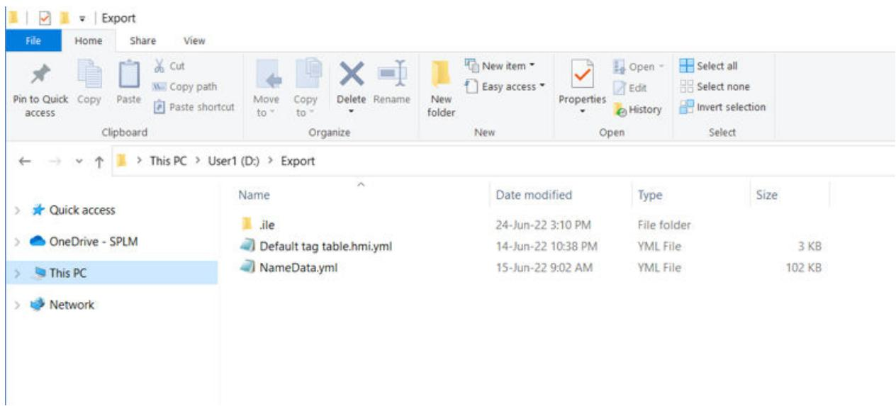

##### YAML 文件结构

YAML 文件的结构如下所示。它可以在任何简单的文本编辑器（如记事本、Microsoft word、Notepad++ 等）中打开和编辑：
整体组态将以属性名称和属性值格式显示，便于阅读和修改组态。
```yaml
#Version: 2.0
SimpleTags:
Tag_1:
AccessMode: SymbolicAccess
AcquisitionCycle: T1s
Address: 0001:TS:50.73A8C75D.C
Connection: HMI_Connection_2
ControllerDataType: 1006
DataType: Int
InitialMaxValue: 444
InitialMinValue: 44
MaxLength: 2
PlcTag: PLCTag_1
Tag_2:
AccessMode: AbsoluteAccess
AcquisitionCycle: T1s
Address: 0001:CL:%IW0
Connection: HMI_Connection_1
ControllerDataType: 1006
DataType: Int
MaxLength: 2
PlcTag: PLCTag
SymbolicAddress: '%IW0'
Tag_3:
AccessMode: SymbolicAccess
AcquisitionCycle: T1s
Address: $0001:TS:8A0E0001.CDB29A10.A.#{0}
Connection: HMI_Connection_1
ControllerDataType: 1009
DataType: DInt
MaxLength: 4
PlcTag: Data_block_1.Element1[0]
SymbolicAddress: Data_block_1.Element1[Tag_1]
Tag_4
AccessMode: SymbolicAccess
AcquisitionCycle: T1s
Address: 0001:TS:8A0E0001.CDB29A10.A.1
Connection: HMI_Connection_1
ControllerDataType: 1009
DataType: DInt
MaxLength: 4
PlcTag: Data_block_1.Element1[1]
```
属性
下表显示了 TIA Portal 中的属性名称与在 WinCCML 文件中导出的属性名称的映射：
<table><tr><td>TIA Portal 属性名称</td><td>WinCCML 属性名称</td><td>注释</td></tr><tr><td>名称</td><td>对象的标题</td><td></td></tr><tr><td>DataType</td><td>ControllerDataType</td><td>对于非内部连接,将在导入期间使用此属性为变量分配数据类型。</td></tr><tr><td>连接</td><td>连接</td><td></td></tr><tr><td>PLC 名称</td><td>源自 PLC 变量属性</td><td></td></tr><tr><td>PLC 变量</td><td>PlcTag</td><td></td></tr><tr><td>地址</td><td>SymbolicAddress</td><td>TIA Portal ES 在导入期间忽略名为“地址”(Address)的属性</td></tr><tr><td>访问模式</td><td>AccessMode</td><td></td></tr><tr><td>HMI 数据类型</td><td>DataType</td><td>对于内部连接变量,将在导入期间使用此属性为变量分配数据类型。</td></tr><tr><td>长度</td><td>MaxLength</td><td></td></tr><tr><td>采集周期</td><td>AcquisitionCycle</td><td></td></tr><tr><td>采集模式</td><td>AcquisitionMode</td><td></td></tr><tr><td>上限 2(变量)</td><td>MaxValueTag</td><td></td></tr><tr><td>下限 2(变量)</td><td>MinValueTag</td><td></td></tr><tr><td>上限 2(常数)</td><td>InitialMaxValue</td><td></td></tr><tr><td>下限 2(常数)</td><td>InitialMinValue</td><td></td></tr><tr><td>线性标定</td><td>源自 PLC/Hmi 起始/结束值</td><td>如果存在 PLC/Hmi 起始/结束值,则设置为 True</td></tr><tr><td>PLC 结束值</td><td>PLCMaxValue</td><td></td></tr><tr><td>PLC 起始值</td><td>PLCMinValue</td><td></td></tr><tr><td>HMI 结束值</td><td>HMIMaxValue</td><td></td></tr><tr><td>HMI 起始值</td><td>HMIMinValue</td><td></td></tr><tr><td>起始值</td><td>InitialValue</td><td></td></tr><tr><td>更新 ID</td><td>ID</td><td></td></tr><tr><td>保持</td><td>保持</td><td></td></tr><tr><td>替换值</td><td>SubstituteValue</td><td></td></tr><tr><td>使用替换值</td><td>SubstituteValueUsage</td><td></td></tr><tr><td>GMP 相关</td><td>GMPRelevant</td><td></td></tr></table>
5.13 HMI Unified 设备的数据访问函数 (RT Unified)
<table><tr><td>TIA Portal 属性名称</td><td>WinCCML 属性名称</td><td>注释</td></tr><tr><td>确认类型</td><td>ConfirmationType</td><td></td></tr><tr><td>需要注释</td><td>源自 ConfirmationType 值</td><td></td></tr><tr><td>适用范围</td><td>适用范围</td><td></td></tr><tr><td>注释</td><td>注释</td><td></td></tr><tr><td></td><td>地址</td><td></td></tr><tr><td></td><td>偏移</td><td></td></tr><tr><td></td><td>斜率</td><td></td></tr></table>

##### TagTable.Tags.Export() (RT Unified)

• 可访问 HMI 软件对象请参见“HMISoftware 说明 (页 748)”
要导出变量表，请修改以下程序代码：
```text
DirectoryInfo directoryInfo = new DirectoryInfo("D:\\Data Exchange");
HmiTagTableComposition tables = GetHmiSoftware(currentProject).TagTables;
HmiTagTable tagTable = tables.Find(tagTableName.Text);
\\Create a file name "ExportedTable" in specific directory by using Export() that includes the details of tag table.
IList<FileInfo> Exportresult =
tagTable.Tags.Export(directoryInfo,"ExportedTable").ToList();
```
连接到 TIA Portal (页 90)
打开项目 (页 140)
TagTable.Tags.Import() (RT Unified)
要求
• 可访问 HMI 软件对象请参见“HMISoftware 说明 (页 748)”
程序代码
要导入变量表，请修改以下程序代码：
```text
DirectoryInfo directoryInfo = new DirectoryInfo("D:\\Data Exchange");
HmiSoftware ImportHMISoftware = GetHmiSoftware(currentProject);
HmiTagTableComposition tables = ImportHMISoftware.TagTables;
HmiTagTable tagTable = tables.Find(importedTagTable.Text);
bool ImportResult = tagTable.Tags.Import(directoryInfo);
```
[连接到 TIA Portal](#连接到-TIA-Portal)
打开项目 (页 140)

#### 5.13.1.17 TagTableGroups (RT Unified)

TagTableGroups 说明 (RT Unified)
要求
```text
- 可访问 HMI 软件对象
请参见 “HMISoftware 说明 (页 748)”
```
要使用 Find() 方法访问变量表组，请修改以下程序代码：
```cs
privat void SearchTagTableGroups(HmiSoftware hmiSoftware)
{
    HmiTagTableGroupComposition tagTableGroups = hmiSoftware.TagTableGroups;
    HmiTagTableGroup tagTableGroupFindLevelOne = hmiSoftware.tagTableGroups.Find("Group_2");
    MessageBox.Show("Found at 1st level: " + tagTableGroupFindLevelOne.Name);
}
```

##### 使用变量表组

使用 TIA Portal Openness 时，可以对变量组执行以下任务：
• 创建变量表组：TagTableGroups.Create() (页 951)
• 删除变量表组：TagTableGroups.Delete() (页 952)
• 变量表组属性：访问变量表组属性 (页 952)

##### TagTableGroups.Create() (RT Unified)

• 可访问 HMI 软件对象请参见“HMISoftware 说明 (页 748)”
要通过 HmiTagTableGroupComposition 类的 Create() 方法创建变量表组(HmiTagTableGroup)，请修改以下程序代码：
```text
private void CraeteTagTableGroup(HmiSoftware hmiSoftware)
{
    HmiTagTableGroupComposition tagTableGroups = hmiSoftware.TagTableGroups;
    int count = tagTableGroups.Count;
    HmiTagTableGroup tagTableGroup1stLevel =
    hmiSoftware.TagTableGroups.Create("Group_1stLevel");
}
```
TagTableGroups.Delete() (RT Unified)
要求
• 可访问 HMI 软件对象请参见“HMISoftware 说明 (页 748)”
程序代码
要删除变量表组，请修改以下程序代码：
```cs
private void DeleteTagTableGroup(HmiSoftware hmiSoftware)
{
    HmiTagTableGroupComposition tagTableGroups = hmiSoftware.TagTableGroups;
    HmiTagTableGroup tagTableGroupFindLevelOne = hmiSoftware.TagTableGroups.Find("Group_2");
    MessageBox.Show("Found at 1st level: " + tagTableGroupFindLevelOne.Name);
    tagTableGroupFindLevelOne.Delete();
}
```

##### 访问变量表组属性 (RT Unified)

属性
变量表组中支持以下属性：
<table><tr><td>属性名称</td><td>数据类型</td><td>描述</td><td>访问</td></tr><tr><td>Name</td><td>String</td><td>指定变量表组名称</td><td>读/写</td></tr><tr><td>Groups</td><td>HmiTagTableGroupComposition</td><td>指定变量表组列表</td><td>读</td></tr><tr><td>TagTables</td><td>HmiTagTableComposition</td><td>指定变量表列表</td><td>读</td></tr></table>
要求
• 可访问 HMI 软件对象
请参见“HMISoftware 说明 (页 748)”
要访问设备变量表组的 Groups 属性，请修改以下程序代码：
```java
private void AccessTagTableGroupProperties(HmiSoftware hmiSoftware)
{
    HmiTagTableGroupComposition tagTableGroups = hmiSoftware.TagTableGroups;
    MessageBox.Show(tagTableGroups.Count.ToString());
    HmiTagTableGroupComposition tagTableGroup2ndLevel = hmiSoftware.TagTableGroups[0].Groups;
    MessageBox.Show(tagTableGroup2ndLevel.Count.ToString());
}
```

### 5.13.2 访问更多对象 (RT Unified)


#### 5.13.2.1 重命名属性和数据类型 (RT Unified)

简介
在 ES TIA Portal Opennes 中，在属性名称和数据类型中进行相应更改，使其类似于运行系统Openness 模型。
为此，在所有子系统中进行更改，例如报警、变量、连接和记录。
为了使属性及其数据类型的命名保持一致，有必要在定义其类型时使用前缀 Hmi，且属性名称不应使用此前缀。

##### 属性名称和数据类型的更改

下表列出了为使构成的名称和数据类型保持一致而需要进行的更改。
<table><tr><td>Hmi 对象名称</td><td>属性名称</td><td>属性的新名称</td><td>属性数据类型</td><td>属性的新数据类型</td></tr><tr><td>模拟量报警</td><td>AnalogAlarms</td><td>-</td><td>AnalogAlarmComposition</td><td>HmiAnalogAlarmComposition</td></tr><tr><td>离散量报警</td><td>DiscreteAlarms</td><td>-</td><td>DiscreteAlarmComposition</td><td>HmiDiscreteAlarmComposition</td></tr><tr><td>OPC UA 报警和条件类型</td><td>OpcUaAlarmTypes</td><td>-</td><td>OpcUaAlarmTypeComposition</td><td>HmiOpcUaAlarmTypeComposition</td></tr><tr><td>报警类别</td><td>AlarmClasses</td><td>-</td><td>AlarmClassComposition</td><td>HmiAlarmClassComposition</td></tr></table>
5.13 HMI Unified 设备的数据访问函数 (RT Unified)
<table><tr><td>Hmi 对象名称</td><td>属性名称</td><td>属性的新名称</td><td>属性数据类型</td><td>属性的新数据类型</td></tr><tr><td>变量表</td><td>HmiTagTables</td><td>TagTables</td><td>HmiTagTableComposition</td><td>-</td></tr><tr><td>变量</td><td>HmiTags</td><td>变量</td><td>HmiTagComposition</td><td>-</td></tr><tr><td>系统变量</td><td>HmiSystemTags</td><td>SystemTags</td><td>HmiSystemTagComposition</td><td>-</td></tr><tr><td>记录变量</td><td>LoggingTags</td><td>-</td><td>LoggingTagComposition</td><td>HmiLoggingTagComposition</td></tr><tr><td>连接</td><td>HmiConnections</td><td>Connections</td><td>HmiConnectionComposition</td><td>-</td></tr><tr><td>数据日志</td><td>DataLogs</td><td>-</td><td>DataLogComposition</td><td>HmiDataLogComposition</td></tr><tr><td>报警日志</td><td>AlarmLogs</td><td>-</td><td>AlarmLogComposition</td><td>HmiAlarmLogComposition</td></tr><tr><td>工厂对象接口</td><td>PlantObjectTags</td><td>-</td><td>PlantObjectInterfaceComposition</td><td>-</td></tr><tr><td>画面</td><td>画面</td><td>-</td><td>HmiScreenComposition</td><td>-</td></tr></table>
如果上表中“新名称”(New Name) 和“新数据类型”(New Data Type) 列中存在连字符 (-)，说明不需要任何更改。

##### HmiObject 类名称中的更改

下表列出了为使 Hmi 对象的类名称保持一致而需要进行的更改。
<table><tr><td>Hmi 对象名称</td><td>类名称</td><td>新类名称</td></tr><tr><td>模拟量报警</td><td>AnalogAlarm</td><td>HmiAnalogAlarm</td></tr><tr><td>离散量报警</td><td>DiscreteAlarm</td><td>HmiDiscreteAlarm</td></tr><tr><td>OPC UA 报警和条件类型</td><td>HmiOpcUaAlarmType</td><td>HmiOpcUaAlarmType</td></tr><tr><td>报警类别</td><td>AlarmClass</td><td>HmiAlarmClass</td></tr><tr><td>变量表</td><td>HmiTagTable</td><td>-</td></tr></table>
<table><tr><td>Hmi 对象名称</td><td>类名称</td><td>新类名称</td></tr><tr><td>变量</td><td>HmiTag</td><td>-</td></tr><tr><td>连接</td><td>HmiConnection</td><td>-</td></tr><tr><td>RuntimeSettings</td><td>RuntimeSetting</td><td>HmiRuntimeSetting</td></tr><tr><td>数据日志</td><td>DataLog</td><td>HmiDataLog</td></tr><tr><td>报警日志</td><td>AlarmLog</td><td>HmiAlarmLog</td></tr><tr><td>记录变量</td><td>LoggingTag</td><td>HmiLoggingTag</td></tr><tr><td>系统变量</td><td>HmiSystemTag</td><td>-</td></tr><tr><td>画面</td><td>HmiScreen</td><td>-</td></tr><tr><td>工厂对象接口</td><td>PlantObjectInterface</td><td>-</td></tr></table>
说明
如果上表中“新类名称”(New Class Name) 列中存在连字符 (-)，说明不需要任何更改。

#### 5.13.2.2 查询错误 (RT Unified)

可以使用 TIA Portal Openness 获取有关以下 WinCC 对象的属性的错误信息：
• 模拟量报警
• 离散量报警
• 报警类别
• 数据日志
• 报警日志
• 变量
• 连接
• 记录变量
• 设备运行系统设置
• OPC UA 报警
此功能不适用于系统变量和变量表，因为其中没有任何可能处于错误状态的属性。
• TIA Portal Openness 应用程序已连接到 TIA Portal。请[连接到 TIA Portal](#连接到-TIA-Portal)。
• 已打开一个项目。请[打开项目](#打开项目)。
• 访问 HMI 统一软件对象请参见 HMI 统一软件对象 (页 748)
修改以下程序代码以查询变量、报警、运行系统设置和画面的错误：
```cs
//For Tag
HmiSoftware hmiSoftware = GetHmiSoftware();
HmiTagComposition hmiTags = hmiSoftware.HmiTags;
HmiTag hmiTag = hmiTags.Find("Tag-1");
if(hmiTag != null)
{
    //validate method usage
    IList<HmiValidationResult> validationResult = hmiTag.Validate();
    if (validationResult = null && validationResult.Count > 0)
    {
    foreach (HmiValidationResult propertyErrors in validationResult)
    {
    //browse error for different property
    string propertyName = propertyErrors. PropertyName;
    foreach (string propertyError in propertyErrors.Errors)
    {
    //work with propertyerrors
    }
    }
    }
    }
    //For Discrete Alarm
HmiSoftware hmiSoftware = ...;
HmiDiscreteAlarmComposition discreteAlarms = hmiSoftware.DiscreteAlarms;
HmiDiscreteAlarm alarm = discreteAlarms.Find("Alarm_1");
if (alarm != null)
{
    //Validate Method Usage
    Ilist<HmiValidationResult> validationResult = alarm.Validate();
    if (validationResult != null && validationResult.Count > 0)
    {
    foreach (HmiValidationResult propertyErrors in validationResult)
    {
    //browse error for different property
    string propertyName = propertyErrors.PropertyName;
    foreach (string propertyError in propertyErrors.Errors)
    {
    //work with property errors
    }
    }
    }
    }
    //For Runtime Setting
HmiSoftware hmiSoftware = ...;
HmiRuntimeSetting runtimeSettings = hmiSoftware.RuntimeSettings;
//Validate Method Usage
Ilist<HmiValidationResult> validationResult = runtimeSettings.Validate();
if (validationResult != null && validationResult.Count > 0)
{
    foreach (HmiValidationResult propertyErrors in validationResult)
```
```cs
{
    //browse error for different property
    string propertyName = propertyErrors.PropertyName;
    foreach (string propertyError in propertyErrors.Errors)
    {
    //work with property errors
    }
    }
    // List of Many objects (Tag, Alarm, etc,)
    HmiSoftware hmiSoftware = ...;
    IList<IValidator> objectsToValidate = new List<IValidator>();
    //Put tags in validation list
    HmiTagComposition hmiTags = hmiSoftware.Tags;
    foreach (HmiTag hmiTag in hmiTags)
    {
    objectsToValidate.Add(hmiTag);
    }
    //Put alarms in validation list
    HmiDiscreteAlarmComposition discreteAlarms = hmiSoftware.DiscreteAlarms;
    foreach (HmiDiscreteAlarm discreteAlarm in discreteAlarms)
    {
    objectsToValidate.Add(discreteAlarm);
    }
    //Put RuntimeSettings in validation list
    objectsToValidate.Add(hmiSoftware.RuntimeSettings);
    foreach (IValidator validator in objectsToValidate)
    Ilist<HmiValidationResult> validationResult = validator.Validate();
    if (validationResult != null && validationResult.Count > 0)
    {
    foreach (HmiValidationResult propertyErrors in validationResult)
    {
    //browse error for different property
    string propertyName = propertyErrors.PropertyName;
    foreach (string propertyError in propertyErrors.Errors)
    {
    //work with property errors
    }
    }
    }
}
```
参见
HMISoftware 说明 (页 748)

#### 5.13.2.3 访问简单的动态内容 (RT Unified)

要求
• TIA Portal Openness 应用程序已连接到 TIA Portal。 请[连接到 TIA Portal](#连接到-TIA-Portal)”
• 已打开一个项目。
请[打开项目](#打开项目)”
• 可访问 HMI 软件对象
请参见“HMI 统一软件对象 (页 748)”
可以使用 TIA Portal Openness 通过简单的动态完全访问动态化。画面及其画面项目可以使用以下简单的动态化选项之一进行动态化：
• 范围
• 多个位
• 单个位
程序代码
5.13 HMI Unified 设备的数据访问函数 (RT Unified)
```javascript
var hmiSoftware = GetScadaHmiSoftware();
var Screen1 = hmiSoftware.Screens[0];
//Range :
var screenItem0 = Screen1.ScreenItems.First Or Default(x => x.Name == "Circle_1");
string propertyName = "BackColor";
var tagDynamization = screenItem0.Dynamizations.Where(x => x.PropertyName == propertyName).First Or Default() as TagDynamization;
var mappingTable = tagDynamization.ValueConverterАНMappingTable;
var entries = mappingTable.Entries;
mappingTable.ConditionType = ConditionType.Range;
//First Row Entry :
var rangeEntry1 = entries.Create<MappingTableEntryRange>(); //Create a new row
rangeEntry1.From = 0; // Add a From entry
rangeEntry1.To = 50; // Add a To Entry
rangeEntry1.Value = Color.Red; // Set the property value
rangeEntry1.Flashing = true; // Select the Flashing state
rangeEntry1.FlashingRate = FlashingRate.Medium; // Select the Flashing rate
rangeEntry1.AlternateValue = Color.Orange; // Select the Flashing color
//Second Row Entry :
var rangeEntry2 = entries.Create<MappingTableEntryRange>(); //Create a new row
rangeEntry2.From = 51; // Add a From entry
rangeEntry2.To = 80; // Add a To Entry
rangeEntry2.Value = Color.Yellow; // Set the property value
rangeEntry2.Flashing = true; // Select the Flashing state
rangeEntry2.FlashingRate = FlashingRate.Medium; // Select the Flashing rate
rangeEntry2.AlternateValue = Color.YellowGreen; // Select the Flashing color
//Third Row Entry :
var rangeEntry3 = entries.Create<MappingTableEntryRange>(); //Create a new row
rangeEntry3.From = 81; // Add a From entry
rangeEntry3.To = 100; // Add a To Entry
rangeEntry3.Value = Color.Green; // Set the property value
rangeEntry3.Flashing = false; // Select the Flashing state
//Fourth Row Entry :
var rangeEntry4 = entries.Create<MappingTableEntryRange>(); //Create a new row
rangeEntry4.From = 101; // Add a From entry
rangeEntry4.To = 101; // Add a To Entry
rangeEntry4.Value = Color.Green; // Set the property value
rangeEntry4.Flashing = true; // Select the Flashing state
rangeEntry4.FlashingRate = FlasingRate.Medium;
rangeEntry4.AlternateValue = Color.LightGreen;
//Second Row Entry - Bit number 4 :
var multibitEntries2 = entries.Create(BitDynamizationType.MultiBit);
var multibitEntry2 = multibitEntries2[0];
ulong multibitCondition2 = 16; // Condition = 2^(Bit No.) = 2^4 => 16
ulong multibitRelevant2 = 20; // Relevant = Decimal equivalent of no. of bits being configured = 0001 0100 => 20
multibitEntry2.Update(multibitCondition2, multibitRelevant2);
multibitEntry2.Value = Color.Green;
multibitEntry2.Flashing = false;// Single Bit
var hmiSoftware = GetScadaHmiSoftware();
```
```javascript
var Screen1 = hmiSoftware.Screens[0];
var screenItem0 = Screen1.ScreenItems.FirstOrDefault(x => x.Name == "Process control_1");
string propertyName = "Visible";
var tagDynamization = screenItem0.Dynamizations.Where(x => x.PropertyName == propertyName).FirstOrDefault() as TagDynamization;
var mappingTable = tagDynamization.ValueConverterLtappingTable;
var entries = mappingTable.Entries;
var singleBitEntries = entries.Create(BitDynamizationType.SingleBit);
mappingTable.ConditionType = ConditionType.Singlebit; // Select Condition type
//State 0 for Bit 15:
var singleBitEntry1 = singleBitEntries[0]; // Select the 1st Entry - Off State of the bitulong singlebitCondition1 = 0; // Condition value = [Bit State x 2^ Bit number] => (0 x 2^15 = 0)ulong singlebitRelevant1 = 32768; // Relevant = Decimal equivalent of the Single bit being configured = 1000 0000 0000 0000 => 32768
singleBitEntry1.Update(singlebitCondition1, singlebitRelevant1);
singleBitEntry1.Value = true;//State 1 for Bit 15:
var singleBitEntry2 = singleBitEntries[1]; // Select the 2nd Entry - ON State of the bit along singlebitCondition2 = 32768; // Condition value = [Bit State x 2^ Bit number] => (1 x 2^15 = 32768)
ulong singlebitRelevant2 = 32768; // Relevant = Decimal equivalent of the Single bit being configured = 1000 0000 0000 0000 => 32768
singleBitEntry2.Update(singlebitCondition2, singlebitRelevant2);
singleBitEntry2.Value = false;
```
```text
连接到 TIA Portal (页 90)
打开项目 (页 140)
HMISoftware 说明 (页 748)
```

#### 5.13.2.4 访问 HMI 面板的设备名称 (RT Unified)

简介
可使用 TIA Portal Openness 应用程序读取和写入统一和非统一 HMI 设备的设备名称。
属性
可访问和编辑 HMI 设备中的以下属性：
<table><tr><td>属性</td><td>数据类型</td><td>说明</td><td>访问权限</td></tr><tr><td>Name</td><td>String</td><td>HMI 设备的名称</td><td>R/W</td></tr></table>
要求
• TIA Portal Openness 应用程序已连接到 TIA Portal。请[连接到 TIA Portal](#连接到-TIA-Portal)。
• 已打开一个项目。请[打开项目](#打开项目)”
```text
Tiaproject = tiaPortal.Projects[0];
var deviceUnderTest = Tiaproject.Devices[0];
//Set
deviceUnderTest.Name = "Test1";
//Get
var deviceName = deviceUnderTest.Name;
foreach (var deviceItem in deviceUnderTest.DeviceItems)
{
//Set
deviceItem.Name = "TestDeviceItem1";
//Get
var deviceName = deviceItem.Name;
}
```

#### 5.13.2.5 访问通用工厂模型层级 (RT Unified)

使用工厂视图 (RT Unified)
简介
使用 TIA Portal Openness 时，可以执行以下有关工厂视图的任务：
• 创建工厂视图
• 删除工厂视图
• 重命名工厂视图
```text
要求
• TIA Portal Openness 已连接到 TIA Portal
请[连接到 TIA Portal](#连接到-TIA-Portal)"
• 已打开一个项目
请[打开项目](#打开项目)”
程序代码
修改以下程序代码，以创建工厂视图：
PlantViewComposition plantViews = m_tiaPortalApp.Projects[0].PlantViews;
PlantView plantView = plantViews.Create("ABCManufacturingPlant");
```
在一个项目内只能创建一个工厂视图。
修改以下程序代码，以删除或移除工厂视图：
```javascript
PlantViewComposition plantViews = m_tiaPortalApp.Projects[0].PlantViews;
PlantView plantView = plantViews.Find("ABCManufacturingPlant");
plantView.Delete();
```
修改以下程序代码，通过更新“Name”属性重命名工厂视图：
```javascript
PlantViewComposition plantViews = m_tiaPortalApp.Projects[0].PlantViews;
PlantView plantView = plantViews.Find("ABCManufacturingPlant");
plantView.Name = "New_PlantView_Name";
```
[连接到 TIA Portal](#连接到-TIA-Portal)
打开项目 (页 140)
使用工厂视图节点 (RT Unified)
简介
使用 TIA Portal Openness 时，可以执行以下有关工厂视图节点的任务：
• 创建工厂视图节点
• 删除工厂视图节点
• 重命名工厂视图节点
使用 TIA Portal Openness 的工厂视图节点中支持以下属性：
<table><tr><td>属性名称</td><td>数据类型</td><td>可访问性</td></tr><tr><td>HierarchyPath</td><td>String</td><td>R</td></tr><tr><td>PlantObject</td><td>Siemens.Engineering.HmiUnified.Cpm.PlantObject</td><td>R</td></tr><tr><td>Name</td><td>String</td><td>R/W</td></tr><tr><td>PlantView</td><td>String</td><td>R</td></tr><tr><td>ViewPath</td><td>String</td><td>R</td></tr><tr><td>PlantViewNodes</td><td>PlantViewNodeComposition</td><td>R</td></tr></table>
• TIA Portal Openness 已连接到 TIA Portal 请[连接到 TIA Portal](#连接到-TIA-Portal)”
• 已打开一个项目
请[打开项目](#打开项目)”
修改以下程序代码，以在工厂视图下创建工厂视图节点：
5.13 HMI Unified 设备的数据访问函数 (RT Unified)
修改以下程序代码，以在工厂视图节点下创建另一个工厂视图节点：
```javascript
PlantViewComposition plantViews = m_tiaPortalApp.Projects[0].PlantViews;
PlantView plantView = plantViews.Find("ABCManufacturingPlant");
PlantViewNodeComposition viewNodes = plantView.PlantViewNodes;
PlantViewNode mixingNode = viewNodes.Create("Mixing");
PlantViewNode motorNode = mixingNode.Create("Motor");
```
```text
说明可以在工厂视图或工厂视图节点内创建任意数量的工厂视图节点。
```
修改以下程序代码，以移除或删除工厂视图节点：
```javascript
PlantViewComposition plantViews = m_tiaPortalApp.Projects[0].PlantViews;
PlantView plantView = plantViews.Find("ABCManufacturingPlant");
PlantViewNode mixingNode = plantView.PlantViewNodes.Find("Mixing");
mixingNode.Delete();
```
修改以下程序代码，通过更新“Name”属性重命名工厂视图节点：
```text
PlantViewComposition plantViews = m_tiaPortalApp.Projects[0].PlantViews;
PlantView plantView = plantViews.Find("ABCManufacturingPlant");
PlantViewNodeComposition viewNodes = plantView.PlantViewNodes;
PlantViewNode mixingNode = viewNodes.Create("Mixing");
mixingNode.Name = "New_PlantViewNode_Name";
```
连接到 TIA Portal (页 90)
枚举工厂视图 (RT Unified)
简介
可使用 TIA Portal Openness 枚举 TIA Portal 中给定项目内出现的工厂视图。
5.13 HMI Unified 设备的数据访问函数 (RT Unified)
要求
```text
- TIA Portal Openness 已连接到 TIA Portal 请[连接到 TIA Portal](#连接到-TIA-Portal)”
```
• 已打开一个项目请[打开项目](#打开项目)”
修改以下程序代码，以枚举项目的所有工厂视图：
```text
PlantViewComposition plantViews = m_tiaPortalApp.Projects[0].PlantViews;
foreach (var item in plantViews)
{
    // work with plant views (currently only 1 plant view can be created inside a project)
}
```
修改以下程序代码，基于名称从工厂视图列表中查找工厂视图：
```javascript
PlantViewComposition plantViews = m_tiaPortalApp.Projects[0].PlantViews;
PlantView plantView = plantViews.Find("ABCManufacturingPlant");
```
修改以下程序代码，基于索引从工厂视图列表中查找工厂视图：
```javascript
PlantViewComposition plantViews = m_tiaPortalApp.Projects[0].PlantViews;
PlantView plantView = plantViews[0];
```
修改以下程序代码，基于所需工厂视图节点的层级路径从工厂视图列表中查找工厂视图节点：
```javascript
PlantViewComposition plantViews = m_tiaPortalApp.Projects[0].PlantViews;
PlantViewNode plantViewNode =
plantViews.FindPlantViewNode("ABCManufacturingPlan\Mixing\Motor");
```
修改以下程序代码，基于工厂视图名称从工厂视图节点列表中查找工厂视图节点：
```javascript
PlantViewNodeComposition plantViewNodes = m_tiaPortalApp.Projects[0].PlantViews[0].PlantViewNodes; PlantViewNode plantViewNode = plantViewNodes.Find("Mixing");
```
```text
连接到 TIA Portal (页 90)
打开项目 (页 140)
```
修改以下程序代码，以枚举工厂视图内可列出的所有可用工厂视图节点：
```javascript
PlantViewComposition plantViews = m_tiaPortalApp.Projects[0].PlantViews;
PlantViewNodeComposition nodes = plantView.PlantViewNodes;
foreach (var item in nodes)
{
    // work with plant view nodes inside plant view
}
修改以下程序代码，以枚举任何层级内可用的所有工厂视图节点：
```
```text
PlantViewComposition plantViews = m_tiaPortalApp.Projects[0].PlantViews;
PlantViewNodeComposition nodes = plantView.PlantViewNodes;
PlantViewNodeComposition subNodes = nodes[2].PlantViewNodes;
foreach (var item in subNodes)
{
    // work with plant view nodes inside 2nd node within the plant view
}
```
使用设备的工厂视图 (RT Unified)
```text
5.13 HMI Unified 设备的数据访问函数 (RT Unified)
```
```javascript
修改以下程序代码，以通过设置 AssignedHmiDevice 属性将设备分配给工厂视图：
PlantViewComposition plantViews = m_tiaPortalApp.Projects[0].PlantViews;
PlantView plantView = plantViews.Create("ABCManufacturingPlant");
plantView.AssignedHmiDevice = "HMI_RT_1";
修改以下程序代码，以通过为 AssignedHmiDevice 属性设置设备名称来为工厂视图更改设备：
PlantViewComposition plantViews = m_tiaPortalApp.Projects[0].PlantViews;
PlantView plantView = plantViews.Create("ABCManufacturingPlant");
plantView.AssignedHmiDevice = "HMI_RT_2";
修改以下程序代码，以通过为 AssignedHmiDevice 属性设置空白设备名称来移除用于工厂视图的设备：
PlantViewComposition plantViews = m_tiaPortalApp.Projects[0].PlantViews;
PlantView plantView = plantViews.Create("ABCManufacturingPlant");
plantView.AssignedHmiDevice = string.Empty;
```
要移除设备，请仅使用 string.empty。传递 NULL 或空格（“ ”）将被视为设备名，并将返回“未找到设备”错误消息。
[连接到 TIA Portal](#连接到-TIA-Portal)
打开项目 (页 140)

#### 5.13.2.6 访问通用工厂模型实例 (RT Unified)


##### 使用 CPM 对象实例 (RT Unified)

使用 TIA Portal Openness 时，可以执行以下与基于 CPM 类型访问 CPM 实例相关的任务：
• 创建 CPM 对象实例
• 删除 CPM 对象实例
• 重命名 CPM 对象实例
• TIA Portal Openness 已连接到 TIA Portal 请[连接到 TIA Portal](#连接到-TIA-Portal)”
• 已打开一个项目
请[打开项目](#打开项目)”
• 创建工厂
修改以下程序代码，以创建 CPM 对象实例：
```javascript
// Instance inside plant view
PlantViewComposition plantViews = m_tiaPortalApp.Projects[0].PlantViews;
PlantView plantView = plantViews.Create("ABCManufacturingPlant");
plantView.AssignedHmiDevice = "HMI_RT_1";
PlantViewNodeComposition nodes = plantView.PlantViewNodes;
PlantViewNode node = nodes.Create("ObjectLevel1", "Plant_Object_Type_1");
//Instance inside plant view node
PlantViewNode mixerObject =
plantView.PlantViewNodes.Find("Mixing").PlantViewNodes.Create("IngredientMixer", "Plant_Object_Type_1");
```
修改以下程序代码，以移除或删除 CPM 对象实例：
```javascript
PlantViewNode mixingNode = plantView.PlantViewNodes.Find("Mixing");
PlantViewNode mixerObject =
plantView.PlantViewNodes.Find("Mixing").PlantViewNodes.Find("IngredientMixer");
mixerObject.Delete();
```
修改以下程序代码，通过更新“Name”属性重命名 CPM 对象实例：
```javascript
PlantViewNode mixingNode = plantView.PlantViewNodes.Find("Mixing");
PlantViewNode mixerObject =
plantView.PlantViewNodes.Find("Mixing").PlantViewNodes.Find("IngredientMixer");
mixerObject.Name = "New_PlantViewNode_Name";
```
[连接到 TIA Portal](#连接到-TIA-Portal)
打开项目 (页 140)
使用 CPM 对象实例的工厂视图节点 (RT Unified)
使用 TIA Portal Openness 时，可以执行以下有关访问 CPM 对象实例的工厂视图节点的任务：
• 创建工厂视图节点
• 删除工厂视图节点
• 重命名工厂视图节点
要求
• TIA Portal Openness 已连接到 TIA Portal 请[连接到 TIA Portal](#连接到-TIA-Portal)”
• 已打开一个项目请[打开项目](#打开项目)”
5.13 HMI Unified 设备的数据访问函数 (RT Unified)
修改以下程序代码，以在 CPM 对象实例内创建工厂视图节点：
```javascript
PlantViewComposition plantViews = m_tiaPortalApp.Projects[0].PlantViews;
PlantView plantView = plantViews.Find("ABCManufacturingPlant");
PlantViewNode mixerObject = plantView.PlantViewNodes.Create("ObjectLevel1", "Plant_Object_Type_1");
PlantViewNode mixingNode = mixerObject.PlantViewNodes.Create("Mixing");
```
可以在 CPM 对象内创建任意数量的工厂视图节点。
修改以下程序代码，以在工厂视图节点内创建 CPM 对象实例：
```javascript
PlantViewComposition plantViews = m_tiaPortalApp.Projects[0].PlantViews;
PlantView plantView = plantViews.Find("ABCManufacturingPlant");
PlantViewNode mixingNode = plantView.PlantViewNodes.Create("Mixing");
PlantViewNode mixerObject = mixingNode.PlantViewNodes.Create("ObjectLevel1", "Plant_Object_Type_1");
```
可以在工厂视图节点内创建任意数量的 CPM 对象实例。
修改以下程序代码，以从工厂视图节点中移除或删除工厂视图节点：
```javascript
PlantViewComposition plantViews = m_tiaPortalApp.Projects[0].PlantViews;
PlantView plantView = plantViews.Find("ABCManufacturingPlant");
PlantViewNode mixerObject = plantView.PlantViewNodes.Find("ObjectLevel1");
PlantViewNode mixingNode = mixerObject.PlantViewNodes.Find("Mixing");
mixingNode.Delete();
```
修改以下程序代码，通过更新“Name”属性重命名 CPM 对象实例的工厂视图节点：
```javascript
PlantViewComposition plantViews = m_tiaPortalApp.Projects[0].PlantViews;
PlantView plantView = plantViews.Find("ABCManufacturingPlant");
PlantViewNode mixerObject = plantView.PlantViewNodes.Find("ObjectLevel1", "Plant_Object_Type_1");
PlantViewNode mixingNode = mixerObject.PlantViewNodes.Find("Mixing");
mixingNode.Name = "New_PlantViewNode_Name";
```
TIA Portal Openness API
5.13 HMI Unified 设备的数据访问函数 (RT Unified)
[连接到 TIA Portal](#连接到-TIA-Portal)
打开项目 (页 140)
枚举 CPM 对象实例的接口变量 (RT Unified)
简介
可使用 TIA Portal Openness 枚举大量 CPM 对象实例。
要求
• TIA Portal Openness 已连接到 TIA Portal 请[连接到 TIA Portal](#连接到-TIA-Portal)”
• 已打开一个项目请[打开项目](#打开项目)”
修改以下程序代码，以枚举 CPM 对象实例的所有成员：
```javascript
PlantViewComposition plantViews = m_tiaPortalApp.Projects[0].PlantViews;
PlantView plantView = plantViews[0];
PlantViewNodeComposition plantViewNodes = plantView.PlantViewNodes;
PlantViewNode plantViewNode = plantViewNodes.Find("MixerObject_1");
PlantObject plantObject = plantViewNode.PlantObject;
PlantObjectInterfaceComposition interfaces = plantObject?. PlantObjectInterfaces;
```
说明
在上述示例中，?.运算符用于空值检查
修改以下程序代码，基于“名称”从接口列表中查找接口变量：
```javascript
PlantViewComposition plantViews = m_tiaPortalApp.Projects[0].PlantViews;
PlantView plantView = plantViews[0];
PlantViewNodeComposition plantNodes = plantView.PlantViewNodes;
PlantViewNode plantViewNode = plantNodes.Find("MixerObject_1");
PlantObject plantObject = plantViewNode.PlantObject;
PlantObjectInterface interface = plantObject. PlantObjectInterfaces.Find("Interface_1");
```
```javascript
PlantViewComposition plantViews = m_tiaPortalApp.Projects[0].PlantViews;
PlantView plantView = plantViews[0];
PlantViewNodeComposition plantViewNodes = plantView.PlantViewNodes;
PlantViewNode plantViewNode = plantViewNodes.Find("MixerObject_1");
PlantObject plantObject = plantViewNode.PlantObject;
PlantObjectInterfaceComposition interfaces = plantObject.PlantObjectInterfaces;
PlantObjectInterface interface = interfaces[0];
```

#### 5.13.2.7 访问工厂对象实例接口/记录变量的属性 (RT Unified)

访问/更新 CPM 工厂对象实例的接口变量属性 (RT Unified)
简介
可使用 TIA Portal Openness 访问和更新 CPM 工厂对象实例的接口变量属性。
可访问 CPM 工厂对象实例接口变量的以下属性：
<table><tr><td>属性名称</td><td>数据类型</td><td>说明</td><td>可访问性</td></tr><tr><td>Name</td><td>System.String</td><td>接口变量的名称</td><td>R/W</td></tr><tr><td>PlcTag</td><td>System.String</td><td>与接口变量关联的PLC变量</td><td>R/W</td></tr><tr><td>Connection</td><td>System.String</td><td>接口变量连接</td><td>R/W</td></tr></table>
5.13 HMI Unified 设备的数据访问函数 (RT Unified)
<table><tr><td>属性名称</td><td>数据类型</td><td>说明</td><td>可访问性</td></tr><tr><td>PlcName</td><td>System.String</td><td>与接口变量关联的PLC名称</td><td>R</td></tr><tr><td>AccessMode</td><td>PlantObjectTagAccessMode</td><td>接口变量的访问模式</td><td>R</td></tr><tr><td>DataType</td><td>System.String</td><td>接口变量的对象类型</td><td>R</td></tr><tr><td>MaxLength</td><td>System.Int</td><td>接口变量的长度</td><td>R</td></tr><tr><td>HmiDataType</td><td>System.Int</td><td>接口变量的HMI数据类型</td><td>R</td></tr><tr><td>AcquisitionMode</td><td>PlantObjectTagAcquisitionMode</td><td>接口变量的采集模式</td><td>R/W</td></tr><tr><td>AcquisitionCycle</td><td>System.Int</td><td>接口变量的采集周期</td><td>R/W</td></tr><tr><td>Persistent</td><td>System.Boolean</td><td>CPM对象实例内部变量的保留情况</td><td>R</td></tr><tr><td>Comment</td><td>System.String</td><td>注释</td><td>R/W</td></tr><tr><td>Members</td><td>PlantObjectInterfaceMemberComposition</td><td>接口变量的成员</td><td>R</td></tr></table>
PLCTag 和连接属性仅在将 HMI 设备分配给工厂视图之后才可组态。
• TIA Portal Openness 已连接到 TIA Portal 请[连接到 TIA Portal](#连接到-TIA-Portal)”
• 已打开一个项目请[打开项目](#打开项目)”
```text
连接到 TIA Portal (页 90)
打开项目 (页 140)
```
修改以下程序代码以访问接口变量的所有属性：
```text
// Instance inside plant view node
PlantViewNode mixingNode = plantView.PlantViewNodes.Create("Mixing");
PlantViewNode mixerObject =
plantView.PlantViewNodes.Find("Mixing").PlantViewNodes.Create("IngredientMixer", "Mixer");
PlantObjectInterfaceComposition interfaceTags =
mixerObject.PlantObject.PlantObjectInterfaces;
PlantObjectInterface interfaceTag = interfaceTags.First Or Default();
string name = interfaceTag.Name;
MultilingualText comment = interfaceTag.Comment
```
修改下列程序代码，以更新接口变量的某些属性，例如注释、PLC 变量、连接、采集模式、采集周期：
```cs
// Instance inside plant view node
PlantViewNode mixingNode = plantView.PlantViewNodes.Create("Mixing");
PlantViewNode mixerObject =
plantView.PlantViewNodes.Find("Mixing").PlantViewNodes.Create("IngredientMixer", "Mixer");
PlantObjectInterfaceComposition interfaceTags =
mixerObject.PlantObject.PlantObjectInterfaces;
PlantObjectInterface interfaceTag = interfaceTags.First Or Default();
interfaceTag.Name = "New_InterfaceTag_Name";
interfaceTag.Comment.Items[0].Text = "New_InterfaceTag_Comment";
interfaceTag.AcquisitionMode = PlantObjectTagAcquisitionMode.CyclicContinuous;
interfaceTag.AcquisitionCycle = "T12s";
interfaceTag.Connection = "Connection_1";
interfaceTag.PlcTag = "PLC_Tag_1";
```
访问/更新接口变量的成员变量属性 (RT Unified)
简介
可使用 TIA Portal Openness 访问和更新接口变量的成员变量属性。
可访问接口变量的以下成员变量属性：
<table><tr><td>属性名称</td><td>数据类型</td><td>说明</td><td>可访问性</td></tr><tr><td>Name</td><td>System.String</td><td>成员变量名称</td><td>R</td></tr><tr><td>DataType</td><td>System.String</td><td>成员变量的对象类型</td><td>R</td></tr><tr><td>MaxLength</td><td>System.Int</td><td>成员变量的长度</td><td>R</td></tr><tr><td>HmiDataType</td><td>System.String</td><td>成员变量的 HMI 数据类型</td><td>R</td></tr><tr><td>InitialMinValue</td><td>PlantObjectTagLowerRange</td><td>范围值下限</td><td>R/W</td></tr><tr><td>InitialMaxValue</td><td>PlantObjectTagUpperRange</td><td>范围值上限</td><td>R/W</td></tr><tr><td>InitialValue</td><td>System.Object</td><td>初始值</td><td>R/W</td></tr><tr><td>SubstituteValue</td><td>PlantObjectTagSubstituteValue</td><td>替换值</td><td>R</td></tr><tr><td>Comment</td><td>MultilingualText</td><td>注释</td><td>R/W</td></tr><tr><td>Members</td><td>PlantObjectInterfaceMemberComposition</td><td>成员变量的成员</td><td>R</td></tr><tr><td>LoggingTags</td><td>PlantObjectLoggingTagComposition</td><td>MemberTag 的 LoggingTags</td><td>R</td></tr></table>
• TIA Portal Openness 已连接到 TIA Portal 请[连接到 TIA Portal](#连接到-TIA-Portal)”
要求
• 已打开一个项目
请[打开项目](#打开项目)”
```cs
PlantViewComposition plantViews = m_tiaPortalApp.Projects[0].PlantViews;
PlantView plantView = plantViews[0];
PlantViewNodeComposition plantViewNodeComposition = plantView.PlantViewNodes;
PlantViewNode plantViewNode = plantViewNodeComposition[0];
PlantObjectInterfaceComposition tagComposition =
plantViewNode.PlantObject.PlantObjectInterfaces;
PlantObjectInterface interfaceTag = tagComposition[0];
PlantObjectInterfaceMemberComposition memberTags = interfaceTag.Members;
PlantObjectInterfaceMember memberTag = memberTags.First Or Default();
//GetAttributes
List<string> listOfPropertyNames = new List<string>()
{
"Name"
};
var listOfPropertyValues = memberTagatureAttributes(list Of Property Names);
//SetAttributes
IEnumerable<KeyValuePair<string, object>> propertyNameValuePairList = new List<KeyValuePair<string, object>>( )
{
new KeyValuePair<string, object>("Name", "MemberTag_1");
};
memberTag.SetAttributes(property NameValuePairList);
```
修改以下程序代码以访问，以访问成员变量的所有属性：
```cs
// Instance inside plant view node
PlantViewNode mixingNode = plantView.PlantViewNodes.Create("Mixing");
PlantViewNode mixerObject =
plantView.PlantViewNodes.Find("Mixing").PlantViewNodes.Create("IngredientMixer", "Mixer");
PlantObjectInterfaceComposition interfaceTags =
mixerObject.PlantObject.PlantObjectInterfaces;
PlantObjectInterfaceMemberComposition memberTags = interfaceTag.Members;
PlantObjectInterfaceMember memberTag = memberTags.First Or Default();
string name = memberTag.Name;
string comment = memberTag.Comment.Items[0].Text;
```
修改以下程序代码，以更新 CPM 对象实例成员变量的属性：
```cs
// Instance inside plant view node
PlantViewNode mixingNode = plantView.PlantViewNodes.Create("Mixing");
PlantViewNode mixerObject =
plantView.PlantViewNodes.Find("Mixing").PlantViewNodes.Create("IngredientMixer", "Mixer");
PlantObjectInterfaceComposition interfaceTags =
mixerObject.PlantObject.PlantObjectInterfaces;
PlantObjectInterfaceMember memberTag = memberTags.FirstOrDefault();
memberTag.Comment.Items[0].Text = "New_MemberTag_Comment";
memberTag.InitialValue = 2;
memberTag.InitialMinValue.Value = 2;
memberTag.InitialMinValue.ValueType = PlantObjectTagLimitValueType.Constant;
memberTag.InitialMaxValue.Value = 2;
memberTag.InitialMaxValue.ValueType = PlantObjectTagLimitValueType.Constant;
```
修改以下程序代码，以更新 CPM 对象实例成员变量的所有记录变量：
```cs
// Instance inside plant view node
PlantViewNode mixingNode = plantView.PlantViewNodes.Create("Mixing");
PlantViewNode mixerObject =
plantView.PlantViewNodes.Find("Mixing").PlantViewNodes.Create("IngredientMixer", "Mixer");
PlantObjectInterfaceComposition interfaceTags =
mixerObject.PlantObject.PlantObjectInterfaces;
PlantObjectInterface interfaceTag = interfaceTags.First Or Default();
PlantObjectInterfaceMemberComposition memberTags = interfaceTag.Members;
PlantObjectInterfaceMember memberTag = memberTags.First Or Default();
PlantObjectLoggingTagComposition loggingTags = memberTag LoggingTags;
PlantObjectLoggingTag loggingTag = loggingTags.First Or Default();
```
连接到 TIA Portal (页 90)
```text
打开项目 (页 140)
```
访问/更新成员变量的记录变量属性 (RT Unified)
可使用 TIA Portal Openness 访问 CPM 对象实例内成员变量的记录变量。
可在 CPM 对象实例内成员变量的记录变量中访问以下属性：
<table><tr><td>属性名称</td><td>数据类型</td><td>说明</td><td>可访问性</td></tr><tr><td>AggregationDelay</td><td>System.TimeSpan</td><td>汇总延迟值</td><td>R</td></tr><tr><td>AggregationMode</td><td>PlantObjectLoggingTagAggregationMode</td><td>汇总模式值</td><td>R</td></tr><tr><td>Cycle</td><td>System.String</td><td>记录变量的记录周期</td><td>R</td></tr><tr><td>CycleFactor</td><td>System UInt32</td><td>记录周期因数值</td><td>R</td></tr><tr><td>DataLog</td><td>System.String</td><td></td><td>R</td></tr><tr><td>Source</td><td>System.string</td><td>源记录变量</td><td>R</td></tr><tr><td>TriggerMode</td><td>PlantObjectLoggingTagTriggerMode</td><td>记录变量的 TriggerMode</td><td>R</td></tr><tr><td>TriggerTag</td><td>System.String</td><td>TriggerTag 值</td><td>R</td></tr><tr><td>TriggerTagBitNumber</td><td>System UInt32</td><td>TriggerTagBitNumber 值</td><td>R</td></tr><tr><td>Name</td><td>System.string</td><td>记录变量的名称</td><td>R</td></tr><tr><td>LogConfiguration</td><td>System.String</td><td>记录变量的数据日志</td><td>R</td></tr><tr><td>LoggingMode</td><td>PlantObjectLoggingTagLoggingMode</td><td>记录变量的记录模式</td><td>R</td></tr><tr><td>SmoothingMode</td><td>PlantObjectLoggingTagSmoothingMode</td><td>记录变量的滤波模式</td><td>R</td></tr><tr><td>SmoothingMinTime</td><td>System.TimeSpan</td><td>记录变量的最短时间</td><td>R</td></tr><tr><td>SmoothingMaxTime</td><td>System.TimeSpan</td><td>记录变量的最长时间</td><td>R</td></tr><tr><td>SmoothingDeltaValue</td><td>System.Double</td><td>记录变量的增量</td><td>R</td></tr><tr><td>LimitScope</td><td>PlantObjectLoggingTagLimitScope</td><td>记录变量的限值范围</td><td>R</td></tr><tr><td>HighLimit</td><td>System.Object</td><td>记录变量的上限</td><td>R</td></tr><tr><td>LowLimit</td><td>System.Object</td><td>记录变量的下限</td><td>R</td></tr></table>
• TIA Portal Openness 已连接到 TIA Portal 请[连接到 TIA Portal](#连接到-TIA-Portal)”
• 已打开一个项目请[打开项目](#打开项目)”
修改以下程序代码，以访问记录变量的所有属性：
```text
// Instance inside plant view node
PlantViewNode mixingNode = plantView.PlantViewNodes.Create("Mixing");
PlantViewNode mixerObject =
plantView.PlantViewNodes.Find("Mixing").PlantViewNodes.Create("IngredientMixer", "Mixer");
PlantObjectInterfaceMemberComposition interfaceTags =
mixerObject.PlantObject.PlantObjectInterfaceMembers;
PlantObjectInterfaceMember interfaceTag = interfaceTags.FirstOrDefault();
PlantObjectInterfaceMemberComposition memberTags = interfaceTag.Members;
PlantObjectInterfaceMember memberTag = memberTags.FirstOrDefault();
PlantObjectLoggingTagComposition loggingTags = memberTag規定;
PlantObjectLoggingTag loggingTag = loggingTags.FirstOrDefault();
string name = loggingTag.Name;
object lowLimit = loggingTag.LowLimit;
```
将无法更新关联到 CPM 对象实例记录变量的 PlantObjectLoggingTag 类的任何属性。
连接到 TIA Portal (页 90)
打开项目 (页 140)

#### 5.13.2.8 检查访问 Unified 设备的许可证 (RT Unified)

可使用 TIA Openness 接口检查任何 Openness 客户端应用程序是否存在 WinCC Unified 许可证，这样客户端应用程序便无法使用 Openness 接口绕过许可。
仅当 HMI Unified许可证不可用时，才能浏览 HMI Unified设备及其所有基础对象（例如，变量、报警、画面等）。设备级上的任何其它操作（例如，创建、查找、删除）都会导致从Openness API 返回 LicenseNotFoundException。
对于 HMI Unified 软件，如果许可证无效，则将返回 LicenseNotFoundException。
• TIA Portal Openness 应用程序已连接到 TIA Portal 请[连接到 TIA Portal](#连接到-TIA-Portal)”
• 已打开一个项目请[打开项目](#打开项目)”
• 可访问 HMI 软件对象请参见“HMI 统一软件对象 (页 748)”
如果在许可证不可用时修改以下程序代码来访问设备或设备子系统，则会返回LicenseNotFoundException：
```cs
private static void ListDevices(Project project)
{
foreach (var device in project.Devices)
{
ListDeviceItem(device);
}
}
private static void ListDeviceItem(Device device)
{
try
{
Console.Write("HMI device - " + device.Name);
foreach (var item in device.DeviceItems)
{
Console.WriteLine("HMI device type - " + item.TypeIdentifier);
var softContainer = item.GetService<SoftwareContainer>();
if (softContainer != null)
{
var softTarget = softContainer.Software;
}
if (softTarget != null)
{
Console.WriteLine("HMI device software - " + softTarget.Name);
}
}
catch (Exception ex)
{
Console.WriteLine(ex.Message);
}
```
Openness：用于工程组态工作流自动化的 API系统手册, 11/2023
5.13 HMI Unified 设备的数据访问函数 (RT Unified)
在访问上述程序代码时，softTarget 将为空，并且将无法访问报警、变量等子系统。
如果在许可证可用时修改以下程序代码来访问设备或设备子系统，则会返回空值：
```cs
private static void ListDevices(Project project)
{
foreach (var device in project.Devices)
{
ListDeviceItem(device);
}
}
private static void ListDeviceItem(Device device)
{
Console.Write("HMI device - " + device.Name);
foreach (var item in device.DeviceItems)
{
Console.WriteLine("HMI device type - " + item.TypeIdentifier);
var softContainer = item.GetService<SoftwareContainer>();
if (softContainer != null)
{
var softTarget = softContainer.Software;
}
if (softTarget != null)
{
Console.WriteLine("HMI device software - " + softTarget.Name);
}
}
```
在访问上述程序代码时，softTarget 将包含设备容器，并且可以访问报警、变量等子系统。
连接到 TIA Portal (页 90)
HMISoftware 说明 (页 748)

#### 5.13.2.9 获取 WinCC Unified 的交叉引用 (RT Unified)

可以使用 TIA Portal Openness 提供有关适用 WinCC Unified 对象的交叉引用信息。OpennessAPI 返回 CrossReferenceResult，其提供交叉引用用户界面的文本值和适用 WinCC Unified 对象的实际 IEngineeringObject。
交叉引用将尝试提供 WinCC Unified对象本身，可以在该对象上执行相应 TIA Portal Openness对象支持的附加操作。
• TIA Portal Openness 应用程序已连接到 TIA Portal。 请[连接到 TIA Portal](#连接到-TIA-Portal)”
• 已打开一个项目。
请[打开项目](#打开项目)”
• 访问 HMI 软件对象
请参见 HMI 统一软件 (页 748)
有关 WinCC Unified 对象支持的属性列表的信息，请参见“为 Step7 获取 CrossReference(页 510)”中的属性
5.13 HMI Unified 设备的数据访问函数 (RT Unified)
程序代码
```cs
Public void GetCrossReferences()
{
    CrossReferenceService crossReferenceService =
    HmiScreen.GetService<CrossReferenceService>();
    CrossReferenceResult rootResultObject =
    crossReferenceService.GetCrossReferences(CrossReferenceFilter.AllObjects);
    SourceObjectComposition rootResultSourceObjects = rootResultObject.Sources; //The API returns a single source object but the type is a composition.
    foreach (SourceObject sourceObject in rootResultSourceObjects)
    {
    //Get the source object references
    ReferenceObjectComposition referenceObjects = source.References;
    PrintReferences(referenceObjects);
    }
    }
    Private void PrintReferences(ReferenceObjectComposition referenceObjects)
    {
    foreach (ReferenceObject referenceObject in referenceObjects)
    {
    // Needs similar casting for each type as seen in source object example snippet if (source.UnderlyingObject != null && source.UnderlyingObject is HmiScreenItemBase)
    {
    var hmiScreenItem= source.UnderlyingObject as HmiScreenItem;
    //Perform actions on hmiScreenItem.
    }
    //No other attributes are available from the IEngineeringObject. All the remaining values must be given from crossreference separately via ReferenceObject EOM.
    Console.WriteLine(referenceObject.Name);
    Console.WriteLine(referenceObject.Address);
    Console.WriteLine(referenceObject_TYPEName);
    Console.WriteLine(referenceObject.Device);
    Console.WriteLine(referenceObject.Path);
    LocationComposition locations = referenceObject.Locations;
    //Looping through ReferenceLocations
    {
    Console.WriteLine(location.Name);
    Console.WriteLine(location.ReferenceLocation);
    Console.WriteLine(location.ReferenceType);
    Console.WriteLine(location.Access);
    if(location.ReferencedAs is Tag)
    {
    var referencedAsObject = location.ReferencedAs as Tag;
    }
    //Needs similar casting for each type as seen in source object example snippet
    Console.WriteLine(location.ReferencedAsName);
    Console.WriteLine(location.Address);
    Console.WriteLine(location_TYPEName);
    }
}
```
获取 Step7 的交叉引用 (页 510)
连接到 TIA Portal (页 90)
打开项目 (页 140)
HMISoftware 说明 (页 748)

#### 5.13.2.10 使用脚本处理画面/画面项的动态化和事件 (RT Unified)

使用 TIA Portal Openness 时，可以对脚本执行以下任务，以组态画面/画面项的属性动态化和事件：
• 创建脚本动态化
• 枚举脚本动态化
• 删除脚本动态化
• 访问脚本动态化的属性
• 访问触发器的属性
• 检查语法
• TIA Portal Openness 应用程序已连接到 TIA Portal。 请[连接到 TIA Portal](#连接到-TIA-Portal)”
• 已打开一个项目
请[打开项目](#打开项目)”
• 可访问 HMI 统一软件对象
请参见“HMI 统一软件对象 (页 748)”
使用画面/画面项的脚本动态化时，可修改和使用以下程序代码示例。

##### 创建脚本动态化

修改以下程序代码以针对属性创建脚本动态化：
```typescript
public DynamizationBase Create<DynamizationBase>(string propertyName);
HmiScreen screen = m_hmisoftware.Screen[0];
DynamizationBaseComposition dyns = screen.Dynamizations;
ScriptDynamization scriptDynamic = dyns.Create<ScriptDynamization>("BackColor");
```

##### 枚举脚本动态化

修改以下程序代码以针对属性枚举脚本动态化：
```cs
public DynamizationBase Find(string propertyName);
HmiScreen screen = m_hmiSoftware.Screens[0];
DynamizationBaseComposition dyns = screen.Dynamizations;
if (dyns is ScriptDynamization)
{
ScriptDynamization scriptDynamic = (ScriptDynamization)dyns.Find("BackColor");
}
```

##### 删除脚本动态化

修改以下程序代码以针对属性删除脚本动态化：
```javascript
HmiScreen screen = m_hmiSoftware.Screens[0];
DynamizationBaseComposition dyns = screen.Dynamizations;
if (dyns is ScriptDynamization)
ScriptDynamization scriptDynamic = (ScriptDynamization)dyns.Find("BackColor");
scriptDynamic.Delete();
```
5.13 HMI Unified 设备的数据访问函数 (RT Unified)

##### 访问脚本动态化的属性

修改以下程序代码以获取和设置脚本动态化的属性：
```text
HmiScreen screen = m_hmiSoftware.Screens[0];
DynamizationBaseComposition dyns = screen.Dynamizations;
foreach (DynamizationBase dynamic in dyns)
{
    if (dynamic.DynamizationType == DynamizationType.Script)
    {
    ScriptDynamization scriptDynamization = (ScriptDynamization)dynamic;
    scriptDynamization.Async = true;
    scriptDynamization.GlobalDefinitionAreaScriptCode = @"Add(parameter1, parameter2)";
    scriptDynamization.ScriptCode = @"
    var value;
    let tag1 = Tags('Tag_1');
    let tagValue1 = tag1.Read();
    HMIRuntime.Trace('value of MyTag1: ' + tagValue1);
    return value; ";
    Trigger triggerObj = scriptDynamization.Trigger;
    }
}
```

##### 访问触发器的属性

修改以下程序代码以获取和设置触发器的属性：
```cs
HmiScreen screen = m_hmiSoftware.Screens[0];
DynamizationBaseComposition dyns = screen.Dynamizations;
foreach (DynamizationBase dynamic in dyns)
{
    if (dynamic.DynamizationType == DynamizationType.Script)
    {
    ScriptDynamization scriptDynamization = (ScriptDynamization)dynamic;
    // Property write
    scriptDynamization.Trigger.Type = TriggerType.CustomCycle;
    scriptDynamization.Trigger.CustomDuration = "T500ms";
    scriptDynamization.Trigger.Tags = new List<string>() { "Tag_1" };
    // Property read
    Console.WriteLine(scriptDynamization.Trigger.Type);
    Console.WriteLine(scriptDynamization.Trigger.CustomDuration);
    Console.WriteLine(scriptDynamization.Trigger.Tags);
    }
}
```

##### 语法检查

修改以下程序代码，使用脚本动态化的 SyntaxCheck 方法检查脚本代码或全局脚本代码的语法：
```text
HmiScreen screen = m_hmiSoftware.Screens[0];
DynamizationBaseComposition dyns = screen.Dynamizations;
foreach (DynamizationBase dynamic in dyns)
{
    if (dynamic.DynamizationType == DynamizationType.Script)
    {
    ScriptDynamization scriptDynamization = (ScriptDynamization)dynamic;
    scriptDynamization.ScriptCode = @"var value; let tag1 = Tags('Tag_1');
    let tagValue1 = tag1.Read();
    HMIRuntime.Trace('value of MyTag1: ' + tagValue1);
    return value; ";
    HmiValidationResult syntaxCkResult = scriptDynamization SyntaxCheck();
    IEnumerable<string> error = syntaxCkResult.Errors;
    IEnumerable<string> warnings = syntaxCkResult.Warning;
    }
}
```
如果指定属性不支持相应动态化，则将产生 Create - Recoverable exception 。如果在属性设置期间，设置操作无法成功进行一致性检查，则会产生 Recoverable exception。
连接到 TIA Portal (页 90)
打开项目 (页 140)
HMISoftware 说明 (页 748)

#### 5.13.2.11 对画面/画面项进行动态化 (RT Unified)

使用 TIA Portal Openness 时，可以对画面/画面项的动态化功能执行以下任务：
• 针对属性创建动态化
• 针对属性枚举动态化
5.13 HMI Unified 设备的数据访问函数 (RT Unified)
• 针对属性删除动态化
• 访问动态化的常见属性
• 访问变量动态化的属性
• 访问闪烁动态化的属性
• 访问资源列表动态化的属性
要在组成部分级别针对属性访问动态化，需要访问相应的控制部分。有关部分信息，请参见“访问趋势控件的属性 (页 90)”
• TIA Portal Openness 应用程序已连接到 TIA Portal 请[连接到 TIA Portal](#连接到-TIA-Portal)”
• 已打开一个项目
请[打开项目](#打开项目)”
• 可访问 HMI 软件对象
请参见“HMI 统一软件对象 (页 748)”
使用画面/画面项的动态化时，可修改和使用以下程序代码示例。
针对属性创建动态化
修改以下程序代码以针对属性创建动态化：
```dart
HmiScreen screen = m_hmiSoftware.Screens[0];
DynamizationBaseComposition dyns = screen.Dynamizations;
// Flashing dynamization
FlashingDynamization FlashingDyn = dyns.Create<FlashingDynamization>("BackColor");
// ResourceList dynamization
ResourceListDynamization ResListDyn = dyns.Create<ResourceListDynamization>("DisplayName");
// Tag dynamization
TagDynamization tagDyn = dyns.Create<TagDynamization>("Width");
```

##### 针对属性枚举动态化

修改以下程序代码以针对属性枚举动态化：
```text
HmiScreen screen = m_hmiSoftware.Screens[0];
DynamizationBaseComposition dyns = screen.Dynamizations;
// Flashing dynamization
FlashingDynamization FlashDyn = (FlashingDynamization)dyns.Find("BackColor");
// ResourceList dynamization
ResourceListDynamization resourceDyn = (ResourceListDynamization)dyns.Find("DisplayName");
// Tag dynamization
TagDynamization tagDyn = (TagDynamization)dyns.Find("Width");
```

##### 针对属性删除动态化

修改以下程序代码以针对属性删除动态化：
```text
public void Delete ()
HmiScreen screen = m_hmiSoftware.Screens[0];
DynamizationBaseComposition dyns = screen.Dynamizations;
DynamizationBase dynamization = dyns.Find("BackColor");
dynamization.Delete();
```

##### 访问动态化的常见属性

修改以下程序代码以获取动态化的常见属性：
```matlab
HmiSoftware m_hmiSoftware = ..;
DynamizationBaseComposition screenDynamizations = m_hmiSoftware.Screens[0].Dynamizations;
DynamizationBase screenDynamization = screenDynamizations.Find("BackColor");
string propertyName = screenDynamization.PropertyName;
DynamizationType dynamizationType = screenDynamization.DynamizationType;
```
5.13 HMI Unified 设备的数据访问函数 (RT Unified)

##### 访问变量动态化的属性

修改以下程序代码以获取和设置变量动态化的属性：
```text
HmiScreen screen = m_hmiSoftware.Screens[0];
TagDynamization tagDynamization = (TagDynamization)screen.Dynamizations.Find("Width");
foreach (DynamizationBase dynamization in screen.Dynamizations)
{
    if (dynamization.DynamizationType == DynamizationType.Tag)
    {
    TagDynamization TagDynamization = (TagDynamization)dynamization;
    TagDynamization.Tag = "HmiTagName";
    TagDynamization.UseIndirectAddressing = true;
    TagDynamization.ReadOnly = true;
    }
}
```

##### 访问闪烁动态化的属性

修改以下程序以获取和设置闪烁动态化的属性：
```cs
HmiScreen screen = m_hmiSoftware.Screens[0];
foreach (DynamizationBase dynamization in screen.Dynamizations)
{
    if (dynamization.DynamizationType == DynamizationType.Flashing)
    {
    FlashingDynamization flashingDynamization = (FlashingDynamization)dynamization;
    flashingDynamization.AlternateColor = Color.Beige;
    flashingDynamization.Color = Color.FromArgb(12, 22, 152, 200);
    flashingDynamization.FlashingCondition = FlashingCondition.Always;
    flashingDynamization.FlashingRate = FlashingRate.Medium;
    }
}
```

##### 访问资源列表动态化的属性

修改以下程序代码以获取和设置资源列表动态化的属性
```text
HmiScreen screen = m_hmiSoftware.Screens[0];
foreach (DynamizationBase dynamization in screen.Dynamizations)
{
    if (dynamization.DynamizationType == DynamizationType.ResourceList)
    {
    ResourceListDynamization resourceListDyn = (ResourceListDynamization)dynamization;
    resourceListDyn.Tag = "Tag name";
    resourceListDyn.ResourceList = "Resource list name";
    }
}
```
如果指定属性不支持相应动态化，则将产生 Create - Recoverable exception。如果在属性设置期间，设置操作无法成功进行一致性检查，则会产生 Recoverable exception。
连接到 TIA Portal (页 90)
打开项目 (页 140)
HMISoftware 说明 (页 748)

## 5.14 版本控制接口的功能


### 5.14.1 访问项目中的 VCI 系统组

• Openness 应用程序已连接 TIA Portal。 [连接到 TIA Portal](#连接到-TIA-Portal)”
• 项目已经打开。[打开项目](#打开项目)”
通过作为服务的项目中的 VersionControlInterface，可使用 TIA Portal Openness 访问 VCI 系统组。VersionControlInterface 是服务，将返回非空对象。
修改以下程序代码以检索 VersionControlInterface: 中的工作区系统组：
```text
public void function01()
{
    //Accessing VCI system group in project
    Siemens.Engineering.Project project = tiaPortal.Projects[0];
    Siemens.Engineering.VersionControl.VersionControlInterface versionControlInterface = project.GetService<VersionControlInterface>();
    Siemens.Engineering.VersionControl.WorkspaceSystemGroup workspaceSystemGroup = versionControlInterface.WorkspaceGroup;
}
```

### 5.14.2 枚举 VCI 组中的用户组

要求
• Openness 应用程序已连接 TIA Portal。
[连接到 TIA Portal](#连接到-TIA-Portal)”
• 项目已经打开。
[打开项目](#打开项目)”
修改以下程序代码以枚举其它 VCI 工作区组中的所有 VCI 工作区用户组。
```text
WorkspaceUserGroup workspaceGroup = ...;
WorkspaceUserGroupComposition userGroupComposition = workspaceGroup.Groups;
foreach (Siemens.Engineering.VersionControl.WorkspaceUserGroup workspaceUserGroup in userGroupComposition)
{
    //...
}
```
修改以下程序代码以访问其它 VCI 工作区组中的个别工作区用户组：
```text
WorkspaceUserGroup workspaceGroup = ...;
Siemens.Engineering.VersionControl.WorkspaceUserGroup workspaceUserGroup = workspaceGroup.Groups.Find("Some Group Name");
```
[连接到 TIA Portal](#连接到-TIA-Portal)
打开项目 (页 140)

### 5.14.3 在 VCI 组中创建 VCI 用户组

• Openness 应用程序已连接 TIA Portal。 [连接到 TIA Portal](#连接到-TIA-Portal)”
• 项目已经打开。[打开项目](#打开项目)”
可使用 TIA Portal Openness 在工作区组中创建工作区用户组。
修改以下程序代码，以创建工作区用户组：
```cs
Project project = ...;
//Creating VCI user group in VCI group
VersionControlInterface versionControlInterface =
project.GetService<VersionControlInterface>();
WorkspaceSystemGroup workspaceGroupComposition = versionControlInterface.WorkspaceGroup;
WorkspaceUserGroup result =
workspaceGroupComposition.Groups.Create("NewWorkspaceUserGroup");
```
要按名称创建新工作区用户组，要求提供的名称有效，且提供的名称尚不存在于其它工作区用户组中

### 5.14.4 更新 VCI 组特性

要求
• Openness 应用程序已连接 TIA Portal。 [连接到 TIA Portal](#连接到-TIA-Portal)”
• 项目已经打开。
[打开项目](#打开项目)”
简介
可使用 TIA Portal Openness 更新工作区用户组的特性。
可更新工作区组的以下特性：
<table><tr><td>特性名称</td><td>返回类型</td><td>描述</td><td>可访问性</td></tr><tr><td>Name</td><td>System.String</td><td>工作区用户组名称</td><td>读/写</td></tr></table>
修改以下程序代码，以更新工作区用户组名称：
```javascript
//Updating VCI group properties
var workspaceUserGroup = ...;
workspaceUserGroup.Name = "New_Group_Name";
```

### 5.14.5 删除 VCI 用户组

要求
• Openness 应用程序已连接 TIA Portal。
[连接到 TIA Portal](#连接到-TIA-Portal)”
• 项目已经打开。
[打开项目](#打开项目)”
可使用 TIA Portal Openness 删除工作区用户组。删除工作区用户组时，将同时删除工作区用户组中包含的其它所有对象，包括其它工作区用户组和 VCI 工作区。
程序代码
修改以下程序代码，以删除工作区用户组：
```javascript
//Deleting VCI user group
WorkspaceUserGroup workspaceUserGroup = ...;
workspaceUserGroup.Delete();
```

### 5.14.6 枚举 VCI 组中的 VCI 工作区

要求
• Openness 应用程序已连接 TIA Portal。 [连接到 TIA Portal](#连接到-TIA-Portal)”
• 项目已经打开。
请[打开项目](#打开项目)”
修改以下程序代码以枚举 VCI 组中的所有 VCI 工作区：
```text
WorkspaceSystemGroup workspaceSystemGroup = ...;
WorkspaceComposition workspaceComposition = workspaceSystemGroup.Workspaces;
foreach (Siemens.Engineering.VersionControl.Workspace workspace in workspaceComposition)
{
    //...
}
```
要按名称查找特定工作区，则需修改以下程序代码：
```cs
WorkspaceUserGroup workspaceUserGroup = ...;
//Enumerating VCI workspaces in VCI group 02
Siemens.Engineering.VersionControl.Workspace workspace =
workspaceUserGroup.Workspaces.Find("SomeWorkspaceName");
```

## 5.14 版本控制接口的功能

[连接到 TIA Portal](#连接到-TIA-Portal)

### 5.14.7 在 VCI 组中创建 VCI 工作区

要求
• Openness 应用程序已连接 TIA Portal。 [连接到 TIA Portal](#连接到-TIA-Portal)”
• 项目已经打开。[打开项目](#打开项目)”
```text
可使用 TIA Portal Openness 在工作区用户组中创建工作区。
可使用创建操作创建 Siemens.Engineering.VersionControl.Workspace:
Siemens.Engineering.VersionControl.WorkspaceComposition.Create(string name)
```
程序代码
修改以下程序代码，以创建工作区：
```cs
Project project = ...;
WorkspaceUserGroup workspaceUserGroup = ...;
//Creating VCI workspace in VCI group
VersionControlInterface versionControlInterface =
project.GetService<VersionControlInterface>();
WorkspaceComposition workspaceComposition =
versionControlInterface.WorkspaceGroup.Workspaces;
Workspace result = workspaceComposition.Create("NewWorkspace");
```
要按名称创建新工作区，要求提供的名称有效，且名称尚不存在于其它工作区用户组中。## 5.14.8 更新 VCI 工作区特性
• Openness 应用程序已连接 TIA Portal。 [连接到 TIA Portal](#连接到-TIA-Portal)”
• 项目已经打开。
[打开项目](#打开项目)”
可使用 TIA Portal Openness 更新 VCI 工作区的特性。
可更新工作区的以下特性：
<table><tr><td>特性名称</td><td>返回类型</td><td>描述</td><td>可访问性</td></tr><tr><td>Name</td><td>System.String</td><td>工作区名称。</td><td>读/写</td></tr><tr><td>RootPath</td><td>System.IO.DirectoryInfo</td><td>组态的工作区路径。</td><td>读/写</td></tr></table>

#### 程序代码：更新名称特性

修改以下程序代码，以更新工作区的“Name”特性：
```javascript
var workspace = ...;
workspace.Name = "New_Workspace_Name";
```

#### 程序代码：更新根路径特性

修改以下程序代码，以将工作区路径组态为根目录信息。将该值设为 null 可取消组态工作区根路径。
```text
var workspace = ...;
workspace.RootPath = new DirectoryInfo(@"D:\Project_WS");
```
5.14 版本控制接口的功能
修改以下程序代码，以取消组态工作区：
```text
var workspace = ...;
workspace.RootPath = ...;
```

### 5.14.9 删除 VCI 工作区

要求
• Openness 应用程序已连接 TIA Portal。
[连接到 TIA Portal](#连接到-TIA-Portal)”
• 项目已经打开。
[打开项目](#打开项目)”
简介
可使用 TIA Portal Openness 删除工作区。删除工作区时，还会同时删除所有工作区映射。
程序代码
修改以下程序代码以删除工作区：
```text
//Deleting VCI workspace
Workspace workspace = ...;
workspace.Delete();
```

### 5.14.10 枚举 VCI 中的 VCI 工作区映射

要求
• Openness 应用程序已连接 TIA Portal。
[连接到 TIA Portal](#连接到-TIA-Portal)”
• 项目已经打开。
[打开项目](#打开项目)”
```cs
程序代码
修改以下程序代码以枚举工作区中的所有 VCI 工作区映射：
var workspace = ...;
WorkspaceMappingComposition mappings = workspace.Mappings;
foreach (Siemens.Engineering.VersionControl.WorkspaceMapping workspaceMapping in mappings)
{
    //...
}
修改以下程序代码以访问特定工程组态对象的个别工作区映射：
PlcBlock block = ...;
var workspace = ...;
IEngineeringObject versionControlSupportedEngineeringObject = block;
Siemens.Engineering.VersionControl.WorkspaceMapping workspaceMapping = workspace.Mappings.Find(versionControlSupportedEngineeringObject);
```
IEngineeringObject 接口由 IEngineeringCompositionObject 和 IEngineeringInstance 派生而 来。有关 IEngineeringObject 的信息，请[动态特性](#动态特性)”
连接到 TIA Portal (页 90)
打开项目 (页 140)

### 5.14.11 在 VCI 工作区中创建 VCI 工作区映射

• Openness 应用程序已连接 TIA Portal。 [连接到 TIA Portal](#连接到-TIA-Portal)”
• 项目已经打开。[打开项目](#打开项目)”
简介
可使用 TIA Portal Openness 在 VCI 工作区中创建工作区映射。
可使用创建操作签名创建 Siemens.Engineering.VersionControl.WorkspaceMapping：
```text
Siemens.Engineering.VersionControl.WorkspaceMappingComposition.Create(string relativeWorkspacePath, IEngineeringObject linkedProjectObject)
```
修改以下程序代码，以创建工作区映射：
```text
//Creating VCI workspace mapping in VCI workspace
var workspace = ...;
var plcBlock = ...;
var result = workspace.Mappings.Create(@"\TestCopy\Block_1.xml", plcBlock);
```
以下情况下，将抛出可恢复异常：
• 链接的对象不是有效的 VCI 支持的对象
• 链接的对象已映射。
• 相对文件路径包含无效文件字符。
• 相对文件路径包含父目录导航。

### 5.14.12 更新 VCI 工作区映射特性

• Openness 应用程序已连接 TIA Portal。 [连接到 TIA Portal](#连接到-TIA-Portal)”
• 项目已经打开。
[打开项目](#打开项目)”
可使用 TIA Openness Portal 更新 VCI 工作区映射的特性。
工作区映射提供以下特性。
<table><tr><td>特性名称</td><td>返回类型</td><td>描述</td><td>可访问性</td></tr><tr><td>RelativeWorkspacePath</td><td>System.String</td><td>源控制中已链接对象表示的相对文件路径。</td><td>读/写</td></tr><tr><td>LinkedProjectObject</td><td>IEngineeringObject</td><td>兼容链接到源控制中文件的VCI的工程组态对象</td><td>读</td></tr></table>
修改以下程序代码，以更新工作区映射的相对文件路径：
```javascript
//Updating VCI workspace mapping properties
var workspaceMapping = ...;
workspaceMapping.RelativeWorkspacePath = @"\Test\NewBlock_1.xml";
```

### 5.14.13 删除 VCI 工作区映射

• Openness 应用程序已连接 TIA Portal。 [连接到 TIA Portal](#连接到-TIA-Portal)”
• 项目已经打开。
[打开项目](#打开项目)”
可使用 TIA Portal Openness 删除 VCI 工作区映射。
修改以下程序代码，以删除 VCI 工作区映射：
```text
//Deleting VCI workspace mapping
WorkspaceMapping workspaceMapping = ...;
workspaceMapping.Delete();
```

### 5.14.14 同步工作区映射

• Openness 应用程序已连接 TIA Portal。 [连接到 TIA Portal](#连接到-TIA-Portal)”
• 项目已经打开。
[打开项目](#打开项目)”
可使用 TIA Portal Openness 查看同步工作区映射的状态。

#### 程序代码：个别对象同步状态

可查看操作时必须先从工作空间映射请求 Siemens.Engineering.VersionControl.WorkspaceMapping.IndividualObjectSynchronizatio nStatus 的个别对象的状态、更新状态和同步状态
建议在对个别对象同步服务调用操作之前执行 null 检查，因为该映射可能支持、也可能不支持个别对象同步。
```text
var individualObjectSynchronizationStatus =
    workspaceMapping Sierra GetService<IndividualObjectSynchronizationStatus>();
    if (individualObjectSynchronizationStatus != null);
    {
    //GetStatus()...
    //UpdateStatus()...
    //Synchronize()...
    }
```

#### 程序代码：获取状态

```text
可通过
Siemens.Engineering.VersionControl.IndividualObjectSynchronizationStatus.GetStatus()
操作查看个别对象的同步状态，该操作会返回
Siemens.Engineering.VersionControl.IndividualObjectCompareResult.
```
```text
public class IndividualObjectCompareResult
{
    CompareState CompareState { get; }
    IndividualObjectCompareDetails {get; }
}
IndividualObjectCompareDetails 标志枚举值用于通知用户已更改的工作区映射部分（或同时使用两个值）。该值将在此情况下为 None，即
当 CompareState 为 Equal 时。如果 CompareState 为 unequal，该枚举值可以是 ProjectObjectChanged 或 WorkspaceFileChanged，也可以同时为 ProjectObjectChanged、WorkspaceFileChanged.
```
IndividualObjectCompareResult 对象用于通知当前同步状态。
```text
[Flags]public enum IndividualObjectCompareDetails
{
None = 0,
ProjectObjectChanged = 1,
WorkspaceFileChanged = 2
}
```
CompareState枚举值用于通知对象是否进行了任何更改。
```text
public enum CompareState
{
Equal,
Unequal,
WorkspaceFileMissing,
Unknown
}
```
修改以下程序代码，以获取工作区映射的状态：
```cs
var workspaceMapping = ...;
var individualObjectSynchronizationStatus =
workspaceMapping.GetService<IndividualObjectSynchronizationStatus>();
if(individualObjectSynchronizationStatus != null)
{
var compareResult = individualObjectSynchronizationStatus.GetStatus();
//when compareState is unequal
{
if(compareResult.CompareState == CompareStateUnequal)
{
if(compareResult.IndividualObjectCompareDetails == IndividualObjectCompareDetails.WorkspaceFileChanged)
{
//Workspace file has changed
}
elseif(compareResult.IndividualObjectCompareDetails == (IndividualObjectCompareDetails.ProjectObjectChanged | IndividualObjectCompareDetails.WorkspaceFileChanged))
{
//Both project object and workspace file has changed
}
}
```

#### 程序代码：更新同步状态

可强制系统在当前链接的项目对象与工作区之间进行实时对比。对比后会得到反映系统当前状态的同步状态修改，并可用于确定当前链接（但未同步）映射的状态，无需修改已有的项目对象或工作区文件。
修改以下程序代码，以更新工作区映射的状态：
```cs
var workspaceMapping = ...;
var individualObjectSynchronizationStatus =
workspaceMapping Sierra GetService IndividualObjectSynchronizationStatus>();
if (individualObjectSynchronizationStatus != Null)
{
individualObjectSynchronizationStatus.UpdateStatus();
}
```

#### 程序代码：同步工作区

可强制系统在当前链接的项目对象与工作区之间进行实时对比。对比后会得到反映系统当前状态的同步状态修改，并可用于确定当前链接（但未同步）映射的状态，无需修改已有的项目对象或工作区文件。
SynchronizationMode 枚举值用于通知系统同步的执行方向：
```text
public enum SynchronizationMode
{
ProjectToWorkspace,
WorkspaceToProject
}
该操作将尝试与已链接工作区文件对象同步已链接项目对象。
修改以下程序代码以同步工作区：
```
```text
var workspaceMapping = ...;
var individualObjectSynchronizationStatus =
workspaceMapping Sierra GetService IndividualObjectSynchronizationStatus>();
if (individualObjectSynchronizationStatus != null)
{
individualObjectSynchronizationStatus.Synchronize(SynchronizationMode.ProjectToWorkspace);
}
```

### 5.14.15 访问子对象的同步状态

• Openness 应用程序已连接 TIA Portal。 请[连接到 TIA Portal](#连接到-TIA-Portal)”
• 项目已经打开。
[打开项目](#打开项目)”
可使用 TIA Portal Openness 获取子对象的同步状态。
方法
<table><tr><td>方法名称</td><td>描述</td></tr><tr><td>GetService()</td><td>从对象上的工作区映射返回 ChildObjectsStateProvider 服务对象,该对象具有一个或多个启用 VCI 的子对象。</td></tr></table>
ChildObjectStateProvider 对象提供如下方法来查看子对象的同步状态。
<table><tr><td>方法名称</td><td>描述</td></tr><tr><td>GetStatus()</td><td>返回代表当前子对象同步状态的 SynchronizationResult 对象。</td></tr></table>

#### ENUM

SynchronizationResult 对象提供以下枚举来查看对象是否有任何更改。
<table><tr><td>枚举</td><td>值</td><td>描述</td></tr><tr><td rowspan="2">MappingState</td><td>等于</td><td>所有子对象都已映射并处于同步状态。</td></tr><tr><td>不等于</td><td>层次对象的子对象不同步。</td></tr></table>
```cs
var workspaceMapping = ...;
//To get the ChildObjectStateProvider object from the workspace mapping that contains the child of hierarchical objects.
var childObjectsStateProvider = workspaceMapping.GetService<ChildObjectsStateProvider>();
//To perform null check before invoking the actions on child object synchronization service as the mapping may or may not support child objects synchronization.
if(childObjectsStateProvider != null)
{
    //The GetStatus() returns all the child objects are mapped and are in sync.
    //The SynchronizationResult returns the mapping status as Equal.
var synchronizationResult= childObjectsStateProvider.GetStatus();
    //When MappingState is unequal
    if(synchronizationResult規定.MappingState == MappingStateUnequal)
    {
    //Access to an individual child object and retrieve the status
    }
}
```

### 5.14.16 使用工作区语言创建 VCI 工作区

• TIA Portal Openness 应用程序已连接到 TIA Portal [连接到 TIA Portal](#连接到-TIA-Portal)”
• 项目已打开
[打开项目](#打开项目)”
可使用 TIA Portal Openness 中的 Workspace.Create() 通过以下方式在版本控制界面 (VCI) 中创建工作区：
• 创建一个工作区，将工作区语言设置为默认的 TIA Portal 用户界面语言，并将根路径设置为 Workspace.Create() API 中的参数。
• 使用工作区语言创建一个工作区，方法是分配工作区语言并将根路径设置为Workspace.Create() API 中的参数。
在 TIA Portal Openness V18 和先前版本中，可使用工作区名称创建工作区。语言将隐式设置为默认的 TIA Portal 用户界面语言，必须在 Workspace.Create() API 调用后显式设置根路径。
Workspace.Create() 接受以下参数，以使用 VCI 中的工作区语言创建工作区：
<table><tr><td>参数名称</td><td>数据类型</td><td>描述</td></tr><tr><td>Name</td><td>String</td><td>指定要创建的工作区的名称</td></tr><tr><td>RootPath</td><td>DirectoryInfo</td><td>指定用于组态工作区的路径的位置</td></tr><tr><td>WorkspaceLanguage</td><td>System.Globalization.CultureInfo</td><td>指定组态的工作区语言</td></tr></table>
方法
Workspace.Create() 在 VCI 中创建工作区：
<table><tr><td>方法名称</td><td>描述</td></tr><tr><td>Workspace.Create(string name,DirectoryInfo rootPath,CultureInfo workspaceLanguage)</td><td>以指定名称、根路径和工作区语言分支创建新工作区</td></tr><tr><td>Workspace.Create(string name,DirectoryInfo rootPath)</td><td>以指定名称和根路径创建新工作区。默认的TIA Portal用户界面语言已分配给工作区语言。</td></tr><tr><td>Workspace.Create(string name)</td><td>以指定名称创建新工作区。默认的TIA Portal用户界面语言已分配给工作区语言,根路径由用户显式设置。</td></tr></table>
以指定工作区名称和设置为默认 TIA Portal 用户界面语言的语言来创建工作区。根路径由用户显式设置，修改以下程序代码：
```cs
using Siemens.Engineering.VersionControlInterface;
private void createWorkspace()
{
Workspace workspace = WorkspaceGroup.Workspaces.Create("worskspace1");
workspace.RootPath = new DirectoryInfo(Directory.GetCurrentDirectory());
}
```
要创建一个工作区，将工作区语言设置为默认的 TIA Portal 用户界面语言，并将根路径设置为 workspace.create() 中的参数，请修改以下程序代码：
```cs
using Siemens.Engineering.VersionControl;
private void createWorkspace()
{
WorkspaceComposition workspace = WorkspaceGroup.Workspaces.Create("workspace1"), newDirectoryInfo(Directory.GetCurrentDirectory());
}
```
要通过分配工作区语言并将根路径设置为 workspace.create() 中的参数创建一个工作区，请修改以下程序代码：
```cs
using Siemens.Engineering.VersionControl;
private void createWorkspaceLanguage()
{
Workspace workspace = WorkspaceGroup.Workspaces.Create("workspace1", newDirectoryInfo(Directory.GetCurrentDirectory()), newCultureInfo("de-DE"));
}
```
以下情况下会抛出“EngineeringTargetInvocationException”异常：
• 工作区语言无效
• 当根路径中已存在工作区语言时，在 workspace.create() API 中设置工作区语言。

### 5.14.17 初始化 VCI 对象状态

• TIA Portal Openness 应用程序已连接到 TIA Portal [连接到 TIA Portal](#连接到-TIA-Portal)”
• 项目已打开
[打开项目](#打开项目)”
可使用 TIA Portal Openness 将 VCI 对象状态初始化到映射文件。只有在确定文件和项目对象未被修改时，才能使用 API。
API 可作为工作空间映射的一部分通过 IndividualObjectSynchronizationStatus 服务使用，并返回绿色表示 VCI 状态为成功。
VCI 状态未知（例如 n，在 UI 中显示“?”）时将出现 EngineeringTargetInvocationException 异常。
方法
<table><tr><td>方法名称</td><td>描述</td></tr><tr><td>public void InitializeStatus()</td><td>初始化 VCI 对象和映射工作空间文件的状态,并将状态设置为“绿色/相同”(Green/Equal)。</td></tr></table>
```cs
var workspaceMapping=...;
var individualObjectSynchronizationStatus =
workspaceMapping.GetService<IndividualObjectSynchronizationStatus>();
if (individualObjectSynchronizationStatus != null)
{
    var currentStatus = individualObjectSynchronizationStatus.GetStatus().CompareState;
    if (currentStatus.Equals(CompareState.Unknown))
    {
    individualObjectSynchronizationStatus.InitializeStatus();
    }
}
```

### 5.14.18 导入具有非活动语言分支的 Simatic ML

• TIA Portal Openness 应用程序已连接到 TIA Portal [连接到 TIA Portal](#连接到-TIA-Portal)”
• 项目已打开
[打开项目](#打开项目)”
使用具有 TIA 项目中未激活的语言分支的 Simatic ML 文件触发 VCI 导入时，可使用 VCI 导入设置选项自动激活项目中未激活的项目语言（未激活的语言分支）。
还可通过 TiaPortalSettingsFolder 类访问 TIA Portal 用户界面设置。可通过 TiaPortal 类别上的 Settings 属性访问 TiaPortalSettingsFolder 类别。
VCI 设置将通过 TiaPortalSettingsFolder 类提供。TiaPortalSettingsFolder 实例的名称将为VCI。
<table><tr><td>设置名称</td><td>设置数据类型</td><td>描述</td><td>访问</td></tr><tr><td>SimaticMLImportOptions</td><td>System.Int32</td><td>在 SimaticMlimport 期间激活非活动的语言分支/语言,如果语言分支/语言未激活,则阻止导入。</td><td>读/写</td></tr></table>
SimaticMlImportOptions 是一个在 VersionControl 命名空间中定义的数字枚举，其值如下：
<table><tr><td>枚举选项</td><td>值</td><td>描述</td></tr><tr><td>SimaticMllImportOptions.ActivateInactiveCultures</td><td>1</td><td>如果语言分支在 TIA Portal 项目中处于非活动状态,则激活语言分支</td></tr><tr><td>SimaticMllImportOptions.DoNotActivateInactiveCultures</td><td>0</td><td>如果语言分支在 TIA Portal 项目中处于非活动状态,则不激活语言分支</td></tr></table>
TiaPortalSettingsFolder vciSettingsFolder = TiaPortal.SettingsFolders.Find("VCI");
TiaPortalSetting inactiveCultureSetting =
vciSettingsFolder.Settings.Find("SimaticMlImportOptions");
// For Activating the inactiveCultures:
For Not Activating the inactiveCultures:
inactiveCultureSetting.Value = SimaticMlImportOptions.DoNotActivateInactiveCultures;

## 5.15 多用户功能支持


### 5.15.1 创建项目服务器连接

要求
• TIA Portal Openness 应用程序已连接到 TIA Portal。 [连接到 TIA Portal](#连接到-TIA-Portal)”
• 已打开一个项目
请[打开项目](#打开项目)”
简介
可使用 Create() 在 TIA Portal 设置中创建新的项目服务器连接条目。 Create() 会返回ProjectServer，并接受以下参数：
<table><tr><td>参数</td><td>数据类型</td><td>描述</td></tr><tr><td>aliasName</td><td>string</td><td>指定用于创建项目服务器连接的别名</td></tr><tr><td>protocol</td><td>Protocol</td><td>指定用于创建项目服务器连接的协议类型</td></tr><tr><td>hostname</td><td>string</td><td>指定用于创建项目服务器连接的主机名称</td></tr><tr><td>port</td><td>int</td><td>指定用于创建项目服务器连接的端口号</td></tr></table>
```text
TiaPortal tiaPortal = new TiaPortal();
string aliasName = "ProjectServer1";
Protocol protocol = ProtocolHttps;
string hostName = "localhost";
int port = 16000;
ProjectServer projectServer = tiaPortal.ProjectServers.Create(aliasName, protocol, hostname, port);
```
[打开项目](#打开项目)

### 5.15.2 编辑项目服务器连接

• TIA Portal Openness 应用程序已连接到 TIA Portal [连接到 TIA Portal](#连接到-TIA-Portal)”
• 已打开一个项目请[打开项目](#打开项目)”
可使用 TIA Portal Openness 中的 SetProtocol()、SetHostName() 和 SetPort() 在 TIA Portal 设置中编辑已有的项目服务器连接。例如，可使用此 API 编辑协议、主机名称和端口参数。
说明
如果需要修改别名，则必须删除项目服务器连接条目，且需要创建新连接。
```text
TiaPortal tiaPortal = new TiaPortal();
string aliasName = "ProjectServer1";
ProjectServer projectServer =
tiaPortal.ProjectServers.First(a=>a.ServerName.Equals(aliasName));
projectServer.SetProtocol(Protocol.Http);
projectServer.SetHostName("RemoteMachineHostName");
projectServer.SetPort(17000);
```
打开项目 (页 140)
5.15 多用户功能支持

### 5.15.3 删除项目服务器连接

要求
• TIA Portal Openness 应用程序已连接到 TIA Portal。 [连接到 TIA Portal](#连接到-TIA-Portal)”
• 已打开一个项目
请[打开项目](#打开项目)”
简介
可使用 DeleteConnection() 将项目服务器连接条目从 TIA Portal 设置中删除。
程序代码
```text
TiaPortal tiaPortal = new TiaPortal();
string aliasName = "ProjectServer1";
ProjectServer projectServer =
tiaPortal.ProjectServers.First(a=>a.ServerName.Equals(aliasName));
projectServer.DeleteConnection();
```
[打开项目](#打开项目)

### 5.15.4 从 TIA Portal 设置获取项目服务器连接

要求
• TIA Portal Openness 应用程序已连接到 TIA Portal [连接到 TIA Portal](#连接到-TIA-Portal)”
• 项目已打开
[打开项目](#打开项目)”
可使用 TIA Portal Openness 从 TIA Portal 设置访问与项目服务器的连接。Openness API 将与项目服务器的连接定位为 TiaPortal 的直接导航器。与项目服务器的连接使用 TIA Portal 的“ProjectServers”组合进行聚合。
每个 ProjectServer 实例都表示项目服务器连接组态。借助从“ProjectServers”组合检索的ProjectServer 实例，可轻松使用 TIA 项目服务器。
可使用此导航器调用涉及多用户服务器交互而不打开本地会话的任何功能，并且ProjectServers 始终可用。
本地 Windows 用户将用于基于多用户服务器进行身份验证。
可使用以下代码示例访问与 ProjectServer 相关的特性：
```text
TiaPortal tiaPortal = new TiaPortal();
string aliasName = "ProjectServer1";
ProjectServer projectServer =
tiaPortal.ProjectServers.First(a=>a.ServerName.Equals(aliasName));
// The project server has ServerName property, referred to the "alias" assigned as the name for the project server is used as an identifier.
// For example, if full URL of server is "net.tcp://localhost:9876/"
// the projectServer.Host returns "net.tcp://localhost/" and
// projectServer.Port returns 9876
string ServerName = projectServer.ServerName;
string host = projectServer.Host;
int portNumber = projectServer.Port;
```

### 5.15.5 向服务器添加项目

• TIA Portal Openness 应用程序已连接到 TIA Portal。 [连接到 TIA Portal](#连接到-TIA-Portal)”
• 项目已经打开。
[打开项目](#打开项目)”

## 5.15 多用户功能支持

简介
可使用 AddProjectToServer() 将单用户项目添加到多用户服务器。如果要添加的项目已经打开，则 AddProjectToServer() 接受以下参数，然后会将此项目关闭。
<table><tr><td>参数</td><td>数据类型</td><td>描述</td></tr><tr><td>projectFileInfo</td><td>FileInfo</td><td>指定服务器路径</td></tr></table>
对于所有 API，将使用运行 Openness 应用程序/脚本的本地 Windows 用户向多用户服务器进行身份验证。务必将具有执行目标操作所需角色的用户添加到多用户服务器。如果用户未通过身份验证，则将引发异常。
修改以下程序代码，以将单个用户项目添加到多用户服务器：
```text
TiaPortal tiaPortal = new TiaPortal();
string aliasName = "ProjectServer1";
FileInfo projectFileInfo = new FileInfo("C:\\Projects\\Project1\\Project1.ap17");
ProjectServer projectServer =
tiaPortal.ProjectServers.First(a=>a.ServerName.Equals(aliasName));
projectServer.AddProjectToServer(projectFileInfo);
```

### 5.15.6 获取服务器项目

• TIA Portal Openness 应用程序已连接到 TIA Portal。 [连接到 TIA Portal](#连接到-TIA-Portal)”
• 已打开一个项目
请[打开项目](#打开项目)”
可使用 GetServerProjects() 获取项目服务器的可用服务器项目信息列表。GetServerProjects() 会返回 IEnumerable<ServerProjectInfo>.
可使用此信息执行如下操作：
• 检索特定服务器项目的本地会话信息列表
• 为特定服务器项目创建本地会话
```cs
using System;
using Siemens.Engineering;
using Siemens.Engineering.HW;
using Siemens.Engineering.HW.Features;
using Siemens.Engineering.SW;
using Siemens.Engineering.SW.Blocks;
using Siemens.Engineering.SW.ExternalSources;
using Siemens.Engineering.SW.Tags;
using Siemens.Engineering.SW.Types;
using Siemens.Engineering.Hmi;
using HmiTarget = Siemens.Engineering.Hmi.HmiTarget;
using Siemens.Engineering.Hmi.Tag;
using Siemens.Engineering.Hmi.Screen;
using Siemens.Engineering.Hmi.Cycle;
using Siemens.Engineering.Hmi.Communication;
using Siemens.Engineering.Hmi.Globalization;
using Siemens.Engineering.Hmi.TextGraphicList;
using Siemens.Engineering.Hmi.RuntimeScripting;
using System.Collections.Generic;
using Siemens.Engineering Bonpiler;
using Siemens.Engineering.Library;
using System.IO;
using System.Security;
using Siemens.Engineering.Multiuser;
namespace GettingProjectServer
{
    internal class Program
    {
    private static void Main(string[] args)
    {
    TiaPortal tiaPortal = new TiaPortal();
    string aliasName = "ProjectServer1";
    ProjectServer projectServer =
    tiaPortal.ProjectServers.First(a=>a.ServerName.Equals(aliasName));
    IEnumerable<ServerProjectInfo> serverProjectInfo = projectServer.GetServerProjects()
    }
    }
}
```
连接到 TIA Portal (页 90)
打开项目 (页 140)

### 5.15.7 获取可用本地会话

• TIA Portal Openness 应用程序已连接到 TIA Portal。 [连接到 TIA Portal](#连接到-TIA-Portal)”
• 已通过 TIA Portal Openness 应用程序打开一个项目。请[打开项目](#打开项目)”
可使用 GetLocalSessions() 获取由当前用户创建的当前计算机中给定服务器项目的可用会话信息列表。
可通过此信息执行更多操作，例如打开或删除本地会话。
GetLocalSessions() 会返回 IEnumerable<ServerProjectInfo>，并包含 serverProjectInfo 参数，其数据类型为 ServerProjectInfo。
```cs
TiaPortal tiaPortal = new TiaPortal();
string aliasName = "ProjectServer1";
ProjectServer projectServer =
tiaPortal.ProjectServers.First(a=>a.ServerName.Equals(aliasName));
IEnumerable<ServerProjectInfo> serverProjectInfo = projectServer.GetServerProjects();
IEnumerable<LocalSessionInfo> localSessionsInfo =
projectServer.GetLocalSessions(serverProjectInfo[0]);
```
打开项目 (页 140)

### 5.15.8 创建本地会话

要求
• TIA Portal Openness 应用程序已连接到 TIA Portal。 [连接到 TIA Portal](#连接到-TIA-Portal)”
• 项目正在打开
[打开项目](#打开项目)”
应用
可使用 CreateLocalSession() 为给定服务器项目创建本地会话，并返回 LocalSessionInfo 对象。
CreateLocalSession() 接受以下参数，以使用 TIA Portal Openness 创建本地会话：
<table><tr><td>参数</td><td>数据类型</td><td>描述</td><td>说明</td></tr><tr><td>serverProjectInfo</td><td>ServerProjectInfo</td><td>指定服务器项目上的可用项目列表</td><td></td></tr><tr><td>localSessionName</td><td>String</td><td>指定本地会话的名称</td><td></td></tr><tr><td>localSessionPath</td><td>DirectoryInfo</td><td>指定所创建本地会话的目录路径。</td><td></td></tr><tr><td>mode</td><td>SessionCreationMode</td><td>SessionCreationMode 接受以下类型的ENUM 值:• SessionCreationMode.Multiuser• SessionCreationMode.Exclusive</td><td>如果创建的会话是“独占本地会话”,则服务器项目将自动锁定</td></tr></table>
```cs
TiaPortal tiaPortal = new TiaPortal();
string aliasName = "ProjectServer1";
ProjectServer projectServer =
tiaPortal.ProjectServers.First(a=>a.ServerName.Equals(aliasName));
IEnumerable<ServerProjectInfo> serverProjectInfo = projectServer.GetServerProjects();
string localSessionName = "testLocalSessionName";
DirectoryInfo directoryInfo = new DirectoryInfo("C:\\Sessions");
LocalSessionInfo localSessionInfo =
projectServer.CreateLocalSession(serverProjectInfo.First(), localSessionName,
directoryInfo,
SessionCreationMode.Multiuser);
LocalSessionInfo localSessionInfo =
projectServer.CreateLocalSession(serverProjectInfo.First(), localSessionName,
directoryInfo,
SessionCreationMode.Exclusive);
```

### 5.15.9 保存本地会话

• TIA Portal Openness 应用程序已连接到 TIA Portal [连接到 TIA Portal](#连接到-TIA-Portal)”
• 项目已打开
[打开项目](#打开项目)”
可使用 Save() 保存给定的会话。Save() 会返回空类型，仅当会话为工程组态或独占会话类型时，才会保存会话。否则，如果会话为服务器项目，则将抛出 MultiuserException。
```text
// ...
TiaPortal tiaPortal = new TiaPortal();
string aliasName = "ProjectServer1";
ProjectServer projectServer =
tiaPortal.ProjectServers.First(a=>a.ServerName.Equals(aliasName));
IEnumerable<ServerProjectInfo> serverProjectInfo = projectServer.GetServerProjects();
string localSessionName = "testLocalSessionName";
DirectoryInfo directoryInfo = new DirectoryInfo("C:\\Sessions");
LocalSessionInfo localSessionInfo =
projectServer.CreateLocalSession(serverProjectInfo.First(), localSessionName,
directoryInfo,
SessionCreationMode.Exclusive);
LocalSession localSession = tiaPortal.LocalSessions.Open(localSessionInfo.ProjectFileInfo);
//Edit project
localSession.Save();
// ...
```

### 5.15.10 从服务器删除本地会话

• TIA Portal Openness 应用程序已连接到 TIA Portal [连接到 TIA Portal](#连接到-TIA-Portal)”
• 项目已打开
[打开项目](#打开项目)”
简介
可使用 DeleteLocalSessionOnServer() 删除给定的本地会话。DeleteLocalSessionOnServer()仅会从多用户服务器删除会话，而不会删除本地磁盘中的会话文件。如果指定的会话是独占会话，则服务器项目锁将自动删除。
DeleteLocalSessionOnServer() 接受以下参数，以删除本地会话：
<table><tr><td>参数</td><td>数据类型</td><td>描述</td></tr><tr><td>serverProjectInfo</td><td>ServerProjectInfo</td><td>指定服务器项目上的可用项目列表</td></tr><tr><td>localsessioninfo</td><td>LocalSessionInfo</td><td>指定项目的本地会话信息</td></tr></table>
```text
//...
TiaPortal tiaPortal = new TiaPortal();
string aliasName = "ProjectServer1";
ProjectServer projectServer =
tiaPortal.ProjectServers.First(a=>a.ServerName.Equals(aliasName));
IEnumerable<ServerProjectInfo> serverProjectInfo = projectServer.GetServerProjects();
string localSessionName = "testLocalSessionName";
DirectoryInfo directoryInfo = new DirectoryInfo("C:\\Sessions");
LocalSessionInfo localSessionInfo =
projectServer.CreateLocalSession(serverProjectInfo.First(), localSessionName, directoryInfo);
string serverAlias = serverProjectInfo[0].ServerAlias;
string projectName = serverProjectInfo[0].ProjectName;
int sessionId = localSessionInfo.SessionId;
projectServer.DeleteLocalSessionFromServer(serverProjectInfo, localSessionInfo);
//...
```

### 5.15.11 打开本地/独占会话

• TIA Portal Openness 已连接到 TIA Portal 请[连接到 TIA Portal](#连接到-TIA-Portal)”
• 已打开一个项目
请[打开项目](#打开项目)”
可使用 Open() 为给定服务器项目打开多用户本地会话或独占本地会话。Open() 会返回工程组态会话或独占会话类型的 LocalSession 对象，并具有 localSessionPath 参数，其数据类型为 FileInfo。
如果会话作为独占会话打开，则服务器项目将自动锁定。

#### 修改以下程序代码以打开工程组态会话：

```cs
:
TiaPortal tiaPortal = new TiaPortal();
string aliasName = "ProjectServer1";
ProjectServer projectServer =
tiaPortal.ProjectServers.First(a=>a.ServerName.Equals(aliasName));
IEnumerable<ServerProjectInfo> serverProjectInfo = projectServer.GetServerProjects();
string localSessionName = "testLocalSessionName";
DirectoryInfo directoryInfo = new DirectoryInfo("C:\\Sessions");
LocalSessionInfo localSessionInfo = projectServer.CreateLocalSession(serverProjectInfo[0], localSessionName, directoryInfo);
LocalSession multiuserLocalSession =
tiaPortal.LocalSessions.Open(localSessionInfo.ProjectFileInfo);
:
```
修改以下程序代码以打开独占会话：
```cs
:
TiaPortal tiaPortal = new TiaPortal();
string aliasName = "ProjectServer1";
ProjectServer projectServer =
tiaPortal.ProjectServers.First(a=>a.ServerName.Equals(aliasName));
IEnumerable<ServerProjectInfo> serverProjectInfo = projectServer.GetServerProjects();
string localSessionName = "testLocalSessionName";
DirectoryInfo directoryInfo = new DirectoryInfo("C:\\Sessions");
LocalSessionInfo localSessionInfo = projectServer.CreateLocalSession(serverProjectInfo[0], localSessionName, directoryInfo, SessionCreationMode.Exclusive);
LocalSession exclusiveSession =
tiaPortal.LocalSessions.Open(localSessionInfo.ProjectFileInfo);
:
```
[打开项目](#打开项目)

### 5.15.12 打开服务器项目

• TIA Portal Openness 应用程序已连接到 TIA Portal。 [连接到 TIA Portal](#连接到-TIA-Portal)”
• 已打开一个项目
请[打开项目](#打开项目)”
可使用 OpenServerProject() 为给定本地会话打开服务器项目。OpenServerProject() 会返回服务器项目类型的 LocalSession 对象，并包含 localSessionPath 参数，其数据类型为FileInfo。
```text
TiaPortal tiaPortal = new TiaPortal();
string aliasName = "ProjectServer1";
ProjectServer projectServer =
tiaPortal.ProjectServers.First(a=>a.ServerName.Equals(aliasName));
IEnumerable<ServerProjectInfo> serverProjectInfo = projectServer.GetServerProjects();
string localSessionName = "testLocalSessionName";
DirectoryInfo directoryInfo = new DirectoryInfo("C:\\Sessions");
LocalSessionInfo localSessionInfo =
projectServer.CreateLocalSession(serverProjectInfo.First(), localSessionName,
directoryInfo,
SessionCreationMode.Exclusive);
LocalSession serverProject =
tiaPortal.LocalSessions.OpenServerProject(localSessionInfo.ProjectFileInfo);
```
打开项目 (页 140)

### 5.15.13 检查标记的对象

• TIA Portal Openness 应用程序已连接到 TIA Portal。 [连接到 TIA Portal](#连接到-TIA-Portal)”
• 已打开一个项目
请[打开项目](#打开项目)”
如果给定的 EngineeringObject 可标记，则可使用 TIA Portal Openness 提供信息。TIA PortalOpenness 还提供与标记相关的信息，例如
• 对象由当前用户标记
• 对象由其他用户标记
• 对象是最新的
还可使用 TIA Portal Openness 来获取可用 EngineeringObject 的标记状态信息。
可使用 TIA Portal Openness 访问以下方法和参数名称：
<table><tr><td>返回类型</td><td>方法名称</td><td>参数</td></tr><tr><td>MarkStateInfo</td><td>GetMarkStateInfo</td><td>IEngineeringObjectengineeringObject</td></tr></table>
```text
//Open a local session or a server project
//Add a block or edit an block of type IEngineeringObject
MarkStateInfo markStateInfo = localSession.MarkingService.GetMarkStateInfo(muBlock);
if (markStateInfo.IsMarkable)
{
    // The object is markable
    // Now we can check the markstate for more information
    if (markStateInfo.MarkState.HasFlag(MarkState.IsUptoDate))
    {
    // You have the latest object
    }
    if (markStateInfo.MarkState.HasFlag(MarkState.IsMarkedByMe))
    {
    // You have the marked the object
    }
    if (markStateInfo.MarkState.HasFlag(MarkState.IsMarkedByOthers))
    {
    // Some other user has marked the object
    }
    //Example for Checkin without conflicts
    if (markStateInfo.MarkState.HasFlag(MarkState.IsUptoDate) &&
    markStateInfo.MarkState.HasFlag(MarkState.IsMarkedByMe) &&
    ! markStateInfo.MarkState.HasFlag(MarkState.IsMarkedByOthers))
    {
    // You have the latest object, the object is marked by me and no one else has marked the object
    }
    }
    else
    {
    // The object is not markable. Open server project and make changes, then commit.
}
```
[连接到 TIA Portal](#连接到-TIA-Portal)
打开项目 (页 140)
5.15 多用户功能支持

### 5.15.14 关闭本地会话

要求
• TIA Portal Openness 应用程序已连接到 TIA Portal。 [连接到 TIA Portal](#连接到-TIA-Portal)”
• 项目已打开
[打开项目](#打开项目)”
简介
可使用 Close() 关闭服务器项目、多用户会话或独占会话。Close() 将返回空类型，并将丢弃所有待处理的更改。
修改以下程序代码以关闭服务器项目：
```text
TiaPortal tiaPortal = new TiaPortal();
string aliasName = "ProjectServer1";
ProjectServer projectServer =
tiaPortal.ProjectServers.First(a=>a.ServerName.Equals(aliasName));
IEnumerable<ServerProjectInfo> serverProjectInfo = projectServer.GetServerProjects();
string localSessionName = "testLocalSessionName";
DirectoryInfo directoryInfo = new DirectoryInfo("C:\\Sessions");
LocalSessionInfo localSessionInfo = projectServer.CreateLocalSession(serverProjectInfo[0], localSessionName, directoryInfo);
LocalSession serverProject =
tiaPortal.LocalSessions.OpenServerProject(localSessionInfo.ProjectFileInfo);
serverProject.Close();
```

#### 修改以下程序代码以关闭独占会话：

```cs
TiaPortal tiaPortal = new TiaPortal();
string aliasName = "serverAliasName";
ProjectServer projectServer =
tiaPortal.ProjectServers.First(a=>a.ServerName.Equals(aliasName));
IEnumerable<ServerProjectInfo> serverProjectInfo = projectServer.GetServerProjects();
string localSessionName = "ProjectServer1";
DirectoryInfo directoryInfo = new DirectoryInfo("C:\\Sessions");
LocalSessionInfo localSessionInfo = projectServer.CreateLocalSession(serverProjectInfo[0], localSessionName, directoryInfo, SessionCreationMode.Exclusive);
LocalSession exclusiveSession =
tiaPortal.LocalSessions.Open(localSessionInfo.ProjectFileInfo);
exclusiveSession.Close();
```
修改以下程序代码以关闭工程组态会话：
```cs
TiaPortal tiaPortal = new TiaPortal();
string aliasName = "ProjectServer1";
ProjectServer projectServer =
tiaPortal.ProjectServers.First(a=>a.ServerName.Equals(aliasName));
IEnumerable<ServerProjectInfo> serverProjectInfo = projectServer.GetServerProjects();
string localSessionName = "testLocalSessionName";
DirectoryInfo directoryInfo = new DirectoryInfo("C:\\Sessions");
LocalSessionInfo localSessionInfo = projectServer.CreateLocalSession(serverProjectInfo[0], localSessionName, directoryInfo);
LocalSession multiuserLocalSession =
tiaPortal.LocalSessions.Open(localSessionInfo.ProjectFileInfo);
multiuserLocalSession.Close();
```

### 5.15.15 提交服务器项目更改

• TIA Portal Openness 应用程序已连接到 TIA Portal。 [连接到 TIA Portal](#连接到-TIA-Portal)”
• 项目已打开[打开项目](#打开项目)”
简介
可使用 CloseAndCommit() 保存对服务器项目和独占会话做出的更改。CloseAndCommit()会返回 integer 类型，并具有 string 类型的 Comment 参数。
修改以下程序以保存服务器项目更改：
```text
:
TiaPortal tiaPortal = new TiaPortal();
string aliasName = "ProjectServer1";
ProjectServer projectServer =
tiaPortal.ProjectServers.First(a=>a.ServerName.Equals(aliasName));
IEnumerable<ServerProjectInfo> serverProjectInfo = projectServer.GetServerProjects();
string localSessionName = "testLocalSessionName";
DirectoryInfo directoryInfo = new DirectoryInfo("C:\\Sessions");
LocalSessionInfo localSessionInfo = projectServer.CreateLocalSession(serverProjectInfo[0], localSessionName, directoryInfo);
LocalSession serverProject =
tiaPortal.LocalSessions.OpenServerProject(localSessionInfo.ProjectFileInfo);
int revisionCreated = serverProject.CloseAndCommit(comment: "Comment");
:
```
修改以下程序代码以保存独占会话更改：
```text
:
TiaPortal tiaPortal = new TiaPortal();
string aliasName = "ProjectServer1";
ProjectServer projectServer =
tiaPortal.ProjectServers.First(a=>a.ServerName.Equals(aliasName));
IEnumerable<ServerProjectInfo> serverProjectInfo = projectServer.GetServerProjects();
string localSessionName = "testLocalSessionName";
DirectoryInfo directoryInfo = new DirectoryInfo("C:\\Sessions");
LocalSessionInfo localSessionInfo = projectServer.CreateLocalSession(serverProjectInfo[0], localSessionName, directoryInfo, SessionCreationMode.ExclusiveSession);
LocalSession exclusiveSession =
tiaPortal.LocalSessions.Open(localSessionInfo.ProjectFileInfo);
int revisionCreated = exclusiveSession.CloseAndCommit(comment: "Comment");
:
```

### 5.15.16 获取锁定状态提供程序

要求
• TIA Portal Openness 应用程序已连接到 TIA Portal。 [连接到 TIA Portal](#连接到-TIA-Portal)”
• 项目已打开
[打开项目](#打开项目)”
简介
可使用 GetLockStateProvider() 获取服务器项目锁定和锁定所有者的相关信息。GetLockStateProvider() 会返回 LockStateProvider，并包含 serverProjectInfo 参数，其数据类型为 ServerProjectInfo。
程序代码
```cs
TiaPortal tiaPortal = new TiaPortal();
string aliasName = "ProjectServer1";
ProjectServer projectServer =
tiaPortal.ProjectServers.First(a=>a.ServerName.Equals(aliasName));
IEnumerable<ServerProjectInfo> serverProjectInfo = projectServer.GetServerProjects();
LockStateProvider lockStateProvider =
projectServer.GetLockStateProvider(serverProjectInfo[0]);
```

### 5.15.17 检查项目已锁定

要求
• TIA Portal Openness 应用程序已连接到 TIA Portal。
[连接到 TIA Portal](#连接到-TIA-Portal)”
• 项目已经打开。
[打开项目](#打开项目)”
简介
可使用 IsProjectLocked() 检查服务器项目是否被锁定。IsProjectLocked() 会返回 bool 值，并与服务器通信获取其项目的实际时间值。
```cs
TiaPortal tiaPortal = new TiaPortal();
string aliasName = "ProjectServer1";
ProjectServer projectServer = tiaPortal.ProjectServers.First(a =>
a.ServerName.Equals(aliasName));
IEnumerable<ServerProjectInfo> serverProjectInfo = projectServer.GetServerProjects();
LockStateProvider lockStateProvider =
projectServer.GetLockStateProvider(serverProjectInfo[0]);
bool isServerProjectLocked = lockStateProvider.IsProjectLocked();
```

### 5.15.18 获取锁的所有者

要求
• TIA Portal Openness 应用程序已连接到 TIA Portal。
[连接到 TIA Portal](#连接到-TIA-Portal)”
• 项目已经打开。
[打开项目](#打开项目)”
简介
可使用 GetLockOwner() 获取服务器项目锁定所有者的相关信息。如果项目未锁定，GetLockOwner() 将返回 string，并返回空字符串。
```cs
TiaPortal tiaPortal = new TiaPortal();
string aliasName = "ProjectServer1";
ProjectServer projectServer =
tiaPortal.ProjectServers.First(a=>a.ServerName.Equals(aliasName));
IEnumerable<ServerProjectInfo> serverProjectInfo = projectServer.GetServerProjects();
LockStateProvider lockStateProvider =
projectServer.GetLockStateProvider(serverProjectInfo[0]);
string lockOwner= lockStateProvider.GetLockOwner();
```
打开项目 (页 140)

### 5.15.19 检查会话是否是最新的

• TIA Portal Openness 应用程序已连接到 TIA Portal。 [连接到 TIA Portal](#连接到-TIA-Portal)”
• 项目已经打开。[打开项目](#打开项目)”
可使用 IsUptoDate() 检查多用户会话是否是最新的。IsUptoDate() 会返回布尔值。
```cs
TiaPortal tiaPortal = new TiaPortal();
string aliasName = "ProjectServer1";
ProjectServer projectServer = tiaPortal.ProjectServers.First(a =>
a.ServerName.Equals(aliasName));
IEnumerable<ServerProjectInfo> serverProjectInfo = projectServer.GetServerProjects();
string localSessionName = "testLocalSessionName";
DirectoryInfo directoryInfo = new DirectoryInfo("C:\\Sessions");
LocalSessionInfo localSessionInfo =
projectServer.CreateLocalSession(serverProjectInfo.First(), localSessionName,
directoryInfo,
SessionCreationMode.Exclusive);
LocalSession multiuserLocalSession =
tiaPortal.LocalSessions.Open(localSessionInfo.ProjectFileInfo);
bool isUptoDate = multiuserLocalSession.IsUptoDate();
```
在以上程序代码中，项目服务器的 sessionmode 可以是 multiuser 或 exclusive。

### 5.15.20 从本地会话获取标记

• TIA Portal Openness 应用程序已连接到 TIA Portal [连接到 TIA Portal](#连接到-TIA-Portal)”
• 已通过 TIA Portal Openness 应用程序打开一个项目。[打开项目](#打开项目)”
可使用 TIA Portal Openness 检索本地会话中的所有标记（冲突、非冲突）。
可使用 TIA Portal Openness 从多用户服务器检索在线/实时信息。
可使用 TIA Portal Openness 访问以下方法：
<table><tr><td>方法名称</td><td>返回类型</td></tr><tr><td>GetMarkings</td><td>Markings</td></tr></table>
可使用 TIA Portal Openness 访问以下特性名称：
<table><tr><td>自定义类型</td><td>特性名称</td><td>返回类型</td></tr><tr><td>Markings</td><td>AllMarkings</td><td>MarkingComposition</td></tr><tr><td>Markings</td><td>ConflictedMarkings</td><td>MarkingComposition</td></tr><tr><td>Marking</td><td>MarkedObject</td><td>IEngineeringObject</td></tr><tr><td>Marking</td><td>MarkState</td><td>MarkState</td></tr></table>
TIA Portal Openness API 不会返回已被删除的对象上的标记，因为 Openness 框架无法表示已删除的对象。
说明
冲突标记表示已由您和其他人标记、或由您标记且过期、或由您标记、由其他人标记并过期的标记。
```cs
//Open a local session or a server project
//All the non deleted object markings from the session will be retrieved.
Markings markings = localSession.MarkingService.GetMarkings();
MarkingComposition allMarkings = markings.AllMarkings;
foreach (Marking marking in allMarkings)
{
    IEngineeringObject markdownObject = marking.MarkedObject;
    MarkState markState = marking.MarkState;
}
//All the non deleted marked objects which are conflicted.
MarkingComposition conflictedMarkings = markings.ConflictedMarkings;
```
5.16 用于访问 CPU 用户管理数据的功能

## 5.16 用于访问 CPU 用户管理数据的功能


### 5.16.1 用于访问用户、角色和功能权限的功能


#### 5.16.1.1 保护项目

要求
• TIA Portal Openness 应用程序已连接到 TIA Portal。
[连接到 TIA Portal](#连接到-TIA-Portal)”
• 已打开一个项目
请[打开项目](#打开项目)”
简介
可使用 TIA Portal Openness 应用程序保护 TIA Portal 项目。API 将保护项目并创建默认管理员。
特定条件下，TIA Portal 将无法保护项目：
• 保护之前受到保护的项目
• 项目中至少有一个 UmacDevice 的元组态不存在
• 对所提供参数的验证失败
如果 protectProject() 调用失败，将抛出 EngineeringTargetInvocationException。
```cs
private static SecureString GetSecureString(string value)
{
    SecureString secureStr = new SecureString();
    if (!string.IsNullOrEmpty(value))
    {
    for (int i = 0; i < value.Length; i++)
    {
    secureStr.AppendChar(value[i]);
    }
    }
    return secureStr;
}
private static void Main(string[] args)
{
    TiaPortal tiaPortal = new TiaPortal();
    Project tiaProject = tiaPortal.Projects[0];
    tiaProject.ProtectProject("AdminUser", GetSecureString("Admin123")); // see GetSecureString function
}
```
连接到 TIA Portal (页 90)打开项目 (页 140)

#### 5.16.1.2 工程组态功能权限

要求
• TIA Portal Openness 应用程序已连接到 TIA Portal。 [连接到 TIA Portal](#连接到-TIA-Portal)”
• 已打开一个项目请[打开项目](#打开项目)”

## 5.16 用于访问 CPU 用户管理数据的功能

可使用 TIA Portal Openness 应用程序获取以下关于工程组态功能权限的信息：
• 获取 TIA Portal 项目中存在的所有工程组态功能权限
• 通过Identifier 获取特殊工程组态功能权限
对于工程组态功能权限，Name 特性值将基于用户界面语言。但Identifier特性值将始终保持不变，与用户界面语言无关。
对于“Find”API，应使用 Identifier 特性值。
```text
private static SecureString GetSecureString(string value)
{
    SecureString secureStr = new SecureString();
    if (!string.IsNullOrEmpty(value))
    {
    for (int i = 0; i < value.Length; i++)
    {
    secureStr.AppendChar(value[i]);
    }
    }
    return secureStr;
}
Project tiaProject = ...;
tiaProject.protectProject("Admin123", ToSecureSting("Admin123")); // see function
GetSecureString
UmacConfigurator UmacConfiguratorService = tiaProject.GetService<UmacConfigurator>();
//Retrieving Engineering function Rights. Returned list will be empty if called in non-protected mode
var engineeringFunctionRights = UmacConfiguratorService.EngineeringFunctionRights;
string engineeringFunctionRightIdentifier;
string engineeringFunctionRightName;
//Iterating through Engineering function Rights
foreach((var engineeringFunctionRight in engineeringFunctionRights)
{
    engineeringFunctionRightName = engineeringFunctionRight.Name;
    engineeringFunctionRightIdentifier = engineeringFunctionRight.Identifier;
}
//Find an Engineering Function Right
var foundEngineeringFunctionRight =
engineeringFunctionRights.Find("engineeringFunctionRightIdentifier");
```
连接到 TIA Portal (页 90)

### 5.16.1.3 设备功能权限

• TIA Portal Openness 应用程序已连接到 TIA Portal。 [连接到 TIA Portal](#连接到-TIA-Portal)”
• 已打开一个项目请[打开项目](#打开项目)”
TIA Portal 中的设备功能权限分为两种类型：
• 系统设备功能权限
• 自定义设备功能权限
可使用 TIA Portal Openness 应用程序获取可用的设备功能权限：
• 获取与系统和自定义设备实例相关联的所有设备功能权限
• 获取项目中的所有自定义设备功能权限
• 在项目中创建自定义设备功能权限
• 通过Identifier 获取自定义设备功能权限
对于创建自定义设备功能权限，TIA Portal Openness 将抛出
EngineeringTargetInvocationException。
下文给出了一些创建自定义设备功能权限将失败的场景：
• 已达到自定义设备功能权限上限，不能再创建新的自定义设备功能权限
• 对给定参数的验证失败（比如特殊字符或长度）
对于系统设备功能权限，Name 特性值将基于 TIA Portal 界面语言定义。Identifier特性值将始终保持不变，与在 TIA Portal 用户界面中设置的语言无关。
对于“Find”API，应使用 Identifier 特性值。
```text
Device device = ...;
Project project = ...;
var umacDevice = device.GetService<UmacDevice>();
// Get available system and custom device function rights in the project
var deviceFunctionRightAssociation = umacDevice.AvailableDeviceFunctionRights;
string name;
string identifier;
// Iterating through device function rights
foreach(var deviceFunctionRight in deviceFunctionRightAssociation)
{
    name = deviceFunctionRight.Name;
    identifier = deviceFunctionRight.Identifier;
}
// Retrieve the UmacConfiguratorService from project
UmacConfigurator umacConfiguratorService = project.GetService<UmacConfigurator>();
// Get all custom device function rights in the project
var CustomDeviceFunctionRightComposition =
umacConfiguratorService.AvailableCustomDeviceFunctionRights;
// create a custom device function right
var CustomDeviceFunctionRights =
customDeviceFunctionRightComposition.Create("RuntimeRight1", "General", "user defined runtime right");
// Name and Identifier value for Custom Device Function Right will be the same.
// Iterating through custom device function rights
foreach(var customDeviceFunctionRight in CustomDeviceFunctionRights)
{
    name = customDeviceFunctionRight.Name;
    identifier = customDeviceFunctionRight.Identifier;
}
// Find a custom device function right
customDeviceFunctionRight = customDeviceFunctionRightComposition.Find("identifier");
```
[连接到 TIA Portal](#连接到-TIA-Portal)打开项目 (页 140)

#### 5.16.1.4 系统角色

• TIA Portal Openness 应用程序已连接到 TIA Portal。
[连接到 TIA Portal](#连接到-TIA-Portal)”
• 已打开一个项目
请[打开项目](#打开项目)”
使用 TIA Portal Openness 时，可通过自定义角色和设备功能权限执行以下任务：
• 获取项目中的所有系统角色
• 查找项目中的特定系统角色
• 获取为给定系统角色分配的所有工程组态权限
• 获取为系统角色分配的所有系统设备功能权限
对于系统角色，Name 特性值将基于 TIA Portal 用户界面语言定义。Identifier特性值将始终保持不变，与 TIA Portal 用户界面语言无关。
对于“Find”API，应使用 Identifier 特性值。
```cs
Project project = ...;
Device device = ...;
UmacConfigurator umacConfiguratorService = project.GetService<UmacConfigurator>();
var umacDevice = device.GetService<UmacDevice>();
//Retrieve all system role
var systemRoles = umacConfiguratorService.SystemRoles;
//Iterate through the system roles
foreach (var sr in systemRoles)
{
    string systemRoleName = sr.Name;
}
// Find a system role
SystemRole systemRole = systemRoles.Find("SystemRole_01");
//Retrieve assigned System Device Function Rights from system role
IList<SystemDeviceFunctionRight> assignedSystemDeviceFunctionRights
=(IList<SystemDeviceFunctionRight>)systemRole.
GetAssignedSystemDeviceFunctionRights(umacDevice);
//Retrieve assigned Engineering Function Rights from system role
var engineeringFunctionRights = systemRole.AssignedEngineeringRights;
```
连接到 TIA Portal (页 90)打开项目 (页 140)

#### 5.16.1.5 自定义角色

要求
• TIA Portal Openness 应用程序已连接到 TIA Portal。 [连接到 TIA Portal](#连接到-TIA-Portal)”
• 已打开一个项目请[打开项目](#打开项目)”
自定义角色是用户创建的角色，是在项目生命周期中动态创建的。使用 TIA Portal Openness时，可通过自定义角色执行以下任务：
• 获取项目中的所有自定义角色
• 在项目中创建自定义角色
• 查找项目中的特定自定义角色
• 编辑自定义角色的属性（名称和注释）
• 删除项目中的自定义角色
• 为自定义角色分配/取消分配 EFR
• 通过设备实例为自定义角色分配/取消分配 DFR
• 获取为自定义角色分配的工程组态功能权限
• 获取为自定义角色分配的设备功能权限
对于自定义角色，Identifier特性值将始终保持不变，与用户界面语言无关。对于“Find”API，应使用 Identifier 特性值。
```text
TiaPortal tiaPortal = new TiaPortal();
Project tiaProject = tiaPortal.Projects[0];
UmacConfigurator UmacConfiguratorService = tiaProject.GetService<UmacConfigurator>();
// Retrieve custom roles in project
var customRoles = UmacConfiguratorService.CustomRoles;
// Create a custom role
CustomRole newCustomRole = customRoles.Create("Role_1", "some comment");
// Iterate through custom roles & edit it
foreach (CustomRole customRole in customRoles)
{
    if (newCustomRole.Name == "CustomRoleNew")
    {
    customRole.Comment = "CustomRoleNew is allowed to ...";
    //..
    }
}
// Find a custom role
newCustomRole = customRoles.Find("CustomRole1");
// Edit a custom role
newCustomRole.Comment = "some new comment";
// Retrieve Engineering Function Right. This list will be empty if called in non-protected mode.
var engineeringFunctionRights = UmacConfiguratorService.EngineeringFunctionRights;
// Find an Engineering Function Right
EngineeringFunctionRight engineeringFunctionRight =
engineeringFunctionRights.Find("EFR_01");
// Assign a EFR to Custom Role
customRole.AssignedEngineeringRights.Add(engineeringFunctionRight);
// Retrieve assigned Engineering Function Rights on a custom role
var engineeringFunctionRights = customRole.AssignedEngineeringRights;
// Remove a EFR from Custom Role
customRole.AssignedEngineeringRights.Remove(engineeringFunctionRight);
// Get the umac device service from openness Device. If service is invoked on non-umac device then value will be null
Device device = ...;
var umacDevice = device.GetService<UmacDevice>();
var deviceFunctionRightsAssociation = umacDevice.AvailableDeviceFunctionRights;
var customDeviceFunctionRight = deviceFunctionRightsAssociation.Find("User Right1");
var systemDeviceFunctionRight = deviceFunctionRightsAssociation.Find("SystemDFR_01");
// Assign a custom device function right to custom role
customRole.AssignDeviceFunctionRight(umacDevice, customDeviceFunctionRight);
// Assign a system device function right
customRole.AssignDeviceFunctionRight(umacDevice, systemDeviceFunctionRight);
// Retrieve assigned Device function Rights
var assignedDeviceFunctionRights = customRole.GetAssignedDeviceFunctionRights(umacDevice);
// Unassign a custom device function right from custom role
customRole.UnAssignDeviceFunctionRight(umacDevice, customDeviceFunctionRight);
// Unassign a system device function right
```
customRole.UnAssignDeviceFunctionRight(umacDevice, systemDeviceFunctionRight); // Delete a Custom Role customRole.Delete();
连接到 TIA Portal (页 90)
打开项目 (页 140)

#### 5.16.1.6 项目用户

• TIA Portal Openness 应用程序已连接到 TIA Portal。 [连接到 TIA Portal](#连接到-TIA-Portal)”
• 已打开一个项目请[打开项目](#打开项目)”
项目用户是在本地为项目创建的用户。如果项目受到保护，会默认创建项目用户，并为其分配 ES 管理角色。
使用 TIA Portal Openness 时，可使用项目用户执行以下任务：
• 获取项目中的所有项目用户
• 在项目中创建项目用户
• 在项目中按名称查找项目用户
• 获取为项目用户分配的角色
• 为项目用户添加/移除角色
• 激活/取消激活项目用户
• 指示项目用户是否处于活动状态。
```cs
private static SecureString GetSecureString(string value)
{
    SecureString secureStr = new SecureString();
    if (!string.IsNullOrEmpty(value))
    {
    for (int i = 0; i < value.Length; i++)
    {
    secureStr.AppendChar(value[i]);
    }
    }
    return secureStr;
}
private static void protectProject()
{
    TiaPortal tiaPortal = new TiaPortal();
    Project tiaProject = tiaPortal.Projects[0];
    tiaProject.ProtectProject("AdminUser", GetSecureString("Admin123")); // see function
    GetSecureString
}
private static void projectUser()
{
    Project project = ...;
    UmacConfigurator UmacConfiguratorService = project.GetService<UmacConfigurator>();
    // Retrieve custom roles in project
    var customRoles = UmacConfiguratorService.CustomRoles;
    var customRole = customRoles.Find("Role_1");
    var systemRole = customRoles.Find("Engineering administrator");
    // Get project users
    var projectUsers = UmacConfiguratorService.ProjectUsers;
    // Find a project user
    ProjectUser newProjectUser = projectUsers.Find("AdminUser");
    if (newProjectUser == null)
    {
    // Create a project user
    newProjectUser = projectUsers.Create("AdminUser", GetSecureString("AdminUser123"));
    }
    // Iterate through existing project users
    foreach (ProjectUser projectUser in projectUsers)
    {
    string projectUserName = projectUser.Name;
    // Indicates whether the project user is Active
    var isActive = projectUser.IsActive;
    // Change password of project user
    projectUser.SetPassword(GetSecureString("NewPassword@123"));
    // Change AuthenticationType of project user
    projectUser.ProjectUserAuthenticationType = AuthenticationType.Radius;
    // Deactivate project project user
    projectUser.Deactivate();
```
```cs
// Add a Custom Role to a deactivated project user
projectUser.Roles.Add(customRole);
// Add a System Role to a deactivated project user
projectUser.Roles.Add(systemRole);
// Remove a Custom Role from a deactivated project user
bool isSuccessfullyRemoved = projectUser.Roles.Remove(customRole);
// Remove a System Role from a deactivated project user
isSuccessfullyRemoved = projectUser.Roles.Remove(systemRole);
// Activate project project user
projectUser.Activate();
// Delete the project user instance
projectUser.Delete();
}
```
连接到 TIA Portal (页 90)

### 5.16.2 UMAC 全局用户和 UMC 服务器的功能


#### 5.16.2.1 执行身份验证以连接到 UMC 服务器

• TIA Portal Openness 应用程序已连接到 TIA Portal。 [连接到 TIA Portal](#连接到-TIA-Portal)”
• 项目已打开[打开项目](#打开项目)”
可使用 UmcServerConfigurator 的 UmcServer 特性获取 UMC 服务器列表。会在 UMC 服务器上调用身份验证事件，以连接到服务器。
UmcServerConfigurator服务可用于受保护和不受保护的项目模式。对于以用户身份登录的UMC 管理员，从 UMC 服务器导入 UMC 用户或组时不会触发身份验证事件。
仅当登录用户不是在 UMC 服务器上具有 UMC 查看权限的 UMC 用户时，才会触发身份验证事件。例如，在 UMC 服务器上没有 UMC 视图权限的项目用户、 UMC 用户。
对于 TIA Portal Openness V17，仅提供并预组态一个 UMC 服务器。
```java
private static SecureString GetSecureString(string value)
{
    SecureString secureStr = new SecureString();
    if (!string.IsNullOrEmpty(value))
    {
    for (int i = 0; i < value.Length; i++)
    {
    secureStr.AppendChar(value[i]);
    }
    }
    return secureStr;
}
Project project = ...;
var umcServerConfigurator = project.GetService<UmcServerConfigurator>();
UmcServer umcServer = umcServerConfigurator.UmcServer;
umcServer.Authentication += UmcServer_Authentication;
```
UmcServer\_Authentication() 包含 Event 参数，可通过这些参数传递 UMC 管理员名称和密码。
```text
private static void UmcServer_Authentication(object sender, UmcAuthenticationEventArgs e)
{
e.UmcCredentials.Name = "Admin";
Console.WriteLine("Name is set");
e.UmcCredentials.SetPassword(GetSecureString("Admin123"));
Console.WriteLine("Password is set");
}
```

#### 5.16.2.2 从 UMC 服务器检索 UMC 用户组

• TIA Portal Openness 应用程序已连接到 TIA Portal。 [连接到 TIA Portal](#连接到-TIA-Portal)”
• 项目已经打开。[打开项目](#打开项目)”
可使用 TIA Portal Openness 从 UMC 服务器获取 UMC 用户组。GetUserGroupByName ( ) 方法可在 UMC 服务器级从已连接的 UMC 服务器获取 UMC 用户组。
触发 GetUserGroupByName ( ) 方法后，事件回调会触发 UMC 服务器身份验证。只有具有“UMC 视图”权限的 UMC 用户才能从 UMC 服务器检索 UMC 用户组。
```text
Project project = ...;
var umcServerConfigurator = project.GetService<UmcServerConfigurator>();
UmcServer umcServer = umcServerConfigurator.UmcServer;
umcServer.Authentication += UmcServer_Authentication;
string umcUserGroupName = "xxxxxx";
Siemens.Engineering.Umac.UmcUserGroupInfo umcUserGroupsFromUmcServer = umcServer.UserUserGroupByName(umcUserGroupName);
```

#### 5.16.2.3 从 UMC 服务器检索 UMC 用户

• TIA Portal Openness 应用程序已连接到 TIA Portal。 [连接到 TIA Portal](#连接到-TIA-Portal)”
• 项目已打开
[打开项目](#打开项目)”
可使用 TIA Portal Openness 从 UMC 服务器获取 UMC 用户组。可在 UMC 服务器级使用GetUserByName( ) 通过 UMC 用户名从 UMC 服务器获取相应的 UMC 用户。
触发 GetUserByName( ) 方法后，事件回调会触发 UMC 服务器身份验证。只有具有 UMC 查看权限的 UMC 用户才能从 UMC 服务器获取 UMC 用户。
```text
程序代码
Project project = ...;
var umcServerConfigurator = project.GetService<UmcServerConfigurator>();
UmcServer umcServer = umcServerConfigurator.UmcServer;
umcServer.Authentication += UmcServer_Authentication;
string umcUserName = "xxxxxx";
Siemens.Engineering.Umac.UmcUserInfo umcUsersFromUmcServer =
umcServer chloride ByName(umcUserName);
```
所有 UMC 异常在 TIA Portal Openness 中均可作为 Siemens.Engineering.TargetInvocation 异常进行处理。

#### 5.16.2.4 添加 UMC 用户组

要求
• TIA Portal Openness 应用程序已连接到 TIA Portal。
[连接到 TIA Portal](#连接到-TIA-Portal)”
• 项目已打开
[打开项目](#打开项目)”
可使用 TIA Portal Openness 将 UMC 用户组从 UMC 服务器添加到 TIA Portal 项目。
```text
Project project = ...;
var umcServerConfigurator = project.GetService<UmcServerConfigurator>();
var umacConfigurator = project.GetService<UmacConfigurator>();
UmcServer umcServer = umcServerConfigurator.UmcServer;
umcServer.Authentication += UmcServer_Authentication;
string umcUserGroupName = "xxxxxx";
Siemens.Engineering.Umac.UmcUserGroupInfo umcUserGroupInfo =
umcServer chlorideUserGroupByName(umcUserGroupName);
//Get the UmcUserGroupComposition.
UmcUserGroupComposition umcUserGroupComposition = umacConfigurator.UmcUserGroups;
//Create the selected UMC UserGroup in to the TIA Portal project
UmcUserGroup umcUserGroup = umcUserGroupComposition.Create(umcUserGroupInfo);
```

#### 5.16.2.5 获取 TIA Portal 中的所有 UMC 组

• TIA Portal Openness 应用程序已连接到 TIA Portal。 请[连接到 TIA Portal](#连接到-TIA-Portal)”
• 已打开一个项目
请[打开项目](#打开项目)”
可使用 TIA Portal Openness 获取所有添加到 TIA Portal 项目的 UMC 用户组。
如果不存在 UMC 用户组，则 TIA Portal Openness 应用程序将返回空集合。
```typescript
//Get UmcUserGroups from the Project.
UmcUserGroupComposition umcUserGroupComposition = umacConfigurator.UmcUserGroups;
```
5.16 用于访问 CPU 用户管理数据的功能
[连接到 TIA Portal](#连接到-TIA-Portal)
打开项目 (页 140)

#### 5.16.2.6 将 UMC 用户添加到 TIA Portal

要求
• TIA Portal Openness 应用程序已连接到 TIA Portal。 [连接到 TIA Portal](#连接到-TIA-Portal)”
• 已打开一个项目
请[打开项目](#打开项目)”
简介
从 UMC 服务器获取 UMC 用户后，便可使用 TIA Portal Openness 将 UMC 用户添加到 TIAPortal 项目。
程序代码
```javascript
Project project = ...;
var umcServerConfigurator = project.GetService<UmcServerConfigurator>();
var umacConfigurator = project.GetService<UmacConfigurator>();
UmcServer umcServer = umcServerConfigurator.UmcServer;
umcServer.Authentication += UmcServer_Authentication;
string umcUserName = "xxx";
Siemens.Engineering.Umac.UmcUserInfo umcUserInfo = umcServer.getUserByName(umcUserName);
//Gets the UmcUserComposition
UmcUserComposition umcUserComposition = umacConfigurator.UmcUsers;
//Create the selected UMC user into the TIA Portal project
UmcUser umcUser = umcUserComposition.Create(umcUserInfo);
```
[打开项目](#打开项目)

#### 5.16.2.7 获取 TIA Portal 项目中的所有 UMC 用户

要求
• TIA Portal Openness 应用程序已连接到 TIA Portal。
请[连接到 TIA Portal](#连接到-TIA-Portal)”
• 已打开一个项目
请[打开项目](#打开项目)”
应用
可使用 TIA Portal Openness 获取 TIA Portal 中的所有 UMC 用户。
如果不存在 UMC 用户，则 TIA Portal Openness 应用程序将返回空集合。
程序代码
```typescript
var umacConfigurator = project.GetService<UmacConfigurator>();
UmcUserComposition umcUserComposition = umacConfigurator.UmcUsers;
```
[连接到 TIA Portal](#连接到-TIA-Portal)
打开项目 (页 140)

#### 5.16.2.8 查找 TIA Portal 中添加的 UMC 用户

要求
• TIA Portal Openness 应用程序已连接到 TIA Portal。
请[连接到 TIA Portal](#连接到-TIA-Portal)”
• 已打开一个项目
请[打开项目](#打开项目)”
应用
可使用 TIA Portal Openness 查找 TIA Portal 项目中的相应 UMC 用户。
程序代码
```text
string UmcUserName = "XXXX";
UmcUserComposition umcUsersList = umacConfigurator.UmcUsers;
UmcUser umcUser = umcUsersList.Find(UmcUserName);
```
[连接到 TIA Portal](#连接到-TIA-Portal)
打开项目 (页 140)

#### 5.16.2.9 查找 TIA Portal 项目中添加的 UMC 用户组

要求
• TIA Portal Openness 应用程序已连接到 TIA Portal。 请[连接到 TIA Portal](#连接到-TIA-Portal)”
• 已打开一个项目请[打开项目](#打开项目)”
应用
可使用 TIA Portal Openness 查找 TIA Portal 项目中的相应 UMC 用户组。
程序代码
```text
//Get UmcUserGroups from the Project.
string UmcUserGroupName = "XXXX";
UmcUserGroupComposition umcUserGroupList = umacConfigurator.UmcUserGroups;
UmcUserGroup umcUserGroup = umcUserGroupList.Find(UmcUserGroupName);
```
连接到 TIA Portal (页 90)
打开项目 (页 140)

#### 5.16.2.10 为 UMC 用户分配角色

• TIA Portal Openness 应用程序已连接到 TIA Portal。 [连接到 TIA Portal](#连接到-TIA-Portal)”
• 已打开一个项目请[打开项目](#打开项目)”
可使用 TIA Portal Openness 为添加到 TIA Portal 项目的 UMC 用户分配相应的角色。
```text
//Assign the System Role.
UmacConfigurator umacConfigurationBuilder = ...;
string s_SystemRoleName = "";
SystemRole engineeringSystemRole =
umacConfigurationBuilder.SystemRoles.Find(s_SystemRoleName);
UmcUser umcUser = ...;
umcUser.Roles.Add(engineeringSystemRole);
//Assign the Custom Role.
UmacConfigurator umacConfigurator = ...;
CustomRole customRole = umacConfigurator.CustomRoles.Create("CustomRole");
```
打开项目 (页 140)
5.16 用于访问 CPU 用户管理数据的功能

#### 5.16.2.11 获取为 UMC 用户和 UMC 用户组分配的角色列表。

要求
• TIA Portal Openness 应用程序已连接到 TIA Portal。 请[连接到 TIA Portal](#连接到-TIA-Portal)”
• 已打开一个项目
请[打开项目](#打开项目)”
应用
可使用 TIA Portal Openness 获取为 UMC 用户和 UMC 用户组分配的角色列表。
```text
//Get assigned roles from UmcUserGroup.
string UmcUserGroupName = "XXXX";
UmcUserGroupComposition umcUserGroupList = umacConfigurationBuilder.UmcUserGroups;
UmcUserGroup umcUserGroup = umcUserGroupList.Find(UmcUserGroupName);
RoleAssociation assignedRolesInUmcUserGroup = umcUserGroup.Roles;
//Get assigned roles from UmcUser.
string UmcUserName = "XXXX";
UmcUserComposition umcUserList = umacConfigurationBuilder.UmcUsers;
UmcUser umcUser = umcUserList.Find(UmcUserGroupName);
RoleAssociation assignedRolesInUmcUser = umcUser.Roles;
```
连接到 TIA Portal (页 90)
打开项目 (页 140)

#### 5.16.2.12 为 UMC 用户组分配角色

要求
• TIA Portal Openness 应用程序已连接到 TIA Portal。 [连接到 TIA Portal](#连接到-TIA-Portal)”
• 已打开一个项目
请[打开项目](#打开项目)”
可使用 TIA Portal Openness 为添加到 TIA Portal 项目的 UMC 用户组分配相应的角色。
```cs
//Assign the System Role.
UmacConfigurator umacConfigurationBuilder = ...;
string s_SystemRoleName = "";
SystemRole engineeringSystemRole =
umacConfigurationBuilder.SystemRoles.Find(s_SystemRoleName);
UmcUserGroup umcUserGroup = ...;
umcUserGroup.Roles.Add(engineeringSystemRole);
//Assign the Custom Role
UmacConfigurator umacConfigurator = ...;
CustomRole customRole = umacConfigurator.CustomRoles.Create("CustomRole");
umcUserGroup.Roles.Add(customRole);
```
打开项目 (页 140)

#### 5.16.2.13 将角色从 UMC 用户和 UMC 用户组中移除

• TIA Portal Openness 应用程序已连接到 TIA Portal。 请[连接到 TIA Portal](#连接到-TIA-Portal)”
• 已打开一个项目请[打开项目](#打开项目)”
可使用 TIA Portal 应用程序为添加到 TIA Portal 项目的 UMC 用户和 UMC 用户组取消分配相应的角色。
修改以下程序代码以移除添加到 TIA Portal 项目的 UMC 用户的角色。
```text
//Remove the System Role.
bool isSuccessfullyRemoved = umcUser.Roles.Remove(engineeringSystemRole);
//Remove the Custom Role
isSuccessfullyRemoved = umcUser.Roles.Remove(customRole);
```
修改以下程序代码以移除添加到 TIA Portal 项目的 UMC 用户组的角色。
```cs
//Un assign the System Role.
bool isSuccessfullyRemoved = umcUserGroup.Roles.Remove(engineeringSystemRole);
//Un assign the Custom Role.
isSuccessfullyRemoved = umcUserGroup.Roles.Remove(customRole);
```
连接到 TIA Portal (页 90)
打开项目 (页 140)

#### 5.16.2.14 激活/取消激活 UMC 用户和 UMC 用户组

要求
• TIA Portal Openness 应用程序已连接到 TIA Portal。请参见“连接到 TIA Portal”
• 已打开一个项目请参见“打开项目”
可使用 TIA Portal Openness 激活/取消激活 UMC 用户和 UMC 用户组。
```cs
//Activate UMC User
UmcUser umcUserToActivate = umacConfigurator.UmcUsers.Find("UserNameToActivate");
umcUserToActivate.Activate();
//Deactivate UMC User
UmcUser umcUserToDeactivate = umacConfigurator.UmcUsers.Find("UserNameToDeactivate");
umcUserToDeactivate.Deactivate();
//Activate UMC User Group
UmcUserGroup umcUserGroupToActivate =
umacConfigurator.UmcUserGroups.Find("UserGroupNameToActivate");
umcUserGroupToActivate.Activate();
//Deactivate UMC User Group
UmcUserGroup umcUserGroupToDeactivate =
umacConfigurator.UmcUserGroups.Find("UserGroupNameToDeactivate");
umcUserGroupToDeactivate.Deactivate();
```

#### 5.16.2.15 检查 UMC 用户和 UMC 用户组的状态

• TIA Portal Openness 应用程序已连接到 TIA Portal。 [连接到 TIA Portal](#连接到-TIA-Portal)”
• 已打开一个项目请[打开项目](#打开项目)”
可使用 TIA Portal Openness 获取 UMC 用户和 UMC 用户组的激活状态。
```javascript
//Indicates whether the User is Active
UmcUser umcUserToActivate = umacConfigurator.UmcUsers.Find("UserNameToActivate");
var isActive = umcUserToActivate.IsActive;
//Indicates whether the Group is Active
UmcUserGroup umcUserGroupToDeactivate =
umacConfigurator.UmcUsersGroup.Find("UserGroupNameToActivate");
var isGroupActive = umcUserGroupToDeactivate.IsActive;
```
5.16 用于访问 CPU 用户管理数据的功能
[打开项目](#打开项目)

#### 5.16.2.16 删除 UMC 用户和 UMC 用户组

要求
• TIA Portal Openness 应用程序已连接到 TIA Portal。 请[连接到 TIA Portal](#连接到-TIA-Portal)”
• 已打开一个项目请[打开项目](#打开项目)”
应用
可使用 TIA Portal Openness 将 UMC 用户和 UMC 用户组从 TIA Portal 项目中删除。
程序代码
```cs
//Delete user from TIA Portal project.
UmcUser umcUserToDelete = umacConfigurator.UmcUsers.Find("UserNameToDelete");
umcUserToDelete.Delete();
//Delete of user group from TIA Portal project.
UmcUserGroup umcUserGroupToDelete =
umacConfigurator.UmcUserGroups.Find("GroupNameToDelete");
umcUserGroupToDelete.Delete();
```
连接到 TIA Portal (页 90)

#### 5.16.2.17 同步 UMC 用户

要求
• TIA Portal Openness 应用程序已连接到 TIA Portal。请[连接到 TIA Portal](#连接到-TIA-Portal)
• 已通过 TIA Portal Openness 应用程序打开一个项目。请[打开项目](#打开项目)”
可在 TIA Portal Openness 中使用 Synchronize() 来同步 UMC 数据。如果项目中存在的 UMC用户和 UMC 用户组在域项目中主题，则 Synchronize() 会检索项目中的 UMC 用户和 UMC 用户组。
```text
private void SynchronizeUMCUser()
{
m_UmcServerConfigurator = project.GetService<UmcServerConfigurator>();
//Synchronize UMC Data
m_UmcServerConfigurator.Synchronize();
}
```

#### 5.16.2.18 检查 UMC 数据一致性

• TIA Portal Openness 应用程序已连接到 TIA Portal。请[连接到 TIA Portal](#连接到-TIA-Portal)
• 已通过 TIA Portal Openness 应用程序打开一个项目。请[打开项目](#打开项目)”
可在 TIA Portal Openness 中使用 CheckConsistency() 来检查 UMC 数据一致性。如果项目中的 UMC 数据与组态的服务器匹配，则 CheckConsistency() 会返回 true。
```cs
private void CheckUMCData()
{
m_UmcServerConfigurator = project.GetService<UmcServerConfigurator>();
//Check consistency of UMC Data
m_UmcServerConfigurator.CheckConsistency();
}
```
5.16 用于访问 CPU 用户管理数据的功能

#### 5.16.2.19 设置运行系统会话超时

要求
• TIA Portal Openness 已连接到 TIA Portal 请[连接到 TIA Portal](#连接到-TIA-Portal)”
• 已打开一个项目
请[打开项目](#打开项目)”
可使用 TIA Portal Openness 在 UMAC 编辑器中启用或禁用用户的运行系统超时。
<table><tr><td>方法名称</td><td>说明</td></tr><tr><td>ActivateRuntimeSessionTimeout()</td><td>在 UMAC 编辑器中激活用户的运行系统会话超时</td></tr><tr><td>DeactivateRuntimeSessionTimeout()</td><td>在 UMAC 编辑器中禁用用户的运行系统会话超时会话</td></tr></table>
<table><tr><td>属性名称</td><td>数据类型</td><td>说明</td></tr><tr><td>IsRuntimeSessionTimeoutActive</td><td>Boolean</td><td>获取运行系统会话超时属性的当前激活状态。如果IsRuntimeSessionTimeoutActive 激活,则会返回 true。否则,其将返回 false 以禁用。</td></tr></table>
```cs
private void SettingRuntimeSession()
{
    var umacConfigurator = Project chloride<UmacConfigurator>();
    var projectUsers = umacConfigurator.ProjectUsers;
    var createdProjectUser = projectUsers.Create("ProjectUser1", "ProjectUser123".ToSecureString());
    //Gets the current activation state of runtime session timeout property, true if active and false if deactivated
    createdProjectUser.IsRuntimeSessionTimeoutActive;
    //deactivates the runtime session timeout property
    //cannot deactivate if already deactivated
    createdProjectUser.DeactivateRuntimeSessionTimeout();
    //Activates the runtime session timeout property
    //cannot activate if already activated
    createdProjectUser.ActivateRuntimeSessionTimeout();
}
```

#### 5.16.2.20 设置 UMAC 的密码策略

• TIA Portal Openness 已连接到 TIA Portal 请[连接到 TIA Portal](#连接到-TIA-Portal)”
• 已打开一个项目
请[打开项目](#打开项目)”
可在 TIA Portal Openness 中使用 passwordPolicyConfigurator() 为运行系统和工程组态密码设置来设置密码策略
<table><tr><td>属性名称</td><td>数据类型</td><td>说明</td><td>访问权限</td></tr><tr><td>IncludesLowerCaseAndUpperCaseCharacters</td><td>Boolean</td><td>设置或者获取includesLowerCaseAndUpperCaseCharacters的值</td><td>读/写</td></tr><tr><td>MinimumNumericCharact erLength</td><td>Short</td><td>设置或者获取密码的minimumNumericCharacterLength值</td><td>读/写</td></tr><tr><td>MinimumLength</td><td>Short</td><td>设置或者获取密码的minimumLength值</td><td>读/写</td></tr><tr><td>MinimumSpecialCharact erLength</td><td>Short</td><td>设置或者获取密码的minimumSpecialCharacterLength值</td><td>读/写</td></tr><tr><td>EnablePasswordAging</td><td>Short</td><td>设置或者获取 enablePasswordAging的值</td><td>读/写</td></tr><tr><td>MinimumUserPasswords BlockedForReuse</td><td>Short</td><td>设置或者获取minimumUserPasswordBlockedForReuse的值</td><td>读/写</td></tr><tr><td>PasswordValidityPrewarningTime</td><td>Short</td><td>设置或者获取passwordValidityPrewarningTime的值,单位为天(超出范围)</td><td>读/写</td></tr><tr><td>PasswordValidity</td><td>Short</td><td>设置或者获取 passwordValidity的值,单位为天(超出范围)</td><td>读/写</td></tr></table>
程序代码
5.16 用于访问 CPU 用户管理数据的功能
```text
private void PasswordPolicySetting()
{
    var passwordPolicyConfigurator = tiaProject.GetService<PasswordPolicyConfigurator>();
    //Sets the value of includesLowerCaseAndUpperCaseCharacters
    var includesLowerCaseAndUpperCaseCharacters = true;
    passwordPolicyConfigurator.IncludesLowerCaseAndUpperCaseCharacters =
    includesLowerCaseAndUpperCaseCharacters;
    //Gets the value of includesLowerCaseAndUpperCaseCharacters
    includesLowerCaseAndUpperCaseCharacters =
    passwordPolicyConfigurator.IncludesLowerCaseAndUpperCaseCharacters;
    // Sets the value of minimumNumericCharacterLength in password
    var minimumNumericCharacterLength = 2;
    passwordPolicyConfigurator.MinimumNumericCharacterLength = minimumNumericCharacterLength;
    // Gets the value of minimumNumericCharacterLength in password
    minimumNumericCharacterLength = passwordPolicyConfigurator.MinimumNumericCharacterLength;
    //Sets and gets the value of minimumLength of the password
    var minimumLength = 11;
    passwordPolicyConfigurator.MinimumLength = minimumLength;
    //Gets the value of minimumLength of the password
    minimumLength = passwordPolicyConfigurator.MinimumLength;
    //Sets the value of minimumSpecialCharacterLength in password
    var minimumSpecialCharacterLength = 1;
    passwordPolicyConfigurator.MinimumSpecialCharacterLength = minimumSpecialCharacterLength;
    //Gets the value of minimumSpecialCharacterLength in password
    minimumSpecialCharacterLength = passwordPolicyConfigurator.MinimumSpecialCharacterLength;
    //Sets the value of enablePasswordAging
    var enablePasswordAging = true;
    passwordPolicyConfigurator.EnablePasswordAging = enablePasswordAgingrue;
    //Gets the value of enablePasswordAging
    enablePasswordAging = passwordPolicyConfigurator.EnablePasswordAging;
    //Sets the value of passwordValidity in days
    var passwordValidity = 5;
    passwordPolicyConfigurator.PasswordValidity = passwordValidity;
    //Gets the value of passwordValidity in days
    passwordValidity = passwordPolicyConfigurator.PasswordValidity;
    //Sets the value of passwordValidityPrewarningTime in days
    var passwordValidityPrewarningTime = 1;
    passwordPolicyConfigurator.PasswordValidityPrewarningTime =
    passwordValidityPrewarningTime;
    //Gets the value of passwordValidityPrewarningTime in days
    passwordValidityPrewarningTime =
    passwordPolicyConfigurator.PasswordValidityPrewarningTime;
    // Sets the value of minimumUserPasswordsBloackedForReuse
    var minimumUserPasswordsBloackedForReuse = 2;
    passwordPolicyConfigurator.MinimumUserPasswordsBlockedForReuse =
    minimumUserPasswordsBloackedForReuse;
    // Gets the value of minimumUserPasswordsBloackedForReuse
    minimumUserPasswordsBloackedForReuse =
    passwordPolicyConfigurator.MinimumUserPasswordsBlockedForReuse;
    //Sets the value of minimumLength of the password which is out of range
```
```text
var minimumLength = -11;
try
{
passwordPolicyConfigurator.MinimumLength = minimumLength;
}
catch(Siemens.Engineering.PasswordPolicySettingsException exception)
{
Console.Writeline(exception.Message);
}
// Sets the value of minimumNumericCharacterLength in password which is out of range
var minimumNumericCharacterLength = -2;
try
{
passwordPolicyConfigurator.MinimumNumericCharacterLength = minimumNumericCharacterLength;
}
catch(Siemens.Engineering.PasswordPolicySettingsException exception)
{
Console.Writeline(exception.Message);
}
//Sets the value of minimumSpecialCharacterLength in password which is out of range
var minimumSpecialCharacterLength = -1;
try
{
passwordPolicyConfigurator.MinimumSpecialCharacterLength = minimumSpecialCharacterLength;
}
catch(Siemens.Engineering.PasswordPolicySettingsException exception)
{
Console.Writeline(exception.Message);
}
//Sets the value of passwordValidity in days which is out of range
var passwordValidity = -5;
try
{
passwordPolicyConfigurator.PasswordValidity=passwordValidity;
}
catch(Siemens.Engineering.PasswordPolicySettingsException exception)
{
Console.Writeline(exception.Message);
}
//Sets the value of passwordValidityPrewarningTime in days which is out of range
var passwordValidityPrewarningTime = -1;
try
{
passwordPolicyConfigurator.PasswordValidityPrewarningTime =
passwordValidityPrewarningTime;
}
catch(Siemens.Engineering.PasswordPolicySettingsException exception)
{
Console.Writeline(exception.Message);
}
// Sets the value of minimumUserPasswordsBloackedForReuse which is out of range
```
```text
var minimumUserPasswordsBloackedForReuse = -2;
try
{
passwordPolicyConfigurator.MinimumUserPasswordsBlockedForReuse=minimumUserPasswordsBloackedForReuse;
}
catch(Siemens.Engineering.PasswordPolicySettingsException exception)
{
Console.Writeline(exception.Message);
}
```

#### 5.16.2.21 在受保护的项目中使用匿名用户访问

• TIA Portal Openness 已连接到 TIA Portal 请[连接到 TIA Portal](#连接到-TIA-Portal)”
• 已打开一个项目
请[打开项目](#打开项目)”
匿名用户无需输入密码即可登录受保护项目。默认情况下，当 TIA Portal 项目受到保护时，匿名用户将被创建为禁用状态。受保护的项目中只能创建一个匿名用户。
可使用 TIA Portal Openness 来管理匿名用户的以下功能：
• 激活匿名用户
• 禁用匿名用户
• 在受保护的项目中检索匿名用户
• 为匿名用户添加和删除系统角色和自定义角色
```cs
private void ManagingAnonymousUser()
{
    UmacConfigurator umacConfiguratorService = project.GetService<UmacConfigurator>();
    // Retrieve anonymous user. If not activated user will be nullvar anonymousUser =
    umacConfiguratorService.AnonymousUser;
    /activate/deactivate anonymous user
    umacConfiguratorService.ActivateAnonymousUser()
    // Retrieve anonymous user. If not activated user will be null
    anonymousUser = umacConfiguratorService.AnonymousUser;
    // Add a Custom or System Role to a Anonymous User
    anonymousUser.Roles.Add(customRoles.Find("CustomRole_01"));
    anonymousUser.Roles.Add(systemRoles.Find("SystemRole_01"));
    // Remove a Custom or System Role to a Anonymous User
    bool isSuccessfullyRemoved = anonymousUser.Roles.Remove(customRoles.Find("CustomRole_01"));
    isSuccessfullyRemoved = anonymousUser.Roles.Remove(systemRoles.Find("SystemRole_01"));
    umacConfiguratorService.DeactivateAnonymousUser();
}
```

#### 5.16.2.22 完整示例代码

要求
• TIA Portal Openness 应用程序已连接到 TIA Portal。 [连接到 TIA Portal](#连接到-TIA-Portal)”
• 已打开一个项目请[打开项目](#打开项目)”
5.16 用于访问 CPU 用户管理数据的功能
以下 TIA Portal Openness 脚本描述了用于 UMAC 全局用户和 UMC 服务器 Openness API 的完整工作流程。
```cs
using System;
using Siemens.Engineering;
using Siemens.Engineering.HW;
using Siemens.Engineering.HW.Features;
using Siemens.Engineering.SW;
using Siemens.Engineering.SW.Blocks;
using Siemens.Engineering.SW.ExternalSources;
using Siemens.Engineering.SW.Tags;
using Siemens.Engineering.SW.Types;
using Siemens.Engineering.Hmi;
using HmiTarget = Siemens.Engineering.Hmi.HmiTarget;
using Siemens.Engineering.Hmi.Tag;
using Siemens.Engineering.Hmi.Screen;
using Siemens.Engineering.Hmi.Cycle;
using Siemens.Engineering.Hmi.Communication;
using Siemens.Engineering.Hmi.Globalization;
using Siemens.Engineering.Hmi.TextGraphicList;
using Siemens.Engineering.Hmi.RuntimeScripting;
using System.Collections.Generic;
using Siemens.Engineering Bonpiler;
using Siemens.Engineering.Library;
using System.IO;
using System.Security;
using Siemens.Engineering.Umac;
namespace VollständigerBeispielcode
{
    internal class Program
    {
    static void Main(string[] args)
    {
    TiaPortal tiaPortal = new TiaPortal();
    // Registers for TIA Portal authentication for protected project opening
    tiaPortal.Authentication += TiaPortal_Authentication;
    Project umacProject = tiaPortal.Projects.Open(new FileInfo("ProtectedProject_Path"));
    var umcServerConfigurator = umacProject.GetService<UmcServerConfigurator>();
    // Getting UMC servers.
    UmcServer umcServer = umcServerConfigurator.UmcServer;
    // Register for UMC Server Authentication
    umcServer.Authentication += UmcServer_Authentication;
    var umacConfigurator = umacProject.GetService<UmacConfigurator>();
    // Use case :Import User Group, Add User Group to Tia portal project, Assign & Unassign Role to UserGroup
    // Delete the User group from Tia portal project.
    // Retrieve an UMC User Group from UMC Server
    const string UmcUserGroupName = "xxxxx";
    UmcUserGroupInfo umcUserGroupInfo = umcServer.getUserGroupByName(UmcUserGroupName);
    // Add an UMC User Group into TIA portal Project.
    UmcUserGroupComposition umcUserGroupComposition = umacConfigurator.UmcUserGroups;
    UmcUserGroup umcUserGroup = umcUserGroupComposition.Create(umcUserGroupInfo);
    // Assign and Unassign roles to User Group.
```
Openness：用于工程组态工作流自动化的 API系统手册, 11/2023
```cs
//Assign the System Role.
const string SystemRoleName = "Engineering administrator";
SystemRole engineeringAdministratorSystemRole =
umacConfigurator.SystemRoles.Find(SystemRoleName);
umcUserGroup.Roles.Add(engineeringAdministratorSystemRole);
//Assign the Custom Role.
CustomRole customRole = umacConfigurator.CustomRoles.Create("CustomRole");
umcUserGroup.Roles.Add(customRole);
//Un assign the System Role.
umcUserGroup.Roles.Remove(engineeringAdministratorSystemRole);
//Un assign the Custom Role.
umcUserGroup.Roles.Remove(customRole);
//Delete the UMC user group in Tia Portal project.
UmcUserGroup umcUserGroupToDelete = umacConfigurator.UmcUserGroups.Find(UmcUserGroupName);
umcUserGroupToDelete.Delete();
// Use case :Import UMC User, Add UMC User to Tia portal project, Assign & Unassign Roles to UMC User,
// Delete the UMC User from Tia portal project.
// Import UMC User from UMC Server
const string UmcUserName = "xxxxx";
UmcUserInfo umcUserInfo = umcServer.getUserByName(UmcUserName);
//Add UMC User to Tia Portal project
UmcUserComposition umcUserComposition = umacConfigurator.UmcUsers;
UmcUser umcUser = umcUserComposition.Create(umcUserInfo);
// Assign & Unassign Roles to UMC User
//Assign the System Role.
const string SystemRoleNameForUser = "NET Radius";
SystemRole systemRoleForUmcUser = umacConfigurator.SystemRoles.Find(SystemRoleNameForUser);
umcUser.AssignRole(systemRoleForUmcUser); //Needs to be:
umcUser.Roles.Add(systemRoleForUmcUser);
//Assign the Custom Role.
CustomRole customRoleNameForUmcUser =
umacConfigurator.CustomRoles.Create("CustomRoleName");
umcUser.Roles.Add(customRoleNameForUmcUser);
//Un assign the System Role.
umcUser.Roles.Remove(systemRoleForUmcUser);
//Un assign the Custom Role.
umcUser.Roles.Remove(customRoleNameForUmcUser);
//Delete the UMC User from Tia Portal project
UmcUser umcUserToDelete = umacConfigurator.UmcUsers.Find(UmcUserName);
umcUserToDelete.Delete();
}
private static void TiaPortal_Authentication(object sender, AuthenticationEventArgs e)
{
e.AuthenticationTypeProvider = AuthenticationTypeProvider.Credentials;
e.UmacCredentials.Type = UmacUserType.Project;
e.UmacCredentials.Name = "Admin";
e.UmacCredentials.SetPassword(GetSecureString("Admin123"));
}
private static void UmcServer_Authentication(object sender, UmcAuthenticationEventArgs e)
{
```
5.17 OPC 函数
```cs
e.UmcCredentials.Name = "Admin";
e.UmcCredentials.SetPassword(GetSecureString("Admin123"));
}
private static SecureString GetSecureString(string password)
{
    SecureString secureString = new SecureString();
    foreach (char c in password)
    {
    secureString.AppendChar(c);
    }
    return secureString;
    }
}
```
连接到 TIA Portal (页 90)打开项目 (页 140)

## 5.17 OPC 函数


### 5.17.1 组态 OPC UA 服务器安全通信协议

• TIA Portal Openness 应用程序已连接到 TIA Portal。 请[连接到 TIA Portal](#连接到-TIA-Portal)”
• 已打开一个项目请[打开项目](#打开项目)”
可使用 TIA Portal Openness 应用程序为 OPC UA 服务器组态安全策略“Basic256Sha256”。需要将安全策略 Basic256Sha256 添加至运行时设置中。RDP 需要在 xml 组态文件中编译属性。
默认设置为已启用、签名和签名及加密。
在 XML 文件 <Project>\OPC\uaserver\OPCUaServerWinCCPro.xml 中，需要根据 ES 设备组态设置安全策略。
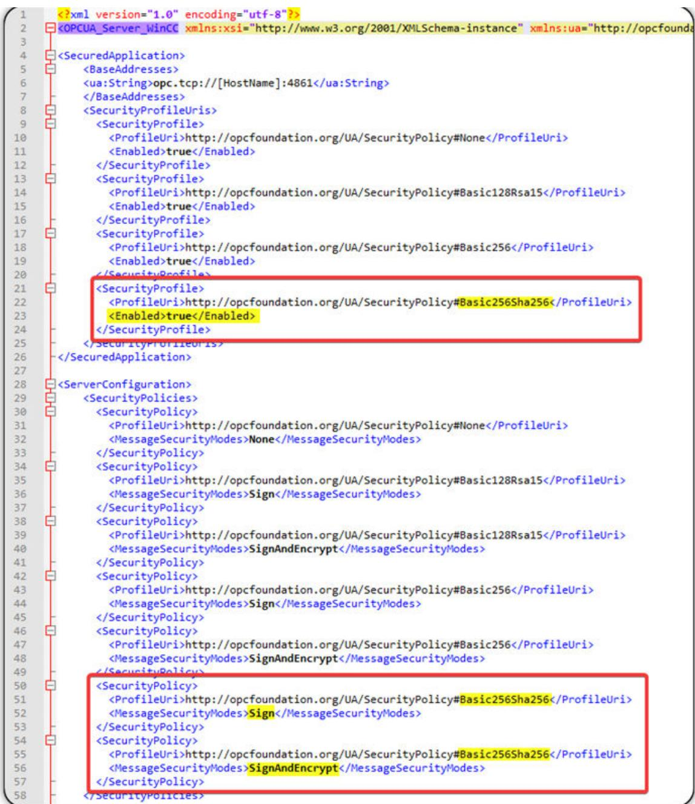
[连接到 TIA Portal](#连接到-TIA-Portal)

### 5.17.2 设置 OPC UA 安全策略

要求
• TIA Portal Openness 应用程序已连接到 TIA Portal。 [连接到 TIA Portal](#连接到-TIA-Portal)”
• 已打开一个项目。打开项目 (页 140)
• 已激活 OPC UA 服务器
可以使用 TIA Portal Openness 应用程序为 OPC UA 设置安全策略。可将安全策略实现为标记枚举类型的动态属性：OpcUaSecurityPolicies。仅当已激活 OPC UA 服务器时，安全策略在TIA Portal Openness 中才可用。
若 OPC UA 服务器被禁用，则在尝试访问任何其它不可用属性的安全策略时，将出现EngineeringNotSupportedException。
下表显示了可能的安全策略值：
<table><tr><td>TIA UI 名称</td><td>枚举条目</td><td>值</td><td>备注</td></tr><tr><td>-</td><td>NoneSelected</td><td>0</td><td>当未选中任何复选框时,相当于 TIA UI。</td></tr><tr><td>不安全</td><td>OpcUaSecurityPoliciesNo ne</td><td>1</td><td></td></tr><tr><td>Basic128Rsa15 - 签名</td><td>OpcUaSecurityPolicies12 8RSAS</td><td>2</td><td></td></tr><tr><td>Basic128Rsa15 - 签名和加密</td><td>OpcUaSecurityPolicies12 8RSASE</td><td>4</td><td></td></tr><tr><td>Basic256 - 签名</td><td>OpcUaSecurityPolicies25 6S</td><td>8</td><td></td></tr></table>
5.17 OPC 函数
<table><tr><td>TIA UI名称</td><td>枚举条目</td><td>值</td><td>备注</td></tr><tr><td>Basic256 - 签名和加密</td><td>OpcUaSecurityPolicies256SE</td><td>16</td><td></td></tr><tr><td>Basic256Sha256 - 签名</td><td>OpcUaSecurityPolicies256SHAS</td><td>32</td><td></td></tr><tr><td>Basic256Sha256 - 签名和加密</td><td>OpcUaSecurityPolicies256SHASE</td><td>64</td><td></td></tr><tr><td>Aes128 - Sha256 - RsaOaep - 签名</td><td>OpcUaSecurityPolicies256RSAOAEPS</td><td>128</td><td></td></tr><tr><td>Aes128Sha256 - RsaOaep - 签名和加密</td><td>OpcUaSecurityPolicies256RSAOAEPSSE</td><td>256</td><td></td></tr><tr><td>Aes256Sha256RsaPss - 签名</td><td>OpcUaSecurityPolicies256RSAPSSS</td><td>512</td><td></td></tr><tr><td>Aes256Sha256RsaPss - 签名和加密</td><td>OpcUaSecurityPolicies256RSAPSSSE</td><td>1024</td><td></td></tr></table>
修改以下程序代码，以使用 OPC UA 设置 OPC UA 的安全策略：
```text
DeviceItem UpcUaSubmodule = ...;
object SecurityPolicies = UpcUaSubmodule.GetAttribute("OpcUaSecurityPolicies");
if (SecurityPolicies | OpcUaSecurityPolicies.OpcUaSecurityPolicies256S == OpcUaSecurityPolicies.OpcUaSecurityPolicies256S)
{
    // Do something
}
UpcUaSubmodule.SetAttribute("OpcUaSecurityPolicies",
OpcUaSecurityPolicies.OpcUaSecurityPolicies256S |
OpcUaSecurityPolicies.OpcUaSecurityPolicies256SHASE);
```
[打开项目](#打开项目)

### 5.17.3 访问 OPC UA 引用命名空间

• 应用程序已使用 TIA Portal Openness 连接到 TIA Portal[连接到 TIA Portal](#连接到-TIA-Portal)”
• 已打开一个项目
请[打开项目](#打开项目)”
可使用 TIA Portal Openness 访问引用命名空间和服务器接口（Simatic 接口）子类型。有关OPC UA SIMATIC 接口的更多信息，参见“访问 OPC UA 服务器 (SIMATIC) 接口 (页 1085)”TIA Portal Openness 接口支持引用命名空间的以下功能：
• 创建引用命名空间
• 导入现有的引用命名空间
• 导出现有的引用命名空间
• 删除现有的引用命名空间

#### 方法和特性

引用命名空间类支持 TIA Portal Openness 中的以下方法：
<table><tr><td>方法</td><td>返回类型</td><td>定义</td></tr><tr><td>Create( )</td><td>Siemens.Engineering.SW.OpcUa.ReferenceNamespace</td><td>创建新的引用命名空间对象,其中包含路径文件提供的XML</td></tr><tr><td>Import( )</td><td>Systemteacher</td><td>基于XML文件设置服务器接口对象的内容。import()会采用支持的机制解析XML。如果文件可成功解析,则会将信息添加到引用命名空间,导入方法成功执行。如果文件无法成功解析,则对象的内容保持不变,导入方法将抛出异常。</td></tr><tr><td>Export( )</td><td>Systemteacher</td><td>将引用命名空间对象的内容写入到XML文件。如果引用命名空间不包含数据,则会抛出异常。</td></tr><tr><td>Delete( )</td><td>Systemteacher</td><td>将对象从包含的ReferenceNamespaceComposition中移除,并取消对象分配</td></tr></table>

## 5.17 OPC 函数

引用命名空间类中的 Create() 支持以下参数定义：
<table><tr><td>参数</td><td>返回类型</td><td>定义</td></tr><tr><td>name</td><td>System.String</td><td>新引用命名空间对象的名称</td></tr><tr><td>xmlFilePath</td><td>System.IO.FileInfo</td><td>用于导入的 XML 文件的路径</td></tr></table>
引用命名空间类中的 Import() 支持以下参数定义：
<table><tr><td>参数</td><td>返回类型</td><td>定义</td></tr><tr><td>filePath</td><td>System.IO.FileInfo</td><td>要导入的文件的文件路径封装器对象</td></tr></table>
引用命名空间类中的 Export() 支持以下参数定义：
<table><tr><td>参数</td><td>返回类型</td><td>定义</td></tr><tr><td>filePath</td><td>System.IO.FileInfo</td><td>导出文件应写入的文件路径的封装器对象。</td></tr></table>
引用命名空间类提供以下特性：
<table><tr><td>特性名称</td><td>数据类型</td><td>描述</td><td>访问</td></tr><tr><td>Author</td><td>System.string</td><td>作者</td><td>读/写</td></tr><tr><td>Comment</td><td>Siemens.Engineering .Multilingual.Text</td><td>注释</td><td>读/写</td></tr><tr><td>Creation Time</td><td>System.DateTime</td><td>引用命名对象的创建时间</td><td>只读</td></tr><tr><td>Enabled</td><td>System.Boolean</td><td>启用引用命名空间并下载到 PLC</td><td>读/写</td></tr><tr><td>LastModified</td><td>System.TimeTime</td><td>引用命名对象的最近修改时间</td><td>只读</td></tr><tr><td>Name</td><td>System.String</td><td>名称</td><td>只读</td></tr></table>
```text
// Accessing OPC UA interface;
PlcSoftware software = ....;
OpcUaProvider provider = software.GetService<OpcUaProvider>();
if (provider != null)
{
OpcUaCommunicationGroup commGroup = provider.CommunicationGroup;
ServerInterfaceGroup serverInterfaceGroup = commFolder.ServerInterfaceGroup;
ReferenceNamespaceComposition referenceNamespaces =
serverInterfaceGroup.ReferenceNamespaces;
// Iterating through ReferenceNamespace class
foreach (var referenceNamespace in referenceNamespaces)
{
    // ....;
}
// Accessing ReferenceNamespace properties
private void accessReferenceNamespaceProperty()
{
    ReferenceNamespaceComposition referenceNameSpace = ...;
    if (referenceNamespaces != null)
{
    // Creating reference namespace object containing the xml file provided with name
    ReferenceNamespace referenceNamespace = referenceNamespaces.Create(name, xmlFilePath);
    referenceNamespace.Author = "XYZ";
}
// Import the reference namespace object
private void importReferenceNamespace()
{
    ReferenceNamespaceComposition referenceNamespaces = ...;
    if (referenceNamespaces != null)
{
    ReferenceNamespace referenceNamespace = referenceNamespaces.Create(name, xmlFilePath);
    if (referenceNamespace != null)
{
    referenceNamespace.Import(new FileInfo(importFilePath));
}
}
// Export the reference namespace object to XML file
private void exportReferenceNamespace()
{
    String exportFilePath = Path.Combine(Directory.GetCurrentDirectory(),
    "ExportInterface.xml")
    ReferenceNamespace referenceNamespace = ...;
    referenceNamespace.Export(new FileInfo(exportFilePath));
}
// Remove the reference namespace object
private void deleteReferenceNamespace()
```
```text
{
ReferenceNamespace referenceNamespace = ...;
referenceNamespace.Delete();
}
```
打开项目 (页 140)

### 5.17.4 访问 OPC UA 服务器 (SIMATIC) 接口

• 应用程序已使用 TIA Portal Openness 连接到 TIA Portal[连接到 TIA Portal](#连接到-TIA-Portal)”
• 已打开一个项目请[打开项目](#打开项目)”
可使用 TIA Portal Openness 访问 SIMATIC 接口子类型。
TIA Portal Openness 接口支持 SIMATIC 接口的以下功能：
• 创建 SIMATIC 接口
• 导出现有的 SIMATIC 接口
• 删除现有的 SIMATIC 接口
S7-1200 FW V4.4 现在将支持 OPC UA SIMATIC 接口。
SIMATIC 接口类支持 TIA Portal Openness 中的以下方法：
<table><tr><td>方法</td><td>返回类型</td><td>定义</td></tr><tr><td>Create( )</td><td>Siemens.Engineering.SW.OpcUa.SimaticInterface</td><td>在 PLC 中创建 OPC UA SIMATIC 接口</td></tr><tr><td>Export( )</td><td>Systemteacher</td><td>将 SIMATIC 接口对象的内容写入到 XML 文件。如果 SIMATIC 接口不包含数据,则会抛出异常。</td></tr><tr><td>Delete( )</td><td>Systemteacher</td><td>将对象从包含的 Simatic 接口组合中移除,并取消对象分配</td></tr></table>
SIMATIC 接口类中的 Create() 支持以下参数定义：
<table><tr><td>参数</td><td>返回类型</td><td>定义</td></tr><tr><td>name</td><td>System.String</td><td>新 SIMATIC 接口对象的名称</td></tr></table>
SIMATIC 接口类中的 Export() 支持以下参数定义：
<table><tr><td>参数</td><td>返回类型</td><td>定义</td></tr><tr><td>filePath</td><td>System.IO.FileInfo</td><td>导出文件应写入的文件路径的封装器对象。</td></tr></table>
SIMATIC 接口类支持 TIA Portal Openness 中的以下特性：
<table><tr><td>特性名称</td><td>数据类型</td><td>描述</td><td>访问</td></tr><tr><td>Author</td><td>System.string</td><td>作者</td><td>读/写</td></tr><tr><td>Comment</td><td>Siemens.Engineering .Multilingual.Text</td><td>注释</td><td>读/写</td></tr><tr><td>Creation Time</td><td>System.DateTime</td><td>SIMATIC 接口的创建时间</td><td>只读</td></tr><tr><td>Enabled</td><td>System.Boolean</td><td>启用 SIMATIC 接口并下载到 PLC</td><td>读/写</td></tr><tr><td>LastModified</td><td>System.TimeTime</td><td>SIMATIC 接口的最近修改时间</td><td>只读</td></tr><tr><td>Name</td><td>System.String</td><td>名称</td><td>只读</td></tr></table>
```cs
// Accessing OPC UA interface;
PlcSoftware software = ...;
OpcUaProvider provider = software.GetService<OpcUaProvider>();
if (provider != null)
{
OpcUaCommunicationGroup commGroup = provider.CommunicationGroup;
ServerInterfaceGroup serverInterfaceGroup = commFolder.ServerInterfaceGroup;
SimaticInterfaceComposition simaticInterfaces = serverInterfaceGroup.SimaticInterfaces;
// Iterating through Simatic Interfaces class
foreach (var simaticInterface in simaticInterfaces)
{
    // ...;
}
// Accessing Simatic Interfaces properties
private void accessSimaticInterfaceProperty()
{
    SimaticInterfaceComposition simaticInterfaces = ...;
    if (simaticInterfaces != null)
    {
    // create a new empty SIMATIC interface object.
    SimaticInterface simaticInterface = simaticInterfaces.Create(name);
    simaticInterface.Author = "XYZ";
}
// Export the Simatic Interface object to XML file
private void exportReferenceNamespace()
{
    String exportFilePath = Path.Combine(Directory.GetCurrentDirectory(),
    "ExportInterface.xml")
    SimaticInterface simaticInterface = ...;
    simaticInterface.Export(new FileInfo(exportFilePath));
}
// Remove the Simatic Interface object
private void deleteSimaticInterface()
{
    SimaticInterface simaticInterface = ...;
    simaticInterface.Delete();
}
```
打开项目 (页 140)
Openness：用于工程组态工作流自动化的 API系统手册, 11/2023

### 5.17.5 访问 OPC UA 服务器接口

• TIA Portal Openness 应用程序已连接到 TIA Portal 请[连接到 TIA Portal](#连接到-TIA-Portal)”
• 已打开一个项目
请[打开项目](#打开项目)”
可创建服务器接口对象并导入为 PLC 定义 OPC UA 服务器接口的 XML 文件。
可以使用 TIA Portal Openness API 访问下列使用 OpcUaProvider 服务的功能：
• 添加 OPC UA 服务器接口对象
• 枚举属于 PLC 的服务器接口
• 导入服务器接口文件
• 将已有的服务器接口导出到 XML 文件
• 启用/禁用服务器接口
• 删除服务器接口
可通过从 PlcSoftware 获取的 OpcProvider 服务与 OPC UA 服务器接口进行交互。
```text
PlcSoftware software = ....;
OpcUaProvider provider = software chloride<OpcUaProvider>();
if (provider != null)
{
....
}
```
修改以下程序代码，以允许导航到 OPC UA 服务器接口：
```text
PlcSoftware software = ....;
OpcUaProvider provider = software chloride<OpcUaProvider>();
if (provider != null)
{
OpcUaCommunicationGroup commGroup = provider.CommunicationGroup;
ServerInterfaceGroup serverInterfaceGroup = commGroup.ServerInterfaceGroup;
ServerInterfaceComposition serverInterfaces = serverInterfaceGroup.ServerInterfaces;
}
```
修改以下程序代码，以枚举 ServiceInterfaceComposition 集合中的项：
```text
ServerInterfaceComposition serverInterfaces = ....;
foreach (ServerInterface serverInterface in serverInterfaces)
{
....;
}
```
修改以下程序代码，以添加 OPC UA 服务器接口对象：
```text
ServerInterfaceComposition serverInterfaces = ....;
if (serverInterfaces != null)
{
    ServerInterface serverInterface = serverInterfaces.Create(name);
}
修改以下程序代码，以获取和设置 OPC UA 服务器接口对象的特性：
```
```text
ServerInterfaceComposition serverInterfaces = ....;
if (serverInterfaces != null)
{
    ServerInterface serverInterface = serverInterfaces.Create("New Interface");
    serverInterface.Author = "James Cornett";
}
```
修改以下程序代码，以基于 XML 文件设置服务器接口对象的内容：
```cs
ServerInterfaceComposition serverInterfaces = ....;
if (serverInterfaces != null)
{
    ServerInterface serverInterface = serverInterfaces.Create(name);
    if (serverInterface != null)
    {
    serverInterface.Import(new FileInfo(importFilePath));
    }
}
```
修改以下程序代码，将服务器接口对象的内容写入到 XML 文件：
```text
String exportFilePath = Path.Combine(Directory.GetCurrentDirectory(), "ExportInterface.xml");
ServerInterface serverInterface = ...;
serverInterface.Export(new FileInfo(exportFilePath));
```
修改以下程序代码，将对象从包含的 ServerInterfaceComposition 中移除并取消对象分配：
```text
ServerInterface serverInterface = ...; serverInterface.Delete();
```
```text
连接到 TIA Portal (页 90)
打开项目 (页 140)
```

## 5.18 SiVArc Openness


### 5.18.1 简介

简介
TIA portal openness 应用程序允许将 SiVArc 实例化。必须使用客户端应用程序访问 TIAportal，并通过 openness 功能启动 SiVArc 服务。有关设置和访问 Openness 的更多详细信息，请参见 TIA portal 用户指南。

#### 设置应用程序

要设置客户端应用程序，请按照以下步骤操作：
1. 创建控制台应用程序。从安装的二进制文件位置 PublicAPI\V19\Siemens.Engineering.dll 添加公共 API (Siemens.Engineering.dll) 的参考
2. 将组态详细信息添加到组态文件中。有关组态详细信息和访问公共 API 的步骤的详细信息，请参见 TIA openness 的维基百科。
3. 要访问 Sivarc 服务，请使用下述 API：
```cs
using (TiaPortal tia = new
TiaPortal(TiaPortaMode.WithUserInterface))
{
    Project myProject = tia.Projects.Open(new
FileInfo(@"D:\Project\Project.ap19"));
    Sivarc sivarc =myproject?.GetService<Sivarc>();
    if (sivarc !=null)
    {
    }
}
```

### 5.18.2 Openness 许可证处理

用户通过 Openness API 打开 TIA 项目，并通过 Openness API 进行任何 SiVArc 数据更改（规则和生成）时，系统将验证许可证，如果未找到许可证，则会发出
“LicenseNotFoundException”可恢复异常。

### 5.18.3 SiVArc 实例属性

SiVArc 实例属性
下表列出了 SiVArc 所支持的属性和方法：
<table><tr><td>属性名称</td><td>说明</td><td>数据类型</td></tr><tr><td>AlarmRules</td><td>所有报警规则对象的锚对象</td><td>AlarmRulesBrowsable</td></tr><tr><td>ScreenRules</td><td>所有画面规则对象的锚对象</td><td>ScreenRulesBrowsable</td></tr><tr><td>TextlistRules</td><td>所有文本列表对象的锚对象</td><td>TextlistRulesBrowsable</td></tr><tr><td>TagRules</td><td>所有变量规则对象的锚对象</td><td>TagRulesBrowsable</td></tr><tr><td>CopyRules</td><td>所有复制规则对象的锚对象</td><td>CopyRulesBrowsable</td></tr><tr><td>TextlistRules</td><td>枚举所有即时的一级文本列表规则</td><td>TextlistRuleComposition</td></tr><tr><td>报警规则</td><td>枚举所有即时的一级报警规则</td><td>AlarmRuleComposition</td></tr><tr><td>ScreenRules</td><td>枚举所有即时的一级画面规则</td><td>ScreenRuleComposition</td></tr><tr><td>TagRules</td><td>枚举所有即时的一级变量规则</td><td>TagRuleComposition</td></tr><tr><td>CopyRules</td><td>枚举所有即时的一级复制规则</td><td>CopyRuleComposition</td></tr><tr><td>组</td><td>枚举所有即时的一级报警规则组</td><td>AlarmRuleGroupComposition</td></tr><tr><td>ScreenRulesGroups</td><td>枚举所有即时的一级画面规则组</td><td>ScreenRuleGroupComposition</td></tr><tr><td>TextlistGroups</td><td>枚举所有即时的一级文本列表规则组</td><td>TextlistRuleGroupComposition</td></tr><tr><td>TagRulesGroups</td><td>枚举所有即时的一级变量规则组</td><td>TagRuleGroupComposition</td></tr><tr><td>CopyRulesGroups</td><td>枚举所有即时的一级复制规则组</td><td>CopyRuleGroupComposition</td></tr></table>
下表列出了 AlarmRule 和 AlarmRuleGroup 的构成。这也同样适用于其它 SiVArc 对象。
<table><tr><td>方法名称</td><td>参数</td><td>说明</td><td>数据类型</td></tr><tr><td>Find</td><td>String - 报警规则/规则组名称</td><td>从报警规则/报警组集中查找报警规则/报警规则组</td><td>AlarmRule</td></tr><tr><td>CreateFrom</td><td>MasterCopy - 报警规则/报警规则组主副本</td><td>使用默认替换选项将报警规则/报警规则组主副本从库中复制到项目</td><td>AlarmRule</td></tr><tr><td>CreateFrom</td><td>MasterCopy - 报警规则/报警规则组主副本,CreateOptions - 重命名/替换</td><td>使用创建选项将报警规则/报警规则组主副本从库中复制到项目</td><td>AlarmRule</td></tr></table>
Openness 支持 Unified 设备通过报警规则生成和组态报警。

### 5.18.4 从库中复制规则或组

要求
• 启动 TIA portal openness 应用程序。有关连接的更多信息，请参见 TIA portal 用户指南。
• 已存在包含画面规则、画面规则组、画面规则主副本和画面规则组主副本的 TIA portal 项目。
案例 1：将规则/规则组从模板副本复制到画面规则表时
使用“CreateFrom”API 可以将库中的规则/规则组主副本复制到规则编辑器中。如果操作成功，API 函数将返回 ScreenRule/ScreenRuleGroup。以下代码说明了如何将规则或规则组从模板副本复制到 SiVArc 规则表：

#### // Copy rule master copy from library to rule table

```cs
MasterCopy screenRuleMasterCopy =
project.ProjectLibrary.MasterCopyFolder.MasterCopies.Find("Screen rule_1");
if (screenRuleMasterCopy != null
{
var rule = sivarc.ScreenRules.Tables.Find("Default screen rule table").Rules.CreateFrom(screenRuleMasterCopy);
if (rule != null)
{
Console.WriteLine("Copied screen rule name - " + rule.Name);
Console.WriteLine("Copied screen rule comment - " + rule.Comment);
Console.WriteLine("Copied screen rule enabled - " + rule.Enabled);
Console.WriteLine("Copied screen rule condition - " + rule.Condition);
}
```
默认情况下，该行为将被替换。
案例 2：从模板副本复制规则/规则组时，将基于第二个参数输入重命名或替换现有的规则/规则组
如果模板副本中的规则/规则组已存在于 SiVArc 规则表中，则复制时将重命名这些规则/规则组。如果 SiVArc 编辑器中不存在这些规则/规则组，“CreateOptions”API 将创建它们，否
5.18 SiVArc Openness
则，它们将替代现有的规则/规则组。如果操作成功，API 函数将重命名 ScreenRule/ScreenRuleGroup。替代规则/规则组的过程如下列代码片段所示：
```cs
MasterCopy screenRuleMasterCopy =
project.ProjectLibrary.MasterCopyFolder.MasterCopies.Find("Screen rule_1");
if (screenRuleMasterCopy != null)
{
var rule = sivarc.ScreenRules.Tables.Find("Default screen rule table").Rules.CreateFrom(screenRuleMasterCopy, CreateOptions.Rename);
if (rule != null)
{
Console.WriteLine("Copied screen rule name - " + rule.Name);
Console.WriteLine("Copied screen rule comment - " + rule.Comment);
Console.WriteLine("Copied screen rule enabled - " + rule.Enabled);
Console.WriteLine("Copied screen rule condition - " + rule.Condition);
}
```
创建副本规则时，可选择浏览项目库和全局库文件夹下的主副本文件夹。对于副本规则，使用 GetService 调用 SiVArc。CopyRule API 使用 MasterCopyFolder 和
ProjectLibrary API 将对象复制到模板副本文件夹中。以下代码片段显示的是使用副本规则浏览文件夹的过程：
```cs
TiaPortal portal = new TiaPortal(TiaPortalMode.WithUserInterface);
string projectPath = @"D:\Temp\Project\Project.ap19";
Project project = portal.Projects.Open(new System.IO.FileInfo(projectPath));
Sivarc sivarc = project.GetService<Sivarc>();
if (sivarc != null)
{
CopyRule copyRule = sivarc.CopyRules.Tables.Find("Default copy rule table").Rules.Find("Copy rule_1");
MasterCopyFolder masterCopyFolder =
project.ProjectLibrary.MasterCopyFolder.Folders.Find("CopyRuleFolder");
if (masterCopyFolder != null && copyRule != null
{
copyRule.LibraryObject = masterCopyFolder;
}
}
```
对于副本规则，可选择浏览项目库和全局库文件夹下的主副本文件夹。对于副本规则，使用GetService 调用 SiVArc。CopyRule API 使用 copyrule.LibraryObject 将对象复制到主副本文件夹中。如果copyrule.LibraryObject 设为空值，系统将显示异常。

### 5.18.5 查找画面规则组和画面规则

要求
• TIA portal openness 应用程序已连接到 TIA portal。有关连接的更多信息，请参见 TIAportal 用户指南。
• TIA portal 项目包含画面规则和画面规则组。

#### 在画面组内查找画面规则组

案例 1：在画面规则表内查找画面规则。
可通过以下 API sivarc.ScreenRules.Rules 在 SiVArc 画面规则表内查找可用的规则，如下所示：
//Collection of all immediate first level screen rules
```cs
ScreenRuleComposition screenRules =
sivarc.ScreenRules.Tables.Find("Default screen rule table").Rules;
if (screenRules != null && screenRules.Count > 0)
{
    //Finds screen rule
    ScreenRule rule = screenRules.Find("Screen rule_7");
    if (rule != null)
    {
    Console.WriteLine("Screen Rule Name: " + rule.Name);
    Console.WriteLine("Screen Rule Comment: " + rule.Comment);
    Console.WriteLine("Screen Rule Enabled: " + rule.Enabled);
    Console.WriteLine("Screen Rule Condition: " + rule.Condition);
    }
}
```
案例 2：在画面规则表内查找画面规则组。
可通过以下 API sivarc.ScreenRule.Groups 在 SiVArc 画面规则表内查找可用的规则和规则组，如下所示：
```text
var groups = sivarc.ScreenRules.Tables.Find("Default screen rule table").Groups;
if (groups != null && groups.Count > 0)
{
    ScreenRule rule = groups.Find("Screen rule_group").Rules.Find("Screen rule_2");
    if (rule != null)
    {
    Console.WriteLine("Found Screen Rule Name: " + rule.Name);
    Console.WriteLine("Found Screen Rule Comment: " + rule.Comment);
    Console.WriteLine("Found Screen Rule Enabled: " + rule.Enabled);
    Console.WriteLine("Found Screen Rule Condition: " + rule.Condition);
    }
    var group = groups.Find("Screen rule_group").Groups.Find("Screen rule group_2");
    if (group != null)
    {
    Console.WriteLine("Found Screen Rule Group Name: " + group.Name);
    Console.WriteLine("Found Screen Rule Group Comment: " + group.Comment);
    Console.WriteLine("Found Screen Rule Group Enabled: " + group.Enabled);
    Console.WriteLine("Found Screen Rule Group Condition: " + group.Condition);
    }
}
```

#### 组态条件运算符属性

可以在画面规则表中组态条件运算符属性画面规则，如下所示：
```text
ScreenRule screenRule = sivarc.ScreenRules.Tables.Find("Default screen rule table").Groups.Find("Screen rule group_1).Rules.Find("Screen rule_2");
if (screenRule != null)
{
    screenRule.ConditionOperator = ConditionOperator.GreaterThan;
}
```
screenRuleGroup.ConditionOperator API 用于在画面规则表中组态条件运算符属性。
• 对于画面规则：访问条件运算符属性不适用的画面规则时，系统将返
```text
回 ConditionOperator.None 值。
```
– 访问条件运算符属性不适用的画面规则时，系统将返回ConditionOperator.None值
– 为上述类型的规则设置其它条件运算符值时，系统将显示可恢复的异常
• 对于画面规则组，ConditionOperator.And，系统将返回可恢复的异常。

#### 组态布局字段

GetLayoutFields API 用于在画面规则编辑器中组态布局字段，如下所示：
```text
ScreenRule screenRule = sivarc.ScreenRules.Tables.Find("Default screen rule table").Rules.Find("Screen rule");
{
    var layoutFields = screenRule.GetLayoutFields();
    foreach (var layoutField in layoutFields)
    {
    if (layoutField.Equals("TestLayoutField"))
    {
    screenRule.LayoutField = layoutField;
    }
    }
}
screenRule.LayoutField 将值写入到布局字段中。
```
若要更新画面规则的布局字段，请参考以下代码：
```java
if (screenRule != null)
{
    ScreenRule screenRule = sivarc.ScreenRules.Tables.Find("Default screen rule table").Rules.Find("Screen rule group_1;
    IList<string> layoutFields =
    screenRule ?.GetLayoutFields() .ToList();
```
5.18 SiVArc Openness
```text
{
    if (layoutFields ?.Count > 1)
    {
    screenRule.LayoutField = layoutfields[0];
    }
}
```

### 5.18.6 为规则和规则组分配属性

要求
• TIA portal openness 应用程序已连接到 TIA portal。有关连接的更多信息，请参见 TIAportal 用户指南。
• TIA 项目包含画面规则和画面规则组。
规则和规则组的属性可以通过 openness 来设置。

#### 为画面规则分配属性

可以使用下面的 API 为画面规则分配“启用”(Enable)、“名称”(Name)、“注释”(Comment)和“条件”(Condition) 等属性：
```javascript
screenRule.Condition = "StrComp(Block.Name, \" BlockName\)");
```
要分配画面规则属性，必须在规则编辑器中找到该规则。有关查找画面规则的更多信息，请[查找画面规则组和画面规则](#查找画面规则组和画面规则)”部分。
```cs
ScreenRule screenRule = sivarc.ScreenRules.Tables.Find("Default screen rule table").Rules.Find("Screen rule_1");
if (screenRule != null)
{
    //Set screen rule attributes
    screenRule.Name = "RulenameTest";
    screenRule.Comment = "CommentTest";
    screenRule.Condition = "StrComp(Block.Name, \"BlockName\")";
    screenRule.Enabled = true;
}
```

#### 为画面规则组分配属性

可以使用下面的 API 为画面规则组分配“启用”(Enable)、“名称”(Name)、“注释”(Comment) 和“条件”(Condition) 等属性：
Screenrulegroup.Condition = "StrComp(Block.Name, \"BlockName\")";
要分配画面规则属性，必须在规则编辑器中找到该规则。有关查找画面规则的更多信息，请参见“查找画面规则和画面规则组”部分。

#### 异常情况

以下情况下 SiVArc 会显示异常：
• 在“名称”(Name) 中输入 Null/空值
• 在“名称”(Name) 字段中输入重复值
• “名称”(Name) 字段的值超出了 128 个字符的长度限制。
• “名称”(Name)、“注释”(Comment)、“条件”(Condition)（对于预期的副本规则）和“启用”(Enabled)
下表列出了用于其它规则类型的 API：
<table><tr><td>规则类型</td><td>API</td></tr><tr><td>变量规则/变量规则组</td><td>TagRule.Condition/TagRuleGroup.Condition</td></tr><tr><td>文本列表/文本列表规则组</td><td>TextlistRule.Condition/TextlistRuleGroup.Condition</td></tr><tr><td>报警规则/报警规则组</td><td>AlarmRule.Condition/AlarmRuleGroup.Condition</td></tr></table>

### 5.18.7 创建规则对象和规则组

要求
• TIA portal openness 应用程序已连接到 TIA portal。有关连接的更多信息，请参见 TIAportal 用户指南。
创建画面规则和画面规则组
可以结合使用 Create 方法和 ScreenRuleComposition 创建画面规则。ScreenRule实例上的Create API 方法可用于创建规则。下面的代码解释了如何创建画面规则：
```dart
ScreenRule createdScreenRule = sivarc.ScreenRules.Tables.Find("Default screen rule table").Rules.Create("CreatedScreenRule");
if (createdScreenRule != null)
{
    //Created screen rule name property validation
    Console.WriteLine("Created screen rule name: " + createdScreenRule.Name);
}
```
如果 CreatedScreenRule 成功，则 ScreenRule API 将返回使用提供的名称新创建的画面规则。

#### 情形 1：在规则组中创建画面规则

要在现有画面规则组中创建画面规则，必须找到要创建画面规则的画面组。
可通过以下 API sivarc.ScreenRules.Groups.Find 在 SiVArc 画面规则表内找到画面规则组，如下所示：
```cs
ScreenRule createdScreenRule = sivarc.ScreenRules.Tables.Find("Default screen rule table").Groups.Find("Screen rule group_1").Rules.Create("CreatedScreenRuleInUserGroup");
if (createdScreenRule != null)
{
    //Created screen rule name property validation
    Console.WriteLine("Created screen rule name: " + createdScreenRule.Name);
}
```
有关创建画面规则组的更多信息，请参见“在画面组内查找画面规则”部分。
异常情况与“为规则和规则组分配属性”相同。有关异常情况的更多信息，请参见“为规则和规则组分配属性 (页 1098)”部分。
对不同的规则类型可以使用类似的方法。可以用规则类型替换对象名称。

### 5.18.8 使用画面规则表和文件夹


#### 5.18.8.1 创建画面规则表

以下 API 也可用于报警规则、复制规则、变量规则、文本列表规则，使用方式基本类似。

##### 案例 1：在画面规则表文件夹中创建画面规则表

可以在 SiVArc 项目导航下可用的“画面规则表”(Screen rule tables) 文件夹中创建画面规则表。Create方法用于创建新的画面规则表。
```text
ScreenRuleTable screenRuleTable =
sivarc.ScreenRules.Tables.Create (name:"OpnsScreenRuleTable")
If (screenRuleTable !=null)
{
Console.WriteLine("Created Screen Rule Table : " + screenRuleTable.Name);
}
```

##### 案例 2：在用户创建的文件夹中添加画面规则表

```javascript
还可以在用户创建的文件夹中添加画面规则表。Create 方法将在
ScreenRuleTableComposition 中调用。
ScreenRuleTable screenRuleTable =
sivarc.ScreenRules.Folders.Find(name:"RuleFolder").Tables.Create
(name:"OpnsScreenRuleTable_1")
If (screenRuleTable !=null)
{
    Console.WriteLine("Created Screen Rule Table : " + screenRuleTable.Name);
}
```
5.18 SiVArc Openness

#### 5.18.8.2 创建画面规则文件夹


##### 案例 1：在画面规则表文件夹中创建画面规则文件夹

可以在 SiVArc 项目导航下可用的“画面规则表”(Screen rule tables) 文件夹中创建画面规则文件夹。Create 方法用于创建新的画面规则文件夹。
```text
ScreenRuleFolder screenRuleFolder =
sivarc.ScreenRules.Folders.Create(name:"Folder_ScreenRuleFolder");
If (screenRuleTable !=null)
{
    Console.WriteLine("Created Screen Rule Folder : " + screenRuleFolder.Name);
}
```

##### 案例 2：在用户定义的文件夹中创建文件夹

可以在“画面规则”(Screen rules) 下的“用户定义文件夹”(User defined Folder) 中创建文件夹。
```cs
ScreenRuleFolder screenRuleFolder =
sivarc.ScreenRules.Folders.Find (name:
"RuleFolder").Folders.Create (name:"Folder_ScreenRuleFolder_1")
{
Console.WriteLine("Created Screen Rule Folder : " +
screenRuleFolder.Name);
}
```

#### 5.18.8.3 访问画面规则和组

要从 RootScreenRuleTable（用户创建的包含规则和规则组的表）访问画面规则和组，请使用以下代码：
```javascript
Console.WriteLine("Rules");
var rules =
sivarc.ScreenRules.Tables.Find("RootScreenRuleTable").Rules;
if (rules != null && rules.Count > 0)
{
    foreach (var rule in rules)
```
```dart
Console.WriteLine(rule.Name);
}
Console.WriteLine("Groups");
var groups =
sivarc.ScreenRules.Tables.Find("RootScreenRuleTable").Groups;
if (groups != null && groups.Count > 0)
{
foreach (var group in groups)
{
Console.WriteLine(group.Name);
}
```
要从文件夹的规则表中访问规则和规则组，请使用以下代码：
```text
Console.WriteLine("Rules");
var rules =
sivarc.ScreenRules.Folders.Find("RuleFolder").Tables.Find("AddedScreenRuleTable").Rules;
if (rules != null && rules.Count > 0)
{
foreach (var rule in rules)
{
Console.WriteLine(rule.Name);
}
}
Console.WriteLine("Groups");
var groups =
sivarc.ScreenRules.Folders.Find("RuleFolder").Tables.Find("AddedScreenRuleTable").Groups;
if (groups != null && groups.Count > 0)
{
foreach (var group in groups)
{
Console.WriteLine(group.Name);
```
```javascript
sivarc.ScreenRules.Folders.Find(name:"RuleFolder").Delete();
```
```javascript
sivarc.ScreenRules.Tables.Find(name: "RootScreenRuleTable").Delete();
```
```javascript
sivarc.ScreenRules.Tables.Find(name:"Default screen rule table").Delete();
```

#### 5.18.8.4 删除画面规则表和用户定义的规则文件夹

要删除“画面规则表”(Screen rule tables) 文件夹中可用的 RootScreenRuleTable，请使用以下代码片段：
要删除用户定义的规则文件夹，请使用以下代码片段：

##### 例外情况：

用户尝试删除默认画面规则表，如下所述：

#### 5.18.8.5 访问库类型中的规则表

```text
要访问“库类型”(Library Type)文件夹中的“规则表”(RuleTable)，请使用以下API: LibraryType libraryType = project.ProjectLibrary.TypeFolder.Types.Find (name:"Screen rule table")  
为迭代“库类型”(Library Type)中的不同版本，请使用以下API: LibraryType libraryType = project.ProjectLibrary.TypeFolder.Types.Find (name:"Screen rule table")  
foreach (var version in LibraryType.Versions) Console.WriteLine("Library type {0} version is {1}", libraryType.Name, version.VersionNumber);
```

#### 5.18.8.6 创建规则表的实例

要创建一个从库类型到 PNV 的规则表实例，请使用 CreateFrom 方法。CreateFrom 方法使用规则表组合在项目导航下实例化特定的规则表版本。TypeVersion必须强制转换到各自的规则表。下面的代码对此进行了说明：
```text
LibraryType libraryType =
project.ProjectLibrary.TypeFolder.Types.Find (name:"Screen rule table");
Version version = new Version ("0.0.2");
var typeVersion = LibraryType.Versions.Find(version);
ruleTableComp.CreateFrom(typeVersion as ScreenRuleTableTypeVersion)
```
如果在发布模式下使用 API 编辑操作，SiVArc 规则表将抛出异常。

##### 实例化规则表的版本详细信息

为找到在项目导航下实例化的规则表的版本详细信息，使用 LibraryTypeVersion 方法，如下所示：
```cs
var ruleTableComp = sivarc.ScreenRules.Tables;
ScreenRuleTable screenRuleTable =
ruleTableComp.Find(name:"Screen rule table");
LibraryTypeInstanceInfo instanceInfo =
screenRuleTable.GetService<LibraryTypeInstanceInfo>();
LibraryTypeVersion connectedversion =
instanceInfo.LibraryTypeVersion;
```

### 5.18.9 访问主副本/画面类型中的文件夹


#### 访问库类型中的文件夹

要访问主副本中的任何库类型文件夹，使用LibraryTypeFolder API，如下所示：
```text
LibraryTypeFolder libraryTypeFolder =
project.ProjectLibrary.TypeFolder.Folders.Find("Folder");
if (libraryTypeFolder != null && screenRule != null)
{
```
```text
screenRule.LibraryScreen = libraryTypeFolder;
}
```

#### 访问主副本中的文件夹

“库类型”(Library Type) 文件夹分配给主副本，如下所示：
```cs
MasterCopyFolder masterCopyFolder =
project.ProjectLibrary.MasterCopyFolder.Folders.Find("LegacyItems");
if (masterCopyFolder != null && screenRule != null)
{
    screenRule.LibraryScreen = masterCopyFolder;
}
```
• 设置画面对象的主副本/类型值作为文件夹，然后尝试设置画面对象/布局列时，系统将发出异常。
• 设置画面对象列的值后，如果尝试在画面的“主副本/类型”(Master copy/Type) 列下浏览文件夹，SiVArc 将删除画面对象和布局字段列中已组态的值。

### 5.18.10 访问库对象

• TIA portal openness 应用程序已连接到 TIA portal。有关连接的更多信息，请参见 TIAportal 用户指南。
• 创建或使用现有画面规则
• TIA 项目包含画面、画面对象、程序块和面板类型的主副本

#### 读取和写入程序块属性

情形 1：假设要读取画面规则的程序块属性。可以采用以下方式组态：
• PLC 块
• 库类型
• 库模板副本
5.18 SiVArc Openness
以下代码说明了如何通过 PLC 读取画面规则的程序块属性：
```java
if (sivarc != null)
{
    ScreenRule screenRule = sivarc.ScreenRules.Tables.Find("Default screen rule table").Rules.Find("ScreenRule")
    ISivarcProgramBlockSource programblock = screenRule?.ProgramBlock;
    if (programBlock != null)
    {
    CodeBlock plcBlock = programBlock as CodeBlock;
    Console.WriteLine("Screen Rule program block: " + plcBlock?.Name);
    }
}
如果从库类型中读取程序块值，应确保将 programBlock 的类型转换为 LibraryType LibraryType libraryType = programBlock as LibraryType
如果从库模板副本中读取程序块值，应确保将 programBlock 的类型转换为 MasterCopy MasterCopy masterCopy = programBlock as MasterCopy
```
情形 2：假设要写入画面规则的程序块属性。可以通过以下方式写入程序块值：
• PLC 块
• 库类型
• 库模板副本
以下代码说明了如何通过 PLC 写入画面规则的程序块属性：
```java
if (sivarc != null)
{
    ScreenRule screenRule = sivarc.ScreenRules.Tables.Find("Default screen rule table").Rules.Find("ScreenRule")
    Device dev = myProject.Devices.Find("S71500/ET200MP station_1");
    softwareContainer softwareContainer = null
```

## 5.18 SiVArc Openness

```cs
var firstorDefault = dev.DeviceItems.FirstorDefault(name => name.Name.Equals("PLC_1"));
if (firstorDefault != null)
SoftwareContainer =
firstorDefault.GetService<SoftwareContainer>();
if (softwareContainer !=null)
{
    Software softTarget = softwareContainer.Software;
    PLCSoftware plcSoftware = (PLCSoftware) softTarget;
    var userBlocks = plcSoftware.BlockGroup.Blocks;
    screenRule.ProgramBlock=userBlocks.Find ("Block_2") as CodeBlock;
}
}
如果从库类型写入程序块值:
screenRule.ProgramBlock =
project.ProjectLibrary.TypeFolder.Types.Find ("Block_Type");
如果从库模板副本写入程序块值:
screenRule.ProgramBlock =
project.ProjectLibrary.MasterCopyFolder.MasterCopies.Find ("Block_2");
```
如果使用其他受支持的编辑器，ProgramBlock 属性也将被修改。

### 读取和写入画面规则的 ScreenObjectLibraryItem 属性

情形 1：假设读取画面规则的ScreenObjectLibraryItem属性值。可以从模板副本中读取画面对象库项的值，如下所示：
```text
if (sivarc != null)
{
    ScreenRule screenRule = sivarc.ScreenRules.Tables.Find("Default screen rule table").Rules.Find("ScreenRule")
```
```text
ISivarcLibraryItem screenObjectMasterCopy =
screenRule?.ScreenObjectLibraryItem;
if (screenObjectMasterCopy != null)
{
    MasterCopy masterCopy = screenObjectMasterCopy as MasterCopy;
    Console.WriteLine("Screen object master copy name: " + masterCopy?.Name);
}
}
如果从库类型中读取画面对象，应确保将 screenObjectMasterCopy 的类型转换为 LibraryType
LibraryTypem libraryType = screenObjectMasterCopy as LibraryType;
情形2：假设写入画面规则的 ScreenObjectLibraryItem 属性值。可以从库写入属性值，如下所示：
if (sivarc != null)
{
    ScreenRule screenRule = sivarc.ScreenRules.Tables.Find("Default screen rule table").Rules.Find("ScreenRule");
    screenRule.ScreenObjectLibraryItem = project.ProjectLibrary.MasterCopyFolder.MasterCopies.Find("Button_Lib");
}
从库类型写入画面对象值：
screenRule.ScreenObjectLibraryItem
= project.ProjectLibrary.TypeFolder.Types.Find("Faceplate_Type");
```
同样，可以访问类型为 ISivarcLibraryItem 的副本规则库对象 (LibraryItem) 的其它属性，以读取/写入值。

### 读取和写入画面规则的画面主属性

```text
同样，可以访问类型为 ISivarcLibraryMasterCopy（TextlistLibraryItem 和 AlarmLibraryItem）的其它属性来读取/写入值。
```
```cs
情形1：假设读取画面规则的LibraryScreen属性值。可以从模板副本中读取画面库项的值，如下所示：
if (sivarc != null)
{
    ScreenRule screenRule = sivarc.ScreenRules.Tables.Find("Default screen rule table").Rules.Find("ScreenRule")
    ISivarcLibraryMasterCopy screenLibraryMasterCopy = screenRule?.LibraryScreen;
    if (screenLibraryMasterCopy != null)
    {
    MasterCopy masterCopy = screenLibraryMasterCopy as MasterCopy;
    Console.WriteLine("Screen master copy name: " + mastercopy?.Name);
    }
}
情形2：假设写入画面规则的LibraryScreen属性值。可以从库模板副本写入画面规则的画面模板副本值，如下所示：
if (sivarc != null)
{
    ScreenRule screenRule = sivarc.ScreenRules.Tables.Find("Default screen rule table").Rules.Find("ScreenRule");
    screenRule.LibraryScreen = project.ProjectLibrary.MasterCopyFolder.MasterCopies.Find(Screen_lib");
}
```
LibraryScreen 属性用于读取或写入画面模板副本和类型。通过 LibraryScreen 属性，可以选择浏览“画面模板副本/类型”(Master copy/Type of screen) 列下的模板副本或类型。以下代码片段显示在“项目 > 项目库 > Typefolder > 名称“<<screen\_type>>”下导航。为属性LibraryScreen 分配了画面类型值：
```cs
Sivarc sivarc = project.GetService<Sivarc>();
if (sivarc != null)
{
    ScreenRules screenRuleEditor = sivarc.ScreenRules;
    if (screenRuleEditor != null)
    {
    ScreenRuleComposition screenRuleComposition =
    sivarc.ScreenRules.Tables.Find("Default screen rule table").Rules;
    if (screenRuleComposition != null && screenRuleComposition.Count > 0)
    {
    ScreenRule scRule = screenRuleComposition.Find("Screen rule");
    if (scRule != null)
    {
    Console.WriteLine((scRule.LibraryScreen as MasterCopy)?.Name);
    scRule.LibraryScreen =
    project.ProjectLibrary.TypeFolder.Types.Find("Screen_Type");
    Console.WriteLine((scRule.LibraryScreen as LibraryType)?.Name);
    }
    }
    }
}
```

### 5.18.11 组态 PLC 和 HMI 设备

• TIA portal openness 应用程序已连接到 TIA portal。有关连接的更多信息，请参见 TIAportal 用户指南。
• TIA Portal 项目包括 HMI 设备、面板设备和 PLC

#### 读取和写入 PLC/HMI 设备

动态属性仅包含 PLC 设备列和 HMI 设备列。
情形 1：假设读取规则对象的动态属性。可以读取 plc 状态、HMI 设备状态等属性，如下面的代码所示：
要检查 PLC 设备（如果为特定规则选择了该设备）的状态，必须将 plc 名称传递给GetAttribute 方法。
5.18 SiVArc Openness
```javascript
if (sivarc != null)
{
    ScreenRule screenRule = sivarc.ScreenRules.Tables.Find("Default screen rule table").Rules.Find("ScreenRule")
var plcStatus = screenRule.GetAttribute("PLC_1");
Console.WriteLine("PLC_1 status: " + plcStatus);
}
```
要检查 HMI 设备（如果为特定规则选择了该设备）的状态，必须将 HMI 设备运行时名称传递给 GetAttribute 方法。
对于面板，必须只传递设备名称。
```cs
var hmiDeviceStatus = screenRule.GetAttribute("HMI_RT_2");
Console.WriteLine("HMI_RT_2 status: " + HMIDeviceStatus);
读取所有设备的状态:
var devicestatus = screenRule.GetAttribute new List<string>
{
    "PLC_1", "PLC_2", "HMI_RT_1", "HMI_RT_2";
}
foreach (var devicestatus in devicestatus)
{
    Console.WriteLine("PLC & HMI device status: " + devicestatus);
}
```
情形 2：假设写入规则对象的动态属性。可以读取 PLC 设备列等属性，以检查 PLC 设备（如果为特定规则选择了该设备）的状态，如下所示：
要更新 PLC 设备（如果为特定规则选择了该设备）的状态，需确保将 plc 名称传递给采用布尔值的 SetAttribute 方法。
```text
if (sivarc != null)
{
    ScreenRule screenRule = sivarc.ScreenRules.Tables.Find("Default screen rule table").Rules.Find("ScreenRule")
```
要更新 HMI 设备（如果为特定规则选择了该设备）的状态，必须将 HMI 设备运行时名称传递给采用布尔值的 SetAttribute 方法。
对于面板，必须只传递设备名称。
```cs
if (sivarc != null)
{
    ScreenRule screenRule = sivarc.ScreenRules.Tables.Find("Default screen rule table").Rules.Find("ScreenRule");
    screenRule.SetAttribute("HMI_RT_1", true);
}
更新所有设备的状态:
if (sivarc != null)
{
    var valuestoBeUpdate = new[]
    {
    new KeyValuePair<string, object>("PLC_2", true),
    new KeyValuePair<string, object>("PLC_3", true),
    new KeyValuePair<string, object>("HMI_RT_1", false),
    new KeyValuePair<string, object>("HMI_1", true),
    };
    ScreenRule screenRule =
    sivarc.ScreenRules.Rules.Find("ScreenRule");
    screenRule.SetAttributes(valuestoBeUpdate);
```
• 可恢复的异常状况：对于不支持动态属性的其它规则对象（变量和文本列表规则），在通过 GetAttributes 访问 PLC/HMI 设备列时，系统显示可恢复的异常，例如：{类型 'Siemens.Engineering.SiVArc.TagRule’ 不支持 ‘HMI\_RT\_1'}。
• 不可恢复的异常状况 - 对不适用于规则对象的无效 PLC/HMI 设备名称，系统将显示NonRecoverable（不可恢复）的异常；仅对画面、报警和副本规则有效。
对于副本规则，虽然不支持 PLC 列，但可以查询 PLC 状态。这是编辑器通常的行为所致，对SiVArc 功能没有影响。
要访问规则/规则组对象的 PLC/HMI 设备状态，使用以下动态属性：object status =screenRule.GetAttribute("PLC 设备名称");
限制：
• 包含字母数字的 HMI 设备名称不能包含除“\_”外的特殊字符。
• 要获取 HMI 设备状态，请在名称中加上前缀“HMI\_”，后接解析的设备名称。例如：HMI设备名称：HMI\_@#\$RT\_1，要访问设备名称，需要传递 HMI\_HMI\_RT\_1 作为参数。
• 如果项目中包含多个 HMI 设备，则系统将通过特殊字符“\_”识别相同的设备名称，在 HM设备名称后加上相应的序号。例如：Device\_PLC\_XYZ 表示项目层级中的第一个设备。此方法对于访问 PLC 设备状态同样适用。
• 项目包含两个设备 – HMI\_@#RT\_1 和 HMI\_%^RT\_@#1；如果删除特殊字符后两个设备解析为同一名称，即 HMI\_RT\_1（项目 HMI\_@#RT\_1 HMI\_%^RT\_@#）。要访问第一个设备状态，需要传递 HMI\_HMI\_RT\_1 作为参数，要访问第二个设备状态，则需要传递HMI\_HMI\_RT\_1\_1 作为参数。此方法对于访问 PLC 设备状态同样适用。

### 5.18.12 删除规则和规则组

要求
• TIA portal openness 应用程序已连接到 TIA portal。有关连接的更多信息，请参见 TIAportal 用户指南。
• TIA 项目包含画面规则和画面规则组。

#### 删除规则和规则组

可以使用以下 API 删除画面规则组：
```javascript
sivarc.ScreenRules.Tables.Find("Default screen rule table").Rules.Find("Screen rule_1").Delete();
```
ScreenRules是所有画面规则对象的锚对象。要执行删除，必须在规则编辑器中找到该规则。有关查找画面规则的更多信息，请参见“查找画面规则和画面规则组”部分。
要从画面组中删除画面，请使用以下 API：
```javascript
sivarc.ScreenRules.Tables.Find("Default screen rule table").Rules.Find("Screen rule group_1").Delete();
```

### 5.18.13 组态变量规则

要求
• TIA portal openness 应用程序已连接到 TIA portal。有关连接的更多信息，请参见 TIAportal 用户指南。
• TIA portal 项目包含变量规则和变量规则组。

#### 分配变量规则属性

可以分配“名称”(Name)、“条件”(Condition)、“注释”(Comment) 和“启用”(Enabled) 等变量规则属性。可以使用TagRule API 设置变量规则属性，如下所示：
```text
TagRule tagrule = sivarc.TagRules.Tables.Find("Default tag rule table").Rules.Find ("Tag rule_1");
if (tagRule != null)
{
    tagRule.Name = "TagRuleName";
    tagRule.Comment = "TagRuleComment";
    tagRule.Condition = "StrComp(Block.Name, \"BlockName\)";
    tagRule.Enabled = true;
}
```
同样，可以使用TagRuleGroup API 设置变量规则组属性。
```text
说明如果为“条件”(Condition)和“注释”(Comment)属性传递的值超过500个字符，则会显示异常。
```
```text
可以使用以下 API 代码更新变量规则的其它属性，例如，TagGroupHierarchy、TagTable 和 ConditionalOperator:
API TagGroupHierarchy、TagTable 和 ConditionOperator 用于在变量规则编辑器中为变量规则修改层级结构、变量表中的变量组及关联的条件运算符，如下所示：
TagRule tagRule = sivarc.TagRules.Tables.Find("Default tag rule table").Groups.Find("Tag rule group_1").Rules.Find("Tag rule_2");
if (tagRule != null)
{
    tagRule.TagGroupHierarchy = "HmiTag.DB.FolderPath";
    tagRule.TagTable = "Hmitag.DB.SymbolicName";
    tagRule.ConditionOperator = ConditonOperator.Equal;
}
```
以下情况下 SiVArc 会显示异常：
• 在 TagTable 中输入 Null/空值
• 在“名称”(Name) 字段中输入重复值
• TagGroupHierarchy 和 TagTable 字段的值超出了 500 个字符的长度限制。
• 如果 ConditionOperator 的值无效，将返回 ConditionOperator.None
为规则和规则组分配属性 (页 1098)

### 5.18.14 组态变量/文本定义

要求
• TIA portal openness 应用程序已连接到 TIA portal。有关连接的更多信息，请参见 TIAportal 用户指南。
• PLC 及其关联块

#### 创建变量定义

要为某一块创建变量定义，必须先确定 PLC（后接其关联块），然后再访问该块的 SiVArc 数据提供程序。访问 SiVArc 数据提供程序后，使用 TagDefinitionComposition 创建新的变量定义。以下代码片段表示同样的含义：
```text
CodeBlock block = plcSoftware.BlockGroup.Blocks.Find("Block_1") as CodeBlock;
// Access SivarcDataProvider service
SivarcDataProvider sivarcDataProvider =
block.GetService<SivarcDataProvider>();
// Create tag definition entry
TagDefinition tagDefinition =
sivarcDataProvider.TagDefinitions.Create("Tag_definition_1");
if (tagDefinition != null)
{
    tagDefinition.Value = "Tag_Definition_1_Value";
    tagDefinition.Comment = "Tag_Definition_1_Comment";
}
```

#### 访问文本定义

要访问块的文本定义，必须先确定 PLC（后接其关联块），然后再访问该块的 SiVArc 数据提供程序。访问 SiVArc 数据提供程序后，确定要使用 TextDefinitionComposition 向其中写入数值的文本定义列。
以下代码片段表示同样的含义：
```text
TextDefinitionComposition textDefinitions =
sivarcDataProvider.TextDefinitions;
TextDefinition textDefinition = textDefinitions.Find("Text_definition");
if (textDefinition != null)
{
textDefinition.Name = "Updated_Text_definition";
textDefinition.Expression = "Block.DB.SymbolicName";
textDefinition.Comment = "Updated_Text_definition_Comment";
var text = textDefinition.Text;
//Updating german text
Language germanLanguage = project.LanguageSettings.Languages.Find(new CultureInfo("de-DE"));
text.Items.Find(germanLanguage).Text = "GermanText";
}
```
可为读取操作执行类似的步骤。
也可以访问为支持多语言的文本定义组态的值。选择使用
"project.LanguageSettings.Languages.Find(“<语言名称>”)"读取/写入数值所需的语言。
MultilingualTextItem 对象用于保存语言类型值。

#### 删除变量/文本定义

要删除块的变量定义，必须确定 PLC（后接其关联块），然后再访问该块的 SiVArc 数据提供程序。访问 SiVArc 数据提供程序后，确定要使用 tagDefinition.Delete 删除的变量定义。
对于文本定义，此方法同样适用，会使用 textDefinitions.Delete API 进行删除。
以下代码片段表示同样的含义：
```cs
string projectPath = @"D:\TempPROJECTProject.ap19";
Project project = portal.Projects.Open(new System.IO.FileInfo(projectPath));
Device myDevice = null;
foreach (var device in project.Devices)
{
    //Find device
    if (!device.Name.Equals("S71500/200 station_1"))
    {
    continue;
    }
    myDevice = device;
    }
    if (myDevice?.DeviceItems != null)
    {
    foreach (var deviceItem in myDevice.DeviceItems)
    {
    //Find PLC
    if (deviceItem.Name == "PLC_1")
    {
    SoftwareContainer container = deviceItem.GetService<SoftwareContainer>();
    Software target = container.Software;
    PlcSoftware software = (PlcSoftware) target;
    //Find program block
    CodeBlock block = software.BlockGroup.Blocks.Find("Block_1") as CodeBlock;
    // Access SivarcDataProvider service
    SivarcDataProvider sivarcDataProvider =
    block.GetService<SivarcDataProvider>();
    // Delete tag definition
    sivarcDataProvider.TagDefinitions.Find("Tag_definition").Delete();
    // Delete text definition
    sivarcDataProvider.TextDefinitions.Find("Text_definition").Delete();
    }
    }
}
```

### 5.18.15 Openness 的 UMAC 设置

关于 UMAC
Openness 授权将用于任何修改，并且不会从 SiVArc 进行额外的 UMAC 验证。对于未经授权的用户，系统将发出“FunctionRightNotFoundException”可恢复异常。

### 5.18.16 SiVArc 生成

要求
• 启动 TIA portal openness 应用程序。有关连接的更多信息，请参见 TIA portal 用户指南。
• 已存在连接到 HMI 设备的 TIA portal 项目，且已组态 PLC。

#### 重要注意事项

• 确保 PC 上已安装 SiVArc 许可证，否则生成期间会出现异常 -“SiVArc license is missing;it is mandatory to have SiVArc license for modifying data”（SiVArc 许可证缺失，必须有 SiVArc 许可证才能修改数据）。
• 确保使用有效的设备名称，否则会出现异常 -“HMI device 'deviceName' not found”（未找到 HMI 设备的“deviceName”）。
• 确保调用有效的 PLC 名称，否则会出现异常 -“PLC device 'plcDeviceName' notfound”（未找到 PLC 设备的“plcDeviceName”）。
• 确保调用受支持的设备名称，否则会出现异常 -“HMI device 'deviceName' is notsupported”（不支持 HMI 设备的“deviceName”）
• 确保调用受支持的 PLC 名称，否则会出现异常 -“PLC device 'plcDeviceName' is notsupported”（不支持 PLC 设备的“plcDeviceName”）
• 确保传递有效的 GenerationOption 参数。如果未传递参数，将生成 SiVArc 并为 SiVArc 生成使用默认的 TIAP 项目设置
• 确保使用未用于先前生成的有效 PLC 名称，否则系统将冻结。

#### GenerationOptions- Enum (Flag)

SiVArc 支持“枚举”(Enum) 选项，可以在GenerateAPI 中将两个值结合起来传递。下表显示了“枚举”(Enum) 选项：
<table><tr><td>SN</td><td>值</td><td>说明</td></tr><tr><td>1</td><td>None</td><td>未选中任何操作,将采用默认生成设置</td></tr><tr><td>2</td><td>AllTags</td><td>生成所有变量</td></tr><tr><td>3</td><td>UsedHmiTags</td><td>仅生成相关(已用)变量</td></tr><tr><td>4</td><td>FullGeneration</td><td>如果未选中 FullGeneration 选项,SiVArc 将基于组态自行决定执行全部生成或增量生成。传递的参数为 FullGeneration 时,将使用强制全部生成方式生成 SiVArc。</td></tr><tr><td>5</td><td>UserCreatedRules</td><td>只执行用户创建的规则</td></tr><tr><td>6</td><td>EnergySuiteRules</td><td>只执行 EnergySuite 规则</td></tr><tr><td>7</td><td>AllRules</td><td>执行所有规则</td></tr></table>
要生成 SiVArc，请使用以下 API：
```typescript
sivarc.Generate("HMI_1", new List<string> {PLC_1}, GenerateOptions.AllTags | GenerateOptions.FullGeneration);
```

#### SiVArcGenerationResult 和 SivarcFeedbackMessage

生成成功后，SiVArc 生成将使用以下属性：
• IsGenerationSuccessful - 通知 SiVArc 生成是否成功。
• WarningCount - SiVArc 生成之后的警告总数
• ErrorCount - SiVArc 生成之后的错误总数
• Messages - 反馈消息组合
要生成 SiVArc 结果，请使用以下 API：
```text
private void WriteSivarcGenerationResults(SivarcGenerationResult result)
{
    Console.WriteLine("Is SiVArc generation successful:" +
    result.IsGenerationSuccessful);
    Console.WriteLine("Tatal warning count:" + result.WarningCount);
    Console.WriteLine("Total error count:" + result meters);
    RecursivelyWriteMessages(result.Messages);
}
```
生成成功后，SiVArc 生成将使用以下反馈消息：
• 路径：反馈消息的标头文本（标头消息始终具有空白描述字段）
• DateTime：反馈消息的日期时间
• MessageType：反馈消息类型
• 说明：反馈消息描述/内容（仅限于路径为空的情况，确保不是标头消息）
• WarningCount：标头消息的警告数
• ErrorCount：标头消息的错误数
• 消息：反馈消息组合 (SivarcFeedbackMessage)
可以使用以下代码片段查看递归的反馈消息：
```cs
private void RecursivelyWriteMessages(SivarcFeedbackMessageComposition messages)
{
foreach (SivarcFeedbackMessage message in messages)
{
Console.WriteLine("Path: " + message.Path);
Console.WriteLine("DateTime: " + message.DateTime);
Console.WriteLine("State: " + message.MessageType);
Console.WriteLine("Description: " + message.Description);
Console.WriteLine("Warning Count: " + message.WarningCount);
Console.WriteLine("Error Count: " + message.ErrorCount);
RecursivelyWriteMessages(message.Messages);
}
```

#### 针对多个 HMI 设备的 SiVArc 生成

在多个 HMI 设备连接到多个组态了报警规则、变量规则、文本列表规则、副本规则和画面规则的 PLC 时，可以使用 Generate API 执行 SiVArc 生成。Generate API 方法包含三个参数：
• Devices（设备）- 触发 SiVArc 生成的设备集合
• PLC - SiVArc 生成所需的 PLC 的列表
• Generate Options（生成选项）- SiVArc 生成的设置的列表
下面的代码对组态了多个 HMI 设备和 PLC 的情况下使用Generate方法来执行生成进行了说明：
```text
if (sivarc != null)
```
```typescript
{
    SivacGenerationResult result = sivarc.Generate(
    new List<string> { "HMI RT_1", "HMI_RT_2" },
    new List<string> { "PLC_1", "PLC_2" }, GenerateOptions.AllTags | GenerationOptions.FullGeneration);
    WriteGenerationResults(result);
```
• 在选择了“GenerationOpions.none”的条件下执行 SivarcGeneration API 时，如果不选择规则集，则系统将“所有规则”(All Rules) 修改为默认规则集，这表示所选设备不生成 SiVArc，并会为所有规则生成 HMI 对象。
```text
SivarcGenerationResult result = sivarc.Generate(device name: "HMI_RT_1", plcs:new List<string>() { "PLC_1" }, GenerationOptions none);
```
• SivarcGeneration API 在选择了“用户创建的规则”(User created rules) 的条件下执行时，系统将其视为一个规则集，并生成包含对象的相应画面。
• 如果选择“所有规则”(All Rules) 和“用户创建的规则”(User created Rules) 或“能源套件规则”(Energy Suite Rules)，则在生成过程中，系统将优先选择“所有规则”(All rules)，并将其作为规则集执行。
• 如果选择“用户创建的规则”(User created Rules) 和“能源套件规则”(Energy Suite Rules)，则在生成过程中，系统将优先选择“用户创建的规则”(User created Rules)，并将其作为规则集执行。

#### 异常情况和特殊情况

• 当使用空参数调用Generate API 时，会发生异常 -“The argument 'argument name' maynot be null”（参数“argument name”不能为空）。
• 确保在向 Generate API 传递 PLC 和 HMI 设备时，如果有任何 HMI 面板/设备未连接到PLC，将引发异常 -“The HMI/Panel device '{0}' is not connected to the selected PLCdevices”（HMI/面板设备“{0}”未连接到所选的 PLC 设备）。
• 如果使用无效设备名调用 Generate API，则会出现异常 -“HMI device 'deviceName' notfound”（未找到 HMI 设备的“deviceName”）。
• 如果使用无效 PLC 名称调用 Generate API，则会出现异常 -“PLC device 'plcDeviceName'not found”（未找到 PLC 设备的“plcDeviceName”）。

## 5.19 Openness 支持

• 如果使用不受支持的设备名调用 Generate API，则会出现异常 -“HMI device'deviceName' is not supported”（HMI 设备的“deviceName”不受支持）。
• 如果使用不受支持的 PLC 名称调用 Generate API，则会出现异常 -“PLC device'plcDeviceName' is not supported”（PLC 设备的“plcDeviceName”不受支持）。
• 如果调用 Generate API 时使用的 PLC 名称列表中不包含上次 SiVArc 生成期间所使用的PLC 名称，则系统将冻结之前使用的名称，并使用新传递的 PLC 设备名称列表执行生成。
• 使用 HMI 设备/面板列表调用 Generate API 时，如果每个 HMI 设备/面板都连接到 PLC，则 SiVArc 生成将成功执行。

## 5.19 Openness 支持


### 5.19.1 简介

TIA Portal Test Suite 可通过 Openness API 为既定的任务选择相应的功能。这些功能在 TIAPortal 之外可通过 TIA Portal Openness API 进行调用。
以下各节概述了典型的编程步骤。可以了解各个代码段如何交互以及如何将各个函数集成到完整的程序中。还将获得必须根据每个任务进行调整的代码组件的概述。

#### 连接 TIA Portal

TIA Portal Test Suite 是 TIA Portal 上的选件包，通过代码的高质量保障提升 PLC 的编程效率。要在 Openness 应用程序中使用 Test Suite 服务，则需安装 Test Suite 软件包。
Test Suite 对象可用的命名空间
以下命名空间适用于“样式指南”和“应用测试”的 Test Suite 接口：
• Siemens.Engineering.TestSuite
• Siemens.Engineering.TestSuite.StyleGuide
• Siemens.Engineering.TestSuite.ApplicationTest
• Siemens.Engineering.TestSuite.SystemTest
• Siemens.Engineering.TestSuite.StyleGuide.RuleSetExecutor
• Siemens.Engineering.TestSuite.ApplicationTest.TestCaseExecutor
• Siemens.Engineering.TestSuite.SystemTest.TestCaseExecutor
• Siemens.Engineering.TestSuite.TestResults

#### 将 Test Suite 作为服务进行访问

使用以下代码，可访问目标 TIA Portal 项目内 Openness 应用程序中的 Test Suite 服务及其方法。
要将 Test Suite 作为服务进行访问：
```text
Using Siemens.Engineering;
Using Siemens.Engineering.TestSuite;
TestSuiteService testSuite = project.GetService<TestSuiteService>( ) ;
此处的"project"是 TIA Portal 项目中的一个实例，在 openness 应用程序中进行检索。
```
如果 Test Suite 软件包未安装，则运行上文中的程序代码时将产生编译错误。
在下文中列出了适用于既定的任务各种功能，执行功能可在 TIA Portal 外部通过 TIA PortalOpenness 进行调用。

#### Test Suite Openness 对象模型

下图描述了 Test Suite Openness 对象模型的最高层级：
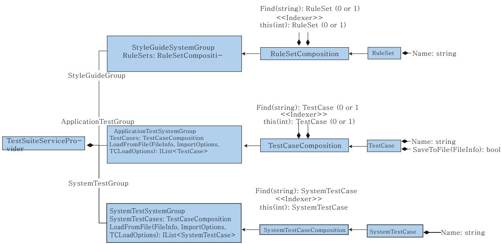
在 TIA Portal Openness 对象模型中，所有类均定义为不会直接实例化的抽象类。下图显示了位于规则集执行和模板副本中的对象。
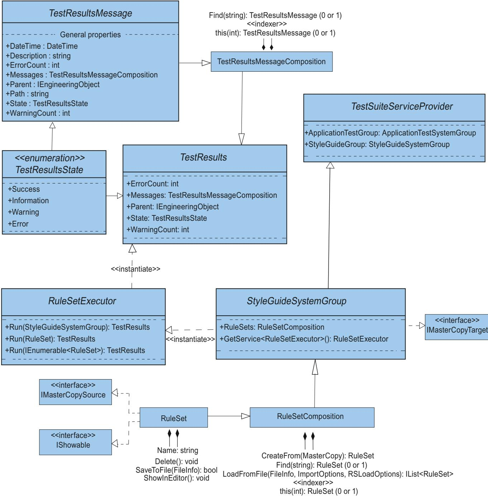  
下图显示了位于测试用例执行和模板副本中的对象。
5.19 Openness 支持  
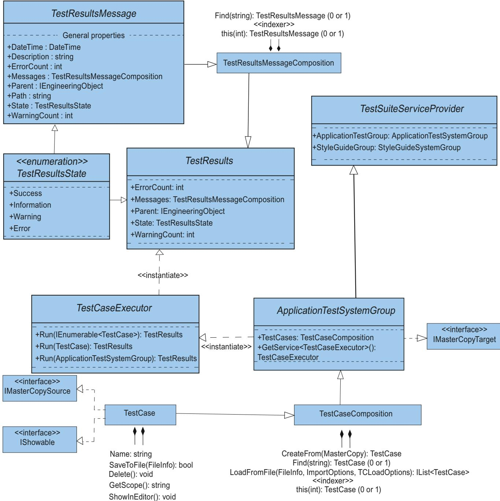
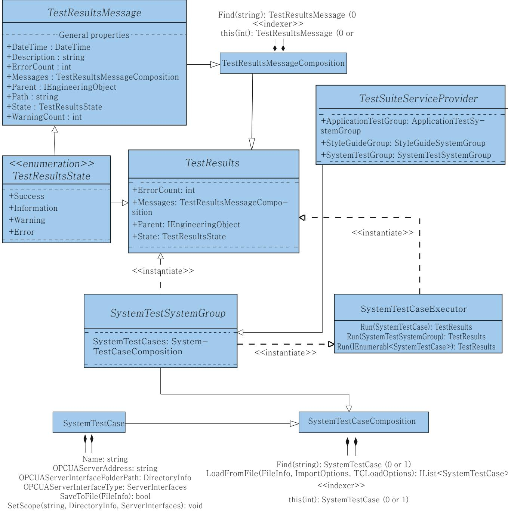
5.19 Openness 支持

### 5.19.2 样式指南中的功能


#### 5.19.2.1 访问样式指南系统文件夹

程序代码
以下属性用于访问作为系统组的一个样式指南系统文件夹：
Using Siemens.Engineering.TestSuite.StyleGuide;
StyleGuideSystemGroup scFolder = testSuite.StyleGuideGroup;
参考
下表列出了样式指南中该类的属性：
<table><tr><td>属性名称</td><td>数据类型</td><td>访问模式</td></tr><tr><td>StyleGuideGroup</td><td>TestSuite.StyleGuide.StyleGuideSystemGroup</td><td>读取</td></tr></table>

#### 5.19.2.2 访问规则集组合

程序代码
以下属性用于列出项目中所有可用的规则集：
RuleSetComposition listRuleSets = testSuite.StyleGuideGroup.RuleSets;
参考
下表列出了样式指南中该类的属性：
<table><tr><td>属性名称</td><td>数据类型</td><td>访问模式</td></tr><tr><td>RuleSets</td><td>TestSuite.RuleSetComposition</td><td>读取</td></tr></table>

#### 5.19.2.3 访问规则集

说明
在 openness 应用程序中，可通过以下两种方式对 TIA Portal 项目中的规则组进行检索：
1. 对于 RuleSetComposition 进行索引访问。
2. 在 RuleSetComposition 执行 Find() 方法。
以下属性用于访问项目中的单个规则集并从项目中检索特定的规则集：
```text
RuleSet rulesetDB = testSuite.StyleGuideGroup.RuleSets[1];
RuleSet ruleSet1 = testSuite.StyleGuideGroup.RuleSets.Find("rulesetDB");
```
参考
下表列出了样式指南中该类的属性：
<table><tr><td>属性名称</td><td>数据类型</td><td>访问模式</td></tr><tr><td>RuleSet</td><td>RuleSetComposition</td><td>读取</td></tr></table>
方法：
public RuleSet Find(string Name)

#### 5.19.2.4 访问规则集名称

访问规则集名称
以下属性用于访问规则集名称：
```javascript
string ruleSetName = testSuite.StyleGuideGroup.RuleSets[0].Name;
```
使用一个有效名称对所选规则集进行重命名
通过以下属性，可使用一个有效的名称对所选规则集进行重命名。
```text
public string Name { get; set; }
```
通过上述“名称”(Name) 属性，可执行以下任务：
• 读取现有规则集的名称
• 更改现有规则集的名称

##### 参考

下表列出了样式指南中该类的属性：
<table><tr><td>属性名称</td><td>数据类型</td><td>访问模式</td></tr><tr><td>Name</td><td>String</td><td>读/写</td></tr></table>
程序代码
修改以下程序代码，使用一个有效名称对规则集进行重命名：
```cs
using Siemens.Engineering;
using Siemens.Engineering.TestSuite;
using Siemens.Engineering.TestSuite.StyleGuide;
ProjectBase tiaProject = ... ;
TestSuiteService testSuite = tiaProject chloride<TestingSuiteService>();
RuleSetExecutor styleGuideService =
testSuite.StyleGuideGroup chloride<RuleSetExecutor>();
//Read the name of a rule set
//Retrieve single rule set
RuleSet myRuleSet1 = testSuite.StyleGuideGroup.RuleSets[0];
String myRuleSet_name = myRuleSet1.Name;
//Modify the name of a rule set
myRuleSet1.Name = "myRuleSet_modified";
```
如果提供的名称错误（如，以空格开头，或包含无效字符），则应用程序将显示一条异常消息。

#### 5.19.2.5 显示规则集


##### 在“WithUI”下打开所选规则集

下述属性用于在“WithUI”模式下于 TIA Portal 编辑器中打开所选规则集。
```text
public void ShowInEditor();
```
用户可修改和使用以下程序代码示例，从而在“WithUI”模式下于 TIA Portal 编辑器中打开规则集：
```cs
using Siemens.Engineering;
using Siemens.Engineering.SW;
...
using Siemens.Engineering.TestSuite;
using Siemens.Engineering.TestSuite.StyleGuide;
//Retrives the first device available in the project
var device = tiaProject.Devices.First();
//Retrives "PLC_1" object from the above device
var deviceItem = device.DeviceItems.First(e => e.Classification == DeviceItemClassifications.CPU && e.Name == "PLC_1");
//Accessing rule set from same project
RuleSet myRuleSet = tiaProject.GetService<TestSuiteService>().StyleGuideGroup.RuleSets[1];
//Shows the selected item
myRuleSet.ShowInEditor();
```

#### 5.19.2.6 删除规则集


##### 在“WithUI”下删除所选规则集

下述属性的作用是，在“withUI/WithoutUI”模式下于 TIA Portal 编辑器中删除所选规则集。
```text
public void Delete();
```
5.19 Openness 支持
用户可修改和使用以下程序代码示例，从而在“withUI/WithoutUI”模式下于 TIA Portal 编辑器中删除规则集：
```cs
using Siemens.Engineering;
using Siemens.Engineering.SW;
...
using Siemens.Engineering.TestSuite;
using Siemens.Engineering.TestSuite.StyleGuide;
//Retrives the first device available in the project
var device = tiaProject.Devices.First();
//Retrives "PLC_1" object from the above device
var deviceItem = device.DeviceItems.First(e => e.Classification == DeviceItemClassifications.CPU && e.Name == "PLC_1");
//Accessing rule set from same project
RuleSet myRuleSet = tiaProject.GetService<TestSuiteService>().StyleGuideGroup.RuleSets[1];
//Deletes the selected item
myRuleSet.Delete();
```

#### 5.19.2.7 修改规则集的范围


##### 更新现有规则集的范围


##### 设置规则集的范围

可使用以下 API 更新现有规则集的范围。
参考
可通过以下方法修改规则集的范围：
• SetScope()
```text
- CopyScope ()
```
下表列出了该类的语法：
public bool SetScope(UpdateOptions updateOptions, IList<IEngineeringObject> step7Objects);
下表列出了该类的属性：
<table><tr><td>名称</td><td>数据类型</td><td>说明</td></tr><tr><td rowspan="3">参数</td><td>UpdateOptions.Override</td><td>用同一项目中提供的新对象列表覆盖现有范围</td></tr><tr><td>UpdateOptions.Add</td><td>将同一项目中提供的新对象列表附加到现有范围</td></tr><tr><td>IList</td><td>可将下表中的对象列表设为规则集的范围</td></tr></table>
访问 STEP 7 对象可为规则集分配范围
<table><tr><td>STEP 7 对象</td><td>Opennes 应用程序中的表示方式(IEngineeringObject)</td><td>说明</td></tr><tr><td>程序块</td><td>PlcBlockSystemGroup</td><td>“程序块”(Program blocks) 文件夹下所有可用块都将设为范围,但“系统块”(System blocks) 文件夹中的块除外</td></tr><tr><td>PLC 变量</td><td>PlcTagTableSystemGroup</td><td>“PLC 变量”(PLC tags) 文件夹下的所有可用变量表都将设为范围</td></tr><tr><td>PLC 数据类型</td><td>PlcTypeSystemGroup</td><td>“PLC 数据类型”(PLC data types) 文件夹下的所有可用 UDT 都将设为范围,但“系统数据类型”(System data types) 文件夹下的 UDT 除外</td></tr><tr><td>软件单元</td><td>UnitGroupUnitGroup.Units[x]UnitGroup.Units[x].PlcBlockSystemGroupUnitGroup.Units[x].PlcTagTableSystemGroupUnitGroup.Units[x].PlcTypeSystemGroup</td><td>“软件单元”(Software Units) 文件夹下的所有可用单元都将设为范围,包括程序块、PLC 变量和 PLC 数据类型。也可在“单元”(Units) 文件夹中具体选择</td></tr></table>
5.19 Openness 支持
<table><tr><td>STEP 7 对象</td><td>Opennes 应用程序中的表示方式 (IEngineeringObject)</td><td>说明</td></tr><tr><td>PLC/CPU</td><td>DeviceItemClassifications.CPU / DeviceItems[0]</td><td>整个“PLC”及上述对象都将设为范围</td></tr><tr><td>项目</td><td>Project</td><td>整个“项目”及上述对象都将设为范围</td></tr><tr><td rowspan="4">用户组</td><td>PlcBlockSystemGroup.Groups[x]</td><td>“程序块”(Program blocks) 文件夹下的特定用户组可设为范围</td></tr><tr><td>PlcTagTableSystemGroup.Groups[x]</td><td>“PLC 变量”(PLC tags) 文件夹下的特定用户组可设为范围</td></tr><tr><td>PlcTypeSystemGroup.Groups[x]</td><td>“PLC 数据类型”(PLC data types) 文件夹下的特定用户组可设为范围</td></tr><tr><td>Project.DeviceGroups[0]</td><td>可将项目下的 PLC 组选作范围</td></tr></table>
设置规则集范围和执行规则集时，样式指南将忽略不支持的 STEP 7 对象。

##### 所用方法

<table><tr><td>方法的名称</td><td>说明</td><td>返回值</td></tr><tr><td rowspan="2">SetScope()</td><td rowspan="2">用于修改现有规则集的范围</td><td>TRUE:选择的受支持对象设为范围时</td></tr><tr><td>FALSE:选择的受支持对象不能设为范围时</td></tr></table>
可修改和使用以下程序代码示例以解压第一个设备项中的 IEngineeringObject：
```cs
using Siemens.Engineering;
...
using Siemens.Engineering.TestSuite;
using Siemens.Engineering.TestSuite.StyleGuide;
// Retrives the first device available in the project
var device = tiaProject.Devices.First();
// To retrieve "PLC_1" object from the above device:
var deviceItem = device.DeviceItems.First(e => e.Classification ==DeviceItemClassifications.CPU && e.Name == "PLC_1");
// To retrieve the software content of the "PLC_1":
var plc = deviceItem.GetService<SoftwareContainer>().Software as PlcSoftware;
// To retrieve all the blocks available under "Program blocks" folder:
var plc1BlockGroup = plc.BlockGroup;
// To list blocks available under specific user group:
var plc1BlockGroupUserGroups = plc.BlockGroup.Groups[x];
// To provide all the tag tables available under "PLC tags" folder:
var plc1TagTableGroup = plc.TagTableGroup;
// To provide the PLC tag tables available under specific user group in "PLC Tags"
var plc1TagTableGroupUserGroups = plc.TagTableGroup.Groups[x];
// To provide all the UDTs available under "PLC data types" folder:
var plc1DataTypes = plc.TypeGroup;
var plc1DataTypes = plc.TypeGroup.Groups[x];
// To access all "Software units" available in "PLC_1":
var plc1SoftwareUnit = plc chlorideService<PlcUnitProvider>().UnitGroup;
// To provide all the supported objects available in "Entire Project":
ProjectBase Project1 = tiaProject;
// To provide objects from group of devices in a project:
var GroupOfPLC1 = tiaProject.DeviceGroups[x];
// To access rule set from same project
RuleSet ruleSet1 = tiaProject chlorideService<TestSuiteService>().StyleGuideGroup.RuleSets[1];
// update the scope of a ruleSet1:
// The below line of code appends the existing scope with new list of objects:
ruleSet1.SetScope(UpdateOptions.Add, new List<IEngineeringObject> { plc1BlockGroup, plc1DataTypes, plc1TagTableGroup, plc1SoftwareUnit});
// The below code overwrites the existing scope with new objects:
```
ruleSet1.SetScope(UpdateOptions.Override, new List<IEngineeringObject>{GroupOfPLC1 });

##### 将一个规则集的范围分配给另一个规则集

可使用以下 API 将一个规则集的范围复制到同一项目中的另一个规则集。
参考
下表列出了该类的语法：
public bool CopyScope(RuleSet targRuleSet);
下表列出了该类的属性：
<table><tr><td>名称</td><td>数据类型</td><td>说明</td></tr><tr><td>targRuleSet</td><td>RuleSet</td><td>要更新范围的目标规则集</td></tr></table>
<table><tr><td>方法的名称</td><td>说明</td><td>返回值</td></tr><tr><td rowspan="2">CopyScope()</td><td rowspan="2">用于将一个规则集的范围分配给另一个规则集</td><td>TRUE: 范围已成功复制</td></tr><tr><td>FALSE: 范围复制失败</td></tr></table>
5.19 Openness 支持
用户可修改和使用以下程序代码示例：
```cs
// To access source and target rule sets from same project:
RuleSet srcRuleSet = tiaProject.GetValue<TestSuiteService>().StyleGuideGroup.RuleSets[1];
RuleSet targRuleSet =
tiaProject.GetService TesterSuiteService>().StyleGuideGroup.RuleSets[10];
RuleSet srcRuleSet1 =
tiaProject.GetValue TesterSuiteService>().StyleGuideGroup.Find("myRS");
RuleSet targRuleSet1 =
tiaProject.GetValue TesterSuiteService>().StyleGuideGroup.Find("PLC");
// To assign scope from source to target rule set:
bool retval = srcRuleSet.CopyScope(targRuleSet);
bool retval1 = srcRuleSet1.CopyScope(targRuleSet1);
```

#### 5.19.2.8 规则集的执行

在 Openness 应用中，可通过以下三种方式执行规则集：
1. 执行特定的规则集。
2. 执行规则集列表。
3. 执行样式指南文件夹中的所有规则集。
参考
签名
```java
public RuleSetExecutor GetService<RuleSetExecutor>();
public TestResults Run(RuleSet ruleSet);
public TestResults Run(new IEnumerable<RuleSet>() {myRuleSet1, myStyleSet2, .. });
public TestResults Run(StyleGuideGroup allRuleSets);
```
TestResults 支持以下属性：
<table><tr><td>属性名称</td><td>数据类型</td><td>访问模式</td><td>描述</td></tr><tr><td>Messages</td><td>Siemens.Engineering.TestSuite.TestResultsMessageComposition</td><td>读取</td><td>反馈消息的内容</td></tr><tr><td>Parent</td><td>IEngineeringObject</td><td>读取</td><td>返回该库的父级库</td></tr></table>
5.19 Openness 支持
<table><tr><td>属性名称</td><td>数据类型</td><td>访问模式</td><td>描述</td></tr><tr><td>State</td><td>Siemens.Engineering.TestSuite.TestResultsState</td><td>读取</td><td>测试结果反馈消息中的最终状态,可能的值包括:警告、错误和成功</td></tr><tr><td>WarningCount</td><td>Int</td><td>读取</td><td>测试结果反馈消息中的警告数量</td></tr><tr><td>ErrorCount</td><td>Int</td><td>读取</td><td>测试结果反馈消息中的错误数量</td></tr><tr><td>Description</td><td>String</td><td>读取</td><td>测试结果反馈消息的描述或内容</td></tr><tr><td>DateTime</td><td>DateTime</td><td>读取</td><td>测试结果反馈消息中的日期和时间</td></tr><tr><td>Path</td><td>String</td><td>读取</td><td>测试结果反馈消息的路径</td></tr></table>

##### 使用的方法

<table><tr><td>方法的名称</td><td>描述</td></tr><tr><td>Run()</td><td>用于运行所选规则集</td></tr></table>
说明
时间戳格式
所有时间戳均采用 UTC 格式。如果要查看本地时间，可使用 DateTime.ToLocalTime()。

##### 用户可修改和使用以下程序代码示例：

```dart
using Siemens.Engineering;
using Siemens.Engineering.TestSuite;
using Siemens.Engineering.TestSuite.StyleGuide;
Project tiaProject = ... ;
TestSuiteService testSuite = tiaProject.GetService<TestSuiteService>();
RuleSetExecutor styleGuideService =
testSuite.StyleGuideGroup.GetService<RuleSetExecutor>();
//To execute specific rule set:
//Retrieve single rule set:
//Rule set at 0th index is available in the project:
RuleSet myRuleSet1 = testSuite.StyleGuideGroup.RuleSets[0];
//RuleSet_10 is available in the project:
RuleSet myStyleSet2 = testSuite.StyleGuideGroup.RuleSets.Find("RuleSet_10");
//Execute above retrieved rule sets:
TestResults ruleSetResults1 = styleGuideService.Run(myRuleSet1);
TestResults ruleSetResults2 = styleGuideService.Run(myStyleSet2);
//To execute list of rule sets:
//Retrieve list of rule sets to execute:
IEnumerable<RuleSet> ruleSetList = new List<RuleSet>() { myRuleSet1,myStyleSet2 };
//Execute above retrieved list of rule sets:
TestResults ruleSetsResults3 = styleGuideService.Run(ruleSetList);
//To execute all rule sets in StyleGuideGroup:
//Retrieve list of rule sets to execute:
StyleGuideSystemGroup styleGuideFolder = testSuite.StyleGuideGroup;
//Execute all available rule sets in Styleguide folder:
TestResults ruleSetsResults4 = styleGuideService.Run(styleGuideFolder);
```
用户可使用以下代码访问上述测试结果并循环访问 TestResults 消息：
```cs
using Siemens.Engineering;
using Siemens.Engineering.TestSuite;
using Siemens.Engineering.TestSuite.StyleGuide;
...
//Retrieve test results of single rule set execution
WriteTestResults(ruleSetResults1);
//Retrieve test results of list of rule sets execution
WriteTestResults(ruleSetsResults3);
//Retrieve test results of rule sets execution available in "StyleGuideGroup"
WriteTestResults(ruleSetsResults4);
...
private void WriteTestResults (TestResults result)
{
Console.WriteLine("State:" + result.State);
Console.WriteLine("Warning Count:" + result.WarningCount);
Console.WriteLine("Error Count:" + result.ErrorCount);
RecursivelyWriteMessages(result.Messages);
}
private void RecursivelyWriteMessages(TestResultsMessageComposition messages, string indent = "")
{
indent += "\t";
foreach (TestResultsMessage message in messages)
{
Console.WriteLine(indent + "Path: " + message.Path);
Console.WriteLine(indent + "DateTime: " + message.DateTime);
Console.WriteLine(indent + "State: " + message.State);
Console.WriteLine(indent + "Description: " + message.Description);
Console.WriteLine(indent + "Warning Count: " + message.WarningCount);
Console.WriteLine(indent + "Error Count: " + message.ErrorCount);
RecursivelyWriteMessages(message規定, indent);
}
}
```
5.19 Openness 支持

#### 5.19.2.9 规则集的导入和导出

使用的方法
以下方法可用于导入和导出规则集：
<table><tr><td>方法的名称</td><td>描述</td></tr><tr><td>SaveToFile()</td><td>将规则集导出到外部源文件中</td></tr><tr><td>LoadFromFile()</td><td>导入外部源文件中的规则集</td></tr></table>

##### 将规则集保存到外部文件中

要求
• TIA Portal Openness 应用程序已连接 TIA Portal。
应用
使用SaveToFile() 方法，将特定规则集导出到指定路径中。
签名
public void SaveToFile(FileInfo path);
下表列出了所需的方法参数：
<table><tr><td>参数名称</td><td>描述</td></tr><tr><td>FileInfo</td><td>保存规则集的完整路径</td></tr></table>
程序代码
这里的 styleChecks 和 styleChecks1 为“MyProject”中的规则集。
```javascript
RuleSetComposition styleChecks = testSuite.StyleGuideGroup.RuleSets;
RuleSetComposition styleChecks1 = testSuite.StyleGuideGroup.RuleSets;
styleChecks.SaveToFile(exportFile);
styleChecks1.SaveToFile(new FileInfo(@"D:\Temp\TSRuleSets1.xml"));
```

##### 将外部文本文件中的规则集加载到项目中

要求
• TIA Portal Openness 应用程序已连接 TIA Portal。
在 RuleSetComposition 上，使用 LoadFromFile() 方法从所选文件中导入规则集。
public IEnumerable<RuleSet> LoadFromFile (FileInfo path, ImportOptions loadOptions, RSLoadOptions rsLoadOptions);
下表列出了所需的方法参数：
<table><tr><td>参数名称</td><td>描述</td></tr><tr><td>FileInfo</td><td>保存规则集的完整路径</td></tr><tr><td>ImportOptions.None</td><td>如果项目中存在同名规则集/文件中包含多条同名的规则集,则生成异常错误</td></tr><tr><td>ImportOptions.Override</td><td>覆盖项目中现有的同名规则集。</td></tr><tr><td>RSLoadOptions.IgnorePropertyErrors</td><td>“作者/版本/注释”中的属性值无效时也导入规则集</td></tr><tr><td>RSLoadOptions.None</td><td>仅当目标文件中无警告/错误时才导入规则集</td></tr><tr><td>RSLoadOptions.IgnoreMissingAttributes</td><td>导入规则集时如果规则属性缺失,则使用系统默认值</td></tr><tr><td>RSLoadOptions.SkipInvalidObjects</td><td>导入规则集时,跳过属性无效的规则</td></tr></table>

##### 示例：

```text
// Throw Exception if the rule set with the same name exists already
// Import the rule set with a invalid properties.
FileInfo LoadFile = new FileInfo(@"D:\Temp\TSRuleSets1.xml");
styleChecks.LoadFromFile(LoadFile, ImportOptions.None, RSLoadOptions.IgnorePropertyErrors);
// Import rule set with the same name exists already
// Throw exception and abort the import of rule set when there are errors/warnings
FileInfo LoadFile = new FileInfo(@"D:\Temp\TSRuleSets1.xml");
styleChecks.LoadFromFile(LoadFile, ImportOptions.None, RSLoadOptions.None);
// Import rule set with the same name exists already
FileInfo LoadFile = new FileInfo(@"D:\Temp\TSRuleSets1.xml");
styleChecks.LoadFromFile(LoadFile, ImportOptions.Override, RSLoadOptions...);
```
```cs
// Overwrite rule set with the same name exists already in project
FileInfo LoadFile = new FileInfo(@"D:\Temp\TSRuleSets1.xml");
styleChecks.LoadFromFile(LoadFile, ImportOptions.Override, RSLoadOptions...);
// Import rule sets with the default values for the rules with missing attributes
FileInfo LoadFile = new FileInfo(@"D:\Temp\TSRuleSets1.xml");
styleChecks.LoadFromFile(LoadFile, ImportOptions....
RSLoadOptions.IgnoreMissingAttributes);
// Import rule sets and skip the import for the rules with invalid attributes
FileInfo LoadFile = new FileInfo(@"D:\Temp\TSRuleSets1.xml");
styleChecks.LoadFromFile(LoadFile, ImportOptions..., RSLoadOptions.SkipInvalidObjects);
// Import the rule set by replacing missing rule attributes with default values and skipping rules with invalid attributes
FileInfo LoadFile = new FileInfo(@"D:\Temp\TSRuleSets1.xml");
styleChecks.LoadFromFile(LoadFile, ImportOptions..., RSLoadOptions.IgnoreMissingAttributes | RSLoadOptions.SkipInvalidObjects);
// Imports the rule set(s) with errors in rule set property values, replaces the missing rule attribute values with the default ones and skips the rules with invalid attributes
FileInfo LoadFile = new FileInfo(@"D:\Temp\TSRuleSets1.xml");
styleChecks.LoadFromFile(LoadFile, ImportOptions..., RSLoadOptions.IgnoreMissingAttributes | RSLoadOptions.SkipInvalidObjects | RSLoadOptions.IgnorePropertyErrors);
```

#### 5.19.2.10 使用库


##### 将规则集复制到库中

项目中的规则集可复制到库中进行存储，以便继续使用和修改。进行外部修改时，无需显式导出/导入规则集。
如果项目库以读写模式打开，可在目标位置创建 IMasterCopySource 的 MasterCopy。
参考
下表描述了类的语法：
public MasterCopy Create (IMasterCopySource sourceObject);
<table><tr><td>方法的名称</td><td>描述</td></tr><tr><td>Create()</td><td>将项目中的规则集复制到项目/全局库中</td></tr></table>
要将项目中的规则集复制到库中，可修改和使用以下程序代码示例：
```cs
using Siemens.Engineering;
...
using Siemens.Engineering.TestSuite;
using Siemens.Engineering.TestSuite.StyleGuide;
using Siemens.Engineering.Library.Mastercopies;
...
// Retrieving rule set to copy to libraries:
RuleSet myRuleSet = testSuite.StyleGuideGroup.RuleSets.Find("CalcRuleSet");
// For copying a rule set to project library master copy system folder:
MasterCopy masterCopyInSystemFolder =
tiaProject.ProjectLibrary.MasterCopyFolder.MasterCopies.Create(myRuleSet);
// For copying a rule set to project library master copy user folder:
MasterCopy masterCopyinUserFolder =
tiaProject.ProjectLibrary.MasterCopyFolder.Folders[0]].MasterCopies.Create(myRuleSet);
tiaPortal.GlobalLibraries.Open(new FileInfo(@"D:\Documents\..), OpenMode.ReadWrite);
// For copying a rule set to global library master copy system folder:
MasterCopy masterCopyInSystemFolder =
tiaPortal.GlobalLibraries[0].MasterCopyFolder.MasterCopies.Create(myRuleSet);
// For copying a rule set to global library master copy user folder:
MasterCopy masterCopyinUserFolder =
tiaPortal.GlobalLibraries[0].MasterCopyFolder.Folders[0].MasterCopies.Create(myRuleSet);
```

##### 将模版副本复制到项目中

TIA Portal Openness API 接口支持使用 CreateFrom 操作将模板副本复制到项目。此操作将基于源模板副本创建新的对象，并将其放置在调用操作的元素中。该操作将创建一个与原模板副本同名的新规则集。如果该名称在 RuleSetComposition 中已存在，则系统将为新的规则集指定一个新的名称。之后，再返回复制后的新规则集。
下表描述了类的语法：
```text
public RuleSet CreateFrom (MasterCopy masterCopy);
```
<table><tr><td>方法的名称</td><td>描述</td></tr><tr><td>CreateFrom()</td><td>用于将项目库/全局库中的模板副本复制到项目</td></tr></table>
可修改并使用以下程序代码示例将模板副本从项目复制到库：
```cs
using Siemens.Engineering;
using Siemens.Engineering.TestSuite;
using Siemens.Engineering.TestSuite.StyleGuide;
using Siemens.Engineering.Library.Mastercopies;
// For accessing master copy object in global library to copy to project:
var masterCopyObjectinGL = tiaPortal.GlobalLibraries[0].MasterCopyFolder.MasterCopies[0];
var masterCopyObjectinUserFolderinGL =
tiaPortal.GlobalLibraries[0].MasterCopyFolder.Folders[0].MasterCopies[1];
// To copy rule set from global library system folder to project:
RuleSet RuleSet1 = testSuite.StyleGuideGroup.RuleSets.CreateFrom(masterCopyObjectinGL);
// To copy rule set from global library user folder to project:
RuleSet RuleSet2
= testSuite.StyleGuideGroup.RuleSets.CreateFrom(masterCopyObjectinUserFolderinGL);
// For accessing master copy object in project library to copy to project:
var masterCopyObjectinPL = tiaProject.ProjectLibrary.MasterCopyFolder.MasterCopies[0];
var masterCopyObjectinUserFolderinPL
= tiaProject.ProjectLibrary.MasterCopyFolder.Folders[0].MasterCopies[0];
// To copy rule set from project library system folder to project:
RuleSet RuleSet3 = testSuite.StyleGuideGroup.RuleSets.CreateFrom(masterCopyObjectinPL);
// To copy rule set from project library user folder to project:
RuleSet RuleSet4
= testSuite.StyleGuideGroup.RuleSets.CreateFrom(masterCopyObjectinUserFolderinPL);
```
在库中或库间复制模板副本（类型为 RuleSet）
要在库内以及库间复制模板副本（类型为 TestCase），请参见信息系统中TIA PortalOpenness API 的“库功能”一章下的复制模板副本主题。
5.19 Openness 支持

### 5.19.3 应用测试函数


#### 5.19.3.1 访问应用测试系统文件夹

程序代码
以下属性用于访问作为系统组的一个 Test Suite 系统文件夹：
```cs
using Siemens.Engineering;
using Siemens.Engineering.TestSuite;
using Siemens.Engineering.TestSuite.ApplicationTest;
TestSuiteService testSuite = project.GetService<TestSuiteService>( ) ; ApplicationTestSystemGroup atfFolder = testSuite.ApplicationTestGroup;
```
此处的“project”是在 openness 应用程序中解压的 TIA Portal 项目的实例。
参考
下表列出了应用测试类的属性：
<table><tr><td>属性名称</td><td>数据类型</td><td>访问模式</td></tr><tr><td>ApplicationTestGroup</td><td>TestSuite.ApplicationTest.ApplicationTestSystemGroup</td><td>读取</td></tr></table>

#### 5.19.3.2 访问 Test Case 组成

程序代码
以下属性用于列出项目中所有可用的测试用例：
```javascript
TestCaseComposition listTestCases = testSuite.ApplicationTestGroup.TestCases;
```
参考
下表列出了应用测试类的属性：
<table><tr><td>属性名称</td><td>数据类型</td><td>访问模式</td></tr><tr><td>TestCases</td><td>TestSuite.TestCaseComposition</td><td>读取</td></tr></table>

#### 5.19.3.3 访问 Test Case

说明
在 openness 应用程序中，可通过以下两种方式对 TIA Portal 项目中的测试案例进行检索：
1. 对于 TestCaseComposition 进行索引访问。
2. 在 TestCaseComposition 执行 Find() 方法。
程序代码
以下属性用于访问项目中的单个测试用例并从项目中检索特定的测试用例：
TestCase motorFCTestcase = testSuite.ApplicationTestGroup.TestCases[1]; TestCase testCase = testSuite.ApplicationTestGroup.TestCases.Find("TCMot");
参考
下表列出了应用测试类的属性：
<table><tr><td>属性名称</td><td>数据类型</td><td>访问模式</td></tr><tr><td>TestCases</td><td>TestCaseComposition</td><td>读取</td></tr></table>
方法：
public TestCase Find(string Name)
5.19 Openness 支持

#### 5.19.3.4 访问 Test Case 名称


##### 访问测试用例名称

以下属性用于访问测试用例名称：
```text
string testCaseName = testSuite.ApplicationTestGroup.TestCases[0].Name;
```
使用一个有效名称对所选测试用例进行重命名
通过以下属性，可使用一个有效的名称对所选测试用例进行重命名。
```text
public string Name { get; set; }
```
说明
通过上述“名称”(Name) 属性，可执行以下任务：
• 读取现有测试用例的名称
• 更改现有测试用例的名称
参考
下表列出了应用程序测试中该类的属性：
<table><tr><td>属性名称</td><td>数据类型</td><td>访问模式</td></tr><tr><td>Name</td><td>String</td><td>读/写</td></tr></table>
程序代码
修改以下程序代码，使用一个有效名称对测试用例进行重命名：
```cs
using Siemens.Engineering;
using Siemens.Engineering.TestSuite;
using Siemens.Engineering.TestSuite.ApplicationTest;
ProjectBase tiaProject = ... ; TestSuiteService testSuite =
tiaProject.GetService TesterSuiteService>();
TestCaseExecutor applicationTestService =
testSuite.ApplicationTestGroup SierraService TesterCaseExecutor>();
//Read the name of a test case
//Retrieve single test case
TestCase myTestCase1 = testSuite.ApplicationTestGroup.TestCases[0];
String myTestCase_name = myTestCase1.Name;
//Modify the name of a test case
myTestCase1.Name = "myTestCase_modified";
```
说明
如果提供的名称错误（如，以空格开头，或包含无效字符），则应用程序将显示一条异常消息。

#### 5.19.3.5 访问测试用例范围


##### 访问现有测试用例的范围

通过以下方法，可访问现有测试用例的范围：
GetScope()
下表列出了该类的语法：
public plcSoftware GetScope();
下表列出了该类的属性：
<table><tr><td>名称</td><td>数据类型</td><td>说明</td></tr><tr><td>参数</td><td>string</td><td>PLC 的名称,选择为测试用例范围</td></tr></table>
通过修改和使用以下程序代码示例，可访问现有测试用例范围：
```cs
using Siemens.Engineering;
using Siemens.Engineering.SW;
...
using Siemens.Engineering.TestSuite;
using Siemens.Engineering.TestSuite.ApplicationTest;
//Retrives the first device available in the project
var device = tiaProject.Devices.First();
//Retrives "PLC_1" object from the above device
var deviceItem = device.DeviceItems.First(e => e.Classification == DeviceItemClassifications.CPU && e.Name == "PLC_1");
//Accessing test case from same project
TestCase myTestCase =
tiaProject TokService<TestsuiteService>( ).ApplicationTestGroup.TestCases[1];
//Access the scope of myTestCase
PlcSoftware twoHandMonitor = myTestCase.GetScope();
```

#### 5.19.3.6 显示测试用例


##### 在“WIthUI”中打开所选测试用例

使用以下语句，可在“WithUI”模式下在 TIA Portal 编辑器中打开所选的测试用例。
```text
public void ShowInEditor();
```
通过修改和使用以下程序代码示例，可在“WithUI”模式下在 TIA Portal 编辑器中打开所选的测试用例：
```cs
using Siemens.Engineering;
using Siemens.Engineering.SW;
...
using Siemens.Engineering.TestSuite;
using Siemens.Engineering.TestSuite.ApplicationTest;
//Retrives the first device available in the project
var device = tiaProject.Devices.First();
//Retrives "PLC_1" object from the above device
var deviceItem = device.DeviceItems.First(e => e.Classification == DeviceItemClassifications.CPU && e.Name == "PLC_1");
//Accessing test case from same project
TestCase myTestCase =
tiaProject.GetService<TestSuiteService>().ApplicationTestGroup.TestCases[1];
//Shows the selected item
myTestCase.ShowInEditor();
```

#### 5.19.3.7 删除测试用例


##### 在“WithUI/WithoutUI”中删除所选测试用例

使用以下语句，可在“withUI/WithoutUI”模式下删除 TIA Portal 项目中所选的测试用例。
```text
public void Delete();
```
5.19 Openness 支持
通过修改和使用以下程序代码示例，可在“withUI/WithoutUI”模式下删除 TIA Portal 项目中所选的测试用例：
```cs
using Siemens.Engineering;
using Siemens.Engineering.SW;
...
using Siemens.Engineering.TestSuite;
using Siemens.Engineering.TestSuite.ApplicationTest;
//Retrives the first device available in the project
var device = tiaProject.Devices.First();
//Retrives "PLC_1" object from the above device
var deviceItem = device.DeviceItems.First(e => e.Classification == DeviceItemClassifications.CPU && e.Name == "PLC_1");
//Accessing test case from same project
TestCase myTestCase =
tiaProject TokService<TestsuiteService>().ApplicationTestGroup.TestCases[1];
//Deletes the selected item
myTestCase.Delete();
```

#### 5.19.3.8 修改测试用例的范围


##### 更新现有测试用例的范围


##### 设置测试用例的范围

使用以下 API，可更新现有测试用例的范围。
参考
通过以下方法，可修改测试用例的范围：
```text
- SetScope()
```
下表描述了类的语法：
public void SetScope(plcSoftware PLC);
public void SetScope(plcSoftware PLC, string instanceName, ExecutionMode tcExecution);

##### 下表列出了该类的属性：

<table><tr><td>参数</td><td>数据类型</td><td>说明</td></tr><tr><td>plcSoftware</td><td>plcSoftware</td><td>CPU 类型对象与 PLCSIM Advanced相兼容</td></tr><tr><td>instanceName</td><td>string</td><td>PLC 高级实例的名称</td></tr><tr><td>tcExecutionMode</td><td>ExecutionMode</td><td>使用 ExternallyManagedPLCSIMInstance / SystemManagedPLCSIMInstance 选择测试用例执行模型</td></tr></table>
说明
无法使用 SetScope() API 设置软件控制器的范围
可修改和使用以下程序代码示例：
```cs
using Siemens.Engineering;
using Siemens.Engineering.SW;
...
using Siemens.Engineering.TestSuite;
using Siemens.Engineering.TestSuite.ApplicationTest;
//Retrives the first device available in the project
var device = tiaProject.Devices.First();
//To retrieve "PLC_1" object from the above device:
var deviceItem = device.DeviceItems.First(e => e.Classification ==DeviceItemClassifications.CPU && e.Name == "PLC_1");
//To retrieve the software content of the "PLC_1":
var twoHandMonitor = deviceItem TokService<SoftwareContainer>( ).Software as PlcSoftware;
//To access test case from same project
TestCase myTestCase =
tiaProject TokService<TestSuiteService>( ).ApplicationTestGroup.TestCases[1];
//Updates the scope of myTestCase:
myTestCase.SetScope(twoHandMonitor);
```
```cs
using Siemens.Engineering;
using Siemens.Engineering.SW;
...
using Siemens.Engineering.TestSuite;
using Siemens.Engineering.TestSuite.ApplicationTest;
//Retrives the first device available in the project
var device = tiaProject.Devices.First();
//Creates a new TIA portal instance
TiaPortal tiaPortal = new TiaPortal(TiaPortalMode.WithUserInterface);
//Assigns the path of the project to the project path variable
FileInfo projectPath = new FileInfo(project_path);
//Opens the TIA project AND Test Suite
Project tiaProject = tiaPortal.Projects.Open(projectPath);
TestSuiteService testSuite = tiaProject.GetService<TestSuiteService>();
//To retrieve "PLC_1" object from the above device:
var deviceItem = device.DeviceItems.First(e => e.Classification == DeviceItemClassifications.CPU && e.Name == "PLC_1");
//To retrieve the software content of the "PLC_1":
var plc = deviceItem.GetService<SoftwareContainer>().Software as PlcSoftware;
//Specifies the instance name
string instanceName = "SetScope";
//To access test case from same project
TestCase myTestCase = testSuite.ApplicationTestGroup.TestCases[1];
//Updates the scope of ExternallyManagedPLCSIMInstance:
myTestCase.SetScope(plc, instanceName,
ExecutionMode.ExternallyManagedPLCSIMInstance);
```

#### 5.19.3.9 执行测试用例

在 Openness 应用中，可通过以下三种方式执行测试用例：
1. 针对特定的测试用例。
2. 针对测试用例列表。
3.“应用程序”(Application) 测试文件夹中的所有测试用例。
参考
签名
public TestCaseExecutor GetService<TestCaseExecutor>();
public TestResults Run(TestCase myTestCase);
public TestResults Run(new IEnumerable<TestCase>() {myTestCase1,myTestCase2,.. });
public TestResults Run(ApplicationTestGroup allTestCases);
TestResults 支持以下属性：
<table><tr><td>属性名称</td><td>数据类型</td><td>访问模式</td><td>说明</td></tr><tr><td>Messages</td><td>Siemens.Engineering.TestSuite.TestResultsMessageComposition</td><td>读取</td><td>反馈消息的内容</td></tr><tr><td>Parent</td><td>IEngineeringObject</td><td>读取</td><td>返回该库的父级库</td></tr><tr><td>State</td><td>Siemens.Engineering.TestSuite.TestResultsState</td><td>读取</td><td>测试结果反馈消息中的最终状态,可能的值包括:警告、错误和成功</td></tr><tr><td>WarningCount</td><td>Int</td><td>读取</td><td>测试结果反馈消息中的警告数量</td></tr><tr><td>ErrorCount</td><td>Int</td><td>读取</td><td>测试结果反馈消息中的错误数量</td></tr><tr><td>Description</td><td>String</td><td>读取</td><td>测试结果反馈消息的描述或内容</td></tr><tr><td>DateTime</td><td>DateTime</td><td>读取</td><td>测试结果反馈消息中的日期和时间</td></tr><tr><td>Path</td><td>String</td><td>读取</td><td>测试结果反馈消息的路径</td></tr></table>
<table><tr><td>方法的名称</td><td>说明</td></tr><tr><td>Run()</td><td>用于运行所选测试用例</td></tr></table>
所有时间戳均采用 UTC 格式。如果要查看本地时间，可使用 DateTime.ToLocalTime()。
ExternallyManagedPLCSIMInstance 或 SystemManagedPLCSIMInstance 组态模式下均可运行测试用例。
有关 ExternallyManagedPLCSIMInstance 的信息，请参见使用ExternallyManagedPLCSIMInstance 执行测试用例
可修改和使用以下程序代码示例：
```cs
using Siemens.Engineering;
using Siemens.Engineering.TestSuite;
using Siemens.Engineering.TestSuite.ApplicationTest;
ProjectBase tiaProject = ... ;
TestSuiteService testSuite = tiaProject.GetService<TestSuiteService>();
TestCaseExecutor applicationTestService =
testSuite.ApplicationTestGroup.GetService<TestCaseExecutor>();
//To execute specific test case:
//Retrieve single test case:
//Test case at 0th index is available in the project:
TestCase myTestCase1 = testSuite.ApplicationTestGroup.TestCases[0];
//TestCase_10 is available in the project:
TestCase myTestCase2 =
testSuite.ApplicationTestGroup.TestCases.Find("TestCase_10");
//Execute above retrieved test cases:
TestResults TestCaseResults1 = applicationTestService.Run(myTestCase1);
TestResults TestCaseResults2 = applicationTestService.Run(myTestCase2);
//To execute list of test cases:
//Retrieve list of test cases to execute:
IEnumerable<TestCase> TestCaseList = new List<TestCase>()
{ myTestCase1,myTestCase2 };
//Execute above retrieved list of test cases:
TestResults TestCasesResults3 = applicationTestService.Run(TestCaseList);
//To execute all test cases in ApplicationTestGroup:
//Retrieve list of test cases to execute:
ApplicationTestSystemGroup applicationTestFolder =
testSuite.ApplicationTestGroup;
//Execute all available test cases in ApplicationTestFolder:
TestResults TestCasesResults4 =
applicationTestService.Run(applicationTestFolder);
```

##### 用户可使用以下代码访问上述测试结果并循环访问 TestResults 消息：

```cs
using Siemens.Engineering;
using Siemens.Engineering.TestSuite;
using Siemens.Engineering.TestSuite.ApplicationTest;
//Retrieve test results of single test case execution
WriteTestResults (TestCaseResults1);
//Retrieve test results of list of test cases execution
WriteTestResults (TestCasesResults3);
//Retrieve test results of test cases execution available in "ApplicationTestGroup"
WriteTestResults (TestCasesResults4);
private void WriteTestResults (TestResults result)
{
    Console.WriteLine("State:" + result.State);
    Console.WriteLine("Warning Count:" + result.WarningCount);
    Console.WriteLine("Error Count:" + result.ErrorCount);
    RecursivelyWriteMessages(result.Messages);
}
private void RecursivelyWriteMessages(TestResultsMessageComposition messages, string indent = "")
{
    indent += "\t";
    foreach (TestResultsMessage message in messages)
{
    Console.WriteLine(indent + "Path: " + message.Path);
    Console.WriteLine(indent + "DateTime: " + message.DateTime);
    Console.WriteLine(indent + "State: " + message.State);
    Console.WriteLine(indent + "Description: " + message.Description);
    Console.WriteLine(indent + "Warning Count: " + message.WarningCount);
    Console.WriteLine(indent + "Error Count: " + message.ErrorCount);
    RecursivelyWriteMessages(message規定, indent);
}
```
通过复制并修改以下示例代码，可在“ExternallyManagedPLCSIMInstance 模式”下运行测试用例。
5.19 Openness 支持
```cs
using Siemens.Engineering;
using Siemens.Engineering.TestSuite;
using Siemens.Engineering.TestSuite.ApplicationTest;
using Siemens.Simatic.Simulation.Runtime;
string m_PlcInstanceName;
IInstance m_PlcSimInstance;
//To create PLCSIM Advanced instance and power on
m_PlcSimInstance = SimulationRuntimeManager.RegisterInstance(ECPUType.CPU1500_Unspecified, m_PlcInstanceName);
m_PlcSimInstance.PowerOn(60000);
ProjectBase tiaProject = ...;
//Download the selected device item (Project PLC to PLCSIM instance created)
//Refer the chapter TIA Portal Openness API->Functions for accessing the data of a PLC device->Functions for downloading data to PLC device ->Downloading to PLC devices
DeviceItem deviceItem = ...;
DownloadProvider downloadProvider = deviceItem SierraService<DownloadProvider>();
    if (downloadProvider != null)
    {
    ...
    }
//To retrieve the software content of the selected PLC to set the scope of test cases to run
var twoHandMonitor = deviceItem SierraService<SoftwareContainer>( ).Software as PlcSoftware; TestSuiteService testSuite = tiaProject SierraService<TestSuiteService>( );
TestCaseExecutor applicationTestService =
testSuite.ApplicationTestGroup SierraService<TestCaseExecutor>( );
//To run list of test cases:
//Test case at 0th index is available in the project:
TestCase myTestCase1 = testSuite.ApplicationTestGroup.TestCases[0];
myTestCase1.SetScope(twoHandMonitor, m_PlcInstanceName, ExecutionMode.ExternallyManagedPLCSI MInstance);
//TestCase_10 is available in the project:
TestCase myTestCase2 = testSuite.ApplicationTestGroup.TestCases.Find("TestCase_10");
myTestCase2.SetScope(twoHandMonitor, m_PlcInstanceName, ExecutionMode.ExternallyManagedPLCSI
```
Openness：用于工程组态工作流自动化的 API系统手册, 11/2023
```text
MInstance);
//Retrieve list of test cases to execute:
IEnumerable<TestCase> TestCaseList = new List<TestCase>() { myTestCase1,myTestCase2 };
//Execute above retrieved list of test cases, Connects to the existing PLCSIM Advanced instance and runs the test cases selected
TestResults TestCasesResults = applicationTestService.Run(TestCaseList);
```

##### 使用 PLCSIM Advanced V6.0


##### 在传统模式下使用 TIA Portal可修改和使用以下程序代码示例：

```cs
// Initialize TIA Portal instance
var tiaPortalUi = new TiaPortal(TiaPortalMode.WithUserInterface);
// Open the project
var project = tiaPortalUi.Projects.Open(new FileInfo(projectPath));
// Enable legacy mode for the PLC
// For R/H type handling
var onlineProvider = device.GetService<RHOnlineProvider>();
var configuration = onlineProvider.Configuration;
if (!configuration.EnableLegacyCommunication) configuration.EnableLegacyCommunication = true;
// For any other CPU type
var onlineProvider = deviceItem.GetService<OnlineProvider>();
var configuration = onlineProvider.Configuration;
if (!configuration.EnableLegacyCommunication) configuration.EnableLegacyCommunication = true;
// Execute test case
var testSuiteService = project.GetService<TestSuiteService>();
var testcaseExecutor =
testSuiteService.ApplicationTestGroup.GetValue发生变化();
testCaseExecutor.Run(...);
```

##### 在安全模式下使用 TIA Portal可修改和使用以下程序代码示例：

```cs
// Initialize TIA Portal instance
var tiaPortalUi = new TiaPortal(TiaPortalMode.WithUserInterface);
// Open the project
var project = tiaPortalUi.Projects.Open(new FileInfo(projectPath));
// Enable secure mode for the PLC
// For R/H type handling
var onlineProvider = device.GetService<RHOnlineProvider>();
onlineProvider.Configuration.OnlineLegitimation += Configuration_OnlineLegitimation;
private void Configuration_OnlineLegitimation(OnlineConfiguration onlineConfiguration)
{
    var tlsCommunication = onlineConfiguration as TlsVerificationConfiguration;
    if(tlsCommunication == null) return;
    tlsCommunication.CurrentSelection = TlsVerificationConfigurationSelection.Trusted;
}
// For any other CPU type
var onlineProvider = project.Devices[0].DeviceItems[1].GetService<OnlineProvider>();
onlineProvider.Configuration.OnlineLegitimation += Configuration_OnlineLegitimation;
private void Configuration_OnlineLegitimation(OnlineConfiguration onlineConfiguration)
{
    var tlsCommunication = onlineConfiguration as TlsVerificationConfiguration;
    if(tlsCommunication == null) return;
    tlsCommunication.CurrentSelection = TlsVerificationConfigurationSelection.Trusted;
}
```

#### 5.19.3.10 使用 openness API 导入/导出测试用例

以下方法用于导入和导出测试用例：
<table><tr><td>方法的名称</td><td>描述</td></tr><tr><td>SaveToFile()</td><td>导出测试用例</td></tr><tr><td>LoadFromFile()</td><td>导入测试用例</td></tr></table>

##### 将测试用例保存到外部文本文件

• TIA Portal Openness 应用程序已连接 TIA Portal。
在特定的测试用例上使用SaveToFile() 方法将其导出到选定的路径。
public void SaveToFile(FileInfo path);
下表列出了所需的方法参数：
<table><tr><td>参数名称</td><td>描述</td></tr><tr><td>FileInfo</td><td>保存测试用例的完整路径</td></tr></table>
在这里，motorFBTestCase 和 motorFBTestCase1 是“MyProject”中可用的测试用例。
```text
motorFBTestCase.SaveToFile(exportFile);
motorFBTestCase1.SaveToFile(new FileInfo(@"D:\Temp\TSTestcases2.tat"));
```

##### 将外部文本文件中的测试用例加载到项目中

• TIA Portal Openness 应用程序已连接 TIA Portal。
应用
使用 TestCaseComposition 上的 LoadFromFile() 方法导入所选文件中的测试用例。
public IEnumerable<TestCase> LoadFromFile (FileInfo path, ImportOptions loadOptions, TCLoadOptions tcLoadOptions);
下表列出了所需的方法参数：
<table><tr><td>参数名称</td><td>描述</td></tr><tr><td>FileInfo</td><td>保存测试用例的完整路径</td></tr><tr><td>ImportOptions.None</td><td>如果项目中存在具有相同名称的测试用例/文件多次包含具有相同名称的测试用例,则引发异常</td></tr><tr><td>ImportOptions.Override</td><td>覆盖项目中同名的测试用例</td></tr><tr><td>tcLoadOptions.IgnoreInvalidObject</td><td>如果文件中的范围/属性无效,则导入测试用例</td></tr><tr><td>tcLoadOptions.None</td><td>如果导入的测试用例存在无效的范围/属性,则引发异常</td></tr></table>
此处，motorFBTestCases 是 TestCaseComposition 的一个实例。
```text
// Load test cases from above obtained file path to project
// Overwrite test case with the same name exists already in project
// Throw Exception if the test case created with a invalid scope /invalid properties
FileInfo LoadFile = new FileInfo(@"D:\Temp\TSTestcases1.tat");
motorFBTestcases.LoadFromFile(LoadFile, ImportOptions.Override, TCLoadOptions.None);
```

#### 5.19.3.11 使用库


##### 将测试用例复制到库

项目中的测试用例可复制库中进行存储，以便继续使用和修改。进行外部修改时，无需显式导出/导入测试用例。
如果项目库打开为只读模式，则可在目标位置处创建一个 IMasterCopySource 的模板副本。
参考
下表列出了该类的语法：
public MasterCopy Create (IMasterCopySource sourceObject);
<table><tr><td>方法的名称</td><td>说明</td></tr><tr><td>Create()</td><td>用于将项目中的测试用例复制到项目库/全局库</td></tr></table>
可修改并使用以下程序代码示例将测试用例从项目复制到库：
```cs
using Siemens.Engineering;
...
using Siemens.Engineering.TestSuite;
using Siemens.Engineering.TestSuite.ApplicationTest;
...
// Retrieving test case to copy to libraries:
    TestCase myTestCase = testSuite.ApplicationTestGroup.TestCases.Find("CalcTestCase");
// For copying a test case to project library master copy system folder:
    MasterCopy masterCopyInSystemFolder =
    tiaProject.ProjectLibrary.MasterCopyFolder.MasterCopies.Create(myTestCase);
// For copying a test case to project library master copy user folder:
    MasterCopy masterCopyinUserFolder =
    tiaProject.ProjectLibrary.MasterCopyFolder.Folders[x].MasterCopies.Create(myTestCase);
    tiaPortal.GlobalLibraries.Open(new FileInfo(@"D:\Documents\..), OpenMode.ReadWrite);
// For copying a test case to global library master copy system folder:
    MasterCopy masterCopyInSystemFolder =
    tiaPortal.GlobalLibraries[0].MasterCopyFolder.MasterCopies.Create(myTestCase);
// For copying a test case to global library master copy user folder:
    MasterCopy masterCopyinUserFolder =
    tiaPortal.GlobalLibraries[0].MasterCopyFolder.Folders[x].MasterCopies.Create(myTestCase);
```

##### 将模板副本复制到项目

TIA Portal Openness API 接口支持使用 CreateFrom 操作将模板副本复制到项目。此操作将基于源模板副本创建新的对象，并将其放置在调用操作的元素中。此操作将尝试创建一个/多个与源模板副本同名的新测试用例。如果此类名称在 TestCaseComposition 中已经存在，系统将为新测试用例提供新名称。随后，系统将返回复制的新测试用例。
下表描述了类的语法：
```cs
public TestCase CreateFrom (MasterCopy masterCopy);
```
<table><tr><td>方法的名称</td><td>描述</td></tr><tr><td>CreateFrom()</td><td>用于将项目库/全局库中的模板副本复制到项目</td></tr></table>
可修改并使用以下程序代码示例将模板副本从项目复制到库：
```cs
using Siemens.Engineering;
using Siemens.Engineering.TestSuite;
using Siemens.Engineering.TestSuite.ApplicationTest;
// For accessing master copy object in global library to copy to project:
var masterCopyObjectinGL = tiaPortal.GlobalLibraries[0].MasterCopyFolder.MasterCopies[0];
var masterCopyObjectinUserFolderinGL =
tiaPortal.GlobalLibraries[0].MasterCopyFolder.Folders[0].MasterCopies[1];
// To copy test case from global library system folder to project:
TestCase testcase1
=testSuite.ApplicationTestGroup.TestCases.CreateFrom(masterCopyObjectinGL);
// To copy test case from global library user folder to project:
TestCase testcase2
=testSuite.ApplicationTestGroup.TestCases.CreateFrom(masterCopyObjectinUserFolderinGL);
// For accessing master copy object in project library to copy to project:
var masterCopyObjectinPL = tiaProject.ProjectLibrary.MasterCopyFolder.MasterCopies[0];
var masterCopyObjectinUserFolderinPL
=tiaProject.ProjectLibrary.MasterCopyFolder.Folders[0].MasterCopies[0];
// To copy test case from project library system folder to project:
TestCase testcase3
=testSuite.ApplicationTestGroup.TestCases.CreateFrom(masterCopyObjectinPL);
// To copy test case from project library user folder to project:
TestCase testcase4
=testSuite.ApplicationTestGroup.TestCases.CreateFrom(masterCopyObjectinUserFolderinPL);
```
在库内以及库间复制模板副本（类型为 TestCase）
要在库内以及库间复制模板副本（类型为 TestCase），请参见信息系统中TIA PortalOpenness API 的“库功能”一章下的复制模板副本主题。

### 5.19.4 系统测试函数


#### 5.19.4.1 访问系统测试系统文件夹

程序代码
以下属性用于访问作为系统组的一个系统测试系统文件夹：
```cs
using Siemens.Engineering;
using Siemens.Engineering.TestSuite;
using Siemens.Engineering.TestSuite.SystemTest;
TestSuiteService testSuite = project.GetService<TestSuiteService>( );
SystemTestSystemGroup stFolder = testSuite.SystemTestGroup;
```
这里的“project”是在 Openness 应用程序中检索的 TIA Portal 项目的实例。
参考
下表列出了用于系统测试的类的属性：
<table><tr><td>属性名称</td><td>数据类型</td><td>访问模式</td></tr><tr><td>SystemTestGroup</td><td>TestSuite.SystemTest.SystemTestSystemGroup</td><td>读取</td></tr></table>

#### 5.19.4.2 访问测试用例组成

以下属性用于列出项目中所有可用的系统测试用例：
5.19 Openness 支持
参考
下表列出了用于系统测试的类的属性：
<table><tr><td>属性名称</td><td>数据类型</td><td>访问模式</td></tr><tr><td>SystemTestCases</td><td>TestSuite.SystemTestCaseComposition</td><td>读/写</td></tr></table>

#### 5.19.4.3 访问系统测试用例

描述
在 Openness 应用程序中，可通过以下两种方式对 TIA Portal 项目中的测试用例进行检索：
1. 对 SystemTestCaseComposition 进行索引访问。
2. 对 SystemTestCaseComposition 执行 Find() 方法。
程序代码
以下属性用于访问项目中的单个测试用例并从项目中检索特定的测试用例：
SystemTestCase motorFCTestcase = testSuite.SystemTestGroup.SystemTestCases[1];
SystemTestCase testCase = testSuite.SystemTestGroup.SystemTestCases.Find("TCMot");
参考
下表列出了用于系统测试的类的属性：
<table><tr><td>属性名称</td><td>数据类型</td><td>访问模式</td></tr><tr><td>SystemTestCases</td><td>TestSuite.SystemTestCaseComposition</td><td>读/写</td></tr></table>
方法：
public SystemTestCase Find(string Name)
5.19 Openness 支持

#### 5.19.4.4 访问系统测试用例名称

访问系统测试用例名称
以下属性用于访问测试用例名称：
```javascript
string testCaseName = testSuite.SystemTestGroup.SystemTestCases[0].Name;
```

##### 使用有效名称重命名所选测试用例

下述属性用于使用有效名称重命名所选测试用例。
```text
public string Name { get; set; }
```
通过“Name”属性可以执行以下任务：
• 读取现有测试用例的名称
• 更改现有测试用例的名称
下表列出了用于系统测试的类的属性：
<table><tr><td>属性名称</td><td>数据类型</td><td>访问模式</td></tr><tr><td>Name</td><td>String</td><td>读/写</td></tr></table>
可修改以下程序代码，使用有效名称重命名测试用例：
```cs
using Siemens.Engineering;
using Siemens.Engineering.TestSuite;
using Siemens.Engineering.TestSuite.SystemTest;
ProjectBase tiaProject = ... ;
TestSuiteService testSuite = tiaProject chloride<TestSuiteService>();
SystemTestCaseExecutor systemTestService =
testSuite.SystemTestGroup chloride<SystemTestCaseExecutor>();
//Retrieve single test case
SystemTestCase myTestCase1 = testSuite.SystemTestGroup.SystemTestCases[0];
//Read the name of a test case
String myTestCase_name = myTestCase1.Name;
```

#### 5.19.4.5 访问系统测试用例适用范围


##### 访问现有测试用例的适用范围

可使用下述测试用例属性获取所选测试用例的适用范围。
语法如下：
```text
public string OPCUAServerAddress { get;}
public DirectoryInfo OPCUAServerInterfaceFolderPath{ get;}
public ServerInterfaces OPCUAServerInterfaceType { get;}
```
下表对参数进行了说明：
<table><tr><td>名称</td><td>数据类型</td><td>描述</td></tr><tr><td>OPCUAServerAddress</td><td>String</td><td>为测试用例组态的 OPCUA 服务器地址</td></tr><tr><td>OPCUAServerInterfaceFolderPath</td><td>DirectoryInfo</td><td>映射的服务器接口文件的目录信息</td></tr><tr><td>OPCUAServerInterfaceType</td><td>Siemens.Engineering.TestSuite.SystemTest.ServerInterfaces</td><td>已组态服务器接口类型(UserDefined / standardSIMATIC / SiOMECompanionSpecification)。</td></tr></table>
可修改和使用以下程序代码示例，以访问现有系统测试用例的适用范围：
```cs
using Siemens.Engineering;
using Siemens.Engineering.TestSuite;
using Siemens.Engineering.TestSuite.SystemTest;
ProjectBase tiaProject = ... ;
TestSuiteService testSuite = tiaProject chloride<TestingSuiteService>();
SystemTestCase tcForModule1 = testSuite.SystemTestGroup.SystemTestCases[0];
//Retrieve the OPC UA server address configured for a test
casestring tcForModule1OPCUAServeraddress = tcForModule1.OPCUAServerAddress;
//Retrieve the directory information of the OPC UA server interfaces mapped for a test
caseDirectoryInfo tcForModule1ServerInterfaces =
tcForModule1.OPCUAServerInterfaceFolderPath;
//Retrieve the full folder path of the OPC UA server interfaces mapped for a test
casestring tcForModule1ServerInterfacesPath = tcForModule1ServerInterfaces.FullName;
//Validate the folder path of the OPC UA server interfaces mapped for a test
caseDirectoryInfo directoryInfo=new DirectoryInfo(@"D:\TestingSuite\SystemTest\PACKMLFiles");
Assert.AreEqual(systemTestCase.OPCUAServerInterfaceFolderPath, directoryInfo);
// Retrieve the OPC UA server interface selected for a test case
ServerInterfaes tcForModule1ServerInterfaceType = tcForModule1.OPCUAServerInterfaceType;
```

#### 5.19.4.6 修改系统测试用例的适用范围


##### 设置系统测试用例的适用范围

可使用以下 API 修改现有系统测试用例的适用范围。
这些方法的语法如下：
```java
public void SetScope ( string OPCUAServerAddress, ServerInterfaces OPCUAServerInterfaceType, DirectoryInfo OPCUAServerInterfaceFolderPath );
```
此处可使用 OPCUAServerAddress、OPCUA ServerInterfaceType 和 OPCUA 服务器接口文件夹路径来设置适用范围。
文件夹路径不是执行测试用例的必要参数，因此可使用以下语法修改适用范围（省略参数“OPCUAServerInterfaceFolderPath”）
public void SetScope ( string OPCUAServerAddress, ServerInterfaces OPCUAServerInterfaceType);
下表对参数进行了说明：
<table><tr><td>名称</td><td>数据类型</td><td>描述</td></tr><tr><td>OPCUAServerAddress</td><td>String</td><td>为测试用例组态的 OPC UA 服务器地址</td></tr><tr><td>OPCUAServerInterfaceFolderPath</td><td>DirectoryInfo</td><td>映射的服务器接口文件的目录信息</td></tr><tr><td>OPCUAServerInterfaceType</td><td>Siemens.Engineering.TestSuite.SystemTest.ServerInterfaces</td><td>已组态服务器接口类型(UserDefined / standardSIMATIC / SiOMECompanionSpecification)。</td></tr></table>
还可以将一个测试用例的适用范围分配给其它测试用例。更多信息，请参见以下程序代码。
修改测试用例的适用范围时，测试用例将自动刷新/更新。更多信息，请参见系统测试用例适用范围更新

##### 可修改和使用以下程序代码示例：

```cs
using Siemens.Engineering;
......
using Siemens.Engineering.TestSuite;
using Siemens.Engineering.TestSuite.SystemTest;
// Accessing System test case
SystemTestCase tcModule1 =
tiaProject.GetService<TestSuiteService>().SystemTestGroup.SystemTestCases[1];
// OPC UA server address
string targetPLCasOPCUAServer = "opc.tcp://opcua.demo-setscope.com:51210/UA/SampleServer";
// Folder path to OPC UA server interfaces stored
DirectoryInfo tcModule1ServerInterfacesPath = new
DirectoryInfo(@"D:\Machines\ModuleTest\ServreInterfaces");
// Setting the scope of a selected test case
tcModule1.SetScope(targetPLCasOPCUAServer, ServerInterfaces.StandardSIMATIC,
tcModule1ServerInterfacesPath);
*************************
Assigning the scope of one test case to another test case
*************************
SystemTestCase tcForModule3 = testSuite.SystemTestGroup.SystemTestCases[3];
SystemTestCase tcForModule4 = testSuite.SystemTestGroup.SystemTestCases[4];
// Retrieve the OPC UA server address configured for a "tcForModule3"
string tcForModule3OPCUAServeraddress = tcForModule3.OPCUAServerAddress;
// Retrieve the directory information of the OPC UA server interfaces mapped for a
"tcForModule3"
DirectoryInfo tcForModule3ServerInterfaces = tcForModule3.OPCUAServerInterfaceFolderPath;
// Retrieve the OPC UA server interface selected for a "tcForModule3"
ServerInterfcaes tcForModule3ServerInterfaceType = tcForModule3.OPCUAServerInterfaceType;
// Setting the scope of a "tcForModule4"
tcForModule4.SetScope(tcForModule3OPCUAServeraddress, tcForModule3ServerInterfaceType,
tcForModule3ServerInterfaces);
```

##### 修改适用范围过程中的错误消息

下表列出了用户案例和相应的错误消息。
<table><tr><td>用户案例</td><td>错误消息</td></tr><tr><td>&quot;OPCUAServerAddress&quot;的格式不正确,即opc.tcp://server:port/path</td><td>指定的&quot;OPCUAServerAddress&quot;无效。请使用&quot;opc.tcp://server:port/path&quot;格式</td></tr><tr><td>在&quot;OPCUAServerAddress&quot;中使用null值</td><td>&quot;OPCUAServerAddress&quot;不能为null或空值。请使用&quot;opc.tcp://server:port/path&quot;格式</td></tr><tr><td>更新辅助项目中的测试用例的适用范围</td><td>错误消息应来自Openness框架</td></tr><tr><td>指定的&quot;OPCUAServerInterfaceFolderPath&quot;中不存在匹配文件</td><td>指定的&quot;OPCUAServerInterfaceFolderPath&quot;中不包含有效的服务器接口文件</td></tr><tr><td>&quot;OPCUAServerInterfaceFolderPath&quot;中提供的文件夹路径不可用</td><td>无法找到目录&quot;:\”</td></tr><tr><td>&quot;OPCUAServerInterfaceFolderPath&quot;中提供的文件夹路径包含非法字符</td><td>路径中包含非法字符</td></tr><tr><td>&quot;OPCUAServerInterfaceFolderPath&quot;中提供的文件夹路径为未授权路径</td><td>无法读取文件“&lt;Folderpath&gt;&quot;</td></tr><tr><td>&quot;OPCUAServerInterfaceFolderPath&quot;中提供的文件夹路径为具体/相对路径</td><td>参数“&lt;path&gt;&quot;不能是具体路径</td></tr><tr><td>&quot;OPCUAServerInterfaceFolderPath&quot;中提供的文件夹路径包含多余的空格(即前导和尾部空格)</td><td>参数“&lt;path&gt;&quot;包含多余的空格</td></tr><tr><td>&quot;OPCUAServerInterfaceFolderPath&quot;中提供的文件夹路径为可断开/可移除路径</td><td>无法找到目录&quot;G:\&quot;中的路径&quot;G:\\RemovableUSB_Disk&quot;</td></tr><tr><td>&quot;OPCUAServerInterfaceFolderPath&quot;中提供的文件夹路径包含的字符数超过248个</td><td>指定的路径或文件名过长,或两者均过长</td></tr></table>

#### 5.19.4.7 执行系统测试用例


##### 执行系统测试用例

在 Openness 应用程序中通过三种方式执行测试用例，具体如下：
1. 针对特定的测试用例。
2. 针对测试用例列表。
3. 针对系统测试文件夹中的所有可用测试用例。
签名
public SystemTestCaseExecutor GetService<SystemTestCaseExecutor>();
public TestResults Run(SystemTestCase myTestCase);
public TestResults Run(new IEnumerable<SystemTestCase>() {myTestCase1,myTestCase2,.. });
public TestResults Run(SystemTestGroup allTestCases);

##### TestResults 支持以下属性：

<table><tr><td>属性名称</td><td>数据类型</td><td>访问模式</td><td>描述</td></tr><tr><td>Messages</td><td>Siemens.Engineering.Test-Suite.TestResultsMessageComposition</td><td>读取</td><td>反馈消息的内容</td></tr><tr><td>Parent</td><td>IEngineeringObject</td><td>读取</td><td>返回容器的父容器</td></tr><tr><td>State</td><td>Siemens.Engineering.Test-Suite.TestResultsState</td><td>读取</td><td>测试结果反馈消息中的最终状态,可能的值包括:警告、错误和成功</td></tr><tr><td>WarningCount</td><td>Int</td><td>读取</td><td>测试结果反馈消息中的警告数量</td></tr><tr><td>ErrorCount</td><td>Int</td><td>读取</td><td>测试结果反馈消息中的错误数</td></tr><tr><td>Description</td><td>String</td><td>读取</td><td>测试结果反馈消息的描述或内容</td></tr><tr><td>DateTime</td><td>DateTime</td><td>读取</td><td>测试结果反馈消息中的日期和时间</td></tr><tr><td>Path</td><td>String</td><td>读取</td><td>测试结果反馈消息的路径</td></tr></table>
使用的方法：
<table><tr><td>方法的名称</td><td>描述</td></tr><tr><td>Run()</td><td>用于运行所选测试用例</td></tr></table>
所有时间戳均采用 UTC 格式。如果要查看本地时间，可使用 DateTime.ToLocalTime()。
可修改和使用以下程序代码示例：
```cs
using Siemens.Engineering;
using Siemens.Engineering.TestSuite;
using Siemens.Engineering.TestSuite.SystemTest;
ProjectBase tiaProject = ... ;
TestSuiteService testSuite = tiaProject chloride[TestSuiteService>();
SystemTestCaseExecutor systemTestService =
testSuite.SystemTestGroup chloride<SystemTestCaseExecutor>();
//To execute specific test case:
//Retrieve single test case:
//Test case at 0th index is available in the project:
SystemTestCase myTestCase1 = testSuite.SystemTestGroup.SystemTestCases[0];
//TestCase_10 is available in the project:
SystemTestCase myTestCase2 = testSuite.SystemTestGroup.SystemTestCases.Find("TestCase_10");
//Execute above retrieved test cases:TestResults TestCaseResults1 =
systemTestService.Run(myTestCase1);
TestResults TestCaseResults2 = systemTestService.Run(myTestCase2);
//To execute list of test cases://Retrieve list of test cases to execute:
IEnumerable<SystemTestCase> TestCaseList = new List<SystemTestCase>()
{ myTestCase1,myTestCase2 };
//Execute above retrieved list of test cases:
TestResults TestCasesResults3 = systemTestService.Run(TestCaseList);
//To execute all test cases in SystemTestGroup:
//Retrieve list of test cases to execute:
SystemTestSystemGroup systemTestFolder = testSuite.SystemTestGroup;
//Execute all available test cases in SystemTestFolder:
TestResults TestCasesResults4 = systemTestService.Run(systemTestFolder);
```
用户可使用以下代码访问上述测试结果并循环访问 TestResults 消息：
```cs
using Siemens.Engineering;
using Siemens.Engineering.TestSuite;
using Siemens.Engineering.TestSuite.SystemTest;
    //Retrieve test results of single test case execution
WriteTestResults (TestCaseResults1);
//Retrieve test results of list of test cases execution
WriteTestResults (TestCasesResults3);
//Retrieve test results of test cases execution available in "SystemTestGroup"
WriteTestResults (TestCasesResults4);
    private void WriteTestResults (TestResults result)
{
    Console.WriteLine("State:" + result.State);
    Console.WriteLine("Warning Count:" + result.WarningCount);
    Console.WriteLine("Error Count:" + result.ErrorCount);
    RecursivelyWriteMessages(result.Messages);
}
private void RecursivelyWriteMessages (TestResultsMessageComposition messages, string
indent = "")
{
    indent += "\t";
foreach (TestResultsMessage message in messages)
{
    Console.WriteLine(indent + "Path: " + message.Path);
    Console.WriteLine(indent + "DateTime: " + message.DateTime);
    Console.WriteLine(indent + "State: " + message.State);
    Console.WriteLine(indent + "Description: " + message.Description);
    Console.WriteLine(indent + "Warning Count: " + message.WarningCount);
    Console.WriteLine(indent + "Error Count: " + message.ErrorCount);
    RecursivelyWriteMessages(message規定, indent);
```

#### 5.19.4.8 使用 Openness API 导入/导出系统测试用例

使用的方法
以下方法用于导入和导出测试用例：
<table><tr><td>方法的名称</td><td>描述</td></tr><tr><td>SaveToFile()</td><td>用于导出系统测试用例</td></tr><tr><td>LoadFromFile()</td><td>用于导入系统测试用例</td></tr></table>
5.19 Openness 支持
TIA Portal Openness 应用程序已连接到 TIA Portal。
应用
在特定的测试用例上使用SaveToFile() 方法将其导出到选定的路径。
public void SaveToFile(FileInfo path);
下表列出了所需的方法参数：
<table><tr><td>参数名称</td><td>描述</td></tr><tr><td>FileInfo</td><td>保存系统测试用例的完整路径</td></tr></table>
在这里，motorFBTestCase 和 motorFBTestCase1 是“MyProject”中可用的测试用例。
motorFBTestCase.SaveToFile(exportFile); motorFBTestCase1.SaveToFile(new FileInfo(@"D:\Temp\TSTestcases2.tst"));
TIA Portal Openness 应用程序已连接到 TIA Portal。
使用 SystemTestCaseComposition 上的 LoadFromFile() 方法导入所选文件中的测试用例。
public IList<SystemTestCase> LoadFromFile (FileInfo path,ImportOptions loadOptions, TCLoadOptions tcLoadOptions);

##### 下表列出了所需的方法参数：

<table><tr><td>参数名称</td><td>描述</td></tr><tr><td>FileInfo</td><td>保存测试用例的完整路径</td></tr><tr><td>ImportOptions.None</td><td>如果项目中存在具有相同名称的测试用例,则抛出异常</td></tr><tr><td>ImportOptions.Override</td><td>覆盖项目中同名的测试用例</td></tr><tr><td>tcLoadOptions.IgnoreInvalidObject</td><td>通过测试用例范围导入测试用例(选择的OPCUA服务器地址和接口/文件中的属性无效/缺失)</td></tr><tr><td>tcLoadOptions.None</td><td>如果导入的测试用例的OPCUA服务器地址无效/缺失、文件包含Interface_Selected/测试用例属性无效,则会抛出异常。</td></tr></table>
程序代码
此处，motorFBTestCases 是 SystemTestCaseComposition 的一个实例。
示例：
```text
// Load test cases from above obtained file path to project
// Throw Exception if the test case with the same name exists already
// Import the test case with a invalid scope/properties
FileInfo LoadFile = new FileInfo(@"D:\Temp\TSTestcases1.tst");
motorFBTestcases.LoadFromFile(LoadFile,
ImportOptions.None,TCLoadOptions.IgnoreInvalidObject);
// Load test cases from above obtained file path to project
// Throw Exception if the test case with the same name exists already
// Throw Exception if the test case created with a invalid/not available scope/invalid properties
FileInfo LoadFile = new FileInfo(@"D:\Temp\TSTestcases1.tst");
motorFBTestcases.LoadFromFile(LoadFile, ImportOptions.None, TCLoadOptions.None);
// Load test cases from above obtained file path to project
// Import test case with the same name exists already
// Import the test case with a invalid scope/properties
FileInfo LoadFile = new FileInfo(@"D:\Temp\TSTestcases1.tst");
motorFBTestcases.LoadFromFile(LoadFile,
ImportOptions.Override,TCLoadOptions.IgnoreInvalidObject);
// Load test cases from above obtained file path to project
// Overwrite test case with the same name exists already in project
// Throw Exception if the test case created with a invalid/not available scope/invalid properties
FileInfo LoadFile = new FileInfo(@"D:\Temp\TSTestcases1.tst");
motorFBTestcases.LoadFromFile(LoadFile, ImportOptions.Override, TCLoadOptions.None);
```
5.19 Openness 支持

#### 5.19.4.9 使用库


##### 将系统测试用例复制到库

可将项目中的测试用例复制到库中进行存储，以便进行重用和修改，从而无需专门导出/导入测试用例，在外部进行修改。
如果项目库以读写模式打开，可在目标位置创建 IMasterCopySource 的 MasterCopy。
参考
下表描述了类的语法：
public MasterCopy Create (IMasterCopySource sourceObject);
<table><tr><td>方法的名称</td><td>说明</td></tr><tr><td>Create()</td><td>用于将项目中的系统测试用例复制到项目库/全局库</td></tr></table>
可修改并使用以下程序代码示例将测试用例从项目复制到库：
```cs
using Siemens.Engineering;
...
using Siemens.Engineering.TestSuite;
using Siemens.Engineering.TestSuite.SystemTest;
...
// Retrieving a system test case to copy to libraries:
SystemTestCase mySystemTestCase =
testSuite.SystemTestGroup.SystemTestCases.Find("CalcTestCase");
// For copying a system test case to project library master copy system folder:
MasterCopy masterCopyInSystemFolder =
tiaProject.ProjectLibrary.MasterCopyFolder.MasterCopies.Create(mySystemTestCase);
// For copying a system test case to project library master copy user folder:
MasterCopy masterCopyInUserFolder =
tiaProject.ProjectLibrary.MasterCopyFolder.Folders[0].MasterCopies.Create(mySystemTestCase);
tiaPortal.GlobalLibraries.Open(new FileInfo(@"D:\Documents\..), OpenMode.ReadWrite);
// For copying a test case to global library master copy system folder:
MasterCopy masterCopyInSystemFolder =
tiaPortal.GlobalLibraries[0].MasterCopyFolder.MasterCopies.Create(mySystemTestCase);
// For copying a test case to global library master copy user folder:
MasterCopy masterCopyInUserFolder =
tiaPortal.GlobalLibraries[0].MasterCopyFolder.Folders[0].MasterCopies.Create(mySystemTestCase);
```
TIA Portal Openness API 接口支持使用 CreateFrom 操作将模板副本复制到项目。此操作将基于源模板副本创建新的对象，并将其放置在调用操作的元素中。此操作将尝试创建一个/多个与源模板副本同名的新系统测试用例。如果此类名称在 SystemTestCaseComposition 中已经存在，系统将为新测试用例提供新名称。随后，系统将返回复制的新系统测试用例。
5.19 Openness 支持
参考
下表描述了类的语法：
public SystemTestCase CreateFrom (MasterCopy masterCopy);
<table><tr><td>方法的名称</td><td>说明</td></tr><tr><td>CreateFrom()</td><td>用于将项目库/全局库中的模板副本复制到项目</td></tr></table>
可修改并使用以下程序代码示例将模板副本从项目复制到库：
```cs
using Siemens.Engineering;
using Siemens.Engineering.TestSuite;
using Siemens.Engineering.TestSuite.SystemTest;
// For accessing master copy object in global library to copy to project:
var masterCopyObjectinGL =
tiaPortal.GlobalLibraries[0].MasterCopyFolder.MasterCopies[0];
var masterCopyObjectinUserFolderinGL =
tiaPortal.GlobalLibraries[0].MasterCopyFolder.Folders[0].MasterCopies[1];
// To copy system test case from global library system folder to project:
SystemTestCase SystemtestCase1
=testSuite.SystemTestGroup.SystemTestCases.CreateFrom(masterCopyObjectinGL);
// To copy test case from global library user folder to project:
SystemTestCase SystemtestCase2
=testSuite.SystemTestGroup.SystemTestCases.CreateFrom(masterCopyObjectinUserFolderinGL);
// For accessing master copy object in project library to copy to project:
var masterCopyObjectinPL
=tiaProject.ProjectLibrary.MasterCopyFolder.MasterCopies[0];
var masterCopyObjectinUserFolderinPL
=tiaProject.ProjectLibrary.MasterCopyFolder.Folders[0].MasterCopies[0];
// To copy system test case from project library system folder to project:
SystemTestCase SystemtestCase3
=testSuite.SystemTestGroup.SystemTestCases.CreateFrom(masterCopyObjectinPL);
// To copy system test case from project library user folder to project:
SystemTestCase SystemtestCase4
=testSuite.SystemTestGroup.SystemTestCases.CreateFrom(masterCopyObjectinUserFolderinPL);
```

##### 在库内以及库间复制模板副本（类型为 SystemTestCase）

要在库内以及库间复制模板副本（类型为 SystemTestCase），请参见信息系统中TIA PortalOpenness API 的“库功能”一章下的复制模板副本主题。

### 5.19.5 异常


#### 处理异常


#### 通过 TIA Portal Openness API 访问 Test Suite 时的异常

通过 TIA Portal Openness API 执行 Test Suite 应用程序的过程中，所有发生的错误均报告为异常。这些异常包含有助于更正已发生错误的信息。
异常分为以下两种类型：
• 可恢复 (Siemens.Engineering.EngineeringException)
可继续访问 TIA Portal ，而不会因为该异常而中断。除此之外，也可取消与 TIA Portal 的连接。
EngineeringExceptions 包括以下类型：
– 项目中未启用仿真支持属性时，执行测试用例
(SupportSimulationNotEnabledException) 时发生的异常。
– OPCUA Server 无效地址异常 (OPCUAServerAddressNotValidException) - 当执行的测试用例的 OPCUA 服务器地址无效时，会出现此异常。
– 未找到许可证异常 (LicenseNotFoundException) - 未提供有效 Test Suite 许可证时，会出现此异常
• NonRecoverable (Siemens.Engineering.NonRecoverableException)
该异常将关闭 TIA Portal，同时断开与 TIA Portal 的连接。此时，需通过 TIA PortalOpenness 应用程序重新启动 TIA Portal。

## 5.20 SINUMERIK 840D sl 功能


### 5.20.1 简介

通过 TIA Portal Openness，您可以使用自己创建的程序进行自动配置并控制 TIA Portal。
在本帮助文档中，您可以查找到关于自建程序的详细信息和代码示例。您也可创建自己的程序并在 TIA Portal "SINUMERIK" 应用中使用。
在您使用以下列出的示例代码生成您自己的 SINUMERIK 程序前，请注意与 Openness 相关的通用信息，您可在本帮助文档中查找以下关键字：
• 使用 TIA Portal Openness 的前提条件
• 安装 TIA Portal Openness
• 访问 TIA Portal
• TIA Portal Openness 对象模型
• 编程步骤

### 5.20.2 Type identifier - 组件标识符

每个 SINUMERIK 组件都有一个唯一的编号，称之为类型标识符 (TypeIdentifier) 。在Openness 程序代码中，您可使用类型标识符来清晰地指定一个组件。例如，SINUMERIK840D sl NCU 710.3 PN 的类型标识符为"订货号：6FC5 371-0AA30-0Axx/Vy.z"。
在对话框“添加新设备”和列表式设备视图中创建设备时即会显示类型标识符。
您可将类型标识符复制到您的 Openness 应用中。
当调用某种方法时，如 CreateWithItem()，类型标识符会作为当前参数显示在 Openness 中。

#### 激活 SINUMERIK 中类型标识符的显示

1. 在项目视图菜单中，选择“选项 > 设置”。
“设置”配置区域打开。
2. 在二级导航栏中，选择“硬件配置”条目。
3. 激活选项“激活设备和模块的类型标识符显示”。类型标识符显示已激活。

### 5.20.3 基础部分

可以在 TIA Portal Openness 中创建以下 SINUMERIK 设备：
• NCU
• NX 模块
• ADI4
使用 Devices Collection 中的 CreateWithItem() 方法来创建 SINUMERIK 设备。
所有 SINUMERIK-NCU 集成的子组件，如 PLC、NCK、CP、HMI 和 SINAMICS Integrated，将会自动在相同的附属等级中创建。

#### 创建 SINUMERIK 设备时的特殊问题

机架名称和 NCU 类型相符合，并且在用户界面上是设有写保护的。在 TIA Portal Openness中也必须使用该机架名称。
通过Device CreateWithItem方法使用以下标准机架名称来创建一台具有设备元素类型标识符的设备：
<table><tr><td>SINUMERIK NCU</td><td>子机架标准名称</td></tr><tr><td>SINUMERIK 840D sl NCU 710.3 PN</td><td>NCU 710.3 PN</td></tr><tr><td>SINUMERIK 840D sl NCU 720.3 PN</td><td>NCU 720.3 PN</td></tr><tr><td>SINUMERIK 840D sl NCU 730.3 PN</td><td>NCU 730.3 PN</td></tr><tr><td>SINUMERIK 840D sl NCU 730.3 PN /319</td><td>NCU 730.3 PN /319</td></tr></table>
或者，你可以省略参数名。如果名称是“Null”或“String.Empty”，则会使用默认名。
下列参数可以由 CreateWithItem() 方法使用：
```text
- default name, 例如:
    project.Devices.CreateWithItem("OrderNumber:6FC5 371-0AA30-0AA0/V4.8", "NCU 710.3 PN", "TestDevice");
- null, 例如:
    project.Devices.CreateWithItem("OrderNumber:6FC5 371-0AA30-0AA0/V4.8", null, "TestDevice");
- string.Empty, 例如:
    project.Devices.CreateWithItem("OrderNumber:6FC5 371-0AA30-0AA0/V4.8", string.Empty, "TestDevice");
关于与 CreateWithItem() 方法相关的调用参数的更多信息，请参见章节“创建一个设备”。
```
下面的表格列举了设备及其类型标识符的分配。
<table><tr><td>SINUMERIK NCU</td><td>类型标识符</td></tr><tr><td>SINUMERIK 840D sl NCU 710.3 PN</td><td>订货号:6FC5 371-0AA30-0Axx/Vy.z</td></tr><tr><td>SINUMERIK 840D sl NCU 720.3 PN</td><td>订货号:6FC5 372-0AA30-0Axx/Vy.z</td></tr><tr><td>SINUMERIK 840D sl NCU 730.3 PN</td><td>订货号:6FC5 373-0AA30-0Axx/Vy.z</td></tr><tr><td>SINUMERIK 840D sl NCU 730.3 PN /319</td><td>订货号:6FC5 373-0AA31-0Axx/Vy.z</td></tr></table>
创建 SINUMERIK 设备时，允许将占位符放入类型标识符。之后您可以用设备特定的符号代替这些占位符。比如，如果输入类型标识符“OrderNumber:6FC5 372-0\*\*\*0-0AA0/V4.8”，那么系统将会创建固件版本为 FW4.8 的 SINUMERIK 840D sl NCU 720.3 PN。

#### 设备元素的分类

每个设备或设备元素都有已被读取和写入的强制特性。有关 Openness 支持的特性的更多信息，请参见章节“设备元素的函数”。
设备元素的类型特性是被写入保护的，且在 TIA Portal 的用户界面中不可见。
类型特性具有“DeviceItemClassification”值：
<table><tr><td>类型特性的值</td><td>说明</td></tr><tr><td>DeviceItemClassifications.None (0)</td><td>无类型。</td></tr><tr><td>DeviceItemClassifications.CPU (1)</td><td>设备元素是一个CPU。</td></tr><tr><td>DeviceItemClassifications.HM (2)</td><td>设备元素是一个标题模块。</td></tr></table>
如果通过集成的 PLC 来询问设备元素的值，则对于一个 SINUMERIK 设备，就是值“CPU (1)”。
在 Openness 对象模型中，下列组件作为标题模块：
• SINAMICS Integrated
• NX 模块
• ADI4
在所有其他情况中，类型特性"DeviceItemClassification"的值是"None" (0)。

#### 通过“标题模块”属性查找设备元素

下面的示例介绍了，在组态报文之前，如何通过“标题模块”属性来查找设备元素。
你只能读取此属性，无法在设备元素处设置它。
通过“标题模块”属性查找设备元素
```cs
foreach (Device device in project.Devices)
{
    foreach (DeviceItem deviceItem in device.DeviceItems)
    {
    if (deviceItem.Classification == DeviceItemClassifications.HM)
    {
    var driveObjectContainer = deviceItem.GetService<DriveObjectContainer>();
    // do something
    }
    }
}
```
[创建一个 NX 模块](#创建一个-NX-模块)
创建一个 NCU (页 1197)

### 5.20.4 对象模型

以下示意图指出了位于 SINUMERIK 840D sl 下“Device”的对象：
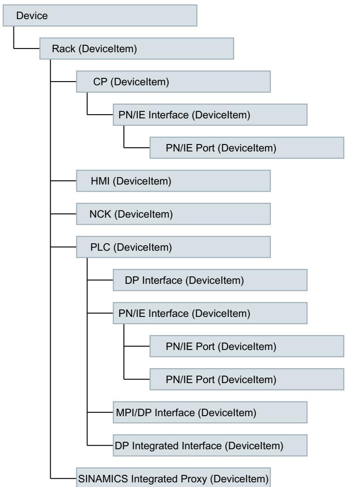
以下示意图指出了位于 SINUMERIK NX 10.3/15.3 下“Device”的对象：
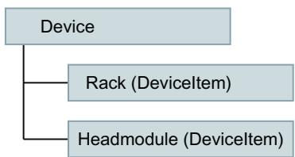
5DFN'HYLFH,WHP
以下示意图指出了位于 ADI4 下“Device”的对象：
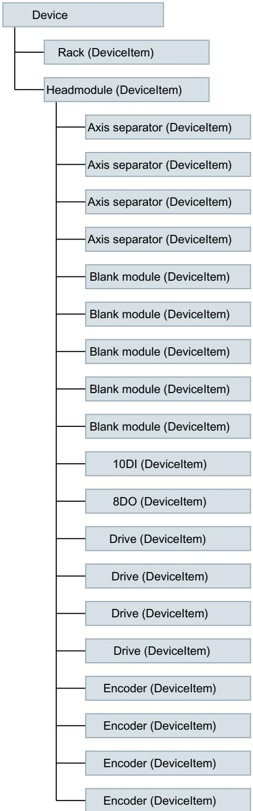  
关于 TIA Portal Openness 对象模型的更多信息，请参见“TIA Portal Openness API”。
```text
SINUMERIK NCU 的参数格式:
CreateWithItem(@"OrderNumber:mlfb/FirmwareVersion/","NameOfTheDevice",positionNumber)
positionNumber 参数是可选的。
下面的例子展示了如何创建一个 SINUMERIK 840D sl NCU 720.3 PN 控制系统。
```

### 5.20.5 代码示例


#### 5.20.5.1 概述

以下代码示例描述了不同应用的基本步骤。代码不需要完整或兼容。

#### 5.20.5.2 在 SINUMERIK 执行第一步

• 连接 TIA Portal Openness 应用至 TIA Portal。
• 打开项目。
下面的例子展示了如何选择 SINUMERIK Toolbox 的安装版本。

##### 选择 SINUMERIK Toolbox 版本

```cs
using Siemens.Engineering;
if (tiaProcess.InstalledSoftware.Any(sw => sw.Name.Equals("SINUMERK Toolbox") && sw.Version.Equals("V17")))
{
    Console.WriteLine("SINUMERIK Toolbox is available");
}
// "V17" is the current SINUMERIK version started at October 2021.
```

#### 5.20.5.3 创建一个 NCU

使用 Devices Collection 组中的 CreateWithItem()方法创建一个 SINUMERIKNCU。使用方法参数来指定 SINUMERIK NCU。参数格式的说明如下。

##### 创建一个 NCU


##### 创建一个 SINUMERIK 840D sl NCU 720.3 PN

```text
TiaPortal portal = new TiaPortal(TiaPortalMode.WithUserInterface);
Project tiaproject= portal.Projects.Open("..."); //The path of the project
Device NCUDevice = tiaproject.Devices.CreateWithItem("@OrderNumber:6FC5372-0AA30-0AA0/4.8/", "NCU 720.3 PN", string.Empty, "TestDevice");
```

#### 5.20.5.4 创建一个 NX 模块

用 Device CreateWithItem 方法创建一个 NX 模块。然后将 NX 模块连接至一个 NCU。以下类型标识符用于 SINUMERIK NX 模块：
<table><tr><td>SINUMERIK NX 模块</td><td>类型标识符</td></tr><tr><td>SINUMERIK NX10.3</td><td>OrderNumber:6SL3 040-1NC00-0Axx/Vy.z</td></tr><tr><td>SINUMERIK NX15.3</td><td>OrderNumber:6SL3 040-1NB00-0Axx/Vy.z</td></tr></table>
下面的例子展示了如何创建一个 SINUMERIK NX 模块。

##### 创建一个 NX 模块

```javascript
project.Devices.CreateWithItem("OrderNumber:6SL3040-1NC00-0AA0/V5.1", "MyNXDevice", "TestDevice");
```

##### 版本兼容性

NX 模块的固件版本必须与 SINAMICS Integrated 的固件版本一致，并且必须与 NCU 的固件版本兼容。
与 SINAMICS Integrated 版本不同的 NX 固件版本不可通过 Openness 进行分配。
下表展示了 840D sl 的版本兼容性：
<table><tr><td>NCU 固件(840D sl)</td><td>SINAMICS Integrated/NX 固件版本</td></tr><tr><td>V4.95</td><td>V5.2</td></tr></table>

#### 5.20.5.5 将一个 NX 模块连接至 NCU


##### 将一个 NX 模块连接至 NCU

为通过子网类型"ProfibusIntegrated"将一个 NX 模块连接至一个 NCU，必须通过 NX 标题模块载入"NetworkInterface"服务。
下面的例子展示了如何载入"NetworkInterface"服务。
```text
加载 NetworkInterface 服务
foreach (Device device in project.Devices)
{
    foreach (DeviceItem deviceItem in device.DeviceItems)
    {
    if (deviceItem.Classification == DeviceItemClassifications.HM)
    {
    var networkInterface = deviceItem.GetService<NetworkInterface>();
    // do something
    }
    }
}
下面的例子展示了如何通过“ProfibusIntegrated”将一个 NX 模块连接至 NCU:
```

##### 通过 ProfibusIntegrated 连接一个 NX 模块

```text
Subnet pbiSubnet = ...;
Node node = networkInterface.Nodes.FirstOrDefault();
node.ConnectToSubnet(pbiSubnet);
DP 地址通过 DRIVE-CLiQ 端口被分配到 Openness 中的固定 NX。每个端口标识都有一个固定 DP integrated 的地址。
连接到 NCU 之前，必须将 DP 地址分配到 NX。
```

#### 5.20.5.6 激活 Safety Integrated


##### 激活 Safety Integrated

通过 TIA Portal Openness，你可以在 NCU 属性里激活 Safety Integrated (F-PLC)。

##### 对报文配置的影响

Safety Integrated 模式会对报文配置产生影响，因为在 Safety Integrated plus(F-PLC)模式中使用了与未激活的 Safety Integrated 模式中不同的报文。然而，只要报文与新选择的 Safety Integrated 模式是兼容的，就可以添加或修改。如适用，在报文配置中模式修改后，要确保修改仍然生效。
你已通过 SafetyModeProvider 服务激活或禁用了 Safety Integrated (F-PLC)。
```text
说明
激活或禁用 Safety Integrated (F-PLC) 时，PLC 必须处于离线模式。
```
```text
说明
SafetyModeProvider 包含在 Namespace Siemens.Engineering.MC.Sinumerik 中.
```
下列示例说明了如何调用 SafetyModeProvider 服务：
```text
...
Siemens.Engineering.HW.Device cnc = ...;
try
{
    SafetyModeProvider provider = cnc.GetService<SafetyModeProvider>();
    //Perform the safety mode change:
    provider.SetSafetyMode(SafetyMode.DbSI);
}
catch( (EngineeringException ex) )
{
    // Handle safety mode change failure
}
下列示例说明了如何调用设备当前的 Safety Integrated 设置:
```

##### 调用设备的安全设置

```text
...
Siemens.Engineering.HW.Device cnc = ...;
try
{
    SafetyModeProvider provider = cnc.GetService<SafetyModeProvider>();
    //Query the safety mode:
    SafetyMode safetyMode = provider.CurrentMode;
}
catch( (EngineeringException ex) )
{
    // Handle any failure
}
```## 5.20.5.7 访问 PLC 软件
下图为对象模型 (页 1206)中的软件容器和 PLC 软件：

下面的示例代码介绍了如何基于“CPU”属性查找 PLC，与其具体实施（集成的 SINUMERIK PLC，SIMATIC PLC，PC 上的 PLC 软件）无关：
```text
查找 PLC
Device ncuDevice = ...
DeviceItem plc = GetPlc(ncuDevice.DeviceItems);
...
DeviceItem GetPlc(DeviceItemComposition deviceItems)
{
    if (deviceItems.Count == 0)
    {
    return null;
    }
    foreach (var deviceItem in deviceItems)
    {
    if (deviceItem.Classification == DeviceItemClassifications.CPU)
    return deviceItem;
    DeviceItem plc = GetPlc(deviceItem.DeviceItems);
    if (plc != null)
    return plc;
    }
    return null;
}
有关访问 PLC 软件容器的详细信息，请参见“访问软件目标”。
```

## 5.21 SINUMERIK ONE 功能


### 5.21.1 简介

通过 TIA Portal Openness，您可以使用自己创建的程序进行自动配置并控制 TIA Portal。
在本帮助文档中，您可以查找到关于自建程序的详细信息和代码示例。您也可创建自己的程序并在 TIA Portal "SINUMERIK" 应用中使用。
在您使用以下列出的示例代码生成您自己的 SINUMERIK 程序前，请注意与 Openness 相关的通用信息，您可在本帮助文档中查找以下关键字：
• 使用 TIA Portal Openness 的前提条件
• 安装 TIA Portal Openness
• 访问 TIA Portal
• TIA Portal Openness 对象模型
• 编程步骤

### 5.21.2 组件的类型标识符名称

每个 SINUMERIK 组件都有一个唯一的编号，称之为类型标识符 (TypeIdentifier) 。在Openness 程序代码中，您可使用类型标识符来清晰地指定一个组件。例如，SINUMERIKONE NCU 1750 的类型标识符"订货号：6FC5 317-5AA00-0Axx/Vy.z"。
在对话框“添加新设备”和列表式设备视图中创建设备时即会显示类型标识符。
您可将类型标识符复制到您的 Openness 应用中。
当调用某种方法时，如 CreateWithItem()，类型标识符会作为当前参数显示在 Openness 中。
1. 在项目视图菜单中，选择“选项 > 设置”。
“设置”配置区域打开。
2. 在二级导航栏中，选择“硬件配置”条目。
3. 激活选项“激活设备和模块的类型标识符显示”。
类型标识符显示已激活。

### 5.21.3 基础部分

可使用 Openness 在 TIA Portal 中创建以下 SINUMERIK 设备：
• NCU
• NX 模块
• PPU
为创建 SINUMERIK 设备，使用 Devices 组中的 CreateWithItem()。
所有 SINUMERIK-NCU 集成的子组件，如 PLC、NCK、CP、HMI 和 SINAMICS Integrated，将会自动在相同的附属等级中创建。

#### 创建 SINUMERIK 设备时的特殊注意事项

机架名称和 NCU 类型相符合，并且在用户界面上是设有写保护的。在 TIA Portal Openness中也必须使用该机架名称。通过Device CreateWithItem方法使用以下标准机架名称来创建一台具有设备元素类型标识符的设备：
<table><tr><td>SINUMERIK 设备</td><td>标准机架名</td></tr><tr><td>SINUMERIK ONE NCU 1740</td><td>NCU 1740</td></tr><tr><td>SINUMERIK ONE NCU 1750</td><td>NCU 1750</td></tr><tr><td>SINUMERIK ONE NCU 1760</td><td>NCU 1760</td></tr><tr><td>SINUMERIK ONE PPU 1740</td><td>PPU 1740</td></tr></table>
或者，你可以省略参数名。如果名称是“null”或“String.Empty”，则会使用默认名。
下列参数可以由 CreateWithItem() 方法使用：
```javascript
- 默认名称，例如 project.Devices.CreateWithItem("OrderNumber:6FC5317-5AA00-0AA0/V6.15", "NCU 1750", "TestDevice");
```
• null，例如 project.Devices.CreateWithItem("OrderNumber:6FC5 317-5AA00-0AA0/V6.15", null, "TestDevice");
```text
- string.Empty,
e.g. project.Devices.CreateWithItem("OrderNumber:6FC5317-5AA00-0AA0/V6.13", string.Empty, "TestDevice");
```
关于与CreateWithItem()方法相关的调用参数的其他信息参见章节“创建一个设备”。下面的表格列举了设备及其类型标识符的分配。
<table><tr><td>SINUMERIK 设备</td><td>类型标识符</td></tr><tr><td>SINUMERIK ONE NCU 1740</td><td>订货号:6FC5 317-4AA00-0Axx/Vy.z</td></tr><tr><td>SINUMERIK ONE NCU 1750</td><td>订货号:6FC5 317-5AA00-0Axx/Vy.z</td></tr><tr><td>SINUMERIK ONE NCU 1760</td><td>订货号:6FC5 317-6AA00-0Axx/Vy.z</td></tr><tr><td>SINUMERIK ONE PPU 1740</td><td>订货号:6FC5 317-4AA00-1xxx/Vy.z</td></tr></table>
创建 SINUMERIK 设备时，允许将占位符放入类型标识符。之后您可以用设备特定的符号代替这些占位符。
每个设备或设备元素都有已被读取和写入的强制特性。Openness 支持的特性的其他信息参见章节“设备元素的函数”。
设备元素的类型特性是被写入保护的，且在 TIA Portal 的用户界面中不可见。
类型特性具有“DeviceItemClassification”值：
<table><tr><td>类型特性的值</td><td>说明</td></tr><tr><td>DeviceItemClassifications.None (0)</td><td>无类型。</td></tr><tr><td>DeviceItemClassifications.CPU (1)</td><td>设备元素是一个CPU。</td></tr><tr><td>DeviceItemClassifications.HM (2)</td><td>设备元素是一个标题模块。</td></tr></table>
如果通过集成的 PLC 来询问设备元素的值，则对于一个 SINUMERIK 设备，就是值“CPU (1)”。在 Openness 对象模型中，下列组件作为标题模块：
• SINAMICS Integrated
• NX 模块
在所有其他情况中，类型特性的值是“DeviceItemClassification” “None” (0)。
下面的示例介绍了，在配置报文之前，如何通过“标题模块”属性来查找设备元素。
你只能读取此属性，无法在设备元素处设置它。
通过“标题模块”属性查找 SINAMICS Integrated/NX
```cs
foreach (Device device in project.Devices)
{
    foreach (DeviceItem deviceItem in device.DeviceItems)
    {
    if (deviceItem.Classification == DeviceItemClassifications.HM)
    {
    var driveObjectContainer = deviceItem.GetService<DriveObjectContainer>();
    // do something
    }
    }
}
```
[创建一个 NCU](#创建一个-NCU)
创建一个 NX 模块 (页 1231)

### 5.21.4 对象模型

概述
下图指出了位于 SINUMERIK ONE "Device" 下的对象：
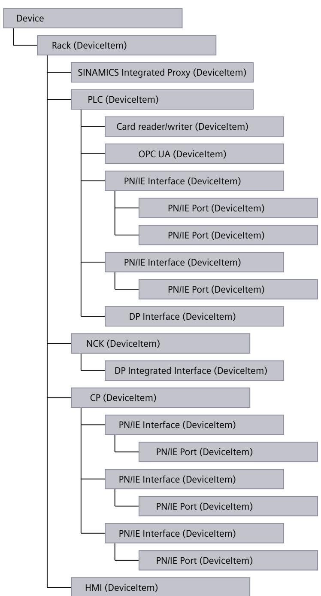  
关于 TIA Portal Openness 对象模型的更多信息，请参见“TIA Portal Openness API”一章。

#### 报文配置的有效命名空间

SINUMERIK Openness 为报文配置接口定义了以下有效的命名空间：
<table><tr><td>命名空间</td><td>程序集</td></tr><tr><td>Siemens.Engineering.MC.DriveConfiguration(页 1209)</td><td>Siemens.Engineering.dll 中的 Siemens.Engineering.MC.DriveConfigurati on</td></tr><tr><td>Siemens.Engineering.MC.Drives(页 1219)</td><td>Siemens.Engineering.dll 中的 Siemens.Engineering.MC.Drives</td></tr></table>
Siemens.Engineering.MC.DriveConfiguration命名空间允许使用额外的功能，例如，你可以创建，删除或重新排序驱动对象。
长期来看，Siemens.Engineering.MC.DriveConfiguration 命名空间会保留。不过，因为兼容性原因，Siemens.Engineering.MC.Drives 命名空间仍将在未来Openness 版本中支持。
下图介绍了 SINUMERIK NX 10.3/15.3 “Device” 下的对象（可用的服务取决于命名空间）。
在新的应用中，需要使用命名空间 Siemens.Engineering.MC.DriveConfiguration（以及相应的 DriveObjectCollection 服务），因为命名空间 Siemens.Engineering.MC.Drives（以及相应的 DriveObjectContainer 服务）虽然依旧兼容，但提供的功能相对较少。
'HYLFH
5DFN'HYLFH,WHP
+HDGPRGXOH'HYLFH,WHP
'ULYH2EMHFW&ROOHFWLRQ6HUYLFH

## 5.21 SINUMERIK ONE 功能

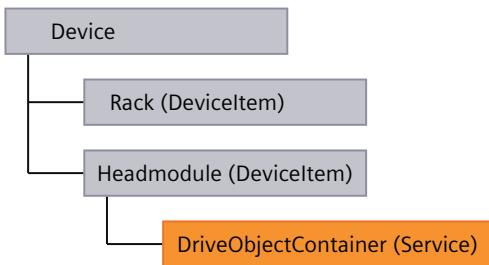

### 导入报警文本

下面的示意图展示了 SinumerikAlarmTextProvider 对象，它用于导入“DB2 报警”的文本.
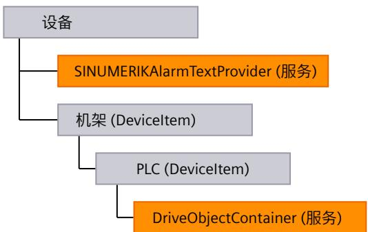
在项目导航中，导入的报警位于以下位置：
• 在 PLC 文本列表中，比如： $" \mathsf { C N C } \_ 1 > \mathsf { P L C } \_ 1 > \mathsf { P L C }$ 文本列表”
• 在项目文本中，比如：“项目\_1 > 共享数据 > 项目文本”。
更多信息和代码示例可查看导入 SINUMERIK PLC 报警文本 (页 1239)。
关于如何在 TIA Portal 中导入 SINUMERIK 用户报警（导入到用户文本列表中）的说明可查看导入/导出 PLC 消息文本列表。

### 5.21.5 文献参考


#### 5.21.5.1 命名空间 Siemens.Engineering.MC.DriveConfiguration

DriveObject
DriveObject
DriveObject 类用于访问驱动对象。比如，可使用驱动对象访问报文。
命名空间： Siemens.Engineering.MC.DriveConfiguration
程序集： Siemens.Engineering.dll 中
的 Siemens.Engineering.MC.DriveConfiguration
下表列出了该类的属性：
<table><tr><td>名称</td><td>数据类型</td><td>访问模式</td><td>访问</td><td>说明</td></tr><tr><td>Telegrams</td><td>TelegramComposition</td><td>read</td><td>-</td><td>返回该驱动对象的可用报文列表。该列表可通过TelegramComposition类进行更改。</td></tr><tr><td>Parent</td><td>IEngineeringObject</td><td>read</td><td>-</td><td>将参考值返回上一级类中(DriveObjectCollection和DriveObjectContainer)。</td></tr><tr><td>Category</td><td></td><td>read</td><td>-</td><td>将参考值返回上一级类中(DriveObjectCategory)</td></tr><tr><td>Name</td><td></td><td>read</td><td>-</td><td>返回驱动对象名称。</td></tr></table>
下表列出了该类的方法：
<table><tr><td>名称</td><td>说明</td></tr><tr><td>GetAttribute</td><td>对驱动对象的一个特性执行读访问</td></tr><tr><td>GetAttributes</td><td>对驱动对象的所有特性执行读访问</td></tr></table>
<table><tr><td>名称</td><td>说明</td></tr><tr><td>GetAttributeInfos</td><td>对驱动对象特性信息执行读访问</td></tr><tr><td>SetAttribute</td><td>对驱动对象的一个特性执行写访问</td></tr><tr><td>SetAttributes</td><td>对驱动对象的所有特性执行写访问</td></tr><tr><td>Delete</td><td>调出 &quot;Delete&quot; 时,删除驱动对象实例。</td></tr></table>

##### DriveObjectCollection

DriveObjectCollection 是当前设备 (Device) 的驱动对象 (DeviceItem) 服务。
命名空间：
Siemens.Engineering.MC.DriveConfiguration
程序集：
Siemens.Engineering.dll 中
的 Siemens.Engineering.MC.DriveConfiguration
下表描述了 DriveObjectCollection 的导航栏：
<table><tr><td>名称</td><td>数据类型</td><td>访问模式</td><td>访问</td><td>说明</td></tr><tr><td>DriveObjects</td><td>DriveObjectComposition</td><td>read</td><td>-</td><td>返回可用驱动对象列表。驱动对象用于访问驱动参数和报文。</td></tr></table>
下表列出了该类的方法：
<table><tr><td>名称</td><td>说明</td></tr><tr><td>GetAttribute</td><td>对 DriveObjectCollection 的一个特性执行读访问</td></tr><tr><td>GetAttributes</td><td>对 DriveObjectCollection 的所有特性执行读访问</td></tr><tr><td>GetAttributeInfos</td><td>对 DriveObjectCollection 的多个特性信息执行读访问</td></tr><tr><td>SetAttribute</td><td>对 DriveObjectCollection 的一个特性执行写访问</td></tr><tr><td>SetAttributes</td><td>对 DriveObjectCollection 的所有特性执行写访问</td></tr></table>

##### DriveObjectComposition

DriveObjectComposition 类允许访问可用的驱动对象报文，包含 NCU 和 NX 模块中所有的驱动对象。
命名空间： Siemens.Engineering.MC.DriveConfiguration
程序集：
Siemens.Engineering.dll 中
的 Siemens.Engineering.MC.DriveConfiguration
下表列出了该类的属性：
<table><tr><td>名称</td><td>数据类型</td><td>访问模式</td><td>访问</td><td>说明</td></tr><tr><td>Parent</td><td>IEngineeringObject</td><td>read</td><td>-</td><td>将参考值返回上一级类中(DriveObjectContainer)。</td></tr><tr><td>Count</td><td></td><td>read</td><td>-</td><td></td></tr><tr><td>IsReadOnly</td><td></td><td>read</td><td>-</td><td></td></tr></table>
下表列出了该类的方法：
<table><tr><td>名称</td><td>说明</td></tr><tr><td>GetEnumerator</td><td>方便对指定元素集进行迭代</td></tr><tr><td>Contains</td><td>确定特定的实例是否包含在元素集中。TRUE:包含实例 FALSE:不包含实例</td></tr><tr><td>IndexOf</td><td>返回查询实例的元素集中的下标。</td></tr><tr><td>Create</td><td>创建 DriveObjectComposition 类</td></tr><tr><td>Find</td><td>搜索 DriveObjectComposition 类。</td></tr></table>
DriveObjectCategory
DriveObjectCategory
枚举类型 DriveObjectCategory 包含驱动对象的预定义类别。只能对 DriveObjectCategory 进行读访问。
命名空间： Siemens.Engineering.MC.DriveConfiguration
程序集： Siemens.Engineering.dll 中
的 Siemens.Engineering.MC.DriveConfiguration
下表包含驱动对象的预定义类别：
<table><tr><td>SINUMERIK 中支持的驱动系统</td><td>DriveObjectCategory</td></tr><tr><td>SinumerikDriveAxis</td><td>SERVO, ENC, HLA, TM41</td></tr><tr><td>SinumerikControlUnit</td><td>CU_I, CU_NX_CX</td></tr><tr><td>SinumerikInfeed</td><td>A_INF, B_INF, S_INF</td></tr></table>

##### TelegramComposition

TelegramComposition 类方便了访问驱动对象报文（DriveObject (页 1209)）。可通过 Telegram (页 1213)该类读取报文结构。
改动报文对象（如改动安全报文）可能会导致相关报文对象在TelegramComposition中被删除，或创建新的报文对象。如有类似情况，需要在改动后，再次在TelegramComposition 中搜索，找到新的 报文对象 (页 1213)。
相应的驱动对象不支持报文，TelegramComposition 的值被空白返回。
命名空间： Siemens.Engineering.MC.DriveConfiguration
程序集： Siemens.Engineering.dll 中
的 Siemens.Engineering.MC.DriveConfiguration
Telegram
Telegram
下表列出了该类的属性：
<table><tr><td>名称</td><td>数据类型</td><td>访问模式</td><td>访问</td><td>说明</td></tr><tr><td>Parent</td><td>IEngineeringObject</td><td>read</td><td>-</td><td>将参考值返回上一级类中(DriveObject)。</td></tr><tr><td>Count</td><td></td><td>read</td><td>-</td><td></td></tr><tr><td>IsReadOnly</td><td></td><td>read</td><td>-</td><td></td></tr></table>
下表列出了该类的方法：
<table><tr><td>名称</td><td>说明</td></tr><tr><td>Create(enum TelegramId Id)</td><td>创建一个报文,报文类型对应ID。</td></tr><tr><td>intIndexOf(TelegramType)</td><td>返回查询实例的元素集中的下标。</td></tr><tr><td>bool Contains</td><td>确定特定的实例是否包含在元素集中。TRUE:包含实例FALSE:不包含实例</td></tr><tr><td>IEnumerator GetEnumerator</td><td>允许 IEnumerator迭代,通过元素集</td></tr></table>
Telegram 类用于访问某个驱动对象报文的结构。
命名空间： Siemens.Engineering.MC.DriveConfiguration
程序集：
Siemens.Engineering.dll 中
的 Siemens.Engineering.MC.DriveConfiguration
下表列出了该类的属性：
<table><tr><td>名称</td><td>数据类型</td><td>访问模式</td><td>访问</td><td>说明</td></tr><tr><td>Id</td><td>Int32</td><td>read</td><td>-</td><td>返回报文 ID。</td></tr><tr><td>Type</td><td>enum: TelegramType(页 1215)</td><td>read</td><td>-</td><td>返回报文类型 Enum TelegramType。</td></tr><tr><td>Addresses</td><td>AddressComposition(页 1217)</td><td>read</td><td>-</td><td>返回 AdressComposition,包含地址信息。</td></tr></table>
下表列出了该类的方法：
<table><tr><td>名称</td><td>说明</td></tr><tr><td>GetSize (AddressIoType(页 1218))</td><td>返回报文输入或输出的大小。</td></tr><tr><td>CanSetSize (AddressIoType(页 1218), Int32, bool)</td><td>如果参数设置中的报文大小可更改,则返回 true。</td></tr><tr><td>SetSize</td><td>对报文大小执行写访问</td></tr><tr><td>Delete</td><td>调用“Delete”时删除报文实例。</td></tr><tr><td>GetAttribute</td><td>对一个报文特性执行读访问</td></tr><tr><td>GetAttributes</td><td>对所有报文特性执行读访问</td></tr><tr><td>GetAttributeInfos</td><td>对报文特性信息执行读访问</td></tr><tr><td>SetAttribute</td><td>对一个报文特性执行写访问</td></tr><tr><td>SetAttributes</td><td>对所有报文特性执行写访问</td></tr><tr><td>Delete</td><td>删除报文</td></tr></table>

##### 安全报文的属性

下表说明了"SafetyTelegram"型"Telegram"类的其他属性。
<table><tr><td>名称</td><td>数据类型</td><td>访问模式</td><td>访问</td><td>说明</td></tr><tr><td>Failsafe_FSourceAddress</td><td>UInt32</td><td>read</td><td>动态</td><td>PROFIsafe 源地址</td></tr><tr><td>Failsafe_FDestinationAddress</td><td>UInt32</td><td>read/write</td><td>动态</td><td>PROFIsafe 目标地址</td></tr><tr><td>Failsafe_FIODBNumber</td><td>UInt32</td><td>read/write</td><td>动态</td><td>安全DB号,只有当属性"Failsafe_ManualAssignmentFIODBNumber"值为"1"时才可写</td></tr><tr><td>Failsafe_FIODBName</td><td>string</td><td>read</td><td>动态</td><td>名称安全DB</td></tr><tr><td>Failsafe_ManualAssignmentFIODBNumber</td><td>bool</td><td>read/write</td><td>动态</td><td>手动分配"Failsafe_FIODBNumber"属性的设置</td></tr><tr><td>Failsafe_FMonitoringtime</td><td>UInt32</td><td>read/write</td><td>动态</td><td>安全监视时间,只有当属性"Failsafe_ManualAssignmentFMonitoringtime 设置为"true"时才可写</td></tr><tr><td>Failsafe_ManualAssignmentFMonitoringtime</td><td>bool</td><td>read/write</td><td>动态</td><td>手动分配"Failsafe_FMonitoringtime"属性的设置</td></tr></table>
其他属性通过 GetAttribute 和 SetAttribute 访问，例如GetAttribute("Failsafe\_FSourceAddress")。预计返回值 Uint32。

##### TelegramType

Enum TelegramType 包含预定义的报文类型。
命名空间： Siemens.Engineering.MC.DriveConfiguration
程序集：
Siemens.Engineering.dll 中
的 Siemens.Engineering.MC.DriveConfiguration
下表列出了具体的枚举条目：
<table><tr><td>名称</td><td>说明</td></tr><tr><td>MainTelegram</td><td>主要报文:例如,报文 136</td></tr><tr><td>SupplementaryTelegram</td><td>补充报文:例如,报文 701</td></tr><tr><td>AdditionalTelegram</td><td>附加报文:自由报文</td></tr></table>
5.21 SINUMERIK ONE 功能
<table><tr><td>名称</td><td>说明</td></tr><tr><td>SafetyTelegram</td><td>安全报文:例如,报文 903</td></tr><tr><td>ProcessMonitoringTelegram</td><td>过程监控报文,例如,报文 1100</td></tr></table>
说明
不支持 TorqueTelegram，虽然它在 TIA Portal Openness API 里 SINUMERIK 文本可用。
TelegramPart
TelegramPart
枚举类TelegramPart 包含一条报文的各组成部分。
命名空间： Siemens.Engineering.MC.DriveConfiguration
程序集：
Siemens.Engineering.dll 中
的 Siemens.Engineering.MC.DriveConfiguration
下表列出了具体的枚举条目：
<table><tr><td>名称</td><td>说明</td></tr><tr><td>Unknown</td><td>报文的未知部分</td></tr><tr><td>Overall</td><td>一条报文中的所有报文部分:报文的 BaseTelegram、Extension 和 PIV1)</td></tr><tr><td>BaseTelegram</td><td>报文的主要部分</td></tr><tr><td>Extension</td><td>报文扩展</td></tr><tr><td>PKW</td><td>报文的参数识别值</td></tr></table>
<sup>1)</sup> PKW 在 SINUMERIK 环境中不可用。
TelegramId
TelegramId
枚举类型 TelegramId 包含和 PLC 和 驱动通讯的报文号。ID 通过 PROFIdrive 标准定义。
命名空间： Siemens.Engineering.MC.DriveConfiguration
程序集： Siemens.Engineering.dll 中
的 Siemens.Engineering.MC.DriveConfiguration
AddressComposition
AddressComposition
AddressComposition 类表示报文地址。
命名空间： Siemens.Engineering.MC.DriveConfiguration
程序集：
Siemens.Engineering.dll 中
的 Siemens.Engineering.MC.DriveConfiguration
下表列出了该类的属性：
<table><tr><td>名称</td><td>数据类型</td><td>访问模式</td><td>访问</td><td>说明</td></tr><tr><td>IoType</td><td>enum:AddressIoType(页 1218)</td><td>read</td><td>-</td><td>返回地址类型上的信息。</td></tr><tr><td>Context</td><td>enum:AddressContext(页 1219)</td><td>read</td><td>只能通过GetAttribute或SetAttribute访问</td><td>返回地址的上下文信息。</td></tr><tr><td>StartAddress</td><td>Int32</td><td>read/write</td><td>-</td><td>返回报文的起始地址或者定义起始地址。</td></tr><tr><td>Length</td><td>Int32</td><td>read</td><td>-</td><td>返回报文长度。</td></tr></table>
<table><tr><td>名称</td><td>数据类型</td><td>访问模式</td><td>访问</td><td>说明</td></tr><tr><td>IndexOf</td><td>int32</td><td>read</td><td>-</td><td>返回查询实例的元素集中的下标。</td></tr><tr><td>Contains</td><td>bool</td><td>read</td><td>-</td><td>确定特定的实例是否包含在元素集中。TRUE:包含实例FALSE:不包含实例</td></tr><tr><td>GetEnumerator</td><td>IEnumerableread方便对指定元素集进行迭代</td><td>read</td><td>-</td><td>方便对指定元素集进行迭代</td></tr></table>
如果你希望通过 Address.Parent 导航回报文，调用命名空
间 Siemens.Engineering.MC.DriveConfiguration.Telegram，而 非 Siemens.Engineering.MC.Drives.Telegram。
可在“标准库”里，找到更多 TIA Portal Openness 库的相关信息。

##### AddressIoType

Enum AddressIoType 包含地址类型信息。
命名空间： Siemens.Engineering.MC.DriveConfiguration
程序集： Siemens.Engineering.dll 中
的 Siemens.Engineering.MC.DriveConfiguration
下表列出了具体的枚举条目：
<table><tr><td>名称</td><td>说明</td></tr><tr><td>AddressIoType.None</td><td>无法使用 IO 类型</td></tr><tr><td>AddressIoType.Input</td><td>类型为输入地址</td></tr><tr><td>AddressIoType.Output</td><td>类型为输出地址</td></tr><tr><td>AddressIoType.Diagnosis</td><td>类型为诊断地址</td></tr><tr><td>AddressIoType.Substitute</td><td>类型为替代地址</td></tr></table>
可在“标准库”里，找到更多 TIA Portal Openness 库的相关信息。
AddressContext
AddressContext
Enum AddressContext 包含地址的上下文信息。
命名空间： Siemens.Engineering.MC.DriveConfiguration
程序集： Siemens.Engineering.dll 中的 Siemens.Engineering.MC.DriveConfiguration
下表列出了具体的枚举条目：
<table><tr><td>名称</td><td>说明</td></tr><tr><td>AddressContext.None</td><td>地址无上下文信息</td></tr><tr><td>AddressContext.Device</td><td>上下文是设备地址</td></tr><tr><td>AddressContext.Head</td><td>上下文是首地址</td></tr></table>
可在“标准库”里，找到更多 TIA Portal Openness 库的相关信息。

#### 5.21.5.2 Namespace Siemens.Engineering.MC.Drives

DriveObject
DriveObject
DriveObject 类用于访问驱动对象。比如，可使用驱动对象访问报文。
命名空间： Siemens.Engineering.MC.Drives
程序集： Siemens.Engineering.dll 中
的 Siemens.Engineering.MC.Drives
下表列出了该类的属性：
<table><tr><td>名称</td><td>数据类型</td><td>访问模式</td><td>访问</td><td>说明</td></tr><tr><td>Telegrams</td><td>TelegramComposition</td><td>read</td><td>-</td><td>返回该驱动对象的可用报文列表。该列表可通过TelegramComposition类进行更改。</td></tr><tr><td>Parent</td><td>IEngineeringObject</td><td>read</td><td>-</td><td>将参考值返回到上一级类中(DriveObjectContainer)。</td></tr></table>
下表列出了该类的方法：
<table><tr><td>名称</td><td>说明</td></tr><tr><td>GetAttribute</td><td>对驱动对象的一个特性执行读访问</td></tr><tr><td>SetAttribute</td><td>对驱动对象的一个特性执行写访问</td></tr><tr><td>GetEnumerator</td><td>方便对指定元素集进行迭代</td></tr></table>
TelegramComposition (页 1222)
DriveObjectContainer
DriveObjectContainer
DriveObjectContainer 是当前设备 (Device) 的驱动对象 (DeviceItem) 服务。
命名空间： Siemens.Engineering.MC.Drives
程序集： Siemens.Engineering.dll 中
的 Siemens.Engineering.MC.Drives
下表描述了 DriveObjectContainer 的导航栏：
<table><tr><td>名称</td><td>数据类型</td><td>访问模式</td><td>访问</td><td>说明</td></tr><tr><td>DriveObjects</td><td>DriveObjectComposition</td><td>read</td><td>-</td><td>返回可用驱动对象列表。驱动对象用于访问驱动参数和报文。</td></tr><tr><td>Parent</td><td>IEngineeringObject</td><td>read</td><td>-</td><td>将参考值返回到上一级类中(DeviceItem)。</td></tr></table>
DriveObjectComposition
DriveObjectComposition
DriveObjectComposition 类方便了访问可用的驱动对象报文。
命名空间：
Siemens.Engineering.MC.Drives
程序集：
Siemens.Engineering.MC.Drives
in Siemens.Engineering.dll
<table><tr><td>名称</td><td>数据类型</td><td>访问模式</td><td>访问</td><td>说明</td></tr><tr><td>IndexOf</td><td>int32</td><td>read</td><td>-</td><td>返回查询实例的元素集中的下标。</td></tr><tr><td>Contains</td><td>bool</td><td>read</td><td>-</td><td>确定特定的实例是否包含在元素集中。TRUE:包含实例FALSE:不包含实例</td></tr><tr><td>GetEnumerator</td><td>IEnumeratorread方便对指定元素集进行迭代</td><td>read</td><td>-</td><td>方便对指定元素集进行迭代</td></tr></table>
TelegramComposition
TelegramComposition
TelegramComposition 类方便了访问驱动对象报文（DriveObject (页 1219)）。可通过 Telegram (页 1224)该类读取报文结构。
改动报文对象（如改动安全报文）可能会导致相关报文对象在 TelegramComposition 中被删除，或创建新的报文对象。如有类似情况，需要在改动后，再次在TelegramComposition 中搜索，找到新的 报文对象 (页 1224)。
命名空间： Siemens.Engineering.MC.Drives
程序集： Siemens.Engineering.dll 中
的 Siemens.Engineering.MC.Drives
下表列出了该类的方法：
<table><tr><td>名称</td><td>说明</td></tr><tr><td>CanInsertAdditionalTelegram(Int32, Int32)</td><td>如果能根据设置的大小(输入和输出大小)创建扩展,则返回 true。</td></tr><tr><td>InsertAdditionalTelegram(Int32, Int32)</td><td>根据设置的大小创建驱动对象扩展,如果无法插入扩展,则返回 true。如果发生错误,则触发EngineeringTargetInvocationException。</td></tr><tr><td>CanInsertSupplementaryTelegram(Int32)</td><td>如果能根据设置的报文号创建补充报文,则返回 true。</td></tr><tr><td>InsertSupplementaryTelegram(Int32)</td><td>根据设置的报文号创建补充报文,如果报文可被插入,则返回 true。如果发生错误,则触发EngineeringTargetInvocationException。</td></tr><tr><td>CanInsertSafetyTelegram(Int32)</td><td>如果安全报文可符合已参数化的报文号码而生成,则返回 true。</td></tr><tr><td>InsertSafetyTelegram(Int32)</td><td>根据设置的报文号创建补充报文,如果报文可被插入,则返回 true。如果发生错误,则触发EngineeringTargetInvocationException。</td></tr><tr><td>EraseTelegram(TelegramType)</td><td>如果无法删除设置的报文,则返回 true。标准报文无法删除。如果发生错误,则触发EngineeringTargetInvocationException。</td></tr><tr><td>Find(TelegramType)</td><td>如果可通过设置的报文类型找到 Telegram(页 1224)对象,则返回该对象。如果报文未找到,则返回 null。示例Telegram telegram = telegrams.Find(TelegramType.MainTelegram);</td></tr><tr><td>intIndexOf(TelegramType)</td><td>返回查询实例的元素集中的下标。</td></tr><tr><td>Parent</td><td>将参考值返回到上一级类中(DriveObject)。</td></tr><tr><td>bool Contains</td><td>确定特定的实例是否包含在元素集中。TRUE:包含实例FALSE:不包含实例</td></tr><tr><td>IEnumerator GetEnumerator</td><td>方便 IEnumerator对指定元素集进行迭代</td></tr></table>
Telegram
Telegram
Telegram 类用于访问某个驱动对象报文的结构。
命名空间： Siemens.Engineering.MC.Drives
程序集： Siemens.Engineering.dll 中
的 Siemens.Engineering.MC.Drives
下表列出了该类的属性：
<table><tr><td>名称</td><td>数据类型</td><td>访问模式</td><td>访问</td><td>说明</td></tr><tr><td>TelegramNumber</td><td>Int32</td><td>read</td><td>-</td><td>返回主要报文编号或指定该编号。可配置的报文最大编号为999。</td></tr><tr><td>Type</td><td>enum: TelegramType(页1226)</td><td>read</td><td>-</td><td>返回报文类型Enum TelegramType。</td></tr><tr><td>Addresses</td><td>AddressComposition(页1227)</td><td>read</td><td>-</td><td>返回 AdressComposition,包含地址信息。</td></tr></table>
下表列出了该类的方法：
<table><tr><td>名称</td><td>说明</td></tr><tr><td>CanChangeTelegram(Int32)</td><td>如果报文可以更改为经过参数设置的标准类型,则返回 true。</td></tr><tr><td>GetSize (AddressIoType(页 1229))</td><td>返回报文输入或输出的大小。</td></tr><tr><td>CanChangeSize (AddressIoType(页 1229), Int32, bool)</td><td>如果参数设置中的报文大小可更改,则返回 true。仅能更改标准报文。如果选项被设置为 true,则需考虑保留之前的报文地址。</td></tr><tr><td>ChangeSize (AddressIoType(页 1229), Int32, bool)</td><td>如果参数设置中的报文大小可更改,则返回 true。如果选项被设置为 true,则需考虑保留之前的报文地址。</td></tr><tr><td>GetEnumerator</td><td>方便对指定元素集进行迭代</td></tr></table>
下表说明了"SafetyTelegram"型"Telegram"类的其他属性。
<table><tr><td>名称</td><td>数据类型</td><td>访问模式</td><td>访问</td><td>说明</td></tr><tr><td>Failsafe_FSourceAddress</td><td>UInt32</td><td>read</td><td>只能通过GetAttribute或SetAttribute访问</td><td>PROFIsafe 源地址</td></tr><tr><td>Failsafe_FDestinationAddress</td><td>UInt32</td><td>read/write</td><td>只能通过GetAttribute或SetAttribute访问</td><td>PROFIsafe 目标地址</td></tr><tr><td>Failsafe_FIODBNumber</td><td>UInt32</td><td>read/write</td><td>只能通过GetAttribute或SetAttribute访问</td><td>安全 DB 号,只有当属性"Failsafe_ManualAssignmentFIODBNumber"值为 "1" 时才可写</td></tr><tr><td>Failsafe_FIODBName</td><td>string</td><td>read</td><td>只能通过GetAttribute或SetAttribute访问</td><td>名称安全 DB</td></tr><tr><td>Failsafe_ManualAssignmentFIODBNumber</td><td>bool</td><td>read/write</td><td>只能通过GetAttribute或SetAttribute访问</td><td>手动分配"Failsafe_FIODBNumber"属性的设置</td></tr><tr><td>Failsafe_FMonitoringtime</td><td>UInt32</td><td>read/write</td><td>只能通过GetAttribute或SetAttribute访问</td><td>安全监视时间,只有当属性"Failsafe_ManualAssignmentFMonitoringtime设置为"true"时才可写</td></tr><tr><td>Failsafe_ManualAssignmentFMonitoringtime</td><td>bool</td><td>read/write</td><td>只能通过GetAttribute或SetAttribute访问</td><td>手动分配"Failsafe_FMonitoringtime"属性的设置</td></tr></table>
其他属性通过 GetAttribute 和 SetAttribute 访问，例如GetAttribute("Failsafe\_FSourceAddress")。预计返回值 Uint32。
Enum TelegramType 包含预定义的报文类型。
命名空间： Siemens.Engineering.MC.Drives
程序集：
Siemens.Engineering.dll 中
的 Siemens.Engineering.MC.Drives
下表列出了具体的枚举条目：
<table><tr><td>名称</td><td>说明</td></tr><tr><td>MainTelegram</td><td>主要报文:例如,报文 136</td></tr><tr><td>SupplementaryTelegram</td><td>补充报文:例如,报文 701</td></tr><tr><td>AdditionalTelegram</td><td>附加报文:自由报文</td></tr><tr><td>SafetyTelegram</td><td>安全报文:例如,报文 903</td></tr></table>
说明
不支持 TorqueTelegram，虽然它在 TIA Portal Openness API 里 SINUMERIK 文本可用。
AddressComposition
AddressComposition
AddressComposition 类表示报文地址。
命名空间： Siemens.Engineering.MC.Drives
程序集：
Siemens.Engineering.MC.Drives
in Siemens.Engineering.dll
下表列出了该类的属性：
<table><tr><td>名称</td><td>数据类型</td><td>访问模式</td><td>访问</td><td>说明</td></tr><tr><td>IoType</td><td>enum:AddressIoType(页 1229)</td><td>read</td><td>-</td><td>返回地址类型上的信息。</td></tr><tr><td>Context</td><td>enum:AddressContext(页 1228)</td><td>read</td><td>只能通过GetAttribute或SetAttribute访问</td><td>返回地址的上下文信息。</td></tr><tr><td>StartAddress</td><td>Int32</td><td>read/write</td><td>-</td><td>返回报文的起始地址或者定义起始地址。</td></tr><tr><td>Length</td><td>Int32</td><td>read</td><td>-</td><td>返回报文长度。</td></tr><tr><td>IndexOf</td><td>int32</td><td>read</td><td>-</td><td>返回查询实例的元素集中的下标。</td></tr></table>
<table><tr><td>名称</td><td>数据类型</td><td>访问模式</td><td>访问</td><td>说明</td></tr><tr><td>Contains</td><td>bool</td><td>read</td><td>-</td><td>确定特定的实例是否包含在元素集中。TRUE:包含实例FALSE:不包含实例</td></tr><tr><td>GetEnumerator</td><td>IEnumeratorread方便对指定元素集进行迭代</td><td>read</td><td>-</td><td>方便对指定元素集进行迭代</td></tr></table>
如果你希望通过 Address.Parent 导航回报文，调用命名空
间 Siemens.Engineering.MC.DriveConfiguration.Telegram，而 非 Siemens.Engineering.MC.Drives.Telegram。
可在“标准库”里，找到更多 TIA Portal Openness 库的相关信息。

##### AddressContext

Enum AddressContext 包含地址的上下文信息。
命名空间： Siemens.Engineering.MC.Drives
程序集： Siemens.Engineering.dll 中
的 Siemens.Engineering.MC.Drives
下表列出了具体的枚举条目：
<table><tr><td>名称</td><td>说明</td></tr><tr><td>AddressContext.None</td><td>地址无上下文信息</td></tr><tr><td>AddressContext.Device</td><td>上下文是设备地址</td></tr><tr><td>AddressContext.Head</td><td>上下文是首地址</td></tr></table>
可在“标准库”里，找到更多 TIA Portal Openness 库的相关信息。
AddressIoType
AddressIoType
Enum AddressIoType 包含地址类型信息。
命名空间： Siemens.Engineering.MC.Drives
程序集： Siemens.Engineering.dll 中
的 Siemens.Engineering.MC.Drives
下表列出了具体的枚举条目：
<table><tr><td>名称</td><td>说明</td></tr><tr><td>AddressIoType.None</td><td>无法使用 IO 类型</td></tr><tr><td>AddressIoType.Input</td><td>类型为输入地址</td></tr><tr><td>AddressIoType.Output</td><td>类型为输出地址</td></tr><tr><td>AddressIoType.Diagnosis</td><td>类型为诊断地址</td></tr><tr><td>AddressIoType.Substitute</td><td>类型为替代地址</td></tr></table>
可在“标准库”里，找到更多 TIA Portal Openness 库的相关信息。

#### 5.21.5.3 ArchiveProvider


##### ArchiveProvider

ArchiveProvider 类用于生成 PLC 存档。
如果激活了 Safety Integrated 模式，则还可以通过 Openness 生成存档。
命名空间： Siemens.Engineering.HW.Utilities
程序集： Siemens.Engineering.dll 中
的 Siemens.Engineering.HW.Utilities
下表列出了 ArchiveProvider 类的方法：
<table><tr><td>名称</td><td>参数</td><td>说明</td></tr><tr><td>Archive</td><td>DeviceItem plcFileInfo pathSiemens.Engineering.MC.Sinumerik.SinumerikArchivationModeString comment(可选)String author(可选)</td><td>创建一个PLC存档</td></tr><tr><td>Retrieve</td><td>FileInfo archivePath</td><td>将归档一致地加载到TIAPortal中</td></tr></table>

##### 从 F-CPU 一致地加载

在生成归档之前，确保在“设置 > 扩展设置”(Settings > Extended settings) 下的安全管理编辑器中设置选项“从 F-CPU 持续加载”(Consistently loading from the F-CPU)，这样您还可以将已激活 Safety Integrated 模式的设备作为新站加载到 TIA Portal 项目中。
（功能“工具 > 从 SINUMERIK 存档上传设备 > 上传设备作为新站（硬件和软件）”(Tools >Upload device from SINUMERIK archive > Upload device as new station (hardware andsoftware))）

### 5.21.6 代码示例


#### 5.21.6.1 概述

以下代码示例描述了不同应用的基本步骤。代码不需要完整或兼容。

#### 5.21.6.2 在 SINUMERIK 执行第一步

• 连接 TIA Portal Openness 应用至 TIA Portal。
• 打开项目。

##### 下面的例子展示了如何选择 SINUMERIK Toolbox 的安装版本。

```cs
选择 SINUMERIK Toolbox 版本
using Siemens.Engineering;
if (tiaProcess.InstalledSoftware.Any(sw => sw.Name.Equals("SINUMERIK Toolbox") && sw.Version.Equals("V17"))
{
    Console.WriteLine("SINUMERIK Toolbox is available");
}
// "V17" is the current SINUMERIK version started at October 2021.
```

#### 5.21.6.3 创建一个 NCU

使用 Devices Collection 组中的 CreateWithItem() 方法创建一个 SINUMERIKNCU。使用方法参数来指定 SINUMERIK NCU。参数格式的说明如下。
SINUMERIK NCU 的参数格式：
下面的例子展示了如何创建一个 SINUMERIK ONE NCU 1750 模块。

##### 创建 SINUMERIK ONE NCU 1750 模块

```javascript
TiaPortal portal = new TiaPortal(TiaPortalMode.WithUserInterface);
Project tiaproject= portal.Projects.Open("..."); //The path of the project
Device NCUDevice = tiaproject.Devices.CreateWithItem("@OrderNumber:6FC5 317-5AA00-0AA0/V6.15/", "NCU 1750", "TestDevice");
```

#### 5.21.6.4 创建一个 NX 模块

用 Device CreateWithItem 方法创建一个 NX 模块。然后将 NX 模块连接至一个 NCU。
以下类型标识符用于 SINUMERIK NX 模块：
<table><tr><td>SINUMERIK NX 模块</td><td>类型标识符</td></tr><tr><td>SINUMERIK NX10.3</td><td>OrderNumber:6SL3 040-1NC00-0Axx/Vy.z</td></tr><tr><td>SINUMERIK NX15.3</td><td>OrderNumber:6SL3 040-1NB00-0Axx/Vy.z</td></tr></table>
下面的例子展示了如何创建一个 SINUMERIK NX 模块。
```javascript
project.Devices.CreateWithItem("OrderNumber:6SL3040-1NC00-0AA0/V5.2", "MyNXDevice", "TestDevice");
```
NX 模块的固件版本必须与 SINAMICS Integrated 的固件版本一致，并且必须与 NCU 的固件版本兼容。
与 SINAMICS Integrated 版本不同的 NX 固件版本不可通过 Openness 进行分配。
下表显示了 SINUMERIK ONE 的版本兼容性：
<table><tr><td>NCU 固件 (SINUMERIK ONE)</td><td>SINAMICS Integrated/NX 固件版本</td></tr><tr><td>V6.15</td><td rowspan="4">V5.2</td></tr><tr><td>V6.20</td></tr><tr><td>V6.21</td></tr><tr><td>V6.22</td></tr></table>

#### 5.21.6.5 将一个 NX 模块连接至 NCU

为通过子网类型"ProfibusIntegrated"将一个 NX 模块连接至一个 NCU，必须通过 NX 标题模块载入"NetworkInterface"服务。
下面的例子展示了如何载入"NetworkInterface"服务。

##### 加载 NetworkInterface 服务

```cs
foreach (Device device in project.Devices)
{
    foreach (DeviceItem deviceItem in device.DeviceItems)
    {
    if (deviceItem.Classification == DeviceItemClassifications.HM)
    {
    var networkInterface = deviceItem.GetService<NetworkInterface>();
    // do something
    }
    }
}
```
下面的例子展示了如何通过“ProfibusIntegrated”将一个 NX 模块连接至 NCU：
Subnet pbiSubnet = ...; Node node = networkInterface.Nodes.FirstOrDefault(); node.ConnectToSubnet(pbiSubnet);
DP 地址通过 DRIVE-CLiQ 端口被分配到 Openness 中的固定 NX。每个端口标识都有一个固定DP integrated 的地址。
连接到 NCU 之前，必须将 DP 地址分配到 NX。

#### 5.21.6.6 访问 NCK 事件

NCK 事件
根据 SINUMERIK 对象模型 (页 1206)，NCK 模块为一个 DeviceItem。
根据以下 NCK 模块特性，您可以访问 NCK 事件并在 TIA Portal Openness 里配置 NCK 事件：
<table><tr><td>名称</td><td>数据类型</td><td>访问模式</td><td>说明</td></tr><tr><td>HardwareInterruptNckToPlcSignalExchangeActive</td><td>Bool</td><td>r/w</td><td>激活/取消事件</td></tr><tr><td>HardwareInterruptNckToPlcSignalExchangeEventName</td><td>String</td><td>r/w</td><td>事件名称</td></tr><tr><td>HardwareInterruptNckToPlcSignalExchangeInterrupt</td><td>Siemens.Engineering.SW.Blocks.OB</td><td>r/w</td><td>分配给事件的OB</td></tr><tr><td>HardwareInterruptNckToPlcSignalExchangePriority</td><td>Int32</td><td>r/w</td><td>事件优先级</td></tr></table>
所有 NCK 事件通过 HardwareInterrupt 触发（硬件中断 OB）。硬件中断 OB 用于中断因硬件事件导致的循环程序处理。
下列示例显示如何确定一个 NCK 模块的事件名称：

##### 确定一个 NCK 模块的事件名称

```text
DeviceItem nck = ...;
string eventName =
(string)nck.GetAttribute("HardwareInterruptNckToPlcSignalExchangeEventName");
下列示例说明了如何设置硬件中断：
```

##### 设置硬件中断

```text
... DeviceItem nck = ...;
OB ob40 = ... try
{
    nck.SetAttribute("HardwareInterruptNckToPlcSignalExchangeInterrupt", ob40);
}
catch( (EngineeringException ex) )
{
    // Handle setting failure
}
```

#### 5.21.6.7 创建存档


##### 为批量调试创建存档

例如，使用 TIA Portal Openness，创建和导出 SINUMERIK 存档用于简化批量调试。
创建 SINUMERIK 存档，可通过 TIA Portal 项目属性 HwUtilities 附带SinumerikArchiveProvider 服务。
下列示例说明了如何调出 SinumerikArchiveProvider 服务：

##### 调用 SinumerikArchiveProvider

```cs
Project project = ...;
SinumerikArchiveProvider archiveProvider =
project.HwUtilities.Find("SinumerikArchiveProvider") as SinumerikArchiveProvider;
if (archiveProvider != null)
{
    // Work with the provider
}
```
```text
...
Siemens.Engineering.HW.DeviceItem plc_1 = ...;
Siemens.Engineering.HW.DeviceItem plc_1_copy = ...;
try {
    // The file extension is required
    string archivePath = @"D:\some_path\SinumerikArchive.dsf";
    // Create a Sinumerik archive with HardwareAndAllProgramBlocks
    archiveProvider.Export(plc_1, new FileInfo(archivePath), SinumerikArchivationMode.HardwareAndAllProgramBlocks);
    // Update the software part in the previously created archive using UpdateProgramBlocksOfArchive method
    archiveProvider.UpdateProgramBlocksOfArchive(plc_1_copy, new FileInfo(archivePath));
}
catch (EngineeringException ex)
{
    // Handle export failure
}
```
下列示例显示如何创建一个 PLC 存档，包含硬件信息和所有数据块：

##### 创建 PLC 存档

```text
...
Siemens.Engineering.HW.DeviceItem plc = ...;
try {
    // The file extension is required
    string archivePath = string.Format(@"D:\some_path\{0}.dsf", plc.Name);
    // Comment and author arguments are optional
    archiveProvider.Archive(plc, new FileInfo(archivePath), SinumerikArchivationMode.HardwareAndAllProgramBlocks);
}
catch (EngineeringTargetInvocationException ex)
{
    // Handle archive failure
}
可以按照以下方式使用此方法:
void Archive(DeviceItem plc, FileInfo path,
SinumerikArchivationMode content, String comment, String author)
```
下列示例说明了如何更新之前创建存档的软件部分：

##### 更新部分存档

以下示例展示了如何使用 F 地址分配创建 SINUMERIK 归档：

##### 使用 F 地址分配创建 SINUMERIK 归档

```text
...
Siemens.Engineering.HW.DeviceItemplc_1=...;
Siemens.Engineering.HW.DeviceItemplc_1_copy=...;
try{
    // The file extension is required
    stringarchivePath=@"D:\some_path\SinumerikArchive.dsf";
    // Create a SINUMERIK archive with F-address assignmnt using CreateFAddressAssignmentArchivemethod
archiveProvider.CreateFAddressAssignmentArchive(plc_1, plc_1_copy, newFileInfo(archivePath)[,"Comment","Author name"]);
}
catch(EngineeringTargetInvocationExceptionex){
// Handle archive failure
}
```
以下示例展示了如何将归档一致地加载到 TIA Portal 中（仅 SINUMERIK-DSF 归档的 PLC 组件，类型设置）：

##### 将归档一致地加载到 TIA Portal 中

```text
...
try{
    // The path of the
archivestringarchivePath = @"D:\some_path\SinumerikArchive.dsf";
    // Retrieve an already archived SINUMERIK device
DeviceretrievedDevice=archiveProvider.Retrieve(newFileInfo(archivePath));
}
catch(EngineeringTargetInvocationException ex)
{
    // Handle retrieve failure
}
```

#### 5.21.6.8 激活 Safety Integrated

通过 TIA Portal Openness，你可以在 NCU 属性里激活 Safety Integrated (F-PLC)。
Safety Integrated 模式会对报文配置产生影响，因为在 Safety Integrated plus(F-PLC)模式中使用了与未激活的 Safety Integrated 模式中不同的报文。
你已通过 SafetyModeProvider 服务激活或禁用了 Safety Integrated (F-PLC)。
激活或禁用 Safety Integrated (F-PLC) 时，PLC 必须处于离线模式。
SafetyModeProvider 包含在 Namespace Siemens.Engineering.MC.Sinumerik 中.
下列示例说明了如何调用 SafetyModeProvider 服务：

##### 调用 SafetyModeProvider

```text
...
Siemens.Engineering.HW.Device cnc = ...;
try
{
    SafetyModeProvider provider = cnc.GetService<SafetyModeProvider>();
    //Perform the safety mode change:
    provider.SetSafetyMode(SafetyMode.DbSI);
}
catch( (EngineeringException ex) )
{
    // Handle safety mode change failure
}
```
下列示例说明了如何调用设备当前的 Safety Integrated 设置：
```text
...
Siemens.Engineering.HW.Device cnc = ...;
try
{
    SafetyModeProvider provider = cnc.GetService<SafetyModeProvider>();
    //Query the safety mode:
    SafetyMode safetyMode = provider.CurrentMode;
}
catch( (EngineeringException ex) )
{
    // Handle any failure
}
```

#### 5.21.6.9 访问 PLC 软件

下图为对象模型 (页 1206)中的软件容器和 PLC 软件：
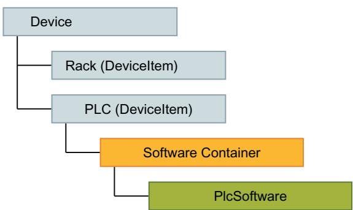
下面的示例代码介绍了如何基于“CPU”属性查找 PLC，与其具体实施（集成的 SINUMERIK PLC，SIMATIC PLC，PC 上的 PLC 软件）无关：
```text
查找 PLC
Device ncuDevice = ...
DeviceItem plc = GetPlc(ncuDevice.DeviceItems);
...
DeviceItem GetPlc(DeviceItemComposition deviceItems)
{
    if (deviceItems.Count == 0)
    {
    return null;
    }
    foreach (var deviceItem in deviceItems)
    {
    if (deviceItem.Classification == DeviceItemClassifications.CPU)
    return deviceItem;
    DeviceItem plc = GetPlc(deviceItem.DeviceItems);
    if (plc != null)
    return plc;
    }
    return null;
}
```
有关访问 PLC 软件容器的详细信息，请参见“访问软件目标”。

#### 5.21.6.10 导入 SINUMERIK PLC 报警文本

SINUMERIKAlarmTextProvider 类用于导入 TS 或 CSV 格式的 SINUMERIK DB2 报警的文本。
```text
说明
SinumerikAlarmTextProvider 包含在 Namespace Siemens.Engineering.MC.Sinumerik 中。
```
可借助 SinumerikAlarmTextProvider 服务通过导航 AlarmTextImporter 导入SINUMERIK PLC 报警文本。
下面的例子展示了如何通过 SinumerikAlarmTextProvider 从一个 SINUMERIK NCU 导入 SINUMERIK DB2 报警的文本。

##### 通过 SinumerikAlarmTextProvider 导入文本

```text
...Siemens.Engineering.HW.Devicencu=...;
System.Collections.IEnumerable<System.IO.FileInfo>inputFiles=...;
try
{
    // Get SinumerikAlarmTextProvider service from a SINUMERIK device
    SinumerikAlarmTextProviderprovider=ncu.GetService<SinumerikAlarmTextProvider>();
    // Call import function through the navigator:
    provider.AlarmTextImporter.ImportAlarmTexts(inputFiles);
}
catch(EngineeringExceptionex)
{
    // Handle import failures
}
```
关于如何在 TIA Portal 中导入 SINUMERIK User Alarms（导入到用户文本列表中）的说明可查看导入/导出 PLC 消息文本列表。

#### 5.21.6.11 Siemens.Engineering.MC.DriveConfiguration 命名空间示例


##### 准备报文

SINUMERIK NCU 的驱动通讯通过 SINAMICS Integrated 子组件使用报文进行，如果适用，还可通过额外连接的 NX 模块进行。
SINUMERIK NCU 和 SINAMICS Integrated 位于 TIA Portal Openness 对象模型的同一等级上，作为两个不同的设备出现在"DeviceComposition"下。
使用“DriveObjectCollection”来配置报文。“DriveObjectCollection”是实际标题模块（设备元素）的一个驱动对象服务。
若要启动“DriveObjectCollection”服务，需导航至 SINAMICS Integrated 或 NX 模块的标题模块。SINAMICS Integrated 和 NX 模块中，设备和设备元素的等级关系相同。
下面的例子展示了如何通过"标题模块"属性查找"DriveObjectCollection"：

##### 通过标题模块查找 DriveObjectCollection

```cs
foreach (Device device in project.Devices)
{
    foreach (DeviceItem deviceItem in device.DeviceItems)
    {
    if (deviceItem.Classification == DeviceItemClassifications.HM)
    {
    var driveObjectCollection = deviceItem.GetService<DriveObjectCollection>();
    // do something
    }
    }
}
```

##### 插入报文

```cs
插入报文
using Siemens.Engineering.MC.DriveConfiguration;
TelegramComposition telegrams = drvObj.Telegrams;
//Create telegram
drvObj.Telegrams.Create(TelegramId.Supplementary_Telegram_701);
}
```

##### 使用安全报文


##### 下列示例说明了如何插入一个安全报文。需要一台驱动对象。


##### 插入安全报文并访问报文属性

```cs
using Siemens.Engineering.MC.DriveConfiguration;
TelegramComposition telegrams = drvObj.Telegrams;
// Add safety telegram
drvObj.Telegrams.Create(TelegramId.PROFIsafe_Standard_Telegram_30);
// Get and set safety telegram attributes
uint Failsafe_FDestinationAddress =
(uint)safetyTelegram LocAttribute("Failsafe_FDestinationAddress");
uint Failsafe_FSourceAddress =
(uint)safetyTelegram LocAttribute("Failsafe_FSourceAddress");
uint Failsafe_FIODBNumber = (uint)safetyTelegram LocAttribute("Failsafe_FIODBNumber");
string Failsafe_FIODBName = safetyTelegram LocAttribute("Failsafe_FIODBName").ToString();
uint Failsafe_FMonitoringtime =
(uint)safetyTelegram LocAttribute("Failsafe_FMonitoringtime");
uint Failsafe_ManualAssignmentFIODBNumber =
(uint)safetyTelegram LocAttribute("Failsafe_ManualAssignmentFIODBNumber");
bool Failsafe_ManualAssignmentFMonitoringtime =
(bool)safetyTelegram LocAttribute("Failsafe_ManualAssignmentFMonitoringtime");
// Set safety telegram attributes
safetyTelegram.SetAttribute("Failsafe_ManualAssignmentFIODBNumber", 1);
safetyTelegram.SetAttribute("Failsafe_ManualAssignmentFMonitoringtime", true);
safetyTelegram.SetAttribute("Failsafe_FIODBNumber", 40000);
safetyTelegram.SetAttribute("Failsafe_FMonitoringtime", 200);
safetyTelegram.SetAttribute("Failsafe_FDestinationAddress", 15);
const int newSafetyTelegramId=900;
if (safetyTgrm.CanChangeTelegram(newSafetyTelegramId)) {
safetyTgrm.TelegramId = newSafetyTelegramId; }
下列示例说明了如何删除一个安全报文。
```
```text
删除一个安全报文
using Siemens.Engineering.MC.DriveConfiguration;
//Remove Safety telegram
drvObj.Telegrams.DeleteTelegram(TelegramType.SafetyTelegram);
```

##### 扩展报文

以下示例显示了如何插入扩展以及如何修改标准报文的大小。需要一台驱动对象。
插入扩展以及修改标准报文大小
```cs
using Siemens.Engineering.MC.DriveConfiguration;
TelegramComposition telegrams = drvObj.Telegrams;
Telegram telegram = telegrams.Find(TelegramType.MainTelegram);
Console.WriteLine("The Cu has the telegram: " + telegram.TelegramId);
Console.WriteLine("The Setpoint channel-specific size of the telegram is: " + telegram.GetOutputSize());
foreach (var address in telegram.Addresses)
{
    if (address.IoType == AddressIoType.Output)
    {
    Console.WriteLine("The Setpoint channel-specific IO start address of the telegram on the connected PLC is: " + address.StartAddress);
    }
    else if(address.IoType == AddressIoType.Input)
    {
    Console.WriteLine("The Actual value channel-specific IO start address of the telegram on the connected PLC is: " + address.StartAddress);
    }
}
// Create an additional telegram
if (drvObj.Telegrams.CreateAdditionalTelegram(2,4))
{
    drvObj.Telegrams.CreateAdditionalTelegram(2,4);
}
// Add a 3 word extension to the main telegram
Telegram mainTelegram == drvObj.Telegrams.Find(TelegramType.MainTelegram);
Int32 newSize = mainTelegram.GetSize(AddressIoType.Input) + 3;
if (mainTelegram.CanChangeSize(AddressIoType.Input, newSize, true))
{
    mainTelegram.ChangeSize(AddressIoType.Input, newSize, true)
}
```
```text
说明
SINUMERIK NCU 和 SINAMICS Integrated 位于 TIA Portal Openness 对象模型的同一等级上，作为两个不同的设备出现在"DeviceComposition"下。
```
5.21 SINUMERIK ONE 功能

#### 5.21.6.12 Siemens.Engineering.MC.Drives 命名空间示例

SINUMERIK NCU 的驱动通讯通过 SINAMICS Integrated 子组件使用报文进行，如果适用，还可通过额外连接的 NX 模块进行。
使用“DriveObjectContainer”来配置报文。“DriveObjectContainer”是实际标题模块（设备元素）的一个驱动对象服务。
若要启动“DriveObjectContainer”服务，需导航至 SINAMICS Integrated 或 NX 模块的标题模块。SINAMICS Integrated 和 NX 模块中，设备和设备元素的等级关系相同。
```text
下面的例子展示了如何通过"标题模块"属性查找"DriveObjectContainer":
```

##### 通过标题模块查找 DriveObjectContainer

```text
foreach (Device device in project.Devices)
{
    foreach (DeviceItem deviceItem in device.DeviceItems)
    {
    if (deviceItem.Classification == DeviceItemClassifications.HM)
    {
    var driveObjectContainer = deviceItem.GetService<DriveObjectContainer>();
    // do something
    }
    }
}
SINUMERIK NCU 包含一个参考了 SINAMICS Integrated 的 SINAMICS Integrated 代理对象。
若要访问一个 SINAMICS Integrated 设备或一个 NX 模块，需通过 NCK 从 SINUMERIK NCU 导航至 DP Integrated 界面，然后确定 PROFIBUS 主站系统并导航至所连接的从站。
```

##### 插入及删除报文

下面的例子展示了如何插入一个报文。需要一台驱动对象。
插入报文并访问报文属性
```cs
using Siemens.Engineering.MC.Drives;
TelegramComposition telegrams = drvObj.Telegrams;
//Add telegram
drvObj.Telegrams.InsertAdditionalTelegram(tgrmNumber);
//Find telegram
Telegram telegram = drvObj.Telegrams.Find(TelegramType.MainTelegram);
/Add safety telegram
const int tgrmNumber = 30;
drvObj.Telegrams.InsertSafetyTelegram;tgrmNumber)(
//Find safety telegram
Telegram safetyTgrm = drvObj.Telegrams.Find(TelegramType.SafetyTelegram);
// Get and set safety telegram attributes
    uint watchdogTime =
    (uint)safetyTgrm.GetAttribute("Failsafe_FMonitoringtime");
safetyTgrm.SetAttribute("Failsafe_FMonitoringtime", 300);
const int newSafetyTelegramNumber=902;
if (safetyTgrm.CanChangeTelegram(newSafetyTelegramNumber)) {
    safetyTgrm.TelegramNumber = newSafetyTelegramNumber;
}
//Add supplementary telegram
const int tgrmNumber = 701;
drvObj.Telegrams.InsertSupplementaryTelegram(tgrmNumber);
Telegram telegram =
drvObj.Telegrams.Find(TelegramType.SupplementaryTelegram);
```
下面的例子说明了如何删除一个报文。
```cs
删除报文
using Siemens.Engineering.MC.Drives;
//Remove safety telegram
drvObj.Telegrams.EraseTelegram(TelegramType.SafetyTelegram);
//Remove supplementary telegram
drvObj.Telegrams.EraseTelegram(TelegramType.SupplementaryTelegram);
```
```text
说明你可以修改，但不能删除一个主报文（MainTelegram）。
```
下列示例说明了如何插入一个安全报文。需要一台驱动对象。
```text
using Siemens.Engineering.MC.Drives;
TelegramComposition telegrams = drvObj.Telegrams;
// Add safety telegram
const int tgrmNumber = 30;
drvObj.Telegrams.InsertSafetyTelegram(tgrmNumber);
// Find safety telegram
Telegram safetyTgrm = drvObj.Telegrams.Find(TelegramType.SafetyTelegram);
// Get and set safety telegram attributes
uint Failsafe_FDestinationAddress =
(uint)safetyTelegram.getAttribute("Failsafe_FDestinationAddress");
uint Failsafe_FSourceAddress =
(uint)safetyTelegram.getAttribute("Failsafe_FSourceAddress");
uint Failsafe_FIODBNumber = (uint)safetyTelegram.getAttribute("Failsafe_FIODBNumber");
string Failsafe_FIODBName = safetyTelegram.getAttribute("Failsafe_FIODBName").ToString();
uint Failsafe_FMonitoringtime =
(uint)safetyTelegram.getAttribute("Failsafe_FMonitoringtime");
uint Failsafe_ManualAssignmentFIODBNumber =
(uint)safetyTelegram.getAttribute("Failsafe_ManualAssignmentFIODBNumber");
bool Failsafe_ManualAssignmentFMonitoringtime =
(bool)safetyTelegram.getAttribute("Failsafe_ManualAssignmentFMonitoringtime");
// Set safety telegram attributes
safetyTelegram.SetAttribute("Failsafe_ManualAssignmentFIODBNumber", 1);
safetyTelegram.SetAttribute("Failsafe_ManualAssignmentFMonitoringtime", true);
safetyTelegram.SetAttribute("Failsafe_FIODBNumber", 40000);
safetyTelegram.SetAttribute("Failsafe_FMonitoringtime", 200);
safetyTelegram.SetAttribute("Failsafe_FDestinationAddress", 15);
const int newSafetyTelegramNumber=900;
if (safetyTgrm.CanChangeTelegram(newSafetyTelegramNumber)) {
safetyTgrm.TelegramNumber = newSafetyTelegramNumber; }
```
```cs
删除一个安全报文
using Siemens.Engineering.MC.Drives;
//Remove Safety telegram
drvObj.Telegrams.EraseTelegram(TelegramType.SafetyTelegram);
```
下列示例说明了如何删除一个安全报文。
以下示例显示了如何插入扩展以及如何修改标准报文的大小。需要一台驱动对象。

##### 插入扩展以及修改标准报文大小

```cs
using Siemens.Engineering.MC.Drives;
TelegramComposition telegrams = drvObj.Telegrams;
Telegram telegram = telegrams.Find(TelegramType.MainTelegram);
Console.WriteLine("The Cu has the telegram: " + telegram.TelegramNumber);
Console.WriteLine("The Setpoint channel-specific size of the telegram is: " + telegram.GetOutputSize());
foreach (var address in telegram.Addresses)
{
    if (address.IoType == AddressIoType.Output)
    {
    Console.WriteLine("The Setpoint channel-specific IO start address of the telegram on the connected PLC is: " + address.StartAddress);
    }
    else if (address.IoType == AddressIoType.Input)
    {
    Console.WriteLine("The Actual value channel-specific IO start address of the telegram on the connected PLC is: " + address.StartAddress);
    }
}
// Add an additional telegram
if (drvObj.Telegrams.CanInsertAdditionalTelegram(2,4))
{
    drvObj.Telegrams.InsertAdditionalTelegram(2,4);
}
// Add a 3 word extension to the main telegram
Telegram mainTelegram == drvObj.Telegrams.Find(TelegramType.MainTelegram);
Int32 newSize = mainTelegram.GetSize(AddressIoType.Input) + 3;
if (mainTelegram.CanChangeSize(AddressIoType.Input, newSize, true))
{
    mainTelegram.ChangeSize(AddressIoType.Input, newSize, true)
}
```

## 5.22 SINUMERIK MC 功能


### 5.22.1 简介

对于 SINUMERIK MC，只能在 Openness 中导航到 PLC 软件容器。
其它 Openness 功能既不适用于控制特定的组件，也不适用于 SINUMERIK MC 的 PC 特定组件。

### 5.22.2 代码示例


#### 5.22.2.1 访问 PLC 软件

概述
下图为对象模型中的软件容器和 PLC 软件：
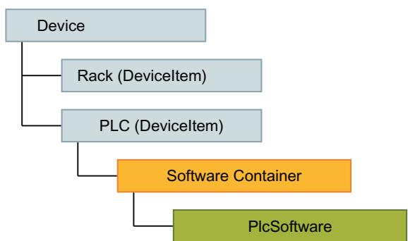
下面的示例代码介绍了如何基于“CPU”属性查找 PLC，与其具体实施（集成的 SINUMERIK PLC，SIMATIC PLC，PC 上的 PLC 软件）无关：
```text
查找 PLC
Device ncuDevice = ...
DeviceItem plc = GetPlc(mcuDevice.DeviceItems);
...
DeviceItem GetPlc(DeviceItemComposition deviceItems)
{
    if (deviceItems.Count == 0)
    {
    return null;
    }
    foreach (var deviceItem in deviceItems)
    {
    if (deviceItem.Classification == DeviceItemClassifications.CPU)
    return deviceItem;
    DeviceItem plc = GetPlc(deviceItem.DeviceItems);
    if (plc != null)
    return plc;
    }
    return null;
}
```
有关访问 PLC 软件容器的详细信息，请参见“访问软件目标”。

## 5.23 Startdrive 函数


### 5.23.1 简介

通过 TIA Portal Openness，您可以使用自己创建的程序进行自动配置并控制 TIA Portal。
在本帮助文档中，您可以查找到关于自建程序的详细信息和代码示例。您也可创建自己的程序并在 TIA Portal "Startdrive" 应用中使用。
在根据随后列出的程序代码配置您自己的 Startdrive 程序之前，请仔细阅读有关 Openness 的一般说明，可在本信息系统中查找以下关键字来获取：
• 使用 TIA Portal Openness 的前提条件
• 安装 TIA Portal Openness
• 访问 TIA Portal
5.23 Startdrive 函数
• TIA Portal Openness 对象模型
• 编程步骤
说明
激活项目保护 (UMAC)
如要通过“Openness API”编辑激活了项目保护的项目，用户需要具有相应的访问权限。用户账户必须具有以下功能权限：
• 通过 Openness API 更改项目
• 打开并编辑项目
• 以只读方式打开项目
工艺对象需要的其他功能权限。如没有访问权限，请联系管理员。
对于 SINAMICS 固件版本 FW V6.1 及以上的驱动，用户帐户需要具有与在 Startdrive 中在线访问驱动时相同的访问权限。
更多关于访问权限和用户管理的一般信息，请参见“用户管理和安全”页面。

### 5.23.2 安全说明


#### 5.23.2.1 使用 SecureString 密码进行加密通讯

说明

##### SecureString 密码用于安全通讯

在使用 Startdrive Openness 功能时，为了建立 Openness API 与 TIA Portal 之间的安全通讯，请使用通过 SecureString 加密的密码。
说明
通讯方向
SecureString 密码只能用于向 TIA Portal 下载 Openness 功能，相反的通讯方向则不适用。
说明
SecureString 对象不得通过 String 进行构建，因为敏感数据已受到不可变 String 类的存储持久化机制的制约。构建 SecureString 对象的最佳方式是通过一次处理一个字符的非托管资源进行构建，例如 Console.ReadKey 方法。
说明
API 用户负责在通过代码处理密码时采取安全措施。
有关配置 SecureString 密码的更多信息，请参见代码示例下载 (页 1286)和创建 SecureString密码 (页 1318)。
TIA Openness 的密码 (页 1251)

#### 5.23.2.2 TIA Openness 的密码


##### TIA Openness 中的密码处理

Startdrive Openness 中的密码处理基于 TIA Openness。
请仔细阅读并遵守关于 TIA Openness 密码的通用说明，可在此帮助手册中通过以下关键字查找：
• 定义显示密码
• 处理与功能块关联的 PLC 密码
• PLC 密码保护
• 设置保护等级
• 功能块的保护与去保护
• 加载硬件、软件和文件至 PLC 设备
使用 SecureString 密码进行加密通讯 (页 1250)

### 5.23.3 TypeIdentifier - 组件标识符

任意 Startdrive 组件的每个版本都包含一个唯一的编号，称作 TypeIdentifier 。在 Openness程序代码中，您可使用这些 TypeIdentifier，以便精确识别并命名组件。
在 Startdrive 中，TypeIdentifier 的显示是可选的，且默认不激活。

## 5.23 Startdrive 函数


### 在 Startdrive 中激活 TypeIdentifier 的显示

1. 在 Startdrive 项目视图中，选择菜单 “选件 > 设置”。“设置”配置区域打开。
2. 在二级浏览栏中选择“硬件配置”。
3. 激活选项“激活设备和模块的 Type Identifier 显示”。TypeIdentifier 的显示现在激活。

### 在 Startdrive 中读取 TypeIdentifier

在 Startdrive 项目中，当 TypeIdentifier 的显示激活时，可从以下位置进行读取：
• 对于所有组件（在巡视窗口中）：
• 对于控制单元（当创建驱动设备时）
按以下步骤，在巡视窗口中读取组件的TypeIdentifier：
1. 在 Startdrive 项目的设备视图中，双击所需组件。巡视窗口打开。生效的组件版本显示在列表中。
2. 相应的 TypeIdentifier 列出在外右侧栏中。示例：OrderNumber:6SL3131-7TE23-6Axx复制该 TypeIdentifier 到您的 Openness 应用中。

### 按以下步骤，读取控制单元的 TypeIdentifier：

1. 在 Startdrive 项目导航栏中，双击“添加新设备”。相同名称的对话框打开。
2. 从选择栏中选择所需的控制模块。相应控制单元的TypeIdentifier（在订货号和固件号下方）显示在详细画面的右侧。示例：OrderNumber:6SL3040-1MA01-0Axx/V5.2/S120
3. 复制该 TypeIdentifier 到您的 Openness 应用中。

### 5.23.4 参考


#### 5.23.4.1 AddressComposition


##### AddressComposition

AddressComposition 类表示报文地址。
命名空间：
Siemens.Engineering.MC.Drives
程序集：
Siemens.Engineering.MC.Drives in Siemens.Engineering.dll
下表列出了该类的语法：
public sealed class AddressComposition
<table><tr><td>名称</td><td>数据类型</td><td>说明</td></tr><tr><td>IoType</td><td>AddressIoType(页 1254)</td><td>返回地址类型上的信息。</td></tr><tr><td>Context</td><td>AddressContext(页 1254)</td><td>返回地址的上下文信息。</td></tr><tr><td>StartAddress</td><td>Int32</td><td>返回报文的起始地址或指定该地址。</td></tr><tr><td>Length</td><td>Int32</td><td>返回报文长度。</td></tr></table>
TelegramType (页 1278)

#### 5.23.4.2 AddressContext

Enum AddressContext 包含地址的上下文信息。
命名空间：
Siemens.Engineering.MC.Drives
程序集：
Siemens.Engineering.dll 中
的 Siemens.Engineering.MC.Drives
下表列出了该类的语法：
public enum AddressContext
下表列出了具体的枚举条目：
<table><tr><td>名称</td><td>说明</td></tr><tr><td>AddressContext.None</td><td>地址无上下文信息</td></tr><tr><td>AddressContext.Device</td><td>上下文是设备地址</td></tr><tr><td>AddressContext.Head</td><td>上下文是首地址</td></tr></table>

#### 5.23.4.3 AddressIoType

EnumAddressIoType 包含地址类型信息。
命名空间：
Siemens.Engineering.MC.Drives
程序集：
Siemens.Engineering.dll 中
的 Siemens.Engineering.MC.Drives
下表列出了该类的语法：
public enum AddressIoType
下表列出了具体的枚举条目：
<table><tr><td>名称</td><td>说明</td></tr><tr><td>AddressIoType.None</td><td>无法使用 IO 类型</td></tr><tr><td>AddressIoType.Input</td><td>类型为输入地址</td></tr><tr><td>AddressIoType.Output</td><td>类型为输出地址</td></tr><tr><td>AddressIoType.Diagnosis</td><td>类型为诊断地址</td></tr><tr><td>AddressIoType.Substitute</td><td>类型为替代地址</td></tr></table>

#### 5.23.4.4 调试


##### 调试

Commissioning 类可用于驱动调试。它可用于 DriveFunctionInterface
或 OnlineDriveFunctionInterface。如果用户将函数用于 SINAMICS S 系列驱动，则会返回一个返回值“0”。
下表列出了该类的方法：
<table><tr><td>名称</td><td>参数</td><td>返回值</td><td>描述</td></tr><tr><td>SetSimoGearMlfb</td><td>stringsimoGearMlfb</td><td>BOOL</td><td>设置驱动的 SIMOGEAR 订货号。</td></tr></table>
[设置用于 G115D 驱动的 SIMOGEAR 订货号](#设置用于-G115D-驱动的-SIMOGEAR-订货号)

#### 5.23.4.5 ConfigurationEntry

ConfigurationEntry
类ConfigurationEntry 用于保存参数数据，其可从电机或编码器配置中的 ConfigurationEntryCompositions 来确定。
下表列出了该类的属性：
<table><tr><td>名称</td><td>数据类型</td><td>说明</td></tr><tr><td>EnumValueList</td><td>IDictionary</td><td>返回枚举型参数的可能值列表。</td></tr><tr><td>MaxValue</td><td>object</td><td>ConfigurationEntry 的最大值。</td></tr><tr><td>MinValue</td><td>object</td><td>ConfigurationEntry 的最小值。</td></tr><tr><td>Name</td><td>string</td><td>ConfigurationEntry 的名称。</td></tr><tr><td>Number</td><td>int</td><td>ConfigurationEntry 名称的数字表示。</td></tr><tr><td>Description</td><td>string</td><td>ConfigurationEntry 的描述。</td></tr><tr><td>Parent</td><td>IEngineeringObject</td><td>该对象的父型工程组态对象元素。</td></tr><tr><td>Unit</td><td>string</td><td>ConfigurationEntry 的单位。</td></tr><tr><td>Value</td><td>object</td><td>ConfigurationEntry 的值。</td></tr></table>

#### 5.23.4.6 DriveDataEncryption（自 SINAMICS 固件 V6.1 起）

借助类别 DriveDataEncryption，可通过 Openness 激活和停用固件版本 V6.1 及以上版本 SINAMICS 驱动的驱动数据加密 (DDE)。
下表列出了类别 DriveDataEncryption 的方法：
<table><tr><td>名称</td><td>参数</td><td>返回值</td><td>描述</td><td>异常</td></tr><tr><td>Activate</td><td>SecureString 密码</td><td>BOOL</td><td>用密码激活 DriveDataEncryption。</td><td>-</td></tr><tr><td>Deactivate</td><td>SecureString 密码</td><td>BOOL</td><td>用密码取消激活 DriveDataEncryption。</td><td>-</td></tr></table>

##### 安全等级

安全等级为较高等级。该等级在后台用于访问涉及安全的所有 API。

#### 5.23.4.7 DriveDomainFunctions


##### DriveDomainFunctions

类 DriveDomainFunctions 用于恢复出厂设置或备份 RAM 内容至 ROM。
仅适用于 OnlineDriveFunctionInterface 对象。
对于 G120 驱动，如果设备连接了功率模块，才能访问对象 DriveDomainFunctions。否则，会返回null或异常。
下表列出了该类的方法：
<table><tr><td>名称</td><td>说明</td></tr><tr><td>PerformFactoryReset</td><td>该方法负责恢复出厂设置。</td></tr><tr><td>PerformRAMtoROMCopyAllDriveObject</td><td>全部驱动对象的日期从 RAM 写入存储卡/硬盘。</td></tr></table>
下表列出了该类的属性：
<table><tr><td>名称</td><td>数据类型</td><td>说明</td></tr><tr><td>Parent</td><td>IEngineeringObject</td><td>该对象的父型工程组态对象元素。</td></tr></table>

#### 5.23.4.8 DriveObject


##### DriveObject

DriveObject 类用于访问驱动对象。例如，通过驱动对象访问驱动参数或报文。
命名空间： Siemens.Engineering.MC.Drives
程序集：
Siemens.Engineering.dll 中
的 Siemens.Engineering.MC.Drives
下表列出了该类的语法：
public sealed class DriveObject
下表列出了该类的属性：
<table><tr><td>名称</td><td>数据类型</td><td>说明</td></tr><tr><td>Parameters</td><td>DriveParameter Composition(页 1262)</td><td>返回该驱动对象的可用参数列表。</td></tr><tr><td>Telegrams</td><td>TelegramComposition(页 1276)</td><td>返回该驱动对象的可用报文列表。该列表可通过 TelegramComposition 类进行更改。</td></tr></table>
[确定驱动对象](#确定驱动对象)

#### 5.23.4.9 DriveObjectActivation

DriveObjectActivation
类 DriveObjectActivation 用于激活模块或确定模块状态。其可应用于来自 DriveFunctionInterface 或 OnlineDriveFunctionInterface的 DriveObjectFunctions。
下表列出了该类的方法：
<table><tr><td>名称</td><td>说明</td></tr><tr><td>ChangeActivationState(DriveObjectActivationState)</td><td>更改驱动对象的激活状态。如果操作无法完成,则返回 false。可能的状态值:禁用激活DeactivateAndNotPresent</td></tr></table>
下表列出了该类的属性：
<table><tr><td>名称</td><td>数据类型</td><td>说明</td></tr><tr><td>ActivationState</td><td>DriveObjectActivationState</td><td>返回实际状态值。</td></tr><tr><td>IsActive</td><td>Boolean</td><td>对于激活的驱动对象,返回 true。</td></tr></table>

#### 5.23.4.10 DriveObjectContainer


##### DriveObjectContainer

DriveObjectContainer 是用于当前设备（Device）的驱动对象（DeviceItem）服务。
下表列出了 DriveObjectContainer 的导航器：
<table><tr><td>名称</td><td>数据类型</td><td>说明</td></tr><tr><td>DriveObjects</td><td>DriveObjectComposition(页 1262)</td><td>返回可用驱动对象列表。驱动对象用于访问驱动参数和报文。</td></tr><tr><td>Parent</td><td>IEngineeringObject</td><td>该对象的父型工程组态对象元素。</td></tr></table>

#### 5.23.4.11 ModuleAccessPoint


##### ModuleAccessPoint

ModuleAccessPoint 是用于当前设备（Device）的驱动对象（DeviceItem）服务。下表给出了 ModuleAccessPoint 的 Hardware Identifier 的属性：
<table><tr><td>名称</td><td>数据类型</td><td>访问</td><td>描述</td></tr><tr><td>硬件标识符</td><td>IEnumerable</td><td>只读</td><td>返回硬件标识符列表。</td></tr></table>

#### 5.23.4.12 DriveObjectTypeHandler


##### DriveObjectTypeHandler

类DriveObjectTypeHandler用于为每个驱动对象切换驱动对象类型以及确定驱动对象类型，以及实际驱动对象的所有可能的驱动对象类型。仅适用
于 DriveFunctionInterface。
下表列出了该类的方法：
<table><tr><td>名称</td><td>说明</td></tr><tr><td>ChangeDriveObjectType((target)DriveObjectType)</td><td>将驱动对象的实际类型更改为可选择的新类型。如果操作无法完成,则返回 false。</td></tr></table>
下表列出了该类的属性：
<table><tr><td>名称</td><td>数据类型</td><td>说明</td></tr><tr><td>PossibleDriveObjectTypees</td><td>DriveObjectTypeComposition</td><td>targetDriveObjectType 使用会导致实际驱动对象发生异常。</td></tr><tr><td>CurrentDriveObjectType</td><td>DriveObjectType</td><td>指示当前分配的驱动对象类型。</td></tr></table>

#### 5.23.4.13 DriveParameter


##### DriveParameter

DriveParameter 类用于访问驱动参数。并非所有驱动参数均可通过 Openness 进行访问。
命名空间： Siemens.Engineering.MC.Drives
程序集： Siemens.Engineering.dll 中
的 Siemens.Engineering.MC.Drives
下表列出了该类的语法：
public sealed class DriveParameter
下表列出了该类的属性：
<table><tr><td>名称</td><td>数据类型</td><td>说明</td></tr><tr><td>ArrayIndex</td><td>Int32</td><td>返回某个数组参数的下标。值范围:0-7FFF下标为-1表示该参数不含数组示例p108[4].15par.ArrayIndex产生4</td></tr><tr><td>ArrayLength</td><td>Int32</td><td>返回数组元素的个数。下标为0表示该参数不含数组</td></tr><tr><td>Bits</td><td>DriveParameterComposition(页1262)</td><td>为一个参数位返回一个DriveParameter对象。通过该方法可以从位参数中读取位参数的值或名称。示例DriveParameter param133 =cu.Parameters.Find(133, 0);DriveParameter param133Bit1 =param133.Bits[1];String paramName = param133Bit1.Name;</td></tr><tr><td>EnumValueList</td><td>IDictionary</td><td>返回枚举型参数的可能值列表。示例&lt;1, [1] Quick commissioning&gt;如果该参数不是Enum参数,则返回null。</td></tr><tr><td>MaxValue</td><td>Object</td><td>返回当前所选单元的最大值。</td></tr><tr><td>MinValue</td><td>Object</td><td>返回当前所选单元的最小值。</td></tr><tr><td>Name</td><td>string</td><td>返回该参数的名称。示例&quot;p108[0].2&quot;</td></tr><tr><td>ParameterText</td><td>string</td><td>返回该参数短描述文本信息。</td></tr><tr><td>Number</td><td>Int32</td><td>返回该参数的编号。示例p108[0].2返回值为108</td></tr></table>
5.23 Startdrive 函数
<table><tr><td>名称</td><td>数据类型</td><td>说明</td></tr><tr><td>Unit</td><td>string</td><td>返回文本形式的参数单元。</td></tr><tr><td>Value</td><td>Object</td><td>返回该参数的离线/在线值,或将某个值写入该参数中。如果发生写错误,则触发EngineeringTargetInvocationException。示例P2080Bit6.Value = 0;P2080Bit6.Value =cu.Parameters.Find(&quot;r19&quot;);BICO源BICO源的参数为只读模式。BICO信号汇点可能的值为0、1或DriveParameter对象。当BICO信号汇点连接至不同参数时,返回DriveParameter对象。另见示例读写BICO参数(页1285)。</td></tr></table>
[读写参数](#读写参数)

#### 5.23.4.14 DriveParameterComposition


##### DriveParameterComposition

DriveParameterComposition 类用于访问驱动参数。并非所有驱动参数均可通过Openness 进行访问。
命名空间： Siemens.Engineering.MC.Drives
程序集： Siemens.Engineering.MC.Drives in Siemens.Engineering.dll
下表列出了该类的语法：
public sealed class DriveParameterComposition
下表列出了该类的方法：
<table><tr><td>名称</td><td>描述</td></tr><tr><td>Find(string)</td><td>返回正在通过名称进行查找的 DriveParameter(页 1260)对象。如果该参数未找到任何匹配结果,则返回 null。示例Find(&quot;P108[1]&quot;)</td></tr><tr><td>Find(UInt16, Int32)</td><td>返回正在通过参数下标和数组下标进行查找的 DriveParameter (页 1260)对象。如果该参数未找到任何匹配结果,则返回 null。示例• cu.Find(108, 1);• cu.Find(51, -1);</td></tr></table>

#### 5.23.4.15 HardwareProjection

类 HardwareProjection 负责调试电机和编码器。对象可用
于 DriveFunctionInterface 和 OnlineDriveFunctionInterface。
对于 G120 驱动，电机和编码器即可在线，也可离线配置。另一方面，对于 S120 驱动，配置只可离线进行。
对于 G120 驱动，如果驱动设备中添加了功率模块，才能访问对象HardwareProjection。否则，当调用函数 HardwareProjection 时，会返回 null 或异常。
对于离线配置，请使用DriveFunctionInterface的硬件配置。对于在线配置，请使用OnlineDriveFunctionInterface 的硬件配置。
命名空间： Siemens.Engineering.MC.Drives
Siemens.Engineering.MC.Drives.DFI
Siemens.Engineering.MC.Drives.Enums
程序集： Siemens.Engineering.MC.Drives in Siemens.Engineering.dll

##### 下表列出了该类的方法：

<table><tr><td>名称</td><td>参数</td><td>返回值</td><td>描述</td><td>异常</td></tr><tr><td>SetMotorType</td><td>MotorType type, ushort driveDataSet</td><td>BOOL</td><td>设置控制单元的电机类型(仅用于G120)。</td><td>仅适用于G120驱动。</td></tr><tr><td>GetCurrentMotorConfiguration对于S120:GetCurrentMotorConfiguration(ushort motorDataset)</td><td>ushort driveDataSet</td><td>MotorConfiguration</td><td>取决于驱动的数据组数量,确定当前所在的配置区域。</td><td>-</td></tr><tr><td>ProjectMotorConfiguration</td><td>MotorConfiguration motConfig, ushort driveDataSet</td><td>BOOL</td><td>取决于驱动的数据组数量,进行驱动设备的电机配置。</td><td>-</td></tr><tr><td>SetEncoder</td><td>EncoderType type, EncoderInterface interfaceType, AbsoluteIncrementalFlag absIncFlag, RotaryLinearFlag rotLinFlag, ushort encoderNumber</td><td>BOOL</td><td>设置控制单元的编码器(仅用于G120)。</td><td>仅适用于G120驱动。</td></tr><tr><td>GetCurrentEncoderConfiguration</td><td>ushort encoderNumber</td><td>EncoderConfiguration</td><td>取决于编码器的数据组数量,确定当前所在的配置区域。</td><td>-</td></tr><tr><td>ProjectEncoderConfiguration</td><td>EncoderConfiguration encConfig, ushort encoderNumber</td><td>BOOL</td><td>取决于编码器的数据组数量,进行驱动设备的电机配置。</td><td>-</td></tr></table>
下表列出了该类的属性：
<table><tr><td>名称</td><td>数据类型</td><td>访问</td><td>描述</td></tr><tr><td>Parent</td><td>IEngineeringObject</td><td>只读</td><td>该对象的父型工程组态对象元素。</td></tr></table>
[通过报文对象将工艺对象与硬件模块连接](#通过报文对象将工艺对象与硬件模块连接)

#### 5.23.4.16 EncoderConfiguration


##### EncoderConfiguration

类 EncoderConfiguration 保存非西门子编码器的数据。
• 用户必须填入对象 ConfigurationEntryComposition。
• 对象 RequiredConfigurationEntries 也必须被填入。
命名空间： Siemens.Engineering.MC.Drives
Siemens.Engineering.MC.Drives.DFI
Siemens.Engineering.MC.Drives.Enum
程序集：
Siemens.Engineering.MC.Drives
in Siemens.Engineering.dll
下表列出了该类的属性：
<table><tr><td>名称</td><td>数据类型</td><td>访问</td><td>描述</td></tr><tr><td>RequiredConfiguration Entries</td><td>ConfigurationEntryComposition</td><td>只读</td><td>可访问的 EncoderConfiguration 配置输入。</td></tr><tr><td>Parent</td><td>IEngineeringObject</td><td>只读</td><td>该对象的父型工程组态对象元素。</td></tr><tr><td>RequiredConfiguration Entries</td><td>IEnumerable</td><td>可写入</td><td>返回所有可用的编码器参数,p404.0和/或 p404.1 除外。</td></tr><tr><td>EncoderTypes</td><td>IEnumerable</td><td>只读</td><td>根据编码器,返回参数 p404.0 和/或 p404.1。</td></tr></table>

##### 下表列出了该等级的方法：

<table><tr><td>名称</td><td>参数</td><td>返回值</td><td>描述</td></tr><tr><td>SetEncoderType</td><td>RotaryLinearFlag enum</td><td>BOOL</td><td>将非DRIVE-CLiQ编码器类型定义为旋转或线性。</td></tr><tr><td>SetEncoderType</td><td>RotaryLinearFlag enum,AbsoluteIncrementalFlag enum</td><td>BOOL</td><td>将DRIVE-CLiQ编码器类型定义为旋转或线性以及绝对或增量。不适用于非DRIVE-CLiQ编码器。固件版本V6.2的G220驱动仅支持绝对或增量式编码器类型。该API可用于设置。</td></tr></table>

#### 5.23.4.17 MotorConfiguration


##### MotorConfiguration

类 MotorConfiguration 负责调试电机和编码器。
命名空间： Siemens.Engineering.MC.Drives
Siemens.Engineering.MC.Drives.DFI
Siemens.Engineering.MC.Drives.Enums
程序集： Siemens.Engineering.MC.Drives
in Siemens.Engineering.dll

##### 西门子电机的响应：

必须调用操作 SetMotortype 来设置电机类型。该操作含有 Enum MotorType 和一个数字，代表 DriveDatasetNumber。
操作 SetMotortype 不可用于 S120 驱动。对于这些驱动，会应用 PlugNew() 方法在硬件目录中设置电机类型。
下表对 enum 进行了说明：
<table><tr><td>Enum 名称</td><td>描述</td></tr><tr><td>NoMotor</td><td>0:无电机</td></tr><tr><td>InductionMotor</td><td>1:异步电机</td></tr><tr><td>SynchronousMotor</td><td>2:同步电机</td></tr><tr><td>NoCodeNumber1LE1Induction Motor</td><td>10:1LE1 异步电机(非代码编号)</td></tr><tr><td>NoCodeNumber1LG6Induction Motor</td><td>13:1LG6 异步电机(非代码编号)</td></tr><tr><td>NoCodeNumber1xx1SIMOTICSFDInductionMotor</td><td>14:1xx1 SIMOTICS FD 异步电机(非代码编号)</td></tr><tr><td>NoCodeNumber1LA7Induction MotorNoCodeNumber</td><td>17:1LA7 异步电机(非代码编号)</td></tr><tr><td>MotorSeriesNumber1LA81PQ8 StandardInduction</td><td>18:1LA8 / 1PQ8 标准异步电机系列</td></tr><tr><td>NoCodeNumber1LA9Induction Motor</td><td>19:1LA9 异步电机(非代码编号)</td></tr></table>

##### 非西门子电机的响应：

类 MotorConfiguration 用于保存非西门子电机的数据。其包含 2 个对象ConfigurationEntryComposition，调试时必须填入相应的电机数据。对象RequiredConfigurationEntries 也必须被填入。对象OptionalConfigurationEntries 不必填入。
<table><tr><td>名称</td><td>数据类型</td><td>描述</td></tr><tr><td>RequiredConfigurationEntries</td><td>ConfigurationEntryComposition</td><td>可访问的电机配置条目。</td></tr><tr><td>OptionalConfigurationEntries</td><td>ConfigurationEntryComposition</td><td>可访问的电机配置条目。</td></tr><tr><td>Parent</td><td>IEngineeringObject</td><td>该对象的父型工程组态对象元素(仅限S120驱动)。</td></tr></table>

#### 5.23.4.18 OnlineDriveObject


##### OnlineDriveObject

OnlineDriveObject 类用于在线访问驱动对象。驱动参数可通过驱动对象访问。
命名空间： Siemens.Engineering.MC.Drives
程序集： Siemens.Engineering.dll 中
的 Siemens.Engineering.MC.Drives
下表列出了该类的语法：
public sealed class OnlineDriveObject
下表列出了该类的属性：
<table><tr><td>名称</td><td>数据类型</td><td>说明</td></tr><tr><td>Parameters</td><td>DriveParameter Composition(页 1262)</td><td>返回该在线驱动对象的可用参数列表。null(“离线”模式时)离线模式下,当调用方法或对参数进行写访问时会触发一个异常。</td></tr></table>
[确定驱动对象](#确定驱动对象)
读写参数 (页 1314)
在线读写参数 (页 1316)

#### 5.23.4.19 OnlineDriveObjectContainer


##### OnlineDriveObjectContainer

OnlineDriveObjectContainer 是用于当前设备（Device）的驱动对象（DeviceItem）服务。
下表列出了 OnlineDriveObjectContainer 的导航：
<table><tr><td>名称</td><td>数据类型</td><td>说明</td></tr><tr><td>OnlineDriveObjects</td><td>OnlineDriveObjectComposition</td><td>返回可用在线驱动对象列表(OnlineDriveObject(页1268))。驱动对象用于访问驱动参数。</td></tr><tr><td>DriveDataEncryption</td><td>Siemens.Engineering.MC.Drives.SecurityObjects.DriveDataEncryption</td><td>组态驱动数据的加密(DDE、驱动数据加密),适用于固件版本为V6.1及以上的SINAMICS驱动。</td></tr></table>

#### 5.23.4.20 StartDriveDownloadCheckConfiguration


##### StartDriveDownloadCheckConfiguration

StartDriveDownloadCheckConfiguration 类来源
于 DownloadCheckConfiguration 类且具有相同的属
性。DownloadCheckConfiguration 类在标准 Openness 帮助中进行说明。
该类通过用户侧复选框提供了配置设置。
下表列出了该类的属性：
<table><tr><td>名称</td><td>数据类型</td><td>说明</td></tr><tr><td>Checked</td><td>bool</td><td>返回当前配置设置或激活/取消激活配置。</td></tr></table>
下载 (页 1286)

#### 5.23.4.21 SafetyTelegram

SafetyTelegram
类 SafetyTelegram 代表驱动对象的报文。异
常 EngineeringTargetInvocationException 显示用于写属性中的错误。
命名空间： Siemens.Engineering.MC.Drives
程序集： Siemens.Engineering.MC.Drives
in Siemens.Engineering.dll
下表列出了该类的属性：
<table><tr><td>名称</td><td>数据类型</td><td>说明</td></tr><tr><td>TelegramNumber</td><td>Int32</td><td>主报文的数量。自由报文被分配了数值 999。</td></tr><tr><td>Type</td><td>TelegramType(页 1278)</td><td>报文类型返回为 enum &quot;TelegramType&quot;。</td></tr><tr><td>Addresses</td><td>AddressComposition (页 1253)</td><td>构成所有报文地址。</td></tr><tr><td>PKW</td><td>Telegram(页 1274)</td><td>构成所有报文的 PKW 通道。null - 如果报文无 PKW 部分。</td></tr></table>

#### 5.23.4.22 TechnologyExtension


##### TechnologyExtension

下表列出了该类的属性：
<table><tr><td>名称</td><td>数据类型</td><td>访问</td><td>说明</td></tr><tr><td>Identifier</td><td>string</td><td>只读</td><td>返回 Technology Extension 的标识符。</td></tr><tr><td>Name</td><td>string</td><td>只读</td><td>返回 Technology Extension 的名称。</td></tr><tr><td>DisplayName</td><td>string</td><td>只读</td><td>返回 Technology Extension 的显示名称。</td></tr><tr><td>IsActivated</td><td>boolean</td><td>只读</td><td>更改 Technology Extension 的激活状态。</td></tr></table>
下表列出了该类的导航器：
<table><tr><td>名称</td><td>类型</td><td>访问</td><td>说明</td></tr><tr><td>Parent</td><td>IEngineeringObject</td><td>只读</td><td>该对象的父型工程组态对象元素。</td></tr></table>
下表列出了该类的方法：
<table><tr><td>名称</td><td>返回值</td><td>参数</td><td>说明</td></tr><tr><td>Activate</td><td>bool</td><td>-</td><td>激活 Technology Extension。</td></tr><tr><td>Deactivate</td><td>bool</td><td>-</td><td>禁用 Technology Extension。</td></tr></table>
Technology Extensions 的使用 (页 1322)

#### 5.23.4.23 TechnologyExtensionComposition


##### TechnologyExtensionComposition

TechnologyExtensionComposition 类包含分配给某个 DriveObject 的全部Technology Extensions。所有的 Technology Extensions 都以相同的方式处理。
下表列出了该类的属性：
<table><tr><td>名称</td><td>数据类型</td><td>访问</td><td>说明</td></tr><tr><td>Count</td><td>int</td><td>只读</td><td>返回TechnologyExtensionComposition中包含的元素数量。</td></tr></table>
下表列出了该类的导航器：
<table><tr><td>名称</td><td>类型</td><td>访问</td><td>说明</td></tr><tr><td>Parent</td><td>IEngineeringObject</td><td>只读</td><td>该对象的父型工程组态对象元素。</td></tr></table>
下表列出了该类的方法：
<table><tr><td>名称</td><td>返回值</td><td>参数</td><td>说明</td></tr><tr><td>Find</td><td>TechnologyExtension条目</td><td>字符串名称/标识符</td><td>找到使用该名称/标识符的Technology Extension。</td></tr><tr><td>Contains</td><td>bool</td><td>TechnologyExtension条目</td><td>确定一个元素是否包含在TechnologyExtensionComposition中。</td></tr><tr><td>GetEnumerator</td><td>|Enumerator&lt;TechnologyExtension&gt;</td><td>-</td><td>返回在可用 Technology Extensions 的某个列表中运行的枚举器。</td></tr></table>

#### 5.23.4.24 TechnologyExtensionInstallationProvider


##### TechnologyExtensionInstallationProvider

TechnologyExtensionInstallationProvider 类是 TIA Portal 的一个函数，可启动 TechnologyExtensionPackage 的安装。
下表列出了该类的导航器：
<table><tr><td>名称</td><td>类型</td><td>访问</td><td>说明</td></tr><tr><td>TechnologyExtensionPackages</td><td>TechnologyExtensionPackageComposition</td><td>只读</td><td>TechnologyExtensionPackages 的编译。</td></tr></table>
下表列出了该类的方法：
<table><tr><td>名称</td><td>返回值类型</td><td>参数</td><td>说明</td><td>异常</td></tr><tr><td>Install</td><td>bool</td><td>只读</td><td>此方法会安装一个TechnologyExtensionPackage。参数说明filePath:待安装.tec文件的完全限定路径名。</td><td>EngineeringException</td></tr><tr><td>Uninstall</td><td>bool</td><td>只读</td><td>此方法会卸载一个TechnologyExtensionPackage。参数说明packageldentifier:用于确定待卸载TechnologyExtensionPackage的标识符。confirmUninstallInUse:该选项用于确定对所打开项目中使用的Technology Extension进行卸载。</td><td>EngineeringException</td></tr></table>

#### 5.23.4.25 TechnologyExtensionPackage


##### TechnologyExtensionPackage

TechnologyExtensionPackage 类用于访问 Technology Extensions。
下表列出了该类的属性：
<table><tr><td>名称</td><td>数据类型</td><td>访问</td><td>说明</td></tr><tr><td>Identifier</td><td>string</td><td>只读</td><td>返回 TechnologyExtensionPackage 的标识符。定义标识符的句法:&lt;名称&gt;/&lt;版本&gt;</td></tr><tr><td>Name</td><td>string</td><td>只读</td><td>返回 TechnologyExtensionPackage 的名称。</td></tr><tr><td>DisplayName</td><td>string</td><td>只读</td><td>返回 TechnologyExtensionPackage 的 DisplayName。</td></tr></table>
下表列出了该类的导航器：
<table><tr><td>名称</td><td>类型</td><td>访问</td><td>说明</td></tr><tr><td>Parent</td><td>IEngineeringObject</td><td>只读</td><td>该对象的父型工程组态对象元素。</td></tr></table>

#### 5.23.4.26 Telegram


##### Telegram

Telegram 类用于访问某个驱动对象报文的结构。
命名空间：
Siemens.Engineering.MC.Drives
程序集：
Siemens.Engineering.dll 中
的 Siemens.Engineering.MC.Drives
下表列出了该类的语法：
public sealed class Telegram
下表列出了该类的属性：
<table><tr><td>名称</td><td>数据类型</td><td>描述</td></tr><tr><td>TelegramNumber</td><td>Int32</td><td>返回主要报文编号或指定该编号。可组态的报文最大编号为999。</td></tr><tr><td>Type</td><td>TelegramType(页1278)</td><td>返回报文类型 EnumTelegramType。</td></tr><tr><td>Addresses</td><td>AddressComposition(页1253)</td><td>返回 AdressComposition,包含地址信息。</td></tr><tr><td>PKW</td><td>Telegram</td><td>返回 PKW 通道,作为 Telegram。如果该属性不可用,则返回 null。例如,带有 PKW 的报文为报文353。</td></tr><tr><td>HardwareIdentifier</td><td>IEnumerable&lt; IBrowsable&gt;</td><td>返回硬件标识符列表。</td></tr></table>
下表列出了该类的方法：
<table><tr><td>名称</td><td>描述</td></tr><tr><td>CanChangeTelegram(Int32)</td><td>如果报文可以更改为经过参数设置的标准类型,则返回 true。</td></tr><tr><td>GetSize (AddressIoType(页 1254))</td><td>返回报文输入或输出的大小。</td></tr><tr><td>CanChangeSize (AddressIoType(页 1254), Int32, bool)</td><td>如果参数设置中的报文大小可更改,则返回 true。仅能更改标准报文。如果选项被设置为 true,则需考虑保留之前的报文地址。</td></tr><tr><td>ChangeSize (AddressIoType(页 1254), Int32, bool)</td><td>如果参数设置中的报文大小可更改,则返回 true。如果选项被设置为 true,则需考虑保留之前的报文地址。</td></tr></table>
5.23 Startdrive 函数

#### 5.23.4.27 TelegramComposition

TelegramComposition 类用于访问某个驱动对象的报文。可通过类 Telegram (页 1274)读取报文结构。
注意：参考对象可能会因TelegramComposition类变成无效。例如：报文大小发生变化后 Telegram (页 1274)对象变成无效。
命名空间： Siemens.Engineering.MC.Drives
程序集： Siemens.Engineering.MC.Drives in Siemens.Engineering.dll
下表列出了该类的语法：
public sealed class TelegramComposition
下表列出了该类的方法：
<table><tr><td>名称</td><td>说明</td></tr><tr><td>CanInsertAdditionalTelegram(Int32, Int32)</td><td>如果能根据设置的大小(输入和输出大小)创建扩展,则返回 true。</td></tr><tr><td>CanInsertTorqueTelegram(Int32, telegramNumber)</td><td>当使用已有报文号添加新的转矩报文时,请检查该操作是否可能。</td></tr><tr><td>CanInsertSupplementaryTelegram(Int32)</td><td>如果能根据设置的报文号创建补充报文,则返回 true。</td></tr><tr><td>EraseTelegram(TelegramType)</td><td>从驱动对象中删除已知报文类型的报文。如果无法删除设置的报文,则返回 true。如果将转矩报文作为类型使用,则删除对象“torqueTelegram”。如果将 Safety Integrated 报文作为类型使用,则删除对象“safetyTelegram”。标准报文无法删除。如果发生错误,则触发 EngineeringTargetInvocationException。</td></tr><tr><td>Find(TelegramType)</td><td>如果可通过设置的报文类型或 Safety Integrated 报文类型找到 Telegram (页 1274)对象,则返回该对象。如果报文未找到,则返回 null。如果将转矩报文作为类型使用,则返回对象 torqueTelegram,假设它存在。如果将 Safety Integrated 报文作为类型使用,则返回对象 safetyTelegram,假设它存在。示例Telegram telegram = telegrams.Find(TelegramType.MainTelegram);</td></tr><tr><td>InsertAdditionalTelegram(Int32, Int32)</td><td>根据设置的大小创建驱动对象扩展,如果无法插入扩展,则返回 true。如果发生错误,则触发 EngineeringTargetInvocationException。</td></tr><tr><td>InsertTorqueTelegram(Int32, telegramNumber)</td><td>使用已有报文号添加新的转矩报文到驱动对象。</td></tr><tr><td>InsertSafetyTelegram(Int32, telegramNumber)</td><td>使用指定报文号添加 Safety Integrated 报文到驱动对象。</td></tr><tr><td>InsertSupplementaryTelegram(Int32)</td><td>根据设置的报文号创建补充报文,如果无法插入报文,则返回 true。如果发生错误,则触发 EngineeringTargetInvocationException。</td></tr></table>
5.23 Startdrive 函数

#### 5.23.4.28 TelegramType

EnumTelegramType 包含预定义的报文类型。
命名空间：
程序集：
Siemens.Engineering.MC.Drives
Siemens.Engineering.dll 中
的 Siemens.Engineering.MC.Drives
下表列出了该类的语法：
public enum TelegramType
下表列出了具体的枚举条目：
<table><tr><td>名称</td><td>说明</td></tr><tr><td>MainTelegram</td><td>主报文的 ID。</td></tr><tr><td>SupplementaryTelegram</td><td>增补报文的 ID。</td></tr><tr><td>AdditionalTelegram</td><td>扩展的 ID</td></tr></table>

#### 5.23.4.29 TorqueTelegram


##### TorqueTelegram

类 TorqueTelegram 代表驱动对象的报文。异
常 EngineeringTargetInvocationException 显示用于写属性中的错误。
命名空间：
Siemens.Engineering.MC.Drives
程序集：
Siemens.Engineering.MC.Drives
in Siemens.Engineering.dll
下表列出了该类的属性：
<table><tr><td>名称</td><td>数据类型</td><td>说明</td></tr><tr><td>TelegramNumber</td><td>Int32</td><td>报文编号</td></tr><tr><td>Type</td><td>TelegramType(页 1278)</td><td>报文类型返回为 enum &quot;TelegramType&quot;。</td></tr><tr><td>Addresses</td><td>AddressComposition (页 1253)</td><td>构成所有报文地址。</td></tr><tr><td>PKW</td><td>Telegram(页 1274)</td><td>构成所有报文的 PKW 通道。null - 如果报文无 PKW 部分。</td></tr></table>

#### 5.23.4.30 AxisEncoderHardwareConnectionInterface


##### AxisEncoderHardwareConnectionInterface

该等级有助于访问工艺对象的属性。
下表列出了该等级的方法：
<table><tr><td>名称</td><td>参数</td><td>返回值</td><td>描述</td></tr><tr><td>Connect</td><td>Telegram</td><td>BOOL</td><td>将非DRIVE-CLiQ编码器类型定义为旋转或线性。</td></tr><tr><td>Connect</td><td>Telegram, ConnectOption</td><td>BOOL</td><td>将DRIVE-CLiQ编码器类型定义为旋转或线性以及绝对或增量。不适用于非DRIVE-CLiQ编码器。固件版本V6.2的G220驱动仅支持绝对或增量式编码器类型。该API可用于设置。</td></tr></table>

#### 5.23.4.31 UmacConfiguration（自 SINAMICS 固件 V6.1 起）

对于固件版本 V6.1 及以上的 SINAMICS 驱动，可在 Openness 中借助类别UmacConfiguration 激活和停用用户管理和访问控制功能 (UMAC)。
下表列出了类别 UmacConfiguration 的方法：
<table><tr><td>名称</td><td>参数</td><td>返回值</td><td>描述</td><td>异常</td></tr><tr><td>Activate</td><td>-</td><td>BOOL</td><td>为驱动激活 UmacConfiguration。</td><td>-</td></tr><tr><td>Deactivate</td><td>-</td><td>BOOL</td><td>为驱动取消激活 UmacConfiguration。</td><td>-</td></tr></table>
说明
安全等级为较高等级。该等级在后台用于访问涉及安全的所有 API。

#### 5.23.4.32 UpdateCheckSums（自 SINAMICS 固件 V6.1 起）

对于固件版本 V6.1 及以上的 SINAMICS 驱动，可在 Openness 中借助类别 UpdateCheckSums 配置 Safety Integrated Functions。
下表列出了类别 UpdateCheckSums 的方法：
<table><tr><td>名称</td><td>参数</td><td>返回值</td><td>描述</td><td>异常</td></tr><tr><td>UpdateCheckSums</td><td>-</td><td>BOOL</td><td>重新计算并覆盖 Safety Integrated 参考参数的校验和值。</td><td>-</td></tr></table>

### 5.23.5 代码示例

以下代码示例描述了不同应用的基本步骤。代码不需要完整或兼容。

#### 5.23.5.1 确定激活状态

以下示例显示了如何确定 S120 驱动的激活状态，离线或在线：

##### 确定 S120 驱动离线时的激活状态

using Siemens.Engineering.MC.Drives;
5.23 Startdrive 函数
```text
DriveFunctionInterface dfi = ...
DriveObjectActivation driveObjectActivation =
dfi.DriveObjectFunctions.DriveObjectActivation;
//driveObjectActivation can be null in case of the actual driveobject does not support activation.
//change activation state
driveObjectActivation.ChangeActivationState(DriveObjectActivationState.Deactivate);
//get the activation state
DriveObjectActivationState activationState = driveObjectActivation.ActivationState;
//get the Is Active property
bool isActive = driveObjectActivation.IsActive;
```

##### 确定 S120 驱动在线时的激活状态

```cs
using Siemens.Engineering.MC.Drives;
OnlineDriveFunctionInterface onlinedfi = ...
DriveObjectActivation driveObjectActivation = onlinedfi.DriveObjectActivation;
//driveObjectActivation can be null in case of the actual driveobject does not support activation in online.
//change activation state
driveObjectActivation.ChangeActivationState(DriveObjectActivationState.Deactivate);
//get the activation state
DriveObjectActivationState activationState = driveObjectActivation.ActivationState;
//get theIsActive property
bool isActive = driveObjectActivation.IsActive;
```

#### 5.23.5.2 执行驱动函数

以下示例显示了如何轻松地访问驱动函数，离线或在线：

##### 离线执行驱动函数

```text
using Siemens.Engineering.MC.Drives;
DriveObject driveObject = ...
DriveFunctionInterface dfi = driveObject.GetService<DriveFunctionInterface>();
// dfi can be null in case of the actual driveobject does not support it.
```

##### 在线执行驱动函数

```cs
using Siemens.Engineering.MC.Drives;
```
Openness：用于工程组态工作流自动化的 API系统手册, 11/2023
```text
下面的例子展示了如何创建一个G120驱动。
```
```text
在线执行驱动函数
OnlineDriveObject onlineDriveObject = ...
OnlineDriveFunctionInterface onlineDfi =
onlineDriveObject.GetService<OnlineDriveFunctionInterface>();
// onlineDfi can be null in case of the actual onlineDriveObject
// does not support it or if the device is offline.
```

#### 5.23.5.3 创建驱动

可通过 Devices 合集中的 CreateWithItem() 方法创建驱动。
通过该方法的参数来指定驱动。参数格式的说明如下。

##### 创建 G120 驱动


##### G120 的参数格式：

```text
CreateWithItem(@"OrderNumber: mlfb / FirmwareVersion /", "NameOfTheDevice", positionNumber)
```
```text
创建 G120 驱动
TiaPortal portal = new TiaPortal(TiaPortalMode.WithUserInterface);
Project tiaproject= portal.Projects.Open("..."); //The path of the project
Device s120Device =
tiaproject.Devices.CreateWithItem(@"OrderNumber:6SL3246-0BA22-1FA0/4.7.6/"
, "Device_0", null);
```

##### 创建 S120、S150、S200、S210、MV、G130、G150 和 G220 驱动

S120、S150、S200、S210、MV、G130、G150 和 G220 驱动的参数格式：
```javascript
CreateWithItem(@"OrderNumber: mlfb / FirmwareVersion / AdditionalTypeIdentifier", "NameOfTheDevice", positionNumber)
```
```text
AdditionalTypeIdentifier 可能具有的值:
```
• 空字符串（例如用于 G120）
• S120
• S150
• S200
```text
- S210
- MV
- G130
- G150
- G220
```
下面的例子展示了如何创建一个 S120 驱动。

##### 创建 S120 驱动

```cs
创建 S120 驱动
TiaPortal portal = new TiaPortal(TiaPortalMode.WithUserInterface);
Project tiaproject= portal.Projects.Open("..."); //The path of the project
Device s120Device =
tiaproject.Devices.CreateWithItem(@"OrderNumber:6SL3040-1MA01-0Axx/V4.8/S120", "Device_0", null);
```

#### 5.23.5.4 创建驱动组件

可通过Device合集中的PlugNew()方法为驱动装置创建驱动组件。
以下示例说明了如何创建驱动组件。

##### 创建电机模块

```javascript
DeviceItem subModul = sdrDevice.PlugNew(@"OrderNumber:6SL3xxx-xxxxx-xxxx", "MotorModul", 65535);
```

#### 5.23.5.5 确定驱动对象

以下示例说明了如何在线和离线确定驱动对象。

##### 确定离线驱动对象

```cs
using Siemens.Engineering.MC.Drives;
```
```text
确定离线驱动对象
//G devices
Project project = portal.Projects.Open("..."); //Destination folder to open the project
DeviceItem item = project.Devices[0].Items[0].Items[0];
DriveObject driveObject =
item.GetService<DriveObjectContainer>( ).DriveObjects[0];
//S devices
Project project = portal.Projects.Open("..."); //Destination folder to open the project
DeviceItem item = project.Devices[0].Items[0];
DriveObject driveObject =
item.GetService<DriveObjectContainer>( ).DriveObjects[0];
```

##### 确定在线驱动对象

```cs
using Siemens.Engineering.MC.Drives;
//G devices
Project project = portal.Projects.Open("..."); //Destination folder to open the project
DeviceItem item = project.Devices[0].Items[0].Items[0];
OnlineDriveObject onlineDriveObject =
item.GetService<OnlineDriveObjectContainer>().OnlineDriveObjects[0];
//S devices
Project project = portal.Projects.Open("..."); //Destination folder to open the project
DeviceItem item = project.Devices[0].Items[0];
OnlineDriveObject onlineDriveObject =
item.GetService<OnlineDriveObjectContainer>().OnlineDriveObjects[0];
```

#### 5.23.5.6 确定驱动对象类型

以下示例显示如何确定实际的驱动对象类型，并且类型也可以进行设置。

##### 确定驱动对象类型

```cs
using Siemens.Engineering.MC.Drives;
using Siemens.Engineering.MC.Drives.DFI;
```
5.23 Startdrive 函数
```text
确定驱动对象类型
DriveObject driveObject = ...
DriveFunctionInterface dfi = driveObject.GetService<DriveFunctionInterface>();
DriveObjectTypeHandler driveObjectTypeHandler =
dfi.DriveObjectFunctions.DriveObjectTypeHandler;
// dfi can be null in case of the actual driveobject does not support it.
// driveObjectTypeHandler can be null, if the actual driveObject does not support it.
// Get the possible drive object types on the drive object.
DriveObjectTypeComposition possibleDriveObjectTypes =
driveObjectTypeHandler.PossibleDriveObjectTypes;
// Get the current drive object type on the drive object.
DriveObjectType currentDriveObjectType = driveObjectTypeHandler.CurrentDriveObjectType;
//Call the ChangeDriveObjectType method with the current drive object type.
//The method parameter should be the target drive object type.
driveObjectTypeHandler.ChangeDriveObjectType(possibleDriveObjectTypes[0]);
```

#### 5.23.5.7 读写 BICO 参数

以下示例显示如何读写 BICO 的参数值。需要一台驱动对象。

##### 读取 BICO 参数

```cs
using Siemens.Engineering.MC.Drives;
DriveParameter bicoSink= driveObject.Parameters.Find("p681");
if(bicoSink!=null)
{
    if(bicoSink.Value is DriveParameter)
    {
    DriveParameter bicoSourceValue = bicoSink.Value as DriveParameter;
    Console.WriteLine("The value of parameter " + bicoSink.Name + ": " + bicoSource.Name + " " + bicoSource.ParameterText);
    }
    else if (bicoSink.Value == null)
    {
    Console.WriteLine("Value contains an invalid connection or the source parameter is not accessible via Openness");
    }
    else
    {
    Console.WriteLine("The value of parameter " + bicoSink.Name + ": " + bicoSink.Value.ToString());
    }
}
```
```cs
写入 BICO 参数
using Siemens.Engineering.MC.Drives;
DriveParameter bicoSource= driveObject.Parameters.Find("r19");
DriveParameter bicoSink = driveObject.Parameters.Find("p738");
if(bicoSource != null)
{
    try
    {
    bicoSink.Value = bicoSource;
    }
    catch (UserException ex)
    {
    Console.WriteLine("Write failure:" + ex.Message);
    }
}
```

#### 5.23.5.8 下载

开始下载后，您必须调整并确认组态设置。配置设置作为DownloadConfiguration对象的子对象提供且有三种不同的类型：
• StartDriveDownloadCheckConfiguration
• DownloadSelectionConfiguration
• DownloadPasswordConfiguration
以下示例展示了 PreDownload Delegate 中不同配置设置类型的评估。

##### 开始下载后的配置设置评估

using Siemens.Engineering.Download; using Siemens.Engineering.Online;
5.23 Startdrive 函数
```text
开始下载后的配置设置评估
static void PreDownload(DownloadConfiguration configuration)
{
    Console.WriteLine(configuration.Message);
    StartDriveDownloadCheckConfiguration sdcc = configuration as StartDriveDownloadCheckConfiguration;
    if (sdcc != null)
    {
    sdcc.Checked = true;
    return;
    }
    DownloadPasswordConfiguration downloadPasswordConfiguration = configuration as DownloadPasswordConfiguration;
    if (downloadPasswordConfiguration != null)
    {
    SecureString s = new SecureString();
    string passwordText = "password";
    foreach (var str in passwordText)
    {
    s.AppendChar(str);
    }
    downloadPasswordConfiguration.SetPassword(s);
    return;
}
DownloadSelectionConfiguration downloadSelectionConfiguration = configuration as DownloadSelectionConfiguration;
if (downloadSelectionConfiguration != null)
    {
    downloadSelectionConfiguration.SelectedIndex = 0;
    return;
}
以下示例展示了如何将项目下载至设备。
```

##### 下载至 S120 设备

```cs
using Siemens.Engineering.Download;
using Siemens.Engineering.Online;
```
```cs
try
{
    DeviceItem item = ... //device item of the CU (e.g.:
    project.Devices[0].Items[0].Items[0])
    DownloadProvider downloadProvider = item.GetService<DownloadProvider>();
    DownloadConfigurationDelegate pre = PreDownload;
    DownloadConfigurationDelegate post = PostDownload;
    ConnectionConfiguration connConfiguration =
    downloadProvider.Configuration;
    ConfigurationMode configurationMode = connConfiguration.Modes.Find("PN/IE");
    ConfigurationPcInterface pcInterface = configurationMode.PcInterfaces[0];
    ConfigurationSubnet subnet = pcInterface.Subnets.Find(/*subnet name*/);
    IConfiguration configuration = subnet.Addresses.Find(/*IP address of the device*/);
    downloadProvider.Download(configuration, pre, post,
    DownloadOptions.Software);
}
catch (Exception e)
{
    Console.WriteLine(e.Message);
}
//configuration handling before download
static void PreDownload(DownloadConfiguration configuration)
{
    Console.WriteLine(configuration.Message);
    StartDriveDownloadCheckConfiguration dcc = configuration as
StartDriveDownloadCheckConfiguration ;
    if (dcc != null)
    {
    dcc.Checked = true;
    }
}
//configuration handling after download
static void PostDownload(DownloadConfiguration configuration)
{
    Console.WriteLine(configuration.Message);
}
```

##### 在 SINAMICS 固件版本 FW V6.1 及以上的驱动上，下载所需的额外设置

如果一台驱动（SINAMICS 固件版本 FW V6.1 及以上）已添加到项目中，则该驱动的安全设置会包含在出厂设置中。
只有当为项目激活了 UMAC 时，才能从该驱动下载。
```text
配置 UMAC
UmacConfigurator UmacConfiguratorService =
project.GetService<UmacConfigurator>();var projectUsers =
UmacConfiguratorService.ProjectUsers;
```

##### 为项目创建用户

```javascript
ProjectUser projectUser = projectUsers.Create("AdminUser", "AdminUser123#".ToSecureString());
```

##### 添加系统角色

```text
projectUser.Roles.Add(systemRole);
```
还要求已按照下例所述下载有效的 TLS 证书：

##### 设置 TLS 证书

```cs
private static OnlineConfigurationDelegate m_OnlineConfigurationDelegate = null;
private bool TryDownloadToDeviceTest()
{
    String newAddress = ...// network ip;
    try
    {
    Device device =...//device
    DeviceItem item = device.Items[0].Items[0];
    DownloadProvider downloadProvider = item.GetService<DownloadProvider>();
    ConnectionConfiguration conf = downloadProvider.Configuration;
}
```

##### 激活 TLS 事件的通知

```objectivec
if (m_OnlineConfigurationDelegate == null)
{
    m_OnlineConfigurationDelegate = OnlineCallBackMethod;
    conf.OnlineLegitimation += m_OnlineConfigurationDelegate;
}
```
```text
编辑 DRIVE-CLiQ 连接
TiaPortal portal = new TiaPortal(TiaPortalMode.WithUserInterface);
```
```cs
设置下载组态设置
//perform download
{
catch (Exception e)
    {
    Console.WriteLine(e.ToString());
    return false;
    }
    return true;
}
private static void OnlineCallBackMethod(OnlineConfiguration onlineConfiguration)
{
    TlsVerificationConfiguration verificationConfiguration = onlineConfiguration as TlsVerificationConfiguration;
    if (verificationConfiguration != null)
    {
    verificationConfiguration.CurrentSelection = TlsVerificationConfigurationSelection.Trusted;
    }
}
```
使用 SecureString 密码进行加密通讯 (页 1250)

#### 5.23.5.9 编辑 DRIVE-CLiQ 连接

以下示例说明了如何使用 Openness 编辑 DRIVE-CLiQ 连接。
```text
编辑 DRIVE-CLiQ 连接
Project tiaproject = portal.Projects.Open(new
FileInfo(@"C:\Users\testUser\Documents\Automation\Project109\Project109.ap
15")); //The path of the project
Device device =
tiaproject.Devices.CreateWithItem(@"OrderNumber:6SL3040-1MA01-0Axx/V4.8/
S120", "Device_0", null); //Create the device
DeviceItem subModul = device.PlugNew(@"OrderNumber:6SL3x2x-1xxxx-xxxx",
", 65535); //Plug a submodul (in this case : Motor modul)
DeviceItem cu = device.DeviceItems[1];    // The CU is always the 1
indexed in the DeviceItems of the Device
DeviceItem subModulDQInterface = subModul.DeviceItems[0];    //We need
the DQ interface from the submodul
DeviceItem cuDQInterface = cu.DeviceItems[3];    //This is the
DQ interface of the CU
NetworkPort subModulDQ =
((IEngineeringServiceProvider)subModulDQInterface.DeviceItems[0]).GetService<NetworkPort>(); //We need the DriveCliq port of the DQ interface from
the submodul
NetworkPort cuDQ =
((IEngineeringServiceProvider)cuDQInterface.DeviceItems[0]).GetService<Net
workPort>();    //We need the DriveCliq port of the DQ interface
from the CU
cuDQ.DisconnectFromPort(subModulDQ); //Delete the connection between the
two ports (automatically created when plugging a modul)
cuDQ.ConnectToPort(subModulDQ); //Create a new connection
```

#### 5.23.5.10 在 Startdrive 中执行初始步骤

以下示例说明了如何本地化或建立有效的 TIA Portal 进程。

##### 查找或生成 TIA Portal 进程

using Siemens.Engineering;
```text
查找或生成 TIA Portal 进程
// Get the list of the running TIA Portal processes.
IList<TiaPortalProcess> procs = TiaPortal.GetProcesses();
TiaPortal portal;
// When there is at least one running TIA Portal, we will attach to the first from the list.
if (procs.Count != 0)
{
    portal = procs[0].Attach();
}
// When there is no running TIA Portal, we create one.
else
{
    portal = new TiaPortal(TiaPortalMode.WithUserInterface);
}
以下示例说明了如何本地化或建立 Startdrive 项目。
```

##### 查找或生成 Startdrive 项目

```cs
using Siemens.Engineering;
Project project;
// When the portal has one project, we save it in a variable.
if (portal.Projects.Count == 1)
{
    project = portal.Projects[0];
}
// When there is no existing project, we create one with a specific path, and the actual time else
{
    project = portal.Projects.Create(
    new DirectoryInfo(@"C:\Projects\Project_" + DateTime.Now.Ticks),
    DateTime.Now.Ticks.ToString());
}
```
以下示例显示了如何确定某个具体的 Startdrive（安装包和版本）是否已安装。

##### 确定所需的 Startdrive 版本是否已安装

```text
using Siemens.Engineering;
if (tiaProcess.InstalledSoftware.Any(sw => sw.Name.Equals("SINAMICS Startdrive Advanced") && sw.Version.Equals("V15")) { Console.WriteLine("Startdrive is available"); }
// "V15" is the current startdrive version started at December 2017.
// "V15.1" will be the current startdrive version beginning with December 2018.
// "SINAMICS Startdrive Basic" and "SINAMICS Startdrive Advanced" are the 2 possible startdrive function packages.
```
```cs
using Siemens.Engineering.MC.Drives
using Siemens.Engineering.MC.Drives.DFI
using Siemens.Engineering.MC.Drives.Enums;
Openness: 用于工程组态工作流自动化的 API
系统手册, 11/2023
```

#### 5.23.5.11 定义编码器类型

以下示例说明了如何离线设置编码器类型或编码器数据组编号。
通过硬件配置离线设置编码器类型和/或编码器数据组编号
```cs
using Siemens.Engineering.MC.Drives
using Siemens.Engineering.MC.Drives.DFI
using Siemens.Engineering.MC.Drives.Enums;
DeviceItem cuDeviceItem = m_Device.DeviceItems[1];
DriveObject cuDriveObject =
cuDeviceItem.GetService<DriveObjectContainer>().DriveObjects[0];
DriveFunctionInterface cuDriveFunctionInterface =
cuDriveObject.GetService<DriveFunctionInterface>();
HardwareProjection hardwareProjection = cuDriveFunctionInterface.HardwareProjection;
// To enable the setting of an EncoderType, the value of p96 should
// be set to 0 (Application class == [0] Expert) if it is present on
// the current G drive.
DriveParameter p96 = cuDriveObject.Parameters.Find("p96");
if (p96 != null)
{
    p96.Value = 0;
}
// Setting Encoder 1 on the drive.
// In case of encoders, we have to set several enums to define an
// encoder type. These enums are: EncoderInterface, EncoderType,
// AbsoluteIncrementalFlag, and RotaryLinearFlag.
// There can be a problem, if the given enum combination is not valid.
// In that case, it has to give back a feedback.
hardwareProjection.SetEncoder(
    EncoderInterface.Terminal,
    EncoderType.HTLTTL,
    AbsoluteIncrementalFlag.Incremental,
    RotaryLinearFlag.Rotary,
    1);
// It is possible to set 2 encoders to a motor, one with encoderNumber == 1
// and the other with encoderNumber == 2
```
以下示例说明了如何在线设置编码器类型或编码器数据组编号。
通过硬件配置在线设置编码器类型和/或编码器数据组编号

##### 通过硬件配置在线设置编码器类型和/或编码器数据组编号

```cs
DeviceItem cuDeviceItem = m_Device.DeviceItems[1];
OnlineDriveObject cuOnlineDriveObject =
cuDeviceItem.GetService<OnlineDriveObjectContainer>().OnlineDriveObjects[0];
OnlineDriveFunctionInterface cuDriveFunctionInterface =
cuOnlineDriveObject.GetService<OnlineDriveFunctionInterface>();
HardwareProjection hardwareProjection = cuDriveFunctionInterface.HardwareProjection;
// To enable the setting of an Encoder, the value of p96 should
// be set to 0 (Application class == [0] Expert) if it is present
// the current G drive.
DriveParameter p96 = cuOnlineDriveObject.Parameters.Find("p96");
if (p96 != null)
{
    p96.Value = 0;
}
// Setting Encoder 1 on the drive.
// In case of encoders we have to set several enums to define an
// encoder type. These enums are: EncoderInterface, EncoderType,
// AbsoluteIncrementalFlag, and RotaryLinearFlag.
// There can be a problem, if the given enum combination is not valid.
// In that case, it has to give back a feedback.
hardwareProjection.SetEncoder(
    EncoderInterface.Terminal,
    EncoderType.HTLTTL,
    AbsoluteIncrementalFlag.Incremental,
    RotaryLinearFlag.Rotary,
    1);
// It is possible to set 2 encoders to a motor, one with encoderNumber == 1
// and the other with encoderNumber == 2
```

##### 以下示例说明了如何从驱动读取实际编码器配置。

```cs
读取编码器配置
DeviceItem cuDeviceItem = m_Device.DeviceItems[1];
DriveObject cuDriveObject =
cuDeviceItem.GetService<DriveObjectContainer>( ).DriveObjects[0];
DriveFunctionInterface cuDriveFunctionInterface =
cuDriveObject.GetService<DriveFunctionInterface>();
HardwareProjection encoderProjection = cuDriveFunctionInterface.HardwareProjection;
// Before setting an encoder, p96 should be 0
// (See section "Projecting EncoderConfiguration")
encoderProjection.SetEncoder(
    EncoderInterface.Terminal,
    EncoderType.HTLTTL,
    AbsoluteIncrementalFlag.Incremental,
    RotaryLinearFlag.Rotary,
    1);
EncoderConfiguration encoderConfiguration =
encoderProjection.GetCurrentEncoderConfiguration(1);
```
以下示例说明了如何离线进行实际编码器配置。

##### 离线配置编码器

```cs
using Siemens.Engineering.MC.Drives;
using Siemens.Engineering.MC.Drives.DFI;
using Siemens.Engineering.MC.Drives.Enums;
```
```text
离线配置编码器
// Project encoder configuration in Offline state
DeviceItem cuDeviceItem = m_Device.DeviceItems[1];
DriveObject cuDriveObject =
cuDeviceItem.GetService<DriveObjectContainer>().DriveObjects[0];
DriveFunctionInterface cuDriveFunctionInterface =
cuDriveObjectilonography<DriveFunctionInterface>();
HardwareProjection hardwareProjection = cuDriveFunctionInterface.HardwareProjection;
// Before setting an encoder type, p96 should be 0
// (See section "Projecting EncoderConfiguration")
// To Project an EncoderConfiguration, first set e.g. Encoder 1 with .SetEncoder(...).
hardwareProjection.SetEncoder(
    EncoderInterface.Terminal,
    EncoderType.HTMLTL,
    AbsoluteIncrementalFlag.Incremental,
    RotaryLinearFlag.Rotary,
    1);
// Get the current configuration of Encoder 1.
EncoderConfiguration config = hardwareProjection.GetCurrentEncoderConfiguration(1);
// Fill out Encoder 1's configuration values.
config.RequiredConfigurationEntries.ToList().ForEach(ce =>
{
    switch (ce.Name)
    {
    case "p405.0":
    ce.Value = 0;
    break;
    case "p405.1":
    ce.Value = 1;
    break;
    case "p408":
    ce.Value = 1024;
    break;
    case "p425":
    ce.Value = 2048;
    break;
    default:
    break;
    }
});
// Project the Encoder 1 configuration to the device.
bool result =
cuDriveFunctionInterface.HardwareProjection.ProjectEncoderConfiguration(config, 1);
```
5.23 Startdrive 函数
以下示例说明了如何在线进行实际编码器配置。

##### 在线配置编码器

using Siemens.Engineering.MC.Drives;
using Siemens.Engineering.MC.Drives.DFI;
using Siemens.Engineering.MC.Drives.Enums;
```text
在线配置编码器
// Project encoder configuration in Online state
DeviceItem cuDeviceItem = m_Device.DeviceItems[1];
DeviceItem cuDeviceItemForOnline = m_Device.DeviceItems[0];
//You need the rack for going online on G120 Device, which is .DeviceItems[0]
// GoOnline...
// To use these function in Online, you have to use the OnlineDriveFunctionInterface
OnlineDriveObject onlineDriveObject =
cuDeviceItem.GetService<OnlineDriveObjectContainer>().OnlineDriveObjects[0];
OnlineDriveFunctionInterface onlineDfi =
onlineDriveObject.GetService<OnlineDriveFunctionInterface>();
HardwareProjection hardwareProjection = onlineDfi.HardwareProjection;
// Before setting an encoder, p96 should be 0
// (See section "Projecting EncoderConfiguration")
// To Project an EncoderConfiguration, first set e.g. Encoder 1 with .SetEncoder(...).
hardwareProjection.SetEncoder(
    EncoderInterface.Terminal,
    EncoderType.HTMLTL,
    AbsoluteIncrementalFlag.Incremental,
    RotaryLinearFlag.Rotary,
    1);
// Get the current configuration of Encoder 1.
EncoderConfiguration config = hardwareProjection.GetCurrentEncoderConfiguration(1);
// Fill out Encoder 1's configuration values.
config.RequiredConfigurationEntries.ToList().ForEach(ce =>
{
    switch (ce.Name)
    {
    case "p405.0":
    ce.Value = 0;
    break;
    case "p405.1":
    ce.Value = 1;
    break;
    case "p408":
    ce.Value = 1024;
    break;
    case "p425":
    ce.Value = 2048;
    break;
    default:
    break;
    }
});
// Project the Encoder 1 configuration to the device.
```
bool result = onlineDfi.HardwareProjection.ProjectEncoderConfiguration(config, 1);
以下示例说明了如何将配置条目写入控制台。
```cs
写入配置条目
using Siemens.Engineering.MC.Drives;
using Siemens.Engineering.MC.Drives.DFI;
MotorConfiguration motorConfig = hardwareProjection.GetCurrentMotorConfiguration(0);
foreach (var configurationEntry in motorConfig.RequiredConfigurationEntries)
{
    Console.WriteLine(configurationEntry.Name);
}
EncoderConfiguration encConfig = hardwareProjection.GetCurrentEncoderConfiguration(1);
foreach (var configurationEntry in encConfig.RequiredConfigurationEntries)
{
    Console.WriteLine(configurationEntry.Name);
}
以下示例显示了如何配置 DRIVE-CLiQ 编码器。
```

##### 配置 DRIVE-CLiQ 编码器

using Siemens.Engineering.MC.Drives.Enums;
```cs
配置 DRIVE-CLiQ 编码器
private bool TestEncoderProjectionForAcxDrives(){
    bool result = false;
    //Revelant drive already added to project m_Project.Devices[0]
    DeviceItem motorModule = m_Project.Devices[0].DeviceItems[2]; //get the motor module or power module
    DriveObject mmDriveObject =
    motorModule.GetService<DriveObjectContainer>().DriveObjects[0];
    DriveFunctionInterface mmDriveFunctionInterface =
    mmDriveObjectilonography;<DriveFunctionInterface>();
    HardwareProjection hwProjection = mmDriveFunctionInterface.HardwareProjection;
    try
    {
    EncoderConfiguration encoderConfiguration =
    hwProjection.GetCurrentEncoderConfiguration(0);
    //get EncoderConfiguration for encoder at index 0
    IList<ConfigurationEntry> encoderTypes = encoderConfiguration.EncoderTypes.ToList();
    //get the type of encoder, this would return only the applicable parameters p404.0 & p404.1
    bool setEncoderTypeResult =
    encoderConfiguration.SetEncoderType(RotaryLinearFlag.Linear, AbsoluteIncrementalFlag.Incremental);
    //SetEncoderType is optional and can be used to change Encoder Type.
    //SetEncoderType can be used to set Rotary or Linear as Encoder Type.
    //For DriveCliq encoder, along with Rotary/Linear, you can also set the Encoder type as Incremental or Absolute.
    if (setEncoderTypeResult)
    {
    encoderConfiguration.RequiredConfigurationEntries.ToList().ForEach(e =>
    {
    if (e.Name.Equals("p404.0"))
    {
    e.Value = true;
    }
    }); //set parameter p404.0 (Linear encoder) to true
    result = hwProjection.ProjectEncoderConfiguration(encoderConfiguration, 0);
    }
    }
    catch (Exception e)
    {
    Console.WriteLine(e.Message+ "\n" + e.StackTrace);
    }
    return result;
}
```
以下示例显示了如何在不使用 DRIVE-CLiQ 的情况下配置非西门子编码器。

##### 在不使用 DRIVE-CLiQ 的情况下配置非西门子编码器

```cs
using Siemens.Engineering.MC.Drives.Enums;
private bool TestEncoderProjectionForAcxDrives()
{
    bool result = false;
    //Revelant drive already added to project m_Project.Devices[0]
    DeviceItem motorModule = m_Project.Devices[0].DeviceItems[2]; //get the motor module or power module
    DriveObject mmDriveObject =
    motorModule.GetService<DriveObjectContainer>().DriveObjects[0];
    DriveFunctionInterface mmDriveFunctionInterface =
    mmDriveObject.GetService<DriveFunctionInterface>();
    HardwareProjection hwProjection = mmDriveFunctionInterface.HardwareProjection;
    try
    {
    EncoderConfiguration encoderConfiguration =
    hwProjection.GetCurrentEncoderConfiguration(0);
    //get EncoderConfiguration for encoder at index 0
    IList<ConfigurationEntry> encoderTypes = encoderConfiguration.EncoderTypes.ToList();
    //get the type of encoder, this would return only the applicable parameter p404.0
    bool setEncoderTypeResult =
    encoderConfiguration.SetEncoderType(RotaryLinearFlag.Linear);
    //SetEncoderType is optional and can be used to change Encoder Type.
    //SetEncoderType can be used to set Rotary or Linear as Encoder Type.
    if (setEncoderTypeResult)
    {
    encoderConfiguration.RequiredConfigurationEntries.ToList().ForEach(e =>
    {
    if (e.Name.Equals("p404.0"))
    {
    e.Value = true;
    }
    }); //set parameter p404.0 (Linear encoder) to true
    result = hwProjection.ProjectEncoderConfiguration(encoderConfiguration, 0);
    }
    }
    catch (Exception e)
    {
    Console.WriteLine(e.Message+ "\n" + e.StackTrace);
    }
    return result;
}
```
5.23 Startdrive 函数

#### 5.23.5.12 配置设备

以下示例说明了如何离线配置 S120 和 G120 驱动。

##### 离线配置 S120 和 G120 驱动

```cs
using Siemens.Engineering.MC.Drives
using Siemens.Engineering.MC.Drives.DFI
using Siemens.Engineering.MC.Drives.Enums;
DriveObject driveObject = ...
DriveFunctionInterface dfi = driveObject.GetService<DriveFunctionInterface>();
HardwareProjection hardwareProjection = dfi.HardwareProjection;
// dfi can be null in case of the actual driveobject does not support it.
// hardwareProjection can be null, if the actual driveObject does not support it.
// For example: On G120 drives, you have to use the CU as driveobject. On S120
// drives, you have to use the MotorModul as driveObject.
```
以下示例说明了如何在线配置 S120 和 G120 驱动。

##### 在线配置 S120 和 G120 驱动

```cs
using Siemens.Engineering.MC.Drives
using Siemens.Engineering.MC.Drives.DFI
using Siemens.Engineering.MC.Drives.Enums;
OnlineDriveObject onlineDriveObject = ...
OnlineDriveFunctionInterface onlineDfi =
onlineDriveObject.GetService<OnlineDriveFunctionInterface>();
HardwareProjection hardwareProjection = onlineDfi.HardwareProjection;
// onlineDfi can be null in case of the actual onlineDriveObject
// does not support it or if the device is offline.
// hardwareProjection can be null, if the actual onlineDriveObject
// does not support it.
// For example: On G120 drives, you have to use the CU as onlineDriveObject. On
// S120 drives, you have to use the MotorModul as onlineDriveObject.
```

#### 5.23.5.13 确定硬件标识符

以下示例展示了如何确定各对象的硬件标识符 (页 1274)。

##### 确定报文的硬件标识符

```cs
using Siemens.Engineering.MC.Drives;
```
5.23 Startdrive 函数
```text
确定报文的硬件标识符
Device s120Drive = m_Project.Devices[1];
DeviceItem driveUnit = s120Drive.DeviceItems[0];
DriveObjectContainer driveObjectContainer =
driveUnit.GetService<DriveObjectContainer>();
DriveObject driveObject = driveObjectContainer.DriveObjects[0];
Telegram mainTelegram = driveObject.Telegrams[0];
IList<HwIdentifier> hwIdentifiers =
mainTelegram.HwIdentifiers?.ToList(); //get the Hardware Identifier
long identifier = hwIdentifiers[0].Identifier;
```

##### 确定模块接入点的硬件标识符

using Siemens.Engineering.MC.Drives;
using Siemens.Engineering.HW.HwIdentifier;
```text
确定模块接入点的硬件标识符
Device s120Drive = m_Project.Devices[1];
DeviceItem driveUnit = s120Drive.DeviceItems[0];
DriveObjectContainer driveObjectContainer =
driveUnit.GetService<DriveObjectContainer>();
DriveObject driveObject = driveObjectContainer.DriveObjects[0];
Telegram mainTelegram = driveObject.Telegrams[0];
IList<HwIdentifier> hwIdentifiers =
mainTelegram.HwIdentifiers?.ToList(); //get the Hardware Identifier
long identifier = hwIdentifiers[0].Identifier;
Device deviceS120 = m_Project.Devices[1]; //S120 with Double Motor Module
Device deviceG120 = m_Project.Devices[2]; //G120
Device deviceG220 = m_Project.Devices[3]; //G220
ModuleAccessPoint moduleAccessPointS120 =
deviceS120.DeviceItems[1].GetService<ModuleAccessPoint>();
IList<HwIdentifier> hwIdentifiersS120 =
moduleAccessPointS120.HwIdentifiers.ToList();
long identifierS120 = hwIdentifiersS120[0].Identifier;
ModuleAccessPoint moduleAccessPointDriveAxis =
deviceS120.DeviceItems[2].GetService<ModuleAccessPoint>();
IList<HwIdentifier> hwIdentifiersDriveAxis =
moduleAccessPointDriveAxis.HwIdentifiers.ToList();
long identifierDriveAxis = hwIdentifiersDriveAxis[0].Identifier;
ModuleAccessPoint moduleAccessPointDriveAxisTwo =
deviceS120.DeviceItems[3].GetService<ModuleAccessPoint>();
IList<HwIdentifier> hwIdentifiersDriveAxisTwo =
moduleAccessPointDriveAxisTwo.HwIdentifiers.ToList();
long identifierDriveAxisTwo = hwIdentifiersDriveAxisTwo[0].Identifier;
ModuleAccessPoint moduleAccessPointG120 =
deviceG120.DeviceItems[1].GetService<ModuleAccessPoint>();
IList<HwIdentifier> hwIdentifiersG120 =
moduleAccessPointG120.HwIdentifiers.ToList();
long identifierG120 = hwIdentifiersG120[0].Identifier;
ModuleAccessPoint moduleAccessPointG220 =
deviceG220.DeviceItems[1].GetService<ModuleAccessPoint>();
IList<HwIdentifier> hwIdentifiersG220 =
moduleAccessPointG220.HwIdentifiers.ToList();
long identifierG220 = hwIdentifiersG220[0].Identifier;
```

#### 5.23.5.14 创建驱动组件的组件（仅 S120）

用户在 S120 的驱动组件下创建一个组件，
也可以输入类型名称来区分不同的编码器。编码器可用的类型名称和限制在下表中予以说明。
以下示例说明了如何在驱动组件下创建组件。
在电机模块下创建电机和编码器
```text
DeviceItem subModul = sdrDevice.PlugNew(@"OrderNumber:6SL3xxx-xxxxx-xxxx", "MotorModul", 65535);
//Plug a motor to the motor modul
subModul.Container.PlugNew(@"OrderNumber:1PH2092-4WG4x-xxxx", "Motor_1", 65535);
//Plug an encoder to the motor modul
subModul.Container.PlugNew(@"OrderNumber:XExxxxx-xxxxx-xxxx//DRIVE-CLIQ.202", "Encoder_1", 65535);
```

##### 编码器的类型名称和限制

通过 Openness 插入编码器时存在以下限制：
• 通过 Openness 插入时只能为某些编码器创建未指定的传感器模块。在此情况下必须在TIA Portal 中配置指定的传感器模块类型。
• 一个电机模块最多可插入两个编码器。
下表列出了可用的编码器类型名称。
<table><tr><td>DRIVE-CLiQ</td><td>Resolver</td><td>sin/cos</td><td>SSI</td><td>sin/cos+SSI</td><td>HTL/TTL</td><td>HTL/TTL+SSI</td><td>EnDat 2.1</td></tr><tr><td>DRIVE-CLIQ.202</td><td>Resolver.0</td><td>SIN_COS.0</td><td>SSI.0</td><td>SIN_COS+_SSI.0</td><td>HTL_TTL.0</td><td>HTL_TTL+SSI.0</td><td>EnDat_2.1.2051</td></tr><tr><td>DRIVE-CLIQ.204</td><td>Resolver.1001</td><td>SIN_COS.2001</td><td>SSI.3081</td><td>SIN_COS+_SSI.2081</td><td>HTL_TTL.3001</td><td>HTL_TTL+SSI.3088</td><td>EnDat_2.1.2052</td></tr><tr><td>DRIVE-CLIQ.212</td><td>Resolver.1002</td><td>SIN_COS.2002</td><td>SSI.3082</td><td>SIN_COS+_SSI.2082</td><td>HTL_TTL.3002</td><td>HTL_TTL+SSI.3090</td><td>EnDat_2.1.2053</td></tr><tr><td>DRIVE-CLIQ.214</td><td>Resolver.1003</td><td>SIN_COS.2003</td><td>SSI.9999</td><td>SIN_COS+_SSI.2083</td><td>HTL_TTL.3003</td><td>HTL_TTL+SSI.9999</td><td>EnDat_2.1.2054</td></tr><tr><td>DRIVE-CLIQ.242</td><td>Resolver.1004</td><td>SIN_COS.2004</td><td>-</td><td>SIN_COS+_SSI.2084</td><td>HTL_TTL.3005</td><td>-</td><td>EnDat_2.1.2055</td></tr><tr><td>DRIVE-CLIQ.244</td><td>Resolver.9999</td><td>SIN_COS.2005</td><td>-</td><td>SIN_COS+_SSI.9999</td><td>HTL_TTL.3006</td><td>-</td><td>EnDat_2.1.2151</td></tr></table>
<table><tr><td>DRIVE-CLiQ</td><td>Resolver</td><td>sin/cos</td><td>SSI</td><td>sin/cos+SSI</td><td>HTL/TTL</td><td>HTL/TTL+SSI</td><td>EnDat 2.1</td></tr><tr><td>DRIVE-CLIQ.9999</td><td>-</td><td>SIN_COS.2006</td><td>-</td><td>-</td><td>HTL_TTL.3007</td><td>-</td><td>EnDat_2.1.9999</td></tr><tr><td>DRIVE-CLIQ.10100</td><td>-</td><td>SIN_COS.2007</td><td>-</td><td>-</td><td>HTL_TTL.3008</td><td>-</td><td>EnDat_2.1.10100</td></tr><tr><td>-</td><td>-</td><td>SIN_COS.2008</td><td>-</td><td>-</td><td>HTL_TTL.3009</td><td>-</td><td>-</td></tr><tr><td>-</td><td>-</td><td>SIN_COS.2010</td><td>-</td><td>-</td><td>HTL_TTL.3011</td><td>-</td><td>-</td></tr><tr><td>-</td><td>-</td><td>SIN_COS.2012</td><td>-</td><td>-</td><td>HTL_TTL.3020</td><td>-</td><td>-</td></tr><tr><td>-</td><td>-</td><td>SIN_COS.2013</td><td>-</td><td>-</td><td>HTL_TTL.3109</td><td>-</td><td>-</td></tr><tr><td>-</td><td>-</td><td>SIN_COS.2110</td><td>-</td><td>-</td><td>HTL_TTL.9999</td><td>-</td><td>-</td></tr><tr><td>-</td><td>-</td><td>SIN_COS.2111</td><td>-</td><td>-</td><td>-</td><td>-</td><td>-</td></tr><tr><td>-</td><td>-</td><td>SIN_COS.2112</td><td>-</td><td>-</td><td>-</td><td>-</td><td>-</td></tr><tr><td>-</td><td>-</td><td>SIN_COS.9999</td><td>-</td><td>-</td><td>-</td><td>-</td><td>-</td></tr></table>

#### 5.23.5.15 定义电机类型和电机配置

以下示例说明了如何通过设备配置为 G120 驱动设置电机类型：

##### 通过硬件配置离线设置电机类型

using Siemens.Engineering.MC.Drives;
using Siemens.Engineering.MC.Drives.DFI;
using Siemens.Engineering.MC.Drives.Enums;
```text
通过硬件配置离线设置电机类型
//Offline (Only on G120 drives)
DriveFunctionInterface dfi = ...
HardwareProjection hardwareProjection = dfi.HardwareProjection;
// hardwareProjection can be null in case of the actual driveObject
// does not support activation.
// Setting the required MotorType and DriveDataSetNumber on the drive.
// It is only supported on G120 drives.
//First parameter is the MotorType, Second parameter is the DriveDataSetNumber
hardwareProjection.SetMotorType(MotorType.InductionMotor, 0);
// There can be a problem, if the selected MotorType is not available
// on the drive. In that case, it has to give back a feedback.
```

##### 通过硬件配置在线设置电机类型

```cs
using Siemens.Engineering.MC.Drives;
using Siemens.Engineering.MC.Drives.DFI;
using Siemens.Engineering.MC.Drives.Enums;
//Online (Only on G120 drives)
OnlineDriveFunctionInterface onlineDfi = ...
HardwareProjection hardwareProjection = onlineDfi.HardwareProjection;
// hardwareProjection can be null in case of the actual
// onlineDriveObject does not support activation.
// Setting the required MotorType and DriveDataSetNumber on
// the drive. It is only supported on G120 drives.
// First parameter is the MotorType, Second parameter is the DriveDataSetNumber
hardwareProjection.SetMotorType(MotorType.InductionMotor, 0);
// There can be a problem, if the selected MotorType is not available on
// the drive. In that case, it has to give back a feedback.
以下示例说明了如何从驱动读取 G120 驱动的电机类型:
```

##### 离线确定电机配置

```cs
using Siemens.Engineering.MC.Drives;
using Siemens.Engineering.MC.Drives.DFI;
using Siemens.Engineering.MC.Drives.Enums;
```
```cs
离线确定电机配置
// Offline
// WARNING: You have to set the MotorType on G drives before
// you would like to get the current configuration, otherwise
// you will get an exception/feedback, which informs you that
// there is no motor set.
// On S120 drives, you don't have to do that, but you have to
// plug a motor to motor modul. (later on)
HardwareProjection hardwareProjection = dfi.HardwareProjection;
// Get the current motor configuration
// It needs a datasetnumber, which is currently only supported on G120 drives.
MotorConfiguration motorConfiguration = hardwareProjection.GetCurrentMotorConfiguration(0);
在线确定电机配置
using Siemens.Engineering.MC.Drives;
using Siemens.Engineering.MC.Drives.DFI;
using Siemens.Engineering.MC.Drives.Enums;
// Online
// WARNING: You have to set the MotorType on G drives before
// you would like to get the current configuration, otherwise
// you will get an exception/feedback, which informs you that
// there is no motor set.
HardwareProjection hardwareProjection = onlineDfi.HardwareProjection;
// Get the current motor configuration
// It needs a datasetnumber, which is currently only supported on G120 drives.
MotorConfiguration motorConfiguration = hardwareProjection.GetCurrentMotorConfiguration(0);
```
以下示例展示了如何创建 G120 驱动的电机配置：

##### 配置 G120 驱动的电机配置

```cs
using Siemens.Engineering.MC.Drives;
using Siemens.Engineering.MC.Drives.DFI;
using Siemens.Engineering.MC.Drives.Enums;
```
```text
配置 G120 驱动的电机配置
DeviceItem cuDeviceItem = m_Device.DeviceItems[1];
DriveObject cuDriveObject =
cuDeviceItem.GetService<DriveObjectContainer>().DriveObjects[0];
DriveFunctionInterface cuDriveFunctionInterface =
cuDriveObject.GetService<DriveFunctionInterface>();
HardwareProjection hardwareProjection = cuDriveFunctionInterface.HardwareProjection
hardwareProjection.SetMotorType(MotorType.InductionMotor, 0);
MotorConfiguration config = hardwareProjection.GetCurrentMotorConfiguration(0);
config.RequiredConfigurationEntries.ToList().ForEach(ce =>
{
    switch (ce.Number)
    {
    case 305:
    ce.Value = 20;
    break;
    case 307:
    ce.Value = 30;
    break;
    case 311:
    ce.Value = 200;
    break;
    case 304:
    ce.Value = 450;
    break;
    case 310:
    ce.Value = 50;
    break;
    case 335:
    ce.Value = 1;
    break;
    default:
    break;
    }
});
bool result =
cuDriveFunctionInterface.HardwareProjection.ProjectMotorConfiguration(config, 0);
```
5.23 Startdrive 函数
以下示例说明了如何为 S120 和 G220 驱动配置电机：
5.23 Startdrive 函数

##### 为 S120 和 G220 驱动配置电机

```cs
private bool S120ProjectMotorConfigurationTestWithName_ServoInductionMotor()
{
    m_Device.PlugNew(@"OrderNumber:6SL3120-1TE15-0Axx//10002", "", 65535); // momo
    DeviceItem mmDeviceItem = m_Device.DeviceItems[2];
    mmDeviceItem.PlugNew(@"OrderNumber:XMxxxxx-xxxxx-xxxx//Motor data input-Induction motors", "", 65535);
    DriveObject mmDriveObject =
    mmDeviceItem.GetService<DriveObjectContainer>( ).DriveObjects[0];
    DriveFunctionInterface mmDriveFunctionInterface =
    mmDriveObject.GetService<DriveFunctionInterface>( );
    HardwareProjection hwProjection =
    mmDriveFunctionInterface.HardwareProjection;
    bool result = false;
    try
    {
    MotorConfiguration motConfig = hwProjection.GetCurrentMotorConfiguration(0);
    if (motConfig.RequiredConfigurationEntries.Count == 0 ||
    motConfig.OptionalConfigurationEntries.Count == 0)
    {
    return false;
    }
    motConfig.RequiredConfigurationEntries.ToList().ForEach(ce =>
    {
    // get all other properties of motor
    switch (ce.Name)
    {
    case "p305":
    ce.Value = 1000;
    break;
    case "p307":
    ce.Value = 500;
    break;
    }
}
```
```text
case "p311":
ce.Value = 30;
break;
case "p304":
ce.Value = 10;
break;
case "p310":
ce.Value = 20;
break;
case "p322":
ce.Value = 22;
break;
case "p604":
ce.Value = 30;
break;
case "p605":
ce.Value = 45;
break;
case "p350":
ce.Value = 64;
break;
case "p354":
ce.Value = 65;
break;
case "p356":
ce.Value = 66;
break;
case "p358":
ce.Value = 67;
break;
case "p360":
ce.Value = 68;
```
5.23 Startdrive 函数
```cs
break;
default:
    break;
}
});
motConfig.OptionalConfigurationEntries.ToList().ForEach(ce =>
{
    switch (ce.Name)
    {
    case "p308":
    ce.Value = 1;
    break;
    case "p338":
    ce.Value = 6000;
    break;
    case "p348":
    ce.Value = 20000;
    break;
    default:
    break;
    }
});
result = hwProjection.ProjectMotorConfiguration(motConfig, 0);
catch (Exception ex)
{
    Console.WriteLine(ex.Message + "\n" + ex.StackTrace);
    TestInterface.Log.Error(ex.Message + "\n" + ex.StackTrace);
}
return result;
}
```
5.23 Startdrive 函数

#### 5.23.5.16 读写参数

以下示例显示如何读写驱动参数值。需要一台驱动对象。
访问参数 using Siemens.Engineering.MC.Drives;
```text
访问参数
//Access a parameter via its name
DriveParameter parameter = driveObject.Parameters.Find("p5391[0]");
//Example of reading parameter attributes
if (parameter != null)
{
    Console.WriteLine("The Name of the parameter is : " + parameter.Name);
    Console.WriteLine("The value of the parameter is : " + parameter.Value.ToString());
    Console.WriteLine("The minvalue of the parameter is : " + parameter.MinValue);
    Console.WriteLine("The MaxValue of the parameter is : " + parameter.MaxValue);
    Console.WriteLine("The Unit of the parameter is : " + parameter.Unit);
    //Example for write:
    parameter.Value = 60;
}
// Access a parameter via Number and ArrayIndex// Note that
// - arrayless parameters (e.g. p96 on G120) are indexed by -1
// - parameters that consist of only a bit array do not count as
// array parameters, they are indexed by -1 as well and the
// further bit values can be accessed by the 'Bits' property
// of the given parameter (e.g. r2139 on G120). For further
// information about accessing bit parameters see the next
// section of this code snippet
DriveParameter r947_6 = driveObject.Parameters.Find(947, 6); // returns r947[6] if (r947_6 != null)
{
    Console.WriteLine("The Name of the parameter is : " + r947_6.Name);
    Console.WriteLine("The value of the parameter is : " + r947_6.Value.ToString());
}
//Accessing bit values
DriveParameter p2720 = driveObject.Parameters.Find(2720, 0); if (p2720 != null)
{
    // Note that in general, pXXX.Bits[YYY] is not necessarily equivalent to pXXX.YYY.
    // pXXX.Bits is an array of available bit values in ascending order by their names
    // and not an array of bit values indexed by their names.
    // For example: let the available bit values be [pXXX.0, pXXX.2, pXXX.3], then
    // pXXX.Bits[2] == pXXX.3, not pXXX.2
    DriveParameter p2720Bit1 = p2720.Bits[1]; // returns p2720[0].1
    if (p2720Bit1 != null)
```
```cs
访问参数
{
    Console.WriteLine("The name of the parameter is : " + p2720Bit1.Name);
    Console.WriteLine("The value of the second bit of the parameter is : " + p2720Bit1.Value.ToString());
}
//Get the enum values of a parameter
DriveParameter r47 = bindObject.Parameters.Find("r47");
foreach (var enumItem in r47.EnumValueList)
{
    Console.WriteLine("Enum value: " + enumItem.Key.ToString() + " = " + enumItem.Value);
}
```
西门子联系人 (https://www.automation.siemens.com/aspa\_app?ci=yes&lang=zh)

#### 5.23.5.17 在线读写参数

以下示例说明了如何获得可用在线参数的列表。需要一台在线驱动对象。
从参数列表中进行各个在线参数的读取访问与示例读写参数 (页 1314)中是一样的。

##### 访问在线参数

```cs
using Siemens.Engineering.MC.Drives;
DeviceItem item = ... //device item of the CU (e.g. :
project.Devices[0].Items[0].Items[0])
OnlineDriveObject onlineDriveObject =
item.GetService<OnlineDriveObjectContainer>().OnlineDriveObjects[0];
if (onlineDriveObject != null)
{
    var parameters = onlineDriveObject.Parameters;
}
```

#### 5.23.5.18 保存参数设置

以下示例介绍了如何从 S120、S210 或 G120 驱动中确定参数设置。

##### 从驱动在线确定参数设置

```cs
using Siemens.Engineering.MC.Drives;
using Siemens.Engineering.MC.Drives.DFI;
using Siemens.Engineering.MC.Drives.Enums;
OnlineDriveObject onlineDriveObject =
item.GetService<OnlineDriveObjectContainer>().OnlineDriveObjects[0];
OnlineDriveFunctionInterface onlineDfi =
onlineDriveObject.GetService<OnlineDriveFunctionInterface>();
DriveDomainFunctions driveDomainFunctions = onlineDfi.DriveDomainFunctions;
// onlineDfi can be null in case of the actual onlineDriveObject
// does not support it or if the device is offline.
// driveDomainFunctions can be null, if the actual onlineDriveObject
// does not support it.
// For example: On G120 and S210 drives, you have to use the CU to get the onlineDriveObject.
// Please, pay attention at S120 drives. Here you can use any module (CU, MotorModul, lineModul) as onlineDriveObject but preferable the CU, because it will run on CU!
```
以下示例说明了如何将 S120、S210 或 G120 驱动的参数设置从 RAM 复制到 ROM，并永久保存参数分配。

##### 从 RAM 备份到 ROM

```cs
using Siemens.Engineering.MC.Drives;
using Siemens.Engineering.MC.Drives.DFI;
using Siemens.Engineering.MC.Drives Bahamas;
```
```cs
从 RAM 备份到 ROM
// In case of G120 device.
DeviceItem cuDeviceItem = m_Device.DeviceItems[1];
Online发展目标 cu发展目标 =
cuDeviceItem TokService<Online发展目标Container>( ).Online发展目标[0];
// In case of S120 and S210 device you should generally get the CU driveobject.
DeviceItem cuDeviceItem = m_Device.DeviceItems[0]; Online发展目标 cu发展目标 =
cuDeviceItem TokService<Online发展目标Container>( ).Online发展目标[0];
// To use the function, you have to use the OnlineDriveFunctionInterface.
OnlineDriveFunctionInterface cuDriveFunctionInterface =
cuDriveObject TokService<OnlineDriveFunctionInterface>( );
DriveDomainFunctions driveDomainFunctions = cuDriveFunctionInterface.DriveDomainFunctions;
// This function will perform a RAM to ROM copy on all device.
// It is important that the CU should be in online state before you call this function
anyway the program will give an exception.
// This call may take a few moments before be finished.
bool result = DriveDomainFunctions.PerformRAMtoROMCopyAll发展目标();
```

#### 5.23.5.19 设置 SecureString 密码的示例

使用 SetPassword() 方法设置密码，在下载时进行安全通讯。参数必须为 SecureString。
下面的示例介绍了如何设置一个 SecureString 密码。

##### 设置 SecureString 密码的示例

```text
public void SetPassword(DownloadPasswordConfiguration
downloadPasswordConfiguration)
{
    if (downloadPasswordConfiguration != null)
    {
    SecureString s = GetSecureString();
    downloadPasswordConfiguration.SetPassword(s);
    return;
    }
}
private SecureString GetSecureString()
{
    SecureString securePwd = new SecureString();
    ConsoleKeyInfo key;
    Console.Write("Enter password: ");
    do
    {
    key = Console.ReadKey(true);
    // Ignore any key out of range.
    if (((int)key.Key) >= 65 && ((int)key.Key <= 90))
    {
    // Append the character to the password.
    securePwd.AppendChar(key.KeyChar);
    Console.Write("*");
    }
    // Exit if Enter key is pressed.
    } while (key.Key != ConsoleKey.Enter);
    return securePwd;
}
```
使用 SecureString 密码进行加密通讯 (页 1250)

#### 5.23.5.20 配置 Safety Integrated（校验和）（自 SINAMICS 固件 V6.1 起）

以下示例展示了如何在 Openness 中通过固件版本 V6.1 及更高版本的 SINAMICS 驱动的校验和来配置 Safety Integrated Functions。此功能仅在离线模式下可用。
访问 UpdateCheckSums 之前，首先要 (页 1283) 通过 DriveObject 确定驱动对象。

##### 通过校验和配置 Safety Integrated（仅限离线）

```cs
using Siemens.Engineering.MC.Drives;
using Siemens.Engineering.MC.Drives.DFI;
DriveObject cuDriveObject =
cuDeviceItem.GetService<DriveObjectContainer>().DriveObjects[0];
DriveFunctionInterface driveFunctionInterface =
cuDriveObject .GetService<DriveFunctionInterface>();
if (driveFunctionInterface.SafetyCommissioning == null)
{
    return false;
}
//UpdateCheckSums throws exception in case, if the specified CoreObject is null or not offline
bool rezValue = driveFunctionInterface.SafetyCommissioning.UpdateCheckSums();
// onlineDfi can be null in case of the actual onlineDriveObject
// does not support it or if the device is online.
// G120 and S120 drives(drives with SINAMICS Firmware version older than V6.1) do not support it.
// For G120 drives(CU250S-2_PN), driveFunctionInterface.SafetyCommissioning returns 'UpdateCheckSums is not supported for 2nd gen drives'
// For S120 acx drives, driveFunctionInterface.SafetyCommissioning returns null
```

#### 5.23.5.21 使用 Safety Integrated 报文

以下示例说明了如何在 Openness 中使用 Safety Integrated 报文（例如 30）。

##### 使用 Safety Integrated 报文

using Siemens.Engineering.MC.Drives;
```text
使用 Safety Integrated 报文
TelegramComposition telegrams = drvObj.Telegrams;
// Add safety telegram
const int tgrmNumber = 30;
drvObj.Telegrams.InsertSafetyTelegram(tgrmNumber);
// Find safety telegram
Telegram safetyTgrm = drvObj.Telegrams.Find(TelegramType.SafetyTelegram);
// Get and set safety telegram attributes
uint watchdogTime = (uint)safetyTgrm.GetAttribute("Failsafe_FMonitoringtime");
safetyTgrm.SetAttribute("Failsafe_FMonitoringtime", 300);
const int newSafetyTelegramNumber=900;
if (safetyTgrm.CanChangeTelegram(newSafetyTelegramNumber))
{
    safetyTgrm.TelegramNumber = newSafetyTelegramNumber;
}
// Remove Safety telegram
drvObj.Telegrams.EraseTelegram(TelegramType.SafetyTelegram);
```

#### 5.23.5.22 设置用于 G115D 驱动的 SIMOGEAR 订货号

下面的示例介绍了如何设置用于 G115D 驱动的 SIMOGEAR 订货号。

##### 设置用于 G115D 驱动的 SIMOGEAR 订货号

```cs
using Siemens.Engineering.MC.Drives;
Dvar commissioning= dfi.Commissioning;
var commissioning= dfi.Commissioning;
//Commissioning can be null if the actual driveobject does not support the Commissioning (e.g. SINAMICS S devices).
//Setting the article number of the SimoGear
commissioning.SetSimoGearM1fb("2KJ8001-2EG20-4DG1-D0X");
```
调试 (页 1255)
5.23 Startdrive 函数

#### 5.23.5.23 Technology Extensions 的使用

以下示例说明了如何使用 Technology Extensions。

##### 安装 TechnologyExtensionPackage

```text
string packageFilePath = @"Y:\\TRCDATA_V1_1_0_1.tec";
TechnologyExtensionInstallationProvider tecInstallationProvider = TiaPortal TokService<TechnologyExtensionInstallationProvider>();
FileInfo packageFile = new FileInfo(packageFilePath);
try
{
tecInstallationProvider.Install(packageFile);
}
catch (EngineeringException ex)
{
Console.WriteLine(ex.Message + "\n" + ex.StackTrace);
}
```

##### 激活 Technology Extension

```text
TechnologyExtension tecExtension= ...
tecExtension.Activate();
return tecExtension.IsActivated;
```

##### 禁用 Technology Extension

```text
TechnologyExtension tecExtension=...
tecExtension.Deactivate();
return tecExtension.IsActivated;
```
```text
卸载 TechnologyExtensionPackage
string tecPackageIdentifier = "TRCDATA/1100802";
bool confirmUninstallInUse = true;
TechnologyExtensionInstallationProvider tecInstallationProvider =
TiaPortal.GetService<TechnologyExtensionInstallationProvider>();
TechnologyExtensionPackage tecPackage =
tecInstallationProvider.TechnologyExtensionPackages.Find(tecPackageIdentifier);
if (tecPackage == null)
{
Console.WriteLine("the specified TechnologyExtensionPackage ' {tecPackageIdentifier}' was not found");
return;
}
try
{
tecInstallationProvider.Uninstall(tecPackage.Identifier, confirmUninstallInUse);
}
catch (EngineeringException ex)
{
Console.WriteLine(ex.Message + "\n" + ex.StackTrace);
}
```

##### 读出 SINAMICS 设备的 DriveObjectContainer

```cs
using Siemens.Engineering;
using Siemens.Engineering.HW;
using Siemens.Engineering.MC.Drives
Device device = ...;
foreach (DeviceItem deviceItem in device.DeviceItems)
{
    DriveObjectContainer doContainer = deviceItem.GetService<DriveObjectContainer>();
    // do something
}
```
```cs
导航至一个 DriveObject
Device device = ...;
foreach (DeviceItem deviceItem in device.DeviceItems)
{
    DriveObjectContainer doContainer = deviceItem.GetService<DriveObjectContainer>();
    DriveObjectComposition driveObjects = doContainer.DriveObjects;
    foreach (DriveObject driveObject in driveObjects)
{
    // do something with the DriveObject
}
```
```cs
导航至一个 Technology Extension
DriveObject driveObject = ...
TechnologyExtensionContainer tecContainer =
driveObject.GetService<TechnologyExtensionContainer>();
TechnologyExtensionComposition tecExtensions = tecContainer.TechnologyExtensions;
foreach (TechnologyExtension tecExtension in tecExtensions)
{
    // do something with the TechnologyExtensions
}
```

##### 使用 TechnologyExtension.Name 找到 TechnologyExtension

```text
DriveObject driveObject = ...;
TechnologyExtensionContainer tecContainer =
driveObject.GetService<TechnologyExtensionContainer>();
TechnologyExtension tecExtension = tecContainer.TechnologyExtensions.First Or Default(x =>
x.Name == tecExtensionName);
// do something with the TechnologyExtension
```
[TechnologyExtension](#TechnologyExtension)

#### 5.23.5.24 通过报文对象将工艺对象与硬件模块连接

可以使用 Connect 方法通过电报对象将工艺对象与硬件模块连接。
通过报文对象将工艺对象与硬件模块连接
```cs
private bool Test()
{
    Device plcStation = m_Project.Devices[0];
    DriveObject driverObject =
    m_Project.Devices.ElementAt(1).DeviceItems[2].GetService<DriveObjectContainer>(.DriveObjects[0];
    Telegram telegram = driverObject.Telegrams[0];
    DeviceItem plcDevice = plcStation.DeviceItems[1];
    SoftwareContainer softwareContainer =
    plcDevice.GetService<SoftwareContainer>();
    Software software = softwareContainer.Software;
    TechnologicalInstanceDB techObj0 = ((Siemens.Engineering.SW.PlcSoftware)software).TechnologicalObjectGroup.TechnologicalObjects[0];
    AxisHardwareConnectionProvider axisHardwareConnectionProvider0 = techObj0.GetService<AxisHardwareConnectionProvider>();
    AxisEncoderHardwareConnectionInterface
    axisEncoderHardwareConnectionInterfaces0 = axisHardwareConnectionProvider0actorInterface;
    try
    {
    axisEncoderHardwareConnectionInterfaces0.Connect(telegram); // Connect API
    }
    catch (Exception e)
    {
    }
}
```
```cs
通过报文对象和 ConnectOption 将工艺对象与硬件模块连接。
private bool Test()
{
    Device plcStation = m_Project.Devices[0];
    DriveObject driverObject =
    m_Project.Devices.ElementAt(1).DeviceItems[2].GetService<DriveObjectContainer>(.DriveObjects[0];
    Telegram telegram = driverObject.Telegrams[0];
    DeviceItem plcDevice = plcStation.DeviceItems[1];
    SoftwareContainer softwareContainer =
    plcDevice.GetService<SoftwareContainer>();
    Software software = softwareContainer.Software;
    TechnologicalInstanceDB techObj0 = ((Siemens.Engineering.SW.PlcSoftware)software).TechnologicalObjectGroup.TechnologicalObjects[0];
    AxisHardwareConnectionProvider axisHardwareConnectionProvider0 = techObj0.GetService<AxisHardwareConnectionProvider>();
    AxisEncoderHardwareConnectionInterface
    axisEncoderHardwareConnectionInterfaces0 = axisHardwareConnectionProvider0actorInterface;
    try
    {
    //Connect API
    axisEncoderHardwareConnectionInterfaces0.
    Connect(telegram, Siemens.Engineering.MC.Drives.Enums.ConnectOption.Default); //Default = 0, AllowAllModules = 1
    //Or the following way can also be used
    axisEncoderHardwareConnectionInterfaces0.Connect(telegram, 0); //Default = 0, AllowAllModules = 1
    }
    catch (Exception e)
    {
    }
}
```

#### 5.23.5.25 插入和扩展报文

以下示例显示了如何插入扩展以及如何修改标准报文的大小。需要一台驱动对象。
插入扩展以及修改标准报文大小
```cs
using Siemens.Engineering.MC.Drives;
TelegramComposition telegrams = drvObj.Telegrams;
Telegram telegram = telegrams.Find(TelegramType.MainTelegram);
Console.WriteLine("The Cu has the telegram: " + telegram.TelegramNumber);
Console.WriteLine("The Setpoint channel-specific size of the telegram is: " + telegram.GetOutputSize());
foreach (var address in telegram.Addresses)
{
    if (address.IoType == AddressIoType.Output)
    {
    Console.WriteLine("The Setpoint channel-specific starting address of the connected PLC is: " + address.StartAddress);
    }
    else if(address.IoType == AddressIoType.Input)
    {
    Console.WriteLine("The Actual value channel-specific starting address of the connected PLC is: " + address.StartAddress);
    }
}
// Add an additional Telegram
if (drvObj.Telegrams.CanInsertAdditionalTelegram(2,4))
{
    drvObj.Telegrams.InsertAdditionalTelegram(2,4);
}
// Add a 3 word extension to the main telegram
Telegram mainTelegram == drvObj.Telegrams.Find(TelegramType.MainTelegram);
Int32 newSize = mainTelegram.GetSize(AddressIoType.Input) + 3;
if (mainTelegram.CanChangeSize(AddressIoType.Input, newSize, true))
{
    mainTelegram.ChangeSize(AddressIoType.Input, newSize, true)
}
```

#### 5.23.5.26 使用转矩报文

以下示例说明了如何在 Openness 中使用转矩报文（例如 750）。

##### 使用转矩报文

```cs
using Siemens.Engineering.MC.Drives;
```
```text
const int torqueTelegramNumber = 750;
TelegramComposition telegrams = drvObj.Telegrams;
// Add a new torque telegram
if (drvObj.Telegrams.CanInsertTorqueTelegram(torqueTelegramNumber))
{
    drvObj.Telegrams.InsertTorqueTelegram(torqueTelegramNumber);
}
// Find torque telegram
Telegram torqueTelegram = drvObj.Telegrams.Find(TelegramType.TorqueTelegram);
```

#### 5.23.5.27 激活/取消激活驱动 UMAC

以下示例展示了如何在 Openness 中激活和取消激活固件版本 V6.1 及更高版本的 SINAMICS驱动的用户管理和访问控制功能 (UMAC)。在 Openness 中，UMAC 只能在离线状态下激活或取消激活。
访问 UmacConfiguration 之前，首先要 (页 1283) 通过 DriveObject 确定驱动对象。

##### 激活 UMAC（仅限离线）

```cs
using Siemens.Engineering.MC.Drives;
using Siemens.Engineering.MC.Drives.Security;
DeviceItem cuDeviceItem = device.DeviceItems[0];
DriveObject cuDriveObject =
cuDeviceItem.GetService<DriveObjectContainer>().DriveObjects[0];
Security cusecurity=cuDriveObject.Security;
if(cuSecurity == null)
//For G120 drives(CU250S-2_PN), as UmacConfiguration is not supported for drives with SINAMICS Firmware version older than V6.1, the value of ''Security'' object will be null
{
    return false;
}
UmacConfiguration umacConfiguration = cusecurity.UmacConfiguration;
//Activate the UMAC for drive
bbool result = umacConfiguration.Activate();
```

##### 取消激活 UMAC（仅限离线）

```cs
using Siemens.Engineering.MC.Drives;
using Siemens.Engineering.MC.Drives.Security;
```
```cs
取消激活 UMAC（仅限离线）
//For online
OnlineDriveObject cuOnlineDriveObject =
device.DeviceItems[itemPosition].GetService<OnlineDriveObjectContainer>().OnlineDriveObjects[0];
//Activate the DriveDataEncryption for the drive
bool result = cuOnlineDriveObject.Security.DriveDataEncryption.Activate(curpassword);
//Deactivate the DriveDataEncryption for drive
bool result = cuOnlineDriveObject.Security.DriveDataEncryption.Deactivate(oldpassword);
//Deactivate the UMAC for the drive
bool result = umacConfiguration.Deactivate();
```

#### 5.23.5.28 激活驱动数据/DDE 加密（自 SINAMICS 固件 V6.1 起）

以下示例显示如何在 Openness 中激活和取消激活固件版本 V6.1 及更高版本的 SINAMICS 驱动的驱动器数据加密 (DDE)。
访问 DriveDataEncryption 之前，首先要 (页 1283) 通过 DriveObject 确定驱动对象。

##### 离线激活和取消激活驱动器数据/DDE 加密

```cs
using Siemens.Engineering.MC.Drives;
using Siemens.Engineering.MC.Drives.Security;
//For offline
DriveObject driveObject =
device.DeviceItems[itemPosition].GetService<DriveObjectContainer>().DriveObjects[0];
//Activate the DriveDataEncryption for the drive
bool result =
driveObject.Security.DriveDataEncryption.Activate(curpassword);
//Deactivate the DriveDataEncryption for drive
bool result =
driveObject.Security.DriveDataEncryption.Deactivate(oldpassword);
```
在线激活和取消激活驱动器数据/DDE 加密
```cs
using Siemens.Engineering.MC.Drives;
using Siemens.Engineering.MC.Drives.Security;
```

##### 在线激活和取消激活驱动器数据/DDE 加密

```cs
//For online
OnlineDriveObject cuOnlineDriveObject =
device.DeviceItems[itemPosition].GetService<OnlineDriveObjectContainer>().OnlineDriveObjects[0];
//Activate the DriveDataEncryption for the drive
bool result =
cuOnlineDriveObject.Security.DriveDataEncryption.Activate(curpassword);
//Deactivate the DriveDataEncryption for drive
bool result =
cuOnlineDriveObject.Security.DriveDataEncryption.Deactivate(oldpassword);
```

#### 5.23.5.29 恢复出厂设置

以下示例说明了如何为 S120、S210 或 G120 驱动恢复出厂设置。

##### 恢复出厂设置

using Siemens.Engineering.MC.Drives;
using Siemens.Engineering.MC.Drives.DFI;
using Siemens.Engineering.MC.Drives.Enums;
```text
恢复出厂设置
OnlineDriveObject onlineDriveObject = ...
OnlineDriveFunctionInterface onlineDfi =
onlineDriveObject.GetService<OnlineDriveFunctionInterface>();
DriveDomainFunctions driveDomainFunctions = onlineDfi.DriveDomainFunctions;
// onlineDfi can be null in case of the actual onlineDriveObject
// does not support it or if the device is offline.
// saveParametrization can be null, if the actual onlineDriveObject
// does not support it.
// For example: On G120 and S210 drives, you have to use the CU to get the onlineDriveObject.
// S120 drives, you can use any module (CU, MotorModul, lineModul) as onlineDriveObject but preferable the CU.
// In case of G120 device
DeviceItem cuDeviceItem = g120Device.DeviceItems[1];
OnlineDriveObject cuDriveObject =
cuDeviceItem chloride<OnlineDriveObjectContainer>( ).OnlineDriveObjects[0];
// In case of S120 and S210 devices you should generally get the CU driveobject
DeviceItem cuDeviceItem = s120Device.DeviceItems[0]
OnlineDriveObject cuDriveObject =
cuDeviceItem chloride<OnlineDriveObjectContainer>( ).OnlineDriveObjects[0];
// To use the function, you have to use the OnlineDriveFunctionInterface
OnlineDriveFunctionInterface cuDriveFunctionInterface =
cuDriveObject chloride<OnlineDriveFunctionInterface>( );
DriveDomainFunctions driveDomainFunctions = cuDriveFunctionInterface.DriveDomainFunctions;
// This function will perform a FactoryReset for S120 drives
// It is important that the CU should be in online state before you call this function anyway the program will give an exception.
// This call may take a few moments before be finished.
bool result = driveDomainFunctions.PerformFactoryReset(ResetMode.SafetyParameterReset);
// G120 drives have 2 flags for the ResetMode
The flag ParameterReset is used to reset the normal parameters.
The flag SafetyParameterReset is used to reset the safety parameters
```

## 5.24 SIMATIC Drive Controller 的功能


### 5.24.1 访问 PLC 和 X142 通道属性

要求
• Openness 应用程序连接到 TIA Portal。 [连接到 TIA Portal](#连接到-TIA-Portal)”
• 已打开一个项目。
[打开项目](#打开项目)”
可使用 TIA Portal Openness 访问：
• PLC 的参数
• 每个通道的 X142 板载 I/O 的参数

#### PLC 参数

除了 SIMATIC S7-1500 PLC 属性外，SIMATIC Drive Controller 还提供以下设备特定属性：
<table><tr><td>特性名称</td><td>数据类型</td><td>可写入</td><td>访问</td></tr><tr><td>TimeSynchronization DriveActive</td><td>bool</td><td>读/写</td><td>动态属性</td></tr></table>
TimeSynchronizationDriveActive 是一个具有以下值的枚举：
<table><tr><td>特性</td><td>描述</td><td>值</td></tr><tr><td rowspan="2">TimeSynchronizationDriveActive</td><td>禁用</td><td>0</td></tr><tr><td>已启用</td><td>1</td></tr></table>

#### X142 参数

SIMATIC Drive Controller 为 X142 板载 I/O 提供以下 Drive Controller 特定属性。
X142 基本参数
<table><tr><td>属性</td><td>数据类型</td><td>可写</td><td>描述</td></tr><tr><td>PulseWidthModulation Frequency</td><td>UInt64</td><td>读/写</td><td>脉宽调制的基频</td></tr></table>
PulseWidthModulationFrequency 是具有以下值的枚举属性：
<table><tr><td>枚举</td><td>值</td></tr><tr><td>governance</td><td>0</td></tr><tr><td>Value01Kilohertz</td><td>1</td></tr><tr><td>Value02Kilohertz</td><td>2</td></tr><tr><td>Value04Kilohertz</td><td>3</td></tr><tr><td>Value08Kilohertz</td><td>4</td></tr><tr><td>Value16Kilohertz</td><td>5</td></tr></table>

#### X142 通道参数

<table><tr><td>属性</td><td>数据类型</td><td>可写入</td><td>描述</td></tr><tr><td>IoType</td><td>Siemens.Engineering.HW.ChannelIoType</td><td>读取</td><td>值:复杂复杂I/O类型,例如工艺通道</td></tr><tr><td>Type</td><td>Siemens.Engineering.HW.ChannelIType</td><td>读取</td><td>值:工艺工艺通道类型</td></tr><tr><td>Number</td><td>Int32</td><td>读取</td><td>通道编号为0...7</td></tr><tr><td>OperatingMode</td><td>UInt64</td><td>读/写</td><td>选择单独通道的操作模式。</td></tr><tr><td>Invert</td><td>布尔型</td><td>读/写</td><td>信号可反转</td></tr></table>

## 5.24 SIMATIC Drive Controller 的功能

<table><tr><td>属性</td><td>数据类型</td><td>可写入</td><td>描述</td></tr><tr><td>InputDelay</td><td>UInt64</td><td>读/写</td><td>为抑制故障,可以为数字量输入的输入滤波器设置1μs或125μs的输入延时。</td></tr><tr><td>HighSpeedOutput</td><td>布尔型</td><td>读/写</td><td>如果设置“高速输出”(high-speed output)选项,数字量输出将交替切换到24VDC和接地状态。这允许极端陡变边沿(1μs范围内的输出延时)</td></tr></table>
OperatingMode 是具有以下值的枚举属性：
<table><tr><td>枚举</td><td>值</td></tr><tr><td>DigitalInput</td><td>52</td></tr><tr><td>DigitalOutput</td><td>276</td></tr><tr><td>TimerDQ</td><td>8</td></tr><tr><td>TimerDI</td><td>34</td></tr><tr><td>OversamplingInput</td><td>283</td></tr><tr><td>OversamplingOutput</td><td>284</td></tr><tr><td>PeriodMeasurement</td><td>31</td></tr><tr><td>PulseWidthModulation</td><td>7</td></tr></table>
InputDelay 是具有以下值的枚举属性：
<table><tr><td>枚举</td><td>值</td></tr><tr><td>Value001Microseconds</td><td>33</td></tr><tr><td>Value125Microseconds</td><td>34</td></tr></table>
修改以下程序代码以获取并设置动态属性的值：
```javascript
// To create a SIMATIC Drive Controller
var driveController =
MyTiaPortal.Projects.First().Devices.CreateWithItem("OrderNumber:6ES7 615-4DF10-0AB0/V2.8","PLC_1", "PLC_1");
// To get channels of DI/DQ 8x24VDC_1
DeviceItem di_dq = driveController.DeviceItems.First(x => x.Classification == Classification.CPU).DeviceItems[7];
ChannelComposition channels = di_dq.Channels;
foreach (Channel channel in channels)
{
    // work with the channel
}
// To get properties of a channel:
Channel channel = channels[0];
int channelNumber = channel.Number;
// To get values of dynamic attributes:
var isInvert = channel.GetAttribute("Invert");
var operatingMode = channel.GetAttribute("OperatingMode");
// To set values of a channel:
channel.SetAttribute("OperatingMode", OperatingMode.TimerDQ);
```

### 5.24.2 访问 PROFIdrive Integrated 属性

• Openness 应用程序连接到 TIA Portal。
[连接到 TIA Portal](#连接到-TIA-Portal)”
• 已打开一个项目。
[打开项目](#打开项目)”
可使用 TIA Portal Openness 创建 PROFIdrive Integrated 子网，并访问 PROFIdrive Integration的属性。
特性
通过 TIA Portal Openness，可访问包含 ischronous 的以下 PROFIdrive Integrated 属性：
<table><tr><td>属性</td><td>数据类型</td><td>可写</td><td>访问</td><td>描述</td></tr><tr><td>Name</td><td>string</td><td>读/写</td><td>动态</td><td>子网的名称</td></tr><tr><td>NetType</td><td>NetType</td><td>读取</td><td>模型化</td><td>子网的类型。</td></tr><tr><td>IsochronousMode</td><td>bool</td><td>读取</td><td>动态</td><td>已启用恒定总线循环时间</td></tr><tr><td>SourceCycleTime*</td><td>Int32</td><td>读/写</td><td>动态</td><td>总线源循环时间</td></tr><tr><td>DpCycleTime</td><td>double</td><td>读/写</td><td>动态</td><td>DP 循环时间</td></tr><tr><td>IsochronousTiToAutoCalculation</td><td>bool</td><td>读/写</td><td>动态</td><td>如果启用了自动计算和设置 Ti(在过程值中读取)及 To(输出过程值)值,则为“真”。</td></tr><tr><td>IsochronousTi</td><td>double</td><td>读/写</td><td>动态</td><td>时间 Ti(在过程值中读取)</td></tr><tr><td>IsochronousTo</td><td>double</td><td>读/写</td><td>动态</td><td>时间 To(输出过程值)</td></tr></table>
\*SourceCycleTime 支持以下枚举值：
<table><tr><td>枚举名称</td><td>值</td></tr><tr><td>Manual</td><td>0</td></tr><tr><td>AutomaticMinimum</td><td>1</td></tr><tr><td>LocalSendClock</td><td>2</td></tr><tr><td>ProfinetSendClock</td><td>3</td></tr></table>
修改以下程序代码以访问 PROFIdrive Integrated 的属性：
```text
Siemens.Engineering.HW.SubnetComposition subnetComposition = MyTiaPortal.Projects.First().Subnets;
Subnet profiDriveSubnet = subnetComposition.Create("System:Subnet.ProfidriveIntegrated", "PROFIdrive Integrated_1");
//Couple PROFIdrive Integrated to X150 (PROFINET)
var profinetX150 = driveController.DeviceItems.First(x => x.Classification == Classification.CPU).DeviceItems[4].GetService<NetworkInterface>().Nodes.First();
profinetX150.ConnectToSubnet(profiDriveSubnet);
```

### 5.24.3 创建 SINAMICS Integrated

要求
• Openness 应用程序连接到 TIA Portal。
[连接到 TIA Portal](#连接到-TIA-Portal)”
• 已打开一个项目。
[打开项目](#打开项目)”
简介
可使用 TIA Portal Openness 创建 SINAMICS Integrated。
程序代码
```javascript
Siemens.Engineering.HW.DeviceComposition deviceComposition = project.Devices;
Device S120 = deviceComposition.CreateWithItem(@"OrderNumber:6ES7615-xDS1x-0xxx/V5.2/S120", "Integrated_1", "SINAMICS S_1");
```

### 5.24.4 获取中央模块的地址 (X142)

要求
• Openness 应用程序连接到 TIA Portal。
[连接到 TIA Portal](#连接到-TIA-Portal)”
• 已打开一个项目。
[打开项目](#打开项目)”
修改以下程序代码以获取 X142 中央模块的地址：
```javascript
//Simatic Drive Controller is usually created in a DeviceGroup (group)
//Getting headmodule of the SIMATIC Drive Controller
DeviceItem plcHeadModule = group.Devices[0].DeviceItems[1];
//Getting address of central module (X142)
Address x142address = plcHeadModule.DeviceItems.First(x => x.PositionNumber == 8).Addresses[0];
//Turn on isochronous mode
x142address.SetAttribute("IsochronousMode", true);
```

### 5.24.5 获取 Drive Controller 报文的地址

要求
• Openness 应用程序连接到 TIA Portal。
[连接到 TIA Portal](#连接到-TIA-Portal)”
• 已打开一个项目。
[打开项目](#打开项目)”
修改以下程序代码以获取 Drive Controller 报文的地址：
```text
//Simatic Drive Controller is usually created in a DeviceGroup (group)
//Getting headmodule of the S120
DeviceItem s120HeadModule = group.Devices[1].DeviceItems[0];
//Getting address of drive controller telegram
DriveObjectContainer driverObjectService =
S120DeviceItem.GetService<DriveObjectContainer>();
Telegram telegram = driverObjectService.DriveObjects.First().Telegrams.First();
Address telegramAddress = telegram.Addresses[0];
//Turn on isochronous mode
telegramAddress.SetAttribute("IsochronousMode", true);
```

## 5.25 DCC 功能


### 5.25.1 简介

通过 TIA Portal-Openness，您可以使用自己创建的程序进行自动配置并控制 TIA Portal。
在本帮助文档中，您可以查找到关于自建程序的详细信息和代码示例。您也可创建自己的程序并在 TIA Portal "DCC" 应用中使用。
在您使用以下列出的示例代码生成您自己的 DCC 程序前，请注意与 Openness 相关的通用信息，您可在本帮助文档中查找以下关键字：
• 使用 TIA Portal Openness 的前提条件
• 安装 TIA Portal Openness
• 访问 TIA Portal
• TIA Portal Openness 对象模型
• 编程步骤

### 5.25.2 DCC Openness

引言
使用 TIA Portal Openness V18，可以在 TIA Portal 中编写用于实现自动组态的程序。

#### Openness 功能与 SINAMICS DCC 连用

以下功能已在 V18 版本里实现：
• 创建/删除图/子图/块
• 重命名图/块
• 编辑注释（图、块、引脚）
• 更改引脚值
• 布置块/子图
• 将块设为前身
• 更改图/块的执行顺序
• 发布/编辑参数以及参数文本

## 5.25 DCC 功能

• 创建/删除“引脚-引脚”连接
• 查找块/子图
• 检查 DCB Extension 库（是否已导入以及在何处使用）
• 导入图 (页 1364)
• 导出一张图 (页 1364)或导出所有图（“Charts”文件夹） (页 1356)
• 导入 DCB Extension 库至项目库 (页 1356)
• 根据名称查找图 (页 1361)
• 从"Charts"文件夹删除一张图 (页 1363)
• 优化一张图上块的运行顺序 (页 1355)

### 优化性能

如果在用户界面上打开了一个生效的 TIA Portal 实例，建议关闭相关的编辑器（例如：用于编辑图、参数列表等的 DCC 编辑器），以便在使用 Openness 时获得更好的性能。
参见 TIA 信息系统 “Openness：自动化项目创建”。

### 5.25.3 DCC Openness 对象模型

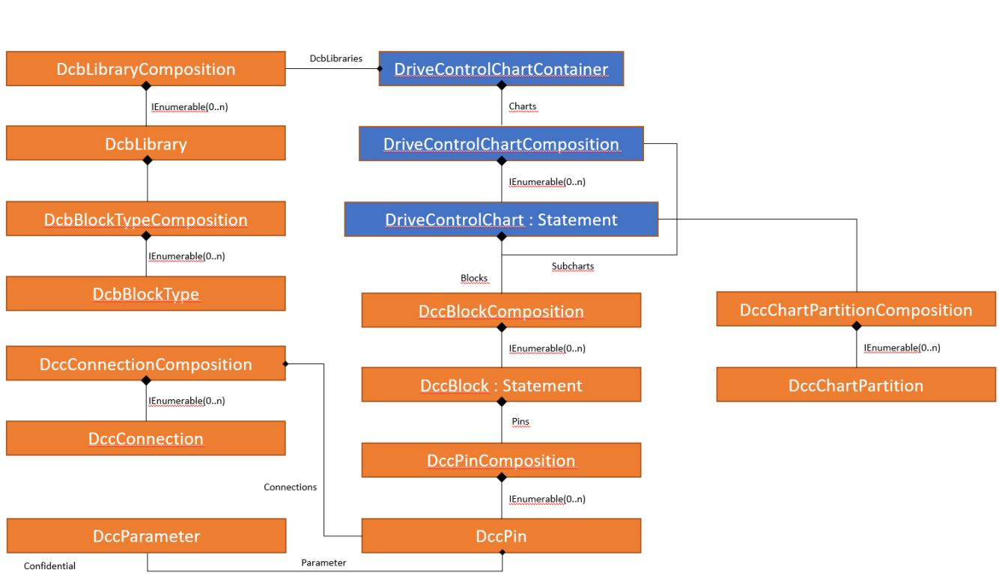

### 5.25.4 参考


#### 5.25.4.1 DccBlock


##### DccBlock 属性

DccBlock 是一幅 DCC 功能图内的一个 DCC 功能块。
下表说明了 DccBlock 的属性：
下文也列出了Statement的所有属性。
<table><tr><td>特性名称</td><td>数据类型</td><td>可写</td><td>说明</td><td>异常</td></tr><tr><td>GenericInputsNumber</td><td>ushort</td><td>可写</td><td>功能块通用输入引脚的数量。</td><td>DccInvalidValueException</td></tr></table>
下表说明了 DccBlock 的导航栏：
<table><tr><td>名称</td><td>数据类型</td><td>可写</td><td>说明</td></tr><tr><td>Pins</td><td>DccPinComposition</td><td>只读</td><td>返回一个功能块的所有引脚。</td></tr></table>
下表说明了 DriveControlChartComposition 的方法：
<table><tr><td>名称</td><td>返回值类型</td><td>参数</td><td>说明</td><td>异常</td></tr><tr><td>Delete</td><td>-</td><td>-</td><td>从一幅功能图删除一个功能块。</td><td>DccException</td></tr></table>

#### 5.25.4.2 DccBlockComposition

DccBlockComposition 属性
DccBlockComposition 是一幅功能图或一幅子图中的一组 DCB 功能块。
下表说明了 DccBlockComposition 的方法：
<table><tr><td>名称</td><td>返回值类型</td><td>参数</td><td>说明</td><td>异常</td></tr><tr><td>Create</td><td>DccBlock</td><td>string name string Blocktype</td><td>在功能图中以指定名称和功能块类型名称创建一个新的 DCC 功能块。</td><td>DccInvalidNameException, DccTextTooLongException, DccNameAlreadyUsedException, DccBlockTypeNotFoundException</td></tr><tr><td>Create</td><td>DccBlock</td><td>string name string Blocktype string LibraryName</td><td>在功能图中以指定名称和功能块类型名称创建一个新的 DCC 功能块,功能块类型名来自选中 DCB 库:</td><td>DccBlockCreationInvalidNameException, DccBlockCreationNameTooLongException, DccBlockCreationBlocktypeNotFoundException</td></tr><tr><td>Find</td><td>DccBlock</td><td>string name</td><td>根据名称查找 DCC 功能块。</td><td>-</td></tr></table>

#### 5.25.4.3 DcbLibrary

DcbLibrary
DcbLibrary 是在 DCC 功能图容器中使用的 DCB 库。
下表说明了 DcbLibrary 的属性：
<table><tr><td>特性名称</td><td>数据类型</td><td>可写</td><td>说明</td></tr><tr><td>LibraryName</td><td>string</td><td>只读</td><td>DCB 库的名称</td></tr><tr><td>Version</td><td>system.Version</td><td>只读</td><td>DCB 库的版本</td></tr></table>
下表列出了 DcbLibrary 的导航器：
<table><tr><td>名称</td><td>数据类型</td><td>可写</td><td>描述</td></tr><tr><td>DcbBlockTypes</td><td>DCbBlockTypeComposition</td><td>只读</td><td>返回 DCB 库中使用的所有块类型。</td></tr></table>

#### 5.25.4.4 DcbBlockType

DcbBlockType
DcbBlockType 对应于 DCB 块类型，可在 DCB 库中使用。
下表说明了 DcbBlockType 的属性：
<table><tr><td>特性名称</td><td>数据类型</td><td>可写</td><td>说明</td></tr><tr><td>Name</td><td>string</td><td>只读</td><td>DCB 块类型的名称。</td></tr><tr><td>Description</td><td>字符串</td><td>只读</td><td>DCB 块类型的简述。</td></tr></table>

#### 5.25.4.5 DcbLibraryComposition


##### DcbLibraryComposition 属性

DccBlockComposition 是一个特定的 DCC 功能图容器的一组 DCB 库。
下表说明了 DcbLibraryComposition 的方法：
<table><tr><td>名称</td><td>返回值类型</td><td>参数</td><td>说明</td><td>异常</td></tr><tr><td>Find</td><td>DcbLibraryComposition</td><td>string libraryName</td><td>根据名称查找 DcbLibrary。</td><td>-</td></tr></table>

#### 5.25.4.6 DccConnection


##### DccConnection 属性

DccConnection 是一幅 DCC 功能图内的一个内部或外部连接，可以是汇点或源点或两个都是DCC 对象（引脚或参数）。
下表说明了 DccConnection 的导航栏：
<table><tr><td>名称</td><td>数据类型</td><td>可写</td><td>说明</td></tr><tr><td>Sink</td><td>IEngineeringObject</td><td>只读</td><td>连接的汇点。可以是:DccPin。</td></tr><tr><td>Source</td><td>IEngineeringObject</td><td>只读</td><td>连接的源点。可以是:DccPin。</td></tr></table>
下表说明了 DccConnection 的方法：
<table><tr><td>名称</td><td>返回值类型</td><td>参数</td><td>说明</td><td>异常</td></tr><tr><td>Delete</td><td>-</td><td>-</td><td>删除一个连接。</td><td>-</td></tr></table>

#### 5.25.4.7 DccImportOptions


##### DccImportOptions

导入图时可以进行以下设置：
• DccImportOptions.None:
如无名称冲突，导入成功完成。否则，抛出异常
DccImportChartWithSameNameAlreadyAvailableException。
• DccImportOptions.RenameOnConflict:
如有名称冲突，CFC 会自动给新导入图分配名称。例如，如果导入中已存在一个图名称为CFC\_1，则新导入的图名称会分配为 CFC\_2。
DriveControlChartComposition (页 1351)

#### 5.25.4.8 DccChartPartitionComposition

DccChartPartitionComposition 属性
DccChartPartitionComposition 是 DriveControlChart 内的一组分区。
5.25 DCC 功能
下表说明了 DccChartPartitionComposition 的方法：
<table><tr><td>名称</td><td>返回值类型</td><td>参数</td><td>说明</td><td>异常</td></tr><tr><td>Create</td><td>DccChartPartition</td><td>stringname</td><td>在功能图中以指定名称创建一个新的分区。</td><td>DccTextTooLongException,DccNameAlreadyUsedException,DccTooManyPartitionsException</td></tr><tr><td>Find</td><td>DccChartPartition</td><td>stringname</td><td>根据名称查找分区。</td><td>-</td></tr></table>

#### 5.25.4.9 DccImportResultData

DccImportResultData 包含导入图时的结果信息。
下表说明了 DccImportResultData 的特性：
<table><tr><td>特性名称</td><td>数据类型</td><td>可写</td><td>说明</td></tr><tr><td>RemappedParameterNumbers</td><td>IDictionary</td><td>只读</td><td>导入时,一个要导入的 DCC 参数可能已存在。这种情况下,会分配一个新号给要导入的参数。此 Dictionary 里会包含所有新分配的参数。关键值是之前导出时的参数号,值是新创建的参数。</td></tr></table>
[DriveControlChartComposition](#DriveControlChartComposition)

#### 5.25.4.10 DccParameter


##### DccParameter

DccParameter 是在一幅 DCC 功能图的 DCC 引脚处发布的参数。
下表说明了 DccParameter 的属性：
<table><tr><td>特性名称</td><td>数据类型</td><td>可写</td><td>说明</td><td>异常</td></tr><tr><td>Number</td><td>ushort</td><td>可写</td><td>DCC 参数的编号。</td><td>DccParameterNumberAlreadyExistsException,DccParameterNumberOfRangeException</td></tr><tr><td>ParameterText</td><td>string</td><td>可写</td><td>DCC 参数的文本。</td><td>DccTextTooLongException</td></tr><tr><td>IsSink</td><td>boolean</td><td>只读</td><td>指出 DCC 参数是源点还是汇点。</td><td></td></tr><tr><td>IsSignal</td><td>boolean</td><td>可写</td><td>指出参数是否是信号参数。</td><td></td></tr></table>

#### 5.25.4.11 DccPin


##### DccPin 属性

DccPin 是一幅 DCC 图内一个 DCC 功能块实例中的一个引脚。
下表说明了 DccPin 的属性：
<table><tr><td>特性名称</td><td>数据类型</td><td>可写</td><td>说明</td><td>Exception</td></tr><tr><td>Name</td><td>string</td><td>只读</td><td>引脚的名称。</td><td>-</td></tr><tr><td>Comment</td><td>string</td><td>可写</td><td>引脚的注释。</td><td>TextTooLongException</td></tr><tr><td>Value</td><td>object</td><td>可写</td><td>引脚的数值。</td><td>DccInvalidValueException</td></tr><tr><td>IsInput</td><td>boolean</td><td>只读</td><td>当引脚是输入时为“True”,其他情况是“false”</td><td>-</td></tr><tr><td>Invisible</td><td>boolean</td><td>可写</td><td>指出引脚是否可见。</td><td>-</td></tr><tr><td>Unit</td><td>string</td><td>可写</td><td>引脚的单位。</td><td>-</td></tr><tr><td>ForTest</td><td>boolean</td><td>可写</td><td>指出引脚是否设置用于监测。</td><td>-</td></tr></table>
下表说明了 DccPin 的导航栏：
<table><tr><td>名称</td><td>数据类型</td><td>可写</td><td>说明</td></tr><tr><td>Connections</td><td>DccConnectionComposition</td><td>只读</td><td>引脚的所有连接。</td></tr><tr><td>Parameter</td><td>DccParameter</td><td>只读</td><td>引脚发布为的 DCC 参数。</td></tr></table>
下表说明了 DccPin 的方法：
<table><tr><td>名称</td><td>返回值类型</td><td>参数</td><td>说明</td><td>异常</td></tr><tr><td>Connect</td><td>DccConnection</td><td>DccPin partner</td><td>和指定对象引脚创建一个“引脚-引脚”连接</td><td>DccIllegalAssignmentException</td></tr><tr><td>Publish</td><td>DccParameter</td><td>bool setAsSignal</td><td>将引脚发布为参数。setAsSignal为“True”,引脚发布为信号,参数号自动设置。</td><td>DccPublishingStructAlarmIdException,DccNoMoreFreeParameterNumberInDriveObjectException</td></tr><tr><td>Publish</td><td>DccParameter</td><td>bool setAsSignal,ushort parameter Number</td><td>以指定参数号发布引脚。setAsSignal为“True”,引脚发布为信号。</td><td>DccParameterNumberAlreadyExistsException,DccParameterNumberOf RangeException,DccPublishingStructAlarmIdException,DccNoMoreFreeParameterNumberInDriveObjectException</td></tr><tr><td>Unpublish</td><td>-</td><td>-</td><td>撤销引脚发布为参数,删除现有DCC连接。</td><td>-</td></tr></table>

#### 5.25.4.12 DccPinComposition

DccPinComposition 属性
DccPinComposition 是一个 DccBlock 实例内的一组引脚。
下表说明了 DccPinComposition 的方法：
<table><tr><td>名称</td><td>返回值类型</td><td>参数</td><td>说明</td><td>异常</td></tr><tr><td>Find</td><td>DcbPin</td><td>string name</td><td>根据名称查找引脚。</td><td>-</td></tr></table>

#### 5.25.4.13 DriveControlChart


##### DriveControlChart 特性

DriveControlChart 是一幅图或子图。
下表说明了 DriveControlChart 的特性：
<table><tr><td>特性名称</td><td>数据类型</td><td>可写</td><td>说明</td><td>Exception</td></tr><tr><td>Name</td><td>string</td><td>只读</td><td>图名称。</td><td>DccTextTooLongException,DccNameInvalidException,DccNameAlreadyUsedException</td></tr><tr><td>Comment</td><td>string</td><td>可写</td><td>DriveControlChart的注释。</td><td>DccTextTooLongException</td></tr><tr><td>Partition</td><td>DccChartPartition</td><td>可写</td><td>DriveControlChart在上级图中所在的分区。</td><td>-</td></tr><tr><td>PositionX</td><td>int</td><td>可写</td><td>子图在上级图中的X坐标。</td><td>-</td></tr><tr><td>PositionY</td><td>int</td><td>可写</td><td>子图在上级图中的Y坐标。</td><td>-</td></tr><tr><td>HorizontalSheets</td><td>uint</td><td>可写</td><td>图中横版页面的数量。</td><td>DccInvalidValueException</td></tr><tr><td>VerticalSheets</td><td>uint</td><td>可写</td><td>图中竖版页面的数量。</td><td>DccInvalidValueException</td></tr><tr><td>SheetWidth</td><td>Int32</td><td>只读</td><td>实际页面尺寸的表单宽度。</td><td>-</td></tr><tr><td>SheetHeight</td><td>Int32</td><td>只读</td><td>实际页面尺寸的表单高度。</td><td>-</td></tr></table>
下表说明了 DriveControlChart 的导航栏：
<table><tr><td>名称</td><td>数据类型</td><td>可写</td><td>说明</td></tr><tr><td>Blocks</td><td>DccBlockComposition</td><td>只读</td><td>返回一幅功能图中的所有功能块,不排序。</td></tr><tr><td>Subcharts</td><td>DriveControlChartComposition</td><td>只读</td><td>返回一幅功能图中的所有子图,不排序。</td></tr><tr><td>Partitions</td><td>DccPartitionComposition</td><td>只读</td><td>返回一幅功能图中的所有Statement(子图和功能块),不排序。</td></tr></table>
下表说明了 DriveControlChart 的方法：
<table><tr><td>名称</td><td>返回值类型</td><td>参数</td><td>说明</td><td>异常</td></tr><tr><td>Export</td><td>-</td><td>string path</td><td>方法描述:仅导出此图。参数说明:路径:导出文件的完整路径。</td><td>DccExportException(页 1368)</td></tr><tr><td>Find</td><td>Statement</td><td>string name bool deepSearch</td><td>当deepSearch 设为 true,在当前功能图或下级子图中查找子图或功能块。</td><td>-</td></tr><tr><td>Delete</td><td>-</td><td>-</td><td>方法描述:删除此图。</td><td>-</td></tr><tr><td>GetRunSequence</td><td>IList</td><td>-</td><td>返回当前功能图内 Statement 的运行顺序。</td><td>-</td></tr><tr><td>OptimizeRunSequence</td><td>-</td><td>-</td><td>方法描述:优化图运行顺序。CFC 提供了优化机制。</td><td>-</td></tr><tr><td>ShowDccEditor</td><td>-</td><td>-</td><td>在 TIA Portal 中互动模式中打开功能图的 DCC 编辑器。</td><td>DccException,DccChartIsProtected Exception</td></tr></table>
5.25 DCC 功能
[DriveControlChart Exceptions](#DriveControlChart-Exceptions)
DriveControlChartComposition (页 1351)
删除图 (页 1363)

#### 5.25.4.14 DriveControlChartContainer


##### DriveControlChartContainer

DriveControlChartContainer 是一个服务，表示一个 DriveObject 下的 DCC 图容器，所以它可以从适当的 DriveObject 里检索。如果 DriveObject 不来自于一个支持的设备，将不会提供此服务。
下表说明了 DriveControlChartContainer 的导航栏：
<table><tr><td>名称</td><td>数据类型</td><td>可写</td><td>说明</td></tr><tr><td>Charts</td><td>DriveControlChartComposition</td><td>只读</td><td>读取图容器的图布局 (composition)。</td></tr><tr><td>DcbLibrari es</td><td>DcbLibraryComposition</td><td>只读</td><td>返回功能图中使用的所有 DCB 库。</td></tr></table>

#### 5.25.4.15 DriveControlChartComposition

DriveControlChartComposition 特性
DriveControlChartComposition 列出了可用的图。
5.25 DCC 功能
下表说明了 DriveControlChartComposition 的方法：
<table><tr><td>名称</td><td>返回值类型</td><td>参数</td><td>说明</td><td>异常</td></tr><tr><td>Create</td><td>DriveControl Chart(页 1349)</td><td>string name</td><td>以指定名称创建一幅新的功能图。</td><td>DccTextTooLongException,DccNameInvalidException,DccNameAlreadyUsedException,DccTooManyChartsException,DccNestingTooDeepException, DccException</td></tr><tr><td>Create</td><td>DriveControl Chart(页 1349)</td><td>-</td><td>以自动产生的名称创建一幅新的功能图。</td><td>DccTooManyChartsException,DccNestingTooDeepException, DccException</td></tr><tr><td>Import</td><td>DccImportResultData(页 1346)</td><td>string path,DccImport Options(页 1345)importOptions</td><td>方法描述:从一个 DCC 导出文件导入图。参数说明:路径:导入文件的完整路径。importOptions:导入时的选项,[DccImportOptions](#DccImportOptions)。</td><td>DccImportException(页 1369)</td></tr><tr><td>Export</td><td>-</td><td>string path</td><td>方法描述:导出所有图至一个 DCC 导出文件。参数说明:路径:导出文件的完整路径。</td><td>DccExportException(页 1369)</td></tr><tr><td>GetChartSequence</td><td>DriveControl Chart(页 1349)</td><td>-</td><td>按照在容器中的运行顺序,读取所有功能图。</td><td>-</td></tr><tr><td>Find</td><td>DriveControl Chart(页 1349)</td><td>string name</td><td>根据图容器内的名称找到一张图</td><td>-</td></tr></table>
[DriveControlChartComposition 异常](#DriveControlChartComposition-异常)
DccImportResultData (页 1346)
5.25 DCC 功能
DriveControlChart (页 1349)
DccImportOptions (页 1345)

#### 5.25.4.16 导入 DCB Extension 库


##### ImportDCBextensionlibrary

下表说明了 ImportDCBextensionlibrary 的方法：
<table><tr><td>名称</td><td>返回值</td><td>参数</td><td>说明</td></tr><tr><td>ImportDcbLibrary</td><td>-</td><td>字符串路径</td><td>方法参数 (Method arguments):路径:DCB 扩展库 zip 文件的完整路径。方法描述:导入一个 DCB 扩展库至项目库。</td></tr></table>

#### 5.25.4.17 Statement


##### Statement

A Statement 代表 DriveControlChart 或 DCC 块。以下所有属性和方法都是继承的。
下表说明了 statement 的属性：
<table><tr><td>特性名称</td><td>数据类型</td><td>可写</td><td>说明</td><td>Exception</td></tr><tr><td>Name</td><td>string</td><td>可写</td><td>statement 的名称。</td><td>DccNameTooLongExceptionDccNameInvalidException</td></tr><tr><td>Comment</td><td>string</td><td>可写</td><td>statement 的注释。</td><td>DccNameTooLongExceptionDccNameInvalidException</td></tr><tr><td>Partition</td><td>DccChartPartition</td><td>可写</td><td>语句在上级图中所在的分区。</td><td>-</td></tr></table>
<table><tr><td>特性名称</td><td>数据类型</td><td>可写</td><td>说明</td><td>Exception</td></tr><tr><td>PositionX</td><td>int</td><td>可写</td><td>语句在上级图中的 X 坐标。</td><td>-</td></tr><tr><td>PositionY</td><td>int</td><td>可写</td><td>语句在上级图中的 Y 坐标。</td><td>-</td></tr></table>

##### 语句的坐标无效 - CFC 自动定位

如果语句的坐标之一（PositionX、PositionY）接收到无效值（例如，PositionY = -20），则CFC 将自动定位语句。因此，相应属性（如 PositionY）的值继续显示无效值。这是预期响应。这可用于确定语句是否已自动定位。

##### 下表说明了 statement 的方法：

<table><tr><td>名称</td><td>返回值</td><td>参数</td><td>说明</td><td>异常</td></tr><tr><td>SetAsPredecessor</td><td>-</td><td>string path</td><td>将 statement 设为要添加到图中的下一个 statement 的前身。在源功能图中使用该方法时,无效。</td><td>-</td></tr><tr><td>MoveInRuntimeSequence</td><td>-</td><td>int index</td><td>在执行顺序中将 statement 移动到指定下标处。</td><td>DccInvalidValue Exception</td></tr></table>

### 5.25.5 代码示例


#### 5.25.5.1 概述

以下代码示例描述了不同应用的基本步骤。代码不需要完整或兼容。
优化性能
如果在用户界面上打开了一个生效的 TIA Portal 实例，建议关闭相关的编辑器（例如：用于编辑图、参数列表等的 DCC 编辑器），以便在使用 Openness 时获得更好的性能。

#### 5.25.5.2 更改运行顺序

下例展示如何修改图的运行顺序。

##### 修改图的运行顺序

5.25 DCC 功能
```text
修改图的运行顺序
DriveControlChart chart;
IList<IStatement> runtimeSequence = chart.GetRunSequence();
runtimeSequence[3].MoveInRuntimeSequence(0);
```

#### 5.25.5.3 优化执行顺序

下例展示如何优化图运行顺序。
优化图的运行顺序
```text
try
{
    DriveControlChart chart;
    ...
    chart.OptimizeRunSequence();
}
catch (DccLicenseUnavailableException exc)
{
}
```
DCC Openness (页 1339)

#### 5.25.5.4 访问图

下例展示如何访问图。
访问图
```text
DriveControlChartComposition charts = ...
DriveControlChart firstChart = charts[0];
// or looping...
foreach(DriveControlChart chart in charts)
{
    ...
}
```
5.25 DCC 功能

#### 5.25.5.5 导出所有图

下例展示如何导出所有图。
导出所有图
```text
try
{
    charts.Export(@"c:\Charts.dcc");
}
catch (DccExportException exc)
{
}
```
参见
```text
DCC Openness (页 1339)
```

#### 5.25.5.6 导入一个 DCB 扩展库

下例展示如何导入一个 DCB 扩展库。
导入一个 DCB 扩展库
```text
try
{
    Project myProject;
    ...
myProject.ProjectLibrary.ImportDcbLibrary(@"c:\GMCV5_1_sinamics5_1_(5.1.15).zip");
}
catch (DccImportException exc)
{
}
```
DCC Openness (页 1339)
5.25 DCC 功能

#### 5.25.5.7 读取 DCB 库信息

下例展示如何读取一个 DCB 库的信息。

##### 读取 DCB 库信息

```javascript
DriveControlChartContainer chartContainer = ...
DcbLibraryComposition dcbLibraries = chartContainer.DcbLibraries;
DcbLibraryComposition testLib = dcbLibraries.Find("TestLib");
System.Version libVersion = testLib[0].Version;
System.Console.WriteLine($"Major version: {version.Major}, Minor version: {version.Minor});
```

#### 5.25.5.8 编辑 DCC 功能块

下例展示如何在功能图中创建一个功能块。

##### 在功能图中创建功能块

```javascript
DriveControlChart chart;
var blocks = chart.Blocks;
DccBlock newBlock = blocks.Create("ADD")
DccBlock newBlock = blocks.Create("add_1", "ADD");
DccBlock newBlock = blocks.Create("add_1", "gear", "GMC");
```
以下示例显示如何将块放置在图表的右下角。

##### 将块放置在图表的右下角

```text
DriveControlChartContainer chartContainer = ...
DriveControlChart chart = chartContainer.Charts.Find("DCC_1");
DccBlockComposition blocks = chart.Blocks;
DccBlock block = blocks.Create("ADD_1");
int horizontalSheetCount = chart.HorizontalSheets;
int verticalSheetCount = chart.VerticalSheets;
int blockSizeX = 20;
int blockSizeY = 20;
int sheetWidth = chart.SheetWidth;
int sheetHeight = chart.SheetHeight;
block.PositionX = (sheetWidth * horizontalSheetCount) - blockSizeX;
block.PositionY = (sheetHeight * verticalSheetCount) - blockSizeY;
```
5.25 DCC 功能
下例展示如何根据名称查找一个功能块。

##### 根据名称查找功能块

```javascript
DriveControlChart chart;
var blocks = chart.Blocks;
DccBlock addBlock = blocks.Find("add_1");
```
以下示例介绍如何设置块的属性。

##### 设置功能块属性

```javascript
DccBlock dccBlock;
dccBlock.Name = "add_3";
dccBlock.Comment = "new comment";
dccBlock.PositionX = 110;
dccBlock.PositionY = 234;
dccBlock.GenericInputsNumber = 4;
```
以下示例介绍如何从图表中删除块。

##### 从功能图中删除一个功能块

```javascript
DccBlock dccBlock = chart.Blocks.Find("add_2");
dccBlock.Delete();
```
以下示例介绍如何将语句（如 DCC 块）设置为运行顺序中的前身。
将语句（如 DCC 块）设置为运行顺序中的前身。
```javascript
DccBlock dccBlock;
dccBlock.SetAsPredecessor();
```

#### 5.25.5.9 读取 DCB 块类型信息

以下示例介绍如何读取 DCB 块类型的信息。

##### 读取 DCB 块类型信息

```javascript
DriveControlChartContainer chartContainer = ...
DcbLibraryComposition dcbLibraries = chartContainer.DcbLibraries;
DcbLibraryComposition testLib = dcbLibraries.Find("TestLib");
DcbBlockTypeComposition blockTypes = testlib.DcbBlockTypes;
DcbBlockType blockType = blockTypes.Find("test_all_pin_types");
System.Console.WriteLine($"Name: {blockType.Name}, Description: {blockType.Description});
```

#### 5.25.5.10 编辑 DCC 参数

下例展示如何编辑 DCC 参数。

##### 更改 DCC 参数

```javascript
DccPin pinOnControlUnit;
DccParameter param1 = pinOnControlUnit.Parameter;
param1.Number = 21600;
param1.ParameterText = "new text for parameter";
```

#### 5.25.5.11 显示导入报告

下例展示如何显示与导入相关的报告。

##### 显示导入报告

```cs
DccImportResultData importResultData = charts.Import(@"d:\Charts.dcc", DccImportOptions.None);
IDictionary<ushort, ushort> remappedParameters = importResultData.RemappedParameterNumbers;
foreach (KeyValuePair<ushort, ushort> remappedParameter in remappedParameters)
{
    System.Console.WriteLine($"ParameterNumber < {remappedParameter.Key} > has been changed to < {remappedParameter.Value} > during import.");
}
```
5.25 DCC 功能

#### 5.25.5.12 编辑引脚

下例展示如何编辑引脚。

##### 根据名称查找引脚

```javascript
DccBlock block;
DccPinComposition pins = block.Pins;
DccPin x3 = pins.Find("X3");
```

##### 设置引脚属性

```javascript
DccPin dccPin;
dccPin.Comment = "new comment";
dccPin.Value = 42;
```

##### 编辑引脚

```text
DccBlock block1;
DccPin input = block.Pins.Find("X1");
DccPin output = block.Pins.Find("Y");
input.Connect(output);
```

##### 将引脚发布为参数

```javascript
DccBlock block1;
DccPin input = block1.Pins.Find("X1");
DccPin output = block1.Pins.Find("Y");
input.Publish(true);
output.Publish(false, 21620);
```

##### 引脚不作为参数发布

output.Unpublish();

#### 5.25.5.13 按执行顺序检索图

下例展示如何按执行顺序检索图。
```text
检索图
DriveControlChartComposition charts = ...
IList<DriveControlChart> chartSequence = charts.GetChartSequence();
```

#### 5.25.5.14 使用名称查找图或块

下例说明了如何使用名称查找图或块。查找图或块时不区分大小写。
查找图或块
```javascript
DriveControlChartComposition charts = ...
DriveControlChart chart = charts.Find("CFC_1");
chart.Blocks.Find("add_1");
```
DCC Openness (页 1339)

#### 5.25.5.15 创建图或子图

下例说明了如何创建一幅新图或子图。

##### 创建 DCC 图或子图

```javascript
DriveControlChartComposition charts = ...
DriveControlChart chart1 = charts.Create("DCC_1");
DriveControlChart chart2 = charts.Create(); // the next available number will be used, so here it will be "DCC_2"
```

#### 5.25.5.16 编辑功能图

下例展示如何编辑功能图。
设置功能图属性
5.25 DCC 功能
```text
设置功能图属性
DriveControlChart dccChart;
dccChart.Name = "DCC_3";
dccChart.Comment = "new comment";
// setting layout
dccChart.HorizontalSheets = 4;
dccChart.VerticalSheets = 3;
// applicable for a subchart
dccChart.Partition = parentChart.Partitions[1];
dccChart.PositionX = 110;
dccChart.PositionY = 234;
```

##### 读取并更改运行顺序

```text
DriveControlChartchart;
IList<IStatement>runtimeSequence=chart.GetRunSequence();
runtimeSequence[3].MoveInRuntimeSequence(1);
```

##### 将功能图设置为先导图

```javascript
DriveControlChart chart;
...
chart.SetAsPredecessor(); // if the chart is a root chart where the method is called, then there is no effect as root chart cannot be predecessor in the runtime sequence
```

##### 在 TIA Portal 中互动模式中打开 DCC 编辑器

DriveControlChart chart;
chart.ShowDccEditor();
5.25 DCC 功能
DriveControlChart chart; chart.ShowDccEditor();

##### 设置分区

```javascript
DriveControlChartchart;
...DccChartPartitionComposititonpartitions=chart.Partitions;
DccChartPartitionpartition2=partitions.Create("Partition_2");
// moving a block to the new partition
chart.Blocks.Find("add_2").Partition=partition2;
```

#### 5.25.5.17 删除图

下例展示如何删除图。
删除图
```text
try
{
    DriveControlChart chart;
    ...
    chart.Delete();
}
{
```
DCC Openness (页 1339)
DriveControlChart (页 1349)

#### 5.25.5.18 检索图

下例展示如何检索图。
检索图
DriveControlChartComposition charts = chartContainer.Charts;

#### 5.25.5.19 导入图

下例展示如何导入图。
导入图
```objectivec
try
{
    DriveControlChartComposition charts = ...
    DccImportResultData result = charts.Import(@"c:\Charts.dcc", DccImportOptions.None);
}
catch (DccImportException exc)
{
}
```
DCC Openness (页 1339)

#### 5.25.5.20 导出图

下例展示如何导出图。
导出图
```objectivec
try
{
    DriveControlChart chart;
    ...
    chart.Export(@"c:\CFC_1.dcc");
}
catch (DccExportException exc)
{
}
```
DCC Openness (页 1339)

#### 5.25.5.21 编辑连接

下例展示如何读取连接的源点或汇点。

##### 读取连接的源点或汇点

```text
DccConnection connection;
var sink = connection.Sink;
if (sink is DccParameter)
{
    System.Console.WriteLine("Sink is DCC parameter: " + ((DccParameter)sink).ParameterNumber);
}
```

#### 5.25.5.22 通过 DriveObject 访问 DriveControlChartContainer

下例展示如何通过一个驱动对象访问一个 DriveControlChartContainer。

##### 访问一个 DriveControlChartContainer

```cs
using Siemens.Engineering.MC.Drives;
using Siemens.Engineering.MC.Drives.DCC;
Project project = portal.Projects.Open("..."); // Destination folder to open the project
DeviceItem item = project.Devices[0].Items[0];
DriveObject
driveObject = item.GetService<DriveObjectContainer>().DriveObjects[0];
DriveControlChartContainer
chartContainer = driveObject ToketService<DriveControlChartContainer>();
//chartContainer can be null in case the DriveObject does not support DCC.
```

### 5.25.6 DCC Openness 异常


#### 5.25.6.1 异常处理

对于会因用户出错而失败的应用，DCC Openness 会抛出一个派生自 EngineeringTargetInvocationException 的 DCC 特定异常。这些异常是有层级关系的，即所有特定异常都派生自上一级异常DccException：

##### 缺失许可证会导致异常

如果缺少功能所需的 DCC 许可证，则会抛出异常DccLicenseUnavailableException。
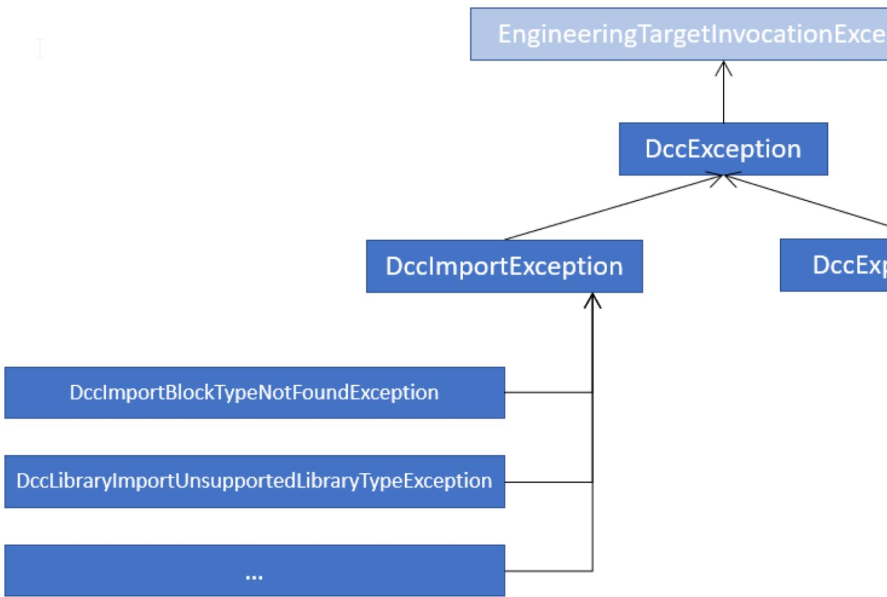
如果不想详细分析或评估不同的错误原因，最简单的方法是捕获一般DccException:
5.25 DCC 功能
```text
try
{
    Project myProject;
    ...
myProject.ProjectLibrary.ImportDcbLibrary(@"c:\GMCV5_1_sinamics5_1_(5.1.15).zip");
    ...
    DriveControlChartContainer chartContainer = driveObject.GetService<DriveControlChartContainer>();
    chartContainer.Charts.Import(@"d:\Charts.dcc", DccImportOptions.None);
}
catch (DccException exc)
{
}
```
如果希望根据错误类型作出响应，则需要捕获所有相关异常：
```text
try
{
    DriveControlChartContainer
chartContainer = driverObject.GetService<DriveControlChartContainer>();
    chartContainer.Charts.Import(@"d:\Charts.dcc", DccImportOptions.None);
}
catch (DccImportLibraryIsMissingException missingLibExc)
{
}
catch (DccImportChartWithSameNameAlreadyAvailableException sameNameExc)
{
}
catch (DccImportException exc)
{
}
catch (DccException exc)
{
}
```

#### 5.25.6.2 DccBlockComposition Exceptions

异常
创建功能块时会抛出的异常：
• DccInvalidNameException:当功能块名称无效时抛出。
• DccTooLongTextException:当功能块名称过长时抛出。
• DccNameAlreadyUsedException:
• DccBlocktypeNotFoundException:
当指定功能块类型在当前的所有库中都找不到时抛出。

#### 5.25.6.3 DriveControlChart Exceptions

异常
导出时会抛出的异常：
• DccExportException:
对于所有导出错误类型都会抛出。
更改运行顺序时会抛出的异常：
• DccException:
运行顺序无法更改时抛出。
控制图运行时执行优化顺序功能时会抛出的异常：
• DccLicenseUnavailableException:
如果 DCC 许可证不可用会抛出。在这种情况下，优化运行顺序功能不可用。
[DriveControlChart](#DriveControlChart)

#### 5.25.6.4 DriveControlChartComposition 异常


##### 异常

导入时会抛出的异常：
• DccException:功能图无法创建时抛出。功能图运行顺序无法更改时抛出。
• DccTextTooLongException:因名称过长而无法创建新图时抛出。
• DccNameInvalidException:因名称无效而无法创建新图时抛出（例如：名称包含无效字符）。
• DccNameAlreadyUsedException:
• DccTooManyChartsException:当超出最大字符数时抛出。
• DccNestingTooDeepException:当超出可嵌套子图的最大数量时抛出。
• DccImportException:一般导入异常，导入出错时 DCC 会抛出。
• DccImportBlockCreationException:如果一个块无法在被导入时创建会抛出。
• DccImportChartCreationException:导入期间功能图无法创建时抛出。
• DccImportChartWithSameNameAlreadyAvailableException:如果一个同名称的图在图容器中已存在且使用了 DccImportOptions.None 时会抛出。
• DccImportLibraryIsMissingException:如果一个参考 DCB Extension 库在项目中不存在会抛出。
• DccImportFileAlreadyInUseException:如果正在导入的文件已在另一个进程中被使用会抛出。
• DccImportDcbTypeDiferentVersionAlreadyUsedException:如果 DCB 类型与设备中 DCB Extension 库里正在使用的版本不一致会抛出。
[DriveControlChartComposition](#DriveControlChartComposition)

#### 5.25.6.5 ImportDcbLibrary Exceptions

异常
ImportDcbLibrary 抛出的异常：
• DccImportException:对于所有导入出错类型，会抛出。
• DccLibraryImportAlreadyAvailableException:如果 DCB 扩展库在项目中已存在相同版本，会抛出。
• DccLibraryImportCorruptedStudioLibraryException:如果 DCB 扩展库 zip 文件已损坏且无法被导入，会抛出。
• DccLibraryImportIntegrityBrokenException:如果 DCB 扩展库 zip 文件已损坏，会抛出。
• DccLibraryImportOverallPinLimitExceededException:如果 DCB 扩展库包含的 DCB 类型超过允许的最大 pin 数量，会抛出。
• DccLibraryImportStandardLibraryAlreadyAvailableException:如果选择导入的 DCB 扩展库为标准 DCBLib 且已存在，会抛出。
• DccLibraryImportUnsupportedLibraryTypeException:如果 DCC 和 SINAMICS 驱动不支持选择的 DCB 扩展库，会抛出。

## 5.26 例外


### 5.26.1 处理异常


#### 通过 TIA Portal Openness API 访问 TIA Portal 时发生的异常

在通过 TIA Portal Openness API 执行 TIA Portal Openness 应用程序的过程中，发生的所有错误都会报告为异常。这些例外可能包含有助于更正所发生错误的信息。
以下两种类型的例外存在明显区别：
• Recoverable (Siemens.Engineering.EngineeringException)
可以在不受此例外干扰的情况下继续访问 TIA Portal。或者，也可以取消与 TIA Portal 的连接。
EngineeringExceptions 包括以下类型：
– 安全相关例外 (EngineeringSecurityException)，例如缺少访问权限时。
– 访问对象时的例外 (EngineeringObjectDisposedException)，例如访问不再存在的对象时。
– 访问属性时的例外 (EngineeringNotSupportedException)，例如访问不存在的属性时。
– 调用时的常规异常 (EngineeringTargetInvocationException)，例如有效调用 TIA PortalOpenness API 时仍发生错误。
– 调用时的例外 (EngineeringRuntimeException)，例如无效的转换异常。
– 相关 TIA Portal 实例 (EngineeringOutOfMemoryException) 中的资源不足时出现的异常
– 调用终止时的例外情况 (EngineeringUserAbortException)，例如用户取消导入动作。
– 从客户端提供的委托 (EngineeringDelegateInvocationException) 中调用 API 期间出现 的异常。此异常源自 EngineeringTargetInvocationException 异常。
EngineeringExceptions 具备以下属性：
– ExceptionMessageData messageData<sup>:</sup> 包含发生异常的原因。
– ExceptionMessageData detailMessageData<sup>:</sup> 包含有关原因的其它信息。结果将以 <IList> 形式返回.
– String message：从 MessageData 和 DetailMessageData 返回结果。
ExceptionMessageData 返回以下信息：
– String Text：包含发生异常的原因。

#### • NonRecoverable (Siemens.Engineering.NonRecoverableException)

此例外将关闭 TIA Portal，与 TIA Portal 的连接也将断开。需要使用 TIA Portal Openness应用程序重新启动 TIA Portal。

#### 以下示例显示了可以用来响应例外的选项：

```text
try
{
    ...
}
catch (EngineeringSecurityException engineeringSecurityException)
{
    Console.WriteLine(engineeringSecurityException);
}
catch (EngineeringObjectDisposedException engineeringObjectDisposedException)
{
    Console.WriteLine(engineeringObjectDisposedException.Message);
}
catch (EngineeringNotSupportedException engineeringNotSupportedException)
{
    Console.WriteLine(engineeringNotSupportedException.MessageData.Text);
    Console.WriteLine();
    foreach (ExceptionMessageData detailMessageData in engineeringNotSupportedException.DetailMessageData)
    {
    Console.WriteLine(detailMessageData.Text);
    }
}
catch (EngineeringTargetInvocationException)
{
    throw;
}
catch (EngineeringException)
{
    // Do not catch general exceptions
    throw;
}
catch (NonRecoverableException nonRecoverableException)
{
    Console.WriteLine(nonRecoverableException.Message);
}
```

## 5.27 F 相关 Openness


### 5.27.1 F 相关 Openness

仅允许在离线模式下在 F 程序中进行更改。其它情况下会抛出异常。
如果设置了 F 程序密码，用户需要登录才能在 F 程序中进行更改。否则系统会通过异常提示用户需要提前登录 F 程序。
TIA Portal Openness 应用程序已连接到 TIA Portal。
请[连接到 TIA Portal](#连接到-TIA-Portal)”。

#### Openness 服务

Openness 接口 (Siemens.Engineering.dll) 已扩展有 GlobalSettings 服务（请参见名称区域 Siemens.Engineering.Safety），该服务提供了两个操作：
• SafetyModificationsPossible(bool safetyModificationsPossible)
• UsernameForFChangeHistory(string userName)
Openness 接口 (Siemens.Engineering.dll) 已扩展有 SafetySignatureProvider 服务，该服务提供了三个操作：
• SafetySignatureComposition Signatures
• UInt64 SafetySignature.Value
• SafetySignatureType SafetySignature.Type
Openness 接口 (Siemens.Engineering.dll) 已扩展有 SafetyAdministration 服务，该服务在命名空间 Siemens.Engineering.Safety 中提供以下操作和属性。
• bool IsSafetyOfflineProgramPasswordSet
• void SetSafetyOfflineProgramPassword(SecureString newPassword)
• void RevokeSafetyOfflineProgramPassword(SecureString currentPassword)
• bool IsLoggedOnToSafetyOfflineProgram
• void LoginToSafetyOfflineProgram(SecureString currentPassword)
• void LogoffFromSafetyOfflineProgram()
Openness 接口 (Siemens.Engineering.dll) 已扩展有 SafetyAdministration 服务，该服务可通过 Plc-DeviceItem 访问。SafetyAdministration 在提供在命名空间
Siemens.Engineering.Safety中定义的以下属性。这两个属性包含以下部分中列出的其它属性。
• RuntimegroupComposition RuntimeGroups { get; }
• SafetySettings Settings { get; }
Openness 接口 (Siemens.Engineering.dll) 已扩展有 SafetyPrintout 服务，该服务在命名空间 Siemens.Engineering.Safety 中提供以下操作：
```text
- bool Print(SafetyPrintoutFilePrinter filePrinter, FileInfo fullOutputPath, string documentLayout, SafetyPrintoutOption documentationOption);
```

#### 原理

```typescript
从 TiaPortal 实例获取 Safety.GlobalSettings 服务:
Engineering.Safety.GlobalSettings globalSettings = TiaPortal.GetService<Engineering.Safety.GlobalSettings>();
```

### 5.27.2 SafetyModificationsPossible

GlobalSettings 服务的 SafetyModificationsPossible(bool
safetyModificationsPossible) 操作用于防止对 TIA Portal 中的安全程序进行更改。
当参数 safetyModificationsPossible 为 true 时，TIA Portal 会根据安全程序的当前安全设置进行操作。
如果参数 safetyModificationsPossible 为 false，则会锁定对安全程序的所有更改，而不考虑用户是否已输入密码来进行安全程序更改。系统使用反馈消息提供信息，提示当前用户未授权更改安全程序。
如果尚未为安全程序组态或分配密码，则 SafetyModificationsPossible 为 false 没有任何作用。这意味着可以更改安全程序，但禁止设置新密码。
下表列出了此方法需要使用的参数：
<table><tr><td>名称</td><td>类型</td><td>说明</td></tr><tr><td>safetyModificationsPossible</td><td>bool</td><td>更改安全程序的权限</td></tr></table>
防止对安全程序进行更改：
globalSettings.SafetyModificationsPossible(false);

### 5.27.3 UsernameForFChangeHistory

应用
操作 UsernameForFChangeHistory(string userName) 指定 TIA Portal 在 F 变更历史记录中进行后续记录所使用的用户名。
字符串的最大长度限制为 256 个字符。超出最大长度的字符串将被截断。
将用户名留空（零或空白字符串）会将用户名重置为默认值。
下表列出了此方法需要使用的参数：
<table><tr><td>名称</td><td>类型</td><td>说明</td></tr><tr><td>userName</td><td>string</td><td>首选用户名</td></tr></table>
设置首选用户名：
globalSettings.UsernameForFChangeHistory("username");

### 5.27.4 SafetySignatureProvider

读出的签名提供有关 F 块更改的第一个指示。对于工厂验收，请按照《SIMATIC Safety - 组态和编程》手册中标题为“系统验收”的部分继续操作。

## 5.27 F 相关 Openness

Signatures:SafetySignatureComposition 返回 SafetySignature 对象的集合。此类型的对象具有 SafetySignature.Value:UInt64 属性，会返回 F 签名的整数值。此外，属性 SafetySignature.Type:SafetySignatureType（会返回 F 签名的类型）含在 SafetySignature 实例中。
如果 F 签名不存在或由于最近的更改而不再有效，则返回 0。这也适用于没有 F 签名的块（例如，系统块）。
```typescript
从 PlcBlock 实例获取 SafetySignatureProvider 服务。
SafetySignatureProvider signatureProvider = block.GetService<SafetySignatureProvider>()
```
如果块不是 F 块或不是 F-CPU S7-1200/1500 的块，则返回的 signatureProvider 等于null。
```text
如果存在不可为空的块，则可使用以下代码查询 F 签名：
SafetySignature signature =
signatureProvider.Signatures.Find(SafetySignatureType.BlockOfflineSignature);
UInt64 value = signature.value;
```

### 5.27.5 SafetyAdministration


#### 5.27.5.1 SafetyAdministration

此功能可用于 S7-1200/1500 F-CPU。
必须为操作和设置值安装有效的安全许可证。缺少许可证将产生异常。没有许可证也可以读取值。
```text
从当前 PLC DeviceItem 实例获取 SafetyAdministration 服务。
SafetyAdministration safetyAdministration = deviceItem.GetService<SafetyAdministration>();
// check if the service is not null
if (safetyAdministration != null)
{
    // ...
}
```
```powershell
bool isPasswordSet =
safetyAdministration.IsSafetyOfflineProgramPasswordSet
```

#### 5.27.5.2 IsSafetyOflineProgramPasswordSet

如果设置了安全程序密码，属性 IsSafetyOfflineProgramPasswordSet 将返回 True。

#### 5.27.5.3 SetSafetyOflineProgramPassword

```groovy
if (!safetyAdministration.IsSafetyOfflineProgramPasswordSet)
{
    SecureString newPassword = new NetworkCredential("", "new password").SecurePassword;
safetyAdministration.SetSafetyOfflineProgramPassword(newPassword);
}
```
如果之前未设置安全程序密码，则操作 SetSafetyOfflineProgramPassword 会设置该密码。成功设置密码后，用户不会登录到安全程序。需要明确调用 LoginToSafetyOfflineProgram 操作才能执行登录。
以下情况下，用户会获取以异常形式提供的反馈。
• 提供的密码无效（例如长度为 0 或超过 30）
• 提供的密码为 null
• 已设置安全程序密码
• 如果无法更改安全程序（[SafetyModificationsPossible](#SafetyModificationsPossible)”），或项目受到UMAC 保护，则不允许通过 Openness 修改安全程序密码。
• 用户未处于离线状态
• 安全许可证不存在

#### 5.27.5.4 RevokeSafetyOflineProgramPassword

操作RevokeSafetyOfflineProgramPassword会在 F 程序密码正确的情况下清除密码。
成功撤销密码后，用户可通过SetSafetyOfflineProgramPassword操作设置有效的新F 程序密码。
以下情况下，用户会获取以异常形式提供的反馈。
• 如果未设置密码，则无法撤销。
• 提供的密码为 null
• 如果无法更改安全程序（[SafetyModificationsPossible](#SafetyModificationsPossible)”），或项目受到UMAC 保护，则不允许通过 Openness 修改安全程序密码。
• 用户未处于离线状态
• 安全许可证不存在
```text
if (safetyAdministration.IsSafetyOfflineProgramPasswordSet)
{
    SecureString password = new NetworkCredential("", "password").SecurePassword;
    safetyAdministration.RevokeSafetyOfflineProgramPassword(password);
}
```

#### 5.27.5.5 IsLoggedOnToSafetyOflineProgram

程序代码
```text
bool isLoggedOn =
safetyAdministration.IsLoggedOnToSafetyOfflineProgram
```
如果已设置密码，或用户已登录，属性IsLoggedOnToSafetyOfflineProgram 会返回True。

#### 5.27.5.6 LoginToSafetyOflineProgram

```text
if (!safetyAdministration.IsLoggedOnToSafetyOfflineProgram)
{
    SecureString password = new NetworkCredential("", "password").SecurePassword;
    safetyAdministration.LoginToSafetyOfflineProgram(password);
}
```
如果传递的 password 正确，LoginToSafetyOfflineProgram 操作会使用户登录安全程序。成功登录后，可对安全程序进行更改。
以下情况下，用户会获取以异常形式提供的反馈。
• 未设置安全程序密码
• 密码为 null
• 密码错误
• 如果无法更改安全程序（[SafetyModificationsPossible](#SafetyModificationsPossible)”），或项目受到UMAC 保护，则不允许通过 Openness 修改安全程序密码。
• 用户未处于离线状态
• 安全许可证不存在

#### 5.27.5.7 LogofFromSafetyOflineProgram

```text
if (safetyAdministration.IsLoggedOnToSafetyOfflineProgram)
{
    safetyAdministration.LogoffFromSafetyOfflineProgram();
}
```
LogoffFromSafetyOfflineProgram 操作会将用户从安全程序中注销。因此用户不能继续对安全程序进行更改。
以下情况下，用户会获取以异常形式提供的反馈。
• 未设置安全程序密码
• 如果无法更改安全程序（[SafetyModificationsPossible](#SafetyModificationsPossible)”），或项目受到UMAC 保护，则不允许通过 Openness 修改安全程序密码。
• 用户未处于离线状态
• 安全许可证不存在

#### 5.27.5.8 运行组


##### 创建新的运行系统组

```javascript
// 创建采用所传递名称的运行系统组，并创建主安全 FB 和主安全 IDB。RuntimeGroup RuntimeGroups.Create("F-runtime group 2");
```
```javascript
// 创建包含所传递的主安全块 FC 的运行系统组。
PlcBlock mainSafetyFC;
RuntimeGroup RuntimeGroups.Create("F-runtime group 2", mainSafetyFC);
```
```text
// 创建包含所传递的主安全块 FB 和 IDB 的运行系统组。
PlcBlock mainSafetyFB;
PlcBlock mainSafetyIDB;
RuntimeGroup RuntimeGroups.Create("F-runtime group 2", mainSafetyFB, mainSafetyIDB);
```
允许创建包含指定参数的新运行系统组。
以下情况下会抛出异常：
• 传递的文件名无效。
• 采用给定名称的运行系统组已存在。
• 超出允许的最大运行系统组数。
• 传递的主安全块无效或类型不正确。

##### 删除运行系统组

程序代码 runtimeGroup.Delete();
应用调用此方法会删除运行系统组。不会删除运行系统组中引用的块。

##### 运行组

```javascript
程序代码
foreach (RuntimeGroup runtimeGroup in safetyAdministration.RuntimeGroups)
{
    // access the properties on the RuntimeGroup object...
}
RuntimeGroup runtimeGroup1 =
safetyAdministration.RuntimeGroups.Find("RTG1");
```
应用属性RuntimeGroups会返回所有运行组。此外，可使用Find方法检索一个特定的运行组。如果不存在使用给定名称的运行组，则 Find 方法会返回 null。可从当前RuntimeGroup 实例访问以下属性。

##### 运行组名称

```text
string name = runtimeGroup.Name;
```
应用
返回运行组的名称。
5.27 F 相关 Openness
F-OB 名称
程序代码
```text
string name = runtimeGroup.FOBName;
```
应用
```text
返回 F-OB 名称或 null（若未设置 F-OB）。
```
F-OB EventClass
程序代码
```javascript
string eventClass = runtimeGroup.FOBEventClass;
```
应用
返回 F-OB 事件类或 null（若未设置 F-OB）。
F-OB 编号
程序代码
```matlab
Int32 number = (Int32) runtimeGroup.GetAttribute("FOBNumber");
runtimeGroup.SetAttribute("FOBNumber", 123);
```
应用
返回并设置 F-OB 编号。如果 F-OB 编号不可用，则返回 null。如果已设置值，且 F-OB 不可用，或值不在有效范围内，则会抛出异常。
F-OB 循环时间
程序代码
```text
Int32 cycleTime = (Int32)
runtimeGroup.GetAttribute("FOBCycleTime");
runtimeGroup.SetAttribute("FOBCycleTime", 100000);
```
返回并设置运行组的循环时间。如果值不可用，则返回 null。如果设置的值不可用或不在有效范围内，则会抛出异常。

##### F-OB 相位偏移

```javascript
Int32 phaseShift = (Int32)
runtimeGroup.GetAttribute("FOBPhaseShift");
runtimeGroup.SetAttribute("FOBPhaseShift", 120);
```
返回并设置运行组的故障安全组织块相位偏移。如果值不可用，则返回 null。如果设置的值不可用或不在有效范围内，则会抛出异常。

##### F-OB 优先级

```javascript
Int32 priority = (Int32)
runtimeGroup.GetAttribute("FOBPriority");
runtimeGroup.SetAttribute("FOBPriority", 10);
```
返回并设置运行组的故障安全组织块优先级。如果值不可用，则返回 null。如果设置的值不可用或不在有效范围内，则会抛出异常。

##### 主安全块名称

```javascript
string mainSafetyName = runtimeGroup.MainSafetyBlockName;
```
返回主安全块名称或 null（未设置块时）。
主安全块 IDB 名称
```text
程序代码
string mainSafetyIDbName = runtimeGroup.MainSafetyBlockIDbName;
```
应用
```text
返回主安全实例 DB 的名称或 null（未设置块时）。
```
警告循环时间
程序代码
```text
Int32 warnCycleTime = runtimeGroup.WarnCycleTime;
runtimeGroup.WarnCycleTime = 110000;
```
应用
返回并设置运行组的警告循环时间。如果设置的值不在有效范围内，则会抛出异常。
最大循环时间
程序代码
```text
Int32 maximumCycleTime = runtimeGroup.MaximumCycleTime;
runtimeGroup.MaximumCycleTime= 120000;
```
应用
返回并设置运行组的最大循环时间。如果设置的值不在有效范围内，则会抛出异常。
F 运行组信息 DB
```javascript
程序代码
string infoDbName = runtimeGroup.InfoDbName;
runtimeGroup.InfoDbName = "RTGSysInfo";
```
```text
程序代码
string postProcessingName = runtimeGroup.PostProcessingName;
runtimeGroup.PostProcessingName = "PostProcessing";
```
返回并设置运行系统组已存在的信息 DB 名称 (RTGSysInfoDB)。调用此方法不会创建新 DB。如果信息 DB 名称已设置且无效，则会抛出异常。

##### 预处理

返回并设置预处理 FC 的名称。如果未设置预处理 FC，则返回 null。如果预处理名称已设置且无效，则会抛出异常。将名称设为空或 null 会复位预处理，但不会删除引用的 FC。

##### 后处理

返回并设置后处理 FC 的名称。如果未设置后处理 FC，则返回 null。如果后处理名称已设置且无效，则会抛出异常。将名称设为空或 null 会复位后处理，但不会删除引用的 FC。

##### 生成全局 F-I/O 状态块

```javascript
PlcBlock block = runtimegroup.GenerateGlobalFIOStatusBlock();
```
创建全局 F-I/O 状态块或覆盖该块（状态块已存在的情况下）。
```text
安全设置
程序代码 SafetySettings settings = safetyAdministration.Settings;
应用
属性 SafetySettings 会返回以下属性的容器，可通过返回的实例进行访问。
```
5.27 F 相关 Openness

#### 5.27.5.9 安全设置


##### 分配由安全系统生成的块编号

```text
AssignmentOfBlockNumbers blockNumbers =
settings.AssignOfBlockNumbers;
ushort fromFBNumber = blockNumbers.FromFB;
ushort toFBNumber = blockNumbers.ToFB;
ushort fromFCNumber = blockNumbers.FromFC;
ushort toFCNumber = blockNumbers.ToFC;
ushort fromDBNumber = blockNumbers.FromDB;
ushort toDBNumber = blockNumbers.ToDB;
BlockNumbersManagementMode mode = blockNumbers.ManagementMode;
if (mode != BlockNumbersManagementMode.FSystemManaged) {
    // Set block numbers...
}
```
获取或设置由安全系统生成的块编号。如果已设置编号但数值不在有效范围内，则会抛出异常。如果已设置编号且管理模式为FSystemManaged，则会抛出异常。
```cs
Safety System Version
程序代码
SafetySystemVersion version = settings.SafetySystemVersion;
IList<SafetySystemVersion> versions =
settings.GetApplicableSafetySystemVersions();
settings.SafetySystemVersion = versions.Last();
```
```javascript
SafetySystemVersion version1_6 = versions.SingleOrDefault(v => v.Value == "V1.6");
if (version1_6 != null) {
    settings.SafetySystemVersion = version1_6;
}
```
获取或设置 F-CPU 的安全系统版本。
通过 GetApplicableSafetySystemVersions()，可获取相应 F-CPU 的适用安全系统版本列表。接收的列表按版本号升序排列。通过.Last() 接收可用的最新版本。
也可从适用安全系统版本列表中选择一个项目，获取特定该版本。

##### 可以禁用安全模式

```text
bool safetyModeCanBeDisabled = settings.SafetyModeCanBeDisabled;
settings.SafetyModeCanBeDisabled = true;
```
获取或设置是否可禁用安全模式。

##### F 变更历史记录激活

```text
bool activationOfFChangeHistory =
settings.ActivationOfFChangeHistory;
settings.ActivationOfFChangeHistory = true;
```
获取或设置 F 变更历史记录激活。
启用一致上传
```javascript
bool consistentUpload = (bool)
settings.GetAttribute("EnableConsistentUploadFromFCpu");
settings.SetAttribute("EnableConsistentUploadFromFCpu", true);
```
应用
获取或设置是否启用从 F-CPU 一致上传。此设置仅适用于对特定 F-CPU 的读操作和写操作。

##### 启用 F 通信 ID 变量

程序代码
```text
bool fCommunicationIdTag = (bool)
settings.GetAttribute("EnableFCommunicationIdTag");
settings.SetAttribute("EnableFCommunicationIdTag", true);
```
应用
```text
获取或设置是否启用 F 通信 ID 变量。
```
```text
有关此信息的安全评估，请参见手册《SIMATIC Safety – 组态和编程》。
```

##### 创建无前缀的驱动程序背景数据块

程序代码
```text
bool prefix =
settings.CreateDriverInstanceDataBlocksWithoutPrefix;
settings.CreateDriverInstanceDataBlocksWithoutPrefix = true;
```
应用
获取或设置创建的 F-I/O 实例 DB 的名称是否不带前缀。

##### 清理系统生成的对象

程序代码
```javascript
settings.CleanSystemGeneratedObjects();
```
通过编译清理系统生成的对象

### 5.27.6 SafetyPrintout

此功能可用于 S7-1200/1500 F-CPU。
```text
从当前 DeviceItem 实例获取 SafetyPrintout 服务。然后调用此服务中的 Print() 函数。此函数成功执行后会返回 True。
SafetyPrintout printoutService =
deviceItem.GetService<SafetyPrintout>();
if (printoutService != null) {
    FileInfo path = new FileInfo(@"C:\safety_printout.pdf");
    bool success =
printoutService.Print(SafetyPrintoutFilePrinter.MicrosoftPrintToP
df, path, "DocuInfo_ISO_A4_Portrait", SafetyPrintoutOption.All)
}
```
SafetyPrintout 服务的 Print(...) 操作用于触发采用给定参数的安全打印输出。成功完成打印输出后，给定的函数会返回 true。
给定路径必须有效才能保存打印输出。
要进行打印输出，可设置给定的 documentLayout（例如“DocuInfo\_ISO\_A4\_Portrait”）。此外，还可通过 documentationOption 参数选择 All 或 Compact 安全打印输出。
此外，会使用在系统中选择的数字打印机 (SafetyPrintoutFilePrinter enum) 创建数字安全打印输出。可选择“Microsoft Print to PDF”或“Microsoft XPS Document Writer”打印机。这些打印机在 Windows 10 中可用且默认激活（自 Windows 7 起支持“Microsoft XPSDocument Writer”）。为了成功进行打印输出，需要激活所选打印机。如果无法激活，可在按下Windows + R 键后执行以下文件，在 Windows 功能窗口中启用这些打印机。optionalfeatures.exe
5.27 F 相关 Openness
