# 6 导出/导入


## 6.1 概述


### 6.1.1 导入/导出的基本原理

简介
可以导出某些组态数据，然后在编辑之后再将数据重新导入同一项目或不同项目中。
对于使用此处所描述的方法，手动修改和判断源文件，我们不承担任何义务，也不做任何保证。因此，西门子不对使用此描述的全部或部分所导致的任何后果负任何责任。

#### 可导出和可导入的对象

以下组态数据也可通过 TIA Portal Openness API 导入或导出：
表格 6-1 项目
<table><tr><td>对象</td><td>导出</td><td>导入</td></tr><tr><td>项目图形</td><td> $\surd$ </td><td> $\surd$ </td></tr></table>
表格 6-2 PLC
<table><tr><td>对象</td><td>导出</td><td>导入</td></tr><tr><td>块</td><td> $\surd$ </td><td> $\surd$ </td></tr><tr><td>专有技术保护块</td><td> $\surd$ </td><td>-</td></tr><tr><td>故障安全块</td><td> $\surd$ </td><td> $\surd$ </td></tr><tr><td>系统块</td><td> $\surd$ </td><td>-</td></tr><tr><td>PLC 变量表</td><td> $\surd$ </td><td> $\surd$ </td></tr><tr><td>工艺对象</td><td> $\surd$ </td><td> $\surd$ </td></tr><tr><td>PLC 变量和常量</td><td> $\surd$ </td><td> $\surd$ </td></tr></table>

## 6.1 概述

<table><tr><td>对象</td><td>导出</td><td>导入</td></tr><tr><td>用户数据类型</td><td> $\surd$ </td><td> $\surd$ </td></tr><tr><td>DB</td><td>X</td><td>-</td></tr></table>
表格 6-3 HMI
<table><tr><td>对象</td><td>导出</td><td>导入</td></tr><tr><td>画面</td><td>√</td><td>√</td></tr><tr><td>画面模板</td><td>√</td><td>√</td></tr><tr><td>全局画面</td><td>√</td><td>√</td></tr><tr><td>弹出画面</td><td>√</td><td>√</td></tr><tr><td>滑入画面</td><td>√</td><td>√</td></tr><tr><td>脚本</td><td>√</td><td>√</td></tr><tr><td>文本列表</td><td>√</td><td>√</td></tr><tr><td>图形列表</td><td>√</td><td>√</td></tr><tr><td>周期</td><td>√</td><td>√</td></tr><tr><td>连接</td><td>√</td><td>√</td></tr><tr><td>变量表</td><td>√</td><td>√</td></tr><tr><td>变量</td><td>√</td><td>√</td></tr></table>

### 完全导出或导出开放式引用

如果上面列出的对象类型属于同一子树，则这些对象类型将与所有对象一起导出或导入。此规则同样适用于相同子树的引用对象。
但是，不能完全导出或导入其它子树中的引用对象。可以导出或导入这些对象的“开放式引用”。
只有属于可导出的对象的组时，相同子树的引用对象才能被导出。在导入/导出期间，对象上的所有动态化将被当作对象，并会被一同导出和导入。
导出内容包括组态期间所更改的所有对象属性。无论将来是否使用更改后的属性，这一点都适用。
示例：已为图形 IO 字段组态了“输入/输出”模式，并为属性“滚动条类型”选择了设置“单击后可见”。在组态过程中已将模式更改为“双状态”。在这种模式下，属性“滚动条类型”不可用。由于“滚动条类型”(Scroll bar type) 属性已更改，即使不使用该属性，它也会包含在导出中。

### 导入开放式引用

也可导入带开放式引用的对象（[导入组态数据](#导入组态数据)”）。
如果引用对象包含在目标项目中，开放式引用将再次自动链接到对象类型。要进行导出，这些对象必须位于相同位置并被分配相同的名称。如果引用对象不包含在目标项目中，将无法解析开放式引用。不会创建其它对象来解析这些开放式引用。

### 导出和导入文件格式

导出和导入文件格式为 XML。只有 CAx 数据为 AML 格式。所有格式的方案定义在本手册的相关部分进行说明：
• HMI 设备中 XML 格式的数据 (页 1405)
• PLC 设备中 XML 格式的数据 (页 1485)
• AML 格式的 CAx 数据 (页 1635)

### 导入和导出字体

还可导出和导入在对象上定义的字体。
导入项目中未包含的字体时，导入后会在对象上显示标准字体。不过，导入的字体将存储在数据管理中。
如果未在导入文件中分配字体属性，导入后将为属性分配默认值。

### 导入和导出工艺对象

有关 TIA Portal 版本 V16 及更高版本中可导出和导入的工艺对象，请参见“工艺对象和版本概述”一章。

### 限制条件

导出格式为内部导出且仅对 TIA Portal Openness 的当前版本有效。在未来版本中导出格式可更改。
导入和导出过程中出现的所有错误将作为异常情况进行报告。
有关例外的更多信息，请参见“处理异常 (页 1370)”部分。
导入/导出的应用领域 (页 1394)
导出组态数据 (页 1395)

### 6.1.2 导入/导出的应用领域

简介
通过导入/导出功能可有针对性地导入特定对象。
可在外部程序中编辑导出的数据，或者在其他 TIA Portal 项目中原封不动的重新使用该数据。如果导入文件的结构完全正确，则还可以导入外部创建的组态数据，而完全不必首先执行导出操作。
如果导入包含代码错误或错误结构的外部创建的组态数据，则会出现意外错误。

#### 应用领域

导出和导入数据对下列任务有用：
• 用于外部编辑组态数据。
• 用于导入外部创建的组态数据，例如文本列表和变量。
• 用于分配指定的组态数据到不同项目，例如将修改过的过程画面用在不同项目中。
• 用于在 TIA Portal 项目和 ECAD 程序之间复制和调整硬件配置。
导入/导出的基本原理 (页 1391)

### 6.1.3 版本特定的 Simatic ML 导入

简介
每个版本的 Openness API 都支持导出 Simatic ML 文件。导出的 Simatic ML 文件的版本应与TIA Portal 的版本匹配，而不是与 Openness API 版本匹配。
无论使用哪种 Openness API 版本，用于导出的 SimaticML 文件版本始终与使用的 TIA Portal版本相对应。截至 TIA Portal V18，只有当使用的 Openness API 版本高于或等于 SimaticML版本时，才可导入 SimaticML 文件。
自 TIA Portal V19 起，只要 SimaticML 版本在 LTS 范围内（指从 Vxx-3 到 Vxx），所有SimaticML 版本均可随所有 Openness API 版本一起导入。这样便实现了长期、稳定的环程。
说明
Vxx 指当前安装的 TIA Portal 版本。

### 6.1.4 编辑 XML 文件

简介
使用 XML 编辑器或文本编辑器编辑用于导入组态数据的 XML 文件。
如果您正在进行全面的改动，或者正在创建自定义的对象结构，我们建议您使用带自动完成功能的 XML 编辑器。
说明
更改 XML 内容时，需要全面了解 XML 中的结构和验证规则。为避免验证错误，只有特殊情况下才可在 XML 结构中手动操作。

### 6.1.5 导出组态数据

简介
每个起始对象（根）的组态数据都单独导出到一个 XML 文件中。
编辑导出文件需要足够的 XML 知识。使用 XML 编辑器使编辑更加方便。

#### 实例

您有一个过程画面，它包含一个 IO 字段。在此 IO 字段中组态一个外部变量。过程画面的导出包含画面和 IO 字段。不会导出此变量和变量使用的连接。相反，导出中仅包含开放式参考。

#### 导出文件的内容

从起始对象开始，子树的所有对象及其属性都保存到导出文件中。对不同子树的对象的所有引用都只能导出为开放式参考。不同子树中所引用对象的相应属性不会写入导出文件中。
说明

#### 不支持从库中导出对象类型

可以在库中将多个对象创建为一个类型。项目中所使用的对象类型实例可以通过 TIA PortalOpenness 应用程序进行编辑，其编辑方式与其它对象一样。导出对象时，导出的实例不会带有类型信息。
将这些对象重新导入项目中时，会覆盖对象类型的实例且实例会与相应对象类型分离。
导出文件并不需要包含对象的所有属性。可以定义要导出什么数据：
• ExportOptions.None
• ExportOptions.WithDefaults<sup>1</sup>也会导出默认值。
• ExportOptions.WithReadOnly<sup>1</sup>也会导出被写保护的值。
<sup>1</sup>：可将这两个选项与下列语法结合：Export(path,ExportOptions.WithDefaults | ExportOptions.WithReadOnly);
导出文件的全部内容都使用英文。与此不相关的是，所包含的所有项目文本都使用所有现有的语言导出和导入。
在导出文件中，所有组态数据都被模型成 XML 对象。
导入/导出的基本原理 (页 1391)
导出块 (页 1545)

### 6.1.6 导入组态数据

从先前导出并编辑过的 XML 文件，或者从用户自己创建的 XML 文件中导入组态数据。在导入过程中，将检查此文件中包含的数据。这种方法可以防止 TIA Portal 中的组态数据因为导入而变得不一致。
• 导入文件中所有根对象的类型必须相同，如变量表、块。
• 如果导入文件中包含多个根对象且其中一个无效，则系统不会导入该导入文件中的所有内容。
• 导入文本时，为排除导入故障，必须在目标项目中设置好相应的项目语言。必要时，可通过 TIA Portal Openness 修改语言设置，或在导入期间使用新的语言分支特定的枚举选项，以免导入失败。
• 语言分支特定的枚举选项 ImportOptions.ActivateInactiveCultures 和Importoptions.SkipInactiveCultures 不支持用于任何基于 Excel 的导入 API（例如：“ImportSupervisionSettingsFromXlsx”）。使用这些选项将导致导入失败。
• 如果相应的项目语言不支持用于 TIA Portal 中，则导入文本时，导入将失败。
• 如果在导入文件中指定的对象属性无效（在 TIA Portal 的图形化用户界面中无法编辑），则导入操作取消。
• 只能导入或导出“分别针对每个连接”(separately for each connection) 字段中列出的区域指针。
• 不能导入库中的对象类型。可以在库中将多个对象创建为一个类型。项目中所使用的对象类型实例可以通过 TIA Portal Openness 应用程序进行编辑，其编辑方式与其它对象一样。导出对象时，导出的实例不会带有类型信息。将这些对象重新导入项目中时，会覆盖对象类型的实例且实例会与相应对象类型分离。

#### 图形属性的设备相关值范围

如果图形属性的值超出有效的值范围，则这些值将在导入过程中复位为 HMI 设备的最大值。

#### 不同的导入行为

如果要导入的对象已经存在于项目中，则可使用不同的程序代码控制导入行为。否则，导入过程中会在项目中再次创建这些对象。
可对导入行为进行以下设置：
• ImportOptions.None
通过该设置，可导入组态数据，且不会发生覆盖。
如果正从 XML 文件中导入的对象已经存在于项目中，则导入会被中断并会出现异常。
• ImportOptions.Override
基于该设置，系统在导入组态数据时将自动进行覆盖。
用户可指定导入时项目中将覆盖的现有对象。导入前，相关对象会被删除并使用默认值重新创建。导入过程中，将使用导入的值覆盖这些默认值。如果现有对象和新对象不在同一组中，则不会进行覆盖。此时，为避免发生命名冲突，系统将取消导入并引发异常。
• ImportOptions.SkipInactiveCultures
通过使用该设置，导入组态数据时，会跳过所需项目语言在项目中未激活的文本。
• ImportOptions.ActivateInactiveCultures
通过使用该设置，导入组态数据时，如果导入文本对应的所需项目语言尚未在项目中激活，则会自动激活该语言。
如果要获得组合的导入行为，可组合使用这些选项（使用按位“或”运算符）。但不能组合相互矛盾的 ActivateInactiveCultures 和 SkipInactiveCultures 选项。该组合将导致导入失败。无论使用哪种组合，在组合中使用按位“与”运算都会得出 ImportOptions.None。

#### 导入的操作步骤

如果要导入一个 XML 文件，它包含的数据必须遵循特定规则。导入文件的内容必须符合规范。一定不能有语法错误和数据结构错误。如果进行全面改动，可使用 XML 编辑器在导入前检查这些标准。
将 XML 文件导入到 TIA Portal 时，会首先检查文件包含的数据，确定 XML 代码中是否存在格式错误。如果检查过程中发现错误，将取消导入并在例外中显示这些错误（[处理异常](#处理异常)”）。
导入/导出的基本原理 (页 1391)
导入用户数据类型 (页 1587)

## 6.2 导入/导出项目数据


### 6.2.1 项目图形


#### 6.2.1.1 导出/导入图形

简介
将组态数据从 TIA Portal 导出到 XML 文件时，不包括所选图形或对象引用的图形。在导出过程中，图形单独保存。在 XML 文件中，通过一个相关路径和它们的文件名来引用图形。在XML 文件中，图象引用被模型成一个对象；其中包含了属性列表和（如果需要的话）链接列表，就像其他对象一样。
```xml
<Hmi.Globalization.MultiLingualGraphic ID="0">
    <AttributeList>
    <DefaultDithering>False</DefaultDithering>
    <DefaultImageStream external="path">mygraphic files\DefaultImageStream.bmp</DefaultImageStream>
    <DefaultSmoothness>False</DefaultSmoothness>
    <Name>MyGraphic1</Name>
    </AttributeList>
    <ObjectList>
    <Hmi.Globalization.GraphicsItem ID="1" CompositionName="Items">
    <AttributeList>
    <Culture>en-US</Culture>
    <Dithering>False</Dithering>
    <ImageStream external="path">mygraphic files\ImageStream.bmp</ImageStream>
    <Smoothness>False</Smoothness>
    </AttributeList>
    </Hmi.Globalization.GraphicsItem>
    <Hmi.Globalization.GraphicsItem ID="2" CompositionName="Items">
    <AttributeList>
    <Culture>de-DE</Culture>
    <Dithering>False</Dithering>
    <ImageStream external="path">mygraphic files\ImageStream 1.bmp</ImageStream>
    <Smoothness>False</Smoothness>
    </AttributeList>
    </Hmi.Globalization.GraphicsItem>
    </ObjectList>
</Hmi.Globalization.MultiLingualGraphic>
```

##### 导出图形

组态数据的导出仅包含直接选择用于导出的图形。可导出的图形存储在特定语言的 TIA Portal中。如果使用多语言组态项目，则将导出使用的所有语言版本。

## 6.2 导入/导出项目数据

当导出图形时，会在导出文件夹中创建一个新文件夹。通过将 xml 文件名与“文件”相关联来构建文件夹名称。此文件夹包含了导出的图形。如果此文件夹已存在，将创建新的文件夹并使用连续编号进行补充。
使用与项目中使用的文件格式相同的格式保存图形。不改变或转换数据格式，并且分辨率和色深度也保持不变。
ID"default"作为被选为缺省语言的语言的文件扩展名。
如果该文件夹已包含同名文件，将使用一个连续编号对导出图形的文件名进行补充。

### 导入图形

在导入图形时需要遵守下列要求：
• 图形必须具有 TIA Portal 支持的文件格式。
• 必须在 XML 文件中通过相对路径设置来引用图形。
一旦导出图形，便可以使用图形程序在 TIA Portal 外编辑图形，然后再重新导入该图形。
导入/导出的基本原理 (页 1391)

#### 6.2.1.2 导出项目的所有图形

• TIA Portal Openness 应用程序已连接到 TIA Portal。
请[连接到 TIA Portal](#连接到-TIA-Portal)
• 已打开一个项目。
请[打开项目](#打开项目)
可导出所有语种项目的图形集合中的单一图形或所有图形。与所有项目图形条目有关的 XML文件将在导出过程中进行创建，并与导出的图形一起被引用。相关图形和 XML 一起保存到文件系统的相同目录下。
要允许更改导出的图形（“\*.jpg”、“\*.bmp”、“\*.png”、“\*.ico”等），这些图形不应进行写保护。## 程序代码：导出图形
修改以下程序代码以导出所需图形：
```typescript
//Exports all language variants of a single grafic
Project project = ...;
MultiLingualGraphicComposition graphicsComposition = project.Graphics;
MultiLingualGraphic graphic = graphicsComposition.Find("graphicName");
graphic.Export(new FileInfo(@"D:\ExportFolder\graphicName.xml"),
ExportOptions.WithDefaults);
```

##### 程序代码：导出所有图形

修改以下程序代码以导出图形集合中的所有图形：
```cs
//Exports all graphics of a graphic library
Project project = ...;
MultiLingualGraphicComposition graphicsComposition = project.Graphics;
foreach (MultiLingualGraphic graphic in graphicsComposition)
{
    graphic.Export(new FileInfo(string.Format(@"D:\Graphics\{0}.xml", graphic.Name)),
ExportOptions.WithDefaults);
}
```

#### 6.2.1.3 将图形导入到项目

• TIA Portal Openness 应用程序已连接到 TIA Portal。请[连接到 TIA Portal](#连接到-TIA-Portal)
• 已打开一个项目。请[打开项目](#打开项目)
XML 文件将和图形的语言版本一起被保存到文件系统的目录下。
可在 XML 文件中以相对路径形式引用所有图形。
现在，可将 XML 文件中包含的图形的所有语言版本导入到图形集合中。
还应看到导入组态数据 (页 1397)。
程序代码

##### 修改以下程序代码以导入一个或多个图形：

```txt
//Import all language variants of a single graphic
Project project = ...;
MultiLingualGraphicComposition graphicComposition = project.Graphics;
graphicComposition.Import(new FileInfo(@"D:\Graphics\Graphic1.xml"),
ImportOptions.Override);
```

### 6.2.2 项目文本


#### 6.2.2.1 项目文本的导入

要求
• TIA Portal Openness 应用程序已连接到 TIA Portal。 [连接到 TIA Portal](#连接到-TIA-Portal)”
• 已打开一个项目。
[打开项目](#打开项目)”
应用
在 TIA Portal 中，该项目文本位于项目的“语言和资源 (Language & resources)”节点中。这些文本信息将导出到一个“\*.xlsx”文件中，用作翻译示例。导出和导入项目文本的限制与 UI 中的限制相同。这些限制包括：
• 导出的文本只能导入到其导出时所处的项目中。
• 只能将文本翻译成项目中可用的语言。必要时，可通过 TIA Portal Openness 添加项目语言。
• 只能重新导入现有文本，如果已删除或者重新创建原始项目中的文本，则该文本的导入会失败。

##### 必须定义以下参数：

<table><tr><td>名称</td><td>示例</td><td>说明</td></tr><tr><td>pah</td><td>new FileInfo(&quot;D:\Test\ProjectText.xlsx&quot;)</td><td>导出文件的路径</td></tr><tr><td>sourceLanguage</td><td>newCultureInfo(&quot;en-US&quot;)</td><td>要被翻译的参考语言文本</td></tr><tr><td>targetLanguage</td><td>newCultureInfo(&quot;de-DE&quot;)</td><td>要翻译成的目标语言文本</td></tr></table>
多语言文本导出时，将带有该文本所属的父对象。多语言文本不能显式导出。

##### 程序代码：从“语言和资源”节点导出

使用示例参数时会使以下程序代码导出项目文本：
project.ExportProjectTexts(new FileInfo(@"D:\Test\ProjectText.xlsx"), new CultureInfo("en-US"), new CultureInfo("de-DE"));

##### 导出的多语言文本项的 XML 结构

<MultilingualText ID="2" CompositionName="Comment">
<ObjectList>
<MultilingualTextItem ID="3" CompositionName="Items">
<AttributeList>
<Culture>en-US</Culture>
<Text>My super tag</Text>
</AttributeList>
</MultilingualTextItem>
<MultilingualTextItem ID="4" CompositionName="Items">
<AttributeList>
<Culture>ru-RU</Culture>
<Text>Moé cep Tə</Text>
</AttributeList>
</MultilingualTextItem>
</ObjectList>
</MultilinqualText>

#### 6.2.2.2 项目文本的导入

• TIA Portal Openness 应用程序已连接到 TIA Portal。 请[连接到 TIA Portal](#连接到-TIA-Portal)”
• 已打开一个项目。
请[打开项目](#打开项目)”
在 TIA Portal 中，该项目文本位于项目的“语言和资源 (Language & resources)”节点中。可从一个用作翻译示例的“.xlsx”文件中导入项目文本。导出和导入项目文本的限制与 UI 中的限制相同。这些限制包括：
• 导出的文本只能导入到其导出时所处的项目中。
• 使用“另存为...”(Save as …) 以新名称保存项目后，无法再导入文本。
• 只能以文本导出时所处项目支持的语言，导入翻译的文本。
• 只能重新导入现有文本，如果已删除或者重新创建原始项目中的文本，则该文本的导入会失败。
必须定义以下参数：
<table><tr><td>名称</td><td>示例</td><td>描述</td></tr><tr><td>path</td><td>newFileInfo(@&quot;D:\Test\ ProjectText.xlsx&quot;)</td><td>导入文件的路径</td></tr><tr><td>updateSourceLanguage</td><td>true</td><td>如果为 true,则会通过导出文件更新参考语言的文本。如果为 false,则不会更新参考语言的文本</td></tr></table>
多语言文本导入时，将带有该文本所属的父对象。多语言文本不能显式导入。
6.3 导入/导出 HMI 设备的数据
使用示例参数时会使以下程序代码导入项目文本：
```txt
ProjectTextResult result = project.ImportProjectTexts(new FileInfo(@"D:\Test\ProjectText.xlsx"), true);
```
导入项目文本时，会返回一个对象，指示导入状态以及用于保存导入日志的路径。这些属性可通过以下代码进行访问：
```txt
ProjectTextResultState resultState = result.State;
FileInfo logFilePath = result.Path;
```

## 6.3 导入/导出 HMI 设备的数据

6.3.1 导入/导出的数据结构
6.3.1.1 XML 文件的结构
简介
来自导入/导出的导出文件中的数据参照基本结构构建。
导出文件的基本结构
导出文件以 XML 格式生成。
XML 文件以文档信息开始。它包含计算机特定安装的数据，项目可通过这些数据导出。

## 6.3 导入/导出 HMI 设备的数据

导出文件分为以下两个部分：
• 有关文档的信息
在该部分中，可使用有效的 XML 语法输入有关导出的自身信息。相应内容将被导入忽略。
例如，可以插入 <IntegrityInformation>...</IntegrityInformation> 块，可在其中放置有关验证的附加信息。XML 文件转发后，接收方可在导入前使用此块，以检查 XML 文件是否已被更改。

### • 对象

本部分包含要导出的元素。
```xml
<?xml version="1.0" encoding="UTF-8"?>
<Document xmlns:xsi="http://www.w3.org/2001/XMLSchema-instance">
    <DocumentInfo>
    <UserName>Jane Doe</UserName>
    <Company>Example_Inc</Company>
    <IntegrityInformation>...</IntegrityInformation>
    <Created>2016-04-28T18:05:42.179207Z</Created>
    <ExportSetting>WithDefaults</ExportSetting>
    <InstalledProducts>
    <Product>
    <DisplayName>Totally Integrated Automation Portal</DisplayName>
    <DisplayVersion>V14</DisplayVersion>
    </Product>
    <OptionPackage>
    <DisplayName>WinCC Professional</DisplayName>
    <DisplayVersion>V14</DisplayVersion>
    </OptionPackage>
    <OptionPackage>
    <DisplayName>Siemens TIA Openness</DisplayName>
    <DisplayVersion>V14</DisplayVersion>
    </OptionPackage>
    </InstalledProducts>
    </DocumentInfo>
    <Hmi.Screen.Screen ID="0">
    <AttributeList>
    <ActiveLayer>0</ActiveLayer>
    <BackColor>189,190,0</BackColor>
    <Height>422</Height>
    <Name>Root screen</Name>
    <Number>1</Number>
    <Visible>True</Visible>
    <Width>640</Width>
    </AttributeList>
    <LinkList>
    <Template TargetID="@OpenLink">
    <Name>Template_1</Name>
    </Template>
    </LinkList>
    <ObjectList>
    <Name>dummy</Name>
    </ObjectList>
    </Hmi.Screen.Screen>
</Document>
```

### 导出文件的画面对象

XML 文件的附加元素中提供导出元素。  
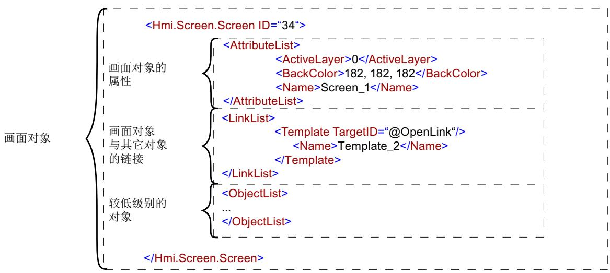
导入/导出的基本原理 (页 1391)

#### 6.3.1.2 导入/导出的数据结构

对象
基本结构对所有对象都相同。
XML 文件中的每个对象都从其类型开始，例如 "Hmi.Screen.Button" 和 ID。ID 将在导出过程中自动创建。
<Hmi.Screen.Button CompositionName="ScreenItems" ID="60">
除起始对象外，其它对象还包含“CompositionName”XML 属性。此属性的值是预设的。有时需要指定此属性，例如，为了更改按钮按下或释放时的标签。
6.3 导入/导出 HMI 设备的数据
```xml
<MultilingualText ID="A" CompositionName="TextOff">
    <ObjectList>
    <MultilingualTextItem ID="B" CompositionName="Items">
    <AttributeList>
    <Culture>en-US</Culture>
    <Text>
    <body>
    <p>TextOff</p>
    </body>
    </Text>
    </AttributeList>
    </MultilingualTextItem>
    </ObjectList>
</MultilingualText>
<MultilingualText ID="C" CompositionName="TextOn">
    <ObjectList>
    <MultilingualTextItem ID="D" CompositionName="Items">
    <AttributeList>
    <Culture>en-US</Culture>
    <Text>
    <body>
    <p>TextOn</p>
    </body>
    </Text>
    </AttributeList>
    </MultilingualTextItem>
    </ObjectList>
</MultilingualText>
```
每一个对象都包含 "AttributeList" 部分中包含的属性。每一个属性都被模型成一个 XML 元素，例如"BackColor"。属性的值被模型化为 XML 内容，例如“204, 204, 204”。
```asp
<Hmi.Screen.Button ID="2" CompositionName="ScreenItems">
    <AttributeList>
    <BackColor>204, 204, 204</BackColor>
    <ObjectName>Button_1</ObjectName>
    </AttributeList>
</Hmi.Screen.Button>
```
如果需要，为了引用对象，每个对象都包含一个"LinkList"部分。本部分包含到 XML 文件内部和外部的其它对象的链接。每一个链接都被模型成一个 XML 元素。通过模式文件中的目标对象来定义链接的名称。每个链接还包含“TargetID”属性。如果 XML 文件中包含目标对象，则“TargetID”属性的值为“#”加所引用对象的 ID。如果 XML 文件中不包含目标对象，“TargetID”属性的值则为“@OpenLink”。对该对象的实际引用被模型成从属 XML 元素。
6.3 导入/导出 HMI 设备的数据
<Hmi.Tag.Tag ID="17">
<AttributeList>
<Name>Tag 1</Name>
</AttributeList>
<LinkList>
<AcquisitionCycle TargetID="@OpenLink">
<Name>2 s</Name>
</AcquisitionCycle>
<Connection TargetID="@OpenLink">
<Name>HMI connection</Name>
</Connection>
</LinkList>
</Hmi.Tag.Tag>

##### 对象与 XML 结构之间的关系

下图显示了导出的 XML 结构与 WinCC 中关联对象之间的关系。
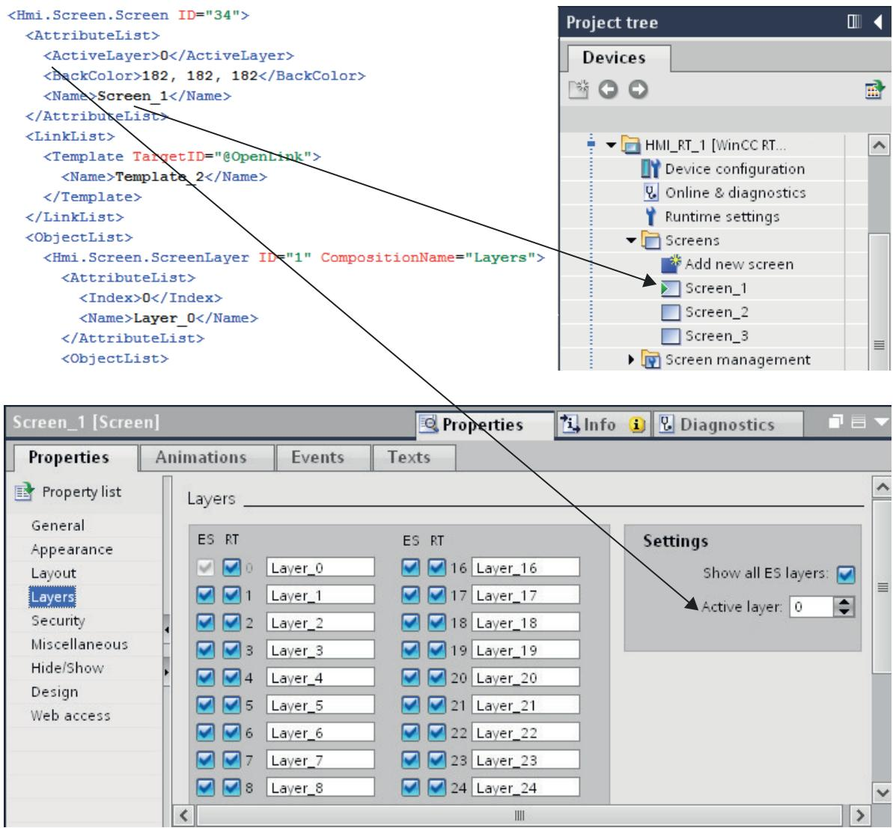  
图 6-1 WinCC 用户界面与 XML 结构之间的关系。
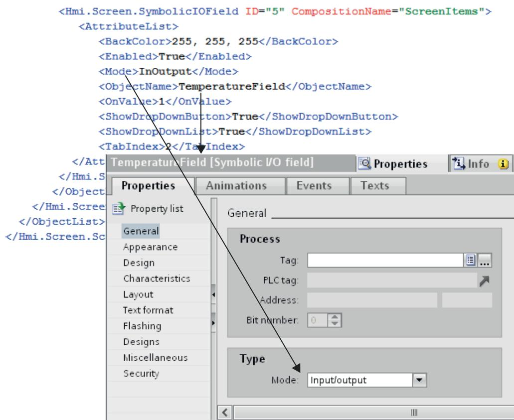  
图 6-2 WinCC 中的设置与 XML 结构之间的关系。

#### 6.3.1.3 周期


##### 导出周期

要求
• TIA Portal Openness 应用程序已连接到 TIA Portal。请[连接到 TIA Portal](#连接到-TIA-Portal)
• 已打开一个项目。
请[打开项目](#打开项目)
TIA Portal Openness API 接口支持将已知 HMI 设备的所有周期导出到 XML 文件中。如果生成相应的导出文件，则表明导出已完成。
修改以下程序代码以将 HMI 设备的周期导出至 XML 文件：
```cs
//Exports cycles from an HMI device
private static void ExportCyclesFromHMITarget(HmiTarget hmitarget)
{
    CycleComposition cycles = hmitarget.Cycles;
    foreach(Cycle cycle in cycles)
    {
    cycle.Export(new FileInfo(string.Format(@"C:\Samples\{0}.xml", cycle.Name)),
ExportOptions.WithDefaults);
    }
}
```

##### 导入周期

• TIA Portal Openness 应用程序已连接到 TIA Portal。请[连接到 TIA Portal](#连接到-TIA-Portal)
• 已打开一个项目。请[打开项目](#打开项目)
使用 ImportOptions.None 时，可以根据组合数 (Composition count) 确定实际已导入的周期数。您具有这些导入周期的访问权限。
无法在用户界面中编辑具有属性的标准周期。如果在导入文件中指定应更改这些属性，则导入时会导致 NonRecoverableException 并关闭 TIA Portal。
修改以下程序代码以将 XML 文件的一个或多个周期导入 HMI 设备：
```cs
//Imports cycles to an HMI device
private static void ImportCyclesToHMITarget(HmiTarget hmitarget)
{
    CycleComposition cycles = hmitarget.Cycles;
    string dirPathImport = @"C:\OpennessSamples\Import\n";
    string cycleImportFileName = "CycleImport.xml";
    string fullFilePath = Path.Combine(dirPathImport, cycleImportFileName);
    cycles.Import(new FileInfo(fullFilePath), ImportOptions.None);
}
```
导入组态数据 (页 1397)

### 6.3.2 变量表


#### 6.3.2.1 导出 HMI 变量表

• TIA Portal Openness 应用程序已连接到 TIA Portal。请[连接到 TIA Portal](#连接到-TIA-Portal)
• 已打开一个项目。请[打开项目](#打开项目)
为每个 HMI 变量表导出一个 XMI 文件。API 支持此导出过程。变量表的导出同样适用于子文件夹。
6.3 导入/导出 HMI 设备的数据

##### 程序代码：从指定文件夹导出所有 HMI 变量表

修改以下程序代码以导出特定文件夹的所有 HMI 变量表：
```cs
//Exports all tag tables from a tag folder
private static void ExportAllTagTablesFromTagFolder(HmiTarget hmitarget)
{
    TagSystemFolder folder = hmitarget.TagFolder;
    TagTableComposition tables = folder.TagTables;
    foreach (TagTable table in tables)
    {
    FileInfo info = new FileInfo(string.Format(@"C:\OpennessSamples\TagTables\{0}.xml", table.Name));
    table.Export(info, ExportOptions.WithDefaults);
    }
}
```

##### 程序代码：导出 HMI 变量表

修改以下程序代码以导出单个 HMI 变量表：
```cs
//Exports a tag table from an HMI device
private static void ExportTagTableFromHMITarget(HmiTarget hmitarget)
{
    string tableName = "Tag table XYZ";
    TagSystemFolder folder = hmitarget.TagFolder;
    TagTableComposition tables = folder.TagTables;
    TagTable table = tables.Find(tableName);
    if (table != null)
    {
    FileInfo info = new FileInfo(string.Format(@"C:\OpennessSamples\TagTables\{0}.xml", table.Name));
    table.Export(info, ExportOptions.WithDefaults);
    }
}
```

##### 程序代码：导出所有 HMI 变量表

修改以下程序代码以导出所有 HMI 变量表：
```cs
//Exports all tag tables from an HMI device
private static void ExportAllTagTablesFromHMITarget(HmiTarget hmitarget)
{
    TagSystemFolder sysFolder = hmitarget.TagFolder;
    //First export the tables in underlying user folder
    foreach (TagUserFolder userFolder in sysFolder.Folders)
    {
    ExportUserFolderDeep(userFolder);
    }
    //then, export all tables in the system folder
    ExportTablesInSystemFolder(sysFolder);
}
private static void ExportUserFolderDeep(TagUserFolder rootUserFolder)
{
    foreach (TagUserFolder userFolder in rootUserFolder.Folders)
    {
    ExportUserFolderDeep(userFolder);
    }
    ExportTablesInUserFolder(rootUserFolder);
}
private static void ExportTablesInUserFolder(TagUserFolder folderToExport)
{
    TagTableComposition tables = folderToExport.TagTables;
    foreach (TagTable table in tables)
    {
    string fullFilePath = string.Format(@"C:\OpennessSamples\TagTables\{0}.xml", table.Name);
    table.Export(new FileInfo(fullFilePath), ExportOptions.WithDefaults);
    }
}
private static void ExportTablesInSystemFolder(TagSystemFolder folderToExport)
{
    TagTableComposition tables = folderToExport.TagTables;
    foreach (TagTable table in tables)
    {
    string fullFilePath = string.Format(@"C:\OpennessSamples\TagTables\{0}.xml", table.Name);
    table.Export(new FileInfo(fullFilePath), ExportOptions.WithDefaults);
    }
}
```
6.3 导入/导出 HMI 设备的数据

#### 6.3.2.2 导入 HMI 变量表

要求
• TIA Portal Openness 应用程序已连接到 TIA Portal。请[连接到 TIA Portal](#连接到-TIA-Portal)
• 已打开一个项目。
请[打开项目](#打开项目)
修改以下程序代码以将 XML 文件的 HMI 变量表导入至用户自定义文件夹或系统文件夹：
```txt
//Imports a single HMI tag table from a XML file
private static void ImportSingleHMITagTable(HmiTarget hmitarget)
{
    TagSystemFolder folder = hmitarget.TagFolder;
    TagTableComposition tables = folder.TagTables;
    FileInfo info = new FileInfo(@"D:\Samples\Import\myExportedTagTable.xml");
    tables.Import(info, ImportOptions.Override);
}
```

##### 变量导入不正确

如果在变量或被引用变量的名称中使用以下符号，则变量的导入会出错：
• .（句点）
• \ （反斜杠）
补救措施 1：
导出之前，请检查以确保要导出的变量或被引用变量的名称不包含句点或反斜杠。
补救措施 2：
在导出文件中，用引号将变量或被引用变量的名称排除在外。
示例
• 带符号的变量名称： <name>Siemens.Simatic.Hmi.Utah.Tag.HmiTag:41000\_Options\_Time\_Date\DB\_SFX0 908\_HMI1.Actual\_Date\_Time.Hour</name>
• 用引号排除的带符号变量名称： <name>"Siemens.Simatic.Hmi.Utah.Tag.HmiTag:41000\_Options\_Time\_Date\DB\_SFX 0908\_HMI1.Actual\_Date\_Time.Hour"</name>

#### 6.3.2.3 从 HMI 变量表导出单个变量

要求
• TIA Portal Openness 应用程序已连接到 TIA Portal。请[连接到 TIA Portal](#连接到-TIA-Portal)
• 已打开一个项目。
请[打开项目](#打开项目)
以下对象模型的对象类型可作为 HMI 变量的子级项存在，并在导出过程中被考虑：
<table><tr><td>MultilingualText</td><td>注释、变量值、显示名称</td></tr><tr><td>TagArrayMemberTag</td><td>HMI 数组元素</td></tr><tr><td>TagStructureMember</td><td>HMI 结构元素</td></tr><tr><td>Event</td><td>已组态事件</td></tr><tr><td>MultiplexEntry</td><td>已组态的变量多路复用条目</td></tr></table>
修改以下程序代码以将 HMI 变量表中的单个变量导出至 XML 文件：
```cs
//Exports a selected tag from a tag table
private static void ExportSelectedTagFromTagTable(HmiTarget hmitarget)
{
    TagSystemFolder tagFolder = hmitarget.TagFolder;
    TagTable mytable = tagFolder.TagTables.Find("MyTagTable");
    TagComposition containingTags = mytable.Tags;
    Tag myTag = containingTags.Find("MyTag");
    if (myTag != null)
    {
    FileInfo info = new FileInfo(string.Format(@"C:\OpennessSamples\Tags\{0}.xml", myTag.Name));
    myTag.Export(info, ExportOptions.WithDefaults);
    }
}
```

#### 6.3.2.4 从 HMI 变量表导入单个变量

• TIA Portal Openness 应用程序已连接到 TIA Portal。请[连接到 TIA Portal](#连接到-TIA-Portal)
• 已打开一个项目。
请[打开项目](#打开项目)
应用
以下对象模型的对象类型可作为 HMI 变量的子级项存在，并在导入过程中被考虑：
<table><tr><td>MultilingualText</td><td>注释、变量值、显示名称</td></tr><tr><td>TagArrayMemberTag</td><td>HMI 数组元素</td></tr><tr><td>TagStructureMember</td><td>HMI 结构元素</td></tr><tr><td>Event</td><td>已组态事件</td></tr><tr><td>MultiplexEntry</td><td>已组态的变量多路复用条目</td></tr></table>
修改以下程序代码以将 XML 文件的 HMI 变量导入至 HMI 变量表：
```cs
//Imports a tag into a tag table
private static void ImportTagIntoTagTable(HmiTarget hmitarget)
{
    TagSystemFolder tagFolder = hmitarget.TagFolder;
    TagTable myTable = tagFolder.DefaultTagTable;
    TagComposition tagComposition = myTable.Tags;
    FileInfo info = new FileInfo(@"D:\Samples\Import\myExportedTag.xml");
    tagComposition.Import(info, ImportOptions.Override);
}
```

#### 6.3.2.5 导入/导出 HMI 变量时的特殊考虑事项

特殊注意事项适用于以下 HMI 变量的导出和导入：
• 具有集成连接的外部 HMI 变量
• 具有“UDT”数据类型的 HMI 变量
类似的程序代码
上述 HMI 变量的程序代码与以下程序代码几乎完全相同：
• 程序代码：导出 HMI 变量 (页 1417)
• 程序代码：导入 HMI 变量 (页 1418)
• TIA Portal Openness 应用程序已连接到 TIA Portal。
[连接到 TIA Portal](#连接到-TIA-Portal)”
• 已打开一个项目。
请[打开项目](#打开项目)

##### 导出/导入具有集成连接的外部 HMI 变量时的特殊考虑事项

导出具有集成 HMI 连接的外部 HMI 变量时，导出文件中只保存 HMI 变量到 PLC 的链接，而不是 PLC 变量数据。
导入前，必须确保项目中存在 PLC、相应的 PLC 变量和到相应 PLC 的集成连接。否则，必须在导入前创建这些项。在外部 HMI 变量的后续导入过程中，到 PLC 变量的链接将被再次激活。
在项目的所有变量表中，外部 HMI 变量的名称必须是唯一的。如果在导入过程中没有为 HMI变量指定合适的变量表，将取消导入。
使用以下 XML 结构可导入具有集成连接的外部 HMI 变量：
```xml
<Hmi.Tag.Tag ID="1" CompositionName="Tags">
    <AttributeList>
    <Name>MyIntegratedHmiTag_1</Name>
    </AttributeList>
    <LinkList>
    <AcquisitionCycle TargetID="@OpenLink">
    <Name>1 s</Name>
    </AcquisitionCycle>
    <Connection TargetID="@OpenLink">
    <Name>HMI_Connection_MP277_300400</Name>
    </Connection>
    <ControllerTag TargetID="@OpenLink">
    <Name>Datablock_1.DBElement1</Name>
    </ControllerTag>
    </LinkList>
</Hmi.Tag.Tag>
```
精智/高级设备不支持在“结构变量元素”(Elements of structure tags) 的上限和下限属性中分配结构变量。这些结构变量可分配给“简单”变量的限值属性，但不支持分配给结果变量元素的限值属性。

##### 导出/导入“UDT”数据类型的 HMI 变量时的特殊考虑事项

导出“UDT”数据类型的 HMI 变量时，链接会导出到数据类型中。为便于导出，仅支持版本化的数据类型。
这些数据类型必须保存在项目库中。不支持全局库中的数据类型。
以下规则适用于导入：
• 引用的数据类型必须包含在项目库中。如果项目库中不包含该数据类型，导入将被终止。
• 引用的数据类型必须为版本化形式。自 TIA Portal V13 SP1 起支持版本化。如果数据类型未版本化，将发生异常。
说明
导入过程中，为解决引用问题，将使用找到的第一个数据类型。在此，可执行以下操作：首先，搜索项目库的根目录，然后搜索子文件夹。
使用以下 XML 结构可导入“UDT”数据类型的 HMI 变量：
```txt
<Hmi.Tag.Tag ID="1" CompositionName="Tags">
    ...
    <LinkedList>
    <DataType TargetID="@OpenLink">
    <Name>HmiUdt_1 V 1.0.0</Name> <- Must exist in the project library
    </DataType>
    ...
    </LinkedList>
    ...
</Hmi.Tag.Tag>
```

### 6.3.3 VB 脚本


#### 6.3.3.1 导出 VB 脚本

要求
• TIA Portal Openness 应用程序已连接到 TIA Portal。请[连接到 TIA Portal](#连接到-TIA-Portal)
• 已打开一个项目。
请[打开项目](#打开项目)
应用
将考虑导出所有子级别用户定义文件夹。将为每一个已导出的 VB 脚本创建一个单独的 XML文件。
程序代码：导出 VB 脚本
修改以下程序代码以将 HMI 设备的所选 VB 脚本导出至 XML 文件：
```txt
//Exports a single vbscript of an HMI device
private static void ExportSingleVBScriptOfHMITarget(HmiTarget hmitarget)
{
    VBScriptSystemFolder vbScriptFolder = hmitarget.VBScriptFolder;
    VBScriptComposition vbScripts = vbScriptFolder.VBScripts;
    VBScript vbScript = vbScripts.Find("MyVBScript");
    FileInfo info = new
FileInfo(string.Format(@"C:\OpennessSamples\Export\Scripts\{0}.xml", vbScript.Name));
    vbScript.Export(info, ExportOptions.None);
}
```

#### 6.3.3.2 从文件夹导出 VB 脚本

要求
• TIA Portal Openness 应用程序已连接到 TIA Portal。请[连接到 TIA Portal](#连接到-TIA-Portal)
• 已打开一个项目。
请[打开项目](#打开项目)
应用
将为每一个已导出的 VB 脚本创建一个单独的 XML 文件。

##### 程序代码：从用户定义文件夹中导出 VB 脚本

修改以下程序代码以将用户自定义文件夹的 VB 脚本导出至 XML 文件：
```cs
//Exports vbscripts of a selected vbscript system folder
private static void ExportVBScriptOfSelectedVBScriptSystemFolder(HmiTarget hmitarget)
{
    VBScriptSystemFolder vbScriptFolder = hmitarget.VBScriptFolder;
    VBScriptUserFolderComposition vbUserFolders = vbScriptFolder.Folders;
    VBScriptUserFolder vbUserFolder = vbUserFolders.Find("MyVBUserFolder");
    VBScriptComposition vbScripts = vbUserFolder.VBScripts;
    foreach (VBScript script in vbScripts)
    {
    FileInfo info = new
    FileInfo(String.Format(@"C:\OpennessSamples\Export\Scripts\{0}.xml", script.Name));
    script.Export(info, ExportOptions.None);
    }
}
```

##### 程序代码：导出系统文件夹中的所有 VB 脚本

修改以下程序代码以导出系统文件夹中的所有 VB 脚本：
```cs
//Exports all vbscripts by using a foreach loop
private static void ExportAllVBScripts(HmiTarget hmitarget)
{
    VBScriptSystemFolder vbScriptFolder = hmitarget.VBScriptFolder;
    VBScriptComposition vbScripts = vbScriptFolder.VBScripts;
    if (vbScripts == null) return;
    foreach (VBScript script in vbScripts)
    {
    FileInfo info = new
    FileInfo(string.Format(@"C:\OpennessSamples\Export\Scripts\{0}.xml", script.Name));
    script.Export(info, ExportOptions.None);
    }
}
```

#### 6.3.3.3 导入 VB 脚本

• TIA Portal Openness 应用程序已连接到 TIA Portal。
[连接到 TIA Portal](#连接到-TIA-Portal)”
• 项目已经打开。
[打开项目](#打开项目)”
支持批量导入。也可使用具有 Foreach 循环的程序代码 (导出 VB 脚本 (页 1421))。
```cs
using System;
using Siemens.Engineering;
using Siemens.Engineering.HW;
using Siemens.Engineering.HW.Features;
using Siemens.Engineering.SW;
using Siemens.Engineering.SW.Blocks;
using Siemens.Engineering.SW.ExternalSources;
using Siemens.Engineering.SW.Tags;
using Siemens.Engineering.SW.Types;
using Siemens.Engineering.Hmi;
using HmiTarget = Siemens.Engineering.Hmi.HmiTarget;
using Siemens.Engineering.Hmi.Tag;
using Siemens.Engineering.Hmi.Screen;
using Siemens.Engineering.Hmi.Cycle;
using Siemens.Engineering.Hmi.Communication;
using Siemens.Engineering.Hmi.Globalization;
using Siemens.Engineering.Hmi.TextGraphicList;
using Siemens.Engineering.Hmi.RuntimeScripting;
using System.Collections.Generic;
using Siemens.Engineering Bonpiler;
using Siemens.Engineering.Library;
using System.IO;
using System.Security;
namespace ImportVBScripts
{
    internal class Program
    {
    private static void Main(string[] args)
    {
    ...
    }
    private static void ImportSingleVBScriptToHMITarget(HmiTarget hmitarget)
    {
    VBScriptSystemFolder vbScriptFolder = hmitarget.VBScriptFolder;
    VBScriptComposition vbScripts = vbScriptFolder.VBScripts;
    if (vbScripts == null) return;
    {
    FileInfo info = new FileInfo(@"D:\Samples\Import\VBScript.xml");
    vbScripts.Import(info, ImportOptions.None);
    }
}
```
修改以下程序代码以将 XML 文件的 VB 脚本导入至 HMI 设备：
6.3 导入/导出 HMI 设备的数据

### 6.3.4 文本列表


#### 6.3.4.1 从 HMI 设备导出文本列表

要求
• TIA Portal Openness 应用程序已连接到 TIA Portal。 [连接到 TIA Portal](#连接到-TIA-Portal)”
• 项目已经打开。
[打开项目](#打开项目)”
简介
导出的文本列表和图形列表包括其所有条目。可以分别导出文本列表和图形列表。
将导出 HMI 设备的文本列表。将为每一个导出的文本列表创建一个单独的 XML 文件。
修改以下程序代码以导出 HMI 设备的文本列表：
```cs
using System;
using Siemens.Engineering;
using Siemens.Engineering.HW;
using Siemens.Engineering.HW.Features;
using Siemens.Engineering.SW;
using Siemens.Engineering.SW.Blocks;
using Siemens.Engineering.SW.ExternalSources;
using Siemens.Engineering.SW.Tags;
using Siemens.Engineering.SW.Types;
using Siemens.Engineering.Hmi;
using HmiTarget = Siemens.Engineering.Hmi.HmiTarget;
using Siemens.Engineering.Hmi.Tag;
using Siemens.Engineering.Hmi.Screen;
using Siemens.Engineering.Hmi.Cycle;
using Siemens.Engineering.Hmi.Communication;
using Siemens.Engineering.Hmi.Globalization;
using Siemens.Engineering.Hmi.TextGraphicList;
using Siemens.Engineering.Hmi.RuntimeScripting;
using System.Collections.Generic;
using Siemens.Engineering Bonpiler;
using Siemens.Engineering.Library;
using System.IO;
using System.Security;
```
```cs
namespace ExportTextListsFromHMIDevice
{
    internal class Program
    {
    private static void Main(string[] args)
    {
    ...
    }
    //Export TextLists
    private static void ExportTextLists(HmiTarget hmitarget)
    {
    TextListComposition text = hmitarget.TextLists;
    foreach (TextList textList in text)
    {
    FileInfo info = new FileInfo(string.Format(@"D:\Samples\Export\{0}.xml", textList.Name));
    textList.Export(info, ExportOptions.WithDefaults);
    }
    }
    }
}
```
6.3 导入/导出 HMI 设备的数据

#### 6.3.4.2 将文本列表导入到 HMI 设备

要求
• TIA Portal Openness 应用程序已连接到 TIA Portal。请[连接到 TIA Portal](#连接到-TIA-Portal)
• 已打开一个项目。
请[打开项目](#打开项目)
应用
API 接口支持将文本列表从 XML 文件导入到 HMI 设备。
程序代码
修改以下程序代码以将 XML 文件的文本列表导入至 HMI 设备：
```txt
//Imports a single TextList
private static void ImportSingleTextList(HmiTarget hmitarget)
{
    TextListComposition textListComposition = hmitarget.TextLists;
    IList<TextList> importedTextLists = textListComposition.Import(new FileInfo(@"D:\SamplesImport\myTextList.xml"), ImportOptions.Override);
}
```

#### 6.3.4.3 用于文本列表导出/导入的高级 XML 格式

要求
• TIA Portal Openness 应用程序已连接到 TIA Portal。 [连接到 TIA Portal](#连接到-TIA-Portal)”
• 已打开一个项目。
[打开项目](#打开项目)”
• 标准导出文本列表
请[从 HMI 设备导出文本列表](#从-HMI-设备导出文本列表)”
• 标准导入文本列表
请[将文本列表导入到 HMI 设备](#将文本列表导入到-HMI-设备)”
文本列表也可包含格式化文本。这主要涉及以下格式：
• 文本格式化
• 在文本内引用其它对象
如果待导出的文本列表为纯文本格式，则将生成一个高级的 XML 导出格式。其中，对象引用将表示为 Open Links。这同样适用于将要使用格式化文本导入的文本列表。
高级 XML 导出格式也会变得更加复杂。例如，不仅链接了文本列表中的对象名称，还可能通过 Open Link 链接到另一设备的 PLC 变量。此时，要删除 Open Link，必须将所有信息编写到一个字符串中。
```xml
<?xml version="1.0" encoding="utf-8"?>
<Document>
<!-- ... -->
<MultilingualText ID="5" CompositionName="Text">
    <ObjectList>
    <MultilingualTextItem ID="6" CompositionName="Items">
    <AttributeList>
    <Culture>en-US</Culture>
    <Text>
    <body>
    <p>
    <field ref="0" />
    </p>
    </body>
    <fieldinfos>
    <fieldinfo name="0" domaintype="HMICommonTextList">
    <reference TargetID="@OpenLink">
    <name>Siemens.Simatic.Hmi.Utah.TextAndGraphicLists.HmiTextList:Empty Text_list_
    </reference>
    <subreference TargetID="@OpenLink">
    <name>Siemens.Simatic.Hmi.Utah.Tag.HmiTag:t1</name>
    </subreference>
    <domaindata>
    <format length="9" />
    </domaindata>
    </fieldinfo>
    </fieldinfos>
    </Text>
    </AttributeList>
</MultilingualTextItem>
<MultilingualTextItem ID="7" CompositionName="Items">
    <AttributeList>
    <Culture>de-CH</Culture>
    <Text>
    <body>
    <p>
    <field ref="0" />
    </p>
    </body>
    <fieldinfos>
    <fieldinfo name="0" domaintype="HMICommonTextList">
    <reference TargetID="@OpenLink">
    <name>Siemens.Simatic.Hmi.Utah.TextAndGraphicLists.HmiTextList:Empty Text_list_
    </reference>
    <subreference Targetid="@OpenLink">
    <name>Siemens.Simatic.Hmi.Utah.Tag.HmiTag:t1</name>
    </subreference>
    <domaindata>
    <format length="9" />
    </domaindata>
    </fieldinfo>
    </fieldinfos>
</Text>
</AttributeList>
</MultilingualTextItem>
</ObjectList>
</MultilingualText>
```

### 6.3.5 图形列表


#### 6.3.5.1 导出图形列表

• TIA Portal Openness 应用程序已连接到 TIA Portal。请[连接到 TIA Portal](#连接到-TIA-Portal)
• 已打开一个项目。请[打开项目](#打开项目)
导出的文本列表和图形列表包括其所有条目。可以分别导出文本列表和图形列表。
为每个图形列表创建一个 XML 文件。图形列表包含中的全局图形对象将被作为 Open Links导出。
修改以下程序代码以导出 HMI 设备的图形列表：
```cs
//Exports GraphicLists
private static void ExportGraphicLists(HmiTarget hmitarget)
{
    GraphicListComposition graphic = hmitarget.GraphicsLists;
    foreach (GraphicList graphicList in graphic)
    {
    FileInfo info = new FileInfo(string.Format(@"D:\Samples\Export\{0}.xml",graphicList.Name));
    graphicList.Export(info, ExportOptions.WithDefaults);
    }
}
```
6.3 导入/导出 HMI 设备的数据

#### 6.3.5.2 导入图形列表

要求
• TIA Portal Openness 应用程序已连接到 TIA Portal。请[连接到 TIA Portal](#连接到-TIA-Portal)
• 已打开一个项目。
请[打开项目](#打开项目)
应用
API 接口支持将图形列表从 XML 文件导入到 HMI 设备。
导入中包含图形列表的所有引用图形对象。不包含对全局图形的引用。如果目标项目中存在引用的全局图形，则在导入期间将恢复全局图形的引用。
程序代码
修改以下程序代码以将 XML 文件的图形列表导入至 HMI 设备：
```txt
//Imports a single GraphicList
private static void ImportSingleGraphicList(HmiTarget hmitarget)
{
    GraphicListComposition graphicListComposition = hmitarget.GraphicsLists;
    IList<GraphicList> importedGraphicLists = graphicListComposition.Import(new FileInfo(@"D:\Samples\Import\myGraphicList.xml"), ImportOptions.Override);
}
```

### 6.3.6 连接


#### 6.3.6.1 导出连接

要求
• TIA Portal Openness 应用程序已连接到 TIA Portal。请[连接到 TIA Portal](#连接到-TIA-Portal)
• 已打开一个项目。请[打开项目](#打开项目)
API 接口支持将 HMI 设备的所有连接导出到 XML 文件。
不支持导出集成连接。
将为每个已导出的连接创建一个单独的 XML 文件。
修改以下程序代码以将 HMI 设备的所有连接导出至 XML 文件：
```cs
//Exports communication connections from an HMI device
private static void ExportConnectionsFromHMITarget(HmiTarget hmitarget)
{
    ConnectionComposition connections = hmitarget.Connections;
    foreach(Connection connection in connections)
    {
    FileInfo info = new FileInfo(string.Format(@"D:\Samples\Export\{0}.xml", connection.Name));
    connexion.Export(info, ExportOptions.WithDefaults);
    }
}
```

#### 6.3.6.2 导入连接

要求
• TIA Portal Openness 应用程序已连接到 TIA Portal。请[连接到 TIA Portal](#连接到-TIA-Portal)
• 已打开一个项目。请[打开项目](#打开项目)
应用
API 接口支持将 HMI 设备的所有连接从 XML 文件导入到 HMI 设备。如果要导入多个通信连接，则需为各个通信连接导入相应的 XML 文件。
说明
如果导入连接的项目中已组态一个集成连接，则不会覆盖此连接。此时将取消导入并引发Exception。
修改以下程序代码以将 XML 文件中 HMI 设备的单个连接导入至 HMI 设备：
```txt
//Imports Communication connections to an HMI device
private static void ImportConnectionsToHMITarget(HmiTarget hmitarget)
{
    ConnectionComposition connections = hmitarget.Connections;
    IList<Connection> importedConnectionLists = connections.Import(new FileInfo(@"D:\Samples\Import\myConnectionImport.xml"), ImportOptions.Override);
}
```

### 6.3.7 画面


#### 6.3.7.1 可导出画面对象的概述

应用
可使用 TIA Portal Openness API 导出或导入以下画面：
表格 6-4 支持的画面
<table><tr><td>对象</td><td>是否可导出/导入</td></tr><tr><td>画面</td><td>是</td></tr><tr><td>全局画面</td><td>是</td></tr><tr><td>画面模板</td><td>是</td></tr><tr><td>永久性区域</td><td>是</td></tr></table>
6.3 导入/导出 HMI 设备的数据
<table><tr><td>对象</td><td>是否可导出/导入</td></tr><tr><td>弹出画面</td><td>是</td></tr><tr><td>滑入画面</td><td>是</td></tr></table>
可使用 TIA Portal Openness API 导出或导入以下画面对象：
表格 6-5 支持的画面对像
<table><tr><td>范围</td><td>对象类型</td><td>是否可导出/导入</td></tr><tr><td rowspan="17">基本对象</td><td>直线</td><td>是</td></tr><tr><td>折线</td><td>是</td></tr><tr><td>多边形</td><td>是</td></tr><tr><td>椭圆</td><td>是</td></tr><tr><td>部分椭圆</td><td>-</td></tr><tr><td>扇形</td><td>-</td></tr><tr><td>椭圆弧</td><td>-</td></tr><tr><td>圆弧</td><td>-</td></tr><tr><td>圆</td><td>是</td></tr><tr><td>矩形</td><td>是</td></tr><tr><td>连接器</td><td>-</td></tr><tr><td>文本域</td><td>是</td></tr><tr><td>图形视图</td><td>是</td></tr><tr><td>管道</td><td>-</td></tr><tr><td>双T形管</td><td>-</td></tr><tr><td>T形管</td><td>-</td></tr><tr><td>弯管</td><td>-</td></tr></table>
<table><tr><td>范围</td><td>对象类型</td><td>是否可导出/导入</td></tr><tr><td rowspan="23">元素</td><td>I/O 域</td><td>是</td></tr><tr><td>图形 I/O 域</td><td>是</td></tr><tr><td>可编辑的文本域</td><td>-</td></tr><tr><td>列表框</td><td>-</td></tr><tr><td>组合框</td><td>-</td></tr><tr><td>按钮</td><td>是</td></tr><tr><td>圆形按钮</td><td>-</td></tr><tr><td>指示灯按钮</td><td>是</td></tr><tr><td>开关</td><td>是</td></tr><tr><td>符号 I/O 域</td><td>是</td></tr><tr><td>日期/时间域</td><td>是</td></tr><tr><td>棒图</td><td>是</td></tr><tr><td>符号库</td><td>是</td></tr><tr><td>滑块</td><td>是</td></tr><tr><td>滚动条</td><td>-</td></tr><tr><td>复选框</td><td>-</td></tr><tr><td>选项按钮</td><td>-</td></tr><tr><td>量表</td><td>是</td></tr><tr><td>时钟</td><td>是</td></tr><tr><td>存储空间视图</td><td>-</td></tr><tr><td>功能键(软键)</td><td>是</td></tr><tr><td>组</td><td>是</td></tr><tr><td>面板实例</td><td>是</td></tr></table>
<table><tr><td>范围</td><td>对象类型</td><td>是否可导出/导入</td></tr><tr><td rowspan="31">控件</td><td>画面窗口</td><td>-</td></tr><tr><td>用户视图</td><td>是</td></tr><tr><td>打印作业/脚本诊断</td><td>-</td></tr><tr><td>摄像机视图</td><td>-</td></tr><tr><td>PDF 视图</td><td>-</td></tr><tr><td>配方视图</td><td>-</td></tr><tr><td>报警视图</td><td>-</td></tr><tr><td>报警指示器</td><td>-</td></tr><tr><td>报警窗口</td><td>-</td></tr><tr><td>f(x)趋势视图</td><td>-</td></tr><tr><td>f(t)趋势视图</td><td>-</td></tr><tr><td>表格视图</td><td>-</td></tr><tr><td>数值表</td><td>-</td></tr><tr><td>HTML 浏览器</td><td>-</td></tr><tr><td>媒体播放器</td><td>-</td></tr><tr><td>通道诊断</td><td>-</td></tr><tr><td>WLAN 接收</td><td>-</td></tr><tr><td>区域名称</td><td>-</td></tr><tr><td>区域信号</td><td>-</td></tr><tr><td>有效范围名称</td><td>-</td></tr><tr><td>有效范围名称 (RFID)</td><td>-</td></tr><tr><td>有效范围信号</td><td>-</td></tr><tr><td>充电状况</td><td>-</td></tr><tr><td>手轮</td><td>-</td></tr><tr><td>帮助指示器</td><td>-</td></tr><tr><td>Sm@rtClient 视图</td><td>-</td></tr><tr><td>状态/强制</td><td>-</td></tr><tr><td>存储空间视图</td><td>-</td></tr><tr><td>NC 子程序显示</td><td>-</td></tr><tr><td>系统诊断视图</td><td>-</td></tr><tr><td>系统诊断窗口</td><td>-</td></tr></table>
6.3 导入/导出 HMI 设备的数据
[导入/导出的基本原理](#导入导出的基本原理)

#### 6.3.7.2 导出 HMI 设备的所有画面

要求
• TIA Portal Openness 应用程序已连接到 TIA Portal。
[连接到 TIA Portal](#连接到-TIA-Portal)”
• 项目已经打开。
[打开项目](#打开项目)”
简介
导出 HMI 设备的所有用户定义画面文件夹的所有汇聚画面时，需要不同的程序代码。
6.3 导入/导出 HMI 设备的数据
程序代码：导出设备的所有画面
修改以下程序代码以导出 HMI 设备的用户自定义画面文件夹和画面系统文件夹的所有画面：
```cs
using System;
using Siemens.Engineering;
using Siemens.Engineering.HW;
using Siemens.Engineering.HW.Features;
using Siemens.Engineering.SW;
using Siemens.Engineering.SW.Blocks;
using Siemens.Engineering.SW.ExternalSources;
using Siemens.Engineering.SW.Tags;
using Siemens.Engineering.SW.Types;
using Siemens.Engineering.Hmi;
using HmiTarget = Siemens.Engineering.Hmi.HmiTarget;
using Siemens.Engineering.Hmi.Tag;
using Siemens.Engineering.Hmi.Screen;
using Siemens.Engineering.Hmi.Cycle;
using Siemens.Engineering.Hmi.Communication;
using Siemens.Engineering.Hmi.Globalization;
using Siemens.Engineering.Hmi.TextGraphicList;
using Siemens.Engineering.Hmi.RuntimeScripting;
using System.Collections.Generic;
using Siemens.Engineering Bonpiler;
using Siemens.Engineering.Library;
using System.IO;
using System.Security;
namespace ExportAllScreensOfHMIDevice
{
    internal class Program
    {
    private static void Main(string[] args)
    {
    ...
    }
    private static void ExportAllScreensOfDevice(string rootPath, HmiTarget hmiTarget)
    {
    DirectoryInfo info = new DirectoryInfo(rootPath);
    info.Create();
    // Export the ScreenFolder recursive
    string screenPath = Path.Combine(rootPath, "Screens");
    info = new DirectoryInfo(screenPath);
    info.Create();
    ExportScreens(screenPath, hmiTarget);
    }
    // Export the screens of a user-defined screen folder of an HMI device and the screen system
    folder
    private static void ExportScreensOfDevice(HmiTarget hmiTarget)
    {
```
```txt
ScreenUserFolder folder = hmiTarget.ScreenFolder.Folders.Find("MyScreenFolder");
//or ScreenSystemFolder folder = hmiTarget.ScreenFolder;
ScreenComposition screens = folder.Screens;
foreach(Screen screen in screens)
{
FileInfo info = new FileInfo(string.Format(@"D:\Samples\Screens\{0}\{1}.xml", folder.Name, screen.Name));
screen.Export(info, ExportOptions.WithDefaults);
}
// Exporting all screens of a device independent of the user
public static void ExportScreens(string screenshot, HmiTarget target)
{
foreach(Screen screen in target.ScreenFolder.Screens)
{
screen.Export(new FileInfo(Path.Combine(screenPath, screen.Name + ".xml"));
ExportOptions.WithDefaults);
}
foreach(ScreenUserFolder subfolder in target.ScreenFolder.Folders)
{
ExportScreenUserFolder(Path.Combine(screenPath, folder.Name), subfolder.Name);
}
private static void ExportScreenUserFolder(string screenshot,ScreenUserFolder folder)
{
foreach(Screen screen in folder.Screens)
{
screen.Export(new FileInfo(Path.Combine(screenPath, screen.Name + ".xml"));
ExportOptions.WithDefaults);
}
foreach(ScreenUserFolder subfolder in folder.Folders)
{
ExportScreenUserFolder(Path.Combine(screenPath, subfolder.Name), subfolder);
}
```

#### 6.3.7.3 从画面文件夹导出画面

要求
• TIA Portal Openness 应用程序已连接到 TIA Portal。请[连接到 TIA Portal](#连接到-TIA-Portal)
• 已打开一个项目。请[打开项目](#打开项目)
导出以下画面数据：
<table><tr><td>画面</td><td>数据</td></tr><tr><td>属性</td><td>ActiveLayer, BackColor, Height, Width, Name, Number, HelpText</td></tr><tr><td>打开的链接</td><td>Template</td></tr><tr><td>组合</td><td>LayersAnimations导出基于Runtime Advanced的所有已组态的动画。Events导出基于Runtime Advanced的所有已组态的事件。Softkeys导出所有已组态的软键。</td></tr></table>
为每个图层导出以下数据：
默认情况下，TIA Portal 中的层名称为空文本。
如果未更改 TIA Portal 中的层名称，则导出的层名称将为空文本。在这种情况下，TIA Portal中显示的层名称取决于用户界面语言。
如果更改 TIA Portal 中的层名称，修改后的层名称将以所有相关语言显示。
<table><tr><td>图层</td><td>数据</td></tr><tr><td>属性</td><td>Name, Index, VisibleES</td></tr><tr><td>组合</td><td>ScreenItems(包括画面项)</td></tr></table>
导出中不包括：
• SCADA 特定属性。
• 不包含任何画面项和属性与默认值相同的图层。
修改以下程序代码以导出 HMI 设备用户文件夹或系统文件夹中的单个画面：
```cs
//Exports a single screen from a screen folder
private static void ExportSingleScreenFromScreenFolder(HmiTarget hmitarget)
{
    ScreenUserFolder folder = hmitarget.ScreenFolder.Folders.Find("MyScreenFolder");
    //or ScreenSystemFolder folder = hmitarget.ScreenFolder;
    ScreenComposition screens = folder.Screens;
    Screen screen = screens.Find("Screen_1.xml");
    if (screen == null) return;
    {
    FileInfo info = new FileInfo(string.Format(@"D:\Samples\Screens\{0}\{1}.xml", folder.Name, screen.Name));
    screen.Export(info, ExportOptions.WithDefaults);
    }
}
```

#### 6.3.7.4 向 HMI 设备导入画面

• TIA Portal Openness 应用程序已连接到 TIA Portal。请[连接到 TIA Portal](#连接到-TIA-Portal)
• 已打开一个项目。请[打开项目](#打开项目)
只能将画面导入到特定类型的 HMI 设备。该 HMI 设备与导出画面的设备必须具有相同的设备类型。
导入以下画面数据：
<table><tr><td>画面</td><td>数据</td></tr><tr><td>属性</td><td>ActiveLayer, BackColor, Height, Width, Name, Number, HelpText</td></tr><tr><td>打开的链接</td><td>Templates</td></tr><tr><td>组合</td><td>LayersAnimations导入所有可组态画面动画。Events导入所有可组态画面事件。Softkeys导入所有可组态画面软键。</td></tr></table>
为每个图层导入以下数据：
如果在导入前为层名称指定了空文本，则在导入后，TIA Portal 中显示的层名称将取决于用户界面语言。
如果分配了层名称，则在导入后，指定的层名称将以所有相关语言显示。
<table><tr><td>图层</td><td>数据</td></tr><tr><td>属性</td><td>Name, Index</td></tr><tr><td>组合</td><td>ScreenItems</td></tr></table>
• 如果画面的宽度和高度与设备尺寸不一致，则取消导入并引发 Exception。不支持调整所含的画面项。因此，某些画面项可能会超出画面边界。这种情况下，将输出编译器警告。
• 设备的所有画面的画面编号必须唯一。如果发现某一画面的画面编号已在设备中创建，则会取消画面导入。如果尚未分配画面编号，则会在导入期间为画面分配一个唯一编号。
• 画面中，各个层的 Z 顺序画面项的布局必须唯一且连续。因此，导入画面后，如果有必要，则会执行一致性检查从而修复布局。此操作可能产生某些画面项的已修改的“选项卡索引”。
可以在 XML 文件中手动更改画面项的 Z 顺序。第一个画面项排在 Z 顺序中的最后。
如果画面项的属性“根据内容调整大小”(Fit size to content) 已启用，则可在 XML 文件中更改画面项的宽度值和高度值。

##### 不支持从库中导入画面类型

自 WinCC V12 SP1 起，可在库中创建相应类型的画面。项目中所使用的画面类型实例可以通过 TIA Portal Openness 应用程序进行编辑，其编辑方式与其它画面一样。导出画面时，导出的画面类型实例不含类型信息。将这些画面重新导入项目中时，会覆盖画面类型的实例且该实例会与相应画面类型分离。

##### 程序代码：向 HMI 设备导入画面

修改以下程序代码以使用 For each 循环将画面导入至 HMI 设备：
```cs
//Imports all screens to an HMI device
private static void ImportScreensToHMITarget(HmiTarget hmitarget)
{
    FileInfo[] exportedScreens = new FileInfo[] {new
FileInfo(@"D:\Samples\Import\Screen_1.xml"), new
FileInfo(@"D:\Samples\Import\Screen_2.xml")};
    ScreenUserFolder folder = hmitarget.ScreenFolder.Folders.Find("MyScreenFolder");
    foreach (FileInfo screenFileInfo in exportedScreens)
    {
    folder.Screens.Import(screenFileInfo, ImportOptions.Override);
    }
}
```

##### 程序代码：导入到新创建的用户文件夹

修改以下程序代码以将某以画面导入至新创建的 HMI 设备用户文件夹：
```txt
//Imports a single screen to a new created user folder of an HMI device
private static void ImportSingleScreenToNewFolderOfHMITarget(HmiTarget hmitarget)
{
    ScreenUserFolder folder = hmitarget.ScreenFolder.Folders.Create("MyFolder");
    folder.Screens.Import(new FileInfo(@"D:\Samples\Import\myScreens.xml"),
    ImportOptions.Override);
}
```
6.3 导入/导出 HMI 设备的数据

#### 6.3.7.5 导出永久性区域

要求
• TIA Portal Openness 应用程序已连接到 TIA Portal。请[连接到 TIA Portal](#连接到-TIA-Portal)
• 已打开一个项目。
请[打开项目](#打开项目)
导出永久性区域的以下数据：
<table><tr><td>永久性区域</td><td>数据</td></tr><tr><td>属性</td><td>ActiveLayer, BackColor, Height, Width, Name</td></tr><tr><td>组合</td><td>Layers</td></tr></table>
为每个图层导出以下数据：
<table><tr><td>图层</td><td>数据</td></tr><tr><td>属性</td><td>Name, Index</td></tr><tr><td>组合</td><td>ScreenItems(包括画面项)</td></tr></table>
修改以下程序代码以将 HMI 设备的永久性区域导出至 XML 文件：
```cs
//Exports a permanent area
private static void ExportScreenoverview(HmiTarget hmitarget)
{
    ScreenOverview overview = hmitarget.ScreenOverview;
    if (overview == null) return;
    FileInfo info = new FileInfo(@"D:\Samples\Screens\ExportedOverview.xml");
    overview.Export(info, ExportOptions.WithDefaults);
}
```

#### 6.3.7.6 导入永久性区域

• TIA Portal Openness 应用程序已连接到 TIA Portal。
请[连接到 TIA Portal](#连接到-TIA-Portal)
• 已打开一个项目。
请[打开项目](#打开项目)
导入永久性区域的以下数据：
<table><tr><td>永久性区域</td><td>数据</td></tr><tr><td>属性</td><td>ActiveLayer, BackColor, Height, Width, Name, Visible, Number</td></tr><tr><td>组合</td><td>Layers</td></tr></table>
为每个图层导入以下数据：
<table><tr><td>图层</td><td>数据</td></tr><tr><td>属性</td><td>Name, Index</td></tr><tr><td>组合</td><td>ScreenItems(包括画面项)</td></tr></table>
如果画面的宽度和高度与设备尺寸不一致，则取消导入并引发 Exception。不支持调整所含的设备项（画面项）。因此，某些设备项可能会超出画面边界。这种情况下，将输出编译器警告。
永久性区域内的设备项布局必须是唯一且连续的。因此，导入永久性区域后，会根据需要执行一致性检查以修复布局。此操作可能产生某些设备项的已修改的“选项卡索引”。
修改以下程序代码以将 XML 文件的永久性区域导入至 HMI 设备：
```txt
//Imports a permanent area
private static void ImportScreenOverview(HmiTarget hmiTarget)
{
    FileInfo info = new FileInfo(@"D:\Samples\Screens\ExportedOverview.xml");
    hmiTarget.ImportScreenOverview(info, ImportOptions.Override);
}
```

#### 6.3.7.7 导出 HMI 设备的所有画面模板

要求
• TIA Portal Openness 应用程序已连接到 TIA Portal。 [连接到 TIA Portal](#连接到-TIA-Portal)”
• 项目已经打开。
[打开项目](#打开项目)”
简介
为每个画面模板创建一个 XML 文件。
由于不支持批量导出，因此需要单独枚举和导出所有画面模板。在此操作过程中，确保所使用的画面模板名符合文件系统的文件命名约定。
6.3 导入/导出 HMI 设备的数据
程序代码：导出设备的所有画面模板
修改以下程序代码以导出特定文件夹中的所有画面模板：
```cs
using System;
using Siemens.Engineering;
using Siemens.Engineering.HW;
using Siemens.Engineering.HW.Features;
using Siemens.Engineering.SW;
using Siemens.Engineering.SW.Blocks;
using Siemens.Engineering.SW.ExternalSources;
using Siemens.Engineering.SW.Tags;
using Siemens.Engineering.SW.Types;
using Siemens.Engineering.Hmi;
using HmiTarget = Siemens.Engineering.Hmi.HmiTarget;
using Siemens.Engineering.Hmi.Tag;
using Siemens.Engineering.Hmi.Screen;
using Siemens.Engineering.Hmi.Cycle;
using Siemens.Engineering.Hmi.Communication;
using Siemens.Engineering.Hmi.Globalization;
using Siemens.Engineering.Hmi.TextGraphicList;
using Siemens.Engineering.Hmi.RuntimeScripting;
using System.Collections.Generic;
using Siemens.Engineering Bonpiler;
using Siemens.Engineering.Library;
using System.IO;
using System.Security;
namespace ExportAllScreenTemplatesOfHMIDevice
{
    internal class Program
    {
    private static void Main(string[] args)
    {
    ...
    }
    public static void ExportScreenTemplatesOfDevice(string rootPath, ScreenTemplateUserFolder folder)
    {
    string screenshot = Path.Combine(rootPath, "Screens");
    DirectoryInfo info = new DirectoryInfo(screenPath);
    info.Create();
    //Export the ScreenTemplateFolder recursive
    ExportScreenTemplates (screenPath, hmiTarget);
    }
    //Exports all screen templates of a selected folder
    private static void ExportScreenTemplates(string templatePath, HmiTarget hmiTarget)
    {
    foreach (ScreenTemplate screen in hmiTarget.ScreenTemplateFolder.ScreenTemplates)
    {
    screen.Export(new FileInfo(Path.Combine(templatePath, screen.Name + ".xml"));
    ExportOptions.WithDefaults);
    }
```
```cs
foreach (ScreenTemplateUserFolder folder in hmiTarget.ScreenTemplateFolder.Folders)
{
ExportScreenTemplates(Path.Combine(templatePath, folder.Name), hmiTarget);
}
}
```

#### 6.3.7.8 从文件夹导出画面模版

要求
• TIA Portal Openness 应用程序已连接到 TIA Portal。 [连接到 TIA Portal](#连接到-TIA-Portal)”
• 项目已经打开。
[打开项目](#打开项目)”
导出以下画面模板数据：
<table><tr><td>画面模板</td><td>数据</td></tr><tr><td>属性</td><td>ActiveLayer, BackColor, Height, Width, Name</td></tr><tr><td>组合</td><td>LayersAnimations导出所有已组态的动画。不导出 SCADA 动画。Softkeys导出所有已组态的软键。</td></tr></table>
为每个图层导出以下数据：
<table><tr><td>图层</td><td>数据</td></tr><tr><td>属性</td><td>Name, Index</td></tr><tr><td>组合</td><td>ScreenItems(包括画面项)</td></tr></table>
6.3 导入/导出 HMI 设备的数据
程序代码：导出用户自定义文件夹的一个画面模板
修改以下程序代码以导出系统文件夹或用户自定义文件夹中的单个画面模板：
```cs
using System;
using Siemens.Engineering;
using Siemens.Engineering.HW;
using Siemens.Engineering.HW.Features;
using Siemens.Engineering.SW;
using Siemens.Engineering.SW.Blocks;
using Siemens.Engineering.SW.ExternalSources;
using Siemens.Engineering.SW.Tags;
using Siemens.Engineering.SW.Types;
using Siemens.Engineering.Hmi;
using HmiTarget = Siemens.Engineering.Hmi.HmiTarget;
using Siemens.Engineering.Hmi.Tag;
using Siemens.Engineering.Hmi.Screen;
using Siemens.Engineering.Hmi.Cycle;
using Siemens.Engineering.Hmi.Communication;
using Siemens.Engineering.Hmi.Globalization;
using Siemens.Engineering.Hmi.TextGraphicList;
using Siemens.Engineering.Hmi.RuntimeScripting;
using System.Collections.Generic;
using Siemens.Engineering Bonpiler;
using Siemens.Engineering.Library;
using System.IO;
using System.Security;
```
```cs
namespace ExportScreenTemplatesOfFolder
{
    internal class Program
    {
    private static void Main(string[] args)
    {
    ...
    }
    private static void ExportSingleScreenTemplate(string templatePath, HmiTarget hmiTarget)
    {
    ScreenTemplateUserFolder folder = hmiTarget.ScreenTemplateFolder.Folders.Find("MyTemplateFolder");
    //or ScreenTemplateSystemFolder folder = hmiTarget.ScreenTemplateFolder;
    ScreenTemplateComposition templates = folder.ScreenTemplates;
    ScreenTemplate template = templates.Find("templateName");
    if(template == null) return;
    FileInfo info = new FileInfo(string.Format(@"D:\Samples\Templates\{0}\{1}.xml", folder.Name, template.Name));
    template.Export(info, ExportOptions.WithDefaults);
    }
    // Exporting all screen templates of a user-defined folder
    public static void ExportScreenTemplateUserFolder(string rootPath, ScreenTemplateUserFolder folder)
    {
    DirectoryInfo info = new DirectoryInfo(rootPath);
    info.Create();
```
Openness：用于工程组态工作流自动化的 API系统手册, 11/2023
```txt
foreach (ScreenTemplate screen in folder.ScreenTemplates)
{
    screen.Export(new FileInfo(Path.Combine(info.FullName, screen.Name + ".xml"),
    ExportOptions.WithDefaults);
}
foreach (ScreenTemplateUserFolder subfolder in folder.Folders)
{
    ExportScreenTemplateUserFolder(Path.Combine(info.FullName, subfolder.Name), subfolder);
}
// Exports all screen templates of a selected folder
private static void ExportScreenTemplates(string templatePath, ScreenTemplateUserFolder folder)
{
    foreach (ScreenTemplate screen in folder.ScreenTemplates)
{
    screen.Export(new FileInfo(Path.Combine(templatePath, screen.Name + ".xml"),
    ExportOptions.WithDefaults);
}
foreach (ScreenTemplateUserFolder subfolder in folder.Folders)
{
    ExportScreenTemplates(Path.Combine(templatePath, subfolder.Name), subfolder);
}
```

#### 6.3.7.9 导入画面模板

要求
• TIA Portal Openness 应用程序已连接到 TIA Portal。 [连接到 TIA Portal](#连接到-TIA-Portal)”
• 项目已经打开。[打开项目](#打开项目)”
导入以下画面模板数据：
<table><tr><td>画面模板</td><td>数据</td></tr><tr><td>属性</td><td>ActiveLayer, BackColor, Height, Width, Name, SetTabOrderInFront</td></tr><tr><td>组合</td><td>LayersAnimations导入所有可组态画面动画。Softkeys导入所有可组态画面软键。</td></tr></table>
为每个图层导入以下数据：
<table><tr><td>图层</td><td>数据</td></tr><tr><td>属性</td><td>Name, Index</td></tr><tr><td>组合</td><td>ScreenItems(包括画面项)</td></tr></table>
如果画面模板的宽度和高度与设备尺寸不一致，则取消导入并引发 Exception。不支持调整所含的画面项。因此，某些画面项可能会超出画面边界。这种情况下，将输出编译器警告。
画面模板中画面项的布局必须唯一且连续。因此，导入画面模板后，如果有必要，则会执行一致性检查从而修复布局。此操作可能产生某些画面项的已修改的“选项卡索引”。
6.3 导入/导出 HMI 设备的数据
程序代码：常规导入
修改以下程序代码以使用 For each 循环将所有画面模板导入至 HMI 设备：
using System; using Siemens.Engineering; using Siemens.Engineering.HW; using Siemens.Engineering.HW.Features; using Siemens.Engineering.SW; using Siemens.Engineering.SW.Blocks; using Siemens.Engineering.SW.ExternalSources; using Siemens.Engineering.SW.Tags; using Siemens.Engineering.SW.Types; using Siemens.Engineering.Hmi; using HmiTarget = Siemens.Engineering.Hmi.HmiTarget; using Siemens.Engineering.Hmi.Tag; using Siemens.Engineering.Hmi.Screen; using Siemens.Engineering.Hmi.Cycle; using Siemens.Engineering.Hmi.Communication; using Siemens.Engineering.Hmi.Globalization; using Siemens.Engineering.Hmi.TextGraphicList; using Siemens.Engineering.Hmi.RuntimeScripting; using System.Collections.Generic; using Siemens.Engineering.Compiler; using Siemens.Engineering.Library; using System.IO; using System.Security;
```cs
namespace ImportingScreenTemplates
{
    internal class Program
    {
    //Imports screen templates to an HMI device
    private static void ImportScreenTemplatesToHMITarget(HmiTarget hmiTarget)
    {
    ScreenTemplateUserFolder folder = hmiTarget.ScreenTemplateFolder.Folders.Find("MyTemplateFolder");
    // or ScreenTemplateSystemFolder folder = hmiTarget.ScreenTemplateFolder;
    FileInfo[] exportedTemplates = new FileInfo[] {new FileInfo(@"D:\Samples\Import\Template_1.xml"), new FileInfo(@"D:\Samples\Import\Template_n.xml")};
    foreach (FileInfo templateFileName in exportedTemplates)
    {
    folder.ScreenTemplates.Import(templateFileName, ImportOptions.Override);
    }
    }
    //Imports screen templates to a user folder of an HMI device
    private static void ImportScreenTemplatesToFolderOfHMITarget(HmiTarget hmiTarget)
    {
    ScreenTemplateUserFolder screenTemplateFolder = hmiTarget.ScreenTemplateFolder.Folders.Find("MyTemplateFolder");
    ScreenTemplateUserFolder folder = screenTemplateFolder.Folders.Create("MyNewFolder");
```
```txt
folder.ScreenTemplates.Import(new FileInfo(@"D:\Samples\ImportScreenTemplate.xml"), ImportOptions.Override);
}
```

#### 6.3.7.10 导出弹出画面

• TIA Portal Openness 应用程序已连接到 TIA Portal。 [连接到 TIA Portal](#连接到-TIA-Portal)”
• 项目已经打开。
[打开项目](#打开项目)”
简介
导出以下弹出画面数据：
<table><tr><td>画面模板</td><td>数据</td></tr><tr><td>属性</td><td>ActiveLayer, BackColor, GridColor, Height, Name, ScrollbarBackgroundColor, ScrollbarForegroundColor, Width</td></tr><tr><td>组合</td><td>LayersEvents导出所有已组态的事件。</td></tr></table>
为每个图层导出以下数据：
<table><tr><td>图层</td><td>数据</td></tr><tr><td>属性</td><td>Name, Index, VisibleES</td></tr><tr><td>组合</td><td>ScreenItems导出所有可导出的画面对象。</td></tr></table>

##### 程序代码：从文件夹中导出弹出画面

修改以下程序代码以导出系统文件夹或用户自定义文件夹中的单个弹出画面：
```cs
using System;
using Siemens.Engineering;
using Siemens.Engineering.HW;
using Siemens.Engineering.HW.Features;
using Siemens.Engineering.SW;
using Siemens.Engineering.SW.Blocks;
using Siemens.Engineering.SW.ExternalSources;
using Siemens.Engineering.SW.Tags;
using Siemens.Engineering.SW.Types;
using Siemens.Engineering.Hmi;
using HmiTarget = Siemens.Engineering.Hmi.HmiTarget;
using Siemens.Engineering.Hmi.Tag;
using Siemens.Engineering.Hmi.Screen;
using Siemens.Engineering.Hmi.Cycle;
using Siemens.Engineering.Hmi.Communication;
using Siemens.Engineering.Hmi.Globalization;
using Siemens.Engineering.Hmi.TextGraphicList;
using Siemens.Engineering.Hmi.RuntimeScripting;
using System.Collections.Generic;
using Siemens.Engineering Bonpiler;
using Siemens.Engineering.Library;
using System.IO;
using System.Security;
namespace ExportingAPopupImage
{
    internal class Program
    {
    //Exports a single pop-up screen
    private static void ExportSinglePopUpScreen(HmiTarget hmitarget)
    {
    ScreenPopupUserFolder folder = hmitarget.ScreenPopupFolder.Folders.Find("MyPopupFolder");
    //or ScreenPopupSystemFolder folder = hmitarget.ScreenPopupFolder;
    ScreenPopupComposition popups = folder.ScreenPopups;
    ScreenPopup popup = popups.Find("popupName");
    if(popup == null) return;
    FileInfo info = new FileInfo(string.Format(@"D:\Samples\Screens\{0}\{1}.xml", folder.Name,
    popup.Name));
    popup.Export(info, ExportOptions.WithDefaults);
    }
    }
}
```

#### 6.3.7.11 导入弹出画面

要求
• TIA Portal Openness 应用程序已连接到 TIA Portal。请[连接到 TIA Portal](#连接到-TIA-Portal)
• 已打开一个项目。
请[打开项目](#打开项目)
导入以下弹出画面数据：
<table><tr><td>画面模板</td><td>数据</td></tr><tr><td>属性</td><td>ActiveLayer, BackColor, GridColor, Height, Name, ScrollbarBackgroundColor, ScrollbarForegroundColor, Width</td></tr><tr><td>组合</td><td>LayersEvents导出所有已组态的事件。</td></tr></table>
要进行导入，必须存在以下属性：
• Name
• Height
• Width
为每个图层导入以下数据：
<table><tr><td>图层</td><td>数据</td></tr><tr><td>属性</td><td>Name, Index, VisibleES</td></tr><tr><td>组合</td><td>ScreenItems导入所有可导入的画面对象。</td></tr></table>
如果设备不支持弹出画面，则导入会被取消，且会引发一个异常。
如果弹出画面的宽度和高度与设备的以下尺寸限制不符，则导入会被取消，且会引发Exception：
• 最小高度 = 1 个像素
• 最小宽度 = 1 个像素
• 最大高度 = 设备画面高度的六倍
• 最大宽度 = 设备画面宽度的两倍
• 对于运行系统版本为 V13 SP1 的设备，最大高度和最大宽度分别等于设备屏幕的高度和宽度。

##### 程序代码：将弹出画面导入文件夹中

修改以下程序代码以将弹出画面导入弹出画面系统文件夹或用户自定义文件夹：
```objectivec
//Imports a pop-up screen to an HMI device
private static void ImportPopupScreenToHMITarget(HmiTarget hmitarget)
{
    FileInfo info = new FileInfo(string.Format(@"D:\Samples\Screens\PopupScreen.xml"));
    hmitarget.ScreenPopupFolder.ScreenPopups.Import(info, ImportOptions.None);
}
```

#### 6.3.7.12 导出滑入画面

要求
• TIA Portal Openness 应用程序已连接到 TIA Portal。 [连接到 TIA Portal](#连接到-TIA-Portal)”
• 已打开一个项目。
[打开项目](#打开项目)”
6.3 导入/导出 HMI 设备的数据
应用
导出滑入画面中的以下数据和值：
<table><tr><td>画面模板</td><td>数据</td><td></td></tr><tr><td rowspan="10">属性</td><td>Activate</td><td>false</td></tr><tr><td>ActiveLayer</td><td>0</td></tr><tr><td>BackColor</td><td>(182; 182; 182)</td></tr><tr><td>GridColor</td><td>(0; 0; 0)</td></tr><tr><td>Dimension</td><td>427属性“Dimension”用于指定滑入画面的宽度或高度,具体取决于所用的滑入画面类型。</td></tr><tr><td>LineColor1</td><td>(223; 223; 223)</td></tr><tr><td>LineColor2</td><td>(32; 32; 32)</td></tr><tr><td>OperatableAreaColo r</td><td>(128; 128; 128)</td></tr><tr><td>SlideinType</td><td>顶部 (Top),底部 (Bottom),左 (Left),右 (Right) 滑入画面没有名称,但包含有 SlideinType。</td></tr><tr><td>Visibility</td><td>FadeOut</td></tr><tr><td>组合</td><td>Layers</td><td></td></tr></table>
滑入画面没有名称，但包含有 SlideinType。
每个图层都将导出以下数据：
<table><tr><td>图层</td><td>数据</td><td></td></tr><tr><td rowspan="3">属性</td><td>Name,</td><td></td></tr><tr><td>Index</td><td></td></tr><tr><td>VisibleES</td><td></td></tr><tr><td>组合</td><td>ScreenItems</td><td>导出所有可导出的画面对象。</td></tr></table>

##### 程序代码：导出滑入画面

修改以下程序代码以从系统文件夹中导出单个滑入画面：
```cs
//Exports a single slide-in screen
private static void ExportSingleSlideinScreen(HmiTarget hmitarget)
{
    ScreenSlideinSystemFolder systemFolder = hmitarget.ScreenSlideinFolder;
    var screens = systemFolder.ScreenSlideins;
    ScreenSlidein slidein = screens.Find(SlideinType.Bottom);
    if (slidein == null) return;
    FileInfo info = new FileInfo(string.Format(@"D:\Samples\Screens\{0}\{1}.xml"));
    slidein.Export(info, ExportOptions.WithDefaults);
}
```

#### 6.3.7.13 导入滑入画面

要求
• TIA Portal Openness 应用程序已连接到 TIA Portal。请[连接到 TIA Portal](#连接到-TIA-Portal)
• 已打开一个项目。请[打开项目](#打开项目)
应用
导入滑入画面的以下数据和值：
<table><tr><td>画面模板</td><td>数据</td></tr><tr><td>属性</td><td>Activate = falseActiveLayer = 0AuthorizationBackColor = (182; 182; 182)Dimension = 427属性“Dimension”指定滑入画面的宽度或高度,具体取决于这两个属性中的哪个属性可针对特定滑入类型进行修改。GridColor = (0; 0; 0)LineColor1 = (223; 223; 223)LineColor2 = (32; 32; 32)OperateableAreaColor = (128; 128; 128)SlideinType = Top, Bottom, Left, RightVisibility = FadeOut</td></tr><tr><td>组合</td><td>Layers</td></tr></table>
要进行导入，必须存在以下属性：
• SlideinType
为每个图层导入以下数据：
<table><tr><td>图层</td><td>数据</td></tr><tr><td>属性</td><td>Name, Index, VisibleES</td></tr><tr><td>组合</td><td>ScreenItems导入所有可导入的画面对象。</td></tr></table>
• 如果设备不支持滑入画面，则导入会被取消，且会引发一个异常。
• 如果从其它元素引用滑入画面，则必须通过 openlink 引用滑入画面，而不能通过SlideinType（例如，在系统函数“ShowSlideinScreen”中）进行引用。下表显示了通过相应 openlink 实现的 "SlideinType" 属性映射：
<table><tr><td>SlideinType</td><td>Openlink 名称</td></tr><tr><td>Top</td><td>GraphX_Slidein_Top</td></tr><tr><td>Right</td><td>GraphX_Slidein_Right</td></tr><tr><td>Bottom</td><td>GraphX_Slidein_Bottom</td></tr><tr><td>Left</td><td>GraphX_Slidein_Left</td></tr></table>

##### 程序代码：将滑入画面导入文件夹中

修改以下程序代码以将滑入画面导入滑入画面系统文件夹中：
```cs
//Imports a slide-in screen to an HMI device
private static void ImportSlideinScreenToHMITarget(HmiTarget hmitarget)
{
    FileInfo info = new FileInfo(@"D:\Samples\Screens\SlideInScreen.xml");
    hmitarget.ScreenSlideinFolder.ScreenSlideins.Import(info, ImportOptions.None);
}
```

#### 6.3.7.14 导出带有面板实例的画面

• TIA Portal Openness 应用程序已连接到 TIA Portal。请[连接到 TIA Portal](#连接到-TIA-Portal)
• 已打开一个项目。请[打开项目](#打开项目)
导出画面中的以下面板实例数据：
<table><tr><td>画面</td><td>数据</td></tr><tr><td>属性</td><td>Left, Top, Width, Height, ObjectName, Resizing, TabIndex, FaceplateTypeName</td></tr><tr><td>接口属性</td><td>针对可导出的画面项导出面板实例的所有已组态接口属性。</td></tr><tr><td>组合</td><td>• 动画导出所有移动动画。变量动画与接口属性有关。• 事件导出所有已组态的事件。</td></tr></table>
遵循面板实例的所导出属性的以下规范：
• Resizing
在任何情况下都会导出属性“Resizing”，这与导出选项无关。

##### • FaceplateTypeName

属性 "FaceplateTypeName" 可识别相应的面板类型和版本，例如“Faceplate\_1 V 0.0.2”。

##### 库文件夹中的面板类型

如果面板类型位于库文件夹中，则需要完整的路径和名称来识别面板类型。关键字“@\$@”用于分隔文件夹和/或面板类型名称，例如“Folder\_1@\$@SubFolder\_1@\$@Faceplate\_1V 0.0.2”。
导出时不包含面板实例内部画面项的以下数据：
<table><tr><td>画面项</td><td>属性</td></tr><tr><td>IO字段</td><td>Flashing on limit violation</td></tr><tr><td>图形 IO字段</td><td>Fit embedded graphic object to screen size</td></tr></table>
修改以下程序代码以导出包含面板实例的单个画面：
```cs
//Exports a single screen including a faceplate instance
private static void ExportSingleScreenWithFaceplateInstance(HmiTarget hmitarget)
{
    ScreenFolder folder = hmitarget.ScreenFolder.Folders.Find("MyScreenFolder");
    ScreenComposition screens = folder.Screens;
    Screen screen = screens.Find("ScreenWithFaceplateName");
    if (screen == null) return;
    {
    FileInfo info = new FileInfo(string.Format(@"D:\Samples\Faceplates\{0}\{1}.xml", folder.Name, screen.Name));
    screen.Export(info, ExportOptions.WithDefaults);
    }
}
```

#### 6.3.7.15 导入带有面板实例的画面

• TIA Portal Openness 应用程序已连接到 TIA Portal。请[连接到 TIA Portal](#连接到-TIA-Portal)
• 已打开一个项目。
请[打开项目](#打开项目)
应用
导入画面中的以下面板实例数据：
<table><tr><td>画面</td><td>数据</td></tr><tr><td>属性</td><td>Left, Top, Width, Height, ObjectName, Resizing, TabIndex, FaceplateTypeName</td></tr><tr><td>接口属性</td><td>针对可导入的画面项导入面板实例的所有已组态接口属性。</td></tr><tr><td>组合</td><td>• 动画导入所有移动动画。变量动画与接口属性有关。• 事件导出所有已组态的事件。</td></tr></table>
6.3 导入/导出 HMI 设备的数据
要进行导入，必须存在以下属性：
• ObjectName
• FaceplateTypeName
导出和导入时不包含面板实例内部画面项的以下数据：
<table><tr><td>画面项</td><td>属性</td></tr><tr><td>IO 域</td><td>Flashing on limit violation</td></tr><tr><td>图形 IO 域</td><td>Fit embedded graphic object to screen size</td></tr></table>

##### • 未知面板、事件或接口属性

如果在导入文件中指定项目所不包含的 faceplate type name、event name 或 interfaceattribute name ，则导入会被中止，并且会发生异常。
• 调整面板实例的行为
在任何情况下都会导入属性“Resizing”，这与导出选项无关。
示例：
如果将 "Resizing" 设为 "KeepRatio"，则会使用 "Height" 属性计算 "Width" 属性值。
面板类型的大小为 100 x 100 像素。如果以 300 x 100 像素大小导入面板实例，并且为"Resizing" 属性设置了值 "FixedSize" ，则导入成功，并会将面板大小设为 100 x 100 像素。
面板类型的大小为 100 x 50 像素。如果以 100 x 100 像素大小导入面板实例，并且为"Resizing" 属性设置了值 "KeepRatio" ，则导入成功，并会将面板大小设为 200 x 100像素。

##### 所导入面板实例的大小行为

“Resizing”值和接口属性值会影响所导入面板实例的大小，甚至会影响封闭式画面项的大小。
为避免在未经请求的情况下更改面板实例的外观，请导入初始大小的面板，或者甚至是导入无 "Width" 和“Height”属性值的面板。

##### • 异常接口属性值

– 如果修改导入的属性，则会导入上次使用的接口属性值。
– 如果属性彼此相关，则在导入期间可能会更改其它属性值。
示例：面板包括一个 I/O 域。属性“模式”(Mode) 连接至接口属性。如果先将模式设为“输出”(Output)，然后将属性“隐藏输入”(Hidden input) 设为真，则在导入后不会应用“隐藏输入”(Hidden input) 的值。首次修改会将属性“隐藏输入”(Hidden input) 设为只读型，因此不能应用相应的值。
– 如果属性值不满足 WinCC 的限制，则会显示面板类型值。
示例：将量表的显示范围设为 10 - 80。在接口属性中组态属性“最大
值”(MaximumValue) 和“最小值”(MinimumValue)。如果设置的最小值超出最大值（例如，100），则在导入后会显示“最小值”(MinimumValue) 的面板类型值。
– 如果一个接口属性与面板类型中的多个画面项属性相连，则面板实例中的接口属性值将显示首个连接的画面项的相应属性值。
示例：一个面板包括两个带异常最大值的量表对象。两个量表的最小值连接至一个接口属性。
如果先设置一个适用于两个量表的最小值，则会设置两个值。
如果之后设置一个仅适用于第二个量表的值，则只会为第二个量表设置相应值，而第一个量表的值会显示为接口属性。
6.4 导入/导出 PLC 设备的数据
程序代码：导入包括面板实例的画面
修改以下程序代码以导入包括面板实例的画面：
```txt
//Imports single screen including a faceplate instance
private static void ImportSingleScreenWithFaceplateInstance(HmiTarget hmitarget)
{
    FileInfo info = new FileInfo(@"D:\Samples\Screens\ScreenFaceplate.xml");
    hmitarget.ScreenFolder.Screens.Import(info, ImportOptions.None);
}
```

## 6.4 导入/导出 PLC 设备的数据


### 6.4.1 CFC 图表（导出/导入）


#### 6.4.1.1 CFC 图表的导出/导入

在 TIA Portal Openness API 中，可导出和导入通过 STEP 7 CFC 创建的图表（“ContinuousFunction Chart”）。
可通过 XML 文件的形式导出和导入所有图表，也可仅导出所选图表。
可从 TIA Portal 外部通过 Public API 为定义的任务调用这些功能。
建议的 PC 硬件
如果处理的是大型项目，请检查计算机是否满足 TIA Portal 硬件要求：
```txt
- RAM: 32 GB（针对大型项目）
```
CFC 图表提供以下功能：
• 导出 CFC 图表 (页 1473)
• 仅导出所选 CFC 图表 (页 1475)
6.4 导入/导出 PLC 设备的数据
• 导入 CFC 图表 (页 1477)
• 组态图表密码
– 设置 CFC 图表的密码 (页 1478)
– 从 CFC 图表读取密码 (页 1480)
– 更改 CFC 图表的密码 (页 1481)
– 从 CFC 图表中删除密码 (页 1483)
功能描述中包含可用于用户 Openness 程序的代码示例。
建议：
• 使用管理员权限将 TIA Portal Openness 应用程序安装到程序文件夹中。
• 避免从用户区域动态加载程序部件（如，程序集或 DLL 文件）。
• 使用用户权限运行 TIA Portal Openness 应用程序。
对于使用第三方软件通过这些接口传输的信息和数据的兼容性，西门子不会承担责任和提供保证。
我们明确指出：接口的不当使用可能导致数据丢失或停产时间。
对于使用此处所描述的方法手动修改和判断源文件，我们不承担任何义务，也不做任何保证。因此，西门子不对使用此描述的全部或部分所导致的任何后果负任何责任。
如果导入包含代码错误、错误结构或不必要操作的外部创建的组态数据，可能出现意外错误和安全风险。

##### 警告

API 用户负责保证通过代码处理密码时的安全措施。
有关更多信息，请参见 TIA Portal Openness 文档：
• 《TIA Portal Openness 自述文件》
• “基本知识 > Openness 任务 > 简介 (页 54)”
• “TIA Portal Openness API > 常规函数 > TIA Portal Openness 防火墙 (页 97)”

## 6.4 导入/导出 PLC 设备的数据

• “TIA Portal Openness API > PLC 设备的数据访问函数 > 用于将数据下载到 PLC 设备中的函数 > 下载到 PLC 设备 (页 439)”
• “导出/导入 > 概述 > 导入/导出的基本原理 (页 1391)”
连接到 TIA Portal (页 90)
打开项目 (页 140)

### 6.4.1.2 TIA Portal 项目视图：导出和导入 CFC 图表

可以通过“Export / Import CFC”对话框在 TIA Portal 项目中导出和导入 CFC 图表。
此对话框使用 Openness 功能导出和导入 CFC 图表。直接使用 Openness 功能时的约束条件同样适用。
按照“TIA Portal Openness 应用程序的安全措施”部分中“导出/导入 CFC 图表 (页 1470)”下的说明进行操作。

#### 数据传送对话框

导入时，使用“数据传输 - 生成/导入”(Data transfer – Generate/import) 对话框。关于此对话框的更多信息：
• 工业在线支持：“SIMATIC 过程控制系统 PCS 7 帮助 - 数据传输对话框” (https://support.industry.siemens.com/cs/cn/zh/view/109812471)
• 已安装“TIA Openness”。
• PLC 未在线。
• 要导出的 CFC 图表不受密码保护。
在导出过程中会忽略组态了密码的 CFC 图表。
• 导入：导入的块类型已在 TIA Portal 的 PLC 下创建和编译。如果导入的 XML 文件包含尚未创建的块，则取消导入。

##### 操作步骤

1. 在项目树中选择“图表”(Charts) 条目或 CFC 图表。
2. 在菜单栏中选择“工具”(Tools) > Import / Export CFC 条目。“Export / Import CFC”对话框随即打开。
3. 选择所需的操作：
– 导出 PLC 的所有 CFC 图表
块类型以及任务和运行顺序的设置也会随 CFC 图表一起导出。
– 导出单个 CFC 图表
导出的 CFC 图表不包含块类型、任务设置和运行顺序。
单击“Next”并选择所需图表。
– 导入 CFC 图表
可在下一个“数据传输 - 生成/导入”(Data transfer - Generate/import) 对话框中选择导入的范围。
4. 单击“Next”。
5. 选择 XML 文件的存储路径，并单击“Finish”。
将启动导出或导入过程。
6. 如果正在导出 CFC 图表，请确认 XML 文件已写入的消息。
带有导出数据的 XML 文件位于所选存储路径中。
7. 如果正在导入 CFC 图表，则会打开“数据传输 - 生成/导入”(Data transfer - Generate/import)对话框。
选择要导入的对象，在“生成/导入”(Generate/import) 区域单击“将对象从 B 导入到A”(Import objects from B to A) 按钮：
所需数据将被导入到 PLC 下的 TIA Portal 项目中。
巡视窗口包含有关导入的适当信息。
导出 CFC 图表 (页 1473)
仅导出所选 CFC 图表 (页 1475)
导入 CFC 图表 (页 1477)

#### 6.4.1.3 导出 CFC 图表

要求
• TIA Portal Openness 应用程序已连接到 TIA Portal。
请[连接到 TIA Portal](#连接到-TIA-Portal)”
• 已打开一个项目。
请[打开项目](#打开项目)”
6.4 导入/导出 PLC 设备的数据
• PLC 未在线。
• 要导出的 CFC 图表不受密码保护。
在导出过程中会忽略组态了密码的 CFC 图表。
在 TIA Portal Openness API 中，可使用功能“CompleteExport”将 CFC 图表导出到 XML 文件。
该功能将 CFC 项目数据从图表文件夹写入 XML 文件：
• 在所选 PLC 下创建的所有 CFC 图表
• 导出的图表中使用的块类型
• 所导出图表的任务分配
• 各个导出图表的运行顺序
有关所支持对象的更多信息，请参见 CFC 文档：“指令和块”。
如果要启动 CFC 图表的选择性 XML 导出，请使用功能“SelectiveExport (页 1475)”。
<table><tr><td>参数</td><td>数据类型</td><td>描述</td></tr><tr><td>xmlFilePath</td><td>String</td><td>导入文件的文件夹路径和名称</td></tr><tr><td>modelVersion</td><td>String</td><td>要使用的 S7TIA 交换模型版本</td></tr><tr><td>filter</td><td>Int64</td><td>自动化接口的过滤选项</td></tr><tr><td>unattended</td><td>Boolean</td><td>开启或关闭静默模式</td></tr></table>
修改以下程序代码，将 PLC 中的所有 CFC 图表及其对象导出到 XML 文件。
```txt
plcSoftware = (PlcSoftware) swContainer.Software;
chartProvider = plcSoftware TokService<ChartProviderS7>();
if (chartProvider == null)    // in case that CFC is not installed
    return;
// Export CFC charts:
// XML file information for export
chartProvider.CompleteExport(@"D:\Users\username1\Documents\Automation\OpennessExample.xml", "V2.0", 0, true);
```
有关更多信息，请参见 TIA Portal Openness 文档：
• “导出/导入 > 概述 > 导出组态数据 (页 1395)”
CFC 图表的导出/导入 (页 1470)
TIA Portal 项目视图：导出和导入 CFC 图表 (页 1472)

#### 6.4.1.4 仅导出所选 CFC 图表

• TIA Portal Openness 应用程序已连接到 TIA Portal。 请[连接到 TIA Portal](#连接到-TIA-Portal)”
• 已打开一个项目。
请[打开项目](#打开项目)”
• PLC 未在线。
• 要导出的 CFC 图表不受密码保护。
在导出过程中会忽略组态了密码的 CFC 图表。
在 TIA Portal Openness API 中，可使用功能“SelectiveExport”将特定 CFC 图表导出到 XML 文件。
该功能仅将所选图表的项目数据写入 XML 文件：
• 来自所选 PLC 的特定 CFC 图表
• 导出的图表中使用的块类型
• 所导出图表的任务分配
• 各个导出图表的运行顺序
有关所支持对象的更多信息，请参见 CFC 文档：“指令和块”。
要启动所有 CFC 图表的完整 XML 导出，请使用功能“CompleteExport (页 1473)”。
<table><tr><td>参数</td><td>数据类型</td><td>描述</td></tr><tr><td>xmlFilePath</td><td>String</td><td>导入文件的文件夹路径和名称</td></tr><tr><td>selectedObjects</td><td>String[]</td><td>要导出的图表的名称</td></tr><tr><td>modelVersion</td><td>String</td><td>要使用的 S7TIA 交换模型版本</td></tr><tr><td>filter</td><td>Int64</td><td>自动化接口的过滤选项</td></tr><tr><td>unattended</td><td>Boolean</td><td>开启或关闭静默模式</td></tr></table>
修改以下程序代码以仅将所选 CFC 图表及其对象导出到 XML 文件。
```txt
plcSoftware = (PlcSoftware) swContainer.Software;
chartProvider = plcSoftware Sierra<ChartProviderS7>();
if (chartProvider == null)    // in case that CFC is not installed
    return;
// Export selected CFC charts
// XML file information for export of CFC charts "CFC_1" and "CFC_3"
chartProvider.SelectiveExport(@"D:\Users\username1\Documents\Automation\OpennessExample.xml", new string[] { "CFC_1", "CFC_3" }, "V2.0", 0, true);
有关更多信息，请参见 TIA Portal Openness 文档：
• “导出/导入 > 概述 > 导出组态数据 (页 1395)"
```
[CFC 图表的导出/导入](#CFC-图表的导出导入)
TIA Portal 项目视图：导出和导入 CFC 图表 (页 1472)

#### 6.4.1.5 导入 CFC 图表

• TIA Portal Openness 应用程序已连接到 TIA Portal。 请[连接到 TIA Portal](#连接到-TIA-Portal)”
• 已打开一个项目。请[打开项目](#打开项目)”
• PLC 未在线。
在 TIA Portal Openness API 中，可使用功能“Import”从 XML 文件导入 CFC 图表。通过完整的 XML 导出或通过特定 CFC 图表的选择性 XML 导出，可创建 XML 文件。
<table><tr><td>参数</td><td>数据类型</td><td>描述</td></tr><tr><td>xmlFilePath</td><td>String</td><td>导入文件的文件夹路径和名称</td></tr><tr><td>modelVersion</td><td>String</td><td>要使用的 S7TIA 交换模型版本</td></tr><tr><td>filter</td><td>Int64</td><td>自动化接口的过滤选项在当前的 CFC 版本中,参数在导出和导入时不被评估,没有功能。</td></tr><tr><td>unattended</td><td>Boolean</td><td>开启或关闭静默模式</td></tr><tr><td>deleteAtTarget</td><td>Boolean</td><td>是否删除 TIA 项目中未包含在原始导出文件中的对象</td></tr></table>
6.4 导入/导出 PLC 设备的数据
修改以下程序代码，以便从 XML 文件导入 CFC 图表。
```txt
plcSoftware = (PlcSoftware) swContainer.Software;
chartProvider = plcSoftware TokService<ChartProviderS7>();
if (chartProvider == null)    // in case that CFC is not installed
    return;
// Import CFC charts
// XML file information for import
chartProvider.Import(@"D:\Users\username1\Documents\Automation\OpennessExample.xml", "V2.0", 0, true, false);
```
有关更多信息，请参见 TIA Portal Openness 文档：
```txt
- “导出/导入 > 概述 > 导入组态数据 (页 1397)”
```
参见
```txt
CFC 图表的导出/导入 (页 1470)
```
```txt
TIA Portal 项目视图：导出和导入 CFC 图表 (页 1472)
```

#### 6.4.1.6 设置 CFC 图表的密码

```txt
- TIA Portal Openness 应用程序已连接到 TIA Portal。请[连接到 TIA Portal](#连接到-TIA-Portal)”
```
• 已打开一个项目。请[打开项目](#打开项目)”
• PLC 未在线。
为保护 CFC 图表或层级 CFC 图表以防止意外编辑，可使用密码保护该图表。
• 要组态密码，请使用函数“AddChartProtection”。
• 要更改现有密码，请使用函数“ChangeChartProtection (页 1481)”。
• 要以哈希值的形式从图表中读取密码，请使用函数“GetChartProtection (页 1480)”。
• 要删除组态的密码，请使用函数“RemoveChartProtection (页 1483)”。
<table><tr><td>注意</td></tr><tr><td>密码:图表无授权,无专有技术保护该密码仅用于保护CFC图表以防止意外编辑。该访问保护类型并不会提高访问的安全性。该密码不适用于以下保护:保护CFC图表中的专有技术,防止未经授权的访问对CFC图表的访问进行安全相关的授权</td></tr></table>
<table><tr><td>参数</td><td>数据类型</td><td>描述</td></tr><tr><td>chartName</td><td>System.String</td><td>受密码保护的图表的名称。</td></tr><tr><td>newHashedPassword</td><td>System.String</td><td>密码密码以散列值的形式显示。</td></tr></table>

##### 返回值

函数“AddChartProtection”返回 System.Boolean：
```txt
TRUE 密码已成功设置。
FALSE 密码无法设置。
```
修改以下程序代码以便为 CFC 图表设置密码。
在本例中，新密码的散列值包含在缩写的示例值中。
```txt
plcSoftware = (PlcSoftware) swContainer.Software;
chartProvider = plcSoftware.GetService<ChartProviderS7>();
if (chartProvider == null) // in case that CFC is not installed
    return;
// Configure CFC chart password
bool added = chartProvider.AddChartProtection("CFC_1", "AgGUWq...92M=");
```
6.4 导入/导出 PLC 设备的数据
CFC 图表的导出/导入 (页 1470)

#### 6.4.1.7 从 CFC 图表读取密码

要求
• TIA Portal Openness 应用程序已连接到 TIA Portal。 请[连接到 TIA Portal](#连接到-TIA-Portal)”
• 已打开一个项目。请[打开项目](#打开项目)”
• PLC 未在线。
要从 CFC 图表读取密码，请使用函数“GetChartProtection”。
可通过“ChangeChartProtection (页 1481)”和“RemoveChartProtection (页 1483)”函数修改或删除该密码。
<table><tr><td>注意</td></tr><tr><td>密码:图表无授权,无专有技术保护该密码仅用于保护CFC图表以防止意外编辑。该访问保护类型并不会提高访问的安全性。该密码不适用于以下保护:保护CFC图表中的专有技术,防止未经授权的访问对CFC图表的访问进行安全相关的授权</td></tr></table>
参数
<table><tr><td>参数</td><td>数据类型</td><td>描述</td></tr><tr><td>chartName</td><td>System.String</td><td>受密码保护的图表的名称。</td></tr></table>
```txt
设置 CFC 图表的密码 (页 1478)
CFC 图表的导出/导入 (页 1470)
```
函数“GetChartProtection”返回 System.Boolean：
```txt
TRUE 密码已成功读取。  
FALSE 密码无法读取。
```
修改以下程序代码以便从 CFC 图表读取密码。
```txt
plcSoftware = (PlcSoftware) swContainer.Software;
chartProvider = plcSoftware Sierra GetService<ChartProviderS7>();
if (chartProvider == null) // in case that CFC is not installed
    return;
// Read CFC chart password
string passwordHash = chartProvider.GetChartProtection("CFC_1");
```

#### 6.4.1.8 更改 CFC 图表的密码

• TIA Portal Openness 应用程序已连接到 TIA Portal。 请[连接到 TIA Portal](#连接到-TIA-Portal)”
• 已打开一个项目。请[打开项目](#打开项目)”
• PLC 未在线。
要更改用于保护 CFC 图表或层级 CFC 图表以防被意外编辑的密码，请使用函数“ChangeChartProtection”。
可通过“GetChartProtection (页 1480)”和“RemoveChartProtection (页 1483)”函数读取或删除密码。
<table><tr><td>注意</td></tr><tr><td>密码:图表无授权,无专有技术保护该密码仅用于保护 CFC 图表以防止意外编辑。该访问保护类型并不会提高访问的安全性。该密码不适用于以下保护:保护 CFC 图表中的专有技术,防止未经授权的访问对 CFC 图表的访问进行安全相关的授权</td></tr></table>
<table><tr><td>参数</td><td>数据类型</td><td>描述</td></tr><tr><td>chartName</td><td>System.String</td><td>受密码保护的图表的名称。</td></tr><tr><td>currentPassword</td><td>System.Security.SecureString</td><td>CFC 图表当前使用的密码。</td></tr><tr><td>newHashedPassword</td><td>System.String</td><td>新密码密码以散列值的形式显示。</td></tr></table>
函数“ChangeChartProtection”返回 System.Boolean：
<table><tr><td>TRUE</td><td>密码已成功更改。</td></tr><tr><td>FALSE</td><td>密码无法更改。</td></tr></table>
修改以下程序代码以便为 CFC 图表更改密码。
在本例中，密码“test”被修改为新密码。新密码的散列值包含在缩写的示例值中。
```txt
plcSoftware = (PlcSoftware) swContainer.Software;
chartProvider = plcSoftware Sierra<ChartProviderS7>();
if (chartProvider == null)    // in case that CFC is not installed
    return;
// Change CFC chart password
char[] password1 = new char[] {'t', 'e', 's', 't'};
SecureString securePassword1 = new SecureString();
foreach (char ch in password1)
    securePassword1.AppendChar(ch);
bool changed = chartProvider.ChangeChartProtection("CFC_1", securePassword1, "AgGUWq...92M=");
```
```txt
设置 CFC 图表的密码 (页 1478)
CFC 图表的导出/导入 (页 1470)
```

#### 6.4.1.9 从 CFC 图表中删除密码

```txt
- TIA Portal Openness 应用程序已连接到 TIA Portal。请[连接到 TIA Portal](#连接到-TIA-Portal)”
```
• 已打开一个项目。请[打开项目](#打开项目)”
• PLC 未在线。
如果需要删除已组态的 CFC 图表密码，请使用函数“RemoveChartProtection”。
然后可以再次打开和编辑 CFC 图表，而无需输入密码。
要再次设置密码，请使用函数“AddChartProtection (页 1478)”。
<table><tr><td>注意</td></tr><tr><td>密码:图表无授权,无专有技术保护该密码仅用于保护 CFC 图表以防止意外编辑。该访问保护类型并不会提高访问的安全性。该密码不适用于以下保护:保护 CFC 图表中的专有技术,防止未经授权的访问对 CFC 图表的访问进行安全相关的授权</td></tr></table>
<table><tr><td>参数</td><td>数据类型</td><td>描述</td></tr><tr><td>chartName</td><td>System.String</td><td>受密码保护的图表的名称。</td></tr><tr><td>currentPassword</td><td>System.Security.SecureString</td><td>CFC 图表当前使用的密码。</td></tr></table>
函数“RemoveChartProtection”返回 System.Boolean：
<table><tr><td>TRUE</td><td>密码已成功删除。</td></tr><tr><td>FALSE</td><td>密码无法删除。</td></tr></table>
修改以下程序代码以便删除 CFC 图表的密码。
在本例中，为图表“CFC\_1”组态了密码“test”。
```txt
plcSoftware = (PlcSoftware) swContainer.Software;
chartProvider = plcSoftware.GetService<ChartProviderS7>();
if (chartProvider == null)    // in case that CFC is not installed
    return;
// Remove CFC chart password
char[] password1 = new char[] {'t', 'e', 's', 't'};
SecureString securePassword1 = new SecureString();
foreach (char ch in password1)
    securePassword1.AppendChar(ch);
bool removed = chartProvider.RemoveChartProtection("CFC_1", securePassword1);
```
```txt
更改 CFC 图表的密码 (页 1481)
从 CFC 图表读取密码 (页 1480)
CFC 图表的导出/导入 (页 1470)
```

### 6.4.2 块


#### 6.4.2.1 块接口部分的 XML 结构


##### 基本原理

导入/导出操作中导出文件的数据为结构化数据，且引用一个基本结构。每个导入文件都必须满足基本结构条件。
导出文件包括导出块的接口部分的所有已编辑的变量和常量。排除具有 "ReadOnly=“TRUE”“和 Informative”=“TRUE”“的所有属性。
如果信息是冗余的，则它在导入 XML 文件和项目数据中必须完全相同。否则，导入将出现可恢复的异常。
项目数据可以包含比导入 XML 文件更多的数据，例如外部类型可以有附加成员
只有可写入的值可以通过 TIA Portal Openness XML 导入。
根据 TIA Portal Openness 导出设置，导出文件包括一组已定义的属性和元素。从较高版本产品中导出的 XML 无法导入较低版本的 TIA Portal。

##### 基本结构

导出块的接口部分包含在块的 SimaticML 中的 <Interface> 元素中。根对象是<Sections>元素，它表示导出块的接口部分。以下元素描述的顺序表示输入文件中要求的顺序。
```xml
<Interface>
    <Sections xmlns="http://www.siemens.com/automation/Openness/SW/Interface/v1">
    <Section Name="Input">
    <Member Name="input1" Datatype="Bool" Remanence="Volatile" Accessibility="Public">
    <AttributeList>
    ...
    </AttributeList>
    </Member>
    <Member Name="input2" Datatype="Bool" Remanence="Volatile" Accessibility="Public">
    <AttributeList>
    ...
    </AttributeList>
    </Member>
    </Section>
    <Section Name="Output">
    <Member Name="output1" Datatype="Bool" Remanence="Volatile" Accessibility="Public">
    <AttributeList>
    ...
    </AttributeList>
    </Member>
    </Section>
    <Section Name="InOut" />
    <Section Name="Static" />
    <Section Name="Temp" />
    <Section Name="Constant" />
</Sections>
</Interface>
```

##### • 部分

部分表示程序块的单个参数或本地数据

##### • 成员

成员表示程序块中使用的变量或常量。根据变量的数据类型，成员可以嵌套或具有其它结构化子元素。
对于数据类型“ARRAY”，结构元素“Subelement Path”表示数组元素组件的索引。只能导出由用户编辑的成员。

##### • AttributeList

<AttributeList>包括成员的所有已定义属性。系统定义或由标准值分配的属性未在XML 结构中列出。
成员属性 <ReadOnly> 和 <Informative> 仅在值为 TRUE 时写入 XML 导出文件。

##### • StartValue

只有当用户设置了变量或常量的默认值时，才会写入<StartValue> 元素。
```txt
... <Member Name="Static_1" Datatype="Int">
... <StartValue>1</StartValue>
</Member>
...
```

##### • 注释

只有当用户设置了<Comment>元素时，才会将其写入。变量或常量的注释将导出为多语言文本：
```xml
<Member Name="Static_3" Datatype="Struct">
    <AttributeList>
    <BooleanAttribute Name="ExternalAccessible" SystemDefined="true">false</BooleanAttribute>
    <BooleanAttribute Name="ExternalVisible" SystemDefined="true">false</BooleanAttribute>
    <BooleanAttribute Name="ExternalWritable" SystemDefined="true">false</BooleanAttribute>
    </AttributeList>
    <Comment>
    <MultiLanguageText Lang="de-DE">An individual comment</MultiLanguageText>
    </Comment>
</Member>
```

##### • 主要属性

主要属性写入 XML 结构的 <Member> 元素中。
```txt
... <Member Name="Static_1" Datatype="&quot;User_data_type_1&quot;" Remanence="Retain">  
... </Member>
```
下表显示了块接口部分的变量或常量的主要属性。
<table><tr><td>名称</td><td>数据类型</td><td>默认值</td><td>导入条件</td><td>注释</td></tr><tr><td>名称</td><td>STRING</td><td>-</td><td>必选项</td><td></td></tr><tr><td>数据类型</td><td>ENUM</td><td>-</td><td>必选项</td><td></td></tr><tr><td>版本</td><td>STRING</td><td>-</td><td>可选</td><td></td></tr><tr><td>剩余</td><td>ENUM</td><td>NonRetain</td><td>-</td><td>只在非默认值时写入</td></tr><tr><td>可访问性</td><td>ENUM</td><td>Public</td><td>-</td><td>由系统预定义用户无法更改</td></tr><tr><td>信息</td><td>BOOL</td><td>FALSE</td><td>-</td><td></td></tr></table>
具有标志“Informative”的成员在导入期间将被忽略。如果属性被删除或设置为FALSE，则发生异常。

##### 剩余设置“Set in IDB”

如果变量或常量的剩余值为“Set in IDB”，则 IDB 中的剩余设置要与所有其它具有剩余值“Setin IDB”的变量和常量相同。
具有“Set in IDB”属性的第一个导入成员在 IDB 中为以下具有剩余值“SetInIDB”的标签和常量定义预期剩余。

##### • 系统定义的成员属性

系统定义的成员属性将在<AttributeList> 元素中列出。系统定义的成员属性具有<Informative> 标志并在导入时被忽略。
```xml
<Member Name="Static_3" Datatype="Struct">
    <AttributeList>
    <BooleanAttribute Name="ExternalAccessible" SystemDefined="true">false</BooleanAttribute>
    <BooleanAttribute Name="ExternalVisible" SystemDefined="true">false</BooleanAttribute>
    <BooleanAttribute Name="ExternalWritable" SystemDefined="true">false</BooleanAttribute>
    </AttributeList>
    <Comment>
    <MultiLanguageText Lang="de-DE">An individual comment</MultiLanguageText>
    </Comment>
</Member>
```
<table><tr><td>Name</td><td>类型</td><td>默认值</td><td>SimaticML 只读(供参考)</td><td>注释</td></tr><tr><td>At</td><td>string</td><td>&quot;&quot;</td><td>FALSE</td><td>成员与此结构中的另一成员共享偏移量</td></tr><tr><td>SetPoint</td><td>bool</td><td>FALSE</td><td>FALSE</td><td>时间可以与工作内存同步</td></tr><tr><td>UserReadOnly</td><td>bool</td><td>FALSE</td><td>TRUE</td><td>用户不能更改任何成员属性(包括名称)</td></tr><tr><td>UserDeletable</td><td>bool</td><td>TRUE</td><td>TRUE</td><td>编辑器不允许删除成员</td></tr><tr><td>HmiAccessible</td><td>bool</td><td>TRUE</td><td>FALSE</td><td>无 HMI 访问,无结构项</td></tr><tr><td>HmiVisible</td><td>bool</td><td>TRUE</td><td>FALSE</td><td>过滤以减少显示在第一位置的成员数量</td></tr><tr><td>Offset</td><td>int</td><td>-</td><td>TRUE</td><td>DB, FB, FC (Temp)。适用于经典 PLC 和剩余设置为经典的 Plus PLC。</td></tr><tr><td>PaddedSize</td><td>int</td><td>-</td><td>TRUE</td><td>DB, FB, FC (Temp)。适用于经典 PLC 和剩余设置为经典的 Plus PLC。仅适用于数组。</td></tr></table>
<table><tr><td>Name</td><td>类型</td><td>默认值</td><td>SimaticML 只读(供参考)</td><td>注释</td></tr><tr><td>HiddenAssignment</td><td>bool</td><td>FALSE</td><td>FALSE</td><td>如果与PredefinedAssignment 匹配,则隐藏调用时的分配</td></tr><tr><td>PredefinedAssingment</td><td>string</td><td>&quot;&quot;</td><td>FALSE</td><td>调用时使用的参数输入</td></tr><tr><td>ReadOnlyAssignment</td><td>bool</td><td>FALSE</td><td>FALSE</td><td>用户不能在调用时更改预定义分配</td></tr><tr><td>UserVisible</td><td>bool</td><td>TRUE</td><td>TRUE</td><td>此成员不在 UI上显示</td></tr><tr><td>HmiReadOnly</td><td>bool</td><td>TRUE</td><td>TRUE</td><td>此成员对于 HMI只读</td></tr><tr><td>CodeReadOnly</td><td>bool</td><td>FALSE</td><td>TRUE</td><td>-</td></tr></table>

##### • 用户定义属性

用户定义属性标记为<ReadOnly>。具有此标记的成员在导入时将被忽略。如果标记被删除或设置为 FALSE，则发生异常。
未编辑的用户定义属性将从导出中排除。
<table><tr><td>名称</td><td>类型</td><td>默认值</td><td>SimaticML 只读(供参考)</td><td>注释</td></tr><tr><td>CFC</td><td>IBlockAttribute</td><td>---</td><td>FALSE</td><td>此为有效负载</td></tr></table>

##### 数据类型“STRUCT”

数据类型“STRUCT”的组成部分在导入/导出文件的 XML 结构中表示为嵌套成员：
```xml
<Sections xmlns="http://www.siemens.com/automation/Openness/SW/Interface/v2">
    <Section Name="Static">
    <Member Name="Static_1" Datatype="Struct">
    <!-- Basic struct -->
    <Member Name="Static_1" Datatype="Int">
    <!-- First Member of struct -->
    <StartValue>1</StartValue>
    </Member>
    <Member Name="Static_2" Datatype="Int">
    <!-- Second Member of struct -->
    </Member>
    <Member Name="Static_3" Datatype="Struct">
    <!-- A subsequent struct -->
    <Member Name="Static_1" Datatype="Int">
    <!-- First Member of the subsequent struct -->
    <StartValue>3</StartValue>
    </Member>
    <Member Name="Static_2" Datatype="Int">
    <!-- Second Member of the subsequent struct -->
    </Member>
    </Member>
</Sections>
```

##### 数据类型“ARRAY”基本类型

基本数据类型“ARRAY”的组成部分在导入/导出文件的 XML 结构中表示为具有"Path"属性的子元素：
```xml
<Sections xmlns="http://www.siemens.com/automation/Openness/SW/Interface/v2">
    <Section Name="Static">
    <Member Name="Static_1" Datatype="Array[0..2] of Int" Remanence="Retain">
    <!-- Basic Array -->
    <Subelement Path="0">
    <!-- First Array Component-->
    <StartValue>1</StartValue>
    </Subelement>
    <Subelement Path="1">
    <!-- Second Array Component-->
    <StartValue>2</StartValue>
    </Subelement>
    </Member>
    </Section>
</Sections>
```
6.4 导入/导出 PLC 设备的数据

##### UDT 的数据类型“ARRAY”

UDT 的数据类型“ARRAY”的组成部分在导入/导出文件的 XML 结构中表示为<member>元素的新 <sections> 元素。UDT 新部分中的成员在 ARRAY 中，分配了具有 "Path" 属性的子元素：
```xml
<Sections xmlns="http://www.siemens.com/automation/Openness/SW/Interface/v2">
    <Section Name="Static">
    <Member Name="Static_1" Datatype="&quot;User_data_type_1&quot;" Remanence="Retain">
    <Sections> <!-- Sections including the UDT "User_data_type_1" -->
    <Section Name="None">
    <Member Name="Element_2" Datatype="Int">
    <StartValue>47</StartValue>
    </Member>
    </Section>
    </Sections>
    </Member>
    <Member Name="Static_2" Datatype="Array[0..1] of &quot;User_data_type_1&quot;">
    <Sections> <!-- Sections including the UDT "User_data_type_1" -->
    <Section Name="None">
    <Member Name="Element_2" Datatype="Int">
    <Subelement Path="0"> <!-- Component of the array -->
    <StartValue>123</StartValue>
    </Subelement>
    </Member>
    </Section>
    </Sections>
    </Member>
    </Section>
</Sections>
```

##### “ARRAY”中的数据类型“ARRAY”

在另一个 ARRAY 中，数据类型“ARRAY”的组成部分在导入/导出文件的 XML 结构中表示为具有"Path"属性的子元素。
如果组成部分由用户编辑，则将另一个 ARRAY 中的成员指定为带有"Path"属性的子元素：
```txt
- ExportOptions.WithDefaults
始终写入以下属性:
- Name
- Datatype
- ExternalAccessible
- ExternalVisible
- ExternalWritable
- SetPoint
- StartValue
如果此类型中的默认值是由用户设置，则不写入。
```
```xml
<Sections xmlns="http://www.siemens.com/automation/Openness/SW/Interface/v2">
    <Section Name="Static">
    <Member Name="Static_1" Datatype="Array[0..2] of Struct">
    <Member Name="Static_1" Datatype="Int" />
    <Member Name="Static_2" Datatype="Array[0..1, 0..3, -9..-2] of Struct">
    <Member Name="Static_1" Datatype="Int">
    <Subelement Path="0,0,3,-5">
    <StartValue>1</StartValue>
    </Subelement>
    </Member>
    <Subelement Path="0,0,2,-6">
    <Comment>
    <MultiLanguageText Lang="de-DE">A individual comment</MultiLanguageText>
    </Comment>
    </Subelement>
    </Member>
    </Member>
    </Section>
</Sections>
```

##### PLC 数据类型 (UDT)

PLC 数据类型的 XML 结构取决于 TIA Portal Openness 导出设置。
仅当用户将至少设置了一个组合的默认值时，才会写入 PLC 数据类型的元素。对于这些元素，仅当写入两个附加属性 "Name" 和 "Datatype" 时，才能对 <StartValue> 所属的元素成员进行标识。而不会写入其它元素和属性。
如果此类型中的默认值是由用户设置的，则仅写入 XML。如果仅在 PLC 数据类型中设置，则不写入。

##### • ExportOptions.ReadOnly

对于 PLC 数据类型，该设置无意义。与其它设置组合使用时，也不会影响最终结果。

##### 覆盖变量

如果变量使用新的数据类型进行覆盖，则相应元素将以新数据类型的 XML 结构进行表示。以下 XML 结构显示由 BYTE 的 ARRAY 覆盖的数据类型 WORD。
```xml
<Sections xmlns="http://www.siemens.com/automation/Openness/SW/Interface/v2">
    <Section Name="Input" />
    <Section Name="Output" />
    <Section Name="InOut" />
    <Section Name="Static">
    <Member Name="Static_1" Datatype="Word">
    <!-- Basic Member -->
    <StartValue>16#17</StartValue>
    </Member>
    <Member Name="Static_2" Datatype="Array[0..1] of Byte">
    <AttributeList>
    <StringAttribute Name="At" SystemDefined="true">Static_1</StringAttribute>
    </AttributeList>
    <!-- The AT member -->
    <Subelement Path="0">
    <!-- First overlay byte -->
    </Subelement>
    <Subelement Path="1">
    <!-- Second overlay byte -->
    </Subelement>
    </Member>
    </Section>
    <Section Name="Temp" />
    <Section Name="Constant" />
</Sections>
```
```txt
- ExportOptions.None
此设置只能导出修改后的数据或与默认值不同的数据。
如果属性定义未指定默认值，则始终写入该属性。
导出文件中还包含对于后续数据导入必须项的所有值。
```

##### 块接口

将执行 ReadOnly=“TRUE”和 Informative=“FALSE”的所有属性。块接口的 XML 结构取决于 TIA Portal Openness 导出设置。
```txt
- ExportOptions.WithDefaults
通常将写入以下属性
- Name
- Datatype
- HmiAccessible（导出为 ExternalAccessible）
- HmiVisible（导出为 ExternalVisible）
- ExternalWritable
- SetPoint（如适用）
- Offset（如适用）
- PaddedSize（如适用）
所有其它属性仅在其值与默认值不同时写入。
如果已明确设置，则 <StartValue> 元素只写入 XML。
```
```txt
- ExportOptions.ReadOnly
```
对于块接口，该设置无意义。与其它设置组合使用时，也不会影响最终结果。

#### 6.4.2.2 对象模型和 XML 文件格式的变化

简介
要通过 TIA Portal Openness 成功将自定义创建的或已编辑的 XML 文件导入到 TIA Portal，文件必须对应于定义的架构。
XML 文件始终包含两个主要部分：
• 接口
• 编译单元
下面介绍了文件所需对应的架构。
接口
接口可包含多个部分（例如，输入、输入输出和静态）：在以下目录中给出了该架构下的所有相关部分：
• C:\Program Files\Siemens\Automation\Portal
V\*\PublicAPI\V\*\Schemas\SW.InterfaceSections\_v3.xsd
• C:\Program Files\Siemens\Automation\Portal V\*\PublicAPI\V\*\Schemas\SW.Interface.Snapshot .xsd

##### 编译单元

对于 GRAPH、LAD/FBD、STL 和 SCL 块的编译单元，存在多个架构。可以在以下目录中找到这些架构：
• GRAPH：C:\Program Files\Siemens\Automation\Portal V\*\PublicAPI\V\*\Schemas\SW.PlcBlocks.Graph\_v4.xsd
• LAD/FBD：C:\Program Files\Siemens\Automation\PortalV\*\PublicAPI\V\*\Schemas\SW.PlcBlocks.LADFBD\_v3.xsd
• STL：C:\Program Files\Siemens\Automation\Portal V\*\PublicAPI\V\*\Schemas\SW.PlcBlocks.STL\_v3.xsd
• SCL：C:\Pogram Files\Siemens\Automation\Portal V\*\PublicAPI\V\*\Schemas\ SW.PlcBlocks.SCL\_v2.xsd

##### 子架构

所有编译单元还使用以下额外的架构定义：
• Access
• 公共

##### Access

例如，“访问”节点介绍了以下内容：
• 局部/全局成员以及常数使用情况
• FB、FC 和指令调用
• 用于调用的 DB
可以在以下目录中找到访问架构：
```txt
C:\Program Files\Siemens\Automation\Portal
V*\PublicAPI\V*\Schemas\SW.PlcBlocks.Access_v3.xsd
公共
公共部分包含常用的属性和元素，例如，不同类型的注释、文本和令牌。
可以在以下目录中找到公共架构：
C:\Program Files\Siemens\Automation\Portal
V*\PublicAPI\V*.\Schemas\SW.Common_v2.xsd
说明
V* 指已安装的 TIA Portal 版本。
```

#### 6.4.2.3 利用快照导出数据块

• TIA Portal Openness 应用程序已连接到 TIA Portal。
[连接到 TIA Portal](#连接到-TIA-Portal)”
• 已打开一个项目。
请[打开项目](#打开项目)”
可使用 TIA Portal Openness 将具有快照值的数据块以 XML 格式导出，从而可比较不同快照时间的值。根据比较结果，可手动调整
单个起始值（在 TIA Portal 用户界面中）并保存这些值以便将来进行恢复。
架构“SW.Interface.Snapshot.xsd”可处理所导出 XML 文件。快照服务“InterfaceSnapshot”在命名空间“Siemens.Engineering.SW.Blocks”中提供。
文件处理支持利用快照导出数据块：
• 导出目录不存在
• 创建导出目录
• 导出目录是只读的
• 导出文件已存在
全局数据块、背景数据块和阵列数据块支持快照服务。
6.4 导入/导出 PLC 设备的数据
修改以下程序代码以便使用快照服务导出快照值：
```txt
PlcBlock dataBlock = ...;
InterfaceSnapshot interfaceSnapshot = dataBlock.GetService<InterfaceSnapshot>();
interfaceSnapshot.Export(new FileInfo("C:\\temp\\MyInterfaceSnapshot.xml"),
ExportOptions.WithReadOnly);
```
使用快照服务导出快照值与标准接口 Openness 导出无关，因此不会影响已存在的接口成员导出。但无法导入已导出的 XML
快照值导出的代码如下：
```xml
<?xml version="1.0" encoding="utf-8"?>
<Document>
<Engineering version="V15 SP1" />
<DocumentInfo>
...
</DocumentInfo>
<SW.Blocks.InterfaceSnapshot ID="0">
<AttributeList>
<Name>GlobalDB</Name>
<Snapshot ReadOnly="true">
<SnapshotValues>
<Value Path="Static_1" Type="Bool">TRUE</Value>
<Value Path="Static_2[0]" Type="Int">1</Value>
<Value Path="Static_2[1]" Type="Int">2</Value>
<Value Path="Static_2[2]" Type="Int">3</Value>
<Value Path="Static_3" Type="DTL">DTL#1973-01-01-00:00:00</Value>
<Value Path="Static_4.Element_1" Type="Int">7</Value>
<Value Path="Static_4.Element_2[0]" Type="Bool">FALSE</Value>
<Value Path="Static_4.Element_2[1]" Type="Bool">TRUE</Value>
<Value Path="Static_4.Element_2[2]" Type="Bool">TRUE</Value>
<Value Path="Static_4.Element_3.Element_1" Type="Int">5</Value>
<Value Path="Static_4.Element_3.Element_2.Element_1" Type="Bool">TRUE</Value>
<Value Path="Static_4.Element_3.Element_2.Element_2[0]" Type="Int">100</Value>
<Value Path="Static_4.Element_3.Element_2.Element_2[1]" Type="Int">200</Value>
</SnapshotValues></Snapshot>
<SnapshotDate ReadOnly="true">2017-12-06T08:04:11.4590585Z</SnapshotDate>
<StructureModified ReadOnly="true">2017-12-06T08:22:13.3292585Z</StructureModified>
</AttributeList>
</SW.Blocks.InterfaceSnapshot>
</Document>
```
如果数据块不包含任何快照值，则导出文件的内容如下所示：
<SnapshotValues xlmns="http://www.siemens.com/automation/Openness/SW/Interface/Snapshot/ v1"></SnapshotValues>
参见

#### 6.4.2.4 导出具有专有技术保护的块

要求
• TIA Portal Openness 应用程序已连接到 TIA Portal。 参见“连接到 TIA Portal (页 90)”
• 项目已经打开。
[打开项目](#打开项目)”
• PLC 未在线。
简介
生成的 XML 文件与没有专有技术保护的块导出文件相似。通过 PlcBlockProtectionProvider，可以使用 Openness API 提供密码，以解锁受专有知识保护的块，然后再导出 KHP 块并完善其代码。可导入块，然后再次使用 API 对块进行密码保护。
如果在未解锁的情况下导出块，则仅会导出公共块接口。
• TIA Portal 块 -> 解锁 -> 导出不受保护的文件
• 导入不受保护的文件 -> 锁定 -> TIA Portal 块
块的属性列表指示相关的块具有专有技术保护。
修改以下程序代码以将具有专有技术保护的块的可见数据导出至 XML 文件：
```cs
private static void ExportBlock(PlcSoftware plcSoftware)
{
    PlcBlock plcBlock = plcSoftware.BlockGroup.Blocks.Find("MyBlock");
    plcBlock.Export(new FileInfo(string.Format(@"D:\Samples\{0}.xml", plcBlock.Name)),
    ExportOptions.WithDefaults);
}
```

#### 6.4.2.5 导出/导入 SCL 块


##### 带有导出 XML 变量的 SCL 语句

SCL 块的导出操作根据 SCL 语句的类型导出相应的 XML 变量。此操作支持在 SCL 语句的LAD/FBD 块中使用 SCL 语句的 SCL 程序段。SCL 语句可分为文本元素、操作数、表达式、控制等。架构 SW.PlcBlocks.SCL\_v2.xsd 用于对带有导出 XML 变量的 SCL 块的处理提供支持。带有与其相关的导出 XML 变量和属性的 SCL 块语句如下。

##### 新行

SCL 块中的新行用 NewLine XML 变量表示。
• 包含无符号 Num 属性，默认值为 1。
• Num 属性没有值 0。
• 仅支持用于 SCL。
<table><tr><td>SCL 块</td><td>XML 变量</td></tr><tr><td></td><td></td></tr></table>

##### 空格

SCL 块中的空格用 Blank XML 变量表示。
• 包含无符号 Num 属性，默认值为 1。
• Num 属性没有值 0。
• 仅支持用于 SCL。
• 不支持 STEP 7 的其他语言可用的 Integer 属性。
<table><tr><td>SCL 块</td><td>XML 变量</td></tr><tr><td></td><td></td></tr></table>

##### SCL 块语句的标识

在 TIA Portal 设置中，可通过访问 Options/Settings/General/Script/text editiors 修改 SCL 代码的标识。下表根据标识模式定义了标识类型。
<table><tr><td>标识模式</td><td>结果</td></tr><tr><td>无</td><td>导入操作按源文件添加可用的空格。</td></tr><tr><td>段落或智能</td><td>导入操作在导入文件中添加指定的标识空格。</td></tr></table>
根据所选的标识，标识导入的 SCL 块 XML file。

##### 注释

SCL 块中的单行和多行注释用 LineComment XML 变量表示。
• 在 SCL 中仅使用 LineComment 变量（用于单语言注释）。
• 在 SCL 中不使用 Comment 变量（用于多语言注释）。
• 包含 Inserted 属性，默认值为 false
• Inserted="false" 表示 SCL 块中的 "//" 单行注释。
• Inserted="true" 表示 SCL 块中的 "(\*\*)" 多行注释。
• NoClosingBracket="true" 表示 SCL 块中的注释没有闭括号。此属性是可选的，默认值为false。
• XML 不表示 SCL 块中的注释层级结构。
<table><tr><td>SCL 块</td><td>XML 变量</td></tr><tr><td rowspan="3">// one line comment</td><td></td></tr><tr><td>one line comment</td></tr><tr><td></td></tr><tr><td rowspan="3">(* one line commentsecond line *)</td><td></td></tr><tr><td>one linecommentsecondline</td></tr><tr><td></td></tr></table>
6.4 导入/导出 PLC 设备的数据
<table><tr><td>SCL 块</td><td>XML 变量</td></tr><tr><td rowspan="2">(* first comment (* second comment *) end first comment *)</td><td></td></tr><tr><td>first comment (* second comment *) end first comment&lt;/Text&gt;&lt;/LineComment&gt;嵌套注释是外部注释文本的一部分。</td></tr><tr><td rowspan="2">(* comment without closing bracket</td><td></td></tr><tr><td>comment without closing bracket&lt;/Text&gt;&lt;/LineComment&gt;</td></tr></table>

##### 区域

SCL 块中的区域用 Token XML 变量表示。
• Text XML 变量表示区域名。
• Token XML 变量的 Text 属性不区分大小写。
• 导入操作不区分大小写，编辑器显示在 TIA Portal 设置中组态的关键字。
• 如果 SCL 块中的 end\_region 关键字以 ";"（分号）结束，则符号 ";" 出现在 Text XML 变量中。
<table><tr><td>SCL 块</td><td>XML 变量</td></tr><tr><td rowspan="7">region myregion...end_region here is the end of myregion</td><td></td></tr><tr><td></td></tr><tr><td>myregion</td></tr><tr><td></td></tr><tr><td>...</td></tr><tr><td>text is the end of myregion</td></tr><tr><td></td></tr><tr><td rowspan="5">region// here are no blanks...end_region</td><td></td></tr><tr><td></td></tr><tr><td></td></tr><tr><td>text=&quot;END_REGION&quot; /&gt;</td></tr><tr><td></td></tr><tr><td rowspan="6">region...end_region;</td><td></td></tr><tr><td></td></tr><tr><td>...</td></tr><tr><td>text=&quot;END_REGION&quot; /&gt;</td></tr><tr><td>;</td></tr><tr><td></td></tr></table>

##### Pragma

SCL 块中的 Pragma 用 Token XML 变量表示。参数在带有 Scope 属性的 Access XML 变量中表示为 LiteralConstant。
<table><tr><td>SCL 块</td><td>XML 变量</td></tr><tr><td rowspan="16">{PRAGMA_BEGIN &#x27;Param1&#x27;, &#x27;Param2&#x27;(*param 2*)}// something else{PRAGMA_END}</td><td></td></tr><tr><td></td></tr><tr><td></td></tr><tr><td></td></tr><tr><td></td></tr><tr><td></td></tr><tr><td></td></tr><tr><td></td></tr><tr><td></td></tr><tr><td></td></tr><tr><td></td></tr><tr><td></td></tr><tr><td></td></tr><tr><td></td></tr><tr><td></td></tr><tr><td></td></tr></table>

##### 常量：文本常量

SCL 块中的常量用 Access XML 变量表示。
• Scope 属性可包含值 LiteralConstant, TypedConstant, LocalConstant, 和 GlobalConstant.
• 以 "#" 开头的常量名称在 XML 中被忽略。
• 在 XML 的导入操作中添加 "#"。
6.4 导入/导出 PLC 设备的数据
• 用引号表示的全局常量的值在 XML 中被忽略。
• 在 XML 的导入操作中添加引号。
<table><tr><td>常量的类型</td><td>SCL块</td><td>XML变量</td></tr><tr><td rowspan="3">文本常量:整型</td><td rowspan="3">#Out := 10;</td><td></td></tr><tr><td>10LINT</td></tr><tr><td></td></tr><tr><td rowspan="4">文本常量:字符串</td><td rowspan="4">#myString := &#x27;Hello world&#x27;;</td><td></td></tr><tr><td>Hello world</td></tr><tr><td>STRING</td></tr><tr><td></td></tr><tr><td rowspan="13">文本常量:类型</td><td rowspan="13">#Out := int#10;</td><td></td></tr><tr><td>int#10</td></tr><tr><td></td></tr><tr><td>ExportOptions.ReadOnly设置的XML导出格式</td></tr><tr><td></td></tr><tr><td>int#10</td></tr><tr><td></td></tr><tr><td>Dec_signed</td></tr><tr><td></td></tr><tr><td></td></tr><tr><td>TypeQualifier</td></tr><tr><td></td></tr><tr><td></td></tr></table>
6.4 导入/导出 PLC 设备的数据
<table><tr><td>常量的类型</td><td>SCL 块</td><td>XML 变量</td></tr><tr><td rowspan="4">局部常量</td><td rowspan="4">#Out := #mylocal;</td><td></td></tr><tr><td>ExportOptions.ReadOnly 设置导出的 XML 格式。</td></tr><tr><td></td></tr><tr><td>Dec_signed</td></tr><tr><td rowspan="3">全局常量</td><td rowspan="3">#Out := &quot;myglobal&quot;;</td><td></td></tr><tr><td>ExportOptions.ReadOnly 设置的 XML 导出格式</td></tr><tr><td></td></tr></table>
在 SCL 块中不支持地址常量，所以表中不含地址常量。
变量
SCL 块中的局部和全局变量用 Access XML 变量表示。
• Scope 属性具有 LocalVariable 和 GlobalVariable 的值
• 此处不含分配值 10 的 XML 变量。
<table><tr><td>变量类型</td><td>SCL 块</td><td>XML 变量</td></tr><tr><td>局部变量</td><td>#Out := 10;</td><td></td></tr><tr><td rowspan="3">全局变量</td><td rowspan="3">&quot;Tag_3&quot;:= 10;</td><td></td></tr><tr><td>ExportOptions.ReadOnly 设置的 XML 导出格式</td></tr><tr><td></td></tr></table>

##### 表达式

SCL 块中的简单表达式用 Access XML 变量表示。Scope 属性对表达式具有 LocalVariable 的值
<table><tr><td>SCL 块</td><td>XML 变量</td></tr><tr><td>#a := #b + #c;</td><td></td></tr></table>

##### SCL 块中的控制结构

如 IF, CASE, FOR, WHILE, REPEAT, GOTO, EXIT, CONTINE, and RETURN 的控制语句用 TokenXML 变量表示。
• 在 SCL 块中使用的条件符号（如 >, <, &）在 XML 中表示为转义序列 (&lt; &gt; &amp)。
• 这些 XML 变量的组合仅适用于 SCL 块。其他语言会发生异常。
<table><tr><td>块名称</td><td>SCL 块</td><td>XML 变量</td></tr><tr><td>IF</td><td>IF #a&lt;#c THEN ;END_IF;</td><td></td></tr></table>
Openness：用于工程组态工作流自动化的 API
6.4 导入/导出 PLC 设备的数据
<table><tr><td>块名称</td><td>SCL 块</td><td>XML 变量</td></tr><tr><td>CASE</td><td>CASE #a OF1 (*test*): // Statement section case 1;2..4: // Statement section case 2 to 4;ELSE // Statement section ELSE;END_CASE;</td><td></td></tr></table>
系统手册, 11/2023
<table><tr><td>块名称</td><td>SCL 块</td><td>XML 变量</td></tr><tr><td></td><td></td><td></td></tr></table>
6.4 导入/导出 PLC 设备的数据
<table><tr><td>块名称</td><td>SCL 块</td><td>XML 变量</td></tr><tr><td>FOR</td><td>FOR #i := #a TO #b DO// Statement section FOR ;END_FOR;</td><td></td></tr></table>
<table><tr><td>块名称</td><td>SCL 块</td><td>XML 变量</td></tr><tr><td>WHILE</td><td>WHILE #a&lt;#b DO// Statement section WHILE ;END_WHILE;</td><td></td></tr></table>
6.4 导入/导出 PLC 设备的数据
<table><tr><td>块名称</td><td>SCL 块</td><td>XML 变量</td></tr><tr><td>REPEAT</td><td>REPEAT// Statement section REPEAT;UNTIL #a&lt;#b END_REPEAT;</td><td></td></tr></table>
<table><tr><td>块名称</td><td>SCL 块</td><td>XML 变量</td></tr><tr><td rowspan="12">GOTO</td><td rowspan="7">here// well: // this is goto statement</td><td>GOTO 标签定义的 XML 示例</td></tr><tr><td></td></tr><tr><td></td></tr><tr><td></td></tr><tr><td></td></tr><tr><td></td></tr><tr><td></td></tr><tr><td rowspan="5">GOTO (*comment*) here;</td><td>GOTO 标签用法的 XML 示例</td></tr><tr><td></td></tr><tr><td></td></tr><tr><td></td></tr><tr><td></td></tr></table>

##### 引用属性

SCL 块引用属性使用 Component 变量的 AccessModifier 属性表示。
• 对于简单引用，AccessModifer 有如 Reference 的值。
• 对于数组引用，AccessModifier 有如 ReferenceToArray. 的值。
<table><tr><td>SCL 块</td><td>XML 变量</td></tr><tr><td rowspan="6">RefToUDT^ (*RefToUDT*).element</td><td></td></tr><tr><td></td></tr><tr><td></td></tr><tr><td></td></tr><tr><td></td></tr><tr><td></td></tr><tr><td rowspan="7">RefToArrayOfUDT^(*RefToArrayOfUDT*)[#i].element</td><td></td></tr><tr><td></td></tr><tr><td></td></tr><tr><td></td></tr><tr><td></td></tr><tr><td></td></tr><tr><td></td></tr></table>

#### 6.4.2.6 SCL 块的结构化类型的导出/导入


##### 带有导出 XML 变量的 SCL 结构化类型

在 SCL 结构化类型中，可以在 SCL 语句中添加空格、新行和注释。带有与其相关的导出 XML变量和属性的 SCL 结构化语句如下。

##### 全局访问

在 SCL 语句中，表示全局访问变量和常量时需要添加引号。在变量和地址部分之间编写的注释由 LineComment XML 变量显示。
<table><tr><td>SCL 块</td><td>XML 变量</td></tr><tr><td rowspan="16">&quot;Data_block_1&quot;.(*comment 1*)Static_1(*comment 2*).Static_2</td><td></td></tr><tr><td></td></tr><tr><td>Name=&quot;Data_block_1&quot; /&gt;</td></tr><tr><td></td></tr><tr><td>comment 1&lt;/Text&gt;</td></tr><tr><td></td></tr><tr><td>Name=&quot;Static_1&quot; /&gt;</td></tr><tr><td></td></tr><tr><td>Inserted=&quot;True&quot;&gt;</td></tr><tr><td>comment 2&lt;/Text&gt;</td></tr><tr><td></td></tr><tr><td>Token Text=&quot;.&quot; / &gt;</td></tr><tr><td></td></tr><tr><td>Name=&quot;Static_2&quot; / &gt;</td></tr><tr><td></td></tr><tr><td></td></tr><tr><td rowspan="16">&quot;Data_block_1&quot;.Static_1 := 10</td><td>ExportOptions.None 设置导出的 XML 格式。</td></tr><tr><td></td></tr><tr><td></td></tr><tr><td>Name=&quot;Data_block_1&quot; / &gt;</td></tr><tr><td></td></tr><tr><td>Name=&quot;Static_1&quot; / &gt;</td></tr><tr><td></td></tr><tr><td></td></tr><tr><td>ExportOptions.ReadOnly 设置导出的 XML 格式。</td></tr><tr><td></td></tr><tr><td></td></tr><tr><td>Name=&quot;Data_block_1&quot; / &gt;</td></tr><tr><td></td></tr><tr><td>Name=&quot;Static_1&quot; / &gt;</td></tr><tr><td></td></tr><tr><td></td></tr></table>

##### 引号和 # 的使用

第一层级使用的引号描述变量类型，并用于 SCL 语句中特殊字符的转义。当在第一层级中使用引号时，将该变量定义为全局变量。如果引号位于 # 之后，则表示特殊字符（例如 # 和空格）的转义。
• 为表示不同的用法，XML 文件使用带有 Name 属性的 BooleanAttributes 变量。 Name 包含如 HasQuotes 和 HasHash 值。
• 要在范围属性中定义结构，则定义 #。
• 这些值仅适用于 SCL。
• 这些变量的默认值是 FALSE，但这些值从不在 ExportOptions.WithDefaults 设置中导出。
<table><tr><td>SCL 块</td><td>XML 变量</td></tr><tr><td rowspan="10">&quot;a&quot;.&quot;#b.&quot;c&quot;.&quot;#&quot;d&quot;</td><td></td></tr><tr><td></td></tr><tr><td></td></tr><tr><td></td></tr><tr><td></td></tr><tr><td>Name=&quot;HasHash&quot;&gt;TRUE&lt;/BooleanAttribute&gt;&lt;/Component&gt;&lt;Token Text=&quot;.&quot; /&gt;&lt;Component Name=&quot;c&quot;&gt;BooleanAttribute</td></tr><tr><td>Name=&quot;HasQuotes&quot;&gt;TRUE&lt;/BooleanAttribute&gt;&lt;/Component&gt;&lt;Token Text=&quot;.&quot; /&gt;&lt;Component Name=&quot;d&quot;&gt;BooleanAttribute</td></tr><tr><td>Name=&quot;HasQuotes&quot;&gt;TRUE&lt;/BooleanAttribute&gt;&lt;BooleanAttribute</td></tr><tr><td>Name=&quot;HasHash&quot;&gt;TRUE&lt;/BooleanAttribute&gt;&lt;/Component&gt;&lt;/Symbol&gt;</td></tr><tr><td></td></tr></table>
6.4 导入/导出 PLC 设备的数据
数组
SCL 允许在 "[" 和 "]" 括起的数组索引中添加注释。为标记数组的存在，XML 文件使用Component 变量中的 AccessModifier 属性。
• 如果 Accessmodifier 包含值 Array，那么必须使用子变量 Access 指示数列的索引变量。
• AccessModifier 的默认值是 None。
<table><tr><td>SCL 块</td><td>XML 变量</td></tr><tr><td rowspan="17">#a.b[#i+#j,#k+#l].c</td><td></td></tr><tr><td></td></tr><tr><td></td></tr><tr><td>AccessModifier=&quot;Array&quot; /&gt;</td></tr><tr><td></td></tr><tr><td></td></tr><tr><td></td></tr><tr><td></td></tr><tr><td></td></tr><tr><td></td></tr><tr><td></td></tr><tr><td></td></tr><tr><td></td></tr><tr><td></td></tr><tr><td></td></tr><tr><td></td></tr><tr><td></td></tr></table>

##### 绝对访问

SCL 允许不同类型的访问，如绝对、绝对偏移、混合（数据库和成员变量）、时间片、外设和直接类型。绝对访问的说明符由 XML 中的 Address 变量表示。
• DB 的 % 字符不用 XML 编写。在导入过程中自动创建。
• 在地址部分之间允许使用空格。
<table><tr><td>SCL 块</td><td>XML 变量</td></tr><tr><td>%DB20 . DBW10</td><td></td></tr><tr><td rowspan="2">%DB20.DBX10.3 := true;</td><td>以下 XML 可用于除 SCL 外的所有语言。</td></tr><tr><td>以下 XML 可用于 SCL。</td></tr></table>

##### 绝对偏移

在 STL 中，AbsoluteOfset 变量表示绝对偏移访问。在 SCL 中，Address 变量用于绝对访问。
6.4 导入/导出 PLC 设备的数据
<table><tr><td>SCL 块</td><td>XML 变量</td></tr><tr><td rowspan="6">#Input_DB_ANY.%DBX2.3 := TRUE;</td><td></td></tr><tr><td></td></tr><tr><td>Name=&quot;Input_DB_ANY&quot; /&gt;</td></tr><tr><td></td></tr><tr><td>Type=&quot;Bool&quot; /&gt;</td></tr><tr><td></td></tr></table>

##### 分段

在 SCL 中，不支持 SliceAccessModifier 属性，时间分段由 Token 变量表示。
<table><tr><td>SCL 块</td><td>XML 变量</td></tr><tr><td rowspan="10">&quot;tag_1&quot;(*1*).(*2*)member(*3*).(*4*)%x1</td><td></td></tr><tr><td></td></tr><tr><td></td></tr><tr><td></td></tr><tr><td></td></tr><tr><td></td></tr><tr><td></td></tr><tr><td></td></tr><tr><td></td></tr><tr><td></td></tr></table>

##### 外设访问

由 Token 变量表示外设访问。
<table><tr><td>SCL 块</td><td>XML 变量</td></tr><tr><td rowspan="9">&quot;tag_1&quot;(*1*).(*2*)member:P</td><td></td></tr><tr><td></td></tr><tr><td></td></tr><tr><td></td></tr><tr><td></td></tr><tr><td></td></tr><tr><td></td></tr><tr><td></td></tr><tr><td></td></tr></table>

##### 直接类型访问

TypeOf 和 TypeOfDB 指令由系统类型或用户定义类型处理。类型在带有包含 SystemType 和UserType. 值的 Scope 属性的 Access 变量中表示。
<table><tr><td>SCL 块</td><td>XML 变量</td></tr><tr><td>系统类型示例if TypeOf( #inVariant ) =TO_SpeedAxis then ... end_if</td><td></td></tr><tr><td>用户定义类型示例if TypeOf( #inVariant ) = &quot;aUserDefinedType&quot; then ... end_if</td><td></td></tr></table>

#### 6.4.2.7 导出/导入 SCL 调用块


##### 带有导出 XML 变量的 SCL 调用块

SCL 调用参数在 XML 中以 Parameter 变量表示。informative 属性用于表示未分配的 FB 参数和返回值，例如时间戳、标志信息等。XML 格式遵照 SCL 块中的任意相同顺序。
6.4 导入/导出 PLC 设备的数据
块调用示例如下。
6.4 导入/导出 PLC 设备的数据
<table><tr><td>SCL 块</td><td>XML 变量</td><td></td></tr><tr><td>#Callee_Instance (Input_1 := 5);</td><td>ExportOptions.None 设置的 XML 导出格式</td><td></td></tr><tr><td></td><td></td><td></td></tr><tr><td></td><td></td><td></td></tr><tr><td></td><td></td><td></td></tr><tr><td></td><td></td><td></td></tr><tr><td></td><td></td><td></td></tr><tr><td></td><td></td><td></td></tr><tr><td></td><td></td><td></td></tr><tr><td></td><td></td><td></td></tr><tr><td></td><td></td><td></td></tr><tr><td></td><td></td><td></td></tr><tr><td></td><td></td><td></td></tr><tr><td></td><td></td><td></td></tr><tr><td></td><td></td><td></td></tr><tr><td></td><td></td><td></td></tr><tr><td></td><td></td><td></td></tr><tr><td></td><td></td><td></td></tr><tr><td></td><td></td><td></td></tr><tr><td></td><td></td><td></td></tr><tr><td></td><td></td><td></td></tr><tr><td></td><td></td><td></td></tr><tr><td></td><td></td><td></td></tr><tr><td></td><td></td><td></td></tr><tr><td></td><td></td><td></td></tr><tr><td></td><td></td><td></td></tr><tr><td></td><td></td><td></td></tr><tr><td></td><td>ExportOptions.ReadOnly 设置的 XML 导出格式</td><td></td></tr><tr><td></td><td></td><td></td></tr><tr><td></td><td></td><td></td></tr><tr><td></td><td></td><td></td></tr><tr><td></td><td></td><td></td></tr><tr><td></td><td></td><td></td></tr><tr><td></td><td></td><td></td></tr><tr><td></td><td></td><td></td></tr><tr><td></td><td></td><td></td></tr><tr><td></td><td></td><td></td></tr><tr><td></td><td></td><td></td></tr><tr><td></td><td></td><td></td></tr><tr><td></td><td></td><td></td></tr><tr><td></td><td></td><td></td></tr><tr><td></td><td></td><td></td></tr><tr><td></td><td></td><td></td></tr><tr><td></td><td></td><td></td></tr><tr><td></td><td></td><td></td></tr><tr><td></td><td></td><td></td></tr><tr><td></td><td></td><td></td></tr><tr><td></td><td></td><td></td></tr><tr><td></td><td></td><td></td></tr><tr><td></td><td></td><td></td></tr><tr><td></td><td></td><td></td></tr><tr><td></td><td></td><td></td></tr><tr><td></td><td></td><td></td></tr><tr><td></td><td></td><td></td></tr><tr><td></td><td></td><td></td></tr><tr><td></td><td></td><td></td></tr><tr><td></td><td></td><td></td></tr><tr><td></td><td></td><td></td></tr><tr><td></td><td></td><td></td></tr><tr><td></td><td></td><td></td></tr><tr><td></td><td></td><td></td></tr><tr><td></td><td></td><td></td></tr><tr><td></td><td></td><td></td></tr><tr><td></td><td></td><td></td></tr><tr><td></td><td></td><td></td></tr><tr><td></td><td></td><td></td></tr><tr><td></td><td></td><td></td></tr><tr><td></td><td></td><td></td></tr><tr><td></td><td></td><td></td></tr><tr><td></td><td></td><td></td></tr><tr><td></td><td></td><td></td></tr><tr><td></td><td></td><td></td></tr><tr><td></td><td></td><td></td></tr><tr><td></td><td></td><td></td></tr><tr><td></td><td></td><td></td></tr></table>
6.4 导入/导出 PLC 设备的数据
<table><tr><td>SCL 块</td><td>XML 变量</td></tr><tr><td></td><td></td></tr></table>
未连接的参数示例
FB 具有 4 个参数，其中 a, b, c 和 d. b 以及 d 不相连。
<table><tr><td>SCL块</td><td>XML变量</td></tr><tr><td>&quot;Block_4_DB&quot;(a:=TRUE,c:=TRUE);</td><td></td></tr></table>

##### 一个参数示例

SCL 块允许省略参数名称。该参数表示为 NamelessParameter 变量。NamelessParameter 变量没有属性，且仅可用于 SCL。
<table><tr><td>SCL 块</td><td>XML 变量</td></tr><tr><td rowspan="13">&quot;Block_4_DB&quot; (TRUE);</td><td></td></tr><tr><td></td></tr><tr><td></td></tr><tr><td></td></tr><tr><td></td></tr><tr><td></td></tr><tr><td></td></tr><tr><td></td></tr><tr><td></td></tr><tr><td></td></tr><tr><td></td></tr><tr><td></td></tr><tr><td></td></tr></table>

##### 实际参数的表达式

<table><tr><td>SCL 块</td><td>XML 变量</td></tr><tr><td>#Callee_Instance (Input_1 := #a+3);</td><td></td></tr></table>
6.4 导入/导出 PLC 设备的数据
实际参数的表达式，没有形式参数
<table><tr><td>SCL 块</td><td>XML 变量</td></tr><tr><td rowspan="15">#Callee_Instance(#a+3);</td><td></td></tr><tr><td></td></tr><tr><td></td></tr><tr><td>Name=&quot;Callee_Instance&quot; /&gt;</td></tr><tr><td></td></tr><tr><td></td></tr><tr><td></td></tr><tr><td></td></tr><tr><td></td></tr><tr><td></td></tr><tr><td></td></tr><tr><td></td></tr><tr><td></td></tr><tr><td></td></tr><tr><td></td></tr></table>

##### 函数调用

<table><tr><td>SCL 块</td><td>XML 变量</td></tr><tr><td rowspan="9">#myInt := &quot;MyFunction&quot;(Param_1 := 1,Param_2 := 15,Param_3 := TRUE);</td><td></td></tr><tr><td></td></tr><tr><td></td></tr><tr><td></td></tr><tr><td></td></tr><tr><td></td></tr><tr><td></td></tr><tr><td></td></tr><tr><td></td></tr></table>

##### 绝对调用

在 SCL 中，可以使用 DB 的绝对地址发起调用。由于绝对地址的原因，CallInfo 节点的 Name属性为空。
在下列情况下的导入操作中，会出现可恢复的异常
• “地址”节点可用，“名称”属性值有效。
• 不存在“地址”节点，“名称”属性值无效。
<table><tr><td>SCL 块</td><td>XML 变量</td></tr><tr><td rowspan="8">%DB20(...);</td><td></td></tr><tr><td></td></tr><tr><td>Scope=&quot;GlobalVariable&quot;&gt;</td></tr><tr><td>BlockNumber=&quot;20&quot; /&gt;</td></tr><tr><td></td></tr><tr><td>...</td></tr><tr><td></td></tr><tr><td></td></tr></table>
指令
在导入期间，在系统库中检查 SCL 块中的指令，且不会在导出过程中导出指令版本。常规指令类型如下。
6.4 导入/导出 PLC 设备的数据
<table><tr><td>SCL 块</td><td>XML 变量</td></tr><tr><td>#myInt := ATTACH(OB_NR := 1, EVENT := 15, ADD := TRUE);</td><td>ExportOptions.ReadOnly 设置的 XML 导出格式</td></tr><tr><td></td><td></td></tr><tr><td></td><td></td></tr><tr><td></td><td></td></tr><tr><td></td><td></td></tr><tr><td></td><td></td></tr><tr><td></td><td></td></tr><tr><td></td><td></td></tr><tr><td></td><td></td></tr><tr><td></td><td></td></tr><tr><td></td><td></td></tr><tr><td></td><td></td></tr><tr><td></td><td></td></tr><tr><td></td><td></td></tr><tr><td></td><td></td></tr><tr><td></td><td></td></tr><tr><td></td><td></td></tr><tr><td></td><td></td></tr><tr><td></td><td></td></tr><tr><td></td><td></td></tr><tr><td></td><td></td></tr><tr><td></td><td></td></tr><tr><td></td><td></td></tr><tr><td></td><td></td></tr><tr><td></td><td></td></tr><tr><td></td><td></td></tr><tr><td></td><td>1</td></tr><tr><td></td><td></td></tr><tr><td></td><td></td></tr><tr><td></td><td></td></tr><tr><td></td><td></td></tr><tr><td></td><td></td></tr><tr><td></td><td></td></tr><tr><td></td><td></td></tr><tr><td></td><td></td></tr><tr><td></td><td></td></tr><tr><td></td><td></td></tr><tr><td></td><td></td></tr><tr><td></td><td></td></tr><tr><td></td><td></td></tr><tr><td></td><td></td></tr><tr><td></td><td></td></tr><tr><td></td><td></td></tr><tr><td></td><td></td></tr><tr><td></td><td></td></tr><tr><td></td><td></td></tr><tr><td></td><td></td></tr><tr><td></td><td></td></tr><tr><td></td><td></td></tr><tr><td></td><td></td></tr><tr><td></td><td></td></tr><tr><td colspan="2"></td></tr></table>
<table><tr><td>SCL 块</td><td>XML 变量</td></tr><tr><td></td><td></td></tr></table>

##### 带模板的指令

当模板参数中添加指令名称时，则必须导出模板参数。如果一个带有属性 Type="Type" 的"TemplateValue" 变量在 Instruction 变量之后，则输入操作会把模板值和指令名称连接在一起。
6.4 导入/导出 PLC 设备的数据
<table><tr><td>SCL 块</td><td>XML 变量</td></tr><tr><td rowspan="21">&quot;tag_4&quot; := MIN_DINT(IN1:=&quot;Tag_1&quot;,IN2:=&quot;Tag_2&quot;, IN3:=&quot;Tag_3&quot;);</td><td></td></tr><tr><td></td></tr><tr><td></td></tr><tr><td>...</td></tr><tr><td></td></tr><tr><td>Name=&quot;value_type&quot; Type=&quot;Type&quot;&gt;DInt&lt;/TemplateValue&gt;</td></tr><tr><td>...</td></tr><tr><td>...</td></tr><tr><td></td></tr><tr><td></td></tr><tr><td></td></tr><tr><td>...</td></tr><tr><td>...</td></tr><tr><td></td></tr><tr><td></td></tr><tr><td></td></tr><tr><td>...</td></tr><tr><td>...</td></tr><tr><td></td></tr><tr><td></td></tr><tr><td></td></tr></table>

##### 转换

对于转换功能，不导出实际指令名称及其模板值。而是导出用于 SCL 块的名称。
<table><tr><td>SCL 块</td><td>XML 变量</td></tr><tr><td rowspan="18">#output_1 :=TIME_TO_S5TIME(#input_1);</td><td></td></tr><tr><td></td></tr><tr><td></td></tr><tr><td>...</td></tr><tr><td></td></tr><tr><td>Name=&quot;TIME_TO_S5TIME&quot;&gt;</td></tr><tr><td></td></tr><tr><td></td></tr><tr><td>Access Scope=&quot;LocalVariable&quot;&gt;</td></tr><tr><td></td></tr><tr><td></td></tr><tr><td>Name=&quot;input_1&quot; /&gt;</td></tr><tr><td></td></tr><tr><td></td></tr><tr><td></td></tr><tr><td></td></tr><tr><td></td></tr><tr><td>...</td></tr></table>

##### 带实例的指令

实例和指令由空格分开。空格是可选的，它们可以由新的行和注释表示。由 Instruction 变量的 Name 属性表示指令 TON。
6.4 导入/导出 PLC 设备的数据
<table><tr><td>SCL 块</td><td>XML 变量</td></tr><tr><td rowspan="34">IEC_Timer_0_DB . TON (IN:=&quot;Tag_1&quot;, PT:=&quot;Tag_2&quot;);</td><td></td></tr><tr><td></td></tr><tr><td>Name=&quot;IEC_Timer_0_DB&quot; /&gt;</td></tr><tr><td></td></tr><tr><td></td></tr><tr><td></td></tr><tr><td></td></tr><tr><td></td></tr><tr><td></td></tr><tr><td></td></tr><tr><td></td></tr><tr><td></td></tr><tr><td></td></tr><tr><td></td></tr><tr><td></td></tr><tr><td></td></tr><tr><td></td></tr><tr><td></td></tr><tr><td></td></tr><tr><td></td></tr><tr><td></td></tr><tr><td></td></tr><tr><td></td></tr><tr><td></td></tr><tr><td></td></tr><tr><td></td></tr><tr><td></td></tr><tr><td></td></tr><tr><td>...</td></tr><tr><td></td></tr><tr><td></td></tr><tr><td></td></tr><tr><td></td></tr><tr><td></td></tr></table>

##### 报警常量

报警常量仅用于 S7 400 PLC，且导出的 XML 与其它语言类似。
<table><tr><td>SCL 块</td><td>XML 变量</td></tr><tr><td rowspan="50">&quot;Block_1_DB&quot;(16#0000_0001);</td><td>ExportOptions.None 设置的 XML 导出格式</td></tr><tr><td></td></tr><tr><td></td></tr><tr><td></td></tr><tr><td></td></tr><tr><td></td></tr><tr><td></td></tr><tr><td></td></tr><tr><td></td></tr><tr><td></td></tr><tr><td></td></tr><tr><td></td></tr><tr><td></td></tr><tr><td></td></tr><tr><td></td></tr><tr><td></td></tr><tr><td></td></tr><tr><td></td></tr><tr><td></td></tr><tr><td></td></tr><tr><td></td></tr><tr><td></td></tr><tr><td></td></tr><tr><td></td></tr><tr><td></td></tr><tr><td></td></tr><tr><td>ExportOptions.ReadOnly 设置的 XML 导出格式</td></tr><tr><td></td></tr><tr><td></td></tr><tr><td></td></tr><tr><td></td></tr><tr><td></td></tr><tr><td></td></tr><tr><td></td></tr><tr><td></td></tr><tr><td></td></tr><tr><td></td></tr><tr><td></td></tr><tr><td></td></tr><tr><td></td></tr><tr><td></td></tr><tr><td></td></tr><tr><td></td></tr><tr><td></td></tr><tr><td></td></tr><tr><td></td></tr><tr><td></td></tr><tr><td></td></tr><tr><td></td></tr><tr><td></td></tr></table>

##### ENO（使能输出）

为支持 SCL 块中的 ENO 结构，在“Access”变量中使用值为“PredefinedVariable”的“Scope”属性。也包含“PredefinedVariable”作为 Access 的子变量。
• “PredefinedVariable”变量存在一个必选“Name”属性。
• 范围“PredefinedVariable”和变量“PredefinedVariable”仅允许用于 SCL。
<table><tr><td>SCL 块</td><td>XML 变量</td></tr><tr><td rowspan="13">Call(..., ENO =&gt; ENO);</td><td></td></tr><tr><td></td></tr><tr><td>...</td></tr><tr><td></td></tr><tr><td></td></tr><tr><td></td></tr><tr><td></td></tr><tr><td>Name=&quot;ENO&quot; /&gt;</td></tr><tr><td></td></tr><tr><td></td></tr><tr><td></td></tr><tr><td></td></tr><tr><td></td></tr><tr><td rowspan="8">IF ENO = #c THEN ...</td><td></td></tr><tr><td></td></tr><tr><td></td></tr><tr><td></td></tr><tr><td></td></tr><tr><td></td></tr><tr><td></td></tr><tr><td></td></tr></table>

#### 6.4.2.8 导出/导入 SCL 中的多语言注释

要求
• TIA Portal Openness 应用程序已连接到 TIA Portal。 请[连接到 TIA Portal](#连接到-TIA-Portal)”
• 已打开一个项目
请[打开项目](#打开项目)”

##### 应用程序

TIA Portal Openness 中可支持通过以下方式导入和导出 SCL 编辑器中的多语言注释：
• 在 Openness 中导出 SCL 的过程中，根据启用的项目语言，所有多语言注释及其翻译均导出到同一 Openness xml 文件中。
• 在 Openness 中导入 SCL 的过程中，根据启用的项目语言，所有多语言注释及其翻译均应再次从 Openness xml 文件中导入。导入应反映在项目文本区域中。如果导入期间语言未在项目中启用，则会启用语言。
• 导入后，应确认 SCL 编辑器中的所有多语言注释均链接到项目文本中的相应注释。

##### 示例

下图给出了 SCL 编辑器中的多语言注释的示例：
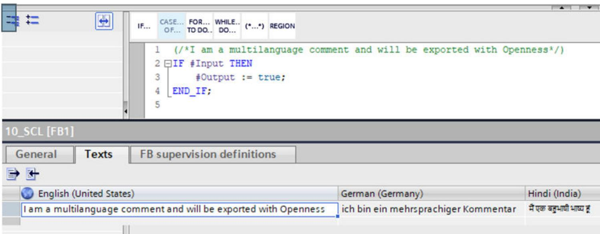  
下图给出了导出 Openness XML 文件中多语言注释的示例：
连接到 TIA Portal (页 90)
打开项目 (页 140)

#### 6.4.2.9 导出故障安全块


##### 导出故障安全块

现在可以导入和导出故障安全块，但不能导出 F 系统块。

##### 导入故障安全块

可导出和重新导入一致的 F 块。这些块将创建为 F 块。
如果将所有属性“ProgrammingLanguage"”值中的前缀“F\_”移除，则可将此块作为标准块导入。
连接到 TIA Portal (页 90)
打开项目 (页 140)
导出块 (页 1545)
导出具有专有技术保护的块 (页 1499)

#### 6.4.2.10 导出系统块

要求
• TIA Portal Openness 应用程序已连接到 TIA Portal。 [连接到 TIA Portal](#连接到-TIA-Portal)”
• 项目已经打开。
[打开项目](#打开项目)”
• 项目包含系统块。
• 系统块不是 F 块
• PLC 未在线。
只有可见的系统块在块组合中可用，例如，块组合中不可使用 FB 或 FC 块。XML 文件的生成过程与块的导出文件过程相似。
修改以下程序代码以将块的可见数据导出至 XML 文件：
```cs
//Exports system blocks
private static void ExportSystemBlocks(PlcSoftware plcsoftware)
{
    PlcSystemBlockGroup sbSystemGroup = plcsoftware.BlockGroup.SystemBlockGroups[0];
    foreach (PlcSystemBlockGroup group in sbSystemGroup.Groups)
    {
    foreach (PlcBlock block in group.Blocks)
    {
    block.Export(new FileInfo(string.Format(@"D:\Samples\{ 0 }.xml", block.Name)),
    ExportOptions.WithDefaults);
    }
}
```

#### 6.4.2.11 导出包含多语言文本的 GRAPH 块


##### 包含多语言文本的 GRAPH 块的 XML 结构

GRAPH 块的导出 XML 中包含 GRAPH 的已翻译步骤名称和转移名称。这些已翻译的多语言文本分别在父元素 Step 和 Transition 下表示为 StepName 和 TransitionName 元素。每个支持的语言都对应有一个 MultiLanguageText 元素。对于未明确设置的语言，其文本不会导出。如果未进行翻译，则不会导出 StepName 和 TransitionName 元素。StepName 和TransitionName 元素是可选的。当图形版本 < V5.0 时，TIA Portal Openness XML 导入操作会出现可恢复的异常。

##### StepName 元素的示例

```xml
<Steps>
    <Step Number="1" Init="true" Name="Step1" MaximumStepTime="T#10S" WarningTime="T#7S">
    <StepName>
    <MultiLanguageText Lang="de-DE">stepDE</MultiLanguageText>
    <MultiLanguageText Lang="en-US">stepEN</MultiLanguageText>
    <MultiLanguageText Lang="it-CH">stepIT</MultiLanguageText>
    </StepName>
    ..
</Step>
..
</Steps>
```

##### TransitionName 元素的示例

```xml
<Transitions>
    <Transition IsMissing="false" Name="Trans1" Number="1" ProgrammingLanguage="LAD">
    <TransitionName>
    <MultiLanguageText Lang="de-DE">transDE</MultiLanguageText>
    <MultiLanguageText Lang="en-US">transEN</MultiLanguageText>
    <MultiLanguageText Lang="it-CH">transIT</MultiLanguageText>
    </TransitionName>
    ..
</Transition>
..
</Transitions>
```

#### 6.4.2.12 导入块

• TIA Portal Openness 应用程序已连接到 TIA Portal。 [连接到 TIA Portal](#连接到-TIA-Portal)”
• 项目已经打开。
[打开项目](#打开项目)”
• PLC 未在线。
TIA Portal Openness API 支持从 XML 文件导入采用“LAD”、“FBD”、“GRAPH”、“SCL”或“STL”编程语言的块。支持以下块类型：
• 函数块 (FB)
• 函数 (FC)
• 组织块 (OB)
• 全局数据块 (DB)

##### 导入优化数据块

只有 S7-1200 或更高版本的 CPU 支持优化数据块。如果将已优化的数据块导入到 S7-300 或S7-400，将会发生异常并导致导入失败。

##### 对导入操作的响应

导入块时以下规则适用：
• XML 文件包含的数据可以少于项目中的块，例如参数更少。
• 在项目和 XML 文件中，调用信息等冗余信息必须相同。否则，会发生异常。
• XML 文件中的数据就其在 TIA Portal 中被编译的能力而言，可能为“不一致”。
• 不会导入具有“ReadOnly=True”和“Informative=True”属性的特性。
• 缺失的背景数据块不会自动创建。
• 如果 xml 文件中未指定块编号，则系统将自动分配块编号。
• 如果该块在项目中不存在，且未在 xml 文件中指定版本信息，则将分配版本号“0.1”。
修改以下程序代码：
```txt
//Import blocks
private static void ImportBlocks(PlcSoftware plcSoftware)
{
    PlcBlockGroup blockGroup = plcSoftware.BlockGroup;
    IList<PlcBlock> blocks = blockGroup.Blocks.Import(new FileInfo(@"D:\Blocks\myBlock.xml"),
    ImportOptions.Override);
}
```
```cs
//Import system blocks
private static void ImportSystemBlocks(PlcSoftware plcSoftware)
{
    PlcBlockSystemGroup systemblockGroup =
    plcSoftware.BlockGroup.SystemBlockGroups[0].Groups[0];
    IList<PlcBlock> blocks = systemblockGroup.Blocks.Import(new FileInfo(@"D:\Blocks\myBlock.xml"), ImportOptions.Override);
}
```

#### 6.4.2.13 导出块

• TIA Portal Openness 应用程序已连接到 TIA Portal。 [连接到 TIA Portal](#连接到-TIA-Portal)”
• 项目已经打开。[打开项目](#打开项目)”
• PLC 未在线。
API 接口支持将一致的块和用户数据类型导出到 XML 文件。
XML 文件接收块的名称。支持以下块类型：
• 函数块 (FB)
• 函数 (FC)
6.4 导入/导出 PLC 设备的数据
• 组织块 (OB)
• 全局数据块 (DB)
支持以下编程语言：
• STL
• FBD
• LAD
• GRAPH
• SCL

##### 适用于所有块的属性

通过选中的ExportOptions，将导出所有块中的以下属性（请[导出组态数据](#导出组态数据)）。始终导出以粗体显示的属性。
更多信息，请参见 TIA Portal 信息系统的“块属性的概述”部分。
<table><tr><td>属性</td><td>类型</td><td>默认值</td><td>只读</td></tr><tr><td>AutoNumber</td><td>Bool</td><td>true</td><td>false</td></tr><tr><td>CodeModifiedDate</td><td>DateTime</td><td>-</td><td>true</td></tr><tr><td>CompileDate</td><td>DateTime</td><td>-</td><td>true</td></tr><tr><td>CreationDate</td><td>DateTime</td><td>-</td><td>true</td></tr><tr><td>HeaderAuthor</td><td>String</td><td>""</td><td>false</td></tr><tr><td>HeaderFamily</td><td>String</td><td>""</td><td>false</td></tr><tr><td>HeaderName</td><td>String</td><td>""</td><td>false</td></tr><tr><td>HeaderVersion</td><td>String</td><td>"0.1"</td><td>false</td></tr><tr><td>Interface</td><td>String</td><td>空接口</td><td>false</td></tr><tr><td>InterfaceModifiedDate</td><td>DateTime</td><td>-</td><td>true</td></tr><tr><td>IsConsistent</td><td>Bool</td><td>-</td><td>true</td></tr><tr><td>IsKnowHowProtected $^{1}$ </td><td>Bool</td><td>false</td><td>true</td></tr><tr><td>IsWriteProtected</td><td>Bool</td><td>false</td><td>true</td></tr><tr><td>MemoryLayout</td><td>enum MemoryLayout</td><td>-</td><td>false</td></tr><tr><td>ModifiedDate</td><td>DateTime</td><td>-</td><td>true</td></tr><tr><td>Name</td><td>String</td><td>-</td><td>false</td></tr><tr><td>Number</td><td>Int32</td><td>下一个可用编号</td><td>false</td></tr><tr><td>ParameterModified</td><td>DateTime</td><td>-</td><td>true</td></tr><tr><td>PLCSimAdvancedSupport</td><td>Bool</td><td>false</td><td>true</td></tr><tr><td>ProgrammingLanguage</td><td>enum ProgrammingLanguage</td><td>-</td><td>false</td></tr><tr><td>StructureModified</td><td>DateTime</td><td>-</td><td>true</td></tr></table>
<sup>1</sup> IsKnowHowProtected 属性也适用于 UDT。
某些条件下，MemoryLayout 属性为只读属性。

##### 动态可访问常规属性

某些条件下，以下属性为只读属性：
<table><tr><td>属性</td><td>只读条件</td></tr><tr><td>AutoNumber</td><td>All KnowHowProtected blocks, All Classic OBs; Plus OBs: DiagnosticErrorInterrupt, IOAccessError, ProgrammingError, PullOrPlugOfModules, RackOrStationFailure, Status, TimeErrorInterrupt, Update</td></tr><tr><td>HeaderVersion</td><td rowspan="4">System- and KnowHowProtected DBs; ArrayDBs that originated from system library</td></tr><tr><td>HeaderName</td></tr><tr><td>HeaderFamily</td></tr><tr><td>HeaderAuthor</td></tr><tr><td>MemoryLayout</td><td>Classic blocks, System Know how protected blocks, ArrayDBs, IDBofFBs, Graph blocks</td></tr></table>

##### 适用于 ArrayDB 块的属性

通过选中的 ExportOptions.，将导出 ArrayDB 块的以下属性
<table><tr><td>属性</td><td>类型</td><td>默认值</td><td>只读</td></tr><tr><td>ArrayDataType</td><td>String</td><td>-</td><td>true</td></tr><tr><td>ArrayLimitUpperBound</td><td>Int32</td><td>-</td><td>true</td></tr></table>

##### 适用于 DB 块的属性

通过选中的 ExportOptions.，将导出 DB 块的以下属性
<table><tr><td>属性</td><td>类型</td><td>默认值</td><td>只读</td></tr><tr><td>IsOnlyStoredInLoadMemory</td><td>Bool</td><td>false</td><td>false</td></tr><tr><td>IsPLCDB</td><td>Bool</td><td>false</td><td>false</td></tr><tr><td>IsWriteProtectedInAS</td><td>Bool</td><td>false</td><td>false</td></tr></table>

##### 适用于 FB 块的属性

通过选中的 ExportOptions.，将导出 FB 块的以下属性
<table><tr><td>属性</td><td>类型</td><td>默认值</td><td>只读</td></tr><tr><td>AssignedProDiagFB</td><td>String</td><td>-</td><td>-</td></tr><tr><td>ISMultiInstanceCapable</td><td>Bool</td><td>-</td><td>true</td></tr><tr><td>Supervisions</td><td>String</td><td>no supervisions</td><td>对于IDB of FB为true,对于FB为false</td></tr></table>

##### 适用于 DB 块和 FB 块的属性

通过选中的 ExportOptions.，将导出 DB 块和 FB 块的以下属性
<table><tr><td>属性</td><td>类型</td><td>默认值</td><td>只读</td></tr><tr><td>IsIECCheckEnabled</td><td>Bool</td><td>false</td><td>false</td></tr><tr><td> $IsRetainMemResEnabled^1$ </td><td>Bool</td><td>false</td><td>false</td></tr></table>
6.4 导入/导出 PLC 设备的数据
<table><tr><td>属性</td><td>类型</td><td>默认值</td><td>只读</td></tr><tr><td>MemoryReserve</td><td>Unsigned</td><td>0</td><td>false</td></tr><tr><td> $RetainMemoryReserve^2$ </td><td>Unsigned</td><td>0</td><td>false</td></tr></table>
<sup>2</sup> 如果“IsRetainMemResEnabled”属性值为“false”，且“RetainMemoryReserve”属性值不等于“0”，则会发生异常。

##### 适用于 FB 块、DB 块和 IDB 块的属性

通过选中的 ExportOptions.，将导出 FB 块、DB 块和 IDB 块的以下属性
<table><tr><td>属性</td><td>类型</td><td>默认值</td><td>只读</td></tr><tr><td>DownloadWithoutReinit</td><td>Bool</td><td>false</td><td>true</td></tr></table>

##### 适用于 FB 块和 FC 块的属性

通过选中的 ExportOptions.，将导出 FB 块和 FC 块的以下属性
<table><tr><td>属性</td><td>类型</td><td>默认值</td><td>只读</td></tr><tr><td>LibraryType</td><td>String</td><td>-</td><td>true</td></tr><tr><td>LibraryTypeVersionGuid</td><td>String</td><td>-</td><td>true</td></tr></table>

##### 适用于 FB 块和 FC (STL) 块的属性

通过选中的 ExportOptions.，将导出 FB 块和 FC (STL) 块的以下属性
<table><tr><td>属性</td><td>类型</td><td>默认值</td><td>只读</td></tr><tr><td>ParameterPassing</td><td>Bool</td><td>false</td><td>false</td></tr></table>

##### 适用于 FB、FC 和 FB 块的背景数据块的属性

通过选中的 ExportOptions.，将导出 FB、FC 和 FB 块的背景数据块的以下属性
<table><tr><td>属性</td><td>类型</td><td>默认值</td><td>只读</td></tr><tr><td>UDABlockProperties</td><td>String</td><td>&quot;&quot;</td><td>false</td></tr><tr><td>UDAEnableTagReadback</td><td>Bool</td><td>false</td><td>false</td></tr></table>

##### 适用于 FB 块的背景数据块和 UDT 的属性

通过选中的 ExportOptions.，将导出 FB 块的背景数据块和 UDT 的以下属性
<table><tr><td>属性</td><td>类型</td><td>默认值</td><td>只读</td></tr><tr><td>InstanceOfName</td><td>String</td><td>&quot;&quot;</td><td>false</td></tr><tr><td>InstanceOfNumber</td><td>Unsigned Short</td><td>-</td><td>true</td></tr><tr><td>InstanceOfType</td><td>enum BlockType</td><td>-</td><td>true</td></tr><tr><td>OfSystemLibElement</td><td>String</td><td>&quot;&quot;</td><td>false</td></tr><tr><td>OfSystemLibVersion</td><td>String</td><td>&quot;&quot;</td><td>false</td></tr></table>

##### 适用于 OB 块的属性

通过选中的 ExportOptions.，将导出指定 Plus PLC 的 OB 块的以下属性
<table><tr><td>属性</td><td>类型</td><td>默认值</td><td>只读</td></tr><tr><td>ApplicationCycle</td><td>Single</td><td>-</td><td>true</td></tr><tr><td>AutomaticMinimum</td><td>Bool</td><td>-</td><td>true</td></tr><tr><td>ConstantName</td><td>String</td><td>-</td><td>true</td></tr><tr><td>CycleTimeDistributedIO</td><td>Single</td><td>-</td><td>true</td></tr><tr><td>CyclicApplicationCycleTime</td><td>Single</td><td>-</td><td>true</td></tr><tr><td>CyclicTime</td><td>Int32</td><td>100000</td><td>true</td></tr><tr><td>DataExchangeMode</td><td>OBDataExchangeMode</td><td>Cyclic</td><td>true</td></tr><tr><td>DelayTime</td><td>Double</td><td>-</td><td>true</td></tr><tr><td>DistributedIOName</td><td>String</td><td>-</td><td>true</td></tr></table>
6.4 导入/导出 PLC 设备的数据
<table><tr><td>属性</td><td>类型</td><td>默认值</td><td>只读</td></tr><tr><td>DistributedIONumber</td><td>Int32</td><td>-</td><td>true</td></tr><tr><td>EnableTimeError</td><td>Bool</td><td>-</td><td>true</td></tr><tr><td>EventClass</td><td>String</td><td>-</td><td>true</td></tr><tr><td>EventsToBeQueued</td><td>Int32</td><td>-</td><td>true</td></tr><tr><td>EventThresholdForTimeError</td><td>Int32</td><td>-</td><td>true</td></tr><tr><td>Execution</td><td>OBExecution</td><td>Never</td><td>true</td></tr><tr><td>Factor</td><td>Single</td><td>-</td><td>true</td></tr><tr><td>PhaseOffset</td><td>Int32</td><td>0</td><td>true</td></tr><tr><td>PriorityNumber</td><td>Int32</td><td>-</td><td>true</td></tr><tr><td>ProcessImagePartNumber</td><td>UInt32</td><td>-</td><td>true</td></tr><tr><td>ReportEvents</td><td>Bool</td><td>-</td><td>true</td></tr><tr><td>SecondaryType $^{3}$ </td><td>String</td><td>-</td><td>false</td></tr><tr><td>StartDate</td><td>DateTime</td><td>2012年1月1日</td><td>true</td></tr><tr><td>SynchronousApplicationCycleTime</td><td>Single</td><td>-</td><td>true</td></tr><tr><td>TimeMode</td><td>OBTimeMode</td><td>System</td><td>true</td></tr><tr><td>TimeOfDay</td><td>DateTime</td><td>12:00 AM</td><td>true</td></tr><tr><td>TransformationDBNumber</td><td>UInt16</td><td>0xffff</td><td>true</td></tr></table>
3 导出 OB 时，将基于 OB 编号额外设置“SecondaryType”。导入期间会检查分配。如果分配错误，则会发生“Recoverable”类型的异常。

##### 适用于 FB、FC 和 OB 块的属性

通过选中的 ExportOptions.，将导出 FB、FC 和 OB 块的以下属性
<table><tr><td>属性</td><td>类型</td><td>默认值</td><td>只读</td></tr><tr><td>HandleErrorsWithinBlock</td><td>Bool</td><td>false</td><td>true</td></tr></table>

##### 适用于 FB、FC 和 UDT 块的属性

通过选中的 ExportOptions.，将导出 FB、FC 和 UDT 块的以下属性
<table><tr><td>属性</td><td>类型</td><td>默认值</td><td>只读</td></tr><tr><td>LibraryConformanceStatus</td><td>String</td><td>-</td><td>false</td></tr></table>

##### 适用于 GRAPH 块的属性

通过选中的 ExportOptions.，将导出 GRAPH 块的以下属性
<table><tr><td>属性</td><td>类型</td><td>默认值</td><td>只读</td></tr><tr><td>AcknowledgeErrorsRequired</td><td>Bool</td><td>true</td><td>false</td></tr><tr><td>CreateMinimizedDB</td><td>Bool</td><td>false</td><td>false</td></tr><tr><td>ExtensionBlockName</td><td>String</td><td>-</td><td>-</td></tr><tr><td>GraphVersion</td><td>String</td><td>-</td><td>false</td></tr><tr><td>InitialValuesAcquisition</td><td>String</td><td>-</td><td>-</td></tr><tr><td>LanguageInNetworks</td><td>String</td><td>-</td><td>false</td></tr><tr><td>LockOperatingMode</td><td>Bool</td><td>false</td><td>false</td></tr><tr><td>PermanentILProcessingInMANMode</td><td>Bool</td><td>false</td><td>false</td></tr><tr><td>SkipSteps</td><td>Bool</td><td>false</td><td>false</td></tr></table>

##### 适用于 GRAPH FB 块的属性

通过选中的 ExportOptions.，将导出 GRAPH FB 块的以下属性
<table><tr><td>属性</td><td>类型</td><td>默认值</td><td>只读</td></tr><tr><td>WithAlarmHandling</td><td>Bool</td><td>true</td><td>false</td></tr></table>

##### 适用于 SCL 块的属性

通过选中的 ExportOptions.，将导出 SCL 块的以下属性。基于 PLC 类型导出这些属性。
<table><tr><td>属性</td><td>类型</td><td>默认值</td><td>只读</td></tr><tr><td>CheckArrayLimits</td><td>Bool</td><td>false</td><td>false</td></tr><tr><td>ExtendedStatus</td><td>Bool</td><td>false</td><td>false</td></tr><tr><td>DBAccessibleFromOPCUA</td><td>Bool</td><td>true</td><td>false</td></tr></table>

##### 适用于 GRAPH、SCL 和 LAD/FBD 块的属性

通过选中的 ExportOptions.，将导出 GRAPH、SCL 和 LAD/FBD 块的以下属性
<table><tr><td>属性</td><td>类型</td><td>默认值</td><td>只读</td></tr><tr><td>SetENOAutomatically</td><td>Bool</td><td>-</td><td>false</td></tr></table>

##### 适用于程序块（OB 除外）、DB 和 UDT 块的属性

通过所选ExportOptions，将导出程序块（OB 除外）、数据记录和 UDT 块的以下属性。
<table><tr><td>属性</td><td>类型</td><td>默认值</td><td>只读</td></tr><tr><td>Access</td><td>UnitAccessType</td><td>Unpublished</td><td>false</td></tr></table>

##### 对于属性 ‘Access'的导入响应

<table><tr><td></td><td>在单元下导入</td><td>不在单元下导入(没有SWImportOptions.IgnoreUnitAttributes)</td><td>不在单元下导入(有SWImportOptions.IgnoreUnitAttributes)</td></tr><tr><td>从单元下导出 XML</td><td>使用并设置“Access”</td><td>发生可恢复异常</td><td>忽略“Access”</td></tr><tr><td>不从单元下导出 XML</td><td>“Access”获得其默认值</td><td>“Access”不存在</td><td>“Access”不存在</td></tr></table>
修改以下程序代码以将不具有专有技术保护的块导出至 XML 文件：
```cs
//Exports a regular block
private static void ExportRegularBlock(PlcSoftware plcSoftware)
{
    PlcBlock plcBlock = plcSoftware.BlockGroup.Blocks.Find("MyBlock");
    plcBlock.Export(new FileInfo(string.Format(@"D:\Samples\{0}.xml", plcBlock.Name)),
    ExportOptions.WithDefaults);
}
```

#### 6.4.2.14 引用缺失时导入块/UDT

• TIA Portal Openness 应用程序已连接到 TIA Portal。 [连接到 TIA Portal](#连接到-TIA-Portal)”
• 已打开一个项目
请[打开项目](#打开项目)”
• PLC 未处于在线状态
即使缺少相关对象，也可以使用 TIA Portal Openness 导入块和 UDT。可以通过相应的 Import方式的新过载来使用新模式。新过载具有一个附加参数，用于接受新标记的枚举SWImportOption 的值。
Openness 接口支持在以下条件中使用新导入模式：
<table><tr><td>导入</td><td>对象引用</td></tr><tr><td>UDT</td><td>UDT</td></tr><tr><td>DB(全局)</td><td>UDT</td></tr><tr><td>IDBofUDT</td><td>UDT</td></tr><tr><td>IDBofFB</td><td>FB</td></tr><tr><td>ArrayDB</td><td>UDT 数据类型的 Array</td></tr><tr><td>FB</td><td>UDT(接口),多实例</td></tr><tr><td>FC</td><td>UDT(接口)</td></tr></table>
要实现导入，请使用 SWImportOptions.IgnoreMissingReferencedObject，即使缺少引用对象。
```cs
[Flagged] Enum SWImportOptions
{
    None = 0,
    IgnoreStructuralChanges = 1,
    IgnoreMissingReferencedObjects = 2
}
private static void Main(string[] args)
{
    //... // All kinds of blocks
    FileInfo file = ...;
    PlcBlockComposition.Import(file, ImportOptions.None, SWImportOptions.IgnoreMissingReferencedObjects);
    //...
    //... // UDTs
    PlcTypeComposition.Import(file, ImportOptions.None, SWImportOptions.IgnoreMissingReferencedObjects);
    //...
}
```
打开项目 (页 140)

#### 6.4.2.15 为结构更改对象导入块/UDT

要求
• TIA Portal Openness 应用程序已连接到 TIA Portal。 请[连接到 TIA Portal](#连接到-TIA-Portal)”
• 已打开一个项目请[打开项目](#打开项目)”
• PLC 未处于在线状态
通过 Openness API，即使由于相关对象的结构更改而使实例数据丢失，也可导入块和 UDT。
Openness 接口支持在以下条件中使用新导入模式：
<table><tr><td>导入</td><td>对象引用</td></tr><tr><td>Tag</td><td>UDT</td></tr><tr><td>UDT</td><td>UDT</td></tr><tr><td>DB(全局)</td><td>UDT</td></tr><tr><td>IDBofUDT</td><td>UDT</td></tr><tr><td>IDBofFB</td><td>FB</td></tr><tr><td>ArrayDB</td><td>UDT 数据类型的 Array</td></tr><tr><td>FB</td><td>UDT(接口),多实例</td></tr><tr><td>FC</td><td>UDT(接口)</td></tr></table>
可以通过相应的 Import 方式的新过载来使用新模式。新过载具有一个附加参数，用于接受新标记的枚举 SWImportOptions 的值。使用“SWImportOptions.IgnoreStructuralChanges”可允许在存在结构变更的情况下进行导入，但数据可能丢失。
```typescript
Flagged Enum SWImportOptions
{
    None = 0,
    IgnoreStructuralChanges = 1,
    IgnoreMissingReferencedObjects = 2
}
...
// All kinds of blocks
PlcBlockComposition.Import(file, ImportOptions.None, SWImportOptions.IgnoreStructuralChanges);
...
// UDTs
PlcTypeComposition.Import(file, ImportOptions.None, SWImportOptions.IgnoreStructuralChanges);
```
连接到 TIA Portal (页 90)
打开项目 (页 140)

#### 6.4.2.16 导出/导入块和类型的单元特定发布属性

要求
• TIA Portal Openness 应用程序已连接到 TIA Portal。请[连接到 TIA Portal](#连接到-TIA-Portal)
• 项目已打开
[打开项目](#打开项目)”
简介
只有位于单元下的块、plc 类型和变量表存在“Access”属性。块、类型和变量表的 XML 文件在导出为单元环境时包含 Access 属性，
并在导入时获取其 Unpublished 默认值。导出的相同块、类型和变量表的 XML 在非单元环境下不包含 Access 属性，
在导入时不会获取任何内容。
常规 Openness XML 导入规则不允许导入包含未定义属性和未定义值的 XML。规则限制源自以下部分的 XML 的导出：
单元环境中的对象，且其不能导入到非单元环境。
规则增加了对 XML 导出和导入使用的限制，因此 import 过载方法被定义为接受以下三个参数
<table><tr><td>参数</td><td>返回类型</td><td>描述</td></tr><tr><td>path</td><td>String</td><td>指定要导入的 Simatic ML 文件的路径</td></tr><tr><td>importOptions</td><td>enum: Siemens.Engineering.ImportOptions</td><td>指定导入期间将使用的常规导入选项。</td></tr><tr><td>swImportOptions</td><td>enum: Siemens.Engineering.SW.SWImportOptions</td><td>指定导入期间将使用的 Step7 特定的导入选项。</td></tr></table>
枚举类型 Siemens.Engineering.SW.SWImportOptions 将扩展为包含以下新导入选项：
• IgnoreUnitAttributes：指定 XML 中存在单元相关属性的情况下不应中止导入过程，导入在非单元环境中执行。
在以下情况下，会考虑“IgnoreUnitAttributes”：
• XML 从单元导出
• XML 包含“Access”属性
• XML 导入到非单元环境中
如果导出的 XML 不包含 Access 属性，并且将导入到单元中，则导入逻辑不会考虑新的导入选项。
```txt
PlcSoftware plcTarget = GetControllerTargetByPLCName(Session.OpnsProject.Devices, PLCName);
PlcUnitProvider plcUnitProvider = plcTarget TokService<PlcUnitProvider>();
PlcSoftware plcSoftware = plcTarget TokService<SoftwareContainer>() as PlcSoftware;
PlcUnit plcUnit1 = plcUnitProvider.UnitGroup.Units[0];
//assuming Unit_1 is already existing
PlcUnit plcUnit2 = plcUnitProvider.UnitGroup.Units[1];
//assuming Unit_2 is already existing
PlcBlock block1 = plcUnit1.BlockGroup.Blocks.Find("Block_1");
//assuming Block_1 is already existing under Unit_1
PlcBlock block2 = plcUnit2.BlockGroup.Blocks.Find("Block_2");
//assuming Block_2 is already existing under Unit_2
PlcBlock block3 = plcSoftware.BlockGroup.Blocks.Find("Block_3");
//assuming Block_3 is already existing under the PLC
```

##### 程序代码：对象从单元导出并导入到单元中

下例使用块证明了新导入选项的响应，plc 类型和变量表同样适用。
修改以下程序代码，以导出“Access”属性通过 ExportOptions.WithDefaults 设为值“Unpublished”（默认值）的块，并通过 SWImportOptions.None 导出：
```txt
block1.SetAttribute("Access", UnitAccessType.Unpublished);
block1.Export(new FileInfo("somepath"), ExportOptions.WithDefaults);
block1.Delete();
plcUnit2.BlockGroup.Blocks.Import(new FileInfo("somepath"), ImportOptions.None, SWImportOptions.None);
```
修改以下程序代码，以导出“Access”属性通过 ExportOptions.WithDefaults 设为值“Unpublished”（默认值）的块，并通过 SWImportOptions.IgnoreUnitAttributes 导出：
```typescript
block1.SetAttribute("Access", UnitAccessType.Unpublished);
block1.Export(new FileInfo("somepath"), ExportOptions.WithDefaults);
block1.Delete();
plcUnit2.BlockGroup.Blocks.Import(new FileInfo("somepath"), ImportOptions.None, SWImportOptions.IgnoreUnitAttributes);
修改以下程序代码，以导出"Access"属性通过ExportOptions.None设为值"Published"的块，并通过SWImportOptions.None:导出：
block1.SetAttribute("Access", UnitAccessType.Published);
block1.Export(new FileInfo("somepath"), ExportOptions.None);
block1.Delete();
plcUnit2.BlockGroup.Blocks.Import(new FileInfo("somepath"), ImportOptions.None, SWImportOptions.None);
修改以下程序代码，以导出"Access"属性通过ExportOptions.None设为值"Published"的块，并通过SWImportOptions.IgnoreUnitAttributes导出：
block1.SetAttribute("Access", UnitAccessType.Published);
block1.Export(new FileInfo("somepath"), ExportOptions.None);
block1.Delete();
plcUnit2.BlockGroup.Blocks.Import(new FileInfo("somepath"), ImportOptions.None, SWImportOptions.IgnoreUnitAttributes);
```
说明以上所有程序代码中没有发生异常，导入成功。

##### 程序代码：对象从单元导出并导入到非单元环境中

修改以下程序代码，以导出“Access”属性通过 ExportOptions.WithDefaults 设为值“Unpublished”（默认值）的块，并通过 SWImportOptions.None 导出：
```txt
block1.SetAttribute("Access", UnitAccessType.Unpublished);
block1.Export(new FileInfo("somepath"), ExportOptions.WithDefaults);
block1.Delete();
plcUnit2.BlockGroup.Blocks.Import(new FileInfo("somepath"), ImportOptions.None, SWImportOptions.None);
```
6.4 导入/导出 PLC 设备的数据
```txt
说明  
以上程序代码中，导入不成功，发生了一个可恢复异常，
```
修改以下程序代码，以导出“Access”属性通过 ExportOptions.WithDefaults 设为值“Unpublished”（默认值）的块，并通过 SWImportOptions.IgnoreUnitAttributes 导出：
```txt
block1.SetAttribute("Access", UnitAccessType.Published);
block1.Export(new FileInfo(„somepath"), ExportOptions.None);
block1.Delete();
plcUnit2.BlockGroup.Blocks.Import(new FileInfo("somepath"), ImportOptions.None, SWImportOptions.None);
```
```txt
说明在以上程序代码中，导入成功，且未发生异常。
```
修改以下程序代码，以导出“Access”属性通过 ExportOptions.None 设为值“Published”的块，并通过 SWImportOptions.None 导出：
```txt
block1.SetAttribute("Access", UnitAccessType.Published);
block1.Export(new FileInfo(„somepath"), ExportOptions.None);
block1.Delete();
plcUnit2.BlockGroup.Blocks.Import(new FileInfo("somepath"), ImportOptions.None, SWImportOptions.None);
```
以上程序代码中，导入成功，发生了一个可恢复异常。
修改以下程序代码，以导出“Access”属性通过 ExportOptions.None 设为值“Published”的块，并通过 SWImportOptions.IgnoreUnitAttributes 导出：
```txt
block1.SetAttribute("Access", UnitAccessType.Published);
block1.Export(new FileInfo(„somepath"), ExportOptions.None);
block1.Delete();
plcUnit2.BlockGroup.Blocks.Import(new FileInfo("somepath"), ImportOptions.None, SWImportOptions.IgnoreUnitAttributes);
```
在以上程序代码中，没有发生异常，导入成功。

##### 对象从非单元环境导出并导入到单元中

导出 XML 不包含“Access”Openness 属性，导入时会获得默认值“Unpublished”。

##### 对象从非单元环境导出并导入到非单元环境中

导出 XML 不包含“Access”Openness 属性，导入时没有进行任何操作。

#### 6.4.2.17 创建背景数据块

• TIA Portal Openness 应用程序已连接到 TIA Portal [连接到 TIA Portal](#连接到-TIA-Portal)”
• 项目正在打开
[打开项目](#打开项目)”
可使用 TIA Portal Openness 为 SCL、LAD、FBD、STL、Graph 和 CEM 等编程语言创建背景数据块。

##### 程序代码：为 SCL、LAD、FBD、STL、Graph 和 CEM 块创建背景数据块

```txt
PlcSoftware plc = ...;
// To create instance DB of SCL block
plc.BlockGroup.Blocks.CreateInstanceDB("ConveyerDB", true, 5, "Conveyer_SCL_Block");
// To create instance DB of LAD block
plc.BlockGroup.Blocks.CreateInstanceDB("RelayDB", true, 6, "Relay_LAD_Block");
// To create instance DB of FBD block
plc.BlockGroup.Blocks.CreateInstanceDB("SensorDB", true, 6, "Sensor_FBD_Block");
// To create instance DB of STL block
plc.BlockGroup.Blocks.CreateInstanceDB("ReadIODB", true, 6, "ReadIO_STL_Block");
// To create instance DB of Graph block
plc.BlockGroup.Blocks.CreateInstanceDB("ConveyerDB", true, 6, "Conveyer_Graph_Block");
// To create instance DB of CEM block
plc.BlockGroup.Blocks.CreateInstanceDB("RelayDB", true, 6, "Relay_CEM_Block");
```

#### 6.4.2.18 在不导出的情况下访问数据块值参数

要求
• TIA Portal Openness 应用程序已连接到 TIA Portal [连接到 TIA Portal](#连接到-TIA-Portal)”
• 已通过 TIA Portal Openness 应用程序打开一个项目请[打开项目](#打开项目)
简介
可使用 TIA Portal Openness 在任何 DB 中读取和写入以下成员属性值。
<table><tr><td>特性名称</td><td>数据类型</td><td>模型化/动态</td><td>访问</td></tr><tr><td>Name</td><td>String</td><td>模型化</td><td>读</td></tr><tr><td>StartValue</td><td>String</td><td>动态</td><td>读/写</td></tr><tr><td>AssignedPro DiagFB</td><td>String</td><td>动态</td><td>读</td></tr><tr><td>ExternalAccessible</td><td>bool</td><td>动态</td><td>读/写</td></tr><tr><td>ExternalVisible</td><td>bool</td><td>动态</td><td>读/写</td></tr></table>
6.4 导入/导出 PLC 设备的数据
<table><tr><td>特性名称</td><td>数据类型</td><td>模型化/动态</td><td>访问</td></tr><tr><td>ExternalWritable</td><td>bool</td><td>动态</td><td>读/写</td></tr><tr><td>Retain</td><td>bool</td><td>动态</td><td>读/写</td></tr><tr><td>SetPoint</td><td>bool</td><td>动态</td><td>读/写</td></tr><tr><td>DataTypePoint</td><td>bool</td><td>动态</td><td>读/写</td></tr><tr><td>Snapshot</td><td>bool</td><td>动态</td><td>读</td></tr><tr><td>DefaultValue</td><td>bool</td><td>动态</td><td>读</td></tr></table>
修改以下程序代码，以访问数据块接口成员详细信息：
```txt
public static void PrintMemberAttributes( plcBlockInterface)
{
    foreach(Member member in plcBlockInterface.Members)
    {
    Console.WriteLine($"Name: {member.Name}");
    Console.WriteLine($"StartValue: {member.getAttribute("StartValue")}");
    Console.WriteLine($"ExternalAccessible: {member.getAttribute("ExternalAccessible")}");
    Console.WriteLine($"ExternalVisible: {member.getAttribute("ExternalVisible")}");
    Console.WriteLine($"ExternalWritable: {member.getAttribute("ExternalWritable")}");
    Console.WriteLine($"Retain: {member.getAttribute("Retain")}");
    Console.WriteLine($"Setpoint: {member.getAttribute("Setpoint")}");
    Console.WriteLine($"DataTypeName: {member.getAttribute("DataTypeName")}");
    Console.WriteLine($"Snapshot: {member.getAttribute("Snapshot")}");
    Console.WriteLine($"DefaultValue: {member.getAttribute("DefaultValue")}");
    }
}
```

##### 修改以下程序代码以从 DB 中读取起始值：

```txt
PlcBlockInterface bi = dbbblock.Interface;
MemberComposition members = bi.Members;
Member member = members.Find("Room_Temperature");
string startValue = member.StartValue;
//Normal get attribute should be possible as usual
startValue = member.GetAttribute("StartValue");
//Array
initialSpeedvar = members.Find("Motor.InitialSpeed[0]") ;
object motorInitialSpeed = initialSpeedvar.StartValue;
//UDT-struct
axisSpeedvar = members.Find("FillingStation.Conveyer.AxisSpeed");
object axisSpeed = axisSpeedvar.StartValue;
axisSpeed = axisSpeedvar.GetAttribute("StartValue");
//Struct
initialSpeedvar = paramF.Find("DischargeValve.FlowMeter.InitialSpeed[0]") ;
object initialSpeed = initialSpeedvar.StartValue;
initialSpeed = initialSpeedvar.GetAttribute("StartValue");
```
修改程序代码以将起始值写入 DB：
```asp
PlcBlockInterface bi = dbbblock.Interface;
MemberComposition members = bi.Members
Member member = members.Find("Room_Temperature");
member.StartValue = 10.2;
//Normal set attribute should be possible as usual
member.SetAttribute("StartValue", 20.3);
//Array
initialSpeedvar = members.Find("Motor.InitialSpeed[0]")；
initialSpeedvar.StartValue = 36;
initialSpeedvar.SetAttribute("StartValue", 56);
//UDT-struct
axisSpeedvar = members.Find("FillingStation.Conveyer.AxisSpeed");
object axisSpeed = axisSpeedvar.StartValue;
axisSpeed.SetAttribute("StartValue", 40.5);
initialSpeedvar = paramF.Find("DischargeValve.FlowMeter.InitialSpeed[0]")；
object initialSpeed = initialSpeedvar.StartValue;
initialSpeed.SetAttribute("StartValue", 12);
```
修改以下程序代码以将变量的起始值设为“myTest”：
```txt
PlcSoftware myPlcSoftware =
tiaProject.Devices[0].DeviceItems[1].GetService<SoftwareContainer>().Software as
PlcSoftware;
DataBlock myDatablock = myPlcSoftware.BlockGroup.Blocks[1] as DataBlock;
myDatablock.Interface.Members[0].SetAttribute("StartValue", " 'myTest'");
```

#### 6.4.2.19 导出/导入 Plc 报警文本列表

要求
• TIA Portal Openness 应用程序已连接到 TIA Portal [连接到 TIA Portal](#连接到-TIA-Portal)”
• 项目已打开
[打开项目](#打开项目)”
简介
可使用 TIA Portal Openness 导出和导入 Plc 报警文本列表。导出/导入的格式为 XLSX。

##### Excel 文件结构

生成的 XLSX 文件包含两个工作表，一个用于文本列表，另一个用于条目。创建的 XLSX 文件将接收名为 FileContent、值为“报警文本列表”(Alarm text lists) 的自定义特性。如果该特性缺失或无效（不包含值或包含其它值），将拒绝导入。
两个工作表之间的数据是关联在一起的。TextListEntry.Parent 引用 TextList.Name
<table><tr><td></td><td colspan="3">A</td><td>B</td><td>C</td><td>D</td><td>E</td></tr><tr><td>1</td><td colspan="3">Name</td><td>ListRange</td><td>Comment [en-US]</td><td>Comment [de-DE]</td><td>Comment [fr-FR]</td></tr><tr><td>2</td><td colspan="3">NextTextList</td><td>Decimal</td><td>English</td><td>Deutsch</td><td>French</td></tr><tr><td colspan="2">A</td><td>B</td><td>C</td><td>D</td><td>E</td><td>F</td><td rowspan="3"></td></tr><tr><td colspan="2">Parent</td><td>From</td><td>To</td><td>Text [de-DE]</td><td>Text [en-US]</td><td>Text [fr-FR]</td></tr><tr><td colspan="2">NextTextList</td><td>0</td><td>1</td><td>xyzxyzxyz</td><td>rstrstrst</td><td>uvwuvwuvw</td></tr></table>

##### 工程组态对象模型

新引入的 PlcAlarmTextListProvider 类型的工程组态对象模型定义。可在 PlcUnit 和PlcSoftware 工程组态对象下访问
导出
可通过两种 API 方法进行导出。如果要导出以所有已激活项目语言表示的 PLC/软件单元的所有文本列表，唯一需要的参数是“path”，
该参数定义了成功导出后结果 XLSX 文件的放置位置。
```javascript
FileInfo fileInfo = new FileInfo(Path.Combine(Environment.CurrentDirectory, $\{xlsxName}.xlsx"));
PlcAlarmTextListProvider textListProvider = GetTextListProvider(unitName);
textListProvider.ExportToXlsx(fileInfo);
```
如果不需要导出 PLC/软件单元的所有文本列表，或者应对需要导出的文本列表所使用的语言进行过滤，可在 API 中使用另一种方法，
此方法通过文本列表名称标识要导出的文本列表，并通过语言列表标识需导出的文本列表使用的语言。
6.4 导入/导出 PLC 设备的数据
ExportToXlsx 操作用法示例：
```txt
private void ExportPlcOrUnit(
    string stationName,
    string plcName,
    string xlsxName,
    string[] textListNames,
    string[] cultureCodes,
    string unitName = null)
{
    LanguageSettings languageSettings = Project.LanguageSettings;
    LanguageComposition supportedLanguages = languageSettings.Languages;
    IEnumerable(LanguageInfo) cultureInfos = null;
    if (cultureCodes != null)
    {
    cultureInfos = cultureCodes.Select(i =>
    supportedLanguages.Find(CultureInfo.GetCultureInfo(i)));
    }
    FileInfo fileInfo = new FileInfo(Path.Combine(Environment.CurrentDirectory, "${xlsxName}.xlsx"));
    PlcAlarmTextListProvider textListProvider = GetTextListProvider(stationName, plcName, unitName);
    TextListXlsxResult result = null;
    string exceptionMessage = string.Empty;
    ExceptionMessageData? userExceptionMessageData = null;
    try
    {
    result = textListProvider.ExportToXlsx(fileInfo, textListNames, cultureInfos);
    }
    catch (EngineeringTargetInvocationException e)
    {
    exceptionMessage = e.ToString();
    userExceptionMessageData = e.DetailMessageData.FirstOrDefault();
    }
    private PlcAlarmTextListProvider GetTextListProvider(string stationName, string plcName, string unitName = null)
    {
    DeviceComposition devices = Project.Devices;
    Device device = devices.Where(station => station.Name == stationName).FirstOrDefault();
    if (device == null)
    {
    throw new InvalidOperationException($"The requested '{stationName}' station is not found");
    }
    PlcSoftware plcTarget = (PlcSoftware)FindSoftwareTarget(device, plcName);
    if (plcTarget == null)
    {
    throw new InvalidOperationException($"The requested '{plcName}' PLC SW is not found")
    }
    if (unitName != null)
    {
    PlcUnitProvider unitProvider = plcTarget.GetService<PlcUnitProvider>();
}
```
6.4 导入/导出 PLC 设备的数据
```typescript
PlcUnit unit = unitProvider.UnitGroup.Units.Where(unit => unit.Name == unitName).FirstOrDefault();
if (unit == null)
{
throw new InvalidOperationException($"The requested ' {unitName}' unit is not found");
}
return unit.GetService<PlcAlarmTextListProvider>();
}
return plcTarget.GetValue<PlcAlarmTextListProvider>();
}
```

##### 错误处理：

• 如果给定语言未作为项目语言激活，则将抛出 UserException。例如，“无法导出所需语言刚卡尼语（印度）’，因为该语言不属于在此项目中使用的语言分支。有效语言包括‘德国（德语）’和‘英语（美国）’”
• 如果不存在用户文本列表，将抛出 UserException (TextListNotFoundException) 并提示以下消息：“下列项目中没有文本列表：<PLCName>。”(There is no text list on thefollowing item: <PLCName>.)
• 如果给定的文本列表名称不存在，或存在文本列表但该列表不属于用户文本列表，则将抛出 UserException。如“未在 PLC\_1 中找到文本列表 User\_1”(Text list User\_1 is notfound at PLC\_1)。
“文本列表 SYSTEM\_SDiag\_CmpCpuName 不是用户文本列表，无法导出”(Text listSYSTEM\_SDiag\_CmpCpuName cannot be exported, because it is not user text list)。

##### 导入

PLCAlarmTextListProvider 类中存在以下导入操作。通过 importOptions 参数，可声明导入是否应覆盖现有文本列表。如果
importOptions 设为 ImportOptions.None，且导入期间应更新已存在的文本列表，则将抛出UserException。如果 importOptions 设为
ImportOptions.Override，则导入期间将更新已存在的文本列表。
已有的文本列表通过其名称来标识。将附加新数据（文本列表、条目）。如果导入文件中没有任何对应数据，则不会删除已存在的文本列表。
如果 Excel 文件包含已存在的文本列表的文本列表条目，则将移除已存在的条目，且 Excel 文件中给出的条目将导入到 TIA 项目的
特定文本列表（不会合并文本列表条目）。
如果文件中存在无效条目，将不会导入包含无效条目的文本列表。（无效条目示例：重叠、与包含的文本列表数据类型不一致。）
文本仅会以项目中激活的语言导入。如果文件包含的语言多于项目语言，则不会导入以额外语言表示的文本，并将
记录警告。如果项目包含的语言多于文件语言，则在文件中没有对应数据的文本将保持不变（如果导入后插入新文本列表或范围，则为空）。
不能对只读项目执行导入操作。如果用户尝试对只读项目进行导入操作，将出现UserException。
导入是一个复杂的过程，因此可能出现多种错误。如果错误不属于严重错误，导入将完成，方法会返回包含日志文件（其中包含导入期间生成的消息）路径的 TextListXlsxResult 对象，
且其状态为 TextListXlsxResultState.Warning。
如果错误属于严重错误，则会抛出包含错误详细信息的 UserException。如果错误属于致命错误，则将抛出 NonRecoverableException。
```xml
<?xml version="1.0" standalone="no"?>
<?xml-stylesheet type='text/xsl' href='MassDataHandlerLogFile.xsl'?>
<LogFile
titleName="PLCAlarmTextLists_InvalidLanguage.xlsx__2019.06.07_13.46.45.070__Import_Log.xml"
projectName="D:\TIA\dev\WM5_WinCC_HW_Work\binaries\Debug\x64\Tests\Siemens.Simatic.AlarmServices.Integration.Test.Openness\TextListXlsxFiles\PLCAlarmTextLists_InvalidLanguage.xlsx" typeText="Type" messageText="Message" timeText="Time">
<LogEntry type="Warning" dateTime="3:46:45 PM">
<Message>The language ID in column 'Comment [abcd-EF]' is missing or is invalid (sheet 'TextList'). The texts in this language are not imported.</Message>
</LogEntry>
<LogEntry type="Warning" dateTime="3:46:45 PM">
<Message>The language ID in column 'Text [abcd-EF]' is missing or is invalid (sheet 'TextListEntry'). The texts in this language are not imported.
</Message>
</LogEntry>
<LogEntry type="Information" dateTime="3:46:45 PM">
<Message>Import completed: 2 text lists with 9 entries.</Message>
</LogEntry>
</LogFile>
```
• 导出期间由 TIA Portal V16 生成的 XLSX 文件的自定义特性 FileVersion 应指定为值 1。
• 导出期间由 TIA Portal V16 生成的 XLSX 文件的自定义特性 FileContent 应指定为值 Alarm textlists。
• 导入期间会在 TIA 项目的 Logs 文件夹中生成日志文件
TextListXlsxResult 包含导出或导入结果的相关信息。其中包含的名为 LogFilePath 的 FileInfo指向已完成过程的日志文件。State
（类型为 TextListXlsxResultState）将显示过程的最终状态，可能是 OK、Warning 或 Error。如果结果为 Error，说明过程失败，如果结果为 Warning，说明过程成功完成

#### 6.4.2.20 将文档信息导出到 SimaticML 文件

• TIA Portal Openness 应用程序已连接到 TIA Portal [连接到 TIA Portal](#连接到-TIA-Portal)”
• 项目已打开
[打开项目](#打开项目)”
可以使用 TIA Portal 将 PlcTag、PlcTagTable 和 PlcUserConstant 导出到带有用户特定文档信息的 SimaticML 文件。从 TIA Portal 导出到 Simatic ML 文件以及从 SimaticML 文件导入到TIA Portal 的文档信息不相关。
对于新的导出，可在导出 Openness 数据类型 PlcTag、PlcTagTable 和 PlcUserConstant 时忽略完整的文档信息，也可以组态 SimaticML 文件中应提供的文档信息。

##### DocumentInfoOptions

可使用 Siemens.Engineering.DocumentInfoOptions 来指定需要在 simaticML 文件中导出的文档信息。DocumentInfoOptions 是一个标志枚举，因此可以选择多个组态。以下是可用于导出的组态：
<table><tr><td>枚举</td><td>描述</td></tr><tr><td>None</td><td>未导出文档信息</td></tr><tr><td>ExportSetting</td><td>导出仅包含 ExportSetting 文档信息的数据,例如,其包括用于导出的 ExportOption 的详细信息。</td></tr><tr><td>InstalledProducts</td><td>导出仅包含 InstalledProducts 文档信息的数据,例如,其中包括产品名称和选项包名称</td></tr></table>
<table><tr><td>枚举</td><td>描述</td></tr><tr><td>CreatedTimeStamp</td><td>导出仅包含 CreatedTimeStamp 文档信息的数据</td></tr><tr><td>All</td><td>导出包含所有文档信息(CreatedTimeStamp、ExportSetting、InstalledProducts)的数据</td></tr></table>

##### 程序代码：使用 DocumentInfoOptions 进行导出

```txt
PlcTagTable tagTable = FindTagTableToBeExported("TestTagTable");
FileInfo testTagTableExportFile = new FileInfo(@"E:\temp\TestTagTable.xml");
// No document info will be exported since the configuration is None.
tagTable.Export(testTagTableExportFile, ExportOptions.WithDefaults,
DocumentInfoOptions.None);
FileInfo testTagExportFile = new FileInfo(@"E:\temp\TestTag.xml");
PlcTag tag = tagTable.Tags.Find("TestTag");
// CreatedTimeStamp and InstalledProduct will be exported as DocumentInfo.
tag.Export(testTagExportFile, ExportOptions.WithDefaults,
DocumentInfoOptions.CreatedTimeStamp | DocumentInfoOptions.InstalledProducts);
FileInfo testUserConstantExportFile = new FileInfo(@"E:\temp\TestUserConstant.xml");
PlcUserConstant plcUserConstant = tagTable.UserConstants.Find("TestUserConstant");
// Full Document info will be exported
plcUserConstant.Export(testUserConstantExportFile, ExportOptions.WithDefaults,
DocumentInfoOptions.All);
```

#### 6.4.2.21 报警实例文本导出/导入

要求
• TIA Portal Openness 应用程序已连接到 TIA Portal。 [连接到 TIA Portal](#连接到-TIA-Portal)”
• 已打开一个项目。
请[打开项目](#打开项目)”
可使用 TIA Portal Openness 导出和导入报警实例文本，这类似于从 PLC 监控和报警编辑器导出和导入类型报警文本，还类似于从 CFC 报警编辑器导出/导入实例报警文本。通过 TIAPortal Openness 导出和导入报警实例文本功能旨在用于翻译目的。该功能在导入过程中不会创建任何类型的报警实例，也不会创建任何报警类别。例如，如果目标项目中存在 exce文件的报警类别（以名称标识），则导入时会设置为实例报警，但不会创建不存在的类别。
<table><tr><td></td><td>A</td><td>B</td><td>C</td><td>D</td><td>E</td><td></td></tr><tr><td>1</td><td>Location</td><td>Alarm name</td><td>Alarm class</td><td>&quot;Alarm text&quot; - English (United States) / [en-US] / Event text</td><td>FieldInfo / &quot;Alarm text&quot; / Event text</td><td>&quot;Info text&quot; - Eng</td></tr><tr><td>2</td><td>Datenbaustein_1</td><td>Static_1</td><td>### Inherited from Type ###</td><td>alarm text 1</td><td></td><td>English Info Inst</td></tr><tr><td>3</td><td></td><td></td><td></td><td></td><td></td><td></td></tr><tr><td>4</td><td></td><td></td><td></td><td></td><td></td><td></td></tr><tr><td>5</td><td></td><td></td><td></td><td></td><td></td><td></td></tr></table>
Inherited from type### 是特殊的内容，指示系统使用该类型的文本或报警类别。报警类别字段引用目标项目中现有的报警类别名称。重要的规则如下：对于特定报警文本，所有语言字段或没有语言字段应包含 ###Inherited from type###。如果有一些混合内容字段，则根本不会导入该报警的文本并会发出警告。
导出功能关注文件数据的一致性。
可自由覆盖的字段是依赖于语言的字段，即，标头包含语言标识符的字段，例如“报警文本”-英语（美国）/[en-US]/事件文本。
该文件还包含一些特殊特性，以便系统在导入之前进行一些检查。如果这些特性无效，则无法进行导入。

##### 导出

在 PlcAlarmTextProvider 处为导出提供了以下操作。
• PlcAlarmTextProvider
在 PlcAlarmTextProvider 中为导入提供了以下参数：
• 路径
• 语言
• 选项
导出结果可以是 PLC 或软件单元。路径参数是强制项，语言可以为空。在这种情况下，所有活动的项目语言的文本都将被导出。选项参数也是强制项。它采用
PlcAlarmTextXlsxExportOption 枚举的值。
PlcAlarmTextXlsxExportOption 具有以下值：
• 无（将仅导出报警文本）
• IncludeInfoText（也会导出信息文本）
• IncludeAdditionalTexts（导出中还将包含附加文本 1 - 9）
• IncludeAlarmClass（报警类别设置将添加到导出中）
• 全部
以上三个 Include 选项可以组合使用，例如，如果我们需要报警文本、附加文本和报警类别（而非信息文本），则设置 IncludeAdditionalTexts 和 IncludeAlarmClass。
如果发生错误，将抛出 UserException。例如，可能包括非活动或不存在的语言或文件 IO 错误等情况。无效语言的消息将采用以下格式：
“无法导出所需语言‘刚卡尼语（印度）’，因为该语言不属于在此项目中使用的语言分支。有效语言包括‘德国（德语）’和‘英语（美国）’”
导入
在 PlcAlarmTextProvider 处为导入提供了以下操作：
• ImportInstanceTextsToXlsx
在 PlcAlarmTextProvider 中为导入提供了以下参数：
• 路径
• 语言
导入可以采用 PLC 或软件单元。路径参数是强制项，语言可以为空。在这种情况下，所有活动的项目语言的文本都将被导入。（如果 Excel 文件包含项目中处于非活动状态的语言，则这些语言将不会被激活，并且不会以这些语言进行导入。）
```typescript
FileInfo fileInfo = new FileInfo(Path.Combine(s_XlsxFilesFolderName, $" {xlsxName}.xlsx"));
List(Language> cultureInfos = new List(Language>();
PlcSoftware plcTarget = ...;
PlcAlarmTextProvider alarmTextsProvider = plcTarget.GetService<PlcAlarmTextProvider>();
PlcAlarmTextXlsxResult result = alarmTextsProvider.ExportInstanceTextsToXlsx(fileInfo, cultureInfos, PlcAlarmTextXlsxExportOption.All);
//Project project = ...;
LanguageSettings languageSettings = project.LanguageSettings;
LanguageComposition supportedLanguages = languageSettings.Languages;
cultureInfo = cultureInfos.Add(supportedLanguages.Find(CultureInfo.GetCultureInfo("en-US")))
PlcAlarmTextProvider alarmTextsProvider = plcTarget.GetService<PlcAlarmTextProvider>();
result = alarmTextsProvider.ImportInstanceTextsFromXlsx(fileInfo, cultureInfo);
```
有关导出或导入结果的信息将在 PlcAlarmTextXlsxResult 对象中提供。其中包含的用作LogFilePath 的 FileInfo 结构指向已完成过程的日志文件。State（类型为PlcAlarmTextXlsxResultState）将显示过程的最终状态。值可以为 OK、Warning 或 Error。如果结果为 Error，说明过程失败，如果结果为 Warning，说明过程成功完成一部分。

##### 不可恢复的异常

这些是技术问题，不应该为您显示此类信息。
• “缺少 PlcAlarmTextProvider”(Missing PlcAlarmTextProvider)
• “Plc/SW 单元无法检索”(Plc/SW Unit cannot be retrieved)
• 未找到参数。请联系西门子技术支持。
• “ProjectService 不可用”(ProjectService is not available)
• 未找到路径参数。（参数：nnn，mmm）请联系西门子技术支持。
• 结果状态不是错误，但有一些错误消息：xyz。

##### 可恢复的异常

例如由于不正确的参数值而导致为您显示此类异常。
• 无法导出所需语言“xx-XX”，因为没有为此 PLC 进行设置。有效语言为 yy-YY、zz-ZZ。
也可能出现各种系统错误消息，例如“文件 IO 错误”等。
打开项目 (页 140)

#### 6.4.2.22 报警类别导出/导入

• TIA Portal Openness 应用程序已连接到 TIA Portal。
[连接到 TIA Portal](#连接到-TIA-Portal)”
• 已打开一个项目。
请[打开项目](#打开项目)”
可使用 TIA Portal Openness 导出/导入报警类别。导出/导入的格式为 .DAT。
新引入的 AlarmClassDataProvider 类型的工程组态对象模型定义
6.4 导入/导出 PLC 设备的数据
可在 ProjectBase 工程组态对象下访问。
AlarmClassDataProvider 类中存在以下用于导出的操作：导出操作有一个参数：path。通过路径参数，可在要放置导出结果的位置提供文件路径。参数类型为 FileInfo。操作结果为 AlarmClassExportImportResult object。结果中包含错误、警告计数以及导出结果的状态（Success、Warning 或 Error），还包含 Messages 组成特性，其中包括导出过程中生成的消息及状态（Success、Error 或Warning）。导出操作用法示例：
```javascript
FileInfo fileInfo = new FileInfo(@"D:\AlarmClasses.DAT");
AlarmClassDataProvider provider = Project.GetService<AlarmClassDataProvider>();
if (fileInfo.Exists)
{
    fileInfo.Delete();
}
AlarmClassExportImportResult result;
result = provider.Export(fileInfo);
Assert.AreEqual(AlarmClassExportImportResultState.Success, result.State);
Assert.AreEqual(0, result}sCount);
Assert.AreEqual(0, resultWarningCount);
AlarmClassExportImportResultMessageComposition messages = resultMessages;
Assert.AreEqual(1, messages.Count);
Assert.AreEqual($"Export of Alarm class settings file ' {fileInfo.FullName}' was successful.", messages.First Or Default().Message);
Assert.AreEqual(AlarmClassExportImportResultState.Success,
    messages.First Or Default().State);
Assert.IsTrue(File.Exists(fileInfo.FullName), "Exported file does not exist.");
fileInfo.Delete();
```
• 如果导出过程的整体状态为　Error，则会出现 UserException，错误消息列表将存储在异常本身。
可从客户端侧捕捉到 EngineeringTargetInvocationException 异常，其中的DetailMessageData 特性包含错误消息。
• 可能的错误：
– 导出过程中发生 IO 错误

##### 导入操作用法示例：

```typescript
FileInfo fileInfo = new FileInfo(@"D:\AlarmClasses.DAT");
AlarmClassDataProvider provider = Project.GetService<AlarmClassDataProvider>();
AlarmClassExportImportResult result;
result = provider.Import(fileInfo);
Assert.AreEqual(AlarmClassExportImportResultState.Success, result.State);
Assert.AreEqual(0, result.YerCount);
Assert.AreEqual(0, result.WarningCount);
AlarmClassExportImportResultMessageComposition messages = result.Messages;
Assert.AreEqual(1, messages.Count);
Assert.AreEqual($"Import of Alarm class settings file ' {fileInfo.FullName}' was successful.", messages.First Or Default().Message);
Assert.AreEqual(AlarmClassExportImportResultState.Success,
messages.First Or Default().State);
```
• 如果导出过程的整体状态为 Error，则会出现 UserException，错误消息列表存储在异常本身。
可从客户端侧捕捉到 EngineeringTargetInvocationException 异常，其中的DetailMessageData 特性包含错误消息。
• 可能的错误
– 待导入的文件扩展名无效
– 待导入的文件没有扩展名
– 导入后，报警类计数会超出项目中允许的最大报警类数量
– 待导入的文件使用的架构版本不正确（仅支持版本 1.0 和 2.0）
– 已激活的项目语言与导入文件中给出的语言不重叠
– 未定义语言
– 导出过程中发生 IO 错误
应支持导入在导出期间通过 TIA Portal V16 生成的文件。
AlarmClassExportImportResult 项目将包含导出或导入结果的相关信息。其中包含AlarmClassExportImportResultMessageComposition 导航器命名消息，指向在导出和导入过程中生成的消息。State（类型为 AlarmClassExportImportResultState）将显示过程的最终状态，可能是 Success、Warning 或 Error。如果结果为 Error，说明过程失败，如果结果为Warning，说明过程成功完成。
打开项目 (页 140)

#### 6.4.2.23 导出/导入 ProDiag-FB 的全局监控

要求
• TIA Portal Openness 应用程序已连接到 TIA Portal[打开项目](#打开项目)”
• 已打开一个项目
请[打开项目](#打开项目)”
可使用 TIA Portal Openness 支持导出/导入 ProDiag 块的全局监控。此功能由服务提供商机制提供支持，plc 和软件单元下的块使用同一服务提供商执行导出和导入操作。
执行导出/导入时，应告知用户正确的结果状态或正确的用户异常。
6.4 导入/导出 PLC 设备的数据
可使用以下方法导出和导入 ProDiag 块的全局监控：
<table><tr><td>方法</td><td>描述</td></tr><tr><td>ExportSupervisionsToXlsx(FileInfo path)</td><td>以 TIA Portal 中支持的格式导出包含设置的监控变量,并生成导出结果</td></tr><tr><td>ImportSupervisionsFromXlsx(FileInfo path, ImportOptions importOptions)</td><td>通过支持的导入选项导入监控变量</td></tr><tr><td>ImportSupervisionSettingsFromXlsx(FileInfo path,ImportOptions importOptions)</td><td>导入置于导出文件中的监控设置以及受监控变量</td></tr></table>
SupervisionXlsxResult 下提供以下特性：
<table><tr><td>特性名称</td><td>数据类型</td><td>访问</td></tr><tr><td>LogFilePath</td><td>System.IO.FileInfo</td><td>读</td></tr><tr><td>State</td><td>SupervisionXlsxResult</td><td>读</td></tr></table>
SupervisionXlsxResultState 具有以下枚举值：
<table><tr><td>ENUM</td><td>值</td></tr><tr><td rowspan="2">SupervisionXlsxResultState</td><td>Success</td></tr><tr><td>Failure</td></tr></table>
修改以下程序代码导出 ProDiag 块的全局监控：
```txt
// File Path for the export
FileInfo fileInfo = new FileInfo(@"C:\Users\z003jwfc\Desktop\Supervisions_Openness.Xlsx");
//SW is nothing but PlcSoftware / PlcUnit.
var proDiagBlock = (FB)SW.BlockGroup.Blocks.Find("Block1");
SupervisionProvider supervisionProvider = proDiagBlock TokService<SupervisionProvider>();
SupervisionXlsxResult result = supervisionProvider.ExportSupervisionsToXlsx(fileInfo);
```
修改以下程序代码导入 ProDiag 块的全局监控：
```cs
// File Path for the import
FileInfo fileInfo = new FileInfo(@"C:\Users\z003jwfc\Desktop\SupervisionsOpenness.Xlsx");
//SW is nothing but PlcSoftware / PlcUnit.
var proDiagBlock = (FB)SW.BlockGroup.Blocks.Find("Block1");
SupervisionProvider supervisionProvider = proDiagBlock.GetService<SupervisionProvider>();
//import supervisions
SupervisionXlsxResult result = supervisionProvider.ImportSupervisionsFromXlsx(fileInfo, ImportOptions.None);
SupervisionXlsxResult result = supervisionProvider.ImportSupervisionsFromXlsx(fileInfo, ImportOptions.Override);
//import supervision settings
SupervisionXlsxResult result =
supervisionProvider.ImportSupervisionSettingsFromXlsx(fileInfo, ImportOptions.None);
SupervisionXlsxResult result =
supervisionProvider.ImportSupervisionSettingsFromXlsx(fileInfo, ImportOptions.Override);
```

#### 6.4.2.24 通过全局概览编辑器导出/导入 ProDiag 监控

要求
• TIA Portal Openness 应用程序已连接到 TIA Portal。 [连接到 TIA Portal](#连接到-TIA-Portal)”
• 打开项目
[打开项目](#打开项目)
简介
可使用 TIA Portal Openness 支持导出和导入 Plc 或单元下提供的全局监控。此功能由服务提供商机制提供支持，plc 和软件单元主要使用同一服务提供商执行导出和导入操作。执行导出导入时，应告知用户正确的结果或异常。
可使用以下方法导出和导入全局监控：
<table><tr><td>方法</td><td>描述</td></tr><tr><td>ExportSupervisionsToXlsx(FileInfo path)</td><td>以 TIA Portal 中支持的格式导出包含设置的监控变量,并生成导出结果</td></tr><tr><td>ImportSupervisionsFromXlsx(FileInfo path, ImportOptions importOptions)</td><td>通过支持的导入选项导入监控变量</td></tr><tr><td>ImportSupervisionSettingsFromXlsx(FileInfo path,ImportOptions importOptions)</td><td>导入置于导出文件中的监控设置以及受监控变量</td></tr></table>
SupervisionXlsxResult 下提供以下特性：
<table><tr><td>特性名称</td><td>数据类型</td><td>访问</td></tr><tr><td>LogFilePath</td><td>System.IO.FileInfo</td><td>读</td></tr><tr><td>State</td><td>SupervisionXlsxResult</td><td>读</td></tr></table>
SupervisionXlsxResultState 具有以下 ENUM 值：
<table><tr><td>ENUM</td><td>值</td></tr><tr><td rowspan="2">SupervisionXlsxResultState</td><td>Success</td></tr><tr><td>Failure</td></tr></table>
修改以下程序代码导出全局监控：
```cs
//File Path for the export
FileInfo fileInfo = new FileInfo(@"C:\Users\z003jwfc\Desktop\Supervisions_Openness.Xlsx");
//SW is nothing but PlcSoftware / PlcUnit.
SupervisionProvider supervisionProvider = SW.GetService<SupervisionProvider>();
SupervisionXlsxResult result = supervisionProvider.ExportSupervisionsToXlsx(fileInfo);
```
修改以下程序代码导入全局监控：
```cs
//File Path for the import.
FileInfo fileInfo = new FileInfo(@"C:\Users\z003jwfc\Desktop\Supervisions_Openness.Xlsx");
//SW is nothing but PlcSoftware / PlcUnit.
Supervision Provider supervisionProvider = SW.GetService<SupervisionProvider>();
//import supervisions
SupervisionXlsxResult result = supervisionProvider.ImportSupervisionsFromXlsx(fileInfo, ImportOptions.None);
SupervisionXlsxResult result = supervisionProvider.ImportSupervisionsFromXlsx(fileInfo, ImportOptions.Override);
//import supervision settings
SupervisionXlsxResult result =
supervisionProvider.ImportSupervisionsSettingsFromXlsx(fileInfo, ImportOptions.None);
SupervisionXlsxResult result =
supervisionProvider.ImportSupervisionsSettingsFromXlsx(fileInfo, ImportOptions.Override);
```
打开项目 (页 140)

#### 6.4.2.25 导出/导入 ProDiag 监控的设置

• TIA Portal Openness 应用程序已连接到 TIA Portal。 请[连接到 TIA Portal](#连接到-TIA-Portal)”
• 已打开一个项目。请[打开项目](#打开项目)”
可使用 TIA Portal Openness 支持导出/导入监控设置。
SupervisionSettingsExportImportResult 下提供以下属性：
<table><tr><td>属性名称</td><td>数据类型</td><td>访问权限</td></tr><tr><td>State</td><td>SupervisionSettingExportImportResultState</td><td>读取</td></tr><tr><td>ErrorCount</td><td>Int32</td><td>读取</td></tr></table>
6.4 导入/导出 PLC 设备的数据
<table><tr><td>属性名称</td><td>数据类型</td><td>访问权限</td></tr><tr><td>WarningCount</td><td>Int32</td><td>读取</td></tr><tr><td>Message</td><td>String</td><td>读取</td></tr></table>
ENUM SupervisionSettingExportImportResultState 具有以下值:
<table><tr><td>ENUM</td><td>值</td></tr><tr><td rowspan="2">SupervisionSettingExportImportResultState</td><td>Success</td></tr><tr><td>ErrorRollback</td></tr></table>
修改以下程序代码导出监控设置：
```typescript
// MyProject obtains SupervisionSettingsProvider
SupervisionSettingsProvider settingsProvider =
MyProject.GetService<SupervisionSettingsProvider>();
// Import file path defined
FileInfo exportFile = new FileInfo(@"D:\Temp\ProDiagSettings.dat");
// Stores result after import
SupervisionSettingsExportImportResult exportResult = settingsProvider.Export(exportFile);
// Result state after import
SupervisionSettingsExportImportResultState resultState = exportResult.State;
// Total error count of result messages
int totalErrorCount = exportResult.ErrorCount;
// Composition of result messages
SupervisionSettingsExportImportResultMessageComposition exportMessageList = exportResult.Messages;
// Count of result messages
exportMessageList.Count;
// Read out specific message text from each message
exportMessageList [0].Message;
// Output: "Export of file 'D:\temp\SupervisionSettings.dat' with the ProDiag supervision settings was successful.";
```

##### 修改以下程序代码导入监控设置：

```txt
// MyProject obtains SupervisionSettingsProvider
SupervisionSettingsProvider settingsProvider =
MyProject.GetService<SupervisionSettingsProvider>();
// Import file path defined
FileInfo importFile = new FileInfo(@"D:\Temp\ProDiagSettings.dat");
// Stores result after import
SupervisionSettingsExportImportResult importResult = settingsProvider.Import(importFile);
// Result state after import
SupervisionSettingsExportImportResultState resultState = importResult.State;
// Total error count of result messages
int totalErrorCount = importResult.ErrorCount;
// Composition of result messages
SupervisionSettingsExportImportResultMessageComposition importMessageList = importResult.Messages;
// Count of result messages
importMessageList.Count;
// Read out specific message text from each message
importMessageList[0].Message;
// Output: "Import of the file 'D:\temp\SupervisionSettings.dat' with the ProDiag supervision settings was successful.";
```
连接到 TIA Portal (页 90)打开项目 (页 140)

#### 6.4.2.26 导出/导入监控表和强制表

要求
• TIA Portal Openness 应用程序已连接到 TIA Portal。 [连接到 TIA Portal](#连接到-TIA-Portal)”
• 已通过 TIA Portal Openness 应用程序打开一个项目。[打开项目](#打开项目)”
简介
可使用 TIA Portal Openness 将监控表和强制表从 TIA Portal 导出到 SIMATIC ML，然后从SIMATIC ML 导入监控表和强制表。
监控表中的导出选项应通过以下定义进行设置（None、 WithDefaults、WithReadOnly、WithDefaultsAndReadOnly）。监控表仅具有一个发布特性，即，名称。发布此名称以供读取。
导入的 WatchTable 将添加至 WatchTables 列表。监控表中的导入选项应设置为所需值（None、Override）。ForceTables 可采用类似方式导入，但只允许包含一个 ForceTable。
如果使用 None 选项（而非 Override），且（非空）ForceTable 已存在，则导入将失败，并会提示以下信息 RecoverableException: 只允许导入一个 ForceTable。

##### 程序代码：导出监控表和强制表

修改以下程序代码导出监控表：
```txt
SoftwareContainer softwareContainer = ((IEngineeringServiceProvider)item).GetService<SoftwareContainer>();
PlcSoftware plcSoftware = softwareContainer.Software as PlcSoftware;
PlcWatchTableComposition exportWatchTables =
plcSoftware.PlcWatchAndForceTableGroup.WatchTables;
PlcWatchTable watchTable = exportWatchTables.Find(watchTableName);
if(watchTable != null)
{
    watchTable.Export((FileInfo) fileInfo, ExportOptions.None);
}
```
监控表中的导出选项应设置为（None、 WithDefaults、WithReadOnly、WithDefaultsAndReadOnly）。监控表仅具有一个发布特性，即，名称。发布此名称以供读取。
修改以下程序代码导出强制表：
```typescript
SoftwareContainer softwareContainer = ((IEngineeringServiceProvider)item).GetService<SoftwareContainer>();
PlcSoftware plcSoftware = softwareContainer.Software as PlcSoftware;
PlcForceTableComposition exportForceTables =
plcSoftware.PlcWatchAndForceTableGroup.ForceTables;
PlcForceTable forceTable = exportForceTables[0];
forceTable.Export((FileInfo) fileInfo, ExportOptions.None);
```
每种情况下只有一个 ForceTable，其名称是只读的。

##### 程序代码：导入监控表和强制表

修改以下程序代码导入监控表：
```txt
SoftwareContainer softwareContainer = ((IEngineeringServiceProvider)item).GetService<SoftwareContainer>();
PlcSoftware plcSoftware = softwareContainer.Software as PlcSoftware;
PlcWatchTableComposition importWatchTables =
plcSoftware.PlcWatchAndForceTableGroup.WatchTables;
IList<PlcWatchTable> WatchTables = importWatchTables.Import((FileInfo)fileInfo, ImportOptions.None);
```
导入的 WatchTable 将添加至 WatchTables 列表。监控表中的导入选项应设置为（None、Override）之一。
ForceTables 可采用类似方式导入，但只允许包含一个 ForceTable。如果使用 None 选项（而非 Override 和某个非空选项），且 ForceTable 已存在，则导入将失败，并会提示以下信息RecoverableException: 只允许导入一个 ForceTable。请使用 Override 导入选项覆盖现有强制表。

#### 6.4.2.27 导出用户数据类型

要求
• TIA Portal Openness 应用程序已连接到 TIA Portal。请[连接到 TIA Portal](#连接到-TIA-Portal)
• 项目已经打开。
请[打开项目](#打开项目)
• PLC 未处于在线状态。
修改以下程序代码以将用户数据类型导出至 XML 文件：
```txt
//Exports a user defined type
private static void ExportUserDefinedType(PlcSoftware plcSoftware)
{
    string udtname = "udt name XYZ";
    PlcTypeComposition types = plcSoftware.TypeGroup.Types;
    PlcType udt = types.Find(udtname);
    udt.Export(new FileInfo(string.Format(@"C:\OpennessSamples\udts\{0}.xml", udt.Name)),
ExportOptions.WithDefaults);
}
```

#### 6.4.2.28 导入用户数据类型

• TIA Portal Openness 应用程序已连接到 TIA Portal。连接到 TIA Portal (页 90)
• 项目已经打开。
打开项目 (页 140)
• PLC 未在线。
API 接口支持从 XML 文件导入用户数据类型。
导入文件语法
以下代码示例为用户自定义数据类型的导入文件的一部分：
```txt
<section Name="Input">
    <Member Name="Input1" Datatype=quot;myudt1&quot;>
    <Sections>
    <Section Name="None">
    <Member Name="MyUDT1Member1" Datatype="bool"/>
    <Member Name="MyUDT1Member2" Datatype=&quot;myudt1&quot;>
    <Sections...
```
6.4 导入/导出 PLC 设备的数据
```txt
说明
用户自定义数据类型的元素的语法
如果用户自定义数据类型的导入文件中的用户自定义数据类型的元素语法不正确，会发生异常。
确保用户自定义的数据类型标有 &quot;。
```
修改以下程序代码以导入用户数据类型：
```txt
//Imports user data type
private static void ImportUserDataType(PlcSoftware plcSoftware)
{
    FileInfo fullFilePath = new FileInfo(@"C:\OpennessSamples\Import\ExportedPlcType.xml");
    PlcTypeComposition types = plcSoftware.TypeGroup.Types;
    IList<PlcType> importedTypes = types.Import(fullFilePath, ImportOptions.Override);
}
```
导入组态数据 (页 1397)

#### 6.4.2.29 以 OPC UA XML 格式导出数据

• TIA Portal Openness 应用程序已连接到 TIA Portal。请[连接到 TIA Portal](#连接到-TIA-Portal)
• 项目已经打开。请[打开项目](#打开项目)
• PLC 未处于在线状态。
可以使用 TIA Portal Openness 以 OPC UA XML 文件的形式导出 PLC 数据。对于操作的输入参数，您需要一个绝对目录路径，用于保存 xml 文件。
修改以下程序代码，以 OPC UA XML 文件的形式导出 PLC 数据：
```txt
//Export PLC data as OPC UA XML file
private static void OpcUaExport(Project project, DeviceItem plc)
{
OpcUaExportProvider opcUaExportProvider = project.HwUtilities.Find("OPCUAExportProvider")
as OpcUaExportProvider;
if (opcUaExportProvider == null) return;
opcUaExportProvider.Export(plc, new FileInfo(string.Format(@"D:\OPC UA export files\{0}.xml", plc.Name)));
}
```

#### 6.4.2.30 UDT 和 DB 导出/导入

• TIA Portal Openness 应用程序已连接到 TIA Portal 请[连接到 TIA Portal](#连接到-TIA-Portal)”
• 已打开一个项目
请[打开项目](#打开项目)”
可在创建全局数据块的同时使用 TIA Portal Openness 为 UDT 中的布尔型成员定义监控条件并为全局数据中的 UDT 实例分配 prodiagFB。应能够分别通过 TIA Portal Openness 导出和导入提供和获取该监控信息。
6.4 导入/导出 PLC 设备的数据
已导出/导入 UDT 的 XML 结构
使用以下 XML 结构导出为其定义了监控条件的布尔变量的元素：
<?xml version="1.0" encoding="utf-8"?> <Document> <Engineering version="V17" /> <DocumentInfo> <Created>2020-06-08T20:10:12.6308242Z</Created> <ExportSetting>None</ExportSetting> <InstalledProducts> <Product> <DisplayName>Totally Integrated Automation Portal</DisplayName> <DisplayVersion>V17</DisplayVersion> </Product> <OptionPackage> <DisplayName>TIA Portal Openness</DisplayName> <DisplayVersion>V17</DisplayVersion> </OptionPackage> <OptionPackage> <DisplayName>TIA Portal Version Control Interface</DisplayName> <DisplayVersion>V17</DisplayVersion> </OptionPackage> <Product> <DisplayName>Feature Cycle 3 TIA Portal</DisplayName> <DisplayVersion>V17</DisplayVersion> </Product> <Product> <DisplayName>STEP 7 Professional</DisplayName> <DisplayVersion>V17</DisplayVersion> </Product> <OptionPackage> <DisplayName>SIMATIC Energy Suite</DisplayName> <DisplayVersion>V17</DisplayVersion> </OptionPackage> <OptionPackage> <DisplayName>STEP 7 Safety</DisplayName> <DisplayVersion>V17</DisplayVersion> </OptionPackage> <Product> <DisplayName>WinCC Professional</DisplayName> <DisplayVersion>V17</DisplayVersion> </Product> </InstalledProducts> </DocumentInfo> <SW.Types.PlcStruct ID="0"> <AttributeList> <Interface><Sections> <Section Name="None"> <Member Name="Element\_1" Datatype="Bool" /> </Section> </Sections> </Interface> <Name>User\_data\_type\_1</Name>
Openness：用于工程组态工作流自动化的 API系统手册, 11/2023
```xml
<Supervisions><PLCDataTypeSupervisions>
<PLCDataTypeSupervision Number="1" Type="Operand">
<SupervisedOperand Name="#Element_1" />
<SupervisedStatus>false</SupervisedStatus>
<DelayOperand Name="T#0ms" />
<Conditions>
<Condition>
<ConditionOperand Number="1" Name="" />
<TriggeringStatus>true</TriggeringStatus>
</Condition>
<Condition>
<ConditionOperand Number="2" Name="" />
<TriggeringStatus>true</TriggeringStatus>
</Condition>
<Condition>
<ConditionOperand Number="3" Name="" />
<TriggeringStatus>true</TriggeringStatus>
</Condition>
</Conditions>
<CategoryNumber>1</CategoryNumber>
<SubCategory1Number>0</SubCategory1Number>
<SubCategory2Number>0</SubCategory2Number>
</PLCDataTypeSupervision></PLCDataTypeSupervisions></Supervisions>
</AttributeList>
<ObjectList>
<MultilingualText ID="1" CompositionName="Comment">
<ObjectList>
<MultilingualTextItem ID="2" CompositionName="Items">
 emitsList>
<Culture>en-US</Culture>
<Text />
</AttributeList>
</MultilingualTextItem>
</ObjectList>
</MultilingualText>
<MultilingualText ID="3" CompositionName="Title">
<ObjectList>
<MultilingualTextItem ID="4" CompositionName="Items">
 emitsList>
<Culture>en-US</Culture>
<Text />
</AttributeList>
</MultilingualTextItem>
</ObjectList>
</MultilingualText>
</ObjectList>
</SW.Types.PlcStruct>
</Document>
```
如果要导入 UDT 并为布尔变量分配监控条件，可使用上述 XML 变量。但导入后不能通过Openness 为布尔变量设置监控信息。
监控仅适用于 UDT 的布尔变量，如果您尝试为 UDT 中的任何非布尔型成员导入或导出“PLCDataTypeSupervisions”变量，则会抛出异常。
6.4 导入/导出 PLC 设备的数据
已导出/导入 DB 的 XML 结构
使用以下 XML 结构导出 UDT 实例的成员（不考虑 UDT 是否具有监控条件）以及包含 UDT 实例作为其成员的结构的数组：
```xml
<?xml version="1.0" encoding="utf-8"?>
<Document>
<Engineering version="V17" />
<DocumentInfo>
<Created>2020-06-09T16:01:18.494539Z</Created>
<ExportSetting>None</ExportSetting>
<InstalledProducts>
<Product>
<DisplayName>Totally Integrated Automation Portal</DisplayName>
<DisplayVersion>V17</DisplayVersion>
</Product>
<Product>
<DisplayName>Feature Cycle 1 TIA Portal</DisplayName>
<DisplayVersion>V17</DisplayVersion>
</Product>
<Product>
<DisplayName>Feature Cycle 3 TIA Portal</DisplayName>
<DisplayVersion>V17</DisplayVersion>
</Product>
<Product>
<DisplayName>STEP 7 Professional</DisplayName>
<DisplayVersion>V17</DisplayVersion>
</OptionPackage>
<DisplayName>STEP 7 Safety</DisplayName>
<DisplayVersion>V17</DisplayVersion>
</OptionPackage>
</InstalledProducts>
</DocumentInfo>
<SW.Blocks.GlobalDB ID="0">
<AttributeList>
<Interface><Sections>
<Section Name="Static">
<Member Name="Static_1" Datatype="Udt_With_Supervision"><AttributeList><BooleanAttribute Name="SetPoint" SystemDefined="true">true</BooleanAttribute></ AttributeList><AssignedProDiagFB>Default_SupervisionFB</AssignedProDiagFB></Member>
<Member Name="Static_2" Datatype="Array[0..1] of Struct">
<Member Name="Static_1" 
Datatype="&quot;Udt_With_Supervision&quot;"><AttributeList><BooleanAttribute Name="SetPoint" SystemDefined="true">true</BooleanAttribute></ AttributeList><Subelement Path="0"><AssignedProDiagFB>Default_SupervisionFB</AssignedProDiagFB></ Subelement><Subelement Path="1"><AssignedProDiagFB>Default_SupervisionFB</ AssignedProDiagFB></Subelement></Member>
</Member>
</Section>
</Sections></Interface>
<MemoryLayout>Optimized</MemoryLayout>
<MemoryReserve>100</MemoryReserve>
<Name>Data_block_5</Name>
```
```xml
<Number>16</Number>
<ProgrammingLanguage>DB</ProgrammingLanguage>
</AttributeList>
<ObjectList>
<MultilingualText ID="1" CompositionName="Comment">
<ObjectList>
<MultilingualTextItem ID="2" CompositionName="Items">
<AttributeList>
<Culture>en-US</Culture>
<Text />
</AttributeList>
</MultilingualTextItem>
</ObjectList>
</MultilingualText>
<MultilingualText ID="3" CompositionName="Title">
<ObjectList>
<MultilingualTextItem ID="4" CompositionName="Items">
<AttributeList>
<Culture>en-US</Culture>
<Text />
</AttributeList>
</MultilingualTextItem>
</ObjectList>
</MultilingualText>
</ObjectList>
</SW.Blocks.GlobalDB>
</Document>
```
可以仅为 UDT 实例使用 assignedProDiagFB 属性。不会导出任何无效数据，因为无效数据应已通过编译清理，因此导出期间不会抛出任何异常。如果您尝试为全局 DB 中的非 UDT 实例或任何块中的其它任何成员导入“AssignedProDiagFB”变量，会抛出提示不受支持的异常。
连接到 TIA Portal (页 90)
打开项目 (页 140)

#### 6.4.2.31 数组和实例 DB 导出/导入


##### 典型示例

• TIA Portal Openness 应用程序已连接到 TIA Portal。 请[连接到 TIA Portal](#连接到-TIA-Portal)”
• 已打开一个项目
请[打开项目](#打开项目)”
可使用 TIA Portal Openness 导出和导入 UDT 实例的数组 DB 和实例 DB，以便可正确导出关于已分配 proDiagFB 的信息。
同样，导入期间还应为 Openness 用户支持相同属性，以便能够为 UDT 的数组 DB 和实例 DB分配可用的 proDiagFB。
6.4 导入/导出 PLC 设备的数据

##### 已导出数组 DB 的 XML 结构

使用以下 XML 结构导出分配了 ProdiagFB“Default\_SupervisionFB”的 UDT 的数组 DB：
<?xml version="1.0" encoding="utf-8"?> <Document> <Engineering version="V17" /> <DocumentInfo> <Created>2020-06-09T16:06:07.7850963Z</Created> <ExportSetting>None</ExportSetting> <InstalledProducts> <Product> <DisplayName>Totally Integrated Automation Portal</DisplayName> <DisplayVersion>V17</DisplayVersion> </Product> <Product> <DisplayName>Feature Cycle 1 TIA Portal</DisplayName> <DisplayVersion>V17</DisplayVersion> </Product> <Product> <DisplayName>Feature Cycle 3 TIA Portal</DisplayName> <DisplayVersion>V17</DisplayVersion> </Product> <Product> <DisplayName>STEP 7 Professional</DisplayName> <DisplayVersion>V17</DisplayVersion> </Product> <OptionPackage> <DisplayName>STEP 7 Safety</DisplayName> <DisplayVersion>V17</DisplayVersion> </OptionPackage> </InstalledProducts> </DocumentInfo> <SW.Blocks.ArrayDB ID="0"> <AttributeList> <Interface><Sections> <Section Name="None"> <Member Name="Data\_block\_6" Datatype="Array[0..1] of &quot;Udt\_With\_Supervision&quot;"> <Comment> <MultiLanguageText Lang="en-US">comment of Data\_block\_6</MultiLanguageText> </Comment> <Sections> <Section Name="None"> <Member Name="Element\_1" Datatype="Bool"> <Subelement Path="0"> <Comment> <MultiLanguageText Lang="en-US">comment of Element\_1</MultiLanguageText> </Comment> </Subelement> <Subelement Path="1"> <Comment> <MultiLanguageText Lang="en-US">comment of Element\_1</MultiLanguageText> </Comment> </Subelement>
Openness：用于工程组态工作流自动化的 API系统手册, 11/2023
</Member> </Section> </Sections> <Subelement Path="0"> <Comment> <MultiLanguageText Lang="en-US">comment of Data\_block\_6[0]</MultiLanguageText> </Comment> <AssignedProDiagFB>Default\_SupervisionFB</AssignedProDiagFB> </Subelement> <Subelement Path="1"> <Comment> <MultiLanguageText Lang="en-US">comment of Data\_block\_6[1]</MultiLanguageText> </Comment> <AssignedProDiagFB>Default\_SupervisionFB</AssignedProDiagFB> </Subelement> </Member> </Section> </Sections></Interface> <Name>Data\_block\_6</Name> <Number>17</Number> <ProgrammingLanguage>DB</ProgrammingLanguage> </AttributeList> <ObjectList> <MultilingualText ID="1" CompositionName="Comment"> <ObjectList> <MultilingualTextItem ID="2" CompositionName="Items"> <AttributeList> <Culture>en-US</Culture> <Text /> </AttributeList> </MultilingualTextItem> </ObjectList> </MultilingualText> <MultilingualText ID="3" CompositionName="Title"> <ObjectList> <MultilingualTextItem ID="4" CompositionName="Items"> <AttributeList> <Culture>en-US</Culture> <Text /> </AttributeList> </MultilingualTextItem> </ObjectList> </MultilingualText> </ObjectList> </SW.Blocks.ArrayDB> </Document>## 说明
可以仅为 UDT 的数组 DB 使用 assignedProDiagFB，但不会导出任何无效数据，因此导出期间不会抛出任何异常。
如果尝试为不属于 UDT 的其它任何 ArrayDB 导入“AssignedProDiagFB”变量，则会抛出提示不受支持的异常，而且无论系统定义的 Datatype 是否具有布尔变量，都不支持进行此导入。
6.4 导入/导出 PLC 设备的数据

##### 实例 DB 的已导出 XML 结构

使用以下 XML 结构导出分配了 ProdiagFB“Default\_SupervisionFB”的 UDT 的实例 DB：
<SW.Blocks.InstanceDB ID="0"> <AttributeList> <AssignedProDiagFB>Default\_SupervisionDB</AssignedProDiagFB> <InstanceOfName>User\_data\_type\_4</InstanceOfName> <InstanceOfType>UDT</InstanceOfType> <Interface> <Sections> <Section Name="Static"> <Member Name="Element\_1" Datatype="Bool" /> </Section> </Sections> </Interface> <MemoryLayout>Optimized</MemoryLayout> <Name>Data\_block\_9</Name> <Number>19</Number> <ProgrammingLanguage>DB</ProgrammingLanguage> </AttributeList> <ObjectList> <MultilingualText ID="1" CompositionName="Comment"> <ObjectList> <MultilingualTextItem ID="2" CompositionName="Items"> <AttributeList> <Culture>en-US</Culture> <Text /> </AttributeList> </MultilingualTextItem> </ObjectList> </MultilingualText> <MultilingualText ID="3" CompositionName="Title"> <ObjectList> <MultilingualTextItem ID="4" CompositionName="Items"> <AttributeList> <Culture>en-US</Culture> <Text /> </AttributeList> </MultilingualTextItem> </ObjectList> </MultilingualText> </ObjectList> </SW.Blocks.InstanceDB> </Document>
<table><tr><td>说明</td></tr><tr><td>如果尝试为实例 DB 设置 assignedProDiagFB,则应抛出相应的“属性不受支持”异常。</td></tr></table>
[打开项目](#打开项目)

### 6.4.3 工艺对象

6.4.3.1 工艺对象和版本概述
工艺对象
下表列出了可导入和导出的工艺对象。
<table><tr><td>CPU</td><td>工艺</td><td>工艺对象</td><td>工艺对象的版本</td><td>CPU固件版本</td></tr><tr><td rowspan="5">S7-1200</td><td rowspan="2">Motion Control</td><td>TO_PositioningAxis</td><td rowspan="2">≥V7.0</td><td rowspan="2">≥V4.4</td></tr><tr><td>TO_CommandTable</td></tr><tr><td rowspan="3">PID控制</td><td>PID_Compact</td><td>≥V2.3</td><td rowspan="3">≥V4.2</td></tr><tr><td>PID_3Step</td><td>V2.3</td></tr><tr><td>PID_Temp</td><td>V1.1</td></tr></table>
6.4 导入/导出 PLC 设备的数据
<table><tr><td>CPU</td><td>工艺</td><td>工艺对象</td><td>工艺对象的版本</td><td>CPU固件版本</td></tr><tr><td rowspan="23">S7-1500</td><td rowspan="14">Motion Control</td><td>TO_SpeedAxis</td><td rowspan="10">≥V5.0</td><td rowspan="10">≥V2.8</td></tr><tr><td>TO_PositioningAxis</td></tr><tr><td>TO_ExternalEncoder</td></tr><tr><td>TO_SynchronousAxis</td></tr><tr><td>TO_OutputCam</td></tr><tr><td>TO_CamTrack</td></tr><tr><td>TO_MeasuringInput</td></tr><tr><td>TO_Cam(S7-1500T)</td></tr><tr><td>TO_Kinematics(S7-1500T)</td></tr><tr><td>TO_LeadingAxisProxy(S7-1500T)</td></tr><tr><td>TO_Cam_10k(S7-1500T)</td><td>≥V6.0</td><td>≥V2.9</td></tr><tr><td>TO_Interpreter(S7-1500T)</td><td rowspan="3">≥V8.0</td><td rowspan="3">≥V3.1</td></tr><tr><td>TO_InterpreterMapping(S7-1500T)</td></tr><tr><td>TO_InterpreterProgram(S7-1500T)</td></tr><tr><td rowspan="2">计数和测量</td><td>High_Speed_Counter</td><td>≥V4.1</td><td rowspan="2">任意</td></tr><tr><td>SSI_Absolute_Encoder</td><td>≥V3.1</td></tr><tr><td rowspan="7">PID控制</td><td>PID_Compact</td><td>≥V2.3</td><td rowspan="3">≥V2.0</td></tr><tr><td>PID_3Step</td><td>V2.3</td></tr><tr><td>PID_Temp</td><td>V1.1</td></tr><tr><td>CONT_C</td><td rowspan="4">V1.1</td><td rowspan="4">任意</td></tr><tr><td>CONT_S</td></tr><tr><td>TCONT_CP</td></tr><tr><td>TCONT_S</td></tr></table>
<table><tr><td>CPU</td><td>工艺</td><td>工艺对象</td><td>工艺对象的版本</td><td>CPU固件版本</td></tr><tr><td rowspan="9">S7-300/400</td><td rowspan="8">PID控制</td><td>CONT_C</td><td rowspan="6">V1.1</td><td rowspan="9">任意</td></tr><tr><td>CONT_S</td></tr><tr><td>TCONT_CP</td></tr><tr><td>TCONT_S</td></tr><tr><td>TUN_EC</td></tr><tr><td>TUN_ES</td></tr><tr><td>PID_CP</td><td rowspan="2">V2.0</td></tr><tr><td>PID_ES</td></tr><tr><td>EMC</td><td>AXIS_REF</td><td>V2.0</td></tr></table>

#### 6.4.3.2 工艺对象接口部分的 XML 结构

导入/导出的 XML 文件中的数据结构遵循 Openness XML 文件格式。每个导入文件都必须满足结构条件。
导出文件包括导出工艺对象数据块接口部分的所有已编辑的变量和常量。
项目数据可能包括比导入 XML 文件更多的数据，例如外部参考。这些数据必须单独导出。只有可写入的值才能通过 TIA Portal Openness XML 导入。
根据 TIA Portal Openness 导出设置，导出文件包含一组已定义的属性和元素。高版本 TIAPortal 导出的文件与低版本的 TIA Portal 不兼容，因此无法导入后者。使用最新 TechObject版本导出的 SimaticML 文件也支持用于较新的版本。
SimaticML 格式几乎与用户块的导出/导入格式相同。
对于工艺对象，元素 SW.TechnologicalObject.TechnologicalInstandDB 中需要使用以下元素。
```xml
<SW.TechnologicalObjects.TechnologicalInstanceDB ID="0">
<AttributeList>
    <InstanceOfName>TO_SpeedAxis</InstanceOfName>
    <Interface>
    ...
    </Interface>
    <Name>SpeedAxis_1</Name>
    <Number>1</Number>
    <OfSystemLibElement>TO_SpeedAxis</OfSystemLibElement>
    <OfSystemLibVersion>8.0</OfSystemLibVersion>
    <ParameterData>
    ...
    </ParameterData>
    <ProgrammingLanguage>Motion_DB</ProgrammingLanguage>
</AttributeList>
<ObjectList>
...
</ObjectList>
</SW.TechnologicalObjects.TechnologicalInstanceDB>
```

##### • InstanceOfName

工艺对象派生自的实例的名称。

##### • Interface

– Sections 元素表示工艺对象数据类型的层级结构及其版本。
– Member 元素表示直接映射到工艺对象数据块变量中的所有参数。
AttributeList 包括成员的所有已定义属性。系统定义的属性或由默认值分配的属性不列在 XML 结构中。成员属性 <ReadOnly> 和 <Informative> 仅在值为 TRUE 时写入XMLexport 文件。

##### • Name

TIA Portal 中工艺对象的名称

##### • Number

TIA Portal 项目中工艺对象数据块的数量

##### • OfSystemLibElement

工艺对象的类型

##### • OfSystemLibVersion

工艺对象的版本

##### • ParameterData

– Parameter 元素表示未直接映射到工艺对象数据块变量的参数，或属于只读工艺对象数据块变量、但在 PublicAPI 中为可写状态的参数。
– AdditionalData 元素表示未存储在工艺对象数据块变量中的信息，例如与驱动装置或其它工艺对象的连接。

##### • ProgrammingLanguage

唯一有效的内容是 Motion\_DB。
以下元素描述的顺序表示直接映射到工艺对象数据块的速度轴工艺对象的参数。
```xml
<section Name="Static">
    ...
    <Member Name="DynamicLimits" Datatype="TO_Struct_DynamicLimits" Version="6.0">
    <AttributeList>
    <BooleanAttribute Name="SetPoint" SystemDefined="true">true</BooleanAttribute>
    </AttributeList>
    <Sections>
    <Section Name="None">
    <Member Name="MaxAcceleration" Datatype="LReal">
    <StartValue>1000.0</StartValue>
    </Member>
    <Member Name="MaxDeceleration" Datatype="LReal">
    <StartValue>1000.0</StartValue>
    </Member>
    <Member Name="MaxJerk" Datatype="LReal">
    <StartValue>20000.0</StartValue>
    </Member>
    </Section>
    </Sections>
    </Member>
    ...
</Section>
```
以下元素描述的顺序表示未直接映射到工艺对象数据块的速度轴工艺对象的参数。
```xml
<ParameterData>
    <Parameters xmlns="http://www.siemens.com/automation/Openness/SW/Parameters/v1">
    <Parameter Name="_Units.VelocityUnit" />
    <Parameter Name="_Units.TorqueUnit" />
    <Parameter Name="Actor.Type" />
    <Parameter Name="Actor.Interface.EnableTorqueData" />
    <Parameter Name="Actor.Interface.EnableDriveOutput" />
    <Parameter Name="Actor.Interface.DriveReadyInput" />
    <Parameter Name="_Actor.Interface.EnableDriveOutputAddress" />
    <Parameter Name="_Actor.Interface.DriveReadyInputAddress" />
    <Parameter Name="_Actor.Interface.Telegram" />
    <Parameter Name="_Actor.DataAdaptionOffline" />
    <AdditionalData xmlns="http://www.siemens.com/automation/Openness/SW/Motion/Axis/v1/">
    <Connection Interface="Actor" OutputTag="myDrive1" />
    <Connection Interface="Torque" />
    </AdditionalData>
</Parameters>
</ParameterData>
```
更多关于 Interface 元素以及 SimaticML 元素属性的信息，请[块接口部分的 XML 结构](#块接口部分的-XML-结构)。

#### 6.4.3.3 导出工艺对象

要求
• TIA Portal Openness 应用程序已连接到 TIA Portal。
请[连接到 TIA Portal](#连接到-TIA-Portal)”
• 已打开一个项目。
请[打开项目](#打开项目)
• 项目包含将要导出的 TO。
• PLC 未在线。
TIA Portal Openness API 支持将表 工艺对象和版本概述 (页 1603) 中列出的所有工艺对象导出到 XML 文件中。仅可导出一致的工艺对象。硬件配置或变量表不会随工艺对象一起导出，必须单独导出。使用 IsConsistent 属性检查工艺对象的一致性。成功编译各个工艺对象后，该标记会置位。如果生成相应的导出文件，则表明导出已完成。
以下情况下会抛出异常：
• 尝试导出的工艺对象不一致。
• 尝试导出的工艺对象或工艺对象的版本不支持导出。
• 在线模式下尝试导出工艺对象。

##### 运动控制工艺对象的参数

运动控制工艺对象的大多数参数可直接映射到工艺对象数据块变量中。这些参数将导出到Interface 部分的 XML 元素 Member 中。
未直接映射到工艺对象数据块变量中的参数将导出到 XML 元素 ParameterData 中。
参数详细说明：
• TO\_PositioningAxis 和 TO\_CommandTable 的特定参数 (页 1611),
• 轴和编码器工艺对象特有的参数 (页 1614),
• LeadingAxisProxy 工艺对象特有的参数 (页 1618)
• 用于测量输入工艺对象的特定参数 (页 1618)
• 用于输出凸轮和凸轮轨迹工艺对象的特定参数 (页 1619)
```cs
// Find a specific technology object by its name and export this
private static void ExportTechnologicalObject(FileInfo path, ExportOptions options, PlcSoftware plcSoftware, String nameOfTO)
{
    // Find by name
    TechnologicalInstanceDBComposition technologicalObjects = plcSoftware.TechnologicalObjectGroup.TechnologicalObjects;
    TechnologicalInstanceDB technologicalObject = technologicalObjects.Find(nameOfTO);
    // Export TO
    technologicalObject.Export(path, options);
}
```
• 凸轮工艺对象特有的参数 (页 1620)
• 运动系统工艺对象特有的参数 (页 1625)
```javascript
void Export(FileInfo path, ExportOptions options);
```
path 参数描述应创建的导出文件的路径和文件名。参数 (ExportOptions options) 指定导出选项 (页 1395)。
<table><tr><td>属性</td><td>说明</td></tr><tr><td>ExportOptions.None</td><td>仅导出修改过的参数。</td></tr><tr><td>ExportOptions.WithDefaults</td><td>此选项会导出采用其默认值的参数。默认值本身不会导出。同样为XML导出的TO特定部分定义了相同的特性。针对每种TO类型定义了各自导出的默认值。</td></tr><tr><td>ExportOptions.WithReadOnly</td><td>此选项可导出其他信息属性和值。导入过程中,只读值不会回写到DB中。针对每种TO类型定义了各自导出的只读值。</td></tr><tr><td>ExportOptions.WithDefaults | ExportOptions.WithReadOnly</td><td>以上两个选项的组合。</td></tr></table>
修改以下程序代码以查找工艺对象并将其导出至 XML 文件：
修改以下程序代码以将工艺对象 OutputCam 导出至 XML 文件：
```cs
// Export OutputCam
private static void ExportOutputCam(FileInfo path, ExportOptions options, TechnologicalInstanceDB parentTO, String nameOfOutputCam)
{
    // Retrieve service OutputCamMeasuringInputContainer
    OutputCamMeasuringInputContainer container = parentTO.GetService<OutputCamMeasuringInputContainer>();
    // Get access to TO_OutputCam container
    TechnologicalInstanceDBComposition outputcamCamtrackContainer = container.OutputCams;
    // Find technology object TO_OutputCam
    TechnologicalInstanceDB outputCam = outputcamCamtrackContainer.Find("nameOfOutputCam");
    // Export
    outputCam.Export(path, options);
}
```

#### 6.4.3.4 导入工艺对象

要求
• TIA Portal Openness 应用程序已连接到 TIA Portal。 请[连接到 TIA Portal](#连接到-TIA-Portal)”
• 已打开一个项目。请[打开项目](#打开项目)
• PLC 未在线。
TIA Portal Openness API 支持从 XML 文件导入工艺对象。
如果导入数据包含的参数不是针对各自的 TO 类型定义的，则会抛出EngineeringTargetInvocationException。
如果参数值的格式不正确，并且不能转换为参数的类型，则会抛出EngineeringTargetInvocationException 。导入将成功完成，但编译时将生成错误。
```txt
开放式连接
在 TIA Portal 中，删除连接到 TO 的变量时会创建开放式连接。开放式连接的其它特性与通过删除已连接变量的方式创建的开放式连接的特性完全相同。如果导入期间伙伴 TO 缺失，这种情况下将建立开放式连接。这一点同样适用于不可用于某些连接的 TO 类型。
程序代码
IList<SW.TechnologicalObjects.TechnologicalInstanceDB>
Import(FileInfo path, ImportOptions options);
修改以下程序代码以导入 XML 文件的一个或多个工艺对象。有关 ImportOptions 的详细信息，请[导入组态数据](#导入组态数据)。
// Import technology objects
private static void Import(FileInfo path, ImportOptions options, PlcSoftware plcSoftware)
{
    // Create technological instance
    TechnologicalInstanceDBComposition technologicalObjects = 
    plcSoftware.TechnologicalObjectGroup.TechnologicalObjects;
    // Import TO
    technologicalObjects.Import(path, options);
}
6.4.3.5 S7-1200 Motion Control
TO_PositioningAxis 和 TO_CommandTable 的特定参数
应用
API 支持导出和导入工艺对象。
数据块成员 TO_PositioningAxis 和 TO_CommandTable 的参数作为导出文件的“Interface”部分导出。其他参数作为导出文件的“ParameterData”部分导出。下一章将介绍所有其他参数。
有关所有可用变量的列表，请访问 Internet (https://support.industry.siemens.com/cs/cn/zh/view/109773400) 中的《SIMATIC STEP 7 S7-1200 Motion Control 功能手册》。
说明
仅为属于“Interface”部分的参数导出数据类型信息。
```
6.4 导入/导出 PLC 设备的数据
附加参数 TO\_PositioningAxis
以下附加参数未直接映射到 DB 成员，将根据 ExportOption 导出到 ParameterData 部分：
<table><tr><td>参数名称</td><td>可能值</td></tr><tr><td>_Actor.Interface.PTO</td><td>脉冲发生器数据:0: Pulse_11: Pulse_22: Pulse_33: Pulse_4</td></tr><tr><td>_Actor.Interface.EnableDriveOutput</td><td>已连接设备地址的变量名称</td></tr><tr><td>_Actor.Interface.DriveReadyInput</td><td>已连接设备地址的变量名称</td></tr><tr><td>_Actor.Interface.DataConnection</td><td>0: 驱动器1: DB</td></tr><tr><td>_Actor.Interface.DataBlock</td><td>请参见功能视图获取可能值</td></tr><tr><td>_Actor.Interface.Analog</td><td>请参见功能视图获取可能值</td></tr><tr><td>_Actor.Interface.ProfiDriveIn</td><td>已连接设备地址的变量名称</td></tr><tr><td>_Actor.Interface.ProfiDriveOut</td><td>已连接设备地址的变量名称</td></tr><tr><td>_Actor.DataAdaptionOffline</td><td>TRUE 或 FALSE</td></tr><tr><td>_Sensor[1].Interface.ProfiDriveIn</td><td>已连接设备地址的变量名称</td></tr><tr><td>_Sensor[1].Interface.ProfiDriveOut</td><td>已连接设备地址的变量名称</td></tr><tr><td>_Sensor[1].Interface.EncodingConnection</td><td>4: HSC7: PROFINET/PROFIBUS 上的编码器</td></tr><tr><td>_Sensor[1].DataAdaptionOffline</td><td>TRUE 或 FALSE</td></tr><tr><td>_Sensor[1].Interface.DataConnection</td><td>0: 编码器1: DB</td></tr><tr><td>_Sensor[1].Interface.HSC</td><td>HSC number:0: HSC_11: HSC_22: HSC_33: HSC_4</td></tr><tr><td>_Sensor[1].Interface.DataBlock</td><td>请参见功能视图获取可能值</td></tr><tr><td>_Sensor[1].PassiveHoming.DigitalInput</td><td>已连接设备地址的变量名称</td></tr><tr><td>_Sensor[1].ActiveHoming.DigitalInput</td><td>已连接设备地址的变量名称</td></tr><tr><td>_PositionLimits_HW.MinSwitch</td><td>已连接设备地址的变量名称</td></tr><tr><td>_PositionLimits_HW.MaxSwitch</td><td>已连接设备地址的变量名称</td></tr></table>

##### 附加参数 TO\_CommandTable

以下附加参数未直接映射到 DB 成员：
<table><tr><td>参数名称</td><td>可能值</td></tr><tr><td>_WarningsEnable</td><td>TRUE 或 FALSE</td></tr><tr><td>_UseAxisParametersFrom</td><td>“Sample axis”,轴的名称</td></tr></table>

##### 外部参考


##### TO\_PositioningAxis 的外部参考

TO\_PositioningAxis 的组态窗口会显示工艺对象数据块变量中未存储的信息。因此，该外部信息不属于导出 xml 文件。
轴使用的用于在符号名称与地址之间进行分配的变量存储在变量表中，必须单独导出和导入。
如果之前未在硬件配置中设置以下参数，则必须通过写入工艺对象的参数(页618)进行设置。
对于 PTO 轴：
用于将工艺对象连接到 PTO-Output 的 \_Actor.Interface.PTO 显式集合。
• \_Actor.Interface.PTO\_OutputA
• \_Actor.Interface.PTO\_OutputBEnable
• \_Actor.Interface.PTO\_OutputB
• \_Actor.Interface.PTO\_SignalType
用于归位的数字量输入
• \_Sensor[1].ActiveHoming.DigitalInput
• \_Sensor[1].PassiveHoming.DigitalInput
用于位置限值的数字量输入
• \_PositionLimits\_HW.MaxSwitch
• \_PositionLimits\_HW.MinSwitch
6.4 导入/导出 PLC 设备的数据
如果是模拟量/ProfiDrive：
用于激活 PIP 到 OB-Servo 的以下参数的显式集合：
• \_Actor.Interface.ProfiDriveOutName
• \_Actor.Interface.ProfiDriveInName
• \_Sensor[1].Interface.ProfiDriveOutName
• \_Sensor[1].Interface.ProfiDriveInName
如果 HSC 用于编码器连接：
用于将工艺对象连接到 HSC 并在硬件配置中激活 HSC 的 \_Sensor[1].Interface.HSC 显式集合。
• \_ Sensor[1].Interface.HSC\_OperatingMode
• \_ Sensor[1].Interface.HSC\_InputA
• \_ Sensor[1].Interface.HSC\_InputB

#### 6.4.3.6 S7-1500 Motion Control


##### 轴和编码器工艺对象特有的参数

应用
API 支持导入和导出工艺对象。以下部分介绍了具体参数。

##### 导出 TO\_SpeedAxis, TO\_PositioningAxis, TO\_SynchronousAxis 和 TO\_ExternalEncoder

某些映射到只读工艺对象数据块变量的参数在 PublicAPI 中为可写状态。这些参数将导出到xml 文件的 ParameterData 中。对于相应的数据块变量，参数名称、允许值和默认值相同。下表列出了受影响的参数：
<table><tr><td>名称</td><td>TO_SpeedAxis</td><td>TO_PositioningAxis / TO_SynchronousAxis</td><td>TO_ExternalEncoder</td></tr><tr><td>Actor.Type</td><td>X</td><td>X</td><td>-</td></tr><tr><td>Actor.Interface.EnableDriveOutput</td><td>X</td><td>X</td><td>-</td></tr><tr><td>Actor.Interface.DriveReadyInput</td><td>X</td><td>X</td><td>-</td></tr><tr><td>Actor.Interface.EnableTor queData</td><td>X</td><td>X</td><td>-</td></tr><tr><td>VirtualAxis.Mode</td><td>X</td><td>X</td><td>-</td></tr><tr><td>Sensor[n]. $Existent^{1)}$ </td><td>-</td><td>X</td><td>-</td></tr><tr><td>Sensor[n].Interface.Num ber $^{1)}$ </td><td>-</td><td>X</td><td>-</td></tr><tr><td>Sensor[n].Type $^{1)}$ </td><td>-</td><td>X</td><td>-</td></tr><tr><td>Sensor.Interface.Number</td><td>-</td><td>-</td><td>X</td></tr><tr><td>Sensor.Type</td><td>-</td><td>-</td><td>X</td></tr><tr><td>CrossPlcSynchronousOpe ration.Interface[n].Enabl eLeadingValueOutput $^{5)}$ </td><td>-</td><td>X</td><td>X</td></tr></table>
<sup>1)</sup> S7-1500 PLC：n=1；S7-1500T PLC：1≤n≤4  
<sup>4)</sup> ≥V5.0  
<sup>5)</sup> V5.0 n=1；≥V6.0 1≤n≤8
某些参数未直接映射到工艺对象数据块变量中。这些参数将导出到 xml 文件的ParameterData 中。对于相应的数据块变量，参数名称、允许值和默认值相同。
下表列出了受影响的参数：
<table><tr><td>名称</td><td>默认值</td><td>TO_SpeedAxis</td><td>TO_PositioningAxis / TO_SynchronousAxis</td><td>TO_ExternalEncoder</td></tr><tr><td>_Actor.DataAdaptionOffline</td><td>false</td><td>X</td><td>X</td><td>-</td></tr><tr><td>_Actor.Interface.Telegram</td><td>0</td><td>X</td><td>X</td><td>-</td></tr><tr><td>_Units.LengthUnit</td><td>1013 (mm)</td><td>-</td><td>X</td><td>X</td></tr><tr><td>_Units.VelocityUnit</td><td>1062 (mm/s)</td><td>1083 (1/mm)</td><td>X</td><td>X</td></tr><tr><td>_Units.TorqueUnit</td><td>1126 (Nm)</td><td>X</td><td>X</td><td>-</td></tr><tr><td>_Units.ForceUnit</td><td>1120 (N)</td><td>-</td><td>X</td><td>-</td></tr><tr><td>_Sensor[n].DataAdaptionOffline $^{1)}$ </td><td>false</td><td>-</td><td>X</td><td>-</td></tr></table>
6.4 导入/导出 PLC 设备的数据
<table><tr><td>_Sensor[n].Interface.Telegram1)</td><td>0</td><td>-</td><td>X</td><td>-</td></tr><tr><td>_Sensor.DataAdaptionOffline</td><td>false</td><td>-</td><td>-</td><td>X</td></tr><tr><td>_Sensor.Interface.Telegram</td><td>false</td><td>-</td><td>-</td><td>X</td></tr><tr><td>_Properties.MotionType</td><td>0</td><td>-</td><td>X</td><td>X</td></tr><tr><td>_Properties.UseHighResolutionPositionValues4)</td><td>false</td><td>-</td><td>X</td><td>X</td></tr><tr><td>_CrossPlcSynchronousOperation.ActivateLocalLeadingValueDelayTimeCalculation4)</td><td>true</td><td>-</td><td>X</td><td>X</td></tr></table>
某些参数未直接映射到工艺对象数据块变量中。这些参数将导出到 xml 文件的ParameterData 中。在 SimaticML 中，仅会导出已连接变量的名称。
下表列出了受影响的参数：
<table><tr><td>名称</td><td>TO_SpeedAxis</td><td>TO_PositioningAxis / TO_SynchronousAxis</td><td>TO_ExternalEncoder</td></tr><tr><td>_Actor.Interface.EnableDriveOutputAddress</td><td>X</td><td>X</td><td>-</td></tr><tr><td>_Actor.Interface.DriveReadyInputAddress</td><td>X</td><td>X</td><td>-</td></tr><tr><td>_Sensor[n].ActiveHoming.DigitalInputAddress1)</td><td>-</td><td>X</td><td>-</td></tr><tr><td>_Sensor[n].PassiveHoming.DigitalInputAddress1)</td><td>-</td><td>X</td><td>-</td></tr><tr><td>_Sensor.ActiveHoming.DigitalInputAddress</td><td>-</td><td>-</td><td>X</td></tr><tr><td>_Sensor.PassiveHoming.DigitalInputAddress</td><td>-</td><td>-</td><td>X</td></tr><tr><td>_PositionLimits_HW.MinSwitchAddress</td><td>-</td><td>X</td><td>-</td></tr><tr><td>_PositionLimits_HW.MaxSwitchAddress</td><td>-</td><td>X</td><td>-</td></tr><tr><td>_CrossPlcOperation.Interface[n].AddressOut5)</td><td>-</td><td>X</td><td>X</td></tr></table>

##### XML 元素 Connection

XML 元素 Connection 描述工艺对象的连接。下列属性的名称和值对应于特殊AxisEncoderHardwareConnectionInterface 的参数名和参数值。
• 必需属性“Interface”
– 可能值：
<table><tr><td>值</td><td>TO_SpeedAxis</td><td>TO_PositioningAxis / TO_SynchronousAxis</td><td>TO_ExternalEncoder</td></tr><tr><td>Actor</td><td>X</td><td>X</td><td>-</td></tr><tr><td>Sensor</td><td>-</td><td>-</td><td>X</td></tr><tr><td> $Sensor[n]^{1)}$ </td><td>-</td><td>X</td><td>-</td></tr><tr><td>Torque</td><td>X</td><td>X</td><td>-</td></tr></table>
1) S7-1500 PLC：n=1；S7-1500T PLC：1≤n≤4
• 可选属性 InputAddress 和 OutputAddress
– 两个属性必须同时存在或均未使用
– 可能值为位地址（与 API 中相同）
– 该属性描述与 DeviceItems 和 Channels 的连接
• 可选属性 ConnectOption
– 仅可与 InputAddress 和 OutputAddress 共同使用
– 该属性对应于 AxisEncoderHardwareConnectionInterface.Connect 的同名方法参数
– 该属性的可能值为 Default 和 AllowAllModules
• 可选属性 SensorIndexInActorTelegram
– 该属性用于在执行器报文中连接传感器部件
– 规则与为相应的 API 属性定义的规则相同
• 可选属性 PathToDBMember
– 该属性的可能值与相应方法参数的可能值相同
– 描述与 DB 成员的连接
• 可选属性 OutputTag
– 该值为已连接 PlcTag 的名称
– 该属性描述与模拟变量的连接

##### 连接 TO\_SynchronousAxis 与主值

通过服务 SynchronousAxisMasterValues 连接 TO\_SynchronousAxis 和主值，请[将同步轴与主值相连](#将同步轴与主值相连)<sub>。</sub>

##### LeadingAxisProxy 工艺对象特有的参数

API 支持导入和导出工艺对象。以下部分介绍了具体参数。

##### 导出 TO\_LeadingAxisProxy

参数 \_Interface.AddressIn 未直接映射到工艺对象数据块变量中。这些参数将导出到 xml 文件的 ParameterData 中。在 SimaticML 中，仅会导出已连接变量的名称。
此处所用规则与轴和编码器工艺对象特有的参数 (页 1614)中介绍的规则相同。

##### 用于测量输入工艺对象的特定参数

API 支持导入和导出工艺对象。以下部分介绍了具体参数。

##### 导出 TO\_MeasuringInput

某些映射到只读工艺对象数据块变量的参数在 PublicAPI 中为可写状态。这些参数将导出到xml 文件的 ParameterData 中。
某些参数未直接映射到工艺对象数据块变量中。这些参数将导出到 xml 文件的ParameterData 中。
对于相应的数据块变量，参数名称、允许值和默认值相同。
属性 ParameterData 包含 TO\_MeasuringInput 的以下参数：
• Parameter.MeasuringInputType
• \_ListenToMeasuringInput
参数“\_AssociatedObject”未直接映射到工艺对象数据块变量中。该参数将导出到 xml 文件的ParameterData 中。

##### XML 元素 "Connection"

XML 元素 Connection 描述工艺对象的连接。下列属性的名称和值对应于特殊MeasuringInputHardwareConnectionProvider 的参数名和参数值。
<table><tr><td>值</td><td>说明</td></tr><tr><td>Interface</td><td>单个可能值:MeasuringInput</td></tr><tr><td>InputAddress</td><td>该值为位地址描述与DeviceItem或channel的连接</td></tr></table>
连接到 TIA Portal (页 90)
打开项目 (页 140)
用于输出凸轮和凸轮轨迹工艺对象的特定参数
应用
API 支持导入和导出工艺对象。以下部分介绍了具体参数。
导出 TO\_OutputCam 和 TO\_CamTrack
某些映射到只读工艺对象数据块变量的参数在 PublicAPI 中为可写状态。这些参数将导出到xml 文件的 ParameterData 中。对于相应的数据块变量，参数名称、允许值和默认值相同。
对于 TO\_OutputCam，属性 ParameterData 包含参数 Interface.LogicOperation。
TO\_CamTrack 在属性 ParameterData 中没有任何元素。
参数“\_AssociatedObject”未直接映射到工艺对象数据块变量中。该参数将导出到 xml 文件的ParameterData 中。
XML 元素 Connection 描述工艺对象的连接。下列属性的名称和值对应于特殊OutputCamHardwareConnectionProvider 的参数名和参数值。
<table><tr><td>值</td><td>说明</td><td>TO_OutputCam</td><td>TO_CamTrack</td></tr><tr><td>Interface</td><td>单个可能值:OutputCam</td><td>X</td><td>-</td></tr><tr><td>OutputAddress</td><td>该值为位地址描述与 channel 的连接</td><td>X</td><td>X</td></tr><tr><td>OutputTag</td><td>该值为已连接 PlcTag 的名称描述与模拟变量的连接</td><td>X</td><td>X</td></tr></table>

##### 凸轮工艺对象特有的参数

应用
API 支持导入和导出工艺对象。以下部分介绍了具体参数。

##### 导出 TO\_Cam 或 TO\_CAM\_10k

TO\_Cam 类型或 TO\_CAM\_10k 类型的凸轮工艺对象的凸轮配置文件将导出到元素ParameterData 中。
以下元素描述的顺序表示 ParameterData 的结构。
```xml
<ParameterData>
    <Parameters xmlns="http://www.siemens.com/automation/Openness/SW/Parameters/v1">
    <ProfileData xmlns="http://www.siemens.com/automation/Openness/SW/Motion/Cam/v1">
    <GeneralConfiguration StandardContinuity="Acceleration" 
    StandardOptimizationGoal="Velocity" 
    InterpolationMode="CubicSpline" 
    BoundaryConditions="FirstDerivative">
    <DesignLeadingRange Start="0" End="360" />
    <DesignFollowingRange Start="-1" End="1" />
    </GeneralConfiguration>
    <Elements>
    <Point X="0" Y="0" />
    <Line StartX="0" EndX="45" StartY="0" EndY="1" />
    <Line StartX="45" EndX="90" StartY="1" EndY="1" />
    <Point X="120" Y="0" />
    </Elements>
    </ProfileData>
</Parameters>
</ParameterData>
```

##### ParameterData 的 XML 结构

<table><tr><td>XML元素</td><td>说明</td></tr><tr><td>ProfileData</td><td>XML元素 ProfileData 是 EOM 属性 ParameterData 中参数的单一子元素。顶级扩展元素,包含 XML 元素 GeneralConfiguration,该元素后接 XML 元素 Elements。</td></tr><tr><td>GeneralConfiguration</td><td>XML元素 GeneralConfiguration 描述对整个凸轮轮廓有效的一般组态。此外,还会使用以下可选属性:属性 StandardContinuity可能值包括 Position、Velocity、Acceleration(默认值)和 Jerk属性 StandardOptimizationGoal可能值包括 None(默认值)、Velocity、Acceleration,Jerk 和 DynamicMoment属性 InterpolationMode可能值包括 Linear、CubicSpline(默认值)和 BezierSpline属性 BoundaryConditions可能值包括 NoConstraint(默认值)和 FirstDerivative</td></tr><tr><td>DesignLeadingRange</td><td>XML元素描述曲线定义的主值范围。使用以下两个数据类型为 xsd:float 的可选属性:属性 Start默认值为 0属性 End默认值为 360Start 的值必须小于 End 的值。</td></tr><tr><td>DesignFollowingRange</td><td>XML元素描述曲线定义的以下值范围。属性 Start默认值为 -1属性 End默认值为 1</td></tr></table>
6.4 导入/导出 PLC 设备的数据
<table><tr><td>XML元素</td><td>说明</td></tr><tr><td>Elements</td><td>XML元素包含凸轮轮廓元素列表。可能的XML元素有:PointLinePolynomialVDITransitionSineInverseSinePointGroup除了XML元素Point之外,所有XML元素均使用xsd:float类型的必需XML属性 StartX和 EndX。这些属性包含段起点和终点的X坐标。</td></tr><tr><td>Point</td><td>该XML元素描述单个点。使用以下属性,这些属性的数据类型均为 xsd:float,默认值为0:必需属性X必需属性Y可选属性 Velocity可选属性Acceleration可选属性Jerk</td></tr><tr><td>Line</td><td>该XML元素描述Line段。使用以下属性,这些属性的数据类型均为 xsd:float,默认值为0:可选属性 StartY包含线起点的Y坐标可选属性 EndY包含线终点的Y坐标可选属性 Gradient包含线的梯度这三个可选属性中,必须有两个存在于导出XML中</td></tr><tr><td>Polynomial</td><td>该XML元素描述Polynomial段。XML元素Polynomial具有子元素 TrigonometricValues,并可选择使用Coefficients和Constraints.TrigonometricValues,但需要存在Coefficients或Constraints。</td></tr></table>
6.4 导入/导出 PLC 设备的数据
<table><tr><td>XML元素</td><td>说明</td></tr><tr><td>TrigonometricValues</td><td>可选择将该XML元素TrigonometricValues用作Polynomial的子元素。该元素包含以下数据类型为 xsd:float的属性:可选属性Amplitude默认值为1可选属性StartPhase默认值为0可选属性EndPhase默认值为6.2831853071795862可选属性Frequency默认值为1可选属性PeriodLength默认值为1必须使用属性StartPhase、EndPhase、Frequency和PeriodLength中的两个。此外,至少需要存在StartPhase或EndPhase。</td></tr><tr><td>Coefficients</td><td>可选择将该XML元素Coefficients用作Polynomial的子元素。该元素包含可选属性C0,C1,C2,C3,C4,C5 and C6。其中各属性的数据类型为 xsd:float,默认值为0。</td></tr><tr><td>Constraints</td><td>可选择将该XML元素用作Polynomial的子元素。该元素包含以下属性,数据类型为 xsd:float,默认值为0:可选属性LeftValue可选属性RightValue可选属性LeftVelocity可选属性RightVelocity可选属性LeftAcceleration可选属性RightAcceleration可选属性LeftJerk可选属性RightJerk可选属性Lambda此外,该元素具有可选属性LambdaMode,该属性支持值Relative和Absolute(默认值)。</td></tr><tr><td>VDITransition</td><td>该XML元素描述VDI转换条件段。该元素具有可选属性LeftContinuity和RightContinuity,这两个属性的值可以是AsProfile(默认值)、Position、Velocity、Acceleration和Jerk。此外,还可使用可能值为AsProfile(默认值)、None、Velocity、Acceleration、Jerk和DynamicMoment的可选属性 OptimizationGoal。</td></tr><tr><td>InverseSine</td><td>该XML元素描述InverseSine段。该元素具有以下可选属性:InterpolationPointCountMaxFollowingValueToleranceMathStartXMathEndXMinimumMaximumInversed</td></tr><tr><td>Sine</td><td>该XML元素描述Sine段。Sine元素具有以下属性:AmplitudeStartPhaseEndPhaseFrequencyPeriodLengthInclinationStartOffsetEndOffset</td></tr><tr><td>PointGroup</td><td>该XML元素描述包含多个点的PointGroup段。PointGroup元素具有以下可选属性:ApproximationDataPointsApproximationToleranceLeadingValueModeFollowingValueModeApproximationMode</td></tr></table>
运动系统工艺对象特有的参数
应用
API 支持导入和导出工艺对象。以下部分介绍了具体参数。

##### 导出 TO\_Kinematics

某些映射到只读工艺对象数据块变量的参数在 PublicAPI 中为可写状态。这些参数将导出到xml 文件的 ParameterData 中。对于相应的数据块变量，参数名称、允许值和默认值相同。
• Kinematics.TypeOfKinematics
• MotionQueue.MaxNumberOfCommands
某些参数未直接映射到工艺对象数据块变量中。这些参数将导出到 xml 文件的ParameterData 中。对于相应的数据块变量，参数名称、允许值和默认值相同。
下表列出了受影响的参数：
<table><tr><td>名称</td><td>默认值</td></tr><tr><td>_Units.LengthUnit</td><td>1013 (mm)</td></tr><tr><td>_Units.LengthVelocityUnit</td><td>1062 (mm/s)</td></tr><tr><td>_Units.AngleUnit</td><td>1126 (Nm)</td></tr><tr><td>_Units.AngleVelocityUnit</td><td>1120 (N)</td></tr><tr><td>_Properties.UseHighResolutionPositions $Values^{6)}$ </td><td>false</td></tr><tr><td>_X_Minimum</td><td>0.0</td></tr><tr><td>_X_Maximum</td><td>0.0</td></tr><tr><td>_Y_Minimum</td><td>0.0</td></tr><tr><td>_Y_Maximum</td><td>0.0</td></tr><tr><td>_Z_Minimum</td><td>0.0</td></tr><tr><td>_Z_Maximum</td><td>0.0</td></tr><tr><td>_A3_Maximum</td><td>0.0</td></tr></table>

##### Connection 的 XML 结构

XML 元素 Connection 描述工艺对象的连接。
下列属性的名称和值对应于特殊 AxisEncoderHardwareConnectionInterface 的参数名和参数值。
<table><tr><td>XML元素</td><td>说明</td></tr><tr><td>AdditionalData</td><td>该元素最多包含六个KinematicsAxis元素,后接一个ConveyorTrackingLeadingValues元素。</td></tr><tr><td>KinematicsAxis</td><td>该元素描述已连接的运动系统轴。该XML元素具有以下属性:必需属性Index索引值必须是唯一的。- &lt;V7.0可能值为1..4索引值对应于运动系统轴A1到A4。- 自V7.0起,可能值为1..6索引值对应于运动系统轴A1到A6。运动系统轴A5和A6仅可与“S7-1500T Motion Control KinPlus”共同使用。必需属性Ref表示已连接轴工艺对象的名称。该引用需要是唯一的。必需属性Type包含已连接轴的类型。已连接轴的版本不是必需的。</td></tr><tr><td>ConveyorTrackingLeadingValues</td><td>元素包含SetPointCoupling的元素,该元素后接ActualValueCoupling和DelayedCoupling的元素。</td></tr><tr><td>SetPointCoupling</td><td>该元素描述通过设定值耦合的已连接主值TO。该元素包含以下属性:必需属性Ref表示为传送带跟踪提供主值的已连接轴工艺对象的名称。必需属性Type包含关联的TO类型(与版本无关)</td></tr><tr><td>ActualValueCoupling</td><td>该元素描述通过实际值耦合的已连接主值TO。使用的属性与SetPointCoupling元素的属性相同。</td></tr><tr><td>DelayedCoupling</td><td>该元素描述通过实际值耦合的已连接主值TO。使用的属性与SetPointCoupling元素的属性相同。</td></tr></table>

##### 用于解释器工艺对象的特定参数

API 支持导入和导出工艺对象。以下部分介绍了具体参数。

##### 导出 TO\_Interpreter

参数 Parameter.MaxNumberOfCommands 映射到只读工艺对象数据块变量，该变量在PublicAPI 中为可写状态。
参数 Parameter.MaxNumberOfCommands 将导出到 xml 文件的 ParameterData 中。对于相应的数据块变量，参数名称、允许值和默认值相同。

##### 用于解释器程序工艺对象的特定参数

API 支持导入和导出工艺对象。
解释器程序工艺对象不包含任何参数。

##### 导出 TO\_Interpreter 程序

解释器程序工艺对象的源代码将导出到 XML 元素 SourceData。
以下元素顺序表示 ParameterData 的结构。
```xml
<ParameterData>
<Parameters xmlns="http://www.siemens.com/automation/Openness/SW/Parameters/v1">
    <SourceData xmlns="http://www.siemens.com/automation/Openness/SW/Motion/InterpreterProgram/v1">
    PROGRAM main
    VAR
    SetPointInWCS: ARRAY[1..6] OF TO_Struct_Ipr_Frame;
    END_VAR
    powerOn( axis := Axis_001 );
    powerOn( axis := Axis_002 );
    home( Axis_001, mode := 7, sensor := 0 );
    home( Axis_002, mode := 7, sensor := 0 );
    posAbs( Axis_001, 180.0, dir := 3, v := 100.0 );
    ...
    END_PROGRAM
</SourceData>
</Parameters>
</ParameterData>
```
6.4 导入/导出 PLC 设备的数据

#### 6.4.3.7 PID 控制


##### PID\_Compact 特有的属性

API 接口支持导出和导入工艺对象。有关所有可用变量的列表，请访问 Internet (https://support.industry.siemens.com/cs/ww/zh/view/108210036) 中的《SIMATIC S7-1200/S7-1500 PID control 功能手册》。
对于 PID\_Compact 工艺对象，所有参数均直接映射到工艺对象数据块变量中。所有参数的数据类型和默认值均与数据块中定义的信息相同。XML 元素ParameterData 为空。
从版本 PID\_Compact V3.0 开始，所有参数都属于导入的一部分。
在 PID\_Compact V2.4 版本之前，PID\_Compact 以下参数不属于导入的一部分：
• PhysicalUnit
• PhysicalQuantity
• \_Config.OutputSelect
• \_Retain.CtrlParams.SetByUser
这些参数导入后将具有默认值。
在 PID\_Compact V2.4 版本之前，导入导出文件后，需再次手动进行关联设置。可以使用写入参数 (页 618)函数完成此操作。

##### PID\_3Step 和 PID\_Temp 特有的属性

API 接口支持导出和导入工艺对象。有关所有可用变量的列表，请访问 Internet (https://support.industry.siemens.com/cs/ww/zh/view/108210036) 中的《SIMATIC S7-1200/S7-1500 PID control 功能手册》。
对于 PID\_3Step 和 PID\_Temp 工艺对象，所有参数均直接映射到工艺对象数据块变量中。所有参数的数据类型和默认值均与数据块中定义的信息相同。XML 元素ParameterData为空。
PID\_3Step 和 PID\_Temp 的以下参数不属于导入的一部分：
• PhysicalUnit
• PhysicalQuantity
这些参数导入后将具有默认值。如果要修改这些参数，则必须使用写入参数 (页 618)函数。
导入 PID\_3Step 或 PID\_Temp 导出文件后，需再次手动进行关联设置。

#### 6.4.3.8 计数

API 接口支持导出和导入工艺对象。有关所有可用的参数列表，敬请访问 internet (https://support.industry.siemens.com/cs/cn/zh/view/109744932) 网页中的产品信息“TIA PortalOpenness 中工艺对象的参数”。
对于 TO 类型 High\_Speed\_Counter 和 SSI\_Absolute\_Encoder，所有参数均对应于 TO DB 成员，且其数据类型和默认值在 TO DB 中定义。EOM 属性 ParameterData 为空。

#### 6.4.3.9 Easy Motion Control

API 接口支持导出和导入工艺对象。有关所有可用的参数列表，敬请访问 internet (https://support.industry.siemens.com/cs/cn/zh/view/109744932) 网页中的产品信息“TIA PortalOpenness 中工艺对象的参数”。
对于 TO 类型 AXIS\_REF，所有参数均对应于 TO DB 成员，且其数据类型和默认值在 TO DB 中定义。EOM 属性 ParameterData 为空。

### 6.4.4 变量表


#### 6.4.4.1 导出 PLC 变量表

要求
• TIA Portal Openness 应用程序已连接到 TIA Portal。 [连接到 TIA Portal](#连接到-TIA-Portal)”
• 项目已经打开。
[打开项目](#打开项目)”
为每个 PLC 变量表导出一个 XML 文件。
TIA Portal Openness API 支持从系统组及其子组中导出所有 PLC 变量表。
修改以下程序代码以从系统组及其子组中导出所有 PLC 变量表：
```cs
private static void ExportAllTagTables(PlcSoftware plcSoftware)
{
    PlcTagTableSystemGroup plcTagTableSystemGroup = plcSoftware.TagTableGroup;
    // Export all tables in the system group
    ExportTagTables(plcTagTableSystemGroup.TagTables);
    // Export the tables in underlying user groups
    foreach(PlcTagTableUserGroup userGroup in plcTagTableSystemGroup.Groups)
    {
    ExportUserGroupDeep(userGroup);
    }
    }
    private static void ExportTagTables(PlcTagTableComposition tagTables)
    {
    foreach(PlcTagTable table in tagTables)
    {
    table.Export(new FileInfo(string.Format(@"D:\Samples\{0}.xml", table.Name)),
    ExportOptions.WithDefaults);
    }
    }
    private static void ExportUserGroupDeep(PlcTagTableUserGroup group)
    {
    ExportTagTables(group.TagTables);
    foreach(PlcTagTableUserGroup userGroup in group.Groups)
    {
    ExportUserGroupDeep(userGroup);
    }
}
```
导出组态数据 (页 1395)

#### 6.4.4.2 导入 PLC 变量表

要求
• TIA Portal Openness 应用程序已连接到 TIA Portal。请[连接到 TIA Portal](#连接到-TIA-Portal)
• 已打开一个项目。请[打开项目](#打开项目)
6.4 导入/导出 PLC 设备的数据
修改以下程序代码以将 PLC 变量表或带有 PLC 变量表的文件夹结构从 XML 文件导入至系统组或用户自定义组：
```cs
//Imports tag tables to the tag system group
private static void ImportTagTable(PlcSoftware plcSoftware)
{
    PlcTagTableSystemGroup plcTagTableSystemGroup = plcSoftware.TagTableGroup;
    PlcTagTableComposition tagTables = plcTagTableSystemGroup.TagTables;
    tagTables.Import(new FileInfo(@"D:\Samples\myTagTable.xml"), ImportOptions.Override);
    // Or, to import into a subfolder:
    // plcTagTableSystemGroup.Groups.Find("SubGroup").TagTables.Import(new FileInfo(@"D:\Samples\myTagTable.xml"), ImportOptions.Override);
}
```
关于 TIA Portal Openness 性能的说明 (页 140)

#### 6.4.4.3 导出来自 PLC 变量表的单个变量或常量

• TIA Portal Openness 应用程序已连接到 TIA Portal。 [连接到 TIA Portal](#连接到-TIA-Portal)”
• 项目已经打开。[打开项目](#打开项目)”
API 接口支持将 PLC 变量表中的单个变量或常量导出到 XML 文件。请确保所使用的变量表名符合文件系统的文件命名约定。
可使用导出设置 ExportOptions.None 进行导出。被设置为描述的值时，将不会导出以下内容：
• 变量：ExternalAccessible（默认值为真）
• 变量：ExternableWritable（默认值为真）
• 变量：ExternalVisible（默认值为真）
• 变量：LocalAddress（默认值为空）
• 常量：Value（默认值为空）
• 变量和常量：DataTypeName（默认值为空字符串）
• 变量：IsSafety（如果与安全相关，则为真；否则为假）
只有为注释至少设定了一种语言时，才能导出变量或常量的注释。如果未针对所有项目语言设置注释，仅会为设定的项目语言导出此注释。
说明
PLC 系统常量
PLC 系统常量从导出和导入中删除。
修改以下程序代码以将特定变量或常量从 PLC 变量表导出至 XML 文件：
```cs
//Exports a single tag or constant of a controller tag table
private static void ExportTag(PlcSoftware plcSoftware, string tagName)
{
    PlcTagTableSystemGroup plcTagTableSystemGroup = plcSoftware.TagTableGroup;
    PlcTag tag = plcTagTableSystemGroup.TagTables[0].Tags.Find(tagName);
    if (tag != null)
    {
    tag.Export(new FileInfo(string.Format(@"D:\Samples\{0}.xml", tag.Name)),
    ExportOptions.WithDefaults);
    }
    }
    private static void ExportUserConstant(PlcSoftware plcSoftware, string userConstantName)
{
    PlcTagTableSystemGroup plcTagTableSystemGroup = plcSoftware.TagTableGroup;
    PlcUserConstant plcConstant =
    plcTagTableSystemGroup.TagTables[0].UserConstants.Find(userConstantName);
    if (plcConstant != null)
    {
    plcConstant.Export(new FileInfo(string.Format(@"D:\Samples\{0}.xml", plcConstant.Name)),
    ExportOptions.WithDefaults);
    }
}
```
[导出组态数据](#导出组态数据)
关于 TIA Portal Openness 性能的说明 (页 140)
6.4 导入/导出 PLC 设备的数据

#### 6.4.4.4 将单个变量或常数导入 PLC 变量表

• TIA Portal Openness 应用程序已连接到 TIA Portal。请[连接到 TIA Portal](#连接到-TIA-Portal)
• 已打开一个项目。请[打开项目](#打开项目)
可以在单个导入调用中导入各个变量或常量。
说明
常量只能以用户常量进行导入。
修改以下程序代码以从 XML 文件导入变量组或逐个导入变量和常量：
```cs
//Imports tags into a plc tag table
private static void ImportTag(PlcSoftware plcSoftware, string tagtableName)
{
    PlcTagTableSystemGroup plcTagTableSystemgroup = plcSoftware.TagTableGroup;
    PlcTagTable tagTable = plcTagTableSystemgroup.TagTables.Find(tagtableName);
    if (tagTable == null) return;
    tagTable.Tags.Import(new FileInfo(@"D:\Samples\myTags.xml"), ImportOptions.Override);
}
//Imports constants into a plc tag table
private static void ImportConstant(PlcSoftware plcSoftware, string tagtableName)
{
    PlcTagTableSystemGroup plcTagTableSystemgroup = plcSoftware.TagTableGroup;
    PlcTagTable tagTable = plcTagTableSystemgroup.TagTables.Find(tagtableName);
    if (tagTable == null) return;
    tagTable.UserConstants.Import(new FileInfo(@"D:\Samples\myConstants.xml"), ImportOptions.Override);
}
```
导出组态数据 (页 1395)
关于 TIA Portal Openness 性能的说明 (页 140)

## 6.5 导入/导出硬件数据


### 6.5.1 AML 文件格式

AutomationML 基于 XML 且与数据格式无关的开放式标准，用于对工厂的工程组态信息进行存储和交换。AutomationML 旨在将不同专业领域中各种结构各异的现代工程组态工具系统连接在一起，如机械设备工程组态系统、电气设计、HMI、PLC、机器人控制等。
用于导出和导入 CAx 数据的类别模型基于以下 AML 标准：
• 白皮书 AutomationML 的第 1 部分 – AutomationML 架构，2018 年 11 月
• 白皮书 AutomationML 的第 2 部分 – AutomationML 角色库，2014 年 10 月
• 白皮书 AutomationML – AutomationML 通信，2014 年 9 月
• 白皮书 AutomationML – AutomationML 和 eCl@ss 集成，2021 年 11 月
• AutomationML 中的多语言表达式最佳实践推荐，2017 年 3 月
• 参考名称建模的最佳实践推荐，2017 年 9 月

#### 架构

AutomationML 数据交换模型基于 CAEX 模式版本 V2.15。

### 6.5.2 Pruned AML

简介
裁剪操作是指通过删除不需要的部分，对文件内容进行优化。使用诸如 EPLAN 之类的外部工具时，硬件配置中自动创建的子模块信息对 EPLAN 无效。因此，这些工具生成 AML 文件时将从硬件配置中删除自动创建的子模块信息。所生成的文件也称为“修剪 AML”。
6.5 导入/导出硬件数据

#### 生成修剪 AML 文件

生成修剪 AML 时，需遵循以下规则顺序。
1. 如果设备项可插拔，则不会修剪。
2. 如果设备项的类型为“接口”或“端口”，则不会修剪。
3. 如果设备项内置且为机架级别，则不会修剪
4. 类型为“诊断”的 AddressObjects 与修剪算法无关。
5. 与自动创建子模块相关联的地址对象应位于直接父项（非自动创建的子模块）中。
6. 地址对象应包含在与 TIA Portal Openness 返回的相同顺序中。

### 6.5.3 CAx 导入/导出的对象和参数概述

导出/导入对象和属性
下图显示了可导出对象及其属性以及 CAx 导入/导出的相关性。
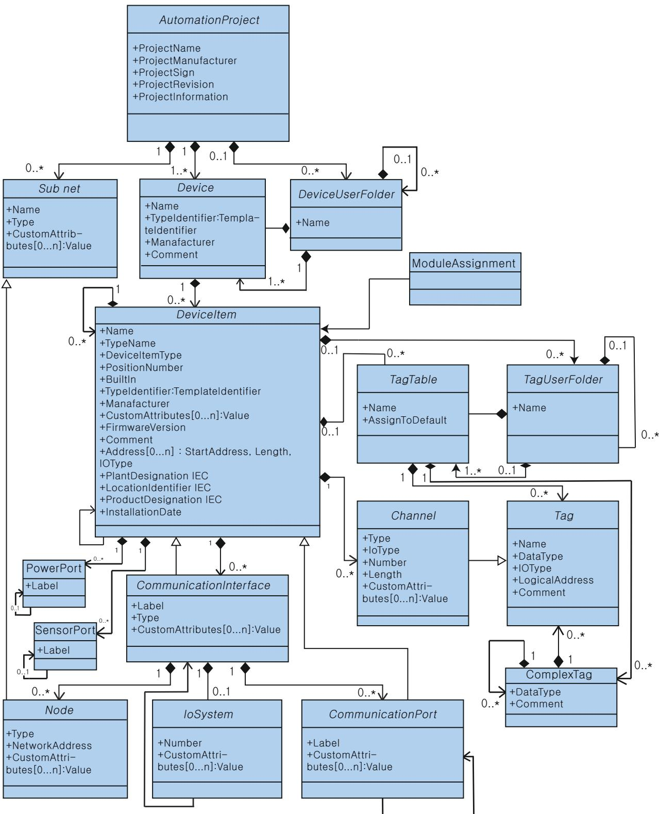

### 6.5.4 用于导入/导出的 CAx 数据的结构

导出文件的基本结构
以 AML 格式生成导出文件。AML 文件以文档信息为开始。
导出文件由以下两部分组成：
• 更多信息
本节包括有关编写工具、参考文档版本（定义 AML 文件内容的文档）等的信息。
下面的 XML 描述了具有最新 AR APC 建议的 AML 文件，该文件对应于 TIA Portal V19 导出的文件信息，而此文件信息显示 <AddtionalInformation> 部分。
```xml
<?xml version="1.0" encoding="utf-8"?>
<CAEXFile xmlns:xsi="http://www.w3.org/2001/XMLSchema-instance" FileName="Project82.aml" SchemaVersion="2.15" xsi:noNamespaceSchemaLocation="CAEX_ClassModel_V2.15.xsd">
<AdditionalInformation>
<WriterHeader>
<WriterName>Totally Integrated Automation Portal</WriterName>
<WriterID>1d4fcebb-1ad6-4881-b01d-bca335d94a46:V1.0</WriterID>
<WriterVendor>Siemens AG</WriterVendor>
<WriterVendorURL>www.siemens.com</WriterVendorURL>
<WriterVersion>19</WriterVersion>
<WriterRelease>1900.0000.0.0</WriterRelease>
<LastWritingDateTime>2023-07-19T04:21:32.9174411Z</LastWritingDateTime>
</WriterHeader>
</AdditionalInformation>
<AdditionalInformation AutomationMLVersion="2.0" />
<AdditionalInformation DocumentVersions="Recommendations">
<Document DocumentIdentifier="AR APC" Version="1.4.0" />
</AdditionalInformation>
...
...
</CAEXFile>
```
说明
CAx 应根据已安装的 TIA Portal 版本导出和导入相应 AR APC 版本的 AML 文件。

## 6.5 导入/导出硬件数据


### • 实例层级

本部分包含所导出内部元素的层级序列。
```xml
<InstanceHierarchy Name="APC Sample Instance Hierarchy">
    <InternalElement ID="d4dc896a-f4a5-41b6-9c48-8d3a0a5a4343" Name="CAx_asterisk_AML_03_V14">
    <Attribute Name="ProjectManufacturer" AttributeDataType="xs:string" />
    <Attribute Name="ProjectSign" AttributeDataType="xs:string" />
    <Attribute Name="ProjectRevision" AttributeDataType="xs:string" />
    <Attribute Name="ProjectInformation" AttributeDataType="xs:string" />
    <InternalElement ID="544f3a69-5f65-45ba-ac2f-1448db9493fd" Name="PN/IE_1">
    ...
    </InternalElement>
    <InternalElement ID="12116ac0-94b7-49d2-888d-7d39bbc0caf5" Name="S71500/ET200MP station_1">
    ...
    </InternalElement>
    <SupportedRoleClass RefRoleClassPath=
    "AutomationProjectConfigurationRoleClassLib/AutomationProject" />
    <InternalLink Name="Link To Port_1" RefPartnerSideA=
    "726148ce-de5b-4728-8886-4ba273435479:CommunicationPortInterface" RefPartnerSideB=
    "cb9d24f3-8200-4c89-9b40-24ae850e293e:CommunicationPortInterface" />
    <InternalLink Name="Link To Port_2" RefPartnerSideA=
    "cb9d24f3-8200-4c89-9b40-24ae850e293e:CommunicationPortInterface" RefPartnerSideB=
    "726148ce-de5b-4728-8886-4ba273435479:CommunicationPortInterface" />
    .....
    <InternalLink Name="Link To IoSystem_3" RefPartnerSideA=
    "d8f6e006-3778-4a05-aab1-df844fe822fe:LogicalEndPoint_Interface" RefPartnerSideB=
    "2344b7af-329c-4215-92d1-6143b4627b56:LogicalEndPoint_IoSystem" />
    </InternalElement>
    </InstanceHierarchy>
</CAEXFile>
```

### 内部元素

AML 文件实例层级中的所有对象均为 InternalElements。内部元素
AutomationProject 包含所有角色类别的所有内部元素。每个内部元素都支持一系列属性。
属性 <TypeIdentifier> 识别每个可通过 TIA Portal Openness 创建的硬件对象的对象类型。

### 自动创建的对象

自动创建的对象只能由其它对象进行创建。这些对象没有属性或类型标识符。这些对象包含在所导出的文件中，但无法触发对特定自动创建对象的导出操作。
在内部元素的 AML 元素末尾，定义以下内容：

### • 角色类别

SupportedRoleClass 元素定义内部元素的对象类型。在用于将标准 AML 映射到 TIAPortal Openness 和 TIA Portal 的对象模型的角色类别库中定义对象类型。
```html
InternalElement ID="1d1a37ed-19d9-4a23-bc91-51f5a8e0244b" Name="Ungrouped devices">
    <InternalElement ID="ab193f5d-0375-4a6d-a576-a903e2b77cca" Name="ET 200SP station_1">
    ...
    <InternalElement ID="72d41729-90a7-4de3-9708-a8eeda6b1886" Name="IO device_1">
    ...
    <SupportedRoleClass RefRoleClassPath=" AutomationProjectConfigurationRoleClassLib/DeviceItem" />
    </InternalElement>
    ...
    <SupportedRoleClass RefRoleClassPath=
    "AutomationProjectConfigurationRoleClassLib/Device" />
    </InternalElement>
    <SupportedRoleClass RefRoleClassPath=
    "AutomationProjectConfigurationRoleClassLib/DeviceUserFolder" />
    </InternalElement>
...
```
• 内部连接元素 InternalLink 定义连接的通信伙伴。
```xml
<InstanceHierarchy Name="APC Sample Instance Hierarchy">
    <InternalElement ID="d4dc896a-f4a5-41b6-9c48-8d3a0a5a4343" Name="CAx_asterisk_AML_03_V14">
    <Attribute Name="ProjectManufacturer" AttributeDataType="xs:string" />
    <Attribute Name="ProjectSign" AttributeDataType="xs:string" />
    <Attribute Name="ProjectRevision" AttributeDataType="xs:string" />
    <Attribute Name="ProjectInformation" AttributeDataType="xs:string" />
    ...
    <SupportedRoleClass RefRoleClassPath=
    "AutomationProjectConfigurationRoleClassLib/AutomationProject" />
    <InternalLink Name="Link To Port_1" RefPartnerSideA=
    "726148ce-de5b-4728-8886-4ba273435479:CommunicationPortInterface" RefPartnerSideB=
    "cb9d24f3-8200-4c89-9b40-24ae850e293e:CommunicationPortInterface" />
    <InternalLink Name="Link To Port_2" RefPartnerSideA=
    "cb9d24f3-8200-4c89-9b40-24ae850e293e:CommunicationPortInterface" RefPartnerSideB=
    "726148ce-de5b-4728-8886-4ba273435479:CommunicationPortInterface" />
    <InternalLink Name="Link To Port_3" RefPartnerSideA=
    "65307e3e-95fd-41ac-9982-e5e4ffc2fb15:CommunicationPortInterface" RefPartnerSideB=
    "58b1a3f2-f94b-48d1-ab5e-fbc4857cdfbc:CommunicationPortInterface" />
    <InternalLink Name="Link To Port_4" RefPartnerSideA=
    "58b1a3f2-f94b-48d1-ab5e-fbc4857cdfbc:CommunicationPortInterface" RefPartnerSideB=
    "65307e3e-95fd-41ac-9982-e5e4ffc2fb15:CommunicationPortInterface" />
    ...
    </InternalElement>
</InstanceHierarchy>
</CAEXFile>
```
属性被分配至内部元素，如下所示：
```xml
<InternalElement ID="1d1a37ed-19d9-4a23-bc91-51f5a8e0244b" Name="Ungrouped devices">
    <InternalElement ID="ab193f5d-0375-4a6d-a576-a903e2b77cca" Name="ET 200SP station_1">
    <Attribute Name="TypeIdentifier" AttributeDataType="xs:string">
    <Value>System:Device.ET200SP</Value>
    </Attribute>
    <InternalElement ID="7636c362-a7af-47bb-8a18-e6428a6d61ff" Name="Rack_0">
    <Attribute Name="TypeName" AttributeDataType="xs:string">
    <Value>Rack</Value>
    </Attribute>
    <Attribute Name="PositionNumber" AttributeDataType="xs:int">
    <Value>0</Value>
    </Attribute>
    <Attribute Name="BuiltIn" AttributeDataType="xs:boolean">
    <Value>False</Value>
    </Attribute>
    <Attribute Name="TypeIdentifier" AttributeDataType="xs:string">
    <Value>System:Rack.ET200SP</Value>
    </Attribute>
    ...
    <SupportedRoleClass RefRoleClassPath=
    "AutomationProjectConfigurationRoleClassLib/DeviceItem" />
    </InternalElement>
    <SupportedRoleClass RefRoleClassPath=
    "AutomationProjectConfigurationRoleClassLib/DeviceUserFolder" />
    </InternalElement>
    <SupportedRoleClass RefRoleClassPath=
    "AutomationProjectConfigurationRoleClassLib/DeviceUserFolder" />
    <InternalLink Name="Link To Port_1" RefPartnerSideA=
    "5758e2ff-3974-41e9-8bcc-b61a23f1bb58:CommunicationPortInterface"
    RefPartnerSideB="46683602-5129-4504-a9d1-48e6421e2cf0:CommunicationPortInterface" />
    ...
</InternalElement>
```

### 属性的处理模式

每个属性都将单独定义属性的处理方式，如下所示：
• 忽略
该属性在导入时会被忽略，且未处于导出文件中。

### • 必选项

该属性必须位于导入文件中，且不能在导出文件中删除。

### • 可选项

如果该属性在导入文件中丢失，则会指定属性的默认值。如果该属性对某个对象不适用（例如，并非所有模块均配有 FirmwareVersion），则该属性会在导出文件中丢失。
• 仅导出
该属性值由 TIA Portal 在内部确定（例如，设备项的类型名称）。如果导入文件中存在该属性，则在导入期间会被 TIA Portal 忽略。
• 仅导入
该属性会影响导入行为。如果该属性在导入文件中丢失，则相关行为将与属性的标准值相关。
AML 类型标识符 (页 1643)

### 6.5.5 AML 类型标识符

TypeIdentifier 字符串包含多个部分：
• <TypeIdentifierType>:<Identifier>
支持以下 TypeIdentifierType 值：
• OrderNumber 用于指定物理模块
• GSD 用于指定基于 GSD/GSDML 的设备
• System用于指定系统和通用设备

#### Type identifier type：OrderNumber

OrderNumber 为硬件目录中所有模块的通用类型标识符（GSD 除外）。AML 类型标识符并非始终与 TIA Portal Openness 类型标识符相同。AML 类型标识符中不
含 FirmwareVersion 信息。有关固件版本的信息将在一个单独的 AML 属性
“FirmwareVersion”中进行处理。
TypeIdentifierType 的格式如下所示：
```html
- <OrderNumber>
示例：OrderNumber:3RK1 200-0CE00-0AA2
```

#### 订货号中的通配符

硬件目录中存在几个订货号包含“通配符”字符的模块，这类字符用于表示实际硬件的特定集群，例如不同长度的 S7-300 机架。
对于这种情况，可使用特定OrderNumber和“通配符”OrderNumber创建硬件对象的实例。不过，不能将通配符通用于任意位置。示例：可通过以下方式创建 S7-300 机架：
```batch
OrderNumber:6ES7 390-1***0-0AA0
```
或者
OrderNumber:6ES7 390-1AE80-0AA0
请注意，不能对实例使用以下结构：
```batch
OrderNumber:6ES7 390-1AE80-0A*0
```
读取类型标识符时返回的值始终是硬件目录中的订货号。
示例：读取 OrderNumber:6ES7 390-1AE80-0AA0 将返回 OrderNumber:6ES7390-1\*\*\*0-0AA0

#### Type identifier type：GSD

基于 GSD 和 GSDML 的设备类型标识符为 TypeIdentifier = GSD:<Identifier>
该标识符由以下元素组成
• GsdName：GSD 或 GSDML 的名称（大写字母）
• GsdType：可以为：
– D：设备
– R：机架
– DAP：前端模块
– M：模块
– SM：子模块
• GsdId：GSD/GSDML 的 ID 编号
CAx 导入/导出支持以下格式的类型标识符：
```txt
- GSD.<GsdName>/<GsdType>
示例：
GSD: SIEM8139.GSD/DAP
GSD: GSDML-V2.31-SIEMENS-SINAMICS_DCP-20140313.XML/D
```
```txt
- <GsdName>/<GsdType>/<GsdId>
示例：
GSD: SIEM8139.GSD/M/4
GSD: GSDML-V2.31-SIEMENS-SINAMICS_G110M-20140704.XML/M/
IDM_DRIVE_47
```

#### Type identifier type：System

System. 为不能通过其它任何标识符确定的对象的标识符。此 TypeIdentifierType 的格式如下：
• <SystemTypeIdentifier>示例：
System:Device.S7300
System:Subnet.Ethernet
• <SystemTypeIdentifier>/<AdditionalTypeIdentifier>SystemTypeIdentifier 不唯一时，需要 AdditionalTypeIdentifier。对于某些对象类型，SystemTypeIdentifier 具有前缀：
Subnet.
Device.
Rack.
示例：System:Rack.S71600/Large
通过OrderNumber 标识符识别包含订货号的机架。
如果要确定一个类型标识符，则可在 TIA Portal 中执行以下查询操作：
1. 在“选项 > 设置 > 硬件配置 > 显示类型标识符”(Options > Settings > Hardware configuration> Display of the type identifier) 中，启用设置“显示设备和模块的类型标识符”(Enable displayof the type identifier for devices and modules)。
2. 打开“设备与网络”(Devices & Networks) 编辑器。
3. 在产品目录中选择一个设备。
“类型标识符”将显示在“信息”(Information) 窗口中。
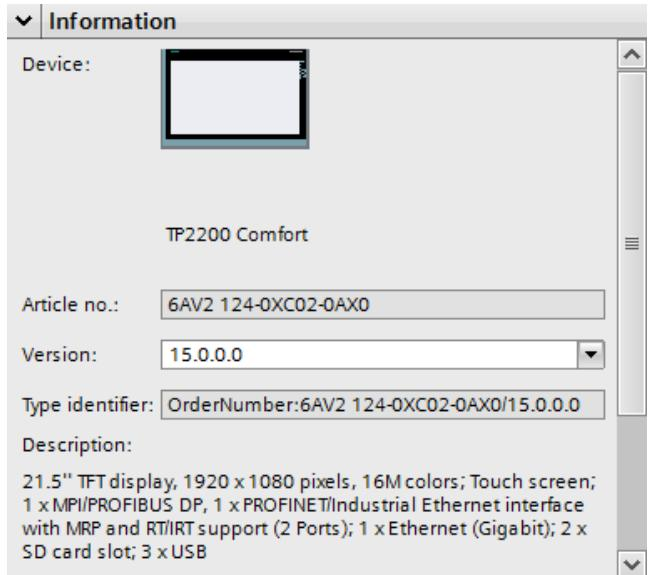

### 6.5.6 通过 AML 导出/导入基本单元信息

• TIA Portal Openness 应用程序已连接到 TIA Portal。 请[连接到 TIA Portal](#连接到-TIA-Portal)”
• 项目已经打开。
[打开项目](#打开项目)”
• PLC 处于离线状态
在 TIA Portal 中，用户可以导出和导入基本单元信息，以便与 EPLAN 等其他工具交换信息。
在 TIA Portal 项目中导出和导入期间，支持两种类型的基本单元：
• 单基本单元
• 双基本单元

#### 导出基本单元

例如，在 TIA Portal 中使用基本单元信息组态的模块 CAx 会将基本单元信息导出为 AML 文件中某个模块下的“子模块”。
基本单元子模块导出时始终包含：
• PositionNumber：0
• DeviceItemType：附件
• BuiltIn：False
• TypeIdentifier：“基本单元的类型 ID”
• ID：总是随机生成 GUID

#### 导出单基本单元

以下示例展示了使用 TIA Portal 中单基本单元组态的 DI 模块的 AML 文件
```html
<InternalElement ID="6f76c890-5c5d-41c4-9ade-96543b0222ac" Name="DI 8x24VDC ST_1">
...
<InternalElement ID="69233c1f-7ef7-4999-8e84-691d0ff3a210" Name="BaseUnit">
<Attribute Name="DeviceItemType" AttributeDataType="xs:string">
<Value>Accessory</Value>
</Attribute>
<Attribute Name="PositionNumber" AttributeDataType="xs:int">
<Value>0</Value>
</Attribute>
<Attribute Name="BuiltIn" AttributeDataType="xs:boolean">
<Value>false</Value>
</Attribute>
<Attribute Name="TypeIdentifier" AttributeDataType="xs:string">
<Value>OrderNumber:6ES7 193-6BP00-0DA0</Value>
</Attribute>
<SupportedRoleClass RefRoleClassPath="AutomationProjectConfigurationRoleClassLib/DeviceItem" />
</InternalElement>
...
```

#### 导出双基本单元

以下示例展示了使用 TIA Portal 中双基本单元组态的两个 DI 模块的 AML 文件例如，为基本单元组态的第一个模块前缀为“IX300”，为同一双基本单元组态的第二个模块前缀为“IX301”。
导出期间，仅使用包含 IX300 后缀的基本单元组态的第一个模块应该与 AML 文件中的基本单元子模块一起导出。使用 IX301 组态的第二个模块不应与其下的任何子模块一起引入。
```html
<InternalElement ID="6f76c890-5c5d-41c4-9ade-96543b0222ac" Name="DI 8x24VDC ST_1">
...
<InternalElement ID="3a1bee8a-12d0-4ec4-849c-333d45113d9c" Name="BaseUnit">
<Attribute Name="DeviceItemType" AttributeDataType="xs:string">
<Value>Accessory</Value>
</Attribute>
<Attribute Name="PositionNumber" AttributeDataType="xs:int">
<Value>0</Value>
</Attribute>
<Attribute Name="BuiltIn" AttributeDataType="xs:boolean">
<Value>false</Value>
</Attribute>
<Attribute Name="TypeIdentifier" AttributeDataType="xs:string">
<Value>OrderNumber:6ES7 193-6BP60-0DA0</Value>
</Attribute>
<SupportedRoleClass RefRoleClassPath="AutomationProjectConfigurationRoleClassLib/DeviceItem" />
</InternalElement>
...
<InternalElement ID="5f843491-b053-4dc8-b879-9ac327ee2a7e" Name="DI 8x24VDC ST_2">
...
<InternalElement ID="55c30280-6f8a-4c37-9b2d-41bb90941258" Name="DI 8x24VDC ST_2">
<Attribute Name="PositionNumber" AttributeDataType="xs:int">
<Value>1</Value>
</Attribute>
<Attribute Name="BuiltIn" AttributeDataType="xs:boolean">
<Value>true</Value>
</Attribute>
...
```

#### 导入基本单元

应该可以导入在 AML 文件中使用基本单元子模块组态的模块。
导入基本单元期间，
• GUID、PositionNumber、BuiltIn 和 DeviceItem 没有相关性，因此不会显示在 TIA Portal中
• 如果在 AML 文件中存在的任何非预期模块具有基本单元子模块，则不会为其返回“BaseUnit”属性。因此，CAx 将在日志文件中针对此问题显示相应警告。
• CAx 不会验证 AML 文件中基本单元 MLFB 的“正确性”（除非用其识别是单 BU 还是双BU）。CAx 将尝试通过 Openness 设置基本单元的 MLFB。如果 Openness 中发生错误，将显示相应错误。
• 通过将信息导入 TIA Portal 可成功导入包含/不包含任何 BaseUnit 信息的早期版本 AML 文件。

#### 导入单基本单元

导入单基本单元期间，仅载有 AML 文件中基本单元子模块的模块将与 TIA Portal 中的基本单元信息一起导入。
单基本单元将通过 AML 文件中的 TypeIdentifier 以如下所示特定模式进行识别：
OrderNumber:xxxx 193-6[B|U|T]xYx-xxxx，其中 Y 值（第 11 个位置处）的取值范围可介于0 到 5 之间。

#### 导入双基本单元：

导入双基本单元期间，两个模块（相邻）将与 TIA Portal 中的基本单元信息一起显示。在 AML文件中使用双基本单元子模块组态的第一个模块通过将前缀“|X300”附加至基本单元 MLFB 的方式与双基本单元一起导入。第二个模块下没有任何基本单元子模块，它会通过将前缀“|X301”附加至基本单元 MLFB 的方式与同一双基本单元一起导入。双基本单元将通过 AML 文件中的TypeIdentifier 以如下所示特定模式进行识别：
OrderNumber:xxxx 193-6[B|U|T]x6x-xxxx
连接到 TIA Portal (页 90)
打开项目 (页 140)

### 6.5.7 通过扩展机架连接导出/导入 AML

• TIA Portal Openness 应用程序已连接到 TIA Portal 请[连接到 TIA Portal](#连接到-TIA-Portal)”
• 已打开一个项目
请[打开项目](#打开项目)”
在 TIA Portal 中，可将设备及包含扩展机架连接的多个机架导出到一个 AML 文件，然后将其重新导入，以便获取在 TIA Portal 项目中创建的相同设备组态。
示例：带有多个机架的设备配备了扩展机架连接系统  
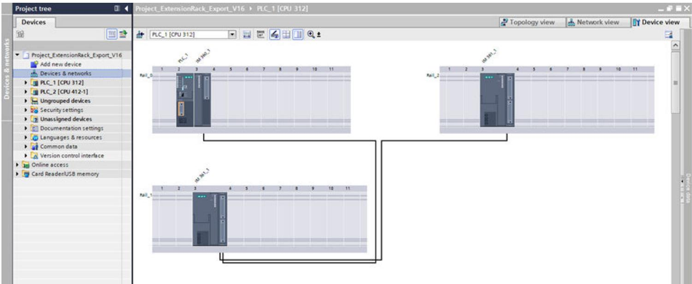

#### AML 结构

在 TIA Portal 中，多个机架之间的扩展机架连接系统直接在发送方和接收方（两者均为DeviceItem 对象）下建立模块。但是，依照 AR APC 建议，这些连接系统将被模块化为CommunicationPort 下的端口到端口连接。具有空 CommunicationPort 对象的空CommunicationInterface 将被添加到 IM 模块下，以便与建议接口内联。
以下示例显示了所导出 AML 文件中的部分元素结构的上述设备组态：
<InternalElement ID="1ddb8d5c-d6cc-42c9-b1d8-621219b139f6" Name="RackExtension"> <Attribute Name="Type" AttributeDataType="xs:string"> <Value>ExtensionRack</Value> </Attribute> ... <InternalElement ID="f25e531a-1793-4896-ade5-a87bd98de06e" Name="IM 46x SenderPort\_1"> <Attribute Name="Label" AttributeDataType="xs:string"> <Value>X1</Value> </Attribute> <Attribute Name="PositionNumber" AttributeDataType="xs:int"> <Value>1</Value> </Attribute> <Attribute Name="BuiltIn" AttributeDataType="xs:boolean"> <Value>true</Value> </Attribute> <ExternalInterface ID="9a824a06-89b9-4ba8-bee0-83c89b1f5e53" Name="CommunicationPortInterface" RefBaseClassPath="AutomationProjectConfigurationInterfaceClassLib/ CommunicationPortInterface" /> <SupportedRoleClass RefRoleClassPath="AutomationProjectConfigurationRoleClassLib/ CommunicationPort" /> </InternalElement> <SupportedRoleClass RefRoleClassPath="AutomationProjectConfigurationRoleClassLib/ CommunicationInterface" /> </InternalElement> <InternalElement ID="d841278f-558a-41ab-9f03-91eeb454dc6b" Name="RackExtension"> <Attribute Name="Type" AttributeDataType="xs:string"> <Value>ExtensionRack</Value> </Attribute> <InternalElement ID="2e1ff3b2-8a3e-4d5b-a95c-3ed027287db9" Name="IM 46x ReceiverPort\_1"> <Attribute Name="Label" AttributeDataType="xs:string"> <Value>X1</Value> </Attribute> <Attribute Name="PositionNumber" AttributeDataType="xs:int"> <Value>1</Value> </Attribute> <Attribute Name="BuiltIn" AttributeDataType="xs:boolean"> <Value>true</Value> </Attribute> <ExternalInterface ID="98460c75-a05d-4c23-8f88-33878ccd79c5" Name="CommunicationPortInterface" RefBaseClassPath="AutomationProjectConfigurationInterfaceClassLib/ CommunicationPortInterface" /> <SupportedRoleClass RefRoleClassPath="AutomationProjectConfigurationRoleClassLib/ CommunicationPort" /> </InternalElement> <InternalElement ID="7615a32e-09dc-4171-88ed-118026357bae" Name="IM 46x SenderPort\_1"> <Attribute Name="Label" AttributeDataType="xs:string">
```xml
<Value>X2</Value>
</Attribute>
<Attribute Name="PositionNumber" AttributeDataType="xs:int">
<Value>2</Value>
</Attribute>
<Attribute Name="BuiltIn" AttributeDataType="xs:boolean">
<Value>true</Value>
</Attribute>
<ExternalInterface ID="846093a9-6473-4946-acf4-95a7813924df"
Name="CommunicationPortInterface"
RefBaseClassPath="AutomationProjectConfigurationInterfaceClassLib/
CommunicationPortInterface" />
<SupportedRoleClass RefRoleClassPath="AutomationProjectConfigurationRoleClassLib/
CommunicationPort" />
</InternalElement>
<SupportedRoleClass RefRoleClassPath="AutomationProjectConfigurationRoleClassLib/
CommunicationInterface" />
</InternalElement>
...
<InternalElement ID="f4eb31c6-41d4-4a6e-ac33-de9c054a8c74" Name="RackExtension">
<Attribute Name="Type" AttributeDataType="xs:string">
<Value>ExtensionRack</Value>
</Attribute>
...
<InternalElement ID="c11d2227-91db-41ae-9d94-d822e3ab9c7a" Name="IM 46x ReceiverPort_1">
<Attribute Name="Label" AttributeDataType="xs:string">
<Value>X1</Value>
</Attribute>
<Attribute Name="PositionNumber" AttributeDataType="xs:int">
<Value>1</Value>
</Attribute>
<Attribute Name="BuiltIn" AttributeDataType="xs:boolean">
<Value>true</Value>
</Attribute>
<ExternalInterface ID="a9b2cce1-7078-4347-b5f2-428da1ad5326"
Name="CommunicationPortInterface"
RefBaseClassPath="AutomationProjectConfigurationInterfaceClassLib/
CommunicationPortInterface" />
<SupportedRoleClass RefRoleClassPath="AutomationProjectConfigurationRoleClassLib/
CommunicationPort" />
</InternalElement>
<SupportedRoleClass RefRoleClassPath="AutomationProjectConfigurationRoleClassLib/
CommunicationInterface" />
</InternalElement>
...
<InternalLink Name="Link To Port_1" RefPartnerSideA="f25e531a-1793-4896-ade5-a87bd98de06e:CommunicationPortInterface" RefPartnerSideB="2e1ff3b2-8a3e-4d5b-a95c-3ed027287db9:CommunicationPortInterface" />
<InternalLink Name="Link To Port_2"
RefPartnerSideA="7615a32e-09dc-4171-88ed-118026357bae:CommunicationPortInterface"
RefPartnerSideB="c11d2227-91db-41ae-9d94-d822e3ab9c7a:CommunicationPortInterface" />
```
Openness：用于工程组态工作流自动化的 API系统手册, 11/2023
只有扩展机架连接系统存在的情况下，才能导出扩展机架接口。此外，ExtensionRack 空接口下添加的空端口数取决于参与模块级扩展机架连接系统的端口数。在上述示例中，“IM460-0\_1”模块支持两个端口（IM 46x SenderPort\_1 和 IM 46x SenderPort\_2）。但是，仅一个端口在 TIA Portal 中进行了连接组态。因此，导出的 AML 文件在扩展机架接口下将只包含一个端口。

#### 扩展机架连接

多个机架之间扩展机架连接的 XML 表示将使用以下所示格式完成。

#### ExternalInterface-

<ExternalInterface> 内部元素应该添加到参与连接的 <CommunicationPort> 内部元素下
```xml
<InternalElement ID="[IM Module Unique ID]" Name="[IM Module Name]">
...
<InternalElement ID="[Dummy Interface Unique ID]" Name="RackExtension">
<Attribute Name="Type" AttributeDataType="xs:string">
<Value>ExtensionRack</Value>
</Attribute>
...
<InternalElement ID="[Dummy Port Unique ID]" Name="[IM Module Sender/Receiver Name]">
...
<ExternalInterface ID="[External Interface Unique ID]" Name="CommunicationPortInterface" RefBaseClassPath="AutomationProjectConfigurationInterfaceClassLib/CommunicationPortInterface" />
<SupportedRoleClass RefRoleClassPath="AutomationProjectConfigurationRoleClassLib/CommunicationPort" />
</InternalElement>
<InternalElement ID="[Dummy Port Unique ID]" Name="[IM Module Sender/Receiver Name]">
...
<ExternalInterface ID="[External Interface Unique ID]" Name="CommunicationPortInterface" RefBaseClassPath="AutomationProjectConfigurationInterfaceClassLib/CommunicationPortInterface" />
<SupportedRoleClass RefRoleClassPath="AutomationProjectConfigurationRoleClassLib/CommunicationPort" />
</InternalElement>
<SupportedRoleClass RefRoleClassPath="AutomationProjectConfigurationRoleClassLib/CommunicationInterface" />
</InternalElement>
<SupportedRoleClass RefRoleClassPath="AutomationProjectConfigurationRoleClassLib/DeviceItem" />
</InternalElement>
```

#### 内部连接

扩展机架连接使用 <InternalLink> 变量表示。<InternalLink> 变量应该添加到多个机架（即设备）的共同父设备下。内部连接名称在公共父项中是唯一的。
```txt
<InternalLink Name="Link To [Internal link Name]" RefPartnerSideA="[Communication Port UniqueID]:[Communication Port External Interface Name]" RefPartnerSideB="[Communication Port UniqueID]:[Communication Port External Interface Name]" />
```

### 6.5.8 导出/导入具有 GSD/GSDML 自定义属性的 AML 文件

• TIA Portal Openness 应用程序已连接到 TIA Portal 请[连接到 TIA Portal](#连接到-TIA-Portal)”
• 已打开一个项目
请[打开项目](#打开项目)”
自定义属性通常允许交换某些设备或模块特有，但基于 AutomationML 的规范未涵盖的数据。在 TIA Portal 中，所有类型的模块（例如 GSD、GSDML、非 GSD/GSDML 模块）都支持自定义属性。仅可
通过自定义属性交换模块的附加数据，而不能交换端口、接口、节点等处的附加数据。自定义属性在 AR APC 中定义为未排序的名称值对列表。
有关非 GSD/GSDML 自定义属性的信息，请[导出/导入具有非 GSD/GSDML 自定义属性的 AML 文件](#导出导入具有非-GSDGSDML-自定义属性的-AML-文件)”
此处给出了 AML 结构：
```xml
<Attribute Name="CustomAttributes">
<RefSemantic CorrespondingAttributePath="ListType" />
<Attribute Name="AttributeName1" AttributeDataType="xs:string">
<Value>AttributeValue1</Value>
</Attribute>
<Attribute Name="AttributeName2" AttributeDataType="xs:string">
<Value>AttributeValue2</Value>
</Attribute>
</Attribute>
```
GSD/GSDML 模块不支持在 TIA Portal 中进行通道组态。因此，不支持通过 AML 导出/导入可用的通道自定义属性。
为了在 TIA Portal 中正确标识自定义属性，自定义属性的名称必须符合以下定义：
自定义属性名称由 <name>、<attribute\_location>、<value\_location> 三部分组成。
• <name> 是一个仅包含字母、数字、“\_”和“.”的字符串。“name”通常是位于 GSD/GSDML文件中的属性名称。它是参数数据集中属性的可选部分，其它情况下是必需的。
• <attribute\_location>定义属性所在的设备项。如果属性未直接位于模块中，需要使用此部分来标识属性位置。此部分的格式为 #<subslotnumber>#<subsubslotnumber>。也就是说，如果属性位于模块中，<attribute\_location> 为空，如果属性位于子模块中，其格式为“#<subslotnumber>”，如果属性位于子模块的下级模块中，其值为“#<subslotnumber>#<subsubslotnumber>”。
• <value location>定义如何访问设备项中的属性。如果该值是参数数据集的一部分，则通过以下五个方面标识：
– DatasetNumber：设备项中的数据集数：
– ByteOfset：参数数据集中数值的起始字节位置（从 0 开始）。
– Length：数据集的总长度（以字节为单位）。
– BitOfset：数值在其起始字节中的起始位位置（从 0 开始）。
– BitLength：数值的完整长度（单位为位）
自定义属性的完整示例：
```xml
<Attribute name = "CustomAttribute">
<RefSemantic CorrespondingAttributePath="ListType"/>
<Attribute Name="IDTP_No_Unit_DIAG#0-1-0-2-7-1" AttributeDataType="xs:string">
<Value>1<Value>
</Attribute>
<Attribute Name="IDTP_LANG#0-1-1-2-0-4" AttributeDataType="xs:string">
<Value>89<Value>
<Attribute Name="IDTP_D_FREEZE#0-1-1-2-7-1" AttributeDataType="xs:string">
<Value>1<Value>
</Attribute>
</Attribute>
```
在某些（罕见）情况下，GSD/GSDML 中的属性是明确建模的（不属于参数数据集的一部分）。此时，会通过属性名称访问值。
导出时，TIA Portal 始终会导出完整数据集，以使伙伴应用程序对所包含的数据具有完全访问权限
```xml
<Attribute name = "CustomAttribute">
<RefSemantic CorrespondingAttributePath="ListType"/>
<Attribute Name="PrmData#0-1-0-2-0-16" AttributeDataType="xs:string">
<Value>128, 0<Value>
</Attribute>
</Attribute>
```

#### 导出/导入具有 PRM 数据自定义属性的 AML 文件

对于 TIA Portal V17，应可通过 CAx 导出和导入交换 GSD/GSDML 模块的参数数据。在 AML文件中，该参数数据应表示为自定义属性。
以下代码片段显示了通过可插拔模块发现 AML 文件的情况下，AML 文件中的 PrmData 预期应采用的格式。
```xml
<InternalElement ID="049f1260-7c97-458e-84bd-12682f943f19" Name="Slave_1">
<Attribute Name="BuiltIn" AttributeDataType="xs:boolean">
<Value>false</Value>
</Attribute>
<Attribute Name="TypeIdentifier" AttributeDataType="xs:string"> <Value>GSD:SI018098.GSD/DAP</Value>
</Attribute>
<Attribute Name="CustomAttributes">
<RefSemantic CorrespondingAttributePath="ListType" />
<Attribute Name="PrmData-0-0-39-0-312" AttributeDataType="xs:string">
<Value>39,129,0,0,28,0,128,15,255,255,255,255,255,255,255,255,255,255,255,255,255,255,255,255,255,255,255,255,255,255,255,255,255,2
Value>
</Attribute>
</Attribute>
<SupportedRoleClass RefRoleClassPath="AutomationProjectConfigurationRoleClassLib/CommunicationInterface" />
</InternalElement>
```
以下代码片段显示了 PrmData 在 TIA Portal 中通过内置子模块提供，但在 AML 文件中通过可插拔父模块提供的情况下，PrmData 采用的格式。
```xml
<InternalElement ID="8fb83cae-ae30-45d2-9d4c-6db1154af02d" Name="IE-AS-i-LINK">
... 
<Attribute Name="CustomAttributes">
<RefSemantic CorrespondingAttributePath="ListType" />
<Attribute Name="PrmData#0-130-0-4-0-32" AttributeDataType="xs:string">
<Value>0,0,131,0</Value>
</Attribute>
</Attribute>
<InternalElement ID="574a55bb-1209-4672-86bd-01ee9085eaf6" Name="DAP 1">
<Attribute Name="PositionNumber" AttributeDataType="xs:int">
<Value>0</Value>
</Attribute>
<Attribute Name="BuiltIn" AttributeDataType="xs:boolean">
<Value>true</Value>
</Attribute>
<SupportedRoleClass RefRoleClassPath="AutomationProjectConfigurationRoleClassLib/DeviceItem" />
</InternalElement>
<SupportedRoleClass RefRoleClassPath="AutomationProjectConfigurationRoleClassLib/DeviceItem" />
</InternalElement>
```
• 在以上代码片段中，自定义属性名称“PrmData#0-130-0-4-0-32”的含义如下：
– PrmData#0：属性名称以及包含该属性的子模块的位置号
– 130：数据集编号：
– 0：字节偏移量
– 4：数据集长度（以字节为单位）
– 0：位偏移
– 32：位长度
• AML 文件中的自定义属性绝不应出现在任何内置模块中（直接放置在机架下方的内置模块除外）。
• 如果 GSD/GSDML 内置模块具有 PrmData，则应根据情况通过即时可插拔父模块或直接位于机架正下方的内置父模块导出自定义属性。
• 对于已删减的文件（从 E-plan 中导出的文件），作为自定义属性实际所有者的内置子模块不应存在于 AML 文件中。
以下情况下，CAx 应支持通过 GSD/GSDML 模块导入 PrmData 自定义属性：
• 提供的可插拔 GSD/GSDML 模块具有自定义属性。
• 文件对内置子模块进行了删减，且自定义属性是通过合适的可插拔父模块提供的。
• 文件未删减，具有内置子模块，且自定义属性是通过合适的可插拔父模块提供的。
此外，还应支持通过 CAx 导入作为单独属性提供，而不是作为完整 PrmDataset 提供的自定义属性。这种格式类型预期来自 Eplan 导出文件。

#### 以下代码片段给出了此类示例。

```xml
<InternalElement ID="1cf85c26-cc2a-4413-b91b-e4b55e183762" Name="Slave_1">
...
<Attribute Name="CustomAttributes">
<RefSemantic CorrespondingAttributePath="ListType" />
<Attribute Name="PSR-0-4-26-0-1" AttributeDataType="xs:string">
<Value>1</Value>
</Attribute>
<Attribute Name="C4F-0-4-26-1-1" AttributeDataType="xs:string">
<Value>1</Value>
</Attribute>
<Attribute Name="GPC-0-4-26-2-1" AttributeDataType="xs:string">
<Value>1</Value>
</Attribute>
<Attribute Name="SFC-0-4-26-3-1" AttributeDataType="xs:string">
<Value>1</Value>
</Attribute>
<Attribute Name="ACC-0-4-26-4-1" AttributeDataType="xs:string">
<Value>1</Value>
</Attribute>
<Attribute Name="CMV3.1-0-4-26-5-1" AttributeDataType="xs:string">
<Value>1</Value>
</Attribute>
<Attribute Name="MUPR-0-5-26-0-32" AttributeDataType="xs:string">
<Value>0,0,31,64</Value>
</Attribute>
<Attribute Name="TMR-0-9-26-0-32" AttributeDataType="xs:string">
<Value>7,255,225,236</Value>
</Attribute>
<Attribute Name="TSOLF-0-13-26-0-8" AttributeDataType="xs:string">
<Value>100</Value>
</Attribute>
<Attribute Name="PP-0-25-26-0-8" AttributeDataType="xs:string">
<Value>2</Value>
</Attribute>
</SupportedRoleClass RefRoleClassPath="AutomationProjectConfigurationRoleClassLib/DeviceItem" />
</InternalElement>
```
在上例中，所有单独的自定义属性均从属于数据集编号 0。但这些自定义属性尝试更改不同字节和位的值。
• CAx 导入应支持为自定义属性值采用整型和十六进制格式（例如 0x67），但一次只能为给定的属性使用一种格式。

#### 导出/导入具有非 PRM 数据自定义属性的 AML 文件

对于 TIA Portal V17，应可通过 CAx 导出和导入交换具有读写访问权限的 GSD/GSDML 模块的所有属性。在 AML 文件中，这些属性应表示为自定义属性。
CAx 导出应忽略在 TIA Portal 中为只读的所有此类属性，TIA Portal 导出的 AML 文件中的自定义属性部分应包含可写属性。
以下代码片段显示了通过可插拔模块发现 AML 文件的情况下，AML 文件中的自定义属性预期应采用的格式。
```xml
<InternalElement ID="806532c8-109a-42c6-82e9-84e8ba308aad" Name="cp1604">
<Attribute Name="BuiltIn" AttributeDataType="xs:boolean">
<Value>false</Value>
</Attribute>
<Attribute Name="CustomAttributes">
<RefSemantic CorrespondingAttributePath="ListType" />
<Attribute Name="Author" AttributeDataType="xs:string">
<Value>AuthorValue</Value>
</Attribute>
</Attribute>
<SupportedRoleClass RefRoleClassPath="AutomationProjectConfigurationRoleClassLib/DeviceItem" />
</InternalElement>
```
以下代码片段显示了自定义属性在 TIA Portal 中通过内置子模块提供，但在 AML 文件中通过可插拔父模块提供的情况下，导出自定义属性应采用的格式。
```xml
<InternalElement ID="806532c8-109a-42c6-82e9-84e8ba308aad" Name="cp1604">
    <Attribute Name="CustomAttributes">
    <RefSemantic CorrespondingAttributePath="ListType" />
    <Attribute Name="Failsafe_FIODBNumber#0" AttributeDataType="xs:string">
    <Value>0</Value>
    </Attribute>
    <Attribute Name="Failsafe_FParameterSignatureIndividualParameters#0" AttributeDataType="xs:string">
    <Value>5</Value>
    </Attribute>
    </Attribute>
    <InternalElement ID="6b94abcd-3fe4-4800-9e18-ea7810d7afed" Name="PS_8Byte">
    <Attribute Name="PositionNumber" AttributeDataType="xs:int">
    <Value>0</Value>
    </Attribute>
    <Attribute Name="BuiltIn" AttributeDataType="xs:boolean">
    <Value>true</Value>
    </Attribute>
    <SupportedRoleClass RefRoleClassPath="AutomationProjectConfigurationRoleClassLib/DeviceItem" />
    </InternalElement>
    <SupportedRoleClass RefRoleClassPath="AutomationProjectConfigurationRoleClassLib/DeviceItem" />
    </InternalElement>
</InternalElement>
```
在以上程序片段中，#0 表示属性真正属于的内置子项的位置号。
CAx 导出应忽略正在作为适用 AR APC 版本建议的一部分导出的所有属性。
CAx 不应通过接口和端口及其下级的任何子模块导出自定义属性。唯一的例外情况是PrmData。
以下情况下，CAx 应支持通过 GSD/GSDML 模块导入自定义属性：
• 提供的可插拔 GSD/GSDML 模块具有自定义属性。
• 文件对内置子模块进行了删减，且自定义属性是通过合适的可插拔父模块提供的。
• 文件未删减，具有内置子模块，且自定义属性是通过合适的可插拔父模块提供的。
CAx 导入应忽略相应的警告正在作为适用 AR APC 版本建议的一部分导入的所有属性。
自定义属性对其它属性具有复杂的依赖层级时，自定义属性的导入可能会受到限制。例如：属性 A 取决于属性 B 和属性 C。因此，只有在导入 B 和 C 之后才能导入 A。这种行为可能因模块而异。在这种情况下，导入可能不会成功，并会导致跳过这些属性（向用户发出有关跳过的通知），并且在完成 AML 导入后，用户必须在 TIA Portal 中明确组态失败/跳过的自定义属性。
导出/导入具有非 GSD/GSDML 自定义属性的 AML 文件 (页 1663)
连接到 TIA Portal (页 90)
打开项目 (页 140)

### 6.5.9 导出/导入具有非 GSD/GSDML 自定义属性的 AML 文件

• TIA Portal Openness 应用程序已连接到 TIA Portal 请[连接到 TIA Portal](#连接到-TIA-Portal)”
• 已打开一个项目
请[打开项目](#打开项目)”
可使用 TIA Portal V18 通过 CAx 导出和导入交换具有 Openness 读写访问权限的硬件（子）模块和通道的所有非 GSD/GSDML 属性。在 AML 文件中，这些属性应表示为自定义属性。

#### 导出/导入具有模块自定义属性的 AML 文件

导出
CAx 导出应仅考虑在 TIA Portal Openness 中可读写的属性，并且应将其导出到 AML 文件中。在 TIA Portal 中，属性分布在不同的级别。例如：可插拔（子）模块，内置（子）模块。无
论这种不同的层级如何，导出组态时，AML 文件应始终包含可插入（子）模块级别的自定义属性：
1. 可插入（子）模块包含属性时，属性应保持在导出的 AML 文件中对应的级别。
2. 内置（子）模块包含属性时，属性应移动到导出的 AML 文件中的直接可插入父级。
以下是 AML 文件中自定义属性的标识名称格式：
• TypeIdentifier.AttributeName#PositionNumber，其中
<table><tr><td>属性</td><td>描述</td></tr><tr><td>TypeIdentifier</td><td>可插拔(子)模块的规范化 TypeIdentifier(包括固件版本),被格式化为用“_”替换特殊字符</td></tr><tr><td>AttributeName</td><td>Openness 中属性的名称。</td></tr><tr><td>PositionNumber</td><td>这仅适用于在 AML 文件中其可插入父模块下导出的内置(子)模块的属性。此为内置(子)模块的位置编号。</td></tr></table>
以下代码片段显示了通过可插拔模块发现 AML 文件的情况下，AML 文件中的自定义属性预期应采用的格式。
```xml
<InternalElement ID="298d6b6a-fe70-4edd-9230-39b0ae2238a5" Name="PLC_1">
<Attribute Name="CustomAttributes">
<RefSemantic CorrespondingAttributePath="ListType" />
<Attribute Name="6ES7516_3AN03_0AB0_V2_9.Author" AttributeDataType="xs:string">
<Value>cvdfff</Value>
</Attribute>
<Attribute Name="6ES7516_3AN03_0AB0_V2_9.CentralAlarmManagement"
AttributeDataType="xs:string">
<Value>true</Value>
</Attribute>
<Attribute Name="6ES7516_3AN03_0AB0_V2_9.ClockMemoryByte" AttributeDataType="xs:string">
<Value>False</Value>
</Attribute>
<Attribute Name="6ES7516_3AN03_0AB0_V2_9.CommunicationMode" AttributeDataType="xs:string">
<Value>1</Value>
</Attribute>
<Attribute Name="6ES7516_3AN03_0AB0_V2_9.ConfigurationControl"
AttributeDataType="xs:string">
<Value>False</Value>
</Attribute>
</InternalElement>
```
以下代码片段显示了自定义属性在 TIA Portal 中通过内置子模块提供，但在 AML 文件中通过可插拔父模块提供的情况下，导出自定义属性应采用的格式。
```xml
<InternalElement ID="298d6b6a-fe70-4edd-9230-39b0ae2238a5" Name="PLC_1">
<Attribute Name="CustomAttributes">
<RefSemantic CorrespondingAttributePath="ListType" />
<Attribute Name="6ES7516_3AN03_0AB0_V2_9.DisplayDefaultLanguage#3"
AttributeDataType="xs:string">
<Value>0</Value>
</Attribute>
<Attribute Name="6ES7516_3AN03_0AB0_V2_9.DisplayProtection#3"
AttributeDataType="xs:string">
<Value>False</Value>
</Attribute>
<Attribute Name="6ES7516_3AN03_0AB0_V2_9.DisplayTimeToEnergySavingMode#3"
AttributeDataType="xs:string">
<Value>900</Value>
</Attribute>
<Attribute Name="6ES7516_3AN03_0AB0_V2_9.DisplayTimeToStandbyMode#3"
AttributeDataType="xs:string">
<Value>1800</Value>
</Attribute>
</InternalElement>
```
在以上程序片段中，#3 表示 TIA Portal 中属性真正属于的内置子项的位置编号。
CAx 导出应忽略正在作为适用 AR APC 版本建议的一部分导出的所有属性。
以下情况下，CAx 应支持通过（子）模块导入自定义属性：
• 提供的可插拔（子）模块具有自定义属性。
• 文件对内置子模块进行了删减，且自定义属性是通过合适的可插拔父（子）模块提供的。
• 文件未删减，具有内置子模块，且自定义属性是通过合适的可插拔父（子）模块提供的。
CAx 导入应忽略相应的警告正在作为适用 AR APC 建议的一部分导入的所有属性。

#### 容错导入

在导入期间，TIA Portal 可以容忍自定义属性名称。前缀“TypeIdentifier.”应是可选的。
• CAx 导入接受具有完整 IdentifyingName 的自定义属性的 AML 文件（格式：TypeIdentifier.AttributeName#PositionNumber）
• CAx 导入接受具有部分 IdentifyingName 的自定义属性的 AML 文件 - 只有属性名称和后缀（如 #positionnumber），但没有 TypeIdentifier
下面的代码段显示了 CAx 导入期间接受的不同名称格式。
```xml
<InternalElement ID="298d6b6a-fe70-4edd-9230-39b0ae2238a5" Name="PLC_1">
<Attribute Name="CustomAttributes">
<RefSemantic CorrespondingAttributePath="ListType" />
<Attribute Name="6ES7516_3AN03_0AB0_V2_9.CentralAlarmManagement"
AttributeDataType="xs:string">
<Value>True</Value>
</Attribute>
<Attribute Name="CentralAlarmManagement" AttributeDataType="xs:string">
<Value>False</Value>
</Attribute>
</InternalElement>
```

#### 导出/导入具有通道自定义属性的 AML 文件

导出
CAx 导出应仅考虑在 Openness 中可读写的通道下的属性，并且应将其导出到 AML 文件中。在 TIA Portal 中，通道分布在不同的级别。例如：可插拔（子）模块，内置（子）模块。并且，在导出组态时，AML 文件应始终包含同一级别的通道（以及属性）。
以下是 AML 文件中通道自定义属性的标识名称格式。
• <TypeIdentifier>.Channels.<Type><IoType>\_<ChannelNumber>.<AttributeName>#<PositionNumber>，其中
<table><tr><td>自定义属性</td><td>描述</td></tr><tr><td>TypeIdentifier</td><td>可插拔(子)模块的规范化 TypeIdentifier(包括固件版本),被格式化为用“_”替换特殊字符。</td></tr><tr><td>AttributeName</td><td>Openness 中属性的名称</td></tr><tr><td>PositionNumber</td><td>这仅适用于通道在内置(子)模块下建模的通道属性。此为内置(子)模块的位置编号。</td></tr><tr><td>类型</td><td>这是通道类型,模拟量或数字量(简称 A 或 D)</td></tr><tr><td>IoType</td><td>这是通道的 IO 类型,输入或输出(简称为 I 或 O)</td></tr><tr><td>ChannelNumber</td><td>这是从 0 到 N 为每个通道提供的连续整数</td></tr></table>
以下代码片段显示了通过可插拔模块发现通道的情况下，AML 文件中的自定义属性预期应采用的格式。
```xml
<InternalElement ID="928ac5b5-2625-4f40-a624-d731ed673522" Name="DO 8x24VDC/0.5A_1"><Attribute Name="TypeName" AttributeDataType="xs:string">
<Value>DO8 x 24VDC / 0.5A</Value>
</Attribute>
<Attribute Name="PositionNumber" AttributeDataType="xs:int">
<Value>5</Value>
</Attribute>
<Attribute Name="BuiltIn" AttributeDataType="xs:boolean">
<Value>false</Value>
</Attribute>
<Attribute Name="TypeIdentifier" AttributeDataType="xs:string">
<Value>OrderNumber:6ES7 322-8BF00-0AB0</Value>
</Attribute>
<Attribute Name="CustomAttributes">
<RefSemantic CorrespondingAttributePath="ListType" />
<Attribute Name="6ES7322_8BF00_0AB0.Author" AttributeDataType="xs:string">
<Value>Z003NH6D</Value>
</Attribute>
</Attribute>
<ExternalInterface ID="143cf656-2a27-4673-9a6a-55bc570068f6" Name="Channel_DO_0" RefBaseClassPath="AutomationProjectConfigurationInterfaceClassLib/Channel">
<Attribute Name="Type" AttributeDataType="xs:string">
<Value>Digital</Value>
</Attribute>
<Attribute Name="IoType" AttributeDataType="xs:string">
<Value>Output</Value>
</Attribute>
<Attribute Name="Number" AttributeDataType="xs:int">
<Value>0</Value>
</Attribute>
<Attribute Name="Length" AttributeDataType="xs:int">
<Value>1</Value>
</Attribute>
<Attribute Name="CustomAttributes">
<RefSemantic CorrespondingAttributePath="ListType" />
<Attribute Name="6ES7322_8BF00_0AB0.Channels.DO_0.DiagnosticsNoSupplyVoltage" AttributeDataType="xs:string">
<Value>False</Value>
</Attribute>
<Attribute Name="6ES7322_8BF00_0AB0.Channels.DO_0.DiagnosticsShortCircuitToGround" AttributeDataType="xs:string">
<Value>False</Value>
</Attribute>
<Attribute Name="6ES7322_8BF00_0AB0.Channels.DO_0.DiagnosticsShortCircuitToLplus" AttributeDataType="xs:string">
<Value>False</Value>
</Attribute>
<Attribute Name="6ES7322_8BF00_0AB0.Channels.DO_0.DiagnosticsWireBreak" AttributeDataType="xs:string">
```
Openness：用于工程组态工作流自动化的 API系统手册, 11/2023
<Value>False</Value>
</Attribute>
<Attribute Name="6ES7322\_8BF00\_0AB0.Channels.DO\_0.SubstituteValue"
AttributeDataType="xs:string"><Value>False</Value>
</Attribute>
</Attribute>
以下代码片段显示了如果在内置子模块中发现自定义属性时其预期导出的格式
```xml
<InternalElementID="5bda81fa-8c31-4e1a-b41a-f5100eb2ff2f"Name="AI5/AQ2_1">
<AttributeName="PositionNumber"AttributeDataType="xs:int">
<Value>8</Value>
</Attribute>
<AttributeName="BuiltIn"AttributeDataType="xs:boolean">
<Value>true</Value>
</Attribute>
<AttributeName="Address">
<RefSemanticCorrespondingAttributePath="OrderedListType"/>
<AttributeName="1">
<AttributeName="StartAddress"AttributeDataType="xs:int">
<Value>0</Value>
</Attribute>
<AttributeName="Length"AttributeDataType="xs:int">
<Value>80</Value>
</Attribute>
<AttributeName="IoType"AttributeDataType="xs:string">
<Value>Input</Value>
</Attribute>
</Attribute>
<AttributeName="2">
<AttributeName="StartAddress"AttributeDataType="xs:int">
<Value>0</Value>
</Attribute>
<AttributeName="Length"AttributeDataType="xs:int">
<Value>32</Value>
</Attribute>
<AttributeName="IoType"AttributeDataType="xs:string">
<Value>Output</Value>
</Attribute>
</Attribute>
</Attribute>
<ExternalInterfaceID="76a8ea3f-1da6-4622-b806-912e1da53980"Name="Channel_AI_0"RefBaseClassPath="AutomationProjectConfigurationInterfaceClassLib/Channel">
<AttributeName="Type"AttributeDataType="xs:string">
<Value>Analog</Value>
</Attribute>
<AttributeName="IoType"AttributeDataType="xs:string">
<Value>Input</Value>
</Attribute>
<AttributeName="Number"AttributeDataType="xs:int">
<Value>0</Value>
</Attribute>
<AttributeName="Length"AttributeDataType="xs:int">
<Value>16</Value>
</Attribute>
<AttributeName="CustomAttributes">
<RefSemanticCorrespondingAttributePath="ListType"/>
```
```xml
<AttributeName="6ES7511_1CK00_0AB0_V2_9.Channels.AI_0.HardwareInterruptLowLimit2Active#8"AttributeDataType="xs:string">
    <Value>False</Value>
    </Attribute>
    <AttributeName="6ES7511_1CK00_0AB0_V2_9.Channels.AI_0.OperatingRange#8"AttributeDataType="xs:string">
    <Value>OperatingRange.PlusMinus10V</Value>
    </Attribute>
    <AttributeName="6ES7511_1CK00_0AB0_V2_9.Channels.AI_0.OperatingType#8"AttributeDataType="xs:string">
    <Value>OperatingType.Voltage</Value>
    </Attribute>
    <AttributeName="6ES7511_1CK00_0AB0_V2_9.Channels.AI_0.ParameterSettings#8"AttributeDataType="xs:string">
    <Value>ParameterSettings.Manual</Value>
    </Attribute>
    <AttributeName="6ES7511_1CK00_0AB0_V2_9.Channels.AI_0.Smoothing#8"AttributeDataType="xs:string">
    <Value>Smoothing.None</Value>
    </Attribute>
    </Attribute>
</ExternalInterface>
```
在以上程序片段中，#8 表示 TIA Portal 中通道真正属于的内置子项的位置编号。CAx 导出应忽略正在作为适用 AR APC 版本建议的一部分导出的所有属性。
以下情况下，CAx 应支持导入通道的自定义属性：
• 如果文件未被删减并且具有其自定义属性的通道位于（子）模块下。
• 文件对内置子模块进行了删减，且通道及其自定义属性是通过合适的可插拔父（子）模块提供的。
• 如果文件已删减内置子模块，并且通道移动到可插拔父项下，且通道的自定义属性移动到具有正确通道信息和目标设备信息的可插拔设备项自定义属性部分下。
所有支持枚举值集的自定义属性都应使用完全限定的枚举文本值导出，但同时导入完全限定的枚举文本值及其等效整数值。

#### 下面是显示通道自定义属性的代码片段。

```xml
<InternalElement ID="0d5e860b-6581-467a-be7a-fcfa37e0ee6b" Name="DI 32x24VDC HF_1">
...
<Attribute Name="BuiltIn" AttributeDataType="xs:boolean">
<Value>false</Value>
</Attribute>
<Attribute Name="TypeIdentifier" AttributeDataType="xs:string">
<Value>OrderNumber:6ES7 521-1BL00-0AB0</Value>
</Attribute>
<InternalElement ID="198bf5e3-ac19-4465-8e3e-8c2faf6ab217" Name="DI 32x24VDC HF_1">
...
<Attribute Name="BuiltIn" AttributeDataType="xs:boolean">
<Value>true</Value>
</Attribute>
<ExternalInterface ID="ff89bfc5-ee51-4525-a388-a9b02213515e" Name="Channel_DI_0" RefBaseClassPath="AutomationProjectConfigurationInterfaceClassLib/Channel">
...
<Attribute Name="CustomAttributes">
<RefSemantic CorrespondingAttributePath="ListType" />
<Attribute Name="6ES7521_1BL00_0AB0_V2_2.Channels.DI_0.DiagnosticsNoSupplyVoltage#1" AttributeDataType="xs:string">
<Value>true</Value>
</Attribute>
<Attribute Name="6ES7521_1BL00_0AB0_V2_2.Channels.DI_0.DiagnosticsWireBreak#1" AttributeDataType="xs:string">
<Value NikeTrue</Value>
</Attribute>
...
</Attribute>
</ExternalInterface>
```
```xml
<InternalElement ID="0d5e860b-6581-467a-be7a-fcfa37e0ee6b" Name="DI 32x24VDC HF_1">
...
<Attribute Name="BuiltIn" AttributeDataType="xs:boolean">
<Value>false</Value>
</Attribute>
<Attribute Name="TypeIdentifier" AttributeDataType="xs:string">
<Value>OrderNumber:6ES7 521-1BL00-0AB0</Value>
</Attribute>
<ExternalInterface ID="ff89bfc5-ee51-4525-a388-a9b02213515e" Name="Channel_DI_0" RefBaseClassPath="AutomationProjectConfigurationInterfaceClassLib/Channel">
...
<Attribute Name="CustomAttributes">
<RefSemantic CorrespondingAttributePath="ListType" />
<Attribute Name="6ES7521_1BL00_0AB0_V2_2.Channels.DI_0.DiagnosticsNoSupplyVoltage#1" AttributeDataType="xs:string">
<Value>true</Value>
</Attribute>
<Attribute Name="6ES7521_1BL00_0AB0_V2_2.Channels.DI_0.DiagnosticsWireBreak#1" AttributeDataType="xs:string">
<Value>true</Value>
</Attribute>
...
</Attribute>
</ExternalInterface>
```
在导入期间，TIA Portal 可以容忍通道自定义属性名称。前缀“TypeIdentifier”或通道信息可选。通道上提供通道自定义属性：
• CAx 导入接受具有完整 IdentifyingName 的自定义属性的 AML 文件（格式：TypeIdentifier.Channels.TypeIoType\_ChannelNumber.AttributeName#PositionNumber)
• CAx 导入接受具有部分 IdentifyingName 的自定义属性的 AML 文件 - 只有属性名称和后缀（如 #positionnumber），但没有 TypeIdentifier 和通道信息。
• 以下是支持的格式：
– <TypeIdentifier>.Channels.<Type><IoType>\_<ChannelNumber>.<AttributeName># <PositionNumber>
– <AttributeName>#<PositionNumber>

#### 下面的代码段显示了 CAx 导入期间接受的不同名称格式。

```xml
<ExternalInterface ID="ff89bfc5-ee51-4525-a388-a9b02213515e" Name="Channel_DI_0" RefBaseClassPath="AutomationProjectConfigurationInterfaceClassLib/Channel">
    <Attribute Name="CustomAttributes">
    <RefSemantic CorrespondingAttributePath="ListType" />
    <Attribute Name="6ES7521_1BL00_0AB0_V2_2.Channels.DI_0.DiagnosticsNoSupplyVoltage#1" AttributeDataType="xs:string">
    <Value>True</Value>
    </Attribute>
    <Attribute Name="Channels.DI_0.DiagnosticsWireBreak#1" AttributeDataType="xs:string">
    <Value>True</Value>
    </Attribute>
    ...
    </Attribute>
</ExternalInterface>
...
```
可插拔设备项上提供通道自定义属性：
• CAx 导入接受具有完整 IdentifyingName 的自定义属性的 AML 文件（格式：TypeIdentifier.Channels.TypeIoType\_ChannelNumber.AttributeName#PositionNumber)
• CAx 导入接受具有部分 IdentifyingName 的自定义属性的 AML 文件 - 仅限包含通道信息(Channels.<Type><IoType>\_<ChannelNumber>) 的属性名称和后缀（如#positionnumber），但没有 TypeIdentifier。
• 以下是支持的格式：
– <TypeIdentifier>.Channels.<Type><IoType>\_<ChannelNumber>.<AttributeName># <PositionNumber>
– Channels.<Type><IoType>\_<ChannelNumber>.<AttributeName>#<PositionNumber >
```xml
<ExternalInterface ID="ff89bfc5-ee51-4525-a388-a9b02213515e" Name="Channel_DI_0" RefBaseClassPath="AutomationProjectConfigurationInterfaceClassLib/Channel">
    <Attribute Name="CustomAttributes">
    <RefSemantic CorrespondingAttributePath="ListType" />
    <Attribute Name="6ES7521_1BL00_0AB0_V2_2.Channels.DI_0.DiagnosticsNoSupplyVoltage#1" AttributeDataType="xs:string
    <Value>True</Value>
    </Attribute>
    <Attribute Name="Channels.DI_0.DiagnosticsWireBreak#1" AttributeDataType="xs:string">
    <Value>True</Value>
    </Attribute>
    ...
</Attribute>
</ExternalInterface>
...
```

#### 无效的通道自定义属性

以下情况下，CAx 不应支持导入通道的自定义属性：
• 如果通道的自定义属性同时分布在设备项自定义属性部分和通道的自定义属性部分下，则 在这种情况下，将仅处理设备项下的通道自定义属性，并且将忽略通道下的其余自定义 属性并发出警告。
下面的代码片段显示了分布在设备项和通道下的通道自定义属性。
```xml
<InternalElement ID="0d5e860b-6581-467a-be7a-fcfa37e0ee6b" Name="DI 32x24VDC HF_1">
    <Attribute Name="BuiltIn" AttributeDataType="xs:boolean">
    <Value>false</Value>
    </Attribute>
    <Attribute Name="TypeIdentifier" AttributeDataType="xs:string">
    <Value>OrderNumber:6ES7 521-1BL00-0AB0</Value>
    </Attribute>
    <Attribute Name="CustomAttributes">
    <RefSemantic CorrespondingAttributePath="ListType" />
    <Attribute Name="6ES7521_1BL00_0AB0_V2_2.Author" AttributeDataType="xs:string">
    <Value>z003tyvt</Value>
    </Attribute>
    <Attribute Name="6ES7521_1BL00_0AB0_V2_2.EnableValueStatus" AttributeDataType="xs:string">
    <Value>False</Value>
    </Attribute>
    <Attribute Name="6ES7521_1BL00_0AB0_V2_2.StartupComparisonPresetToActualModule" AttributeDataType="xs:string">
    <Value>0</Value>
    </Attribute>
    <Attribute Name="6ES7521_1BL00_0AB0_V2_2.Channels.DI_0.DiagnosticsNoSupplyVoltage#1" AttributeDataType="xs:string">
    <Value>true</Value>
    </Attribute>
    <Attribute Name="6ES7521_1BL00_0AB0_V2_2.Channels.DI_0.DiagnosticsWireBreak#1" AttributeDataType="xs:string">
    <Value>true</Value>
    </Attribute>
    </Attribute>
    ...
    <ExternalInterface ID="ff89bfc5-ee51-4525-a388-a9b02213515e" Name="Channel_DI_0" RefBaseClassPath="AutomationProjectConfigurationInterfaceClassLib/Channel">
    ...
    <Attribute Name="CustomAttributes">
    <RefSemantic CorrespondingAttributePath="ListType" />
    <Attribute Name="6ES7521_1BL00_0AB0_V2_2.Channels.DI_0.HardwareInterruptFallingEdgeActive#1" AttributeDataType="xs:string">
    <Value NikeTrue</Value>
    </Attribute>
    <Attribute Name="6ES7521_1BL00_0AB0_V2_2.Channels.DI_0.HardwareInterruptFallingEdgeEventName#1" AttributeDataType="xs:string">
    <Value>Falling edge0</Value>
    </Attribute>
    </ExternalInterface>
    </RefSemantic>
```
自定义属性对其它属性具有复杂的依赖层级时，自定义属性的导入可能会受到限制。例如：属性 A 取决于属性 B 和属性 C。因此，只有在导入 B 和 C 之后才能导入 A。这种行为可能因模块而异。在这种情况下，导入可能不会成功，并会导致跳过这些属性（向用户发出有关跳过的通知），并且在完成 AML 导入后，用户必须在 TIA Portal 中明确组态失败/跳过的自定义属性。

#### 导出/导入具有网络对象特定自定义属性的 AML 文件

CAx 应基于接口、端口、节点、IO 系统和子网等各种网络对象导出/导入读写自定义属性。

#### NetworkInterface 组态

以下是 AML 文件中接口自定义属性的标识名称格式：
• <TypeIdentifier>.Interface.<Label>.<AttributeName>，其中
<table><tr><td>自定义属性</td><td>描述</td></tr><tr><td>Typeldentifier</td><td>可插拔(子)模块的规范化 Typeldentifier(包括固件版本),被格式化为用“_”替换特殊字符。</td></tr><tr><td>AttributeName</td><td>Openness 中属性的名称</td></tr></table>
以下代码片段显示了通过可插拔模块发现接口的情况下，AML 文件中的自定义属性预期应采用的格式。
```xml
<InternalElement ID="d539b22a-9ff4-4cf7-b0f4-2f46c652f82a" Name="PROFINET interface_1">
<Attribute Name="Label" AttributeDataType="xs:string">
<Value>X1</Value>
</Attribute>
<Attribute Name="PositionNumber" AttributeDataType="xs:int">
<Value>32768</Value>
</Attribute>
<Attribute Name="BuiltIn" AttributeDataType="xs:boolean">
<Value>true</Value>
</Attribute>
<Attribute Name="CustomAttributes">
<RefSemantic CorrespondingAttributePath="ListType" />
<Attribute
Name="6DL4158_3FH04_3XX0_V4_1_S74100.Interfaces.X1.DeviceReplacementWithoutExchangeableMedium" AttributeDataType="xs:string">
<Value>False</Value>
</Attribute>
<Attribute
Name="6DL4158_3FH04_3XX0_V4_1_S74100.Interfaces.X1.DiagnosticsCommunicationError"
AttributeDataType="xs:string">
<Value>False</Value>
</Attribute>
<Attribute Name="6DL4158_3FH04_3XX0_V4_1_S74100.Interfaces.X1.DisplayUpdateInterval"
AttributeDataType="xs:string>
<Value>DisplayUpdateInterval.Value10Seconds</Value>
</Attribute>
<Attribute Name="6DL4158_3FH04_3XX0_V4_1_S74100.Interfaces.X1.IECV22LLDPMode"
AttributeDataType="xs:string"<Value NikeTrue</Value>
</Attribute>
<Attribute Name="6DL4158_3FH04_3XX0_V4_1_S74100.Interfaces.X1.KeepAlivesInterval"
AttributeDataType="xs:string"<Value>30</Value>
</Attribute>
<Attribute Name="6DL4158_3FH04_3XX0_V4_1_S74100.Interfaces.X1.PnSendClock"
AttributeDataType="xs:string"><Value>1000000</Value>
</Attribute>
<Attribute Name="6DL4158_3FH04_3XX0_V4_1_S74100.Interfaces.X1.TimeSynchronizationNtp"
AttributeDataType="xs:string
<Value NikeTrue</Value>
</Attribute>
```

#### 端口组态

以下是 AML 文件中端口自定义属性的标识名称格式。
• <TypeIdentifier>.Interfaces.<InterfaceLabel>.Ports.<PortLabel>.<AttributeName>，其中
<table><tr><td>自定义属性</td><td>描述</td></tr><tr><td>Typeldentifier</td><td>可插拔(子)模块的规范化 Typeldentifier(包括固件版本),被格式化为用“_”替换特殊字符。</td></tr><tr><td>AttributeName</td><td>Openness 中属性的名称</td></tr></table>
以下代码片段显示了通过接口发现端口的情况下，AML 文件中的自定义属性预期应采用的格式。
```xml
<InternalElement ID="fc31e87d-2162-43f6-ae4c-211fb5e21dec" Name="Port_1">
<Attribute Name="Label" AttributeDataType="xs:string">
<Value>P1R</Value>
</Attribute>
<Attribute Name="PositionNumber" AttributeDataType="xs:int">
<Value>32769</Value>
</Attribute>
<Attribute Name="BuiltIn" AttributeDataType="xs:boolean">
<Value>true</Value>
</Attribute>
<Attribute Name="CustomAttributes">
<RefSemantic CorrespondingAttributePath="ListType" />
<Attribute Name="6ES7511_1AK00_0AB0_V1_8.Interfaces.X1.Ports.P1R.AlternativePartnerPorts" AttributeDataType="xs:string"><Value>False</Value>
</Attribute>
<Attribute Name="6ES7511_1AK00_0AB0_V1_8.Interfaces.X1.Ports.P1R.EndOfDetectionOfAccessibleDevices" AttributeDataType="xs:string"<Value>False</Value>
</Attribute>
<Attribute Name="6ES7511_1AK00_0AB0_V1_8.Interfaces.X1.Ports.P1R.EndOfSyncDomain" AttributeDataType="xs:string">
<Value>False</Value>
</Attribute>
<Attribute Name="6ES7511_1AK00_0AB0_V1_8.Interfaces.X1.Ports.P1R.EndOfTopologyDiscovery" AttributeDataType="xs:string">
<Value>False</Value>
</Attribute>
<Attribute Name="6ES7511_1AK00_0AB0_V1_8.Interfaces.X1.Ports.P1R.PortActivation" AttributeDataType="xs:string">
<Value>True</Value>
</Attribute>
<Attribute Name="6ES7511_1AK00_0AB0_V1_8.Interfaces.X1.Ports.P1R.PortMonitoring" AttributeDataType="xs:string">
<Value>False</Value>
</Attribute>
<Attribute Name="6ES7511_1AK00_0AB0_V1_8.Interfaces.X1.Ports.P1R.TransmissionRateAndDuplex" AttributeDataType="xs:string">
<Value>TransmissionRateAndDuplex.Automatic</Value>
</Attribute>
```

#### 节点组态

以下是 AML 文件中节点自定义属性的标识名称格式。
• <TypeIdentifier>.Interfaces.<InterfaceLabel>.Nodes.<NodeLabel>.<AttributeName>，其中
<table><tr><td>自定义属性</td><td>描述</td></tr><tr><td>Typeldentifier</td><td>可插拔(子)模块的规范化 Typeldentifier(包括固件版本),被格式化为用“_”替换特殊字符。</td></tr><tr><td>AttributeName</td><td>Openness 中属性的名称</td></tr></table>
以下代码片段显示了通过接口发现节点的情况下，AML 文件中的自定义属性预期应采用的格式。
```xml
<InternalElement ID="609cefa0-208f-4c51-bee5-60002332ef84" Name="E1">
<Attribute Name="SubnetMask" AttributeDataType="xs:string">
<Value>255.255.255.0</Value>
</Attribute>
<Attribute Name="IpProtocolSelection" AttributeDataType="xs:string">
<Value>Project</Value>
</Attribute>
<Attribute Name="Type" AttributeDataType="xs:string">
<Value>Ethernet</Value>
</Attribute>
<Attribute Name="NetworkAddress" AttributeDataType="xs:string">
<Value>192.168.0.1</Value>
</Attribute>
<Attribute Name="CustomAttributes">
<RefSemantic CorrespondingAttributePath="ListType" />
<Attribute
Name="6ES7511_1AK00_0AB0_V1_8.Interfaces.X1.Nodes.Ethernet.PnDeviceNameAutoGeneration"
AttributeDataType="xs:string"><Value Nike</Value>
</Attribute>
<Attribute
Name="6ES7511_1AK00_0AB0_V1_8.Interfaces.X1.Nodes.Ethernet.PnDeviceNameSetDirectly"
AttributeDataType="xs:string"<Value Nike</Value>
</Attribute>
<Attribute Name="6ES7511_1AK00_0AB0_V1_8.Interfaces.X1.Nodes.Ethernet.UseIsoProtocol"
AttributeDataType="xs:string"><Value Nike</Value>
</Attribute>
<Attribute Name="6ES7511_1AK00_0AB0_V1_8.Interfaces.X1.Nodes.Ethernet.UseRouter"
AttributeDataType="xs:string">
<Value>False</Value>
</Attribute>
</SupportedRoleClass RefRoleClassPath="AutomationProjectConfigurationRoleClassLib/Node" />
<SupportedRoleClass RefRoleClassPath="AutomationProjectConfigurationEthernetRoleClassLib/NodeEthernet" />
</InternalElement>
```

#### 子网组态

以下是 AML 文件中子网自定义属性的标识名称格式。
• <TypeIdentifier>.<AttributeName>，其中
<table><tr><td>自定义属性</td><td>描述</td></tr><tr><td>TypeIdentifier</td><td>子网的规范化 TypeIdentifier,被格式化为用“_”替换特殊字符。</td></tr><tr><td>AttributeName</td><td>Openness 中属性的名称</td></tr></table>
以下代码片段显示了发现子网的情况下，AML 文件中的自定义属性预期应采用的格式。
```xml
<InternalElement ID="cb471149-05a1-4063-b591-25a00d84c288" Name="PROFIBUS_1">
<Attribute Name="Type" AttributeDataType="xs:string">
<Value>Profibus</Value>
</Attribute>
<Attribute Name="CustomAttributes">
<RefSemantic CorrespondingAttributePath="ListType" />
<Attribute Name="System_Subnet_Profibus.BusProfile" AttributeDataType="xs:string">
<Value>BusProfile.Dp</Value>
</Attribute>
<Attribute Name="System_Subnet_Profibus.HighestAddress" AttributeDataType="xs:string">
<Value>126</Value>
</Attribute>
<Attribute Name="System_Subnet_Profibus.PbCableConfiguration" AttributeDataType="xs:string">
<Value>False</Value>
</Attribute>
<Attribute Name="System_Subnet_Profibus.PbCyclicDistribution" AttributeDataType="xs:string">
<Value>True</Value>
</Attribute>
<Attribute Name="System_Subnet_Profibus.SubnetId" AttributeDataType="xs:string">
<Value>A5B5-1</Value>
</Attribute>
<Attribute Name="System_Subnet_Profibus.TransmissionSpeed" AttributeDataType="xs:string"><Value>BaudRate.Baud1500000</Value>
</Attribute>
</Attribute>
```

#### IO 系统组态

以下是 AML 文件中 IO 系统自定义属性的标识名称格式。
• <TypeIdentifier>.Interfaces.<InterfaceLabel>.IOSystem.<AttributeName>，其中
<table><tr><td>自定义属性</td><td>描述</td></tr><tr><td>Typeldentifier</td><td>可插拔(子)模块的规范化 Typeldentifier(包括固件版本),被格式化为用“_”替换特殊字符。</td></tr><tr><td>AttributeName</td><td>Openness 中属性的名称</td></tr></table>
以下代码片段显示了通过接口发现 IO 系统的情况下，AML 文件中的自定义属性预期应采用的格式。
```xml
<InternalElement ID="f6edc86b-f995-4459-9429-b30c36b0b475" Name="PROFINET IO-System">
<Attribute Name="Number" AttributeDataType="xs:int">
<Value>100</Value>
</Attribute>
<Attribute Name="CustomAttributes">
<RefSemantic CorrespondingAttributePath="ListType" />
<Attribute Name="6ES7515_2AM00_0AB0_V1_8.Interfaces.X1.IoSystem.MultipleUseIoSystem" AttributeDataType="xs:string">
<Value>False</Value>
</Attribute>
<Attribute
Name="6ES7515_2AM00_0AB0_V1_8.Interfaces.X1.IoSystem.UseIoSystemNameAsDeviceNameExtension" AttributeDataType="xs:string">
<Value>False</Value>
</Attribute>
</Attribute>
```
在导入期间，TIA Portal 在以下情况下可以容忍自定义属性名称：
• CAx 导入接受具有完整 IdentifyingName 的自定义属性的 AML 文件。
• CAx 导入接受仅具有属性名称的自定义属性的 AML 文件。
连接到 TIA Portal (页 90)
打开项目 (页 140)

### 6.5.10 导出/导入带有可插拔端口组态的 AML 文件

• TIA Portal Openness 应用程序已连接到 TIA Portal [连接到 TIA Portal](#连接到-TIA-Portal)”
• 项目已打开
[打开项目](#打开项目)”
在 TIA Portal 中，设备可具有内置和可插拔端口组态。虽然内置端口可在 AML 文件中表示而无需更改，但可插拔端口需要转换，因为 EPLAN 等外部工具不支持直接在网络接口下组态交换可插拔端口。
因此，AR APC 1.4.0 引入了一种转换方法，将 AML 文件中的原始可插拔端口分为两部分（可插拔设备项和内置通信端口）。然后使用新的外部接口类型和内部链路来连接上述部分。
在此转换之后，自定义属性将在可插拔设备项下保持可访问性。

#### TIA Portal 和 AML 层级

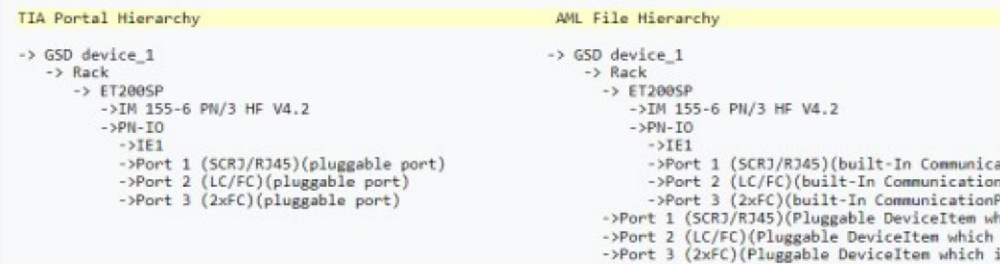
6.5 导入/导出硬件数据
导出
在导出期间为上述组态所生成的 AML 文件如下所示。
```xml
<?xmlversion="1.0"encoding="utf-8"?>
<CAEXFilexmlns:xsi="http://www.w3.org/2001/XMLSchema-instance"FileName="PluggablePortTransformations.aml"SchemaVersion="2.15"xsi:noNamespaceSchemaLocation="CAEX_ClassModel_V2.15.xsd">
    /..
    <InstanceHierarchyName="APCSampleInstanceHierarchy"><InternalElementID="7b00480c-5708-4ffa-ac2d-d571b57be6af"Name="GSDdevice_1">
    <AttributeName="TypeIdentifier"AttributeDataType="xs:string">
    <Value>GSD:GSDML-V2.33-SIEMENS-ET200SP-20180406.XML/D</Value>
    </Attribute></InternalElement>
    <InternalElementID="63dbb1a0-3b53-47b9-a38e-333b15a93f59"Name="Port1(SCRJ/RJ45)">
    <AttributeName="Label"AttributeDataType="xs:string"><Value>P1R</Value>
    </Attribute>
    <AttributeName="PositionNumber"AttributeDataType="xs:int">
    <Value>1</Value>
    </Attribute>
    <AttributeName="BuiltIn"AttributeDataType="xs:boolean">
    <Value>true</Value>
    </Attribute>
    <ExternalInterfaceID="c3041983-aad3-41b6-a378-c8c2f5dc2608"Name="CommunicationPortInterface"RefBaseClassPath="AutomationProjectConfigurationInterfaceClassLib/CommunicationPortInterface"/>
    <ExternalInterfaceID="c738690b-a613-4bcb-bba7-edlc35c0f5a9"Name="CommunicationPortProxyInterface"RefBaseClassPath="AutomationProjectConfigurationInterfaceClassLib/CommunicationPortProxyInterface"/>
    ><SupportedRoleClassRefRoleClassPath="AutomationProjectConfigurationRoleClassLib/CommunicationPort"/>
    </InternalElement>
    </InternalElement>
    <InternalElementID="63ac85bc-b31f-4176-b9dd-894366458d72"Name="Port1(SCRJ/RJ45)">
    <AttributeName="TypeName"AttributeDataType="xs:string">
    <Value>Port1(SCRJ/RJ45)</Value>
    </Attribute>
    <AttributeName="PositionNumber"AttributeDataType="xs:int">
    <Value>1</Value>
    </Attribute>
    <AttributeName="BuiltIn"AttributeDataType="xs:boolean">
    <Value>false</Value>
    </Attribute>
    <AttributeName="TypeIdentifier"AttributeDataType="xs:string">
    <Value>GSD:GSDML-V2.33-SIEMENS-ET200SP-20180406.XML/SM/IDS_1P1HFFO_RJ45V4.3</Value>
    </Attribute>
    <AttributeName="InstallationDate"AttributeDataType="xs:dateTime">
    <Value>2023-07-25T11:10:49.3048765Z</Value>
    </Attribute>
    <AttributeName="CustomAttributes">
    <RefSemanticCorrespondingAttributePath="ListType"/>
    ><AttributeName="GSD_GSDML_V2_33_SIEMENS_ET200SP_20180406_XML_SM_IDS_1P1_HF_FO_RJ45_V4_3.AlternativePartnerPorts"AttributeDataType="xs:string">
    <Value>false</Value></Attribute>
    </InitSource>
</lambda>
```
Openness：用于工程组态工作流自动化的 API系统手册, 11/2023
```xml
</Attribute>
<ExternalInterfaceID="0655ee61-7a4b-4ece-99a9cb626893f996"Name="CommunicationPortProxyInterface"RefBaseClassPath="AutomationProjectConfigurationInterfaceClassLib/CommunicationPortProxyInterface"/
><SupportedRoleClassRefRoleClassPath="AutomationProjectConfigurationRoleClassLib/DeviceItem"/>
</InternalElement>
</InternalElement>
<SupportedRoleClassRefRoleClassPath="AutomationProjectConfigurationRoleClassLib/DeviceItem"/>
<InternalLinkName="LinkToProxyPort_1"RefPartnerSideA="63ac85bc-b31f-4176-b9dd-894366458d72:CommunicationPortProxyInterface"RefPartnerSideB="63dbb1a0-3b53-47b9-a38e-333b15a93f59:CommunicationPortProxyInterface"/>
<InternalLinkName="LinkToProxyPort_2"RefPartnerSideA="156250d0-f6f6-4bc7-97c6-e910455c78ae:CommunicationPortProxyInterface"RefPartnerSideB="79183be2-9768-4f32-a2ff-9ece9f65a64e:CommunicationPortProxyInterface"/>
</InternalElement>
<SupportedRoleClassRefRoleClassPath="AutomationProjectConfigurationRoleClassLib/DeviceItem"/>
</InternalElement>
<SupportedRoleClassRefRoleClassPath="AutomationProjectConfigurationRoleClassLib/Device"/>
</InternalElement>
<SupportedRoleClassRefRoleClassPath="AutomationProjectConfigurationRoleClassLib/DeviceUserFolder"/>
</InternalElement>
<SupportedRoleClassRefRoleClassPath="AutomationProjectConfigurationRoleClassLib/AutomationProject"/>
</InternalElement>
</InstanceHierarchy>
</CAEXFile>
```

#### 端口和设备项连接

多个端口和设备项之间端口-设备项连接的 XML 表示将使用以下所示格式完成。
• “CommunicationPortProxyInterface”类型的 ExternalInterface-<ExternalInterface> 将添加到参与连接的 <CommunicationPort> 和 <DeviceItem> 内部元素下。
```xml
<InternalElement ID="[Port Unique ID]" Name="[Port Name]">
<Attribute Name="Label" AttributeDataType="xs:string">
<Value>P1R</Value>
</Attribute>
<Attribute Name="PositionNumber" AttributeDataType="xs:int">
<Value>1</Value>
</Attribute>
<Attribute Name="BuiltIn" AttributeDataType="xs:boolean">
<Value>true</Value>
</Attribute>
<ExternalInterface ID="[External Interface Unique ID]"
Name="CommunicationPortProxyInterface"
RefBaseClassPath="AutomationProjectConfigurationInterfaceClassLib/
CommunicationPortProxyInterface" />
<SupportedRoleClass RefRoleClassPath="AutomationProjectConfigurationRoleClassLib/
CommunicationPort" />
</InternalElement>
<InternalElement ID="[DeviceItem Unique ID]" Name="[DeviceItem Name]">
<Attribute Name="TypeName" AttributeDataType="xs:string">
<Value>Port 2 (LC/FC)</Value>
</Attribute>
<Attribute Name="PositionNumber" AttributeDataType="xs:int">
<Value>2</Value>
</Attribute>
<Attribute Name="BuiltIn" AttributeDataType="xs:boolean">
<Value>false</Value>
</Attribute>
<Attribute Name="TypeIdentifier" AttributeDataType="xs:string">
<Value>GSD:GSDML-V2.33-SIEMENS-ET200SP-20180406.XML/SM/IDS_1P2 HF LC_FC V4.3</Value>
</Attribute>
<ExternalInterface ID="c7066655-8895-4969-ae44-4533ad5319d7"
Name="CommunicationPortProxyInterface"
RefBaseClassPath="AutomationProjectConfigurationInterfaceClassLib/
CommunicationPortProxyInterface" />
<SupportedRoleClass RefRoleClassPath="AutomationProjectConfigurationRoleClassLib/
DeviceItem" />
</InternalElement>
```
• Internal link- 端口设备项连接使用 <InternalLink> 变量表示。<InternalLink> 变量应添加到多个端口和设备项（即机架）的共同父设备下。内部连接名称在公共父项中是唯一的。
```asp
<InternalLink Name="Link To [Internal link Name]" RefPartnerSideA="[Communication Port UniqueID]:CommunicationPortProxyInterface" RefPartnerSideB="[DeviceItem UniqueID]:CommunicationPortProxyInterface" />
```
导入
可从上述导出过程所生成的 AML 文件导入已转换的可插拔端口详细信息。但也可导入在之前版本的 TIA Portal 项目中创建的 AML 文件。
• 导出层级更改行为将仅适用于 V19 及更高的版本。更低版本的 TIA portal 的行为与之前相同。
• 导入后，AML 文件中的层级不影响 TIA Portal 内部的层级。
• 此层级更改/转换行为适用于内任何可插拔端口组态（Scalance 设备、ET200SP..）。

### 6.5.11 导出/导入具有 IO 链路的 AML 文件

要求
• TIA Portal Openness 应用程序已连接到 TIA Portal [连接到 TIA Portal](#连接到-TIA-Portal)”
• 已打开一个项目
请[打开项目](#打开项目)”
可使用 TIA Portal 导入和导出包含 IO 链路主站组态以及通过 S7-PCT（端口组态工具）组态的IO 链路设备的 AML 文件。
下面是带有一个 IO 链路主站的简单组态示例：
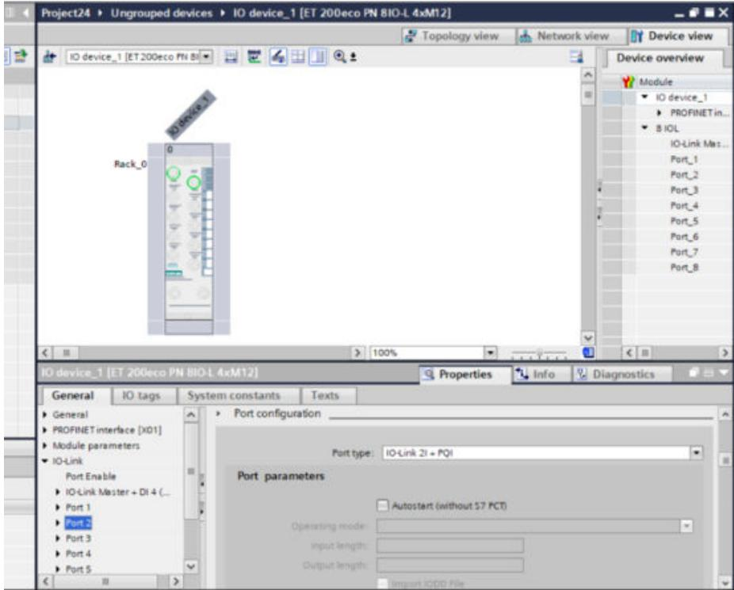
下面是通过 PCT 在 IO 主端口上组态的 IO 链路设备的组态示例：  
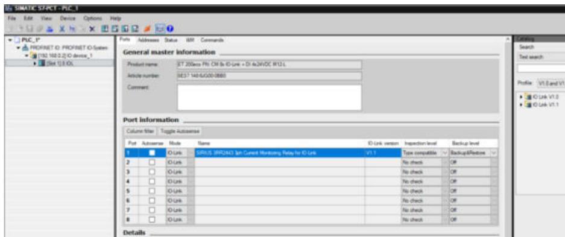

#### 激活/禁用插件

要通过 AML 文件导出/导入 IO 链路主站组态（使用 TIA Portal 中的 PCT 组态），需要从 TIAPortal 用户界面激活 Siemens.CaxPctAddIn.addin。
用户应能够从用户界面激活/禁用插件。对于插件激活请求，系统将提示您所需的常规和工作流权限访问。
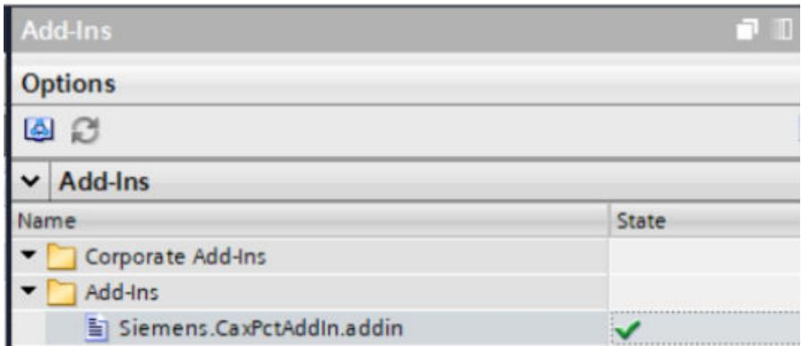  
说明  
“Siemens.CaxPctAddIn.addin”文件需要从“Setup\\Bundles\\WinCCCA\_PRO\_DVD\_2\\DVD\\Support\\CAx\\Add-Ins”复制，以启用插件的激活/禁用。

#### 导出带有 IO 链路信息的 AML 文件

可使用 TIA Portal 导出包含 IO 链路主站的项目组态以及通过 PCT 组态的所连接 IO 链路设备。成功导出后，将能够在 AML 文件中看到相同的组态。如果插件未激活，导出仍应成功，但不会导出 IO 链路设备相关组态。
如果导出 PCT 相关组态时有任何问题，应在 PCT.log 文件中将问题详细信息记录为适当的错误/警告。无论 PCT 导出是否成功，“TIAP UI 信息”(TIAP UI Info) 选项卡中都应显示一条通用的适当消息。
PCT 日志文件位置：在 CAX 日志文件所在的位置创建 PCT 日志文件“<CAX loglocation>\<guid>\PCT.log”。
• 如果 IO 链路主站组态为不带 S7 PCT（例如：端口在 TIA Portal 中的“无 S7-PCT 的组态”= true），由于用户已决定通过 TIA Portal 组态 IO 链路端口，端口仍从 TIA Portal 导出，但具有 AML 文件中的 ConfigurationWithPDCT、标签和名称等最少属性，同样应在 AML文件中重新导入。
• TIA Portal 中存在的一些组态（如硬件参数/属性）会影响 PCT 端的 IO 链路端口组态。例如：在模块 6ES7 148-6JG00-0BB0 中，每个端口都可以在 TIA Portal 中组态“端口类型”，这会影响可插入到 PCT 侧相应端口的 IO 链路设备类型。此参数控制 PCT 侧每个端口所需的地址空间分配，以插入所需的 IO 链路设备。在 AML 交换期间，为了让双向 AML交换能成功进行，应确保在 AML 文件中加入此类“关键”组态。当 AML 文件中缺少此类“关键”组态时，双向 AML 交换将不会成功。对于上述示例，用户可以加入自定义属性导出（通过 TIA Portal 中的 CAx 设置），以便在从 TIA Portal 导出时，AML 包括“端口类型”参数。
• 最好通过显式启动 S7-PCT 工具的方式，手动同步在 TIA Portal 中进行的 IO 链路组态更改。因此，用户有责任在导出 AML 文件之前保持 IO 链路组态为最新状态。例如：最初，用户通过在 TIA Portal 侧选择端口的默认参数来创建 IO 链路组态，然后在 S7-PCT 上组态 IO链路设备。后来，用户决定在 TIA Portal 侧更改端口的参数。用户更改后，应确保启动S7-PCT 工具，从而在任何因参数更改而产生不一致时（如之前插入的 IO 链路设备与端口不匹配）发出通知，并由用户在 AML 导出之前加以解决。否则，导出的组态将不一致。
• 在一些组态中，IO 链路主端口可在没有 S7-PCT 的情况下进行初始组态（例如：设置操作模式 = IO 链路手动），但稍后可使用 S7-PCT 工具进行更改/覆盖。此组态不受 AML 交换的支持。
6.5 导入/导出硬件数据
以下是通过 CAx 导出来导出组态后创建的 AML 片段：
```xml
<?xml version="1.0" encoding="utf-8"?>
<CAEXFile xmlns:xsi="http://www.w3.org/2001/XMLSchema-instance" xmlns:xsd="http://www.w3.org/2001/XMLSchema" xsi:noNamespaceSchemaLocation="CAEX_ClassModel_V2.15.xsd" FileName="Project2_.aml" SchemaVersion="2.15">
..
</AdditionalInformation>
<InstanceHierarchy Name="APC Sample Instance Hierarchy">
<InternalElement ID="02afa376-7fbd-46d8-9659-b82959617326" Name="Project24">
..
<InternalElement ID="41fec27b-a0fa-4df6-a604-d60008e34d81" Name="Ungrouped devices">
<InternalElement ID="968336bc-bda8-4da6-b3fa-2cc8e8493806" Name="ET 200eco station_1">
<Attribute Name="TypeIdentifier" AttributeDataType="xs:string">
<Value>System:Device.ET200eco</Value>
</Attribute>
<InternalElement ID="41196a85-aaae-42e0-994f-4a46e773af0f" Name="Rack_0">
..
<InternalElement ID="165b1850-bba5-4509-af92-acafd8f4f1d1" Name="IO device_1">
..
<InternalElement ID="555d1dd7-ec4d-40e6-b34d-06443a255741" Name="IOLink">
<Attribute Name="Label" AttributeDataType="xs:string">
<Value>IO-Link</Value>
</Attribute>
<Attribute Name="Type" AttributeDataType="xs:string">
<Value>IO-Link</Value>
</Attribute>
<Attribute Name="BuiltIn" AttributeDataType="xs:boolean">
<Value>true</Value>
</Attribute>
<InternalElement ID="4670a2aa-f441-458d-8dcc-e31b7712e325" Name="IOLink Port 1">
<Attribute Name="PositionNumber" AttributeDataType="xs:int">
<Value>1</Value>
</Attribute>
<Attribute Name="Label" AttributeDataType="xs:string">
<Value>Port 1</Value>
</Attribute>
<Attribute Name="BuiltIn" AttributeDataType="xs:boolean">
<Value>true</Value>
</Attribute>
<Attribute Name="ConfigurationWithPDCT" AttributeDataType="xs:boolean">
<Value>true</Value>
</Attribute>
..
<SupportedRoleClass RefRoleClassPath="AutomationProjectConfigurationRoleClassLib/CommunicationPort" /><SupportedRoleClass
RefRoleClassPath="AutomationProjectConfigurationIOLinkRoleClassLib/
CommunicationPortIOLink" />
</InternalElement>
..
<SupportedRoleClass RefRoleClassPath="AutomationProjectConfigurationRoleClassLib/CommunicationInterface" </InternalElement>
"""
```
Openness：用于工程组态工作流自动化的 API系统手册, 11/2023
<SupportedRoleClass RefRoleClassPath="AutomationProjectConfigurationRoleClassLib/ DeviceItem"> <SupportedRoleClass RefRoleClassPath="AutomationProjectConfigurationIOLinkRoleClassLib/ DeviceItemIOLinkMaster" /> </InternalElement> .. </InternalElement> <InternalElement ID="73292b01-7f22-44c8-98b1-2a007580cea0" Name="SIRIUS 3RR2441 3ph Current Monitoring Relay for IO-Link"> <InternalElement ID="d55d0b10-0d2f-44e6-9b96-72725a88ca41" Name="SIRIUS 3RR2441 3ph Current Monitoring Relay for IO-Link"> .. <InternalElement ID="ab97d538-5e44-4a97-bab1-d228c1af8c0b" Name="IOLink"> <Attribute Name="Label" AttributeDataType="xs:string"> <Value>IO-Link</Value> </Attribute> <Attribute Name="Type" AttributeDataType="xs:string"> <Value>IO-Link</Value> </Attribute> <Attribute Name="BuiltIn" AttributeDataType="xs:boolean"> <Value>true</Value> </Attribute> <InternalElement ID="f6ff4404-58fb-43ce-bf5d-e365e55c17b5" Name="IOLink Port 1"> <Attribute Name="PositionNumber" AttributeDataType="xs:int"> <Value>1</Value> </Attribute> <Attribute Name="Label" AttributeDataType="xs:string"> <Value>Port 1</Value> </Attribute> <ExternalInterface ID="065e309d-01cc-410e-951d-0fa7cac979d0" Name="CommunicationPortInterface" RefBaseClassPath="AutomationProjectConfigurationInterfaceClassLib/ CommunicationPortInterface" /> <SupportedRoleClass RefRoleClassPath="AutomationProjectConfigurationRoleClassLib/ CommunicationPort" / <SupportedRoleClass RefRoleClassPath="AutomationProjectConfigurationIOLinkRoleClassLib/ CommunicationPortIOLink" /> </InternalElement> <SupportedRoleClass RefRoleClassPath="AutomationProjectConfigurationRoleClassLib/ CommunicationInterface" /> </InternalElement> <SupportedRoleClass RefRoleClassPath="AutomationProjectConfigurationRoleClassLib/ DeviceItem" / <SupportedRoleClass RefRoleClassPath="AutomationProjectConfigurationIOLinkRoleClassLib/ DeviceItemIOLinkDevice" /> </InternalElement> <SupportedRoleClass RefRoleClassPath="AutomationProjectConfigurationRoleClassLib/ Device" /> </InternalElement>
```xml
<SupportedRoleClass RefRoleClassPath="AutomationProjectConfigurationRoleClassLib/AutomationProject" />
..
<InternalLink Name="IOLink Port 1" RefPartnerSideA="f6ff4404-58fb-43ce-bf5d-e365e55c17b5:CommunicationPortInterface" RefPartnerSideB="4670a2aa-f441-458d-8dcc-e31b7712e325:CommunicationPortInterface" />
</InternalElement>
</InstanceHierarchy>
</CAEXFile>
```

#### 导入带有 IO 链路信息的 AML 文件

应能够导入包含可通过 PCT 组态的 IO 链路主站和 IO 链路设备组态的 AML 文件。成功导入时，将能够在打开 PCT 工具后看到连接到 IO 链路主站端口的 IO 链路设备。如果插件未激活，导入仍应成功，但不会导入 IO 链路设备相关组态。
如果导入 PCT 相关组态时有任何问题，应在 PCT.log 文件中将问题详细信息记录为适当的错误/警告。无论 PCT 导入是否成功，“TIA Portal 用户界面信息”(TIA Portal user interface Info) 选项卡中都应显示一条通用的适当消息。

#### 白名单

以下模块应支持导出/导入 IO 链路主站组态。
<table><tr><td></td><td>IO 链路主站</td><td>固件版本</td></tr><tr><td>ET 200SP</td><td>6ES7-137-6BD00-0BA0</td><td>2.2</td></tr><tr><td rowspan="2">ET 200AL</td><td>6ES7-147-5JD00-0BA0</td><td>1.2</td></tr><tr><td>6ES7-147-5JD00-0BA0</td><td>1.1</td></tr><tr><td>ET 200pro</td><td>6ES7-147-4JD00-0AB0</td><td>1.1</td></tr><tr><td>ET 200MP</td><td>6ES7-547-1JF00-0AB0</td><td>1.0</td></tr><tr><td rowspan="7">ET 200eco PN</td><td>6ES7-148-6JD00-0AB0</td><td>1.1</td></tr><tr><td>6ES7-148-6JD00-0AB0</td><td>1.0</td></tr><tr><td>6ES7-148-6JG00-0BB0</td><td>5.1</td></tr><tr><td>6ES7-148-6JG00-0BB0</td><td>1.1</td></tr><tr><td>6ES7-148-6JG00-0BB0</td><td>1.0</td></tr><tr><td>6ES7 148-6JE00-0BB0</td><td>5.1</td></tr><tr><td>6ES7 148-6JJ00-0BB0</td><td>5.1</td></tr></table>
6.5 导入/导出硬件数据
<table><tr><td></td><td>IO 链路主站</td><td>固件版本</td></tr><tr><td rowspan="2">SIPLUS ET 200SP</td><td>6AG1-137-6BD00-2BA0</td><td>2.2</td></tr><tr><td>6AG2-137-6BD00-1BA0</td><td>2.2</td></tr></table>
黑名单
以下模块不应支持导出/导入 IO 链路主站组态。
<table><tr><td></td><td>IO 链路主站</td><td>固件版本</td></tr><tr><td rowspan="2">ET 200S</td><td>6ES7-138-4GA50-0AB0</td><td></td></tr><tr><td>3RK1-005-0LB00-0AA0</td><td>1.0</td></tr><tr><td rowspan="3">ET 200SP</td><td>6ES7-137-6BD00-0BA0</td><td>2.1</td></tr><tr><td>6ES7-137-6BD00-0BA0</td><td>2.0</td></tr><tr><td>6ES7-137-6BD00-0BA0</td><td>1.0</td></tr><tr><td>ET 200AL</td><td>6ES7-147-5JD00-0BA0</td><td>1.0</td></tr><tr><td>ET 200pro</td><td>6ES7-147-4JD00-0AB0</td><td>1.0</td></tr><tr><td rowspan="2">ET 200eco PN</td><td>6ES7-148-6JA00-0AB0</td><td>7.0</td></tr><tr><td>6ES7-148-6JA00-0AB0</td><td>6.1</td></tr><tr><td rowspan="2">S7-1200</td><td>6ES7-278-4BD32-0XB0</td><td>2.1</td></tr><tr><td>6ES7-278-4BD32-0XB0</td><td>2.0</td></tr><tr><td rowspan="4">SIPLUS S7-1200</td><td>6AG1-278-4BD32-2XB0</td><td>2.1</td></tr><tr><td>6AG1-278-4BD32-2XB0</td><td>2.0</td></tr><tr><td>6AG1-278-4BD32-4XB0</td><td>2.1</td></tr><tr><td>6AG1-278-4BD32-4XB0</td><td>2.0</td></tr><tr><td rowspan="2">SIPLUS ET 200SP</td><td>6AG1-137-6BD00-2BA0</td><td>2.1</td></tr><tr><td>6AG2-137-6BD00-1BA0</td><td>2.1</td></tr></table>
[打开项目](#打开项目)

### 6.5.12 扩展机架的连接处理

• TIA Portal Openness 应用程序已连接到 TIA Portal 请[连接到 TIA Portal](#连接到-TIA-Portal)”
• 已打开一个项目
请[打开项目](#打开项目)”
可使用 TIA Portal Openness 获取、添加和移除扩展机架连接，以便可在 CAx 导出/导入期间利用 TIA Portal Openness 实现扩展机架连接支持。
```typescript
ImConnection imConnection = portDeviceItem.GetService<ImConnection>();
imConnection.Connect(partnerport);
imConnection.Disconnect();
imConnection.GetPartnerPort();
var imConnectionOwner = imConnection.OwnedBy;
```
连接到 TIA Portal (页 90)
打开项目 (页 140)

### 6.5.13 导出/导入具有复杂变量组态的 AML 文件

• TIA Portal Openness 应用程序已连接到 TIA Portal 请[连接到 TIA Portal](#连接到-TIA-Portal)”
• 已通过 TIA Portal Openness 应用程序打开一个项目请[打开项目](#打开项目)II
可使用 TIA Portal 导入包含具有用户自定义数据类型的复杂变量的 AML 文件。复杂变量在TIA Portal 上创建，这些变量存在于 AML 文件中提到的变量表中，但不会创建用户自定义的数据类型。需要手动创建所需 UDT。
复杂的逻辑地址根据复杂变量的子变量计算得出。从复杂变量的所有子变量列表中，将选择具有最低最小地址的变量，并将该变量的地址分配给父级复杂变量。如果任何子变量存在无效地址，则父级复杂变量的地址将不被计算并设置为空。
成功导入后，将能够查看在 TIA Portal 上创建的所有具有有效逻辑地址的有效复杂变量。导出时没有任何变化，仅导出变量。

#### 采用用户自定义数据类型的 AML 文件

下面是一个示例 AML 文件，其中包含具有用户自定义数据类型的复杂变量。
```xml
<CAEXFile xmlns:xsi="http://www.w3.org/2001/XMLSchema-instance" FileName="singletag.aml" SchemaVersion="2.15" xsi:noNamespaceSchemaLocation="CAEX_ClassModel_V2.15.xsd">
    <AdditionalInformation>
    ...
</AdditionalInformation>
    <InstanceHierarchy Name="APC Sample Instance Hierarchy">
    <InternalElement ID="debc8e5c-2cbb-4fa9-afaa-de242e706dff" Name="Project97">
    <InternalElement ID="dc142279-d745-432b-8451-4b282b55b3e5" Name="S71500/ET200MP station_2">
    ...
    <InternalElement ID="eedd64da-22f0-4b6e-babe-75e09e5cfc46" Name="Rail_0">
    ...
    <InternalElement ID="a6e21bd8-f58c-4920-89ee-588d0eb34645" Name="PLC_2">
    ...
    <InternalElement Name="TagTable" ID="065F26B8-E5BA-4BF3-A210-4E26E19F8A30">
    <Attribute Name="AssignToDefault" AttributeDataType="xs:boolean">
    <Value>true</Value>
    </Attribute>
    <InternalElement Name="M1" ID="4AF292AA-DF8E-4A7A-AC9F-005B4DED47A5">
    <Attribute Name="DataType" AttributeDataType="xs:string">
    <Value>StructDrive</Value>
    </Attribute>
    <ExternalInterface Name="On"
    RefBaseClassPath="AutomationProjectConfigurationInterfaceClassLib/Tag" ID="5FCB82C1-019C-4833-A1DF-16721A5239FC">
    <Attribute Name="DataType" AttributeDataType="xs:string">
    <Value>BOOL</Value>
    </Attribute>
    <Attribute Name="LogicalAddress" AttributeDataType="xs:string">
    <Value>I0.0</Value>
    </Attribute>
    <Attribute Name="Comment" AttributeDataType="xs:string">
    <Value>Motor drive on</Value>
    <Attribute Name="aml-lang=de-DE" AttributeDataType="xs:string">
    <Value>Motor drive on</Value>
    </Attribute>
    </Attribute>
    </ExternalInterface>
    <ExternalInterface Name="Overheat"
    RefBaseClassPath="AutomationProjectConfigurationInterfaceClassLib/Tag" ID="331659A8-147B-407A-9629-5D85AE04890D">
    <Attribute Name="DataType" AttributeDataType="xs:string">
    <Value>BOOL</Value>
    </Attribute>
    <Attribute Name="IoType" AttributeDataType="xs:string">
    <Value>Input</Value>
    </Attribute>
    <Attribute Name="LogicalAddress" AttributeDataType="xs:string">
    <Value>E0.1</Value>
    </Attribute>
    <Attribute Name="Comment" AttributeDataType="xs:string">
```
```xml
<Value>Motor drive overheat</Value>
<Attribute Name="aml-lang=de-DE" AttributeDataType="xs:string">
<Value>Motor drive overheat</Value>
</Attribute>
</Attribute>
</ExternalInterface>
<SupportedRoleClass RefRoleClassPath="AutomationProjectConfigurationRoleClassLib/ComplexTag" />
</InternalElement>
<SupportedRoleClass RefRoleClassPath="AutomationProjectConfigurationRoleClassLib/TagTable" />
</InternalElement>
<InternalElement ID="5983e7fd-ca6a-4573-8579-9ff323cfa09a" Name="PROFINET interface_1">
...
<InternalElement ID="2240a28c-ba88-4af4-ae6a-03d0ba3ce108" Name="E1">
...>
</InternalElement>
<InternalElement ID="df1d95d3-89ee-4a45-bca8-73e342497bee" Name="Port_1">
...
<SupportedRoleClass RefRoleClassPath="AutomationProjectConfigurationRoleClassLib/CommunicationPort" />
</InternalElement>
<InternalElement ID="25f8dc3c-621d-4659-bb04-2d923df832c4" Name="Port_2">
...
</InternalElemen<SupportedRoleClass
RefRoleClassPath="AutomationProjectConfigurationRoleClassLib/CommunicationInterface" />
</InternalElement>
<SupportedRoleClass RefRoleClassPath="AutomationProjectConfigurationRoleClassLib/DeviceItem" />
</InternalElement>
<SupportedRoleClass RefRoleClassPath="AutomationProjectConfigurationRoleClassLib/DeviceItem" />
</InternalElement>
<SupportedRoleClass RefRoleClassPath="AutomationProjectConfigurationRoleClassLib/Device" /></InternalElement>
<SupportedRoleClass RefRoleClassPath="AutomationProjectConfigurationRoleClassLib/AutomationProject" /></InternalElement>
</InstanceHierarchy>
</CAEXFile>
```

#### 在 TIA Portal 上导入复杂变量且不创建 UDT

上面的文件有一个复杂变量，它有两个子变量“开启”(On) 和“过热”(Overheat)。导入 TIAPortal 后，应创建复杂变量，如下所示：
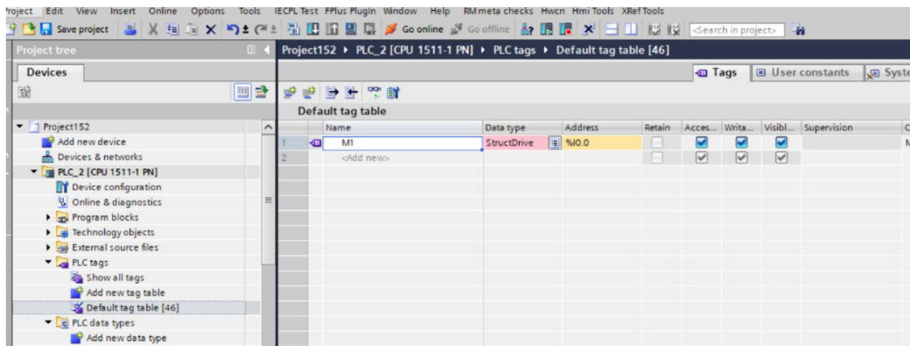

#### 在 TIA Portal 上导入复杂变量并创建 UDT

如果数据类型丢失或无效，则应显示“数据类型”的错误指示。在上述情况下，这是由于缺少用户自定义数据类型，即 StructDrive。
创建了用户自定义数据类型 (StructDrive) 后，复杂变量将如下所示：
<table><tr><td rowspan="80">Project tree
PLC programming</td><td colspan="10">Project152 ▶ PLC_2 [CPU 1511-1 PN] ▶ PLC tags ▶ Default tag table [46]</td></tr><tr><td colspan="10">Deves</td></tr><tr><td colspan="10">Default tag table</td></tr><tr><td></td><td>Name</td><td>Data type</td><td>Address</td><td>Retain</td><td>Acces...</td><td>Writa...</td><td>Visibl...</td><td>Supervision</td><td>Co</td></tr><tr><td>1</td><td>M1</td><td>&quot;StructDrive&quot;</td><td>%I0.0</td><td></td><td></td><td></td><td></td><td></td><td>Me</td></tr><tr><td>2</td><td>On</td><td>Bool</td><td>%I0.0</td><td></td><td></td><td></td><td></td><td></td><td></td></tr><tr><td>3</td><td>Overheat</td><td>Bool</td><td>%I0.1</td><td></td><td></td><td></td><td></td><td></td><td></td></tr><tr><td>4</td><td>&lt;Add new&gt;</td><td></td><td></td><td></td><td></td><td></td><td></td><td></td><td></td></tr><tr><td></td><td></td><td></td><td></td><td></td><td></td><td></td><td></td><td></td><td></td></tr><tr><td></td><td></td><td></td><td></td><td></td><td></td><td></td><td></td><td></td><td></td></tr><tr><td></td><td></td><td></td><td></td><td></td><td></td><td></td><td></td><td></td><td></td></tr><tr><td></td><td></td><td></td><td></td><td></td><td></td><td></td><td></td><td></td><td></td></tr><tr><td></td><td></td><td></td><td></td><td></td><td></td><td></td><td></td><td></td><td></td></tr><tr><td></td><td></td><td></td><td></td><td></td><td></td><td></td><td></td><td></td><td></td></tr><tr><td></td><td></td><td></td><td></td><td></td><td></td><td></td><td></td><td></td><td></td></tr><tr><td></td><td></td><td></td><td></td><td></td><td></td><td></td><td></td><td></td><td></td></tr><tr><td></td><td></td><td></td><td></td><td></td><td></td><td></td><td></td><td></td><td></td></tr><tr><td></td><td></td><td></td><td></td><td></td><td></td><td></td><td></td><td></td><td></td></tr><tr><td></td><td></td><td></td><td></td><td></td><td></td><td></td><td></td><td></td><td></td></tr><tr><td></td><td></td><td></td><td></td><td></td><td></td><td></td><td></td><td></td><td></td></tr><tr><td></td><td></td><td></td><td></td><td></td><td></td><td></td><td></td><td></td><td></td></tr><tr><td></td><td></td><td></td><td></td><td></td><td></td><td></td><td></td><td></td><td></td></tr><tr><td></td><td></td><td></td><td></td><td></td><td></td><td></td><td></td><td></td><td></td></tr><tr><td></td><td></td><td></td><td></td><td></td><td>%I0.0</td><td></td><td></td><td></td><td></td></tr><tr><td></td><td></td><td></td><td></td><td></td><td></td><td></td><td></td><td></td><td></td></tr><tr><td></td><td></td><td></td><td></td><td></td><td></td><td></td><td></td><td></td><td></td></tr><tr><td></td><td></td><td></td><td></td><td></td><td></td><td></td><td></td><td></td><td></td></tr><tr><td></td><td></td><td></td><td></td><td></td><td></td><td></td><td></td><td></td><td></td></tr><tr><td></td><td></td><td></td><td></td><td></td><td></td><td></td><td></td><td></td><td></td></tr><tr><td></td><td></td><td></td><td></td><td></td><td></td><td></td><td></td><td></td><td></td></tr><tr><td></td><td></td><td></td><td></td><td></td><td></td><td></td><td></td><td></td><td></td></tr><tr><td></td><td>M1</td><td></td><td></td><td></td><td></td><td></td><td></td><td></td><td></td></tr><tr><td>2</td><td>On</td><td>Bool</td><td>%I0.0</td><td></td><td></td><td></td><td></td><td></td><td></td></tr><tr><td>3</td><td>Overheat</td><td>Bool</td><td>%I0.1</td><td></td><td></td><td></td><td></td><td></td><td></td></tr><tr><td>4</td><td>&lt;Add new&gt;</td><td></td><td></td><td></td><td></td><td></td><td></td><td></td><td></td></tr><tr><td></td><td></td><td></td><td></td><td></td><td></td><td></td><td></td><td></td><td></td></tr><tr><td></td><td></td><td></td><td></td><td></td><td></td><td></td><td></td><td></td><td></td></tr><tr><td></td><td></td><td></td><td></td><td></td><td></td><td></td><td></td><td></td><td>%I0.0</td></tr><tr><td></td><td></td><td></td><td></td><td></td><td></td><td></td><td></td><td></td><td></td></tr><tr><td></td><td></td><td></td><td></td><td></td><td></td><td></td><td></td><td></td><td></td></tr><tr><td></td><td></td><td></td><td></td><td></td><td></td><td></td><td></td><td></td><td></td></tr><tr><td></td><td></td><td></td><td></td><td></td><td></td><td></td><td></td><td></td><td></td></tr><tr><td></td><td></td><td></td><td></td><td></td><td></td><td></td><td></td><td></td><td></td></tr><tr><td></td><td></td><td></td><td></td><td></td><td></td><td></td><td></td><td></td><td></td></tr><tr><td></td><td></td><td></td><td></td><td></td><td rowspan="9"></td><td rowspan="9"></td><td rowspan="9"></td><td rowspan="9"></td><td rowspan="9"></td></tr><tr><td></td><td></td><td></td><td></td><td></td></tr><tr><td></td><td></td><td></td><td></td><td></td></tr><tr><td></td><td></td><td></td><td></td><td></td></tr><tr><td></td><td></td><td></td><td></td><td></td></tr><tr><td></td><td></td><td></td><td></td><td></td></tr><tr><td></td><td></td><td></td><td></td><td></td></tr><tr><td></td><td></td><td></td><td></td><td></td></tr><tr><td></td><td></td><td></td><td></td><td></td></tr><tr><td></td><td></td><td></td><td></td><td></td><td rowspan="8">%I0.0</td><td rowspan="8"></td><td rowspan="8"></td><td rowspan="8"></td><td rowspan="8"></td></tr><tr><td></td><td></td><td></td><td></td><td></td></tr><tr><td></td><td></td><td></td><td></td><td></td></tr><tr><td></td><td></td><td></td><td></td><td></td></tr><tr><td></td><td></td><td></td><td></td><td></td></tr><tr><td></td><td></td><td></td><td></td><td></td></tr><tr><td></td><td></td><td></td><td></td><td></td></tr><tr><td></td><td></td><td></td><td></td><td></td></tr><tr><td></td><td>M1</td><td></td><td></td><td></td><td></td><td></td><td></td><td></td><td></td></tr><tr><td>2</td><td>On</td><td>Bool</td><td>%I0.0</td><td></td><td></td><td></td><td></td><td></td><td></td></tr><tr><td>3</td><td>Overheat</td><td>Bool</td><td>%I0.1</td><td></td><td></td><td></td><td></td><td></td><td></td></tr><tr><td>4</td><td>&lt;Add new&gt;</td><td></td><td></td><td></td><td></td><td></td><td></td><td></td><td></td></tr><tr><td></td><td></td><td></td><td></td><td></td><td rowspan="14"></td><td rowspan="14"></td><td rowspan="14"></td><td rowspan="14"></td><td rowspan="14"></td></tr><tr><td></td><td></td><td></td><td></td><td></td></tr><tr><td></td><td></td><td></td><td></td><td></td></tr><tr><td></td><td></td><td></td><td></td><td></td></tr><tr><td></td><td></td><td></td><td></td><td></td></tr><tr><td></td><td></td><td></td><td></td><td></td></tr><tr><td></td><td></td><td></td><td></td><td></td></tr><tr><td></td><td></td><td></td><td></td><td></td></tr><tr><td></td><td></td><td></td><td></td><td></td></tr><tr><td></td><td></td><td></td><td></td><td></td></tr><tr><td></td><td></td><td></td><td></td><td></td></tr><tr><td></td><td></td><td></td><td></td><td></td></tr><tr><td></td><td></td><td></td><td></td><td></td></tr><tr><td></td><td></td><td></td><td></td><td></td></tr><tr><td></td><td></td><td></td><td></td><td></td><td></td><td></td><td></td><td></td><td></td></tr></table>
如果任何子变量有任何问题，例如缺少逻辑地址或与方向、Iotype 等相关的任何问题，则无法确定复杂变量的最低地址。在这种情况下，应创建没有逻辑地址的复杂变量，并向用户显示相应的警告消息，如下所示：
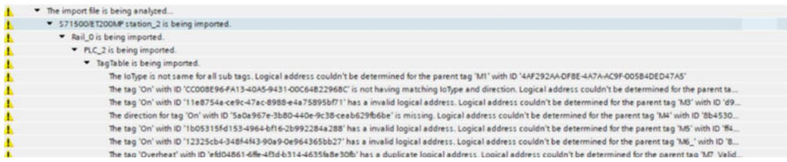
连接到 TIA Portal (页 90)

### 6.5.14 导出 CAx 数据

• TIA Portal Openness 应用程序已连接到 TIA Portal。 [连接到 TIA Portal](#连接到-TIA-Portal)”
• 已打开一个项目。[打开项目](#打开项目)”
在 TIA Portal 中，可将设备和网络编辑器中的配置导出到 AML 文件中。此功能基于 TIA PortalOpenness，用于从项目或设备层级导出硬件数据。
可使用 TIA Portal Openness 中的导出功能导出 CAx 数据：可通过 CaxProvider 访问导出功能。要获取 CaxProvider 服务，对 Project 对象处调用 GetService 方法。
使用 TIA Portal V17 用户接口时，应可在多用户环境中执行 CAx 导出和导入操作。如果服务器项目与本地会话一同打开，则将对服务器项目进行导出和导入操作。要导出和导入本地会话，需要关闭服务器项目。
此外，为了将单一设备导出为 CAx，设备上下文菜单中应包含用于在服务器项目打开时执行服务器项目导出的菜单条目。在这种情况下，不应为本地会话显示此上下文菜单。要将单一设备导出为 CAx，仅当用户关闭服务器项目视图时，才可为本地会话提供该上下文菜单。
在 TIA Portal V17 中，还应当可在多用户环境中执行 CAx 导出和导入操作。为了使多用户项目（本地会话和服务器项目）能够通过 AML 参与交换，会使用新 API 进行导出。新的导出 API 会将“ProjectBase”作为参数。现在可使用导出 API 导出单用户项目和多用户项目。
自 TIA Portal OpennessV17 起，将不再通过 UI 和 API 检查 CAx 导出/导入功能：
• 存在用于 Openness“西门子 TIA Openness”的 Windows 组
• Windows 用户是“西门子 TIA Openness”组的成员
要在客户端应用程序中调用 CAx API，需要确保应用程序已通过正确的 Openness 证书签字，或存在 Openness“西门子 TIA Openness”组，且用户是该组的成员。
利用 TIA Portal V19，可通过程序访问 CAx 导出和导入操作的结果消息，从而能够对传输结果进行自定义分析和可视化。结果包含这些消息及相关信息。
新增的设备和项目导出 API 提供结构化 TransferResult 作为返回值，并且不会生成日志文件。用户可处理传输结果，并以自定义格式存储结果。

#### CAx 的导出和导入限制条件

CAx 不支持导出和导入以下设备：
• 除按钮面板和按键面板外的 HMI 设备
• 驱动器
CAx 不支持基于 TIA Portal 导出和导入某些 Scalance 设备项。
• 6GK5 602-0BA10-2AA3
• 6GK5 612-0BA10-2AA3
• 6GK5 623-0BA10-2AA3
• 6GK5 627-2BA10-2AA3
• 6GK5 602-0BA00-2AA3
• 6GK5 612-0BA00-2AA3
• 6GK5 613-0BA00-2AA3
• System:Device.Scalance/S627
• 6GK5 495-8BA00-8AA2
• 6ES7 451-3AL00-0AE
• 6AV2 104-0xxxx-xxxx
• 6AV2 155-xxxxx-xxxx
• System:Rack.Scalance/X200BA-Y V4.2
• System:PC.DCSPlus.LogicalServer
• System:Device.DCS\_ReduMCStation
• System:Device.DCS\_MCStation
• System:Device.DCS\_SimulationStation
• System:Device.OPCUAPackageUnit
• System:Device.IEC60870
• System:Device.S7Com
• System:Device.CS3000
自 TIA Portal Openness V17 起，也可考虑排除上述设备项的 TypeIdentifier 的标准格式。

#### 程序代码：访问 CaxProvider 服务

修改以下程序代码以访问CaxProvider 服务：
```cs
//For Single Project
ProjectBase project = tiaPortal.Projects.Open(...);
//Or
//for LocalSession of a Multiuser Project
MultiuserProject project = tiaPortal.LocalSessions.Open(...).Project;
//Or
//for Server Project of a Multiuser Project
MultiuserProject project = tiaPortal.LocalSessions.OpenServerProject(...).Project;
Or
//Single user Project
Project project = tiaPortal.Projects.Open(...);
CaxProvider caxProvider = project.GetService<CaxProvider>();
if(caxProvider != null)
{
    // Perform CAx export and import operation
}
```
```txt
caxProvider.Export(project, new FileInfo(@"D:\Temp ProjektExport.aml"), new FileInfo(@"D:\Temp\ProjectExport_Log.log"));
```
在项目层级导出 CAx
要在项目级导出 CAx 数据，可在 TIA Portal V14 及更高版本中使用 Export() 及以下参数：
<table><tr><td>名称</td><td>类型</td><td>示例</td><td>描述</td></tr><tr><td>ProjectToExport</td><td>Project</td><td>tiaPortal.Projects[0]</td><td>要导出的项目对象</td></tr><tr><td>ExportFilePath</td><td>FileInfo</td><td>newFileInfo(@&quot;D:\Temp\ProjectExport.aml&quot;)</td><td>AML文件的完整导出文件路径</td></tr><tr><td>LogFilePath</td><td>FileInfo</td><td>newFileInfo(@&quot;D:\Temp\ProjectExport_Log.log&quot;)</td><td>日志文件的完整文件路径</td></tr></table>
要在项目级导出 CAx 数据，可在 TIA Portal V17 及更高版本中使用 Export() 及以下参数：
<table><tr><td>名称</td><td>类型</td><td>描述</td></tr><tr><td>ProjectToExport</td><td>ProjectBase</td><td>要导出的单用户或多用户项目对象</td></tr><tr><td>ExportFilePath</td><td>FileInfo</td><td>AML 文件的完整导出文件路径</td></tr><tr><td>LogFilePath</td><td>FileInfo</td><td>日志文件的完整文件路径</td></tr></table>

#### 返回类型

<table><tr><td>类型</td><td>描述</td></tr><tr><td>bool</td><td>如果 CAx 导出操作完成且无错,则为 True;否则为 False</td></tr></table>
修改以下程序代码以在项目级别导出 CAx 数据：

#### 在项目级导出 CAx 重载 API

要在项目级导出 CAx 数据并访问结果消息，可在 TIA Portal V19 及更高版本中使用“导出”重载 API：
<table><tr><td>名称</td><td>类型</td><td>描述</td></tr><tr><td>projectToExport</td><td>ProjectBase</td><td>要导出的单用户或多用户项目对象</td></tr><tr><td>exportFilePath</td><td>FileInfo</td><td>AML 文件的完整导出文件路径</td></tr></table>
<table><tr><td>类型</td><td>描述</td></tr><tr><td>TransferResult</td><td>CAx 传输的结果。</td></tr></table>
TransferResult 中支持以下特性：
<table><tr><td>特性名称</td><td>类型</td><td>访问</td></tr><tr><td>ErrorCount</td><td>int</td><td>读</td></tr><tr><td>WarningCount</td><td>int</td><td>读</td></tr><tr><td>State</td><td>TransferResultState</td><td>读</td></tr><tr><td>Messages</td><td>TransferResultMessageComposition</td><td>读</td></tr></table>
TransferResultMessageComposition 中支持以下特性：
<table><tr><td>特性名称</td><td>类型</td><td>访问</td></tr><tr><td>this[int]</td><td>TransferResultMessage</td><td>读</td></tr></table>
TransferResultMessage: 中支持以下特性
<table><tr><td>特性名称</td><td>数据类型</td><td>访问</td></tr><tr><td>DateTime</td><td>DateTime</td><td>读</td></tr><tr><td>ErrorCount</td><td>Int</td><td>读</td></tr><tr><td>WarningCount</td><td>Int</td><td>读</td></tr><tr><td>State</td><td>TransferResultState</td><td>读</td></tr><tr><td>Message</td><td>String</td><td>读</td></tr></table>
可能的传输结果状态列表：
<table><tr><td>枚举选项</td><td>描述</td></tr><tr><td>TransferResultState.Success</td><td>传输已成功完成</td></tr><tr><td>TransferResultState.Information</td><td>传输完成并提示信息</td></tr></table>
<table><tr><td>枚举选项</td><td>描述</td></tr><tr><td>TransferResultState.Warning</td><td>传输完成并提示警告</td></tr><tr><td>TransferResultState.Error</td><td>传输完成并提示错误</td></tr></table>
修改以下程序代码以在项目级别导出 CAx 数据：
```txt
private static void CaxTransferAtProjectLevel(Siemens.Engineering.ProjectBase project, CaxProvider caxProvider)
{
    FileInfo exportFilePath = new FileInfo("D:\\temp\\ExportFile.aml");
    // New Export API for project:
    TransferResult projectExportResult = caxProvider.Export(project, exportFilePath);
    PrintCaxResult(projectExportResult);
}
private static void PrintCaxResult(Siemens.Engineering.Cax.TransferResult result)
{
    Console.WriteLine($"CAx result summary: {result.State} (errors: {result accident},
    warnings: {result accident})
    PrintCaxDetailResult(resultMaries);
}
private static void
PrintCaxDetailResult(Siemens.Engineering.Cax.TransferResultMessageComposition messages,
int nestingDepth = 0)
{
    foreach (Siemens.Engineering.Cax.TransferResultMessage message in messages)
{
    string indent = new string(' ', nestingDepth * 2);
    Console.WriteLine($"{indent}{message.State} {message.Message} {message.Time}
    {message accident},
    warnings: {message accident})
    PrintCaxDetailResult(messageMaries, nestingDepth + 1);
}
```

#### 在设备层级导出 CAx

要在设备层级导出 CAx 数据，则在调用Export 类函数时需使用以下参数：
<table><tr><td>名称</td><td>类型</td><td>示例</td><td>描述</td></tr><tr><td>DeviceToExport</td><td>Device</td><td>project.Devices[0]</td><td>要导出的设备对象</td></tr><tr><td>ExportFilePath</td><td>FileInfo</td><td>new FileInfo(@&quot;D:\Temp IraqExport.aml&quot;)</td><td>AML文件的完整导出文件路径</td></tr><tr><td>LogFilePath</td><td>FileInfo</td><td>new FileInfo(@&quot;D:\Temp IraqExport_Log.log&quot;)</td><td>日志文件的完整文件路径</td></tr></table>
<table><tr><td>类型</td><td>描述</td></tr><tr><td>bool</td><td>如果 CAx 导出操作完成且无错,则为 True;否则为 False</td></tr></table>
修改以下程序代码以在设备级导出 CAx 数据：  
caxProvider.Export(device, new FileInfo(@"D:\Temp\DeviceExport.aml"), new FileInfo(@"D:\Temp\DeviceExport\_Log.log"));

#### 在设备级导出 CAx 重载 API

要在设备级导出 CAx 数据并访问结果消息，可在 TIA Portal V19 及更高版本中使用“导出”重载 API：
<table><tr><td>名称</td><td>类型</td><td>示例</td><td>描述</td></tr><tr><td>deviceToExport</td><td>Device</td><td>project.Devices[0]</td><td>要导出的设备对象</td></tr><tr><td>exportFilePath</td><td>FileInfo</td><td>new FileInfo(@&quot;D:\Temp IraqExport.aml&quot;)</td><td>AML文件的完整导出文件路径</td></tr></table>
<table><tr><td>类型</td><td>描述</td></tr><tr><td>TransferResult</td><td>CAx 传输的结果。</td></tr></table>
TransferResult 中支持以下特性：
<table><tr><td>特性名称</td><td>类型</td><td>访问</td></tr><tr><td>ErrorCount</td><td>int</td><td>读</td></tr><tr><td>WarningCount</td><td>int</td><td>读</td></tr><tr><td>State</td><td>TransferResultState</td><td>读</td></tr><tr><td>Messages</td><td>TransferResultMessageComposition</td><td>读</td></tr></table>
TransferResultMessageComposition 中支持以下特性：
<table><tr><td>特性名称</td><td>类型</td><td>访问</td></tr><tr><td>this[int]</td><td>TransferResultMessage</td><td>读</td></tr></table>
TransferResultMessage: 中支持以下特性
<table><tr><td>特性名称</td><td>数据类型</td><td>访问</td></tr><tr><td>DateTime</td><td>DateTime</td><td>读</td></tr><tr><td>ErrorCount</td><td>Int</td><td>读</td></tr><tr><td>WarningCount</td><td>Int</td><td>读</td></tr><tr><td>State</td><td>TransferResultState</td><td>读</td></tr><tr><td>Message</td><td>String</td><td>读</td></tr></table>
可能的传输结果状态列表：
<table><tr><td>枚举选项</td><td>描述</td></tr><tr><td>TransferResultState.Success</td><td>传输已成功完成</td></tr><tr><td>TransferResultState.Information</td><td>传输完成并提示信息</td></tr></table>
6.5 导入/导出硬件数据
<table><tr><td>枚举选项</td><td>描述</td></tr><tr><td>TransferResultState.Warning</td><td>传输完成并提示警告</td></tr><tr><td>TransferResultState.Error</td><td>传输完成并提示错误</td></tr></table>
修改以下程序代码以在设备级导出 CAx 数据：
```cs
private static void CaxTransferAtDeviceLevel(Siemens.Engineering.ProjectBase project, CaxProvider caxProvider)
{
    FileInfo exportFilePath = new FileInfo("D:\\temp\\ExportFile.aml");
    Device deviceToExport = project.Devices.Find("Station_1");
    // New Export API for project:
    TransferResult deviceExportResult = caxProvider.Export(deviceToExport, exportFilePath);
    PrintCaxResult(deviceExportResult);
}
private static void PrintCaxResult(Siemens.Engineering.Cax.TransferResult result)
{
    Console.WriteLine($"CAx result summary: {result.State} (errors: {result.ErrorCount}, warnings: {result.WarningCount})");
    PrintCaxDetailResult(result.Messages);
}
private static void
PrintCaxDetailResult(Siemens.Engineering.Cax.TransferResultMessageComposition messages, int nestingDepth = 0)
{
    foreach (Siemens.Engineering.Cax.TransferResultMessage message in messages)
{
    string indent = new string(' ', nestingDepth * 2);
    Console.WriteLine($"{indent}{message.State} {message.Message} {message.DateTime} (errors: {message.ErrorCount}, warnings: {message.WarningCount})");
    PrintCaxDetailResult(message总价，nestingDepth + 1);
}
}
```

### 6.5.15 导入 CAx 数据

要求
• TIA Portal Openness 应用程序已连接到 TIA Portal。 [连接到 TIA Portal](#连接到-TIA-Portal)”
• 项目已经打开。
[打开项目](#打开项目)”
在 TIA Portal 中，您可以在设备和网络编辑器中从 AML 文件导入配置。此功能使您能够从项目或设备级别导入硬件数据。
可通过导入功能导入 CAx 数据。通过CaxProvider服务访问导入函数。要获取 CaxProvider服务，对 Project 对象处调用 GetService 方法。
使用 TIA Portal V19 时，新增的导入 API 提供结构化 TransferResult 作为返回值，并且不会生成日志文件。用户可处理传输结果，并以自定义格式存储结果。
修改以下程序代码：
```cs
//Access the CaxProvider service
Project project = tiaPortal.Projects.Open(...);
CaxProvider caxProvider = project.GetService<CaxProvider>();
if(caxProvider != null)
{
    // Perform Cax export and import operation
}
```

#### CAx 导入

要将 CAx 数据导入 TIA Portal 项目中，可使用 Import 方法及以下参数：
<table><tr><td>名称</td><td>示例</td><td>描述</td></tr><tr><td>ImportFilePath</td><td>newFileInfo(@&quot;D:\Temp\ProjectExport.aml&quot;)</td><td>AML 文件的完整导入文件路径</td></tr><tr><td>LogFilePath</td><td>newFileInfo(@&quot;D:\Temp\ProjectExport_Log.log&quot;)</td><td>日志文件的完整文件路径</td></tr><tr><td>ImportOptions</td><td>CaxImportOptions.MoveToParking LotCaxImportOptions.RetainTiaDeviceCaxImportOptions.OverwriteTiaDevice</td><td>导入到已经存在的非空项目中时的冲突解决策略。</td></tr></table>
修改以下程序代码导入 CAx 数据：  
caxProvider.Import(new FileInfo(@"D:\Temp\ProjectImport.aml"), new FileInfo(@"D:\Temp\ProjectImport\_Log.log"), CaxImportOptions.MoveToParkingLot);
提供以下 CaxImportOptions：
<table><tr><td>导入选项</td><td>描述</td></tr><tr><td>MoveToParking Lot</td><td>在项目中保留名称冲突的设备,并将这些设备从 CAx 导入到停驻区文件夹</td></tr><tr><td>RetainTiaDevice</td><td>在项目中保留名称冲突的设备,并不将这些设备从 CAx 导入</td></tr><tr><td>OverwriteTiaDevice</td><td>用 CAx 中的设备覆盖项目中名称冲突的设备</td></tr></table>
自 TIA Portal V18 起，当缺少产品许可证并且尝试导入需要许可证才能创建的组态时，CAx导入将显示错误消息。应创建不强制执行产品许可证检查的组态，且没有任何错误。
例如：如果缺少“Step7”产品许可证，则 S7-1500 PLC 等模块（组态的 TypeIdentifier 表示AML 文件中的订货号）的导入将失败，而数字量输入/输出模块（组态的TypeIdentifier表示AML 文件中的订货号）的导入将成功。
此外，基于 AML 文件中的“TemplateIdentifier”的组态导入应成功，因为基于“库”的组态不强制执行产品许可证检查。
例如：即使缺少“Step7”产品许可证，任何模块（如 S7-1500 PLC、数字量输入/输出模块等）的导入（当在 AML 文件中组态了 TemplateIdentifier 时）也应成功。
缺少许可证对 CAx 导出没有影响。因此，导出的行为应该像以前一样。

#### CAx 导入重载 API

要件 CAx 数据导入到 TIA Portal 项目并访问结果消息，可在 TIA Portal V19 及更高版本中使用“导入”重载 API 及以下参数：
<table><tr><td>名称</td><td>示例</td><td>描述</td></tr><tr><td>ImportFilePath</td><td>newFileInfo(@&quot;D:\Temp\ProjectExport.aml&quot;)</td><td>AML 文件的完整导入文件路径</td></tr><tr><td>ImportOptions</td><td>CaxImportOptions.MoveToParking LotCaxImportOptions.RetainTiaDeviceCaxImportOptions.OverwriteTiaDevice</td><td>导入到已经存在的非空项目中时的冲突解决策略。</td></tr></table>
<table><tr><td>类型</td><td>描述</td></tr><tr><td>TransferResult</td><td>CAx 传输的结果</td></tr></table>
TransferResult 类型中支持以下特性：
<table><tr><td>特性名称</td><td>类型</td><td>访问</td></tr><tr><td>ErrorCount</td><td>int</td><td>读</td></tr><tr><td>WarningCount</td><td>int</td><td>读</td></tr><tr><td>State</td><td>TransferResultState</td><td>读</td></tr><tr><td>Messages</td><td>TransferResultMessageComposition</td><td>读</td></tr></table>
TransferResultMessageComposition 中支持以下特性：
<table><tr><td>特性名称</td><td>类型</td><td>访问</td></tr><tr><td>this[int]</td><td>TransferResultMessage</td><td>读</td></tr></table>
TransferResultMessage: 中支持以下特性
<table><tr><td>特性名称</td><td>数据类型</td><td>访问</td></tr><tr><td>DateTime</td><td>DateTime</td><td>读</td></tr><tr><td>ErrorCount</td><td>Int</td><td>读</td></tr><tr><td>WarningCount</td><td>Int</td><td>读</td></tr><tr><td>State</td><td>TransferResultState</td><td>读</td></tr><tr><td>Message</td><td>String</td><td>读</td></tr></table>
可能的传输结果状态列表：
<table><tr><td>枚举选项</td><td>描述</td></tr><tr><td>TransferResultState.Success</td><td>传输已成功完成</td></tr><tr><td>TransferResultState.Information</td><td>传输完成并提示信息</td></tr><tr><td>TransferResultState.Warning</td><td>传输完成并提示警告</td></tr><tr><td>TransferResultState.Error</td><td>传输完成并提示错误</td></tr></table>

#### 修改以下程序代码导入 CAx 数据：

```cs
private static void ImportCaxTransfer(Siemens.Engineering.ProjectBase project, CaxProvider
caxProvider)
{
    FileInfo importFilePath = new FileInfo("D:\\temp\\ImportFile.aml");
    CaxImportOptions importOption = Siemens.Engineering.Cax.CaxImportOptions.RetainTiaDevice;
    // New Import API:
    TransferResult importResult = caxProvider.Import(importFilePath, importOption);
    PrintCaxResult(importResult);
}
private static void PrintCaxResult(Siemens.Engineering.Cax.TransferResult result)
{
    Console.WriteLine($"CAx result summary: {result.State} (errors: {result.ErrorCount},
    warnings: {result.WarningCount})");
    PrintCaxDetailResult(result.Messages);
}
private static void
PrintCaxDetailResult(Siemens.Engineering.Cax.TransferResultMessageComposition messages,
int nestingDepth = 0)
{
    foreach (Siemens.Engineering.Cax.TransferResultMessage message in messages)
{
    string indent = new string(' ', nestingDepth * 2);
    Console.WriteLine($"{indent}{message.State} {message.Message} {message.DateTime} (errors:
    {message.ErrorCount}, warnings: {message.WarningCount})");
    PrintCaxDetailResult(message总价，nestingDepth + 1);
}
}
```

### 6.5.16 子模块的导出/导入

要求
• TIA Portal Openness 应用程序已连接到 TIA Portal。 请[连接到 TIA Portal](#连接到-TIA-Portal)”
• 已打开一个项目
请[打开项目](#打开项目)”
• PLC 处于离线状态
在导出和导入期间在 AML 文件中保留子模块通用层级，即可实现 TIA Portal 与其他工程组态工具（如 EPLAN 等 CAD 工具）之间的子模块数据的双向交换。例如，子模块（如总线适配器）在 TIA Portal 中所具有的内部层级不同于在其它应用程序（例如，EPLAN 等 CAD 工具）中的内部层级。

#### 导出文件的 AML 结构

可将子模块数据从 TIA Portal 层级导出到 AML 文件层级。
6.5 导入/导出硬件数据
以下示例描述从 TIA Portal 中将 Bus Adapter 作为子模块导出期间生成的部分 AML 文件结构。
```xml
<?xml version="1.0" encoding="utf-8"?>
<CAEXFile FileName="Project4.aml" SchemaVersion="2.15"
xsi:noNamespaceSchemaLocation="CAEX_ClassModel_V2.15.xsd">
<AdditionalInformation>
<WriterHeader>
<WriterName>Totally Integrated Automation Portal</WriterName>
<WriterID>1d4fcebb-1ad6-4881-b01d-bca335d94a46:V1.0</WriterID>
<WriterVendor>Siemens AG</WriterVendor>
<WriterVendorURL>www.siemens.com</WriterVendorURL>
<WriterVersion>15</WriterVersion>
<WriterRelease>1500.0100.0.0</WriterRelease>
<LastWritingDateTime>2018-05-03T11:23:10.3011329Z</LastWritingDateTime>
</WriterHeader>
</AdditionalInformation>
<AdditionalInformation AutomationMLVersion="2.0" />
<AdditionalInformation DocumentVersions="Recommendations">
<Document DocumentIdentifier="AR APC" Version="1.1.0" />
</AdditionalInformation>
<InstanceHierarchy Name="APC Sample Instance Hierarchy">
<InternalElement ID="6cd7f80f-e049-4958-ba67-630481805bf0" Name="Project4">
<Attribute Name="ProjectManufacturer" AttributeDataType="xs:string" />
<Attribute Name="ProjectSign" AttributeDataType="xs:string" />
<Attribute Name="ProjectRevision" AttributeDataType="xs:string" />
<Attribute Name="ProjectInformation" AttributeDataType="xs:string" />
<InternalElement ID="b27045c4-9cb3-4b8d-916b-85f8100d1602" Name="Ungrouped devices">
<InternalElement ID="3f770698-940d-49c2-9f77-06fc458e1340" Name="ET 200SP station_1">
<Attribute Name="TypeIdentifier" AttributeDataType="xs:string">
<Value>System:Device.ET200SP</Value>
</Attribute>
<InternalElement ID="6f52fbab-a221-4d54-9368-84c392ca7fec" Name="Rack_0">
<Attribute Name="TypeName" AttributeDataType="xs:string">
<Value>Rack</Value>
...
<InternalElement ID="f7445c0b-1c52-4a84-915f-2c8bee13af70" Name="BA 2xRJ45">
<Attribute Name="TypeName" AttributeDataType="xs:string">
<Value>BA 2xRJ45</Value>
</Attribute>
<Attribute Name="PositionNumber" AttributeDataType="xs:int">
<Value>127</Value>
</Attribute>
<Attribute Name="BuiltIn" AttributeDataType="xs:boolean">
<Value>false</Value>
</Attribute>
<Attribute Name="TypeIdentifier" AttributeDataType="xs:string">
<Value>OrderNumber:6ES7 193-6AR00-0AA0</Value>
</Attribute>
<Attribute Name="FirmwareVersion" AttributeDataType="xs:string">
<Value>V0.0</Value>
</Attribute>
```
```xml
<InternalElement ID="40f8bbce-35d3-4d65-907a-bece3e0144e0" Name="PROFINET interface">
<Attribute Name="Label" AttributeDataType="xs:string">
<Value>X1</Value>
</Attribute>
<Attribute Name="PositionNumber" AttributeDataType="xs:int">
<Value>1</Value>
</Attribute>
<Attribute Name="BuiltIn" AttributeDataType="xs:boolean">
<Value>true</Value>
</Attribute>
<InternalElement ID="8fb775eb-96c6-48d6-af8a-96ba72418830" Name="IE1">
<Attribute Name="Type" AttributeDataType="xs:string">
<Value>Ethernet</Value>
</Attribute>
<Attribute Name="NetworkAddress" AttributeDataType="xs:string">
<Value>192.168.0.1</Value>
</Attribute>
<Attribute Name="SubnetMask" AttributeDataType="xs:string">
<Value>255.255.255.0</Value>
</Attribute>
<Attribute Name="IpProtocolSelection" AttributeDataType="xs:string">
<Value>Project</Value>
</Attribute>
<SupportedRoleClass RefRoleClassPath="AutomationProjectConfigurationRoleClassLib/Node" />
</InternalElement>
<InternalElement ID="f28a3d93-d821-4556-9df1-a45f0e4ff6a6" Name="Port_1">
<Attribute Name="Label" AttributeDataType="xs:string">
<Value>P1R</Value>
</Attribute>
<Attribute Name="PositionNumber" AttributeDataType="xs:int">
<Value>1</Value>
</Attribute>
<Attribute Name="BuiltIn" AttributeDataType="xs:boolean">
<Value>true</Value>
</Attribute>
<SupportedRoleClass RefRoleClassPath="AutomationProjectConfigurationRoleClassLib/CommunicationPort" />
</InternalElement>
<InternalElement ID="ad6a0faa-3b70-4528-8c54-8183018b6714" Name="Port_2">
<Attribute Name="Label" AttributeDataType="xs:string">
<Value>P2R</Value>
</Attribute>
<Attribute Name="PositionNumber" AttributeDataType="xs:int">
<Value>2</Value>
</Attribute>
<Attribute Name="BuiltIn" AttributeDataType="xs:boolean">
<Value>true</Value>
</Attribute>
<SupportedRoleClass RefRoleClassPath="AutomationProjectConfigurationRoleClassLib/CommunicationPort" />
</InternalElement>
```
CAx 应根据已安装的 TIA Portal 版本导出和导入相应 AR APC 版本的 AML 文件。

#### 导入子模块

可从上述导出过程所生成的 AML 文件导入子模块。
• 导出层级更改行为将仅适用于 V15.1 及更高的版本
• 导入后，AML 文件中的层级不影响 TIA Portal 内部的层级。
• 使用较低版本 TIA Portal 所创建的 AML 文件在导入时也不会出现故障。
• 此层级更改/转换行为适用于内置子模块和非内置子模块。

#### 同一接口下的多个子模块

在某些情况下，同一接口上会有多个子模块。例如：IO 设备：IM 155-6 PN/3 HF 6ES7155-6AU30-0CN0/V4.2。此标头模块在同一接口上有两个非内置总线适配器。在这种情况下，可以将包含的总线适配器从 TIA Portal 层级导出到所需的 AML 文件层级。在这个关于TIA Portal 层级的示例中，“PROFINET 接口”有两个总线适配器、三个端口和一个节点。其中，Port\_1 和 Port\_2 逻辑上属于 BA 2xRJ45，Port\_3 逻辑上属于 BA 2xRJ45\_1，尽管这三个端口聚合在同一接口下。
导出期间：
• 应导出 Label 和 Type 属性支持用于次级接口的 AML 文件
• 只有第一个子模块才能获得“原始”接口及其连接相关信息。其中，BA 2xRJ45 获得原始接口及节点“IE1”、“Port\_1”和“Port\_2”。
• 其余子模块获得“重复”接口和逻辑上属于子模块的端口。其中，BA 2xRJ45\_1 获得“重复”接口和 Port\_3。
• 如果标头模块连接到子网/IO 系统，则相关链接信息（如 ExternalInterface 链接）只能作为第一个子模块的组成部分导出（与“节点”下的子网相关的 ExternalInterface 链接，以及与“接口”下的 IO 系统相关的 ExternalInterface 链接）。
• 与拓扑连接有关的链接信息是相应“端口”的一部分。
导入期间：
• 可从上述导出过程所生成的 AML 文件导入多个子模块。
• EPLAN 生成的 AML 文件可能会将节点信息保存在次接口内
• 节点详细信息（即主接口节点的复制）将按如下所述处理：
– 节点属性：覆盖在主接口处理期间设置的节点属性详细信息
– 子网连接：如果已连接，则静默忽略，否则，将建立连接
• 如果 AML 文件包含次接口上的 IoSystem 连接详细信息，则
– 如果已连接，将跳过连接且在 InfoTab 中以适当的错误信息通知用户。
– 如果未连接，则将建立连接。
下列组态显示具有主从和拓扑连接的 IO 设备组态。
Network View  
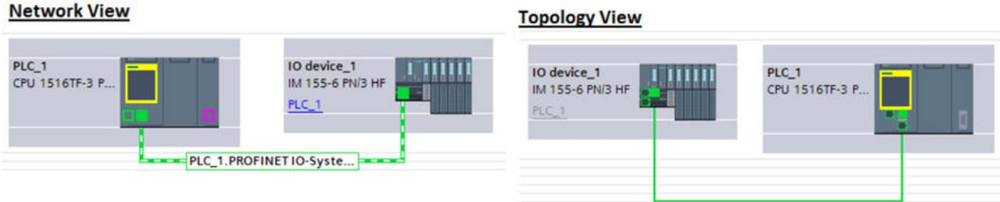
在导出期间为上述组态所生成的部分 AML 文件如以下示例所示：
```xml
<?xml version="1.0" encoding="utf-8"?>
<CAEXFile FileName="MultipleBA_01.aml" SchemaVersion="2.15"
xsi:noNamespaceSchemaLocation="CAEX_ClassModel_V2.15.xsd">
<AdditionalInformation>
<WriterHeader>
<WriterName>Totally Integrated Automation Portal</WriterName>
<WriterID>1d4fcebb-1ad6-4881-b01d-bca335d94a46:V1.0</WriterID>
<WriterVendor>Siemens AG</WriterVendor>
<WriterVendorURL>www.siemens.com</WriterVendorURL>
<WriterVersion>15</WriterVersion>
<WriterRelease>1501.0000.0.0</WriterRelease>
<LastWritingDateTime>2018-05-17T09:36:46.9230179Z</LastWritingDateTime>
</WriterHeader>
</AdditionalInformation>
<AdditionalInformation AutomationMLVersion="2.0" />
<AdditionalInformation DocumentVersions="Recommendations">
<Document DocumentIdentifier="AR APC" Version="1.1.0" />
</AdditionalInformation>
<InstanceHierarchy Name="APC Sample Instance Hierarchy">
<InternalElement ID="e005c094-1b0a-42c4-92a0-67c981508c1a" Name="Project45">
<Attribute Name="ProjectManufacturer" AttributeDataType="xs:string" />
<Attribute Name="ProjectSign" AttributeDataType="xs:string" />
<Attribute Name="ProjectRevision" AttributeDataType="xs:string" />
<Attribute Name="ProjectInformation" AttributeDataType="xs:string" />
<InternalElement ID="2782e61d-8c27-46cb-93ea-6b804157ae60" Name="PN/IE_1">
<Attribute Name="Type" AttributeDataType="xs:string">
<Value>Ethernet</Value>
</Attribute>
<ExternalInterface ID="2d901881-a2bf-4fe7-915f-b2542b346988" Name="LogicalEndPoint_Subnet"
RefBaseClassPath="CommunicationInterfaceClassLib/LogicalEndPoint" />
<SupportedRoleClass RefRoleClassPath="AutomationProjectConfigurationRoleClassLib/Subnet" />
...
<InternalElement ID="dc5cf410-2516-4b0b-adla-c43117d8c9b3" Name="BA 2xRJ45">
<Attribute Name="TypeName" AttributeDataType="xs:string">
<Value>BA 2xRJ45</Value>
</Attribute>
<Attribute Name="PositionNumber" AttributeDataType="xs:int">
<Value>127</Value>
</Attribute>
<Attribute Name="BuiltIn" AttributeDataType="xs:boolean">
<Value>false</Value>
</Attribute>
<Attribute Name="TypeIdentifier" AttributeDataType="xs:string">
<Value>OrderNumber:6ES7 193-6AR00-0AA0</Value>
</Attribute>
<Attribute Name="FirmwareVersion" AttributeDataType="xs:string">
<Value>V0.0</Value>
</Attribute>
<InternalElement ID="f04874a8-2d35-47c4-93ae-d6fdc2668479" Name="PROFINET interface">
```
```typescript
<Attribute Name="Label" AttributeDataType="xs:string">
    <Value>X1</Value>
    </Attribute>
    <Attribute Name="PositionNumber" AttributeDataType="xs:int">
    <Value>1</Value>
    </Attribute>
    <Attribute Name="BuiltIn" AttributeDataType="xs:boolean">
    <Value>true</Value>
    </Attribute>
    <ExternalInterface ID="81a7d9df-99b8-4eca-8e72-404b22bd05e7"
Name="LogicalEndPoint_Interface" RefBaseClassPath="CommunicationInterfaceClassLib/LogicalEndPoint" />
    <InternalElement ID="83eb7d69-8cd5-4217-a07a-0c656d215ec7" Name="IE1">
```

#### 在接口级具有子模块和集成端口的设备

在某些设备组态中，模块可支持集成端口和扩展端口（例如：通过子模块，即总线适配器）。例如：ET200SP CPU：CPU 1510SP-1 PN/6ES7 510-1DJ00-0AB0/V1.8。该 CPU 模块在同一接口下支持三个端口（两个端口通过总线适配器实现支持，以及一个集成端口）。
在此关于 TIA Portal 层级的示例中，“PROFINET 接口”有总线适配器、三个端口和一个节点。其中，Port\_1 和 Port\_2 逻辑上属于 BA 2xRJ45，Port\_3 逻辑上属于 PROFINET 接口，尽管这三个端口聚合在同一接口下。
导出期间：
• 子模块将获得“原始”接口及其连接相关信息。其中，BA 2xRJ45 获得原始接口及“IE1”、“Port\_1”和“Port\_2”。前端模块应具有“重复”接口（“以太网”类型），且其中仅集成端口“Port\_3”。
• 如果未插入子模块 (BA 2xRJ45)，则前端模块级的 PROFINET 接口应视为“原始”接口，并应具有“IE1”和“Port\_3”。
• 如果前端模块连接到子网/IoSystem，则相关链接信息（如 ExternalInterface 链接）只能作为“原始”接口的一部分导出（与“节点”下的子网相关的 ExternalInterface 链接，以及与“接口”下的 IoSystem 相关的 ExternalInterface 链接）。
• 与拓扑连接有关的链接信息是相应“端口”的一部分。
导入期间：
• 可从上述导出过程生成的 AML 文件中导入带有接口的模块，其具有子模块和集成端口。
• 在“重复”接口下处理冗余信息（节点、IoSystem 和链接）的方式应与“在同一接口下多个子模块”情况的处理方式相同。
以下组态显示了具有主从和拓扑连接的模块。
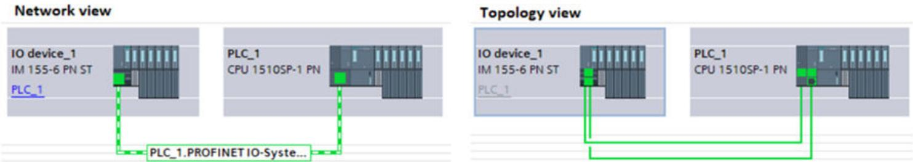
在导出期间为上述组态所生成的 AML 文件如下所示：
```xml
<?xml version="1.0" encoding="utf-8"?>
<CAEXFile FileName="Project_BusAdapter_Demo.aml" SchemaVersion="2.15"
xsi:noNamespaceSchemaLocation="CAEX_ClassModel_V2.15.xsd">
...
<AdditionalInformation AutomationMLVersion="2.0" />
<AdditionalInformation DocumentVersions="Recommendations">
<Document DocumentIdentifier="AR APC" Version="1.2.0" />
</AdditionalInformation>
<InternalElement ID="12b43940-cea6-476a-886c-11ebaa518256" Name="BA 2xRJ45">
...
<Attribute Name="TypeIdentifier" AttributeDataType="xs:string">
<Value>OrderNumber:6ES7 193-6AR00-0AA0</Value>
</Attribute>
<Attribute Name="FirmwareVersion" AttributeDataType="xs:string">
<Value>V0.0</Value>
</Attribute>
<InternalElement ID="8f8a4cdb-8f4b-4e72-8c92-b8fa1cc3bf70" Name="PROFINET interface_1">
...
<InternalElement ID="7a9938c3-ccc0-4d28-be35-333a343f3613" Name="E1">
...
<ExternalInterface ID="3d9f7f55-723f-4c5d-a2e7-ffe1ec3b9167" Name="LogicalEndPoint_Node" RefBaseClassPath="CommunicationInterfaceClassLib/LogicalEndPoint" />
<SupportedRoleClass RefRoleClassPath="AutomationProjectConfigurationRoleClassLib/Node" />
<SupportedRoleClass RefRoleClassPath="AutomationProjectConfigurationEthernetRoleClassLib/NodeEthernet" </InternalElement>
<InternalElement ID="3c4085cb-7565-4673-8de1-c5624c4c08dc" Name="PROFINET IO-System">
<Attribute Name="Number" AttributeDataType="xs:int">
<Value>100</Value>
</Attribute>
<ExternalInterface ID="7fb6129f-95c4-4d2c-aab5-702937198e80" Name="LogicalEndPoint_IoSystem" RefBaseClassPath="CommunicationInterfaceClassLib/LogicalEndPoint" />
<SupportedRoleClass RefRoleClassPath="AutomationProjectConfigurationRoleClassLib/IoSystem" />
</InternalElement>
<InternalElement ID="1f1d3e8d-55da-4355-b87e-7feb58d86143" Name="Port_1">
<Attribute Name="Label" AttributeDataType="xs:string">
<Value>P1R</Value>
</Attribute>
...
<ExternalInterface ID="850e3f32-985f-4432-b627-26e2775a69cc" Name="CommunicationPortInterface" RefBaseClassPath="AutomationProjectConfigurationInterfaceClassLib/CommunicationPortInterface" />
<SupportedRoleClass RefRoleClassPath="AutomationProjectConfigurationRoleClassLib/CommunicationPort" />
</InternalElement>
<InternalElement ID="11731ed5-7922-41c9-b179-a5ae029cc10d" Name="Port_2">
<Attribute Name="Label" AttributeDataType="xs:string">
<Value>P2R</Value>
```
```xml
</Attribute>
...
<SupportedRoleClass RefRoleClassPath="AutomationProjectConfigurationRoleClassLib/CommunicationPort" />
</InternalElement>
<SupportedRoleClass RefRoleClassPath="AutomationProjectConfigurationRoleClassLib/CommunicationInterface" />
</InternalElement>
<SupportedRoleClass RefRoleClassPath="AutomationProjectConfigurationRoleClassLib/DeviceItem" />
</InternalElement>
<InternalElement ID="7be36254-5ed6-4a6f-9e7b-90be8b35e595" Name="PROFINET interface_1">
<Attribute Name="Type" AttributeDataType="xs:string">
<Value>Ethernet</Value>
</Attribute>
...
<InternalElement ID="61ac6187-8a5d-4f98-ae91-b809c0a3a15d" Name="Port_3">
<Attribute Name="Label" AttributeDataType="xs:string">
<Value>P3</Value>
</Attribute>
...
<ExternalInterface ID="425f5a5d-84e2-40c6-928f-e1aab73a8b86"
Name="CommunicationPortInterface"
RefBaseClassPath="AutomationProjectConfigurationInterfaceClassLib/CommunicationPortInterface" />
<SupportedRoleClass RefRoleClassPath="AutomationProjectConfigurationRoleClassLib/CommunicationPort" />
</InternalElement>
<SupportedRoleClass RefRoleClassPath="AutomationProjectConfigurationRoleClassLib/CommunicationInterface" />
</InternalElement>
```

#### 裁剪的 AML

裁剪操作是指通过删除不需要的部分，对文件内容进行优化。有关裁剪的 AML 的信息，请参见“裁减的 AML (页 1635)”。
由于子模块被裁剪，因此可能发生 TIA Portal 和 CAD 工具（如 EPALN）中子模块组态层级不同的情况。在这种情况下，TIA Portal 支持导入已裁剪和未裁剪的 AML 文件。
• TIA Portal 始终导出未裁剪的 AML 文件。
• TIA Portal 始终导入已裁剪和未裁剪的 AML 文件
[连接到 TIA Portal](#连接到-TIA-Portal)
打开项目 (页 140)

### 6.5.17 在 UMAC 环境中导出/导入 AML 文件

简介
对于 TIA Portal V17，应可对受 UMAC 保护的项目执行 CAx 导出和导入操作。
对受保护项目执行的 CAx 操作基于下述功能权限：
• 具有读写访问权限的项目
• 通过 Openness API 修改项目
导出
CAx 导出操作不受限制。因此，无论是否具有上述用户权限，均应可对受保护项目执行导出操作。
导入
CAx 导入操作受限。如果用户具有上述访问权限，则导入应成功完成，否则应在 TIA Portal用户界面中显示缺少功能权限错误消息，或应为 CAx API 抛出未找到功能权限异常。

#### 用户功能权限和 CAx 操作

下表介绍了用户功能权限及其允许的 CAx 操作：
<table><tr><td rowspan="2">用户</td><td colspan="2">功能权限</td><td colspan="2">CAx 操作</td></tr><tr><td>具有读写访问权限的项目</td><td>通过 Openness API 修改项目</td><td>导出</td><td>导入</td></tr><tr><td>项目管理员</td><td>X</td><td>X</td><td>X</td><td>X</td></tr><tr><td>项目只读用户</td><td>-</td><td>X</td><td>X</td><td>-</td></tr><tr><td>无 Openness 访问权限的用户</td><td>X</td><td>-</td><td>X</td><td>-</td></tr><tr><td>无 Openness 访问权限的只读用户</td><td>-</td><td>-</td><td>X</td><td>-</td></tr></table>
• 自 TIA Portal V17 起，应可在对只读项目执行 CAx 导出操作。
要使用 CAx API 对受 UMAC 保护的项目执行导出和导入操作，需要在受 UMAC 保护的环境中打开项目。请参见通过 API 打开项目(页140)，了解如何在受 UMAC 保护的环境中打开项目。
打开项目 (页 140)

### 6.5.18 使用标准类型标识符导出/导入 AML 文件

简介
在 TIA Portal 中，类型标识符中的订货号采用不同的记法。为了能够导入和导出这些采用不同记法的订货号，以便与其它工具集成，现在允许处理自动化 AML 文件中的订货号。
为了导出 TIA Portal V16 及更低版本的 TypeIdentifier 格式，添加了新的设置：
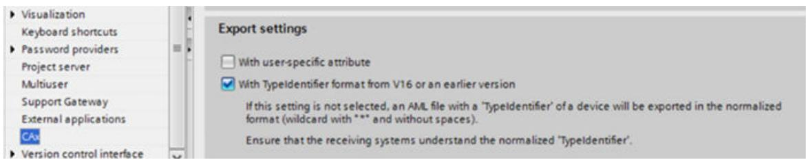
如果选中“使用 V16 及更低版本中的 TypeIdentifier 格式”(With TypeIdentifier format fromV16 and below) 这一复选框，AML 中的 TypeIdentifier 值将以旧格式导出，例如OrderNumber:6ES7 516-3AN00-0AB0。
如果取消选中该复选框，则在导出 AML 中的TypeIdentifier值时，订货号通配符以“\*”表示，且将移除空格，例如 OrderNumber:6ES7590-1\*\*\*0-0AA0。
导入过程中，任意通配符和空格均将作为TypeIdentifier 订货号的一部分被接受。

### 6.5.19 导入 CAx 数据（无逻辑地址）

要求
• TIA Portal Openness 应用程序已连接到 TIA Portal。 请[连接到 TIA Portal](#连接到-TIA-Portal)”
• 已打开一个项目
请[打开项目](#打开项目)”
在 TIA Portal 中，可使用 CAx 导入来组态通道和变量之间的连接，而无需 I/O 模块的起始地址和/或 AML 文件中指定的变量的逻辑地址。
以下 AML 文件示例描述了无起始地址和逻辑地址属性的情况下生成的 XML 文件。
```xml
<?xml version="1.0" encoding="utf-8"?><CAEXFile FileName="TagsExport.aml" SchemaVersion="2.15" xsi:noNamespaceSchemaLocation="CAEX_ClassModel_V2.15.xsd">
...
<InstanceHierarchy Name="APC Sample Instance Hierarchy">
<InternalElement ID="fff25423-fe9e-4334-9331-4cec118e06f7" Name="Project1">
...
<InternalElement ID="59c0b48b-aa6c-45c3-8dc8-bba5367bd4fb" Name="S7300/ET200M station_1">
...
<InternalElement ID="1b7b2b24-243b-4348-831e-bc46bc35957f" Name="Rail_0">
...
<InternalElement ID="974ca791-ad8d-482b-be80-2cf4e8dcedaf" Name="PLC_1">
...
<InternalElement ID="9564bcc2-8ea0-4be7-a950-5c55b34e474a" Name="Default tag table">
<ExternalInterface ID="7fd969e6-c2c9-45a8-b573-68833df327f5" Name="Tag_1" RefBaseClassPath="AutomationProjectConfigurationInterfaceClassLib/Tag">
<Attribute Name="DataType" AttributeDataType="xs:string">
<Value>Bool</Value>
</Attribute>
</ExternalInterface>
<ExternalInterface ID="33899862-86c1-4171-832a-1136b6e59b9d" Name="Tag_2" RefBaseClassPath="AutomationProjectConfigurationInterfaceClassLib/Tag">
<Attribute Name="DataType" AttributeDataType="xs:string">
<Value>Byte</Value>
</Attribute>
</ExternalInterface>
<SupportedRoleClass RefRoleClassPath="AutomationProjectConfigurationRoleClassLib/ TagTable" />
</InternalElement>
...
<Attribute Name="PositionNumber" AttributeDataType="xs:int">
<Value>8</Value>
</Attribute>
<Attribute Name="BuiltIn" AttributeDataType="xs:boolean">
<Value>true</Value>
</Attribute>
<Attribute Name="Address">
<RefSemantic CorrespondingAttributePath="OrderedListType" />
<Attribute Name="1">
<Attribute Name="StartAddress" AttributeDataType="xs:int">
<Value>832</Value>
</Attribute>
<Attribute Name="Length" AttributeDataType="xs:int">
<Value>128</Value>
</Attribute>
<Attribute Name="IoType" AttributeDataType="xs:string">
<Value>Input</Value>
</Attribute>
</Attribute>
<Attribute Name="2">
<Attribute Name="StartAddress" AttributeDataType="xs:int">
```
```xml
<Value>832</Value>
</Attribute>
<Attribute Name="Length" AttributeDataType="xs:int">
<Value>128</Value>
</Attribute>
<Attribute Name="IoType" AttributeDataType="xs:string">
<Value>Output</Value>
</Attribute>
</Attribute>
</Attribute>
<SupportedRoleClass RefRoleClassPath="AutomationProjectConfigurationRoleClassLib/DeviceItem" />
</InternalElement>
<SupportedRoleClass RefRoleClassPath="AutomationProjectConfigurationRoleClassLib/DeviceItem" />
</InternalElement>
<InternalElement ID="29e0bb63-0050-46e3-968a-fcecf4eb050a" Name="DI 16x24VDC_1">
<Attribute Name="TypeName" AttributeDataType="xs:string">
<Value>DI16 x 24VDC</Value>
</Attribute>
<Attribute Name="PositionNumber" AttributeDataType="xs:int">
<Value>4</Value>
</Attribute>
<Attribute Name="BuiltIn" AttributeDataType="xs:boolean">
<Value>false</Value>
</Attribute>
<Attribute Name="TypeIdentifier" AttributeDataType="xs:string">
<Value>OrderNumber:6ES7 321-1BH02-0AA0</Value>
</Attribute>
<Attribute Name="Address">
<RefSemantic CorrespondingAttributePath="OrderedListType" />
<Attribute Name="1">
<Attribute Name="Length" AttributeDataType="xs:int">
<Value>16</Value>
</Attribute>
<Attribute Name="IoType" AttributeDataType="xs:string">
<Value Animation</Value>
</Attribute>
</Attribute>
</Attribute>
<ExternalInterface ID="175dc9c9-f9a3-4b10-b43e-68dfc14811fc" Name="Channel_DI_0" RefBaseClassPath="AutomationProjectConfigurationInterfaceClassLib/Channel">
<Attribute Name="Type" AttributeDataType="xs:string">
<Value>Digital</Value>
</Attribute>
<Attribute Name="IoType" AttributeDataType="xs:string">
<Value>Input</Value>
</Attribute>
<Attribute Name="Number" AttributeDataType="xs:int">
<Value>0</Value>
</Attribute>
```
Openness：用于工程组态工作流自动化的 API系统手册, 11/2023
```xml
<Attribute Name="Length" AttributeDataType="xs:int">
    <Value>1</Value>
    </Attribute>
</ExternalInterface>
<ExternalInterface ID="23e99053-906c-4548-9bd2-e975cacf01b2" Name="Channel_DI_1" RefBaseClassPath="AutomationProjectConfigurationInterfaceClassLib/Channel">
    <Attribute Name="Type" AttributeDataType="xs:string">
    <Value>Digital</Value>
    </Attribute>
    <Attribute Name="IoType" AttributeDataType="xs:string">
    <Value Animation</Value>
    </Attribute>
    <Attribute Name="Number" AttributeDataType="xs:int">
    <Value>1</Value>
    </Attribute>
    <Attribute Name="Length" AttributeDataType="xs:int">
    <Value>1</Value>
    </Attribute>
    </ExternalInterface>
    <SupportedRoleClass RefRoleClassPath="AutomationProjectConfigurationRoleClassLib/DeviceItem" />
    </InternalElement>
    <SupportedRoleClass RefRoleClassPath="AutomationProjectConfigurationRoleClassLib/DeviceItem" />
    <InternalLink Name="Link To Tag_1" RefPartnerSideA="29e0bb63-0050-46e3-968a-fcecf4eb050a:Channel_DI_0" RefPartnerSideB="9564bcc2-8ea0-4be7-a950-5c55b34e474a:Tag_1" />
    <InternalLink Name="Link To Tag_2" RefPartnerSideA="29e0bb63-0050-46e3-968a-fcecf4eb050a:Channel_DI_0" RefPartnerSideB="9564bcc2-8ea0-4be7-a950-5c55b34e474a:Tag_2" />
    <InternalLink Name="Link To Tag_3" RefPartnerSideA="29e0bb63-0050-46e3-968a-fcecf4eb050a:Channel_DI_1" RefPartnerSideB="9564bcc2-8ea0-4be7-a950-5c55b34e474a:Tag_2" />
    <InternalLink Name="Link To Tag_4" RefPartnerSideA="29e0bb63-0050-46e3-968a-fcecf4eb050a:Channel_DI_2" RefPartnerSideB="9564bcc2-8ea0-4be7-a950-5c55b34e474a:Tag_2" />
    </InternalElement>
    <SupportedRoleClass RefRoleClassPath="AutomationProjectConfigurationRoleClassLib/Device" />
    </InternalElement>
    <SupportedRoleClass RefRoleClassPath="AutomationProjectConfigurationRoleClassLib/AutomationProject" />
    </InternalElement>
    </InstanceHierarchy>
</CAEXFile>
```

#### 布尔数据类型 (%I0.0) 的变量

对于以上 AML 文件示例，导入时，使用以下算法计算变量的逻辑地址：
逻辑地址 = ChannelIoType + ByteAddress + BitAddress
<table><tr><td>名称</td><td>说明</td></tr><tr><td>ChannelloType</td><td>输入 (I) 或输出 (Q)</td></tr><tr><td>ByteAddress</td><td>ByteAddress 的计算方法如下:I/O 模块的起始地址 * 8 + I/O 模块的位偏移地址 + (通道编号 * 通道长度) / 8</td></tr><tr><td>BitAddress</td><td>BitAddress 的计算方法如下:I/O 模块的位偏移地址 + (通道编号 * 通道长度) % 8</td></tr></table>
• 如果有一个变量跨多个模块：上述算法根据模块的起始地址和每个字节地址的位地址数组给出多个字节地址，分别对应于每个通道编号。此算法应选择最低字节地址和与该字节对应的位地址数组中的最低位，以计算变量的逻辑地址。将逻辑地址分配给变量后，导入期间 TIAPortal 将自动处理跨模块情况。
• 在 TIA Portal 中，只有几个设备组态（例如 ASI 模块）支持位偏移地址属性。对于不支持位偏移地址属性的模块，将考虑为上述计算使用默认值“0”。
以下是在 TIA Portal 中支持位地址的变量数据类型列表：
<table><tr><td>变量数据类型</td><td>位地址值</td></tr><tr><td>Bool</td><td>0至7</td></tr><tr><td>LReal</td><td rowspan="7">TIA Portal中的最高和最低位数字值为0。</td></tr><tr><td>LWord</td></tr><tr><td>LInt</td></tr><tr><td>ULInt</td></tr><tr><td>LTime</td></tr><tr><td>LDT</td></tr><tr><td>LTime_Of_Day</td></tr></table>
在 CAx 导入期间，如果将布尔变量组态为通道类型，则逻辑地址计算包含位偏移地址。逻辑地址将和位偏移一起在 TIA Portal UI 中更新为变量的逻辑地址。
使用其它支持位偏移地址的数据类型的变量
加果变量通道在两个不同的数据类型之间组态，其中布尔类型的通道映射到跨多个通道的↓D]类型的变量，则逻辑地址计算包含用于计算“LDT”数据类型变量的逻辑地址的位偏移地址，如
果位地址值是“0”以外的值，则变量逻辑地址在 TIA Portal UI 中更新时应提示错误，且变量通道组态不应出现。
必须确保在相似的数据类型之间进行变量-通道组态。

#### 其它数据类型 (%IB0) 的变量

逻辑地址 = ChannelIoType + TagDataType + ByteAddress
<table><tr><td>名称</td><td>说明</td></tr><tr><td>ChannelIoType</td><td>输入 (I) 或输出 (Q)</td></tr><tr><td>TagDataType</td><td>TagDataType 是变量类型的缩写。示例:W 代表字,B 代表字节</td></tr><tr><td>ByteAddress</td><td>ByteAddress 的计算方法如下:I/O 模块的起始地址 + (通道编号 * 通道长度) / 8</td></tr></table>
上文介绍的算法用于在以下情况下准确计算变量的逻辑地址
• 变量中指定的数据类型的长度应等于其映射到的通道的长度。
• 例如，如果数据类型为“字节”的变量映射到长度为 2 字节的模拟量通道：导入未指定变量逻辑地址的 AML 文件时；TIA Portal 中的变量应始终映射到通道的第一个字节，而不考虑其最初映射到哪一个字节。
• 如果有一个变量跨多个模块：上述算法根据模块的起始地址给出多个字节地址。此算法应选择最低字节地址来计算变量的逻辑地址。将具有最低字节地址的逻辑地址分配给变量后，导入期间 Portal 将自动处理跨模块情况。如果 AML 文件中未提供 I/O 模块的 StartAddress 属性，则默认值由 TIA portal 分配，同样应用于上述计算。
• 如果 AML 文件中未提供 I/O 模块的 StartAddress 属性，则默认值由 TIA portal 分配，同样应用于上述计算。
成功完成导入后，应在 TIA Portal 中为上例创建以下变量组态。
<table><tr><td colspan="9">Project1 ▶ PLC_1 [CPU 314C-2 PN/DP] ▶ PLC tags ▶ Default tag table [2]</td></tr><tr><td colspan="8"></td><td>Tags</td></tr><tr><td colspan="9">Default tag table</td></tr><tr><td></td><td>Name</td><td>Data type</td><td>Address</td><td>Retain</td><td>Acces...</td><td>Visibl...</td><td colspan="2">Comment</td></tr><tr><td>1</td><td>Tag_1</td><td>Bool</td><td>%IO.0</td><td></td><td></td><td></td><td colspan="2"></td></tr><tr><td>2</td><td>Tag_2</td><td>Byte</td><td>%IBO</td><td></td><td></td><td></td><td colspan="2"></td></tr><tr><td>3</td><td></td><td></td><td></td><td></td><td></td><td></td><td colspan="2"></td></tr></table>
打开项目 (页 140)  
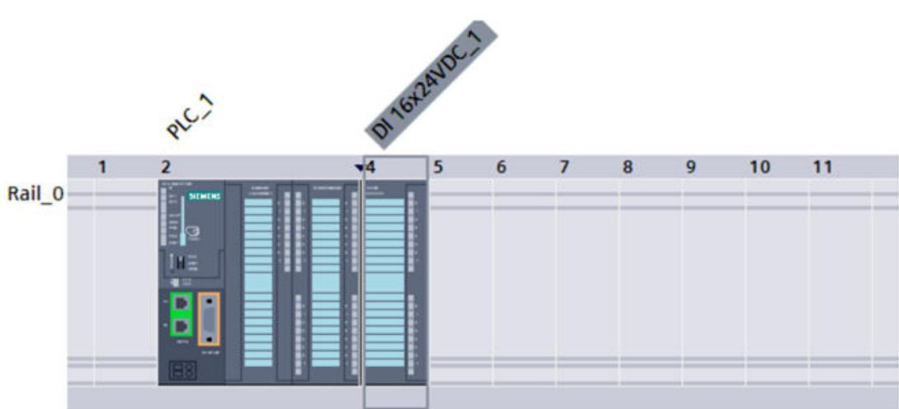
连接到 TIA Portal (页 90)

### 6.5.20 导入和导出 CAx 数据期间的异常


#### 因 TIA Openness 不可用而导致的异常

CAx 实现基于 TIA Openness Public API's。仅当用户在安装 TIA Portal 期间已安装 Openness选项包时，Openness Public API's 才可用。因此，在执行任何 CAx 相关功能之前，需要检查Openness 是否可用。（请[TIA Portal Openness 的安装](#TIA-Portal-Openness-的安装)”）
每当用户触发来自 TIA Portal UI 的 CAx 导出或 CAx 导入操作时，都会执行检查以查看系统中TIA Openness 的可用性。如果未安装 TIA Openness，系统将为用户显示一个 TIA Portal 消息对话框，即如下错误消息对话框。
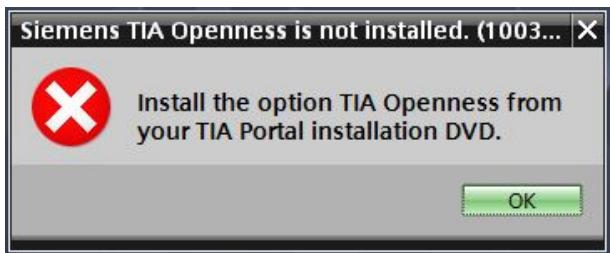

### 6.5.21 设备和模块的往返行程交换

要求
• TIA Portal Openness 应用程序已连接到 TIA Portal。请[连接到 TIA Portal](#连接到-TIA-Portal)
• 项目已经打开。
请[打开项目](#打开项目)
• PLC 处于离线状态。
可在 TIA Portal 和其它工程组态工具（例如，电气设计工具 EPLAN 或 TIA Selection Tool）之间交换组态数据。要识别导入的设备和导出的设备，请使用全局唯一标识符 AML GUID。
在数据双向交换过程中，设备和非内置设备项（CPU 或模块）等物理设备的 AML GUID 保持不变，但变量、通道之类的虚拟设备除外。
首次从 TIA Portal 导出时，系统将为设备或非内置设备项随机生成一个 AML GUID，之后该GUID 将保持不变。
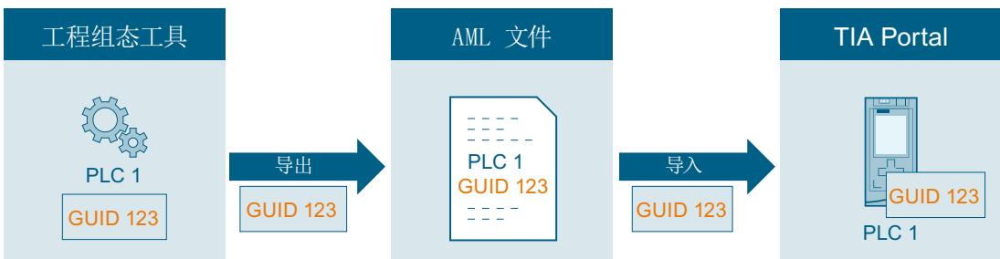
如果将设备从工程组态工具导出至空 TIA Portal 项目，则会将 AML GUID 添加到硬件对象的注释中。在 TIA Portal 中，通过菜单“工具 > 设置 > CAx > 导入设置”(Tools > Settings > CAx> Import settings) 启用相应设置时，该 AML GUID 将以当前的编辑语言添加。往返行程过程仅支持通过一种编辑语言存储 AML GUID。导入或导出数据时，通常使用开始数据通信时启动的编辑语言。
对于所有后续导入或导出，AML GUID 对该硬件对象始终保持不变。将恢复对硬件对象的更改。
在 TIA Portal 中，项目对象名称必须唯一。将设备或设备项导入 TIA Portal 项目中时，如果项目中已存在相同名称的对象，则将导致命名冲突。在导入过程中，可将发生命名冲突的对象移动到用户自定义的停驻区。所导入对象的名称将使用“\_CAX”进行扩展。
在 GUI 的 CAx 导出期间
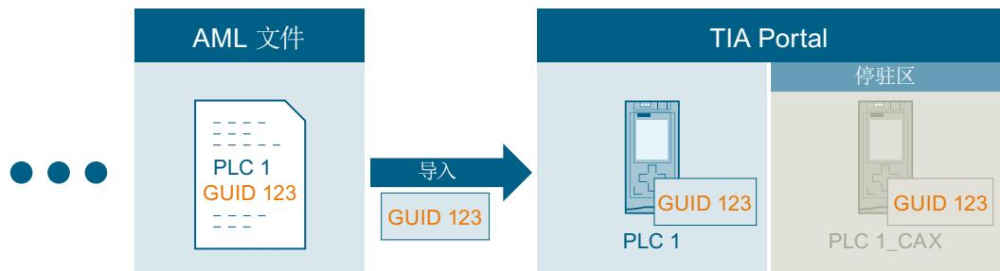
为在项目升级期间支持先前项目版本的 AML 双向交换，AML GUID 现在存储在
“CustomIdentity”(App ID) 而非设备/设备项的“Comment”部分。预期设备/设备项的 AMLGUID 将唯一且可以任何编辑语言存储。因此，在项目升级期间，视为所有注释编辑语言获取唯一的 AML GUID。尽管设备/设备项的 AML GUID 唯一，但如果将包含匹配 [AR\_APC:ID:\*]正则表达式新的 GUID 以任何编辑语言添加到注释，则从编辑语言拾取的第一个 GUID 将被视为设备/设备项的 AML GUID。
注释中的 AML GUID 移动到 CustomIdentity 后，将通过移除下图中所示的 [AR\_APC:ID:\*] 更新设备/设备项注释
如果注释包含多个 [AR\_APC:ID:\*] 部分，则与该模式匹配的 GUID 会设置到 CustomIdentity库，且会从注释中移除相同内容。其余文本将视为注释。

#### 复制导入的设备

复制一个带有 AML GUID 的设备或设备项时，则需删除所复制对象注释中的 AML GUID。否则，项目中将存在 AML GUID 相同的设备或设备项，从而导致 AML 文件无效。

#### 导入设置

1. 在“选项 > 设置 > CAx > 冲突解决方案设置”(Options > Settings > CAx > Settings for conflictresolution) 下定义停驻区文件夹名称。停驻区文件夹可用于存储造成命名冲突的对象。
2. 激活“选项 > 设置 > CAx > 导入设置 > 导入期间保存 GIUD”(Options > Settings > CAx > Import settings > Save GUIDs during import)。
导入期间：
• 物理设备的 GUID 将作为 CustomIdentity 部分的其中一部分进行存储
• 导入 AML 文件时，GUID 会作为 CustomIdentity 的一部分存储

#### 有效 AML GUID

如果在导入前编辑 AML GUID，则 AML GUID 将变为无效且会中止 CAx 导入操作并记录相应信息。

#### 超出注释长度

如果向注释附加 AML GUID 导致超出 500 个字符最大限值，则用户注释值将被减至 500 个字符。将记录相应的信息。
导出期间：
• 要导出的 GUID 将从 CustomIdentity 取得键 AR\_APC:ID。
• 如果 GUID 未能作为 CustomIdentity 的一部分获取，则会获取多用户 GUID 并导出为 AMLGUID
• 如果以上 2 个步骤无法提供物理设备的 GUID，则新的随机 GUID 可通过导出处理生成且被视为物理设备的 AML GUID。
生成的 ID 被导出至 AML 文件，如以下代码片段所示：
<InternalElement ID="23aeefd0-ce05-4116-a644-e33d43901eaf" Name="PLC\_1"

### 6.5.22 导出/导入拓扑结构

• TIA Portal Openness 应用程序已连接到 TIA Portal。 [连接到 TIA Portal](#连接到-TIA-Portal)”
• 已打开一个项目。
[打开项目](#打开项目)”
• PLC 处于离线状态。
在 TIA Portal 中，可将设备及其拓扑结构信息一同导出到一个 AML 文件。导入到一个空的TIA Portal 项目中时，所导入的设备项将保留其拓扑结构信息。
<InteralLink> 元素用于指示设备项目间端口互连的详细信息。该信息位于所连接设备的共同父设备下，且变量名称唯一。

#### "InternalLink" 元素的属性

下表显示了用于 CAx 导入和导出文件的相关对象属性：
<table><tr><td>属性</td><td>处理方式</td><td>注释</td></tr><tr><td>Name</td><td>必须项</td><td>变量名称的格式为&quot;Link to Port_n&quot;(其中,n为从1开始计数的具体互连端口数量)。</td></tr><tr><td>RefPartnerSide A</td><td>必须项</td><td>指示连接的端口.,格式为UniqueIDOfPort:CommunicationPortInterface</td></tr><tr><td>RefPartnerSide B</td><td>必须项</td><td>指示连接的端口.,格式为UniqueIDOfPort:CommunicationPortInterface</td></tr></table>
6.5 导入/导出硬件数据
示例：拓扑视图
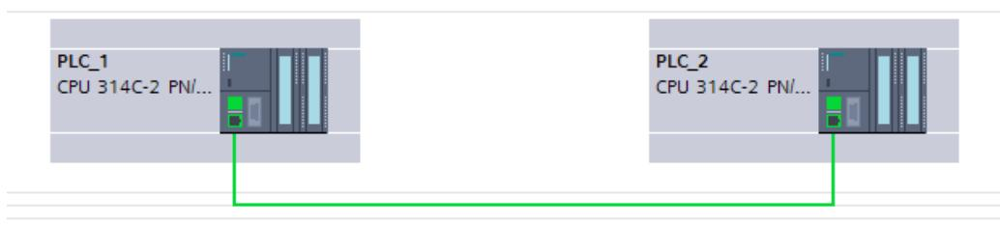
下图显示了所导出 AML 文件中的部分元素结构。其中，包含两个唯一的 PLC 端口 ID。
```txt
<InternalElement ID="e1966b52-b8b3-47b4-8866-a754ebb77648" Name="Port_1">
    <Attribute Name="Label" AttributeDataType="xs:string">
    ...
    <InternalElement ID="75f31daf-575f-48a2-ab35-8f07a376eb1b" Name="Port_1">
    <Attribute Name="Label" AttributeDataType="xs:string">
```
<InteralLink> 元素包含三个必须项属性。
```xml
<InternalLink Name="Link to Port_1"
RefPartnerSideA="e1966b52-b8b3-47b4-8866-a754ebb77648:CommunicationPortInterface"
RefPartnerSideB="75f31daf-575f-48a2-ab35-8f07a376eb1b:CommunicationPortInterface" />
```

### 6.5.23 通过库参考导入设备

要求
• TIA Portal Openness 应用程序已连接到 TIA Portal。 请[连接到 TIA Portal](#连接到-TIA-Portal)”
• 已打开一个项目
请[打开项目](#打开项目)”
可使用库参考将 AML 文件中的设备（站）/设备项（模块、子模块）导入到 TIA Portal 中。

#### 以下 AML 结构描述了导入到 TIA Portal 项目的操作过程中应使用的 XML 文件。

```txt
<InternalElement ID="bed34f88-7a3f-4e37-a32f-df1a6dcb954a" Name="S71500/ET200MP station_1">
<Attribute Name="TypeIdentifier" AttributeDataType="xs:string">
<Value>System:Device.S71500</Value>
<Attribute Name="TemplateIdentifier" AttributeDataType="xs:string">
<Value>GlobalLib://StationPlcLibrary/Master copies/DeviceFolder/S71500ET200MP station_1</Value>
</Attribute>
</Attribute>
<SupportedRoleClass RefRoleClassPath="AutomationProjectConfigurationRoleClassLib/Device" />
...
<InternalElement ID="5082f437-4198-4dcb-b794-35b6b9fcd104" Name="PLC_1">
<Attribute Name="TypeIdentifier" AttributeDataType="xs:string">
<Value>OrderNumber:6ES7 214-1BE30-0XB0</Value>
<Attribute Name="TemplateIdentifier" AttributeDataType="xs:string">
<Value>GlobalLib://StationPlcLibrary/Master copies/PLC_1</Value>
</Attribute>
</Attribute>
</InternalElement>
...
</InternalElement>
...
```
6.5 导入/导出硬件数据
示例：导入的组态
上面的 AML 片段对应于站，并在下文介绍了 TIA Portal 中的 PLC。
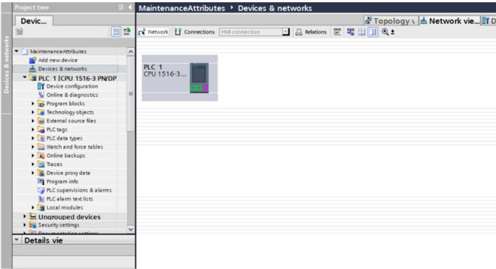
实现此功能需考虑以下几点：
• 此功能的范围限定了仅可使用全局库。
• 如果设备/设备项具有 TemplateIdentifier 属性，则其优先级要高于 Type Identifier。
• 假定导入操作中使用的全局库是在开始导入之前载入的，如果操作失败，应向用户显示相应的错误。
• 在库中的所有系统文件夹中，仅应为导入操作考虑“Master Copies”文件夹。
• 为支持 TIA Portal 的多语言字符，TemplateIdentifier 可使用以所有受支持 TIA 语言表示的主副本路径，但应以“GlobalLib://”开头。门户用户需要确保 TIA UI 和 AML 文件采用同一种语言。
• 为确保导入操作不出错，库中的设备/设备项主副本以及 AML 文件中的设备/设备项不应存在冲突项。如果存在冲突，还会导致数据丢失。
• 如果 AML 文件中的设备/设备项具有通用类型 ID 或者没有类型 ID 值，则应照常执行类型 ID替代的常规工作流程。但应通过TemplateIdentifier创建设备/设备项，创建后，类型 ID 不应与替代类型 ID 进行交叉验证。
• 在 AML 文件中，TypeIdentifier 属性下的 TemplateIdentifier 子属性可作用于任何可插拔项，且仅可作用于可插拔项。如果 AML 文件中的任何其它实体（例如通道/变量）具有模板参考，则应将其视为无效，并向用户显示相应的消息。
• TemplateIdentifier路径中的字符“/”应被视为用于分隔文件夹的分界符。如果主副本对象的名称中有字符“/”，可能导致 CAx 无法找到该主副本对象。
• 对于具有 TemplateIdentifier 的设备组态的导入合并用例，其原理与具有 TypeIdentifier 的设备组态相同。
• 只有 TypeIdentifier 的现有 AML 文件合并用例也应照常使用。
• 如果发生同一设备同时存在于 TIA 和 AML 文件（有一个库引用该 AML 文件）这类冲突，合并操作只能重命名站，而不能重命名 PLC。
• 如果输入输出模块是从主副本导入的，则为这些模块设置起始地址有一定的限制。将起始地址分配给模块后，如果起始地址是在导入期间通过TemplateIdentifier创建的，则无法设置起始地址。这里必须注意的是，用户应在为模块分配地址之前将模块添加到主副本中（在准备全局库时），也就是说，在将模块放入主副本之前，不应将模块连接到其主控制器。
• 带有具有“TemplateIdentifier”的设备/设备项的 V16/V17 AML 文件应在 TIA Portal V17 中成功导入
• 带有具有“TemplateReference”的设备/设备项的 V16/V17 AML 文件不应在 TIA Portal V17 中成功导入
• 带有具有“TemplateReference”的设备/设备项的 V16 AML 文件应在 V16 中成功导入。V16 TIAP的这一行为不会更改。
• 在 TIA Portal V17 之前，不支持在 TIA Portal 中拖放模块级（特别是头模块/CPU 等主模块）库的设备组态不可用于 CAx 库工作流程。
但这类组态支持拖放整个设备级库，用户应包含预组态机架和主模块作为设备主副本的一部分，并将其置于库中。
自 TIA Portal V17 起开始支持此功能，因此，CAx 也应扩展，以便从具有预组态机架和主模块的库中导入整个设备主副本。
以下是使用 AML 文件导入预装载设备主副本的预期行为。
• 在 TIA Portal V17 中，会通过同样从设备主副本保留的机架和主模块的库创建设备，因此，任何设备组态具有设备级库参考（具有机架和主模块）的 AML 文件应成功导入。
– 假设库参考有效
– 假设库中机架和主模块的 TypeIdentifier 与相应 AML TypeIdentifier 匹配
• 在 TIA Portal V17 中，仍会通过包含同样从设备主副本保留的机架和主模块的库创建设备，因此，任何设备组态具有设备级库参考（具有机架和主模块）的 AML 文件导入时应当报错。

#### – 库参考有效时

– 库中机架或主模块的 TypeIdentifier 与相应 AML TypeIdentifier 不匹配时
• 在 TIA Portal V17 中，仍会通过包含同样从设备主副本保留的机架和主模块的库创建设备，因此，以下情况下，任何设备组态具有设备级库参考（具有机架和主模块）的 AML 文件导入时应当不会提示警告
– 库参考有效时
– 设备主副本中的机架或主模块固件与相应 AML 固件不匹配时
• 在 TIA Portal V17 中，仍会通过包含同样从设备主副本保留的机架和主模块的库创建设备，因此，任何设备组态具有设备级库参考（具有机架和主模块）的 AML 文件导入时应当不会提示警告。
– AML 中缺少机架或主模块固件时

#### 库参考使用建议

一般来讲，CAx 应支持在 CAx 导入期间通过多种方式处理库参考。用户应使用任何允许的方式成功导入 AML 文件。例如：
1. 如果 TIA Portal 支持设备组态中主模块（比如头模块/CPU）的库工作流程作为“独立”主副本，则 CAx 用户应将包含设备/设备项的 AML 文件组态为具有“独立”库参考。这里预期主模块作为独立主副本存在于库中。
2. 如果 TIA Portal 不支持设备组态中主模块（比如头模块/CPU）的库工作流程作为“独立”主副本，则 CAx 用户应组态设备具有模板标识符的 AML 文件。这里预期主模块作为完整设备主副本存在于库中。
每个设备组态在 TIA Portal 都有不同的行为 wrt 库工作流程（拖放）。一些设备系列支持粒度级（设备项级）库工作流程，一些设备系列只支持完整设备级库工作流程，还有一些甚至两种都支持。因此，CAx 用户组态包含库参考的 AML 时应保留 TIA Portal 的相关设置。

#### 白名单和黑名单

• 如果白名单/黑名单中提到了设备/设备项，说明
– 设备/设备项已被验证为“独立”主副本，不含任何子设备项。
– 或设备组态已被验证为“完整”设备主副本，其中包含机架和主模块。
• 可在多个设备组态中使用设备项。但如果白名单中提到了某一设备项，并不意味着可在所有可能的组态中对该设备项进行库导入。
– 例如：如果固件版本 y 涉及到，则
\- 该设备项不可用于其它固件版本
\- 该设备项插入其它模块/站时不可运行
6.5 导入/导出硬件数据
下表列出了支持使用库参考导入的设备/设备项列表。
<table><tr><td colspan="2">白名单</td></tr><tr><td>Typeldentifier</td><td>FirmwareVersion</td></tr><tr><td>OrderNumber:6ES7 212-1HD30-0XB0</td><td></td></tr><tr><td>OrderNumber:6ES7 510-1DJ00-0AB0</td><td></td></tr><tr><td>OrderNumber:6ES7 221-3BD30-0XB0</td><td></td></tr><tr><td>OrderNumber:6ES7 511-1CK00-0AB0</td><td>V2.2</td></tr><tr><td>OrderNumber:6ES7 516-3AN01-0AB0</td><td>V1.8</td></tr><tr><td>OrderNumber:6ES7 518-4AP00-0AB0</td><td>V1.0</td></tr><tr><td>OrderNumber:6GK7 542-5DX00-0XE0</td><td>V1.8</td></tr><tr><td>OrderNumber:6ES7 611-4SB00-0YB7</td><td>V1.8</td></tr><tr><td>OrderNumber:6ES7 315-2FJ14-0AB0</td><td>V1.8</td></tr><tr><td>OrderNumber:6ES7 154-8AB01-0AB0</td><td>V1.0</td></tr><tr><td>OrderNumber:6ES7 141-4BF00-0AA0</td><td>V4.6</td></tr><tr><td>OrderNumber:6ES7 137-6BD00-0BA0</td><td>V3.1</td></tr><tr><td>OrderNumber:6ES7 147-4JD00-0AB0</td><td>V3.2</td></tr><tr><td>OrderNumber:6ES7 154-4AB10-0AB0</td><td></td></tr><tr><td>OrderNumber:3RK7 137-6SA00-0BC1</td><td>V2.2</td></tr><tr><td>OrderNumber:6ES7 518-4FP00-0AB0</td><td>V1.0</td></tr><tr><td>OrderNumber:6GK7 543-1AX00-0XE0</td><td>V7.0/Cu</td></tr><tr><td>OrderNumber:6ES7 516-2GN00-0AB0</td><td>V1.1</td></tr><tr><td>OrderNumber:6ES7 148-4CA00-0AA0</td><td>V2.5</td></tr><tr><td>OrderNumber:6ES7 148-4CA60-0AA0</td><td>V2.1</td></tr><tr><td>OrderNumber:6ES7 154-8FX00-0AB0</td><td>V2.1</td></tr><tr><td>OrderNumber:6ES7 148-4EA00-0AA0</td><td></td></tr><tr><td>OrderNumber:6ES7 151-7AA20-0AB0</td><td></td></tr><tr><td>OrderNumber:6ES7 138-4CA50-0AB0</td><td>V3.2</td></tr><tr><td>OrderNumber:6ES7 151-8AB00-0AB0</td><td></td></tr><tr><td>OrderNumber:6ES7 138-4CB11-0AB0</td><td>V2.6</td></tr><tr><td>OrderNumber:6ES7 151-7AA21-0AB0</td><td></td></tr><tr><td>OrderNumber:6ES7 138-4CA60-0AB0</td><td>V2.7</td></tr><tr><td>OrderNumber:6ES7 151-7FA21-0AB0</td><td></td></tr><tr><td>OrderNumber:6ES7 138-4CA01-0AA0</td><td>V3.3</td></tr></table>
6.5 导入/导出硬件数据
<table><tr><td colspan="2">白名单</td></tr><tr><td>Typeldentifier</td><td>FirmwareVersion</td></tr><tr><td>OrderNumber:6GT2002-0HD00</td><td></td></tr><tr><td>OrderNumber:6ES7 142-4BD00-0AA0</td><td>V3.3</td></tr><tr><td>OrderNumber:6SL3 235-0TE21-1RBO</td><td></td></tr><tr><td>OrderNumber:6SL3 235-0TE21-1SB0</td><td>V1.0</td></tr><tr><td>OrderNumber:6SL3 514-1KE13-5AE0</td><td></td></tr><tr><td>OrderNumber:6ES7 148-4EB00-0AA0</td><td>V3.1</td></tr><tr><td>OrderNumber:6ES7 143-4BF00-0AA0</td><td>V3.1</td></tr><tr><td>OrderNumber:6ES7 134-6JD00-0CA1</td><td>V4.7.6</td></tr><tr><td>OrderNumber:6ES7 193-6PA00-0AA0</td><td></td></tr><tr><td>OrderNumber:6ES7 512-1SK00-0AB0</td><td></td></tr><tr><td>OrderNumber:3RK1 308-0AB00-0CP0</td><td>V2.0</td></tr><tr><td>OrderNumber:6ES7 512-1DK00-0AB0</td><td>V1.1</td></tr><tr><td>OrderNumber:6ES7 137-6BD00-0BA0</td><td>V1.8</td></tr><tr><td>OrderNumber:6ES7 135-6HD00-0BA1</td><td>V1.1</td></tr><tr><td>OrderNumber:6ES7 137-6AA00-0BA0</td><td>V1.8</td></tr><tr><td>OrderNumber:6ES7 510-1SJ01-0AB0</td><td>V2.1</td></tr><tr><td>OrderNumber:6ES7 138-6AA00-0BA0</td><td>V1.1</td></tr><tr><td>OrderNumber:3RK1 308-0BE00-0CP0</td><td>V1.0</td></tr><tr><td>OrderNumber:6ES7 135-6HB00-0DA1</td><td>V2.1</td></tr><tr><td>OrderNumber:6ES7 134-6FF00-0AA1</td><td>V1.2</td></tr><tr><td>OrderNumber:3RK1 308-0AE00-0CP0</td><td>V1.1</td></tr><tr><td>OrderNumber:6ES7 390-1***0-0AA0</td><td>V2.0</td></tr><tr><td>OrderNumber:6ES7 307-1BA00-0AA0</td><td>V1.0</td></tr><tr><td>OrderNumber:6ES7 318-3FL01-0AB0</td><td>V1.1</td></tr><tr><td>OrderNumber:6ES7 338-7XF00-0AB0</td><td></td></tr><tr><td>OrderNumber:6ES7 307-1KA01-0AA0</td><td></td></tr><tr><td>OrderNumber:6ES7 317-2FK13-0AB0</td><td>V3.2</td></tr><tr><td>OrderNumber:6GT2002-0GA10</td><td></td></tr><tr><td>OrderNumber:6ES7 307-1EA00-0AA0</td><td></td></tr><tr><td>OrderNumber:6ES7 317-6FF04-0AB0</td><td>V2.6</td></tr><tr><td>OrderNumber:6ES7 323-1BH01-0AA0</td><td></td></tr><tr><td>TypeIdentifier</td><td>FirmwareVersion</td></tr><tr><td>OrderNumber:6ES7 307-1EA80-0AA0</td><td></td></tr><tr><td>OrderNumber:6ES7 315-2FJ14-0AB0</td><td>V3.3</td></tr><tr><td>OrderNumber:6ES7 350-1AH03-0AE0</td><td></td></tr><tr><td>OrderNumber:6ES7 307-1EA01-0AA0</td><td></td></tr><tr><td>OrderNumber:6ES7 318-3EL00-0AB0</td><td>V3.2</td></tr><tr><td>OrderNumber:6ES7 321-7EH00-0AB0</td><td></td></tr><tr><td>OrderNumber:6ES7 307-1KA02-0AA0</td><td></td></tr><tr><td>OrderNumber:6ES7 317-2EK13-0AB0</td><td>V2.8</td></tr><tr><td>OrderNumber:6ES7 323-1BL00-0AA0</td><td></td></tr><tr><td>OrderNumber:6ES7 314-6BG03-0AB0</td><td></td></tr><tr><td>OrderNumber:6ES7 340-1AH02-0AE0</td><td>V2.6</td></tr><tr><td>OrderNumber:6ES7 313-6BG04-0AB0</td><td></td></tr><tr><td>Typeldentifier</td><td>FirmwareVersion</td></tr><tr><td>OrderNumber:6ES7 360-3AA01-0AA0</td><td>V2.6</td></tr><tr><td>OrderNumber:6ES7 314-1AG13-0AB0</td><td>V1.0</td></tr><tr><td>OrderNumber:6ES7 321-7TH00-0AB0</td><td>V3.3</td></tr><tr><td>OrderNumber:3RK1 335-0AS01-0AA0</td><td></td></tr><tr><td>OrderNumber:3RK1 305-0AS01-0AA0</td><td>V2.6</td></tr><tr><td>OrderNumber:3RW4900-0NC0</td><td></td></tr><tr><td>OrderNumber:6ES7 518-4AP00-0AB0</td><td>V41.0</td></tr><tr><td>OrderNumber:6ES7 155-5AA00-0AA0</td><td></td></tr><tr><td>OrderNumber:6ES7 523-1BL00-0AA0</td><td>V2.0</td></tr><tr><td>OrderNumber:6ES7 534-7QE00-0AB0</td><td>V2.1</td></tr><tr><td>OrderNumber:6ES7 157-1AA00-0AB0</td><td>V4.0</td></tr><tr><td>OrderNumber:6ES7 144-5KD00-0BA0</td><td>V1.0</td></tr><tr><td>OrderNumber:6ES7 145-5ND00-0BA0</td><td>V1.0</td></tr><tr><td>OrderNumber:6ES7 143-5AF00-0BA0</td><td>V1.0</td></tr><tr><td>OrderNumber:6ES7 147-5JD00-0BA0</td><td>V1.0</td></tr><tr><td>OrderNumber:6ES7 314-6EH04-0AB0</td><td>V1.0</td></tr><tr><td>OrderNumber:6ES7 153-4BA00-0XB0</td><td>V1.0</td></tr><tr><td>OrderNumber:6GK7 343-2AH01-0XA0</td><td>V1.0</td></tr><tr><td>OrderNumber:6ES7 155-6BU00-0CNO</td><td>V3.3</td></tr><tr><td>OrderNumber:6ES7 131-6BF00-0BA0</td><td>V4.0</td></tr><tr><td>OrderNumber:6ES7 516-3AN01-0AB0</td><td>V3.1</td></tr><tr><td>OrderNumber:6EP1332-4BA00</td><td>V3.1</td></tr><tr><td>OrderNumber:6EP3436-8MB00-2CY0</td><td>V1.1</td></tr><tr><td>OrderNumber:6EP4293-8HB00-0XY0</td><td>V2.1</td></tr><tr><td>OrderNumber:6EP4297-8HB00-0XY0</td><td></td></tr><tr><td>OrderNumber:6ES7 212-1BD30-0XBO</td><td>V1.1</td></tr><tr><td>OrderNumber:6EP4137-3AB00-2AY0</td><td>V1.1</td></tr><tr><td>OrderNumber:6EP4134-0GB00-0AY0</td><td>V1.1</td></tr><tr><td>OrderNumber:6ES7 516-3AN00-0AB0</td><td>V2.2</td></tr><tr><td>OrderNumber:6ES7 400-1TA01-0AA0</td><td>V2.2</td></tr><tr><td>OrderNumber:6ES7 405-0DA02-0AA0</td><td>V1.0</td></tr><tr><td>OrderNumber:6ES7 414-3EM05-0AB0</td><td>V1.8</td></tr><tr><td>OrderNumber:6ES7 412-1XJ05-0AB0</td><td></td></tr><tr><td>OrderNumber:6GK7 443-1EX11-0XE0</td><td></td></tr><tr><td>OrderNumber:6ES7 312-1AE13-0AB0</td><td>V5.3</td></tr><tr><td>OrderNumber:6GK7 343-1CX10-0XE0</td><td>V5.3</td></tr><tr><td>OrderNumber:6GK7 443-5DX04-0XE0</td><td>V2.7</td></tr><tr><td>OrderNumber:6GK7 342-5DA02-0XE0</td><td>V2.6</td></tr><tr><td>OrderNumber:6ES7 511-1AK00-0AB0</td><td>V2.4</td></tr><tr><td>OrderNumber:6GK7 542-1AX00-0XE0</td><td>V6.6</td></tr><tr><td>OrderNumber:6ES7 211-1BD30-0XB0</td><td>V5.0</td></tr><tr><td>OrderNumber:6GK7 242-7KX30-0XE0</td><td>V1.8</td></tr><tr><td>OrderNumber:6ES7 414-3EM05-0AB0</td><td>V1.0</td></tr><tr><td>OrderNumber:6ES7 151-1AA05-0AB0</td><td>V2.2</td></tr><tr><td>OrderNumber:6ES7 155-5AA00-0AC0</td><td>V1.0</td></tr><tr><td>OrderNumber:6ES7 155-6BU00-0CNO</td><td>V5.2</td></tr><tr><td>OrderNumber:6ES7 193-6PA00-0AA0</td><td></td></tr><tr><td>OrderNumber:6ES7 505-0KA00-0AB0</td><td>V3.0</td></tr><tr><td>OrderNumber:6ES7 521-1BH50-0AA0</td><td>V3.0</td></tr><tr><td>OrderNumber:6ES7 511-1TK01-0AB0</td><td>V1.0</td></tr><tr><td>OrderNumber:6ES7 515-2TM01-0AB0</td><td>V1.0</td></tr><tr><td>OrderNumber:6ES7 521-1BH00-0AB0</td><td>V2.0</td></tr><tr><td>OrderNumber:6ES7 521-1BL10-0AA0</td><td>V2.1</td></tr><tr><td>OrderNumber:6ES7 521-7EH00-0AB0</td><td>V2.1</td></tr><tr><td>OrderNumber:6ES7 521-1FH00-0AA0</td><td>V2.1</td></tr><tr><td>OrderNumber:6ES7 522-5HH00-0AB0</td><td>V1.0</td></tr><tr><td>OrderNumber:6AG1 511-1AK00-7AB0</td><td>V1.0</td></tr><tr><td>OrderNumber:6AG1 505-0KA00-7AB0</td><td>V2.0</td></tr><tr><td>OrderNumber:6AG1 531-7KF00-7AB0</td><td>V1.0</td></tr><tr><td>OrderNumber:6AG1 531-7NF10-7AB0</td><td>V1.8</td></tr><tr><td>OrderNumber:6AG1 532-5HD00-7AB0</td><td>V1.0</td></tr></table>
6.5 导入/导出硬件数据
<table><tr><td colspan="2">白名单</td></tr><tr><td>Typeldentifier</td><td>FirmwareVersion</td></tr><tr><td>OrderNumber:6AG1 532-5HF00-7AB0</td><td>V2.0</td></tr><tr><td>OrderNumber:6AG1 521-1BH00-7AB0</td><td>V2.0</td></tr><tr><td>OrderNumber:6AG1 521-1FH00-7AA0</td><td>V2.0</td></tr><tr><td>OrderNumber:6AG1 522-1BF00-7AB0</td><td>V2.0</td></tr><tr><td>OrderNumber:6AG1 522-5FF00-7AB0</td><td>V2.0</td></tr><tr><td>OrderNumber:6AG1 550-1AA00-7AB0</td><td>V2.0</td></tr><tr><td>OrderNumber:6ES7 522-1BH01-0AB0</td><td>V2.0</td></tr><tr><td>OrderNumber:6AG1 513-1AL00-2AB0</td><td>V2.0</td></tr><tr><td>OrderNumber:6AG1 541-1AB00-7AB0</td><td>V1.1</td></tr><tr><td>OrderNumber:6AG1 542-5DX00-7XE0</td><td>V1.0</td></tr><tr><td>OrderNumber:6ES7 505-0RA00-0AB0</td><td>V1.8</td></tr><tr><td>OrderNumber:6ES7 518-4AP00-3AB0</td><td>V1.0</td></tr><tr><td>OrderNumber:6GK7 542-1AX00-0XE0</td><td>V1.0</td></tr><tr><td>OrderNumber:6ES7 551-1AB00-0AB0</td><td>V1.0</td></tr><tr><td>OrderNumber:6ES7 531-7PF00-0AB0</td><td>V2.1</td></tr><tr><td>OrderNumber:6AG1 516-3AN00-7AB0</td><td>V2.0</td></tr><tr><td>OrderNumber:6ES7 517-3TP00-0AB0</td><td>V1.1</td></tr><tr><td>OrderNumber:6ES7 540-1AD00-0AA0</td><td>V1.1</td></tr><tr><td>OrderNumber:6ES7 532-5HD00-0AB0</td><td>V1.8</td></tr><tr><td>OrderNumber:6ES7 507-0RA00-0AB0</td><td>V2.1</td></tr><tr><td>OrderNumber:6ES7 515-2AM00-0AB0</td><td>V1.0</td></tr><tr><td>OrderNumber:7MH4 980-1AA01</td><td>V2.1</td></tr><tr><td>OrderNumber:7MH4 980-2AA01</td><td>V1.0</td></tr><tr><td>OrderNumber:6ES7 553-1AA00-0AB0</td><td>V1.8</td></tr><tr><td>OrderNumber:6ES7 552-1AA00-0AB0</td><td></td></tr><tr><td>OrderNumber:6ES7 550-1AA00-0AB0</td><td></td></tr><tr><td>OrderNumber:6AG1 516-3AN00-2AB0</td><td>V1.0</td></tr><tr><td>OrderNumber:6AG1 540-1AD00-7AA0</td><td>V1.0</td></tr><tr><td>OrderNumber:6AG1 540-1AB00-7AA0</td><td>V1.1</td></tr><tr><td>OrderNumber:6AG1 541-1AD00-7AB0</td><td>V1.8</td></tr><tr><td>OrderNumber:6ES7 511-1CK00-0AB0</td><td>V1.0</td></tr><tr><td>OrderNumber:6ES7 531-7NF10-0AB0</td><td>V1.0</td></tr><tr><td>OrderNumber:6ES7 532-5HF00-0AB0</td><td>V1.0</td></tr><tr><td>OrderNumber:6ES7 512-1CK00-0AB0</td><td>V2.1</td></tr><tr><td>OrderNumber:6ES7 521-1BH10-0AA0</td><td>V2.1</td></tr><tr><td>OrderNumber:6ES7 522-1BF00-0AB0</td><td>V2.1</td></tr><tr><td>OrderNumber:6ES7 212-1BE40-0XB0</td><td>V2.1</td></tr><tr><td>OrderNumber:6ES7 234-4HE32-0XB0</td><td>V1.0</td></tr><tr><td>OrderNumber:6ES7 223-1BH30-0XB0</td><td>V2.1</td></tr><tr><td>OrderNumber:6GK7 243-1BX30-0XE0</td><td>V4.2</td></tr><tr><td>OrderNumber:3RK7243-2AA30-0XB0</td><td>V2.0</td></tr><tr><td>OrderNumber:6ES7 217-1AG40-0XB0</td><td>V1.0</td></tr><tr><td>OrderNumber:6GT2 002-0LA00</td><td>V3.0</td></tr><tr><td>OrderNumber:6ES7 518-4FP00-0AB0</td><td>V1.1</td></tr><tr><td>OrderNumber:6ES7 517-3UP00-0AB0</td><td>V4.2</td></tr><tr><td>OrderNumber:6ES7 511-1FK00-0AB0</td><td>V1.0</td></tr><tr><td>OrderNumber:6ES7 531-7QD00-0AB0</td><td>V2.1</td></tr><tr><td>OrderNumber:6ES7 517-3AP00-0AB0</td><td>V2.1</td></tr><tr><td>OrderNumber:6ES7 522-5EH00-0AB0</td><td>V1.8</td></tr><tr><td>OrderNumber:6ES7 522-1BH10-0AA0</td><td>V1.0</td></tr><tr><td>OrderNumber:3SU1 400-1LK10-*AA1</td><td>V2.1</td></tr><tr><td>OrderNumber:3SU1 400-1MA10-1BA1</td><td>V1.0</td></tr><tr><td>OrderNumber:6EP3436-8MB00-2CY0</td><td>V1.0</td></tr><tr><td>OrderNumber:6EP4436-8XB00-0CY0</td><td>V1.0</td></tr><tr><td>OrderNumber:6EP4131-0GB00-0AY0</td><td>V1.2</td></tr><tr><td>GSD:SIEM804C.GSD/M/0</td><td>V1.2</td></tr><tr><td>OrderNumber:6ES7 143-2BH*0-0AB0</td><td>V1.0</td></tr><tr><td>OrderNumber:6ES7 143-2BH00-0AB0</td><td></td></tr><tr><td>OrderNumber:6ES7 407-0DA02-0AA0</td><td></td></tr><tr><td>OrderNumber:6ES7 460-0AA01-0AB0</td><td></td></tr><tr><td>OrderNumber:6ES7 412-2XK07-0AB0</td><td></td></tr><tr><td>OrderNumber:6ES7 450-1AP00-0AE0</td><td></td></tr></table>
6.5 导入/导出硬件数据
<table><tr><td colspan="2">白名单</td></tr><tr><td>Typeldentifier</td><td>FirmwareVersion</td></tr><tr><td>OrderNumber:6ES7 211-1AE31-0XB0</td><td></td></tr><tr><td>OrderNumber:6ES7 241-1CH32-0XB0</td><td>V7.0</td></tr><tr><td>OrderNumber:6ES7 211-1HD30-0XB0</td><td></td></tr><tr><td>OrderNumber:6ES7 241-1AH30-0XB0</td><td>V3.0</td></tr><tr><td>OrderNumber:6ES7 212-1AE31-0XB0</td><td>V2.2</td></tr><tr><td>OrderNumber:6ES7 221-1BF32-0XB0</td><td>V2.2</td></tr><tr><td>OrderNumber:6ES7 232-4HD30-0XB0</td><td>V1.0</td></tr><tr><td>OrderNumber:6ES7 510-1DJ01-0AB0</td><td>V3.0</td></tr><tr><td>OrderNumber:6ES7 512-1DK01-0AB0</td><td>V2.0</td></tr><tr><td>OrderNumber:6ES7 157-1AB00-0AB0</td><td>V1.0</td></tr><tr><td>OrderNumber:6ES7 512-1CK00-0AB0</td><td>V1.8</td></tr><tr><td>OrderNumber:6AG1 155-6AU00-7BN0</td><td>V1.8</td></tr><tr><td>OrderNumber:6AG1 193-6PA00-7AA0</td><td>V1.0</td></tr><tr><td>OrderNumber:6AG1 155-6AU00-7BN0</td><td>V1.8</td></tr><tr><td>OrderNumber:6ES7 313-6CF03-0AB0</td><td>V1.0</td></tr><tr><td>OrderNumber:6ES7 318-3EL00-0AB0</td><td>V1.0</td></tr><tr><td>OrderNumber:6ES7 151-3BA23-0AB0</td><td>V3.1</td></tr><tr><td>OrderNumber:3RK1 903-0BA00</td><td>V2.6</td></tr><tr><td>OrderNumber:3RK1 301-0BB13-1AA4</td><td>V2.7</td></tr><tr><td>OrderNumber:6ES7 518-4AP00-0AB0</td><td>V7.0</td></tr><tr><td>OrderNumber:6ES7 154-8AB00-0AB0</td><td></td></tr><tr><td>OrderNumber:6ES7 144-4PF00-0AB0</td><td></td></tr><tr><td>OrderNumber:6ES7 151-1BA02-0AB0</td><td>V1.6</td></tr><tr><td>OrderNumber:6ES7 131-4BB01-0AB0</td><td>V2.5</td></tr><tr><td>OrderNumber:6ES7 132-4BB01-0AA0</td><td></td></tr><tr><td>OrderNumber:6ES7 131-4BB01-0AA0</td><td></td></tr><tr><td>OrderNumber:6ES7 132-4BD00-0AB0</td><td></td></tr><tr><td>OrderNumber:6ES7 407-0KA02-0AA0</td><td></td></tr><tr><td>OrderNumber:6ES7 401-1DA01-0AA0</td><td></td></tr><tr><td>OrderNumber:6ES7 416-3ES06-0AB0</td><td></td></tr><tr><td>OrderNumber:6ES7 318-3EL01-0AB0</td><td></td></tr><tr><td>OrderNumber:6ES7 138-4DA04-0AB0</td><td></td></tr><tr><td>OrderNumber:6ES7 518-4FP00-3AB0</td><td>V6.0</td></tr><tr><td>OrderNumber:6ES7 317-2AJ10-0AB0</td><td>V3.2</td></tr><tr><td>OrderNumber:6ES7 132-4HB50-0AB0</td><td>V1.0</td></tr><tr><td>OrderNumber:6ES7 132-4BB31-0AA0</td><td>V2.0</td></tr><tr><td>OrderNumber:6ES7 416-3ER05-0AB0</td><td>V2.6</td></tr><tr><td>OrderNumber:6ES7 151-1AA04-0AB0</td><td></td></tr><tr><td>GSD:SIEM818A.GSD/M/70000</td><td></td></tr><tr><td>GSD:SIEM818A.GSD/M/13</td><td>V5.3</td></tr><tr><td>OrderNumber:6ES7 155-6AU00-0CNO</td><td></td></tr><tr><td>OrderNumber:6ES7 412-2XJ05-0AB0</td><td></td></tr><tr><td>OrderNumber:6ES7 431-7QH00-0AB0</td><td></td></tr><tr><td>OrderNumber:6ES7 432-1HF00-0AB0</td><td>V3.3</td></tr><tr><td>OrderNumber:6ES7 460-1BA01-0AB0</td><td>V5.3</td></tr><tr><td>OrderNumber:6ES7 416-2XN05-0AB0</td><td></td></tr><tr><td>GSD:SIEM818A.GSD/M/18</td><td></td></tr><tr><td>OrderNumber:7MH4 138-6AA00-0BA0</td><td></td></tr><tr><td>OrderNumber:6ES7 155-6AU00-0BN0</td><td>V5.3</td></tr><tr><td>OrderNumber:6ES7 513-1AL00-0AB0</td><td></td></tr><tr><td>OrderNumber:6ES7 521-1BL00-0AB0</td><td></td></tr><tr><td>OrderNumber:6ES7 522-1BL00-0AB0</td><td>V3.3</td></tr><tr><td>OrderNumber:6ES7 522-1BH00-0AB0</td><td>V1.8</td></tr><tr><td>OrderNumber:6ES7 540-1AB00-0AA0</td><td>V2.1</td></tr><tr><td>OrderNumber:6ES7 541-1AB00-0AB0</td><td>V2.0</td></tr><tr><td>OrderNumber:6GK7 542-5DX00-0XE0</td><td>V2.0</td></tr><tr><td>OrderNumber:6ES7 317-2EK14-0AB0</td><td>V1.0</td></tr><tr><td>OrderNumber:6ES7 516-3AN00-0AB0</td><td>V1.0</td></tr><tr><td>OrderNumber:6GK7 542-5FX00-0XE0</td><td>V2.0</td></tr><tr><td>OrderNumber:6GK7 543-1AX00-0XE0</td><td>V3.2</td></tr><tr><td>OrderNumber:6GK7 543-1AX00-0XE0</td><td>V1.1</td></tr><tr><td>OrderNumber:6ES7 516-3AN00-0AB0</td><td>V1.0</td></tr></table>
6.5 导入/导出硬件数据
<table><tr><td colspan="2">白名单</td></tr><tr><td>Typeldentifier</td><td>FirmwareVersion</td></tr><tr><td>OrderNumber:6GK7 242-7KX30-0XE0</td><td>V1.0</td></tr><tr><td>OrderNumber:6ES7 211-1BE31-0XB0</td><td>V1.1</td></tr><tr><td>OrderNumber:6GK7 243-1JX30-0XE0</td><td>V1.5</td></tr><tr><td>OrderNumber:6GK7 243-5DX30-0XE0</td><td>V1.3</td></tr><tr><td>OrderNumber:6ES7 132-4BB01-0AB0</td><td>V3.0</td></tr><tr><td>OrderNumber:6ES7 152-1AA00-0AB0</td><td>V1.0</td></tr><tr><td>OrderNumber:6ES7 132-7GD00-0AB0</td><td>V1.0</td></tr><tr><td>OrderNumber:6ES7 334-0KE00-0AB0</td><td></td></tr><tr><td>OrderNumber:6ES7 151-3BA23-0AB0</td><td>V2.0</td></tr><tr><td>OrderNumber:OPC Server</td><td></td></tr><tr><td>OrderNumber:Application</td><td></td></tr><tr><td>OrderNumber:6ES7 214-1BG40-0XB0</td><td>V6.0</td></tr><tr><td>OrderNumber:6ES7 221-1BH32-0XB0</td><td>SW V14 ...</td></tr><tr><td>OrderNumber:6ES7 222-1XF30-0XB0</td><td>SW V8.1 SP2 ...</td></tr><tr><td>OrderNumber:6ES7 223-1QH30-0XB0</td><td>V4.2</td></tr><tr><td>OrderNumber:6ES7 231-4HF30-0XB0</td><td>V2.0</td></tr><tr><td>OrderNumber:6ES7 234-4HE30-0XB0</td><td>V1.0</td></tr><tr><td>OrderNumber:7MH4960-2AA01</td><td>V1.0</td></tr><tr><td>OrderNumber:6ES7 214-1AG40-0XB0</td><td>V1.0</td></tr><tr><td>OrderNumber:6ES7 228-1RC52-0AA0</td><td>V1.0</td></tr><tr><td>OrderNumber:6ES7 278-4BD32-0XB0</td><td></td></tr><tr><td>OrderNumber:6ES7 214-1HG31-0XB0</td><td>V4.2</td></tr><tr><td>OrderNumber:7MH4960-6AA01</td><td>V2.2</td></tr><tr><td>OrderNumber:7MH4960-4AA01</td><td>V2.0</td></tr><tr><td>OrderNumber:6ES7 223-1PL30-0XB0</td><td>V3.0</td></tr><tr><td>OrderNumber:6ES7 215-1BG40-0XB0</td><td></td></tr><tr><td>OrderNumber:6ES7 231-4HD30-0XB0</td><td></td></tr><tr><td>OrderNumber:6ES7 231-5PD32-0XB0</td><td>V1.0</td></tr><tr><td>OrderNumber:6ES7 231-5QF30-0XB0</td><td>V4.2</td></tr><tr><td>OrderNumber:6ES7 232-4HB32-0XB0</td><td>V1.0</td></tr><tr><td>OrderNumber:3RK1 301-0CB10-1AB4</td><td>V2.0</td></tr><tr><td>OrderNumber:3RK1 903-0CK00</td><td>V1.0</td></tr><tr><td>OrderNumber:6ES7 215-1HF40-0XB0</td><td>V2.0</td></tr><tr><td>OrderNumber:6ES7 212-1AF40-0XB0</td><td>V10.0</td></tr><tr><td>OrderNumber:6ES7 214-1HF40-0XB0</td><td></td></tr><tr><td>OrderNumber:6ES7 214-1AF40-0XB0</td><td>V4.2</td></tr><tr><td>OrderNumber:6ES7 515-2FM00-0AB0</td><td>V4.2</td></tr><tr><td>OrderNumber:6ES7 511-1UK01-0AB0</td><td>V4.2</td></tr><tr><td>OrderNumber:6ES7 215-1AG31-0XB0</td><td>V4.2</td></tr><tr><td>OrderNumber:6ES7 221-1BF30-0XB0</td><td>V1.8</td></tr><tr><td>OrderNumber:6ES7 222-1XF32-0XB0</td><td>V2.1</td></tr><tr><td>OrderNumber:6ES7 222-1HF30-0XB0</td><td>V3.0</td></tr><tr><td>OrderNumber:6ES7 223-1BL30-0XB0</td><td>V1.0</td></tr><tr><td>OrderNumber:6ES7 215-1HG40-0XB0</td><td>V2.0</td></tr><tr><td>OrderNumber:6ES7 241-1CH31-0XB0</td><td>V1.0</td></tr><tr><td>OrderNumber:6ES7 212-1HF40-0XB0</td><td>V1.0</td></tr><tr><td>OrderNumber:6AG1 214-1AG40-4XB0</td><td>V4.2</td></tr><tr><td>OrderNumber:6AG1 221-1BF32-2XB0</td><td>V1.0</td></tr><tr><td>OrderNumber:6AG1 221-1BF32-4XB0</td><td>V4.2</td></tr><tr><td>OrderNumber:6AG1 222-1BH32-2XB0</td><td>V4.2</td></tr><tr><td>OrderNumber:6AG1 222-1BF32-4XB0</td><td>V2.0</td></tr><tr><td>OrderNumber:6AG1 223-1BL32-2XB0</td><td>V2.0</td></tr><tr><td>OrderNumber:6AG1 214-1HG40-2XB0</td><td>V2.0</td></tr><tr><td>OrderNumber:6AG1 223-1PH32-2XB0</td><td>V2.0</td></tr><tr><td>OrderNumber:6AG1 223-1PL32-4XB0</td><td>V2.0</td></tr><tr><td>OrderNumber:6AG1 223-1QH32-4XB0</td><td>V4.2</td></tr><tr><td>OrderNumber:6AG1 222-1XF32-2XB0</td><td>V2.0</td></tr><tr><td>OrderNumber:6AG1 222-1HF32-4XB0</td><td>V2.0</td></tr><tr><td>OrderNumber:6AG1 222-1HH32-2XB0</td><td>V2.0</td></tr><tr><td>OrderNumber:6AG1 215-1BG40-5XB0</td><td>V2.0</td></tr><tr><td>OrderNumber:6AG1 231-5QF32-4XB0</td><td>V2.0</td></tr><tr><td>OrderNumber:6AG1 231-4HD32-4XB0</td><td>V2.0</td></tr></table>
6.5 导入/导出硬件数据
<table><tr><td colspan="2">白名单</td></tr><tr><td>Typeldentifier</td><td>FirmwareVersion</td></tr><tr><td>OrderNumber:6AG1 222-1BF32-2XB0</td><td>V4.2</td></tr><tr><td>OrderNumber:6AG1 234-4HE32-2XB0</td><td>V2.0</td></tr><tr><td>OrderNumber:6AG1 278-4BD32-4XB0</td><td>V2.0</td></tr><tr><td>OrderNumber:6AG1 215-1AG40-4XB0</td><td>V2.0</td></tr><tr><td>OrderNumber:6AG1 221-1BH32-2XB0</td><td>V2.0</td></tr><tr><td>OrderNumber:6AG1 241-1CH32-2XB0</td><td>V2.0</td></tr><tr><td>OrderNumber:6AG1 215-1HG40-2XB0</td><td>V4.2</td></tr><tr><td>OrderNumber:6ES7 223-1PL32-0XB0</td><td>V2.0</td></tr><tr><td>OrderNumber:6ES7 228-1RC51-0AA0</td><td>V2.1</td></tr><tr><td>OrderNumber:6ES7 238-5XA32-0XB0</td><td>V4.2</td></tr><tr><td>OrderNumber:6ES7 215-1AF40-0XB0</td><td>V2.0</td></tr><tr><td>OrderNumber:6ES7 223-1BL32-0XB0</td><td>V2.2</td></tr><tr><td>OrderNumber:6AG1 212-1BE40-2XB0</td><td>V2.0</td></tr><tr><td>OrderNumber:6AG1 243-5DX30-2XE0</td><td>V4.2</td></tr><tr><td>OrderNumber:6AG1 212-1HE40-2XB0</td><td>V2.0</td></tr><tr><td>OrderNumber:6AG1 223-1QH32-2XB0</td><td>V4.2</td></tr><tr><td>OrderNumber:6EP3436-8SB00-2AY0</td><td>V1.3</td></tr><tr><td>OrderNumber:6EP3437-8MB00-2CY0</td><td>V4.2</td></tr><tr><td>OrderNumber:6EP4137-3AB00-2AY0</td><td>V2.0</td></tr><tr><td>OrderNumber:6EP4136-3AB00-2AY0</td><td>V1.1</td></tr><tr><td>OrderNumber:6EP4133-0GB00-0AY0</td><td>V1.1</td></tr><tr><td>OrderNumber:6ES7 138-4DC01-0AB0</td><td>V2.1</td></tr><tr><td>System:Port.Scalance/Comboport_MAU</td><td>V2.1</td></tr><tr><td>OrderNumber:6GK1 160-4AT01</td><td>V1.0</td></tr><tr><td>OrderNumber:6GK1 160-4AA00</td><td></td></tr><tr><td>OrderNumber:6GK1 161-6AA02</td><td></td></tr><tr><td>OrderNumber:6GK1 551-2AA00</td><td>V2.7</td></tr><tr><td>OrderNumber:6GK1 571-1AA00</td><td>V2.6</td></tr><tr><td>OrderNumber:6GK1 562-3AA00</td><td>V2.7</td></tr><tr><td>OrderNumber:6GK1 561-3AA02</td><td>SW V6.1 ...</td></tr><tr><td>OrderNumber:6GK7 343-1GX31-0XE0</td><td>SW V7.1 SP1 ...</td></tr><tr><td>OrderNumber:6GK7 443-5DX05-0XE0</td><td>SW V7.1 SP2 ...</td></tr><tr><td>OrderNumber:6ES7 214-1BE30-0XB0</td><td>SW V12 ...</td></tr><tr><td>OrderNumber:6ES7 241-1AH32-0XB0</td><td>V3.0</td></tr><tr><td>OrderNumber:6ES7 211-1AD30-0XB0</td><td>V7.0</td></tr><tr><td>OrderNumber:6ES7 231-4HA30-0XB0</td><td>V2.2</td></tr><tr><td>OrderNumber:6ES7 214-1HG40-0XB0</td><td>V2.2</td></tr><tr><td>OrderNumber:6GK7 242-7KX30-0XE0</td><td>V2.2</td></tr><tr><td>OrderNumber:6ES7 212-1AD30-0XB0</td><td>V2.0</td></tr><tr><td>OrderNumber:6ES7 138-4GA50-0AB0</td><td>V4.0</td></tr><tr><td>OrderNumber:6ES7 132-4BF00-0AB0</td><td>V1.4</td></tr><tr><td>OrderNumber:6ES7 154-4AB10-0AB0</td><td>V2.0</td></tr><tr><td>OrderNumber:6ES7 154-8FB01-0AB0</td><td></td></tr><tr><td>OrderNumber:6ES7 155-6AU01-0BN0</td><td></td></tr><tr><td>OrderNumber:6ES7 155-6AU00-0DN0</td><td>V7.1/Cu</td></tr><tr><td>OrderNumber:6ES7 155-5AA00-0AB0</td><td>V3.2</td></tr><tr><td>OrderNumber:6ES7 155-5AA01-0AB0</td><td>V4.1</td></tr><tr><td>OrderNumber:6AG1 155-5AA00-2AC0</td><td>V4.0</td></tr><tr><td>OrderNumber:6ES7 155-5BA00-0AB0</td><td>V3.0</td></tr><tr><td>OrderNumber:6AG1 155-5BA00-2AB0</td><td>V4.1</td></tr><tr><td>OrderNumber:6ES7 518-4AP00-0AB0</td><td>V3.0</td></tr><tr><td>OrderNumber:6ES7 132-6BF00-0AA0</td><td>V3.0</td></tr><tr><td>OrderNumber:6ES7 132-6HD00-0BB0</td><td>V3.0</td></tr><tr><td>OrderNumber:6ES7 132-6BD20-0CA0</td><td>V2.5</td></tr><tr><td>OrderNumber:6ES7 134-6PA01-0BDO</td><td>V1.0</td></tr><tr><td>OrderNumber:6ES7 132-6HD00-0BB1</td><td>V1.1</td></tr><tr><td>OrderNumber:6ES7 531-7NF00-0AB0</td><td>V2.0</td></tr><tr><td>OrderNumber:6ES7 223-0BD30-0XB0</td><td>V3.0</td></tr><tr><td>OrderNumber:6ES7 212-1AE40-0XB0</td><td>V1.1</td></tr><tr><td>OrderNumber:6ES7 221-3AD30-0XB0</td><td>V1.1</td></tr><tr><td>OrderNumber:6ES7 214-1AE30-0XB0</td><td>V1.0</td></tr><tr><td>OrderNumber:6ES7 222-1BD30-0XB0</td><td>V4.2</td></tr></table>
6.5 导入/导出硬件数据
<table><tr><td colspan="2">白名单</td></tr><tr><td>Typeldentifier</td><td>FirmwareVersion</td></tr><tr><td>OrderNumber:6ES7 222-1AD30-0XB0</td><td>V1.0</td></tr><tr><td>OrderNumber:6ES7 232-4HA30-0XB0</td><td>V2.2</td></tr><tr><td>OrderNumber:6ES7 416-3FR05-0AB0</td><td>V'.0</td></tr><tr><td>OrderNumber:6ES7 964-2AA04-0AB0</td><td>V1.0</td></tr><tr><td>OrderNumber:6ES7 414-3FM07-0AB0</td><td>V1.0</td></tr><tr><td>OrderNumber:6ES7 416-2FP07-0AB0</td><td>V5.3</td></tr><tr><td>OrderNumber:6ES7 151-8FB01-0AB0</td><td></td></tr><tr><td>OrderNumber:6ES7 151-7FA20-0AB0</td><td>V7.0</td></tr><tr><td>OrderNumber:6ES7 132-7RD22-0AB0</td><td>V7.0</td></tr><tr><td>OrderNumber:6ES7 132-7GD21-0AB0</td><td>V3.2</td></tr><tr><td>OrderNumber:6ES7 315-2EH13-0AB0</td><td>V2.6</td></tr><tr><td>OrderNumber:6ES7 322-8BH10-0AB0</td><td></td></tr><tr><td>OrderNumber:7MH4 900-2AA01</td><td></td></tr><tr><td>OrderNumber:7MH4 900-3AA01</td><td>V2.6</td></tr><tr><td>OrderNumber:7MH4 950-1AA01</td><td></td></tr><tr><td>OrderNumber:7MH4 950-2AA01</td><td></td></tr><tr><td>OrderNumber:7MH4920-0AA01</td><td></td></tr><tr><td>OrderNumber:7MH4910-0AA01</td><td></td></tr><tr><td>OrderNumber:6AG1 155-5AA00-7AB0</td><td></td></tr><tr><td>OrderNumber:6AG1 505-0RA00-7AB0</td><td></td></tr><tr><td>OrderNumber:6AG1 522-1BL00-7AB0</td><td></td></tr><tr><td>OrderNumber:3SU1 401-1MC*0-1CA1</td><td>V3.0</td></tr><tr><td>OrderNumber:3SU1 401-1ME*0-1DA1</td><td>V1.0</td></tr><tr><td>OrderNumber:6BK1900-0AA00-0AA*</td><td>V1.0</td></tr><tr><td>OrderNumber:6BK1900-0BA00-0AA*</td><td>V1.0</td></tr><tr><td>OrderNumber:6BK1900-0CA00-0AA*</td><td>V1.0</td></tr><tr><td>OrderNumber:6BK1942-2AA00-0AA*</td><td>/HCS4200</td></tr><tr><td>OrderNumber:6ES7 412-2EK06-0AB0</td><td>/HCS4200</td></tr><tr><td>OrderNumber:6GK7 343-2AH11-0XA0</td><td>/HCS4200</td></tr><tr><td>OrderNumber:6ES7 313-6CG04-0AB0</td><td></td></tr><tr><td>OrderNumber:6GK5 991-2AB00-8AA0</td><td>V6.0</td></tr><tr><td>OrderNumber:6GK5 992-2VA00-8AA0</td><td>V3.1</td></tr><tr><td>OrderNumber:6GK5 992-2AS00-8AA0</td><td>V3.3</td></tr><tr><td>OrderNumber:6GK5 400-8AS00-8AP2</td><td></td></tr><tr><td>OrderNumber:6GK5 905-0PA00</td><td></td></tr><tr><td>OrderNumber:6GK5 991-1AD00-8AA0</td><td>/legacy</td></tr><tr><td>OrderNumber:6GK5 992-1AQ00-8AA0</td><td></td></tr><tr><td>OrderNumber:6GK5 907-4PA00</td><td></td></tr><tr><td>OrderNumber:6ES7 143-2BH50-0AB0</td><td></td></tr><tr><td>OrderNumber:6ES7 405-0KA02-0AA0</td><td></td></tr><tr><td>OrderNumber:6ES7 513-1FL01-0AB0</td><td></td></tr><tr><td>OrderNumber:6ES7 134-7TD00-0AB0</td><td></td></tr><tr><td>OrderNumber:6ES7 516-3FN00-0AB0</td><td></td></tr><tr><td>OrderNumber:6ES7 151-8AB01-0AB0</td><td>V2.1</td></tr><tr><td>OrderNumber:3RK1 301-0BB10-1AA4</td><td></td></tr><tr><td>OrderNumber:6ES7 151-1CA00-3BLO</td><td>V1.8</td></tr><tr><td>OrderNumber:3RK1 301-0CB13-0AA4</td><td>V3.2</td></tr><tr><td>OrderNumber:6ES7 315-2EH14-0AB0</td><td></td></tr><tr><td>OrderNumber:6ES7 321-1BH02-0AA0</td><td></td></tr><tr><td>OrderNumber:6ES7 421-7BH01-0AB0</td><td></td></tr><tr><td>OrderNumber:6ES7 138-4HA00-0AB0</td><td>V3.2</td></tr><tr><td>OrderNumber:6SL3 244-0SA00-1AA1</td><td></td></tr><tr><td>OrderNumber:6SL3 244-0SA01-1AA1</td><td></td></tr><tr><td>OrderNumber:6GT2 002-0ED00</td><td>V1.0</td></tr><tr><td>OrderNumber:6ES7 135-7TD00-0AB0 ES9</td><td>3.0</td></tr><tr><td>OrderNumber:6ES7 340-1CH02-0AE0</td><td>3.0</td></tr><tr><td>OrderNumber:6ES7 352-1AH02-0AE0</td><td>V5.0/GENERIC</td></tr><tr><td>OrderNumber:6ES7 400-1TA11-0AA0</td><td></td></tr><tr><td>OrderNumber:6ES7 416-3XR05-0AB0</td><td>V1.0</td></tr><tr><td>OrderNumber:3RK1 301-0AB10-1AA3</td><td></td></tr><tr><td>OrderNumber:6ES7 672-7AC01-0YA0</td><td></td></tr><tr><td>OrderNumber:6ES7 307-1BA01-0AA0</td><td>V5.3</td></tr></table>
6.5 导入/导出硬件数据
<table><tr><td colspan="2">白名单</td></tr><tr><td>Typeldentifier</td><td>FirmwareVersion</td></tr><tr><td>OrderNumber:6ES7 351-1AH01-0AE0</td><td></td></tr><tr><td>OrderNumber:6ES7 334-0CE01-0AA0</td><td>V2.1</td></tr><tr><td>OrderNumber:6ES7 312-5BF04-0AB0</td><td></td></tr><tr><td>OrderNumber:6ES7 313-5BG04-0AB0</td><td></td></tr><tr><td>OrderNumber:6ES7 338-7XF00-0AB0 IDENT</td><td></td></tr><tr><td>OrderNumber:6ES7 314-6CH04-0AB0</td><td></td></tr><tr><td>OrderNumber:6ES7 315-2AH14-0AB0</td><td>V3.3</td></tr><tr><td>OrderNumber:7ME4 120-2DH21-0EA0</td><td>V3.3</td></tr><tr><td>OrderNumber:6ES7 322-1CF00-0AA0</td><td></td></tr><tr><td>OrderNumber:6ES7 335-7HG02-0AB0</td><td>V3.3</td></tr><tr><td>OrderNumber:6ES7 338-4BC01-0AB0</td><td>V3.3</td></tr><tr><td>OrderNumber:6ES7 355-2CH00-0AE0</td><td></td></tr><tr><td>OrderNumber:7ME4 120-2DH20-0EA0</td><td></td></tr><tr><td>OrderNumber:6ES7 321-1CH20-0AA0</td><td></td></tr><tr><td>OrderNumber:6ES7 321-1CH00-0AA0</td><td>V3.0</td></tr><tr><td>OrderNumber:6ES7 322-8BF00-0AB0</td><td></td></tr><tr><td>OrderNumber:6ES7 322-1BL00-0AA0</td><td></td></tr><tr><td>OrderNumber:6ES7 322-1FF01-0AA0</td><td></td></tr><tr><td>OrderNumber:6ES7 305-1BA80-0AA0</td><td></td></tr><tr><td>OrderNumber:6ES7 341-1BH01-0AE0</td><td></td></tr><tr><td>OrderNumber:6ES7 331-7KB02-0AB0</td><td></td></tr><tr><td>OrderNumber:6ES7 331-7KF02-0AB0</td><td></td></tr><tr><td>OrderNumber:6ES7 331-1KF01-0AB0</td><td></td></tr><tr><td>OrderNumber:6ES7 332-5HB01-0AB0</td><td>V1.0</td></tr><tr><td>OrderNumber:6ES7 332-5HD01-0AB0</td><td></td></tr><tr><td>OrderNumber:6ES7 332-5HF00-0AB0</td><td></td></tr><tr><td>OrderNumber:6ES7 321-7RD00-0AB0</td><td></td></tr><tr><td>OrderNumber:6ES7 321-1FH00-0AA0</td><td></td></tr><tr><td>OrderNumber:6ES7 322-1HH01-0AA0</td><td></td></tr><tr><td>OrderNumber:6ES7 322-5HF00-0AB0</td><td></td></tr><tr><td>OrderNumber:6ES7 322-1HF10-0AA0</td><td></td></tr><tr><td>OrderNumber:6ES7 327-1BH00-0AB0</td><td></td></tr><tr><td>OrderNumber:6ES7 351-1AH02-0AE0</td><td></td></tr><tr><td>OrderNumber:6ES7 321-7BH01-0AB0</td><td></td></tr><tr><td>OrderNumber:6ES7 322-1BH01-0AA0</td><td></td></tr><tr><td>OrderNumber:6ES7 322-5GH00-0AB0</td><td></td></tr><tr><td>OrderNumber:6ES7 321-1FF01-0AA0</td><td></td></tr><tr><td>OrderNumber:6GK7 443-1EX41-0XE0</td><td></td></tr><tr><td>OrderNumber:6ES7 414-2XK05-0AB0</td><td></td></tr><tr><td>OrderNumber:6ES7 431-1KF00-0AB0</td><td></td></tr><tr><td>OrderNumber:6ES7 414-3XM05-0AB0</td><td></td></tr><tr><td>OrderNumber:6ES7 421-1EL00-0AA0</td><td>V1.0</td></tr><tr><td>OrderNumber:6ES7 414-3EM07-0AB0</td><td>V5.3</td></tr><tr><td>OrderNumber:6ES7 416-3XS07-0AB0</td><td></td></tr><tr><td>OrderNumber:6ES7 414-3FM06-0AB0</td><td>V5.3</td></tr><tr><td>OrderNumber:6ES7 421-1FH20-0AA0</td><td></td></tr><tr><td>OrderNumber:6ES7 416-3FS07-0AB0</td><td>V7.0</td></tr><tr><td>OrderNumber:6ES7 431-0HH00-0AB0</td><td>V7.0</td></tr><tr><td>OrderNumber:6ES7 416-2FN05-0AB0</td><td>V6.0</td></tr><tr><td>OrderNumber:6ES7 455-0VS00-0AE0</td><td></td></tr><tr><td>OrderNumber:6ES7 417-4XT07-0AB0</td><td>V7.0</td></tr><tr><td>OrderNumber:6ES7 421-1BL01-0AA0</td><td></td></tr><tr><td>OrderNumber:6ES7 422-1BL00-0AA0</td><td>V5.3</td></tr><tr><td>OrderNumber:6ES7 452-1AH01-0AE0</td><td></td></tr><tr><td>OrderNumber:6ES7 422-1BH11-0AA0</td><td>V7.0</td></tr><tr><td>OrderNumber:6ES7 421-7DH00-0AB0</td><td></td></tr><tr><td>OrderNumber:6ES7 422-1FH00-0AA0</td><td></td></tr><tr><td>OrderNumber:6ES7 422-1HH00-0AA0</td><td></td></tr><tr><td>OrderNumber:6ES7 452-1AH00-0AE0</td><td></td></tr><tr><td>OrderNumber:6ES7 455-1VS00-0AE0</td><td></td></tr><tr><td>OrderNumber:6ES7 450-1AP01-0AE0</td><td></td></tr><tr><td>OrderNumber:6GK7 443-5FX02-0XE0</td><td></td></tr></table>
6.5 导入/导出硬件数据
<table><tr><td colspan="2">白名单</td></tr><tr><td>Typeldentifier</td><td>FirmwareVersion</td></tr><tr><td>OrderNumber:6ES7 517-3FP00-0AB0</td><td></td></tr><tr><td>OrderNumber:6ES7 515-2UM01-0AB0</td><td></td></tr><tr><td>OrderNumber:6ES7 531-7KF00-0AB0</td><td></td></tr><tr><td>OrderNumber:6ES7 211-1BE40-0XB0</td><td>V4.0</td></tr><tr><td>OrderNumber:6AG4114-2yxxx-xxxx//Device</td><td>V2.1</td></tr><tr><td>OrderNumber:6AG4112-2yxxx-xxxx//Device</td><td>V2.1</td></tr><tr><td>OrderNumber:6AG4114-2zxxx-xxxx//Device</td><td>V2.1</td></tr><tr><td>OrderNumber:6AG4132-2yxxx-xxxx//DeviceOrderNumber:6AV7884-0xyxx-xxxx//Device.12inch.Touch</td><td>V4.2</td></tr><tr><td>OrderNumber:6ES7647-7Byxx-xxxx//Device</td><td></td></tr><tr><td>OrderNumber:6AV7884-5xyxx-xxxx//Device.19inch.Touch</td><td></td></tr><tr><td>OrderNumber:6AV7884-2xyxx-xxxx//Device.15inch.Touch</td><td></td></tr><tr><td>OrderNumber:6ES7647-7Byxx-xxxx//Device</td><td></td></tr><tr><td>OrderNumber:6ES7647-7Bzxx-xxxx//Device</td><td></td></tr><tr><td>OrderNumber:6AV7853-0xzxx-xxxx//Device.15inch.Touch</td><td></td></tr><tr><td>OrderNumber:6AV7854-0xzxx-xxxx//Device.15inch.Key OrderNumber:6AV7854-0xxxx-xxxx//Device.15inch.Key</td><td></td></tr><tr><td>OrderNumber:6ES7647-7Ayxx-xxxx//Device</td><td></td></tr><tr><td>OrderNumber:6AV7856-0xyxx-xxxx//Device.19inch.Touch</td><td></td></tr><tr><td>OrderNumber:6ES7647-7Ayxx-xxxx//Device</td><td></td></tr><tr><td>OrderNumber:6AV7873-xxxx-xBxx//Device.15inch.Key OrderNumber:6ES7643-8yxxx-xxxx//Device OrderNumber:6ES7647-6Byxx-xxxx//Device OrderNumber:6AV7870-xxxx-xAxx//Device.12inch.Touch OrderNumber:6AV7872-xxxx-xAxx//Device.15inch.Touch OrderNumber:6AV7874-xxxx-xBxx//Device.17inch.Touch</td><td></td></tr><tr><td>OrderNumber:6AV7875-xxxxx</td><td></td></tr><tr><td>-xAxx//Device.19inch.Touch</td><td></td></tr><tr><td>OrderNumber:6AG4112-0yxxx-xxxx//Device</td><td></td></tr><tr><td>ET200eco - HeadModules</td><td></td></tr><tr><td>ET200eco PN - HeadModules</td><td></td></tr><tr><td>SIMATIC RF600 - HeadModules</td><td></td></tr><tr><td>OrderNumber:3RK1 304-5KS40-2AA3</td><td></td></tr><tr><td>OrderNumber:3RK1 304-5LS40-2AA3</td><td></td></tr><tr><td>OrderNumber:3RK1 304-0HS00-8AA0</td><td></td></tr><tr><td>OrderNumber:3RK1 304-0HS00-6AA0</td><td>V3.0</td></tr><tr><td>OrderNumber:6ES7 516-2PN00-0AB0</td><td>V3.0</td></tr><tr><td>OrderNumber:6ES7 151-3BB23-0AB0</td><td>V1.0</td></tr><tr><td>OrderNumber:6ES7 154-6AB00-0AB0</td><td>V1.0</td></tr><tr><td>OrderNumber:6ES7 141-5AH00-0BA0</td><td>V2.1</td></tr><tr><td>OrderNumber:6ES7 142-5AF00-0BA0</td><td>V7.0</td></tr><tr><td>OrderNumber:6ES7 143-5AH00-0BA0</td><td>V1.0</td></tr><tr><td>OrderNumber:6GK7 243-8RX30-0XE0</td><td>V1.0</td></tr><tr><td>OrderNumber:6ES7 212-1HE40-0XB0</td><td>V1.0</td></tr><tr><td>OrderNumber:6ES7 518-4FP00-0AB0</td><td>V3.0</td></tr><tr><td>OrderNumber:6AG1 215-1HG40-4XB0</td><td>V4.2</td></tr><tr><td>OrderNumber:6ES7 138-4FD00-0AA0</td><td>V2.1</td></tr><tr><td>OrderNumber:6ES7 134-4NB51-0AB0</td><td>V4.2</td></tr><tr><td>OrderNumber:6ES7 135-4GB52-0AB0</td><td></td></tr><tr><td>OrderNumber:6ES7 138-7AA00-0AA0</td><td></td></tr><tr><td>OrderNumber:6ES7 138-7BB00-0AB0</td><td></td></tr><tr><td>OrderNumber:6ES7 145-4GF00-0AB0</td><td></td></tr><tr><td>OrderNumber:6ES7 143-4BF50-0AA0</td><td></td></tr><tr><td>OrderNumber:6GK5 980-3CB00-0AA1</td><td></td></tr><tr><td>OrderNumber:6GK5 980-3CB00-0AA7</td><td></td></tr><tr><td>OrderNumber:6GK5 991-4AB00-8AA0</td><td></td></tr><tr><td>OrderNumber:6GK5 992-4AL00-8AA0</td><td></td></tr><tr><td>OrderNumber:6GK5 992-4SA00-8AA0</td><td></td></tr></table>
6.5 导入/导出硬件数据
<table><tr><td colspan="2">白名单</td></tr><tr><td>Typeldentifier</td><td>FirmwareVersion</td></tr><tr><td>OrderNumber:6GK5 992-4RA00-8AA0</td><td></td></tr><tr><td>OrderNumber:6GK5 992-4GA00-8AA0</td><td></td></tr><tr><td>OrderNumber:6GK5 991-1AE00-8AA0</td><td></td></tr><tr><td>OrderNumber:6GK5 991-1AF00-8AA0</td><td></td></tr><tr><td>OrderNumber:6GK5 992-1AL00-8AA0</td><td></td></tr><tr><td>OrderNumber:6GK5 992-1AN00-8AA0</td><td></td></tr><tr><td>OrderNumber:6ES7 174-0AA10-0AA0</td><td></td></tr><tr><td>OrderNumber:6GK5 204-0BA00-2BF2</td><td></td></tr><tr><td>OrderNumber:6NH9 741-1AA00</td><td></td></tr><tr><td>OrderNumber:6ES7 133-1BL01-0XB0</td><td></td></tr><tr><td>OrderNumber:6ES7 132-1BL00-0XB0</td><td></td></tr><tr><td>OrderNumber:6ES7 132-1BH00-0XB0</td><td></td></tr><tr><td>OrderNumber:6ES7 131-1BL01-0XB0</td><td></td></tr><tr><td>OrderNumber:6ES7 131-1BH01-0XB0</td><td></td></tr><tr><td>OrderNumber:3RK1 207-2BQ44-0AA3 ET200eco - HeadModules</td><td></td></tr><tr><td>ET200eco PN - HeadModules</td><td></td></tr><tr><td>SIMATIC RF600 - HeadModules</td><td></td></tr><tr><td>OrderNumber:3RK1 304-5KS40-2AA3</td><td></td></tr><tr><td>OrderNumber:3RK1 304-5LS40-2AA3</td><td></td></tr><tr><td>OrderNumber:3RK1 304-0HS00-8AA0</td><td></td></tr><tr><td>OrderNumber:3RK1 304-0HS00-6AA0</td><td></td></tr><tr><td>OrderNumber:6ES7 516-2PN00-0AB0</td><td></td></tr><tr><td>OrderNumber:6ES7 151-3BB23-0AB0</td><td></td></tr><tr><td>OrderNumber:6ES7 154-6AB00-0AB0</td><td></td></tr><tr><td>OrderNumber:6ES7 141-5AH00-0BA0</td><td></td></tr><tr><td>OrderNumber:6ES7 142-5AF00-0BA0</td><td></td></tr><tr><td>OrderNumber:6ES7 143-5AH00-0BA0</td><td></td></tr><tr><td>OrderNumber:6GK7 243-8RX30-0XE0</td><td></td></tr><tr><td>OrderNumber:6ES7 212-1HE40-0XB0</td><td></td></tr><tr><td>OrderNumber:6ES7 518-4FP00-0AB0</td><td></td></tr><tr><td>OrderNumber:6AG1 215-1HG40-4XB0</td><td></td></tr><tr><td>OrderNumber:6ES7 138-4FD00-0AA0</td><td></td></tr><tr><td>OrderNumber:6ES7 134-4NB51-0AB0</td><td></td></tr><tr><td>OrderNumber:6ES7 135-4GB52-0AB0</td><td></td></tr><tr><td>OrderNumber:6ES7 138-7AA00-0AA0</td><td></td></tr><tr><td>OrderNumber:6ES7 138-7BB00-0AB0</td><td></td></tr><tr><td>OrderNumber:6ES7 145-4GF00-0AB0</td><td></td></tr><tr><td>OrderNumber:6ES7 143-4BF50-0AA0</td><td></td></tr><tr><td>OrderNumber:6GK5 980-3CB00-0AA1</td><td></td></tr><tr><td>OrderNumber:6GK5 980-3CB00-0AA7</td><td></td></tr><tr><td>OrderNumber:6GK5 991-4AB00-8AA0</td><td></td></tr><tr><td>OrderNumber:6GK5 992-4AL00-8AA0</td><td></td></tr><tr><td>OrderNumber:6GK5 992-4SA00-8AA0</td><td></td></tr><tr><td>OrderNumber:6GK5 992-4RA00-8AA0</td><td></td></tr><tr><td>OrderNumber:6GK5 992-4GA00-8AA0</td><td></td></tr><tr><td>OrderNumber:6GK5 991-1AE00-8AA0</td><td></td></tr><tr><td>OrderNumber:6GK5 991-1AF00-8AA0</td><td></td></tr><tr><td>OrderNumber:6GK5 992-1AL00-8AA0</td><td></td></tr><tr><td>OrderNumber:6GK5 992-1AN00-8AA0</td><td></td></tr><tr><td>OrderNumber:6ES7 174-0AA10-0AA0</td><td></td></tr><tr><td>OrderNumber:6GK5 204-0BA00-2BF2</td><td></td></tr><tr><td>OrderNumber:6NH9 741-1AA00</td><td></td></tr><tr><td>OrderNumber:6ES7 133-1BL01-0XB0</td><td>V1.1</td></tr><tr><td>OrderNumber:6ES7 132-1BL00-0XB0</td><td>V5.3</td></tr><tr><td>OrderNumber:6ES7 132-1BH00-0XB0</td><td>V1.1</td></tr><tr><td>OrderNumber:6ES7 131-1BL01-0XB0</td><td></td></tr><tr><td>OrderNumber:6ES7 131-1BH01-0XB0</td><td></td></tr><tr><td>OrderNumber:3RK1 207-2BQ44-0AA3</td><td></td></tr></table>
6.5 导入/导出硬件数据
下表列出了不支持使用库参考导入的设备/设备项列表。
<table><tr><td colspan="2">黑名单</td></tr><tr><td>Typeldentifier</td><td>FirmwareVersion</td></tr><tr><td>OrderNumber:6AG1 193-6AR00-7AA0</td><td>V0.0</td></tr><tr><td>OrderNumber:6ES7 193-6AR00-0AA0</td><td>V0.0</td></tr><tr><td>OrderNumber:6GK5 991-2VA00-8AA2</td><td>V0.0</td></tr><tr><td>OrderNumber:6ES7 193-6AM00-0AA0</td><td>V0.0</td></tr><tr><td>OrderNumber:6ES7 193-6AF00-0AA0</td><td>V0.0</td></tr><tr><td>OrderNumber:6ES7 193-6AP00-0AA0</td><td>V0.0</td></tr><tr><td>OrderNumber:6ES7 193-6AP20-0AA0</td><td>V0.0</td></tr><tr><td>OrderNumber:6ES7 193-6AP40-0AA0</td><td>V0.0</td></tr><tr><td>OrderNumber:6ES7 193-6AG00-0AA0</td><td>V0.0</td></tr><tr><td>OrderNumber:6ES7 193-6AG20-0AA0</td><td>V0.0</td></tr><tr><td>OrderNumber:6ES7 193-6AG40-0AA0</td><td>V0.0</td></tr><tr><td>OrderNumber:6ES7 193-6AP40-0AA0</td><td>V0.0</td></tr><tr><td>OrderNumber:6DL1 193-6AG00-0AA0</td><td>V0.0</td></tr><tr><td>OrderNumber:6DL1 193-6AF00-0AA0</td><td>V0.0</td></tr><tr><td>OrderNumber:6DL1 193-6AR00-0AA0</td><td>V0.0</td></tr><tr><td>OrderNumber:6DL1 193-6AG20-0AA0</td><td>V0.0</td></tr><tr><td>OrderNumber:6DL1 193-6AG40-0AA0</td><td>V0.0</td></tr><tr><td>OrderNumber:6ES7 655-5PX11-0XX0</td><td>V1.2</td></tr><tr><td>SIMATIC COMMUNICATION MODULES - HeadModules</td><td></td></tr><tr><td>SIMATIC optical identification systems - HeadModules</td><td></td></tr><tr><td>OrderNumber:6AV6 646-1AC22-0AX0</td><td></td></tr><tr><td>OrderNumber:6GK5 826-2AB00-2AB2</td><td>V2.0</td></tr><tr><td>OrderNumber:6GK5 991-1AD00-8FA0</td><td>V5.0</td></tr><tr><td>SCALANCE XC208 - HeadModules</td><td></td></tr><tr><td>SCALANCE XB208- HeadModules</td><td></td></tr><tr><td>SENTRON - HeadModules</td><td></td></tr><tr><td>OrderNumber:6GK5 992-4AS00-8AA0</td><td></td></tr><tr><td>Additional Ethernet devices</td><td></td></tr><tr><td>Industrial PCs</td><td></td></tr></table>
<table><tr><td colspan="2">黑名单</td></tr><tr><td>TypeIdentifier</td><td>FirmwareVersion</td></tr><tr><td>PCU 50.5</td><td></td></tr></table>
连接到 TIA Portal (页 90)
打开项目 (页 140)

### 6.5.24 设备对象的导出

要求
• TIA Portal Openness 应用程序已连接到 TIA Portal。
[连接到 TIA Portal](#连接到-TIA-Portal)”
• 已打开一个项目。
[打开项目](#打开项目)”
• PLC 处于离线状态。
Device对象是一个容器对象，用于进行集中式或分布式组态。该对象为DeviceItem对象的父对象，在 AML 文件结构中位于 TIA Portal 项目实例层级内部元素的顶部。
CAx 数据导出支持以下由 AML 类型标识符指定的设备类型：
• 物理模块
• 基于 GSD/GSDML 的设备
• 系统
设备可组到一个 DeviceUserFolder 对象中。
导出一个设备还会导出项目中的所有子网。
下表显示了 CAx 导入和导出文件的设备对象的相关属性：
<table><tr><td>属性</td><td>处理方式</td><td>注释</td></tr><tr><td>Name</td><td>必须项</td><td></td></tr><tr><td>Typeldentifier</td><td>导出时为必选项</td><td>自 AR APC V1.1 起,导入时为可选项</td></tr><tr><td>Comment</td><td>可选</td><td>默认值:“”</td></tr></table>
示例：导出组态
Project3
Add new device
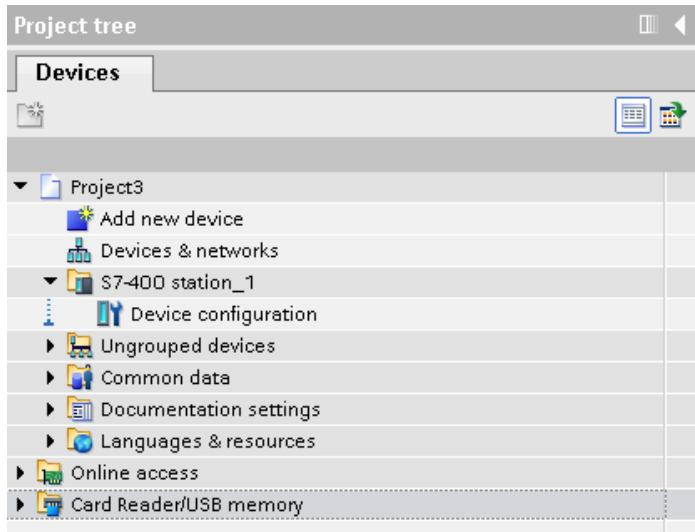
Devices & networks
s7-400 station\_1
Y Device configuration
Ungrouped devices
Common data
Documentation settings
Languages &resources
Online access
Card Reader/USB memory
以下结构示例为不带机架和模块的单个设备“S7-400 station\_1”的导出内容：
```xml
<InstanceHierarchy Name="APC Sample Instance Hierarchy">
    <InternalElement ID="288b7850-688e-43b3-941e-d615ba900a02" Name="Project3">
    <Attribute Name="ProjectManufacturer" AttributeDataType="xs:string" />
    <Attribute Name="ProjectSign" AttributeDataType="xs:string" />
    <Attribute Name="ProjectRevision" AttributeDataType="xs:string" />
    <Attribute Name="ProjectInformation" AttributeDataType="xs:string" />
    <InternalElement ID="57611cfd-6da4-444e-ac78-5fbcea20a4e1" Name="S7-400 station_1">
    <Attribute Name="TypeIdentifier" AttributeDataType="xs:string">
    <Value>System:Device.S7400</Value>
    </Attribute>
    <Attribute Name="Comment" AttributeDataType="xs:string">
    <Value>S7400 station</Value>
    </Attribute>
    <SupportedRoleClass RefRoleClassPath=
    "AutomationProjectConfigurationRoleClassLib/Device" />
    </InternalElement>
    <SupportedRoleClass RefRoleClassPath=
    "AutomationProjectConfigurationRoleClassLib/AutomationProject" />
    </InternalElement>
</InstanceHierarchy>
</CAEXFile>
```

#### 没有类型标识符和通用类型标识符的设备

CAx 导入应能够处理没有类型标识符信息或具有通用类型标识符
（“System:Device.Generic”）的设备。AMl 文件可能包含某种不带类型标识符信息或通用类型标识符（“System:Device.Generic”）的设备。
但是，CAx 导入也应该处理这些设备以创建适当的设备。
以下设备支持通用设备或无类型标识符替换：
• GSD 和 GSDML 设备
• 基于 MDD 的设备（非 GSD/GSDML 设备）
对于通用设备或没有类型标识符的设备以及通用机架、类型标识符替换，标头模块（对于分散设备）或 PLC（对于中央设备）必须存在于 AML 文件中所述的机架内，否则没有类型标识符的设备或通用设备和通用机架类型标识符替换将失败。

#### 以下 XML 结构显示了具有非通用类型标识符的设备组态：

```xml
<InternalElement ID="04f5d5f08-316a-4a1d-9290-9bfd75b2b2ca" Name="S7-400 station_1">
    <Attribute Name="TypeIdentifier" AttributeDataType="xs:string">
    <Value>System:Device.S7400</Value>
    </Attribute>
    <Attribute Name="Comment" AttributeDataType="xs:string">
    <Value>S7400 station</Value>
    </Attribute>
    <SupportedRoleClass RefRoleClassPath="AutomationProjectConfigurationRoleClassLib/Device"/>
</InternalElement>
```
以下 XML 结构显示了具有通用类型标识符的设备组态：
```xml
<InternalElement ID="04f5d5f08-316a-4a1d-9290-9bfd75b2b2ca" Name="S7-400 station_1">
    <Attribute Name="TypeIdentifier" AttributeDataType="xs:string">
    <Value>System:Device.Generic</Value>
    </Attribute>
    <Attribute Name="Comment" AttributeDataType="xs:string">
    <Value>S7400 Device</Value>
    </Attribute>
    <SupportedRoleClass RefRoleClassPath="AutomationProjectConfigurationRoleClassLib/Device"/>
</InternalElement>
```
以下 XML 结构显示了具有设备可用类型标识符的设备组态。
```xml
<InternalElement ID="a887601f-3ced-4f50-88ff-a9ec6eabb682" Name="S7-400 station_1">
    <Attribute Name="TypeIdentifier" AttributeDataType="xs:string">
    <Value>System:Device.S7400</Value>
    </Attribute>
    <Attribute Name="Comment" AttributeDataType="xs:string">
    <Value>S7400 Device</Value>
    </Attribute>
    <SupportedRoleClass RefRoleClassPath="AutomationProjectConfigurationRoleClassLib/Device"/>
</InternalElement>
```
以下 XML 结构显示了没有设备可用类型标识符的设备组态。
```xml
<InternalElement ID="a887601f-3ced-4f50-88ff-a9ec6eabb682" Name="S7-400 station_1">
    <Attribute Name="Comment" AttributeDataType="xs:string">
    <Value>S7400 Device</Value>
    </Attribute>
    <SupportedRoleClass RefRoleClassPath="AutomationProjectConfigurationRoleClassLib/Device"/>
</InternalElement>
```
用于导入/导出的 CAx 数据的结构 (页 1639)
AML 类型标识符 (页 1643)

### 6.5.25 设备对象的导入

要求
• TIA Portal Openness 应用程序已连接到 TIA Portal。 [连接到 TIA Portal](#连接到-TIA-Portal)”
• 已打开一个项目。[打开项目](#打开项目)”
• PLC 处于离线状态。
Device对象是一个容器对象，用于进行集中式或分布式组态。该对象为DeviceItem对象的父对象，在 AML 文件结构中位于 TIA Portal 项目实例层级内部元素的顶部。
CAx 数据导入支持以下由 AML 类型标识符指定的设备类型：
• 物理模块
• 基于 GSD/GSDML 的设备
• 系统
• 通用设备
如果 TIA Portal 中存在一个 DeviceUserFolder 对象，则该设备将归组到指定文件夹中。
如果仅能确定前端模块或 PLC 的标识 (TypeIdentifier)，且这些设备不带机架和设备，则可导入一个通用机架。
示例：TypeIdentifier = System:<Prefix>.Generic
要替换通用设备，以下元素必须处于机架中（如 AML 文件中所述）：
• 中央设备：PLC
• 分布式设备：前端模块
如果设备为通用设备，则属性 BuiltIn 将定义机架或模块的类型：
• 物理：BuiltIn = True
• 通用：BuiltIn = False

#### 示例：导入通用设备

以下结构示例介绍了无机架和模块的通用 "S7-400 station" 设备的导入过程。
```xml
<InstanceHierarchy Name="APC Sample Instance Hierarchy">
    <InternalElement ID="d4dc896a-f4a5-41b6-9c48-8d3a0a5a4343" Name="MyProject">
    <Attribute Name="ProjectManufacturer" AttributeDataType="xs:string" />
    <Attribute Name="ProjectSign" AttributeDataType="xs:string" />
    <Attribute Name="ProjectRevision" AttributeDataType="xs:string" />
    <Attribute Name="ProjectInformation" AttributeDataType="xs:string" />
    <InternalElement ID="3e6277d1-1b12-4c18-b00e-25e3eac3ac35" Name="S7400 station_1">
    <Attribute Name="TypeIdentifier" AttributeDataType="xs:string">
    <Value>System:Device.Generic</Value>
    </Attribute>
    <Attribute Name="Comment" AttributeDataType="xs:string">
    <Value>S7400 station_1</Value>
    </Attribute>
    <SupportedRoleClass RefRoleClassPath=
    "AutomationProjectConfigurationRoleClassLib/Device" />
    </InternalElement>
    ...
    <SupportedRoleClass RefRoleClassPath=
    "AutomationProjectConfigurationRoleClassLib/AutomationProject" />
    </InternalElement>
    </InstanceHierarchy>
</CAEXFile>
```
6.5 导入/导出硬件数据

#### 示例：导入设备用户文件夹层次结构

以下结构示例介绍了文件夹层次结构的导入。
```xml
<InternalElement ID="4fe37f4f-2661-4492-95f0-3d8a8160c851" Name="Project1">
    <Attribute Name="ProjectManufacturer" AttributeDataType="xs:string" />
    <Attribute Name="ProjectSign" AttributeDataType="xs:string" />
    <Attribute Name="ProjectRevision" AttributeDataType="xs:string" />
    <Attribute Name="ProjectInformation" AttributeDataType="xs:string" />
    <InternalElement ID="1ee1615f-9c67-432d-a7cc-b795babf67b6" Name="Group_1">
    <SupportedRoleClass RefRoleClassPath=
    "AutomationProjectConfigurationRoleClassLib/DeviceUserFolder" />
    </InternalElement>
    <InternalElement ID="ce14c85a-28de-41aa-ad08-2eb7d0fb755f" Name="Group_2">
    <InternalElement ID="852347e8-3c48-4eb9-8bd8-349d0c7caf34" Name="Group_3">
    <SupportedRoleClass RefRoleClassPath=
    "AutomationProjectConfigurationRoleClassLib/DeviceUserFolder" />
    </InternalElement>
    <SupportedRoleClass RefRoleClassPath=
    "AutomationProjectConfigurationRoleClassLib/DeviceUserFolder" />
    </InternalElement>
    <InternalElement ID="97cf7924-1756-4e32-8716-ac18990e4762" Name="Group_4">
    <SupportedRoleClass RefRoleClassPath=
    "AutomationProjectConfigurationRoleClassLib/DeviceUserFolder" />
    </InternalElement>
    <SupportedRoleClass RefRoleClassPath=
    "AutomationProjectConfigurationRoleClassLib/AutomationProject" />
</InternalElement>
```

#### 导入的用户文件夹层次结构

未分组和未分配的设备的文件夹名称特定于语言。建议使用与导出时相同的用户界面语言执行导入。否则，未分组和未分配的设备将导入到根据导出语言命名的文件夹中。
例如，如果用英语导出包含设备系统组“Ungrouped devices”的项目，然后用德语导入 AML 文件。则该项目的设备系统组中将出现“Nicht gruppierte Gerate”（德语），但在 CAx 导入时将创建“Ungrouped device”用户组。
将以下层次结构导入到项目导航中：
```txt
Group_1
Group_2
Group_3
Group_4
```
用于导入/导出的 CAx 数据的结构 (页 1639)
AML 类型标识符 (页 1643)

### 6.5.26 导出/导入带有设定地址的设备

• TIA Portal Openness 应用程序已连接到 TIA Portal。 请[连接到 TIA Portal](#连接到-TIA-Portal)”
• 已打开一个项目。
请[打开项目](#打开项目)”
• PLC 处于离线状态。
在 TIA Portal 中，可将 IO 设备项的地址对象导出到 AML 文件中。导入到一个空的 TIA Portal项目中时，所导入的设备项将保留相应 IO 设备项中的地址对象。
AML 文件中的 Address 属性包含有必须项的设置 RefSemantic，用于指定 OrderedListType 的值。
截至 TIA Portal V16，地址应采用相同顺序，以支持导出和导入设备项。例如，如果设备项在TIA Portal 中支持两个地址（输入和输出），AML 文件中的同一设备项具有地址（输出和输入），由于顺序不匹配，不会处理该地址。
从 TIA Portal V17 开始，对 AML 文件中的特定地址的 CAx 导入操作应基于 I/O 类型查找匹配的 TIA 地址，并应尝试设置相同的 TIA 地址。AML 文件中的顺序不再相关。

#### "Address" 元素的属性

下表显示了用于 CAx 导入和导出文件的相关对象属性：
<table><tr><td>属性</td><td>处理方式</td><td>注释</td></tr><tr><td>IoType</td><td>必选项</td><td>输入或输出。</td></tr><tr><td>Length</td><td>可选项</td><td>通道宽度。导出期间,始终应将该属性写入到文件中。</td></tr><tr><td>Start Address</td><td>可选项</td><td>IO 设备的起始地址。导出期间,始终应将该属性写入到文件中。</td></tr></table>
• 此功能支持任何地址对象为输入/输出类型的设备项类型。
• 长度为 0 的输入和输出地址应从导出中排除，并应在导入时忽略。
• 如果地址的 startaddress 为 -1，则应跳过地址属性导出。但在导入期间，应显示警告消息提示地址的 startaddress 为 -1。
示例：带有地址对象的 IO 设备项
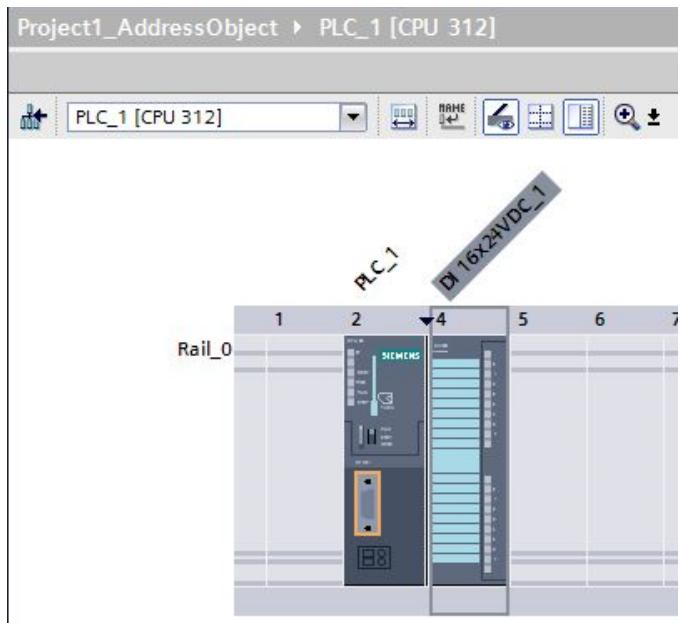
下图显示了所导出 AML 文件中的部分元素结构。其中，包含有 Address 元素及其属性。
```xml
<Attribute Name="Address">
    <RefSemantic CorrespondingAttributePath="OrderedListType" />
    <Attribute Name="1">
    <Attribute Name="StartAddress" AttributeDataType="xs:int">
    <Value>0</Value>
    </Attribute>
    <Attribute Name="Length" AttributeDataType="xs:int">
    <Value>16</Value>
    </Attribute>
    <Attribute Name="IoType" AttributeDataType="xs:string">
    <Value Animation>
    </Attribute>
    </Attribute>
</Attribute>
```

#### 修剪 XML

裁剪操作是指通过删除 XML 中不需要的部分，对文件内容进行优化。在修剪后的 xml 中，不包含自动创建的子模块信息，且其相应的地址对象位于直接父模块中。

#### 下图显示了修剪前所导出 AML 文件中的部分元素结构。

```xml
<InternalElement ID="5511a117-42c6-44b7-be5d-0f33cd46e932" Name="AS-i Master_1">
<Attribute Name="PositionNumber" AttributeDataType="xs:int">
<Value>4</Value>
</Attribute>
<Attribute Name="BuiltIn" AttributeDataType="xs:boolean">
<Value>True</Value>
</Attribute>
<Attribute Name="Address">
<RefSemantic CorrespondingAttributePath="OrderedListType"/>
<Attribute Name="1">
<Attribute Name="StartAddress" AttributeDataType="xs:int">
<Value>20</Value>
</Attribute>
<Attribute Name="Length" AttributeDataType="xs:int">
<Value>256</Value>
</Attribute>
<Attribute Name="IoType" AttributeDataType="xs:string">
<Value Animation
</Attribute>
</Attribute>
</Attribute>
```
在修剪后的 AML 文件中，将删除子模块信息 like <InternalElement> 元素，但保留其相应的地址对象。
```xml
<Attribute Name="Address">
<RefSemantic CorrespondingAttributePath="OrderedListType"/>
<Attribute Name="1">
<Attribute Name="StartAddress" AttributeDataType="xs:int">
<Value>20</Value>
</Attribute>
<Attribute Name="Length" AttributeDataType="xs:int">
<Value>256</Value>
</Attribute>
<Attribute Name="IoType" AttributeDataType="xs:string">
<Value Animation
</Attribute>
</Attribute>
</Attribute>
```
Pruned AML (页 1635)

### 6.5.27 导出/导入带有通道的设备

• TIA Portal Openness 应用程序已连接到 TIA Portal。 [连接到 TIA Portal](#连接到-TIA-Portal)”
• 已打开一个项目。
[打开项目](#打开项目)”
• PLC 处于离线状态。
在 TIA Portal 中，可将 IO 设备项的通道对象导出到 AML 文件中。导入到一个空的 TIA Portal项目中时，所导入的设备项将保留相应 IO 设备项中的通道对象。
节点和子网内元素中的 <ExternalInterface> 元素，用于指示节点和子网已连接。

#### "ExternalInterface" 元素的属性

下表显示了用于 CAx 导入和导出文件的相关对象属性：
<table><tr><td>属性</td><td>处理方式</td><td>注释</td></tr><tr><td>IoType</td><td>必须项</td><td>输入或输出</td></tr><tr><td>Length</td><td>可选</td><td>通道宽度(数字量信号为1,模拟量信号为16)</td></tr><tr><td>Number</td><td>必须项</td><td>通道编号,从0开始</td></tr><tr><td>Type</td><td>必须项</td><td>模拟量或数字量</td></tr></table>

#### 通道编号

数字量输入、数字量输出、模拟量输入、模拟量输出以及工艺通道将按照 DI\_0, DO\_0, AI\_0,AO\_0,TO\_0 规则依次分别编号。首先对设备项通道中的通道进行编号，之后再依次对子设备项中的通道进行编号（深度优先）。每一个附加设备项都有一个从 0 开始的自己通道编号。
6.5 导入/导出硬件数据
示例：带有通道的设备
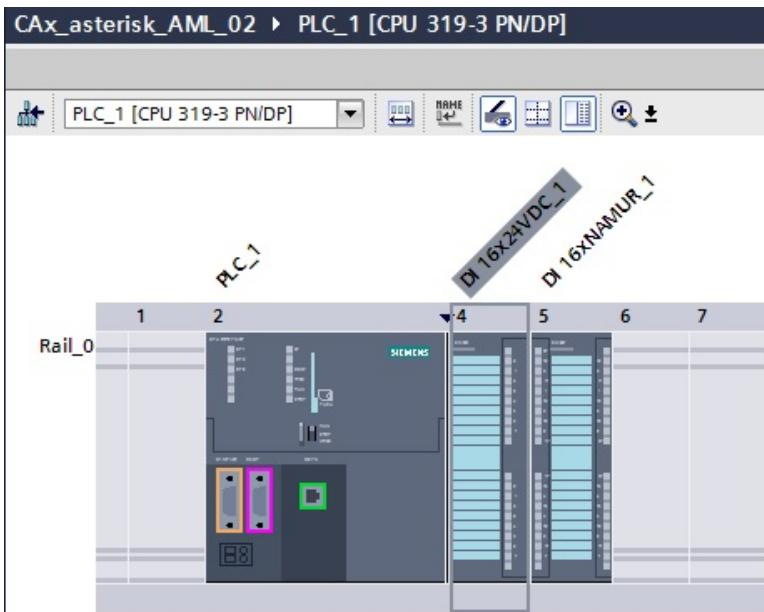
下图显示了所导出 AML 文件中的部分元素结构。
```xml
<ExternalInterface ID="31ca16d3-6322-43b6-95bc-e2d7d7bfc7b7" Name="Channel_DI_0"
    RefBaseClassPath="AutomationProjectConfigurationInterfaceClassLib/Channel">
    <Attribute Name="Type" AttributeDataType="xs:string">
    <Value>Digital</Value>
    </Attribute>
    <Attribute Name="IoType" AttributeDataType="xs:string">
    <Value Animation</Value>
    </Attribute>
    <Attribute Name="Number" AttributeDataType="xs:int">
    <Value>0</Value>
    </Attribute>
    <Attribute Name="Length" AttributeDataType="xs:int">
    <Value>1</Value>
    </Attribute>
</ExternalInterface>
```

### 6.5.28 设备项对象的导出

• TIA Portal Openness 应用程序已连接到 TIA Portal。请[连接到 TIA Portal](#连接到-TIA-Portal)
• 项目已经打开。
请[打开项目](#打开项目)
• PLC 处于离线状态。
设备项对象导出仅适用于 PLC 设备。
DeviceItem 对象为 Device 对象的嵌套子项。DeviceItem 类型的对象可以是一个机架或插入的模块。
• 设备第一个子项的类型为“机架”。机架的PositionNumber从 0 开始。如果存在多个机架，则会对其进行连续编号（1、2、3…）。
AML 文件中一个层级内的顺序无限制。
• “机架”类型的所有其它子项均为模块。
CAx 数据导出支持以下由 AML 类型标识符指定的设备项类型：
• 物理模块
• GSD/GSDML 模块
下表显示了用于 CAx 导入和导出文件的相关对象属性：
<table><tr><td>属性</td><td>处理方式</td><td>注释</td></tr><tr><td>Name</td><td>必选项“BuiltIn”=TRUE时仅导出</td><td></td></tr><tr><td>TypeName</td><td>“BuiltIn”=FALSE时仅导出</td><td></td></tr><tr><td>DeviceItemType</td><td>仅导出</td><td>仅限PLC(中央设备)和设备项(物理机架、模块、HeadModule)。导入期间可选,但是除了将DeviceItemType作为附件的基本单元外将静默忽略。</td></tr></table>
6.5 导入/导出硬件数据
<table><tr><td>属性</td><td>处理方式</td><td>注释</td></tr><tr><td>PositionNumber</td><td>必选项,对于某些设备项为可选项</td><td>对于某些设备项,位置号与ECAD系统等外部工具的交换不相关。对于此类设备项,位置号将不作为AML文件的必选项,并将通过导入操作在内部为其分配合适的值。</td></tr><tr><td>BuiltIn</td><td>可选项</td><td>默认:FALSE</td></tr><tr><td>TypeIdentifier</td><td>“BuiltIn”=FALSE时为必选项“BuiltIn”=TRUE时被忽略</td><td>对于集成式内置设备项,该属性应与其可插入父类型标识符信息一起导出,且在导入期间无关联,因此可选。对于非集成式内置设备项,此属性可选</td></tr><tr><td>FirmwareVersion</td><td>可选项,对象支持固件版本时为必选项</td><td></td></tr><tr><td>PlantDesignation IEC</td><td>可选项</td><td>默认值:“”</td></tr><tr><td>LocationIdentifier IEC</td><td>可选项</td><td>默认值:“”</td></tr><tr><td>Comment</td><td>“BuiltIn”=FALSE时为可选项</td><td>默认值:“”</td></tr><tr><td>ProductDesignation IEC</td><td>必选项对象在TIA Portal中支持此属性且非空时</td><td>如果ProductDesignation IEC的长度超过54个字符,则不支持导入。作为支持TIA Portal V16的AR APC V1.1.0的一部分,在设备项下导出/导入</td></tr><tr><td>InstallationDate</td><td>必选项对象在TIA Portal中支持此属性时</td><td>作为支持TIA Portal V16的AR APC V1.1.0的一部分,在设备项下导出/导入</td></tr><tr><td>Address</td><td>可选项</td><td>“地址”(Address)包含嵌套属性</td></tr></table>
下表显示了对象“DeviceItem”的“Address”属性的嵌套属性：
<table><tr><td>&quot;Address&quot;的属性</td><td>处理方式</td><td>注释</td></tr><tr><td>StartAddress</td><td>必选项</td><td></td></tr><tr><td>Length</td><td>仅导出</td><td>不支持导出/导入长度 = 0 的地址。</td></tr><tr><td>IoType</td><td>必选项</td><td>输入或输出</td></tr></table>
示例：导出组态  
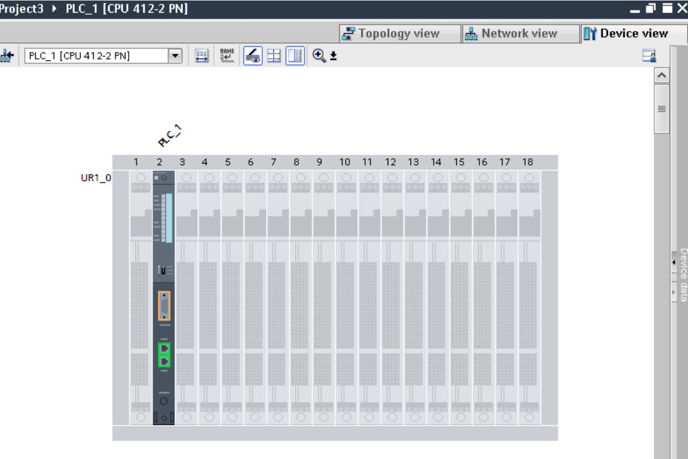
6.5 导入/导出硬件数据
导出文件的 AML 结构
以下结构示例显示了“UR1\_0”和模块“PLC\_1”的导出过程。
<InternalElement ID="7624ed42-3db7-4ba5-8726-e719d7b09969" Name="S7-400 station 1"> <Attribute Name="TypeIdentifier" AttributeDataType="xs:string"> <Value>System:Device.S7400</Value> </Attribute> <Attribute Name="Comment" AttributeDataType="xs:string"> <Value>S7400 station</Value> </Attribute> <InternalElement ID="1ff247e6-6b94-42a2-bcd5-d673fc6e9ba5" Name="UR1 0"> <Attribute Name="TypeName" AttributeDataType="xs:string"> <Value>UR1</Value> </Attribute> <Attribute Name="PositionNumber" AttributeDataType="xs:int"> <Value>0</Value> </Attribute> <Attribute Name="BuiltIn" AttributeDataType="xs:boolean"> <Value>False</Value> </Attribute> <Attribute Name="TypeIdentifier" AttributeDataType="xs:string"> <Value>OrderNumber:6ES7 400-1TA01-0AA0</Value> </Attribute> <Attribute Name="Comment" AttributeDataType="xs:string"> <Value>S7 400 rack</Value> </Attribute> <InternalElement ID="202421bf-a4b9-4399-a563-9f154f0eabab" Name="PLC 1"> <Attribute Name="TypeName" AttributeDataType="xs:string"> <Value>CPU 412-2 PN</Value> </Attribute> <Attribute Name="DeviceItemType" AttributeDataType="xs:string"> <Value>CPU</Value> </Attribute> <Attribute Name="PositionNumber" AttributeDataType="xs:int"> <Value>2</Value> </Attribute> <Attribute Name="BuiltIn" AttributeDataType="xs:boolean"> <Value>False</Value> </Attribute> <Attribute Name="TypeIdentifier" AttributeDataType="xs:string"> <Value>0rderNumber:6ES7 412-2EK06-0AB0</Value> </Attribute> <Attribute Name="Comment" AttributeDataType="xs:string"> <Value>S7 400 plc</Value> </Attribute> <Attribute Name="FirmwareVersion" AttributeDataType="xs:string"> <Value>V6.0</Value> </Attribute> <Attribute Name="ProductDesignation IEC" AttributeDataType="xs:string"> <Value>Additional Information</Value> </Attribute> <Attribute Name="InstallationDate" AttributeDataType="xs:dateTime"> <Value>2018-11-26T05:09:02.803Z</Value> </Attribute> <Attribute Name="PlantDesignation IEC" AttributeDataType="xs:string"> <Value>PD</Value> </Attribute> <Attribute Name="LocationIdentifier IEC" AttributeDataType="xs:string"> <Value>LI</Value> </Attribute> <SupportedRoleClass RefRoleClassPath="AutomationProjectConfigurationRoleClassLib/DeviceItem" /> </InternalElement> <SupportedRoleClass RefRoleClassPath="AutomationProjectConfiqurationRoleClassLib/DeviceItem" /> </InternalElement> <SupportedRoleClass RefRoleClassPath="AutomationProjectConfiqurationRoleClassLib/Device" /> </InternalElement> <SupportedRoleClass RefRoleClassPath="AutomationProjectConfigurationRoleClassLib/AutomationProject" /> </InternalElement>
Openness：用于工程组态工作流自动化的 API系统手册, 11/2023
6.5 导入/导出硬件数据
[基于 GSD/GSDML 的设备和设备项的导出/导入](#基于-GSDGSDML-的设备和设备项的导出导入)
用于导入/导出的 CAx 数据的结构 (页 1639)
AML 类型标识符 (页 1643)

### 6.5.29 设备项对象的导入

要求
• TIA Portal Openness 应用程序已连接到 TIA Portal。 请[连接到 TIA Portal](#连接到-TIA-Portal)”
• 已打开一个项目。
请[打开项目](#打开项目)”
• PLC 处于离线状态。
设备项对象导入仅适用于 PLC 设备。
DeviceItem 对象为 Device 对象的嵌套子项。DeviceItem 类型的对象可以是一个机架或插入的模块。
• 设备第一个子项的类型必须为机架。机架的PositionNumber从 0 开始。如果存在多个机架，则会对其进行连续编号（1、2、3…）。
AML 文件中一个层级内的顺序无限制。
• 机架类型的所有其它子项均为模块。
CAx 数据导入支持以下由 AML 类型标识符指定的设备项类型：
• 物理模块
• GSD/GSDML 模块
• 通用模块
如果仅能确定前端模块或 PLC 的标识 (TypeIdentifier)，且这些设备不带机架和设备，则可导入一个通用机架。
示例： TypeIdentifier = System:Rack.Generic
要替换通用机架，以下元素必须处于机架中（如 AML 文件中所述）：
• 中央设备：PLC
• 分布式设备：前端模块
通用机架类型包含在 Device 类型中。因此，待导入 TIA Portal 中的 AML 文件可使用该机架的类型标识符：
此时，TIA Portal 可确定机架的类型标识符。
如果机架和模块为通用型，则属性BuiltIn 将定义该机架或模块的类型：
• 物理：BuiltIn = True
• 通用：BuiltIn = False
导入时，属性DeviceItemType 不相关，因此为可选项。
属性“FirmwareVersion”
如果导入文件中未指定 FirmwareVersion ，则 CAx 导入将使用 TIA Portal 中有效的最新固件版本。
如果导入文件中存在带有空值的FirmwareVersion 属性，则设备项导入操作失败，并记录一条错误消息。
示例：导入通用设备
以下结构示例介绍了通用机架“Rack\_1”的导入过程。
```xml
<InternalElement ID="6563466e-2de9-42ca-951d-eb8f2545958d" Name="S7-400 station_1">
    <Attribute Name="TypeIdentifier" AttributeDataType="xs:string">
    <Value>System:Device.S7400</Value>
    </Attribute>
    <InternalElement ID="96930368-14ec-43e2-b9b7-c1fefc4b0534" Name="UR1_0">
    <Attribute Name="TypeName" AttributeDataType="xs:string">
    <Value>UR1</Value>
    </Attribute>
    <Attribute Name="PositionNumber" AttributeDataType="xs:int">
    <Value>0</Value>
    </Attribute>
    <Attribute Name="BuiltIn" AttributeDataType="xs:boolean">
    <Value>False</Value>
    </Attribute>
    <Attribute Name="TypeIdentifier" AttributeDataType="xs:string">
    <Value>System:Rack.Generic</Value>
    </Attribute>
    <InternalElement ID="a1de449e-4f89-45af-8bbc-f77c28bccd04" Name="PLC_1">
    <Attribute Name="TypeName" AttributeDataType="xs:string">
    <Value>CPU 412-2 PN</Value>
    </Attribute>
    <Attribute Name="DeviceItemType" AttributeDataType="xs:string">
    <Value>CPU</Value>
    </Attribute>
    <Attribute Name="PositionNumber" AttributeDataType="xs:int">
    <Value>2</Value>
    </Attribute>
    <Attribute Name="BuiltIn" AttributeDataType="xs:boolean">
    <Value>False</Value>
    </Attribute>
    <Attribute Name="TypeIdentifier" AttributeDataType="xs:string">
    <Value>OrderNumber:6ES7 412-2EK06-0ABO</Value>
    </Attribute>
    <Attribute Name="FirmwareVersion" AttributeDataType="xs:string">
    <Value>V6.0</Value>
    </Attribute>
    <SupportedRoleClass RefRoleClassPath=
    "AutomationProjectConfigurationRoleClassLib/DeviceItem" />
    </InternalElement>
    <SupportedRoleClass RefRoleClassPath=
    "AutomationProjectConfigurationRoleClassLib/DeviceItem" />
    </InternalElement>
    <SupportedRoleClass RefRoleClassPath=
    "AutomationProjectConfigurationRoleClassLib/Device" />
</InternalElement>
```

#### 导入的组态

下图显示了 TIA Portal 用户界面中的已导入组态：
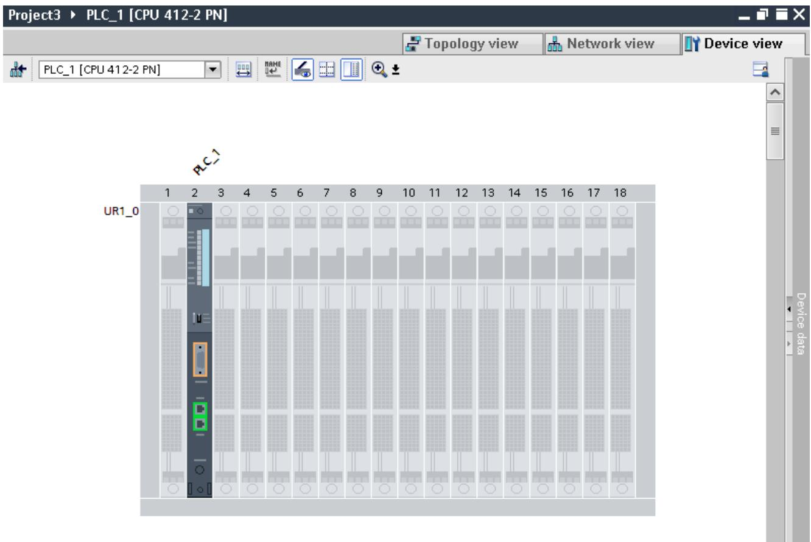  
[用于导入/导出的 CAx 数据的结构](#用于导入导出的-CAx-数据的结构)AML 类型标识符 (页 1643)

### 6.5.30 基于 GSD/GSDML 的设备和设备项的导出/导入

• TIA Portal Openness 应用程序已连接到 TIA Portal。 请[连接到 TIA Portal](#连接到-TIA-Portal)”
• 项目已经打开。
请[打开项目](#打开项目)”
• PLC 处于离线状态。
基于 GSD/GSDML 的设备和设备项的 CAx 导入/导出类似于标准设备的导入/导出。
对于基于 GSD/GSDML 的设备和设备项，可导出的属性不同。如，GSD/GSDML 中包含属性Label。
支持通用设备和机架的导入。导入时，使用标准设备的标识符：
• 导入通用设备：TypeIdentifier = System:Device.Generic
• 导入通用机架：TypeIdentifier = System:Rack.Generic
如果设备为通用型，则属性 $\mathtt { B u i l t I n }$ 将定义类型：
• 物理：BuiltIn = True
• 通用：BuiltIn = False

#### 设备的属性

下表列出了 CAx 导入和导出文件中相关的设备属性：
<table><tr><td>属性</td><td>属性的处理方式</td><td>注释</td></tr><tr><td>Name</td><td>导出和导入时为必选项</td><td></td></tr><tr><td>TypeIdentifier</td><td>自 AR APC V1.1 起,导出时为必选项,导入时为可选项</td><td></td></tr><tr><td>Comment</td><td>导入时为可选项</td><td></td></tr></table>## 设备项的属性
下表列出了 CAx 导入和导出文件中相关的设备项属性：
<table><tr><td>属性</td><td>属性的处理方式BuiltIn = FALSE通用设备项</td><td>属性的处理方式BuiltIn = TRUE物理设备项</td><td>注释</td></tr><tr><td>Name</td><td>必选项</td><td>仅导出</td><td></td></tr><tr><td>TypeName</td><td>仅导出</td><td>不适用</td><td></td></tr><tr><td>DeviceItemType</td><td>仅导出</td><td>仅导出</td><td>仅限 PLC(中央设备)和HeadModule(分散设备)设备项导入期间可选,但是除了将DeviceItemType作为附件的基本单元外将被忽略。</td></tr><tr><td>PositionNumber</td><td>必选项</td><td>导出时为必选项例外:设备项类型接口:导入时为可选项设备项类型端口:可选项</td><td></td></tr><tr><td>BuiltIn</td><td>可选项</td><td></td><td>默认:FALSE</td></tr><tr><td>TypeIdentifier</td><td>“BuiltIn”=FALSE时为必选项</td><td>“BuiltIn”=TRUE时被忽略</td><td>对于集成式内置设备项,该属性应与其可插入父类型标识符信息一起导出。该属性在导入期间无关联,因此可选。对于非集成式内置设备项,该属性无关联。</td></tr><tr><td>Comment</td><td>可选项</td><td>-</td><td></td></tr><tr><td>Label</td><td>-</td><td>-设备项类型接口:必选项设备项类型端口:必选项</td><td></td></tr></table>
示例：已导出 GSD/GSDML 设备
<table><tr><td>Project tree</td></tr><tr><td>Devices</td></tr><tr><td>ProjectGSDML</td></tr><tr><td>Add new device</td></tr><tr><td>Devices &amp; networks</td></tr><tr><td>Ungrouped devices</td></tr><tr><td>Unassigned devices</td></tr><tr><td>SINAMICS-DCMaster-CBE20 [SINAMICS DC MASTER CBE20 V1.1]</td></tr><tr><td>Common data</td></tr><tr><td>Documentation settings</td></tr><tr><td>Languages &amp; resources</td></tr><tr><td>Online access</td></tr><tr><td>Card Reader/USB memory</td></tr></table>

#### 下图所示为导出的 AML 文件的结构。

```xml
<InternalElement ID="9ae02cde-dfb4-4d43-a649-68b9ede7fc3d" Name="Ungrouped devices">
    <InternalElement ID="12d4ce0f-346d-4bfa-b139-c9d0db64c794" Name="GSD device_1">
    <Attribute Name="TypeIdentifier" AttributeDataType="xs:string">
    <Value>GSD:GSDML-V2.31-SIEMENS-SINAMICS_DCMASTER-20140704.XML/D</Value>
    </Attribute>
    <InternalElement ID="ccb1cb62-67b2-4b8c-951f-10c7ffb4d787" Name="Rack">
    <Attribute Name="TypeName" AttributeDataType="xs:string">
    <Value>Rack</Value>
    </Attribute>
    ...
    <Attribute Name="TypeIdentifier" AttributeDataType="xs:string">
    <Value>GSD:GSDML-V2.31-SIEMENS-SINAMICS_DCMASTER-20140704.XML/R/IDD_14</Value>
    </Attribute>
    <InternalElement ID="74f25b5c-0c09-46d0-9011-f341a3e98a0d" Name="SINAMICS-DCMaster-CBE20">
    <Attribute Name="TypeName" AttributeDataType="xs:string">
    <Value>SINAMICS DC MASTER CBE20 V1.1</Value>
    </Attribute>
    <Attribute Name="DeviceItemType" AttributeDataType="xs:string">
    <Value>HeadModule</Value>
    </Attribute>
    <Attribute Name="PositionNumber" AttributeDataType="xs:int">
    <Value>0</Value>
    </Attribute>
    <Attribute Name="BuiltIn" AttributeDataType="xs:boolean">
    <Value>False</Value>
    </Attribute>
    <Attribute Name="TypeIdentifier" AttributeDataType="xs:string">
    <Value>GSD:GSDML-V2.31-SIEMENS-SINAMICS_DCMASTER-20140704.XML/DAP/IDD_14</Value>
    </Attribute>
    <InternalElement ID="94f34bb9-fe47-4904-b8a1-62e8fb6b1b74"
    Name="SINAMICS DC MASTER CBE20 V1.1">
    <Attribute Name="PositionNumber" AttributeDataType="xs:int">
    <Value>0</Value>
    </Attribute>
    <Attribute Name="BuiltIn" AttributeDataType="xs:boolean">
    <Value>True</Value>
    </Attribute>
    <SupportedRoleClass RefRoleClassPath=
    "AutomationProjectConfigurationRoleClassLib/DeviceItem" />
    </InternalElement>
    ...
    <SupportedRoleClass RefRoleClassPath=
    "AutomationProjectConfigurationRoleClassLib/DeviceItem" />
    </InternalElement>
    <SupportedRoleClass RefRoleClassPath=
    "AutomationProjectConfigurationRoleClassLib/DeviceItem" />
    </InternalElement>
    <SupportedRoleClass RefRoleClassPath=
    "AutomationProjectConfigurationRoleClassLib/DeviceUserFolder" />
</InternalElement>
```

#### 带和不带 TypeIdentifier 的通用和非通用机架

CAx 导入应能够处理不带类型标识符信息或通用类型标识符（即“System:Device.Generic”）的设备和带通用类型标识符（即“System:Rack.Generic”）的机架。
导入时，AML 文件可能包含某种不带类型标识符或通用类型标识符（即
“System:Device.Generic”）的设备，以及带通用类型标识符（即“System:Rack.Generic”）的机架设备项。但是，CAx 导入也应该处理这些设备以创建适当的设备和机架设备项。
以下设备支持通用设备、不带类型标识符的设备和通用机架替换：
• GSD 和 GSDML 设备 - 所有带 GSD/GSDML 机架的 GSD/GSDML 设备。
• 基于 MDD 的设备（非 GSD/GSDML 设备）- 具有系统机架类型标识符的设备。
CAx 导出与通用机架处理无关。CAx 始终导出非通用机架类型标识符。
对于通用设备或没有类型标识符的设备以及通用机架、类型标识符替换，标头模块（对于分散设备）或 PLC（对于中央设备）必须存在于 AML 文件中所述的机架内，否则没有类型标识符的设备或通用设备和通用机架类型标识符替换将失败。
以下 XML 结构显示了具有设备（具有类型标识符）和机架（具有TypeIdentifier）的 GSDML设备组态：
```xml
<InternalElement ID="bc3b50fa-5cfa-4bf3-a496-8e46080d4f86" Name="GSD device_1">
<Attribute Name="TypeIdentifier" AttributeDataType="xs:string">
<Value>GSD:GSDML-V2.32-SIEMENS-SINAMICS_DCMASTER-20160531.XML/D</Value>
</Attribute>
<InternalElement ID="c80f2d97-66c9-4f31-bf6b-17e3e0de0509" Name="Rack">
<Attribute Name="TypeName" AttributeDataType="xs:string">
<Value>Rack</Value>
</Attribute>
<Attribute Name="PositionNumber" AttributeDataType="xs:int">
<Value>0</Value>
</Attribute>
<Attribute Name="BuiltIn" AttributeDataType="xs:boolean">
<Value>false</Value>
</Attribute>
<Attribute Name="TypeIdentifier" AttributeDataType="xs:string">
<Value>GSD:GSDML-V2.32-SIEMENS-SINAMICS_DCMASTER-20160531.XML/R/IDD_14</Value>
</Attribute>
<InternalElement ID="f519b4b9-b1f7-4011-bed2-25be85c8c2a8" Name="SINAMICS-DCMaster-CBE20">
<Attribute Name="TypeName" AttributeDataType="xs:string">
<Value>SINAMICS DC MASTER CBE20 V1.1</Value>
</Attribute>
<Attribute Name="DeviceItemType" AttributeDataType="xs:string">
<Value>HeadModule</Value>
</Attribute>
```
以下 XML 结构显示了具有设备（无类型标识符）和机架（通用类型标识符）的 GSDML 设备组态：
```xml
<InternalElement ID="bc3b50fa-5cfa-4bf3-a496-8e46080d4f86" Name="GSD device_1">
<InternalElement ID="c80f2d97-66c9-4f31-bf6b-17e3e0de0509" Name="Rack">
<Attribute Name="TypeName" AttributeDataType="xs:string">
<Value>Rack</Value>
</Attribute>
<Attribute Name="PositionNumber" AttributeDataType="xs:int">
<Value>0</Value>
</Attribute>
<Attribute Name="BuiltIn" AttributeDataType="xs:boolean">
<Value>false</Value>
</Attribute>
<Attribute Name="TypeIdentifier" AttributeDataType="xs:string">
<Value>System:Rack.Generic</Value>
</Attribute>
<InternalElement ID="f519b4b9-b1f7-4011-bed2-25be85c8c2a8" Name="SINAMICS-DCMaster-CBE20">
<Attribute Name="TypeName" AttributeDataType="xs:string">
<Value>SINAMICS DC MASTER CBE20 V1.1</Value>
</Attribute>
<Attribute Name="DeviceItemType" AttributeDataType="xs:string">
<Value>HeadModule</Value>
</Attribute>
```
以下 XML 结构显示了具有设备（通用类型标识符）和机架（通用类型标识符）的 GSDML 设备组态：
```xml
<InternalElement ID="bc3b50fa-5cfa-4bf3-a496-8e46080d4f86" Name="GSD device_1">
<Attribute Name="TypeIdentifier" AttributeDataType="xs:string">
<Value>System:Device.Generic</Value>
</Attribute>
<InternalElement ID="c80f2d97-66c9-4f31-bf6b-17e3e0de0509" Name="Rack">
<Attribute Name="TypeName" AttributeDataType="xs:string">
<Value>Rack</Value>
</Attribute>
<Attribute Name="PositionNumber" AttributeDataType="xs:int">
<Value>0</Value>
</Attribute>
<Attribute Name="BuiltIn" AttributeDataType="xs:boolean">
<Value>false</Value>
</Attribute>
<Attribute Name="TypeIdentifier" AttributeDataType="xs:string">
<Value>System:Rack.Generic</Value>
</Attribute>
<InternalElement ID="f519b4b9-b1f7-4011-bed2-25be85c8c2a8" Name="SINAMICS-DCMaster-CBE20">
<Attribute Name="TypeName" AttributeDataType="xs:string">
<Value>SINAMICS DC MASTER CBE20 V1.1</Value>
</Attribute>
<Attribute Name="DeviceItemType" AttributeDataType="xs:string">
<Value>HeadModule</Value>
</Attribute>
</Attribute>
<Attribute Name="TypeIdentifier" AttributeDataType="xs:string">
<Value>GSD:GSDML-V2.32-SIEMENS-SINAMICS_DCMASTER-20160531.XML/DAP/IDD_14</Value>
</Attribute>
```
[AML 类型标识符](#AML-类型标识符)
连接到 TIA Portal (页 90)
打开项目 (页 140)

### 6.5.31 通过虚拟接口导入/到处设备组态

• TIA Portal Openness 应用程序已连接到 TIA Portal。 请[连接到 TIA Portal](#连接到-TIA-Portal)”
• 项目已经打开。
请[打开项目](#打开项目)”
• PLC 处于离线状态。
在 TIA Portal 中，端口将用于内部设备通信且位于接口下。但是，有些设备的端口直接位于设备项下而非接口下。此设置不符合 AML 标准，AML 标准下端口始终位于接口下。
当端口直接位于非接口设备项下时，CAx 将使用假想接口（即虚拟接口）导出和导入设备组态。
6.5 导入/导出硬件数据
AML 文件的导出
以下示例显示了具有虚拟接口的 AML 文件：
```xml
<InternalElement ID="822622a0-056a-494c-a802-2463c5e1b47d" Name="SCALANCE interface_1">
<Attribute Name="PositionNumber" AttributeDataType="xs:int">
<Value>1</Value>
</Attribute>
<Attribute Name="BuiltIn" AttributeDataType="xs:boolean">
<Value>true</Value>
</Attribute>
<InternalElement ID="5a604a57-bc2d-4763-8df0-7d20000faf1b" Name="VirtualInterface_1">
<Attribute Name="Label" AttributeDataType="xs:string">
<Value>X1</Value>
</Attribute>
<Attribute Name="Type" AttributeDataType="xs:string">
<Value>Ethernet</Value>
</Attribute>
<Attribute Name="BuiltIn" AttributeDataType="xs:boolean">
<Value>true</Value>
</Attribute>
<InternalElement ID="3c4862a1-b8ed-4610-88f3-29dc8328e748" Name="Port_1">
<Attribute Name="Label" AttributeDataType="xs:string">
<Value>P1</Value>
</Attribute>
<Attribute Name="PositionNumber" AttributeDataType="xs:int">
<Value>1</Value>
</Attribute>
<Attribute Name="BuiltIn" AttributeDataType="xs:boolean">
<Value>true</Value>
</Attribute>
<SupportedRoleClass RefRoleClassPath="AutomationProjectConfigurationRoleClassLib/CommunicationPort" />
</InternalElement>
<InternalElement ID="220dd49d-8d23-44b1-bdc1-878516540313" Name="Port_2">
<Attribute Name="Label" AttributeDataType="xs:string">
<Value>P2</Value>
</Attribute>
<Attribute Name="PositionNumber" AttributeDataType="xs:int">
<Value>2</Value>
</Attribute>
<Attribute Name="BuiltIn" AttributeDataType="xs:boolean">
<Value>true</Value>
</Attribute>
<ExternalInterface ID="99c6253b-c546-4720-af54-92db926b8231" Name="CommunicationPortInterface"
RefBaseClassPath="AutomationProjectConfigurationInterfaceClassLib/CommunicationPortInterface" />
<SupportedRoleClass RefRoleClassPath="AutomationProjectConfigurationRoleClassLib/CommunicationPort" />
</InternalElement>
<SupportedRoleClass RefRoleClassPath="AutomationProjectConfigurationRoleClassLib/CommunicationInterface" />
</InternalElement>
```
```txt
<SupportedRoleClass RefRoleClassPath="AutomationProjectConfigurationRoleClassLib/DeviceItem" />
</InternalElement>
```
在 TIA Portal v16 之前，虚拟接口导出时将包含以下属性：
• 名称为 ScalanceInterface\_1
• 标记为开关
自 TIA Portal v16 起，虚拟接口导出时将包含以下属性：
• 名称为 VirtualInterface\_1
• 标记为 X1
• 类型为以太网
CAx 支持导入虚拟接口。在此情况下，预期在 TIA Portal 合适父项下 AML 文件的虚拟接口之下处理端口。此处，系统会将标记为开关的任何接口视为虚拟接口。但是对于 TIA Portalv16，标记更改为 X1 时将不再属于标识符，而是实际接口。
类型属性中虚拟接口设置为“Ethernet”，且可选。因此，对于 TIA Portal v16，AML 文件中未标记为“开关”的所有接口将以常规方式处理，且无论何时在 AML 文件中遇到，CAx 将尝试从 TIA Portal 获取。
对于虚拟接口，CAx 无法找到此文件，但会处理其内部的端口。但对于实际接口，如果 CAx未找到该文件，则不会处理其内部的端口
连接到 TIA Portal (页 90)
打开项目 (页 140)

### 6.5.32 导出/导入子网

• TIA Portal Openness 应用程序已连接到 TIA Portal。
请[连接到 TIA Portal](#连接到-TIA-Portal)”
• 项目已经打开。
[打开项目](#打开项目)”
• PLC 处于离线状态。
子网对物理网络进行了说明，特别对连接至同一 PROFIBUS、PROFINET、MPI 或 ASI 网络类型的设备进行了说明。
网络和设备项之间的连接被模型化为对网络对象的引用。不存在从网络对象至所连接设备项的引用。网络参数存储在网络对象中。连接至网络的已知设备项的网络接口相关参数存储在该设备项的网络节点对象中。通常使用“通道”、“端口”和“接口”控制通信。
子网在 AML 文件的实例层级中被导出为“子网”角色类别的内部元素。
6.5 导入/导出硬件数据
在 AML 结构中，子网具有以下相关元素：
• “节点”角色类别的内部元素定义设备项的接口。
• <InternalLink>定义子网的连接伙伴。<InternalLink>变量名唯一，且始终添加到 AML 文件的项目内部元素下。
```xml
<SupportedRoleClass RefRoleClassPath=
"AutomationProjectConfigurationRoleClassLib/AutomationProject" />
<InternalLink Name="Link To Port_1"
RefPartnerSideA="1e3e4c5b-04c1-4d2c-9aee-cad53cc92dba:CommunicationPortInterface"
RefPartnerSideB="d45aa36a-a7f2-4862-a266-d6727b9cfd75:CommunicationPortInterface" />
<InternalLink Name="Link To Subnet_1"
RefPartnerSideA="beb4eb8e-1a45-45ce-a703-1acfac73e5f3:LogicalEndPoint_Node"
RefPartnerSideB="1062a384-d3ca-4183-9ac2-0934a5ab7286:LogicalEndPoint_Subnet" />
<InternalLink Name="Link To Subnet_2"
RefPartnerSideA="a3e85aed-580a-45c8-943e-da7de8280b7c:LogicalEndPoint_Node"
RefPartnerSideB="1062a384-d3ca-4183-9ac2-0934a5ab7286:LogicalEndPoint_Subnet" />
</InternalElement>
</InstanceHierarchy>
</CAEXFile>
```
在节点和子网内部元素中表示已连接节点和子网。如果节点或子网未连接，则节点和子网的 <ExternalInterface> 元素不存在。
```xml
<InternalElement ID="1062a384-d3ca-4183-9ac2-0934a5ab7286" Name="PN/IE_1">
    <Attribute Name="Type" AttributeDataType="xs:string">
    <Value>Ethernet</Value>
    </Attribute>
    <ExternalInterface ID="55ecf2cb-e72a-4974-8ed0-1d4e1ade3509"
    Name="LogicalEndPoint_Subnet"
    RefBaseClassPath="CommunicationInterfaceClassLib/LogicalEndPoint" />
    <SupportedRoleClass RefRoleClassPath="AutomationProjectConfigurationRoleClassLib/Subnet" />
</InternalElement>
```
在 TIA Portal V16 中，对于子网类型和节点属性，CAx 导入支持以太网和 Profinet，导出将始终支持以太网。
CAx 导入/导出支持以下类型的子网：
• 以太网
• PROFIBUS
• MPI
• ASi

#### “子网”元素的属性

下表显示了用于 CAx 导入和导出文件的相关对象属性：
<table><tr><td>属性</td><td>处理方式</td><td>注释</td></tr><tr><td>Name</td><td>强制</td><td></td></tr><tr><td>Type</td><td>强制</td><td>Ethernet、PROFIBUS、MPI 或 ASi</td></tr></table>

#### “CommunicationInterface”元素的属性

下表显示了用于 CAx 导入和导出文件的相关对象属性：
<table><tr><td>属性</td><td>处理方式</td><td>注释</td></tr><tr><td>Name</td><td>强制</td><td>与“固定”设备项无关。</td></tr><tr><td>Label</td><td>强制</td><td>如果&quot;BuiltIn&quot; = TRUE,且为相关&quot;DeviceItem&quot;对象指定了&quot;PositionNumber&quot;,则Label会丢失。</td></tr><tr><td>TypeIdentifier</td><td>强制</td><td>对于集成式内置设备项,该属性应与其可插入父类型标识符信息一起导出。导入期间,该属性无关联。对于非集成式内置设备项,该属性无关联。</td></tr><tr><td>FirmwareVersion</td><td>强制</td><td></td></tr><tr><td>TypeName</td><td>仅导出</td><td>与&quot;BuiltIn&quot;设备项无关。</td></tr><tr><td>DeviceItemType</td><td>仅导出</td><td>仅适用于CPU和头模块该属性在导入期间可选,但是除了将DeviceItemType作为附件的基本单元外将静默忽略。</td></tr><tr><td>PositionNumber</td><td>强制</td><td>与&quot;BuiltIn&quot;设备项的导入无关。</td></tr><tr><td>BuiltIn</td><td>导出时为强制项导入时为可选项</td><td>与&quot;Non-BuiltIn&quot;设备项的导入无关。导入时默认为False。</td></tr><tr><td>Comment</td><td>可选</td><td>不适用于&quot;BuiltIn&quot;设备项。</td></tr></table>

#### “CommunicationPort”元素的属性

下表显示了用于 CAx 导入和导出文件的相关对象属性：
<table><tr><td>属性</td><td>处理方式</td><td>注释</td></tr><tr><td>Name</td><td>强制</td><td>与“BuiltIn”设备项无关。</td></tr><tr><td>Label</td><td>强制</td><td>Label 属性与非内置端口设备项无关,因此不应导出。自 TIA Portal V19 起,导出端口组态时,Label 应不含空格(例如 P1R)。导入端口标签值时,标签值的比较应大小写不变(例如 p1 r、P1R、P1、p1 等)。对于启用了环形拓扑的端口(以后缀“R”指示),导入应视为“等同于”标签值不含后缀的端口。例如:将以下端口标签视为相等:P1 等于 P1P1 等于 P1RP1R 等于 P1P1R 等于 P1R</td></tr><tr><td>TypeIdentifier</td><td>强制</td><td>该属性是导出和导入非内置设备项时的强制项。例如BuiltIn = False 的设备项对于集成式内置设备项,该属性应与其可插入父类型标识符信息一起导出。导入期间,该属性无关联。对于非集成式内置设备项,该属性无关联</td></tr><tr><td>FirmwareVersion</td><td>强制</td><td>当且仅当设备项为非内置设备项,且其支持相应固件版本时,该属性才是导出和导入的强制属性。如果设备项是内置设备项,则该属性不适用。</td></tr><tr><td>TypeName</td><td>导出时为强制项导入时为可选项</td><td>与“BuiltIn”设备项无关。</td></tr><tr><td>PositionNumber</td><td>强制</td><td>该属性是导出和导入所有类型的端口设备项时的强制项。导入期间,该属性是非内置端口设备项的强制项,但与内置端口设备项无关</td></tr><tr><td>BuiltIn</td><td>导出时为强制项导入时为可选项</td><td>与“Non-BuiltIn”设备项的导入无关。导入时默认为 False。</td></tr><tr><td>Comment</td><td>可选</td><td>不适用于“BuiltIn”设备项。</td></tr></table>

#### “节点”元素的属性

下表显示了用于 CAx 导入和导出文件的相关对象属性：
<table><tr><td>属性</td><td>处理方式</td><td>注释</td></tr><tr><td>Name</td><td>仅导出</td><td>MPI, PROFIBUS, PROFINET</td></tr><tr><td>Type</td><td>仅导出</td><td>Ethernet、PROFIBUS、MPI 或 ASi</td></tr><tr><td>NetworkAddress</td><td>强制</td><td></td></tr><tr><td>SubnetMask</td><td>可选</td><td>PROFINET对于导入,如果未设置值,则保留默认值。</td></tr><tr><td>RouterAddress</td><td>可选</td><td>PROFINET对于导入,如果未设置值,则保留默认值。</td></tr><tr><td>DhcpClientId</td><td>可选</td><td>PROFINET对于导入,如果未设置值,则保留默认值。</td></tr><tr><td>IpProtocolSelection</td><td>可选</td><td>PROFINET对于导入,如果未设置值,则保留默认值。值:项目、Dhcp、UserProgram、OtherPath、地址调整</td></tr></table>
对于Profinet 节点，属性的可用性将根据某些前提条件而有所不同。例如：
• 如果在 TIA Portal UI 中选择的 Ip 协议为“在项目中设置 IP 地址”(Set IP address in theproject)，则“NetworkAddress”和“SubnetMask”将可用。
• 如果选择的 Ip 协议为“在项目中设置 IP 地址”(Set IP address in the project) 并在 UI 中选择“使用路由器”(Use router)，则属性“RouterAddress”将可用于导出/导入。
• 仅当属性“IpProtocolSelection”为“Dhcp”时，属性“DhcpClientId”才可用于导出/导入。
CAx 导入特例，其中“类型”(Type) 属性是必选项 - Profibus 子网连接通过在 UI 中将 MPI 接口类型更改为 PROFIBUS 来完成。
• 对于某些设备项，在 TIA Portal 中，默认情况下接口类型为 Mpi。但需要将其更改为Profibus 才能建立 Profibus 子网连接。在这种情况下，应在 AML 文件中使用“Profibus”值指定类型，以在导入时指示类型转换。
• 对于子网类型和节点类型属性，CAx 导入将支持以太网和Profinet。
• 应支持包含属性字符串值“大小写不变”（例如：Profinet、PROFINET、pROFINET、ProFINET 等）的 AML 文件 CAx 导入。
• CAx 导出将始终支持以太网。
6.5 导入/导出硬件数据

#### “通道”元素的属性

下表显示了用于 CAx 导入和导出文件的相关对象属性：
<table><tr><td>属性</td><td>处理方式</td><td>注释</td></tr><tr><td>Type</td><td>强制</td><td>数字量或模拟量</td></tr><tr><td>IoType</td><td>强制</td><td>输入或输出</td></tr><tr><td>Number</td><td>强制</td><td></td></tr><tr><td>Length</td><td>仅导出</td><td></td></tr></table>
示例：导出的子网  
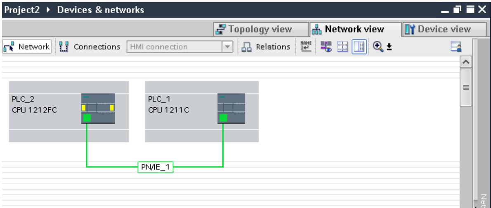

#### 下图所示为导出的 AML 文件的结构：

```xml
<InstanceHierarchy Name="APC Sample Instance Hierarchy">
    <InternalElement ID="e9d2bedb-f8c1-4148-acda-c3c68836c7dd" Name="Project2">
    ...
    <InternalElement ID="1062a384-d3ca-4183-9ac2-0934a5ab7286" Name="PN/IE_1">
    <Attribute Name="Type" AttributeDataType="xs:string">
    <Value>Ethernet</Value>
    </Attribute>
    <ExternalInterface ID="55ecf2cb-e72a-4974-8ed0-1d4e1ade3509"
    Name="LogicalEndPoint_Subnet"
    RefBaseClassPath="CommunicationInterfaceClassLib/LogicalEndPoint" />
    <SupportedRoleClass RefRoleClassPath="AutomationProjectConfigurationRoleClassLib/Subnet" />
    </InternalElement>
    <InternalElement ID="b011dbb1-efa4-46c0-a26f-f9bd047cda4f" Name="S7-1200 station_1">
    ...
    <InternalElement ID="d006e41b-05ff-44ab-baab-fca15f99e86c" Name="PROFINET interface_1">
    ...
    <InternalElement ID="beb4eb8e-1a45-45ce-a703-1acfac73e5f3" Name="E1">
    ...
    <ExternalInterface ID="a365b498-20cc-4e0b-99ca-5c5257632b96"
    Name="LogicalEndPoint_Node" RefBaseClassPath=
    "CommunicationInterfaceClassLib/LogicalEndPoint" />
    <SupportedRoleClass RefRoleClassPath=
    "AutomationProjectConfigurationRoleClassLib/Node" />
    </InternalElement>
    <InternalElement ID="d45aa36a-a7f2-4862-a266-d6727b9cfd75" Name="Port_1">
    ...
    <ExternalInterface ID="32c6ba4a-b01f-4678-b721-ea284779e96c"
    Name="CommunicationPortInterface"
    RefBaseClassPath=
    "AutomationProjectConfigurationInterfaceClassLib/CommunicationPortInterface" />
    <SupportedRoleClass RefRoleClassPath=
    "AutomationProjectConfigurationRoleClassLib/CommunicationPort" />
    </InternalElement>
    <SupportedRoleClass RefRoleClassPath=
    "AutomationProjectConfigurationRoleClassLib/DeviceItem" />
    </InternalElement>
    <SupportedRoleClass RefRoleClassPath=
    "AutomationProjectConfigurationRoleClassLib/DeviceItem" />
    </InternalElement>
    <SupportedRoleClass RefRoleClassPath=
    "AutomationProjectConfigurationRoleClassLib/DeviceItem" />
    </InternalElement>
    </InternalElement>
</InstanceHierarchy>
```
```xml
<InternalElement ID="7cf0ea2b-b66f-4ad4-8a03-5a8691cbe04d" Name="PLC_2">
    <InternalElement ID="b287020d-667b-483d-a8e0-c5466ac2f5c3" Name="PROFINET interface_1">
    <Attribute Name="Label" AttributeDataType="xs:string">
    <Value>X1</... 
    <InternalElement ID="a3e85aed-580a-45c8-943e-da7de8280b7c" Name="E1">
    <Attribute Name="Type" AttributeDataType="xs:string">
    <Value>Ethernet</Value>
    </Attribute>
    <Attribute Name="NetworkAddress" AttributeDataType="xs:string">
    <Value>192.168.0.2</Value>
    </Attribute>
    <Attribute Name="SubnetMask" AttributeDataType="xs:string">
    <Value>255.255.255.0</Value>
    </Attribute>
    <Attribute Name="DeviceNumber" AttributeDataType="xs:string">
    <Value>0</Value>
    </Attribute>
    <Attribute Name="IpProtocolSelection" AttributeDataType="xs:string">
    <Value>Project</Value>
    </Attribute>
    <ExternalInterface ID="6ae8eb93-09d3-4f8c-b529-a12148c71bf4"
    Name="LogicalEndPoint_Node"
    RefBaseClassPath="CommunicationInterfaceClassLib/LogicalEndPoint" />
    <SupportedRoleClass RefRoleClassPath="AutomationProjectConfigurationRoleClassLib/Node" />
    </InternalElement>
    <InternalElement ID="1e3e4c5b-04c1-4d2c-9aee-cad53cc92dba" Name="Port_1">
    ...
    <ExternalInterface ID="1f5b2a3d-fcd1-460a-b846-30dadc8726d1"
    Name="CommunicationPortInterface"
    RefBaseClassPath=
    "AutomationProjectConfigurationInterfaceClassLib/CommunicationPortInterface" />
    <SupportedRoleClass RefRoleClassPath=
    "AutomationProjectConfigurationRoleClassLib/CommunicationPort" />
    </InternalElement>
    <SupportedRoleClass RefRoleClassPath=
    "AutomationProjectConfigurationRoleClassLib/CommunicationInterface" />
    </InternalElement>
    <SupportedRoleClass RefRoleClassPath=
    "AutomationProjectConfigurationRoleClassLib/DeviceItem" />
    </InternalElement>
    </InternalElement>
</InternalElement>
```

#### Profinet/以太网节点的扩展角色

作为 AR APC 1.2 最新建议的一部分，在支持扩展属性的情况下，除了现有角色
“AutomationProjectConfigurationRoleClassLib/Node”外，任何 Profinet/以太网节点都应与一个附加角色“AutomationProjectConfigurationRoleClassLib/NodeEthernet”交换数据。
如果 Profinet/以太网节点支持 SubnetMask、RouterAddress、DhcpClientId、
IpProtocolSelection 等扩展属性，则应使用附加角色导出 Profinet/以太网节点。并且还可导入节点，不管其是否具有扩展角色。

#### 下面的 XML 程序段描述了具有扩展角色的“以太网”节点的 AML 文件。

```xml
<InternalElement ID="9c4393a9-44d5-49b4-9314-02eb0f94b6c0" Name="IE1">
<Attribute Name="SubnetMask" AttributeDataType="xs:string">
<Value>255.255.255.0</Value>
</Attribute>
<Attribute Name="RouterAddress" AttributeDataType="xs:string">
<Value>192.168.0.1</Value>
</Attribute>
<Attribute Name="IpProtocolSelection" AttributeDataType="xs:string">
<Value>Project</Value>
</Attribute>
<Attribute Name="Type" AttributeDataType="xs:string">
<Value>Ethernet</Value>
</Attribute>
<Attribute Name="NetworkAddress" AttributeDataType="xs:string">
<Value>192.168.0.1</Value>
</Attribute>
<ExternalInterface ID="eea59d3c-3bc4-4d0d-9815-46b4b347369d" Name="LogicalEndPoint_Node" RefBaseClassPath="CommunicationInterfaceClassLib/LogicalEndPoint" />
<SupportedRoleClass RefRoleClassPath="AutomationProjectConfigurationRoleClassLib/Node" />
<SupportedRoleClass RefRoleClassPath="AutomationProjectConfigurationEthernetRoleClassLib/NodeEthernet" />
</InternalElement>
```
用于导入/导出的 CAx 数据的结构 (页 1639)
连接到 TIA Portal (页 90)
打开项目 (页 140)

### 6.5.33 IO 系统的导出/导入

• TIA Portal Openness 应用程序已连接到 TIA Portal。 请[连接到 TIA Portal](#连接到-TIA-Portal)”
• 已打开一个项目。请[打开项目](#打开项目)”
• PLC 处于离线状态。
IO 系统在 AML 结构中表示为 <InternalElement>。
作为主机或 IO 控制器的 IO 系统添加到接口设备项的 <CommunicationInterface> 元素下。
```xml
<InternalElement ID="[Communication Interface UniqueID]"
    Name="[Communication Interface Name]">
<!--Node-->
<InternalElement ID="[Node UniqueID]" Name="[Node Name]
...
<ExternalInterface ID="[External Interface UniqueID]"
    Name="LogicalEndPoint_Node"
    RefBaseClassPath="CommunicationInterfaceClassLib/LogicalEndPoint" />
<SupportedRoleClass
    RefRoleClassPath="AutomationProjectConfigurationRoleClassLib/Node" />
</InternalElement>
<!--IoSystem-->
<InternalElement ID="[IoSystem UniqueID]" Name="[IoSystem Name]
<Attribute Name="Number" AttributeDataType="xs:integer">
    <Value>[IoSystem Number]</Value>
    </Attribute>
    <ExternalInterface ID="[External Interface UniqueID]"
    Name="LogicalEndPoint_Interface"
    RefBaseClassPath="CommunicationInterfaceClassLib/LogicalEndPoint" />
<SupportedRoleClass
    RefRoleClassPath="AutomationProjectConfigurationRoleClassLib/IoSystem" />
</InternalElement>
<SupportedRoleClass
    RefRoleClassPath="AutomationProjectConfigurationRoleClassLib/CommunicationInterface" />
</InternalElement>
```
作为从设备或 IO 设备的已连接 IO 系统作为 <ExternalInterface> 元素添加到接口设备项的 <CommunicationInterface> 下。
```xml
<InternalElement ID="[Communication Interface UniqueID]"
    Name="[Communication Interface Name]">
    ...
    <ExternalInterface ID="[External Interface UniqueID]"
    Name="LogicalEndPoint_Interface"
    RefBaseClassPath="CommunicationInterfaceClassLib/LogicalEndPoint" />
    <!--Node-->
    <InternalElement ID="[Node UniqueID]" Name="[Node Name]">
    <ExternalInterface ID="[External Interface UniqueID]"
    Name="LogicalEndPoint_Node"
    RefBaseClassPath="CommunicationInterfaceClassLib/LogicalEndPoint" />
    <SupportedRoleClass
    RefRoleClassPath="AutomationProjectConfigurationRoleClassLib/Node" />
    </InternalElement>
    <SupportedRoleClass
    RefRoleClassPath="AutomationProjectConfigurationRoleClassLib/CommunicationInterface" />
</InternalElement>
```
IO 系统的连接伙伴表示为 <InternalLink> 元素。<InternalLink> 变量添加到 IO 系统和已连接从设备项的共同父项下，例如：项目、DeviceFolder、DeviceItem。
<InternalLink> 变量名称在公共父项中是唯一的。

#### “IO-system”元素的属性

下表显示了用于 CAx 导入和导出文件的相关对象属性：
<table><tr><td>属性</td><td>处理</td><td>注释</td></tr><tr><td>Name</td><td>必须项</td><td>IO系统名称。如果导入空字符串,则使用默认名称创建IO系统。</td></tr><tr><td>Number</td><td>可选项</td><td>如果未指定导入,则应用默认值。</td></tr></table>
[连接到 TIA Portal](#连接到-TIA-Portal)
打开项目 (页 140)

### 6.5.34 导出/导入多语言注释

要求
• TIA Portal Openness 应用程序已连接到 TIA Portal。 请[连接到 TIA Portal](#连接到-TIA-Portal)”
• 项目已经打开。
请[打开项目](#打开项目)”
• PLC 处于离线状态。
CAx 数据交换可导出和导入以下硬件对象的注释和多语言注释：
• 设备 (Device)
• 模块 (DeviceItems)
• 变量 (Tag)
多语言注释的导入/导出包括所有 TIA Portal 语言。
• 导出
– 只有在存在注释的情况下，才能将“Comment”属性导出至 AML 文件。
• 导入
– "Comment" 属性可选。
– 对于虚拟设备项，不能导入注释。

#### 示例：导出带多语言注释的组态

下图显示了 SIMATIC S7 1500 (Device) 及 PLC\_1 (DeviceItems) 的组态。对于这两个对象，均以英语、法语、德语和中文设置注释。
<table><tr><td colspan="6">S7-1200 station_1 [S7-1200 Station]</td></tr><tr><td>General</td><td>IO tags</td><td>System constants</td><td>Texts</td><td colspan="2"></td></tr><tr><td></td><td>English (United States)</td><td>French (France)</td><td>German (Germany)</td><td>Chinese (People&#x27;s Republic of Chi...</td><td>Reference</td></tr><tr><td></td><td>Profinet_Module</td><td rowspan="2">Profinet_Module_fr machine_01</td><td rowspan="2">Profinet_Module_de Gerät_01</td><td>Profinet_Module_cs</td><td>PROFINET interf...</td></tr><tr><td></td><td>Device_01</td><td>Device_01_chs</td><td>S7-1200 statio...</td></tr><tr><td></td><td></td><td></td><td></td><td></td><td>Project2\PLC_1...</td></tr><tr><td></td><td></td><td></td><td></td><td></td><td>Project2\PLC_1...</td></tr><tr><td></td><td></td><td></td><td></td><td></td><td></td></tr></table>
导出该组态后，会将多语言注释生成为设备、设备项或变量的嵌套属性。
• 父属性“Comment”应包含采用默认语言的值。
• 对于每个外语注释，都存在一个子属性。
```xml
<Attribute Name="Comment" AttributeDataType="xs:string">
    <Value>English</Value>
    <Attribute Name="aml-lang=en-US" AttributeDataType="xs:string">
    <Value>English</Value>
    </Attribute>
    <Attribute Name="aml-lang=de-DE" AttributeDataType="xs:string">
    <Value>Deutsch</Value>
    </Attribute>
    <Attribute Name="aml-lang=zh-HK" AttributeDataType="xs:string">
    <Value>Chinese</Value>
    </Attribute>
    ...
    ...
</Attribute>
```
用于导入/导出的 CAx 数据的结构 (页 1639)
连接到 TIA Portal (页 90)
打开项目 (页 140)

### 6.5.35 导出/导入具有扩展机架连接的 ET200 SP/ET200 AL 设备

• TIA Portal Openness 应用程序已连接到 TIA Portal 请[连接到 TIA Portal](#连接到-TIA-Portal)”
• 将打开项目
请[打开项目](#打开项目)”
可将具有扩展机架连接的多机架设备导出到一个 AML 文件，然后将其导入，以便获取在 TIAPortal 项目中重新创建的具有扩展机架连接的同一设备。
在 TIA Portal 中，多个机架之间的扩展机架连接系统直接在 DeviceItem 对象（ET-Con\_1、ET-Con\_2 和 ET-Connection Receiver）下建立模块。但是，依照 AR APC 建议，这些连接系统将被模块化为 CommunicationPort 下的端口到端口连接。
因此，为了符合建议要求，具有空 CommunicationPort 对象的空 CommunicationInterface将被添加到相应 DeviceItem 对象下。

#### 具有多个扩展机架连接的设备组态

以下组态显示的是在 TIA Portal 中具有扩展机架连接的多机架 ET-200AL 设备。
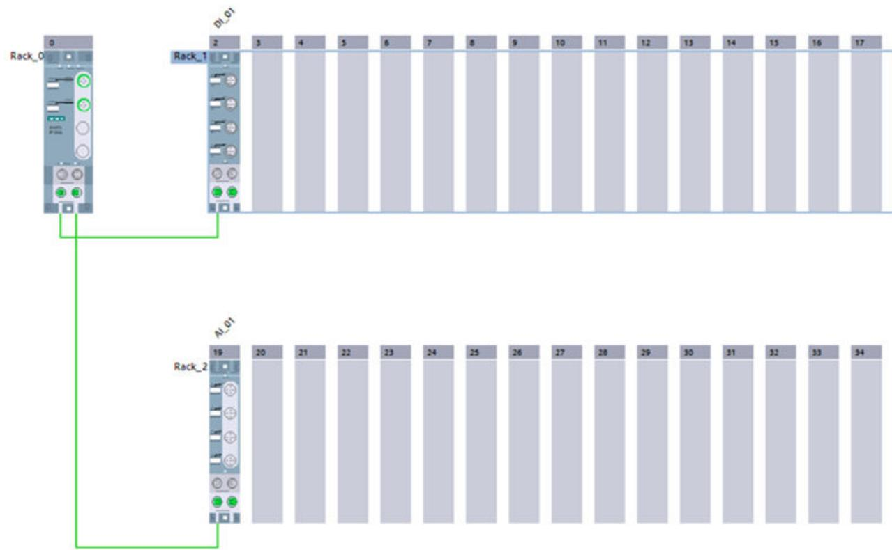
6.5 导入/导出硬件数据
AML 导出
在导出期间为上述组态所生成的 AML 文件如下所示。
```xml
<?xml version="1.0" encoding="utf-8"?><CAEXFile FileName="ET200AL_with_ExtensionRacks章节Version="2.15" xsi:noNamespaceSchemaLocation="CAEX_ClassModel_V2.15.xsd">
...
<InternalElement ID="2b90fale-df69-437d-8a77-eaa455cdfaba" Name="RackExtension">
<Attribute Name="Type" AttributeDataType="xs:string">
<Value>ET-Con</Value>
</Attribute>
...
<InternalElement ID="32758129-15db-43c7-9deb-53613852b208" Name="Port_1">
<Attribute Name="Label" AttributeDataType="xs:string">
<Value>X30</Value></Attribute>
<Attribute Name="PositionNumber" AttributeDataType="xs:int">
<Value>1</Value>
</Attribute>
<Attribute Name="BuiltIn" AttributeDataType="xs:boolean">
<Value>true</Value>
</Attribute>
<ExternalInterface ID="c326d6b8-ccl-a-444b-8a06-5c63a226a456" Name="CommunicationPortInterface"
RefBaseClassPath="AutomationProjectConfigurationInterfaceClassLib/CommunicationPortInterface" />
<SupportedRoleClass RefRoleClassPath="AutomationProjectConfigurationRoleClassLib/CommunicationPort" />
</InternalElement>
<SupportedRoleClass RefRoleClassPath="AutomationProjectConfigurationRoleClassLib/CommunicationInterface" />
</InternalElement>
...
<InternalElement ID="ab4e0e97-8e57-4218-b55c-0e4fe89a9587" Name="RackExtension">
<Attribute Name="Type" AttributeDataType="xs:string">
<Value>ET-Con</Value>
</Attribute>
...
<InternalElement ID="6bb61ad0-13ac-455b-9a90-6cbaddeaabd4" Name="Port_1">
<Attribute Name="Label" AttributeDataType="xs:string">
<Value>X31</Value>
</Attribute>
<Attribute Name="PositionNumber" AttributeDataType="xs:int">
<Value>1</Value>
</Attribute>
<Attribute Name="BuiltIn" AttributeDataType="xs:boolean">
<Value>true</Value>
</Attribute>
<ExternalInterface ID="90c95545-2e43-4701-8fd0-9e87ef0bd412" Name="CommunicationPortInterface"
RefBaseClassPath="AutomationProjectConfigurationInterfaceClassLib/CommunicationPortInterface" />
<SupportedRoleClass RefRoleClassPath="AutomationProjectConfigurationRoleClassLib/CommunicationPort" />
</InternalElement>
```
Openness：用于工程组态工作流自动化的 API系统手册, 11/2023
```xml
<SupportedRoleClass RefRoleClassPath="AutomationProjectConfigurationRoleClassLib/CommunicationInterface" />
</InternalElement>
<InternalElement ID="54119ad3-34b6-4e63-bc18-bee23312900a" Name="RackExtension">
<Attribute Name="Type" AttributeDataType="xs:string">
<Value>ET-Con</Value>
</Attribute>
...
<InternalElement ID="ad638a2a-538e-4840-9d99-7712522431ba" Name="Port_1">
<Attribute Name="Label" AttributeDataType="xs:string">
<Value>X30</Value>
</Attribute>
<Attribute Name="PositionNumber" AttributeDataType="xs:int">
<Value>2</Value>
</Attribute>
<Attribute Name="BuiltIn" AttributeDataType="xs:boolean">
<Value>true</Value>
</Attribute>
<ExternalInterface ID="6a517987-ae22-4446-b361-91aea2c768be" Name="CommunicationPortInterface" 
RefBaseClassPath="AutomationProjectConfigurationInterfaceClassLib/CommunicationPortInterface" />
<SupportedRoleClass RefRoleClassPath="AutomationProjectConfigurationRoleClassLib/CommunicationPort" />
</InternalElement>
<SupportedRoleClass RefRoleClassPath="AutomationProjectConfigurationRoleClassLib/CommunicationInterface" />
</InternalElement>
...
<InternalLink Name="Link To Port_1" 
RefPartnerSideA="32758129-15db-43c7-9deb-53613852b208:CommunicationPortInterface" 
RefPartnerSideB="ad638a2a-538e-4840-9d99-7712522431ba:CommunicationPortInterface" />
<InternalLink Name="Link To Port_2" 
RefPartnerSideA="6bb61ad0-13ac-455b-9a90-6cbaddeaabd4:CommunicationPortInterface" 
RefPartnerSideB="cac8af19-67bc-41aa-a3f0-7149af8f67d4:CommunicationPortInterface" />
```
只有扩展机架连接系统存在的情况下，才能导出扩展机架接口。此外，ET-Con 空接口下添加的空端口数取决于参与模块级扩展机架连接系统的端口数。
多个机架之间扩展机架连接的 XML 表示将使用以下所示格式完成。
• ExternalInterface-<ExternalInterface>内部元素应该添加到参与连接的<CommunicationPort> 内部元素下
```xml
<InternalElement ID="[IM Module Unique ID]" Name="[IM Module Name]">
<InternalElement ID="[Dummy Interface Unique ID]" Name="RackExtension">
<Attribute Name="Type" AttributeDataType="xs:string">
<Value>ET-Con</Value>
</Attribute>
...
<InternalElement ID="[Dummy Port Unique ID]" Name="[IM Module Sender/Receiver Name]">
...
<ExternalInterface ID="[External Interface Unique ID]" Name="CommunicationPortInterface" RefBaseClassPath="AutomationProjectConfigurationInterfaceClassLib/CommunicationPortInterface" />
<SupportedRoleClass RefRoleClassPath="AutomationProjectConfigurationRoleClassLib/CommunicationPort" />
</InternalElement>
<InternalElement ID="[Dummy Port Unique ID]" Name="[IM Module Sender/Receiver Name]">
...
<ExternalInterface ID="[External Interface Unique ID]" Name="CommunicationPortInterface" RefBaseClassPath="AutomationProjectConfigurationInterfaceClassLib/CommunicationPortInterface" />
<SupportedRoleClass RefRoleClassPath="AutomationProjectConfigurationRoleClassLib/CommunicationPort" />
</InternalElement>
<SupportedRoleClass RefRoleClassPath="AutomationProjectConfigurationRoleClassLib/CommunicationInterface" />
</InternalElement>
<SupportedRoleClass RefRoleClassPath="AutomationProjectConfigurationRoleClassLib/DeviceItem" />
</InternalElement>
```
Internal link- 扩展机架连接使用 <InternalLink> 变量表示。<InternalLink> 变量应该添加到多个机架（即设备）的共同父设备下。内部连接名称在公共父项中是唯一的。
```txt
<InternalLink Name="Link To [Internal link Name]" RefPartnerSideA="[Communication Port UniqueID]:[Communication Port External Interface Name]" RefPartnerSideB="[Communication Port UniqueID]:[Communication Port External Interface Name]" />
```

#### 导入 AML

可从上述导出过程所生成的 AML 文件导入扩展机架连接详细信息。但也可导入在之前版本的TIA Portal 中创建的 AML 文件。
1. 导出层级更改行为将仅适用于 V16 及更高的版本。更低版本的 TIA portal 的行为与之前相同。
2. 导入后，AML 文件中的层级不影响 TIA Portal 内部的层级。
3. 此层级更改/转换行为适用于具有扩展机架连接的 ET200 AL 和 ET200 SP。
4. 类型属性的字符串值为“大小写不变”（例如：ET-Con、et-con、ET-con 等）的 AML 文件在导入时也不应出现故障。

#### 具有并列式连接的扩展机架

以下组态显示的扩展机架包含的模块采用并列式连接。在下述组态中，模块 DI\_01、DI\_02、DI\_03、AQ\_01 和 AQ\_02 在 TIA Portal 中连接到其后面的模块。但在 TIA Portal 中，BusAdapter-Sender 与 DI\_01 模块之间的连接建模为扩展机架连接，其它模块连接未建模。
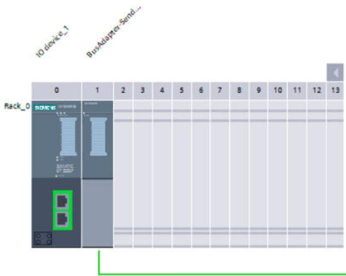
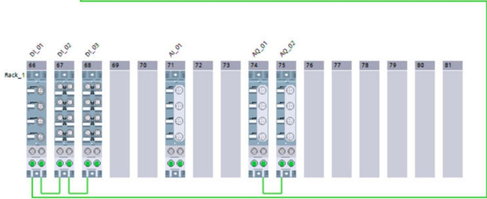
6.5 导入/导出硬件数据
在导出期间为上述组态所生成的 AML 文件如下所示。
```txt
<?xml version="1.0" encoding="utf-8"?><CAEXFile
FileName="ET200SP_with_ET200AL_ExtensionRack_And_SideBySideConnection.aml"
SchemaVersion="2.15" xsi:noNamespaceSchemaLocation="CAEX_ClassModel_V2.15.xsd">
...
<InternalElement ID="aa0f752d-63fb-4f8d-b840-72d39f2ae508" Name="RackExtension">
<Attribute Name="Type" AttributeDataType="xs:string">
<Value>ET-Con</Value>
</Attribute>
... 
<InternalElement ID="695f110e-2c2b-435f-b3c1-cdc77d83d559" Name="Port_1">
<Attribute Name="Label" AttributeDataType="xs:string">
<Value>X1</Value>
</Attribute>
<Attribute Name="PositionNumber" AttributeDataType="xs:int">
<Value>1</Value>
</Attribute>
<Attribute Name="BuiltIn" AttributeDataType="xs:boolean">
<Value>true</Value>
</Attribute>
<ExternalInterface ID="87b9a1a3-dab8-4c62-8627-fbc8ab84e8f7"
Name="CommunicationPortInterface"
RefBaseClassPath="AutomationProjectConfigurationInterfaceClassLib/
CommunicationPortInterface" />
<SupportedRoleClass RefRoleClassPath="AutomationProjectConfigurationRoleClassLib/
CommunicationPort" />
</InternalElement>
<SupportedRoleClass
RefRoleClassPath="AutomationProjectConfigurationRoleClassLib/CommunicationInterface" />
</InternalElement>
<InternalElement ID="124371c4-52ca-4ecc-a476-84e7bc1439b8" Name="RackExtension">
<Attribute Name="Type" AttributeDataType="xs:string">
<Value>ET-Con</Value>
</Attribute>
...
<InternalElement ID="0e354480-219c-4178-9f21-21fb369d446e" Name="Port_1">
<Attribute Name="Label" AttributeDataType="xs:string">
<Value>X30</Value>
</Attribute>
<Attribute Name="PositionNumber" AttributeDataType="xs:int">
<Value>2</Value>
</Attribute>
<Attribute Name="BuiltIn" AttributeDataType="xs:boolean">
<Value>true</Value>
</Attribute>
<ExternalInterface ID="ab03743a-59a5-490e-b6c6-ce5359e345fd"
Name="CommunicationPortInterface"
RefBaseClassPath="AutomationProjectConfigurationInterfaceClassLib/
CommunicationPortInterface" />
<SupportedRoleClass RefRoleClassPath="AutomationProjectConfigurationRoleClassLib/
CommunicationPort" />
...
</InternalElement>
<InternalElement ID="a0ff4884-cb81-40ed-85c8-823650687a8f" Name="Port_2">
```
Openness：用于工程组态工作流自动化的 API系统手册, 11/2023
```xml
<Attribute Name="Label" AttributeDataType="xs:string">
    <Value>X31</Value>
    </Attribute>
    <Attribute Name="PositionNumber" AttributeDataType="xs:int">
    <Value>3</Value>
    </Attribute>
    <Attribute Name="BuiltIn" AttributeDataType="xs:boolean">
    <Value>true</Value>
    </Attribute>
    <ExternalInterface ID="33caac7c-2944-4b1d-9fb8-8a451e4c1c25"
    Name="CommunicationPortInterface"
    RefBaseClassPath="AutomationProjectConfigurationInterfaceClassLib/CommunicationPortInterface" />
    <SupportedRoleClass RefRoleClassPath="AutomationProjectConfigurationRoleClassLib/CommunicationPort" />
    </InternalElement>
    <SupportedRoleClass RefRoleClassPath="AutomationProjectConfigurationRoleClassLib/CommunicationInterface" />
    </InternalElement>
    <InternalElement ID="d1aa8afe-e20a-4b82-996a-9fca151b2c51" Name="RackExtension">
    <Attribute Name="Type" AttributeDataType="xs:string">
    <Value>ET-Con</Value>
    </Attribute>
    ...
    <InternalElement ID="e713beda-1d1c-48d7-8674-8640080c87f7" Name="Port_1">
    <Attribute Name="Label" AttributeDataType="xs:string">
    <Value>X30</Value>
    </Attribute>
    <Attribute Name="PositionNumber" AttributeDataType="xs:int">
    <Value>2</Value>
    </Attribute>
    <Attribute Name="BuiltIn" AttributeDataType="xs:boolean">
    <Value>true</Value>
    </Attribute>
    <ExternalInterface ID="046e2a6a-dca9-4a63-8f4f-53cabac1a65c"
    Name="CommunicationPortInterface"
    RefBaseClassPath="AutomationProjectConfigurationInterfaceClassLib/CommunicationPortInterface" />
    <SupportedRoleClass RefRoleClassPath="AutomationProjectConfigurationRoleClassLib/CommunicationPort" />
    </InternalElement>
    <InternalElement ID="81999cc0-694f-4f7b-ba12-72ee9010cb11" Name="Port_2">
    <Attribute Name="Label" AttributeDataType="xs:string">
    <Value>X31</Value>
    </Attribute>
    <Attribute Name="PositionNumber" AttributeDataType="xs:int">
    <Value>3</Value>
    </Attribute>
    <Attribute Name="BuiltIn" AttributeDataType="xs:boolean">
    <Value>true</Value>
    </Attribute>
</Attribute>
```
```xml
<ExternalInterface ID="e611d310-9ff7-45bb-b379-36e9cbea5080" Name="CommunicationPortInterface" RefBaseClassPath="AutomationProjectConfigurationInterfaceClassLib/CommunicationPortInterface" />
<SupportedRoleClass RefRoleClassPath="AutomationProjectConfigurationRoleClassLib/CommunicationPort" />
</InternalElement>
<SupportedRoleClass RefRoleClassPath="AutomationProjectConfigurationRoleClassLib/CommunicationInterface" />
</InternalElement>
...
<InternalElement ID="d21e9e3d-f5ea-4992-87b4-1598ecd2e159" Name="RackExtension">
<Attribute Name="Type" AttributeDataType="xs:string">
<Value>ET-Con</Value>
</Attribute>
...
<InternalElement ID="74cff4f7-3023-4235-9255-b36bc9b3e3e6" Name="Port_1">
<Attribute Name="Label" AttributeDataType="xs:string">
<Value>X30</Value>
</Attribute>
<Attribute Name="PositionNumber" AttributeDataType="xs:int">
<Value>2</Value>
</Attribute>
<Attribute Name="BuiltIn" AttributeDataType="xs:boolean">
<Value>true</Value>
</Attribute>
<ExternalInterface ID="5322297a-a9c6-474d-82d0-992234730926" Name="CommunicationPortInterface" RefBaseClassPath="AutomationProjectConfigurationInterfaceClassLib/CommunicationPortInterface" />
<SupportedRoleClass RefRoleClassPath="AutomationProjectConfigurationRoleClassLib/CommunicationPort" />
</InternalElement>
<SupportedRoleClass RefRoleClassPath="AutomationProjectConfigurationRoleClassLib/CommunicationInterface" />
</InternalElement>
...
<InternalElement ID="c671263b-4c6e-4914-8a29-cec88bc917bd" Name="RackExtension">
<Attribute Name="Type" AttributeDataType="xs:string">
.Value>ET-Con</Value>
</Attribute>
...
<InternalElement ID="b220aab7-ed61-481e-a9e5-5588b510c46c" Name="Port_1">
<Attribute Name="Label" AttributeDataType="xs:string">
<Value>X30</Value>
</Attribute>
<Attribute Name="PositionNumber" AttributeDataType="xs:int">
<Value>2</Value>
</Attribute>
<Attribute Name="BuiltIn" AttributeDataType="xs:boolean">
```
Openness：用于工程组态工作流自动化的 API系统手册, 11/2023
```xml
<Value>true</Value>
</Attribute>
<ExternalInterface ID="ef830254-217a-42b3-b2f1-2363acf79b69"
Name="CommunicationPortInterface"
RefBaseClassPath="AutomationProjectConfigurationInterfaceClassLib/
CommunicationPortInterface" />
<SupportedRoleClass RefRoleClassPath="AutomationProjectConfigurationRoleClassLib/
CommunicationPort" />
</InternalElement>
<SupportedRoleClass RefRoleClassPath="AutomationProjectConfigurationRoleClassLib/
CommunicationInterface" />
</InternalElement>
<InternalLink Name="Link To Port_1" RefPartnerSideA="695f110e-2c2b-435f-b3c1-cdc77d83d559:CommunicationPortInterface"
RefPartnerSideB="0e354480-219c-4178-9f21-21fb369d446e:CommunicationPortInterface" />
<InternalLink Name="Link To Port_2" RefPartnerSideA="a0ff4884-cb81-40ed-85c8-823650687a8f:CommunicationPortInterface"
RefPartnerSideB="e713beda-1d1c-48d7-8674-8640080c87f7:CommunicationPortInterface" />
<InternalLink Name="Link To Port_3" RefPartnerSideA="81999cc0-694f-4f7b-ba12-72ee9010cb11:CommunicationPortInterface" RefPartnerSideB="74cff4f7-3023-4235-9255-b36bc9b3e3e6:CommunicationPortInterface" />
<InternalLink Name="Link To Port_4"
RefPartnerSideA="0201304e-39a9-4c9a-8316-2dd86fd95d0c:CommunicationPortInterface"
RefPartnerSideB="b220aab7-ed61-481e-a9e5-5588b510c46c:CommunicationPortInterface" />
```
对于并列式连接，只有在模块插入位置彼此相邻的情况下，才能导出扩展机架接口。此外，ET-Con 空接口下添加的空端口数取决于参与模块级扩展机架连接系统的端口数。上例中，“DI\_02”模块插入在“DI\_01”与“DI\_03”模块之间，因此，在导出的 AML 文件中，相应的 ET-Con空接口有两个空端口。但如果使用的是“AI\_01”模块，则没有任何并列式模块。因此，在这种情况下，“AI\_01”模块不含任何 ET-Con 空接口详细信息。再次将 AML 文件导入到空 TIA Portal项目会创建同一个具有扩展机架连接的多机架设备。
• 对于 ET200 AL 和 ET200SP 模块，插入相关模块时，TIA Portal 支持主机架与扩展机架之间的默认连接。在这种情况下，AML 文件中的连接信息在导入过程中不相关。
• AML 文件中的并列式连接说明在导入过程中不相关，因为并列式连接是在两个相邻模块导入到同一机架时自动建立的。
连接到 TIA Portal (页 90)
打开项目 (页 140)

### 6.5.36 导出/导入 PLC 变量

• TIA Portal Openness 应用程序已连接到 TIA Portal。
请[连接到 TIA Portal](#连接到-TIA-Portal)”
• 已打开一个项目。
请[打开项目](#打开项目)”
• PLC 处于离线状态。
导出和导入的符号及变量被分配给设备项。CAx 导入/导出涉及面向硬件的符号和变量。符号和变量仅基于控制器目标设备项（例如，CPU）进行导出，而不基于其可能引用的其它设备项（例如，I/O 模块）进行导出。与设备类似，变量通常被分组到变量表和层级文件夹结构中。

#### AML 结构元素

PLC 变量、变量表和变量用户文件夹可通过 CAx 导入/导出功能进行导出和导入。变量对象映射在以下 AML 结构元素中：
• <InternalElement>
变量表和变量用户文件夹被映射为具有相应角色类别的相关 PLC 内部元素。
• <ExternalInterface>
表示一个 PLC 变量，专用于相关变量表或变量用户文件夹的内部元素。
带有 PLC 变量的映射通道通过<internal link>元素导出为通信伙伴。以下 XML 结构显示了一个示例：
```xml
<InternalLink Name="Link To Tag_1" RefPartnerSideA="b33451f6-d88f-4900-8dbe-41f1be1e3535:Channel_DI_0" RefPartnerSideB="b2b937ee-d5db-4826-9340-027b1da22828:Tag_1" />
```

#### PLC 变量用户文件夹

在 CAx 导入和导出文件中，对象“TagUserFolder”仅需“Name”属性。

#### PLC 变量表的属性

下表显示了用于 CAx 导入和导出文件的相关对象属性：
<table><tr><td>属性</td><td>处理</td><td>注释</td></tr><tr><td>Name</td><td>必须项,&quot;AssignToDefault&quot; = TRUE 时被忽略</td><td></td></tr><tr><td>AssignToDefault</td><td>仅导入</td><td>用于在导入期间识别默认变量表。如果 &quot;AssignToDefault&quot; = TRUE,则会在 TIA Portal 的默认变量表下创建所有变量。</td></tr></table>

#### PLC 变量的属性

下表显示了用于 CAx 导入和导出文件的相关对象属性：
<table><tr><td>属性</td><td>处理</td><td>注释</td></tr><tr><td>Name</td><td>必须项</td><td></td></tr><tr><td>DataType</td><td>必须项</td><td></td></tr><tr><td>LogicalAddress</td><td>可选项</td><td>以国际助记符格式导入和导出</td></tr><tr><td>IoType</td><td>可选项</td><td>输入或输出</td></tr><tr><td>Comment</td><td>可选项</td><td></td></tr></table>
TIA Portal V16 支持导出和导入 AR APC V1.1.0 的 AML 文件中的 IoType 属性。

#### 示例：AML 结构

下图显示了以下所导出变量对象的结构：
• 空默认变量表
• 变量用户文件夹“Group\_1”
• 包括的变量表“Tag table\_1”
• 四个变量
```xml
<InternalElement ID="a310b193-ba04-49d7-a8e3-004619c7d9d2" Name="Default tag table">
    <SupportedRoleClass RefRoleClassPath="AutomationProjectConfigurationRoleClassLib/TagTable" />
</InternalElement>
<InternalElement ID="0feff703-9c70-4ca9-b3b3-8de8229696dd" Name="Group_1">
    <InternalElement ID="f92g9ce4-c015-459f-9f59-8f94bca3b186" Name="Tag table_1">
    <ExternalInterface ID="fc0c8c5a-fd5b-443b-b430-6435b6aa22ff" Name="Tag_1" RefBaseClassPath="AutomationProjectConfigurat"
    ...
    </ExternalInterface>
    <ExternalInterface ID="450d6a1d-81b8-49ae-a104-c0072933d669" Name="Tag_2" RefBaseClassPath="AutomationProjectConfigurat"
    ...
    </ExternalInterface>
    <ExternalInterface ID="3de17a36-b5c5-4fc7-9fc3-47e4a8f95087" Name="Tag_3" RefBaseClassPath="AutomationProjectConfigurat"
    <Attribute Name="DataType" AttributeDataType="xs:string">
    <Value>Word</Value>
    </Attribute>
    <Attribute Name="IoType" AttributeDataType="xs:string">
    <Value Animation</Value>
    </Attribute>
    <Attribute Name="LogicalAddress" AttributeDataType="xs:string">
    <Value>IWO</Value>
    </Attribute>
    </ExternalInterface>
    <SupportedRoleClass RefRoleClassPath="AutomationProjectConfigurationRoleClassLib/TagTable" />
</InternalElement>
    <SupportedRoleClass RefRoleClassPath="AutomationProjectConfigurationRoleClassLib/TagUserFolder" />
</InternalElement>
    <SupportedRoleClass RefRoleClassPath="AutomationProjectConfigurationRoleClassLib/TagUserFolder" />
</InternalElement>
...
```
用于导入/导出的 CAx 数据的结构 (页 1639)
连接到 TIA Portal (页 90)
打开项目 (页 140)

### 6.5.37 导出/导入 RH/PLC

• TIA Portal Openness 已连接到 TIA Portal 请[连接到 TIA Portal](#连接到-TIA-Portal)”
• 已打开一个项目请[打开项目](#打开项目)”
• PLC 处于离线状态
应用
可使用 TIA Portal 导出和导入具有相同 IP 地址组态的 R/H PLC 中的 AML 文件 AR APC V1.1。
属性
TIA Portal 的 AML 文件中只有一个属性适用于 R/H PLC（如果在 TIA Portal 用户界面中可用）：
<table><tr><td>设备项属性名称</td><td>处理方式</td><td>注释</td></tr><tr><td>HNetworkAddress</td><td>必选项</td><td>只有设备项 R/H PLC 支持该 TIA Portal 属性且不为空时可导出/导入,否则应跳过。对于导入,应设置“启用切换连接的系统 IP 地址”(Enable the system IP address for switched connection),且应为 HNetworkAddress 分配值。</td></tr></table>
• 导出
\- 仅当在 TIA Portal 中选中“启用切换连接的系统 IP 地址”(Enable the system IP addressfor switched connection) 时。

#### 示例：导出组态

以下组态显示的是 HNetworkAddress 已组态的设备项。  
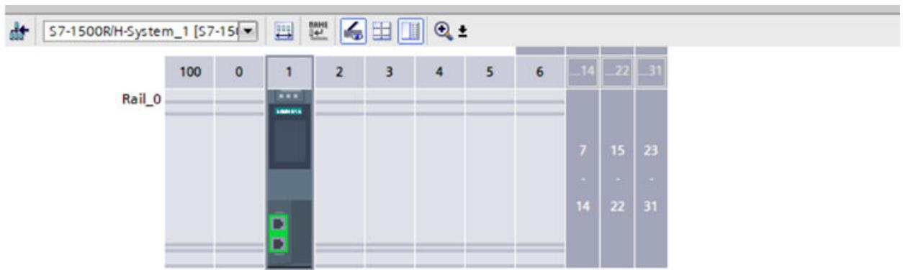
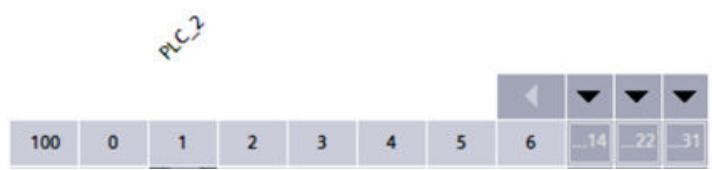
下图所示为所导出 R/H PLC 的 AML 文件的结构。
```xml
<InternalElement ID="e1879cf8-8222-4ce3-b171-60c56aed7f18" Name="PROFINET interface_1">
<Attribute Name="Label" AttributeDataType="xs:string">
<Value>X1</Value>
</Attribute>
<Attribute Name="PositionNumber" AttributeDataType="xs:int">
<Value>32768</Value>
</Attribute>
<Attribute Name="BuiltIn" AttributeDataType="xs:boolean">
<Value>true</Value>
</Attribute>
<InternalElement ID="a32c67c7-47dc-4362-a9c4-b41b93b58eff" Name="E1">
<Attribute Name="Type" AttributeDataType="xs:string">
<Value>Ethernet</Value>
</Attribute>
<Attribute Name="NetworkAddress" AttributeDataType="xs:string">
<Value>192.168.0.1</Value>
</Attribute>
<Attribute Name="SubnetMask" AttributeDataType="xs:string">
<Value>255.255.255.0</Value>
</Attribute>
<Attribute Name="IpProtocolSelection" AttributeDataType="xs:string">
<Value>Project</Value>
</Attribute>
<Attribute Name="HNetworkAddress" AttributeDataType="xs:string">
<Value>192.168.0.3</Value>
</Attribute>
<ExternalInterface ID="802676fa-212f-4bf5-b112-de94993a0340" Name="LogicalEndPoint_Node" RefBaseClassPath="CommunicationInterfaceClassLib/LogicalEndPoint" />
<SupportedRoleClass RefRoleClassPath="AutomationProjectConfigurationRoleClassLib/Node" />
</InternalElement>
```
[连接到 TIA Portal](#连接到-TIA-Portal)打开项目 (页 140)

### 6.5.38 导出/导入带有自定义变量和 deviceitem 的 AML

要求
• TIA Portal Openness 应用程序已连接到 TIA Portal。 请[连接到 TIA Portal](#连接到-TIA-Portal)”
• 已打开一个项目
请[打开项目](#打开项目)”
• PLC 处于离线状态
应用
可使用 TIA Portal 导出和导入带有“Customized”变量子属性和 deviceitem 的 AR APC V1.1 AML文件。
属性
下表显示了 CAx 导入和导出文件期间变量可用的相关属性：
<table><tr><td>属性名称</td><td>处理方式</td><td>注释</td></tr><tr><td>Customized</td><td>导出/导入时为可选项</td><td>变量的子属性“DataType”。Customized 唯一允许的值是 True 和 False。导入时,与 customized 属性不相关在导出期间,对于 IEC 61131 数据类型以外的数据类型,Customized 子属性的值为“true”。对于符合 IEC 61131 的数据类型,不得导出 Customized 子属性。</td></tr></table>
下表显示了 CAx 导入和导出文件期间可用于 deviceitem 的相关属性：
<table><tr><td>属性名称</td><td>处理方式</td><td>注释</td></tr><tr><td>Customized</td><td>导入时为可选项</td><td>该属性为DeviceItem的父“DeviceItemType”属性的子属性。Customized唯一允许的值是True和False。导入和导出时,与Customized属性不相关</td></tr></table>
6.5 导入/导出硬件数据
导出的 AML 文件
在导出带有自定义 deviceItem 的 AML 文件期间，将生成以下 AML 文件。
```xml
<?xml version="1.0" encoding="utf-8"?>
<CAEXFile FileName="Project26.aml" SchemaVersion="2.15"
xsi:noNamespaceSchemaLocation="CAEX_ClassModel_V2.15.xsd">
<AdditionalInformation>
<WriterHeader>
...
</WriterHeader>
</AdditionalInformation>
<AdditionalInformation AutomationMLVersion="2.0" />
<AdditionalInformation DocumentVersions="Recommendations">
<Document DocumentIdentifier="AR APC" Version="1.1.0" />
</AdditionalInformation>
<InstanceHierarchy Name="APC Sample Instance Hierarchy">
<InternalElement ID="03ecf798-3e07-4976-b281-f8b98eb3a590" Name="Project26">
...
<InternalElement ID="c218aea9-93b8-4719-be6f-ccfa9517e2c6" Name="S71500/ET200MP station_1">
<Attribute Name="TypeIdentifier" AttributeDataType="xs:string">
<Value>System:Device.S71500</Value>
</Attribute>
<InternalElement ID="c1ae306f-183f-47b8-91e6-cb331c559278" Name="Rail_0">
...
<InternalElement ID="8d7d5ee1-603a-4897-b47e-8954d4c21a31" Name="PLC_1">
...
<Attribute Name="DeviceItemType" AttributeDataType="xs:string">
<Value>CPU</Value>
</Attribute>
...
<InternalElement ID="a2a7f0bc-068c-4904-84b1-73ed87e28de1" Name="Tag table_1">
...
<Attribute Name="DataType" AttributeDataType="xs:string">
<Value>Conn_Any</Value>
<Attribute Name="Customized" AttributeDataType="xs:boolean">
<Value>true</Value>
</Attribute>
</Attribute>
</InternalElement>
...
<SupportedRoleClass RefRoleClassPath="AutomationProjectConfigurationRoleClassLib/DeviceItem" />
</InternalElement>
<SupportedRoleClass RefRoleClassPath="AutomationProjectConfigurationRoleClassLib/DeviceItem" />
</InternalElement>
<SupportedRoleClass RefRoleClassPath="AutomationProjectConfigurationRoleClassLib/Device" />
</InternalElement>
<SupportedRoleClass RefRoleClassPath="AutomationProjectConfigurationRoleClassLib/AutomationProject" />
</InternalElement>
</InstanceHierarchy>
```
Openness：用于工程组态工作流自动化的 API系统手册, 11/2023
6.5 导入/导出硬件数据
</CAEXFile>
[连接到 TIA Portal](#连接到-TIA-Portal)
打开项目 (页 140)

### 6.5.39 导入/导出故障安全 PLC

要求
• TIA Portal Openness 应用程序已连接到 TIA Portal连接到 TIA Portal (页 90)
• 已打开一个项目请[打开项目](#打开项目)”
• PLC 处于离线状态
应用
可使用 TIA Portal 将故障安全 PLC 的故障安全属性导出和导入到 AR APC V1.1 AML 文件。
属性
下表列出了 CAx 导入和导出 AML 文件的故障安全属性：
<table><tr><td>Openness 属性</td><td>处理方式</td><td>注释</td><td>AML 中的 AR APC 名称</td></tr><tr><td>Failsafe_FSourceAddress</td><td>必选项</td><td>只有设备项为故障安全PLC,并且 TIA Portal 中支持此属性且不为空时可导出/导入,否则应跳过</td><td>Failsafe_FSourceAddress</td></tr><tr><td>Failsafe_LowerBoundForFDestinationAddresses</td><td>必选项</td><td>只有设备项为故障安全PLC,并且 TIA Portal 中支持此属性且不为空时可导出/导入,否则应跳过</td><td>Failsafe_LowerBoundForFDestinationAddresses</td></tr></table>
6.5 导入/导出硬件数据
<table><tr><td>Openness 属性</td><td>处理方式</td><td>注释</td><td>AML 中的 AR APC 名称</td></tr><tr><td>Failsafe_UpperBoundForFDestinationAddresses</td><td>必选项</td><td>只有设备项为故障安全PLC,并且 TIA Portal 中支持此属性且不为空时可导出/导入,否则应跳过</td><td>Failsafe_UpperBoundForFDestinationAddresses</td></tr><tr><td>Failsafe_CentralFSourceAddress</td><td>可选项</td><td>只有设备项为故障安全PLC,并且 TIA Portal 中支持此属性且不为空时可导出/导入,否则应跳过</td><td>Failsafe_FSourceAddress</td></tr><tr><td>Failsafe_FDestinationAddress</td><td>可选项</td><td>只有设备项为故障安全PLC,并且 TIA Portal 中支持此属性且不为空时可导出/导入,否则应跳过</td><td>Failsafe_FDestinationAddress</td></tr></table>
示例：导出组态
以下组态显示的是属性已组态的设备项。  
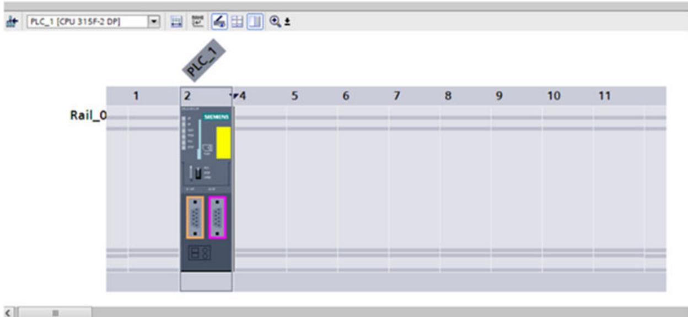
6.5 导入/导出硬件数据
导出文件的 AML 结构
下图所示为导出的 AML 文件的结构。
```xml
<InternalElement ID="9c944d2c-e0ae-4f39-b35a-a63faaf35be7" Name="PLC_1">
<Attribute Name="TypeName" AttributeDataType="xs:string">
<Value>CPU 1511TF-1 PN</Value>
</Attribute>
<Attribute Name="DeviceItemType" AttributeDataType="xs:string">
<Value>CPU</Value>
</Attribute>
<Attribute Name="PositionNumber" AttributeDataType="xs:int">
<Value>1</Value>
</Attribute>
<Attribute Name="BuiltIn" AttributeDataType="xs:boolean">
<Value>false</Value>
</Attribute>
<Attribute Name="TypeIdentifier" AttributeDataType="xs:string">
<Value>OrderNumber:6ES7 511-1UK01-0AB0</Value>
</Attribute>
<Attribute Name="InstallationDate" AttributeDataType="xs:dateTime">
<Value>2019-02-28T08:12:12.987Z</Value>
</Attribute>
<Attribute Name="Failsafe_FSourceAddress" AttributeDataType="xs:string">
<Value>1</Value>
</Attribute>
<Attribute Name="Failsafe_LowerBoundForFDestinationAddresses" AttributeDataType="xs:string">
<Value>1</Value>
</Attribute>
<Attribute Name="Failsafe_UpperBoundForFDestinationAddresses" AttributeDataType="xs:string">
<Value>99</Value>
</Attribute>
<Attribute Name="FirmwareVersion" AttributeDataType="xs:string">
<Value>V2.8</Value>
</Attribute>
<InternalElement ID="4f718e93-b541-4983-8f13-1f5b21c3e70c" Name="Default tag table">
<SupportedRoleClass RefRoleClassPath="AutomationProjectConfigurationRoleClassLib/TagTable"/>
</InternalElement>
<InternalElement ID="20e19f5b-8ace-4e0c-af0b-c710ae4817da" Name="CPU display_1">
<Attribute Name="PositionNumber" AttributeDataType="xs:int">
<Value>3</Value>
</Attribute>
<Attribute Name="BuiltIn" AttributeDataType="xs:boolean">
<Value>true</Value>
</Attribute>
<SupportedRoleClass RefRoleClassPath="AutomationProjectConfigurationRoleClassLib/DeviceItem" />
</InternalElement>
<InternalElement ID="5a24516f-17d6-4b2a-a4ac-efc1b577875d" Name="Card reader/writer_1">
<Attribute Name="PositionNumber" AttributeDataType="xs:int">
<Value>4</Value>
```
Openness：用于工程组态工作流自动化的 API系统手册, 11/2023
```xml
</Attribute>
<Attribute Name="BuiltIn" AttributeDataType="xs:boolean">
<Value>true</Value>
</Attribute>
<SupportedRoleClass RefRoleClassPath="AutomationProjectConfigurationRoleClassLib/DeviceItem" />
</InternalElement> <InternalElement ID="0f746d71-035e-4e64-b0d7-51d0449cfd88" Name="OPC UA_1">
<Attribute Name="PositionNumber" AttributeDataType="xs:int">
<Value>254</Value>
</Attribute>
<Attribute Name="BuiltIn" AttributeDataType="xs:boolean">
<Value>true</Value> </Attribute>
<SupportedRoleClass RefRoleClassPath="AutomationProjectConfigurationRoleClassLib/DeviceItem" />
</InternalElement>
<InternalElement ID="a0633104-a2ac-4680-bb99-81df50f5ec40" Name="PROFINET interface_1">
<Attribute Name="Label" AttributeDataType="xs:string">
<Value>X1</Value>
</Attribute>
<Attribute Name="PositionNumber" AttributeDataType="xs:int">
<Value>32768</Value>
</Attribute>
<Attribute Name="BuiltIn" AttributeDataType="xs:boolean">
<Value>true</Value>
</Attribute>
<InternalElement ID="e3497176-dbba-4fec-9d3a-772ae13987c4" Name="E1">
<Attribute Name="Type" AttributeDataType="xs:string">
<Value>Ethernet</Value> </Attribute>
<Attribute Name="NetworkAddress" AttributeDataType="xs:string">
<Value>192.168.0.1</Value>
</Attribute>
<Attribute Name="SubnetMask" AttributeDataType="xs:string">
<Value>255.255.255.0</Value>
</Attribute>
<Attribute Name="IpProtocolSelection" AttributeDataType="xs:string">
<Value>Project</Value>
</Attribute>
<SupportedRoleClass RefRoleClassPath="AutomationProjectConfigurationRoleClassLib/Node" />
</InternalElement>
<InternalElement ID="3208384f-d5ba-4ccb-b8da-f08ec38ec681" Name="Port_1">
<Attribute Name="Label" AttributeDataType="xs:string">
<Value>P1R</Value>
</Attribute>
<Attribute Name="PositionNumber" AttributeDataType="xs:int">
<Value>32769</Value>
</Attribute>
<Attribute Name="BuiltIn" AttributeDataType="xs:boolean">
<Value>true</Value>
</Attribute>
```
```xml
<SupportedRoleClass RefRoleClassPath="AutomationProjectConfigurationRoleClassLib/CommunicationPort" />
</InternalElement>
<InternalElement ID="4a47c05e-9656-4e02-9b51-23b065b6fe47" Name="Port_2">
<Attribute Name="Label" AttributeDataType="xs:string">
<Value>P2R</Value>
</Attribute>
<Attribute Name="PositionNumber" AttributeDataType="xs:int">
<Value>32770</Value>
</Attribute>
<Attribute Name="BuiltIn" AttributeDataType="xs:boolean">
<Value>true</Value>
</Attribute>
<SupportedRoleClass RefRoleClassPath="AutomationProjectConfigurationRoleClassLib/CommunicationPort" />
</InternalElement>
<SupportedRoleClass RefRoleClassPath="AutomationProjectConfigurationRoleClassLib/CommunicationInterface" />
</InternalElement>
<SupportedRoleClass RefRoleClassPath="AutomationProjectConfigurationRoleClassLib/DeviceItem" />
</InternalElement>
<InternalElement ID="e3fdb611-4b68-4682-b154-ae43c74a24d3" Name="F-DI 16x24V DC_1">
<Attribute Name="TypeName" AttributeDataType="xs:string">
<Value>F-DI 16x24V DC</Value>
</Attribute>
<Attribute Name="PositionNumber" AttributeDataType="xs:int">
<Value>2</Value>
</Attribute>
<Attribute Name="BuiltIn" AttributeDataType="xs:boolean">
<Value>false</Value> </Attribute>
<Attribute Name="TypeIdentifier" AttributeDataType="xs:string">
<Value>OrderNumber:6ES7 526-1BH00-0AB0</Value>
</Attribute>
<Attribute Name="FirmwareVersion" AttributeDataType="xs:string">
<Value>V1.0</Value>
</Attribute>
<InternalElement ID="77c4fea0-baba-44e6-80f2-72b7b830a88a" Name="F-DI 16x24V DC_1">
<Attribute Name="PositionNumber" AttributeDataType="xs:int">
<Value>1</Value>
</Attribute>
<Attribute Name="BuiltIn" AttributeDataType="xs:boolean">
<Value>true</Value>
</Attribute>
<Attribute Name="Failsafe_FSourceAddress" AttributeDataType="xs:string">
<Value>1</Value>
</Attribute>
<Attribute Name="Failsafe_FDestinationAddress" AttributeDataType="xs:string">
<Value>655</Value>
</Attribute>
</InternalElement>
</InternalElement>
```

#### 设备项的扩展角色

AR APC 1.2 建议在 TIA Portal V17 及更高版本中交换 CAx 的以下更改，任何设备项都应与一个附加角色进行交换。
“AutomationProjectConfigurationProfiSafeRoleClassLib/DeviceItemProfiSafe”以及现有角色“AutomationProjectConfigurationRoleClassLib/DeviceItem”（支持 AR APC 推荐的故障安全属性时）。
如果支持 Failsafe\_FSourceAddress、Failsafe\_LowerBoundForFDestinationAddresses、Failsafe\_UpperBoundForFDestinationAddresses、Failsafe\_CentralFSourceAddress、
Failsafe\_FDestinationAddress 等扩展属性，则设备项应以附加角色导出。并且还可导入设备项，不管其是否具有扩展角色。

#### 含设备项的 AML 文件

下面的 XML 程序段描述了含有“设备项”的 AML 文件，其支持具有扩展角色的故障安全属性模块。
```xml
<InternalElement ID="9d6c270a-2a48-426a-9dae-8cf88c5a591a" Name="PLC_1">
<Attribute Name="TypeName" AttributeDataType="xs:string">
<Value>CPU 414F-3 PN/DP</Value>
</Attribute>
<Attribute Name="DeviceItemType" AttributeDataType="xs:string">
<Value>CPU</Value>
</Attribute>
<Attribute Name="PositionNumber" AttributeDataType="xs:int">
<Value>2</Value>
</Attribute>
<Attribute Name="BuiltIn" AttributeDataType="xs:boolean">
<Value>false</Value>
</Attribute>
<Attribute Name="TypeIdentifier" AttributeDataType="xs:string">
<Value>OrderNumber:6ES7 414-3FM06-0AB0</Value>
</Attribute>
<Attribute Name="Failsafe_FSourceAddress" AttributeDataType="xs:string">
<Value>1</Value>
</Attribute>
<Attribute Name="Failsafe_LowerBoundForFDestinationAddresses" AttributeDataType="xs:string">
<Value>1</Value>
</Attribute>
<Attribute Name="Failsafe_UpperBoundForFDestinationAddresses" AttributeDataType="xs:string">
<Value>99</Value>
</Attribute>
<Attribute Name="FirmwareVersion" AttributeDataType="xs:string">
<Value>V6.0</Value>
</Attribute>
...
<SupportedRoleClass RefRoleClassPath="AutomationProjectConfigurationRoleClassLib/DeviceItem" />
<SupportedRoleClass RefRoleClassPath="AutomationProjectConfigurationProfiSafeRoleClassLib/DeviceItemProfiSafe" />
</InternalElement>
```
[连接到 TIA Portal](#连接到-TIA-Portal)
打开项目 (页 140)

### 6.5.40 导入/导出故障安全 IO

要求
• TIA Portal Openness 应用程序已连接到 TIA Portal。 请[连接到 TIA Portal](#连接到-TIA-Portal)”
• 已打开一个项目请[打开项目](#打开项目)”
• PLC 处于离线状态
应用
可使用 TIA Portal 将故障安全 IO 的故障安全属性导出和导入到 AR APC V1.1 AML 文件。
属性
下表列出了 CAx 导入和导出文件的故障安全 IO 模块/子模块上可用的相关属性：
<table><tr><td>设备项属性名称</td><td>处理方式</td><td>注释</td></tr><tr><td>FSourceAddress</td><td>必选项</td><td>只有设备项为故障安全 IO 且 TIA Portal 支持时可导出/导入。</td></tr><tr><td>FDestinationAddresses</td><td>必选项</td><td>只有设备项为故障安全 IO 且 TIA Portal 支持时可导出/导入。</td></tr></table>
• 对于大部分故障安全 IO，FSourceAddress 为只读，不可写入，从而体现故障安全 PLC 的FCentralFSourceAddress 属性。导出的值应该相同，并在导入时忽略。
• 如果 FSourceAddress 和 FDestinationAddress 为只读，则应导出值。但导入过程中应在 TIAPortal 信息选项卡中显示警告消息。
• FSourceAddress 和 FDestinationAddress 应在 IO 模块和子模块级受到支持。
以下组态显示的是属性已组态的设备项。  
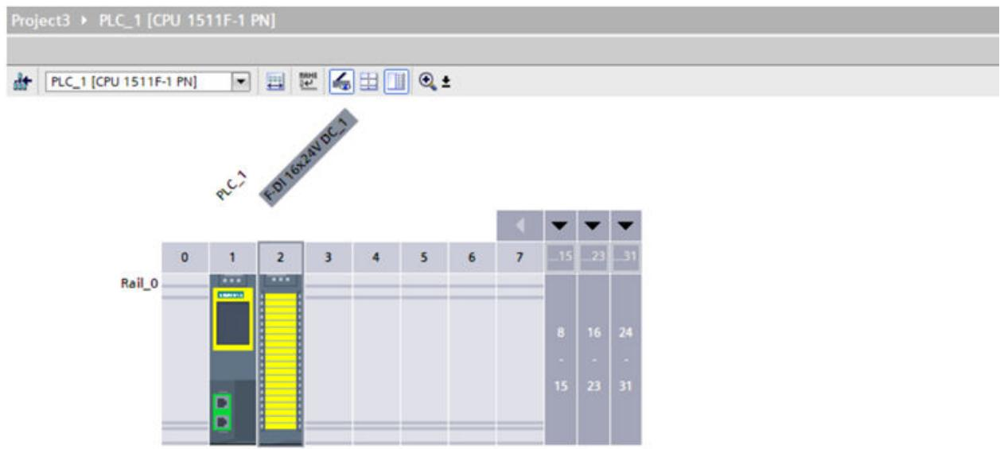
下图所示为导出的 AML 文件的结构。
连接到 TIA Portal (页 90)
打开项目 (页 140)

### 6.5.41 导入/导出供应商特定属性

• TIA Portal Openness 应用程序已连接到 TIA Portal。 请[连接到 TIA Portal](#连接到-TIA-Portal)”
• 已打开一个项目
请[打开项目](#打开项目)”
在 TIA Portal 中，您可以导出具有“Manufacturer”属性的设备和设备项的 AML 文件，以便可在双向交换情况下传递供应商特定信息。
Openness 不支持属性“Manufacturer”。它将在导出/导入期间通过“转换插件”使用。支持包含 1.0 版 AR 驱动建议文档的 AML 文件。
AML 文件应该在 TIA Portal V16 中通过 AR APC V1.1 生成（导出）。
在 AmiModel 中（由“转换插件”用户填写）已提供的情况下，“Manufacturer”属性可导出到 AML 文件。
如果供应商特定属性已在 AmiModel 中提供（由“转换插件”用户使用），则可将“Manufacturer”属性导入到 TIA Portal。
当前，仅“驱动”设备和设备项支持此属性，因为只有此类设备具有适用于 CAx 的正式“转换插件”。
连接到 TIA Portal (页 90)
打开项目 (页 140)

### 6.5.42 AML 属性与 TIA Portal Openness 属性

访问属性和导出/导入属性
通过 TIA Portal Openness，您可以访问硬件对象的属性。用于访问这些（例如，设备项）属性的单个名称与导出/导入 AML 文件中的属性名不同。
属性列表
下表概要说明了两种类型的属性：
表格 6-6 设备和 GSD/GSDML 设备的属性名称
<table><tr><td>AML 文件</td><td>TIA Portal Openness</td></tr><tr><td>Name</td><td>Name</td></tr><tr><td>Typeldentifier</td><td>Typeldentifier</td></tr><tr><td>Comment</td><td>Comment</td></tr></table>
表格 6-7 设备项的属性名称
<table><tr><td>AML 文件</td><td>TIA Portal Openness</td></tr><tr><td>Name</td><td>Name</td></tr><tr><td>TypeIdentifier</td><td>映射到&lt;TypeIdentifier&gt;子串(即,第一个“/”运算符之前的值)忽略其中的固件版本部分。映射子串仅适用于以&lt;OrderNumber:&gt;前缀开头的 TypeIdentifier,并且其固件版本部分映射到整个。</td></tr><tr><td>FirmwareVersion</td><td>映射到&lt;TypeIdentifier&gt;的子串(即,第一个“/”运算符之前的值)。映射子串仅适用于以&lt;&lt;OrderNumber:&gt;前缀开头的,,并且具有固件版本部分。</td></tr><tr><td>TypeName</td><td>TypeName</td></tr><tr><td>DeviceItemType(适用于 CPU 和头模块)</td><td>Classification</td></tr><tr><td>PositionNumber</td><td>PositionNumber</td></tr><tr><td>BuiltIn</td><td>IsBuiltIn</td></tr><tr><td>PlantDesignation IEC</td><td>PlantDesignation</td></tr><tr><td>LocationIdentifier IEC</td><td>LocationIdentifier</td></tr><tr><td>Comment</td><td>Comment</td></tr></table>
表格 6-8 GSD/GSDML 设备项的属性名称
<table><tr><td>AML 文件</td><td>TIA Portal Openness</td></tr><tr><td>Name</td><td>Name</td></tr><tr><td>TypeIdentifier</td><td>TypeIdentifier</td></tr><tr><td>TypeName</td><td>TypeName</td></tr><tr><td>DeviceItemType(适用于头模块)</td><td>Classification</td></tr><tr><td>PositionNumber</td><td>PositionNumber</td></tr><tr><td>BuiltIn</td><td>IsBuiltIn</td></tr><tr><td>Comment</td><td>Comment</td></tr><tr><td>Label</td><td>Label</td></tr></table>
表格 6-9 变量的属性名称
<table><tr><td>AML 文件</td><td>TIA Portal Openness</td></tr><tr><td>Name</td><td>Name</td></tr><tr><td>DataType</td><td>DataTypeName</td></tr><tr><td>LogicalAddress</td><td>LogicalAddress</td></tr><tr><td>Comment</td><td>Comment</td></tr></table>
表格 6-10 变量表的属性名称
<table><tr><td>AML 文件</td><td>TIA Portal Openness</td></tr><tr><td>Name</td><td>Name</td></tr><tr><td>AssignToDefault</td><td>IsDefault</td></tr></table>
表格 6-11 地址的属性名称
<table><tr><td>AML 文件</td><td>TIA Portal Openness</td></tr><tr><td>StartAddress</td><td>StartAddress</td></tr><tr><td>Length</td><td>Length</td></tr><tr><td>IoType</td><td>IoType</td></tr></table>
表格 6-12 端口的属性名称
<table><tr><td>AML 文件</td><td>TIA Portal Openness</td></tr><tr><td>Name</td><td>Name</td></tr><tr><td>TypeIdentifier</td><td>TypeIdentifier</td></tr><tr><td>FirmwareVersion</td><td>FirmwareVersion</td></tr><tr><td>TypeName</td><td>TypeName</td></tr><tr><td>PositionNumber</td><td>PositionNumber</td></tr><tr><td>BuiltIn</td><td>IsBuiltIn</td></tr><tr><td>Comment</td><td>Comment</td></tr><tr><td>Label</td><td>Label</td></tr></table>
表格 6-13 带 IO 接口的设备的属性名称
<table><tr><td>AML 文件</td><td>TIA Portal Openness</td></tr><tr><td>Name</td><td>Name</td></tr><tr><td>TypeIdentifier</td><td>TypeIdentifier</td></tr><tr><td>FirmwareVersion</td><td>FirmwareVersion</td></tr><tr><td>TypeName</td><td>TypeName</td></tr><tr><td>DeviceItemType(适用于 CPU 和头模块)</td><td>Classification</td></tr><tr><td>PositionNumber</td><td>PositionNumber</td></tr><tr><td>BuiltIn</td><td>IsBuiltIn</td></tr><tr><td>Label</td><td>Label</td></tr><tr><td>Comment</td><td>Comment</td></tr></table>
6.5 导入/导出硬件数据
表格 6-14 通道的属性名称
<table><tr><td>AML 文件</td><td>TIA Portal Openness</td></tr><tr><td>Type</td><td>Type</td></tr><tr><td>IoType</td><td>IoType</td></tr><tr><td>Number</td><td>未映射到 TIA Portal Openness 中的任何属性。</td></tr><tr><td>Length</td><td>ChannelWidth</td></tr></table>

#### 主要变化

